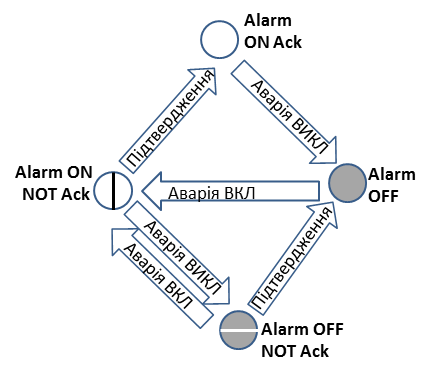
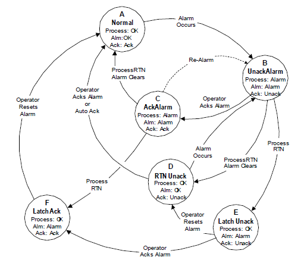

## 1.2 Базові технології каркасу

Запропоновані концепції базуються на реалізації в ПЛК об'єктної моделі обладнання, відповідно до понять ISA-88, ISA-95 та ISA-106. Кожен апаратурний об'єкт (Equipment Entity) представляє собою функціональний блок або функцію, та набір даних, що дозволяє реалізовувати обмін з верхнім рівнем. Структура даних та поведінка функції/ФБ сумісна з означеною в ISA-88, тобто базується на автоматах станів та режимах (станово-базисне керування), а також інтерфейсі, означеному в даному стандарті. Процедурні елементи та базове керування теж базується на стандартних поняттях. Тобто каркас представляє собою:

-   взаємопов'язані бібліотечні елементи, які забезпечують реалізацію базового набору модулів керування (Control Module) та ряду агрегатів (Equipment Module), незалежно від об'єкта керування,

-   а також означення механізму їх імплементації в об'єкти вищого рівня.

### 1.2.1 Станово-орієнтоване керування (state based control)

#### Поняття станів

У основі концепції каркасу лежить **парадигма керування** і створення ПЗ, що базується на поняттях **станів**. У кожен момент часу об'єкт та система керування знаходиться в певному стані, в залежності від якого може змінюватися не тільки величина сигналів керування, а і самі алгоритми. Особливо яскраво це проявляється в періодичних та дискретних виробництвах, де одне і те саме обладнання в різний момент часу працює в різних умовах та з різним типом матеріалу. Для неперервних процесів це менш типово, однак в моменти пуску, зупину, зміни обладнання (наприклад переключення насосів), нештатних ситуацій (тривоги), зміни режиму, необхідно також передбачати іншу поведінку системи і алгоритми роботи. У таких випадках, першочергово для розроблювальної програми керування означується автомат з кінцевої кількості станів (**скінчений автомат**), що включає:

-   стани та необхідні дії (або окремі алгоритми) при активності станів,

-   переходи (умови переходів) між станами.

Скінчені автомати можна описувати формулами, таблицями або діаграмами. Для практичного використання в програмуванні систем керування знайшли застосування таблиці (наприклад барабанний регулятор, DRUM-controller), спеціалізовані мови програмування (SFC, Grafcet). У текстових мовах (наприклад ST) такий автомат добре описується структурою CASE, де в якості змінної CASE є умовний номер стану (кроку). Формальних методів описів (моделей) доволі багато: мережі Петрі, скінчені автомати Мура, Мілі. Програмування на базі станів також називають станово-орієнтованим (state based), автоматним, або case-програмуванням.

Найбільш прості і зрозумілі для більшості автомати станів, які використовуються у всіх системах керування, - це режими роботи регуляторів. У даному випадку слово \"режим\" не протиставляється слову \"стан\", і розуміється як підвид стану. Враховуючи, що кожен регулятор в автоматизованих системах передбачає втручання людини, він повинен мати **автоматичний** та **ручний режим**, який означує ту сутність, яка буде змінювати значення, що йде на виконавчий механізм. Переходи між цими станами (режимами) відбуваються за команди оператору (хоча можуть проводитися і програмним шляхом). Деякі системи можуть потребувати окремого режиму ручного керування за місцем, тому в такому випадку станів (режимів) вже буде три: ручний (дистанційний, диспетчерський), автоматичний та **місцевий** (ручний за місцем). Назва режиму не має значення, але той факт, що в кожному режимі необхідно передбачити логіку (алгоритм) роботи контуру регулювання не має викликати сумнівів. Для цих трьох станів (режимів) треба означувати поведінку регулятору при суперечливих командах за місцем і дистанційному. Навіть на цьому простому прикладі, означення окремих станів (режимів) не є тривіальними і передбачає обов'язкове означення поведінки регулятору в кожному з них, що лягає на плечі проектанта (як правило не програміста). Враховуючи, що обладнання запускається і зупиняється, необхідно також передбачувати в якому зі станів (режимів) воно буде знаходитися під час пуску.

Другий, загальновживаний, приклад використання станів -- це керування тривогами. У більшості випадків кожна тривога описуються класичним набором станів:

-   нормальний (**Alarm OFF**), коли немає тривоги за даною змінною;

-   непідтверджена активна тривога (**Alarm ON not ACK**), коли тривога виникла а оператор її ще не квітував;

-   підтверджена активна тривога (**Alarm ON ACK**), коли умова активності тривоги виконується, але оператор її підтвердив (квітував)

-   непідтверджена неактивна тривога (**Alarm OFF not ACK**), коли умова активації тривоги вже не виконується, але оператор ще не зробив квітування.

Означення самих станів (їх може бути більше або менше) потребується для того, щоб забезпечити правильні дії. Так, наприклад, аварійна сирена (оповіщувач) може бути увімкненою до тих пір, поки оператор не зробив квітування, навіть якщо умова активності тривоги не виконується. Світлова сигналізація у свою чергу може миготіти для непідтверджених тривог, та горіти постійно для активних підтверджених.

{width="2.899760498687664in" height="2.493127734033246in"} {width="3.0387707786526685in" height="2.598713910761155in"}

рис.1.1. Приклад означення поведінки тривоги в автоматі станів.

Слід зазначити, що описані вище приклади стосуються усіх типів процесів та виробництв. Для періодичних процесів необхідність в означенні станів ще більш очевидна, бо одне і те саме обладнання в кожен момент часу має робити різні керівні діяльності, наприклад наповнення апарату, дозування інгредієнтів, нагрівання, мийка, тощо. Ці періоди роботи, які характеризуються одним набором діяльностей зручно відокремлювати в окремий стан (крок, етап), при активності якого активуються ті чи інші алгоритми керування. Цей механізм є одним із фундаментальним в стандарті ISA-88 (Batch Control).

Таким чином, кожен об'єкт (обладнання, програма, регулятор тощо) характеризується певним станом, в залежності від якого система керування виконує той чи інший алгоритм. Дуже важливим є розуміння того, що один і той самий об'єкт характеризується *набором* станів з точки зору різних аспектів. Так, наприклад, запірний клапан може характеризуватися наступними наборами станів і підстанів:

-   положення: відкритий, закритий, відкривається, закривається, невизначений;

-   тривоги (кожна тривога описується своїм автоматом станів тривог): не закрився, не відкрився, довільний зсув, помилка датчиків положення;

-   блокування: заблокований, незаблокований;

-   режим роботи: ручний, автоматичний, місцевий.

Ці набори (автомати станів) можуть бути взаємопов'язані і впливати один на одного. Наприклад, одна з тривог може привести до блокування клапана, тобто переводу в спеціально означений стан \"заблокований\". У цьому стані вихід на керування клапаном буде відключеним, і при цьому режим буде насильно триматися в ручному, поки не буде відправлена команда на розблокування. Однак, в той же час, положення буде вказувати на дійсне положення клапану згідно датчиків кінцевого положення та команд керування.

Хоч наведені вище приклади є досить типовими, набори станів і алгоритми поведінки можуть значно відрізнятися в залежності від об'єкту. Каркас не передбачає обов'язковість цих станів і не обмежує їх набір. Тим не менше, наведені нижче структури опираються на певні існуючі варіанти реалізації, які за необхідності можуть бути змінені. Обов'язковою основою каркасу є використання принципів програмування на базі станів.

**Важливо!** Слід обережно використовувати автомати станів та передбачати механізми «зависання», коли програма не може вийти із певного стану за причини неможливості спрацювання умови переходу. Це може бути наприклад команда на примусову ініціалізацію автомату. Крім того, найбільш критичні умови блокування (спрацювання алгоритмів безпеки) краще робити в окремій частині програми з найбільшим пріоритетом (наприклад в кінці задачі ПЛК) і без використання автомату станів.

#### Поняття режимів

Слова \"Режим\" і \"Стан\" у конкретному випадку можуть означувати різні особливості діяльності. З одного боку, вони обидва описуються автоматом станів. Однак \"Стан\" як правило вказує на плинну ситуацію, а \"Режим\" -- на особливості поведінки алгоритмів керування. Тому \"ручний/автомат\" та \"заблоковано/незаблоковано\" прийнято називати режимами, так як вони означують особливості керування. У ручному режимі команди на клапан відправляє оператор. У заблокованому режимі на клапан завжди подається команда закриття (в деяких випадках відкриття). Наявність таких двох \"автоматів режимів\" (це словосполучення також є автоматом станів, але слово \"стан\" не використовується, щоб протиставити режими станам), теж потребує їх узгодження, бо їх дії конфліктують між собою. Тому необхідно означити пріоритети, наприклад дії в режимі \"заблоковано\" мають вищий пріоритет ніж в режимі \"ручний\".

Режими і стани, що означені в системі керування для різних об'єктів теж як правило взаємодіють між собою. Так, наприклад, для усієї установки можуть бути означені режими: ручний, автоматичний та налагоджувальний. При цьому зміна режиму в \"налагоджувальний\" може змінювати пріоритет режимів \"ручний/автомат\" та \"заблоковано/незаблоковано\".

Для означення набору станів в програмі користувача потребуються стільки змінних, скільки автоматів станів. Для прикладу з дискретним клапаном треба змінні:

-   положення: (5 значень);

-   тривоги (кожна тривога описується своїм автоматом станів тривог, тому потребується окрема змінна): не закрився (4 значення), не відкрився (4 значення), довільний зсув(4 значення), помилка датчиків положення (4 значення);

-   блокування (2 значення): заблокований, незаблокований;

-   режим роботи (3 значення): ручний, автоматичний, місцевий

Враховуючи що системи керування передбачають наявність SCADA/HMI, стани кожної з наведених тривог в програмі користувача ПЛК можна означити тільки двома значеннями (активна тривога або ні). Навіть при такій постановці, кількість змінних є дуже великою, а значень станів при цьому досить небагато (часто 2). Тому є сенс \"упаковувати\" їх в одне слово статусу, біти якого будуть представляти стан/режим певного автомату. Такий підхід використовується, наприклад, при керуванні перетворювачами частоти та севроприводами по мережі (IEC 61800-7: профілі PROFIDRIVE, CIA402, CIP Motion, SERCOS). У даному каркасі усі біти станів об'єктів пакуються в одну змінну (поле структури) з назвою STA. Приклад такого упакування показаний нижче.

#### Поняття команд

Поведінка автоматів для станів та режимів залежить від об'єкту керування, логіки алгоритму керування та **команд** оператору чи суміжної системи. Враховуючи, що команд може бути багато, зручно використовувати слово команди, числове значення якого буде вказувати на необхідну дію. Обробник команд може не реагувати на ті команди, які недоступні в даному стані/режимі.

#### Поширювання режимів/станів

В ієрархічних та розподілених системах керування певні сутності (обладнання, процедури) залежать одна від одної. Це передбачає взаємозалежність станів та режимів. У багатьох випадках ця залежність може бути означена і в автоматах станів. Наприклад, переведення установки в ручний режим, може привести до переведення в ручний кожного виконавчого механізму установки. Або стан \"пауза\" загальної процедури керування всією установкою може привести до такого самого стану всіх етапів.

### 1.2.2. Поняття обладнання (устаткування, Equipment) згідно стандартів ISA-88, ISA-95 та ISA-106

#### Ієрархія обладнання

Згідно стандартів ISA-88, ISA-95, ISA-106 та їх аналогів IEC для опису діяльностей підприємства використовуються декілька типів виробничих моделей. Активний стан, виробничі можливості, вимоги до виготовлення продукту та інших операційних діяльностей усього підприємства або його частин проводиться через фізичну модель **обладнання** (**Equipment**, устаткування). Ця модель показує наявне на підприємстві обладнання з точки зору його рольового призначення у певній операційній діяльності, наприклад виготовлення продукції. Обладнання верхніх двох шарів ієрархічної моделі використовуються для операційної діяльності на організаційно-економічному рівні керування (рис.1.2). На обладнанні згрупованому в **дільниці** виготовляється певний вид продукції. **Робочі центри** забезпечують певний вид діяльності переробки сировини (умовно) в напівфабрикат (умовно). Саме робочі центри є \"датчиками\" і \"виконавчими механізмами\" для рівня MES/MOM і в той же час системою керування для рівня АСКТП. Тому вони знаходяться в області діяльності як ISA-95 так і інших стандартів та кращих практик області АСКТП. Контролери та SCADA знаходяться в зоні діяльності починаючи з цього рівня -- вниз. Для безшовної інтеграції з рівнем MES/MOM та використання кращих практик, викладених в ISA-88 та ISA-106 при автоматизації різних типів процесів, каркас розроблений на базі моделі обладнання цих стандартів.

Принцип організації технологічних процесів впливає і на способи керування ними. Для періодичних процесів зі змінною рецептурою принципи керування означені стандартом ISA-88, в якому робочі центри є **технологічними комірками**, які виготовляють (напів-)продукт невеликими **партіями** (**batch**). У стандарті передбачено, що уся послідовність дій з сировиною означується рецептурою, яка може змінюватися операційним персоналом без зміни програми керування в АСКТП. Ці дії (процедури) відбуваються в **апаратах** періодичної дії (**Unit**), які можуть об'єднувати навколо себе **агрегати** (**Equipment Module**) та **модулі керування** (**Control Module**).

{width="6.933957786526684in" height="6.208333333333333in"}

Модель для неперервних та дискретних процесів включає дещо інші типи обладнання. Однак в даному каркасі буде використовуватися ієрархія, що дана в ISA-88, як найбільш пророблена і апробована. Для кращого розуміння ідей використаний в каркасі рекомендується ознайомитися зі стандартом ISA-88 або його аналогом IEC 61512. Нижче будуть дані тільки деякі основні положення.

Слід наголосити, що в даній моделі обладнання розглядається саме с позиції рольового призначення. Тобто, насос в даній ієрархії розглядається як будь яке обладнання, що виконує функцію перекачування в конкретному місці розташування технологічного процесу. Тобто це те обладнання, яке на апаратурно-технологічній схемі або схемі автоматизації має своє умовне позначення. Якщо конкретний насос при певних обставинах змінюється на обладнання, наприклад іншого виробника, що виконує ту саму роль, то з точки зору даної моделі, це буде той самий насос. Для того щоб враховувати конкретні екземпляри обладнання (зі своїм серійним номером) в ISA-95 передбачена інша модель -- **активів** (**Asset**). У каркасі наразі не використовується модель активів, так як це потребує виділення значного обсягу пам'яті пристрою. Тим не менше, при реалізації розподіленого керування з використанням каркасу, для означення активу може бути виділений окремий об'єкт.

#### Технологічна комірка

***Технологічна комірка*** (Process cell), що описана в стандарті ISA-88 відповідає робочому центру (Work Center) означеному в IEC/ISO 62264 та ANSI/ISA 95 (див.рис.1.2). У той час, як робочий центр може бути означений для різних типів виробництв, технологічна комірка означена тільки в термінах періодичної обробки, що характерно для стандарту ISA-88. Технологічна комірка представляє собою логічне угруповання, яке вміщує обладнання, що необхідне для виробництва однієї або декількох партій (напів)продукту. Вона означує діапазон логічного керування одним набором технологічного обладнання в межах дільниці.

Наявність технологічної комірки дає можливість планувати на основі неї виробництво і розробити стратегію керування усім процесом. Технологічна комірка включає апарати (units), агрегати (equipment modules) та модулі керування (control modules) що потрібні для створення однієї або більше партій. Ідея ISA-88 передбачає, що для технологічної комірки існує **рецепт** (**recipe**), в якому вказується що саме і з використанням якого саме обладнання буде робитися в межах неї. Цей рецепт означується технологами і включає **процедуру** приготування для партії (напів)продукту (**procedure**) та додаткові параметри. Процедура технологічної комірки у свою чергу ділиться на менші **процедури апарату** (**unit procedure**), які можуть ділитися на **етапи** (**phase**) таким чином формуючи так звану \"**технологічну програму**\" приготування.

#### Апарат періодичної дії

***Апарат періодичної дії***, або просто ***Апарат*** (***Unit***) складається з агрегатів та модулів керування. Модулі керування та агрегати, які входять до апарату можуть бути налаштовані як його частина або можуть тимчасово ним заволодіватися (**allocation**) для виконання конкретних завдань.

У апараті можуть бути проведені один або декілька основних процесів таких як хімічна реакція, кристалізація і розчинення. Як незалежне угруповання, він поєднує в собі все необхідне обладнання для фізичної обробки та керування, що потребується для виконання цих дій. Апарат, як правило, зосереджений на основній частині технологічного обладнання, такого як змішувальна ємність, або реактор. Фізично він включає в себе, або може заволодівати послугами всього логічно-пов\'язаного обладнання, необхідного для завершення основних процесів обробки в ньому. Апарати працюють відносно незалежно один від одного.

Нагадаємо, що апарат, який описаний в стандарті ISA-88, відповідає типу робочого апарату (Work Unit), означеного в IEC/ISO62264 та ANSI/ISA 95. В ISA-95 є чотири типи робочих апаратів: апарати періодичної дії, апарати неперервної дії, дискретні робочі комірки (work cell) та апарати зберігання (storage unit). Унікальність апарату періодичної дії є в тому, що він не може обробляти одночасно декілька партій.

Апарат періодичної дії як правило містить всю партію матеріалу (весь обсяг) або працює в деякому місці послідовності обробки цієї партії. Тим не менше, в деяких випадках він може містити або працювати тільки з частиною партії (частиною обсягу).

Зазвичай, в один момент часу апарат періодичної дії містить тільки одну партію, і в цих випадках фізичний поділ між партіями є звичайним явищем. Величина партії при цьому визначається економічними вимогами і фізичними обмеженнями апарату. Однак, у деяких процесах поділ відповідно до апарату є не таким очевидним, і використовується логічна межа між окремими партіями. Така ситуація часто зустрічається в гібридних процесах, що складаються з періодичних та неперервних процесів. У гібридних процесах в рамках технологічної комірки використовуються обидва типи технологічного обладнання: апаратів періодичної та неперервної дії. У апаратах неперервної дії процес є загальним для двох або більше партій які знаходяться в межах апарату в один момент часу.

Робочий апарат може бути спеціалізованим для різних типів виробництв і функцій. У технологічній комірці періодичної дії може навіть знадобитися більш ніж один тип робочого апарату, таких як апарати зберігання або апарат неперервної дії. Якщо спеціально не вказано інше, робочий апарат, згаданий далі в якості «апарату» є апаратом періодичної дії і не відноситься до інших видів роботи робочих апаратів, зазначених у IEC/ISO 62264 та ANSI/ISA 95.

З точки зору \"технологічної програми\", закладеної в рецепті, процедура апарату повинна починатися і закінчуватися в тому самому апараті. Таким чином, поділ на процедури апарату визначається можливостями усіх апаратів, які доступні в технологічній комірці.

#### Агрегат

***Агрегат*** (***Equipment module***) може виконувати кінцеву кількість конкретних незначних технологічних діяльностей, таких як, наприклад, дозування і зважування. Він поєднує в собі все необхідне обладнання для проведення фізичних процесів та обладнання для керування, необхідного для виконання цієї діяльності. Агрегат, як правило, зосереджений на частині технологічного обладнання, такого як насосний агрегат. Функціонально, сфера дії агрегату означується кінцевими задачами, для яких він створений. З точки зору керування періодичними процесами, агрегат може виконувати мінімальну технологічну дію, яка задається в рецепті, тобто етапом.

Фізично агрегат може бути складений з модулів керування і ***підпорядкованих агрегатів*** (subordinate equipment modules). З точки зору ієрархії обладнання, агрегат може бути частиною апарату або автономним угрупованням обладнання всередині технологічної комірки. Якщо угруповання обладнання проектується як автономне, а не в складі якогось апарату, то воно може бути доступне тільки в зв'язці з якимось одним обладнанням, або з декількома, тобто з використанням різних наборів обладнання. Наприклад, насосний агрегат, що забезпечує подачу речовини з декількох ємностей на фасування може вважатися ***спільним*** (***common***) ресурсом, так як почергово задіюється в керуванні різними танками. Спільні агрегати можуть займатися для використання одночасно тільки одною технологічною програмою (ресурс з ексклюзивним використанням) або декількома (ресурс із колективним користуванням).

Агрегат -- це найнижчий рівень обладнання, які \"видимі\" для рецептурного керування.

#### Агрегат чи апарат

Якщо обладнання виконує якусь технологічну дію над сировиною, але робить це не над всією партією одночасно, то це є агрегатом. Так, наприклад, теплообмінники або змішувачі в потоці не є апаратами, однак їх можна віднести до агрегатів.

#### Модуль керування (Control Module)

***Модуль керування*** (***Control module,*** **CM)**, як правило, - це набір датчиків, виконавчих механізмів, інших модулів керування і зв'язаного з ними технологічного обладнання, що, з точки зору керування, працює як єдине ціле. Модуль керування також може бути складений з інших модулів керування. Наприклад, модуль керування колектором подачі речовини може бути означений як сукупність декількох модулів керування дискретними клапанами (виконавчі механізми + датчики). Модулі керування можуть бути частиною агрегату або безпосередньо підпорядкованими апарату чи технологічній комірці. Фізична модель не передбачає, що модуль керування може одночасно безпосередньо входити в апарат і бути частиною агрегату. Якщо одиничний модуль керування є безпосередньою частиною апарату, тоді він не може бути частиною жодного агрегату.

Деякі приклади модулів керування:

-   регулюючий пристрій що керується уставкою, який складається з передавача, регулятора, і регулюючого клапану;

-   орієнтований на стан пристрій, що керується уставкою, який складається з автоматичного запірного клапана (on/off) з встановленими на ньому кінцевими вимикачами за положенням;

-   модуль керування колектором, що містить блок з кількох автоматичних запірних клапанів (on/off) і координує подачу на один або декілька напрямків, в залежності від уставки спрямованої на модуль;

-   модуль керування витратою, що регулює витрату речовини в кільцевому колекторі системи живлення, яка може бути частиною технологічної комірки і не бути частиною якого-небудь апарату.

У новій версії стандарту ISA-88.00.01-2010 є дві моделі обладнання: фізична і об'єктна. Об\'єктна модель передбачає, що обладнання (Equipment Entity) включає в себе також функції керування, навіть якщо вони є частиною програми керуючого пристрою (наприклад контролеру), а не фізичного обладнання. У контексті даного каркасу обладнання завжди представляється саме з цієї позиції.

З точки зору ISA-88 модулі обладнання виконують базові функції керування (Basic Control).

### 1.2.3 Основи керування періодичними виробництвами згідно ISA-88

Даний каркас розроблявся з урахуванням реалізації складних алгоритмів керування періодичними процесами. Порівняно з неперервним виробництвом, періодичне значно обмежене в часі (години, доби) від моменту пуску до завершення, оскільки вся продукція разом проходить послідовні стадії обробки (нерідко в одному апараті). Крім того, кількість продукції (і відповідно сировини) обмежена величиною партії, яка як правило залежить від ємності обладнання, в якій вона готується. Для виготовлення однієї й тієї ж партії може використовуватися різне обладнання, що потребує планування використання цього типу ресурсу.

Порівняно з дискретним виробництвом, сировина не може ідентифікуватися однозначно, оскільки з однієї й тієї ж ємності з сировиною може виготовлятися декілька різних партій та навіть типів продуктів. Тобто сировина може ідентифікуватися в межах партій, але тільки логічним визначенням.

Серед наведених вище типів виробництв періодичне є найбільш гнучким, але потребує більш складних алгоритмів керування. На рис.1.3 показаний один з варіантів реалізації обладнання періодичного виробництва. Одна виробнича площадка може мати багато однотипного обладнання, що здатна виконувати певний набір технологічних операцій. Якщо цей набір задовольняє параметрам означеним для продукту в рецепті, то це обладнання може використовуватися для його приготування. Однак для кожного продукту означений свій перелік послідовностей операцій, тобто своя «технологічна програма». Найбільш гнучким і ефективним буде використання такого способу керування цим обладнанням, коли будь який продукт може вироблятися на будь якому обладнанні, яке здатне виконувати технологічні операції.

{width="7.31875in" height="3.5548611111111112in"}

Для неперервних виробництв технологія визначається ще перед проектуванням обладнання і принципово не змінюється протягом життєвого циклу роботи системи. Звичайно, в певній мірі можуть змінюватися параметри технологічного процесу, зокрема при зміні параметрів сировини чи вимог до якості продукції. Для такої ситуації достатньо, щоб в системі керування для однієї і тієї самої програми змінювалися завдання або певні коефіцієнти. Однак в періодичному виробництві, одне і те саме обладнання може використовуватися для приготування різних продуктів. Тому при проектуванні обладнання визначаються певним набором технологічний операцій та праматерів їх виконання, а при розробці технології продукту оперують саме цими операціями та їх послідовностями виконання. Тобто принциповою відмінністю для періодичних виробництв є необхідність в означенні цієї послідовності а не тільки значень параметрів.

Нижче наведемо основні вимоги до системи керування періодичними процесами та виробництвом в комплексі.

1.  Система керування повинна передбачати можливість створення та модифікації означення продукту (не тільки параметрів а і послідовності обробки) без втручання в програмне та технічне забезпечення, тобто без її зміни. Модифікація послідовності обробки повинна бути доступна як перед запуском виробництва продукту, так і під час його вироблення.

2.  Система керування повинна передбачати використання одного і того самого обладнання для приготування будь якого продукту, технологічні операції якого здатне виконувати це обладнання.

3.  У означенні продукту повинна міститися також логіка обробки технологічної (тобто не пов'язаної з помилками роботи обладнання) нештатної ситуації. Наприклад, якщо величина pH речовини протягом заданого часу не дійшла до заданого значення, включається технологічна програма додаткової обробки.

4.  Система керування повинна передбачати можливість виконання як автоматичних так ручних операцій, передбачених в означенні продукту. Наприклад, система повинна очікувати внесення закваски в танк з молоком, з підтвердженням оператором даної операції.

5.  Система керування повинна передбачати ручне введення значень вимірювань, наприклад результатів лабораторних аналізів.

6.  Система керування повинна давати можливість використання спільних ресурсів для різних апаратурних послідовностей. Наприклад один і той же насос може використовуватися для різних груп танків і при цьому для різних продуктів.

7.  Система керування повинна давати можливість розробляти план-графіки для вироблення продукту з урахуванням специфіки обладнання.

8.  Система керування повинна давати можливість відстеження історії приготування конкретної партії продукту, формування звітів по партіям.

9.  Система керування повинна передбачати її інтегрування з верхнім рівнем ієрархії.

Таким чином класичний підхід побудови систем керування, при якому вся логіка технологічного процесу жорстко задається в ПЛК (PLC) чи вузлі DCS для керування періодичним виробництвом не підходить. Для керування такими процесами визначені стандарти групи ISA-88 та їхні аналоги МЕК.

Каркасом передбачено ряд об'єктів та ідеологія побудови програм відповідно до вимог реалізації процедурного керування згідно ISA-88. Деякі пояснення щодо цих ідей наведені в додатку A даного посібника.

### 1.2.4 Ієрархія обладнання рівня CM

#### Ієрархія CM

ISA-88 та ISA-95 дозволяє включати модулі керування (CM) в інші модулі керування. У каркасі, незалежно від типу технологічного процесу, яким керує АСКТП, на рівні модулів керування (Control Module) пропонується виділяти типові апаратурні об'єкти 3-х рівнів або шарів (див. рис.1.4):

-   0-й (LVL0) канали контролеру - для діагностики каналу, прив'язки логічних каналів до фізичних, форсування входів/виходів:

    -   DICH - дискретні входи,

    -   DOCH - дискретні виходи,

    -   AICH - аналогові входи,

    -   AOCH - аналогові виходи,

    -   COMCH -- комунікаційні канали

-   1-й (LVL1) - технологічні змінні для повної обробки інформації з процесу, включаючи прив'язку до каналу, фільтрацію, масштабування, інверсію і т.п.; для зручності відлагодження процесу; для функцій імітаційного моделювання; для функцій технологічної сигналізації;

    -   AIVAR - аналогові вхідні,

    -   AOVAR - аналогові вихідні,

    -   DIVAR - дискретні вхідні,

    -   DOVAR - дискретні вихідні:

-   2-й (LVL2) - для зручності налагоджування процесу; для функцій імітаційного моделювання; для функцій технологічної сигналізації; для ведення статистики:

    -   виконавчі механізми (запірні клапани, регулюючі клапани, двигуни, насоси);

    -   контури регулювання та управління: для функцій керування зі зворотним зв'язком;

{width="6.925694444444445in" height="4.468055555555556in"}

Рис.1.4. Ієрархія CM.

Усі наведені вище елементи з точки зору ISA-88 є Модулями керування (CM, Control Module), а з точки зору ISA-106 -- Пристроями (Device). Для уніфікації назв ми користуємося термінологією ISA-88, як діючою на сьогоднішній день. Усі CM-ми формують трирівневу ієрархію, що дозволяється стандартом ISA-88.

Трирівнева архітектура передбачає модель взаємодії між рівнями:

-   обробка усіх елементів незалежно від рівня проводиться паралельно, тобто вкладеності виклику POU немає, модель підлеглості реалізовується через механізм заволодівання (Allocation), або звичайними програмними зв'язками;

-   2-й рівень (виконавчий механізм, регулятор) не може взаємодіяти безпосередньо з 0-м (каналом);

-   усі елементи вищого рівня можуть взаємодіяти з будь-якими елементами нижчих, за винятком 0-го рівня (див. попередній пункт)

-   вищий рівень може змінювати стан нижчого: змінювати його значення, переключати в різні режими (форсування, імітація), змінювати налаштування тривог і т.д.

-   елемент 1-го рівня (змінні) може заволодіти (allocation) елементом першого (канали)

-   0-й рівень (канал) знає хто ним володіє

-   1-й рівень (змінна) знає ким він володіє

-   при реалізації об'єктів на різних пристроях (в розподілених системах) механізм взаємодії між ними відбувається через пару СТАН-КОМАНДА (механізм описаний нижче) а при реалізації в тому ж пристрої дозволяється використовувати як безпосередню зміну значення у підлеглого об'єкту (прямий доступ), так і через взаємодію СТАН-КОМАНДА.

#### Канали (LVL0) та карта ПЛК

Найнижчий рівень модулів керування (**канали**) забезпечує абстрагування від обладнання. Тобто реалізація цього рівня залежить як від вибраної платформи так і способу реалізації. Елементи CM типу «канали» представляють масиви усіх існуючих каналів контролеру, незалежно від їх розташування (локальне шасі, віддалений ввод/вивід) і задіяння (використання) в процесі. Кожен елемент масиву ідентифікується за унікальним номером, а прив'язка до фізичного каналу відбувається жорстко на програмному рівні. CM-ми типу «канал» прив'язують свої значення до фізичного значення конкретного каналу, а також виконують наступні функції:

-   надають діагностичну інформаціє вищим рівням CM -- як мінімум ознаку достовірності, а за можливості і причину відмови/несправності каналу;

-   передбачають режим форсування значення:

    -   примусова зміна значення вхідного каналу, незалежно від значення входу;

    -   примусова зміна значення вихідного каналу, незалежно від значення, що передається на нього змінною;

-   показують факт прив'язки до каналу технологічної змінної та номер змінної;

На рис.1.5-1.7 показані приклади дисплейних кадрів з реалізацією вказаних функцій на різних платформах з різними ресурсними обмеженнями. Такі мнемосхеми надалі в каркасі звуться **картою ПЛК**. Символом «+» відмічені задіяні в ПЛК канали. Інформація по кожному каналу доступна по натисканню на ньому. На карті ПЛК доступні функції відображення прив'язаного каналу, ознака достовірності, команди форсування. У випадку апаратної помилки канал підсвічується червоним. У реалізаціях з дуже обмеженими можливостями можливо відмовитися від певних функцій, якщо це значно ускладнює систему або вимагає задіювання надмірно великої частини ресурсів (див. приклад рис.1.7).

{width="7.2223359580052495in" height="3.941861329833771in"}

Рис.1.5 Приклад використання функцій каналів на HMI (варіант з достатніми ресурсами Simatic Comfort Panel: TIA).

{width="6.922415791776028in" height="4.825581802274716in"}

Рис.1.6 Приклад використання функцій каналів на HMI (варіант з середніми ресурсами Magelis: VijeoDesigner).

{width="6.925694444444445in" height="4.142361111111111in"}

Рис.1.7 Приклад використання функцій каналів на HMI (варіант з обмеженими ресурсами Simatic Basic Panel TIA).

#### Технологічні змінні (LVL1) та карта змінних

СМ-ми першого рівня, типу **технологічні змінні** можуть бути прив'язані до каналу того ж типу (наприклад дискретний вхід до дискретної вхідної технологічної змінної) по їх номеру. Таким чином прив'язка технологічної змінної до каналу є динамічною, що дозволяє змінювати розташування фізичного підключення конкретного датчика/ВМ у випадку виходу з ладу частини системи. Крім того, таке переключення може бути програмним.

Технологічні змінні знаходяться вище за канали по ієрархії керування. Уся діагностична інформація передається від каналів до змінних. Реалізація цього рівня не залежить від апаратних особливостей контролера, так як усі платформо-залежні тонкощі реалізується на рівні каналів, інтерфейс яких є стандартизованим в каркасі. Технологічні змінні забезпечують наступну функціональність:

-   прив'язка до каналу за його номером та типом

-   відключення з обслуговування (деактивація тривог змінної, врахування верхніми рівнями)

-   відслідковування достовірності значення за помилкою прив'язаного каналу, виходу за діапазон вимірювальної величини, тощо;

-   діагностика роботи каналу (передача діагностичної інформації з прив'язаного

каналу на верхній рівень)

-   обробка вхідного/вихідного значення: масштабування (в т.ч. за необхідністю кусочно-лінійна інтерполяція), фільтрування, інвертування (для дискретних змінних);

-   наявність режиму ручної зміни (форсування); відповідно до ISA-88 - «ручний режим»

-   наявність режиму імітації, в якому для вхідних змінних, значення змінюється CM-мами верхнього рівня (або незалежною програмою), а для вихідних змінних, відбувається замороження значень вихідних каналів

-   обробка тривог (ISA 18.2): реагування на порогові значення, врахування затримки на спрацювання (за необхідності межі задаються окремими уставками), гістерезис, формування загального системного біту аварії/попередження, нова тривога (на один цикл);

-   конфігурування обробки тривог (ISA 18.2): налаштування значень тривог, типів тривог (аварія/попередження/відмова каналу), тимчасове зняття тривоги з обслуговування;

Приклад діагностики та конфігурування аналогових змінних на HMI показаний на рис.1.7 та рис.1.8. Вікна де наводяться перелік всіх технологічних змінних в каркасі називається **картою технологічних змінних**.

{width="7.2209295713035875in" height="3.753464566929134in"}

Рис.1.7 Приклад використання функцій аналогових вхідних змінних на HMI.

{width="6.925694444444445in" height="3.0972222222222223in"}

Рис.1.8 Приклад використання функцій аналогових вихідних змінних на HMI.

Статуси змінних (тривоги, відмови, форсування) супроводжують відображення змінної на всіх мнемосхемах HMI. На рис.1.9 показаний приклад відображення попередження для змінної PT102 для панелі з обмеженою функціональністю (Simatic Basic Panel).

{width="3.32in" height="2.6957917760279964in"}

Рис.1.9 Приклад відображення статусу змінної HMI.

Окремо виділяються технологічні змінні, які:

-   мережні - мають джерело даних на інших вузлах (мережні), адреса якого не може змінюватися в процесі експлуатації

-   розрахункові (внутрішні) - розраховуються на базі кількох інших змінних або каналів

Передбачається, що ці змінні будуть входити як підкласи в AIVAR, AOVAR, DIVAR, DOVAR. У функціях обробки необхідно передбачити особливість обробки цих змінних відповідно до номеру класу (CLSID) або за ID. Для зручності область ідентифікаторів (ID) для змінних також варто виділити окремо.

#### Модулі керування, контури, ВМ (LVL2)

CM-ми 2-го рівня представляють собою виконавчі механізми, регулятори, тощо та включають в себе функції базового керування (згідно термінології ISA-88). Кожний такий CM передбачає двохсторонню взаємодію з «технологічними змінними» як для запису так і для читання. Це дозволяє на даному рівні окрім реалізації специфічного функціоналу для конкретного CM, забезпечувати наступні можливості:

-   враховувати стан технологічної змінної (норма/тривога/достовірність) та діагностичну інформацію при керуванні логікою виконання CM;

-   імітацію роботи CM за допомогою включеного в нього моделюючого алгоритму (за необхідністю) для:

    -   розширеної моделеорієнтованої діагностики процесу;

    -   моделеорієнтованого керування;

    -   роботи в імітаційному режимі для демонстрації/навчання персоналу або налагодження системи;

```{=html}
<!-- -->
```
-   включення в режим імітації CM та всіх пов'язаних з ним CM нижчого рівня;

-   статистичну інформацію (в залежності від типу СМ)

Для кожного апаратурного об'єкту (Equipment Entity) визначається алгоритм роботи функціонального блоку/функції, структури даних (інтерфейс) для обміну з іншими підсистемами/об\'єктами.

Структура даних та поведінка функції/ФБ сумісна з означеною в ISA-88, тобто базується на автоматах станів, режимах та інтерфейсі, означеному в стандарті.

На рис.1.10 показаний приклад конфігурування та діагностики роботи кранів.

{width="4.139535214348206in" height="3.2558136482939632in"}

Рис.1.10 Приклад конфігурування кранів на HMI.

### 1.2.5. Рівень SCADA/HMI 

#### Загальні принципи розробки SCADA/HMI

Каркас передбачає використання певних правил і на рівні SCADA/HMI. Імплементація каркасу для платформ з різними функціональними можливостями показала здатність масштабування та адаптації каркасу для обладнання та ПЗ з різними можливостями. У будь якому випадку концепція вимагає передачі великої кількості даних, що значно здорожує систему у випадку ліцензування SCADA/HMI по кількості тегів вводу/виводу. Для зменшення навантаження на мережу та економії тегів вводу/виводу прийняті наступні принципи:

-   розділення розміщення даних реального часу від конфігураційних даних;

-   пакування бітів в слова, відмова від бітових (булевих) структур;

-   використання буферу для конфігурування однотипних об'єктів

Більш детально наведені принципи описані нижче. Хоч каркас не обмежує використання HMI у цих та всіх інших аспектах, ми рекомендуємо використовувати методики описані в стандартах ISA18.2 та ISA101.

#### Принципи використання буферного обміну

Окрім даних реального часу (RT DATA - значення змінних, статуси) з кожним CM пов'язана велика кількість конфігураційних даних (CFG DATA), які потрібно передавати в/зі SCADA/HMI тільки за необхідністю. Більшість SCADA/HMI ліцензуються за кількістю точок вводу/виводу. Тому для зменшення великої кількості конфігураційних даних що циркулюють між SCADA/HMI та контролером пропонується використовувати **буфер**. Для кожного масиву (набору) однотипних CM рекомендується використовувати свій буфер. Окремі буфери можна застосовувати для всіх об'єктів рівня. Тобто, наприклад, для усіх каналів (LVL0), змінних (LVL1) кранів (LVL2) можна виділити окремі буфери. Кожен CM має унікальний в межах набору ідентифікатор (може використовуватися унікальне поєднання ID та ідентифікатору класу CLSID), за яким можна його зв'язати з буфером (див. рис.1.11). Отримуючи команду на читання (READ\_CFG), CM завантажує свої дані в буфер та пов\'язується з ним (займає/оволодіває ним). Дані реального часу (RT DATA) постійно оновлюються буфері, за цим слідкує реалізація CM в контролері. Це можуть бути не тільки видимі RT DATA, а додаткові відлагоджувальні дані (номер кроку, час кроку, значення інтеграла і т.п.). Конфігураційні дані оновлюються в буфері тільки по команді на читання. Це зроблено для того, щоб оператор міг змінити ці значення в буфері і записати їх в CM за командою (WRITE\_CFG).

{width="5.625in" height="3.9989227909011373in"}

Рис.1.11 Приклад конфігурування кранів на HMI.

Не дивлячись на значну економію ресурсів, використання буферу супроводжується рядом обмежень. Найбільш суттєвим обмеженням є неможливість використання буферу з 2-х та більше засобів ЛМІ. При одночасному використанні, буфер \"відбирається\" останнім користувачем. Також в каркасі наразі не пророблений механізм блокування буферу, для унеможливлювання його одночасного використання. Вирішенням може бути використання кількох буферів - для кожного клієнта окрема змінна.

Інший можливий спосіб конфігурування через буфер -- використання принципів REST(*Representational State Transfer*). Буфер не займається об'єктом, а передається окремою змінною. При запиті на читання від клієнта (SCADA/HMI або іншої підсистеми), заповнення відбувається аналогічно до попереднього способу. В змінній буфера передається уся заповнена структура, по ID і CLSID визначається об'єкт, дані про який передаються. Значення з буферу після читання записується у внутрішню змінну клієнта, після чого сеанс завершується. Навіть при одночасному зверненні, клієнт зможе проконтролювати результат запиту на читання. Аналогічно проводиться запис: спочатку проводяться зміни в локальній змінній-буфері клієнта, після чого вміст змінної копіюється в буфер ПЛК. На відміну від механізму займання буферу, оновлення змінних в буфері клієнта може відбуватися тільки постійним формування запиту на читання. Крім того, деякі засоби SCADA/HMI мають обмеження на пере-присвоєння та збереження цілісності структури буферу, що унеможливлює використання такого підходу. Однак такий підхід є кращим при реалізації рішень IIoT з використанням каркасу, так як не передбачає постійний обмін між хмарою (Cloud) та пристроєм за місцем (ПЛК, Edge).

Іншим недоліком обміну конфігураційними даними через буфер є відмова від табличних виглядів карт ПЛК та технологічних змінних. На практиці є рішення, які дозволяють обійти це обмеження, але цей варіант вимагає значних затрат на написання скриптів з боку SCADA/HMI, що не завжди можливо.

Досить зручним на практиці виявився механізм так званого \"**контекстного налаштування**\". У цьому випадку, виклик вікна налаштування (налагодження) відбувається в місці відображення CM на основних мнемосхемах. Це значно пришвидшує налагодження, так як не потребує перехід на карти технологічних змінних задля форсування, зміни налаштувань, тощо. Наразі цей механізм був випробуваний на кількох проектах як зі SCADA так і з HMI. З боку контролеру ніяких додаткових функцій не прописується, так як використовується той самий механізм буферів. З боку SCADA/HMI необхідно передбачити подію для графічних елементів, яка б ініціювала читання в буфер (вибір). Для SCADA це може бути пункт контекстного меню, для HMI -- натискання на частині елементу відображення, тощо.

{width="5.520138888888889in" height="2.873611111111111in"}

Рис.1.12 Приклад контекстного налаштування: права кнопка миші -- виклик спливаючого екрану з функціями налаштування (реалізація в SCADA Citect).

#### Панель статусу

На засобах ЛМІ рекомендується використовувати панель статусу для відображення загального стану процесу (наприклад, як на рис.1.13). Це може бути:

-   наявність ручного режиму хоча б на одному з виконавчих механізмів

-   наявність форсування хоча б на одному з CM

-   наявність режиму імітації хоча б на одному з CM

-   наявність хоча б одної тривоги рівня \"попередження\"

-   наявність хоча б одної тривоги рівня \"аварія\"

-   наявність хоча б одної тривоги рівня \"недостовірність\"

-   тощо

{width="3.017007874015748in" height="0.48254811898512684in"}

Рис.1.13. Можливий вигляд панелі статусу.

Панель статусу миттєво дає представлення про стан системи і нагадує про необхідність зміни режиму. Подібні механізми використовуються в ПЛК, в якому індикаторні лампи показують про стан модуля або усього пристрою. Так, наприклад, в режимі форсування, на ПЛК S7 300 горить відповідний індикатор. Аналогічно для технологічного процесу або установки можуть використовуватися світлосигнальні лампи.


