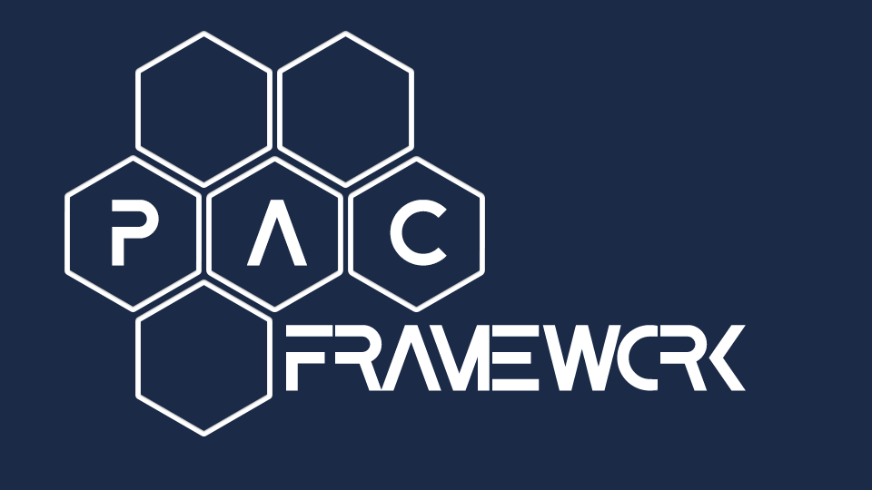

**PAC Framework V1.02** 

# Програмний каркас для розробки  промислових контролерів

**PACFramework** - це комплекс взаємопов’язаного набору правил, рекомендацій, структур даних та програмних елементів призначених для розробки прикладного програмного забезпечення (ПЗ) для програмованих пристроїв, таких як промислові контролери (PLC/PAC) але не обмежених ними.

Даний репозиторій:

- містить опис каркасу
- містить бібліотеки реалізації каркасу для деяких платформ
- містить посилання на суміжні проекти що базуються на каркасі  

PACFramework (надалі "**Каркас**") розроблений з урахуванням типових вимог до систем керування, сучасних світових стандартів (ISA, IEC, ISO) та тенденцій (Industry 4.0, IIoT). Каркас дає можливість швидко розробляти ПЗ для PLC/PAC та SCADA/HMI в складі АСКТП з функціоналом, достатнім для будь-яких типів процесів та виробництв: неперервних (Continues), дискретних (Discrete) та порційних (Batch). Каркас може бути використаний для будь яких програмованих пристроїв що призначені для контролю та керування.

1. [Основні ідеї](base/README.md)
2. [Модулі керування (CM, Control Modules)](cm/README.md)
3. [Модулі устатковання (EM, Equipment Modules)](em/README.md)
4. [Процедурне керування](proc/README.md)
5. [Системні стандарти HMI (людино-машинного інтерфейсу)](hmi/README.md)
6. [Рекомендації щодо реалізації PAC Framework на нових платформах PLC/PAC](implem/README.md)  
7. [Існуючі реалізації](platforms/README.md) 
8. [Етапи життєвого циклу](lifecycle/README.md)

[Основна сторінка](https://pupenasan.github.io/PACFramework/)

[GitHub](https://github.com/pupenasan/PACFramework)

## Вебінари

- [Введение в PACFramework](https://www.tda.in.ua/pacframework)

