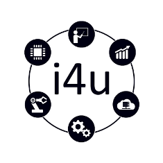

**PAC Framework V1.02** 

# Функціональний каркас для розробки прикладного програмного забезпечення для промислових контролерів

О.М.Пупена, Р.М.Міркевич, О.М.Клименко, В.В.Полупан, Д.В.Мацебула, А.В.Шишак 

[www.i4u.in.ua](http://www.i4u.in.ua) 

Даний посібник описує **концепції** використання взаємопов’язаного набору рекомендацій, структур даних та програм до розробки прикладного програмного забезпечення (ПЗ) для програмованих пристроїв, таких як промислові контролери (PLC/PAC) але не обмежених ними, з урахуванням типових вимог до систем керування, сучасних світових стандартів (ISA, IEC, ISO) та тенденцій (Industry 4.0, IIoT). Ці концепції (надалі називається **Каркасом** або **PAC Framework**) дає можливість швидко розробляти ПЗ для PLC/PAC та SCADA/HMI в складі АСКТП з функціоналом, достатнім для будь-яких типів процесів та виробництв: неперервних (Continues), дискретних (Discrete) та періодичних (Batch). Каркас може бути використаний для будь яких програмованих пристроїв.

Посібник рекомендується для розробників прикладного ПЗ промислових контролерів та SCADA/HMI.

1. [Основні ідеї](base)
2. [Модулі керування (CM, Control Modules)](cm)
3. [Модулі устатковання (EM, Equipment Modules)](em)
4. [Процедурне керування](proc)
5. [Системні стандарти HMI (людино-машинного інтерфейсу)](hmi) 

міркевич