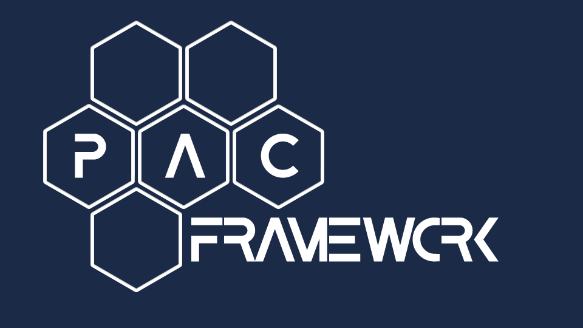

**PAC Framework V1**  

[UK](README.md) [EN](README_EN.md)

# Framework for Developing Industrial Controller Software (PLC/PAC)

## Introduction

**PACFramework** is an integrated set of rules, recommendations, data structures, and software elements designed for developing application software for programmable devices such as industrial controllers (PLC/PAC), though not limited to them.

PACFramework (hereinafter "**PFw**") has been developed considering typical control system requirements, modern international standards (ISA, IEC, ISO), and trends (Industry 4.0, IIoT). PFw enables rapid development of software for PLC/PAC and SCADA/HMI within industrial automation and control systems (IACS), providing functionality suitable for all types of processes and production: continuous, discrete, and batch. The framework can be used with any programmable devices intended for control and automation.

Purpose:

- **To accelerate development:**
  - Ready-to-use software constructs with built-in functionality (typical requirements)
  - Possibility to automate routine tasks (PFwTools)
- **To reduce errors, provided the framework’s software blocks are debugged (integrator version):**
  - Pre-debugged software constructs
  - Validated approaches
  - Reduced human error during automated deployment (PFwTools)
- **To formalize and standardize concepts:**
  - For clearer team and customer communication (e.g., mode and state handling cases)
- **To standardize code, which is necessary for:**
  - Easier collaboration on a single project
  - Simpler maintenance (including by the customer)
  - Easier replication across projects
  - Easier integration with other systems
  - Deployment automation
- **Potential future standardization at the customer level**

Properties:

- Open
- Platform-independent (can be implemented on most modern PLC/PAC platforms)
- Extensible
- Suitable for large-scale (thousands of I/O) and medium-scale (tens to hundreds of I/O) projects
- Library available for various platforms:
  - Unity PRO/Control Expert
  - TIA Portal (S7-1200/1500, S7-300)
  - CodeSYS (under development)
- Designed for optimal resource utilization
- Based on best practices (drawing on ideas from other standards and “frameworks”)
- Based on ISA standards:
  - ISA-88 (Batch Control, IEC 61512)
  - ISA-101 (HMI)
  - ISA-18.2 (Alarm Management)
- Genetically designed for integration with upper-level MES/MOM systems (ISA-88/95)
- Continuously evolving and improving, with work ongoing on a new version

Currently, a new version, **PFw2**, is under development, addressing structural limitations and shortcomings of the first version.

This repository:

- contains a description of the framework
- includes implementation libraries for selected platforms
- provides links to related projects based on the framework

1. [Core Concepts](base/README_EN.md)
2. [Control Modules (CM)](cm/README_EN.md)
3. [Equipment Modules (EM)]()
4. [Procedural Control](proc/README_EN.md)
5. [HMI (Human-Machine Interface) System Standards]()
6. [Recommendations for Implementing PAC Framework on New PLC/PAC Platforms](implem/README_EN.md)
7. [Available Implementations](platforms/README_EN.md)

## Related Projects

- [PACFramework Tools](https://github.com/pupenasan/pacframework-tools)
- [PACFramework IoTGateway](https://github.com/pupenasan/PACFrameworkIoTGateway)

[Main page](https://pupenasan.github.io/PACFramework/README_EN.md)

[GitHub](https://github.com/pupenasan/PACFramework)

