# Автоматизована генерація коду ПЛК для реалізації алгоритмів керування на основі режимів у будівлях

Cai, X.,Jin, Z.,Li, H.,Kümpel, A.,& Müller, D.(2024). Automated PLC Code Generation for the Implementation of  Mode-Based Control Algorithms in Buildings. *Buildings*, *14*(1), 73. https://doi.org/10.3390/buildings14010073    

## Анотація

Неправильне програмування функцій керування у системах автоматизації та керування будівлями (BACS) може призвести до неефективної експлуатації будівель. Для зменшення помилок програмування перспективним рішенням може бути автоматизований процес реалізації функцій керування. Останнім часом інформаційне моделювання будівель (BIM) сприяє цифровізації будівельних проєктів, але рідко використовується під час планування та впровадження функцій керування у BACS. Опис керування у BIM також залишається невизначеним. Для вирішення цих проблем метод документування керування для BIM та автоматизований підхід до реалізації керування можуть спростити впровадження керування у BACS та, таким чином, покращити експлуатацію будівель. У попередніх роботах ми розробили метод MODI для структурованого процесу планування алгоритмів керування на основі режимів для систем енергозабезпечення будівель. Цей метод показав потенціал для підтримки цифрового планування та реалізації керування у BACS. На основі цього у цій статті ми представляємо метод документування для опису алгоритмів керування на основі режимів у форматі IFC (Industry Foundation Classes), що дозволяє обмін даними між BIM, та програмно підтримуваний підхід для автоматичної генерації коду ПЛК для реалізації цих алгоритмів. У випадковому дослідженні продемонстровано документування бажаної стратегії керування на основі режимів для мережі енергозабезпечення у форматі IFC та реалізацію цієї стратегії у програмі ПЛК. На етапі моделювання ми тестуємо реалізовану стратегію керування для перевірки функціональності програми ПЛК. Результати доводять, що стратегії керування на основі режимів можуть бути повністю автоматично реалізовані у програмі ПЛК на основі даних IFC.

**Ключові слова:** цифровізація будівель; автоматизована генерація коду ПЛК; алгоритми керування на основі режимів

## 1. Вступ

Сектор будівель становить 30% від загального кінцевого споживання енергії у світі та 27% від загальних викидів парникових газів [1]. Для зменшення великої частки споживання енергії у секторі будівель підвищення енергоефективності будівель стає важливим. Однак у будівельній галузі часто зустрічається розрив у продуктивності [2,3]. Цей розрив представляє невідповідність між запланованою та фактичною виміряною енергетичною продуктивністю у контексті споживання енергії будівлями, а також вказує на нереалізований потенціал ефективності будівельного фонду [3]. Як показано в огляді у [2], цей розрив у продуктивності розглядається у різних контекстах протягом життєвого циклу будівлі, таких як кліматичні умови та налаштування керування. Системи автоматизації та керування будівлями (BACS) також є ключовими чинниками підвищення енергоефективності та, відповідно, зменшення цього розриву [4,5].

Нещодавно вплив BACS на експлуатацію будівель було розглянуто у кількох дослідженнях, які довели, що ефективно спроєктовані BACS можуть зменшити споживання енергії та викиди CO2 у секторі будівель [5–8]. Примітні приклади включають обговорення у [5,6] стратегій управління знаннями для покращення проєктування BACS, у [7], що підкреслює інтеграцію Інтернету речей (IoT) у BACS для підвищення продуктивності будівель, та у [8], що фокусується на тестуванні контурів керування для підтвердження важливої ролі BACS у досягненні енергозбереження. Згідно з дослідженням у [9], ефективно налаштовані BACS можуть навіть заощадити до 30% енергії на опалення в офісній будівлі. На жаль, поточне проєктування та введення в експлуатацію логіки керування у BACS все ще значною мірою залежать від текстових описів, електронних таблиць та двовимірних креслень для обміну інформацією, а також від ручного програмування програмістами з керування [5,10–13]. Така низькоцифрова документація логіки керування є нестандартизованою та неоднозначною, потребує додаткової інтерпретації та залишає простір для різних варіантів реалізації. У процесі впровадження програмісти вручну кодують функції керування відповідно до специфікацій або безпосередньо використовують коди з існуючого подібного проєкту [14]. Цей процес є неефективним і може бути схильним до помилок [15]. Більше того, застосування низькоцифрового способу документування може також призвести до непередбачених втрат інформації на різних етапах проєкту.

Для зміни цієї ситуації перспективним є цифровий підхід до проєктування керування, програмування коду та введення в експлуатацію [16]. Для підтримки цього напряму у попередній роботі ми представили так званий метод MODI, який дозволяє систематичний процес розробки алгоритмів керування на основі режимів для систем енергозабезпечення будівель [17–19]. Алгоритми керування на основі режимів залежать від робочих режимів та їхніх переходів для організації роботи системи. Робочий режим визначає поведінку системи шляхом визначення роботи всіх компонентів у системі. Переходи активують переходи від одного робочого режиму до іншого та, зрештою, визначають поточний використовуваний робочий режим. Використання сигнально-інтерпретованих мереж Петрі (SIPN) як формалізованого методу опису у цьому методі забезпечує опис алгоритмів керування без неоднозначностей та непорозумінь, а отже, запобігає помилкам у процесі реалізації [18,19]. На основі цього ми розробили програмно підтримувану структуру для впровадження алгоритмів керування на основі режимів у програмовані логічні контролери (ПЛК) шляхом автоматичної генерації коду ПЛК мовою програмування Structured Text (ST) [20]. Розроблене програмне забезпечення збирає інформацію про конфігурацію алгоритмів керування на основі режимів через графічний інтерфейс користувача (GUI), а потім генерує відповідну програму ПЛК. Проте програмне забезпечення, розроблене у попередній роботі, вимагає ручного введення інформації про конфігурацію, що може бути як обтяжливим, так і схильним до помилок. Цю проблему можна ефективно вирішити, якщо дозволити програмному забезпеченню безпосередньо інтерпретувати алгоритми керування на основі режимів із цифрового джерела даних, такого як Industry Foundation Classes (IFC), а не покладатися на GUI. Тому у цьому дослідженні ми представляємо нову методологію документування алгоритмів керування на основі режимів у форматі IFC та подальшої їх автоматизованої реалізації у ПЛК шляхом генерації коду ПЛК.

IFC є відкритою схемою даних і сприяє експорту та обміну даними між інструментами інформаційного моделювання будівель (BIM) [21]. BIM представляє фізичні та функціональні характеристики будівлі у цифровому форматі та, таким чином, широко використовується у сфері архітектури, інженерії, будівництва та експлуатації (AECO) [22–25]. BIM підтримує обмін даними та інформаційну інтероперабельність протягом усього життєвого циклу будівель [26]. Типові інструменти планування BIM, такі як Revit [27] та ArchiCAD [28], використовують власні формати даних для зберігання внутрішніх даних [5]. IFC стандартизовано як ISO 16739 [29] і підтримує інтероперабельність цих інструментів BIM шляхом обміну даними BIM між ними [21]. У IFC набір загальних об’єктів будівлі визначається як відповідні елементи IFC з пов’язаними властивостями та атрибутами, які можуть бути інстанційовані та застосовані для конкретних випадків використання. Тому дані BIM на основі IFC здатні забезпечувати стандартизоване цифрове джерело даних та дозволяють обмін даними для функцій керування будівлею на етапах проєктування, введення в експлуатацію та навіть експлуатації [30]. Однак описи функцій керування у поточному програмному забезпеченні BIM та IFC є обмеженими [29]. Порівняно з іншими системами будівлі, проєктування BACS не розглядається у циклі проєктування та будівництва BIM, а зазвичай інтегрується на пізнішому етапі, тобто на етапі управління об’єктом [23]. Таким чином, інструменти BIM та IFC рідко використовуються для обміну інформацією про BACS [23,31,32]. Більше того, методи, що дозволяють опис функцій керування у IFC, залишаються неясними [29]. Формалізований метод опису функцій керування будівлею може бути корисним для цифровізації проєктування та реалізації функцій керування у BIM [29,33–35].

Щоб вирішити це питання, у цій статті ми досліджуємо новий метод опису для опису алгоритмів керування на основі режимів у форматі IFC, а потім інтегруємо IFC з розробленим програмним забезпеченням для автоматичної генерації коду ПЛК для реалізації алгоритмів керування на основі режимів. Таким чином, на основі схеми IFC будується ієрархічна структура для представлення даних. Файли IFC, що містять алгоритми керування, можуть бути імпортовані у програмне забезпечення для генерації відповідного коду ST та реалізації цього коду у програмі ПЛК для BACS. Стаття структурована наступним чином: у розділі 2 представлено методологію документування алгоритму керування на основі режимів у IFC та детально описано процес автоматизованої генерації коду ПЛК. У розділі 3 представлено приклад використання та обговорюються результати. У розділі 4 підсумовано основні результати та окреслено наступні кроки.

### Сучасний стан

Системи автоматизації та керування будівлями (BACS) відповідають за моніторинг та керування середовищем у будівлі та її безпекою, такими як пожежна безпека, освітлення та кондиціонування повітря [36–38]. У BACS виділяють два рівні керування: один — це процесне керування, яке здійснюється за допомогою безперервних та лінійних контролерів, таких як ПІД-контролери, інший — автоматизація будівель, що реалізує дискретні стратегії керування за допомогою текстових або графічних інструментів програмування. Залежно від складності функцій керування, два основні типи контролерів, що застосовуються у BACS, визначаються як програмовані логічні контролери (PLC) та прямі цифрові контролери (DDC) [37–39]. Завдяки надійності та простоті налаштування, системи автоматизації на базі PLC часто віддають перевагу під час проєктування BACS [40]. Стандарт IEC 61131-3 [41] стандартизує базову програмну архітектуру та виконувані мови програмування для PLC. Цей стандарт був розширений об'єктно-орієнтованими компонентами протягом останніх років [42]. Мови програмування, що підтримуються IEC 61131-3, включають дві текстові мови програмування, а саме structured text та instruction list, та три графічні мови програмування: ladder diagram, function block diagram та sequential function chart.

У різних галузях програми PLC історично були відносно простими. Однак останніми роками зростає попит на складні, розгалужені та модульні програми PLC. Мотивація зменшення ручної роботи при програмуванні PLC стимулює низку робіт, що представляють методи автоматичної генерації коду PLC, особливо в галузі виробництва та виробничих процесів [43–51]. У принципі, генерація коду є реалізацією вихідного коду у конкретному синтаксисі цільового коду, що відповідає семантиці вихідного коду [47,52]. Як демонструють Daniel Darvas та ін. [51], генерація коду може здійснюватися на основі формальних методів. Таким чином, у їхній роботі представлено мову формальної специфікації PLCspecif та розроблено відповідний генератор коду. Цільовим кодом є ST. Проте формальні методи та генерація коду не є широко впровадженими на практиці [52–54]. Однією з причин може бути те, що практики PLC зазвичай мають технічну освіту та обмежені знання у галузі інженерії програмного забезпечення, тоді як теоретичні концепції формальних методів походять з комп'ютерних наук.

У зв’язку з цим деякі роботи обирають генерацію коду PLC шляхом повторного використання існуючих програм PLC та мов моделювання загального призначення, таких як UML та SysML. Наприклад, Vogel-Heuser та ін. [45] визначають три загальні підходи до генерації коду PLC: підхід на основі шаблонів, модульний підхід та підхід на основі параметрів. На основі підходу на основі шаблонів функціональні блоки компонентів можуть бути перетворені на шаблони для повторного використання, які зберігаються у бібліотеці генератора коду та можуть вибиратися за заданим випадком [46,47]. Модульний підхід також є типовим для інтенсивного повторного використання програм PLC. Цей підхід вводить модуль, що складається з деяких компонентів, які представляють типову систему у промисловості, таку як установка або повна станція, та її логіку керування [44,50]. Fischer та ін. [49] демонструють концепцію на основі параметрів для повторного використання існуючих програм PLC, аналізуючи програму PLC для систем зберігання як приклад використання, у якому визначаються придатні до повторного використання коди та різні частини, які можуть бути оголошені за допомогою набору параметрів. Існують й інші роботи, що зосереджуються на інтеграції формального методу у добре побудований інженерний інструмент та практичний робочий процес. Багато виробників систем керування розробили інструменти для автоматичної генерації коду PLC [55], такі як Beckhoff TwinCAT automation interface [56], Schneider Unity Application Generator [57] та Mitsubishi Adroit Process Suite [58]. Ці інструменти надають можливість інтеграції у попередньо визначений робочий процес, налаштований програмістами PLC.

Наскільки нам відомо, генерація коду PLC ще не є широко застосовуваною під час реалізації логіки керування у сфері BACS. Ця сфера потребує складних програм PLC для керування та забезпечення комфортного середовища, одночасно оптимізуючи ефективну роботу систем енергозабезпечення будівель (BES). Існує чіткий попит на добре визначений цифровий робочий процес для забезпечення автоматичного впровадження логіки керування у PLC для BACS.

У сфері BACS для цифровізації проєктування та реалізації логіки керування розробляються різні формати даних, окрім IFC, для обміну інформацією між інструментами програмного забезпечення та розробниками логіки керування.

ISO 16484-3 [29] вводить вимоги, що охоплюють програмне забезпечення та функції для BACS, та надає зразок шаблону для документування функціональних блоків, визначених під час проєктування, який називається списком функцій BACS. У списку функцій BACS входи та виходи функціональних блоків, параметри, що визначають функціональні блоки, відповідні дані датчиків та їх внутрішня логіка керування представлені у вигляді електронної таблиці. Однак список функцій BACS не може забезпечити формальний опис логіки керування та достатній опис складних і нестандартних функцій керування.

Проєкт OpenBuildingControl [14] розробив мову опису керування (CDL) для обміну визначеною логікою керування для систем опалення, вентиляції та кондиціонування повітря (HVAC). CDL базується на мові моделювання Modelica, яка не займається представленням знань, а компонентно-орієнтованим моделюванням та симуляцією складних систем [59]. Метод, розроблений у проєкті OpenBuildingControl, обмежується виключно використанням у системах HVAC і не дозволяє представляти ієрархічну логіку керування. Можливість трансляції мови опису керування (CDL) у мови програмування, що підтримуються IEC 61131-3, визнається, проте поки що не реалізована. Підходи до моделювання на основі онтологій для опису логіки керування у BACS також часто зустрічаються у багатьох роботах.

Дослідження, що намагаються застосувати IFC для опису логіки керування у BACS, є обмеженими. У роботі Chen та ін. [60] знання керування будівлею визначаються як знання про логіку керування, алгоритми, структуру керування та функціональні можливості технічного обладнання у будівлях. Для обміну знаннями з керування використовується схема бази даних M-BCK [61]. Автори цієї роботи [60] зазначають, що логіка керування та її представлення у мовах програмування зазвичай залежать від виробників і часто представлені у різних форматах та мовах програмування. Таким чином, ця робота лише надає схему даних для представлення загальних знань з керування будівлею без розгляду реалізації модулів керування, що описані у схемі даних. У роботі згадується потенціал інтеграції M-BCK у схему IFC, проте обговорення є обмеженим. Benndorf та ін. [62] докладають зусиль для розширення схеми IFC для опису деякої типової логіки керування у HVAC, такої як керування за кривими опалення, графіками часу та ПІД-контролерами. На основі цього методу схема IFC може містити інформацію про будівлі, їх технічні системи та відповідні функції керування. Однак цей метод документування не може повністю гнучко описувати визначені функції керування, а лише попередньо визначену логіку керування у схемі IFC. Ці роботи [11,63,64] вказують на відсутність формальної семантики IFC та підкреслюють переваги мови, заснованої на логіці, для представлення знань з керування. На основі цього у кількох роботах [5,10,11,65–67] обговорюється трансляція специфікації схеми EXPRESS, що представляє схему IFC, у мову онтологій.

Хоча існуючі методи покращують експлуатацію будівель, існує критичний пробіл щодо робочого процесу, який дозволяє автоматично реалізовувати функції керування, описані у цих форматах, що перешкоджає ефективному впровадженню функцій керування.

## 2. Методологія

Для підтримки реалізації логіки керування у BACS у цій роботі використовується схема IFC для представлення алгоритмів керування на основі режимів та вводиться автоматизований підхід до реалізації алгоритмів керування на основі режимів у ПЛК. На рисунку 1 показано робочий процес розробленої методології. Перша частина методології полягає у документуванні алгоритмів керування на основі режимів у схемі IFC шляхом розробки ієрархічної підмножини у схемі IFC, щоб інформацію про алгоритми керування можна було оцифрувати та поширювати на різних етапах проєкту. Ця частина реалізована на Python та використовує IfcOpenshell для обробки даних IFC [68]. Друга частина стосується реалізації алгоритмів керування на основі режимів у ПЛК шляхом перетворення даних IFC у JavaScript Object Notation (JSON) та подальшої генерації відповідних програм ПЛК на етапі програмування. Ця частина реалізована у середовищі .Net, у якому дані JSON можуть оброблятися зручніше, ніж дані IFC. У розділі 2.1 зосереджено увагу на трансляції алгоритмів керування на основі режимів, описаних у SIPN, у схему IFC. У розділі 2.2 представлено метод автоматичної генерації коду ПЛК для реалізації алгоритмів керування, описаних у IFC, у програмі ПЛК.

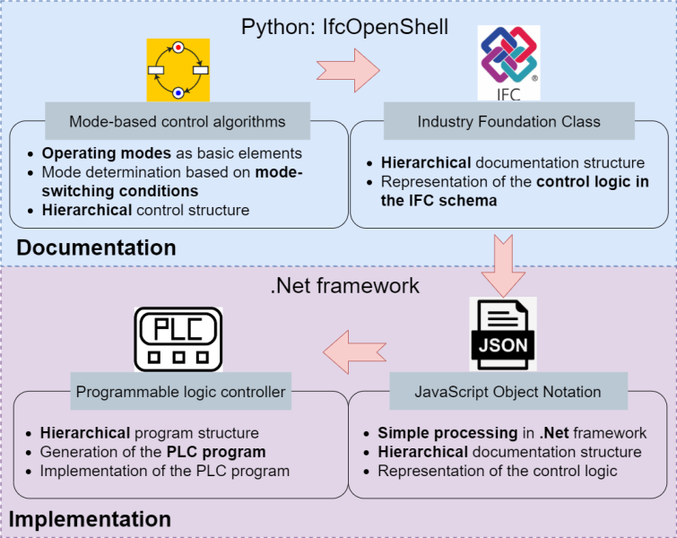

Figure 1. Overview of the methodology to implement mode-based control algorithms in PLC

### 2.1. Документування алгоритмів керування на основі режимів у схемі IFC

Для опису алгоритмів керування на основі режимів у схемі IFC ми розробляємо прототип на основі схеми IFC, який враховує такі питання:

- Описати ієрархічну структуру керування алгоритмів керування на основі режимів у схемі IFC.

- Описати логіку керування алгоритмів керування на основі режимів, описаних у SIPN, на кожному рівні у схемі IFC.

- Описати зв’язки між контролерами та енергосистемами у схемі IFC.

У таблиці 1 наведено підсумок використаних сутностей IFC у схемі IFC для цього методу документування [69].

Таблиця 1. Використані сутності IFC у схемі IFC для опису алгоритмів керування на основі режимів.

| Сутності IFC            | Опис                                                         |
| ----------------------- | ------------------------------------------------------------ |
| IfcController           | Контролер у складі BACS.                                     |
| IfcRelAggregates        | Відношення агрегації, що застосовується до IfcObject.        |
| IfcSimpleProperty       | Узагальнення об’єкта одиничної властивості, включає IfcPropertySingleValue, IfcPropertyEnumeratedValue, IfcPropertyBoundedValue, IfcPropertyTableValue, IfcPropertyReferenceValue, IfcPropertyListValue. |
| IfcComplexProperty      | Складні властивості, які можуть бути колекцією підтипів IfcProperty. |
| IfcRelDefinedByProperty | Відношення між об’єктами та набором властивостей.            |
| IfcPropertySet          | Клас-контейнер, що зберігає властивості у наборі властивостей. |
| IfcActor                | Учасник у складі BACS.                                       |
| IfcSensor               | Датчик у складі BACS.                                        |
| IfcDistributionPort     | Спеціалізований інтерфейс для елементів розподілу.           |
| IfcRelNests             | Відношення вкладення для загального зв’язку складання або декомпозиції. |
| IfcRelConnectPorts      | Відношення з’єднання між двома портами.                      |

#### 2.1.1. Ієрархічна структура керування у схемі IFC

Як демонструє MODI [18], енергетичну систему можна розкласти на багаторівневу ієрархічну структуру на початку процесу проєктування керування. Як показано на рисунку 2a, ця ієрархічна структура складається з рівня мережі, рівня підсистеми, рівня компонента та рівня виконавчого механізму. На кожному рівні визначаються робочі режими, які описують специфічну поведінку системи. Послідовно встановлюється відповідна стратегія керування на основі режимів шляхом вибору використовуваних робочих режимів та визначення відповідних умов перемикання режимів. Для моделювання та виконання логіки керування на основі процесу перемикання режимів у SIPN ми застосовуємо підхід моделювання на основі SIPN [19] (рисунок 2b). Кожен робочий режим перетворюється на місце SIPN, тоді як умови перемикання режимів реалізуються як переходи у SIPN. При виконанні умови перемикання режиму відповідний перехід у SIPN активується, і маркер може бути переданий від вхідного місця до вихідного місця SIPN. Після отримання маркера вихідне місце активується для виконання відповідного робочого режиму, який реалізується як вихідна функція цього місця.

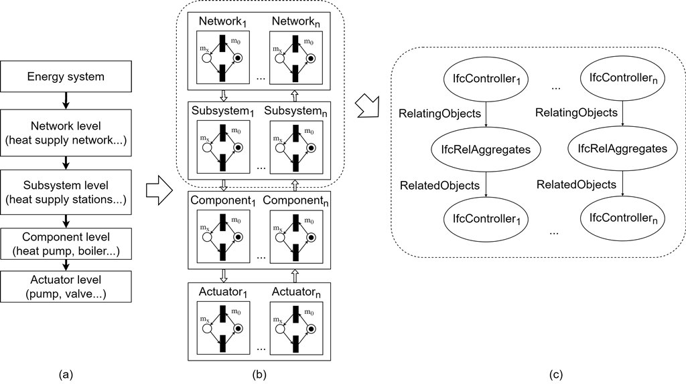

Рисунок 2. Ієрархічна структура алгоритмів керування на основі режимів, описана у сигнально-інтерпретованих мережах Петрі та схемі IFC. (a) Ієрархічно структурована рамкова модель енергетичної системи після декомпозиції; (b) ієрархічно структурована рамкова модель алгоритмів керування на основі режимів, описана у сигнально-інтерпретованих мережах Петрі; (c) ієрархічно структурована рамкова модель алгоритмів керування на основі режимів, описана у схемі IFC.

На основі ієрархічної структури алгоритмів керування на основі режимів прототип може кодувати таку ієрархічну структуру SIPN у схемі IFC. На рисунку 2c представлено відображення SIPN на рівні мережі та підсистеми на сутності IfcController у схемі IFC. Кожен SIPN відображається як IfcController, а представлення ієрархічних SIPN забезпечується за допомогою IfcRelAggregates для з’єднання цих сутностей IfcController. IfcRelAggregates визначається двома атрибутами: “RelatingObjects” та “RelatedObjects”, де сутності IfcController на вищому рівні визначаються як RelatingObjects, а сутності IfcController на нижчому рівні — як RelatedObjects у цьому зв’язку.

#### 2.1.2. Логіка керування, описана у SIPN, у схемі IFC

На основі ієрархічної структури ми починаємо перетворювати SIPN у об'єкти IfcController. SIPN може бути реалізована за допомогою новоствореного та об'єктивованого набору властивостей, який призначається для IfcController через зв'язок IfcRelDefinedByProperties. Як показано на рисунку 3, набір властивостей містить два типи властивостей, тобто IfcSimpleProperty та IfcComplexProperty. IfcSimpleProperty є об'єктом одиничної властивості, що містить різні підтипи, такі як IfcPropertySingleValue, IfcPropertyEnumeratedValue та IfcPropertyListValue. У нашому випадку ми використовуємо IfcPropertySingleValue для повідомлення деякої допоміжної інформації, наприклад, мінімального часу між двома перемиканнями режимів у SIPN. Порівняно з IfcPropertySingleValue, IfcComplexProperty дозволяє використовувати змішану колекцію підтипів IfcProperty, а також може бути включена як одиничний елемент властивості у IfcPropertySet. Ми використовуємо IfcComplexProperty для документування основної інформації SIPN.

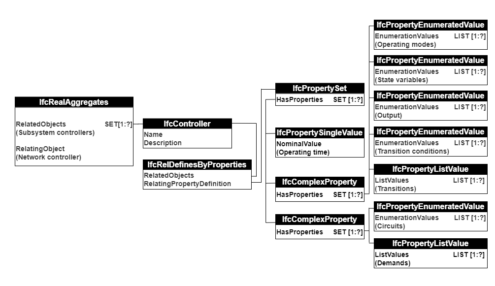

Рисунок 3. Діаграма у специфікації IFC4 EXPRESS, що показує об'єкт IfcController із визначеним набором властивостей для реалізації сигнально-інтерпретованої мережі Петрі у схемі IFC.

Базовими елементами SIPN є місця, переходи та вихідні функції. Для перетворення цих елементів у схемі IFC ми визначаємо чотири об'єкти IfcPropertyEnumerationValue для перерахування всіх допустимих робочих режимів, умов переходу, відповідних станів змінних та вихідних функцій, як показано у таблиці 2. Ці об'єкти IfcPropertyEnumeration розглядаються як контейнери, з яких ми можемо обирати значення перерахувань для реалізації шаблону місце-перехід-місце, що описує перехід від одного місця до іншого. Сутність IFC IfcPropertyListValue використовується для реалізації такого шаблону. Об'єкт IfcPropertyListValue має три призначені значення, які можуть бути ініційовані для списку першого місця, умови переходу та другого місця у шаблоні місце-перехід-місце. Вихідна функція цього шаблону визначає поведінку системи шляхом активації другого місця, що кодується серією “0” та “1”, що представляють робочі режими “Вимк.” та “Увімк.” відповідно. Екземпляр IfcPropertyEnumeration “Output” використовується для маркування цих кодів.

Таблиця 2. Відповідність між елементами сигнально-інтерпретованих мереж Петрі (SIPN) та об’єктами IfcPropertyEnumerationValue у схемі IFC.

| Елементи SIPN   | IfcPropertyEnumerationValue | Опис                                                         |
| --------------- | --------------------------- | ------------------------------------------------------------ |
| Місця (Places)  | Operating modes             | Перелік усіх допустимих робочих режимів                      |
| Умови переходу  | State variables             | Перелік усіх відповідних змінних стану                       |
| Умови переходу  | Transition conditions       | Перелік усіх можливих умов перемикання режимів               |
| Вихідні функції | Output                      | Представлення поведінки системи шляхом активації робочих режимів |

Наприклад, як показано на рисунку 4, для реалізації шаблону місце-перехід-місце P1 → T12 → P2 ми ініціюємо об'єкт IfcPropertyListValue, обираючи два робочі режими як P1 та P2 з сутності IfcPropertyEnumerationValue “Operating modes” та умову переходу T12 із сутності IfcPropertyEnumerationValue “Transition conditions” відповідно. Вихід цього екземпляру IfcPropertyListValue “Transition” є групою “0” та “1”, маркованих сутністю IfcPropertyEnumeration “Output”, для вказівки поведінки системи у P2. Цей прототип також може використовуватися для повідомлення іншої інформації, наприклад, типи гідравлічних контурів перераховуються у екземплярі IfcPropertyEnumeration, а екземпляр IfcPropertyListValue визначає побудовані гідравлічні контури енергосистеми з екземпляру IfcPropertyEnumeration.

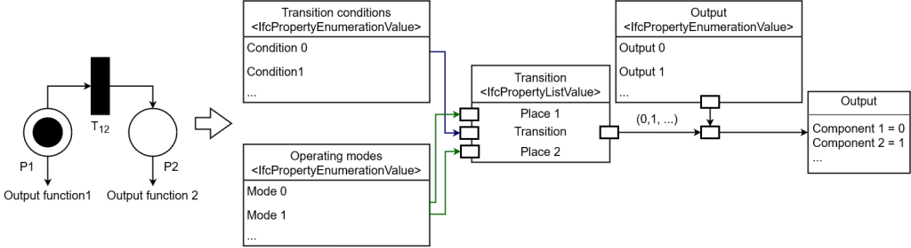

Рисунок 4. Реалізація шаблону місце-перехід-місце за допомогою об'єкта IfcPropertyListValue. Відповідно обрано два робочі режими (зелені лінії) та один перехід (синя лінія).

#### 2.1.3. Зв’язок між контролерами та фізичними системами у схемі IFC

Для виконання процесу керування контролеру необхідно збирати інформацію від відповідних датчиків та керувати виконавчими механізмами для реалізації логіки керування. Усі відповідні датчики та виконавчі механізми також можуть бути задокументовані у схемі IFC, як показано на рисунку 5. Сутність IfcController пов’язується із сутностями IfcSensor та IfcActuator через зв’язок вкладення IFC IfcRelNests та порт розподілу IFC IfcDistributionPort. IfcRelNests використовується для вкладення впорядкованих колекцій елементів за допомогою двох атрибутів: RelatingObject та RelatedObjects. Застосовні цільові об’єкти можуть бути непроявленими підтипами, такими як контролери та процеси, або фізичними підтипами, а саме елементами, що мають порти. IfcDistributionPort представляє порти розподілу, які можуть бути призначені елементам IFC за допомогою IfcRelNests. Ці порти розподілу розглядаються як інтерфейси для позначення ролі елементів у певній системі, таких як вхід води або вихід даних. Атрибут FlowDirection визначає напрям потоку як Sink (вхід) або Source (вихід). У нашому випадку використовувані сутності IFC (IfcController, IfcSensor та IfcActuator) містять порти розподілу, визначені через IfcDistributionPort, для позначення потоку даних від сутностей IfcSensor до сутностей IfcController та команд від сутностей IfcController до сутностей IfcActuator.

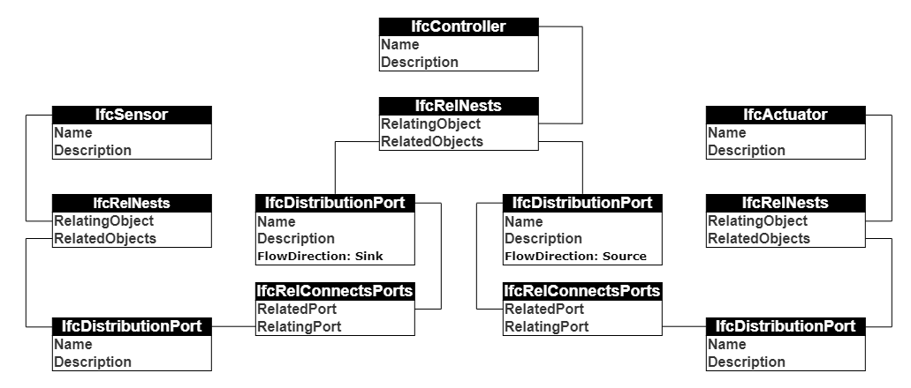

Рисунок 5. Діаграма у специфікації IFC4 EXPRESS, що показує сутність IfcController, пов’язану з датчиком та виконавчим механізмом, представленими об’єктами IfcSensor та IfcActuator, для зв’язку системи керування та фізичної системи у схемі IFC.

### 2.2. Автоматизована реалізація алгоритмів керування на основі режимів, описаних у IFC, у ПЛК

Для автоматичної реалізації алгоритмів керування на основі режимів у ПЛК ми насамперед розробляємо методологію для перетворення алгоритмів керування на основі режимів, описаних у IFC, у сегменти коду ST, а потім реалізуємо цю методологію у середовищі .Net для досягнення програмно підтримуваного автоматизованого процесу реалізації алгоритмів керування на основі режимів у ПЛК.

#### 2.2.1. Реалізація алгоритмів керування на основі режимів, описаних у IFC, у ST

Основні питання реалізації алгоритмів керування на основі режимів, описаних у IFC, у ST наведені нижче:

- Відображення ієрархічно структурованих алгоритмів керування на основі режимів, виражених у схемі IFC, у відповідні ієрархічні програми ПЛК

- Одноразова відповідність властивостей IFC сегментам коду ST

Попередні роботи [20] показали ієрархічну структуру програмних організаційних одиниць (POU), що дозволяє реалізовувати алгоритми керування на основі режимів у ПЛК. На основі цього нам потрібно лише відобразити алгоритми керування на основі режимів, описані у IFC, у структуру програм (PRG) ПЛК. У програмуванні ПЛК стандарт IEC 61131-3 [41,42] визначає три типи POU: PRG, функціональні блоки (FB) та функції. У цій роботі ми реалізуємо алгоритми керування на основі режимів, представлені у мережевих сутностях IfcController, у PRG, як показано на рисунку 6. Ієрархічна структура цих сутностей IfcController розпізнається через зв’язок IfcRelAggregates та відображається у FB у структурі POU. Входи та виходи кожної сутності IfcController, що описують обмін даними між різними рівнями, перетворюються на глобальні змінні та публічні властивості у PRG.

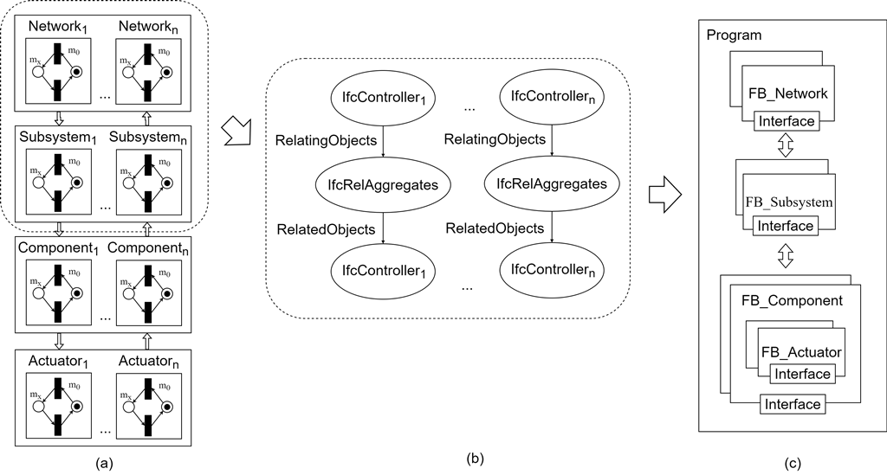

Рисунок 6. Реалізація алгоритмів керування на основі режимів, описаних у схемі IFC, в ієрархічній структурі програмних організаційних одиниць у програмованому логічному контролері. (a) Ієрархічно структуровані алгоритми керування на основі режимів у сигнально-інтерпретованих мережах Петрі; (b) алгоритми керування на основі режимів, описані у схемі IFC; (c) ієрархічна структура програмних організаційних одиниць для реалізації алгоритмів керування на основі режимів у програмованому логічному контролері.

Крім того, ми розробляємо об’єктно-орієнтовані стандартні FB для реалізації логіки керування алгоритмами керування на основі режимів у їх ієрархічній структурі. Їх ієрархічна структура складається з рівня мережі, рівня підсистеми, рівня компонентів та рівня виконавчих механізмів. На рівні мережі об’єкт FB для мереж представлений на рисунку 7. Цей FB містить три основні методи: Auto, Off та Run, а також кілька публічних властивостей. Run є ключовим методом, який запитує активований метод, а потім виконує його. Off визначений для безпосередньої зупинки мережі, тоді як Auto реалізує перемикання режимів та визначає використовуваний робочий режим на рівні мережі. Вихідна функція визначеного робочого режиму на рівні мережі визначає використовуваний метод на рівні підсистеми. Як інтерфейс, властивість Mode показує поточно використовуваний метод цього FB. Інші публічні властивості цього FB можуть гнучко параметризуватись при ініціалізації цього об’єктно-орієнтованого FB, у якому всі змінні стану, що стосуються переходів, визначаються як властивості для можливості зовнішнього зчитування цих змінних з датчиків.

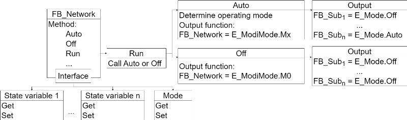

Рисунок 7. Об’єктно-орієнтований FB для контролерів на рівні мережі. Sub: підсистема.

Структура об’єкта FB для підсистем є подібною до об’єкта FB на рівні мережі. На основі цієї структури FB ми далі використовуємо мови програмування, що підтримуються IEC 61131-3, для реалізації логіки керування, документованої сутностями IfcController у ПЛК.

Реалізація логіки керування алгоритмів керування на основі режимів у ПЛК може бути досягнута шляхом відображення властивостей сутностей IfcController у цю програмну структуру. Як показано на рисунку 8, основними властивостями для опису процесу керування є набір екземплярів IfcPropertyListValue, IfcPropertyEnumeration “Operating modes” та “Output”, призначених кожній сутності IfcController. Екземпляри IfcPropertyListValue реалізують правила керування для визначення використовуваних робочих режимів. IfcPropertyEnumeration “Operating modes” містить усі використовувані робочі режими, які можуть бути декодовані за допомогою IfcPropertyEnumeration “Output”. Оскільки одноразова відповідність дозволяє повторно інтерпретувати згенерований код, ми використовуємо цей принцип для трансляції властивостей сутностей IfcController у програмну структуру.

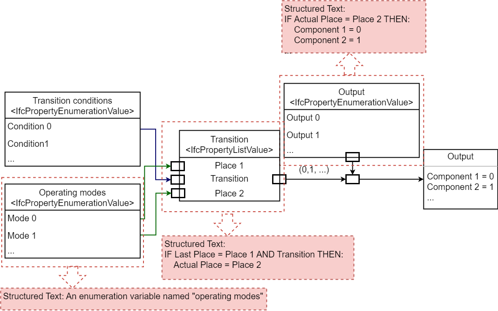

Рисунок 8. Одноразова відповідність властивостей IFC сегментам коду ST для шаблону місце-перехід-місце.

Об’єкт IfcPropertyEnumerationValue “Operating modes” Екземпляри об’єкта IfcPropertyEnumerationValue “Operating modes” відображаються у змінні перерахувань у ST для представлення використовуваних робочих режимів на всіх рівнях.

Об’єкт IfcPropertyListValue “Transition” Екземпляри об’єкта IfcPropertyListValue “Transition” реалізуються у конструкціях IF у ST для допомоги у визначенні використовуваного робочого режиму. Як показано на рисунку 4, перше місце та перехід екземпляра “Transition” перетворюються у сполучені умови відповідної конструкції IF. Друге місце розглядається як результат для визначення змінної перерахування, що показує використовуваний робочий режим.

Об’єкт IfcPropertyEnumerationValue “Output” Екземпляри об’єктів IfcPropertyEnumerationValue “Output” та “Operating modes” надають відповідну поведінку системи, яка реалізується у результатах конструкцій IF для виведення функцій під час перевірки робочих режимів в умовах конструкцій IF.

На рівні компонентів визначено два основні типи FB: один походить з бібліотеки AixOCAT [70] для керування чотирма типовими гідравлічними контурами (змішувальний контур, дросельний контур, контур відведення та контур упорскування). Інший використовує вбудоване керування компонентами шляхом виклику попередньо визначених точок даних у BACnet (мережі автоматизації та керування будівлями). Багато компонентів на ринку інтегрують режими керування у свої модулі керування та надають кілька точок даних для користувачів для активації цих режимів через інтерфейси своїх комунікаційних модулів. На практиці ці комунікаційні модулі застосовують різні комунікаційні протоколи, такі як BACnet або Modbus. У нашій роботі ми розробляємо об’єктно-орієнтований FB, який дозволяє комунікацію з компонентами через BACnet шляхом налаштування компонентів як BACnet-клієнтів та виклику попередньо визначених BACnet ID для інтегрованих функцій.

#### 2.2.2. Програмно підтримувана генерація ST для реалізації алгоритмів керування на основі режимів, описаних у IFC, у ПЛК

У цьому розділі ми розробляємо програмно підтримуваний підхід у середовищі .Net для імпорту даних IFC як джерела даних, перетворення даних IFC у дані JSON, а потім автоматичної генерації коду ST та його реалізації у програмах ПЛК. Для генерації та налаштування програм ПЛК використовується програмне забезпечення TwinCAT (Windows Control and Automation Technology) та інтерфейс TwinCAT Automation Interface, що розповсюджується компанією Beckhoff [56]. TwinCAT дозволяє використовувати об’єктно-орієнтовані мови програмування, визначені стандартом IEC 61131-3, для програмування проєктів ПЛК. TwinCAT Automation Interface забезпечує зв'язок між проєктами ПЛК у TwinCAT та зовнішніми середовищами на основі мов програмування, сумісних із COM, таких як .NET або C++, для створення та керування проєктами у зовнішньому середовищі. Таким чином, ми можемо створювати сценарії для безпосередньої генерації та налаштування проєктів ПЛК у TwinCAT замість ручного програмування.

На рисунку 9 показано програмну структуру. Як фронтенд створено графічний інтерфейс користувача (GUI) для імпорту файлів IFC та збору додаткових параметрів для налаштування проєктів ПЛК. Бекенд-програма розроблена на основі середовища .NET та здатна взаємодіяти з інтерфейсом TwinCAT Automation Interface. У бекенд-програмі файли IFC будуть спочатку конвертовані у формат JavaScript Object Notation (JSON). У нашому випадку для зчитування та обробки даних IFC використовується IfcOpenshell [20,68]. IfcOpenshell є бібліотекою з відкритим кодом для роботи з даними IFC у різних мовах програмування, таких як Python та C++. Проте IfcOpenshell не підтримує середовище .NET. Тому нам потрібно зчитувати дані IFC за допомогою Python-скрипту та перетворювати необхідну конфігураційну інформацію у файли JSON, що спрощує обробку інформації у середовищі .NET. Зчитуючи файли JSON, буде сформовано список POU, що містить конфігураційну інформацію про POU. Викликається цикл по списку POU для вибору потрібного шаблону POU та ініціалізації відповідного об’єкта POU шляхом інтеграції конфігураційної інформації на кожній ітерації. Ці згенеровані екземпляри POU будуть реалізовані у необхідному проєкті ПЛК.

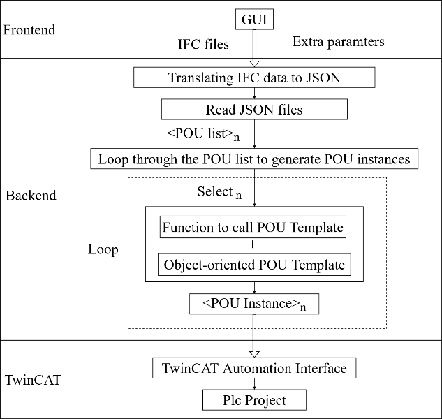

Рисунок 9. Програмна структура для імпорту даних IFC як джерела даних, генерації та реалізації відповідного коду ПЛК у структурованому тексті через програмне забезпечення TwinCAT. GUI: графічний інтерфейс користувача; IFC: Industry Foundation Classes; POU: програмні організаційні одиниці; JSON: JavaScript Object Notation.

Як показано на рисунку 10, робочий процес бекенд-програми починається з перетворення файлу IFC у файл JSON, імпорту та трансляції файлу JSON у список POU, обробки списку POU для виклику шаблонів POU з бази даних, ітеративного відображення їх у GUI та, зрештою, налаштування POU у проєкті ПЛК у TwinCAT.

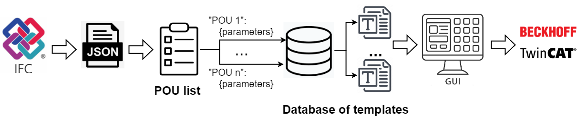

Рисунок 10. Робочий процес генерації POU у TwinCAT. GUI: графічний інтерфейс користувача; POU: програмні організаційні одиниці; JSON: JavaScript Object Notation.

JSON є відкритим файловим стандартом, який використовує як синтаксис пари атрибут–значення та масиви у текстовому вигляді. Тому цей стандарт простий для комп’ютерів для аналізу та генерації, а також для зручного читання людиною. Afsari та ін. обговорювали реалізацію стандарту IFC як схеми JSON, але опис алгоритмів керування у IFC рідко враховувався [21]. Тому потрібен новий підхід для трансляції алгоритмів керування на основі режимів, описаних у схемі IFC, у схему JSON. Цей підхід показано на рисунку 11. Конфігураційна інформація та властивості екземпляра IfcController транслюються у пари атрибут–значення у JSON. Наприклад, атрибут “Name” екземпляра IfcController на рисунку 11 буде відображений у відповідну пару атрибут–значення [“Name”:Name] у JSON. Ієрархія цього екземпляра IfcController у схемі IFC забезпечується через визначення атрибута JSON “Type”. Існують чотири попередньо визначені значення атрибута “Type”: “Network”, “Subsystem”, “Component” та “Actuator”, що відповідають контролерам на рівні мережі, підсистеми, компонентів та виконавчих механізмів відповідно.

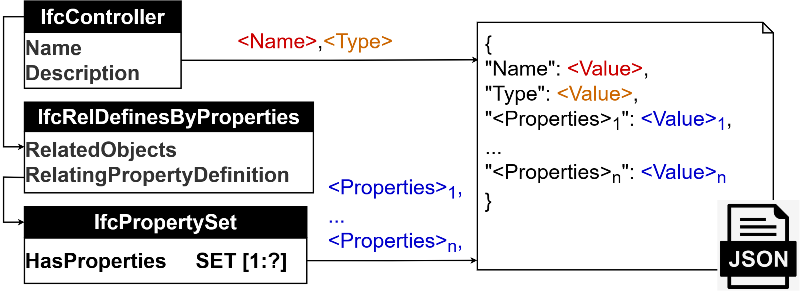

Рисунок 11. Підхід до трансляції алгоритму керування на основі режимів, описаного у схемі IFC, у схему JSON.

Набір властивостей, призначений для екземпляра IfcController, також перетворюється у пари атрибут–значення. Наприклад, IfcPropertyListValue “Transition” екземпляра IfcController відображається у масив пар атрибут–значення з назвою “Transition” у схемі JSON, як показано на рисунку 12. “Transition 1” відображається у першому масиві у схемі JSON, тоді як “Transition n” – у n-му масиві.

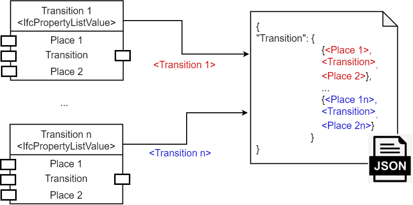

Рисунок 12. Приклад відображення IfcPropertyListValue “Transition” екземпляра IfcController у масив пар атрибут–значення у схемі JSON.

Далі конфігураційна інформація у схемі JSON повинна бути перетворена у список POU, що є інтерфейсом для програми генерації POU. Відповідно до атрибута JSON “Type” викликається відповідний тип шаблону та оголошується список параметрів для цього шаблону. Існують різні типи шаблонів, такі як шаблони для мережевих контролерів, контролерів підсистем та гідравлічних контурів. Для кожного типу шаблону розробляється список параметрів, а його елементи визначаються у попередньо визначеному порядку, що дозволяє зручно отримувати необхідну конфігураційну інформацію для шаблону. На рисунку 13 представлено приклад відображення конфігураційної інформації контролерів у схемі JSON у список POU. Елемент JSON “Network 1” на рисунку 13 відображається у списку POU як елемент списку “POU 1”, який позначено як тип шаблону “Network Controller”. Необхідна конфігураційна інформація для цього шаблону буде взята зі схеми JSON у підсписки “POU 1” у встановленому порядку.

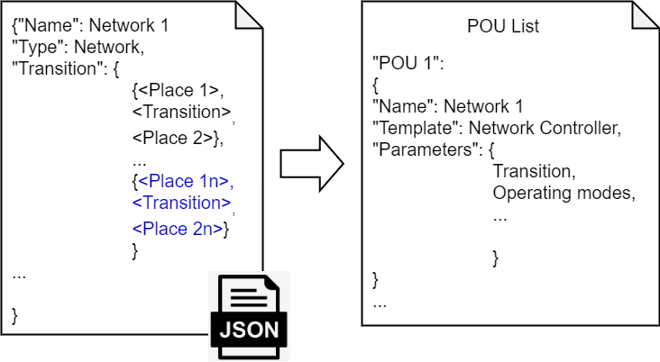

Рисунок 13. Перетворення елемента JSON у список POU. POU: програмні організаційні одиниці; JSON: JavaScript Object Notation.

У роботі [20] було доведено, що підхід на основі шаблонів може генерувати код ST шляхом виклику шаблонів об'єктів POU та подальшої їх параметризації. Відповідні параметри імпортувались вручну через GUI. Для цього процесу бібліотека AixOCAT [70] надає кілька FB для типових функцій керування у BACS, таких як ПІД-контролери та контролери для типових гідравлічних контурів. На основі цього у даній роботі розроблено бекенд-програму, що викликає шаблони POU з бази даних шаблонів ітеративно через список POU, згенерований зі схеми JSON. Замість зчитування параметрів через GUI та ручного запуску програми генерації, необхідні параметри отримуються зі списку POU. Під час циклу по списку POU потрібний POU на кожній ітерації може відображатися у GUI з імпортованими параметрами. Бекенд-програма дозволяє перевіряти POU, доповнювати відсутню інформацію та запускати генерацію для наступної ітерації через GUI. Після проходження списку всі згенеровані екземпляри POU у цьому списку можуть бути налаштовані у необхідному проєкті ПЛК за допомогою інтерфейсу TwinCAT Automation Interface.

## 3. Приклад використання

У цьому розділі ми використовуємо розроблену методологію для документування стратегії керування на основі режимів для енергосистеми у даних IFC, а потім автоматично реалізуємо цю стратегію у програмі ПЛК. У розділі 3.1 представлено процес розробки та документування стратегії керування на основі режимів для обраної енергосистеми. Дані IFC, що містять стратегію керування, будуть імпортовані у програмне забезпечення для генерації відповідної програми ПЛК у розділі 3.2. Згенеровану програму ПЛК тестуємо у моделюванні для перевірки запланованих функцій керування у розділі 3.3, після чого обговорюємо результати у розділі 3.4.

### 3.1. Документування стратегії керування на основі режимів для обраної енергосистеми

На рисунку 14 показано схему системи та ієрархічну структуру системи енергозабезпечення, що складається з теплового насоса, теплового акумулятора, котла та споживача енергії. Тепловий акумулятор та котел забезпечують теплопостачання, тоді як тепловий насос подає гарячу воду до теплового акумулятора. Повітряно-водяний теплообмінник виступає як споживач енергії, у якому подана гаряча вода нагріває подане повітря у повітроводі. Виходячи з цієї схеми, ми розкладаємо систему на ієрархічну структуру відповідно до методу MODI. Ця енергосистема розглядається як мережа теплопостачання (HSN) на рівні мережі, яка може бути розділена на дві підсистеми теплопостачання (HSS) на рівні підсистеми, а саме HSS1 та HSS2. На рівні компонентів одна підсистема включає тепловий акумулятор та котел, інша — лише тепловий насос. Для кожного компонента визначаються відповідні виконавчі механізми.

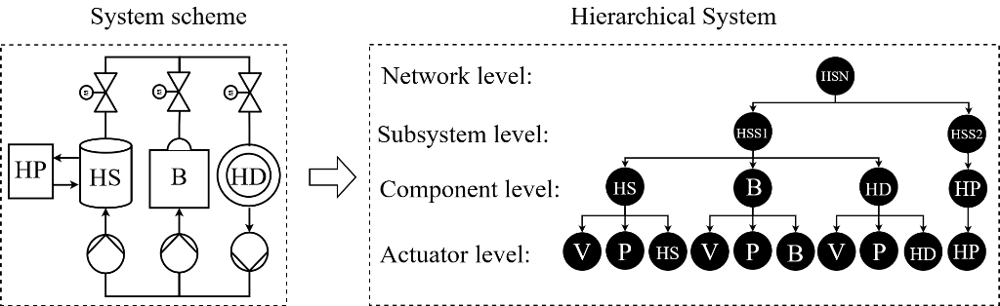

Рисунок 14. Схема та ієрархічна структура системи енергозабезпечення. HSN: мережа теплопостачання; HSS: підсистема теплопостачання; HP: тепловий насос; HS: тепловий акумулятор; B: котел; HD: теплоспоживання; V: клапан; P: насос.

На основі цієї ієрархічної структури також формується ієрархічна схема IFC з об’єктів IfcController, у якій кожному розкладеному об’єкту, такому як кожний компонент, призначається відповідний об’єкт IfcController для фіксації функцій керування всередині цього об’єкта. Функції керування цих об’єктів IfcController описуються за допомогою властивостей IFC. Як показано на рисунку 15, ми виконуємо поетапний процес ідентифікації робочих режимів знизу вгору, тобто від рівня компонентів до рівня мережі, та фіксуємо ці робочі режими як значення перерахувань, що містяться у відповідних об’єктах IfcPropertyEnumerationValue як властивості цих об’єктів IfcController.

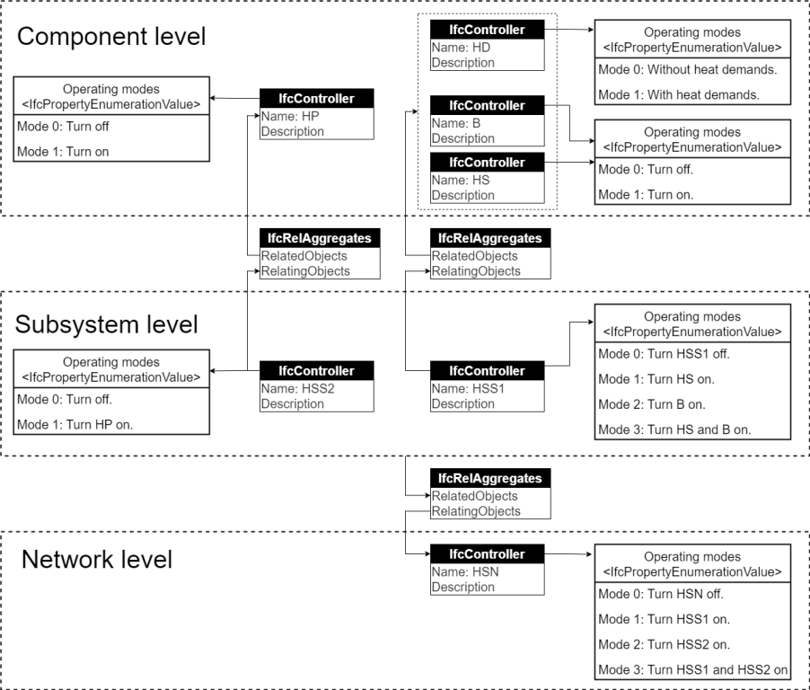

Рисунок 15. Документування ієрархічної структури керування та робочих режимів, застосованих до обраної енергосистеми на основі схеми IFC. HSN: мережа теплопостачання; HSS: підсистема теплопостачання; HP: тепловий насос; HS: тепловий акумулятор; B: котел; HD: теплоспоживання; V: клапан; P: насос.

Для завершення стратегії керування необхідно визначити умови перемикання режимів для цих робочих режимів. На рівні мережі HSN складається з HSS1 та HSS2. Під час роботи HSN підсистема HSS1 може задовольняти теплові потреби, тоді як HSS2 не може безпосередньо подавати тепло споживачу, але заряджає тепловий акумулятор HSS1. Таким чином, ми обираємо Режим 0 та Режим 3 для цього рівня та визначаємо перехід між цими двома робочими режимами залежно від потреби. Коли мережа увімкнена (є потреба), працюватимуть HSS1 та HSS2. Інакше обидві підсистеми вимикаються. На рівні підсистеми робота HSS2 визначається вихідними даними рівня мережі. Якщо HSS2 працює, температура у тепловому акумуляторі додатково визначає роботу теплового насоса у HSS2. При роботі HSS2, якщо тепловий акумулятор порожній, тепловий насос заряджатиме тепловий акумулятор. Інакше тепловий насос вимикається. У HSS1 тепловий акумулятор надає перевагу подачі тепла, якщо HSS1 працює і акумулятор не порожній. Котел підтримує подачу тепла лише тоді, коли акумулятор не може розрядитися для покриття теплоспоживання. На рівні компонентів робота компонентів визначається використовуваним робочим режимом на рівні підсистеми.

Ця стратегія може бути закодована у схемі IFC за допомогою методу документування на основі IFC. Для прикладу ми використовуємо стратегію керування на рівні мережі для опису цього процесу. Як показано на рисунку 16, визначені три екземпляри IfcPropertyEnumerationValue: “Operating modes”, “Transition conditions” та “Output” для HSN, які відповідно містять робочі режими, умови переходів та підсистеми HSN. Ми обираємо значення перерахувань цих екземплярів IfcPropertyEnumerationValue для опису процесу перемикання режимів та фіксуємо їх у екземплярах IfcPropertyListValue. Наприклад, рисунок 16 демонструє перехід від Режиму 0 до Режиму 3, коли останнім використовуваним режимом був Режим 0, і виконується умова переходу, позначена червоним. Режим 3 із (1,1) декодується екземпляром IfcPropertyEnumerationValue “Output” для вказівки, що HSS1 та HSS2 працюватимуть при активації цього режиму. Ці властивості пов’язуються із IfcController HSN за допомогою зв’язку IfcRelDefinedByProperties. Таким чином, бажані умови перемикання режимів на рівні мережі для цієї енергосистеми фіксуються у схемі IFC на основі IfcController HSN та його пов’язаних властивостей.

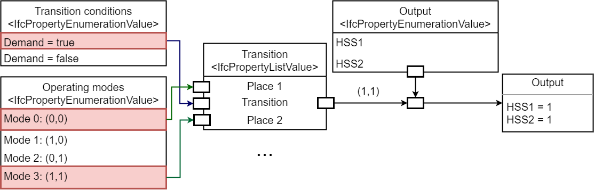

Рисунок 16. Документування стратегії керування для обраної енергосистеми на рівні мережі на основі схеми IFC. HSS: підсистема теплопостачання. 0: вимк.; 1: увімк.

У цьому процесі планування функцій керування дані з датчика температури поданого повітря використовуються для визначення наявності потреби. Датчик температури, що надає температуру поданого повітря, визначається як екземпляр IfcSensor та асоціюється із змінною стану в екземплярах IfcPropertyEnumerationValue “State variables” HSN. Як показано на рисунку 17, IfcController “HSN” визначається екземпляром IfcPropertyEnumerationValue “State variables”, що містить змінну стану, яка відповідає умовам переходу, та встановлює зв’язок із датчиком за допомогою IfcRelNests, IfcDistributionPort та IfcRelConnectPorts. Для спрощення візуалізації на рисунку 17 опущено зв’язок між IfcRelNests та IfcSensor.

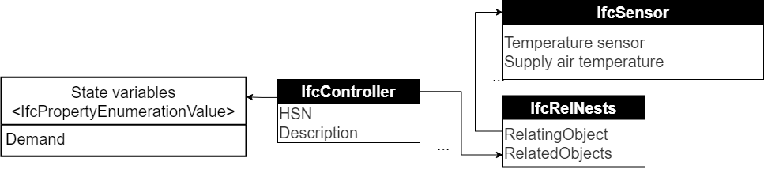

Рисунок 17. IfcController “HSN”, визначений екземпляром IfcPropertyEnumerationValue “State variables” для перерахування відповідної змінної стану функції керування та асоційований із датчиком температури, представленим об’єктом IfcSensor. HSN: мережа теплопостачання.

На основі процесу документування розроблена стратегія керування на основі режимів задокументована у файлі IFC та буде використана на наступному етапі реалізації.

### 3.2. Реалізація стратегії керування на основі режимів шляхом генерації коду ПЛК для обраної енергосистеми

Згенерований у розділі 3.1 файл IFC імпортується у розроблене програмне забезпечення через графічний інтерфейс користувача (GUI). Як показано на рисунку 18, ієрархічна схема IFC з екземплярів IfcController відображається у відповідну програму ПЛК. Для кожного IfcController генерується відповідний функціональний блок. Виходи цих функціональних блоків можуть безпосередньо записувати властивості інших функцій керування або асоціюватися з відповідними глобальними змінними (GVL), які можуть викликатися іншими функціональними блоками. Наприклад, виходи функціонального блоку FB_HSN — це поточно активний робочий режим HSN, який асоційований з глобальною змінною “GVL.HSNModiMode”. Вихідна функція цього режиму впливає на рівень підсистем, записуючи публічні властивості “Mode” у функціональних блоках HSS1 та HSS2 (див. рисунок 18).

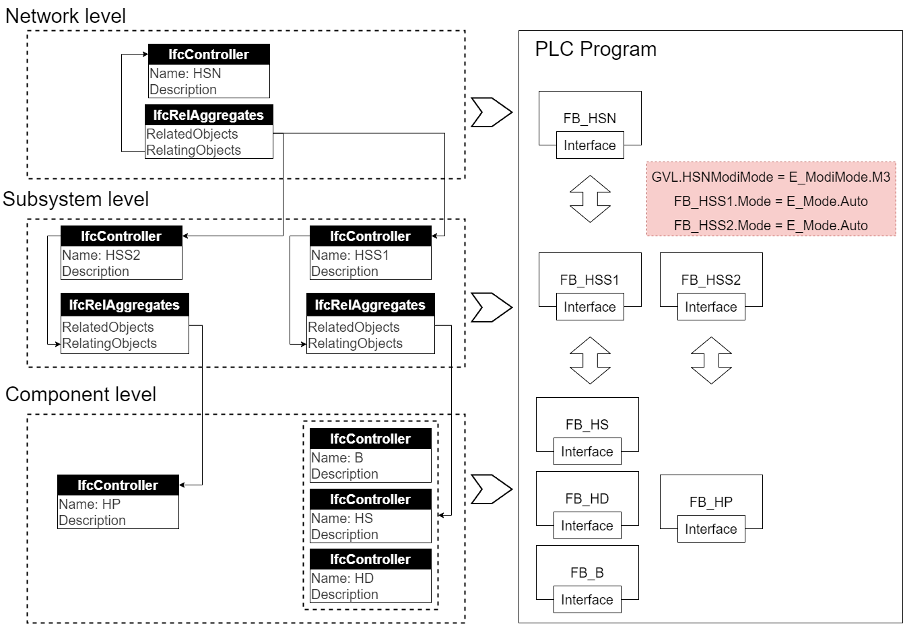

Рисунок 18. Реалізація бажаної стратегії керування на основі режимів, описаної у схемі IFC, у ПЛК. PLC: програмований логічний контролер; HSN: мережа теплопостачання; HSS: підсистема теплопостачання; HP: тепловий насос; HS: тепловий акумулятор; B: котел; HD: теплоспоживання; FB: функціональний блок; E_Mode: тип змінної перерахування у коді ПЛК для опису методів FB; E_ModiMode: тип змінної перерахування у коді ПЛК для опису робочих режимів.

Для згенерованих FB на рисунку 18 попередньо визначені об’єктно-орієнтовані шаблони формують структури цих FB, а задокументовані набори властивостей IFC транслюються у сегменти коду ST, реалізовані у цих FB. Наприклад, на рівні мережі генерується FB для HSN на основі шаблону мережі, як показано на рисунку 19. Метод Auto реалізує логіку керування для визначення поточного використовуваного робочого режиму, тоді як Off вимикає всю мережу. FB також реалізує відповідну змінну стану Demand як властивість, забезпечуючи зовнішній інтерфейс для зчитування та запису цієї змінної. Під час роботи цього FB, якщо Demand істинне, викликається метод Auto для виконання необхідної функції керування на цьому рівні, а результат записується у властивість Mode. Demand може бути встановлене від зовнішнього датчика та системного модуля для визначення використовуваного робочого режиму на цьому рівні. Наприклад, якщо Demand істинне, активується режим M3 на рівні мережі. Відповідно, вихідна функція передає цей результат до FB HSS1 та HSS2 шляхом запису їх властивостей Mode (див. рисунок 19). На рівні підсистем згенеровані FB аналогічні FB на рівні мережі.

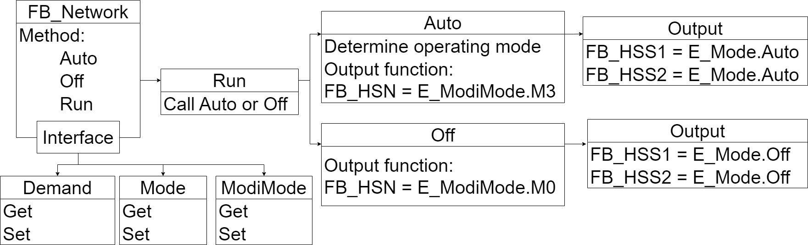

Рисунок 19. Графічна структура згенерованого функціонального блоку на рівні мережі для виконання бажаного алгоритму керування на основі режимів. HSN: мережа теплопостачання; HSS: підсистема теплопостачання; FB: функціональний блок; E_Mode: тип змінної перерахування у коді ПЛК для опису визначених методів FB; E_ModiMode: тип змінної перерахування у коді ПЛК для опису робочих режимів.

На рівні компонентів використовується FB для керування дросельним контуром шляхом зчитування типу контуру у IFC для HD. Цей FB параметризується через GUI, де встановлюється температура подачі 19 °C, а PID-регулятор параметризується для керування відкриттям клапана з метою підтримки температури поданого повітря. Для насоса цього контуру ми обираємо насос Grundfos з комунікаційним інтерфейсним модулем CIM/CIU 300, що підтримує BACnet MS/TP [71] для цього випадку використання, та визначаємо FB клієнта BACnet для реалізації керування насосом. У технічній документації зазначено, що комунікаційний інтерфейсний модуль забезпечує об'єкт багатостановочного виходу (MO) для встановлення режиму керування насосом та аналоговий вихід (AO) для завдання уставки (див. таблицю 3). Для насоса доступні кілька режимів керування шляхом активації MO відповідним сигналом. Як показано на рисунку 20, відповідно до технічної документації, ми визначаємо FB для насоса, а потім реалізуємо ці два вихідні об’єкти насоса через GUI. Крім того, у GUI визначається змінна перерахування для ідентифікації режимів керування через MO. У цьому випадку використання ми обираємо режим керування “Постійна швидкість” з частотою обертання 60%, запустивши насос.

Таблиця 3. Об'єкт багатостановочного виходу для встановлення режиму керування для обраного насоса, оснащеного комунікаційним інтерфейсним модулем CIM/CIU 300 [71].

| Тип об'єкта            | ID   | Назва           | Опис                                                         |
| ---------------------- | ---- | --------------- | ------------------------------------------------------------ |
| Multistate output (MO) | 0    | Set controlmode | 1: Постійна швидкість2: Постійний тиск3: Пропорційний тиск... |
| Analog output (AO)     | 0    | Set setpoint    | Встановлення уставки насоса                                  |

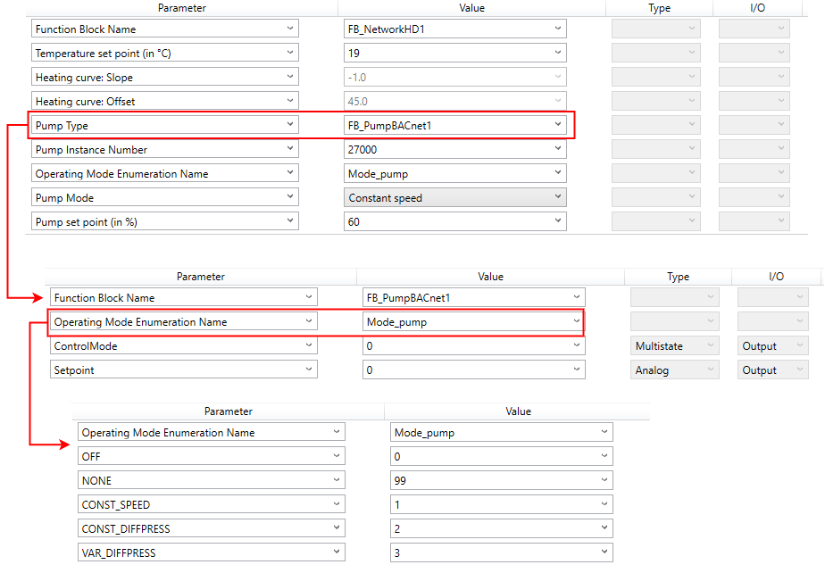

Рисунок 20. Параметризація FB для дросельного контуру як споживача енергії та насоса, застосованого у дросельному контурі.

### 3.3. Оцінювання реалізованої стратегії керування за допомогою моделювання

У цьому розділі ми моделюємо енергосистему мовою моделювання Modelica [59] (далі — модель системи) та використовуємо Functional Mock-up Interface (FMI) [72] для інтеграції моделі системи у Python. Згенеровану програму ПЛК також можна інтегрувати у Python за допомогою пакету Pyads [73]. Після цього проводиться оцінювання програми ПЛК на основі моделювання для перевірки відповідності функціоналу програми ПЛК запланованим функціям керування.

Для моделювання системи використовуємо Modelica Standard Library, Aixlib [74] та Buildings [75]. Aixlib забезпечує модель акумулятора та модель теплового насоса, що включає виміряні дані для відображення продуктивності теплового насоса. Модель котла з бібліотеки Buildings використовується із можливістю параметризації типу палива, уставки температури та необхідної потужності котла. Виміряні дані комерційної будівлі у Люнебурзі імпортуються як умови [18,76]. Як показано на рисунку 21, ці виміряні дані включають температуру довкілля та теплоспоживання будівлі протягом двох тижнів січня. Температура випаровувача та температура конденсатора для теплового насоса відповідно задані як 14 °C та 45 °C. Бажана температура мережі теплопостачання становить 40 °C, тому акумулятор має повністю заряджатись при температурі акумулятора (THS) > 45 °C та повністю розряджатись при THS < 40 °C, щоб забезпечити досягнення необхідної температури мережі. Виходячи з цього, SOC встановлюється у FALSE при THS > 45 °C та у TRUE при THS < 40 °C. У діапазоні між 40 °C та 45 °C SOC не змінюється. Аналогічно SOC, SOD встановлюється у FALSE при THS < 40 °C та у TRUE при THS > 43 °C.

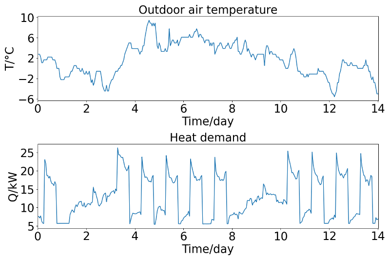

Рисунок 21. Температура довкілля та теплоспоживання комерційної будівлі у Люнебурзі протягом двох тижнів січня.

Модель системи перетворюється у Functional Mock-up Unit (FMU), після чого імпортується у Python для проведення моделювання. На рисунку 22 показано процес моделювання. На кожному кроці часу моделювання модель системи виконується та надає поточний стан системи. Відповідні змінні стану зіставляються із відповідними входами програми ПЛК, яка визначає використовувані робочі режими відповідно до запланованої логіки керування та отриманих вхідних даних. Ці визначені режими можуть далі керувати моделлю системи через відповідні інтерфейси.

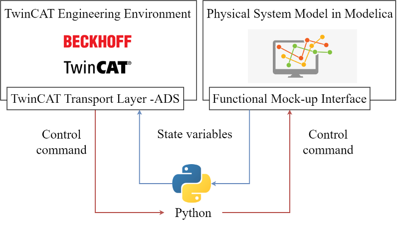

Рисунок 22. Інтеграція моделі системи та контролера ПЛК у Python.

На рисунку 23 показані результати моделювання моделі системи та програми ПЛК на рівні мережі та підсистеми. При наявності потреби на рівні мережі завжди активується робочий режим M3, що переводить методи Підсистеми 1 та Підсистеми 2 у режим Auto. На рівні підсистем, якщо контролери Підсистеми 1 та Підсистеми 2 встановлені у Auto, температура акумулятора визначає робочі режими обох підсистем. Якщо THS > 45 °C, активується M0 Підсистеми 2, що зупиняє заряджання акумулятора тепловим насосом. При THS < 40 °C використовуються M3 для Підсистеми 1 та M1 для Підсистеми 2 для підтримки теплопостачання та заряджання акумулятора відповідно. Робочий режим Підсистеми 1 переключається на M1 при THS > 43 °C. Ці перемикання режимів відповідають запланованій стратегії керування.

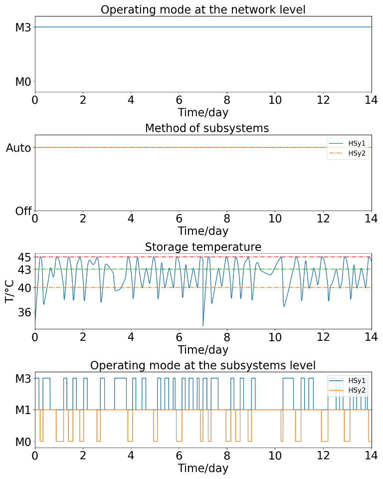

Рисунок 23. Результати моделювання моделі системи та програми ПЛК на рівні мережі та підсистеми протягом двох тижнів січня. M: робочий режим; HSy: система теплопостачання.

Для аналізу поведінки системи на рівні підсистем та компонентів розглядається робота Підсистеми 1 як приклад. Як показано на рисунку 24, робочий режим Підсистеми 1 визначає використовувані методи для акумулятора та котла, при цьому M1 активує Auto для акумулятора та Off для котла, а M3 активує Auto для обох компонентів. У режимі Auto акумулятор та котел дійсно забезпечують подачу тепла відповідно до потреб, що показано на третій підділянці рисунку 24. Результат керування представлений температурою поданого повітря, що коливається навколо уставки (19 °C).

На основі цих аналізів підтверджується, що запланована стратегія керування реалізована у ПЛК. У ієрархічній структурі ПЛК вихід контролерів на вищому рівні визначає використовуваний метод FB (Off або Auto) контролерів на нижчому рівні. У межах цих двох методів реалізується запланована логіка керування для визначення використовуваних робочих режимів. Вихід налаштованого ПЛК, тобто робочі режими на рівні компонентів, можна імпортувати у модель системи у Modelica для визначення поведінки системи через Functional Mock-up Interface. Згідно із стратегією керування, температура поданого повітря утримується навколо уставки з похибкою в межах 1 °C.

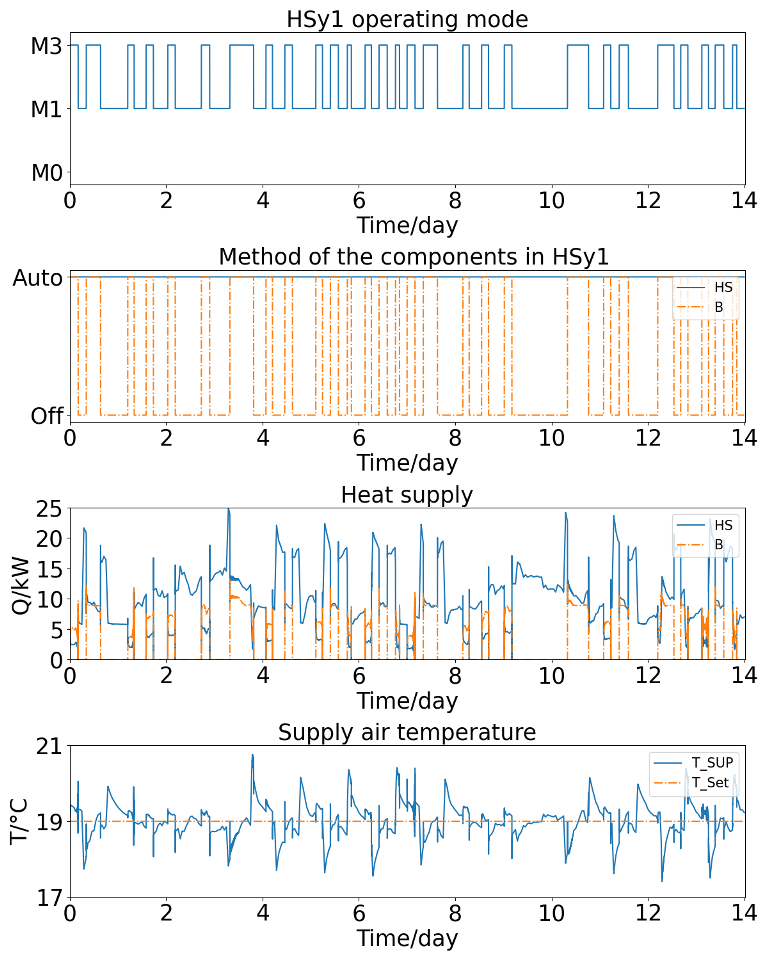

Рисунок 24. Результати моделювання моделі системи та програми ПЛК на рівні підсистеми та компонентів протягом двох тижнів січня. M: робочий режим; HSy: система теплопостачання; HS: тепловий акумулятор; B: котел; T_SUP: температура поданого повітря; T_Set: уставка температури.

### 3.4. Обговорення

Результати прикладу використання демонструють методологію документування алгоритмів керування на основі режимів у схемі IFC та автоматичної реалізації цих алгоритмів у ПЛК для систем енергозабезпечення будівель (BES). На основі програмно підтримуваного підходу стратегія керування, задокументована у IFC, конфігурується у ПЛК шляхом автоматичної генерації коду ST та подальшого тестування на етапі моделювання.

Виходячи з MODI, алгоритми керування на основі режимів проєктуються у заздалегідь визначеній ієрархічній структурі та описуються у SIPN на етапі проєктування BACS. Для цих алгоритмів ми розробили структуру документування у схемі IFC, яка складається з ієрархічно структурованих сутностей IfcController, що дозволяє забезпечити одноразову відповідність від алгоритмів, описаних у SIPN, до алгоритмів, описаних у IFC. У цьому процесі ієрархія алгоритмів та відповідна логіка керування відображаються у вигляді ієрархічно вкладених сутностей IfcController та відповідних наборів властивостей. Ця структура представляє ієрархію керування та фіксує всі запроєктовані перемикання режимів у форматі списку у схемі IFC. Таким чином, немає потреби у додатковій інтерпретації між етапом проєктування та процесом документування. Проєктанти також можуть безпосередньо перевіряти перелічені шаблони місце-перехід-місце відповідно до ієрархії керування для забезпечення точного документування запланованої логіки керування. Крім того, ця структура документування повністю базується на існуючій схемі IFC, що дозволяє безпосередньо інтегрувати її у робочі процеси будівельних проєктів, у яких використовуються BIM та IFC.

У процесі реалізації одноразова відповідність додатково використовується для перетворення даних IFC у програму ПЛК. Для збереження ієрархічної структури керування програма ПЛК у прикладі використання складається з ієрархічно побудованих POU, що відображають ієрархічно вкладені сутності IfcController. У межах сутності IfcController кожен шаблон місце-перехід-місце, зафіксований у його наборі властивостей, реалізується у вигляді конструкції IF для виконання відповідного процесу перемикання режимів. Після перемикання режиму реалізується серія конструкцій IF для перевірки визначеного режиму та виклику його вихідної функції. Такий метод реалізації дозволяє уникнути створення складної логіки умов IF для перемикання режимів, оскільки створюються окремі конструкції IF для кожного шаблону місце-перехід-місце, що суттєво зменшує складність і кількість помилок під час автоматизованої генерації коду та допомагає програмістам розуміти та перевіряти згенерований код. Крім того, розроблене програмне забезпечення полегшує застосування автоматизованого підходу до реалізації. У прикладі використання достатньо запустити Python-скрипт для конвертації даних IFC, а потім імпортувати отриманий файл JSON через GUI. Усі POU, які потрібно згенерувати, відображаються з параметрами у GUI. Параметри, зафіксовані у IFC, можна перевірити у GUI, і є можливість доповнити відсутню інформацію у даних IFC, яка може вперше визначатися на етапі реалізації.

Результати моделювання підтверджують доцільність методології реалізації алгоритмів керування на основі режимів у ПЛК. ПЛК забезпечує процес перемикання режимів в ієрархічній структурі керування та відповідно визначає використовувані робочі режими згідно із запланованою стратегією керування. Фактична температура поданого повітря відповідає вимогам керування, утримуючись навколо уставки з похибкою в межах 1 °C.

Уся процедура застосування інструменту для генерації програми ПЛК у прикладі використання займає 15 хвилин, включаючи імпорт файлу IFC, запуск Python-скрипту для конвертації файлу IFC у файл JSON, перевірку та доповнення параметрів для всіх використовуваних FB та генерацію програми ПЛК. Інформацію про згенеровану програму наведено у таблиці 4. Для порівняння проводимо ручне програмування програми ПЛК для реалізації запроєктованої логіки керування з використанням стандартних об’єктів FB. Цей процес займає 2 години, якщо програміст має глибокі знання програмування ПЛК та методів реалізації алгоритмів керування на основі режимів. Час буде ще більшим, якщо програміст вручну реалізовуватиме весь код програми без використання цих об’єктів. Таким чином, використання цієї методології дозволяє суттєво скоротити час та витрати на програмування.

Таблиця 4. Інформація про згенеровану програму ПЛК у прикладі використання.

| Параметр                              | Кількість |
| ------------------------------------- | --------- |
| Функціональні блоки (Function Blocks) | 7         |
| Методи (Methods)                      | 21        |
| Глобальні змінні (Global Variables)   | 23        |
| Локальні змінні (Local Variables)     | 71        |

## 4. Висновки

Програмування функцій керування у BACS завжди є трудомістким та затратним за часом завданням у будівельних проєктах. Цифровізація документування логіки керування у BACS досі недостатньо розвинена. У цій роботі представлено метод документування для фіксації алгоритмів керування на основі режимів у схемі IFC та програмно підтримуваний метод для автоматичної генерації коду ПЛК мовою Structured Text для реалізації алгоритмів керування на основі режимів у BACS. Ієрархічна структура керування алгоритмів керування на основі режимів була перетворена в ієрархічно структуровані сутності IfcController, тоді як логіки керування, описані у SIPN, були відображені у попередньо визначені сутності IfcPropertySet, пов’язані з відповідними сутностями IfcController. На основі цієї структури документування у даних IFC було застосовано одноразову відповідність для перетворення даних IFC у сегменти коду Structured Text в ієрархічно структурованій програмі ПЛК. Кожна сутність IfcController була реалізована у функціональному блоці шляхом трансляції її набору властивостей у код Structured Text. Цей метод генерації коду був запрограмований у інструменті, що забезпечує GUI для імпорту даних IFC та візуалізації та перевірки згенерованих FB. Ми використали цей інструмент для реалізації алгоритму керування на основі режимів для мережі теплопостачання у прикладі використання та протестували згенеровану програму ПЛК на етапі моделювання. Результати прикладу використання довели, що запланований алгоритм керування на основі режимів був дійсно зафіксований у даних IFC та зчитаний інструментом для генерації відповідної програми ПЛК. У даних IFC ієрархічні сутності IfcController та їхні властивості відображали бажану структуру керування та логіку керування, описану у сигнально-інтерпретованих мережах Петрі. Ці дані IFC були успішно реалізовані у програмі ПЛК для виконання бажаної логіки керування та визначення використовуваних робочих режимів.

Метод документування на основі IFC дозволяє інтегрувати проєктування логіки керування для BACS безпосередньо у поточні робочі процеси будівельних проєктів, використовуючи IFC як цифрове джерело даних. Цей метод розроблено на основі існуючої схеми IFC, і не потрібно додаткових зусиль для розширення схеми IFC для документування алгоритмів керування. Крім того, використання цього інструменту дозволило значно скоротити витрати часу та кількість помилок під час програмування. Замість ручного програмування повних програм ПЛК або копіювання-вставки з подальшою переконфігурацією існуючих програм, програмістам потрібно лише імпортувати дані IFC, після чого перевірити та доповнити кожен FB для реалізації алгоритмів керування. У цьому процесі програмісти можуть зосередитися лише на параметризації FB на кожному рівні, не потребуючи побудови всіх алгоритмів керування у ПЛК та загального огляду складних зв’язків керування. Реалізовані алгоритми керування також можуть містити гнучкішу логіку керування, ніж копіювання з існуючих програм ПЛК. Проте важливо зазначити, що деякі функції керування, такі як ПІД-регулятори, у згенерованих програмах ПЛК потребують налаштування для узгодження зі специфічними вимогами системи. Крім того, користувачам необхідно перевіряти та доповнювати параметри функціональних блоків, якщо у форматі IFC відсутні деякі параметри.

У майбутніх дослідженнях планується проведення апаратного тестування за методом hardware-in-the-loop для подальшої оцінки цієї методології у практичній фазі. Стандартні алгоритми керування на основі режимів для агрегатів обробки повітря також будуть інтегровані у цю методологію як конкретний приклад використання для розширення її застосування.

**Внесок авторів:** концепція — X.C.; методологія — X.C., Z.J. та H.L.; програмне забезпечення — X.C. та Z.J.; валідація — X.C.; формальний аналіз — X.C.; дослідження — X.C.; ресурси — X.C.; підготовка початкового рукопису — X.C.; редагування та рецензування — Z.J., H.L. та A.K.; візуалізація — X.C.; керівництво проєктом — D.M.; адміністрування проєкту — A.K.; залучення фінансування — D.M. Усі автори прочитали та погодились з опублікованою версією рукопису.

**Фінансування:** Автори висловлюють щиру подяку за фінансову підтримку, надану Федеральним міністерством економіки та захисту клімату Німеччини (BMWK), референси фінансування (03EN3026C) та (03EN3034A).

**Декларація про доступність даних:** Дані доступні за запитом. Дані, представлені у цьому дослідженні, наразі не доступні для публічного доступу. Публікація анонімізованих та агрегованих даних готується.

**Подяки:** Автори щиро дякують співробітникам EBC за їхню роботу.

**Конфлікт інтересів:** Автори заявляють про відсутність конфлікту інтересів.

## References

1. Buildings: A Source of Enormous Untapped Efficiency Potential. Available online: https://www.iea.org/topics/buildings (accessed on 24 October 2023).
2. de Wilde, P. The gap between predicted and measured energy performance of buildings: A framework for investigation. Autom. Constr. 2014, 41, 40–49. [CrossRef]
3. Jain, N. Reducing the Performance Gap Using Calibrated Simulation Models. Doctoral Dissertation, UCL (University College London), London, UK, 2021.
4. Lei, X.; Chen, Y.; Bergés, M.; Akinci, B. Formalized control logic fault definition with ontological reasoning for air handling units. Autom. Constr. 2021, 129, 103781. [CrossRef]
5. Schneider, G.F.; Kontes, G.D.; Qiu, H.; Silva, F.J.; Bucur, M.; Malanik, J.; Schindler, Z.; Andriopolous, P.; de Agustin-Camacho, P.; Romero-Amorrortu, A.; et al. Design of knowledge-based systems for automated deployment of building management services. Autom. Constr. 2020, 119, 103402. [CrossRef]
6. Mishra, S.; Glaws, A.; Cutler, D.; Frank, S.; Azam, M.; Mohammadi, F.; Venne, J.S. Unified architecture for data-driven metadata tagging of building automation systems. Autom. Constr. 2020, 120, 103411. [CrossRef]
7. Ruiz-Zafra, A.; Benghazi, K.; Noguera, M. IFC+: Towards the integration of IoT into early stages of building design. Autom. Constr. 2022, 136, 104129. [CrossRef]
8. Abdel Haleem, S.M.; Pavlak, G.S.; Bahnfleth, W.P. Impact of control loop performance on energy use, air quality, and thermal comfort in building systems with advanced sequences of operation. Autom. Constr. 2021, 130, 103837. [CrossRef]
9. EN 15232-1:2017; Energy Performance of Buildings—Energy performance of buildings—Part 1: Impact of Building Automation, Controls and Building Management—Modules M10-4,5,6,7,8,9,10. Autom. Constr. 2022. Available online: https://standards.iteh.ai/catalog/standards/cen/d9e4b452-93a7-4b7e-b8f8-90e37adddbc2/en-15232-1-2017 (accessed on 24 October 2023).
10. Schneider, G.F.; Pauwels, P.; Steiger, S. Ontology-Based Modeling of Control Logic in Building Automation Systems. IEEE Trans. Ind. Inform. 2017, 13, 3350–3360. [CrossRef]
11. Pauwels, P.; Terkaj, W. EXPRESS to OWL for construction industry: Towards a recommendable and usable ifcOWL ontology. Autom. Constr. 2015, 63, 100–133. [CrossRef]
12. Strahilov, A.; Hämmerle, H. Engineering Workflow and Software Tool Chains of Automated Production Systems. In Multi-Disciplinary Engineering for Cyber-Physical Production Systems: Data Models and Software Solutions for Handling Complex Engineering Projects; Biffl, S., Lüder, A., Gerhard, D., Eds.; Springer International Publishing: Berlin/Heidelberg, Germany, 2017; pp. 207–234. [CrossRef]
13. Corry, E.; Pauwels, P.; Hu, S.; Keane, M.; O’Donnell, J. A performance assessment ontology for the environmental and energy management of buildings. Autom. Constr. 2015, 57, 249–259. [CrossRef]
14. Wetter, M.; Ehrlich, P.; Gautier, A.; Grahovac, M.; Haves, P.; Hu, J.; Prakash, A.; Robin, D.; Zhang, K. OpenBuildingControl: Digitizing the control delivery from building energy modeling to specification, implementation and formal verification. Energy 2021, 238, 121501. [CrossRef]
15. Wang, W.; Brambley, M.R.; Kim, W.; Somasundaram, S.; Stevens, A.J. Automated point mapping for building control systems: Recent advances and future research needs. Autom. Constr. 2017, 85, 107–123. [CrossRef]
16. Wong, J.K.W.; Ge, J.; He, S.X. Digitisation in facilities management: A literature review and future research directions. Autom. Constr. 2018, 92, 312–326. [CrossRef]
17. Cai, X.; Xue, J.; Kümpel, A.; Müller, D. Automated Modelling of Building Energy Systems with Mode-Based Control Algorithms in Modelica; J. Phys. Conf. Ser. 2021, 2042, 012067. [CrossRef]
18. Cai, X.; Schild, T.; Kümpel, A.; Müller, D. MODI: A Structured Development Process of Mode-Based Control Algorithms in the Early Design Stage of Building Energy Systems. Buildings 2023, 13, 267. [CrossRef]
19. Cai, X.; Schild, T.; Schreiber, T.; Baranski, M.; Müller, D. Modeling of Petri-Net-based control algorithms for the simulation-based improvement of the planning process of building energy systems. J. Phys. Conf. Ser. 2019, 1343, 012123. [CrossRef]
20. Cai, X.; Shi, R.; Kümpell, A.; Müller, D. Automated generation of PLC code for implementing mode-based control algorithms in buildings. In Proceedings of the 2022 30th Mediterranean Conference on Control and Automation (MED), Vouliagmeni, Greece, 28 June–1 July 2022; pp. 1087–1092. ISSN: 2473-3504. [CrossRef]
21. Afsari, K.; Eastman, C.M.; Castro-Lacouture, D. JavaScript Object Notation (JSON) data serialization for IFC schema in web-based BIM data exchange. Autom. Constr. 2017, 77, 24–51. [CrossRef]
22. Pereira, V.; Santos, J.; Leite, F.; Escórcio, P. Using BIM to improve building energy efficiency – A scientometric and systematic review. Energy Build. 2021, 250, 111292. [CrossRef]
23. Tang, S.; Shelden, D.R.; Eastman, C.M.; Pishdad-Bozorgi, P.; Gao, X. BIM assisted Building Automation System information exchange using BACnet and IFC. Autom. Constr. 2019, 110, 103049. [CrossRef]
24. Ying, H.; Lee, S. An algorithm to facet curved walls in IFC BIM for building energy analysis. Autom. Constr. 2019, 103, 80–103. [CrossRef]
25. Alavi, H.; Bortolini, R.; Forcada, N. BIM-based decision support for building condition assessment. Autom. Constr. 2021, 135, 104117. [CrossRef]
26. Dong, B.; O’Neill, Z.; Li, Z. A BIM-enabled information infrastructure for building energy Fault Detection and Diagnostics. Autom. Constr. 2014,44, 197–211. [CrossRef]
27. Revit Software|Get Prices & Buy Official Revit 2023. Available online: https://www.autodesk.com/products/revit/overview (accessed on 24 October 2023).
28. Archicad Software. Available online: https://graphisoft.com/solutions/archicad (accessed on 24 October 2023).
29. ISO 16739-1:2018; Industry Foundation Classes (IFC) for data sharing in the construction and facility management industries, Part 1: Data schema. International Organization for Standardization: Geneva, Switzerland, 2018. Available online: https://www.iso.org/standard/70303.html (accessed on 24 October 2023).
30. Seidenschnur, M.; Kücükavci, A.; Fjerbæk, E.V.; Smith, K.M.; Pauwels, P.; Hviid, C.A. A common data environment for HVAC design and engineering. Autom. Constr. 2022, 142, 104500. [CrossRef]
31. Quinn, C.; Shabestari, A.Z.; Misic, T.; Gilani, S.; Litoiu, M.; McArthur, J.J. Building automation system—BIM integration using a linked data structure.  Autom. Constr. 2020, 118, 103257. [CrossRef]
32. Gao, X.; Pishdad-Bozorgi, P. BIM-enabled facilities operation and maintenance: A review. Adv. Eng. Inform. 2019, 39, 227–247. [CrossRef]
33. Sporr, A.; Zucker, G.; Hofmann, R. Automatically Creating HVAC Control Strategies Based on Building Information Modeling (BIM): Heat Provisioning and Distribution. Energies 2020, 13, 4403. [CrossRef]
34. Gao, H.; Koch, C.; Wu, Y. Building information modelling based building energy modelling: A review. Appl. Energy 2019, 238, 320–343. [CrossRef]
35. Cerovsek, T. A review and outlook for a ‘Building Information Model’ (BIM): A multi-standpoint framework for technological development. Adv. Eng. Inform. 2011, 25, 224–244. [CrossRef]
36. Jia, M.; Komeily, A.; Wang, Y.; Srinivasan, R.S. Adopting Internet of Things for the development of smart buildings: A review of enabling technologies and applications. Autom. Constr. 2019, 101, 111–126. [CrossRef]
37. Merz, H.; Hansemann, T.; Hübner, C. Building Automation; Signals and Communication Technology; Springer International Publishing: Berlin/Heidelberg, Germany, 2018. [CrossRef]
38. Martirano, L.; Mitolo, M. Building Automation and Control Systems (BACS): a Review. In Proceedings of the 2020 IEEE International Conference on Environment and Electrical Engineering and 2020 IEEE Industrial and Commercial Power Systems Europe (EEEIC/I CPS Europe), Madrid, Spain, 9–12 June 2020; pp. 1–8. [CrossRef]
39. Domingues, P.; Carreira, P.; Vieira, R.; Kastner, W. Building automation systems: Concepts and technology review. Comput. Stand. Interfaces 2015, 45, 1–12. [CrossRef]
40. Quezada, J.C.; Medina, J.; Flores, E.; Seck Tuoh, J.C.; Hernández, N. Formal design methodology for transforming ladder diagram to Petri nets. Int. J. Adv. Manuf. Technol. 2014, 73, 821–836. [CrossRef]
41. IEC 61131-3:2013; Programmable Controllers-Part 3: Programming Languages. International Electrotechnical Commission: Geneva, Switzerland, 2010.
42. Werner, B. Object-oriented extensions for IEC 61131-3. IEEE Ind. Electron. Mag. 2014, 3, 36–39. [CrossRef]
43. Chen, Y.; Dai, W.; Zhang, Z.; Pang, C.; Vyatkin, V. A Case Study on Knowledge Driven Code Generation for Software-Defined Industrial Cyber-Physical Systems. In Proceedings of the IECON 2018—44th Annual Conference of the IEEE Industrial Electronics Society, Washington, DC, USA, 21–23 October 2018; pp. 4687–4692. ISSN: 2577-1647. [CrossRef]
44. Estévez, E.; Marcos, M.; Orive, D. Automatic generation of PLC automation projects from component-based models. Int. J. Adv. Manuf. Technol. 2007, 35, 527–540. [CrossRef]
45. Vogel-Heuser, B.; Fischer, J.; Feldmann, S.; Ulewicz, S.; Rösch, S. Modularity and architecture of PLC-based software for automated production Systems: An analysis in industrial companies. J. Syst. Softw. 2017, 131, 35–62. [CrossRef]
46. Zhang, J.; Ahmad, B.; Harrison, R.; Colombo, A.W.; Raasch, S. An approach for resource Function Block generation: Towards RAMI4.0-compliant PLC Programming. In Proceedings of the 2020 IEEE 18th International Conference on Industrial Informatics (INDIN), Warwick, UK, 20–23 July 2020; Volume 1, pp. 595–600. ISSN: 2378-363X. [CrossRef]
47. Jbair, M.; Ahmad, B.; Ahmad, M.H.; Vera, D.; Harrison, R.; Ridler, T. Automatic PLC Code Generation Based on Virtual Engineering Model. In Proceedings of the 2019 IEEE International Conference on Industrial Cyber Physical Systems (ICPS), Taipei, Taiwan, 6–9 May 2019; pp. 675–680. [CrossRef]
48. Armentia, A.; Estévez, E.; Orive, D.; Marcos, M. A Tool Suite for Automatic Generation of Modular Machine Automation Projects. In Proceedings of the 2018 IEEE 16th International Conference on Industrial Informatics (INDIN), Porto, Portugal, 18-20 July 2018; pp. 553–558. ISSN: 2378-363X. [CrossRef]
49. Fischer, J.; Vogel-Heuser, B.; Friedrich, D. Configuration of PLC software for automated warehouses based on reusable components- an industrial case study. In Proceedings of the 2015 IEEE 20th Conference on Emerging Technologies & Factory Automation (ETFA), Luxembourg, 8–11 September 2015; pp. 1–7. ISSN: 1946-0759. [CrossRef]
50. Pavlovskyi, Y.; Kennel, M.; Schmucker, U. Template-Based Generation of PLC Software from Plant Models Using Graph Representation. In Proceedings of the 2018 25th International Conference on Mechatronics and Machine Vision in Practice (M2VIP), Stuttgart, Germany, 20–22 November 2018; pp. 1–8. [CrossRef]
51. Darvas, D.; Viñuela, E.B.; Majzik, I. PLC code generation based on a formal specification language. In Proceedings of the 2016 IEEE 14th International Conference on Industrial Informatics (INDIN), Poitiers, France, 19–21 July 2016; pp. 389–396. ISSN: 2378-363X. [CrossRef]
52. Weiß, M.; Marks, P.; Maschler, B.; White, D.; Kesseli, P.; Weyrich, M. Towards establishing formal verification and inductive code synthesis in the PLC domain. In Proceedings of the 2021 IEEE 19th International Conference on Industrial Informatics (INDIN), Palma de Mallorca, Spain, 21–23 July 2021; pp. 1–8. [CrossRef]
53. Barbosa, H.; Déharbe, D. Formal Verification of PLC Programs Using the B Method. In Abstract State Machines, Alloy, B, VDM, and Z; Lecture Notes in Computer Science; Derrick, J., Fitzgerald, J., Gnesi, S., Khurshid, S., Leuschel, M., Reeves, S., Riccobene, E., Eds.; Springer: Berlin/Heidelberg, Germany, 2012; pp. 353–356. [CrossRef]
54. Darvas, D.; Majzik, I.; Blanco Viñuela, E. Formal Verification of Safety PLC Based Control Software. In Integrated Formal Methods; Lecture Notes in Computer Science; Ábrahám, E., Huisman, M., Eds.; Springer International Publishing: Berlin/Heidelberg, Germany, 2016; pp. 508–522. [CrossRef]
55. Jbair, M.; Ahmad, B.; Ahmad, M.H.; Harrison, R. Industrial cyber physical systems: A survey for control-engineering tools. In Proceedings of the 2018 IEEE Industrial Cyber-Physical Systems (ICPS), St. Petersburg, Russia, 15–18 May 2018; pp. 270–276. [CrossRef]
56. Germany, Hülshorstweg 20, .V.B.A.G..C.K. TwinCAT|Automation software. Available online: https://www.beckhoff.com/enen/products/automation/twincat/ (accessed on 24 October 2023).
57. UAG Unity Application Generator|Schneider Electric Egypt. Available online: https://www.se.com/eg/en/product-range/628-uag-unity-application-generator/ (accessed on 24 October 2023).
58. Mitsubishi Adroit Process Suite (MAPS)|Maps SCADA.
59. Modelica Language—Modelica Association. Available online: https://modelica.org/modelicalanguage.html (accessed on 24 October 2023).
60. Chen, Y.; Treado, S.J.; Messner, J.I. Building HVAC control knowledge data schema—Towards a unified representation of control system knowledge. Autom. Constr. 2016, 72, 174–186. [CrossRef]
61. Chen, Y. Building Control Knowledge Information Modeling and Control Self-Configuration. Ph.D. Thesis, Pennsylvania State University, State College, PA, USA, 2015.
62. Benndorf, G.; Réhault, N.; Clairembault, M.; Rist, T. Describing HVAC controls in IFC – Method and application. Energy Procedia 2017, 122, 319–324. [CrossRef]
63. Krima, S.; Barbau, R.; Fiorentini, X.; Rachuri, S.; Sriram, R. OntoSTEP: OWL-DL ontology for STEP. In Proceedings of the International Conference on Product Lifecycle Management PLM’09 Publication, Bath, UK, 6–8 July 2009.
64. Barbau, R.; Krima, S.; Rachuri, S.; Narayanan, A.; Fiorentini, X.; Foufou, S.; Sriram, R.D. OntoSTEP: Enriching product model data using ontologies. Comput.-Aided Des. 2012, 44, 575–590. [CrossRef]
65. Pauwels, P.; Zhang, S.; Lee, Y.C. Semantic web technologies in AEC industry: A literature overview. 73, 145–165. [CrossRef]
66. Terkaj, W.; Šojić, A. Ontology-based representation of IFC EXPRESS rules: An enhancement of the ifcOWL ontology. Autom. Constr. 2015, 57, 188–201. [CrossRef]
67. Kukkonen, V.; Kücükavci, A.; Seidenschnur, M.; Rasmussen, M.H.; Smith, K.M.; Hviid, C.A. An ontology to support flow system descriptions from design to operation of buildings. Autom. Constr. 2021, 134, 104067. [CrossRef]
68. IfcOpenShell. Available online: http://ifcopenshell.org/ (accessed on 24 October 2023).
69. buildingSMART Technical. Industry Foundation Classes (IFC). Available online: https://technical.buildingsmart.org/standards/ifc/ (accessed on 24 October 2023).
70. AixOCAT—Library framework for building automation systems based on the OSCAT libraries. RWTH Aachen University—E.ON Energy Research Center—Institute for Energy Efficient Buildings and Indoor Climate. original-date: 2018-04-11T08:39:49Z. Available online: https://github.com/RWTH-EBC/AixOCAT (accessed on 24 October 2023).
71. BACnet PICS CIM 300. [https://www.bacnetinternational.net/catalog/manu/grundfos%20management%20as/97750025_1114_BACnet%20PICS%20CIM%20300_IO_GB.PDF](https://www.bacnetinternational.net/catalog/manu/grundfos management as/97750025_1114_BACnet PICS CIM 300_IO_GB.PDF).
72. Functional Mock-up Interface. Available online: https://fmi-standard.org/ (accessed on 24 October 2023).
73. Welcome to pyads’s Documentation!—pyads 3.3.9 Documentation. Available online: https://pyads.readthedocs.io/en/latest/index.html (accessed on 24 October 2023).
74. Müller, D.; Lauster, M.; Constantin, A.; Fuchs, M.; Remmen, P. AixLib—An Open-Source Modelica Library within the IEA-EBC Annex 60 Framework. BauSIM 2016, 2016, 3–9.
75. Wetter, M.; Zuo, W.; Nouidui, T.S.; Pang, X. Modelica Buildings library. J. Build. Perform. Simul. 2013, 7, 253–270. [CrossRef]
76. EnArgus. Available online: https://www.enargus.de/pub/bscw.cgi/?op=enargus.eps2&q=Leuphana&v=10&id=372001 (accessed on 24 October 2023).

