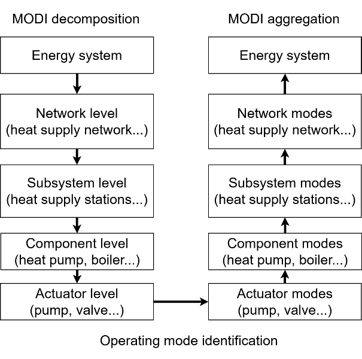
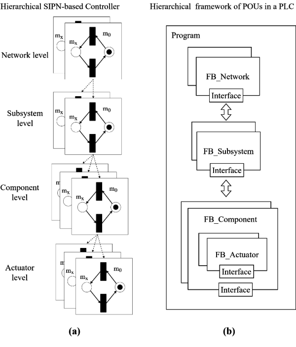
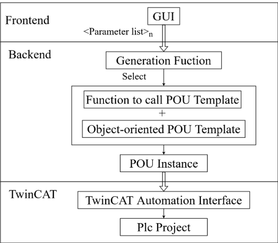
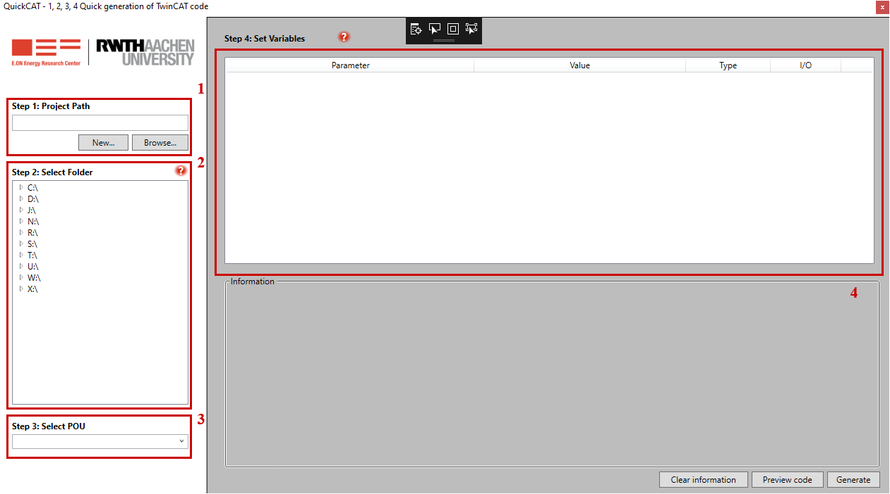
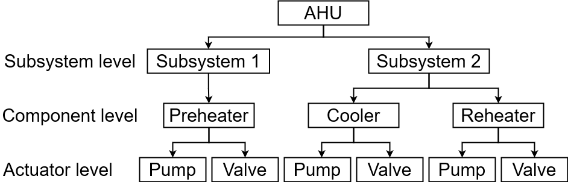
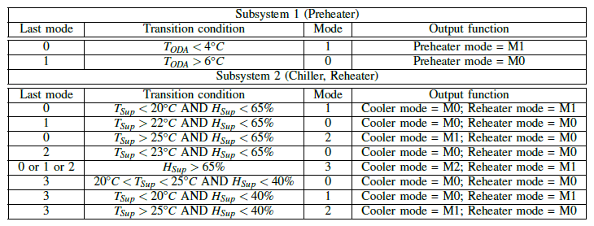
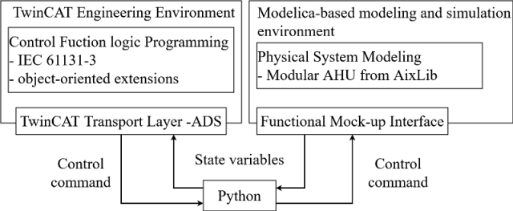
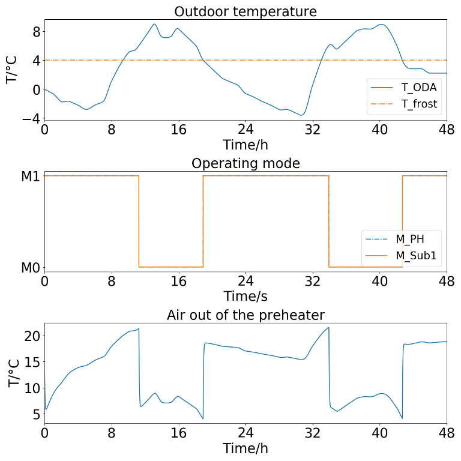
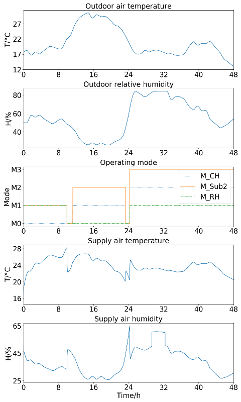

# Автоматизована генерація коду ПЛК для реалізації алгоритмів керування за режимами в будівлях

Cai, Xiaoye & Shi, Ruochen & Kumpell, Alexander & Muller, Dirk. (2022). Automated generation of PLC code for implementing mode-based control algorithms in buildings. 1087-1092. 10.1109/MED54222.2022.9837182. 

https://www.researchgate.net/publication/362493134_Automated_generation_of_PLC_code_for_implementing_mode-based_control_algorithms_in_buildings

**Анотація.** На практиці ручне планування та впровадження логіки функцій керування в системах автоматизації та керування будівлями (BACS) є джерелом помилок. Текстові описи функцій керування часто не стандартизовані та неточні, що може призводити до непорозумінь під час подальшого процесу впровадження. Зростання складності енергетичних систем будівель ще більше ускладнює цю проблему. Для її вирішення у попередніх роботах ми запропонували метод MODI. Метод MODI дозволяє систематично розробляти алгоритми керування за режимами та використовує сигнал-інтерпретовані мережі Петрі як формалізований метод опису для уникнення неоднозначностей у представленні алгоритмів керування. Однак впровадження алгоритмів керування за режимами в BACS залишається неясним. Ручне програмування таких алгоритмів на практиці є трудомістким і схильним до помилок. У цій статті ми пропонуємо програмно-асистовану структуру для підтримки впровадження алгоритмів керування за режимами у програмованих логічних контролерах (PLC) шляхом автоматичної генерації коду PLC. У кейс-стаді ми застосували цю структуру для реалізації стратегії керування за режимами для вентиляційної установки та протестували стратегію в симуляції. У подальших дослідженнях буде розглянуто використання цифрових джерел даних та методів обміну даними на етапах планування та будівництва BACS як джерела даних для цієї структури з метою подальшого спрощення генерації коду PLC.

## I. Вступ

Розрив між прогнозованими та фактичними енергетичними показниками будівель став серйозною проблемою у будівельній галузі [1]. За даними Європейської комісії, лише незначна частка європейських будівельних проєктів досягає прогнозованих енергетичних показників, і нереалізований потенціал ефективності є ключем до подальшого зменшення споживання енергії та викидів будівлями [2]. Однією з важливих причин цього розриву може бути неправильно спроєктована та реалізована логіка функцій керування в системах автоматизації та керування будівлями (BACS) [3], [4]. BACS здійснюють моніторинг середовища будівлі та забезпечують будівельні послуги, такі як кондиціонування повітря, освітлення та безпека. У BACS застосовують два основні типи контролерів: програмовані логічні контролери (PLC) та цифрові контролери прямої дії (DDC) [3]. На етапі проєктування BACS зростаюча складність енергетичних систем будівель ускладнює розробку відповідної логіки функцій керування. Крім того, проєктування BACS страждає від нестачі стандартизованих і систематичних описів функцій керування [4], [5]. У практиці широко використовуються текстові описи логіки функцій керування, але вони часто є неточними та нестандартизованими. Проєктанти керування індивідуально формулюють свою логіку функцій керування. Тому такі текстові описи можуть призводити до семантичних неоднозначностей у подальшому процесі впровадження та потребують додаткової інтерпретації під час програмування функцій керування. Для уникнення таких непорозумінь між етапами планування та впровадження необхідний формалізований метод опису стратегій керування [6].

У попередніх роботах ми представили метод MODI, що дозволяє систематично розробляти алгоритми керування за режимами для енергетичних систем будівель, використовуючи сигнал-інтерпретовані мережі Петрі (SIPN) як формалізований дескриптор для опису алгоритмів керування у вигляді ієрархічної структури [7], [8]. Режими роботи енергетичної системи описують допустимі стани поведінки системи, тому вони розглядаються як базові елементи алгоритмів керування за режимами. Залежно від стану середовища алгоритми керування можуть визначати поточний режим роботи для керування енергетичною системою. Крім того, ми можемо моделювати логіку функцій керування та виявляти помилки шляхом проведення симуляцій. Використання SIPN також дозволяє зменшити неоднозначність у описі логіки функцій керування. Однак впровадження алгоритмів керування за режимами у BACS залишається неясним. Фрей [9] запропонував метод генерації коду PLC у вигляді списку інструкцій (IL) або релейно-контактної схеми (LD) з алгоритмів керування на основі SIPN, однак без розгляду впровадження ієрархічно структурованих SIPN. Переклад алгоритмів керування на основі SIPN в інші мови програмування, що підтримуються стандартом IEC 61131-3, такі як структурований текст (ST), все ще залишається відкритим питанням. Крім того, ручне програмування логіки функцій керування є трудомістким та схильним до помилок, особливо у складних енергетичних системах. Наскільки нам відомо, методи автоматичної генерації коду PLC зазвичай досліджуються в області промислової автоматизації, проте рідко розробляються для BACS [10]. Для вирішення цієї проблеми ми досліджуємо методологію впровадження ієрархічно структурованих алгоритмів керування за режимами мовою ST, що підтримується стандартом IEC 61131-3 [11]. На основі цього створюється програмно-асистована структура для автоматичної генерації відповідного коду ST та його впровадження у програму PLC для BACS, що додатково спрощує процес впровадження.

## II. Метод

### A. Реалізація ієрархічної структури алгоритмів керування за режимами у програмах PLC

У попередніх роботах було представлено структуровану розробку алгоритмів керування за режимами на основі методу MODI, як показано на рис. 1 [7]. Енергетична система розкладається зверху вниз на багаторівневу ієрархічну структуру, що складається з рівня мережі, рівня підсистем, рівня компонентів та рівня виконавчих механізмів. На основі цієї ієрархічної структури ідентифікація режимів роботи виконується від рівня виконавчих механізмів до рівня мережі. Згідно з агрегацією MODI, спочатку ідентифікуються режими роботи виконавчих механізмів, після чого вони агрегуються для отримання режимів роботи на рівні компонентів. На основі поетапної агрегації в результаті визначаються режими роботи всіх рівнів. Для завершення стратегії керування за режимами необхідно лише визначити переходи режимів роботи на кожному рівні. 

Рис. 1. Процес декомпозиції та агрегації за методом MODI

Згідно з методом моделювання на основі SIPN, розроблена стратегія керування описується за допомогою SIPN для відповідного побудування ієрархічної моделі керування [8]. Рисунок 2 (а) показує ієрархічну структуру моделі керування на основі SIPN. SIPN на рівні мережі визначають використовувані режими роботи, враховуючи умови переходу між режимами, після чого передають рішення як вихід на рівень підсистеми. Відповідні SIPN на рівні підсистеми отримують вихідні дані з рівня мережі та враховують їх у процесі визначення режиму роботи. На основі поетапного визначення режимів роботи пристрої та виконавчі механізми отримують команди для роботи на рівні виконавчих механізмів.

Рис. 2. Ієрархічна структура алгоритму керування за режимами.
 (a) Моделювання алгоритму керування за режимами в ієрархічному контролері на основі сигнал-інтерпретованих мереж Петрі;
 (b) Реалізація алгоритму керування за режимами в ієрархічній структурі програмних організаційних одиниць (POU) у PLC.

Для реалізації алгоритмів керування за режимами у PLC ми застосовуємо програмну модель IEC 61131-3 у програмуванні PLC та розробляємо ієрархічну структуру програмних організаційних одиниць (POU), як показано на рис. 2 (b). Згідно з IEC 61131-3, існують три типи POU: програми (PRG), функціональні блоки (FB) та функції у програмуванні PLC [11], [14]. У нашому випадку ми реалізуємо стратегію керування за режимами у програмі для зв’язування функціональних блоків усіх рівнів та виконання відповідного процесу керування. Кожна SIPN буде відображатися у функціональний блок. Обмін даними між SIPN забезпечується через визначення глобальних змінних або публічних властивостей функціональних блоків, які надають методи доступу для читання та запису даних через ці властивості. Через часте повторне використання FB для виконавчих механізмів, таких як PID-регулятори для клапанів, ці FB програмуються об'єктно-орієнтованим способом і інстанціюються у FB компонентів.

### B. Реалізація описаних SIPN алгоритмів керування за режимами у структурованому тексті

Оскільки алгоритми керування за режимами описані за допомогою SIPN, ми досліджуємо метод перекладу алгоритмів керування на основі SIPN у одну з мов програмування, що підтримуються стандартом IEC 61131-3. Основним принципом методу є відповідність елементів мережі Петрі до сегментів коду на основі IEC 61131-3 у форматі один до одного [15]. Така відповідність дозволяє повторно інтерпретувати згенерований код, що спрощує його розуміння та подальшу обробку. На основі цього принципу ми використовуємо ST як мову програмування для реалізації алгоритмів керування, описаних SIPN.

Основними елементами SIPN є місця, переходи та дуги. У нашому випадку режими роботи визначаються як місця, а переходи між цими режимами як переходи у SIPN [8]. Правила керування, які використовуються для визначення поточного режиму роботи, реалізуються у переходах як умови переходу. Якщо місце активоване, тобто визначений режим роботи, виконується відповідна вихідна функція цього місця. На основі цього створюється відповідність один до одного між елементами мережі Петрі та сегментами коду ST:

- **Місце.** У ST визначається змінна-перелічення, яка містить усі місця (режими роботи) SIPN як значення переліку.
- **Перехід.** Перехід SIPN реалізується через оператор IF у ST. Ми використовуємо шаблон «місце–перехід–місце» для опису повного переходу від одного місця (попереднього місця) до іншого (поточного місця). Для активації цього шаблону необхідно, щоб попереднє місце було активним, а умови переходу були виконані. Таким чином, ці дві умови відповідають умові в операторі IF, що реалізує цей шаблон. Наслідком є активація поточного місця.
- **Вихідна функція.** Якщо місце активне, його вихідна функція викликається відповідно. Використовуються кілька операторів IF для перевірки використовуваного режиму роботи, тобто активного місця, та виконання відповідної вихідної функції.

### C. Програмно-асистована генерація структурованого тексту

Ми використовуємо програмне забезпечення TwinCAT (The Windows Control and Automation Technology), розповсюджуване Beckhoff, для програмування та конфігурації проєктів PLC [16]. TwinCAT підтримує об'єктно-орієнтовану мову програмування, визначену у стандарті IEC 61131-3. Інтерфейс автоматизації TwinCAT забезпечує зовнішній доступ до проєктів PLC за допомогою мов програмування з підтримкою COM, таких як C++ або .NET, та дозволяє скриптам створювати та керувати проєктами PLC у TwinCAT, зокрема створювати та обробляти POU. На основі цього ми розробляємо програмну структуру на .NET для генерації коду ST для алгоритмів керування за режимами та автоматичного впровадження їх у проєкт PLC.

Рисунок 3 ілюструє програмну структуру. Графічний інтерфейс користувача (GUI) розроблений як фронтенд для отримання параметрів для генерації POU. Ці параметри обробляються у бекенді програми, яка вибирає шаблон для потрібного POU та створює об'єкт POU шляхом інтеграції параметрів. Через інтерфейс TwinCAT Automation згенерований POU впроваджується у вибраний у GUI шлях проєкту PLC.

Рис. 3. Програмна структура для генерації коду у вигляді структурованого тексту та його впровадження у програмований логічний контролер за допомогою програмного забезпечення TwinCAT.

Ми використовуємо Windows Presentation Foundation (WPF) для створення GUI, що зображено на рис. 4, який поєднує користувачів з бекендом програми [17]. Функціонал GUI у чотирьох червоних полях представлений наступним чином:

1. Створення нового проєкту PLC або завантаження існуючого.
2. Вибір шляху у проєкті PLC для збереження згенерованого POU.
3. Вибір об'єкта POU, який потрібно згенерувати.
4. Заповнення списку параметрів для створення об'єкта POU.

Рис. 4. Графічний інтерфейс користувача програмної структури.
 (1): створення нового проєкту PLC або завантаження існуючого проєкту PLC;
 (2): вибір шляху у проєкті PLC для збереження згенерованої POU;
 (3): вибір об’єкта POU, який потрібно згенерувати;
 (4): заповнення списку параметрів для створення об’єкта POU.

Бекенд базується на об'єктно-орієнтованих розширеннях IEC 61131-3 та містить бібліотеку шаблонів POU для підтримки генерації коду ST. Бібліотека AixOCAT надає об'єкти POU для типових блоків керування у сфері автоматизації будівель, таких як функціональні блоки для керування чотирма типовими гідравлічними контурами та PID-регуляторами [18]. На основі об'єктів POU створюються відповідні шаблони POU, шляхом вставки змінних-маркерів у код об'єктів POU, куди імпортуються параметри для створення об'єкта. Для полегшення використання шаблонів вони послідовно переводяться у формат Extensible Application Markup Language (XAML), який може бути імпортований інтерфейсом TwinCAT Automation. Згідно з введенням у GUI, бекенд програми може вибрати потрібний шаблон POU та викликати відповідні функції для прив'язки параметрів до маркерів у шаблоні. Таким чином, код потрібного екземпляра POU генерується та стає доступним за шляхом, вказаним у GUI, через інтерфейс TwinCAT Automation.

## III. Приклад використання

Ми використовуємо програмне забезпечення для реалізації стратегії керування за режимами для вентиляційної установки (AHU), що включає три керовані компоненти: підігрівач (PH), чілер (CH) та догрівач (RH). Реалізована стратегія керування буде протестована на етапі симуляції.

Згідно з методом MODI, ієрархічна структура AHU показана на рис. 5. AHU розглядається як система споживання енергії, тому рівень мережі у цьому випадку не розглядається. Оскільки PH використовується лише для захисту від замерзання, ми виділяємо його в окрему підсистему. Щоб уникнути одночасної роботи системи опалення та системи охолодження, CH і RH розглядаються як одна підсистема. На рівні компонентів кожен компонент містить змішувальний контур, у якому додатково визначаються насос та триходовий клапан. Ми зосереджуємося на керуванні гідравлічними контурами PH, CH та RH для регулювання подачі повітря.

Рис. 5. Ієрархічна структура вентиляційної установки відповідно до декомпозиції за методом MODI.

У таблиці I наведені відповідні режими роботи на всіх рівнях, де 1 та 0 означають, чи працюють відповідні компоненти або виконавчі механізми. Хоча і насос, і клапан працюють при активації M1 та M2 для CH, необхідна температура повітря на виході з CH є різною. M2 (осушення) вимагає температури нижче точки роси.

Таблиця I. Режими роботи вентиляційної установки відповідно до агрегації за методом MODI.

| **Рівень підсистеми**              | **Режим роботи** | **Опис**                                      |
| ---------------------------------- | ---------------- | --------------------------------------------- |
| **Підсистема 1 (підігрівач)**      | M0: (0)          | Підігрівач вимкнений.                         |
|                                    | M1: (1)          | Підігрівач працює.                            |
| **Підсистема 2 (чілер, догрівач)** | M0: (0,0)        | Підсистема вимкнена.                          |
|                                    | M1: (0,1)        | Працює лише догрівач.                         |
|                                    | M2: (1,0)        | Працює лише чілер.                            |
|                                    | M3: (2,1)        | Чілер осушує повітря; догрівач його нагріває. |

На основі режимів роботи у таблиці II наведені переходи режимів роботи на рівні підсистем. Як зазначалося вище, PH використовується для захисту від замерзання, тому для його активації умовою переходу обрано температуру зовнішнього повітря. Метою підсистеми 2 є досягнення комфортних умов у приміщенні, включаючи температурний та вологісний режими. Для визначення використовуваного режиму роботи підсистеми 2 ми використовуємо температуру та вологість поданого повітря як індикатори. На рівні компонентів для клапана та насоса кожного змішувального контуру використовуються два PI-регулятори. Клапан регулюється для підтримання сталої температури подачі на гідравлічній стороні, а насос змінює швидкість обертання залежно від температури повітря на виході з компонента. Ми використовуємо типові PI-параметри з AixOCAT, які можна верифікувати окремо.

TABLE II THE MODE-BASED CONTROL STRATEGY OF AN AHU AT THE SUBSYSTEM LEVEL. TODA: OUTDOOR TEMPERATURE; TSup: SUPPLY TEMPERATURE;
HSup: SUPPLY HUMIDITY.

Інформація про конфігурацію стратегії керування за режимами імпортується через графічний інтерфейс користувача, після чого відповідний код ST генерується та впроваджується у контролер PLC. Для тестування коду ми моделюємо AHU мовою моделювання Modelica з використанням бібліотеки Modelica AixLib та виконуємо інтерфейсну взаємодію з моделлю за допомогою Python через Functional Mock-up Interface (FMI) [19], [20]. Пакет Python `pyads` забезпечує зручний спосіб інтеграції коду PLC у TwinCAT з моделлю Modelica [21]. Для симуляції ми використовуємо метеорологічні дані Чикаго з наборів даних Typical Meteorological Year 3 (TMY3) як граничні умови, включаючи температуру зовнішнього повітря та відносну вологість за період у 1 рік [22].

Рис. 6. Модель симуляції вентиляційної установки (AHU) та її контролера в різних середовищах.

На рис. 7 показані результати симуляції підсистеми 1 протягом двох зимових днів. У ці два дні, коли температура зовнішнього повітря опускається нижче 4 °C, режим роботи підсистеми 1 перемикається на M1 (УВІМК.), наприклад, від початку симуляції до 8-ї години. Відповідно, режим PH також перемикається на M1 після отримання сигналу від підсистеми 1. Третя частина рисунка ілюструє профіль температури повітря на виході з PH, що демонструє підвищення температури при активації M1 (УВІМК.) PH. При активації M0 (ВИМК.) PH температура повітря у PH відповідає температурі зовнішнього повітря.

Рис. 7. Результати симуляції підсистеми 1, що складається з підігрівача у вентиляційній установці. TODA: температура зовнішнього повітря; Tfrost: температура для захисту від замерзання; MPH: режим роботи підігрівача; MSub1: режим роботи підсистеми 1.

Робота підсистеми 2 протягом двох літніх днів показана на рис. 8. Підсистема 2 управляє взаємодією між CH та RH для забезпечення комфортних параметрів подачі повітря. Починаючи з 8-ї години, температура зовнішнього повітря значно підвищується, що активує режим охолодження у підсистемі 2. У відповідь на активацію M2 підсистеми 2 чілер починає працювати для подачі холодного повітря. Відповідно, температура поданого повітря поступово знижується після активації M2 чілера. Крім того, для осушення повітря активується M3 підсистеми 2, що запускається через надмірну вологість зовнішнього повітря з 24-ї години. У цьому режимі додатково активуються M2 для CH та M1 для RH на рівні компонентів. Для осушення повітря CH охолоджує його нижче точки роси, завдяки чому відносна вологість поданого повітря поступово знижується при активації M2 CH. Холодне повітря, що виходить з CH, нагрівається RH для підтримання температури поданого повітря у комфортному діапазоні, що показано на четвертій частині рисунка 8.

Рис. 8. Результати симуляції підсистеми 2, що складається з чілера та догрівача у вентиляційній установці. MCH: режим роботи чілера; MRH: режим роботи догрівача; MSub2: режим роботи підсистеми 2.

## IV. Висновки

Результати, наведені в цій статті, демонструють можливість використання програмної структури для реалізації алгоритмів керування за режимами шляхом генерації відповідного коду PLC у вигляді структурованого тексту та автоматичного впровадження цього коду у програму PLC. Ми використали програмне забезпечення для реалізації стратегії керування за режимами для вентиляційної установки та виконали її тестування за допомогою симуляції. Результати симуляції показали функціональність програми PLC для керування подачею повітря в різних сценаріях, що відповідало запланованій стратегії.

У майбутньому ми плануємо провести тестування з використанням методу hardware-in-the-loop для цієї програми. Довгостроковий моніторинг може надати уявлення про ефективність алгоритмів керування за режимами. Крім того, застосування програмної структури може отримати переваги від використання цифрового джерела даних, що містить стратегії керування за режимами. Замість ручного введення через графічний інтерфейс користувача, цифрове джерело даних можна буде імпортувати безпосередньо у програмне забезпечення, що дозволить зробити процес автоматичної генерації більш оптимізованим.

## Подяка

Ми щиро вдячні за фінансову підтримку, надану Федеральним міністерством економіки та захисту клімату Німеччини (BMWK), реєстраційний номер проєкту 03ET1485A.

