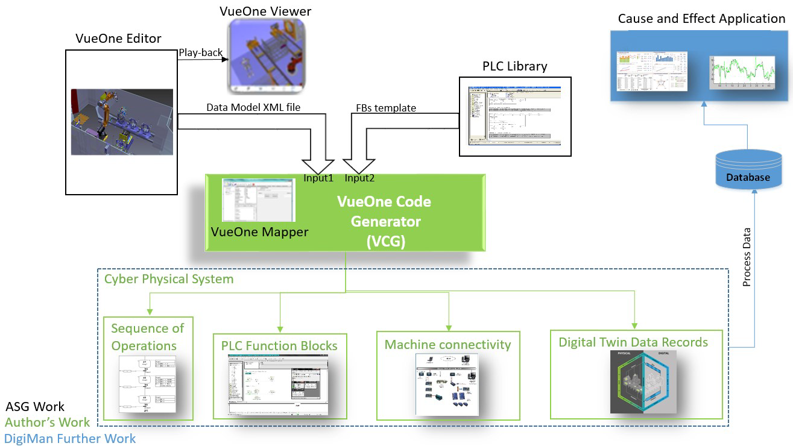
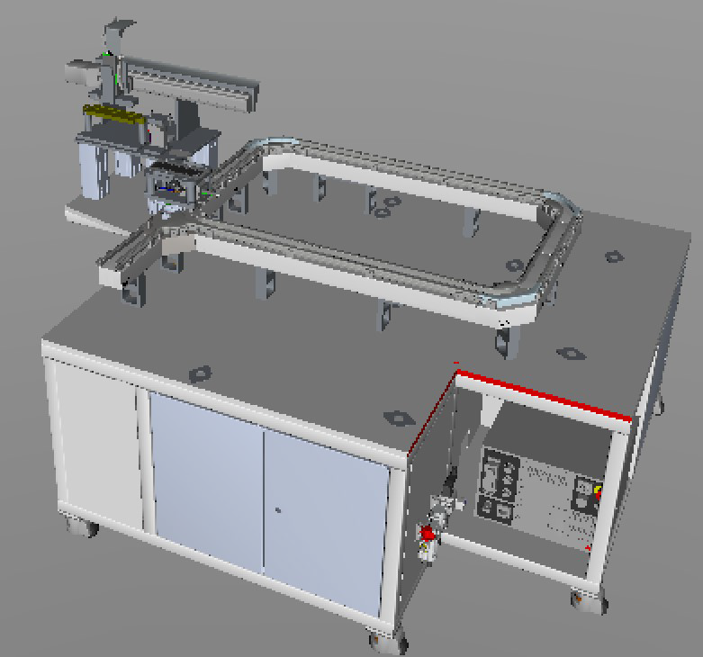
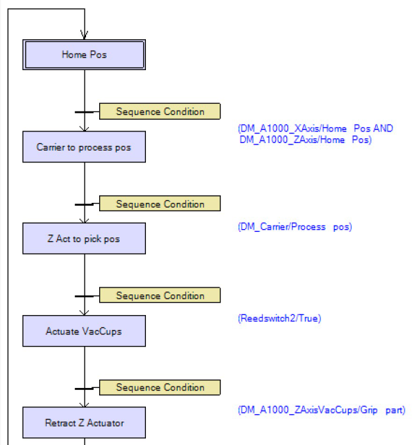
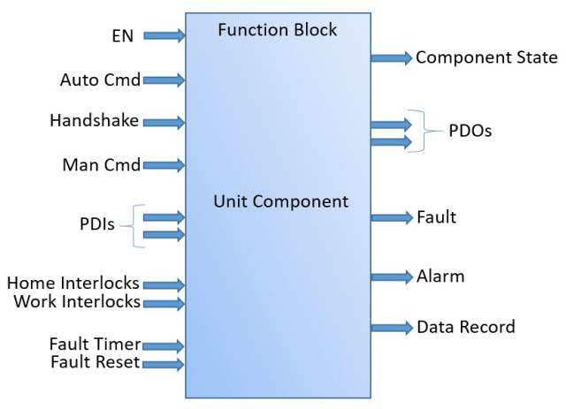
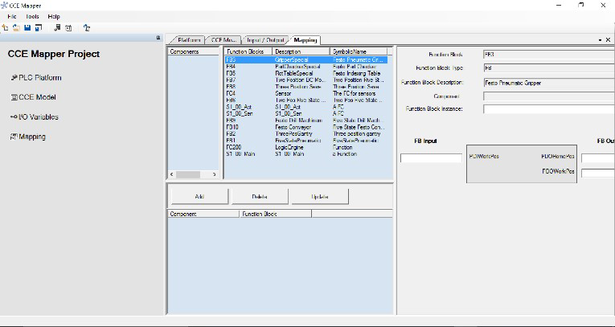
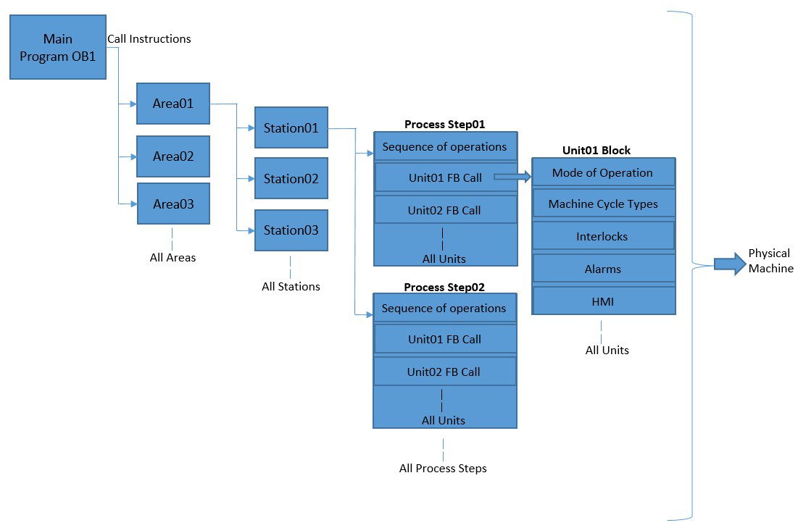
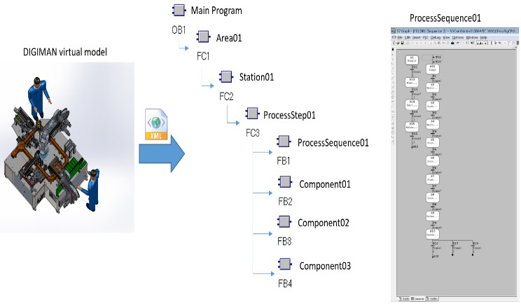

# Автоматична генерація коду PLC на основі віртуальної інженерної моделі

M. Jbair, B. Ahmad, M. H. Ahmad, D. Vera, R. Harrison and T. Ridler, "Automatic PLC Code Generation Based on Virtual Engineering Model," 2019 IEEE International Conference on Industrial Cyber Physical Systems (ICPS), Taipei, Taiwan, 2019, pp. 675-680, doi: 10.1109/ICPHYS.2019.8780213. keywords: {Cyber Physical Systems;Automatic PLC Code Generation;Virtual Engineering;Digital Twin},

https://www.researchgate.net/publication/334891160_Automatic_PLC_Code_Generation_Based_on_Virtual_Engineering_Model

Анотація — Сучасні автомобільні компанії, незалежно від застосовуваних ними систем (наприклад, масове виробництво, масова кастомізація, виробництво за принципом «точно вчасно» тощо), стикаються із спільними викликами, які можуть призводити до раптових і частих збоїв у ланцюгах постачання. Виробничі системи повинні швидко реагувати на такі збої. Це можна забезпечити впровадженням нових інтелектуальних інженерних методів та технологій, що дозволяють реалізувати високий рівень переналаштовуваних і динамічних виробничих процесів для підвищення загальної ефективності виробничих підприємств. У цій статті досліджується методологія розробки цифрової моделі системи складання паливних елементів, а також використання розробленої моделі для автоматичної генерації коду програмованого логічного контролера (PLC) для обладнання, налаштування з’єднань та записів процесних даних. Ці автоматично згенеровані елементи можуть використовуватися для створення кіберфізичної системи (CPS). Метою цієї статті є демонстрація автоматичної генерації керуючого коду та його структурування для ефективного та результативного використання в промислових застосуваннях. Як доказ концепції для валідації запропонованої методології та структури використовується поточний проєкт DIGIMAN [1], який має на меті створення демонстраційної системи складання паливних елементів для автомобільної промисловості.

## I. ВСТУП

Сучасні ініціативи, такі як Industrie 4.0, обіцяють впровадження «розумного» виробництва для подолання викликів, з якими стикається виробнича галузь. Розумне виробництво має на меті подолати розрив між цифровим і фізичним середовищами з метою оптимізації проєктування, впровадження та експлуатації виробничих процесів.

Віртуальні інженерні та моделювальні інструменти, які широко використовуються в промисловості, особливо в автомобільному виробництві, пропонують потужні можливості та функції протягом усього життєвого циклу як систем, так і продукції. Проте наразі використання віртуальної інженерії переважно обмежується стадією проєктування. Існує потреба у розширенні застосування цифровізації на стадії впровадження та експлуатації. У цьому контексті ця стаття розглядає розробку віртуальних моделей виробничих систем, які можуть використовуватися для автоматичної генерації структурованого коду PLC, що може бути безпосередньо впроваджений у виробничі застосування. У статті досліджуються наявні методи та практики створення коду PLC вручну та автоматично.

Крім того, у ній розглядаються наявні інженерні інструменти, що враховують автоматичну генерацію коду PLC, визначають прогалини у цих практиках та пропонують методологію для їх подолання. Таким чином, новизна цього дослідження полягає в автоматичній генерації структурованого коду PLC, що відповідає вимогам виробничих застосувань, а також потребам обслуговування та експлуатації з метою спрощення моніторингу, діагностики та обслуговування.

## II. ОГЛЯД ЛІТЕРАТУРИ

### A. Розробка програмного забезпечення PLC

Мови програмування PLC здебільшого базуються на стандарті IEC 61131-3, опублікованому у 1993 році для стандартизації мов програмування PLC. Він визначає п’ять мов: Ladder Diagram (LD), Function Block Diagram (FBD), Structured Text (ST), Instruction List (IL), Sequential Function Chart (SFC) [2]. Виробники PLC широко впровадили ці мови. Проте, як показано у дослідженні [2], використання цих мов програмування здебільшого не відповідає стандартизованій практиці з точки зору структурування коду. Деякі компанії (як системні інтегратори, так і кінцеві користувачі) часто визначають власні стандарти структури програмного забезпечення, щоб забезпечити уніфікований вигляд та спростити моніторинг, усунення несправностей та діагностику. Це також дозволяє програмістам копіювати код із попередніх проєктів і редагувати його під вимоги нового проєкту. Вибір мови програмування залежить від багатьох факторів, таких як знання програміста, складність завдання автоматизації, частота модифікацій чи усунення несправностей. Проте відсутня перевага однієї мови над іншими.

Програмне забезпечення PLC розробляється або вручну програмістом, або автоматично за допомогою інженерних інструментів. У розділах нижче наведено короткий огляд існуючих практик обох методів в автомобільній промисловості.

### B. Практика ручного програмування PLC в автомобільній промисловості

Складність завдань автоматизації в автомобільній промисловості часто призводить до складного коду PLC. Більшість великих автовиробників прагнуть використовувати стандартну структуру програмного забезпечення та часто змушують виробників обладнання дотримуватися її. Проте деякі інженерні практики широко застосовуються, і більшість виробників формують структуру програмного забезпечення на їх основі. Нижче наведено опис цих практик:

#### Structured Transfer-Machine EDDI Programming System (STEPS) [3]: 

STEPS було розроблено компанією Ford Motor Company і широко використовувалося на багатьох заводах Ford у світі. STEPS стало розвитком EDDI і запозичило низку функцій із EDDI (Error Diagnostic Dynamic Indication), створеного у 1980-х роках. Деякі функції були вдосконалені для задоволення вимог усіх типів машин, що використовувалися Ford, і опубліковані для всіх постачальників обладнання Ford Motor Company. STEPS використовувало лише мову програмування LD. Воно було орієнтоване на технічне обслуговування та діагностику машин, наприклад, відображення повідомлень про помилки у зрозумілому вигляді та покращення функцій виявлення несправностей і діагностики керуючого коду машини. Структура програми складалася з: 

1) Стандартного початку, що містить усю логіку LD для режимів роботи машини (ручного та автоматичного) та забезпечує повернення у вихідне положення перед запуском. 
2) Зони керування машиною для керування операціями обладнання. 
3) Зони постійного моніторингу (CMZ), що контролює всі захисні блокування, такі як аварійна зупинка, захисні двері тощо. 
4) Сигналів апаратних модулів для керування модулями вводу/виводу. 
5) Інтерфейсу з операторським терміналом для керування HMI. 
6) Стандартного завершення з логікою, специфічною для постачальника.

#### Structured Transfer-Machine EDDI Programming System Function Block (STEP FB) [4]:

STEP FB було створено для спрощення структури програмування STEP. Замість використання зон та повторення однакової програми у всіх зонах STEP FB розділяє машину на низку компонентів, кожен з яких програмується мовами LD або ST, а головна послідовність машини, що керує всіма компонентами, програмується мовою SFC. Структура коду STEP FB включає: 

1) Головне керування: режими роботи, зупинка циклу та повернення у вихідне положення. 
2) Керування SFC: секвенсор SFC для програмування компонентів машини, таких як робот, підйомний стіл тощо. 
3) Блоки компонентів: частини програми для керування одним компонентом машини. 
4) Зону постійного моніторингу (CMZ). 
5) HMI для керування інтерфейсом та повідомленнями. 
6) Мапування IO для модуля вводу/виводу машини.

#### Ford And Siemens Transline (FAST) [5]:

Практика програмування FAST є результатом співпраці між Ford Motor Company та Siemens Company. Вона була випущена у 2013 році для обладнання з виробництва силових агрегатів. FAST використовує LD як основну мову програмування, хоча не наголошує на використанні конкретної мови для функціональних блоків, специфічних для постачальників. Структура коду для реалізації функцій керування визначена досить гнучко, що дозволяє програмістам писати код для більшості функцій керування у зручній для них формі. FAST передбачає, що машина складається максимум із шести станцій, кожна з яких містить низку компонентів і послідовність операцій. Структура коду FAST включає: 

1) Головну програму, де викликаються коди машини та станцій. 
2) Блок машини для програмування міжблокувань, аварій та діагностики живлення. 
3) Блоки станцій для керування режимами роботи, аваріями, HMI, компонентами, комунікаціями, трасуванням та послідовністю операцій станцій. 
4) Блок безпеки для моніторингу всіх захисних блокувань машини.

#### Function Orientated Modularisation (FOM) [6]:

FOM був представлений компанією ThyssenKrupp System Engineering (TKSE) GmbH у 2007 році. Ця практика враховує ієрархічну концепцію виробничої системи. Виробнича система складається з ділянок (Areas), кожна з яких складається з кількох станцій. Послідовність операцій станції керується процесними кроками (Process Steps), кожен з яких керує кількома одиницями (Units). Одиниці – це функціональні блоки (FB), що керують виконавчими механізмами. FOM використовує мову LD для високорівневої структури коду, проте більшість програмних блоків, таких як Process Steps і Units, пишуться мовою Instruction List. Структура коду є модульною та значно полегшує повторне використання коду.

### C. Практика автоматичної генерації програмного забезпечення PLC

Автоматична генерація коду є трансформацією поведінки керування машиною, визначеної на вищому рівні абстракції під час етапу проєктування, у код, що може бути безпосередньо реалізованим у системі автоматизації [7]. Зазвичай дані про поведінку машини доступні та можуть бути отримані з інструментів проєктування, які використовуються для визначення поведінки керування машиною [8].

Низка дослідників представила структури та методи автоматичної генерації коду PLC. Birgit Vogel-Heuser [9] запропонувала структуру для генерації коду PLC з моделі Unified Modelling Language (UML). У цьому дослідженні як інструмент моделювання використовувався Real-Time Studio від Artisan. Цей інструмент визначає архітектуру системи як передумову для генератора коду, який, у свою чергу, автоматично створює коди IEC 61131-3 (SFC і ST). Згенерований код структурований для полегшення діагностики машини. Проте всі функціональні блоки програмуються мовою ST, що створює складності та ускладнює переналаштування та додавання нових функцій до машини. Martin Bergert [10] представив структуру генерації коду PLC на основі цифрової інформації про процеси, змодельованої у DILMILA Process Engineer (DPE). Запропонована структура транслює XML-файл, що містить специфікації машини та створений PDE, у код IEC 61131-3 (SFC і FB). Інше дослідження, проведене Michael Steinegger [11], запропонувало концептуальний метод генерації коду PLC з інженерних інструментів проєктування виробничих процесів. Проте це дослідження не демонструє практичного рішення для запропонованого методу.

Окрім академічних досліджень, низка постачальників засобів керування також розробила інструменти автоматичної генерації коду, такі як Mitsubishi Adroit Process Suite (MAPS), Schneider Unity Application Generator (UAG), Beckhoff TwinCAT automation interface та інші [8]. Ці інструменти мають на меті автоматичну генерацію коду PLC на основі попередньо визначеного робочого процесу, який має бути налаштований програмістом PLC, і цей робочий процес зазвичай інтегрований у сам інструмент.

### D. Віртуальна інженерія виробничих систем

Метою інструментів віртуальної інженерії є створення цифрової моделі виробничих систем. Зазвичай віртуальні моделі складаються з трьох основних аспектів: механічного, електричного та керування. Механічний: геометрія, компоновка, кінематика. Електричний: споживання енергії, енергоефективність, енергоменеджмент. Керування: програмна логіка машини та комунікаційні зв’язки. Створена цифрова модель дозволяє досліджувати поведінку системи внаслідок взаємодії компонентів за допомогою функцій симуляції. Динамічна модель дозволяє валідувати логіку системи, а також оптимізувати процеси машини.

На ринку доступна велика кількість інструментів віртуальної інженерії для проєктування та інжинірингу виробничих систем. Прикладами таких інструментів є Siemens NX Mechatronics Concept Designer [12], Process Simulate, Dassault Systems DELMIA [13], WinMOD [14] та VueOne [16]. Ці інструменти дозволяють симулювати виробничі системи у 3D середовищі та забезпечують зв’язок фізичних входів/виходів із віртуальними процесами для забезпечення постійного узгодження між кібер- та фізичним світом. У результаті реалізується система із замкненим циклом, і оптимізація може здійснюватися протягом усього життєвого циклу виробничої системи.

### E. Обмеження та прогалини поточних досліджень і практик

Більшість наявних підходів до автоматичної генерації коду вважаються непрактичними або такими, що надають неповне рішення, і тому не впроваджені в промислову практику. Більшість виконаних академічних досліджень ігнорують наявні кращі практики програмування PLC та не відповідають експлуатаційним і сервісним вимогам виробничих застосувань, що ускладнює виконання таких завдань, як діагностика та усунення несправностей обладнання. З іншого боку, інструменти віртуальної інженерії, які широко використовуються в промисловості, переважно зосереджені на моделюванні та симуляції процесів і не охоплюють повний життєвий цикл виробництва. Ці інструменти часто не враховують розгортання систем керування, особливо для PLC та HMI, що в результаті призводить до збільшення інженерного часу, марнування ресурсів та збільшення загальної вартості проєкту [15].

Тому ця стаття має на меті запропонувати методологію для вирішення цих обмежень з метою підвищення конкурентоспроможності виробників та задоволення високого попиту на переналаштовуваність.

## III. МЕТОДОЛОГІЯ

Запропонована в цій статті методологія має на меті генерацію коду PLC на основі поведінки керування, представленої цифровою моделлю у середовищі інструменту віртуальної інженерії. Згенерований код структурований таким чином, щоб його можна було практично використовувати в промислових застосуваннях, що буде показано в розділі IV, з урахуванням простежуваності коду, можливості переналаштування, легкості діагностики та обслуговування.

### A. Набір інструментів віртуальної інженерії VueOne

VueOne є набором інструментів віртуальної інженерії, що використовується в цьому дослідженні. VueOne розроблений Automation Systems Group (ASG) Університету Ворвіка [16]. Цей набір інструментів складається з редактора, переглядача, маппера та шлюзу. Він полегшує інжиніринг і розробку протягом життєвого циклу машини, включаючи кінематичне моделювання та симуляцію, планування процесів, механічне та керуюче проєктування. VueOne підтримує підхід на основі компонентів, що забезпечує повторне використання компонентів та переналаштовуваність системи. Моделювання у VueOne можна умовно розділити на: 1) моделювання компонентів (наприклад, датчик, виконавчий механізм) та 2) моделювання системи. Компоненти інкапсулюють дані, що визначають геометрію компонентів за допомогою 3D моделі VRML, кінематику та поведінку керування. Компоненти можуть зберігатися у бібліотеці та використовуватись протягом життєвого циклу машини. Моделювання системи може виконуватись шляхом складання компонентів та визначення послідовності операцій, що визначають зв’язки та взаємодію між використаними компонентами. VueOne використовує STD (діаграму переходів станів) для визначення поведінки керування відповідно до IEC 61131-3 для визначення процесів.

### B. Дослідницька структура

Структура має на меті генерацію структурованого коду керування PLC шляхом розширення можливостей набору інструментів VueOne. Це показано на Рис. 1, де внесок авторів позначено зеленим кольором. Внесок полягає у розширенні можливостей VueOne Mapper таким чином, щоб результат із VCG включав: функціональні блоки PLC (FB компонентів), послідовності операцій процесів, підключення машини та записи даних цифрового двійника машини.

Fig. 1. Research Framework

Запропонована структура має на меті інтеграцію та оптимізацію етапу інжинірингу для програмування PLC. На етапі проєктування механічна та керуюча поведінка машини (включаючи поведінку компонентів та послідовність операцій) проєктується за допомогою VueOne Editor, після чого цей проєкт може бути експортований у форматі XML до VueOne Code Generator (VCG), що зазначено як перше input1 на Рис. 1.

Кожен компонент машини представлений функціональним блоком (FB) у бібліотеці PLC. FB є універсальними готовими шаблонами для керування компонентами машини. Наприклад, компонент двостороннього циліндра має FB двостороннього циліндра у бібліотеці PLC. FB програмуються та проходять валідацію, після чого випускаються як початкова або переглянута версія у бібліотеці PLC. Важливо зазначити, що ці FB потрібно запрограмувати лише один раз у інструменті інженерії PLC на початковій фазі розробки FB, після чого вони можуть бути опубліковані як друге input2 у VCG для подальшого повторного використання. Для генерації коду PLC потрібно подати у VCG input1 (XML-файл) та input2 (шаблони FB), після чого кожен компонент машини потрібно зіставити з відповідним FB з бібліотеки PLC.

### C. PLC як компонент кіберфізичної системи (CPS)

Запропонована у цій статті структура має на меті розширення генерації коду PLC і включає не лише базовий код PLC для виконання завдання автоматизації, а й генерацію всіх комунікаційних блоків і значень фізичних процесів машини (записів даних цифрового двійника). Комунікаційні блоки необхідні для підключення PLC до центральної бази даних підприємства через протокол Інтернету речей (IoT), такий як Open Platform Communication Unified Architecture (OPC UA), щоб створити підключений цифровий двійник і отримати переваги аналітики даних та інтелектуальних сервісів, таких як застосунок «Причина та наслідок», як показано на Рис. 1. Коли PLC матиме необхідний код для автоматизації фізичних процесів, буде підключеним до віртуального світу через IoT та передаватиме всі значення процесів у реальному часі, тоді цей PLC діятиме як компонент кіберфізичної системи (CPS).

## IV. РЕАЛІЗАЦІЯ ДОКАЗУ КОНЦЕПЦІЇ

Кейс-стаді у цій статті демонструє використання набору інструментів VueOne для автоматичної генерації коду PLC для демонстраційної системи складання паливних елементів з полімерною електролітною мембраною (PEM) у проєкті DIGIMAN. Система складання складається з чотирьох станцій (тобто виробництво елементів, тестування елементів, складання батареї паливних елементів та тестування батареї паливних елементів). Загальний процес складання поділяється на зони, кожна з яких складається з кількох робочих станцій. Виробництво паливних елементів PEM здійснюється на першій станції. Кожен елемент PEM складається з кількох шарів різних матеріалів (шари елемента), кожен шар формується за допомогою процесів pick and place або ламінування на спеціальних станціях у демонстраторі PoP [1]. Після виробництва кожен елемент проходить тестування. Потім пакет перевірених окремих елементів збирається у батарею паливних елементів. Нарешті, батарея проходить тестування на станції тестування батарей паливних елементів. Для цього кейс-стаді використовується перша станція демонстратора PoP. Для реалізації доказу концепції у цій статті використовується PLC Siemens S7-300.

### A. Реалізація робочого процесу методології

Запропонована у розділі III-B структура має на меті спростити розробку життєвого циклу інжинірингу машини шляхом включення функціоналу автоматичної генерації коду керування з використанням набору інструментів VueOne. Реалізація включає віртуальне моделювання, розробку бібліотеки PLC та налаштування VCG, наведені нижче розділи демонструють реалізацію цієї методології.

Віртуальна модель:

Віртуальна модель є цифровим представленням машини. Рис. 2 показує віртуальну модель першої станції демонстратора PoP, розроблену у VueOne Editor.

Fig. 2. Anode station model in VueOne Editor from DIGIMAN project

Вимоги до системи керування PLC для цієї станції включають:

1. Послідовність операцій станції: описує набір кроків операцій, які станція анода має виконати для складання анодного шару.
2. Режими роботи: ручний та автоматичний режими. У ручному режимі кроки станції виконуються за допомогою кнопок на HMI, тоді як автоматичний режим виконує послідовність машини автоматично без втручання людини. Автоматичний режим складається з трьох циклів: безперервний цикл, одиночний цикл та «сухий» цикл. Безперервний цикл виконує послідовність автоматично для кожного циклу машини, одиночний цикл виконує послідовність один раз, а сухий цикл виконує послідовність для кожного циклу без використання матеріалу.
3. Захисні міжблокування машини: для забезпечення безпечного виконання операцій машини.
4. Аварії та діагностика компонентів машини: для забезпечення швидкого та ефективного обслуговування та усунення несправностей.
5. Підключення машини через OPC UA: машина має забезпечувати комунікацію з віртуальним світом через протоколи IoT, такі як OPC UA.
6. Записи даних машини: машина має передавати дані фізичних процесів у віртуальний світ для створення підключеного та синхронізованого цифрового двійника.

Поведінка керування для станції демонстратора PoP налаштовується у віртуальній моделі за допомогою діаграми переходів станів, як показано на Рис. 3 нижче.

Fig. 3. Process component STD in VueOne Editor

#### PLC Library:

VCG зіставляє кожен компонент змодельованої машини з функціональним блоком (FB) із бібліотеки PLC. Рис. 4 показує інтерфейс шаблонного FB з усіма інтерфейсами входів/виходів. Хоча функціональні можливості компонентів машини різняться, структура FB є однаковою для всіх компонентів. Усі FB програмуються мовою LD і публікуються в бібліотеці з контролем версій.

Fig. 4. Function Block example from PLC Library

FB передбачає два режими роботи: автоматичний та ручний. Якщо вибрано автоматичний режим, тоді, відповідно до послідовності операцій, команда для компонента виконується за допомогою входу «Auto Cmd». Вхід «Handshake» активується, коли послідовність операцій машини виконує всі кроки. Якщо вибрано ручний режим, кнопки на HMI керують компонентом за допомогою входу «Man Cmd». Під час переміщення з домашнього положення у робоче перевіряються захисні міжблокування за допомогою входів «Home Interlocks» та «Work Interlocks». Входи «PDIs» представляють фізичні входи з машини, а «PDOs» є командами для генерації фізичних виходів. Коли активується автоматична або ручна команда, спрацьовує таймер несправностей для перевірки фізичного зворотного зв’язку. Якщо цей зворотний зв’язок не активується протягом часу «Fault Timer», генерується сигнал «Fault». Несправність можна скинути за допомогою входу «Fault Reset».

Вихід «Alarm» виконує функцію діагностики машини під час роботи та обслуговування. Це вихідне значення в діапазоні від 1 до 10, що допомагає користувачу моніторити та діагностувати стан машини під час роботи. Кожне число відповідає певному стану аварії компонента, наприклад, число 1 вказує, що компонент несправний, число 7 вказує на блокування компонента тощо. Вихід «Data Record» є масивом значень процесу компонента, які передаються назад до центральної бази даних для створення підключеного цифрового двійника. Цей вихід активується після завершення роботи або переміщення компонента.

Проєкт DIGIMAN використав цей шаблон FB для генерації FB компонентів машини, таких як багатопозиційний електричний циліндр, пневматичний циліндр, роботизована рука для pick and place та інші компоненти.

#### VueOne Code Generator (VCG):

Для генерації цільового коду керування використовується інтерфейс VCG, як показано на Рис. 5. Він показує всі компоненти, які були імпортовані з XML-файлу, та всі FB для компонентів. Вибравши компонент (зліва), а потім FB (справа), VCG зв’язує компонент із FB та створює FB PLC. Нарешті користувач може згенерувати код PLC, використовуючи функцію генерації коду, доступну в інтерфейсі VCG. Послідовності процесу генеруються автоматично на основі діаграми STD, запрограмованої у віртуальній моделі, у форматі один до одного з FB, при цьому цей FB використовує мову програмування S7 Graph.

Fig. 5. VueOne Mapper Interface

Автоматично згенерований код PLC з VCG структурований так, щоб відповідати експлуатаційним і сервісним вимогам та усувати прогалини, описані в розділі I-E. Короткий опис структури коду наведений нижче, а Рис. 6 демонструє структуру у вигляді ієрархічної діаграми.

1 Головна програма OB1 викликає FB ділянок виробничої лінії.
 2 Кожна ділянка складається з кількох станцій.
 3 Кожна станція викликає кілька кроків процесу.
 4 Кожен крок процесу викликає основну послідовність операцій і одиниці (компоненти), пов’язані з цією послідовністю.

Fig. 6. PLC code structure generated from VCG

### B. Генерація коду VCG для кейс-стаді DIGIMAN

Кейс-стаді розглядає першу станцію демонстратора PoP (станція анода), яка укладає анодний шар паливного елемента PEM. Цифрову модель цієї станції показано на Рис. 2, а послідовність процесу пояснено на Рис. 3. Згенерований код за допомогою інструменту VCG показано нижче на Рис. 7.

Fig. 7. Anode station PLC generated code from VCG tool.

## V. ВИСНОВКИ ТА ПОДАЛЬША РОБОТА

У статті продемонстровано структуровану автоматичну генерацію коду PLC на основі моделі віртуальної інженерії та даних планування процесу, доступних у наборі інструментів VueOne. Згенерований код структурований таким чином, щоб відповідати поточним практикам ручного програмування, що використовуються у промислових застосуваннях. У разі необхідності технічні спеціалісти можуть моніторити та змінювати згенерований код (наприклад, для обходу міжблокування через несправний датчик). Крім того, у коді використано простий стиль програмування для полегшення відстеження коду, моніторингу та діагностики машини, обслуговування, а також для подальшого переналаштування та модернізації машини. У статті також розглянуто ще один аспект генерації коду PLC — підключення та записи даних машини. Це важливий аспект для систем «розумного» виробництва, де PLC має бути частиною CPS та забезпечувати всю необхідну IoT-конективність, а також передачу даних процесів у реальному часі до віртуального світу для створення підключеного цифрового двійника.

Реалізація кейс-стаді була виконана на повномасштабній промисловій машині. Запропонована структура була валідувана на станції анода. Крім того, створені записи даних зберігаються у центральній базі даних (цифровому двійнику) для подальшої аналітики за допомогою застосунку «Причина та наслідок», розробленого учасниками проєкту DIGIMAN.

У подальшій роботі буде показано, як цю методологію можна розширити для генерації коду PLC для всіх станцій DIGIMAN, а також виконати валідацію та оцінку згенерованого коду для інших компонентів у рамках цього проєкту, таких як VFD, RFID-мітки, інтелектуальні датчики та виконавчі механізми.

## VI. ПОДЯКА

Дослідження, що призвело до цих результатів, отримало фінансування від об'єднання Fuel Cells and Hydrogen 2 Joint Undertaking за грантовою угодою № 736290, DIGIMAN. Це об'єднання отримує підтримку від програми досліджень та інновацій Європейського Союзу Horizon 2020, Hydrogen Europe та Hydrogen Europe Research. Автори щиро дякують за внесок Dr. Tony Wilson (Intelligent Energy), David Urquhart (WMG) та Jiayi Zhang (WMG).

## VII. REFERENCES

[1] H. 2020, “DigiMan Project.” [Online]. Available:
http://digiman.eu/index.php. [Accessed: 12-Nov-2018].
[2] V. Hajarnavis, K. Young, V. Hajarnavis, and K. Young, “An
investigation into programmable logic controller software design
techniques in the automotive industry,” 2015.
[3] F. M. Company, “STEPS Specification,” 1996.
[4] F. M. Company, “DVM4 Auto Station Engine Assembly
Specification.”
[5] Siemens, “PTO Manufacturing Engineering FAST PLC Structure
Manual,” 2012.
[6] ThyssenKrupp, “STEP 7 Programming Course FOM Training
Course,” 2002.
[7] S. Lee, M. A. Ang, and J. Lee, “Automatic generation of logic
control,” p. 2006, 2006.
[8] M. Jbair et al., “Industrial Cyber Physical Systems : A Survey for
Control-Engineering Tools.”
[9] B. Vogel-heuser, M. Ieee, D. Witsch, and U. Katzke, “Automatic
Code Generation from a UML model to JEC 61131-3 and system
configuration tools,” pp. 1034–1039, 2005.
[10] M. Bergert, C. Diedrich, M. Germany, J. Kiefer, and T. Bär,
“Automated PLC Software Generation Based on Standardized
Digital Process Information Institute of Automation Technology (
IFAT ) Function and Production Modeling ( GR / EPF ),” pp.
352–359, 2007.
[11] M. Steinegger and A. Zoitl, “Automated Code Generation for
Programmable Logic Controllers based on Knowledge
Acquisition from Engineering Artifacts : Concept and Case
Study,” no. Xml, pp. 1–8, 2012.
[12] Siemens, “NX MCD.” [Online]. Available:
https://www.plm.automation.siemens.com/global/en/products/me
chanical-design/mechatronic-concept-design.html. [Accessed:
12-Nov-2018].
[13] D. Systems, “Delmia.” [Online]. Available:
https://www.3ds.com/products-services/delmia/. [Accessed: 25-
Jan-2018].
[14] “WinMOD.” [Online]. Available: http://www.winmod.de/en/.
[Accessed: 25-Jan-2018].
[15] M. Pellicciari, A. O. Andrisano, F. Leali, and A. Vergnano,
“Engineering method for adaptive manufacturing systems
design,” pp. 81–91, 2009.
[16] R. Harrison, D. Vera, and B. Ahmad, “Engineering Methods and
Tools for Cyber-Physical Automation Systems,” vol. 104, no. 5,
pp. 973–985, 2016.

