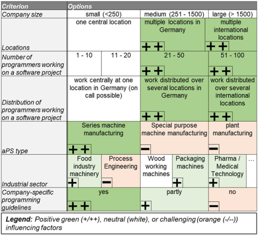
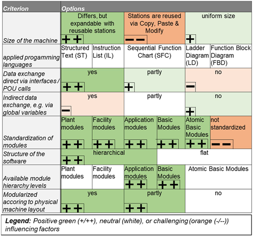
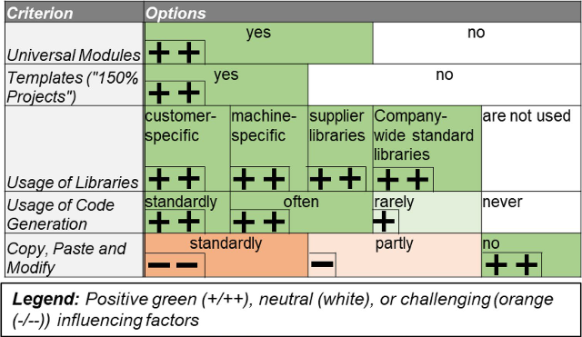
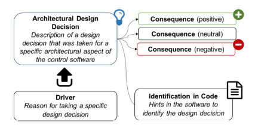
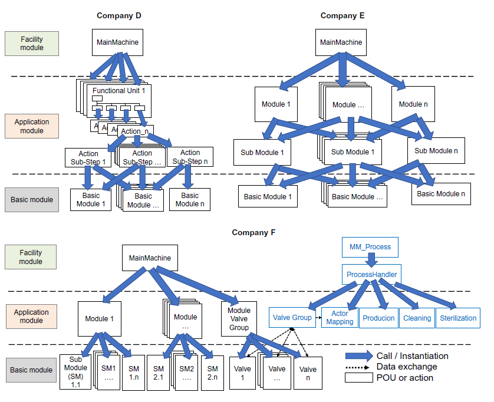
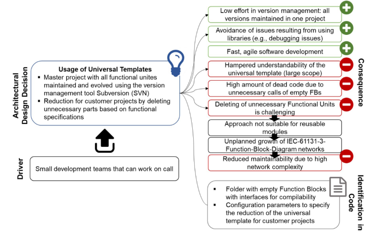

# Automation software architectures in automated production systems: an industrial case study in the packaging machine industry

https://link.springer.com/article/10.1007/s11740-022-01133-y

Neumann, EM., Vogel-Heuser, B., Fischer, J. et al. Automation software architectures in automated production systems: an industrial case study in the packaging machine industry.  Prod. Eng. Res. Devel. 16, 847–856 (2022). https://doi.org/10.1007/s11740-022-01133-y

## Анотація

У добу Індустрії 4.0 прогрес у галузі виробничої інженерії зумовлюється сучасними машинами та обладнанням, розвиток яких нині переважно залежить від програмного забезпечення. Такі машини об’єднуються в автоматизовані виробничі системи (aPS), програмне забезпечення яких характеризується високою складністю, тривалим життєвим циклом і тісною інтеграцією мехатронних дисциплін. Розробка модульних, гнучких архітектур програмного забезпечення, що адаптуються до специфічних умов підприємства й технологічного процесу, є критичною передумовою для глобальної конкурентоспроможності компаній. Попри наявність численних підходів у галузі комп’ютерних наук, досі бракує чіткого визначення архітектури керувального програмного забезпечення для aPS, а також систематичних методів аналізу архітектур програмного забезпечення, специфічних для підприємства, та пов’язаних із ними рішень щодо проєктування. Цю прогалину пропонується усунути шляхом визначення архітектури керувального програмного забезпечення в aPS, включаючи архітектурні представлення для врахування різноманітних чинників впливу. Для забезпечення систематичного аналізу архітектури запропоновано шаблони для візуалізації рішень щодо проєктування з метою формування конкретних рекомендацій для фахівців із вдосконалення програмного забезпечення. Поглиблене інтерв’ю-дослідження у трьох відомих компаніях з виробництва пакувального обладнання підтвердило ефективність запропонованого аналізу архітектури для систематичної ідентифікації потенціалу оптимізації та конкретних точок старту для впровадження.

## 1 Вступ і мотивація

Сучасні технологічні досягнення у виробничій інженерії вимагають високогнучких і здатних до розвитку машин та обладнання, що об’єднуються в так звані автоматизовані виробничі системи (aPS) [1]. Наразі еволюція aPS переважно здійснюється за допомогою програмного забезпечення, що, відповідно, висуває високі вимоги до архітектури керувального програмного забезпечення. Попри численні підходи до аналізу архітектури програмного забезпечення (SWA) у сфері вбудованих систем, архітектура керувального програмного забезпечення в aPS (CSWA) досі майже не досліджена. Жорсткі вимоги до роботи в реальному часі, життєві цикли тривалістю в кілька десятиліть і можливість зміни коду під час роботи машини [2] ускладнюють розробку універсальних настанов для створення якісної архітектури. Водночас чітко модульована, здатна до еволюції й обслуговувана архітектура CSWA є ключем до впровадження технологій майбутнього, а отже, і до збереження конкурентоспроможності.

Одним із головних викликів на шляху вдосконалення CSWA є розуміння взаємовпливу між рішеннями щодо проєктування та визначення конкретних точок старту для оптимізації. У цій статті запропоновано підхід до визначення CSWA для aPS на основі попередніх аналізів промислових прикладів, зокрема через п’ять архітектурних представлень для врахування чинників, що впливають на CSWA. За допомогою поглибленого інтерв’ю-дослідження з досвідченими експертами з керувального програмного забезпечення трьох компаній з виробництва пакувального обладнання досліджується придатність різних типів CSWA до специфічних умов підприємства та виробничих процесів. Запропоновано шаблони для документування рішень щодо архітектури, що дозволяють візуалізувати зв’язки, рушійні чинники та наслідки, з метою формування рекомендацій для покращення архітектури. Ефективність аналізу архітектури та отриманих рекомендацій підтверджено під час подальших зустрічей з опитаними експертами.

У подальших розділах спочатку представлено сучасний стан аналізу SWA (розділ 2), на основі чого сформульовано визначення CSWA (розділ 3). У розділі 4 введено морфологічні таблиці для структурування чинників впливу на CSWA. У розділі 5 визначено шаблони для документування рішень щодо проєктування та формування рекомендацій до дій, які використовуються в інтерв’ю-дослідженні, описаному в розділі 6. Статтю завершено висновками в розділі 7.

## 2 Огляд пов’язаних робіт з архітектури ПЗ (SWA) у виробничих системах

 У наступних підрозділах окреслено сучасний стан керувального програмного забезпечення в aPS та аналізу архітектури ПЗ (SWA).

### 2.1 Граничні умови для CSWA в aPS

 aPS є складними мехатронними системами [2], які зазвичай програмуються із застосуванням програмованих логічних контролерів (PLC), що характеризуються циклічним виконанням програм. PLC зазвичай програмуються відповідно до стандарту IEC 61131-3, який визначає дві текстові та три графічні мови, а також структурні елементи — так звані програмні організаційні одиниці (POU), що використовуються як багаторазові програмні блоки. Із 2013 року в IEC 61131-3 офіційно інтегровано об’єктно-орієнтовану парадигму програмування (OO-IEC [3]), яка включає об’єктно-орієнтовані мовні елементи за аналогією з мовами високого рівня. Однак наразі вона майже не застосовується в програмуванні PLC, наприклад, тому що програмне забезпечення часто обслуговується техніками без фахової підготовки у програмуванні, яким простіше працювати з процедурним стилем [4].

### 2.2 Пов’язані роботи з аналізу SWA та якості

У галузі комп’ютерних наук одним із найчастіше цитованих визначень SWA є таке: «усі основні аспекти програмної системи, включаючи її структурні елементи — компоненти […], з’єднувачі […], та конфігурації» [5]. Ці фундаментальні елементи архітектури програмного забезпечення підтверджуються і в інших усталених визначеннях [6, 7]. Архітектура програмного забезпечення визначається рішеннями щодо проєктування, які мають враховувати нефункціональні характеристики системи [5]. Бажані SWA, що вирішують типові проблеми, можуть бути сформульовані як багаторазові шаблони проєктування для підтримки розробників, які стикаються з подібними викликами [5, 8]. Архітектурне проєктування безпосередньо впливає на атрибути якості програмного забезпечення, включаючи продуктивність, витрати на розробку та обслуговуваність [9].

Попередні промислові дослідження [10] виявили складнощі у формулюванні чітко структурованої CSWA для aPS, оскільки програмне забезпечення PLC повинно враховувати специфічні граничні умови, що суттєво відрізняються від умов у вбудованих системах — зокрема обмеження платформи, такі як обмежений цикл виконання чи зміни програмного забезпечення під час роботи системи [2, 4].

Статичний аналіз коду [11] корисний для вимірювання атрибутів якості SWA, наприклад, за допомогою метрик програмного забезпечення [12]. Vogel-Heuser та ін. [10] ідентифікували типову п’ятирівневу модульну архітектуру в програмному забезпеченні PLC, яка відповідає рівням ISA-88 і включає модулі різної деталізації — від базових модулів, що керують окремими виконавчими механізмами, такими як циліндри чи приводи (Maga та ін. [13]), до модулів, що керують поведінкою цілих машин (модулі установок) або виробництв (модулі підприємства). Однак досі бракує точного визначення CSWA для aPS, а також систематичних підходів для оцінювання її сильних і слабких сторін з метою формування конкретних рекомендацій для оптимізації.

## 3 Визначення CSWA в aPS

Базові елементи визначення архітектури програмного забезпечення (SWA) у комп’ютерних науках також наявні в архітектурі керувального ПЗ (CSWA). Компонентами можуть бути окремі програмні організаційні одиниці (POU) або їхні групи, об’єднані в модулі, дії, змінні або елементи OO-IEC (наприклад, властивості чи методи), які пов’язані між собою обміном даними (викликами або читанням/записом змінних) чи структурними зв’язками, що виникають із OO-IEC — тобто через спадкування чи інтерфейси. Проте ключові характеристики CSWA, як-от необхідність роботи в жорсткому реальному часі та можливість зміни ПЗ під час роботи, не враховуються у визначеннях із комп’ютерних наук [2].

Щоб заповнити цю прогалину, було порівняно типові проєкти керувального ПЗ та архітектурні настанови трьох компаній з різними граничними умовами (див. таблицю 1), зокрема:

- виробник пакувальних машин (A) з розвиненою CSWA та системою управління якістю, підтвердженою у попередньому анкетному дослідженні [10],
- виробник установок для автомобільної галузі (B), який застосовує точні програмні настанови для забезпечення високої якості ПЗ,
- виробник установок для деревообробної промисловості (C).

Результати показують, що на CSWA значно впливають особливості aPS, детально розглянуті та підтверджені у попередніх дослідженнях [2], і що вона в основному визначається рішеннями проєктування в межах таких архітектурних представлень — окремих підмножин структурних елементів системи [14]:

- Вплив апаратного забезпечення на ієрархію та модульність. Значна апаратна складність в aPS і довгий строк експлуатації вимагають зрілої CSWA, що забезпечує розвиток під час роботи системи через зміни в ПЗ [2]. Залежно від розміру aPS і складності рухових задач, потрібні різні апаратні архітектури автоматизації (наприклад, застосування кількох ПЛК або складних приводів), які також істотно впливають на CSWA.
- Стратегії повторного використання. На CSWA впливає обрана стратегія повторного використання — від систематичного використання перевірених бібліотек POUs або шаблонів ПЗ до незапланованого підходу Copy, Paste & Modify, який усе ще переважає у CSWA-розробці та зазвичай призводить до неконтрольованого розростання ПЗ і проблем з його супроводом.
- Нефункціональні задачі. Такі задачі, як обробка виключень, зв’язок з інтерфейсом людина-машина (HMI) або перемикання режимів роботи, становлять до 75% проєкту керувального ПЗ [15]. Вони зазвичай модульовані інакше, ніж функціональна частина, але тісно пов’язані з нею, що робить управління варіативністю CSWA серйозним викликом [16].
- Парадигма програмування та розробка ПЗ. Зміни в ПЗ під час роботи часто виконують техніки без досвіду програмування, що ускладнює застосування об’єктно-орієнтованих парадигм, поширених у комп’ютерних науках [2]. Крім того, певні конструкції OO-IEC можуть спричинити проблеми під час виконання і, відповідно, конфлікт із жорсткими вимогами реального часу [17].
- Компанієспецифічні граничні умови. Це не є архітектурним представленням у прямому сенсі, оскільки характеристики компанії неможливо прямо відобразити в ПЗ. Однак такі умови, як організація міждисциплінарної взаємодії [4], мають значний вплив на CSWA.

Підсумовуючи, можна сказати, що консенсусне визначення SWA з комп’ютерних наук є недостатнім для повноцінного визначення CSWA. Тому для розуміння й оптимізації CSWA необхідно розширити визначення за рахунок вищезазначених архітектурних представлень.

Table 1. Overview of use cases to derive the architecture definition

| Use case   | Industrial sector     | aPS type                      |
| ---------- | --------------------- | ----------------------------- |
| Company A  | Packaging machinery   | Series  machine manufacturing |
| Company  B | Automotive            | Plant  manufacturing          |
| Company C  | Woodworking machinery | Plant manufacturing           |

## 4 Морфологічні таблиці для чинників, що впливають на архітектуру

Оскільки аналіз і порівняння рішень щодо архітектури програмного забезпечення є багатовимірною задачею, для опису різних архітектурних представлень запроваджено морфологічні таблиці. Ці таблиці були сформовані на основі попередніх промислових кейсів [10] і доповнені консультаціями з експертами з академічної сфери та промислової автоматизації.

Попри широкий консенсус у високорівневому програмному забезпеченні щодо бажаних принципів проєктування, що ведуть до високої якості (див., напр., [18]), визначити універсальні найкращі практики для CSWA в aPS складно через відмінності в компаніях щодо розуміння якості програмного забезпечення та через залучення різних за досвідом зацікавлених сторін (таблиця 2). Наприклад, у машинобудуванні та спеціальному обладнанні техніки з обмеженими навичками програмування часто змушені змінювати програмне забезпечення під час пусконалагодження під тиском часу, що може зашкодити CSWA, якщо вона не є інтуїтивно зрозумілою.

Table 2 Morphological Box to classify company-specific boundary conditions

Досвід промислового аналізу коду показує, що великі компанії, особливо ті, що працюють у кількох локаціях, більше змушені до чіткої модульності й документування програмного забезпечення, оскільки обмін інформацією «на вимогу» під час розробки майже неможливий — наприклад, для пояснення фрагментів коду, які важко зрозуміти. Залежно від галузі можуть діяти специфічні стандарти (наприклад, OMAC для пакувальних машин) або юридичні вимоги (наприклад, у медичній сфері), які вимагають або підтримують забезпечення високоякісної CSWA (див. таблицю 2). Стандарти безпеки, як-от Good Automated Manufacturing Practice 5 (GAMP 5) у фармацевтичній і харчовій промисловості, дозволяють оцінювати ризики протягом усього життєвого циклу системи, щоб забезпечити якість і безпечність продукції. Сертифікація згідно з GAMP вимагає, щоб CSWA відповідала вимогам до проєктування, а процес розробки включав процедури валідації.

Щодо ієрархії та модульності, досвід попередніх досліджень [10] показує, що машини, які можуть бути розширені за рахунок добре визначених багаторазових станцій для задоволення різних потреб замовника, також потребують чітко модульованої CSWA (див. таблицю 3). На відміну від прямого обміну даними через інтерфейси POU та виклики, непрямий обмін через глобальні змінні часто перешкоджає повторному використанню. Ієрархічна структура CSWA загалом оцінюється як корисна. Структурування CSWA відповідно до фізичного компонування aPS покращує зрозумілість системи, а отже, сприяє її розвитку та обслуговуванню [10].

Table 3 Morphological Box to classify hierarchy and modularization

Підхід Copy, Paste & Modify вважається таким, що має сильний негативний вплив на CSWA (див. таблицю 4) з причин, наведених у розділі 3. З іншого боку, систематичне повторне використання керувального ПЗ — наприклад, із використанням шаблонів, бібліотек або генерації коду — очікувано покращує якість CSWA.

Table 4 Morphological Box to classify reuse strategies

## 5 Шаблони для аналізу архітектурних рішень і формування рекомендацій до дій

Документування, а отже — й розуміння рішень щодо проєктування промислової CSWA, вимагає зрозумілої форми подання, яка дозволяє швидко охопити саме рішення, чинники, що до нього призвели, його наслідки, а також розташування у програмному забезпеченні. Тому запропоновано чотиричастинний шаблон (див. рис. 1).

Аналіз рішень щодо проєктування та їхніх наслідків дає змогу чітко визначити сильні й слабкі сторони наявної CSWA, ідентифікувати точки старту для її вдосконалення, а також оцінити взаємовплив між запланованими змінами та вже ухваленими архітектурними рішеннями. Відтак, необхідно формувати зрозумілі рекомендації до дій, які охоплюють такі аспекти (на основі [19] з доповненням точними категоріями для кожного з аспектів, див. таблицю 5):

Рис. 1 Шаблон для документування архітектурних рішень щодо проєктування

## 6 Інтерв’ю-дослідження для аналізу архітектурних рішень у галузі пакувального обладнання

Застосовність аналізу архітектури з використанням шаблонів, описаних у розділі 5, та припущень щодо чинників впливу на CSWA (див. морфологічні таблиці в розділі 4) було проаналізовано шляхом проведення інтерв’ю з експертами у трьох компаніях, що виробляють автоматизовані виробничі системи (aPS).

### 6.1 Порівнюваність компаній

Щоб забезпечити порівнюваність результатів, було проаналізовано компанії з однієї промислової галузі, які використовують ПЛК-платформи одного й того самого постачальника. Таким чином, ці компанії стикаються з подібними викликами (наприклад, схожою складністю задач руху), а також мають подібні ресурси для їх вирішення — як-от рішення, запропоновані постачальником платформи, або галузеві стандарти. З іншого боку, для вивчення впливу різних специфічних граничних умов підприємства та виробничих процесів розглядалися такі параметри, як кількість працівників, кількість локацій і вимоги до відповідних машин (див. таблицю 1).

Харчова та пакувальна техніка є однією з найважливіших галузей машинобудування в Німеччині та характеризується високою різнорідністю [20]. Тому ця галузь є ідеальною для аналізу рішень щодо архітектури CSWA в умовах різних обмежень. Було обрано такі три компанії (див. таблицю 1):

- Компанія D — близько 400 працівників, працює на глобальному рівні з однією центральною локацією, виробляє машини для фінального пакування попередньо фасованих продуктів (харчові та напої);
- Компанія E — понад 1400 працівників, представлена приблизно в 40 країнах, виготовляє машини для пакування медичних і фармацевтичних виробів;
- Компанія F — приблизно 5500 працівників, представлена в близько 40 країнах, має жорсткі вимоги до асептичного пакування харчових продуктів і напоїв.

Усі компанії застосовують внутрішні програмні настанови для підтримання якості програмного забезпечення.

Таблиця 5 — Шаблон для формування рекомендацій до дій:

| Категорія                                 | Специфікація                                                 |
| ----------------------------------------- | ------------------------------------------------------------ |
| Рекомендація (Вибір одного з варіантів):  | Тип 1: Додавання/видалення/модифікація компонентів, з’єднань або конфігурацій Тип 2: Застосування методу аналізу архітектури для моніторингу/розуміння архітектури |
| Деталі (Необхідно вказати обидва пункти): | Причина, чому поточне рішення є неоптимальним Пояснення, як рекомендація вирішує цю проблему |
| Архітектурне представлення (AV)           | AV1: Основне представлення (Ієрархія та модульність, Повторне використання, (Над-)функціональні задачі, Парадигма програмування) AV2: Необов’язкова вказівка конкретних аспектів відповідного AV1 |
| (Екстра-)Функціональна задача             | Функціональні: Логіка прикладного рівня (на рівнях підприємства, установки, аплікації, базових або атомарних базових модулів) Екстрафункціональні: Перемикання режиму роботи, Обробка помилок, Інтеграція з HMI, Збір експлуатаційних даних, Керування апаратурою, Інше/Додаткове |
| Нефункціональна властивість               | Нефункціональні атрибути архітектури, на які впливає рекомендація (класифікація відповідно до ISO 25010) |
| Обсяг (Scope)                             | S1: Вся структура програмного забезпечення (рівень проєкту) S2: Модулі, бібліотеки POU, комбінації POU для нефункціональних задач S3: Окремі POU, елементи бібліотек S4: Функціонально пов’язані ділянки коду всередині POU S5: Окремі оператори/операнди |

### 6.2 Проведення інтерв’ю та результати

Для оцінки значущості архітектурних представлень у CSWA (див. розділ 3) було сформульовано запитання до всіх представлень у співпраці з досвідченими фахівцями в галузі промислової автоматизації. Ці запитання обговорювалися в кожній компанії під час тригодинних інтерв’ю за участі восьми експертів з програмного забезпечення, включно з програмістами ПЛК, фахівцями з HMI та керівниками проєктів, щоб охопити різні перспективи на CSWA.

Інтерв’ю проводила змішана команда, яка складалася з двох науковців і трьох провідних інженерів від постачальника платформи, з метою класифікації CSWA як у контексті попередніх досліджень, так і з позиції поточного технічного стану практики. Виявлені рішення щодо проєктування та сформульовані на їх основі рекомендації були підготовлені з використанням шаблонів, представлених у розділі 5, та обговорені під час наступних зустрічей з учасниками інтерв’ю для отримання зворотного зв’язку, запобігання непорозумінням і уточнення відкритих питань.

У подальшому викладено результати аналізу за архітектурними представленнями «ієрархія та модульність» і «стратегії повторного використання».

#### 6.2.1 Ієрархія та модульність

Компанія D дотримується суворого підходу до модульності, орієнтованого на функціональну структуру, яка слугує спільною основою для взаємодії між залученими дисциплінами й, відповідно, відображається у фізичному компонуванні машини. Центральним елементом є так званий функціональний модуль (FU) — чітко визначена підфункція машини, якою керує відповідна програмна організаційна одиниця (POU). Модульність, орієнтована на функції, робить структуру інтуїтивно зрозумілою для спеціалістів різних напрямів. Проте існують FU, які не мають прямого апаратного представлення, наприклад, нефункціональні частини ПЗ, що використовуються в кількох модулях — це ускладнює обслуговування CSWA.

Ієрархія програмного забезпечення в компанії E орієнтована на фізичну структуру машини — від верхнього рівня MainMachine, який викликає підлеглі модулі, що керують автономними частинами машини, наприклад, для подавання елементів, які підлягають спільному пакуванню. Модулі викликають відповідні станції — тобто кроки процесу, що належать до одного етапу. Нижче рівня станцій викликаються базові модулі для керування окремими виконавчими механізмами, такими як циліндри.

Для забезпечення суворих асептичних вимог до пакування харчових продуктів і напоїв компанія F реалізує CSWA у вигляді двох паралельних ієрархічних дерев: одне — для керування поведінкою машини, друге — для керування виробничим циклом, що включає виробництво, очищення та стерилізацію, з метою забезпечення постійної відповідності гігієнічним вимогам (рис. 2, праворуч унизу). Програмне забезпечення для керування поведінкою машини орієнтоване на її фізичне компонування. Компонент ProcessHandler забезпечує дотримання виробничого циклу і дозволяє лише певні кроки процесу. Залежно від поточної фази виробничого циклу, ActorMapping визначає можливі вихідні значення клапанів у ValveGroup.

Порівняння ієрархій програмного забезпечення показує, що всі компанії вирішили структурувати ПЗ у вигляді ієрархічного дерева, що відображає фізичну структуру машини. Проте різні граничні умови призводять до відмінних форм цих дерев. Опитані експерти підтвердили, що хоча модульність, орієнтована на апаратну частину, підвищує зрозумілість, вона зазвичай не може бути застосована до всього програмного забезпечення, оскільки, наприклад, нефункціональні задачі не мають прямого апаратного представлення і тому не вписуються в цю структуру — як-от виробничий цикл у компанії F.

Рис. 2 Структура викликів у трьох досліджених компаніях (візуалізація за аналогією з [9](#_bookmark24))

#### 6.2.2 Стратегії повторного використання

Компанії застосовують різні стратегії повторного використання керувального програмного забезпечення, адаптовані до власних граничних умов і вимог.

Компанія D використовує універсальний шаблон, тобто майстер-проєкт, що містить усі теоретично доступні функціональні модулі (FU) і підмодулі. Для створення конкретного проєкту машини з нього видаляються всі непотрібні частини. Передумовою для такого рішення є невеликі розміри команд, які дозволяють працювати у форматі за викликом, що знижує ймовірність помилок завдяки хорошій комунікації. Проте універсальний шаблон складно сприймати новим працівникам через його великий обсяг, а також його важко обслуговувати. Крім того, такий підхід створює значну частку "мертвого коду", оскільки порожні функціональні блоки (FB) мають залишатися після скорочення майстер-проєкту, щоб забезпечити компіляцію без модифікації викликаючих POU. Нові варіанти створюються шляхом Copy, Paste and Modify наявних FU. Використання OO-IEC, яке дозволяє створювати нові варіанти через спадкування, не має широкого прийняття серед старших працівників. Програмісти компанії D також зазначають, що це веде до зростання зусиль на обслуговування та неефективності через дублювання реалізації.

Компанія F обрала концепцію повторного використання, що базується на зрілих бібліотеках модулів у поєднанні з OO-IEC. Окрім бібліотек постачальника, використовуються й внутрішні бібліотеки компанії, наприклад, для обробки помилок. Для компанії F використання універсального шаблону, як у компанії D, є недоцільним через високу складність CSWA та значно більші команди. Щоб уникнути Copy, Paste and Modify, а разом з тим і пов’язаних довгострокових проблем із якістю та обслуговуваністю, потенційно повторно використовувані FB зберігаються в окремій теці для подальшої стандартизації та включення до бібліотек.

Компанія E розробляє більшість програмного забезпечення за допомогою генерації коду на основі рішень, прийнятих у межах механічної та електротехнічної інженерії. Для кожної машини створюється новий проєкт на основі багаторазових шаблонів (див. рис. 1). Деякі (під)модулі (наприклад, для картонування) використовуються в багатьох різних машинах, що забезпечує високий рівень повторного використання. Перевагою є міждисциплінарна узгодженість в інженерії. Проте під час генерації можуть створюватися POU з дуже дрібною деталізацією, що ускладнює сприйняття структури ПЗ.

Щодо повторного використання керувального ПЗ можна зробити висновок, що застосовані стратегії чітко адаптовані до специфіки й викликів кожної окремої компанії й не можуть бути напряму перенесені до інших без ускладнень або необхідних адаптацій.

### 6.3 Документування результатів і формування рекомендацій до дій

Результати інтерв’ю були оформлені за допомогою шаблону (див. рис. 1) для формулювання рекомендацій до дій, які разом з відповідними архітектурними рішеннями були проаналізовані спільно з учасниками інтерв’ю. Підхід демонструється на прикладі рішення компанії D щодо повторного використання програмного забезпечення на основі універсального шаблону.

Застосування шаблону до цього рішення (див. рис. 3) виявляє численні переваги стратегії повторного використання, оскільки вона адаптована до специфічних граничних умов компанії. Водночас, стають очевидними і недоліки, зазначені в розділі 6.2. Ці негативні наслідки були оброблені за допомогою конкретних рекомендацій, сформульованих відповідно до структури таблиці (див. таблицю 4). Наприклад, для усунення недоліку «Ускладнене сприйняття універсального шаблону» (див. таблицю 5), запропоновано покращити ситуацію шляхом візуалізації структури та функціонального розподілу за аналогією з рис. 1 (див. таблицю 6):

Рис. 3 Структурована візуалізація рішення компанії D щодо використання універсальних модулів із застосуванням запропонованого шаблону

Усі учасники підтвердили, що візуалізація CSWA, подібна до рис. 1, підвищує зрозумілість і полегшує ознайомлення нових працівників з архітектурою програмного забезпечення. Представлення архітектурних рішень на основі шаблону виявилося корисним інструментом для осмислення структури ПЗ та взаємозв’язків між окремими рішеннями.

Особливо вагомими є переваги аналізу CSWA з різних точок зору, оскільки лише поєднання інформації з різних представлень і розуміння їхніх взаємозв’язків дозволяє здійснювати системне, цілеспрямоване планування оптимізацій наявного програмного забезпечення. Крім того, аналіз рішень щодо проєктування в різних представленнях дозволяє системно виводити рекомендації для вдосконалення CSWA.

Це особливо підтвердилося під час подальших обговорень у компанії D: деякі з отриманих рекомендацій компанія вже самостійно ідентифікувала та розпочала їх впровадження. Експерти відзначили, що таблична форма подання є дуже зручною, а рівень деталізації шаблону — цілком достатній для розуміння та реалізації рекомендацій.

Таблиця 6 Рекомендація до дії для усунення ускладненої зрозумілості універсального шаблону (компанія D):

| Категорія                       | Специфікація                                                 |
| ------------------------------- | ------------------------------------------------------------ |
| Рекомендація                    | Тип 2: Візуалізація структури та функціонального розподілу майстер-проєкту |
| Деталі                          | Причина: Великий обсяг майстер-проєкту, що ускладнює його розуміння Пояснення: Візуалізація полегшує орієнтацію в проєкті та запобігає помилкам |
| Архітектурне представлення (AV) | AV1: 1. Ієрархія та модульність AV2:  1. Структура програмного забезпечення 2. Обмін даними 3. Доступні рівні ієрархії модулів |
| (Над-)Функціональна задача      | Функціональні та нефункціональні задачі                      |
| Нефункціональна властивість     | Обслуговуваність (включно з модульністю, повторним використанням та можливістю аналізу) |
| Обсяг (Scope)                   | S1: Вся структура програмного забезпечення майстер-проєкту   |

## 7 Висновки та перспективи

У цій статті запропоновано визначення архітектури керувального програмного забезпечення (CSWA) шляхом введення архітектурних представлень, що враховують особливості автоматизованих виробничих систем (aPS), які впливають на керувальне ПЗ [2], зокрема складність апаратної структури та рухових задач, необхідність адаптації до змін під час роботи, а також труднощі реалізації нефункціональних задач. Вплив архітектурних представлень був вивчений спільно з експертами з академічного середовища та промислової автоматизації на основі морфологічних таблиць.

Для аналізу та вдосконалення промислових CSWA запропоновано шаблони для документування та аналізу архітектурних рішень і їхнього впливу, а також для формулювання конкретних рекомендацій щодо вдосконалення наявної CSWA. Ефективність шаблонів продемонстровано на прикладі інтерв’ю-дослідження у трьох компаніях-виробниках пакувального обладнання, де виявлені архітектурні рішення були порівняні та проаналізовані з позиції різних архітектурних представлень.

Позитивний зворотний зв’язок від експертів у межах інтерв’ю-дослідження свідчить про значний потенціал системного аналізу архітектури для оптимізації наявного програмного забезпечення та впровадження інноваційних технологій у виробничій інженерії. Тому майбутні дослідження зосередяться на тому, як інтегрувати такий аналіз архітектури у робочий процес промислової розробки програмного забезпечення.

Особливо для малих підприємств фінансово та ресурсно недоцільно створювати окремі відділи для системного управління якістю, тому подальші дослідження будуть спрямовані на те, як надати їм інструменти для ефективної оптимізації CSWA з використанням наявних ресурсів. Наразі аналіз здійснюється вручну, однак уже ведуться розробки щодо автоматизації окремих його аспектів, щоб спростити впровадження у промислову практику — наприклад, для виявлення порушень існуючих архітектурних специфікацій.

Крім того, поєднання різних представлень під час оцінювання архітектури та отримані знання про взаємовплив рішень щодо проєктування можуть підтримати розробку нових проєктів ПЗ ще на етапі проєктування, забезпечуючи застосування найкращих практик і шаблонів проєктування.

# References

1. Brecher C, Rawat DB, Song H, Jeschke S (eds) (2017) Cyber-physical systems: foundations, principles and applications. Academic Press, London

2. Vogel-Heuser B, Fay A, Schaefer I, Tichy M (2015) Evolution of software in automated production systems: challenges and research directions. JSS 110:54–84

3. Werner B (2009) Object-oriented extensions for IEC 61131–3. IEEE Ind Electron Mag (IEEE Industrial Electronics Magazine) 3:36–39

4. Neumann E-M, Vogel-Heuser B, Fischer J, Ocker F, Diehm S, Schwarz M (2020) Formalization of Design patterns and their automatic identification in PLC software for architecture assess-ment. IFAC-PapersOnLine 53:7917–7924

5. Medvidovic N, Taylor RN (2010) Software architecture. In: Kramer J, Bishop J, Devanbu P, Uchitel S (eds) Proceedings of the 32nd ACM/IEEE International Conference on Software Engineering—ICSE '10. ACM Press, New York, New York, USA, p 471

6. Reussner RH, Schmidt HW, Poernomo IH (2003) Reliability prediction for component-based software architectures. JSS 66:241–252

7. Bass L, Clements P, Kazman R (2010) Software architecture in practice, 2nd edn. Addison-Wesley, Boston (14. print)

8. Gamma E, Helm R, Johnson R, Vlissides J (2011) Design pat- terns: elements of reusable object-oriented software, 39. Printing. Addison-Wesley, Boston

9. Lytra I, Carrillo C, Capilla R, Zdun U (2020) Quality attributes use in architecture design decision methods: research and practice. Computing 102:551–572

10. Vogel-Heuser B, Fischer J, Feldmann S, Ulewicz S, Rösch S (2017) Modularity and architecture of PLC-based software for automated production Systems: an analysis in industrial companies. JSS 131:35–62

11. Prähofer H, Angerer F, Ramler R, Grillenberger F (2017) Static code analysis of IEC 61131–3 programs: comprehensive tool support and experiences from large-scale industrial application. IEEE TII 13:37–47

12. Nair A (2012) Product metrics for IEC 61131–3 languages. In: Proceedings of the 17th International Conference on Emerging Technologies & Factory Automation (ETFA 2012), vol 17, pp 1–8

13. Maga C, Jazdi N, Göhner P (2011) Reusable models in industrial automation: experiences in defining appropriate levels of granularity. IFAC Proc Vol 44:9145–9150

14. Clements P, Garlan D, Little R, Nord R, Stafford J (2003) Documenting software architectures: views and beyond. In: Proceedings 25th International Conference on Software Engineering, vol 25, pp 740–741

15. Güttel K, Weber P, Fay A (2008) Automatic generation of PLC code beyond the nominal sequence. In: Proceedings of the 13th International Conference on Emerging Technologies & Factory Automation (ETFA 2007). IEEE, vol 13, pp 1277–1284

16. Vogel-Heuser B, Fischer J, Hess D, Neumann E-M, Wurr M (2022) Boosting Extra-Functional Code Reusability in Cyber-Physical Production Systems: The Error Handling Case Study. TETC 10:60–73

17. Neumann E-M, Vogel-Heuser B, Fischer J, Keller J, Weis I, Diehm S, Schwarz M, Englert T, Stoll M, Zell U (2020) Identifying runtime issues in object-oriented IEC 61131-3-compliant control software using metrics. IEEE IECON 2020:259–266

18. Martin RC (2012) Clean code: A handbook of agile software craftsmanship, [Repr.]. Prentice Hall, Upper Saddle River

19. Vogel-Heuser B, Fischer J, Neumann E-M (2020) Goal-lever- indicator-principle to derive recommendations for improving IEC 61131–3 control software. In: 14th IEEE International Conference on Industrial Engineering and Engineering Management (IEEM 2020), vol 14, pp 1131–1136

20. VDMA (2020) Food Processing and Packaging Machinery. [https://](https://nuv.vdma.org/en/ueber-uns)[ nuv.vdma.org/en/ueber-uns](https://nuv.vdma.org/en/ueber-uns). Accessed 17 Apr 2022

Publisher's Note Springer Nature remains neutral with regard to jurisdictional claims in published maps and institutional affiliations.