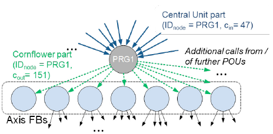

# Formalization of Design Patterns and Their Automatic Identification in PLC Software for Architecture Assessment

Eva-Maria Neumann, Birgit Vogel-Heuser, Juliane Fischer, Felix Ocker, Sebastian Diehm, Michael Schwarz, Formalization of Design Patterns and Their Automatic Identification in PLC Software for Architecture Assessment, IFAC-PapersOnLine, Volume 53, Issue 2, 2020, Pages 7819-7826, ISSN 2405-8963, https://doi.org/10.1016/j.ifacol.2020.12.1881. (https://www.sciencedirect.com/science/article/pii/S2405896320324952)

## Анотація (Abstract)

У зв’язку з сучасними тенденціями в галузі автоматизації, такими як масова кастомізація та зростаюче різноманіття продукції, програмне забезпечення (ПЗ) керування в автоматизованих виробничих системах (aPS) стає дедалі складнішим. Відповідно, зростає потреба у належних стратегіях модульності як передумові для запланованого повторного використання. У класичному програмуванні мовами високого рівня часто використовують багаторазові шаблони проєктування для розв’язання типових задач. Водночас у розробці ПЗ керування для aPS такий підхід досі не набув широкого застосування. У цій статті розглядається можливість використання шаблонів проєктування для оцінювання модульності в контексті архітектури ПЗ керування шляхом запропонування критеріїв для класифікації та формалізації шаблонів у структурі ПЗ aPS. На цій основі запропоновано прототипове впровадження для перевірки концепції та забезпечення автоматизованої ідентифікації та інтерпретації шаблонів у промисловому контексті.

## 1. Вступ 

Автоматизовані виробничі системи (aPS) є складними мехатронними системами, які стикаються з дедалі складнішими викликами, такими як глобальна конкуренція та нові технології. Унаслідок цього розробка програмного забезпечення (ПЗ) керування в aPS відбувається під значним часовим і фінансовим тиском, що призводить до неконтрольованих стратегій повторного використання, як-от «копіюй, вставляй і змінюй» (Copy, Paste & Modify), які перешкоджають створенню модульних архітектур ПЗ. Водночас багато експертів з промисловості та академічного середовища погоджуються, що модульність є ключовою передумовою для високої якості ПЗ та ефективних процесів розробки.

Для забезпечення модульності та систематичного повторного використання ПЗ комп’ютерні науки пропонують перспективні підходи, такі як об'єктно-орієнтоване (ОО) програмування або повторне використання шаблонів проєктування. Однак ці підходи досі майже не застосовуються в автоматизаційних технологіях.

Попередні дослідження (див. Fuchs et al. (2014)) вже ідентифікували шаблони проєктування в промисловому ПЗ для aPS, але все ще бракує детального аналізу того, як формалізувати ці шаблони для оцінки модульності в рамках комплексного аналізу архітектури ПЗ.

Тому основним внеском цієї статті є підхід до всебічного аналізу архітектури ПЗ керування aPS із використанням автоматизованої ідентифікації шаблонів ПЗ. На основі критеріїв для опису та формалізації типових структурних шаблонів у ПЗ aPS запропоновано реалізацію для оцінки концепції та забезпечення автоматичної ідентифікації шаблонів у промисловому ПЗ.

Для оцінки архітектури ПЗ обговорюється вплив на модульність як наявності, так і відсутності шаблонів. Крім того, виявляються додаткові дані, які не випливають безпосередньо з аналізу коду, але є необхідними для комплексної оцінки архітектури.

Структура статті наступна: у розділі 2 подано огляд стану справ у галузі архітектури ПЗ та шаблонів ПЗ. У розділі 3 описано метод використання шаблонів проєктування для оцінки модульності ПЗ aPS. Розділ 4 представляє прототипову реалізацію для перевірки концепції. Результати оцінювання обговорюються в розділі 5. Стаття завершується підсумками та перспективами в розділі 6.

## 2. СТАН СПРАВ: АРХІТЕКТУРА ПРОГРАМНОГО ЗАБЕЗПЕЧЕННЯ В APS

У цьому розділі подано визначення архітектури з точки зору комп’ютерних наук, описано архітектурні обмеження для aPS, а також розглянуто шаблони в aPS.

### 2.1 Архітектура програмного забезпечення в комп’ютерних науках

У комп’ютерних науках існує кілька визначень архітектури ПЗ. Наприклад, Reussner та ін. (2019) визначають архітектуру ПЗ як «загальну структуру системи, що зазвичай виражається через компоненти, інтерфейси та їх взаємозв’язки». Meyer (1997) визначив гнучку архітектуру системи як ключову передумову забезпечення розширюваності та повторного використання. Такі архітектури характеризуються «автономними елементами, пов’язаними послідовною, простою структурою», тобто модулями. Cámara та ін. (2017) описують архітектуру ПЗ через структурні обмеження (наприклад, заздалегідь визначені зв’язки між компонентами) та набір конкретних архітектурних елементів (наприклад, екземпляри компонентів, що реалізують архітектуру). Ці підходи становлять лише частину загального напряму досліджень з оцінки та класифікації архітектури ПЗ у комп’ютерних науках.

Однак у галузі aPS архітектура ПЗ має відповідати іншим вимогам через принципово відмінні граничні умови. Відтак, наведені вище міркування не можуть бути напряму перенесені на архітектуру ПЗ в aPS.

### 2.2 Архітектура програмного забезпечення в автоматизованих виробничих системах

Для структурування архітектури ПЗ керування в aPS на повторно використовувані частини стандарт IEC 61131-3 пропонує використання програмних організаційних одиниць (Program Organization Units, POUs) для інкапсуляції функціональності та забезпечення повторного використання. POUs можуть бути:

- **Функціями (FC)**, які повертають однакове значення при однакових вхідних даних,
- **Функціональними блоками (FB)**, які мають внутрішнє сховище даних і потребують створення екземпляра,
- **Програмами (PRG)**, що описують послідовність керувальних дій і зазвичай є головною частиною прикладного ПЗ.

Зазвичай керування aPS здійснюється за допомогою програмованих логічних контролерів (PLC), які характеризуються циклічним виконанням програми з фіксованим цикловим часом для забезпечення стабільності процесу. Програмування PLC зазвичай здійснюється відповідно до стандарту IEC 61131-3, який охоплює три графічні та дві текстові мови програмування.

Vogel-Heuser та ін. (2015) виокремили п’ять архітектурних рівнів у ПЗ aPS, кожен з яких містить модулі ПЗ для керування певною частиною машини чи установки — від модулів, що керують цілими виробничими лініями, до базових і атомарних базових модулів, що зчитують дані з окремих сенсорів або керують виконавчими механізмами, які неможливо далі розкласти. У цьому контексті та в межах цієї статті під терміном *модуль* мається на увазі окремий POU у ПЗ керування PLC (див. рис. 1).

Об’єктно-орієнтоване програмування (ООП) виявилося дуже корисним для керування завданнями розробки ПЗ і створення гнучких, повторно використовуваних архітектур ПЗ. Для окремих середовищ виконання існують інструменти, що підтримують розширення IEC 61131-3 для ООП, див. Werner (2009). Однак згідно з опитуванням 68 компаній у сфері машинобудування та виробничого обладнання, 42% не використовують ОО-розширення IEC 61131-3 (див. Vogel-Heuser та Ocker (2018)).

Рис. 1. Обробка відмов у програмному забезпеченні aPS, виявлена в промисловому кейсі, розподілена по п’яти архітектурних рівнях, визначених Vogel-Heuser *та ін.* (2015)

### 2.3 Архітектурні шаблони в автоматизованих виробничих системах

Згідно з Alexander (1979), шаблон у контексті архітектури будівель визначається як «правило з трьох частин, яке виражає зв’язок між певним контекстом, проблемою та рішенням». «Банда чотирьох» (Gang of Four, **GoF**), див. Gamma *et al.* (2011), першою визначила 23 шаблони проєктування як підходи до вирішення типових задач в об’єктно-орієнтованому (ОО) програмуванні, розрізняючи при цьому креаційні (створення об'єктів), структурні та поведінкові шаблони. На відміну від бажаних шаблонів проєктування, антипатерни (anti-patterns) описують хибні практики, які спричиняють проблеми в розробці, але також містять методи перетворення цих проблем у можливості, див. Brown (1998).

Fantuzzi *et al.* (2011) розробили шаблон проєктування для трансформації UML-моделей у ПЗ керування на основі IEC 61131-3, з урахуванням специфіки пакувального обладнання. Bonfè *et al.* (2012) досліджували переваги шаблонів проєктування як прикладів для вирішення задач у домені aPS з фокусом на ОО-програмуванні. Однак жоден із цих підходів не оцінює шаблони проєктування з точки зору архітектури ПЗ.

Fuchs *et al.* (2014) розробили метод візуалізації структур ПЗ у вигляді графічного подання, що включає вузли та ребра (див. рядок "solution" у табл. 1). Вони розрізняють прямий обмін даними (**DDE**) між POUs через виклики та непрямий обмін даними (**IDE**) через запис у глобальні змінні та зчитування з них. Fuchs *et al.* (2014) запровадили два незалежні погляди: граф викликів для IDE та граф викликів для DDE.

Вони ідентифікували п’ять шаблонів у промисловому ПЗ aPS:

- **Tree (дерево)** — кожен POU викликається лише одним іншим POU через DDE;
- **Cornflower (волошка)** — один центральний POU викликає кілька суміжних POU;
- **Central Unit (центральний блок)** — кілька POUs викликають один центральний POU;
- **Cuckoo (зозуля)** — небажана структура, коли POUs обмінюються даними в IDE, але не в DDE;
- **Uniform Complexity (однорідна складність)** — структура ПЗ, у якій складність рівномірно розподілена між залученими POUs.

Хоча Fuchs *et al.* (2014) уже вручну оцінили ці шаблони через аналіз промислового коду для ПЛК, вони не дослідили загальну архітектуру ПЗ і не формалізували шаблони для забезпечення їх автоматичної ідентифікації. Fahimi Pirehgalin *et al.* (2019) досліджували, як знайти подібності у ПЗ aPS на основі шаблону Central Unit, щоб виявити частини ПЗ у варіантах ПЛК, які є перспективними для запланованого повторного використання, порівнюючи два проєкти без урахування інших архітектурних аспектів.

На сьогоднішній день шаблони, визначені Fuchs *et al.* (2014), усе ще не мають чіткого опису з використанням відповідних критеріїв як основи для формалізації. Sanz і Zalewski (2003) перенесли оригінальне визначення шаблонів проєктування в область інженерії керування та розробили схеми для опису шаблонів, однак не фокусувалися на шаблонах ПЗ для підвищення модульності.

Fay *et al.* (2015) зосередилися на шаблонах проєктування в контексті нефункціональних вимог (Non-Functional Requirements, NFR) для aPS і визначили категорії для опису функціональних і розгортальних шаблонів, включаючи контекст застосування, рішення, а також переваги й недоліки використання певного шаблону. Категорії Fay *et al.* (2015) виявилися корисними для точного опису шаблонів, тому вони були використані в концептуальній частині цієї статті для опису та формалізації структурних шаблонів ПЗ.

## 3. КОНЦЕПЦІЯ ВИКОРИСТАННЯ ШАБЛОНІВ ДЛЯ ОЦІНКИ АРХІТЕКТУРИ ПЗ aPS

У цьому розділі подано чинники, що впливають на архітектуру ПЗ aPS, а також описано, як шаблони проєктування можуть бути використані як індикатори архітектури та модульності ПЗ aPS.

### 3.1 Чинники впливу на архітектуру ПЗ aPS

Як підготовчий етап для розуміння архітектури ПЗ aPS, спочатку було проаналізовано, які чинники впливають на архітектуру та як ці впливи взаємопов’язані. З цією метою було проведено літературний пошук, результати якого було адаптовано та розширено на основі відгуків експертів з промислової автоматизації. Таким чином, було визначено наступні вісім основних категорій чинників, що впливають на архітектуру ПЗ aPS:

- **Фактори, специфічні для компанії**. На основі результатів трьох широкомасштабних опитувань у промисловості (Vogel-Heuser *et al.*, 2017; Vogel-Heuser та Ocker, 2018) було виявлено, що архітектура ПЗ суттєво залежить від внутрішніх особливостей компанії, зокрема місцезнаходження та освітнього рівня інженерів і техніків.
- **Тип автоматизованих процесів**. Різні типи процесів потребують різних архітектур ПЗ. Наприклад, у галузі процесного виробництва домінують безперервні процеси, що спричиняє високу взаємозалежність і ускладнює модульність. Натомість дискретні процеси (наприклад, у логістиці) характеризуються чітко визначеними інтерфейсами, що підтримують модульну і повторно використовувану архітектуру ПЗ.
- **Процес розробки ПЗ**. Залежно від використаних стратегій повторного використання чи розміру команд розробників можуть бути доцільними різні типи архітектур. У деяких компаніях ПЗ розробляється малими командами з прямим обміном інформацією, тоді як у великих компаніях, де працюють сотні інженерів у різних групах, потрібна чітко структурована архітектура ПЗ через обмежений обмін між членами команди.
- **Граничні умови з інших галузей**. Оскільки aPS є мехатронними системами, архітектура ПЗ також залежить від обмежень з боку електротехніки, електроніки та механіки. Наприклад, заміна механічного або електричного компонента зазвичай вимагає змін у ПЗ у вигляді адаптації або створення нових POUs.
- **Характеристики ПЗ для ПЛК**. Оскільки aPS зазвичай керуються ПЛК, архітектура ПЗ повинна враховувати інші граничні умови порівняно з вбудованими системами у сфері комп’ютерних наук: обмеження за розміром пам’яті, обчислювальною потужністю або жорсткими часовими рамками виконання програмного циклу для стабільності процесу.
- **Обмін даними між модулями**. Аналіз коду в кількох промислових компаніях показав, що архітектура ПЗ значною мірою залежить від способу обміну даними. Наприклад, якщо компанія використовує лише глобальні змінні для обміну даними, можливості архітектури обмежуються, оскільки складні архітектури з багатьма рівнями викликів ускладнюють зрозумілість та контроль.
- **Модульність і рівні ієрархії ПЗ**. У галузі пакетного керування стандарт ISA-88 визначає ієрархію фізичних активів підприємства. На основі результатів опитувань (Vogel-Heuser *et al.*, 2017) було виявлено відповідні ієрархії ПЗ та різні стратегії модульності в різних компаніях галузі aPS, що призводить до різних архітектур ПЗ. В одних компаніях ПЗ модулюється відповідно до фізичної структури машини, в інших — застосовуються різні рівні стандартизації та повторного використання на різних архітектурних рівнях.
- **Використання агентів, сервісно-орієнтованої архітектури (SoA), CPPS**. Залежно від того, чи реалізуються ці типи архітектур, формуються різні типи архітектур (див. Legat та Vogel-Heuser, 2015). Наприклад, SoA характеризується високою повторною використаністю, масштабованістю та інтероперабельністю, що позитивно впливає на архітектуру ПЗ.

Для визначення пріоритетності розгляду чинників при оцінці архітектури ПЗ потрібно встановити, які з них мають найсуттєвіший вплив. З цією метою використано **матрицю впливу**, запропоновану Vester (2007), щоб визначити чинники, які мають високий вплив і водночас самі піддаються впливу. Для кожного чинника було визначено сумарний вплив на інші чинники, а також ступінь його залежності від них. Результати були підтверджені промисловими експертами. Далі було створено матрицю впливу для класифікації чинників на:

- **активні** — сильно впливають на інші, але самі слабо змінювані;
- **пасивні** — мають незначний вплив, але легко змінюються;
- **буферні** — характеризуються низьким впливом і впливоздатністю;
- **критичні** — найбільш взаємопов’язані й значущі чинники.

Як видно з рис. 2, **модульність і рівні ієрархії** є найкритичнішим чинником впливу на архітектуру ПЗ aPS. Цей висновок підтверджує попередні результати досліджень (Vogel-Heuser *et al.*, 2017), а також очікування залучених експертів, які визначили модульність як одну з ключових проблем у галузі промислової автоматизації.

Рис. 2. Побудована матриця впливу на основі порівняння восьми основних чинників, що впливають на архітектуру програмного забезпечення

### 3.2 Шаблони програмного забезпечення як індикатори модульності

Структурні шаблони ПЗ враховують чинники, що впливають на модульність, зокрема обмін даними, інтерфейси між POUs і розмір POUs. Відтак, відправною точкою для оцінки архітектури є виявлення та інтерпретація типових шаблонів ПЗ aPS за допомогою статичного аналізу коду та експертного досвіду. Практика показала, що результати аналізу коду часто неоднозначні щодо впливу конкретного шаблону на архітектуру ПЗ, оскільки, наприклад, граф викликів сам по собі не відображає реалізовану функціональність. Тому потрібне додаткове введення — наприклад, угоди щодо іменування, програмні настанови або відомості про взаємодію з обладнанням — щоб перевірити, чи є архітектура ПЗ цілісною.

Для ефективного використання аналізу шаблонів у межах комплексної оцінки архітектури спочатку потрібно класифікувати шаблони за відповідними критеріями. Для цього використовуються критерії Fay *et al.* (2015) (див. табл. 1):

- **Тип шаблону**: вказує, чи є структура шаблоном чи антипатерном і чи заснована вона на обміні даними чи на інших чинниках (наприклад, розмір або складність POUs).
- **Категорія шаблону**: визначає приналежність до однієї з категорій GoF (у цій статті розглядаються лише структурні шаблони).
- **Рішення (Solution)**: містить графічне зображення шаблону, короткий опис, інформацію про те, які його частини є стандартизованими, а які — прикладними.
- **Автоматизаційні функції**: описують типові функції автоматизації, для яких застосовується відповідний шаблон.
- **Формальні параметри**: необхідні для автоматизованої ідентифікації шаблонів.
- **Переваги/недоліки**: очікувані наслідки для якості ПЗ при використанні або уникненні шаблону.

У дослідженні Fuchs *et al.* (2014) не було використано формального опису шаблонів, натомість акцент робився на графічному поданні. Тому в межах цього підходу всі шаблони, ідентифіковані в тому дослідженні, були розширені, формалізовані та класифіковані за вищенаведеними критеріями з опорою на експертні знання з галузі aPS (див. табл. 1).

Табл.1. Класифікація та формалізація шаблонів ПЗ відповідно до критеріїв шаблонів (abbreviations: **HW** = hardware, **Compa** = Compatibility, **Compr** = Comprehensibility, **Main** = Maintainability, **Mat** = Maturity of SW architecture, **Mod** = Modularity, **Per** = Performance, **Re** = Reusability, **Rel** = Reliability). All listed patterns belong to category “Structural”.

|                              | Центральний блок                                             | Дерево                                                       | Волошка                                                      | Зозуля                                                       | Однорідна складність                                         |
| ---------------------------- | ------------------------------------------------------------ | ------------------------------------------------------------ | ------------------------------------------------------------ | ------------------------------------------------------------ | ------------------------------------------------------------ |
| Тип шаблону                  | Шаблон на основі обміну даними                               | Шаблон на основі обміну даними                               | Шаблон на основі обміну даними                               | Антишаблон на основі обміну даними                           | Шаблон на основі розміру/складності модуля                   |
| Призначення                  | Уніфікація повторюваних функцій для уникнення дублювання     | Поділ логіки керування та стандартизованої функціональності; ієрархічна, апаратно-орієнтована структура ПЗ | Повторно використовувані групи POU для керування типово повторюваними апаратними частинами | Мета: уникати присутності шаблону Зозулі; вказівка на приховані залежності | Поділ монолітного ПЗ на модулі з відповідним розміром/складністю |
| Типові функції автоматизації | Інфраструктурні функції (HMI, тривоги тощо)                  | Бібліотечні POUs (наприклад, керування стандартним приводом) | Керування поведінкою системи: машини — на вищих рівнях, сенсори/приводи — на нижчих | Залежить від деталізації: керування станціями або групами приводів | Немає прямої відповідності певним функціям автоматизації     |
| Очікувані переваги           | + Модульність ↑, Повторне використання ↑, Зрілість архітектури ↑ | + Модульність ↑, Зрозумілість ↑, Повторне використання ↑     | + Модульність ↑, Повторне використання ↑                     | + Сумісність ↑, Модульність ↑, Зрілість ↑                    | + Зрозумілість ↑, Надійність ↑                               |
| Можливі недоліки             | - Модульність ↓: необхідність передавати багато даних між модулями - Сумісність ↓: зміни центрального модуля вимагають змін у викликах | - Модульність ↓: важко реалізувати функції, що виходять за межі ієрархії - Повторне використання ↓ у випадку некоректної структури | - Модульність ↓: занадто апаратно-орієнтоване структурування - Повторне використання ↓ у випадку надмірної деталізації | - Модульність ↓, Продуктивність ↓: збільшення кількості викликів і обміну даними - Уразливість до помилок через приховані зв’язки | - Модульність ↓, Зрозумілість ↓: занадто дрібна деталізація - Загальна якість ПЗ ↓, якщо оптимізація надмірна |

Автоматизована ідентифікація шаблонів (див. Крок 1 на рис. 3) є ключовою передумовою для подальшої інтерпретації шаблонів у ПЗ aPS і становить значне розширення попередніх робіт (див. Fuchs *et al.*, 2014). Деталі кроку 1 описано в розділі 4. Надалі розглядаються Кроки 2 і 3 (рис. 3), у яких результати попередніх досліджень доповнено формалізацією та анотацією шаблонів проєктування для розширення аналізу архітектури ПЗ aPS (Крок 2) і формулюються висновки щодо архітектури ПЗ у випадку наявності або відсутності відповідних шаблонів (Крок 3). Результати були отримані на основі аналізу ПЗ у п’яти промислових кейсах у поєднанні з обговореннями за участю промислових і наукових експертів.

Рис. 3. Розміщення аналізу шаблонів у контексті чинників, що впливають на архітектуру ПЗ в aPS

#### Central Unit

Наявність центральних блоків (Central Units) свідчить про високу повторну використаність і стандартизовані інтерфейси викликаних POUs. Отже, наявність цього шаблону зазвичай є бажаною і вказує на зрілу архітектуру ПЗ. Центральні блоки часто організовують так звані інфраструктурні завдання, наприклад обробку помилок або керування режимами роботи.

Проте сама по собі наявність шаблону не дає змоги точно визначити тип реалізованого завдання — потрібна додаткова анотація типу завдання для викликаного та викликаючих POUs. У одному з кейсів кілька приводів використовували спільну функцію тривог. Якщо обмін даними здійснюється через глобальні змінні, Central Unit може представляти собою, наприклад, посилання на центральну базу даних (наприклад, із рецептами). Велика кількість Central Units свідчить про добре модульовану архітектуру.

На думку експертів, відсутність Central Units у ПЗ — виняткова рідкість. Її можна інтерпретувати як відсутність повторно використовуваних бібліотечних модулів для реалізації інфраструктурних функцій, що вказує на децентралізовану, нефункціонально орієнтовану архітектуру без запланованого повторного використання.

#### Tree

Шаблон "дерево" зазвичай вказує на ієрархічну модульну структуру, орієнтовану на апаратну архітектуру. Часто модулі керування машинами викликають модулі керування приводами, які в свою чергу керують допоміжними компонентами. Верхні рівні, як правило, складно стандартизувати через різноманітність логіки, тоді як нижчі рівні часто включають стандартні компоненти (сенсори, приводи), які легко стандартизуються. Такі гілки часто завершуються Central Units.

Якщо структура дерева відсутня, це може означати або плоску ієрархію, або довгі ланцюги послідовних викликів, що ускладнює розуміння та супровід ПЗ. Винятки можливі лише для дуже малих застосунків.

#### Cornflower

Оскільки ПЗ aPS тісно пов’язане з апаратурою, шаблони Cornflower часто виникають як відповідь на вимоги безпеки або інші технічні обмеження (наприклад, запуск лише видимої зони). Вони зазвичай вказують на групи модулів різної деталізації — від цілих станцій до окремих приводів.

У багатьох випадках вхідна точка в ПЗ реалізована як Cornflower (наприклад, PRG, що викликає інші POUs). Центр цього шаблону часто має стандартизовані інтерфейси, а підлеглі вузли — потенціал для перетворення в бібліотечні модулі. Відсутність Cornflower майже не зустрічається і може свідчити про неможливість інкапсуляції функціональності.

#### Cuckoo

За Brown (1998), шаблон Cuckoo є антипатерном. Він виникає, коли обмін даними відбувається через IDE, але не фіксується у DDE. Це часто вказує на архітектурні проблеми: приховані залежності, порушення принципів модульності, ризик помилок. І хоча в окремих випадках IDE може бути виправданим (наприклад, щоб уникнути надмірної кількості інтерфейсів), загалом наявність Cuckoo вважається свідченням слабкої архітектури.

#### Uniform Complexity

Монолітне ПЗ важко супроводжувати та розуміти, тому розподіл функціональності між POU є доцільним. Рівномірний розподіл складності вказує на зрілу архітектуру. Маленькі POUs зручні для стандартизації, але породжують багато зв’язків. Великі — мають менше інтерфейсів, але менш придатні до повторного використання.

Відсутність цього шаблону означає нерівномірний розподіл складності, що може бути сигналом до перегляду підходу до модульності — особливо якщо ПЗ не організовано відповідно до апаратної структури чи складності функціональності.

## 4. ПРОТОТИПОВА РЕАЛІЗАЦІЯ

Автоматизована ідентифікація шаблонів є ключовою передумовою для використання аналізу шаблонів у промисловому робочому процесі. Тому пропонується прототипова реалізація (див. крок 1 на рис. 2), що базується на **SPARQL Protocol and RDF Query Language (SPARQL)** — мові запитів на основі графів (див. W3C, 2013). Запит SPARQL містить три основні елементи: визначення простору імен, які використовуються у запиті; ідентифікатор типу запиту; та сам шаблон, що підлягає пошуку.

SPARQL-запити застосовуються до графових подань коду, створених на основі **моделі залежностей (Dependency Model)** компанії Schneider Electric (див. Feldmann *et al.*, 2016), яка дозволяє представляти характеристики проєкту IEC 61131-3 у вигляді вузлів і зв’язків.

Прототипова реалізація охоплює ідентифікацію шаблонів **Cornflower** і **Central Unit** у вигляді DDE (прямого обміну даними). Для автоматичної ідентифікації обох шаблонів були реалізовані відповідні алгоритми.

Наразі реалізація не передбачає можливості для програміста вводити додаткову інформацію, однак під час спільних мозкових штурмів з галузевими експертами було розглянуто кілька варіантів: наприклад, можливість просити користувача надавати анотації щодо призначення виявлених шаблонів через графічний інтерфейс користувача (GUI) або додавати допоміжну інформацію, таку як програмні настанови чи правила іменування, у вигляді додаткових файлів, які можна зчитати за допомогою реалізації.

## 5. ОЦІНЮВАННЯ: ПРОМИСЛОВИЙ ПРИКЛАД ПРОЄКТУ

Запропонований підхід (див. рис. 2) оцінюється у два етапи:

1. Автоматизована ідентифікація шаблонів за допомогою SPARQL-запитів (див. розділ 4) застосовується до проєкту IEC 61131-3, що керує демонстраційним стендом. Потім за допомогою ручного аналізу перевіряється, чи реалізована функціональність виявлених шаблонів відповідає очікуванням, сформульованим у таблиці 1.
2. У другому етапі вручну проаналізовано наявність шаблонів **Central Unit** і їхній відсотковий вміст у програмному забезпеченні керування шістьма промисловими ПЛК-проєктами.

Демонстратор, використаний у першій частині оцінки, є роботизованою системою, яка обслуговує користувачів напоями. Проєкт містить 18 PRG, 119 FB та 75 FC. Виконання програми починається з PRG `MainMachine`, який викликає три підпрограми. Для ідентифікації шаблонів **Cornflower** і **Central Unit** в прикладі встановлено порогові значення `cout,min` і `cin,min` рівними десяти.

У результаті застосування прототипової реалізації до прикладу було виявлено 19 Cornflower за допомогою SPARQL-запитів і проаналізовано вручну. Як і очікувалось, дев’ять із десяти вузлів з найбільшою кількістю вихідних викликів є PRG. Усі виявлені Cornflower належать до прикладної частини проєкту, що відповідає очікуванням.

Вісім із виявлених Cornflower також були ідентифіковані при виконанні запиту на пошук Central Unit, тобто ці програмні частини мають щонайменше десять вхідних і десять вихідних викликів. Це підтверджує припущення, що Cornflower часто реалізують повторно використовувані POUs зі специфічною функціональністю, які потім викликаються іншими модулями.

У проаналізованому прикладі елементи, що одночасно відповідають критеріям і Cornflower, і Central Unit, — це переважно PRG, які реалізують прикладні задачі. Один із таких PRG (PRG1), наприклад, керує сімома осями машини для подачі підносів користувачам. Загалом PRG1 здійснює 151 вихідний виклик, тоді як вузол PRG `MainMachine` та пов’язані з ним підпрограми викликають PRG1 47 разів, але не звертаються до осей безпосередньо. Таким чином, PRG1 виконує роль центрального інтерфейсу для доступу до керування осями роботизованої системи (див. рис. 4).

 

Рис. 4. Фрагмент графа викликів для ілюстрації алгоритму пошуку Central Units (зелені пунктирні лінії) та Cornflowers (сині суцільні лінії) у демонстраційному проєкті ПЛК.

POUs, що викликаються PRG1 (тобто FB, які керують осями), є екземплярами бібліотечного FB, що підтверджує припущення про потенціал Cornflower як повторно використовуваних бібліотечних модулів. Подібні спостереження зроблено і щодо інших Cornflower, які також відповідають визначенню Central Unit. Таким чином, у межах аналізованого прикладу припущення щодо інтерпретації Cornflower підтверджуються.

Загалом було виявлено 32 Central Unit. На основі правил іменування встановлено, що 19 з них реалізують задачі веб-візуалізації, 3 — діагностику, 1 — обробку виключень. Тобто половина Central Unit відповідає за інфраструктурні задачі, що узгоджується з припущеннями експертів. Викликані POUs — це переважно повторно використовувані або бібліотечні модулі, що також підтверджує оцінку експертів. У цілому проєкт має добре продуману, зрілу архітектуру ПЗ, на що вказує і велика кількість Central Unit. Отже, припущення щодо присутності Central Unit у прикладі підтверджені.

На другому етапі оцінки формалізований опис шаблонів (див. табл. 1) використовувався для ручної ідентифікації Central Unit у шести реальних промислових ПЛК-проєктах для машин і установок на основі аналізу графів викликів. Залежно від кількості POUs у кожному проєкті було запропоновано різні емпіричні порогові значення для `cin,min` (див. табл. 2).

Tab. 2. Distribution of Central Units (CU) in the analysed in- dustrial PLC SW projects

| **Project** | **#CU** | ***cin, min*** | **#POUs** | **%  of CU** |
| ----------- | ------- | -------------- | --------- | ------------ |
| **1**       | 10      | 10             | 258       | 3,8%         |
| **2**       | 2       | 7              | 124       | 1,6%         |
| **3**       | 6       | 10             | 168       | 3,5%         |
| **4**       | 1       | 7              | 133       | 0,75%        |
| **5**       | 3       | 7              | 100       | 3%           |
| **6**       | 3       | 7              | 102       | 2,9%         |

Ручний аналіз показав, що **Central Unit** зустрічаються у кожному з проаналізованих проєктів. Висока частка Central Unit свідчить про те, що більше функціональності інкапсульовано в повторно використовуваних POU, що може бути індикатором вищої модульності ПЗ. Отже, сформульовані критерії та формалізація шаблонів (див. табл. 1) у поєднанні з інтерпретацією шаблонів (див. розділ 3.2) є основою для комплексної оцінки архітектури ПЗ ПЛК.

## 6. ВИСНОВКИ ТА ПЕРСПЕКТИВИ

У цій статті описано підхід до використання аналізу шаблонів для оцінки модульності та архітектури програмного забезпечення шляхом формулювання критеріїв для класифікації та формалізації типових шаблонів ПЗ в aPS. Також інтерпретовано наявність або відсутність шаблонів у контексті архітектури ПЗ.

У співпраці з промисловими експертами було обговорено, наскільки далеко можна зайти в отриманні інформації лише за допомогою аналізу коду, і яку додаткову інформацію необхідно надати з боку користувача для комплексної оцінки архітектури. Було розроблено прототип автоматичної ідентифікації шаблонів **Cornflower** і **Central Unit** у проєктах ПЗ для aPS з метою перевірки запропонованого підходу на промислових прикладах і валідації висновків щодо інтерпретації шаблонів. Також проаналізовано додаткову інформацію, таку як правила іменування, але поки що — лише вручну або в ході обговорень із програмістами.

Узагальнено, результати цієї роботи закладають основу для комплексної оцінки модульності в контексті архітектури ПЗ для aPS. Водночас потрібні подальші дослідження для впровадження оцінки модульності на основі шаблонів у великомасштабних промислових застосунках.

Для забезпечення введення додаткової інформації буде розглянуто, наприклад, реалізацію зручної для користувача маски введення, що дозволить витягувати знання з досвіду програмістів — для автоматизації не лише ідентифікації шаблонів, але й їх інтерпретації. Також у майбутніх дослідженнях планується врахування актуальних викликів, зокрема об'єктно-орієнтованого програмування.

Крім того, буде досліджено різні способи обміну даними в межах та між частинами ПЗ, що реалізують пов’язані функції автоматизації, такі як, наприклад, обробка відмов, зв’язок із HMI, керування режимами роботи або специфічна прикладна функціональність — з метою подальшого розширення системи шаблонів ПЗ. Також передбачається дослідити, як шаблони можуть бути описані та формалізовані точніше за допомогою відповідних метрик якості та складності для оцінки характеристик задіяних POUs.

## REFERENCES

1. Alexander, C. (1979), *The timeless way of building, Center for Environmental Structure series*, Vol. 1, Oxford Univ. Press, New York, NY.
2. Bonfè, M., Fantuzzi, C. and Secchi, C. (2012), “Design pat- terns for model-based automation software design and im- plementation”, *CEP*, Vol. 21 No. 11, pp. 1608–1619.
3. Brown, W.J. (1998), *AntiPatterns: Refactoring software, ar- chitectures, and projects in crisis, Wiley computer pub- lishing*, Wiley, New York.
4. Cámara, J., Garlan, D. and Schmerl, B. (2017), “Synthesis and Quantitative Verification of Tradeoff Spaces for Families of Software Systems”, *ECSA 2017*, Vol. 10475, pp. 3–21.
5. Fahimi Pirehgalin, M., Fischer, J., Bougouffa, S. and Vogel- Heuser, B. (2019), “Similarity Analysis of Control Soft- ware Using Graph Mining”, *17th IEEE Int. Conf. on In- dustrial Informatics (INDIN)*, pp. 508–515.
6. Fantuzzi, C., Secchi, C. and Bonfè, M. (2011), “A Design Pat- tern for translating UML software models into IEC 61131- 3 Programming Languages”, *IFAC Proceedings Volumes*, Vol. 44 No. 1, pp. 9158–9163.
7. Fay, A., Vogel-Heuser, B., Frank, T., Eckert, K., Hadlich, T. and Diedrich, C. (2015), “Enhancing a model-based engi- neering approach for distributed manufacturing automa- tion systems with characteristics and design patterns”, *JSS*, Vol. 101, pp. 221–235.
8. Feldmann, S., Hauer, F., Ulewicz, S. and Vogel-Heuser, B. (2016), “Analysis Framework for Evaluating PLC Soft- ware: An Application of Semantic Web Technologies”, *IEEE Int. Symp. on Ind. Electronics (ISIE)*, pp. 1048– 1054.
9. Fuchs, J., Feldmann, S., Legat, C. and Vogel-Heuser, B. (2014), “Identification of Design Patterns for IEC 61131- 3 in Machine and Plant Manufacturing”, *IFAC Proceed- ings Volumes*, Vol. 47 No. 3, pp. 6092–6097.
10. Gamma, E., Helm, R., Johnson, R. and Vlissides, J. (2011), *Design patterns: Elements of reusable object-oriented software,* 39th ed., Addison-Wesley, Boston.
11. Legat, C. and Vogel-Heuser, B. (2015), “An Orchestration En- gine for Services-Oriented Field Level Automation Soft- ware”, in *Service Orientation in Holonic and Multi-agent Manufacturing*, *Studies in Computational Intelligence*, Vol. 594, Springer, Cham, pp. 71–80.
12. Maga, C., Jazdi, N. and Göhner, P. (2011), “Reusable Models in Industrial Automation: Experiences in Defining Appro- priate Levels of Granularity”, *IFAC Proceedings Vol- umes*, Vol. 44 No. 1, pp. 9145–9150.
13. Meyer, B. (1997), *Object Oriented Software Construction*, 2nd Edition, Prentice Hall, New Jersey.
14. Reussner, R., Goedicke, M., Hasselbring, W., Vogel-Heuser, B., Keim, J. and Märtin, L. (2019), *Managed Software Evolution*, Springer International Publishing, Cham.
15. Sanz, R. and Zalewski, J. (2003), “Pattern-based control sys- tems engineering”, *IEEE Control Systems*, Vol. 23 No. 3, pp. 43–60.
16. Vester, F. (2007), *Die Kunst vernetzt zu denken: Ideen und Werkzeuge für einen neuen Umgang mit Komplexität ; ein Bericht an den Club of Rome, Dtv*, Vol. 33077, Dt. Taschenbuch-Verl., Munich.
17. Vogel-Heuser, B., Fischer, J., Feldmann, S., Ulewicz, S. and Rösch, S. (2017), “Modularity and architecture of PLC- based software for automated production Systems: An analysis in industrial companies”, *JSS*, Vol. 131, pp. 35– 62.
18. Vogel-Heuser, B., Fischer, J., Rösch, S., Feldmann, S. and Ulewicz, S. (2015), “Challenges for maintenance of PLC- software and its related hardware for automated produc- tion systems: Selected industrial Case Studies”, *31st Int. Conf. on Software Maintenance and Evolution (ICSME)*, pp. 362–371.
19. Vogel-Heuser, B. and Ocker, F. (2018), “Maintainability and evolvability of control software in machine and plant man- ufacturing — An industrial survey”, *CEP*, Vol. 80, pp. 157–173.
20. W3C (2013), “W3C Recommentation - SPARQL 1.1 Proto- col”, available at: https[://www.](http://www.w3.org/TR/2013/REC-)w3.[org/TR/2013/REC-](http://www.w3.org/TR/2013/REC-) sparql11-protocol-20130321/ (accessed 13 August 2019). Werner, B. (2009), “Object-oriented extensions for iec 61131- 3”, *IEEE Industrial Electronics Magazine*, Vol. 3 No. 4,pp. 36–39.