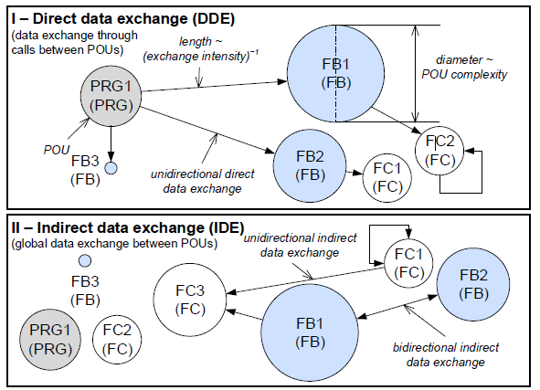
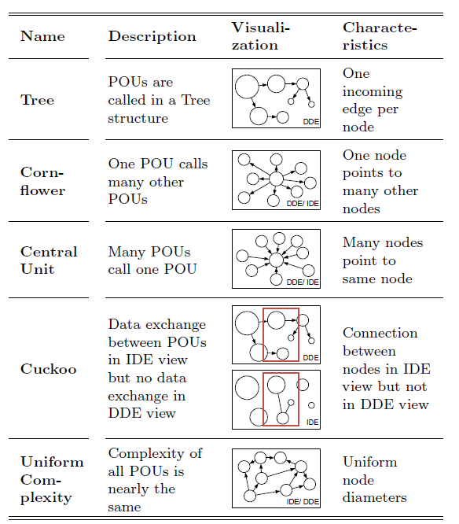
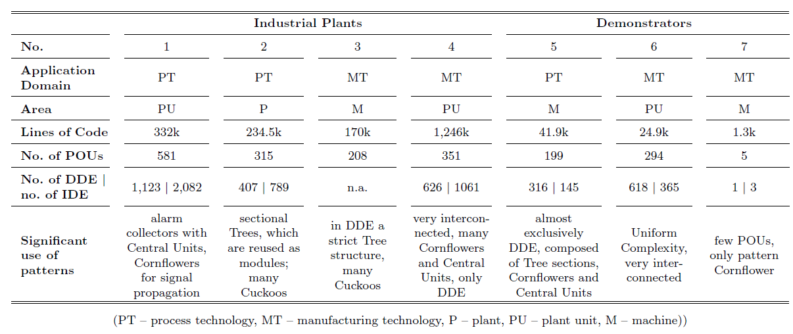

# Identification of Design Patterns for IEC 61131-3 in Machine and Plant Manufacturing

J. Fuchs, S. Feldmann, C. Legat, B. Vogel-Heuser, Identification of Design Patterns for IEC 61131-3 in Machine and Plant Manufacturing, IFAC Proceedings Volumes, Volume 47, Issue 3, 2014, Pages 6092-6097, ISSN 1474-6670,
ISBN 9783902823625,
https://doi.org/10.3182/20140824-6-ZA-1003.01595.
(https://www.sciencedirect.com/science/article/pii/S1474667016425668)

## Анотація

Програмне забезпечення для промислових установок реалізується мовами програмування стандарту IEC 61131-3. Оскільки таке програмне забезпечення має виконувати багато завдань, воно зазвичай є висококомплексним і характеризується монолітною структурою. У той час як у мовах програмування високого рівня поширені проблеми вирішуються за допомогою шаблонів проєктування, подібні універсальні багаторазові рішення поки що не доступні для IEC 61131-3. У цій статті запропоновано підхід до статичного аналізу програмного забезпечення установок і візуалізації складності та взаємозв’язків програмних модулів. Крім того, представлено базові шаблони проєктування програмного забезпечення, а також оцінено їхнє застосування у програмному коді реальних промислових об’єктів за допомогою аналізу коду та інтерв’ю з експертами. Таким чином зроблено перший крок до впровадження шаблонів проєктування для IEC 61131-3.

## 1. ВСТУП

Машини та установки в галузі промислової автоматизації здебільшого керуються програмованими логічними контролерами (PLC). Програмний код установки реалізується мовами програмування стандарту IEC 61131-3, орієнтованими на обробку сигналів, і має виконувати багато завдань, наприклад, забезпечення функціональності системи, виконання вимог безпеки чи реалізацію людино-машинного інтерфейсу (Lucas і Tilbury, 2004). Як наслідок, таке програмне забезпечення є висококомплексним і зазвичай має монолітну структуру. Через це структура ПЗ установки часто є складною для розуміння.

У об’єктно-орієнтованому програмуванні поширені проблеми вирішуються за допомогою шаблонів проєктування (Gamma та ін., 1994), що дозволяє підвищити повторне використання коду, його модульність, а отже, покращити якість і зрозумілість програмного забезпечення (Thramboulidis і Frey, 2011). Однак подібні універсальні рішення для типових проблем наразі відсутні в класичних мовах стандарту IEC 61131-3. Водночас інженери, які розробляють програмне забезпечення для установок, часто повторно використовують рішення для окремих завдань, наприклад, обробки помилок або режимів роботи, які потенційно можна було б узагальнити та застосовувати як типові рішення для різних типів задач. Якщо ці альтернативи програмних рішень були б ідентифіковані, названі й класифіковані, це стало б першим кроком до створення шаблонів проєктування в промисловій автоматизації, а отже, підвищило б повторне використання, модульність і зрозумілість програмного забезпечення для установок.

Таким чином, у цій статті запропоновано здійснювати статичний аналіз структури програмного забезпечення, враховуючи обмін даними між його модулями, а також складність коду. Це дозволяє виявляти шаблони проєктування, які, своєю чергою, стають основою для аналізу типових рішень у програмуванні ПЛК. Як наслідок, зростає модульність, а отже, і повторне використання частин програмного забезпечення, що веде до зниження інженерних витрат і скорочення часу виходу на ринок.

Подальша структура статті така: у наступному розділі надано огляд елементів мови IEC 61131-3. Далі обговорюються пов’язані роботи у сферах аналізу коду установок і шаблонів проєктування. У розділах 4 і 5, відповідно, представлено підхід до аналізу структури коду установок та введено шаблони проєктування для коду IEC 61131-3. У розділі 6 оцінено появу цих шаблонів у коді установок на основі інтерв’ю з фахівцями галузі. Нарешті, стаття завершується підсумком і перспективами подальших досліджень у розділі 7.

## 2. ЕЛЕМЕНТИ МОВИ IEC 61131-3

Попри зусилля щодо включення елементів об’єктно-орієнтованого програмування до стандарту IEC 61131-3 (IEC, 2013), його поточна версія ще не отримала повного поширення в промисловості. Тому в цій статті зосереджено увагу на версії стандарту IEC 61131-3 без об’єктно-орієнтованих розширень (IEC, 2009), яка переважно використовується у сучасних промислових застосуваннях (Thramboulidis і Frey, 2011).

Стандарт IEC 61131-3 включає як текстові мови програмування — зокрема, структурований текст (Structured Text, ST) і список інструкцій (Instruction List, IL), — так і графічні мови програмування — діаграму функціональних блоків (Function Block Diagram, FBD), релейно-контактну схему (Ladder Diagram, LD) та послідовну функціональну діаграму (Sequential Function Chart, SFC). Крім того, стандарт визначає три типи програмних організаційних одиниць (Program Organization Units, POU) для структурування та повторного використання коду ПЛК. Програма (Program, PRG) представляє набір логічних елементів, необхідних для керування машиною чи процесом за допомогою ПЛК. Одна з PRG є основною програмою, що забезпечує точку входу до коду установки.

Функціональні блоки (Function Blocks, FB), які обчислюють вихідні значення на основі вхідних і збережених внутрішніх значень, та функції (Functions, FC), які обчислюють результат лише на основі вхідних значень, можуть бути включені до складу PRG. Крім того, типи PRG та FB створюються під час проєктування, а під час виконання коду їхні екземпляри зберігають свої дані. Таким чином, обмін даними відбувається між екземплярами POU, тобто екземплярами PRG, FB і функціями FC.

…вихідні значення на основі вхідних та сталих внутрішніх значень, а функції (Function, FC), які обчислюють результат лише на основі вхідних значень, можуть бути включені до PRG. Крім того, типи PRG та FB створюються під час проєктування, а під час виконання зберігають свої області пам’яті як екземпляри PRG та FB. Таким чином, обмін даними реалізується між екземплярами POU, а саме екземплярами PRG і FB, а також функціями FC.

## 3. ПОВ'ЯЗАНІ ДОСЛІДЖЕННЯ

На відміну від підходів на кшталт верифікації моделей, наприклад (Soliman та ін., 2012), яка потребує моделі системи для аналізу та перевірки її поведінки, аналіз коду спрямований на дослідження вже реалізованого програмного забезпечення і здебільшого використовується для забезпечення якості ПЗ шляхом виявлення помилок у програмних модулях. На відміну від динамічного аналізу коду, який передбачає виконання програми з метою спостереження за її поведінкою, статичний аналіз коду стосується «автоматизованих методів оцінювання властивостей виконання програмного коду без фактичного його виконання» (Emanuelsson і Nilsson, 2008). При цьому аналізується структура та елементи програми або множина можливих її станів, що дозволяє апроксимувати її поведінку (Artho і Biere, 2005).

Хоча статичний аналіз коду успішно застосовується до низки мов програмування та середовищ, зокрема Lint для C (Johnson, 1978) та FindBugs для Java (Ayewah та ін., 2008), стандарт IEC 61131-3 поки що не має достатньої підтримки (Angerer та ін., 2013). Наразі існують лише інструменти, які підтримують окремі частини або мови цього стандарту, наприклад CoDeSys Static Analysis¹, logi.Lint² від компанії Logicals та PLC Checker³ від Itris.

Втім, у роботі (Prähofer та ін., 2012) підкреслюються переваги статичного аналізу коду для покращення якості ПЗ згідно IEC 61131-3, а також запропоновано підхід до підвищення відповідності кодів вимогам та рекомендаціям програмування, наприклад, шляхом виявлення неправильних іменувань, відхилень у складності програмних елементів або шкідливих фрагментів коду. Для цього використовуються правила аналізу як критерії пошуку. Крім того, до підходу було додано побудову графів викликів та аналіз посилань (points-to analysis), що дозволило розширити можливості аналізу, наприклад, для виявлення паралельного доступу до спільних змінних та взаємозв’язків між підсистемами (Angerer та ін., 2013).

Однак ці підходи зосереджуються переважно на виявленні помилок і дефектів у програмному забезпеченні; ідентифікація та візуалізація типових шаблонів побудови коду в рамках стандарту IEC 61131-3 не розглядається.

З метою виявлення та розробки рішень для типових проблем у програмній інженерії використовуються шаблони проєктування (**design patterns**) як добре задокументовані будівельні блоки (Sanz і Zalewski, 2003). Попри значну кількість робіт у галузі мов високого рівня, особливо об’єктно-орієнтованих, таких як робота Gamma та ін. (1994), шаблони проєктування ще майже не розглядалися в контексті програмування ПЛК.

Перші спроби оцінити різні методи реалізації алгоритмів логічного керування в рамках IEC 61131-3 були здійснені (Hajarnavis і Young, 2008), однак конкретні шаблони ще не були сформульовані. Утім, шаблони проєктування в інженерії систем керування могли б охопити низку питань, зокрема розробку контролерів, архітектурне проєктування та реалізаційні аспекти (Sanz і Zalewski, 2003).

Шаблони особливо активно вивчаються в рамках новітніх підходів до розробки ПЗ автоматизації на основі моделей, зокрема з використанням уніфікованої мови моделювання (UML) (Fantuzzi та ін., 2009). У цих роботах автори запропонували шаблони проєктування для вирішення типових завдань, таких як обробка сигналів тривоги та керування рухом, із використанням діаграм станів, а також надали рекомендації щодо реалізації цих шаблонів у мовах програмування IEC 61131-3 (Bonfè та ін., 2013).

Preschern та ін. (2012) запропонували шаблони для підвищення гнучкості й підтримуваності систем. Для застосувань на базі стандарту IEC 61499 (IEC, 2011) були запропоновані типові рішення та рекомендації щодо ієрархічної автоматизації (Zoitl і Prähofer, 2013), керування відмовами (Serna та ін., 2010) та портативних проєктів автоматизації (Dubinin і Vyatkin, 2012). Були навіть визначені й оцінені шаблони проєктування для програм IEC 61499, зокрема «розподілений застосунок» (Distributed Application), «проксі» (Proxy) і «модель-вид-контролер» (Model-View-Controller) (Christensen, 2000; Stromman та ін., 2005).

Однак, незважаючи на наявність середовищ виконання IEC 61499 для сучасних контролерів (Vyatkin, 2011), «IEC 61499 ще має пройти довгий шлях, щоб стати серйозно сприйнятим у промисловості» (Thramboulidis, 2013).

Оскільки жоден із згаданих вище підходів не забезпечує повноцінного та зрозумілого аналізу програм IEC 61131-3 для виявлення типових рішень, поєднання статичного аналізу коду з наочною візуалізацією результатів такого аналізу може стати першим кроком до ідентифікації стандартних рішень для типових завдань у програмах IEC 61131-3.

------

¹ http://store.codesys.com/codesys-static-analysis.html
 ² http://www.logicals.com/products/logi.LINT/
 ³ http://www.plcchecker.com/

## 4. АНАЛІЗ ПРОГРАМНОГО ЗАБЕЗПЕЧЕННЯ КЕРУВАННЯ ЗА IEC 61131-3

На сьогодні існує небагато можливостей для структурування програмного забезпечення установки, оскільки структура коду IEC 61131-3 в основному визначається обміном даними між програмними організаційними одиницями (POU). Програмне забезпечення складається з багатьох POU, тобто екземплярів програм (PRG), функціональних блоків (FB), а також функцій (FC), які з’єднані між собою через виклики, що й формує основну структуру коду.

### 4.1 Виклики та екземпляри POU в IEC 61131-3

Виклики формують основу структури коду установки шляхом з’єднання екземплярів POU; відповідно, лише ті екземпляри POU, які викликаються іншими, виконуються під час роботи програми. Екземпляр PRG може викликати екземпляри FB і FC, а екземпляр FB, у свою чергу, може викликати інші FB і FC. Функції (FC), навпаки, можуть викликати лише інші функції. Таким чином, типи POU, що викликають і викликаються — а саме типи PRG, FB або FC — є взаємозалежними, оскільки зміна одного з них може вплинути на інші. Така базова структура викликів часто використовується при проєктуванні коду установки і зазвичай є зрозумілою для програміста.

### 4.2 Роль обміну даними в IEC 61131-3

Під час виклику реалізується прямий обмін даними (Direct Data Exchange, DDE) шляхом передачі змінних між екземплярами POU. Крім того, між POU також реалізується непрямий обмін даними (Indirect Data Exchange, IDE), оскільки вони можуть записувати значення в глобальні змінні та зчитувати їх. У результаті утворюється додаткова прихована структура обміну даними, що ще більше ускладнює загальну структуру коду установки.

### 4.3 Візуалізація структури програмного забезпечення

Повна структура програмного забезпечення формується шляхом поєднання викликів між POU та обміну даними. Щоб забезпечити можливість аналізу та вивчення програмного коду установки, а також виявлення шаблонів проєктування, необхідно візуалізувати складність коду та взаємозв’язки між програмними одиницями у вигляді напрямленого підписаного графа (рис. 1).

Рис. 1. Огляд візуалізації коду

Вузол графа представляє тип POU. Діаметр вузла прямо пропорційний його складності, яка, наприклад, визначається за кількістю рядків коду (LoC) цього POU; таким чином, FB1 є складнішим за FB3. Однак для визначення складності POU можуть також використовуватись інші метрики, наприклад, запропоновані Lucas і Tilbury (2005). Напрямлені ребра між вузлами графа представляють зв’язки між двома типами POU через обмін даними. Щоб візуалізувати рівень взаємопов’язаності між двома POU, довжина ребер обернено пропорційна інтенсивності обміну даними, яка, наприклад, визначається за кількістю змінних, що передаються між POU. Для розрізнення обміну даними через виклики POU та через глобальні змінні, у підході до візуалізації передбачено два представлення: DDE і IDE.

Представлення DDE (рис. 1, частина I) відображає односторонній обмін даними через виклики між POU. Таким чином, ребро в цій візуалізації означає, що один POU викликає інший, при цьому стрілка спрямована від POU, що викликає, до POU, що викликається. Оскільки довжина ребер обернено пропорційна інтенсивності обміну, FB2 і FC1 мають сильніший зв’язок, ніж PRG1 і FB1. Крім того, самовиклики POU відображаються ребрами, які починаються і завершуються в одному й тому ж POU, як, наприклад, для FC2. У цьому представленні ті POU, що не мають зв’язків з іншими, не викликаються і, відповідно, не виконуються у коді ПЛК.

Представлення IDE (рис. 1, частина II) відображає односторонній і двосторонній обмін даними через глобальні змінні. Таким чином, ребро в цій візуалізації означає, що один POU записує дані в глобальну змінну, а інший POU зчитує ці дані, причому стрілка спрямована від записуючого POU до зчитуючого. POU, які як записують, так і зчитують дані з однієї глобальної змінної, з’єднані двосторонніми ребрами. POU, які не з’єднані з іншими у цьому представленні, не здійснюють обміну даними через глобальні змінні.

Запропоновану візуалізацію можна використовувати для аналізу коду установки. У наступному розділі будуть визначені та візуалізовані типові шаблони проєктування, що зустрічаються в коді установки.

## 5. ШАБЛОНИ ПРОЄКТУВАННЯ В IEC 61131-3

Хоча програмісти в галузі промислової автоматизації зазвичай не розробляють програмне забезпечення на основі шаблонів проєктування, вони будують його структуру відповідно до певних критеріїв — наприклад, внутрішніх програмних настанов підприємства або власного досвіду — навіть не усвідомлюючи, що застосовують певні типові рішення. Шаблони, що виникають у результаті таких підходів, можна виявити шляхом аналізу викликів та різних типів обміну даними, а саме DDE та IDE, як було показано в розділі 4. Використовуючи підхід візуалізації складності та взаємозв’язку POU, можна ідентифікувати п’ять базових шаблонів, які наведено в цьому розділі (табл. 1).

Table 1. Identied design patterns

Надалі ці шаблони пояснюються детально з використанням їхньої візуалізації, інтерпретації та характеристик, що робить їх придатними для вимірювання.

### 5.1 Дерево (Tree)

У шаблоні проєктування Tree POU має викликатися лише в тому разі, якщо його ще не викликав інший POU у межах цієї структури. Таким чином, будь-яка пара вузлів — викликаючий і викликаний POU — з’єднані рівно одним напрямленим ребром, і кожен вузол має лише одне вхідне ребро, тобто кожен тип POU викликається лише одним іншим типом. Якщо кожна гілка представляє групу взаємопов’язаних POU, Tree дозволяє уникнути надмірних залежностей між POU, тим самим інкапсулюючи функціональність. Якщо ж різні гілки дерева використовують один і той самий POU, структура відхиляється від ієрархії. З одного боку, повторне використання POU є бажаним, а з іншого — якщо такий спільний POU буде змінено, це може викликати небажану поведінку у залежних POU. Шаблон Tree можна виявити в структурі DDE, при цьому довжина ребер і діаметр вузлів не впливають на його розпізнавання.

### 5.2 Волошка (Cornflower)

У шаблоні Cornflower один POU викликає багато залежних POU; отже, напрямлені ребра спрямовані від центрального вузла до кільцево розміщених вузлів у графі, при цьому розміри вузлів і довжини ребер не впливають на структуру шаблону. Особливий випадок шаблону Cornflower виникає тоді, коли всі ребра від центрального POU до залежних мають однакову довжину. У такому разі можуть бути реалізовані стандартизовані інтерфейси між POU, наприклад, для обміну технологічними даними в межах IDE. Cornflower може бути застосований у DDE, IDE або в їхній комбінації.

### 5.3 Центральний блок (Central Unit)

На відміну від Cornflower, у шаблоні Central Unit кілька залежних POU викликають один центральний POU; отже, напрямлені ребра спрямовані від кільцево розміщених вузлів до центрального. Аналогічно до Cornflower, розміри вузлів і довжина ребер не мають значення для ідентифікації шаблону. Цей шаблон може використовуватись як центральна точка для агрегування даних перед подальшою обробкою, наприклад, для людино-машинного інтерфейсу. Також він може виникати, коли кілька POU викликають спільну функціональність, наприклад, функції перетворення. Проте застосування шаблону Central Unit залежить від типу обміну даними: у DDE шаблон сприяє повторному використанню одного POU, тоді як у IDE — забезпечує агрегацію даних.

### 5.4 Зозуля (Cuckoo)

Коли POU викликається, обмін даними здійснюється через DDE. Однак додатковий обмін може виконуватись через IDE, що потребує аналізу повної структури програмного забезпечення. У межах DDE структура коду може виглядати добре організованою, але при додатковому аналізі IDE виявляються інші зв’язки між POU, які порушують задуману структуру. Тому шаблони можна виявити лише за умови аналізу повного обміну даними — тобто одночасного аналізу IDE і DDE. Шаблон Cuckoo стосується взаємодії DDE та IDE і виникає, якщо один POU обмінюється даними з іншим POU через IDE, але не через DDE. Якщо виявлено Cuckoo, програміст має оцінити, чи доцільний цей обмін через глобальні змінні і чи можливо замінити його іншим рішенням.

### 5.5 Рівномірна складність (Uniform Complexity)

Попередні шаблони характеризуються зв’язками між POU. Однак можна виявити й інші шаблони, враховуючи складність самих POU. Шаблон Uniform Complexity передбачає, що всі POU в коді установки мають однакову складність. У графі це проявляється в однаковому діаметрі всіх вузлів. Рівномірна структура складності коду може бути бажаною для покращення зрозумілості та повторного використання ПЗ. Проте викликом є знаходження оптимального розміру POU — між надто дрібними (що ускладнює повторне використання та інтеграцію) та надто великими (що обмежує гнучкість) (Jazdi та ін., 2011).

## 6. ОЦІНЮВАННЯ

Щоб належним чином оцінити виявлені шаблони та підтвердити доцільність запропонованого підходу, було проаналізовано різні програмні коди установок автоматизації (табл. 2). Для оцінки складності різних кодів використовувалося значення кількості рядків коду (LoC). Графічні мови LD, FBD і SFC були конвертовані у текстові мови IL і ST, щоб забезпечити уніфіковану методику вимірювання LoC. Значення LoC коливаються від доволі низьких (наприклад, лабораторні демонстратори — коди №5 та №6) до високих (наприклад, промислові установки — коди №2 і №4). Проте в кожному з досліджених кодів можна ідентифікувати шаблони, описані в розділі 5. Оскільки одні й ті самі шаблони можуть як відповідати намірам програміста, так і створювати небажану структуру коду, цілі створення коду обговорювалися з його розробниками під час експертних інтерв’ю. Результати наведено в узагальненому вигляді через зобов’язання щодо конфіденційності.

Таблиця 2. Огляд оціненого коду ПЛК

### 6.1 Дерево (Tree)

Шаблон Tree, описаний у розділі 5, застосовується для структурування всього ПЗ шляхом ієрархічного розміщення POU, що веде до модульної структури. Кожна гілка дерева відповідає окремому модулю, як, наприклад, у коді №3. У деяких випадках Tree використовується рекурсивно у вигляді підгілок головної гілки, тобто підмодулів. Застосування Tree підвищує можливість виділення модулів, оскільки залежності між POU різних модулів мінімальні (наприклад, частини коду №2). Відхилення від суворої модульності виникає, коли кілька модулів використовують спільну функціональність. Це може спричинити неочікувану поведінку, наприклад, при зміні спільного POU залежні POU можуть поводитись непередбачувано. Аналіз структури дерева дає змогу виявити сильно зв’язані POU, отже, Tree і його варіації допомагають оцінити модульність і змінюваність структури коду.

### 6.2 Волошка (Cornflower)

Вхід у ПЗ установки часто реалізується як Cornflower. Крім того, Cornflower може бути частиною дерева, тобто входом у модуль, що спостерігалося майже в кожному проаналізованому коді. Інтерфейси POU, підключених до центрального POU, стандартизовані, що дозволяє легко замінювати їх. У IDE шаблон Cornflower використовувався для стандартизованої передачі сигналів (наприклад, у коді №1). Таким чином, кожен модуль отримує всі сигнали і впливає на всі виконавчі механізми, що спрощує додавання нових модулів.

### 6.3 Центральний блок (Central Unit)

Центральний блок зазвичай реалізує стандартизовану або часто використовувану функціональність, наприклад, обробку аварійних сигналів або обчислення (як у коді №4). Зміна Central Unit може впливати на поведінку багатьох інших POU. У межах DDE цей шаблон легко виявляється і часто вказує на тісні залежності між POU. Крім того, Central Unit використовується в IDE для зв’язку між модулями. Однак інтерв’ю з експертами показали, що це часто є небажаним, оскільки призводить до надмірно великих інтерфейсів. Можливим рішенням є концентрація обміну даними в одному POU. Типовим прикладом Central Unit у IDE є збирач аварій — кожен відповідний POU надсилає аварійне повідомлення напряму до збирача, який інформує інші POU (наприклад, у коді №1).

### 6.4 Зозуля (Cuckoo)

Лише в небагатьох випадках шаблон Cuckoo є бажаним, хоча він присутній майже в кожному з досліджених кодів. Щоб забезпечити чітку структуру, необхідно усунути небажані глобальні обміни даними без прямих викликів. Часто велика кількість Cuckoo перешкоджає належній модульності та повторному використанню коду. Це підтвердили програмісти в більшості інтерв’ю.

### 6.5 Рівномірна складність (Uniform Complexity)

У майже кожному коді можна виявити значно великі POU. Однією з причин може бути використання SFC, що після конвертації в текстові мови дає високе значення LoC, особливо в процесній автоматизації (коди №1, №2, №5). Експерти зазначили, що розбиття таких POU на менші не має сенсу, оскільки це лише підвищує складність. Водночас великі POU часто містять багато функціональності, і виявлення помилок у них утруднене, особливо для сторонніх розробників. Водночас у деяких випадках функціональність розподілена між великою кількістю малих POU, що ускладнює розуміння загальної логіки. Отже, необхідно знайти оптимальний розмір POU, що забезпечить зрозумілість структури та відповідність конкретним вимогам.

### 6.6 Загальна структура

Шаблони, розглянуті в цій статті, можуть бути об’єднані в повну структуру коду установки. У промислових кодах часто зустрічаються частини дерев, що формують модулі, Cornflower — для організації викликів, Central Unit — для обміну даними між модулями, а Cuckoo здебільшого є небажаним. Найважливіші висновки щодо застосування шаблонів для кожного ПЛК-коду наведено в таблиці 2.

У коді №1 шаблони використовуються для типових задач, як-от обмін даними між модулями. Повторне використання в коді №2 реалізовано за допомогою секціонованих дерев, які формують модулі. У деяких випадках повторне використання обмежене через надмірну кількість Cuckoo, що створює залежності. У коді №3 реалізовано загальну структуру Tree, але також багато Cuckoo, як і в коді №2. У коді №4 повторне використання не передбачалося, тому структура DDE є переважно взаємопов’язаною. Проте були виявлені шаблони Central Unit і Cornflower, які використовуються для обміну даними й ієрархії. У IDE майже немає зв’язків між POU, тому Cuckoo відсутні. У коді №5 структура подібна, але DDE добре організована за допомогою шаблонів Tree і Cornflower. У коді №6 складність рівномірно розподілена, але POU переважно пов’язані між собою. Код №7 належить до демонстраційної установки й є доволі невеликим; утім, у ньому також було виявлено шаблон Cornflower.

## 7. ВИСНОВКИ

У цій статті запропоновано перший крок до виявлення типових альтернатив рішень для поширених проблем у галузі розробки програмного забезпечення для автоматизації, а саме шаблонів програмного забезпечення для установок на основі IEC 61131-3. На основі детального аналізу коду установок було представлено підхід до аналізу та візуалізації коду на IEC 61131-3. Завдяки цьому підходу можна аналізувати залежності та інкапсуляцію програмних одиниць і, відповідно, виводити шаблони проєктування. На основі промислових застосувань було оцінено наявність таких шаблонів у коді установки та обговорено їхні переваги й відповідність намірам програмістів під час інтерв’ю з фахівцями.

Подальша робота передбачає розширення запропонованих шаблонів у напрямку створення більш детальної бібліотеки шаблонів з метою підвищення модульності, повторного використання, якості програмного забезпечення та його зрозумілості. У межах майбутніх досліджень буде розглянуто питання визначення відповідних метрик для оцінки якості ПЗ та можливості його повторного використання. Наявний інструмент аналізу програмного забезпечення буде доповнено цими метриками та новими шаблонами, що дозволить створити систему підтримки для виявлення багаторазово використовуваних артефактів.

Крім того, оскільки невеликі відмінності у складності програмного забезпечення іноді важко розпізнати у графічному представленні, у цей інструмент буде інтегровано додаткові механізми для підтримки інженера. Для оцінювання таких покращень планується проведення бенчмарків на прикладі різних промислових установок у поєднанні з експертними інтерв’ю. Такий підхід дозволить проілюструвати конкретні властивості проаналізованого коду.

Ось список використаних джерел (References) зі статті:

## References

Angerer, F., Prähofer, H., Ramler, R., and Grillenberger, F. (2013). *Points-To Analysis of IEC 61131-3 Programs: Implementation and Application.* In 18th IEEE Int. Conf. Emerg. Technol. Fact. Autom. Cagliari, Italy.

Artho, C. and Biere, A. (2005). *Combined Static and Dynamic Analysis.* Electron. Notes Theor. Comput. Sci., 131, 3–14.

Ayewah, N., Hovemeyer, D., Morgenthaler, J.D., Penix, J., and Pugh, W. (2008). *Using Static Analysis to Find Bugs.* IEEE Softw., 25(5), 22–29.

Bonfè, M., Fantuzzi, C., and Secchi, C. (2013). *Design patterns for model-based automation software design and implementation.* Control Eng. Pract., 21(11), 1608–1619.

Christensen, J.H. (2000). *Design patterns for systems engineering in IEC 61499.* In Fachtagung Verteilte Autom., 63–71. Magdeburg, Germany.

Dubinin, V.N. and Vyatkin, V. (2012). *Semantics-Robust Design Patterns for IEC 61499.* IEEE Trans. Ind. Informatics, 8(2), 279–290.

Emanuelsson, P. and Nilsson, U. (2008). *A Comparative Study of Industrial Static Analysis Tools.* Electron. Notes Theor. Comput. Sci., 217, 5–21.

Fantuzzi, C., Bonfè, M., and Secchi, C. (2009). *A Design Pattern for Model Based Software Development for Automatic Machinery.* In 13th IFAC Symp. Inf. Control Probl. Manuf., 1429–1434. Moscow, Russia.

Gamma, E., Helm, R., Johnson, R., and Vlissides, J. (1994). *Design Patterns: Elements of Reusable Object-Oriented Software.* Addison-Wesley, Boston, US-MA.

Hajarnavis, V. and Young, K. (2008). *An Assessment of PLC Software Structure Suitability for the Support of Flexible Manufacturing Processes.* IEEE Trans. Autom. Sci. Eng., 5(4), 641–650.

IEC (2009). *Programmable Logic Controllers Part 3: Programming Languages.* IEC Standard 61131-3.

IEC (2011). *Function Blocks.* IEC Standard 61499.

IEC (2013). *Programmable Logic Controllers Part 3: Programming Languages.* IEC Standard 61131-3.

Jazdi, N., Maga, C.R., and Göhner, P. (2011). *Reusable Models in Industrial Automation: Experiences in Defining Appropriate Levels of Granularity.* In 18th IFAC World Congr., 9145–9150. Milano, Italy.

Johnson, S. (1978). *Lint, a C Program Checker.* Technical report, Bell Laboratories.

Lucas, M.R. and Tilbury, D.M. (2004). *The Practice of Industrial Logic Design.* In Am. Control Conf., 1350–1355. Boston, US-MA.

Lucas, M. and Tilbury, D. (2005). *Methods of measuring the size and complexity of PLC programs in different logic control design methodologies.* Int. J. Adv. Manuf. Technol., 26(5-6), 436–447.

Prähofer, H., Angerer, F., Ramler, R., Lacheiner, H., and Grillenberger, F. (2012). *Opportunities and challenges of static code analysis of IEC 61131-3 programs.* In 17th IEEE Int. Conf. Emerg. Technol. Fact. Autom., 1–8. Kraków, Poland.

Preschern, C., Kajtazovic, N., and Kreiner, C. (2012). *Applying Patterns to Model-Driven Development of Automation Systems: An Industrial Case Study.* In 17th Eur. Conf. Pattern Lang. Programs, 1–6. Kloster Irsee, Germany.

Sanz, R. and Zalewski, J. (2003). *Pattern-based control systems engineering.* IEEE Control Syst. Mag., 23(3), 43–60.

Serna, F., Catalan, C., Blesa, A., and Rams, J.M. (2010). *Design patterns for Failure Management in IEC 61499 Function Blocks.* In 15th IEEE Int. Conf. Emerg. Technol. Fact. Autom., 1–7. Bilbao, Spain.

Soliman, D., Thramboulidis, K., and Frey, G. (2012). *Function Block Diagram to UPPAAL Timed Automata Transformation Based on Formal Models.* In 14th IFAC Symp. Inf. Control Probl. Manuf., 1653–1659. Bucharest, Romania.

Stromman, M., Sierla, S., and Koskinen, K. (2005). *Control Software Reuse Strategies with IEC 61499.* In 10th IEEE Int. Conf. Emerg. Technol. Fact. Autom., 749–756. Catania, Italy.

Thramboulidis, K. (2013). *IEC 61499 as an Enabler of Distributed and Intelligent Automation: A State-of-the-Art Review.* J. Eng., 1–9.

Thramboulidis, K. and Frey, G. (2011). *Towards a Model-Driven IEC 61131-Based Development Process in Industrial Automation.* J. Softw. Eng. Appl., 04(04), 217–226.

Vyatkin, V. (2011). *IEC 61499 as Enabler of Distributed and Intelligent Automation: State-of-the-Art Review.* IEEE Trans. Ind. Informatics, 7(4), 768–781.

Zoitl, A. and Prähofer, H. (2013). *Guidelines and Patterns for Building Hierarchical Automation Solutions in the IEC 61499 Modeling Language.* IEEE Trans. Ind. Informatics, 9(4), 2387–2396.

