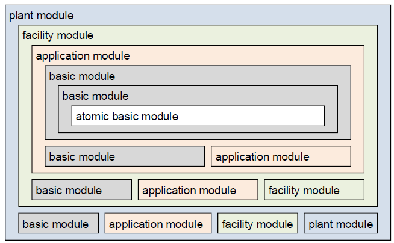
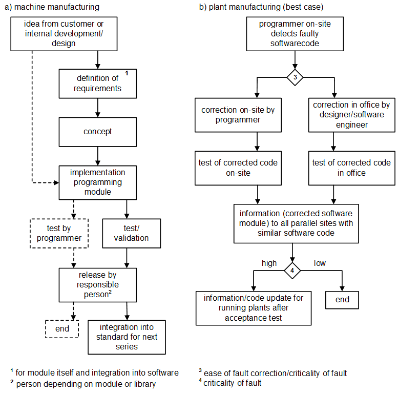
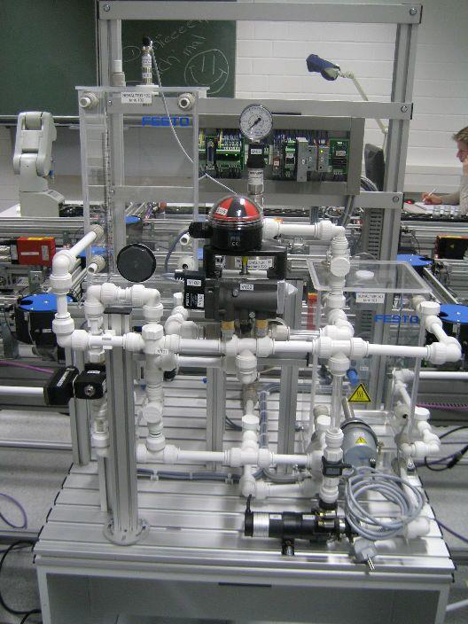

# Модульність та архітектура програмного забезпечення на основі ПЛК для автоматизованих виробничих систем: аналіз у промислових компаніях

Birgit Vogel-Heuser, Juliane Fischer, Stefan Feldmann, Sebastian Ulewicz, Susanne Rösch, Modularity and architecture of PLC-based software for automated production Systems: An analysis in industrial companies, Journal of Systems and Software, Volume 131, 2017, Pages 35-62,
ISSN 0164-1212,
https://doi.org/10.1016/j.jss.2017.05.051.
(https://www.sciencedirect.com/science/article/pii/S0164121217300985)

Оригінал статті доступний [за посиланням](https://www.researchgate.net/publication/366136152_Modularity_and_Architecture_of_PLC-based_Software_for_Automated_Production_Systems_An_analysis_in_industrial_companies). Переклад зроблено з використанням сервісу ChatGPT в рамках дослідження з метою вдосоконалення PACFramework. 

## Анотація

 Адаптивні та гнучкі виробничі системи потребують модульного та повторно використовуваного програмного забезпечення, особливо з урахуванням їхнього тривалого життєвого циклу — до 50 років. У цій статті представлено підхід SWMAT4aPS для оцінювання зрілості програмного забезпечення в автоматизованих виробничих системах (aPS). Підхід дозволяє виявити сильні та слабкі сторони рішень різних компаній щодо модульності програмного забезпечення при проєктуванні aPS.
 На першому етапі використовують анкету для самооцінювання, щоб оцінити зрілість програмного забезпечення у великої кількості компаній. На другому етапі проводиться аналіз коду ПЛК, архітектурних рівнів, робочих процесів та здатності автоматично конфігурувати код на основі інженерної інформації у чотирьох вибраних компаніях. У статті представлено результати анкетування 16 провідних німецьких компаній у галузі машинобудування та виробництва установок, а також чотири кейс-стаді, що підтверджують результати детального аналізу. Це доводить застосовність запропонованого підходу та надає огляд сучасного стану галузі.

## 1 Вступ

Сучасні тенденції у виробництві визначаються масовою індивідуалізацією продукції, малими розмірами партій, великою варіативністю типів виробів і змінним продуктово-орієнтованим портфелем протягом життєвого циклу автоматизованої виробничої системи (aPS) у сфері заводської автоматизації (Lüder та ін., 2005; Rzevski, 2003). Автоматизовані виробничі системи — це не лише лінії з виробництва автомобілів, але також, наприклад, установки для розливу напоїв. Зазначені тенденції вимагають більш досконалих aPS (Durdik та ін., 2012), які здатні підтримувати зміни у фізичній конфігурації, зокрема значні технічні оновлення, адже тривалість експлуатації aPS часто перевищує 10 років (McFarlane and Bussmann, 2000). Складність aPS, включаючи апаратне забезпечення автоматизації та програмне забезпечення (надалі — ПЗ), постійно зростає. Оскільки дедалі більша частина функціональності систем реалізується через ПЗ (Thramboulidis, 2010), виникає потреба у концепціях підтримки інженерів з автоматизації у керуванні цією складністю та супроводі розробленого ПЗ. При цьому програмне забезпечення та його розробка мають відповідати специфічним вимогам, зокрема щодо роботи в реальному часі та надійності (Vogel-Heuser та ін., 2014; 2015a). Інженерія ПЗ у сфері aPS суттєво відстає від класичної розробки програмного забезпечення — не лише в аспектах Model Driven Engineering (MDE), архітектурного проектування, керування варіантами та версіями, а й у виявленні клонів коду та "запахів" коду (Vogel-Heuser et al., 2015a).

Базові методи, як-от моделювання варіативності та трасування, що забезпечують еволюцію ПЗ, наразі обмежені лише сферою програмного забезпечення. Проте aPS висувають особливі вимоги до процесів розробки та супроводу. Наприклад, датчики й виконавчі механізми як мехатронні підсистеми aPS проєктуються для багаторічної експлуатації, і передбачити зміни в їхніх вимогах протягом строку служби цілком реально. Тому ще на етапі розробки слід передбачити засоби для подальшої адаптації функціональності цих мехатронних систем. Оскільки змінити ПЗ легше (особливо дистанційно), ніж механічні чи електричні компоненти, такі зміни можуть забезпечити оперативну адаптацію функцій. Однак ці зміни часто здійснюються під тиском часу, що призводить до "запахів" коду.

Отже, ПЗ для aPS має залишатися придатним до супроводу протягом десятиліть для тисяч машин і варіантів установок, які один постачальник доставляє на світовий ринок із потенційно різною електротехнікою та механікою. Підтримуваність ПЗ визначається як «простота, з якою програмна система може бути змінена для виправлення помилок, покращення продуктивності або інших характеристик, або адаптації до змінного середовища» (IEEE Std 610.12-1990, 1990). У сфері aPS обслуговування ПЗ охоплює два аспекти: (1) оптимізацію та розвиток ПЗ під час запуску та експлуатації конкретної машини або установки; (2) обслуговування компонентів ПЗ, що повторно використовуються в різних машинах або установках, наприклад у рамках серій, які постачає один виробник (Vogel-Heuser et al., 2015b). У цій статті ми зосереджуємося на аспектах підтримуваності ПЗ як частині інженерії ПЗ, усвідомлюючи, що це лише один із фахових поглядів.

Порівняно з класичною інженерією ПЗ, програмне забезпечення для aPS суттєво залежить від апаратного забезпечення, тобто змін у механіці та електроніці. Через високу складність програмного забезпечення для автоматизації та самої установки зазвичай складно передбачити, як зміни в одній частині системи вплинуть на інші частини або весь процес (Jaeger et al., 2011). Наразі ПЗ для aPS переважно програмується на функціональній мові стандарту IEC 61131-3 для програмованих логічних контролерів (ПЛК), без застосування нещодавно стандартизованих, але ще не загальнодоступних об’єктно-орієнтованих розширень. Згідно з дослідженням ARC Advisory Group, використання ПЛК, сумісних з IEC 61131-3, є і залишатиметься стандартною промисловою практикою протягом наступних 5–10 років, а з огляду на життєвий цикл установок — і в довшій перспективі (ARC Advisory Group, 2011).

У машинобудуванні та виробництві установок замовники часто самостійно обслуговують обладнання, вносячи зміни до датчиків і виконавчих механізмів, а також оптимізуючи процеси шляхом змін у ПЗ. Керівництво підприємств прагне, щоб їхній персонал мав змогу самостійно обслуговувати більшість функцій ПЗ, зважаючи на критичність простоїв або менш ефективної роботи. Одночасно слід гарантувати безпеку даних, що може бути під загрозою при дистанційному доступі постачальника.

Установки та спеціалізовані машини проєктуються для конкретного замовника і можуть бути надзвичайно великими. Тому в галузі виробництва установок перший запуск обладнання часто відбувається вже після його монтажу на майданчику. Це призводить до необхідності налаштування ПЗ, апаратного забезпечення автоматизації та електроніки безпосередньо на об’єкті. Крім того, через специфічний дизайн для кожного замовника, інженерія ПЗ у цій галузі десятиліттями була здебільшого проєктно-орієнтованою. Одним із викликів є реструктуризація застарілого коду з різних проєктів, що мають схожі або навіть однакові функції. До того ж, різні платформи ПЛК вимагають різних варіантів ПЗ для однієї і тієї ж функціональності через відмінності в діалектах IEC 61131-3 (Vogel-Heuser et al., 2015a). Замовники часто вимагають використання певного типу ПЛК, наприклад, Siemens у Європі чи Rockwell у США.

Щоб забезпечити безпечність машин і можливість обслуговування у разі збою, у програмному забезпеченні керування повинні бути реалізовані різні режими роботи згідно зі стандартом DIN EN 60204-1 (2009): автоматичний, ручний, налагоджувальний, поштовховий режим та аварійне зупинення. Стандарт GEMMA (Guide d’Étude des Modes de Marches et d’Arrêts) деталізує ці режими в контексті нормальної експлуатації, збоїв і надзвичайних ситуацій (Alvarez et al., 2013).

Модульність, повторне використання, а також керування варіантами й версіями в ПЗ для aPS були визнані міжнародними експертами ключовими викликами інженерії до 2020 року (Vogel-Heuser, 2009). Промислові компанії досі шукають оптимальні рішення для обробки варіантів під конкретного замовника. Для інтелектуальних, самоврядних aPS, сумісних із концепцією Індустрії 4.0, які здатні гнучко адаптуватися до змін, необхідні міждисциплінарна модульність, трасування змін і керування консистентними варіантами та версіями ПЗ (Vogel-Heuser and Hess, 2016). У Німеччині більшість компаній, що постачають aPS, змушені замовниками забезпечувати сумісність із Індустрією 4.0. Створення системи оцінювання, що дозволяє виявити сильні й слабкі сторони модульності ПЗ, допоможе інженерним відділам і менеджерам визначити конкурентні переваги й проблемні місця.

Метою цього дослідження є надання огляду стану програмної інженерії для aPS з акцентом на модульність і архітектуру та виявлення слабких місць як основи для подальших досліджень. Основним внеском цієї статті є представлення SWMAT4aPS (Software Maturity for aPS) як процесу оцінювання модульності прикладного ПЗ aPS, робочого процесу його розробки та якості. SWMAT4aPS складається з двох елементів: анкети для самооцінювання (верхня частина рис. 2, Q) і детального експертного аналізу для вибраних компаній (нижня частина рис. 2, E). Анкета охоплює 45 критеріїв, згрупованих у три категорії зрілості, що стосуються як інженерної, так і експлуатаційної фаз aPS. Вона дозволяє компаніям ідентифікувати відхилення між їхнім власним результатом, найкращим показником і середнім значенням усіх учасників.

Для цього ми формулюємо чотири дослідницькі питання (RQ), пов’язані з 13 гіпотезами (H) (див. таблицю I):

- **RQ1**: Чи забезпечує анкета достовірні результати для виявлення слабких місць у досягненні модульності ПЗ для aPS?
- **RQ2**: Чи дають три окремі рівні зрілості більше інформації порівняно з одним загальним рівнем?
- **RQ3**: Які є найсуттєвіші слабкі місця в зрілості ПЗ для aPS, у якій фазі вони виникають і якими є їхні причини або передумови?
- **RQ4**: Чи дає детальний експертний аналіз додаткову інформацію щодо слабких місць у зрілості ПЗ?

З одного боку, ми забезпечуємо достовірність підходу, порівнюючи результати анкетування трьох компаній із результатами їхніх індивідуальних кейс-стаді (див. рис. 2), що підтверджує валідність анкети. З іншого боку, ми прагнемо отримати додаткові глибинні інсайти під час експертного аналізу (RQ4).

Реалізація підходу поділяється на три фази: підготовка, експериментування та звітування (див. рис. 2). На етапі підготовки було розроблено сам підхід. На основі експертних інтерв’ю були сформульовані критерії модульності та бачення. Вони були узгоджені з результатами експертного семінару і стали основою для анкети, яка дозволяє виявити сильні й слабкі сторони компаній. Також були визначені показники для аналізу коду як основа для експертного аналізу.

Ядро SWMAT4aPS складається з чотирьох кроків: перші два пов’язані з анкетою, два наступні — з експертним аналізом.

1. Проведення опитування на основі анкети. Після попередньої обробки та перевірки узгодженості даних, вони нормалізуються та розраховуються середні значення для порівняння.
2. Результати анкети оцінюються за допомогою різних діаграм, також описуються робочі процеси.
3. Третій крок — експертний аналіз кейсів. Після першого семінару виконується аналіз коду.
4. Потім відбувається другий семінар, на якому обговорюються результати, формулюється оцінка модульності. У підсумку програмні архітектури візуалізуються, а результати аналізу коду подаються у вигляді графів викликів.

Залучивши до SWMAT4aPS 16 провідних німецьких компаній, ми забезпечили репрезентативність запропонованої процедури для вимірювання зрілості прикладного ПЗ, його якості та відповідного робочого процесу. Стаття починається з огляду сучасного стану щодо проєктування та вимірювання якості ПЗ для aPS з урахуванням їхніх особливостей, на основі яких сформульовано головні гіпотези дослідження. У розділі 3 представлено метод дослідження та дослідницькі питання. У розділі 4 подано огляд рівнів зрілості 16 промислових компаній (RQ1–RQ3). У розділі 5 представлено результати експертного аналізу чотирьох кейсів (RQ1 і RQ4). Розділ 6 порівнює рівні зрілості, отримані з анкети та з експертного аналізу. У розділі 7 розглянуто валідність, сильні та слабкі сторони SWMAT4aPS. Статтю завершують висновки та перспективи подальших досліджень (розділ 8).

## 2 Стан сучасних досліджень – проєктування та оцінювання якості програмного забезпечення для aPS

Після короткого вступу щодо специфічних характеристик платформ і мов програмування в домені aPS розглядається сучасний стан справ у сфері інженерії, орієнтованої на моделі (Model Driven Engineering), а також архітектури програмного забезпечення для aPS. На цій основі аналізуються наявні метрики якості програмного забезпечення, які вже застосовуються до aPS. Далі розглядається тема конфігурування коду в домені aPS. Нарешті, описуються специфічні нефункціональні можливості, що забезпечують безпечну експлуатацію aPS. На основі цього знання формулюються різні гіпотези.

### 2.1 Характеристики aPS і похідні гіпотези

Автоматизовані виробничі системи (aPS) особливо поширені серед постачальників машин і установок, а саме: виробників серійних машин, спеціалізованих машин і установок.

Компанії, що постачають платформи, забезпечують апаратне і програмне забезпечення для виробників машин і установок, а в деяких випадках — також спеціалізовані функції для найкритичніших частин застосунку, наприклад, керування синхронізованими осями. Складність, варіативність, зумовлена індивідуальними вимогами замовників, а також обсяг змін, що вносяться безпосередньо на об'єкті, зростають у напрямку від постачальників платформ до виробників машин і далі — до виробників установок (Vogel-Heuser та ін., 2015a). Отже, ми очікуємо, що постачальники платформ матимуть вищі показники зрілості, ніж виробники машин, які, у свою чергу, перевищать за цим показником виробників установок (гіпотеза H1.2).

Крім того, ми очікуємо, що висока складність програмного забезпечення призводить до нижчих рівнів зрілості в аспектах модульності та запуску/експлуатації/обслуговування (гіпотеза H3.6).

Життєвий цикл aPS умовно поділяється на дві основні фази, які мають значення як для постачальників платформ, так і для виробників машин і установок. Це:

- **інженерна фаза**, яка включає тестування, та
- **експлуатаційна фаза**, що охоплює запуск і обслуговування.

В межах aPS експлуатаційна фаза висуває особливо складні вимоги до інженерів, оскільки може тривати до 50 років (Vogel-Heuser та ін., 2015c). Водночас фазу запуску потрібно скорочувати, щоб зменшити час виходу нового продукту на ринок і його стартові витрати. Для оцінювання ефективності компаній у цих двох фазах запроваджено три категорії зрілості:

- **MMOD** — зрілість модульності,
- **MTEST** — зрілість тестування та забезпечення якості,
- **MOP** — зрілість у запуску, експлуатації та обслуговуванні.

Оскільки компанії з різними бізнес-моделями стикаються з різними викликами, вони розробляють різні процеси та рішення. Тому можна очікувати, що вони також демонструють відмінності в рівнях зрілості за цими трьома категоріями (гіпотеза H2). Однак, з огляду на те, що всі компанії стикаються з подібними викликами щодо **MMOD**, **MTEST** і **MOP**, зумовленими природою aPS, ми очікуємо виявити загальнонизькі рівні зрілості в усіх фазах (гіпотеза H3.1).

Оскільки належно організований інженерний процес полегшує та скорочує запуск, експлуатацію й обслуговування, ми передбачаємо причинно-наслідковий зв’язок між **MMOD**, **MTEST** і **MOP** (гіпотеза H3.2).

Через специфіку установок зміни часто потрібно здійснювати безпосередньо на об'єкті (Vogel-Heuser та ін., 2015a, b). Ми очікуємо, що компанії з різними видами бізнесу застосовуватимуть різні стратегії обслуговування ПЗ, а отже, потребуватимуть різних процедур випуску бібліотек ПЗ (гіпотеза H3.3).

### 2.2 Платформи та мови програмування в домені aPS

Програмовані логічні контролери (ПЛК) характеризуються циклічною обробкою даних, яка поділяється на чотири етапи. На початку циклу ПЛК зчитує вхідні значення технічного процесу, які надходять від датчиків, і зберігає їх у так званому образі процесу (process image). Потім програма ПЛК виконується з використанням збережених значень. Далі обчислені вихідні значення, які керують виконавчими механізмами, що впливають на технічний процес, записуються на виходи. Нарешті, ПЛК очікує завершення циклічного часу. У найгіршому випадку, якщо помилка виникає одразу після зчитування вхідних значень, час реакції ПЛК дорівнює подвійному циклічному часу, оскільки зміни на вході будуть прочитані лише під час наступного циклу.

Стандарт програмування IEC 61131-3 для ПЛК включає дві текстові мови — *Structured Text (ST)* і *Instruction List (IL)* — та три графічні мови — *Ladder Diagram (LD)*, *Function Block Diagram (FBD)* і *Sequential Function Chart (SFC)*. Крім того, стандарт визначає три типи програмних організаційних одиниць (POU) для структурування коду ПЛК і забезпечення його повторного використання: програми (*PRG*), функціональні блоки (*FB*) та функції (*FC*). Основна відмінність між цими типами полягає в тому, що на відміну від FC, PRG та FB мають внутрішню пам’ять, а FB можуть створюватися як екземпляри.

Завдання (*Tasks*) використовуються для визначення точок входу в код установки за допомогою PRG або екземплярів FB, які викликаються відповідно до визначеного циклічного часу або пріоритету завдання. Точки входу (наприклад, PRG) далі викликають інші POU, які виконують код і можуть викликати інші POU. Цикли ПЛК мають відповідати вимогам реального часу, тобто заданий цикл завдань ніколи не повинен перевищуватись.

Підтримка інструментами для об’єктно-орієнтованих (ОО) розширень стандарту IEC 61131-3 тепер доступна в окремих середовищах виконання (Werner, 2009). Три компанії, що беруть участь у цьому дослідженні, вже використовують ці розширення та оцінили їхню доцільність і придатність до застосування.

Архітектура програмного забезпечення, яка включає компоненти ПЗ та зв’язки між ними, суттєво впливає на критерії якості, зокрема змінність, підтримуваність і продуктивність. Відповідна програмна архітектура є критично важливою для забезпечення високої якості програмного забезпечення та можливості його повторного використання. Тому далі наводиться огляд обраних підходів до досягнення зрілого ПЗ у aPS.

### 2.3 Інженерія, орієнтована на моделі (MDE), та архітектури програмного забезпечення в aPS і похідні гіпотези

Katzke та ін. (2004) визначили три рівні гранулярності в програмному забезпеченні для aPS: базові модулі, прикладні модулі та модулі установки (*facility modules*). Зазвичай модулі установки проєктуються згори вниз, допоки пов’язана система не може бути описана прикладними модулями. Прикладні модулі складаються з базових модулів, але також можуть містити інші прикладні модулі. Подібним чином, базові модулі можуть включати інші базові модулі.

Хоча базові модулі, як-от модулі для керування двигуном або окремим датчиком, є гнучкими і мають високий потенціал повторного використання, вони створюють значне організаційне навантаження через їхню велику кількість. Модулі установки, навпаки, менш гнучкі, тісно пов’язані з контекстом застосування і тому складніші для повторного використання в іншому середовищі. Проте вони забезпечують більшу прозорість, що дає змогу краще сприймати систему як єдине ціле. Maga та ін. (2011) зазначили, що модулі ПЗ мають управлятися відповідно до свого рівня гранулярності.

Vogel-Heuser та ін. (2015) виокремили п’ять архітектурних рівнів (див. рис. 1), проаналізувавши архітектури ПЗ семи компаній з галузі машинобудування та виробництва установок. Було встановлено, що модуль установки (*plant module*) відповідає повноцінній виробничій установці, а отже, характерний переважно для виробництва установок, а не машин. Модуль установки зазвичай включає кілька модулів установки (*facility modules*), які представляють машини або частини установки, наприклад прес або складську систему. Кожен модуль установки, у свою чергу, складається з одного або кількох прикладних модулів, які є частинами машини й можуть бути повторно використані в інших машинах, наприклад вузол подачі матеріалу або блок наповнення. Прикладні модулі складаються з базових модулів, що представляють, наприклад, окремі приводи чи датчики. Атомарні базові модулі — це найдрібніший архітектурний рівень і є такими, що не можуть бути поділені на підмодулі. Архітектурні рівні можуть використовуватись рекурсивно, тобто кожен рівень може містити модулі нижчого рівня.

Fig. 1. Architectural layers (Vogel-Heuser et al., 2015b)

Vyatkin запропонував архітектуру програмного забезпечення для розподілених систем автоматизації на основі стандарту IEC 61499 (Vyatkin, 2011; IEC 61499-1, 2005). Побудоване таким чином ПЗ має складну структуру і складається з функціональних блоків (FB), керованих подіями, які описують процеси. Попри підтверджені переваги стандарту у перших промислових застосуваннях — як-от зменшення витрат часу й зусиль на розробку ПЗ, висока модульність коду та значний потенціал повторного використання — він досі не набув широкого поширення в промисловості і, як зазначає Thramboulidis (2013), «[...] ще має довгий шлях до серйозного впровадження».

Сучасні дослідження у сфері інженерії, орієнтованої на моделі (Model Driven Engineering, MDE), зосереджені переважно на розробці нових методів підтримки процесу створення ПЗ з використанням мов моделювання, таких як UML чи SysML. На жаль, існує значний розрив між наявним застарілим польовим кодом (тобто кодом ПЛК) і баченням запровадження підходу MDE на основі SysML або UML у промислових компаніях. Щоб подолати цей розрив, спочатку необхідно виконати рефакторинг коду і створити відповідні компоненти ПЗ.

Bonfè та ін. (2013) запропонували концепцію мехатронних об’єктів для підвищення модульності програмного забезпечення, яке може бути представлене у програмах керування через FB. При цьому структура aPS моделюється за допомогою клас-діаграм UML, а поведінка — за допомогою діаграм станів UML.

Щодо варіативності модульних aPS, «фундаментальні методи, як-от моделювання варіативності та трасування, які забезпечують еволюцію ПЗ, досі обмежені лише сферою програмного забезпечення. Для автоматизованих виробничих систем ці методи мають бути адаптовані до інших дисциплін і пов’язані з усталеними доменними методами» (Vogel-Heuser et al., 2015a). Ті ж автори підкреслюють брак інструментальної підтримки для aPS у порівнянні зі звичайною інженерією ПЗ. Відтак ми передбачаємо слабкі місця у підтримці інструментів для таких аспектів, як безперервна інтеграція, генерація коду та керування версіями (гіпотеза H3.4).

«На жаль, для платформ розробки aPS та мов IEC ще не існує ні засобів виявлення клонів, ні систем керування кодом (крім простого версіювання) [...]. Проблема в aPS полягає в тому, що “клони” зустрічаються в різних проєктах і навіть на різних платформах (тобто у різних постачальників ПЛК), що вимагає нових механізмів виявлення клонів. Крім того, існують не лише програмні клони, а й механічні та електронні клони, закладені в різних інженерних інструментах» (Vogel-Heuser et al., 2015a). Для подолання варіативності важливими є продуктові лінії та моделі ознак, але міждисциплінарні підходи поки що відсутні.

Dhungana та ін. (2014) і Rabiser та ін. (2014) зосереджуються на інстанціюванні моделей ознак, приділяючи особливу увагу ієрархії та кратності архітектур продуктових ліній. Їхній підхід, орієнтований на прийняття рішень, дозволяє моделювати ієрархію та кратність компонентів за допомогою вбудованої предметно-орієнтованої мови. Завдяки відповідній інструментальній підтримці їхній підхід був застосований до промислових кейсів.

Lettner та ін. (2015) застосували моделювання ознак до платформи для aPS, зокрема для керування роботами та машинами лиття під тиском. Вони виділяють три вимоги: моделі ознак для різних цілей і рівнів, а також моделювання залежностей між різними ознаками. Останнє є важливим і для aPS. Ці ж автори ставлять дослідницьке питання: «Наскільки корисними є багаторівневі й багатофункціональні моделі ознак для великомасштабних промислових систем?» І доходять висновку, що «виявлення й розуміння залежностей між ознаками з різних моделей виявилося надзвичайно складним, про що свідчить незначна кількість виявлених залежностей». Автори також зазначають важливість розгляду ознак на рівні коду та підтверджують, що моделі ознак допомагають обмежити варіативність.

У промисловості досі широко використовуються інтегровані платформи, що базуються на підході клонування для створення нових продуктів. Antkiewicz та ін. (2014) розглядають виклик переходу від таких платформ до централізованої платформи за допомогою стратегії віртуальної платформи. Вони виділяють шість рівнів управління — від L0 (клонування без структур) до L6 (повноцінна інженерія продуктових ліній — PLE). Залежно від частоти повторного використання і бажаної узгодженості, можливо обрати відповідний рівень, який дозволяє поступово й безперешкодно впроваджувати PLE, уникаючи дорогих і ризикованих переходів. Такий підхід підвищує прийнятність PLE і полегшує технологічні зміни навіть для компаній, що раніше користувалися неструктурованими методами керування варіантами.

У цьому дослідженні ми також використовуємо ці рівні управління, запропоновані Antkiewicz et al. (2014), для класифікації різних типів повторного використання коду керування та архітектур, з якими ми стикалися у проаналізованих кейсах (див. розділ 5).

### 2.4 Конфігурування коду в домені aPS і похідні гіпотези

Mendonca та Cowan (2010) описують спосіб спільного конфігурування складних продуктів з метою зменшення непорозумінь між представниками різних дисциплін. Це досягається шляхом поділу моделі ознак (feature model) продуктової лінійки програмного забезпечення на конфігураційні простори, які легше управляються. Крім того, автори оцінюють ефективність різних алгоритмів логічного виведення, які підтримують автоматизоване конфігурування продуктів. Ці алгоритми перевіряють узгодженість моделі ознак та заданих обмежень. Найефективнішим, за словами Mendonca та Cowan, є гібридна система логічного виведення для моделей ознак, заснована на доменно-орієнтованому обмежувальному рішенні FTCS (*feature tree constraint system*).

Модельно-орієнтований підхід представлено в роботі Elsner та ін. (2010), який поєднує визначення обмежень із їх перевіркою. Автори інтегрують різні типи конфігураційних файлів, перетворюючи їх на моделі. Залежно від типу конфігураційних файлів, отримані метамоделі можуть бути або специфічними для продуктової лінії, або більш загального типу. На цій основі розробники можуть забезпечити узгодженість конфігурації за допомогою мов опису обмежень, заснованих на моделях. З точки зору "фронтлоадингу", цей підхід зменшує витрати часу та зусиль на створення конфігурацій, а також знижує імовірність помилок у створених системах.

На основі аналізу наявних інструментів конфігурування, Rabiser та ін. (2012) розробили DOPLER CW — інструмент, орієнтований на потреби бізнес-користувачів, які зазвичай не мають глибоких технічних знань. Для цього було виділено вісім базових функціональних можливостей, якими мають володіти інструменти конфігурування: від можливості приховувати/відображати опції до перевірки правильності на льоту та додавання анотацій. Робота завершується оцінкою зручності використання та користі кожної функціональності, а також можливих компромісів між ними (Rabiser et al., 2012).

Lettner та ін. (2013) зосереджують увагу на варіативності програмного забезпечення для автоматизації, оскільки в цій галузі все частіше виникають "екосистеми програмного забезпечення", які охоплюють кілька рівнів організацій з різним досвідом. Проте багато компаній досі використовують індивідуально розроблені засоби конфігурування. Відсутність стандартизованого підходу до моделювання варіативності в промисловій практиці створює новий виклик для автоматизації процесів конфігурування.

Як рішення, у (Lettner et al., 2013) запропоновано модельно-орієнтований підхід до інженерії продуктових ліній, що базується на моделях варіативності, орієнтованих на прийняття рішень. Таким чином, вибір користувача конфігуратора призводить до створення дійсного програмного забезпечення та працездатного продукту. Проте в роботі не розглядаються питання супроводу та тестування моделей.

На основі різноманітних підходів, представлених у науковій літературі, ми очікуємо, що в промисловості також існують різні стратегії конфігурування коду, які можна віднести до різних рівнів управління (гіпотеза H4.2).

На основі попередніх досліджень (Vogel-Heuser et al., 2015b; Simon et al., 2016), проведених разом з промисловими компаніями, ми встановили, що повторне використання може мати різні форми — від конфігурування коду до його генерації з інформації, наданої інженерним інструментом, або ж до автоматичного конфігурування коду на основі шаблонів. Однак, згідно з нашим розумінням, існують чотири передумови для реалізації будь-якого з цих підходів:

1. наявність відповідної бібліотеки модулів,
2. належна процедура випуску компонентів бібліотеки,
3. інструмент керування версіями,
4. система відстеження змін у версіях (гіпотеза H3.5).

### 2.5 Бенчмаркінг і метрики якості програмного забезпечення в інженерії ПЗ та aPS і похідні гіпотези

Згідно з Trentesaux та ін. (2013), бенчмаркінг в операційних дослідженнях означає «порівняння вихідних результатів різних систем для заданих вхідних даних з метою покращення продуктивності системи». Бенчмарки активно використовуються в різних сферах, зокрема в операційних дослідженнях, керуванні та управлінні виробництвом. Trentesaux та ін. зазначають: «[...] доцільно визначати бенчмарк, запропонований іншими спільнотами, який може використовуватись обома сторонами, і заснований на фізичній, реальній системі, щоб стимулювати бенчмаркінгову діяльність, яка має підґрунтя в реальності». Метою цієї роботи є зробити перший внесок у створення бенчмарку для якості ПЗ в інженерії програмного забезпечення та в автоматизованих виробничих системах (aPS).

Yin (2013) і Runeson et al. (2012) описують принципи проєктування та методології кейс-стаді. Вони наголошують на конструктивній валідності, а також на внутрішній та зовнішній валідності й надійності досліджень. Зокрема, Runeson et al. (2014) фокусуються на кейс-стаді в сфері розробки програмного забезпечення.

Хоча було розроблено багато моделей програмної архітектури, у сфері aPS досі бракує загальноприйнятих детальніших правил архітектури ПЗ. Це, зокрема, стосується використання глобальних змінних та обробки помилок — від базових модулів до повного вимкнення установки. Модель зрілості CMM (Capability Maturity Model, Paulk et al., 1993) пропонує набір показників зрілості з точки зору бізнес-процесів, наприклад, для керування змінами в продуктах і розвитком варіантів і версій (див. рис. 5). Meyer (1988) запропонував правила структурування програмного забезпечення, зокрема щодо модульності. Він визначив, що критерії *декомпозованості*, *композиційності*, *зрозумілості* та *захищеності* тісно пов’язані з модульністю. Високомодульна система має модулі, які легко ізолюються (декомпозованість) і можуть бути повторно використані (композиційність), є зрозумілою завдяки низькій складності (мало модулів і інтерфейсів) та захищена від стороннього впливу (недоступна напряму). Вищий рівень управління слабше корелює з модульністю: хоча високі рівні вимагають і захищають модульну структуру, теоретично високу модульність можна досягти навіть за підходу «клонування і володіння». Отже, ми очікуємо, що ці критерії сприятимуть досягненню вищого рівня управління та зрілості архітектури ПЗ, а отже, й більш високого рівня **MMOD** (гіпотеза H4.4).

На основі цих принципів та аспектів робочого процесу ми обрали критерії, описані в розділі 3, а пов’язані з ними питання деталізовано в додатку A.

Для виявлення неідеальних рішень в інформатиці було запропоновано численні метрики якості коду. Наприклад, Li et al. (2014) пропонують оцінювати модульність на основі вихідного коду через середню кількість змінених компонентів на коміт. Marinescu et al. (2012) запропонували правила для виявлення помилок у коді, зокрема низький рівень зв’язаності, високу когезію, помірну складність і належну інкапсуляцію. Подальший аналіз дозволяє оцінити вплив кожної помилки на загальну якість дизайну системи. Подібні метрики застосовують Nugroho et al. (2011) для розрахунку впливу на підтримуваність відповідно до стандарту ISO/IEC 9126-1 (2001). Eisenberg (2012) пропонує метрик-орієнтований підхід у поєднанні з визначенням граничних значень для конкретних компаній чи проєктів. Він використовує як статичний, так і динамічний аналіз коду, зокрема виявлення дублікатів, відповідність стандартам, коментарі, міжпакетні залежності, складність методів/класів, охоплення автоматизованими та ручними тестами, враховуючи також результати тестування. Огляд технічного боргу та способів його вимірювання можна знайти в огляді Li et al. (2015).

Згідно з Vogel-Heuser et al. (2015a), «аналіз наявних варіантів коду ПЛК та механізмів керування варіативністю в провідних міжнародних компаніях у виробничій галузі, з урахуванням організаційних і кваліфікаційних аспектів, є корисним для глибшого розуміння вимог та обмежень, що заважають модульності у виробництві установок». Це підкреслює важливість показника **MMOD**.

У сфері aPS також були запропоновані деякі метрики, як-от підхід на основі правил від Prähofer et al. (2012), який аналізує правила іменування, складність або "запахи коду". Feldmann et al. (2016) представили фреймворк для аналізу ПЗ ПЛК, який дозволяє конфігурувати правила програмування та використовує графи викликів і важливість ієрархії викликів. Відтак ми формулюємо гіпотезу **H4.3**: за допомогою графів викликів можна отримати уявлення про структуру програмного забезпечення керування, тісно пов’язану з середовищем розробки. Також ми очікуємо, що вищий рівень управління веде до зрілішої структури графа викликів, а отже — до вищого **MMOD** (H4.4).

Крім того, більш загальна гіпотеза, яка охоплює обговорені теми, формулюється як **H4.1**: експертний аналіз забезпечує додаткову інформацію про доцільність обраної архітектури ПЗ, зрілість коду та механізми конфігурування. Додаткові рекомендації щодо реалізації IEC 61499 можна знайти у (Zhabelova & Vyatkin, 2015; Zoitl & Prähofer, 2013). Однак, як зазначають Zhabelova & Vyatkin (2015), інтерпретація результатів, пов’язаних з метриками якості, залишається відкритим дослідницьким питанням на найближчі роки.

Окрім клонів коду, введено ширше поняття — *запахи коду* (code smells), яке розширено поняттям *антипатернів* (anti-patterns) (Brown et al., 1998). Обидва терміни вказують на те, що внаслідок неконтрольованої еволюції проєкту архітектура та реалізація ПЗ можуть мати певні аномалії. Наприклад, архітектура, що "розпадається", відсутність абстракцій або немодульна реалізація є типовими ознаками деградації системи. Abbes et al. (2011) довели, що наявність двох антипатернів погіршує продуктивність розробників. Аналогічно, Sjøberg et al. (2013) у великомасштабному дослідженні дійшли висновку, що запахи коду є добрими індикаторами підтримуваності на рівні файлів. Хоча інші дослідження показують, що сприйняття запахів коду може відрізнятися серед розробників (Yamashita et al., 2012), загальновизнано, що запахи коду заважають еволюції ПЗ, оскільки ускладнюють його розширення й супровід.

### 2.6 Додаткові функції: режими роботи, функції безпеки, обробка відмов і HMI

Окрім реалізації основних функцій керування, які виконує автоматизована виробнича система (aPS), необхідно також проєктувати й реалізовувати такі аспекти, як різні режими роботи, обробка відмов та візуалізація. Наприклад, якщо оператор керує aPS у ручному режимі з панелі управління — у разі помилки чи обслуговування — виконувані функції можуть відрізнятись від тих, що виконуються в автоматичному режимі. Наприклад, якщо на конвеєрі застряг заготовок, його потрібно перемістити у зворотному напрямку, отже стрічка має працювати в реверсному режимі.

Особливо у випадках збоїв необхідно передбачити інтерфейси для обробки та передавання сигналів тривоги, щоб можна було перевести всі безпосередньо або опосередковано задіяні частини aPS у безпечний стан. Водночас, реалізація діагностики та самоконфігурації для досягнення гнучкості та надійності aPS у разі збою може суперечити концепції модульної структури ПЗ — сигнали тривоги не можуть залишатися в межах одного модуля (див. Vogel-Heuser et al., 2015b). Замість цього їх потрібно збирати та обробляти глобально, подібно до заходів безпеки, як-от аварійна зупинка, яка впливає на ту частину машини або установки, що доступна з точки зору конкретного оператора.

**Ручний режим** використовується для керування окремими частинами машини оператором, наприклад під час запуску, тестування або повторного запуску після збою.
 **Режим ініціалізації** дозволяє напівавтоматично калібрувати машину, виконуючи короткі автоматизовані послідовності, ініційовані оператором, які переводять апаратні компоненти в задані стани.

Різні режими роботи необхідно реалізовувати в таких галузях, як виробництво пакувального обладнання, з використанням **автоматів станів OMAC** (OMAC Packaging Workgroup, 2015), які можуть бути реалізовані через автомати.

## 3 Метод дослідження та дослідницькі питання

Метою дослідження, викладеного в цій статті, є надати огляд сучасного стану інженерії програмного забезпечення для автоматизованих виробничих систем (aPS) з фокусом на модульність і архітектуру, а також виявити слабкі місця як основу для подальших досліджень. Щоб досягти цієї мети, ми розглядаємо чотири дослідницькі питання, що ґрунтуються на 13 гіпотезах.

Для забезпечення послідовності доказів ми сформулювали гіпотези для всіх чотирьох дослідницьких питань (див. таблицю I) і зіставили їх із питаннями анкети та її звітом, а також з артефактами експертного аналізу та відповідним звітом (див. таблицю VII). Порівнюючи результати анкети з результатами детального експертного аналізу, ми підтверджуємо валідність результатів опитування (гіпотеза H1.1). Крім того, ми очікуємо отримати додаткову інформацію про архітектуру ПЗ, зрілість коду та механізми конфігурування завдяки експертному аналізу (гіпотеза H4.1).

Таблиця 1 — Дослідницькі питання та пов’язані гіпотези:

| **Дослідницьке питання**                                     | **Пов’язані гіпотези**                                       | **Джерело**    |
| ------------------------------------------------------------ | ------------------------------------------------------------ | -------------- |
| **RQ1:** Чи дає анкета достовірні результати для виявлення слабких місць у досягненні модульності програмного забезпечення в aPS? | **H1.1:** Анкета дає достовірні результати, що узгоджуються з детальним експертним аналізом чотирьох обраних компаній.   **H1.2:** Постачальники платформ мають вищі рівні зрілості, ніж постачальники машин, а ті — вищі, ніж виробники установок. | Q & E  Q       |
| **RQ2:** Чи дають три підкатегорії зрілості більше розуміння порівняно з одним загальним рівнем зрілості? | **H2:** Різні компанії демонструють вищі/нижчі рівні зрілості в трьох категоріях (MMOD, MTEST, MOP), оскільки фази життєвого циклу відрізняються у багатьох компаніях. | Q              |
| **RQ3:** Які є найзначніші слабкі місця в зрілості ПЗ в aPS, на яких етапах вони виникають, і які їх можливі причини / підстави / передумови? | **H3.1:** Загальний низький рівень зрілості (середнє значення для машинобудівних компаній) виникає на різних етапах.   **H3.2:** Високі значення *модульної зрілості* (MMOD) та *зрілості тестування та якості* (MTEST) призводять до високих значень *зрілості запуску, експлуатації та обслуговування* (MOP). Правильний інженерний процес полегшує ці фази.   **H3.3:** Через потребу в локальних змінах у виробництві установок, машинобудівні компанії мають різні процедури релізу для бібліотек ПЗ.   **H3.4:** Слабкі місця в інструментальних засобах (середнє значення для машинобудівних компаній) можна виявити, зокрема для CI, генерації коду, керування версіями.   **H3.5:** Наявність відповідних бібліотек, процедура релізу, система керування версіями та відстеження змін — передумови для повторного використання (конфігурування, генерація, шаблони).   **H3.6:** Висока складність ПЗ призводить до нижчих рівнів модульної зрілості (MMOD) та зрілості експлуатації (MOP). | Q              |
| **RQ4:** Чи дає експертний аналіз додаткову інформацію щодо слабких місць у зрілості програмного забезпечення? | **H4.1:** Експертний аналіз дає додаткову інформацію щодо доцільності архітектури ПЗ, зрілості коду (ієрархія викликів) та механізму конфігурування.   **H4.2:** У галузі існують різні підходи до конфігурування, які можна класифікувати за рівнями управління.   **H4.3:** За допомогою графів викликів можна отримати уявлення про структуру ПЗ, тісно пов’язану з середовищем розробки.   **H4.4:** Чим краще виконані критерії (декомпозованість, композиційність, зрозумілість, захищеність), тим зріліша архітектура ПЗ, вища якість графа викликів та більша модульна зрілість (MMOD). | E  E  E  Q & E |

Позначення:
 **Q** — Висновки, отримані з анкети
 **E** — Висновки, отримані з експертного аналізу

Ми представляємо SWMAT4aPS (*Software Maturity for aPS*) як процес бенчмаркування для оцінювання модульності прикладного ПЗ aPS, його робочого процесу розробки та якості. SWMAT4aPS складається з анкети для самооцінювання та детального експертного аналізу для вибраних компаній. Анкета дозволяє компаніям визначити відхилення між власними оцінками та найвищими показниками (див. рис. 2) за 45 критеріями, згрупованими в три категорії зрілості: **MMOD**, **MTEST** та **MOP**.

З одного боку, для побудови конструктивної валідності підходу результати анкетування трьох компаній порівнюються з результатами їх індивідуального кейс-аналізу (див. рис. 2), що підтверджує достовірність анкети. З іншого боку, ми прагнемо отримати глибші інсайти під час експертних інтерв’ю (дослідницьке питання RQ4).

У подальших дослідженнях ми пропонуємо спочатку виявляти найбільш значущі слабкі місця за допомогою анкети (див. рис. 2, етапи ① і ②), а потім зосередити експертну оцінку саме на них (див. рис. 2, етапи ③ і ④).

Fig. 2. The benchmark process for aPS software maturity SWMAT4aPS

Ключові інформанти перевірили чорнові звіти з кейс-стаді для забезпечення конструктивної валідності обох частин методології. Залучивши 16 провідних німецьких компаній, ми демонструємо зовнішню валідність підходу SWMAT4aPS для підприємств із виробництва машин і установок.

У цьому розділі подано опис анкети та методу виведення індексів зрілості.

### 3.1 Підготовка анкети та експертного аналізу

Анкету було розроблено на основі напівструктурованих інтерв’ю з кількома промисловими компаніями у сфері aPS (Katzke та ін., 2004), а також на підставі бачення експертів в галузі автоматизації aPS (Vogel-Heuser, 2009). Критерії модульності та відповідне бачення були сформульовані за результатами цих інтерв’ю. Пізніше експертний семінар за участю семи компаній (п’ять із машинобудування та дві з виробництва установок) підтвердив ці критерії якісно.

Кількість запитань обмежена, зважаючи на обмежений час, який керівники відділів ПЗ можуть витратити на додаткову роботу (не більше 15 хвилин, 45 запитань). Анкета поділена на чотири частини:

- загальні описові питання щодо типу компанії,
- питання для оцінки процесу проєктування та модульності з точки зору ПЗ,
- питання щодо тестування та якості як важливої теми для aPS,
- питання, пов’язані з фазами запуску, експлуатації та обслуговування.

У першій частині респонденти відповідають на 15 запитань, що описують розмір компанії, ринок і технічні характеристики. Зокрема, середню кількість процесорів (ПЛК) на машину, кількість програмістів, кількість POU та рядків коду на машину як індикатор складності. Також вказується найскладніший тип технічного застосування, наприклад синхронізація осей або позиціювання.

Для оцінки розробки повторно використовуваних модулів, 18 запитань стосуються міждисциплінарних робочих процесів (див. додаток A1, №15 і №16) і відповідних інструментальних ланцюгів (#21). Як наголошено у Vogel-Heuser et al. (2015a), головна проблема інженерії ПЗ в aPS як міждисциплінарної діяльності — відсутність належного керування варіантами і версіями, а також відсутність MDE. З огляду на цю проблему, ми також приділили увагу управлінню варіантами та версіями.

Оскільки тестування в aPS розглядається в багатьох інших статтях, до анкети включено лише 5 відповідних запитань. Завершальні 7 запитань стосуються процедур запуску, експлуатації та обслуговування ПЗ. Таким чином, ми досліджуємо обсяг робіт із проєктування, які потрібно виконувати на об'єкті, та їх зв’язок із зрілістю процесу проєктування і тестування, а також здатністю до розвитку вже встановлених установок через оновлення чинної правильної версії ПЗ.

На підставі попереднього досвіду, отриманого під час міждисциплінарного семінару з 7 компаніями (див. перший рівень — підготовка), ми вирішили уникати надто технічних питань про інтерфейси програмного забезпечення та структуру модулів у самій анкеті, припускаючи, що на них можуть відповідати неоднозначно або неправильно (див. розділ 4).

Також у підготовчій фазі була розроблена основа для експертного аналізу. Для цього було проведено попередні кейс-стаді з модульності в електротехнічному та програмному проєктуванні (Feldmann et al., 2012), а також попередній аналіз коду (Feldmann et al., 2016) для накопичення досвіду і підготовки необхідних інструментів та процедур. Додатково були вивчені:

- рівні архітектури ПЗ,
- повторне використання модулів (включаючи робочий процес релізу елементів бібліотеки),
- управління варіантами і версіями,
- структура коду різних компаній.

### 3.2 Експеримент і звітність за результатами анкетування

Індивідуально заповнені анкети були зведені в одну таблицю, де компанії класифіковані як постачальники компонентів, бібліотек і платформ, виробники машин і виробники установок (таблиця III).

**Учасники анкетування:**
 Ми зверталися в усіх випадках до керівника відділу розробки ПЗ, який іноді також очолював відділ автоматизації. Ці особи вирішували, кого залучити до заповнення анкети. Оскільки до дослідження були залучені великі компанії з кількома відділами розробки для різних типів машин/установок у різних локаціях, що функціонують як окремі центри витрат, ми розглядали такі підрозділи як окремі компанії (порівняйте компанії C1 і C2 у розділі 6.3, які належать до одного підприємства і представлені як компанії 5 та 6 у таблиці III). Усі опитані мали значний досвід проєктування ПЗ для aPS.

**Попередня обробка та перевірка на узгодженість:**
 У попередньому етапі відповіді вручну перевірялись на узгодженість на основі наших знань про особливості кожної компанії. За наявності, текстові відповіді у відкритих полях (наприклад, #18) порівнювались з відповідями на загальні питання з варіантами вибору (наприклад, #17).

**Оцінювання:**
 На наступному етапі відповіді були класифіковані за рівнями (від 3 до 6), шляхом нарахування балів (найвищий рівень — 5 балів). Для рівня зрілості **MOP** чотири відповідні питання (##36–39) та максимальні бали подані в таблиці II. Важливість питання для зрілості може коригуватись через зміну ваги (максимального балу); у цьому випадку всі питання вважаються однаково важливими — максимум 5 балів.

Значення **MOP** обчислюється як відношення суми балів, набраних конкретною компанією, до максимально можливого балу. Бальна система була розроблена спільно з експертами з академічного й промислового середовищ. Наприклад, у виробництві установок клієнти змушують постачальників надавати все програмне забезпечення (див. #37), але більш зрілі компанії вирішують приховувати частини, що містять технології чи ноу-хау, не потрібні для подовження експлуатації у разі збоїв (#37 — частини ПЗ). Якщо клієнт не отримує вихідного коду, ПЗ повинно бути дуже надійним і якісним, щоб його не довелось обслуговувати.

ТАБЛИЦЯ II. Деталізація балів для обчислення рівня зрілості щодо запуску/експлуатації/обслуговування (MOP)

| Питання                                                      | Варіанти відповіді                  | Бали |
| ------------------------------------------------------------ | ----------------------------------- | ---- |
| 36. Чи здійснюється запуск машини/установки на об’єкті самим розробником/програмістом? | Ніколи                              | 5    |
|                                                              | Рідко                               | 3,25 |
|                                                              | Іноді                               | 2,5  |
|                                                              | Дуже часто                          | 0    |
| 37. Як відбувається передача клієнту?                        | Клієнт не отримує вихідного коду    | 5    |
|                                                              | Клієнт отримує лише частину коду    | 2,5  |
|                                                              | Клієнт отримує весь вихідний код    | 0    |
| 38. Як встановлюються оновлення?                             | Віддалене обслуговування за запитом | 5    |
|                                                              | Віддалене обслуговування            | 4    |
|                                                              | На місці                            | 2    |
| 39. Чи знає сервісний відділ поточний стан ПЗ клієнта на об’єкті? | Дуже часто                          | 5    |
|                                                              | Часто                               | 3,75 |
|                                                              | Рідко                               | 1,25 |
|                                                              | Ніколи                              | 0    |

**Нормалізація:**
 На цьому етапі оцінки кожного запитання були нормалізовані до діапазону від 0 до 5, а результати компаній були візуалізовані у вигляді *радар-діаграм* (наприклад, див. фрагмент рис. 14c для MOP).

**Порівняння із середнім значенням:**
 Оскільки різні типи компаній стикаються з різними викликами, рівні зрілості зіставляються з типом бізнесу — постачальник платформ, виробник машин або установок. Це узагальнена класифікація, оскільки в межах машинобудування є підвиди (серійні, спеціалізовані), різні виробничі процеси (неперервні, дискретні, гібридні) та галузі (харчова, фармацевтична, деревообробна), кожна з яких має свої виклики.

**Звітування:**
 Були розроблені механізми візуалізації кількісних та якісних результатів у графічному вигляді. Спочатку обговорювались кількісні результати. Огляд трьох рівнів зрілості та загального рівня для всіх компаній представлений на рис. 3. 

Рис. 3. Огляд рівнів зрілості компаній 1–16  (критерії анкети – див. додаток); 0 – найнижчий рівень, 1 – найвищий рівень. Категоризація компаній:
 – постачальники бібліотек і платформ (1 та 2),
 – постачальники машин (3–14),
 – постачальники установок (15–16).

Конкретні кількісні результати компаній у порівнянні із середніми значеннями також проілюстровані (див. рис. 14a/b/c). Ми також проаналізували взаємозв’язки між показниками зрілості (рис. 4) і між окремими пунктами анкети (таблиця IV).

Рис. 4. Взаємозв’язки між трьома рівнями зрілості для всіх компаній, що взяли участь в анкетуванні, згрупованих за постачальниками платформ, машинобудівними та установчими компаніями (усі значення в діапазоні від 0 — найнижче, до 1 — найвище). Відповідні зірочки (*) вказують на середні рівні зрілості для кожної категорії компаній.

Радар-діаграми були запропоновані під час зворотного зв’язку з компаніями-учасниками. Для представлення процесу випуску (workflow) бібліотечних елементів у машинобудуванні та виробництві установок, як одного з якісних результатів, була побудована блок-схема (див. рис. 5).

Рис. 5. Процедура релізу (робочий процес) бібліотечного елемента у виробництві машин (ліва частина (а)) порівняно з виробництвом установок (права частина (b)).

### 3.3 Проведення експерименту та звітність за результатами експертного аналізу для чотирьох вибраних промислових кейс-стаді

Було обрано чотири індивідуальні кейс-стаді з галузі машинобудування, щоб підтвердити результати зрілості, отримані з анкети, а також більш детально проаналізувати зрілість модульності в інженерії. Вибір кейсів здійснювався за критеріями *екстремальних значень* та *максимального варіювання* (згідно з Runeson et al., 2012, с. 33):

- **Екстремально позитивні**: Найвищі значення зрілості (кейс-стаді A та B) для демонстрації найкращих реалізованих стратегій у машинобудуванні з можливістю детального аналізу за підкатегоріями для виявлення слабких місць (RQ1 і RQ3).
- **Екстремально слабкі**: Порівняння викликів і стратегій при інтеграції машин у комплексну установку (C1 і C2), з використанням різних платформ ПЛК, які по-різному підтримують модульність ПЗ.
- **Максимальна варіативність**: Порівняння A/B проти C1/C2.
- **Довгострокове розуміння** стратегій, коду та робочих процесів компаній.
- **Висока зацікавленість компаній** у підвищенні зрілості ПЗ як передумови до реалізації концепцій Індустрії 4.0.

Кейс-стаді представляють конкретні проєкти в межах кожної компанії та були обрані у погодженні з ними, щоб вони були репрезентативними.

Дві компанії працюють з ПЛК-платформами (одна має два підрозділи в різних локаціях, кожен з яких відповідає за окрему частину установки), ще дві — з ПЛК на базі ПК (SoftPLC). Тип ПЛК-обладнання визначається замовником. C1 та C2 можна вважати прикордонними між машинобудуванням і виробництвом установок. Одна додаткова компанія з виробництва установок (кейс-стаді D, розділ 6.4) також включена в аналіз. Вона не брала участі в анкетуванні, але додана через застосування альтернативного підходу до управління варіантами та автоматичного конфігурування коду на основі інженерної інформації.

**Процес експертного аналізу:**
 Виклики модульності ПЗ були виявлені під час першого семінару (див. ③ на рис. 2). На другому етапі було досягнуто глибшого розуміння структури ПЗ завдяки структурному аналізу наявного коду. Під час другого семінару були представлені результати та зібрано зворотній зв’язок щодо отриманих даних і критеріїв. На основі цього автори оцінили рівень зрілості модульності ПЗ (див. таблиці V і VI).

**Учасники аналізу:**
 У кожному випадку ми звертались до керівника відділу розробки ПЗ, який вирішував, кого ще залучати — зазвичай брав участь головний архітектор ПЗ. Детальний аналіз у компаніях A–D проводився під час спільних семінарів (архітектура ПЗ, рівні управління, workflow). Структурний аналіз коду виконували аспіранти або магістранти у співпраці з промисловими працівниками.

### 3.4 Повторення та застосовність до інших доменів

Для перевірки **надійності** частини анкети було повторно проведено опитування більш ніж у 40 компаніях через рік. Питання, що стосуються **MOP**, були ідентичні, тому цей рівень зрілості використовується для порівняння та підтвердження надійності (див. чорний хрестик на рис. 14c).

Ми припускаємо, що підхід також може бути застосований до **вбудованого ПЗ** в будівельній, сільськогосподарській техніці та інших вбудованих системах, які використовують ПЛК-вузли або середовища програмування IEC 61131-3 з вимогами до реального часу та надійності. Це обумовлено тим, що вимоги й обмеження подібні, незважаючи на різну кількість вироблених продуктів і ступінь їх індивідуалізації.

## 4 Результати рівнів зрілості на основі анкетування для 16 промислових компаній у сфері aPS

У цьому розділі наведено огляд показників зрілості, отриманих із відповідей на анкету від 16 німецьких компаній. Далі детальніше розглядаються окремі розділи анкети, зокрема описові дані, які не входять безпосередньо до обчислення показників зрілості, але є необхідними для розуміння контексту компаній та їхніх відповідей на інші питання. У дослідженні взяли участь компанії, що є постачальниками платформ, виробниками машин, спеціального обладнання та установок (див. таблицю III). Усі компанії базуються в Німеччині, але постачають продукцію на світовий ринок і мають глобальні виробничі й сервісні підрозділи. У таблиці III також подано огляд галузі застосування, постачальників ПЛК, мов програмування, зусиль на програмування й запуск. Кількість процесорів (CPU) використовується як індикатор розміру програми та складності застосувань. Усі ці значення є середніми для кожної компанії.

Обчислені рівні зрілості на основі анкети включають:

- **MMOD** — зрілість модульності,
- **MTEST** — зрілість у тестуванні та забезпеченні якості,
- **MOP** — зрілість запуску, експлуатації й обслуговування (відповідно до гіпотези H2).

Згідно з гіпотезою H1.2, результати порівняння рівнів зрілості, як і очікувалось, демонструють зниження рівня від виробників оригінального обладнання (OEM) до виробників машин і далі до виробників установок (див. рис. 3 зліва направо). Це справедливо в середньому, попри високі значення у компаній 8 та 14 (детальніше розглядаються в розділі 6 як кейси A і B) та дуже низькі показники у компаній 5 та 6.

Спостерігається значна варіація між трьома частковими рівнями зрілості, тому гіпотеза **H2** підтверджується: окремі показники зрілості надають додаткову деталізовану інформацію (докладні критерії аналізуються в межах гіпотези H3.1). Попри зниження загального рівня зрілості та модульності, показники зрілості у тестуванні та експлуатації суттєво відрізняються (гіпотеза H1.2 є лише частково справедливою). Така варіативність пояснюється відмінностями у практиках промислових компаній, що було підтверджено додатковими експертними інтерв’ю до та після анкетування.

Взаємозв’язки між трьома обчисленими рівнями зрілості подано на рис. 4. Оскільки правильний інженерний процес спрощує й скорочує фази запуску, експлуатації та обслуговування, ми очікували, що високі значення зрілості в модульності та тестуванні призведуть до високих значень в MOP (гіпотеза H3.2). Постачальники платформ демонструють найвищі медіанні значення у модульності та тестуванні/забезпеченні якості, а також середній рівень у запуску/експлуатації/обслуговуванні. Виробники машин показують широкий діапазон значень у всіх трьох вимірах, що відображає різноманіття машин — від серійних до спеціалізованих і комплексних установок. Відтак, гіпотеза **H3.2** виявилася хибною, оскільки значущого зв’язку не було доведено.

Середній рівень модульності у виробників машин трохи вищий, ніж у виробників установок. Гіпотеза H1.2 справджується лише у порівнянні постачальників платформ з виробниками машин — і лише якщо не враховувати рівень **MOP**. Хоча постачальники платформ мають переваги в управлінні модулями, дві компанії з машинобудування (8 і 14) показали порівняно високі результати. Це свідчить про потребу уточнення класифікації в межах категорії машинобудування.

Для виробників установок особливо складно досягти високої модульності та якості/тестування. Однак одна з таких компаній (№16) продемонструвала вищу модульність і рівень забезпечення якості, ніж середній показник серед виробників машин, що є вражаючим результатом. Дві компанії (№4, №14) показали дуже високі значення **MOP**, зосереджуючись на ПЗ, тоді як усі інші — нижче 0,6.

### 4.1 Загальна описова інформація

Як вихідні дані для порівняльної оцінки було проаналізовано кількісну структуру програмного забезпечення та обмеження, такі як розмір системи, кількість персоналу та предметна область. Дев’ять компаній працюють (але не виключно) у харчовій промисловості, три — у фармацевтичній або медичній сферах, чотири — в логістиці, дві — у сфері виробництва пластмасових машин. Дві компанії (1 і 2) є, по суті, OEM-постачальниками в галузі автоматизації, що реалізують специфічні проєкти для клієнтів.

Розміри компаній варіюються від малих і середніх підприємств (близько 100 працівників) до великих компаній із 13 000 працівниками. Кількість інженерів і техніків у відділах розробки коливається від менше ніж 20 до понад 100 осіб.

Розмір застосування та ступінь унікальності кожного застосування в поєднанні з необхідністю адаптації на місці характеризуються двома показниками: кількістю програмістів (від 1 до 10) та кількістю CPU на одну машину чи установку (від 1 до 40, у випадку виробника установок). Кількість програмістів, звісно, залежить від типу CPU, його обчислювальної потужності, а також кількості входів/виходів (I/O), які потрібно обробляти. Датчики підключаються до входів ПЛК, а виконавчі механізми — до виходів.

Для оцінки розміру ПЗ було запитано кількість рядків коду (*LOC*) та кількість модулів (*POU*). LOC варіюється від 2000 (для малих машин) до понад 100 000 (для великих). Однак деякі компанії надавали інформацію у вигляді кількості сторінок або розміру файлів, що ускладнило порівняння. Аналогічно з модулями: від 250 до понад 3600. Деякі компанії відповіли лише на одне з цих двох запитань. Загалом результати недостатньо повні, і це потребує уточнення метрик у майбутніх опитуваннях. Також варто зауважити, що LOC не відображає складності функціональності в рядках коду — це може бути як проста булева умова, так і складне рівняння ПІД-регулятора для CNC або NC-осі.

Згідно з Meyer (1988) і Vogel-Heuser (2014), припускається, що складність застосування впливає на зусилля, необхідні для досягнення високого рівня зрілості. Гіпотеза **H3.6** досліджує вплив складності ПЗ на різні рівні зрілості. Вона передбачає, що вища складність ПЗ призводить до нижчих значень у всіх трьох рівнях зрілості.

З цією метою було проведено кілька аналізів зв’язку між модульністю та показниками складності, якими компанії поділилися. Однак було виявлено лише слабкі кореляції (див. рис. 6). Тож гіпотеза H3.6 є лише частково справедливою.

Рис. 6. Складність програмного забезпечення у співвідношенні зі зрілістю модульності на етапі проєктування та зрілістю запуску/експлуатації/обслуговування. Зірочки (*) вказують на медіанні значення для постачальників платформ, машинобудівних і установчих компаній.

Як потенційні індикатори складності, в анкеті було поставлено запитання про найбільш критичне технічне завдання (#45). Усі компанії дали відповіді, що стосуються реальних технічних викликів однакового рівня складності. Серед найбільш критичних функцій: часочутливі завдання, рухові функції (наприклад, позиціювання з n-кількістю осей), обчислення електронного кулачка (Lenze, 2016), синхронізовані приводи для транспортування матеріалів, а також інтеграція стороннього ПЗ.

У майбутніх дослідженнях планується ідентифікувати інші, більш високорівневі показники складності.

Також стало очевидним, що всі компанії використовують стандартні функції. Деякі застосовують функції для діагностики компонентів або інтелектуальних систем зв’язку типу fieldbus; інші — зовнішні бібліотеки, такі як NC або CNC, для керування осями. Майже всі компанії розробили власні функції для підтримки розробки програмного забезпечення.

### 4.2 Модульність у розробці програмного забезпечення

RQ3 спрямоване на виявлення причин і підстав для слабких або сильних сторін у зрілості програмного забезпечення. Тому ми досліджуємо значущі кореляції між питаннями щодо модульної зрілості (№№15–30). Нижче розглядаються результати для гіпотез H3.3 та H3.5. У цьому контексті передбачається, що відповідні бібліотеки модулів, належні процедури релізу, а також управління варіантами та версіями є передумовою для повторного використання (H3.5). Тому було виконано кореляційний аналіз для підтвердження цієї гіпотези та вимірювання сили зв’язку (див. таблицю IV). Фактор бібліотек модулів розглядається як адитивна змінна взаємодії, яка включає використання бібліотечних компонентів (№23), процедуру релізу цих компонентів (№24), інструмент керування версіями (№26) та відстеження змін у версіях (№27). Це означає, що ці чотири змінні діють як взаємодоповнюючі чинники, які окремо підвищують компетентність у використанні бібліотек модулів. Як індикатор повторного використання розглядається застосування конфігурування/генерації коду на основі даних з інженерного інструменту (№28) та автоматичного конфігурування на основі шаблонів (№30). Встановлено значущу двосторонню кореляцію між інтегральною змінною (№23, 24, 26, 27) та генерацією/конфігуруванням коду з інженерного інструменту (№28), а також автоматичним конфігуруванням коду на основі шаблонів (№30) (див. таблицю IV). Причому, кореляція між інтегральною змінною та автоматичним конфігуруванням з інженерного інструменту (№30) є сильнішою. Ці результати підтверджують наше припущення, що генерація/конфігурування коду з інженерного інструменту та автоматичне конфігурування на основі шаблонів потребують високих балів у різних компетенціях. Цими компетенціями є використання елементів бібліотек, процедура релізу бібліотек, інструменти керування версіями та відстеження змін. Гіпотеза H3.5 підтверджується.

Процеси релізу бібліотечних елементів у машинобудуванні та виробництві установок порівнюються (див. рис. 5, реліз бібліотечних елементів у машинобудуванні та виробництві установок, див. №42). У виробництві установок помилки часто не виявляються до моменту тестування та пуску на об’єкті. Відповідно, їх потрібно виправляти негайно на місці залежно від складності виправлення та критичності помилки для подальшого процесу пуску. Багато помилок виникають лише на місці та тому складно піддаються тестуванню в офісних умовах, оскільки повністю зібрані установки зазвичай недоступні поза об’єктом. Крім того, процеси тестування та виправлення на місці та в офісі відрізняються за часовими обмеженнями, можливістю впровадження та об’єднання змін: зміни на місці не можуть вноситися до вмісту бібліотек і часто реалізуються під сильним тиском часу, що негативно впливає на їх якість. Такі зміни часто не повертаються до офісної версії програми керування та бібліотек компанії, що призводить до розбіжностей між версіями ПЗ в офісі та на об’єкті. Одночасно може бути складно усунути помилки без зміни великих частин коду та порушення встановлених правил і концепції архітектури ПЗ. Ще однією унікальною особливістю розробки ПЗ для aPS є необхідність повідомляти інші паралельні будівельні майданчики про помилку та оновлене ПЗ (див. Vogel-Heuser і Rösch, 2015). Через необхідність змін на об’єкті у виробництві установок, машинобудівні та установочні компанії реалізують різні процедури релізу бібліотек ПЗ (H3.3). Процес на рис. 5 (права частина (b)) демонструє найкращу реалізацію однією з опитаних компаній з виробництва установок. Рішення щодо інтеграції зміненого ПЗ у стандарт складніше у виробництві установок, ніж у машинобудуванні. Це пояснюється великою кількістю варіантів і тим, що зміни ПЗ можуть не підходити для всіх конфігурацій.

Процес релізу бібліотек у компаніях-постачальниках платформ та машинобудівній галузі є більш розвиненим і наближеним до професійного реліз-менеджменту ПЗ (див. рис. 5, ліва частина (a)). Чотири з опитаних компаній реалізували цей процес (№2, 3, 8, 14). Пунктирні лінії на рис. 5 позначають менш зрілі процеси, у яких програміст сам тестує програму, а критичне рішення про інтеграцію зміненого коду у стандарт майбутніх серій не визначається явно.

Більш детальний розгляд процесу однієї компанії (найкращий процес у машинобудуванні) показує використання таких інструментів: IRQA для управління вимогами, ClearQuest або JIRA для управління помилками, Git Stash або Jenkins для гнучкої розробки та власний інструмент для керування тестуванням. Менш складні підходи включають використання ERP-системи у поєднанні з SVN як інструментом керування версіями. Ще одна відмінність між машинобудівними та установочними компаніями полягає у відповідальності за проєктування та тестування нових модулів ПЗ. У той час як 45% машинобудівних компаній мають окремий відділ та спеціаліста з проєктування модулів, жодна з компаній з виробництва установок такого не має (див. №41). Узагальнюючи наведені аспекти, гіпотеза H3.3 підтверджується.

### 4.3 Зрілість у забезпеченні якості та тестуванні

На сьогодні тестування машин і установок часто залишається трудомістким завданням, оскільки як специфікація тестів, так і їх виконання здебільшого здійснюються вручну. Відсутність інструментальної підтримки для автоматизованого тестування також є перешкодою (Dubey, 2011). Крім того, «процес розробки тестів, як правило, є неструктурованим, невідтворюваним, недокументованим, позбавленим детального обґрунтування конструкції тесту та залежить від винахідливості окремих інженерів» (див. Utting et al. (2012), с. 297).

Питання якості та тестування охоплювали запитання №№31–35. Спочатку розглядалося використання "контрольних точок якості" (yes/no). Далі учасників опитували, чи проводять вони тестування за робочим столом та/або безпосередньо на машині, і чи використовують рецензування коду. Деякі компанії не мають процедур забезпечення якості на ранніх етапах розробки ПЗ, що призводить до виявлення помилок надто пізно (нижчий рівень зрілості).

Як машинобудівні, так і установочні компанії тестують нормальну експлуатацію під час введення в експлуатацію та запуску. Однак у контексті охоплення тестуванням слід також враховувати перевірку всіх сигналів тривоги (відповідно до вимог FDA) та інших збоїв (#33). Найкраще це реалізовано в компаніях, що працюють у харчовій, фармацевтичній та медичній галузях.

Кілька більш розвинених машинобудівних та установочних компаній також застосовують автоматизоване тестування (#34). Водночас багато з них досі користуються виключно ручними процедурами тестування (нижча оцінка).

Ще однією дуже важливою темою у сфері забезпечення якості є моделювання. Тут спостерігається велика різноманітність між компаніями. Деякі компанії ніколи не використовують моделювання, інші — регулярно. Переважно моделювання застосовується для вирішення специфічних задач, таких як моделювання логістики та потоків матеріалів або окремих алгоритмів керування.

### 4.4 Обчислення зрілості запуску/експлуатації/обслуговування

Оскільки тривалість етапу пусконалагодження є критичною з точки зору витрат через залучення великої кількості персоналу на об’єкті, зрілість усієї системи для ефективного встановлення є важливим економічним викликом для компанії. Оскільки програмне забезпечення часто є єдиним засобом адаптації системи до змінених вимог або реалізації бажаної функціональності, у таких випадках воно може бути менш зрілим (див. Vogel-Heuser і Rösch, 2015). Ми припускаємо, що існує зв’язок між зрілістю модульності та тривалістю запуску: чим менш зрілим є проєкт ПЗ, тим довшим буде етап запуску. Вища складність функціоналу розглядається як змінна, що негативно впливає на досягнення високої зрілості модульності.

Для обчислення взаємозв’язку між зрілістю запуску/експлуатації/обслуговування та складністю необхідна кількісна міра складності, як обговорювалося в розділі 4.1. Деякі компанії не змогли або не захотіли надати кількість модулів (POU) та рядків коду (LOC). Як альтернативну міру складності було використано кількість процесорів (CPU) та кількість залучених програмістів, усвідомлюючи, що це показує лише обсяг, але ігнорує інші аспекти складності.

Сплески складності ПЗ для виробника установок (компанія 16) та машинобудівника (компанія 11) на рис. 6 пояснюються використанням понад 30 CPU на одну машину або установку, що майже вдесятеро перевищує показники інших компаній. На жаль, із такими обмеженими мірами складності зв’язок з іншими змінними не є статистично значущим, проте відмінності в медіанних значеннях зрілості модульності серед трьох класів компаній чітко помітні: постачальники платформ мають найвищий показник (0,72), далі йдуть виробники машин (0,47) та виробники установок (0,38).

Ми припускаємо, що в майбутніх дослідженнях слід визначити додаткові міри складності, які компанії зможуть і захочуть надавати без значних витрат часу.

Щодо зрілості запуску/експлуатації/обслуговування, ми зосереджуємося на сценарії еволюції довготривалих aPS, тобто оновленнях у вже працюючих системах. Передумовою є знання постачальником поточного стану ПЗ aPS (див. #39), що, як свідчать інтерв’ю, є проблемою, особливо для компаній з виробництва установок. Звісно, згадана раніше зрілість модульності також є передумовою (див. рис. 6), як і можливість встановлення оновлень через віддалений доступ (див. #38). Важливо також, які частини ПЗ передаються замовнику (див. #37) і, відповідно, можуть бути змінені клієнтом безпосередньо на об’єкті.

## 5 Відібрані промислові приклади – результати експертного аналізу

У цьому розділі наведено чотири приклади з промисловості для якісної верифікації правильності метрики зрілості для окремо обраних компаній. Щоб відповісти на перше дослідницьке питання RQ1: чи забезпечує анкета (з обмеженою кількістю запитань через брак часу на їх заповнення) коректні результати для виявлення слабких місць у досягненні модульності програмного забезпечення aPS? Було сформульовано гіпотезу H1.1: анкета дає достовірні результати, що відповідають детальному експертному аналізу чотирьох відібраних компаній.

Додатково розглядається дослідницьке питання 4: чи надає детальний експертний аналіз додаткову інформацію про слабкі місця у зрілості програмного забезпечення? У гіпотезі H4.1 ми зосереджуємося на архітектурі програмного забезпечення, зрілості коду та механізмах конфігурування коду. Відповідно до гіпотези H4.4, ми очікуємо, що чим краще виконуються критерії декомпозованості, композиційності, зрозумілості та захищеності, тим вищий рівень управління, зрілість архітектури програмного забезпечення та структурованість графу викликів, а отже, й модульність програмного забезпечення.

Оскільки якість і ефективність програмного забезпечення зростає разом із застосуванням конфігурування коду, також важливо ідентифікувати наявні стратегії конфігурування коду в aPS. Це відображено в гіпотезі H4.2, яка стверджує, що в промисловості існують різні підходи до конфігурування коду. Очікується, що ці підходи можуть бути співвіднесені з різними рівнями управління. У межах експертного аналізу ми прагнемо визначити кількість різних підходів, а також спосіб їх прив’язки до відповідних рівнів управління.

Через угоди про конфіденційність ми не можемо навести фрагменти коду з чотирьох кейсів. У додатку B подано фрагмент прикладного програмного забезпечення для лабораторного демонстратора MyJoghurt (див. Vogel-Heuser et al., 2014a), який демонструє ієрархію та приклад виклику POU, подібний до реальних кейсів. Так звані графи викликів (Feldmann et al., 2016) використовуються для узагальненого представлення структури ПЗ керування у промислових кейсах. У цих графах структурні одиниці ПЗ керування (тобто POU) подаються у вигляді вузлів.

Ці вузли мають позначення з відповідними значеннями складності, що відображено у графіці через діаметр вузлів: складні POU мають більший розмір, ніж менш складні. Крім того, виклики між POU подані у вигляді підписаних зв’язків у графі. Таким чином, графи викликів дають первинне уявлення про структуру ПЗ керування через просту візуалізацію орієнтованого й підписаного графа викликів. Ми формулюємо гіпотезу H4.3: за допомогою графів викликів можна отримати інтуїтивне уявлення про структуру ПЗ керування, тісно пов’язане із середовищем розробки.

У цьому контексті в кейсах виявлено два способи структурування програм: структуру з частими перехресними викликами та обміном даними переважно через виклики (див. рис. 7 A і B) та плоску або жорстко ієрархічну структуру (за винятком атомарних базових модулів) з обміном даними майже виключно через глобальні змінні (див. рис. 7 C і D). Перший підхід має, на перший погляд, більш складну структуру викликів, але він підтримує властивості модульності (Meyer, 1988): декомпозованість, композиційність, зрозумілість та захищеність. Система може бути легко складена або розкладена завдяки мінімізації інтерфейсів між сутностями та захисту цієї комунікації від втручання. Крім того, сутності системи згруповані в модулі, які легко співвіднести з певними рівнями модульності, що покращує зрозумілість.

На відміну від цього, другий підхід швидко ускладнюється через незахищений обмін глобальними змінними в тісно пов’язаних системах, тому він підходить лише для обмеженої кількості зв’язків і складності даних, наприклад, у логістичних системах.

Повні графи викликів наявні для всіх чотирьох кейсів, але дозвіл на публікацію є лише для A–C. Ці орієнтовані графи відображають усі можливі виклики (ребра/лінії) між POU (вузли/кола) й дозволяють краще зрозуміти структуру програми ПЛК з точки зору рівнів ієрархії, структури коду та розміру модулів (кількість вузлів).

Усі чотири кейси охоплюють такі аспекти: архітектура програмного забезпечення (див. рис. 7), зрілість дизайну модульності, наприклад аналіз коду (крім кейсу D), і механізми конфігурування коду з інженерної інформації. Результати для дослідницького питання 4 узагальнено в таблиці VII (внизу).

Рис. 7. Контрастне зіставлення чотирьох кейсів: рівні архітектури згідно з Vogel-Heuser та ін., 2015

ТАБЛИЦЯ VII. ДОСЛІДНИЦЬКІ ПИТАННЯ, ПОВ'ЯЗАНІ ГІПОТЕЗИ ТА ЇХ ОЦІНКА

| Дослідницьке питання | Пов’язані гіпотези                                           | Результат      | Джерело | Доказ                                                        |
| -------------------- | ------------------------------------------------------------ | -------------- | ------- | ------------------------------------------------------------ |
| RQ1 – вірне          | H1.1 (анкета дає дійсні результати)                          | Вірно          | Q&E     | Обчислені індекси зрілості, див. запитання в Додатку A – індекси, рис. 3 і рис. 4; потрібно більше компаній для аналізу у виробництві установок |
|                      | H1.2 (постачальники платформ > виробники машин > виробники установок) | Частково вірно | Q       | Обчислені індекси зрілості, див. Додаток A – індекси, таблиця VI та рис. 3 |
| RQ2 – вірне          | H2 (рівні зрілості відрізняються між категоріями)            | Вірно          | Q       | Обчислені індекси зрілості, див. Додаток A – індекси, таблиця VI та рис. 3 |
| RQ3 – виявлено       | H3.1 (існують універсально низькі рівні зрілості)            | Вірно          | Q       | №№15–40, рис. 14b і c для деталей. <1.75 (35%): №20, 28, 29, 30, 31, 34; <3 (60%, середнє значення компаній машинобудування): №17, 18, 21, 23, 24, 25, 27, 35, 37. Низькі значення виникають як у розробці, так і на етапах запуску, експлуатації та обслуговування, але найбільше питань із низькими значеннями пов’язано з програмною зрілістю (MMOD) |
|                      | H3.2 (інженерний процес – MMOD & MTEST – впливає на MOP)     | Невірно        | Q       | MMOD, MTEST, MOP, див. рис. 4. Порушуюча змінна: складність? №14 |
|                      | H3.3 (різні процедури релізу для бібліотек ПЗ)               | Вірно          | Q       | №24.42 (ручна оцінка), рис. 5 ліворуч і праворуч             |
|                      | H3.4 (виявлення слабких місць у підтримці інструментального ланцюга) | Вірно          | Q       | №21, 26, 28, див. рис. 14b для деталей, середнє значення компаній машинобудування: безперервна інтеграція №21 (в середньому 2.75–55%), керування версіями №26 (в середньому 3.33–67%), генерація коду №28 (в середньому 1.04–21%) |
|                      | H3.5 (бібліотеки, процедури релізу, керування версіями та відстеження змін є передумовами для повторного використання) | Вірно          | Q       | Таблиця IV, №23 (використання бібліотечних компонентів), №24 (процедура релізу), №26 (інструмент керування версіями), №27 (відстеження змін), №28 (конфігурування/генерація з інженерного інструменту), №30 (автоматичне конфігурування коду на основі шаблонів) |
|                      | H3.6 (складність ПЗ негативно впливає на MMOD і MOP)         | Частково вірно | Q       | №14, зрілість модульності та запуску/експлуатації/обслуговування, рис. 6 |
| RQ4 – вірне          | H4.1 (додаткова інформація через експертний аналіз)          | Вірно          | E       | У всіх кейсах виявлено архітектуру ПЗ і процедури конфігурування коду. У трьох випадках – аналіз структури ПЗ за допомогою графів викликів |
|                      | H4.2 (різні підходи до конфігурування коду – співвіднесені з рівнями управління) | Вірно          | E       | Рівні управління L, рис. 10, 13                              |
|                      | H4.3 (графи викликів дають уявлення про структуру ПЗ)        | Вірно          | E       | Графи викликів з вихідного коду проєктів, рис. 8, 9, 11      |
|                      | H4.4 (декомпозованість, композиційність, зрозумілість та захищеність дозволяють досягти високого рівня управління – зріла архітектура ПЗ і граф коду – вищий MMOD) | Частково вірно | Q&E     | Рівень управління Lx, відповідна кількість рівнів архітектури, граф коду, зрілість модульності, таблиця V, таблиця VI. Вірно для компаній з великою варіацією балів. Не вірно / недостатньо чутливо для компаній з подібними значеннями (~0.1 різниці) |

Примітка:
 Q – результати з анкети
 E – результати експертного аналізу

### 5.1 Тематичне дослідження A – Обладнання для пакувальної промисловості з використанням стану машини OMAC

У тематичному дослідженні A (компанія 8) розглядається провідне підприємство з виробництва пакувальних машин для медичної та фармацевтичної промисловості, які проєктуються і збираються на підприємстві перед постачанням замовнику. Архітектура програмного забезпечення в основному відповідає фізичному компонуванню машин. Загальна концепція модульності значно розвинена, оскільки компанія враховує міждисциплінарні залежності, створюючи мехатронні модулі (див. #19, рис. 14b). Це поєднується з тісною співпрацею між працівниками різних відділів, хоча в обміні документацією ще є простір для покращення.

Програмні проєкти поділяються на модулі установки, які об'єднують декілька станцій, тобто прикладних модулів. Це відображено в PRG_1 на графі викликів тематичного дослідження A, де викликаються станції, зображені внизу (рис. 8). Кожна станція включає подібні дії, такі як параметризація, але з різною реалізацією. Базові модулі складаються з декількох бібліотек від постачальників компонентів, таких як сумісні з PLCopen постачальники ПЛК і сервоприводів, а також із власних бібліотек компанії (див. загальні бібліотеки та вісь обертання на рис. 8). Компанія використовує різні мови IEC 61131-3 для різних ієрархічних рівнів, щоб структурувати своє програмне забезпечення. На рівні модуля установки здебільшого застосовується ST (оскільки зазвичай викликаються прикладні модулі). На рівні прикладних модулів використовується FBD, що робить видимими інтерфейси та потік даних базових модулів, які викликаються. Базові модулі переважно реалізовані з використанням ST, але також використовуються SFC для організації структури програми залежно від реалізованих функцій. Якщо використовуються інші постачальники ПЛК, іноді застосовується LD (див. #44). Крім того, програмне забезпечення найчастіше реалізується відповідно до стандарту стану машини OMAC (OMAC Packaging Workgroup, 2015; ISA-TR88.00.02, 2008; DIN EN 60204-1, 2009). Також використовуються кілька модулів загального рівня для управління помилками, наприклад. Добре визначені модулі на конкретних ієрархічних рівнях підвищують розкладність і зрозумілість, зменшуючи перевантаження та кількість інтерфейсів у складних програмах.

Рис. 8. Граф викликів одного програмного проєкту тематичного дослідження A

Проте більші модулі також дещо знижують гнучкість у композиційності програми порівняно з меншими модулями (див. тематичне дослідження B на рис. 9), оскільки більші модулі є більш спеціалізованими та, відповідно, менш придатними для повторного використання без модифікацій.

Рис. 9. Граф викликів одного програмного проєкту тематичного дослідження B

Обробка несправностей і тривог реалізується ієрархічно. Основна частина виявлення помилок апаратного забезпечення та процесу відбувається на рівні базових модулів. Це логічно, оскільки, наприклад, якщо пневмоциліндр не досягає кінцевого положення, це має бути виявлено базовим модулем пневмоциліндра, що полегшує обслуговування, оскільки механічний елемент має пряме програмне відображення, яке можна повторно використовувати.

Однак ідентифікатор помилки присвоюється на наступному вищому рівні разом із рішенням, як обробляти виявлену помилку (відповідно до її серйозності: у легких випадках – попередження; у більш серйозних – поступова зупинка машини; у критичних – негайна зупинка). Перевага такої структури полягає в тому, що помилки прив’язуються до правильного прикладного модуля (наприклад, який пневмоциліндр у якому модулі є несправним), що полегшує ідентифікацію помилки. Крім того, якщо в одному прикладному модулі виникає більше однієї помилки з різних базових або підмодулів, можна провести аналіз і визначити групові помилки, що більш точно вказують на причину. Залежно від серйозності таких помилок, може бути зупинена вся група машин, оскільки такі помилки часто вказують на проблеми в певній зоні. На наступному етапі помилки аналізуються окремими функціями, поза межами прикладних модулів, з урахуванням механічного компонування.

Різні функції обробки помилок особливо добре ілюструють, чому модульність, організована за механічною структурою, не може бути послідовно застосована. Ці функції повинні отримувати доступ до інформації з кількох модулів і не вписуються в ієрархію. Це видно на графі викликів, де POUs для обробки тривог і помилок пов’язані з багатьма іншими POUs, включаючи станції (див. рис. 8, alarm and error handling). Те ж саме стосується функцій моніторингу шин, хоча вони менш тісно пов’язані зі станціями, ніж функції обробки помилок.

Проте приклад також показує, що для повторного використання кілька функцій можна стандартизувати й застосовувати як корпоративні бібліотеки, що підвищує ефективність обслуговування. Крім того, обслуговування програмного забезпечення постійно вдосконалюється завдяки стандартизації прикладних та базових модулів. Компанія використовує переваги стандартизації, впроваджуючи автоматизоване тестування, особливо для бібліотечних компонентів (див. #34, рис. 14b). Таким чином можна досягти високого рівня забезпечення якості для великої частини ПЗ. Крім того, управління варіантами та версіями може бути інтегроване в процес розробки ПЗ, якщо відомо, яка версія ПЗ використовується клієнтом. Оскільки автоматизоване тестування, керування версіями та подібні засоби є досить новою тенденцією в автоматизації машин і установок, деякі аспекти, наприклад контрольні етапи якості (quality gates), ще не запроваджено.

У межах тематичного дослідження A використовується шаблонна конфігурація для побудови ПЗ за допомогою EPLAN Engineering Configuration. Для сильно стандартизованих машин специфічний для машини код можна зменшити до 30% завдяки цьому підходу. Застосування EPLAN підкреслює міждисциплінарний підхід до модульності, оскільки EPLAN походить з електротехнічної сфери, але зараз використовується для конфігурування ПЗ. Проте сконфігурувати спеціалізовані машини не завжди можливо — їх доводиться програмувати індивідуально. Паралельно з трендом автоматизації забезпечення якості та модульності, у цій компанії впроваджується безперервна інтеграція. Це демонструє загальну тенденцію компанії постійно вдосконалювати свій процес розробки та готовність випробовувати нові підходи. Це, очевидно, дає результати у вигляді меншої кількості персоналу на одну машину (див. #7, #8, рис. 14a). Проте зменшення кількості персоналу може призвести до довших термінів введення в експлуатацію (див. #40, рис. 14c).

### 5.2 Тематичне дослідження B – конфігурування коду на основі шаблонів для пакувальних машин у харчовій промисловості

У тематичному дослідженні B (компанія 14), яка є провідним світовим виробником пакувальних машин для харчової промисловості, використовується чітко визначена архітектура програмного забезпечення, яка здебільшого відповідає фізичному компонуванню, тобто етапам обробки машини. Архітектура поділена на декілька модулів на рівні застосунку, які переважно є компонентами бібліотеки та частково повторно використовуються навіть у межах одного проєкту. Крім того, модулі ініціалізуються та керуються загальним модулем управління установкою (див. рис. 7). Кожен модуль викликає один або кілька підмодулів, а кожен підмодуль — один або кілька базових елементів, які також є переважно бібліотечними компонентами. Також з кожного рівня архітектури викликаються інші бібліотечні та драйверні функції, наприклад функція діагностики, що формує щільну мережу викликів (див. рис. 9). Як мови програмування використовуються Structured Text на всіх рівнях, а для візуалізації (тобто програмування інтерфейсу людина-машина) — Java (див. #44). Подібно до тематичного дослідження A, ієрархічна структура та модулі чітко визначені, що забезпечує гарну декомпозованість і зрозумілість коду, хоча й не виняткову через велику кількість дрібних модулів та інтерфейсів. Однак завдяки цій структурі компонуваність коду є відмінною (порівняно з дослідженням A, див. рис. 8).

Рис. 7. Контрастне зіставлення чотирьох кейсів: рівні архітектури згідно з Vogel-Heuser та ін., 2015

У тематичному дослідженні B використовується комерційний підхід конфігурування програмного забезпечення керування на основі шаблонів (реалізований на C#), у якому шаблони комбінуються на основі заздалегідь визначених файлів конфігурації. Конфігурування коду є ефективним варіантом, оскільки приблизно 20% програмного забезпечення є специфічним для однієї машини. Кожен модуль має власну незалежну машину станів відповідно до стандарту OMAC. Поточний стан кожен модуль передає своїм підмодулям, які — так само як і модулі — виконують процедури відповідно до свого поточного стану. Базові елементи не мають власної машини станів, але виконують команди, що надходять від підмодулів, відповідно до їх активного стану. Крім того, супервізорний модуль управління також має власні машини станів і може через відповідні інтерфейси керувати перемиканням станів модулів для координації всієї системи.

Щоб розробити сумісне з PLCopen програмне забезпечення нової машини, більшість ПЗ конфігурується через інтерфейс користувача (UI) та генерується з бібліотечних компонентів разом з автоматично конфігурованими шаблонами, тобто функціональними блоками-шаблонами. Якщо необхідно реалізувати певний етап обробки, відповідний модуль конфігурується в UI та додається до проєкту. Код керування не змінюється в шаблонах, а лише в декларації. Отже, інженер працює лише з конфігураційною частиною, а шаблони обираються за допомогою відповідного трансформаційного коду (див. рис. 10).

Рис. 10. Процедура конфігурування на основі шаблонів у тематичному дослідженні B

Такий тип зв’язку між архітектурними рівнями, тобто незалежні машини станів OMAC і чітко визначені інтерфейси між рівнями, є основою підходу конфігурування. Він дає змогу легко додавати нові модулі до архітектури програмного забезпечення після налаштування декларативної частини супервізорного модуля. Таким чином, високорозвинений підхід до конфігурування та генерації ПЗ тісно пов’язаний з архітектурою ПЗ. Реалізація незалежних машин станів базується на класичному стандарті IEC 61131-3 без використання об’єктно-орієнтованих механізмів. Оскільки тематичне дослідження B стосується серійних машин, постачальник може вибирати тип ПЛК, код не передається кінцевому користувачу, версія ПЗ відома постачальнику, а оновлення встановлюються через USB або віддалено.

Попри те, що конфігурування та генерація ПЗ звучить просто, цей підхід має і виклики. Через механічні обмеження машини мають один потік матеріалу, тобто неминуче виникає необхідність логіки блокувань для керування процесом. Кожна станція обробки має завершити свою задачу до переходу потоку. Для нової комбінації станцій відповідні модулі можна конфігурувати й генерувати автоматично, бо вони працюють незалежно. Але логіка блокування відрізняється для кожної комбінації, і її автоматична генерація є складною. Те саме стосується відстеження продуктів і збору даних виробництва, бо шлях проходження продукції може змінюватися залежно від конфігурації машини. Тому можуть знадобитися різні схеми зберігання даних.

З цих причин повне конфігурування ПЗ, тобто підхід до продуктових ліній, є обмеженим через функціональні особливості машини. Ці функції залежать від порядку та конфігурації станцій обробки й, отже, потребують адаптації для кожної нової комбінації. Результати тематичних досліджень A, B і C представлені у спільних діаграмах для полегшення порівняння (див. рис. 14a-c). Крім того, рівні зрілості тематичних досліджень порівнюються в таблицях V і VI.

### 5.3 Тематичне дослідження C – підхід «копіюй і змінюй» у пакувальній промисловості

Це дослідження було проведене у двох різних підрозділах проєктування провідної компанії з виробництва пакувальних ліній у сфері харчових продуктів і напоїв (компанії 5, 6). У цих випадках різні машини комбінуються для формування повної виробничої лінії, що можна порівняти з цілим заводом. C1 зосереджується на логістиці, тоді як C2 — на інших частинах виробничої лінії.

Тематичне дослідження C у обох випадках охоплює більші масштаби та має більше варіантів конфігурації через вимоги замовників, ніж дослідження A і B, але воно менш складне, ніж дослідження D. Окремі частини дослідження (C1 і C2) класифікуються окремо як машини, але у комбінації формують виробничу лінію, тому можуть бути віднесені до категорії заводського виробництва.

Програмне забезпечення керування, що працює на ПЛК Siemens або Rockwell за запитом замовника, переважно написане мовою IL (> 90%), і новий проєкт створюється шляхом копіювання і модифікації. Компанія використовує більшість мов IEC 61131-3 залежно від вимог замовника (див. рис. 14b, #22). Інструменти для генерації чи конфігурації коду не використовуються (рис. 14b, #29).

Програмне забезпечення характеризується дуже плоскою ієрархією викликів і має лише два рівні архітектури нижче головного модуля (рис. 7). Приблизно 60% POU викликаються безпосередньо з головного модуля, включаючи як прикладні, так і базові модулі. Інші 40% POU знаходяться на другому рівні архітектури й класифікуються як базові модулі. Функції з бібліотек використовуються на рівні базових модулів (див. рис. 11, «Driver» і малі червоні крапки) майже в кожному проєкті (рис. 14b, #23), здебільшого у вигляді драйверів для певних компонентів.

Рис. 7. Контрастне зіставлення чотирьох кейсів: рівні архітектури згідно з Vogel-Heuser та ін., 2015

Для транспортування піддонів машина розділена на кілька транспортних сегментів, які також можуть обробляти піддони або продукцію на них. Хоча впровадження автоматів станів планується на майбутнє, наразі цього ще не зроблено. Кожен транспортний сегмент має власний прикладний модуль і працює незалежно від інших сегментів. Як показано в графі викликів на рис. 11, POU, пов’язані з транспортними модулями, є індивідуальними копіями з незначними змінами, хоча транспортні сегменти дуже схожі. Інші прикладні модулі, наприклад для обробки продукції на піддонах, знаходяться на тому ж рівні викликів, але ці модулі не схожі між собою (принаймні в межах цього проєкту). У цьому проєкті більшість комунікацій між модулями здійснюється через глобальні змінні. Наприклад, транспортні модулі взаємодіють зі своїми сусідніми модулями саме таким способом.

Рис. 11. Граф викликів, згенерований для аналізу тематичного дослідження C

Ця незахищена (будь-яка інша сутність може втрутитися) і складна взаємодія (див. рис. 12) призводить до низької декомпозитивності системи, оскільки модулі не можуть бути легко ізольовані. У поєднанні з відсутністю чіткої ієрархії така структура швидко знижує зрозумілість із ростом розміру програми. Оскільки повторне використання здійснюється у відносно невеликому масштабі (для приводів), модульність нижча за середню (див. #19, рис. 14b). Це призводить до більших зусиль при розробці програми, але спрощує швидке внесення змін і налагодження.

Рис. 12. Граф, згенерований для аналізу тематичного дослідження C, що відображає обмін даними через глобальні змінні

Ця компанія потребує легко зрозумілої структури коду та можливості швидкого внесення змін (через участь численних працівників із різним рівнем підготовки на місці), що є типовим для заводського виробництва (#5 і #6, рис. 14a). Інженер-програміст, відповідальний за проєктування програмного забезпечення, здебільшого недоступний у цей момент (#36, рис. 14c). Частина коду передається замовнику, щоб він мав можливість змінювати код або примусово активувати входи та виходи у випадку помилки. Нові оновлення встановлюються переважно на місці у замовника або через віддалений доступ, але версія програмного забезпечення зазвичай невідома замовнику, щоб запобігти небажаним змінам коду.

### 5.4 Тематичне дослідження D – конфігурування коду на основі параметрів для інтралогістики підприємства

Компанія, представлена в цьому тематичному дослідженні, є міжнародним лідером у галузі виготовлення підприємств деревообробної промисловості. Вона виготовляє повноцінні виробничі підприємства, включаючи гібридні процеси (неперервні та дискретні частини) і логістичні процеси, такі як управління складами. Компанія не брала участі в анкетуванні, однак ми включили результати цього дослідження, оскільки вона є типовим представником галузі виробництва підприємств. У межах цього дослідження було обрано конфігурування ПЗ керування машинами на основі параметрів за допомогою Excel, в якому універсальний проєкт конфігурується відповідно до заданих параметрів, вибраних за специфічними вимогами.

Аналізуючи програмне забезпечення, написане мовами, сумісними з IEC 61131-3 (переважно LD), яке виконується на контролерах Siemens серії S7-400, було виявлено труднощі й недоліки, пов’язані з підтримкою ПЗ. Для всього підприємства використовується до 16 ПЛК. ПЛК двох різних постачальників необхідно постачати на різні ринки світу відповідно до специфікацій замовника. Компанія використовує лише бібліотечні елементи, надані постачальниками ПЛК, і обсяг пам’яті, що використовується, є відносно невеликим.

Міждисциплінарний процес розроблення виконується послідовно. Спершу механічний відділ створює вимоги та специфікації, які згодом використовуються відділом електротехніки, а потім і розробниками програмного забезпечення з ітераційними взаємодіями впродовж усього проєкту. Залежно від складності ділянок підприємства відповідне ПЗ пише один або два програмісти. Хоча метод «копіювати, вставити й модифікувати» має низку недоліків, зокрема неможливість ефективно керувати варіантами та версіями, він широко використовується в промисловості й був застосований для розробки ПЗ, дослідженого в цьому кейсі. Хоч деякі стандартизовані функції й використовуються в процесі розроблення ПЗ, у компанії відсутня бібліотека модулів.

У цьому дослідженні було проаналізовано ПЗ для керування дискретним логістичним процесом модулю об’єкта — системи зберігання (див. Fischer et al., 2015). Через місцеві особливості, як-от площа ділянки замовника чи розміри будівлі, вимоги замовника та характеристики підприємства значно різняться, що, своєю чергою, впливає на відповідну програму ПЛК.

Програму керування пише один програміст, використовуючи метод «копіювати, вставити й змінити». Найчастіше використовується мова LD, хоча для складних обчислень застосовується IL. Вибір мови LD обумовлений вимогою замовника мати змогу змінювати логіку (міжблокування).

У програмному забезпеченні було виокремлено дві основні частини: набір незмінних компонентів та набір змінних компонентів, які потрібно адаптувати відповідно до варіанта програми. Ці змінні компоненти конфігуруються за допомогою інструменту на базі Excel. Усі необхідні параметри для точного опису змінних компонентів вносяться в цей інструмент. Після введення параметрів макроси Excel, написані мовою VBA, генерують вихідний код змінних компонентів на основі шаблону. Потім згенерований код завантажується на ПЛК, компілюється і таким чином додається до основної незмінної програми (детальніше див. Fischer et al., 2015; огляд – на рис. 13).

Рис. 13. Процедура конфігурування на основі параметрів у тематичному дослідженні D

Вибір Excel зумовлений такими чинниками. По-перше, Excel часто використовується в компанії: наприклад, механічний відділ готує список із приводами, клапанами, кінцевими вимикачами та їхніми ID в Excel, який передається в електротехнічний та програмний відділи. Тому персонал добре знайомий із його використанням у розробці. Застосування спеціалізованих інструментів вимагало б вивчення нових програм, що потребує додаткового часу та зусиль.

Крім того, для кожного місця зберігання потрібно вказати велику кількість інформації, як-от тип розширень, параметри розміщення, ідентифікатори візків. У разі використання засобів на кшталт моделей ознак, складно візуалізувати всі підпункти, особливо якщо їх багато. Excel натомість дозволяє покрокове введення, що спрощує користування. Також завдяки графічному інтерфейсу, чіткій інструкції та автоматичній перевірці, проектувальник може генерувати ПЗ, не маючи глибоких знань у галузі.

Проте ПЗ підприємства ніколи не можна повністю конфігурувати, оскільки частина варіантів залежить від умов на місці замовника — розміру будівель, розміщення обладнання, схем безпеки тощо. Деякі варіанти залежать від рішень, прийнятих у механічному чи електротехнічному відділах. Щоб автоматизувати весь процес конфігурування, ці відділи мали б брати участь у всіх рішеннях, що не завжди виправдано з економічної точки зору.

Далі розглянемо конфігурування коду відповідно до архітектурних рівнів (див. рис. 7). Програма, частково конфігурована в Excel, керує модулем зберігання, який є частиною деревообробного підприємства. Цей модуль викликається з верхнього модуля та має чотири рівні архітектури. Він складається з п’яти прикладних модулів, які, наприклад, керують візками або інтерфейсами з іншими ділянками підприємства, чи передають критичні сигнали на вищий рівень. Кожен прикладний модуль має основну функцію й кілька допоміжних, які викликають базові та атомарні модулі. Функції закріплені за конкретним модулем (наприклад, “інтерфейс” не використовує функції “керування візком”).

Рис. 7. Контрастне зіставлення чотирьох кейсів: рівні архітектури згідно з Vogel-Heuser та ін., 2015

Хоча бібліотек немає, багато функцій повторно використовуються без змін методом копіювання. Тобто прикладні модулі відповідають вимогам до повторного використання, маючи як власні підфункції, так і набір змінних.

Такі програмні екосистеми типові для виробництва підприємств: замовник отримує код і часто змінює його після впровадження (Lettner et al., 2013), що призводить до появи різних версій коду на місці й у проєктному відділі.

### 5.5 Різні методи конфігурування коду

Надалі розглянуто різні підходи до конфігурування коду, з якими ми зіткнулися в межах представлених тематичних досліджень, з урахуванням гіпотез H4.2, H4.3 та H3.3.

Щодо H4.2, було виявлено три різні підходи для (напівавтоматичного) конфігурування ПЛК-коду керування:
 (1) модульний міждисциплінарний інженерний підхід, що використовує бібліотеку мехатронних об'єктів (див. тематичне дослідження A),
 (2) підхід на основі шаблонів (див. тематичне дослідження B, рис. 10),
 (3) підхід до конфігурування на основі параметрів (див. тематичне дослідження D, рис. 13),

окрім підходу повного копіювання та модифікації (див. тематичне дослідження C, рівень L0).

Отже, гіпотеза H4.2 підтверджується.

1) **Модульний міждисциплінарний інженерний підхід**
   Щоб подолати недоліки, притаманні класичному інженерному підходу, компанії дедалі частіше почали аналізувати свої системи з метою реалізації модульного інженерного підходу, який полягає в поєднанні наявних і перевірених модулів відповідно до вимог замовника. У цьому підході обмеження використовуються для визначення допустимих комбінацій модулів. Однак цей підхід має і недоліки. Зокрема, підтримка різних можливих варіантів може бути складною та трудомісткою, особливо за участі кількох відділів, оскільки відсутня графічна візуалізація усіх можливих варіантів у межах явно заданої моделі варіативності. Крім того, бракує підтримки для керування версіями модулів, оскільки перевірені модулі наразі зберігаються у вигляді друкованих копій. Відповідно, різні інженерні етапи — від визначення вимог до експлуатації та обслуговування — наразі не підтримуються. З огляду на рівні управління, запропоновані Antkiewicz та ін. (2014), такий модульний міждисциплінарний інженерний підхід можна класифікувати між рівнями L0 (Ad-hoc Clone-and-Own) і L1 (Clone-and-Own with Provenance), оскільки для адаптації модулів до конкретних застосувань потрібні ручні зусилля.

2) **Підхід конфігурування на основі шаблонів**
    У межах конфігурування програмного забезпечення керування на основі шаблонів виокремлюються три основні частини:
    ‒ Попередньо визначені шаблони коду, які формують основу конфігуруємого коду.
    ‒ Шаблони параметризуються за допомогою конфігураційних файлів. Ці файли містять інформацію про те, які шаблони потрібно поєднати, і як їх параметризувати. На основі цієї інформації визначається структура та поведінка ПЗ ПЛК.
    ‒ Засіб трансформації та конфігурації, реалізований, наприклад, мовою програмування високого рівня (наприклад, C#), формує модель варіативності керувального ПЗ. Відповідні шаблони з конфігураційними файлами завантажуються, і з використанням трансформаційного коду генерується фінальне ПЗ ПЛК. 
   Для конфігураційних файлів попередньо визначені форми введення, щоб спростити задання параметрів. За допомогою інструменту конфігурації та трансформації програмне забезпечення можна генерувати автоматично. Крім того, завдяки можливостям комерційного інструменту трансформації, зміни, здійснені на об’єкті, можна відстежити та (за потреби) включити до шаблонів коду (тобто, можливе керування версіями). Однак такий підхід вимагає глибоких знань мов програмування високого рівня, що часто недоступно для прикладних інженерів. Крім того, відсутність явної моделі варіативності, яка імпліцитно закладена в трансформаційному коді, ускладнює розуміння. Тому, у відповідності до класифікації Antkiewicz та ін. (2014), цей підхід можна віднести до рівня L3 (Clone-and-Own with Configuration), оскільки функціональні можливості явно представлені у вигляді фрагментів, що повторно використовуються (тобто шаблонів), з яких можна виводити кілька варіантів.
3) **Параметричне конфігурування**
    Параметричне конфігурування керувального ПЗ включає три основні частини:
    ‒ Попередньо визначені змінні програмні компоненти поєднуються в специфічне для замовника застосування.
    ‒ Базові модулі параметризуються за допомогою параметрів модуля. Ці параметри потім використовуються для генерації відповідних глобальних змінних у ПЗ ПЛК, які, своєю чергою, впливають на поведінку базових модулів.
    ‒ Незмінні програмні компоненти слугують основою ПЗ ПЛК і, відповідно, є платформою для прикладного ПЗ. Універсальний проєкт залишається незмінним у різних проєктах для замовників.
   Хоча цей підхід має значні переваги для застосувань компанії, існують і певні недоліки. По-перше, керування великою кількістю параметрів, які використовуються в конфігурації, потребує глибокого розуміння ПЗ. По-друге, підхід ускладнюється через велику кількість ручних операцій (наприклад, експорт та імпорт базових модулів). Нарешті, у підході не враховано підтримку версій. Тому параметричний підхід можна класифікувати між рівнями L2 (Clone-and-Own with Features) і L3 (Clone-and-Own with Configuration) відповідно до класифікації Antkiewicz та ін. (2014), оскільки набори параметрів використовуються для визначення можливих варіантів інженерного рішення разом із обмеженнями на комбінацію параметрів, однак явні моделі функціональних можливостей відсутні.

4) **Підсумкова оцінка**
   Як видно з описаних підходів, класичне програмування, що часто базується на методі «клонуй і змінюй» (див. кейс C), можна подолати за допомогою належної підтримки конфігурації. Проте застосовність цих підходів сильно залежить від галузі використання та множини зовнішніх чинників (наприклад, досвіду інженерів у мовах високого рівня). Крім того, важливі аспекти, які ще не охоплені широко доступними інструментами (наприклад, Excel або Codesmith), – це явні моделі варіативності та засоби керування ними.
   Оцінка чотирьох компаній узагальнена за цими критеріями в таблиці V. Як видно з таблиці V, експертний аналіз відображає результати, отримані з анкети. Кейс A і B мають високі оцінки за всіма критеріями, переважно завдяки чіткій ієрархії та добре визначеним модулям з прямим обміном даними. Кейс A має незначну перевагу завдяки більшим, але менш численним мехатронним модулям, що забезпечує кращу декомпозованість і зрозумілість порівняно з кейсом B. Проте на етапі запуску (див. таблицю VI) вища композиційність та рівень управління надають перевагу кейсу B. Кейс D займає третє місце з подібною високою композиційністю, поступаючись лише у захищеності обміну даними. Кейс C1 і C2 демонструють потенціал для покращення за всіма критеріями модульності, що також перешкоджає досягненню вищого рівня управління.

## 6 Комбінування результатів анкетування та експертного аналізу кейсів

У попередніх розділах було докладно розглянуто чотири компанії. У цьому розділі здійснюється порівняння отриманих результатів з результатами анкетування, а також надаються пояснення щодо окремих значень. Наведені чотири кейси ілюструють різні обмеження, що зумовлені сферами застосування та особливостями бізнесу, зокрема варіативністю, якої вимагають замовники. Різні замовники в галузі виробництва установок (C1 разом із C2 і D) вимагають постачання різного апаратного забезпечення, прийнятого в тому чи іншому регіоні. Це створює складнощі щодо забезпечення еквівалентності коду між різними платформами через відмінності між платформами, що не підтримують PLCopen (кейси C і D). Платформи PLCopen (кейси A і B) є загальноприйнятими в машинобудівній галузі, оскільки замовники часто не мають доступу до коду або не потребують його зміни. Різні мови програмування застосовувалися на вимогу замовника (LD) або відповідно до технічних характеристик процесу, наприклад, приводи, послідовні етапи (SFC), а також залежно від кваліфікації інженерів (ST як складніша мова програмування, а також використання більш ніж одного завдання ПЛК — див. кейси B і C). На основі аналізу чотирьох кейсів, що охоплюють спеціалізовані машини й установочне виробництво, можна зробити висновок про необхідність підходу до архітектури на рівні кількох рівнів (від двох до п’яти), що відповідає ієрархічній структурі (див. рис. 7).

Рис. 11. Граф викликів, згенерований для аналізу тематичного дослідження C

Порівняння радар-діаграм кейсів A, B та C, які охоплюють широкий спектр галузей — від серійного машинобудування до індивідуальних замовлень і виробництва установок, — показує істотні відмінності як між самими компаніями, так і в порівнянні з середнім значенням усіх учасників анкетування (див. пунктирну лінію на рис. 14a–c та таблицю VI).

Щодо загальних описових даних (див. рис. 14a), кількість персоналу на етапі введення в експлуатацію є значно вищою у кейсах C1 та C2, оскільки адаптація виконується безпосередньо на об’єкті (#5, #6 та #7). Кількість процесорів (CPU) відповідає масштабам застосування, що також видно з анкетування.

Fig. 14a. General descriptive information

Кейс A значно випереджає інші за рівнем внутрішньої кооперації (#15), рівнем модульності (#19), безперервної інтеграції (#20) та іншими критеріями, пов’язаними з модульністю (#23–30) (див. рис. 14b).

Fig. 14b. Sub items included in modularity maturity calculation MMOD

Практично всі критерії тестування та забезпечення якості (за винятком #34) мають найвищу оцінку у кейсі A (див. рис. 14c). Дивно, що виявлено суттєві відмінності між групами компаній C (#22, #32 та #39).

Fig. 14c. Sub items included in quality/testing MTEST and in start-up/operation/maintenance maturity calculation MOP

Рис. 14a–c. Радар-діаграми компаній за кейсами A, B і C у порівнянні із середнім профілем машинобудівних компаній Схема оцінювання: зовнішнє коло відповідає найвищому можливому значенню 5: так/відмінно/часто/багато; внутрішнє коло — найнижчому можливому значенню 0: ніколи/не існує/жодного/погано/рідко/мало; не вказані відповіді позначені розривом у профільній лінії.

Порівнюючи кейси A та B як компанії з найвищими оцінками серед машинобудівних та установкових виробників (таблиця VI), спостерігаються незначні відмінності у зрілості модульності (MMOD), тестування та якості (MTEST) і зрілості запуску/експлуатації/обслуговування (MOP). Детальний аналіз показує, що обидві компанії мають високий рівень зрілості у своїх процесах, інструментах і платформах. Вища оцінка кейсу A за модульністю зумовлена використанням різних мов програмування для різних застосувань, вищим рівнем конфігурації коду на основі інженерних даних і чітко задокументованим управлінням версіями. Високий бал кейсу B у категорії тестування та якості пов’язаний із реалізацією quality gates, модульного та інтеграційного тестування, а також активним використанням симуляцій. Перевага кейсу B у категорії MOP пояснюється тим, що введення в експлуатацію здійснює персонал замовника, без залучення розробника програмного забезпечення, тоді як у кейсі A на місці необхідна присутність самого розробника.

Дослідницьке питання 3 спрямоване на виявлення слабких (або сильних) сторін зрілості ПЗ в aPS, щоб з’ясувати їхні можливі причини. H3.1 розглядає низькі значення на різних етапах, а H3.4 зосереджується на інструментальному ланцюгу (див. рис. 14b). Щодо обох гіпотез розглядається середнє значення по машинобудівних компаніях.

На всіх етапах (див. рис. 14b і 14c) ідентифіковано дві порогові групи значень: нижче 35% та нижче 60%: нижче 35% — для питань #20, #28–30, #31, #34 (позначено червоною суцільною лінією на рис. 14b і 14c), нижче 60% — для питань #17, #18, #20, #21, #23–25, #27, #28, #35, #37 (пунктирною жовтою лінією).

Щодо H3.1: зафіксовано шість значень нижче 35% і дев’ять значень нижче 60%. Нижчі значення спостерігаються як на етапі проєктування, так і на етапах запуску/експлуатації/обслуговування, однак найбільше з них припадає на питання, пов’язані зі зрілістю програмного забезпечення (MMOD). Таким чином, H3.1 підтверджується.

Щодо слабких місць в інструментальному ланцюгу (гіпотеза H3.4), найнижчі значення зафіксовано у безперервній інтеграції (#21 — менше 60%) та генерації коду (#28 — менше 35%). Найвищий результат досягнуто в управлінні версіями (#26 — 67%) (див. рис. 14b). Отже, H3.4 підтверджується.

7 Застосовність, сильні сторони та обмеження SWMAT4aPS

Ми представили SWMAT4aPS як процес бенчмаркінгу для оцінки модульності прикладного ПЗ aPS, його процесу розробки та якості. У цьому розділі ми обговорюємо валідність підходу шляхом порівняння результатів самооцінювальної анкети та детального експертного аналізу для чотирьох відібраних компаній, а також розглядаємо сильні сторони та недоліки цього підходу.

Детальні висновки експертного аналізу підтверджують оцінки компаній із дуже високими показниками (A і B) та тих, що мають нижчі оцінки (C1 і C2), а також порівняння груп з різними рівнями (A/B проти C1/C2). Тому ми підтверджуємо істинність гіпотези H1.1. Анкета дає достовірні результати відповідно до детального експертного аналізу чотирьох відібраних компаній. Таким чином підтверджується дослідницьке питання 1 (див. Таблицю VII).

Щодо дослідницького питання 2 та гіпотези H2, детальний аналіз підтвердив варіації рівнів зрілості на різних етапах, тому ми також підтверджуємо істинність H2 з точки зору експертного аналізу.

RQ4 стосується питання, чи надає детальний експертний аналіз додаткові уявлення про слабкі місця програмної зрілості. Гіпотеза H4.1 є істинною, оскільки експертний аналіз надав додаткову інформацію щодо рівня управління, використаної програмної архітектури та структури коду.

Гіпотеза H4.4, яка стверджує, що чим вищий рівень управління, чим зріліша архітектура ПЗ та граф викликів, тим вищий рівень зрілості програмної модульності, є частково істинною згідно з Таблицею V. Різниця між A та B є зворотною через вищі значення у рівні управління при схожих показниках в інших категоріях.

Кожне з представлених кейс-досліджень демонструє відповідні концепції для заданих властивостей і обмежень відповідної компанії та її ринку.

У фінальній фазі SWMAT4aPS — звітності — ми представляємо результати у вигляді радар-діаграм (див. Рис. 14), рівнів архітектури (див. Рис. 7), процедур випуску бібліотечних елементів і графів викликів (див. Рис. 8, 9, 11).

Оскільки відповідні бібліотеки модулів з належним процесом випуску, у якому відстеження змін підтримується інструментом керування версіями, є необхідною умовою ефективного проектування, нам вдалося довести кореляцію між бібліотеками модулів і процесом випуску з генерацією коду з інженерних інструментів (#28) та автоматичним конфігуруванням коду на основі шаблонів (#30) (H3.5).

Як було зазначено, в анкеті бракує показника функціональної складності. Через велику різноманітність машинобудівних компаній у нашому дослідженні — від серійного до індивідуального виробництва — очевидно, що наш обсяг вибірки має бути більшим (H1.2). Такий більший обсяг вибірки дозволить ввести або галузеві підкатегорії з меншою варіативністю, або підкатегорії в машинобудуванні, наприклад, стандартизовані машини й машини спеціального призначення.

У всіх кейсах зміни були необхідні під час фази запуску. Ці адаптації часто виконувалися менш кваліфікованим персоналом на місці у виробництві установок. Водночас різні дослідження виявили подібності щодо архітектурних рівнів та ієрархічного оброблення несправностей.

Ми очікували згідно з H1.2, що загальний рівень зрілості машинобудівних компаній буде вищим, ніж у виробників установок, що не підтвердилось. Звичайно, нам бракує більшої кількості «чистих» виробників установок (лише 2). Крім того, ми з'ясували, що слід розрізняти машинобудівників, серійних виробників, виробників спеціального призначення та тих, хто збирає установки шляхом поєднання машин. Це пов’язано з тим, що виклики побудови стандартних модулів та реалізації симуляції для тестування суттєво відрізняються.

Далі ми очікували більш очевидних кореляцій між зрілістю модульності як передумовою для тестування й забезпечення якості та меншими зусиллями на запуск, і, відповідно, вищою зрілістю запуску/експлуатації/обслуговування (H3.2). Крім того, анкету слід скоротити та адаптувати для вебінтерфейсу з частково автоматичним аналізом і оцінюванням і, в ідеалі, автоматичним створенням радар-діаграм як миттєвого зворотного зв’язку для окремих компаній. Ми виявили, що відповіді, надані у вільних текстових полях, є цінними для глибшого розуміння впроваджених інструментальних ланцюгів і робочих процесів, які буде розширено за рахунок ширшої бази компаній у наступній версії анкети. Крім того, в майбутньому слід залучити міжнародні компанії для виявлення потенційних глобальних або навіть країнозалежних відмінностей у трьох рівнях зрілості або їх взаємозв’язках. Окрім надання учасникам результатів нашого дослідження й прохання прокоментувати, ми також почали просити їх переглянути анкету й надати зворотний зв’язок щодо можливих покращень. Компанії з кейсів A–C вже переглянули результати й підтвердили їхню правильність. Зустріч з компанією A призвела до зміни представлення результатів (Рис. 14). Ми пропонували графік, але керівники віддали перевагу радар-діаграмам для підгруп, як подано зараз, оскільки вважають їх більш зручними для читання та легшими для виявлення власних слабких сторін.

Таблиця VII демонструє узагальнення оцінки гіпотез відповідно до трьох дослідницьких питань. Із 13 гіпотез 9 визнано істинними, 3 — частково істинними, і 1 — хибною. Враховуючи оцінку, анкета надає достовірні результати. Ці результати доповнюються додатковими висновками, отриманими через експертний аналіз.

Для перевірки надійності ми повторили частину анкети з понад 40 компаніями з машинобудування та виробництва установок через рік. Запитання щодо MOP були абсолютно такими ж, і результати виявились подібними, що доводить надійність (див. Рис. 14c, чорні хрестики).

Таким чином, дослідницький метод підтвердив свою валідність, включно з зовнішньою валідністю при повторенні, для вбудованих систем у мехатроніці з використанням ПЛК-структур та мов.

У майбутньому анкету буде доступно за вебпосиланням для всіх зацікавлених компаній. Таким чином, ми сподіваємось отримати ширшу базу даних, з якої можна буде ідентифікувати нові зв’язки або підтвердити припущені кореляції між показниками зрілості, тобто питаннями #23, #24, #26 і #27, які впливають на питання #28 і #30 (див. Таблицю IV). Для виявлення країнних особливостей до анкети буде залучено міжнародні компанії.

## 7 Застосовність, сильні сторони та обмеження SWMAT4aPS

Ми представили SWMAT4aPS як процес бенчмаркінгу для оцінки модульності прикладного ПЗ aPS, його процесу розробки та якості. У цьому розділі ми обговорюємо валідність підходу шляхом порівняння результатів самооцінювальної анкети та детального експертного аналізу для чотирьох відібраних компаній, а також розглядаємо сильні сторони та недоліки цього підходу.

Детальні висновки експертного аналізу підтверджують оцінки компаній із дуже високими показниками (A і B) та тих, що мають нижчі оцінки (C1 і C2), а також порівняння груп з різними рівнями (A/B проти C1/C2). Тому ми підтверджуємо істинність гіпотези H1.1. Анкета дає достовірні результати відповідно до детального експертного аналізу чотирьох відібраних компаній. Таким чином підтверджується дослідницьке питання 1 (див. Таблицю VII).

Щодо дослідницького питання 2 та гіпотези H2, детальний аналіз підтвердив варіації рівнів зрілості на різних етапах, тому ми також підтверджуємо істинність H2 з точки зору експертного аналізу.

RQ4 стосується питання, чи надає детальний експертний аналіз додаткові уявлення про слабкі місця програмної зрілості. Гіпотеза H4.1 є істинною, оскільки експертний аналіз надав додаткову інформацію щодо рівня управління, використаної програмної архітектури та структури коду.

Гіпотеза H4.4, яка стверджує, що чим вищий рівень управління, чим зріліша архітектура ПЗ та граф викликів, тим вищий рівень зрілості програмної модульності, є частково істинною згідно з Таблицею V. Різниця між A та B є зворотною через вищі значення у рівні управління при схожих показниках в інших категоріях.

Кожне з представлених кейс-досліджень демонструє відповідні концепції для заданих властивостей і обмежень відповідної компанії та її ринку.

У фінальній фазі SWMAT4aPS — звітності — ми представляємо результати у вигляді радар-діаграм (див. Рис. 14), рівнів архітектури (див. Рис. 7), процедур випуску бібліотечних елементів і графів викликів (див. Рис. 8, 9, 11).

Оскільки відповідні бібліотеки модулів з належним процесом випуску, у якому відстеження змін підтримується інструментом керування версіями, є необхідною умовою ефективного проектування, нам вдалося довести кореляцію між бібліотеками модулів і процесом випуску з генерацією коду з інженерних інструментів (#28) та автоматичним конфігуруванням коду на основі шаблонів (#30) (H3.5).

Як було зазначено, в анкеті бракує показника функціональної складності. Через велику різноманітність машинобудівних компаній у нашому дослідженні — від серійного до індивідуального виробництва — очевидно, що наш обсяг вибірки має бути більшим (H1.2). Такий більший обсяг вибірки дозволить ввести або галузеві підкатегорії з меншою варіативністю, або підкатегорії в машинобудуванні, наприклад, стандартизовані машини й машини спеціального призначення.

У всіх кейсах зміни були необхідні під час фази запуску. Ці адаптації часто виконувалися менш кваліфікованим персоналом на місці у виробництві установок. Водночас різні дослідження виявили подібності щодо архітектурних рівнів та ієрархічного оброблення несправностей.

Ми очікували згідно з H1.2, що загальний рівень зрілості машинобудівних компаній буде вищим, ніж у виробників установок, що не підтвердилось. Звичайно, нам бракує більшої кількості «чистих» виробників установок (лише 2). Крім того, ми з'ясували, що слід розрізняти машинобудівників, серійних виробників, виробників спеціального призначення та тих, хто збирає установки шляхом поєднання машин. Це пов’язано з тим, що виклики побудови стандартних модулів та реалізації симуляції для тестування суттєво відрізняються.

Далі ми очікували більш очевидних кореляцій між зрілістю модульності як передумовою для тестування й забезпечення якості та меншими зусиллями на запуск, і, відповідно, вищою зрілістю запуску/експлуатації/обслуговування (H3.2). Крім того, анкету слід скоротити та адаптувати для вебінтерфейсу з частково автоматичним аналізом і оцінюванням і, в ідеалі, автоматичним створенням радар-діаграм як миттєвого зворотного зв’язку для окремих компаній. Ми виявили, що відповіді, надані у вільних текстових полях, є цінними для глибшого розуміння впроваджених інструментальних ланцюгів і робочих процесів, які буде розширено за рахунок ширшої бази компаній у наступній версії анкети. Крім того, в майбутньому слід залучити міжнародні компанії для виявлення потенційних глобальних або навіть країнозалежних відмінностей у трьох рівнях зрілості або їх взаємозв’язках. Окрім надання учасникам результатів нашого дослідження й прохання прокоментувати, ми також почали просити їх переглянути анкету й надати зворотний зв’язок щодо можливих покращень. Компанії з кейсів A–C вже переглянули результати й підтвердили їхню правильність. Зустріч з компанією A призвела до зміни представлення результатів (Рис. 14). Ми пропонували графік, але керівники віддали перевагу радар-діаграмам для підгруп, як подано зараз, оскільки вважають їх більш зручними для читання та легшими для виявлення власних слабких сторін.

Таблиця VII демонструє узагальнення оцінки гіпотез відповідно до трьох дослідницьких питань. Із 13 гіпотез 9 визнано істинними, 3 — частково істинними, і 1 — хибною. Враховуючи оцінку, анкета надає достовірні результати. Ці результати доповнюються додатковими висновками, отриманими через експертний аналіз.

ТАБЛИЦЯ VII. ДОСЛІДНИЦЬКІ ПИТАННЯ, ПОВ'ЯЗАНІ ГІПОТЕЗИ ТА ЇХ ОЦІНКА

| Дослідницьке питання | Пов’язані гіпотези                                           | Результат      | Джерело | Доказ                                                        |
| -------------------- | ------------------------------------------------------------ | -------------- | ------- | ------------------------------------------------------------ |
| RQ1 – вірне          | H1.1 (анкета дає дійсні результати)                          | Вірно          | Q&E     | Обчислені індекси зрілості, див. запитання в Додатку A – індекси, рис. 3 і рис. 4; потрібно більше компаній для аналізу у виробництві установок |
|                      | H1.2 (постачальники платформ > виробники машин > виробники установок) | Частково вірно | Q       | Обчислені індекси зрілості, див. Додаток A – індекси, таблиця VI та рис. 3 |
| RQ2 – вірне          | H2 (рівні зрілості відрізняються між категоріями)            | Вірно          | Q       | Обчислені індекси зрілості, див. Додаток A – індекси, таблиця VI та рис. 3 |
| RQ3 – виявлено       | H3.1 (існують універсально низькі рівні зрілості)            | Вірно          | Q       | №№15–40, рис. 14b і c для деталей. <1.75 (35%): №20, 28, 29, 30, 31, 34; <3 (60%, середнє значення компаній машинобудування): №17, 18, 21, 23, 24, 25, 27, 35, 37. Низькі значення виникають як у розробці, так і на етапах запуску, експлуатації та обслуговування, але найбільше питань із низькими значеннями пов’язано з програмною зрілістю (MMOD) |
|                      | H3.2 (інженерний процес – MMOD & MTEST – впливає на MOP)     | Невірно        | Q       | MMOD, MTEST, MOP, див. рис. 4. Порушуюча змінна: складність? №14 |
|                      | H3.3 (різні процедури релізу для бібліотек ПЗ)               | Вірно          | Q       | №24.42 (ручна оцінка), рис. 5 ліворуч і праворуч             |
|                      | H3.4 (виявлення слабких місць у підтримці інструментального ланцюга) | Вірно          | Q       | №21, 26, 28, див. рис. 14b для деталей, середнє значення компаній машинобудування: безперервна інтеграція №21 (в середньому 2.75–55%), керування версіями №26 (в середньому 3.33–67%), генерація коду №28 (в середньому 1.04–21%) |
|                      | H3.5 (бібліотеки, процедури релізу, керування версіями та відстеження змін є передумовами для повторного використання) | Вірно          | Q       | Таблиця IV, №23 (використання бібліотечних компонентів), №24 (процедура релізу), №26 (інструмент керування версіями), №27 (відстеження змін), №28 (конфігурування/генерація з інженерного інструменту), №30 (автоматичне конфігурування коду на основі шаблонів) |
|                      | H3.6 (складність ПЗ негативно впливає на MMOD і MOP)         | Частково вірно | Q       | №14, зрілість модульності та запуску/експлуатації/обслуговування, рис. 6 |
| RQ4 – вірне          | H4.1 (додаткова інформація через експертний аналіз)          | Вірно          | E       | У всіх кейсах виявлено архітектуру ПЗ і процедури конфігурування коду. У трьох випадках – аналіз структури ПЗ за допомогою графів викликів |
|                      | H4.2 (різні підходи до конфігурування коду – співвіднесені з рівнями управління) | Вірно          | E       | Рівні управління L, рис. 10, 13                              |
|                      | H4.3 (графи викликів дають уявлення про структуру ПЗ)        | Вірно          | E       | Графи викликів з вихідного коду проєктів, рис. 8, 9, 11      |
|                      | H4.4 (декомпозованість, композиційність, зрозумілість та захищеність дозволяють досягти високого рівня управління – зріла архітектура ПЗ і граф коду – вищий MMOD) | Частково вірно | Q&E     | Рівень управління Lx, відповідна кількість рівнів архітектури, граф коду, зрілість модульності, таблиця V, таблиця VI. Вірно для компаній з великою варіацією балів. Не вірно / недостатньо чутливо для компаній з подібними значеннями (~0.1 різниці) |

Примітка: Q – результати з анкети, E – результати експертного аналізу

Для перевірки надійності ми повторили частину анкети з понад 40 компаніями з машинобудування та виробництва установок через рік. Запитання щодо MOP були абсолютно такими ж, і результати виявились подібними, що доводить надійність (див. Рис. 14c, чорні хрестики).

Таким чином, дослідницький метод підтвердив свою валідність, включно з зовнішньою валідністю при повторенні, для вбудованих систем у мехатроніці з використанням ПЛК-структур та мов.

У майбутньому анкету буде доступно за вебпосиланням для всіх зацікавлених компаній. Таким чином, ми сподіваємось отримати ширшу базу даних, з якої можна буде ідентифікувати нові зв’язки або підтвердити припущені кореляції між показниками зрілості, тобто питаннями #23, #24, #26 і #27, які впливають на питання #28 і #30 (див. Таблицю IV). Для виявлення країнних особливостей до анкети буде залучено міжнародні компанії.

## 8 Висновки та перспективи

Програмне забезпечення є важливою передумовою для гнучких і довговічних автоматизованих виробничих систем (aPS) і тісно пов’язане з апаратним забезпеченням автоматизації та механікою виробничої системи. На основі дослідження 16 компаній ми надаємо перші результати аналізу їхніх стратегій щодо постачання індивідуалізованих aPS шляхом адаптації програмних систем замовників та управління варіантами й версіями програмного забезпечення. Підхід SWMAT4aPS зосереджений на програмному забезпеченні та пропонує критерії для виявлення слабких місць у процесі розробки ПЗ або характерних рис робочих процесів та інших чинників, використовуючи чотирикроковий підхід для aPS (див. рис. 2).

Під час етапу експерименту ① проводиться порівняльне оцінювання на основі анкети з 45 запитаннями для постачальників платформ, машинобудівних і установчих компаній. Далі здійснюється якісна та кількісна звітність ②. Додатково, у вибраних компаніях виконується індивідуальний аналіз ③, включаючи аналіз архітектурних рівнів ПЗ, аналіз коду та аналіз робочих процесів і механізмів, що застосовуються для конфігурації коду. Завершальним етапом є створення звітів ④. Усі ці етапи спрямовані на підвищення ефективності та якості коду, що є очевидною сферою інтересу для окремих компаній. SWMAT4aPS дає достовірні результати завдяки загальній самооцінці, яка є основою для подальшого глибокого аналізу з відповідною звітністю.

Для представлення результатів окремих компаній у порівнянні із середніми показниками класу використовуються радар-діаграми, а три підкатегорії (MMOD, MTEST, MOP) допомагають виявити сильні та слабкі сторони кожної компанії щодо зрілості програмного забезпечення.

У майбутньому ми плануємо розширити базу даних, надавши анкету у вигляді вебпосилання. Це допоможе підтвердити підозрювані або виявити нові, раніше невідомі кореляції. Крім того, це дозволить розрізняти машинобудівні компанії, серійних виробників, виробників машин спеціального призначення та компанії, які збирають установки шляхом комбінування машин. Для виявлення країнних особливостей до анкетування буде залучено міжнародні компанії.

## Подяка

Ми вдячні всім компаніям, які відповіли на анкету та надали нам доступ до свого програмного забезпечення та процесів. Це дослідження частково фінансувалося Німецьким науково-дослідним товариством (DFG) через проєкти SFB 768 A6, T3 та SPP 1593 DOMAIN.

## Додаток A

Нижче наведено запитання з анкети щодо модульності, які були використані для оцінювання профілів компаній (див. радарні діаграми на рис. 14a–c). Після цього наведено додаткові запитання, що оцінювалися вручну:

| Українською                                                  | Англійською                                                  |
| ------------------------------------------------------------ | ------------------------------------------------------------ |
| **Загальна описова інформація (не включена до розрахунку зрілості), окрім #14 щодо складності** 1. Скільки інженерів і техніків залучено до проєктів розробки? 2. Скільки інженерів і техніків працюють на місці? 3. Скільки програмістів працює в IT-відділі? 4. Яка кількість персоналу залучена до пусконалагоджувальних робіт у відділі? 5. Скільки програмістів працює на об’єкті (на підприємстві замовника)? 6. Скільки працівників залучено до пусконалагоджувальних робіт на об’єкті (на підприємстві замовника)? 7. Скільки програмістів припадає на одну аплікацію/машину? 8. Скільки працівників пусконалагодження припадає на одну аплікацію/машину? 9. Скільки ЦП (CPU) використовується на машину/установку? 10. Чи є ці ЦП на базі ПК? 11. Який масштаб основних застосувань, що створюються у вашій компанії? 12. Який обсяг застосунку: кількість рядків коду? 13. Який обсяг застосунку: кількість компонентів? 14. Показник складності, розрахований як 0,5 × (кількість ЦП + кількість програмістів) **Підпункти, включені до розрахунку зрілості модульності (MMOD)** 15. Як організована внутрішня співпраця? 16. Які документи обмінюються під час проєкту розробки? 17. Як документується проєкт розробки? 18. Хто ініціював використання модульності? 19. Що саме модулюється? 20. Чи використовується безперервна інтеграція? 21. Якщо так, яка у вас інструментальна ланка? 22. Які мови програмування використовуються у вашій компанії? 23. Як часто використовуються бібліотечні компоненти? 24. Будь ласка, коротко опишіть процедуру випуску бібліотечних компонентів. 25. Як приймається рішення про створення нових варіантів? 26. Чи використовує ваша компанія інструмент для керування версіями? 27. Як у вашій компанії відслідковуються зміни у версіях? 28. Як часто виконується генерація коду з EPLAN або інших інженерних інструментів? 29. Які інструменти/моделі використовуються для генерації коду у вашій компанії? 30. Чи налаштовуються проєкти автоматично з бібліотек на основі шаблонів? **Підпункти, включені до розрахунку зрілості якості та тестування (MTEST)** 31. Чи існують контрольні точки якості перед додаванням нового бібліотечного компонента? 32. Які заходи забезпечення якості застосовуються у вашій компанії? 33. Які сценарії тестуються або які вимоги мають бути виконані створеними тестами? 34. Як тестується програмне забезпечення? 35. Чи використовуються симуляції для тестування? **Підпункти, включені до розрахунку зрілості пуску, експлуатації та обслуговування (MOP)** 36. Чи виконується пуск машини/установки на місці розробником/програмістом? 37. Як здійснюється передача замовнику? 38. Як встановлюються оновлення? 39. Чи знає сервісний відділ поточний стан ПЗ на об’єкті замовника? **Питання, що оцінювались вручну (не включені до профілів компаній через недостатність відповідей)** 40. Скільки часу займає типовий процес пусконалагодження? (MOP) 41. Як додаються нові елементи до бібліотек? – додатковий текст до #24 42. Опишіть процедуру випуску бібліотечного елемента (від реалізації/програмування елемента до його інтеграції в бібліотеку) – додатковий текст до #24 43. Ким ще виконується пуск машини/установки на місці? (MOP) 44. На якому рівні програмного забезпечення ви використовуєте яку мову програмування? (загальне) 45. Які технічні задачі є найбільш критичними для автоматичного керування у ваших застосуваннях? (загальне)  | **General descriptive information (not included in maturity calculation) besides #14 for complexity** 1. How many engineers and technicians are involved in the development projects? 2. How many engineers and technicians work on-site? 3. How many programmers are employed in the IT department? 4. What number of start-up personnel is employed in the department? 5. How many programmers are on-site (at customer’s premises)? 6. How many employees are involved in on-site start-up (at customer’s premises)? 7. How many programmers are there per application/machine? 8. How many start-up employees are there per application/machine? 9. Number of CPUs per machine/plant? 10. Are these CPUs PC-based? 11. What is the scale of the main applications created in your company? 12. What is the scope of an application: lines of code? 13. What is the scope of an application: number of components? 14. Measure for complexity calculated as 0.5 (CPUs + programmer) **Sub items included in modularity maturity calculation (MMOD)** 15. How is the in-house cooperation arranged? 16. Which documents are exchanged during a development project? 17. How is the development project documented? 18. Who started the initiative to use modularization? 19. What is modularized? 20. Is continuous integration used? 21. If yes, what is the tool chain you use? 22. What programming languages are used in your company? 23. How often are library components used? 24. Please briefly describe the release procedure of library components. 25. How is the decision to form new variants made? 26. Is your company using a tool for version management? 27. How are changes for versions in your company tracked? 28. How often is code generation from EPLAN or other engineering tools applied? 29. Which tools/models are used for code generation in your company? 30. Are projects configured automatically from libraries based on templates? **Sub items included in quality and testing maturity calculation (MTEST)** 31. Are there any quality gates before adding a new library component? 32. What quality assurance measures are used in your company? 33. What scenarios are tested or what requirements have to be met by the created tests? 34. How is the software tested? 35. Are simulations used for testing? **Sub items included in start-up, operation and maintenance maturity calculation (MOP)** 36. Is the start-up of the machine/plant done on-site by the designer/programmer? 37. How is the delivery to the customer conducted? 38. How are updates installed? 39. Does the service department know the current customer’s software status on-site? **Manually evaluated questions from the questionnaire (not included in company profile lines because of insufficient answers)** 40. How long does a typical start-up process take? (MOP) 41. How are new elements added to libraries? – related additional text to #24 42. Please describe the release procedure of a library element (from implementation/programming of the element to its library integration) – related additional text to #24 43. By whom is the start-up of the machine/plant done on-site otherwise? (MOP) 44. On which level of the software do you use which programming language? (general) 45. Which are the most critical technical tasks to be automatically controlled in your applications? (general) |

## Додаток B

У цьому розділі наведено фрагменти типового програмного забезпечення ПЛК для керування промисловою машиною або установкою (як розглянуто в оцінюванні, представленому в цій статті). Як приклад модулів об'єкта використано лабораторну виробничу систему *MyJoghurt* (Vogel-Heuser та ін., 2014a) з двома її прикладними модулями: станцією наповнення та модулем підготовки/керування баком (див. рис. B-1 та B-2).

У фрагментах розглядаються такі аспекти, як створення екземплярів базових і прикладних модулів та ієрархія модулів (див. рис. 1 для ієрархії архітектурних рівнів). Додатково подано дії прикладного модуля та базового модуля, а також приклади реалізації прикладного модуля та програми ПЛК. Нарешті, представлено ієрархію викликів POU для випадку виявлення аварійної зупинки та переходу режиму роботи до "emergency_stop".

Fig. B-1. Filling station with storage modules and separators

Fig. B-2. Tank with upper and lower filling level sensors, valve and pump (Hehenberger et al., 2016)

Fig. B-4. Excerpt of the demonstrator’s call hierarchy

Fig. B-5. Call hierarchy of application module preparation and tank control in operation mode emergency stop

Fig. B-3. State model of application module preparation and tank control depicting the operation mode emergency_stop in relation to the other operation modes

## Посилання

- Abbes, M., Khomh, F., Guéhéneuc, Y. G., Antoniol, G., 2011. An empirical study of the impact of two antipatterns, blob and spaghetti code, on program comprehension. 15th IEEE European Conference on Software Maintenance and Reengineering (CSMR), pp. 181–190.
- ARC Advisory Group, 2011. PLC & PLC-based PAC Worldwide Outlook: Five year market analysis and technology forecast through 2016.
- Alvarez, M. L., Estévez, E., Sarachaga, I., Burgos, A., Marcos, M., 2013. A novel approach for supporting the development cycle of automation systems. The International Journal of Advanced Manufacturing Technology, vol. 68, pp. 711–725.
-  Antkiewicz, M., et al., 2014. Flexible product line engineering with a virtual platform. Companion Proc. of the 36th Int. Conf. Softw. Eng., pp. 532–535.
-  Avizienis, A., Laprie, J.-C., Randell, B., Landwehr, C., 2004. Basic concepts and taxonomy of dependable and secure computing. IEEE Trans. Dep. Sec. Comput., vol. 1, no. 1, pp. 11–33.
-  Bonfè, M., Fantuzzi, C., Secchi, C., 2013. Design patterns for model-based automation software design and implementation. Contr. Eng. Practice, vol. 21, no. 11, pp. 1608–1619.
-  Brown, W. J., Malveau, R. C., McCormick, H. W., Mowbray, T. J., 1998. AntiPatterns: refactoring software, architectures, and projects in crisis. John Wiley & Sons.
-  Buckley, J., et al., 2005. Towards a taxonomy of software change. J. Softw. Maint. Evol.: Res. Pract., vol. 17, no. 5, pp. 309–332.
-  Cunningham, W., 1992. The WyCash portfolio management system. OOPSLA Addendum, pp. 18–22.
-  DFG Priority Programme, 2015. DFG SPP 1593: Design For Future – Managed Software Evolution. http://www.dfg-spp1593.de/, last retrieved 2015-06-23.
-  Dhungana, D., et al., 2014. Modeling multiplicity and hierarchy in product line architectures. WICSA 2014 Companion Volume, pp. 11:1–11:6.
-  DIN EN 60204-1, 2009. Safety of machinery – Electrical equipment of machines, Part 1: General requirements.
-  Dubey, A., 2011. Evaluating Software Engineering Methods in the Context of Automation Applications. IEEE INDIN, pp. 585–590.
-  Durdik, Z., et al., 2012. Sustainability guidelines for long-living software systems. IEEE ICSM, pp. 517–526.
-  Eisenberg, R. J., 2012. A threshold based approach to technical debt. SIGSOFT Softw. Eng. Notes, vol. 37, no. 2, pp. 1–6.
-  Elsner, C., et al., 2010. Consistent product line configuration across file type and product line boundaries. 14th International Software Product Line Conference, pp. 181–195.
-  Feldmann, S., et al., 2012. Modularity, variant and version management in plant automation. DESIGN 2012, pp. 1689–1698.
-  Feldmann, S., et al., 2016. Analysis Framework for Evaluating PLC Software. IEEE ISIE, pp. 1048–1054.
-  Fischer, J., et al., 2015. Configuration of PLC software for automated warehouses. IEEE ETFA, pp. 1–7.
-  Hehenberger, P., et al., 2016. Trends on Design, Modelling, Simulation and Integration of Cyber Physical Systems. *Computers in Industry*, to appear.
-  IEC 61131-3, 1990. Programmable Logic Controllers – Part 3: Programming Languages.
-  IEC 61499-1, 2005. Function Blocks Part 1: Architectures.
-  IEEE Std 610.12-1990, 1990. IEEE Standard Glossary of Software Engineering Terminology.
-  ISA-TR88.00.02-2008, 2008. Machine and Unit States: An Implementation Example of ISA-88.
-  ISO/IEC 9126-1, 2001. Software engineering – Product quality – Part 1: Quality model.
-  Jaeger, T., et al., 2011. Mining technical dependencies throughout engineering process knowledge. IEEE ETFA, pp. 1–7.
-  Katzke, U., et al., 2004. Analysis and state of the art of modules in industrial automation. *atp international*, vol. 46, no. 1, pp. 23–31.
-  Lettner, D., et al., 2013. Custom-developed vs. model-based configuration tools. SPLC Workshops, pp. 52–58.
-  Lettner, D., et al., 2015. Feature modeling of two large-scale industrial software systems. ACM/IEEE MODELS 2015, pp. 386–395.
-  Lenze, 2016. Electronics Cam. http://www.lenze.com/en/drivesolutions/electronic-cam/, retrieved 2016-04-05.
-  Li, Z., et al., 2014. An empirical investigation of modularity metrics for architectural technical debt. ACM Seinturier et al., pp. 119–128.
-  Li, Z., et al., 2015. A systematic mapping study on technical debt. *Journal of Systems and Software*, vol. 101, pp. 193–220.
-  Lüder, A., et al., 2005. Distributed automation: PABADIS versus HMS. IEEE Trans. Ind. Inform., vol. 1, no. 1, pp. 31–38.
-  Maga, C., et al., 2011. Requirements on engineering tools for increasing reuse in industrial automation. IEEE ETFA.
-  Marinescu, R., 2012. Assessing technical debt by identifying design flaws. IBM J. Res. & Dev., vol. 56, no. 5, pp. 9:1–9:13.
-  McFarlane, D. C., Bussmann, S., 2000. Developments in holonic production planning and control. *Production Planning and Control*, vol. 11, no. 6, pp. 522–536.
-  Mendonca, M., Cowan, D., 2010. Efficient reasoning techniques for feature-based configuration. *Sci. Comput. Program.*, vol. 75, no. 5, pp. 311–332.
-  Meyer, B., 1988. *Object-Oriented Software Construction*. Prentice Hall.
-  Nugroho, A., et al., 2011. An empirical model of technical debt. *Managing Technical Debt Workshop*, pp. 1–8.
-  OMAC Packaging Workgroup, 2015. Guidelines for Packaging Machinery Automation Version 3.1.
-  Paulk, M. C., et al., 1993. Capability Maturity Model, version 1.1. *IEEE Software*, vol. 10, no. 4, pp. 18–27.
-  Prähofer, H., et al., 2012. Static code analysis of IEC 61131-3 programs. IEEE ETFA, pp. 1–8.
-  Rabiser, R., et al., 2012. A qualitative study on user guidance in product configuration tools. ASE, pp. 110–119.
-  Rabiser, R., et al., 2014. Supporting multiplicity and hierarchy in configuration. In Dingel et al. (Eds.), *MODELS*, Springer, pp. 320–336.
-  Rothenburger, S., 2015. Standardisierung und Modularität für erfolgreiches Testen. In *Testen in der Automatisierungstechnik*, pp. 82–93.
-  Runeson, P., et al., 2012. *Case Study Research in Software Engineering*. Wiley.
-  Rzevski, G., 2003. Conceptual design of intelligent mechatronic systems. *Mechatronics*, vol. 13, no. 10, pp. 1029–1044.
-  Simon, T., et al., 2016. Variability Management for Automated Production Systems. IEEE INDIN.
-  Sjoberg, D. I., et al., 2013. Quantifying the effect of code smells. *IEEE Trans. Softw. Eng.*, vol. 39, no. 8, pp. 1144–1156.
-  Thramboulidis, K., 2010. The 3+1 SysML View-Model. *J. Softw. Eng. Applic.*, vol. 3, no. 2, pp. 109–118.
-  Thramboulidis, K., 2013. IEC 61499 as an Enabler of Distributed and Intelligent Automation. *J. Eng.*, 2013, ID 638521.
-  Trentesaux, D., et al., 2013. Benchmarking job-shop control systems. *Control Eng. Practice*, vol. 21, no. 9, pp. 1204–1225.
-  Utting, M., et al., 2012. A taxonomy of model-based testing. *Softw. Testing, Verif. Reliab.*, vol. 22, pp. 297–312.
-  Vogel-Heuser, B., 2009. Visionen für das Engineering der Automatisierungstechnik 2020. *atp*, vol. 51, no. 5, pp. 2–9.
-  Vogel-Heuser, B., et al., 2014. Challenges for software engineering in automation. *J. Softw. Eng. Applic.*, vol. 7, no. 5, pp. 440–451.
-  Vogel-Heuser, B., et al., 2014a. Coupling heterogeneous production systems. IEEE INDIN, pp. 713–719.
-  Vogel-Heuser, B., Rösch, S., 2015. Applicability of Technical Debt in aPS. IEEE SMC, pp. 127–132.
-  Vogel-Heuser, B., et al., 2015a. Evolution of software in automated production systems. *J. Syst. Softw.*, vol. 110, pp. 54–84.
-  Vogel-Heuser, B., et al., 2015b. Challenges for Maintenance of PLC-Software. IEEE ICSME, pp. 362–371.
-  Vogel-Heuser, B., et al., 2015c. Selected challenges of software evolution in aPS. IEEE INDIN.
-  Vogel-Heuser, B., Hess, D., 2016. Guest Editorial: Industry 4.0. *IEEE Trans. Automation Sci. Eng.*, vol. 13, no. 2, pp. 411–413.
-  Vyatkin, V., 2011. IEC 61499 as Enabler of Distributed Automation. *IEEE Trans. Ind. Inform.*, vol. 7, no. 4, pp. 768–781.
-  Werner, B., 2009. Object-oriented Extensions for IEC 61131-3. *IEEE Ind. Electron. Mag.*, vol. 3, no. 4, pp. 36–39.
-  Yamashita, A., Moonen, L., 2012. Do code smells reflect maintainability?. IEEE ICSM, pp. 306–315.
-  Yin, R. K., 2013. *Case Study Research: Design and Methods*. Sage.
-  Zhabelova, G., Vyatkin, V., 2015. Software metrics for IEC 61499. IEEE ETFA.
-  Zoitl, A., Prähofer, H., 2013. Hierarchical Automation Solutions in IEC 61499. *IEEE Trans. Ind. Inform.*, vol. 9, no. 4, pp. 2387–2396.