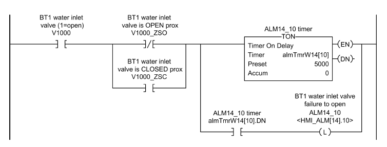

# Software Architecture and Framework for Programmable Logic Controllers: A Case Study and Suggestions for Research

https://www.mdpi.com/2075-1702/4/2/13?utm_source=chatgpt.com#metrics

Walters, E. G., & Bryla, E. J. (2016). Software Architecture and Framework for Programmable  Logic Controllers: A Case Study and Suggestions for Research. *Machines*, *4*(2), 13. https://doi.org/10.3390/machines4020013    

## Анотація: 

Програмовані логічні контролери (ПЛК) широко використовуються для керування та автоматизації машин і процесів, тому якість програмного забезпечення ПЛК безпосередньо впливає на ефективність виробництва. У цій статті описано програму для ПЛК, яка керує виробничою лінією з виготовлення харчових продуктів і яка була повністю переписана з використанням іншої архітектури та каркасу програмного забезпечення. Апаратура ПЛК і обладнання виробничої лінії залишилися без змін, тому цей проєкт надає можливість кількісно оцінити вплив різної архітектури програмного забезпечення ПЛК на ефективність виробництва. Середня кількість ящиків продукції, виготовленої за годину роботи протягом перших десяти місяців використання нової програми, була на 6,1% вищою, ніж у середньому за десять місяців до цього з використанням старої програми. На відміну від більшості іншого програмного забезпечення, ПЗ для ПЛК часто використовується кінцевими користувачами для діагностики несправностей. У цьому випадку відносно проста архітектура та каркас, орієнтовані на кінцевого користувача, суттєво покращили ефективність виробництва порівняно з більш складною архітектурою та каркасом, орієнтованими на розробника. У статті також наведено пропозиції для подальших досліджень у сфері архітектури та каркасів ПЗ.

## 1. Вступ

Програмовані логічні контролери (ПЛК) — це спеціалізовані комп’ютери, які широко використовуються в промисловості для керування та автоматизації обладнання і процесів. ПЛК програмуються мовами, визначеними стандартом Міжнародної електротехнічної комісії (IEC) 61131-3 [1], їхніми варіаціями або мовами, специфічними для конкретного виробника й платформи ПЛК. Якість програмного забезпечення ПЛК безпосередньо впливає на ефективність виробництва [2]. Наприклад, програма ПЛК може запускати обладнання в послідовності, відмінній від задуму розробника устаткування, або заблоокване обладнання може перебувати в стані очікування довше, ніж потрібно. Таке програмне забезпечення все одно може правильно виробляти продукцію, але витрачати час та/або енергію даремно.

Програмна інженерія — це велика й добре досліджена галузь [3]. Деякі роботи були присвячені застосуванню концепцій і теорій, таких як мережі Петрі, теорія дискретних подій тощо, до розробки ПЗ для ПЛК. Проте ці дослідження мали незначний вплив на практику програмування ПЛК через надмірну складність для більшості програмістів ПЛК. Деякі роботи стосуються застосування принципів програмної інженерії до розробки ПЗ для ПЛК, зокрема розпізнавання шаблонів проєктування [4], використання об’єктно-орієнтованого підходу [5] та пропонування нових високорівневих графічних мов [6]. Це хороший початок. Проте пошук у науковій літературі за термінами на кшталт “архітектура ПЗ для ПЛК”, “каркас ПЗ для ПЛК”, “масштабоване ПЗ для ПЛК” дає мало результатів, які легко застосувати на практиці. Насправді, навіть ширший пошук за запитами “програмне забезпечення ПЛК” або “програмування ПЛК” знаходить небагато статей, більшість із яких надто складні для практичного застосування. Потрібно скоротити розрив між академічними дослідженнями та промисловою практикою.

Програмовані логічні контролери (ПЛК) стають дедалі потужнішими, і ця тенденція, ймовірно, збережеться. Багато виробників використовують термін *програмований автоматизований контролер* (PAC), щоб підкреслити, що нинішнє покоління набагато потужніше за попередні [7,8]. У минулому ПЛК часто програмували люди без формальної підготовки в галузі програмування. Сьогодні програми часто пишуть фахівці з хорошим бекграундом у програмуванні, добрим розумінням структур даних, принципів об’єктно-орієнтованого програмування тощо. Цілком природно, що вони хочуть використати свої знання та скористатися розширеними можливостями сучасних ПЛК.

На відміну від більшості іншого програмного забезпечення, програми ПЛК часто сприймаються й використовуються кінцевими користувачами як інструмент для діагностики несправностей. Людина, яка виконує діагностику, зазвичай електромеханік, може мати обмежені навички програмування, оскільки має багато інших обов’язків. Це ключовий момент, який програмісти повинні враховувати під час розробки ПЗ для ПЛК. Найпростіша в діагностиці програма — це, як правило, проста, а не витончена або складна. Протягом життєвого циклу виробничої лінії, за інших рівних умов, лінія, що легше піддається діагностиці, ймовірніше, буде мати вищий коефіцієнт безвідмовної роботи, а отже — буде ефективнішою та прибутковішою.

Нещодавно провідний виробник харчової продукції замовив повне переписування ПЗ для ПЛК, яке керує основною виробничою лінією [9]. За десять повних місяців роботи з новою програмою середня ефективність виробництва була на 6,1% вищою, ніж за десять місяців перед впровадженням. Система SCADA і екрани людино-машинного інтерфейсу (HMI) були змінені для роботи з новою програмою ПЛК. Було додано кілька інформаційних екранів, але основні екрани керування для операторів залишилися майже без змін, як і операторські процедури. Апаратура ПЛК та обладнання на лінії не змінювалися. Єдиними змінами було оновлення керувального ПЗ, насамперед ПЗ ПЛК. Нова програма ПЛК використовує архітектуру й каркас, орієнтовані на простоту, на відміну від попередньої програми, яка використовувала більш складну архітектуру та каркас і більші можливості процесора ПЛК. Таким чином, цей проєкт дає унікальну можливість кількісно оцінити вплив різних архітектур програмного забезпечення ПЛК на ефективність виробництва. Це лише одне кейс-дослідження, тож багато висновків, зроблених на його основі, потребують подальшого дослідження. Проте можна впевнено стверджувати, що дві різні програми ПЛК для однієї й тієї самої виробничої лінії можуть мати суттєво різну ефективність, що напряму впливає на прибутковість. Це, своєю чергою, підкреслює необхідність досліджень у сфері архітектури та каркасів програмного забезпечення для ПЛК, а також застосування інших знань із галузі програмної інженерії до розробки ПЗ для ПЛК.

У розділі 2 цієї статті наведено короткий огляд мов програмування ПЛК. У розділі 3 подано огляд старої та нової архітектури й каркасу ПЗ ПЛК. У розділі 4 порівняно реалізаційні деталі елементів каркасів старої й нової програм. Розділ 5 подає об’єктивні, кількісні результати, отримані після переходу на нову систему. У розділі 6 надано більш суб’єктивне обговорення результатів із припущеннями щодо причин покращень. У розділі 7 наведено пропозиції щодо подальших досліджень: як слід писати програми ПЛК і якими вони мають бути в майбутньому.

## 2. Мови програмування ПЛК

Більшість ПЛК можуть програмуватися з використанням кількох різних мов. Найпоширенішими серед них є:

- **Логічна схема (LD, Ladder Diagram)**. LD — це графічна мова, розроблена для імітації жорстко закладеної релейної логіки.
- **Структурований текст (ST, Structured Text)**. ST — це текстова мова, подібна до мови програмування BASIC.
- **Графік послідовних функцій (SFC, Sequential Function Chart)**. SFC — це графічна мова, що нагадує блок-схему.
- **Функціональна блок-схема (FBD, Function Block Diagram)**. FBD — це графічна мова, у якій блоки з’єднуються для відображення потоку даних. Блоки можуть містити логічні функції, математичні операції, таймери, регулятори ПІД (пропорційно-інтегрально-диференціальні) тощо.

Більшість ПЛК дозволяють створювати програми, що складаються з підпрограм, написаних різними мовами. Наприклад, LD може використовуватися для більшої частини програми, ST — для обчислень із великою кількістю математичних операцій, SFC — для реалізації послідовних операцій, а FBD — для керування безперервними процесами. Логічна схема (LD) є однією з найпоширеніших мов і використовується в прикладах цієї статті. Логічною схемою можна реалізувати будь-яку логіку, доступну в інших мовах, хоча в деяких випадках інші мови можуть бути зручнішими.

На рисунку 1 показано базовий приклад програми на мові LD, що реалізує логічну функцію
 **F = ((A · B) + C) · (D + E)**,
 де ‘·’ — логічне **І (AND)**, ‘+’ — логічне **АБО (OR)**, а **B** — це інверсія (NOT B).

Символ під A на рисунку 1 — це **нормально відкритий контакт**, який логічно істинний, якщо A = 1. Символ під B — це **нормально закритий контакт**, який істинний, якщо B = 0. Символи, з’єднані послідовно (як A та B), реалізують логічне **І**, а символи, з’єднані паралельно (як D та E), реалізують логічне **АБО**. Символ під F — це **котушка (coil)**, яка логічно істинна, якщо умови перед нею істинні, і хибна, якщо умови хибні.

Функцію, реалізовану на рисунку 1, можна записати у вигляді псевдокоду:

```pseudocode
if (((A and not B) or C) and (D or E)) then
    F = 1
else
    F = 0
end if
```

Нормально відкриті та нормально закриті контакти називаються **інструкціями введення (input instructions)**. Доступні й інші інструкції введення, наприклад: дорівнює, більше ніж тощо. Всі вони оцінюються як логічно істинні або хибні, і працюють аналогічно контактам. **Котушка (coil)** є **інструкцією виведення (output instruction)**. Також існують інші інструкції виведення, як-от: таймери, обчислення, ПІД-регулювання, переходи до підпрограм тощо. Інструкції виведення виконуються лише тоді, коли логіка, що передує їм, є логічно істинною. Якщо логіка хибна — інструкції не виконуються.


Figure 1. Basic example of ladder diagram (LD).

## 3. Архітектура та каркас ПЛК

У цій статті *архітектура програмного забезпечення ПЛК* розглядається як найвищий рівень абстракції програми ПЛК. Вона охоплює високорівневі структурні елементи програми, спосіб їхньої взаємодії між собою та з іншими частинами системи керування, такими як системи SCADA та HMI. Також до архітектури належить *програмна філософія*, або принципи, що визначають підхід до реалізації на нижчих рівнях.

*Каркас програмного забезпечення ПЛК* у цій статті — це код, який допомагає реалізувати архітектуру. Код каркасу призначений для повторного використання та розширення. Він допомагає програмісту писати код у відповідності до обраної філософії архітектури, а також підвищує продуктивність, надаючи загальну функціональність, що дозволяє зосередитися на унікальній логіці застосування.

У цьому розділі описано ключові елементи архітектури та каркасу старої та нової версій програми. Повний опис виходить за межі цієї статті. Деталі реалізації елементів каркасу подано в розділі 4.

### 3.1. Стара архітектура проти нової архітектури

Високорівневі структурні елементи старої та нової архітектур є подібними. Основні блоки включають:

- **SCADA/HMI** — система SCADA та екрани HMI передають вхідні сигнали до ПЛК та приймають вихідні сигнали від ПЛК.
- **Режими Hand/Off/Auto** — логіка обробки режимів ручний/вимкнений/автоматичний керує режимами роботи виконавчих пристроїв, переважно на основі введення з HMI та спрацьовування аварій, які переводять пристрої у вимкнений стан.
- **Обробка аварій (Alarm Handling)** — логіка, що визначає наявність аварій та відстежує, які з них були підтверджені оператором.
- **Автоматична логіка (Auto Logic)** — керує пристроями в автоматичному режимі, переважно на основі даних з HMI та стану вхідних пристроїв.
- **Вихідна логіка (Output Logic)** — керує виконавчими пристроями на основі автоматичної логіки, режиму Hand/Off/Auto, аварій та міжблокувань.
- **Блокування (Interlocking)** — умови, які повинні бути виконані, щоб дозволити включення виходу або продовження операції. Зазвичай міжблокування важливі для безпеки персоналу чи захисту обладнання, тому їх реалізація має бути особливо надійною.
- **Вхідні пристрої** — перемикачі, датчики тощо.
- **Вихідні пристрої** — клапани, двигуни тощо.

Головна відмінність між старою та новою архітектурою полягає у *програмній філософії*. Загальна філософія старої архітектури полягає у використанні розширених можливостей ПЛК, таких як *типи даних, визначені користувачем (UDT)*, та підпрограми, з метою імітації об’єктно-орієнтованого підходу, орієнтованого на розробника. Натомість нова архітектура дотримується простого, але добре структурованого підходу, орієнтованого на кінцевого користувача. Обидва підходи вимагають кривої навчання для розробника, але обидва дозволяють досягти високої продуктивності програмування.

### 3.2. Старий каркас проти нового каркасу

Каркаси старої та нової програм істотно відрізняються, оскільки відповідають різним програмним філософіям архітектури. Обидва каркаси реалізовані переважно за допомогою мови LD (логічна схема), хоча за бажанням інші мови також можуть бути використані для реалізації певних функцій.

На **рисунку 2** подано блок-схему каркасу, що використовувався для реалізації старої архітектури. У старому каркасі для кожного типу виконавчого пристрою використовується окрема підпрограма, яка інкапсулює спільну функціональність цього типу пристроїв, а також тег UDT для зберігання його стану. Автоматична логіка й логіка міжблокувань встановлюють значення вхідних бітів у тегах UDT для кожного пристрою. Ці біти потім обробляються у відповідних підпрограмах для встановлення вихідних бітів у тегах UDT, які в свою чергу керують виходами ПЛК для відповідних виконавчих пристроїв. Обробка режимів hand/off/auto та аварій виконується окремо для кожного пристрою у відповідній підпрограмі. Аварії також обробляються індивідуально з використанням окремого тега UDT і підпрограми для кожної аварії.


Рисунок 2. Каркас, використаний для реалізації старої архітектури.

На **рисунку 3** подано блок-схему каркасу, що використовувався для реалізації нової архітектури. Новий каркас обробляє режими hand/off/auto та аварії централізовано, використовуючи таблиці та логіку, що працює з усіма таблицями одразу, а не з окремими бітами. Автоматична логіка в новому каркасі зберігається на вищому рівні абстракції порівняно зі старим каркасом. Наприклад, один із бітів, який активується новою автоматичною логікою, встановлюється під час додавання води до змішувального бака на першому етапі подачі води. Вихідна логіка використовує ці біти разом зі статус-бітами режимів hand/off/auto для керування виходами ПЛК для виконавчих пристроїв. Логіка блокувань розміщується безпосередньо на тій сходинці, що керує виходом ПЛК, тому її легко знайти й перевірити.

Суттєвою перевагою нового каркасу є значно простіша діагностика для кінцевих користувачів з базовими навичками програмування, оскільки їм потрібно переглядати лише просту логічну схему, на відміну від старого каркасу, де потрібно було шукати відповідні підпрограми та біти в тегах UDT.


Рисунок 3. Каркас, використаний для реалізації нової архітектури.

## 4. Практичний приклад: переписування системи керування

Виробнича лінія з виготовлення харчових продуктів на одному з провідних підприємств працювала протягом кількох років і вважалася повністю налагодженою. Однак у системі все ж виникали певні проблеми. Зокрема, два змішувальні баки, що використовувалися для приготування суспензії кінцевого продукту, не встигали за швидкістю роботи лінії, оскільки їхні послідовності дозування містили зайві блокування. Дозування в баках і в інших частинах лінії керувалося програмним забезпеченням, що виконувалося на персональному комп’ютері (ПК), що призводило до затримок між етапами, а іноді — до зависання системи й зупинки виробництва.

Програма ПЛК була написана з використанням складних технік, які максимально використовували розширені можливості ПЛК, через що електромеханікам було складно застосовувати цю програму для діагностики при зупинках лінії. Виробник розглядав пропозицію переписати програму ПЛК для вирішення цих проблем. Проте було важко обґрунтувати витрати, оскільки лінія вже була введена в експлуатацію, і складно було кількісно оцінити переваги заміни однієї робочої програми на іншу.

Одного дня під час виробництва лінія зупинилася без жодного сигналу тривоги. Електромеханіки не змогли знайти причину й викликали інженера з автоматизації, який також не зміг виявити проблему. Урешті-решт запросили зовнішнього підрядника, який встановив, що причиною був внутрішній біт, розташований у кількох рівнях вкладених підпрограм, що був установлений унаслідок короткочасного спрацювання аварійної зупинки й потребував явного скидання в програмі для повторного запуску лінії. Простої тривали дві зміни, і цей випадок було використано як підставу для переписування програми ПЛК.

Нова програма використовує архітектуру та каркас програмного забезпечення, орієнтовані на простоту, з урахуванням того, що кінцеві користувачі застосовуватимуть програму для діагностики. Повне обговорення відмінностей між архітектурою та каркасами старої й нової програм виходить за межі цієї статті. У цьому розділі описано лише кілька ключових відмінностей між ними.

### 4.1. Керування виконавчими пристроями

У цьому підрозділі розглянуто, як реалізується логіка керування виконавчими пристроями, такими як двигуни й клапани, у кожній із програм.

#### 4.1.1. Початкова програма

Початкова програма використовує переваги *типів даних, визначених користувачем (UDT)*, і *підпрограм*. Кожен клас пристроїв (двосторонній клапан, реверсивний пускач двигуна, перетворювач частоти тощо) має відповідний UDT і пов’язану з ним підпрограму. Для кожного пристрою створюється тег даних відповідного типу UDT, який представляє його стан. Логіка, спільна для всіх пристроїв цього класу, зберігається в підпрограмі пристрою. Керування пристроєм реалізується таким чином:

- Значення вхідних елементів тега даних задаються відповідно.
- Викликається підпрограма пристрою з передачею тега даних як параметра.
- Вихідні елементи тега даних прив’язуються до фізичних виходів.

Як приклад розглянемо двосторонній клапан V1000. Такі клапани використовують UDT типу `V_2WAY` (див. таблицю 1) та підпрограму `V_2WAY_SBR`. Для клапана V1000 створено тег `V1000` типу `V_2WAY`. На рисунку 4 показано спрощену реалізацію керування V1000. Спочатку фізичні входи від вимикачів положення клапана прив’язуються до `V1000.ZSO` та `V1000.ZSC`. Далі викликається підпрограма `V_2WAY_SBR`, якій передається `V1000` як параметр. Підпрограма обробляє вхідні поля тега `V1000` і встановлює значення вихідних полів згідно зі спільною логікою керування для двостороннього клапана. Нарешті, `V1000.FYO`, який отримує значення в підпрограмі, прив’язується до фізичного виходу для соленоїда, що керує V1000. В реальній програмі потрібно також реалізувати додаткову логіку для налаштування інших вхідних полів.


Рисунок 4. Спрощена реалізація керування двостороннім клапаном (початкова програма).

Таблиця 1. Тип даних, визначений користувачем, для двостороннього клапана (початкова програма).

| Назва поля  | Тип даних | Опис                                              |
| ----------- | --------- | ------------------------------------------------- |
| **HOA**     | DINT      | 0 = Ручне закриття, 1 = Авто, 2 = Ручне відкриття |
| **IDX**     | DINT      | Індекс у таблиці даних                            |
| **Area**    | DINT      | Прив’язка до зони                                 |
| **DFA**     | Alrm      | Сигнал аварії положення                           |
| **AE_OPEN** | BOOL      | Автоматичний дозвіл на відкриття                  |
| **AI_OPEN** | BOOL      | Автоматичне міжблокування на відкриття            |
| **HI_OPEN** | BOOL      | Ручне міжблокування на відкриття                  |
| **INHA**    | BOOL      | Блокування автоматичного режиму                   |
| **FOM**     | BOOL      | Примусове вимкнення                               |
| **FYO**     | BOOL      | Вихід на соленоїд (відкрити)                      |
| **FYC**     | BOOL      | Вихід на соленоїд (закрити)                       |
| **ZSO**     | BOOL      | Стан: відкрито                                    |
| **ZSC**     | BOOL      | Стан: закрито                                     |
| **H2V**     | BOOL      | Видимість ручного керування HOA                   |
| **ES**      | BOOL      | Стан аварійної зупинки                            |
| **NO**      | BOOL      | Нормально відкритий (тип контакту)                |


#### 4.1.2. Нова програма

У новій програмі застосовано набагато простіший підхід. На рисунку 5 показано типову логіку на мові LD для дискретних виходів. Фізичний (реальний) вихід програмується на другій сходинці. Загалом, пристрої з керуванням у режимах hand/off/auto активуються, якщо:
 (a) пристрій перебуває в автоматичному режимі, і автоматична логіка намагається його активувати; або
 (b) пристрій знаходиться в ручному режимі.
 Це відображено контактами з лівого боку сходинки. Якщо є блокування, які мають бути виконані для активації виходу, вони додаються послідовно в центрі сходинки, щоб блокувати вихід незалежно від режиму. Автоматична логіка для пристрою (тобто “автокоманда”) програмується на окремій сходинці, що знаходиться вище за сходинку з виходом.


Рисунок 5. Типові сходинки для дискретного виходу (нова програма).

Окрім фізичного виходу, на вихідній сходинці присутні ще дві котушки, які програмуються паралельно, тому всі три елементи мають однакове значення. Перша — це *відображений (mapped)* вихідний біт, а друга — *псевдонім (alias)*. Всі фізичні виходи відображаються в єдину таблицю переважно для того, щоб їх можна було ефективно зчитувати через HMI. Назва псевдоніма відповідає тегу пристрою. Теги пристроїв зазначаються на екранах HMI, на схемах КІП (P&ID), а також на фізичних пристроях, тому використовувати псевдоніми у програмі зручно — їх легше запам’ятати, ніж адреси виходів.

Наведений на рисунку 5 приклад показує логіку керування *впускним водяним клапаном першого змішувального бака (BT1)*. Відкриття цього клапана, коли заслінка сухого інгредієнта відкрита, може призвести до потрапляння води в лінію подачі сухих компонентів, що є небажаним. Автоматична логіка враховує це, але замикальний датчик заслінки також додається як міжблокування для запобігання цьому в ручному режимі. У процесі дозування є три фази, коли вода додається до бака. Це чітко видно в логіці автокоманди.

Логіка виходів написана з урахуванням потреб кінцевого користувача. У цьому прикладі, якщо клапан не відкривається або не закривається, як очікується, ці дві сходинки слугують чудовим інструментом для діагностики. Їх легко знайти за допомогою перехресного посилання або пошуку по тегу, наприклад `V1000`. Стан кожного контакту та котушки чітко відображається кольором при онлайн-підключенні до ПЛК, тож відразу видно, чи активовано вихід. Якщо ні — легко з’ясувати чому. Логіка на сходинці автокоманди написана простою мовою, майже як опис дій людиною. У цьому випадку вона майже читається як:
 *«в автоматичному режимі впускний клапан відкривається, коли операція дозування перебуває у першій, другій або третій фазі додавання води».*
 Якщо потрібно більше деталей — логіку кожного біта з цієї сходинки легко знайти за допомогою перехресного посилання.

Переваги простого, орієнтованого на кінцевого користувача підходу нової програми порівняно зі складнішим, орієнтованим на розробника підходом початкової програми:

- У початковій програмі користувач не бачить стану контактів і котушок у підпрограмі конкретного пристрою (зазначимо, що цю проблему можна уникнути в новіших версіях ПЛК, використовуючи *інструкції Add-On* замість UDT та підпрограм. Add-On інструкції були недоступні на момент створення початкової програми). Це робить діагностику дуже складною для багатьох техніків і незручною навіть для досвідчених розробників, незнайомих з архітектурою. Діагностика в новій програмі потребує лише базових навичок програмування ПЛК.
- У початковій програмі підпрограма для класу пристроїв містить логіку для всіх можливих режимів роботи. Ця логіка виконується ПЛК для кожного пристрою, навіть якщо вона не потрібна. У новій програмі обробляється лише необхідна логіка.
- У початковій програмі всі пристрої одного класу мають абсолютно однакову логіку. Це зазвичай перевага, але якщо один пристрій має працювати трохи інакше, тоді потрібно або (а) створити нову підпрограму зі зміненою логікою, або (б) розширити UDT новим параметром і змінити підпрограму для його обробки. У новій програмі така проблема відсутня.

### 4.2. Керування в режимах Hand/Off/Auto

Оператори можуть вибирати для більшості пристроїв виробничої лінії один із трьох режимів: ручний (hand), вимкнений (off) або автоматичний (auto). У режимах hand або off пристрій відповідно вмикається або вимикається. Якщо міжблокування виконані, це фактично означає примусове увімкнення або вимкнення пристрою. У режимі auto пристрій вмикається або вимикається автоматично, без участі оператора, згідно з логікою автоматичного керування ПЛК. У цьому підрозділі описано, як реалізовано керування режимами hand/off/auto у кожній із програм.

#### 4.2.1. Початкова програма

У початковій програмі UDT для кожного типу пристрою містить елемент `HOA` (статус режиму hand/off/auto) типу `DINT` (32-розрядне ціле число). Значення 0 означає режим *off*, 1 — *auto*, 2 — *hand*. Коли режим вибирається через HMI для певного пристрою, відповідне значення записується в таблицю ПЛК. Підпрограма пристрою визначає новий режим на основі значення в таблиці та стану інших бітів, таких як `FOH` (bit примусового вимкнення) та `INHA` (bit блокування автоматичного режиму). Новий режим потім записується назад у таблицю, можливо з перезаписом значення, отриманого з HMI, щоб HMI могла відобразити фактичний режим. Відповідний елемент у таблиці визначається полем `IDX` (індекс у таблиці) з тега даних пристрою.

#### 4.2.2. Нова програма

У новій програмі використовуються кілька таблиць бітів:

- запит на ручний режим,
- у ручному режимі,
- запит на вимкнення,
- у вимкненому режимі,
- запит на автоматичний режим,
- в автоматичному режимі.

Коли з HMI обирається певний режим, встановлюється відповідний *біт запиту*. Централізований обробник (handler) обробляє всі запити режимів, порівнює їх зі статус-бітами (`in hand`, `in off`, `in auto`) і відповідно оновлює їх. Примусові режими, наприклад, переведення пристрою в off при аварії, реалізуються встановленням біта `request off` на кожному циклі сканування, поки активна аварія.

Якщо для одного пристрою надходять кілька запитів на різні режими (наприклад, з кількох станцій HMI або внаслідок примусового режиму), встановлюється лише один статус-біт, відповідно до пріоритету:
 **off > auto > hand**.
Якщо пристрій у режимі *off*, обробник гарантує, що біти *auto* та *hand* вимкнені, тому *біт off* не потрібно враховувати у сходинці виходу (див. рисунок 5).

Переваги централізованого підходу нової програми порівняно з підхід на рівні окремих пристроїв у початковій програмі:

- **Менше пам’яті.** Початкова програма використовує по два DINT (32 біти) на кожен пристрій: один у тегу пристрою, інший — у таблиці для HMI. Нова програма використовує лише **шість бітів** на пристрій, ефективно упакованих у таблиці.
- **Логіка HOA відокремлена від логіки виходу.** У початковій програмі логіка керування режимами розміщена в тій самій підпрограмі, що й логіка керування виходом. У новій програмі обробник режимів винесено в окрему процедуру, тому кінцевому користувачеві не потрібно її переглядати під час діагностики.
- **Відсутність дублювання.** У початковій програмі логіка обробки HOA-запитів дублюється в кожній підпрограмі для різних класів пристроїв. У новій програмі така логіка реалізована лише один раз.
- **Продуктивність.** Початкова програма обробляє кожен пристрій окремо. Нова програма обробляє таблиці **по словам**, тому виконується набагато швидше.

### 4.3. Обробка аварій (Alarm Handling)

У цьому підрозділі описано, як реалізовано обробку аварій у кожній із програм.

#### 4.3.1. Початкова програма

У початковій програмі кожна аварія представлена тегом даних типу `Alrm`, визначеним користувачем. Структуру цього UDT наведено в таблиці 2. 

Таблиця 2. Тип даних, визначений користувачем, для аварій (початкова програма).

| Назва поля    | Тип даних | Опис                                                     |
| ------------- | --------- | -------------------------------------------------------- |
| **IDX**       | DINT      | Індекс у таблиці даних                                   |
| **TIMER**     | TIMER     | Таймер аварії                                            |
| **ALM**       | BOOL      | 0 = Норма, 1 = Аварія                                    |
| **ACK**       | BOOL      | 0 = Не підтверджено, 1 = Підтверджено                    |
| **HORN**      | BOOL      | Встановлюється, якщо ця аварія повинна активувати сирену |
| **SILENCE**   | BOOL      | 0 = Аварія приглушена, 1 = Аварія звукова                |
| **CONDITION** | BOOL      | Умова спрацювання аварії                                 |
| **FLAG**      | BOOL      | Прапор аварії (додатковий службовий біт)                 |

Обробка аварій реалізується так:

- Програмується біт `CONDITION` у тегу аварії.
- Викликається підпрограма `Z_ALRMD`, якій передається тег аварії як параметр.

Наприклад, біт `CONDITION` для аварії двигуна може активуватися, якщо вихід `Motor_Run` увімкнений, а зворотний сигнал `Motor_Running` — ні. Підпрограма використовує `CONDITION`, щоб активувати таймер `TIMER`. Якщо таймер спрацьовує, встановлюється біт `ALM`. Підпрограма також обробляє підтвердження (acknowledgement), приглушення (silencing) та визначає, чи має звучати сигнал тривоги або світитися маяк.

Більшість аварій у початковій програмі — це *аварії пристроїв*, наприклад, коли двигун не запускається або клапан не переходить у потрібне положення. UDT кожного пристрою включає елемент `DFA` типу `Alrm`. Підпрограма для кожного класу пристроїв містить логіку для встановлення `DFA.CONDITION` і викликає підпрограму `Z_ALRMD`.

#### 4.3.2. Нова програма

У новій програмі використовується таблиця бітів аварій. Біти аварій фіксуються (лачатимуться) за допомогою логіки, подібної до тієї, що показана на рисунку 6 для аварії *нездатності відкрити клапан V1000*. Логіка фіксації аварій організована у вигляді підпрограм, згрупованих за зонами, що полегшує навігацію. Централізований обробник аварій (alarm handler) виконує обробку сигналів підтвердження (acknowledgement) та приглушення (silence).

Переваги простої логіки виявлення аварій у поєднанні з централізованою обробкою в новій програмі порівняно з підходом, орієнтованим на окремі пристрої, у початковій програмі:

- У початковій програмі логіка умов для аварій пристроїв знаходиться в підпрограмі відповідного класу пристрою. Це ускладнює діагностику аварій з тих самих причин, що й діагностику логіки виходів. У новій програмі аварійну логіку легко знайти, а стан контактів і котушок зручно переглядати онлайн.
- Початкова програма обробляє аварії *по одній*. Нова програма перевіряє логіку умов аварій без викликів підпрограм, а таблицю аварій обробляє по словам для підтвердження та приглушення, що забезпечує значно швидше виконання.



Рисунок 6. Типова сходинка для аварії (нова програма).

## 5. Результати

Керівник виробництва надав дані про роботу лінії за десять повних місяців до переходу на нову програму та за десять місяців після нього. На підприємстві ефективність виробництва визначається як відношення кількості ящиків продукції, виготовленої за годину роботи, до кількості ящиків за годину, на яку розрахована система. Наприклад, якщо лінія спроєктована на 1000 ящиків за годину, а в середньому виробляється 900, ефективність становить 90%. Середній показник ефективності за десять місяців після переходу був на **6,1% вищим**, ніж у середньому за десять місяців до переходу.

Витрати на переписування програми ПЛК були окуплені завдяки підвищенню ефективності вже за кілька місяців і надалі приносять вигоду при кожному виробничому циклі. Інші кількісно вимірювані покращення:

- **Час сканування програми зменшився з приблизно 220 мс до 18 мс.** Нова програма працює на порядок швидше за початкову з кількох причин: усунено витрати на виклики підпрограм для кожного пристрою та аварії, запити й статуси режимів hand/off/auto обробляються централізовано у вигляді таблиці, а не індивідуально для кожного пристрою.
   *Переваги*: ПІД-регулятори оновлюються значно швидше, що важливо для контурів швидкості, витрати, тиску та безперервного змішування. Крім того, покращено час відгуку системи, що дозволяє швидше й стабільніше реагувати на сигнали.
- **Об’єм пам’яті, зайнятий програмою ПЛК, зменшився приблизно на 14%.** Це вдалося, незважаючи на те, що до ПЛК було перенесено логіку виконання дозування та додаткову логіку, пов’язану з рецептами. Початкова програма містила спільну логіку в одній підпрограмі, однак економія пам’яті була нівельована великим обсягом тегів на основі UDT для кожного пристрою.
   *Перевага*: більше доступної пам’яті для розширення, навіть попри збільшення функціональності ПЛК.

## 6. Обговорення

Існує низка переваг нової програми, які важко кількісно оцінити і які є більш суб’єктивними:

- **Загальна система керування стала простішою.** Уся логіка дозування була перенесена до ПЛК, що дозволило позбутися окремого пакета для виконання дозування, який працював на окремій робочій станції. Стара система дозування іноді працювала повільно, часто зависала або зупинялась на певній фазі. Перевага нової системи полягає у виключенні важливого джерела простоїв і втрат продукції. Керування рецептами було інтегровано у вже наявну загальнозаводську систему, що дозволило відмовитись від окремого користувацького ПЗ для роботи з рецептами. Стара користувацька система не мала необхідного функціоналу і не могла бути змінена, оскільки виробник не мав її вихідного коду. Перевага нової системи — використання існуючої заводської платформи без залежності від пропрієтарного ПЗ.
- **Програма ПЛК стала простішою.** Вона не містить індексованої адресації, за винятком логіки режимів hand/off/auto та обробки аварій, які не потрібно переглядати кінцевому користувачу. Підпрограми використовуються лише для структурування коду, жодна з них не викликається більше одного разу за цикл, і жодна не має параметрів. Логіка для виходів і аварій є простою, а її стан легко переглядати в режимі онлайн із ПЛК. Перевага в тому, що технікам, які обслуговують лінію, набагато легше виконувати діагностику. Також програму було легко запустити — вона одразу забезпечила стабільну якість продукції та перевищила планові показники вже в перший день.
- **Програма ПЛК краще організована для діагностики.** Кожна ділянка лінії має три окремі підпрограми: логіка автокерування, логіка виходів (як на рисунку 5) та логіка аварій (як на рисунку 6). Перевага в тому, що всі три підпрограми можна переглядати одночасно, а логіку — зручно переглядати без відволікання на код обробки режимів та аварій. У поєднанні з простотою логіки це суттєво полегшує діагностику.
- **Інтерфейс HMI надає операторам більше інформації про фази дозування.** Кожна фаза кожної операції дозування відображається на HMI, тож оператори розуміють, як працює система. Поточна фаза та стан кожної умови, необхідної для переходу до наступної фази, також відображаються. У разі потреби оператор може вручну перейти до наступної фази або скинути операцію з HMI. Перевага в тому, що оператори завжди знають, що виконує система й чого вона очікує. Вони також мають ручний контроль над кожною операцією, тож можуть швидко відновити роботу після проблем, наприклад, вимкнення електроенергії, без втрат часу чи продукту.

Початкова система керування була розроблена на основі обґрунтованої та легітимної програмної філософії. Можна навести хороші аргументи на користь кожного елемента початкової архітектури. Нова система керування дотримується іншої, але також обґрунтованої й легітимної філософії. Вибір між цими підходами (або їх комбінацією) слід здійснювати, зважаючи на те, як саме буде використовуватись програма та якими є навички її користувачів.

Незалежно від того, як інтерпретувати результати, це дослідження дозволяє зробити такі висновки:

- **Вибір архітектури програми може суттєво впливати на ефективність виробництва.**
- **Програми, що віддають перевагу простоті, мають переваги над програмами, орієнтованими на складність.**

## 7. Пропозиції для досліджень

Метою цієї статті не є визначення найкращого способу написання програми для ПЛК. Її мета — показати, що архітектура програмного забезпечення для ПЛК впливає на ефективність виробництва і заслуговує на подальше дослідження. Деякі питання, які можуть слугувати орієнтиром для таких досліджень:

- Яку архітектуру програмного забезпечення слід використовувати для програм ПЛК зараз і в майбутньому?
- Як можна використовувати зростаючу потужність і складність ПЛК, водночас зберігаючи простоту програм для зручного використання кінцевими користувачами при діагностиці?
- Які нові засоби й методи діагностики можна розробити, щоб зменшити або усунути потребу кінцевого користувача звертатися до коду програми ПЛК?

**Деякі запропоновані теми для подальших досліджень:**

- **Каркас для ПЗ ПЛК.**
   Каркас для програмування ПЛК — це основа для реалізації архітектури ПЗ. Він надає загальну функціональність, таку як керування режимами hand/off/auto та обробка аварій, щоб програміст не "винаходив велосипед". Каркас пришвидшує розробку, забезпечує масштабованість та надійність коду. Це дослідження показує, що частини каркасу, з якими працюватимуть кінцеві користувачі, мають бути максимально простими, тоді як внутрішні модулі, які бачать лише розробники, можуть використовувати всі можливості сучасних (і майбутніх) ПЛК. Розвиток інших напрямів досліджень, наприклад, удосконалення інструментів діагностики або автоматичної генерації коду, може вплинути на дизайн каркасу.
- **Шаблони проєктування для ПЗ ПЛК.**
   Шаблони проєктування — це типові рішення для повторюваних проблем програмування. Прості шаблони (наприклад, стандартне ПІД-регулювання аналогового виходу) можуть реалізовуватись за допомогою типових шаблонів. Рекомендується ідентифікувати складніші шаблони та розробити оптимальні рішення. Наприклад, коли кілька ПЛК, які керують різним обладнанням однієї лінії (й запрограмовані різними людьми), мають обмінюватися командами й статусами для ефективної взаємодії.
- **Моделювання систем керування на базі ПЛК.**
   Симуляції систем керування можна використовувати для початкового тестування програм до введення в експлуатацію, що пришвидшує пусконалагодження. Після запуску симуляції можуть використовуватися для навчання операторів або випробування альтернативних стратегій керування. Існують комерційні пакети для моделювання, однак дослідження в цьому напрямку можуть привести до розробки відкритих методів симуляції, що зменшить вартість і зробить симулятори доступнішими.
- **Автоматична генерація коду ПЛК із високорівневих специфікацій.**
   За наявності каркасу значну частину коду налаштування можна генерувати автоматично. Наприклад, список входів/виходів (I/O) можна використати для генерації тегів, коментарів і логіки виходів, подібної до наведеної на рисунку 5. Послідовності дій, які можна описати як скінченний автомат, можна трансформувати в логіку ПЛК. Загальна мета цього напряму — автоматично генерувати якомога більше коду на основі специфікації процесу, яку, у свою чергу, можна сформувати на основі наявних механічних та електричних креслень. Цей підхід можна розширити до автоматичної генерації симулятора процесу.
- **Перевірка та валідація систем керування на базі ПЛК.**
   Наявність каркасу та симулятора процесу може дозволити автоматичну перевірку та валідацію ПЗ ПЛК. Якщо каркас включає стандартний інтерфейс до ПЗ HMI, можна моделювати дії оператора для перевірки адекватності реакції системи. До ПЛК-програм можна застосовувати юніт-тестування, яке є стандартною практикою в розробці загального ПЗ.
- **Інструменти та методи діагностики для кінцевих користувачів.**
   Це кейс-дослідження показує потребу зберігати простоту ПЗ ПЛК, щоб користувачі могли використовувати його для діагностики. Це суперечить прагненню багатьох розробників використовувати всі можливості сучасних ПЛК. Для діагностики можна застосовувати методи машинного навчання. У короткостроковій перспективі можливим рішенням може бути автоматична генерація екранів HMI, що відображають інформацію, яку зазвичай шукають у коді ПЛК.
- **Інтеграція розробки ПЛК-програм і HMI.**
   Програмування ПЛК і створення HMI-засобів часто виконуються різними фахівцями. Для досягнення максимальної ефективності коди ПЛК і HMI мають бути узгодженими. Більшість запропонованих напрямів дослідження доцільно розглядати саме з такої інтегрованої перспективи. Наприклад, високорівнева специфікація може бути використана для генерації як коду ПЛК, так і відповідних екранів HMI; шаблони проєктування можуть враховувати взаємодію оператора з механічною системою; симулятори можуть імітувати як процес, так і дії оператора тощо.

## 8. Висновки

Із розвитком ПЛК та підвищенням кваліфікації фахівців, які їх програмують, виникає природне бажання використовувати стиль програмування, більш орієнтований на розробника, ніж на кінцевого користувача. Проте на багатьох виробничих лініях під керуванням ПЛК програми часто використовуються для діагностики несправностей людьми з помірними навичками програмування.

Початкова програма, описана в цій статті, застосовувала більш складні техніки, тоді як нова програма дотримується значно простішого підходу. Такий підхід дозволив створити програму, яка має менше проблем, що спричиняють простої. Більш проста програма також є кращим інструментом для діагностики, зменшуючи тривалість простоїв у разі виникнення проблем.

Ця стаття демонструє, що архітектура програм ПЛК може суттєво впливати на ефективність виробництва, та пропонує теми для подальших досліджень у цій сфері.

## References

1. International Electrotechnical Commission. IEC 61131-3 Programmable Controllers–Part 3: Programming
Languages, 2nd ed.; IEC: Geneva, Switzerland, 2003.
2. Barrett, M. Managing the Invisible Assets. Eng. Technol. 2008, 3, 50–52.
3. Bourque, P.; Fairley, R.E.; IEEE Computer Society. Guide to the Software Engineering Body of Knowledge
(SWEBOK (R)): Version 3.0; IEEE Computer Society Press: Piscataway, NJ, USA, 2014.
4. Bonfè, M.; Fantuzzi, C.; Secchi, C. Design patterns for model-based automation software design and
implementation. Control Eng. Pract. 2013, 21, 1608–1619.
5. Obermeier, M.; Braun, S.; Vogel-Heuser, B. A Model Driven Approach on Object Oriented PLC
Programming for Manufacturing Systems with Regard to Usability. IEEE Trans. Ind. Inform. 2015, 11,
790–800.
6. Kandare, G.; Godena, G.; Strmˇcnik, S. A new approach to PLC software design. ISA Trans. 2003, 42, 279–288.
7. Bell, I. The future of control. Manuf. Eng. 2005, 84, 36–39.
8. Walter, T. Welcome PAC: Moving on to the next generation controller. InTech 2005, 52, 41–43.
9. Walters, E.G., III; Bryla, E.J. The Impact of PLC Program Architecture on Production Line Efficiency: Case
Study of a Control System Rewrite. In Proceedings of the ISA Applications of Automation Conference,
Wilmington, DE, USA, 23–25 March 2010.