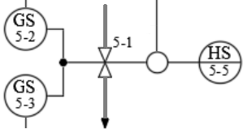
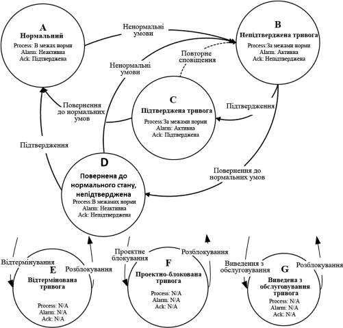
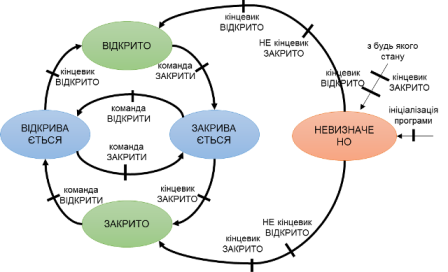
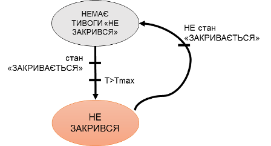
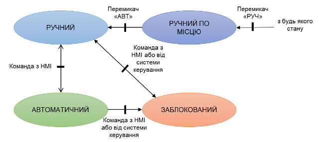
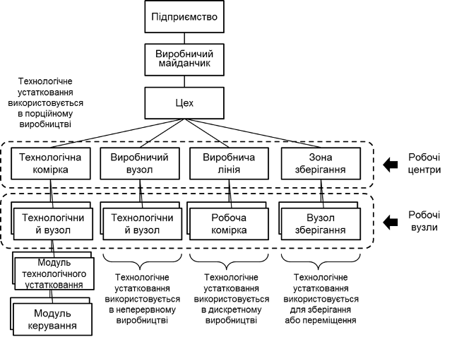

## 1.2 Базові технології в основі каркасу

Каркас базується на певних технологіях, які описані в даному підрозділі. Зокрема:

- об'єктної моделі устатковання (equipment) відповідно до ISA-88, ISA-95 та ISA-106
- стано-орієнтоване керування: автомати станів, режими та її поширення відповідно до ISA-88
- автомат станів тривог ISA-18.2 

У цьому розділі описуються ці поняття.

### Устатковання (Equipment) 

Відповідно до стандартів ISA-88 (IEC-61512) та ISA-95 (IEC-62264), при проектуванні, розробці та експлуатації програмного забезпечення систем керування виробництвом та технологічним процесом кожен об'єкт автоматизації розглядається як окрема сутність. З точки зору керування виділяється ієрархія устатковання (див. нижче), в якій кожен об'єкт має свою роль. Окрім устатковання, в стандартах ISA-95 (IEC-62264) в межах підприємства виділяються також інші ресурси, такі як матеріали, персонал та їх об'єднання (сегменти процесу та продукту), а також активи.   

На рівні АСКТП згідно стандарту ISA-88 (IEC-61512) усі об'єкти розділяються окремо на «технології» (як виробити продукт) і «устатковання» (на чому виробити продукт). Автоматизація «побудови технології» стосується тільки виробництв зі змінною рецептурою (для цього власне і створений стандарт ISA-88). На відміну від технологічної частини, автоматизація устатковання стосується усіх типів виробництв, навіть якщо використовуються виключно неперервні процеси з однаковою технологією. 

В усіх цих стандартах устатковання агрегують функції та їх зв’язки у більш загальні сутності, які сприймаються як єдине ціле. При цьому, звичні для інженерів-автоматників поняття як "пристрій контролю", "контур регулювання", "виконавчий механізм", тощо стають частиною устатковання.  

Розглянемо для прикладу, як представлений в класичній системі автоматизації 2-х позиційний клапан або заслінка:

- орган керування (безпосередньо клапан або заслінка);
- виконавчий механізм з одним керуючим пневматичним сигналом «ВІДКРИТИ»;
- два датчика кінцевого положення «ВІДКРИТИЙ», «ЗАКРИТИЙ».

На схемі автоматизації (або P&ID) для кожної з частин буде по одному зображенню (див. Рис. 1.2.1), який як правило відповідає одному засобу автоматизації. 



Рис. 1.2.1 Зображення клапан на схемі автоматизації 

Крім цього клапану стосуються функції, які часто не показуються на схемі автоматизації, але повинні бути передбачені в алгоритмі ПЛК та SCADA/HMI, наприклад:  

- базові функції контролю та керування (наприклад, керування за алгоритмом);
- функції взаємодії з HMI, такі як переключення режимів руч/авт, та ручне керування;
- функції тривожної сигналізації (наприклад, сигналізація "не закрився").                    

Усі ці функції мають бути реалізовані у програмах контролера та SCADA/HMI, тому в них будуть відповідні до цього змінні/теги та/або функції. У класичному представлені це можуть бути розрізнені змінні та функції, які не об'єднані логічно в окрему сутність. 

З точки зору ж експлуатації клапан сприймається не як сукупність функцій, а в поняттях його станів, наприклад: функціонального («відкритий», «закритий»), режиму («у ручному режимі», «в автоматичному»), тривоги («не відкрився»). Ці поняття характерні для клапана в цілому, а не для його частин чи функцій. Тому на дисплеях HMI засоби автоматизації можуть показуватися як згруповані разом елементи, анімація передбачатиме використання всіх тегів, які мають відношення для клапану. 

Аналогічним чином відносяться до нього інженери, що не мають відношення до автоматизації. Вони оперують поняттями станів, а не функцій чи засобів вимірювання та керування. Тому при проектуванні чи експлуатації їх не цікавить спрацювання датчиків кінцевого положення, та зрештою їх може взагалі і не бути, або бути присутнім тільки один з них.      

Описане вище відношення до клапану виробничників є очевидним. Тим не менше, класичний контурний підхід при розробці ПЗ для АСКТП йде врозріз цьому підходу. Усі ці функції представлені переліком змінних (тегів), які аналізуються/змінюються в окремих частинах програми. Так, наприклад, функція керування клапаном відбувається в контурі алгоритму керування процесом, а функція сигналізації – в контурах сигналізації і блокування. Таке розкидування по коду може стати дуже громіздким і робить код погано читабельним. Наведемо кілька завдань, які передбачають крос-функціональну взаємодію:

- блокування клапану при відмові одного з датчиків;
- блокування клапану, якщо він не відкрився;
- тимчасова можливість функціонування без одного з датчиків.

Для наведеного вище прикладу використання в програмному забезпеченні об’єктів типу «клапан» дає можливість інкапсулювати усю логіку виконання функцій, що його стосуються, в одну сутність. У цьому випадку взаємодія інших, зовнішніх по відношенню до нього об’єктів, буде проходити через взаємодію з ним, а не оперувати набором тегів чи функцій, які мають відношення до клапану.    

Для багатьох інженерів АСКТП використання об’єктного підходу стало типовою практикою. Тим не менше, її застосовують не всі. Крім того, часто зустрічається частково-об’єктний підхід, що пов’язано з погано проробленою методологією створення ПЗ. Стандарт ISA-88/IEC 61512 дає певні правила виділення та оперування такими об’єктами-устаткованнями, хоч не обмежує в цьому, зокрема:

- устатковання (equipment) існує як виділена в системі керування сутність зі своїми наборами атрибутів;
- устатковання має певну роль, від якої залежить, які типи функцій воно виконує; 
- устатковання формує ієрархію, розміщення в якій також впливає на керування.   

Отже, окрім набору функцій та відповідних їм змінних в програмі контролера чи SCADA/HMI, передбачається наявність окремих сутностей (об’єктів) - **устатковання (equipment**), яке включає в себе інші об’єкти (дрібніші частини устатковання) та функції. Надалі під словом «устатковання» будуть розумітися спеціалізовані об’єкти в системі керування, які відображають стан їх фізичних сутностей. Функції устатковання також надалі будемо називати **функціональними елементами**.

Взаємодія інших елементів системи керування з устаткованням проводиться через його змінні стану та команди.  

### Станово-орієнтоване керування (state based control)

#### Поняття станів (States) 

**Стан** (**state**) – це загальна властивість, яка вказує на плинне становище якогось об’єкта. Оскільки устатковання включає в себе певні функціональні елементи, то зрештою його стан залежить від станів цих елементів та попереднього стану устатковання. Відповідно до принципів [емерджентності](https://uk.wikipedia.org/wiki/Емерджентність), стан системи не є простою сукупністю станів її елементів. Тим не менше, наразі для простоти, будемо вважати, що це так. 

Отже, стан устатковання може оцінюватися з позицій його функціональних елементів, наприклад з точки зору виконуваної операції, наявності тривог, обслуговування (ремонту) чи джерела керування. Тому під «узагальненою сукупністю» розуміється поєднання усіх станів функціональних елементів як єдиного цілого. У залежності від стану устатковання можуть змінюватися як сигнали керування, так і виконувані алгоритми. 

Для прикладу розглянемо наведений вище клапан. Його стан можна розглядати з точок зору станів його функціональних елементів:

- операційна функція (функція керування/контролю позиції клапану): ВІДКРИТИЙ, ЗАКРИТИЙ, ВІДКРИВАЄТЬСЯ, ЗАКРИВАЄТЬСЯ, НЕ ВИЗНАЧЕНИЙ (наприклад одночасне спрацювання обох кінцевиків) та ін.;
- функція тривожної сигналізації: НЕМАЄ ТРИВОГ, НЕ ВІДКРИВСЯ, НЕ ЗАКРИВСЯ, ДОВІЛЬНИЙ ЗСУВ та ін; у свою чергу кожна з цих тривог також описується певним станом: НЕ АКТИВНА, АКТИВНА НЕ ПІДТВЕРДЖЕНА, АКТИВНА ПІДТВЕРДЖЕНА та ін.; тому загальний стан наявності тривог клапана є певною згорткою станів усіх тривог;
- режим функціонування: АВТОМАТИЧНИЙ (алгоритми системи керування), РУЧНИЙ (дії оператора), МІСЦЕВИЙ (керування за допомогою перемикачів по місцю), БЛОКОВАНИЙ (функції керування не активні);
- функція імітації роботи (наприклад, з метою налагодження): РЕАЛЬНИЙ (зчитує значення з входів та записує виходи) та ІМІТОВАНИЙ (значення датчиків генеруються алгоритмом імітації, значення виходів не записуються);
- функція обслуговування: НА РЕМОНТІ, ФУНКЦІОНУЄ; останній час обслуговування; кількість переключень. 

Перелік функціональних елементів та їх станів варіюється від вимог до контролю та керування устаткованням і не обмежуються стандартом. Оскільки устатковання можуть бути складеними з кількох устатковань, то станів може бути набагато більше, оскільки воно включає в себе кілька об’єктів. Наприклад, для устатковання типу «насос з перетворювачем частоти» стан представляється узагальнюючим набором станів функціональних елементів 2-х об’єктів: двигуна та перетворювача частоти. Крім того, з точки зору функції операційної діяльності розглядаються не лише дискретні набори станів (ВКЛЮЧЕНИЙ, ВІДКЛЮЧЕНИЙ), а й додаються аналогові значення плинної частоти (швидкості), струму, напруги тощо. У той же час на основі аналогових значень можуть формуватися набори дискретних станів функцій, такі як «працює на мінімальній частоті» або «на максимальній». 

Таким чином, контроль за устаткованням відбувається через відповідні **змінні стану**, які повинні бути в програмі контролеру, SCADA/HMI чи іншого інтелектуального засобу. Для дискретних станів функцій це бітові статуси, які приймають значення TRUE/FALSE, або їх комбінація. 

```
бітові статуси = дискретні стани або їх комбінація
```

Сукупність цих станів функціональних об’єктів є об’єднання (конкатенація) цих статусів. У цьому випадку всі стани функціональних об’єктів можна об’єднати в певний упорядкований набір бітів для всього устатковання – **статусне слово (status word**). 

```
статусне слово = набір бітових статусів функцій елементів устатковання
```

Використовуючи статусне слово інша частина системи може аналізувати устатковання як єдине ціле через бітове представлення. Це дає змогу контролювати як конкретний статус функціонального елементу, звертаючись до нього як до біту, так і як бітову матрицю, використовуючи маску. 

Наприклад, для клапану статусне слово може мати вигляд як в таблиці 1.2.1. Біти стану можуть взаємно виключати один одного, наприклад біти «ВІДКРИТИЙ» і «ЗАКРИТИЙ», а рівність обидвох бітів 0 – представляти інший стан, наприклад проміжний. Наприклад, якщо біти 5–8 дорівнюють нулю – це вказує на стан «НЕ ВИЗНАЧЕНИЙ». 

Таблиця 1. Приклад статусного слова для 2-х позиційного клапану 

| **Біт**   | **Опис**                                           |
| --------- | -------------------------------------------------- |
| 0 ALMOPN  | =1  тривога НЕ ВІДКРИВСЯ                           |
| 1 ALMCLS  | =1  тривога НЕ ЗАКРИВСЯ                            |
| 2 BLCK    | =1 БЛОКОВАНИЙ                                      |
| 3 ALMSHFT | =1 тривога ДОВІЛЬНИЙ ЗСУВ                          |
| 4 ALMSNSR | =1 тривога ПОМИЛКА ДАТЧИКА                         |
| 5 OPNING  | =1 ВІДКРИВАЄТЬСЯ                                   |
| 6 CLSING  | =1 ЗАКРИВАЄТЬСЯ                                    |
| 7 OPNED   | =1 ВІДКРИТИЙ                                       |
| 8 CLSED   | =1 ЗАКРИТИЙ                                        |
| 9 DISP    | =1 РУЧНИЙ  режим (з ПК/ОП), =0  АВТОМАТИЧНИЙ режим |
| 10 MANBX  | =1 МІСЦЕВИЙ  режим                                 |
| 11 ALM    | =1 загальна тривога                                |
| 13 FRC    | =1 хоча би одна зі змінних в  об’єкті форсована    |
| 14 SML    | =1 режим імітації                                  |

Стани стосуються не тільки устатковання але і процедур в процедурному керуванні. Це більш детально розглянуто в [процедурному керуванні](../proc/README.MD). 

#### Автомати станів (State Machines) 

При написанні програми для реалізації об’єкта-устатковання необхідно реалізувати зміну його стану в залежності від станів функціональних елементів та інших об’єктів, що включені в нього. Ці стани необхідно змінювати в залежності від умов. Таку поведінку станів можна описати словесним алгоритмом, на кшталт: 

```
якщо клапан в стані «ЗАКРИТИЙ» і прийшла команда «ВІДКРИТИ», 
 перейти в стан «ВІДКРИВАЄТЬСЯ»
```

Для функції тривожної сигналізації це може виглядати так:

```
якщо клапан в стані «ВІДКРИВАЄТЬСЯ» і не спрацював датчик кінцевого 
 положення і час відкриття більше максимального, то перейти в стан «НЕ ВІДКРИВСЯ»
```

Слід зауважити, що у даному прикладі в алгоритмі керування станами тривожної сигналізації використовуються стани операційної функції. Тобто стани різних функціональних елементів устатковання взаємопов’язані. Це одна з причин, чому функції варто групувати в устатковання. 

Алгоритм, що описує для конкретної функції поведінку переходу між станами називають **автоматом станів(state machine)**. Більш зручним описом автомату станів є графічний – **діаграма станів**. Вершинами її є стани, а ребрами переходи між станами та відповідні умови. 

Автомати станів це класичний механізм формалізації та моделювання, який використовується у багатьох галузях, у тому числі в автоматизації. Наприклад, на Рис. 1.2.2 показана діаграма класичного автомату станів для тривог, що описаний в стандарті IEC 62682 з певними спрощеннями. Стани тривоги представлені на рисунку колами з підписами, в яких наводиться опис, що включає комбінацію статусів: статусу тривоги та статусу підтвердження. У даному випадку, стан тривоги – це узагальнюючий показник, який залежить від плинного значення статусів та від попереднього стану. Стрілки на Рис. 1.2.2 відповідають переходам між станами з вказаними умовами цих переходів. 

 

Рис. 1.2.2. Спрощений автомат станів тривог 

Не дивлячись на те, що станів тривоги всього чотири, діаграма виглядає досить просто. Але стандарт IEC 62682 передбачає ще три можливих стани блокування, в які можна перейти з будь-якого іншого стану. Діаграма показана на Рис. 1.2.3., але усі переходи показати там не вдасться. 

 

Рис. 1.2.3. Повний автомат станів тривог згідно IEC 62682

Розглянемо діаграму станів для операційної функції клапану. У найпростішому випадку клапан має два стани – «ВІДКРИТИЙ» та «ЗАКРИТИЙ». У залежності від наявності датчиків кінцевого положення, клапан може описуватися автоматами станів, що показані на Рис.1.2.4. Рисками на стрілах показані умови спрацювання переходів. На перший погляд, кожен з цих варіантів є самодостатнім. Однак кожен з них має ряд вад.  

 

Рис. 1.2.4. Приклади найпростіших варіантів автомату станів для клапану

У варіанті з двома кінцевиками при виникненні несправності одного з них, жоден з них не буде дорівнювати одиниці, або спрацюють обидва. Це автоматом не передбачено. Аналогічна ситуація може відбуватися і з другим варіантом, коли датчик кінцевого положення буде несправним. Третій варіант взагалі немає контролю стану, тому в цьому випадку для алгоритмів керування можливо треба врахувати час переміщення, для уникнення, наприклад, гідроударів. Будь-який з цих варіантів не передбачає формування тривог на базі станів, так як автомату станів тривог ні на що орієнтуватися. 

Очевидно в наведених вище станах з датчиками кінцевого положення необхідно передбачити в якості умов переходу команди керування. Під останніми розуміється команди на об’єкт-устатковання, а не на його апаратну частину (тобто виконавчий механізм). Також, для спрощення побудови автомату станів тривожної сигналізації варто ввести додаткові перехідні стани «ВІДКРИВАЄТЬСЯ» та «ЗАКРИВАЄТЬСЯ». Крім того, варто ввести стан «НЕ ВИЗНАЧЕНО», якщо конкретну позицію неможливо ідентифікувати. З цього стану можна починати при ініціалізації програми керування, або переходити туди при несправності датчиків положення (обидва в одиниці). У такому випадку діаграма станів операційного функціонального елементу матиме вигляд як на Рис. 1.2.5.

 

Рис. 1.2.5. Приклад розширеного автомату станів для операційного 
 функціонального елементу клапану 

Вище наведений приклад визначення та керування станами але нічого не сказано про дії на реальний об'єкт. У кожному з наведених станів можна робити певні керуючі дії. Наприклад в стані «ВІДКРИВАЄТЬСЯ» вмикати дискретний вихід контролера, що керує клапаном. Крім того, можна вмикати таймер, який буде вказувати на час активності стану, що можна буде використати для керування тривогами. Механізм формування дії на базі станів спрощує керування, так як в певному стані для об'єкта керування нас цікавить значення не усіх датчиків а тільки частини, актуальної для даного стану.   

Використовуючи діаграму операційного функціонального елементу клапану можна описувати алгоритм керування, який в свою чергу може спиратися на інші автомати станів. Інші функціональні елементи цього ж клапану можуть використовувати цей автомат для формування логіки своїх автоматів. Для прикладу розглянемо автомати станів для одного з функціональних елементів тривожної сигналізації «НЕ ЗАКРИВСЯ». Для спрощення ми будемо розглядати тільки статус активності тривоги, тобто без урахування статусу підтвердження і блокування (див. Рис. 1.2.6). Дві риски підряд на лінії переходу значать спрацювання обидвох умов щоб перехід відбувся. Як видно з діаграми тривога виникає тоді, коли клапан знаходиться в операційному стані «ЗАКРИВАЄТЬСЯ» і час цього стану більше максимально дозволеного.

 

Рис. 1.2.6. Діаграма спрощеного автомату станів для тривоги «НЕ ЗАКРИВСЯ» 

Як видно, автомати станів функціональних елементів тривожної сигналізації тісно пов’язані з операційними. Тому в ряді випадків автомати станів різних функціональних елементів показують зв’язаними на одній діаграмі. Однак слід розуміти, що якщо два автомати станів з Рис. 1.2.5 та з Рис.1.2.4 поєднати в одну діаграму, то в один момент часу будуть активні два стани, наприклад «ЗАКРИВАЄТЬСЯ» та «НЕ ЗАКРИВСЯ», що з графічного зображення може бути неочевидним. Тим не менше, в ряді випадків кілька автоматів станів можна звести в один, як це показують наприклад для перетворювача частоти. У будь-якому випадку програмна реалізація може базуватися на станах операційного функціонування, в яких будуть реалізовані керування станами інших функціональних елементів. 

Для прикладу з клапаном, устатковання можна описувати кількома взаємозалежними автоматами станів:

- операційний;
- 4 автомати для тривог («НЕ ВІДКРИВСЯ», «НЕ ЗАКРИВСЯ», «ДОВІЛЬНИЙ ЗСУВ», «ПОМИЛКА ДАТЧИКА»);
- блокування;
- режимів роботи;
- імітування.

Для устатковання в PAC Framework передбачені стандартні автомати станів. Для процедур приклади автомати станів наведені в ISA-88. Це більш детально розглянуто в [процедурному керуванні](../proc/README.MD). 

#### Режими (Modes) 

Згідно стандарту ISA-88 **режим** вказує на те, у який спосіб відбувається керування операційними функціями. Зрештою, «режими» це окремо виділені стани, які впливають на особливість виконання (алгоритмів) функцій устатковання, а інколи – і на їх автомати станів.

Для устатковання стандарт ISA-88 рекомендує використовувати два режими: РУЧНИЙ та АВТОМАТИЧНИЙ. У РУЧНОМУ режимі, операційний стан устатковання означується командами з HMI, у АВТОМАТИЧНОМУ – з алгоритму керування. На практиці режимів може бути більше. Наприклад, для згаданого вище клапану, на Рис. 1.2.7. показана діаграма з додатковими режимами «РУЧНИЙ ПО МІСЦЮ» і «ЗАБЛОКОВАНИЙ». У «РУЧНОМУ ПО МІСЦЮ» режимі, клапан керується байпасним щитком, що знаходиться біля клапану. У «ЗАБЛОКОВАНОМУ» режимі на клапан завжди подається команда «ЗАКРИТИ».

 

 Рис. 1.2.7. Автомат станів переключення режимів устатковання типу клапана

У даному випадку на автомат станів, що наведений на Рис.1.2.5, будуть подаватися команди керування з різних джерел. Але, у ряді випадків автомати станів деяких функцій можуть змінюватися в залежності від режиму устатковання. Наприклад, діаграма на Рис.1.2.5 не передбачає контроль команди ВІДКРИТИ та ЗАКРИТИ у режимі «РУЧНИЙ ПО МІСЦЮ», так як ці команди не можуть бути простежені системою. Тому, для цього режиму варто продумати інший автомат.

Вище наведені приклади станів, які є взаємно-виключеними. Наприклад, стани ВІДКРИВАЄТЬСЯ і ЗАКРИВАЄТЬСЯ з Рис. 1.2.5 ніколи не можуть бути активними одночасно. Для прикладу з 4-ма режимами, все не так однозначно, оскільки наприклад режим РУЧНИЙ (з HMI) і РУЧНИЙ ПО МІСЦЮ (з байпасу) можуть виникнути одночасно. Необхідно чітко розставити пріоритети при керуванню станами в програмі. У цьому випадку, «РУЧНИЙ ПО МІСЦЮ» має пріоритет, оскільки команди з контролеру, нівелюються. 

Зверніть увагу, що при означенні автомату станів, простіше визначаються неоднозначності та протиріччя в технічному завданні. Це ще одна причина необхідності їх формалізації у тому числі з використанням діаграми.

Для устатковання в PAC Framework передбачені кілька стандартних режимів, які описані у відповідних розділах. Для процедур в ISA-88 наведений чіткий перелік режимів. Це більш детально розглянуто в [процедурному керуванні](../proc/README.MD). 

#### Умови переходів та команди 

Як зазначалось вище, автомати станів описуються станами та переходами, для яких задаються умови. Умовами переходу можуть бути як команди алгоритму керування (або HMI), так і вияв системою керування зміни стану устатковання, як правило за допомогою датчиків. Наприклад, на Рис. 1.2.5 перехід з ВІДКРИТО в ЗАКРИВАЄТЬСЯ відбувається по команді ЗАКРИТИ з системи керування, а з ЗАКРИВАЄТЬСЯ у ЗАКРИТО по стану датчика кінцевого положення. Слід звернути увагу, хоч може це і не очевидно, але датчик кінцевого положення, який є елементом клапану, теж є устаткованням, яке має свої стани. Він може мати стан ВІДМОВА, який може впливати на стани (або навіть режими) устатковання вищого рівня, тобто клапану. 

З точки зору устатковання (віртуального представлення фізичної сутності), будь-яка дія, націлена на нього, або перевірка його внутрішнього стану (команда керування, відслідковування стану) може бути умовою переходу в інший стан. Реалізація автомату станів якраз і передбачає переведення устатковання у потрібний стан. 

Керовані умови переходу формуються **командами**. Можна виділити кілька джерел команд: з алгоритму керування, засобів HMI, системи верхнього рівня і т.п. У деяких випадках вони можуть відпрацьовуватися за різними алгоритмами, тоді діаграма станів має це відображати. Команди можуть бути реалізовані як бітові (ВІДКРИТИ, ЗАКРИТИ) або у вигляді числового **слова команди** (**command word**), де конкретна команда задається числом. Враховуючи, що за один раз устаткованню передається одна команда, як правило достатньо одного слова (числової змінної) для передачі всіх можливих команд керування. Обробник команд може не реагувати на ті команди, які недоступні в даному стані або режимі.  

**Важливо!** Слід обережно використовувати автомати станів та передбачати механізми «зависання», коли програма не може вийти із певного стану за причини неможливості спрацювання умови переходу. Це може бути наприклад команда на примусову ініціалізацію автомату. Крім того, **найбільш критичні умови блокування (спрацювання алгоритмів безпеки) краще робити в окремій частині програми з найбільшим пріоритетом (наприклад в кінці задачі ПЛК) і без використання автомату станів. Для функціонально небезпечних об'єктів ці функції повинні виконувати СПАЗ, PAC Framework для цього не годиться! **

#### Поширювання режимів/станів між об'єктами 

Режими і стани, що означені в системі керування для різних об'єктів теж як правило взаємодіють між собою. Так, наприклад, для усієї установки можуть бути означені режими: РУЧНИЙ, АВТОМАТИЧНИЙ та НАЛАГОДЖУВАЛЬНИЙ. При цьому зміна режиму в НАЛАГОДЖУВАЛЬНИЙ може змінювати пріоритет режимів РУЧНИЙ/АВТОМАТИЧНИЙ та ЗАБЛОКОВАНО/НЕЗАБЛОКОВАНО.

В ієрархічних та розподілених системах керування певні сутності (устатковання, процедури) залежать одна від одної. Це передбачає взаємозалежність станів та режимів. У багатьох випадках ця залежність може бути означена і в автоматах станів. Наприклад, переведення установки в ручний режим, може привести до переведення в ручний кожного виконавчого механізму установки. Або стан "пауза" загальної процедури керування всією установкою може привести до такого самого стану всіх етапів, які зараз виконувалися.

### Ієрархія устатковання

#### Поняття ієрархії устатковання

У стандартах IEC 61512 та IEC 62264 все устатковання (Equipment) на підприємстві займає певний рівень в ієрархії в залежності від того, яку роль воно відіграє в ланцюжку виробництва і навіть в бізнес-процесах підприємства. При проектуванні систем керування з використанням описаних підходів, необхідно зробити декомпозицію устатковання відповідно до його рольового призначення. Це значить, що все наявне виробниче (і не тільки) устатковання необхідно об’єднати в, а інколи розділити на окремі сутності, що будуть виконувати певну роль, описуватися своїм набором автоматів станів. У залежності від типу виробництва (неперервне, порційне, дискретне) принципи виділення устатковання будуть відрізнятися. У будь-якому випадку, на стадії проектування правила декомпозиції устатковання повинні бути означені максимально детально, так як недостатньо продумані правила можуть ускладнити розробку і експлуатацію в майбутньому.

Критерії декомпозиції можуть бути описані з різних точок зору та відповідно застосовуватися до різних задач керування. Як приклад, можна виділити такі загальні правила: 

- об'єкт має єдиний набір операційних станів;
- об'єкт має показники якості функціонування КПЕ (КРІ, ключові показники ефективності);
- об'єкт має свій набір режимів;
- об’єкт має набір станів тривог;
- об’єкт виділяється як технологічна одиниця, що робить певну технологічну операцію або кілька операцій. 

Якщо об’єкт-устатковання у свою чергу складається з набору інших устатковань, то кожен елемент в його складі буде мати свої індивідуальні функціональні стани, режими, тривогові стани, які будуть формувати цей набір для об’єкта вищого рівня. Для прикладу можна розглянути пастеризаційно-охолоджувальну установку (ПОУ), яка складається з пастеризатора, сепаратора та гомогенізатора. З точки зору системи керування АСКТП ці три установки виконують конкретні функції по реалізації технологічного процесу. А з точки зору керування виробничою лінією, вони є одним об’єктом – ПОУ, яка виробляє продукт з певними характеристиками. У той же час, гомогенізатор може бути окремою автоматизованою машиною, яка включає в себе набір устатковання зі своїм набором станів і режимів. 

Ієрархічність будується за принципом підлеглості, тобто описується яким чином об’єкти вищого рівня керують/контролюють об’єкти нижчого рівня. У прикладі з клапаном це виглядає наступним чином – об’єкт клапан має в своєму складі три об’єкта нижчого рівня: датчики кінцевого положення ВІДКРИТО та ЗАКРИТО і соленоїд на відкриття (Рис. 1.2.8). При розробці програмного забезпечення, об’єкт-устатковання вищого рівня (наприклад ПОУ) буде взаємодіяти шляхом команд і статусів лише з клапанами, а не з датчиками та соленоїдом. У свою чергу, програміст АСТКП може зосереджуватися на реалізації функцій устатковання, попередньо означивши автомати станів та їх взаємодію на різних рівнях. 

 

Рис.1.2.8. Ієрархія устатковання на рівні клапана

Відповідно до такої структури реалізація функцій устатковання найнижчого рівня (наприклад, в контролері) може передбачати безпосередню взаємодію з датчиками та виконавчими механізмами: 

- обробку вхідного/вихідного значення: масштабування, фільтрування, інвертування, тощо;
- наявність режиму ручної зміни значення з датчика (форсування); 
- наявність режиму імітації;
- обробку тривог (IEC 62682): реагування на порогові значення для аналогових величин, врахування затримки на спрацювання та гістерезису, формування системного біту аварії/попередження і т.п;
- конфігурування: налаштування граничних значень та параметрів тривог, тимчасове зняття тривоги з обслуговування, налаштування масштабування, фільтрації, тощо.

Таким чином, рольова ієрархія дає можливість реалізувати взаємодію між устаткованням з використанням автоматів станів, без необхідності врахування особливостей їх внутрішньої організації.

Окрім очевидно зрозумілої взаємодії через команди/статус, ієрархія дає ще ряд, на перший погляд, неочевидних переваг. Так, наприклад, для об’єкту-устатковання типу «клапан» це дає можливість забезпечувати наступні можливості:

- враховувати стан об’єкта нижчого рівня (норма/тривога/достовірність) та діагностичну інформацію при керуванні логікою виконання; наприклад, якщо датчик кінцевого положення в стані НЕДОСТОВІРНІСТЬ (відмова модуля входів/виходів), клапан переходить в режим ЗАБЛОКОВАНИЙ;
- проводити імітацію роботи підлеглих датчиків, шляхом оперування їх станами за імітаційним алгоритмом (наприклад для тестування або навчання персоналу);
- керувати станом НЕДОСТОВІРНОСТІ підлеглих датчиків за алгоритмом, наприклад, коли обидва датчика показують спрацювання.  

Враховуючи логіку взаємодії об’єктів в ієрархії, переведення в ручний режим устатковання вищого рівня (наприклад ПОУ), часто передбачає ручний режим усіх підлеглих елементів (наприклад виконавчих механізмів). Тобто, ієрархічність може забезпечувати **поширення режимів** з устатковання вищого рівня на нижчі або навпаки. Аналогічним чином може відбуватися **поширення станів**. 

Стандарт IEC 61512 тільки оговорює факт можливості поширення, але це вже спричинює необхідність означення цих правил вже на стадії проектування. 

Прикладом поширення станів можуть бути аварійні стани, які з нижчого рівня поширюються по ієрархії вгору. Це значить, що усі тривоги відслідковуються на вищому рівні ієрархії устатковання (для кожної категорії відповідно до IEC 62682).

В IEC 61512 та IEC 62264 рольова ієрархія устатковання має вигляд як на Рис. 1.2.9. Відповідно до цієї ієрархії кожне устатковання виконує певну роль у процесі виготовлення продукції. При інтегруванні верхніх рівнів з системами АСКТП, керування та контроль відбувається через стани та команди устатковання. Устатковання верхніх рівнів керування (підприємство, виробничий майданчик, цех) розглядаються з точки зору організаційного керування (див. Рис.1.2.9) і знаходяться в зоні діяльності операцій систем рівня ERP. У даному випадку слово «устатковання» варто розглядати як «потужності». Цеха випускають певний набір продуктів. Виробничі операції проводяться на **робочих центрах** – устаткованнях, які виготовляють напівпродукт. Робочі центри є основним засобом керування виробничими операціями, і керуються (плануються, диспетчеризуються, контролюються) системами MOM (Manufacturing Operation Management). Детальніше про це, можна прочитати в посібнику із серії aCampus «Принципи функціонування систем керування основним виробництвом через призму стандарту IEC-62264». У самих робочих центрах керування діяльністю виконання операцій сильно залежить від типу виробництва. Для порційного виробництва ця діяльність означується стандартом IEC 61512. Тому реалізація устатковання нижніх рівнів, починаючи від робочого центра описана саме в цьому стандарті.  

 

Рис. 1.2.9 Рольова ієрархія устатковання підприємства

Слід наголосити, що в даній моделі устатковання розглядається саме с позиції рольового призначення. Тобто, насос в даній ієрархії розглядається як будь яке обладнання, що виконує функцію перекачування в конкретному місці розташування технологічного процесу. Тобто це те обладнання, яке на апаратурно-технологічній схемі або схемі автоматизації має своє умовне позначення. Якщо конкретний насос при певних обставинах змінюється на устатковання, наприклад іншого виробника, що виконує ту саму роль, то з точки зору даної моделі, це буде той самий насос. Для того щоб враховувати конкретні екземпляри устатковання (зі своїм серійним номером) в ISA-95 (IEC 62264) передбачена інша модель -- **активів** (**Asset**). У каркасі наразі не використовується модель активів, так як це потребує виділення значного обсягу пам'яті пристрою. Тим не менше, при реалізації розподіленого керування з використанням каркасу, для означення активу може бути виділений окремий об'єкт.

#### Ієрархія устатковання ISA-88 та IEC-61512

Як було сказано вище, каркас базується на моделі, означеній ISA-88 та IEC-61512. З точки зору рівня АСКТП найвищим рівнем устатковання там є технологічна комірка (див.рис.1.2.9). ***Технологічна комірка*** (Process cell), що описана в стандарті ISA-88 відповідає робочому центру (Work Center) означеному в IEC 62264 та ISA 95. У той час, як робочий центр може бути означений для різних типів виробництв, технологічна комірка означена тільки в термінах порційних процесів (batch process), що характерно для стандарту ISA-88. Технологічна комірка представляє собою логічне угруповання, яке вміщує устатковання, що необхідне для виробництва однієї або декількох партій (напів)продукту. Вона означує діапазон логічного керування одним набором технологічного устатковання в межах цеху.

Наявність технологічної комірки дає можливість планувати на основі неї виробництво і розробити стратегію керування усім процесом. Технологічна комірка включає технологічні вузли (units), модулі технологічного устатковання (equipment modules) та модулі керування (control modules), що потрібні для створення однієї або більше партій. Ідея ISA-88 в тому, що для технологічної комірки існує **рецепт** (**recipe**), в якому вказується що саме і з використанням якого саме устатковання буде робитися в межах неї. Цей рецепт означується технологами і включає **процедуру** приготування для партії (напів)продукту (**procedure**) та додаткові параметри. Процедура технологічної комірки у свою чергу ділиться на менші **процедури технологічного вузлу** (**unit procedure**), які можуть ділитися на **етапи** (**phase**) таким чином формуючи так звану "технологічну програму" приготування. Процедурне керування описується у [відповідному розділі](../proc/README.md)

Слід відмітити, що хоч технологічна комірка означена для порційних процесів (batch process) в каркасі передбачається використання її ієрархії для всіх типів процесів.  

**Технологічний вузол** (**Unit**)  або ***Апарат***порційного типу - устатковання, у якому можуть бути проведені один або декілька основних процесів з усією або частиною партії речовини. Як незалежне угруповання, він поєднує в собі все необхідне устатковання для фізичної обробки та керування, що потребується для виконання цих дій. Технологічний вузол, як правило, зосереджений на основній частині технологічного устатковання, такого як змішувальна ємність, або реактор. Фізично він включає в себе, або може заволодівати послугами всього логічно-пов\'язаного устатковання, необхідного для завершення основних процесів обробки в ньому. Технологічні вузли працюють відносно незалежно один від одного.

Нагадаємо, що технологічний вузол, який описаний в стандарті ISA-88, відповідає типу робочого вузлу (Work Unit), означеного в IEC/ISO62264 та ANSI/ISA 95 (див. рис. 1.2.9). В ISA-95 є чотири типи робочих вузлів: технологічні вузли періодичної дії, технологічні вузли неперервної дії, дискретні робочі комірки (work cell) та вузли зберігання (storage unit). Унікальність технологічного вузлу періодичної дії є в тому, що він проводить технологічні дії одночасно над всією партією або її частиною. Технологічний вузол неперервної дії пропускає через себе матеріал і обробляє його в потоці. Робоча комірка дискретної дії проводить обробку поштучно (дискретні одиниці) хоч і можливо в потоці.   

Зазвичай, в один момент часу технологічний вузол періодичної дії містить тільки одну партію, і в цих випадках фізичний поділ між партіями є звичайним явищем. Величина партії при цьому визначається економічними вимогами і фізичними обмеженнями технологічного вузлу. Однак, у деяких процесах поділ відповідно до вузлу є не таким очевидним, і використовується логічна межа між окремими партіями. Така ситуація часто зустрічається в гібридних процесах, що складаються з періодичних та неперервних процесів. У гібридних процесах в рамках технологічної комірки використовуються обидва типи технологічного устатковання: технологічних вузлах періодичної та неперервної дії. 

З точки зору \"технологічної програми\", закладеної в рецепті, процедура технологічного вузлу повинна починатися і закінчуватися в тому самому вузлі. Таким чином, поділ на процедури технологічного вузлу визначається можливостями усіх вузлів, які доступні в технологічній комірці.

Технологічний вузол складається з модулів технологічного устатковання та керування. Вони можуть бути налаштовані як його частина або можуть тимчасово ним заволодіватися (**allocation**) для виконання конкретних завдань.

**Модуль технологічного устатковання (Equipment module)** може виконувати кінцеву кількість конкретних незначних технологічних діяльностей, таких як, наприклад, дозування і зважування. Він поєднує в собі все необхідне устатковання для проведення фізичних процесів та устатковання для керування, необхідного для виконання цієї діяльності. Він, як правило, зосереджений на частині технологічного устатковання, такого як насосний агрегат. Функціонально, сфера дії модуля технологічного устатковання означується кінцевими задачами, для яких він створений. З точки зору керування порційними процесами, він може виконувати мінімальну технологічну дію, яка задається в рецепті, тобто етапом.

Модуль технологічного устатковання -- це найнижчий рівень устатковання, які \"видимі\" для рецептурного керування.

Якщо устатковання виконує якусь технологічну дію над сировиною, але робить це не над всією партією одночасно, то це є модулем технологічного устатковання а не технологічним вузлом. Так, наприклад, теплообмінники або змішувачі в потоці не є технологічними вузлами, однак їх можна віднести до модулів технологічного устатковання.

**Модуль керування (Control module, CM)**, як правило, - це набір датчиків, виконавчих механізмів, інших модулів керування і зв'язаного з ними технологічного устатковання, що, з точки зору керування, працює як єдине ціле. Модуль керування також може бути складений з інших модулів керування. Наприклад, модуль керування колектором подачі речовини може бути означений як сукупність декількох модулів керування дискретними клапанами (виконавчі механізми + датчики). Модулі керування можуть бути частиною модуля технологічного устатковання або безпосередньо підпорядкованими технологічному вузлу чи технологічній комірці. Фізична модель не передбачає, що модуль керування може одночасно безпосередньо входити в технологічний вузол і бути частиною модулю технологічного устатковання. 

Деякі приклади модулів керування:

-   регулюючий пристрій що керується уставкою, який складається з передавача, регулятора, і регулюючого клапану;

-   орієнтований на стан пристрій, що керується уставкою, який складається з автоматичного запірного клапана (on/off) з встановленими на ньому кінцевими вимикачами за положенням;

-   модуль керування колектором, що містить блок з кількох автоматичних запірних клапанів (on/off) і координує подачу на один або декілька напрямків, в залежності від уставки спрямованої на модуль;

-   модуль керування витратою, що регулює витрату речовини в кільцевому колекторі системи живлення, яка може бути частиною технологічної комірки і не бути частиною якого-небудь технологічного вузлу.

З точки зору ISA-88 модулі керування виконують базові функції керування (Basic Control).

[Розділ](README.md)