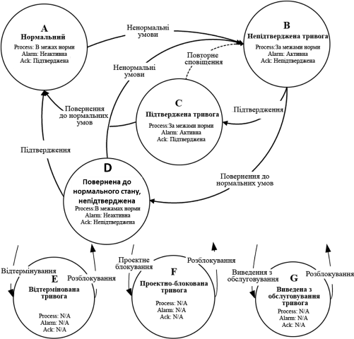
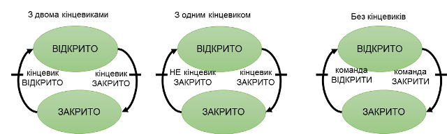
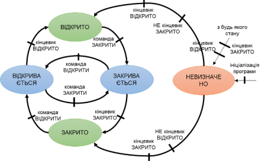

[PACFramework](../README_EN.md) > [1. Main ideas](README_EN.md)

This text was translated using Google Translate. You can comment on the translation in [this topic](https://github.com/pupenasan/PACFramework/issues/52)

## 1.2 Main technologies at the heart of the framework

The framework is based on certain technologies, which are described in this section. In particular:

- object model of equipment in accordance with ISA-88, ISA-95 and ISA-106
- state-oriented control: state machines, modes and its distribution in accordance with ISA-88
- ISA-18.2 alarm state machine

This section describes these concepts.

### Equipments 

According to the standards ISA-88 (IEC-61512) and ISA-95 (IEC-62264), in the design, development and operation of software for production and process control systems, each automation object is considered as a separate entity. From the point of view of management the hierarchy of the equipment (see below) in which each object has the role is allocated. In addition to equipment, ISA-95 (IEC-62264) also allocates other resources within the enterprise, such as materials, personnel and their associations (process and product segments), and assets.

At the level of ICS (Control Domain) according to the ISA-88 standard (IEC-61512) all objects are divided separately into "technology" (how to produce a product) and "equipment" (what to produce a product). Automation "technology construction" applies only to production with a variable recipe (for this purpose, the ISA-88 standard was created). Unlike the technological part, automation of equipment applies to all types of production, even if only continuous processes with the same technology are used.

All of these hardware standards aggregate functions and their relationships into more general entities that are perceived as a whole. At the same time, the concepts such as "control device", "control circuit", "actuator", etc., which are familiar to automation engineers, become part of the equipment.

Consider, for example, as presented in the classic automation system 2-position valve or damper:

- control body (directly valve or damper);
- actuator with one control pneumatic signal "OPEN";
- two end position sensors "OPEN", "CLOSED".

P&ID will have one image for each part (see Figure 1.2.1), which usually corresponds to one instrument.


Fig. 1.2.1 View of the valve on the automation circuit                

In addition, this valve applies to functions that are often not shown in the P&ID, but must be provided in the PLC and SCADA/HMI algorithm, for example:

- basic control and management functions (for example, algorithm control);
- HMI interaction functions, such as manual/auto mode switching and manual control;
- alarm functions (eg "alarm not closed").

All these functions must be implemented in the controller and SCADA/HMI programs, so they will have corresponding variables/tags and/or functions. In the classical representation it can be distinguished variables and functions that are not logically combined into a separate entity.

From the point of view of operation, the valve is perceived not as a set of functions, but in terms of its states, for example: functional ("open", "closed"), mode ("manual", "automatic"), alarm (not opened) »). These concepts are specific to the valve as a whole, not to its parts or functions. Therefore, on HMI displays, automation tools can be displayed as grouped elements together, the animation will use all the tags related to the valve.

Similarly, it includes engineers who have nothing to do with automation. They operate in terms of states, not functions or means of measurement and control. Therefore, when designing or operating, they are not interested in the operation of end position sensors, and in the end they may not be at all, or only one of them may be present.

The above-described relationship to the manufacturer's valve is obvious. However, the classical contour approach in software development for ICS goes against this approach. All these functions are represented by a list of variables (tags) that are analyzed/changed in certain parts of the program. For example, the valve control function occurs in the process control algorithm circuit, and the alarm function functions in the alarm and interlock circuits. This scattering of code can be very cumbersome and makes the code illegible. Here are some tasks that involve cross-functional interaction:

- blocking of the valve at failure of one of sensors;
- blocking the valve if it has not opened;
- temporary possibility of functioning without one of sensors. 

For the above example, the use of "valve" objects in software makes it possible to encapsulate all the logic of the functions related to it into one entity. In this case, the interaction of other objects that are external to it will be through the interaction with it, and not operate with a set of tags or functions related to the valve.

For many automation control engineers, the use of an object-oriented approach has become common practice. However, not everyone uses it. In addition, there is often a partial object approach due to a poorly developed software development methodology. ISA-88/IEC-61512 provides certain rules for the selection and operation of such equipment, although it does not limit it, in particular: 

- equipment exists as a separate entity in the control system with its own sets of attributes;
- equipment has a role, which depends on what types of functions it performs;
- equipment forms a hierarchy, placement in which also affects management.

Therefore, in addition to the set of functions and corresponding variables in the controller program or SCADA/HMI, it is assumed that there are separate entities (objects) - **equipment **, which includes other objects (smaller pieces of equipment) and functions. Hereinafter, the term "equipment" will mean specialized objects in the control system that reflect the state of their physical entities. The functions of the equipment will also be called **functional elements**.

The interaction of other elements of the control system with the equipment is carried out through its state variables and commands.

### State based control

#### States 

**State** is a general property that indicates the current position of an object. Since equipment includes certain functional elements, its state ultimately depends on the states of these elements and the previous state of the equipment. According to the principles of emergence, the state of a system is not a simple set of states of its elements. However, for now, for simplicity, we will assume that this is the case.

Therefore, the condition of the equipment can be assessed from the standpoint of its functional elements, for example in terms of the operation performed, the presence of alarms, maintenance (repair) or source of control. Therefore, the "generalized set" means the combination of all states of functional elements as a whole. Depending on the state of the equipment, both control signals and executable algorithms can change.

For example, consider the above valve. Its state can be considered from the point of view of the states of its functional elements:

- operational function (valve position control/monitoring function): OPEN, CLOSED, OPENED, CLOSED, UNDEFINED (eg simultaneous operation of both limit sensors), etc .;
- alarm function: NO ALARMS, NOT OPENED, NOT CLOSED, ANY SHIFT, etc .; in turn, each of these alarms is also described by a certain state: NOT ACTIVE, ACTIVE NOT ACK, ACTIVE ACK, etc .; therefore, the general state of the presence of valve alarms is a certain convolution of the states of all alarms;
- operating mode: AUTOMATIC (control system algorithms), MANUAL (operator actions), LOCAL (control by on-site switches), LOCKED (control functions are not active);
- simulation function (for example, for debugging purposes): NOT SIMUALTED (reads values from inputs and records outputs) and SIMULATED (sensor values are generated by the simulation algorithm, output values are not recorded);
- service function: ON REPAIR, FUNCTIONING; last service time; number of switches.

The list of functional elements and their states varies from requirements to control and management of the equipment and is not limited to the standard. Because equipment can consist of several devices, there can be many more states, as it includes several objects. For example, for "frequency converter pump" equipment, the state is represented by a generalized set of states of the functional elements of 2 objects: motor and frequency converter. In addition, in terms of operational function, not only discrete sets of states (ON, DISCONNECT) are considered, but also analog values of current frequency (speed), current, voltage, etc. are added. At the same time, sets of discrete states of functions, such as "running at minimum frequency" or "at maximum", can be formed based on analog values.

Thus, the control of the equipment is through the appropriate **state variables**, which must be in the program of the controller, SCADA/HMI or other intelligent tool. For discrete function states, these are bit statuses that take the value TRUE/FALSE, or a combination of both.

```
bit statuses = discrete states or a combination thereof
```

The set of these states of functional objects is the union (concatenation) of these statuses. In this case, all states of functional objects can be combined into a certain ordered set of bits for all equipment - **status word**.

```
status word = set of bit statuses of equipment element functions
```

Using the status word, the rest of the system can analyze the hardware as a whole through a bit representation. This allows you to control both the specific status of a functional element by addressing it as a bit and as a bit matrix using a mask.

For example, for a valve, the status word may look like Table 1.2.1. The status bits can be mutually exclusive, such as the OPEN and CLOSED bits, and the equality of both bits 0 can represent another state, such as an intermediate state. For example, if bits 5-8 are zero, this indicates an "UNDEFINED" state.

Table 1. Example of a status word for a 2-position valve

| Bit       | Description                                               |
| --------- | --------------------------------------------------------- |
| 0 ALMOPN  | = 1 alarm NOT OPENED                                      |
| 1 ALMCLS  | = 1 alarm DOES NOT CLOSE                                  |
| 2 BLCK    | = 1 BLOCKED                                               |
| 3 ALMSHFT | = 1 alarm ANOTHER SHIFT                                   |
| 4 ALMSNSR | = 1 alarm SENSOR ERROR                                    |
| 5 OPNING  | = 1 OPENING                                               |
| 6 CLSING  | = 1 CLOSING                                               |
| 7 OPNED   | = 1 OPENED                                                |
| 8 CLSED   | = 1 CLOSED                                                |
| 9 DISP    | = 1 MANUAL mode (with PC/OP), = 0 AUTOMATIC mode          |
| 10 MANBX  | = 1 LOCAL mode                                            |
| 11 ALM    | = 1 general alarm                                         |
| 13 FRC    | = 1 at least one of the variables in the object is forced |
| 14 SML    | = 1 simulation mode                                       |

The conditions concern not only the equipment but also the procedures in procedural management. This is discussed in more detail in [Procedural Management](../proc/README_EN.MD).

#### State Machines 

When writing a program for the implementation of the object-equipment, it is necessary to change its state depending on the state of functional elements and other objects included in it. These conditions need to change depending on the conditions. This behavior of states can be described by a verbal algorithm, such as:

```
if the valve is in the "CLOSED" state and the "OPEN" command has arrived,
  go to the "OPEN" state 
```

For the alarm function, this might look like this:

```
if the valve is in the "OPEN" state and the end sensor does not work
  position and opening time is greater than the maximum, then go to the state "NOT OPENED" 
```

It should be noted that in this example, the alarm function control algorithm uses the states of the operational function. That is, the states of the various functional elements of the equipment are interrelated. This is one of the reasons why functions should be grouped into hardware.

An algorithm that describes for a particular function the behavior of the transition between states is called **state machine**. A more convenient description of the state machine is a graphic - **state diagram**. Its vertices are states, and the edges are transitions between states and corresponding conditions.

State machines are a classic mechanism of formalization and modeling, which is used in many industries, including automation. For example, in Fig.1.2.2 shows a diagram of the classical automatic state of alarm, described in the standard IEC-62682 with some simplifications. Alarm states are represented in the figure by captions with descriptions that include a combination of statuses: alarm status and confirmation status. In this case, the state of anxiety is a generalizing indicator that depends on the current value of the status and the previous state. Arrows in Fig.1.2.2 correspond to transitions between states with the specified conditions of these transitions.


 

Fig. 1.2.2. Simplified alarm machine

Despite the fact that there are only four states of alarm, the diagram looks quite simple. But the IEC 62682 standard provides three more possible locking states that can be accessed from any other state. The diagram is shown in Fig. 1.2.3., But all transitions will not be shown there.

 

Fig.1.2.3. Complete automatic alarm system according to IEC-62682

Consider the state diagram for the operational function of the valve. In the simplest case, the valve has two states - "OPEN" and "CLOSED". Depending on the availability of end position sensors, the valve can be described by the state machines shown in Fig.1.2.4. The dashes on the arrows show the conditions of operation of the transitions. At first glance, each of these options is self-sufficient. However, each of them has a number of drawbacks.

 

Fig.1.2.4. Examples of the simplest versions of the automatic state for the valve

In the case of two terminals, in the event of a fault in one of them, neither of them will be equal to one, or both will work. This is not provided automatically. A similar situation can occur with the second option, when the end position sensor is faulty. The third option has no state control at all, so in this case, the control algorithms may need to take into account the travel time, to avoid, for example, water hammer. Any of these options does not involve the formation of alarms on the basis of states, as the automatic state of alarms is nothing to focus on.

Obviously, in the above states with end position sensors must be provided as conditions for the transition of the control command. The latter refers to commands on the hardware object, not on its hardware (ie the actuator). Also, to simplify the construction of the automatic alarm states, it is necessary to introduce additional transition states "OPEN" and "CLOSE". In addition, you should enter the state "UNDEFINED" if a specific position cannot be identified. From this state it is possible to begin at initialization of the control program, or to pass there at malfunction of sensors of position (both in unit). In this case, the state diagram of the operational functional element will look like in Fig. 1.2.5.

 

Fig. 1.2.5. An example of an extended state machine for the operational functional element of the valve

The above is an example of defining and managing states, but nothing is said about actions on a real object. In each of these states, you can perform certain control actions. For example, in the "OPEN" state, enable the discrete output of the controller that controls the valve. In addition, you can turn on a timer that will indicate the time of activity of the state, which can be used to control alarms. The mechanism of formation of action on the basis of states simplifies management as in a certain state for control object we are interested in value of not all sensors and only the part actual for the given state.

Using the diagram of the operational functional element of the valve, you can describe the control algorithm, which in turn can be based on other state machines. Other functional elements of the same valve can use this machine to form the logic of their machines. For example, consider the state machines for one of the functional elements of the alarm "DO NOT CLOSE". For simplicity, we will consider only the status of the alarm activity, ie without taking into account the status of confirmation and blocking (see Fig. 1.2.6). Two dashes in a row on the line of transition means the operation of both conditions for the transition to take place. As can be seen from the diagram, the alarm occurs when the valve is in the operating state "CLOSING" and the time of this state is more than the maximum allowed.

 

Fig. 1.2.6. Diagram of the simplified state machine for the alarm "DO NOT CLOSE"

As you can see, the automatic state of the alarm elements is closely related to the operational ones. Therefore, in some cases, the state machines of different functional elements are shown linked in one diagram. However, it should be understood that if the two automata states from Fig. 1.2.5 and from Fig.1.2.4 to combine in one diagram, at one point in time will be active two states, such as "CLOSES" and "DOES NOT CLOSE", which may not be obvious from the graphic image. However, in some cases, several state machines can be combined into one, as shown for example for a frequency converter. In any case, the software implementation can be based on the states of operational operation, in which the state control of other functional elements will be implemented.

For the example with the valve, the equipment can be described by several interdependent state machines:

- operating;
- 4 alarm machines ("DO NOT OPEN", "DO NOT CLOSE", "ANY SHIFT", "SENSOR ERROR");
- blocking;
- operating modes;
- imitation.

Standard state machines are provided for equipment in the PACFramework. For procedures, examples of state machines are given in ISA-88. This is discussed in more detail in [Procedural Management](../proc/README_EN.MD).

#### Modes

According to ISA-88 **mode** indicates how operational functions are managed. After all, "modes" are separately selected states that affect the nature of the execution (algorithms) of equipment functions, and sometimes - and their state machines.

For equipment, the ISA-88 standard recommends the use of two modes: MANUAL and AUTOMATIC. In MANUAL mode, the operational state of the equipment is indicated by commands from the HMI, in AUTOMATIC - from the control algorithm. In practice, there may be more regimes. For example, for the above-mentioned valve, in Fig. 1.2.7. the diagram with additional modes "MANUAL IN PLACE" and "LOCKED" is shown. In "MANUAL IN PLACE" mode, the valve is controlled by a bypass shield located near the valve. In "LOCKED" mode, the "CLOSE" command is always given to the valve.


 

Fig. 1.2.7. Automatic state of switching of modes of the equipment of type of the valve

In this case, the state machine, shown in Fig.1.2.5, will be given control commands from various sources. However, in some cases, the state machines of some functions may vary depending on the mode of equipment. For example, the diagram in Figure 1.2.5 does not provide control of the OPEN and CLOSE commands in the "MANUAL IN PLACE" mode, as these commands cannot be traced by the system. Therefore, for this mode you should think of another machine.

The above are examples of states that are mutually exclusive. For example, the states OPEN and CLOSE in Fig. 1.2.5 can never be active at the same time. For the example with 4 modes, everything is not so clear, because for example the mode MANUAL (with HMI) and MANUAL IN PLACE (by bypass) can occur simultaneously. It is necessary to clearly set priorities in the management of states in the program. In this case, "MANUAL IN PLACE" has priority, because the commands from the controller are leveled.

Note that when defining the state machine, it is easier to identify ambiguities and contradictions in the technical task. This is another reason for the need to formalize them, including using a chart.

For equipment in the PACFramework there are several standard modes, which are described in the relevant sections. There is a clear list of modes for ISA-88 procedures. This is discussed in more detail in [Procedural Management](../proc/README_EN.MD).

#### Transition and command terms

As noted above, state machines are described by states and transitions for which conditions are set. The conditions of the transition can be both commands of the control algorithm (or HMI) and the manifestation of the control system to change the state of the equipment, usually with the help of sensors. For example, in Fig. 1.2.5 the transition from OPEN to CLOSED takes place by the command CLOSE from the control system, and from CLOSE to CLOSED by the state of the end position sensor. It should be noted, although this may not be obvious, but the end position sensor, which is an element of the valve, is also equipment that has its own states. It may have a FAILURE state that may affect the states (or even modes) of the higher level equipment, ie the valve.

From the point of view of equipment (virtual representation of a physical entity), any action aimed at it, or checking its internal state (control command, state monitoring) can be a condition for transition to another state. The implementation of the state machine just involves the transfer of equipment to the desired state.

Managed transition conditions are formed by **commands **. There are several sources of commands: from the control algorithm, HMI tools, top-level systems, etc. In some cases, they can be worked out according to different algorithms, then the state diagram should reflect this. Commands can be implemented as bits (OPEN, CLOSE) or as a numeric **command word**, where a specific command is specified by a number. Given that one command is transmitted to the equipment at a time, usually one word (numeric variable) is enough to transmit all possible control commands. The command handler may not respond to commands that are not available in this state or mode.

**Important!** You should use the state machines carefully and provide "hang" mechanisms when the program cannot exit a certain state due to the inability to trigger the transition condition. This can be, for example, a command to forcibly initialize the machine. In addition, **the most critical blocking conditions (security algorithms) are best done in a separate part of the program with the highest priority (for example, at the end of the PLC task) and without the use of state machines. For functionally hazardous objects, these functions must be performed by SIS, PACFramework is not suitable for this!**

#### Distribution of modes/states between objects

The modes and states specified in the control system for different objects also usually interact with each other. For example, the MANUAL, AUTOMATIC, and ADJUSTABLE modes can be specified for the entire installation. In this case, changing the mode to ADJUSTABLE can change the priority of the MANUAL / AUTOMATIC and LOCKED / NON-LOCKED modes.

In hierarchical and distributed control systems, certain entities (equipment, procedures) depend on each other. This implies the interdependence of states and regimes. In many cases, this dependence can be indicated in state machines. For example, switching the installation to manual mode can lead to manual switching of each installation actuator. Or the "pause" state of the general management procedure of the entire installation can lead to the same state of all stages that are currently being performed.

### Equipment hierarchy

#### The concept of equipment hierarchy

In IEC 61512 and IEC 62264, all equipment in the enterprise occupies a certain level in the hierarchy, depending on the role it plays in the production chain and even in the business processes of the enterprise. When designing control systems using the described approaches, it is necessary to decompose the equipment in accordance with its role. This means that all available production (and not only) equipment must be combined into, and sometimes divided into separate entities that will play a role, described by their set of state machines. Depending on the type of production (continuous, batch, discrete), the principles of equipment allocation will be different. In any case, at the design stage, the rules for the decomposition of equipment should be defined in as much detail as possible, as poorly thought-out rules can complicate the development and operation in the future.

The decomposition criteria can be described from different points of view and applied to different control tasks accordingly. As an example, we can highlight the following general rules:

- the object has a single set of operational states;
- the object has indicators of quality of functioning of KPI (KRI, key indicators of efficiency);
- the object has its own set of modes;
- the object has a set of alarm states;
- an object is distinguished as a technological unit that performs a certain technological operation or several operations.

If the equipment-object in turn consists of a set of other equipment, then each element in its composition will have its own individual functional states, modes, alarms, which will form this set for a higher-level object. For example, we can consider a pasteurization-cooling unit (PCU), which consists of a pasteurizer, separator and homogenizer. From the point of view of the control system of ICS these three installations carry out specific functions on realization of technological process. And from the point of view of production line management, they are one object - PCU, which produces a product with certain characteristics. At the same time, the homogenizer can be a separate automated machine, which includes a set of equipment with its own set of states and modes.

Hierarchy is based on the principle of subordination, ie it describes how higher-level objects manage/control/monitoring lower-level objects. In the example with the valve, it looks like this - the valve object consists of three lower-level objects: the end-position sensors OPEND and CLOSED and the solenoid to open (Fig. 1.2.8). In software development, high-end hardware (such as PCUs) will only interact with commands and statuses with valves, not sensors and solenoids. In turn, the ICS programmer can focus on the implementation of hardware functions, pre-defining the state machines and their interaction at different levels.

 

Рис.1.2.8. Ієрархія устатковання на рівні клапана

According to this structure, the implementation of the functions of the lowest level equipment (for example, in the controller) may involve direct interaction with sensors and actuators:

- input/output value processing: scaling, filtering, inverting, etc .;
- the presence of the mode of manual change of value from the sensor (forcing);
- the presence of the simulation mode;
- alarm handling (IEC 62682): response to threshold values for analog values, taking into account delay and hysteresis, formation of system bit of accident/warning, etc .;
- configuration: setting of alarm limits and parameters, temporary removal of the alarm from maintenance, adjustment of scaling, filtering, etc.

Thus, the role hierarchy makes it possible to implement the interaction between the equipment using state machines, without the need to take into account the peculiarities of their internal organization.

In addition to the obviously clear interaction through commands/status, the hierarchy provides a number of seemingly non-obvious advantages. For example, for a valve-type facility, this provides the following capabilities:

- take into account the state of the lower level object (norm/alarm/reliability) and diagnostic information when managing the logic of execution; for example, if the end position sensor is in the INSUFFICIENCY state (input/output module failure), the valve switches to the LOCKED mode;

- to simulate the operation of subordinate sensors by operating their states according to the simulation algorithm (for example, for testing or staff training);
- control the state of INSUFFICIENCY of subordinate sensors according to the algorithm, for example, when both sensors show operation.

Given the logic of the interaction of objects in the hierarchy, the transition to manual mode of higher level equipment (eg PCU), often involves the manual mode of all subordinate elements (eg actuators). That is, hierarchy can provide **extension of modes** from higher level equipment to lower or vice versa. In a similar way, **states propagation** can occur.

The IEC 61512 standard only states the possibility of propagation, but this already makes it necessary to define these rules at the design stage.

An example of the states propagation can be emergency states, which from the lower level propagation up the hierarchy. This means that all alarms are monitored at the highest level of the hardware hierarchy (for each category according to IEC 62682).

In IEC 61512 and IEC 62264 the role hierarchy of the equipment looks like in Fig. 1.2.9. According to this hierarchy, each piece of equipment plays a role in the manufacturing process. When integrating upper levels with ICS systems, control and monitoring occurs through states and equipment commands. Equipment of the upper levels of management (enterprise, production site, shop) are considered from the point of view of organizational management (see Fig.1.2.9) and are in the area of operation of ERP level systems. In this case, the word "equipment" should be considered as "capacity". The shops produce a certain set of products. Production operations are carried out at **work centers** - equipment that manufactures intermediate/finite products. Work centers are the main means of managing production operations, and are managed (planned, dispatched, controlled) systems MOM (Manufacturing Operation Management). In the work centers themselves, the management of operations depends on the type of production. For batch production, this activity is defined by the IEC 61512 standard. Therefore, the implementation of lower-level equipment, starting from the work center, is described in this standard.

 

Fig. 1.2.9 Role-based equipment hierarchy of enterprise 

It should be emphasized that in this model the equipment is considered from the standpoint of role. That is, the pump in this hierarchy is considered as any equipment that performs the function of pumping at a specific location of the technological process. That is, this is the equipment that has its own symbol on the hardware-technological scheme or automation scheme. If a particular pump in certain circumstances changes to equipment, such as another manufacturer that performs the same role, then from the point of view of this model, it will be the same pump. In order to take into account specific pieces of equipment (with its serial number), ISA-95 (IEC 62264) provides another model - **assets**. The framework does not currently use an asset model, as it requires a significant amount of device memory. However, when implementing distributed management using a framework, a separate object can be allocated to define the asset.

#### Equipment Hierarchy by ISA-88 and IEC-61512 

As mentioned above, the frame is based on the model designated ISA-88 and IEC-61512. In terms of the level of ICS, the highest level of equipment there is the technological cell (see Figure 1.2.9). ***The process cell*** defined in ISA-88 corresponds to the Work Center defined in IEC 62264 and ISA 95. While the work center can be defined for different types of production, process cell is defined only in terms of batch processes, which is typical for the ISA-88 standard. The process cell is a logical group that contains the equipment needed to produce one or more batches intermediate/finite product. It means the range of logical control of one set of process equipment within the Area.

The presence of a process cell makes it possible to plan production based on it and develop a strategy for managing the entire process. The process cell includes units, equipment modules and control modules required to create one or more batches. The idea of ISA-88 is that for the process cell there is a **recipe**, which indicates what exactly and with what equipment will be made within it. This recipe is marked by process engineer and includes **procedure** for batch of product and additional parameters. The process of the process cell, in turn, is divided into smaller **unit procedure**, which can be divided into **phase** thus forming the so-called "process program" preparation. Procedural management is described in [the relevant section](../proc/README_EN.md)

It should be noted that although the process cell is defined for batch processes, in the framework it is assumed to use its hierarchy for all types of processes.

**Unit** (batch type) - equipment in which one or more basic processes with all or part of the batch of substance can be carried out. As an independent group, it combines all the necessary equipment for physical processing and management required to perform these actions. The unit is usually focused on the main part of the process equipment, such as a mixing tank or reactor. Physically, it includes, or may take over the services of all logically related equipment required to complete the basic processing processes in it. Technological units operate relatively independently of each other. 

Recall that the Unit defined in the ISA-88 standard corresponds to the type of Work Unit defined in IEC/ISO 62264 and ANSI/ISA 95 (see Fig. 1.2.9). ISA-95 has four types of Work Units: batch, continuous, discrete and storage units. The uniqueness of the batch unit is that it carries out process actions simultaneously over the whole batch or part of it. The continuous process unit through the material and processes it in the flow. The working cell of discrete action carries out processing piece by piece (discrete units) though it is possible in a stream.

Usually, at one point in time, a batch unit contains only one batch, and in these cases, physical separation between batches is common. The size of the batch is determined by economic requirements and physical limitations of the batch unit. However, in some processes, the division according to the node is not so obvious, and a logical boundary between individual batches is used. This situation is often found in hybrid processes, consisting of batch and continuous processes. In hybrid processes within the process cell both types of equipment are used: batch units and continuous units.

From the point of view of the "process program" laid down in the recipe, the unit procedure must begin and end in the same unit. Thus, the division into unit procedures is determined by the capabilities of all units that are available in the process cell.

The unit consists of equipment modules and control modules. They can be configured as part of it or can be temporarily **allocation** to perform specific tasks.

**Equipment module** can perform a finite number of specific minor process activities, such as dosing and weighing. It combines all the necessary equipment for physical processes and control equipment needed to perform this activity. It is usually focused on parts of the process equipment, such as the pump unit. Functionally, the scope of the process equipment module is determined by the final tasks for which it is created. From the point of view of batch process control, it can perform the minimum process action specified in the recipe, ie the stage.

The process equipment module is the lowest level of equipment that is "visible \" for recipe control.

If the equipment performs some process action on the raw material, but does not do it on the whole batch at the same time, it is a equipment module  and not a unit. For example, heat exchangers or mixers in the flow are not units, but they can be attributed to the equipment modules.

**Control module (CM)** is usually a set of sensors, actuators, other control modules and related process equipment, which, in terms of control, works as a whole. The control module can also be composed of other control modules. For example, the substance collector control module can be defined as a set of several discrete valve control modules (actuators + sensors). The control modules can be part of the equipment module or directly subordinate to the unit or process cell. The physical model does not assume that the control module can simultaneously enter directly into the unit and be part of the equipment module.

Some examples of control modules:

- control device controlled by the setpoint, which consists of a transmitter, a regulator, and a control valve;

- state-oriented device, controlled by the setpoint, which consists of an automatic shut-off valve (on/off) with mounted limit switches in position;

- collector control module, containing a unit of several automatic shut-off valves (on/off) and coordinates the supply in one or more directions, depending on the setpoint aimed at the module;

- flow control module that regulates the flow of substance in the annular collector of the power supply system, which may be part of the process cell and not be part of any unit.

From the ISA-88's point of view, the control modules perform basic control functions.

<-- [1.1 Prerequisites and main ideas](1_1_requir_en.md)

--> [1.3 Equipment Hierarchy in the PACFramework](1_3_equip_en.md)