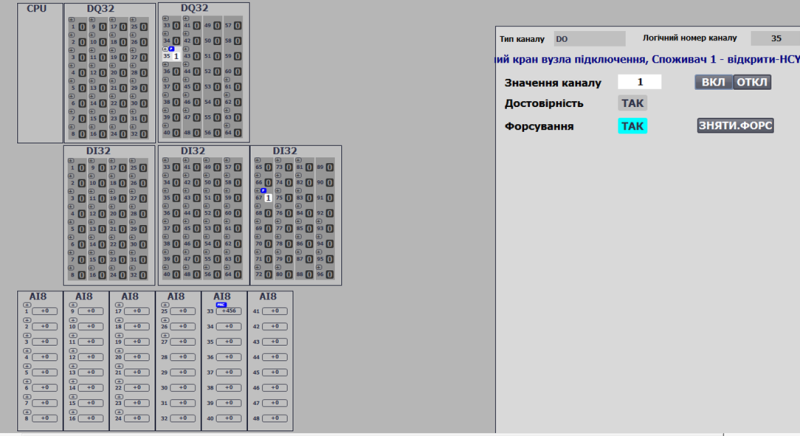
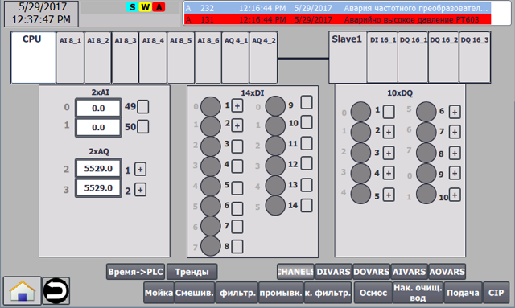

## 1.3 Ієрархія устатковання в PACFramework

Рівень модулів керування є характерним для всіх типів виробництв, тому він пророблений в каркасі найкраще. Устатковання для інших рівнів використовується за необхідності. 

### Ієрархія устатковання рівня CM

#### Ієрархія CM

ISA-88 та ISA-95 дозволяє включати модулі керування (CM) в інші модулі керування. У каркасі, незалежно від типу технологічного процесу, яким керує АСКТП, на рівні **модулів керування** (**Control Module**) виділяються типові апаратурні об'єкти принаймні 3-х рівнів (див. рис.1.3.1):

- LVL0 (**channels**) - **канали контролеру**: для діагностики каналу, прив'язки логічних каналів до фізичних, форсування входів/виходів:

  - CHDI - дискретні входи,

  - CHDO - дискретні виходи,

  - CHAI - аналогові входи,

  - CHAO - аналогові виходи,

  - CHCOM -- комунікаційні канали

    Крім цього до даного рівня відносяться інші об'єкти що забезпечують роботу з каналами, зокрема `MODULS` - відображення стану модулів та інтерактивна взаємодія з ними для діагностики каналу (див. карта ПЛК).   

-   LVL1 (**process variables**) - технологічні змінні для повної обробки інформації з процесу, включаючи прив'язку до каналу, фільтрацію, масштабування, інверсію і т.п.; для зручності відлагодження процесу; для функцій імітаційного моделювання; для функцій технологічної сигналізації;
    
    -   AIVAR - аналогові вхідні,
    
    -   AOVAR - аналогові вихідні,
    
    -   DIVAR - дискретні вхідні,
    
    -   DOVAR - дискретні вихідні:
    
-   LVL2 (**devices**) - рівень пристроїв та виконавчих механізмів: для зручності налагоджування процесу; для функцій імітаційного моделювання; для функцій технологічної сигналізації; для ведення статистики:
    
    -   виконавчі механізми (запірні клапани, регулюючі клапани, двигуни, насоси);
    -   контури регулювання та управління: для функцій керування зі зворотним зв'язком;
    -   інші пристрої, що включають кілька технологічних змінних та мають окремо виділені стани 

Рис.1.3.1. Ієрархія CM.

Усі наведені вище елементи з точки зору ISA-88 є Модулями керування (CM, Control Module), а з точки зору ISA-106 -- Пристроями (Device). Для уніфікації назв ми користуємося термінологією ISA-88, як діючою на сьогоднішній день. Усі CM-ми формують трирівневу ієрархію, що дозволяється стандартом ISA-88.

Трирівнева архітектура передбачає модель взаємодії між рівнями:

-   обробка усіх елементів незалежно від рівня проводиться паралельно, тобто вкладеності виклику POU немає, модель підлеглості реалізовується через механізм заволодівання (Allocation), або звичайними програмними зв'язками;

-   2-й рівень (виконавчий механізм, регулятор) не може взаємодіяти безпосередньо з 0-м (каналом);

-   усі елементи вищого рівня можуть взаємодіяти з будь-якими елементами нижчих, за винятком 0-го рівня (див. попередній пункт)

-   вищий рівень може змінювати стан нижчого: змінювати його значення, переключати в різні режими (форсування, імітація), змінювати налаштування тривог і т.д.

-   елемент 1-го рівня (змінні) може заволодіти (allocation) елементом 0-го (канали)

-   0-й рівень (канал) знає хто ним володіє

-   1-й рівень (змінна) знає ким він володіє

-   при реалізації об'єктів на різних пристроях (в розподілених системах) механізм взаємодії між ними відбувається через пару СТАН-КОМАНДА (механізм описаний нижче) а при реалізації в тому ж пристрої дозволяється використовувати як безпосередню зміну значення у підлеглого об'єкту (прямий доступ), так і через взаємодію СТАН-КОМАНДА.

#### Канали (LVL0) та карта ПЛК

Найнижчий рівень модулів керування (**канали**) забезпечує абстрагування від конкретики пристроїв (ПЛК, розподілена периферія, тощо). Тобто реалізація цього рівня залежить як від вибраної платформи так і способу реалізації. Елементи CM типу «канали» представляють масиви усіх існуючих каналів контролеру, незалежно від їх розташування (локальне шасі, віддалений ввод/вивід) і задіяння (використання) в процесі. Кожен елемент масиву ідентифікується за унікальним номером, а прив'язка до фізичного каналу відбувається жорстко на програмному рівні. CM-ми типу «канал» прив'язують свої значення до фізичного значення конкретного каналу, а також виконують наступні функції:

-   надають діагностичну інформацію вищим рівням CM -- як мінімум ознаку достовірності, а за можливості і причину відмови/несправності каналу;

-   передбачають режим форсування значення:

    -   примусова зміна значення вхідного каналу, незалежно від значення входу;

    -   примусова зміна значення вихідного каналу, незалежно від значення, що передається на нього змінною;

-   показують факт прив'язки до каналу технологічної змінної та номер змінної;

На рис.1.3.2-1.3.4 показані приклади дисплейних кадрів з реалізацією вказаних функцій на різних платформах з різними ресурсними обмеженнями. Такі мнемосхеми надалі в каркасі звуться **картою ПЛК**. Символом «+» відмічені задіяні в ПЛК канали. Інформація по кожному каналу доступна по натисканню на ньому. На карті ПЛК доступні функції відображення прив'язаного каналу, ознака достовірності, команди форсування. У випадку апаратної помилки канал підсвічується червоним. У реалізаціях з дуже обмеженими можливостями можливо відмовитися від певних функцій, якщо це значно ускладнює систему або вимагає задіювання надмірно великої частини ресурсів (див. приклад рис.1.3.4).

Рис.1.3.2 Приклад використання функцій каналів на HMI (варіант з достатніми ресурсами Simatic Comfort Panel: TIA).

Рис.1.3.3 Приклад використання функцій каналів на HMI (варіант з середніми ресурсами Magelis: VijeoDesigner).

Рис.1.3.4 Приклад використання функцій каналів на HMI (варіант з обмеженими ресурсами Simatic Basic Panel TIA).

#### Технологічні змінні (LVL1) та карта змінних

СМ-ми першого рівня, типу **технологічні змінні** можуть бути прив'язані до каналу того ж типу (наприклад дискретний вхід до дискретної вхідної технологічної змінної) по їх номеру. Таким чином прив'язка технологічної змінної до каналу є динамічною, що дозволяє змінювати розташування фізичного підключення конкретного датчика/ВМ у випадку виходу з ладу частини системи. Крім того, таке переключення може бути програмним.

Технологічні змінні знаходяться вище за канали по ієрархії керування. Уся діагностична інформація передається від каналів до змінних. Реалізація цього рівня не залежить від апаратних особливостей контролера, так як усі платформо-залежні тонкощі реалізується на рівні каналів, інтерфейс яких є стандартизованим в каркасі. Технологічні змінні забезпечують наступну функціональність:

-   прив'язка до каналу за його номером та типом

-   відключення з обслуговування (деактивація тривог змінної, врахування верхніми рівнями)

-   відслідковування достовірності значення за помилкою прив'язаного каналу, виходу за діапазон вимірювальної величини, тощо;

-   діагностика роботи каналу (передача діагностичної інформації з прив'язаного

каналу на верхній рівень)

-   обробка вхідного/вихідного значення: масштабування (в т.ч. за необхідністю кусочно-лінійна інтерполяція), фільтрування, інвертування (для дискретних змінних);

-   наявність режиму ручної зміни (форсування); відповідно до ISA-88 - «ручний режим»

-   наявність режиму імітації, в якому для вхідних змінних, значення змінюється CM-мами верхнього рівня (або незалежною програмою), а для вихідних змінних, відбувається замороження значень вихідних каналів

-   обробка тривог (ISA 18.2): реагування на порогові значення, врахування затримки на спрацювання (за необхідності межі задаються окремими уставками), гістерезис, формування загального системного біту аварії/попередження, нова тривога (на один цикл);

-   конфігурування обробки тривог (ISA 18.2): налаштування значень тривог, типів тривог (аварія/попередження/відмова каналу), тимчасове зняття тривоги з обслуговування;

Приклад діагностики та конфігурування аналогових змінних на HMI показаний на рис.1.3.5 та рис.1.3.6 Вікна де наводяться перелік всіх технологічних змінних в каркасі називається **картою технологічних змінних**.

Рис.1.3.5 Приклад використання функцій аналогових вхідних змінних на HMI.

Рис.1.3.6 Приклад використання функцій аналогових вихідних змінних на HMI.

Статуси змінних (тривоги, відмови, форсування) супроводжують відображення змінної на всіх мнемосхемах HMI. На рис.1.3.7 показаний приклад відображення попередження для змінної PT102 для панелі з обмеженою функціональністю (Simatic Basic Panel).

 

Рис.1.3.7 Приклади відображення статусу змінної HMI.

Окремо можуть бути виділені такі технологічні змінні:

-   мережні - мають джерело даних на інших вузлах (мережні), адреса якого не може змінюватися в процесі експлуатації

-   розрахункові (внутрішні) - розраховуються на базі кількох інших змінних або каналів

Передбачається, що ці змінні будуть входити як підкласи в AIVAR, AOVAR, DIVAR, DOVAR. У функціях обробки необхідно передбачити особливість обробки цих змінних відповідно до номеру класу (CLSID) або за ID. Для зручності область ідентифікаторів (ID) для змінних також варто виділити окремо.

#### Модулі керування, контури, ВМ (LVL2)

CM-ми 2-го рівня представляють собою виконавчі механізми, регулятори, тощо та включають в себе функції базового керування (згідно термінології ISA-88). Кожний такий CM передбачає двохсторонню взаємодію з «технологічними змінними» як для запису так і для читання. Це дозволяє на даному рівні окрім реалізації специфічного функціоналу для конкретного CM, забезпечувати наступні можливості:

-   враховувати стан технологічної змінної (норма/тривога/достовірність) та діагностичну інформацію при керуванні логікою виконання CM;

-   імітацію роботи CM за допомогою включеного в нього моделюючого алгоритму (за необхідністю) для:

    -   розширеної моделеорієнтованої діагностики процесу;

    -   моделеорієнтованого керування;

    -   роботи в імітаційному режимі для демонстрації/навчання персоналу або налагодження системи;

-   включення в режим імітації CM та всіх пов'язаних з ним CM нижчого рівня;

-   статистичну інформацію (в залежності від типу СМ)

Для кожного апаратурного об'єкту (Equipment Entity) визначається алгоритм роботи функціонального блоку/функції, структури даних (інтерфейс) для обміну з іншими підсистемами/об\'єктами.

Структура даних та поведінка функції/ФБ сумісна з означеною в ISA-88, тобто базується на автоматах станів, режимах та інтерфейсі, означеному в стандарті.

На рис.1.3.8 показаний приклад конфігурування та діагностики роботи кранів.

Рис.1.3.8 Приклад конфігурування кранів на HMI.

### Рівень SCADA/HMI 

#### Загальні принципи розробки SCADA/HMI

Каркас передбачає використання певних правил і на рівні SCADA/HMI. Імплементація каркасу для платформ з різними функціональними можливостями показала здатність масштабування та адаптації каркасу для обладнання та ПЗ з різними можливостями. У будь якому випадку концепція вимагає передачі великої кількості даних, що значно здорожує систему у випадку ліцензування SCADA/HMI по кількості тегів вводу/виводу. Для зменшення навантаження на мережу та економії тегів вводу/виводу прийняті наступні принципи:

-   розділення розміщення даних реального часу від конфігураційних даних;

-   пакування бітів в слова, відмова від бітових (булевих) структур для обміну з HMI;

-   використання буферу для конфігурування однотипних об'єктів

Більш детально наведені принципи описані нижче. Хоч каркас не обмежує використання HMI у цих та всіх інших аспектах, ми рекомендуємо використовувати методики описані в стандартах ISA18.2 та ISA101.

#### Принципи використання буферного обміну

Окрім даних реального часу (RT DATA - значення змінних, статуси) з кожним CM пов'язана велика кількість конфігураційних даних (CFG DATA), які потрібно передавати в/зі SCADA/HMI тільки за необхідністю. Більшість SCADA/HMI ліцензуються за кількістю точок вводу/виводу. Тому для зменшення великої кількості конфігураційних даних що циркулюють між SCADA/HMI та контролером пропонується використовувати **буфер**. Для кожного масиву (набору) однотипних CM або інших об'єктів рекомендується використовувати свій буфер. Окремі буфери можна застосовувати для всіх об'єктів рівня. Тобто, наприклад, для усіх каналів (LVL0), змінних (LVL1) пристроїв (LVL2) можна виділити окремі буфери. Кожен CM має унікальний в межах набору ідентифікатор (може використовуватися унікальне поєднання ID та ідентифікатору класу CLSID), за яким можна його зв'язати з буфером (див. рис.1.3.9). Отримуючи команду на читання (READ\_CFG), CM завантажує свої дані в буфер та пов\'язується з ним (займає/оволодіває ним). Дані реального часу (RT DATA) постійно оновлюються в буфері, за цим слідкує реалізація CM в контролері. Це можуть бути не тільки видимі RT DATA, а додаткові відлагоджувальні дані (номер кроку, час кроку, значення інтеграла і т.п.). Конфігураційні дані оновлюються в буфері тільки по команді на читання. Це зроблено для того, щоб оператор міг змінити ці значення в буфері і записати їх в CM за командою (WRITE\_CFG).

Рис.1.3.9 Принципи використання буферу при обміні конфігураційними даними 

Не дивлячись на значну економію ресурсів, використання буферу супроводжується рядом обмежень. Найбільш суттєвим обмеженням є неможливість використання буферу з 2-х та більше засобів ЛМІ. При одночасному використанні, буфер \"відбирається\" останнім користувачем. Також в каркасі наразі не пророблений механізм блокування буферу, для унеможливлювання його одночасного використання. Вирішенням може бути використання кількох буферів - для кожного клієнта окрема змінна.

Інший можливий спосіб конфігурування через буфер -- використання принципів REST(*Representational State Transfer*). Буфер не займається об'єктом, а передається окремою змінною. При запиті на читання від клієнта (SCADA/HMI або іншої підсистеми), заповнення відбувається аналогічно до попереднього способу. В змінній буфера передається уся заповнена структура, по ID і CLSID визначається об'єкт, дані про який передаються. Значення з буферу після читання записується у внутрішню змінну клієнта, після чого сеанс завершується. Навіть при одночасному зверненні, клієнт зможе проконтролювати результат запиту на читання. Аналогічно проводиться запис: спочатку проводяться зміни в локальній змінній-буфері клієнта, після чого вміст змінної копіюється в буфер ПЛК. На відміну від механізму займання буферу, оновлення змінних в буфері клієнта може відбуватися тільки постійним формування запиту на читання. Крім того, деякі засоби SCADA/HMI мають обмеження на пере-присвоєння та збереження цілісності структури буферу, що унеможливлює використання такого підходу. Однак такий підхід є кращим при реалізації рішень IIoT з використанням каркасу, так як не передбачає постійний обмін між хмарою (Cloud) та пристроєм за місцем (ПЛК, Edge).

Іншим недоліком обміну конфігураційними даними через буфер є відмова від табличних виглядів карт ПЛК та технологічних змінних. На практиці є рішення, які дозволяють обійти це обмеження, але цей варіант вимагає значних затрат на написання скриптів з боку SCADA/HMI, що не завжди можливо.

Досить зручним на практиці виявився механізм так званого \"**контекстного налаштування**\". У цьому випадку, виклик вікна налаштування (налагодження) відбувається в місці відображення CM на основних мнемосхемах. Це значно пришвидшує налагодження, так як не потребує перехід на карти технологічних змінних задля форсування, зміни налаштувань, тощо. Наразі цей механізм був випробуваний на кількох проектах як зі SCADA так і з HMI. З боку контролеру ніяких додаткових функцій не прописується, так як використовується той самий механізм буферів. З боку SCADA/HMI необхідно передбачити подію для графічних елементів, яка б ініціювала читання в буфер (вибір). Для SCADA це може бути пункт контекстного меню, для HMI -- натискання на частині елементу відображення, тощо.

Рис.1.3.10 Приклад контекстного налаштування: права кнопка миші -- виклик спливаючого екрану з функціями налаштування (реалізація в SCADA Citect).

#### Панель статусу

На засобах ЛМІ рекомендується використовувати панель статусу для відображення загального стану процесу (наприклад, як на рис.1.3.11). Це може бути:

-   наявність ручного режиму хоча б на одному з виконавчих механізмів

-   наявність форсування хоча б на одному з CM

-   наявність режиму імітації хоча б на одному з CM

-   наявність хоча б одної тривоги рівня \"попередження\"

-   наявність хоча б одної тривоги рівня \"аварія\"

-   наявність хоча б одної тривоги рівня \"недостовірність\"

-   тощо

Рис.1.3.11. Можливий вигляд панелі статусу.

Панель статусу миттєво дає представлення про стан системи і нагадує про необхідність зміни режиму. Подібні механізми використовуються в ПЛК, в якому індикаторні лампи показують про стан модуля або усього пристрою. Так, наприклад, в режимі форсування, на ПЛК S7 300 горить відповідний індикатор. Аналогічно для технологічного процесу або установки можуть використовуватися світлосигнальні лампи.

[До розділу](README.md)

