[PACFramework](../README_EN.md) > [1. Core Concepts](README_EN.md)

## 1.3 Equipment Hierarchy in PACFramework

The control module level is relevant for all types of production and is therefore the most thoroughly developed within the framework. Equipment at other levels is used as needed.

### Equipment Hierarchy at the CM Level

#### CM Hierarchy

ISA-88 and ISA-95 allow control modules (CMs) to be included within other control modules. Within the framework, regardless of the type of technological process controlled by the IACS, the **Control Module** level identifies typical instrumentation objects across **at least three levels** (see Fig. 1.3.1):

- **LVL0 (channels)** – **controller channels** used for channel diagnostics, mapping logical channels to physical channels, and forcing inputs/outputs:

  - CHDI – digital inputs,
  - CHDO – digital outputs,
  - CHAI – analog inputs,
  - CHAO – analog outputs,
  - CHCOM – communication channels.

  This level also includes other objects for channel management, such as `MODULS` for displaying module status and enabling interactive diagnostics (see PLC map).

- **LVL1 (process variables)** – “process variables for complete process data handling, including channel mapping, filtering, scaling, inversion, etc., aiding process debugging, simulation, and alarm functions:

  - AIVAR – analog inputs,
  - AOVAR – analog outputs,
  - DIVAR – digital inputs,
  - DOVAR – digital outputs.

- **LVL2 (devices)** – devices and actuators, aiding in process debugging, simulation, alarms, and statistics:

  - Actuators (shut-off valves, control valves, motors, pumps),
  - Control and regulation loops (feedback control),
  - Other devices with multiple process variables and distinct states.

Fig. 1.3.1. CM Hierarchy.

All the above elements are **Control Modules (CMs)** under ISA-88, and **Devices** under ISA-106. For consistency, ISA-88 terminology is used throughout the framework. All CMs form a three-level hierarchy allowed by ISA-88.

The three-level architecture assumes an interaction model between levels:

- All elements are processed in parallel regardless of level, with no nested POU calls; subordination is implemented via **allocation mechanisms** or standard software links.
- Level 2 (devices, actuators, controllers) cannot interact directly with level 0 (channels).
- Higher-level elements can interact with any lower-level elements except level 0.
- Higher levels can change the state of lower levels (values, modes, forcing, simulation, alarm settings).
- Level 1 variables can **allocate** level 0 channels.
- Level 0 channels know which variable owns them.
- Level 1 variables know which channels they own.
- In distributed systems, interaction occurs via **STATE-COMMAND pairs** (described later), while on the same device, direct value changes or STATE-COMMAND interaction may be used.

#### Channels (LVL0) and PLC Map

The **lowest level (channels)** abstracts device-specific details (PLC, distributed I/O, etc.). Implementation depends on the platform and approach used. CM elements of the “channel” type represent all controller channels regardless of location or current use. Each element is uniquely identified, with hardcoded mapping to the physical channel. These CMs perform:

- Diagnostic reporting (validity flags, error cause if possible),
- Forcing modes:
  - Forcing input channel values regardless of the actual input,
  - Forcing output channel values regardless of variable output,
- Showing channel-variable linkage and variable numbers.

Figures 1.3.2–1.3.4 illustrate **PLC map** HMI screens for these functions across platforms with different resource constraints, showing active channels with “+” and enabling diagnostics, forcing, and validity checks. Channels in hardware error state are highlighted in red. On highly resource-constrained systems, some functions may be omitted.

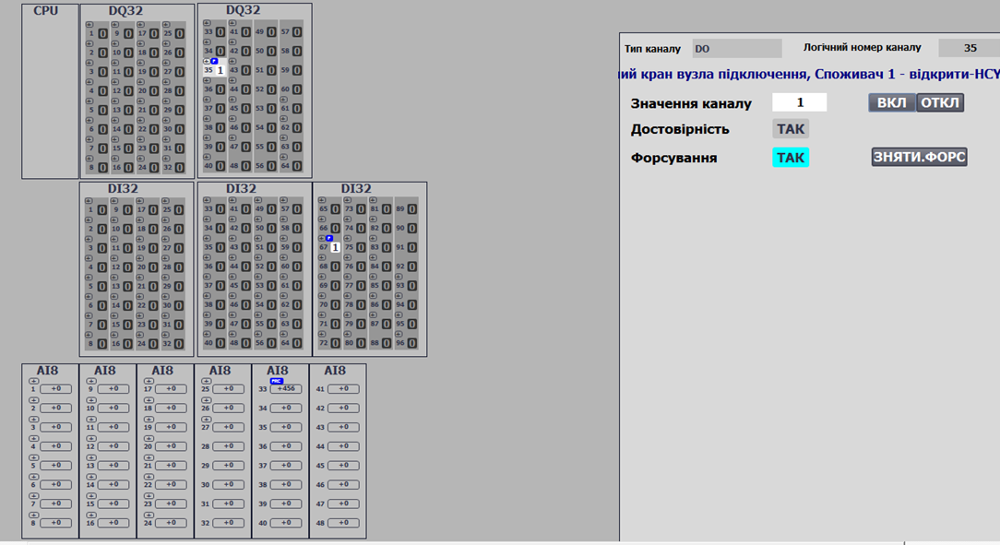

Fig. 1.3.2 Example: HMI channel functions with sufficient resources (Simatic Comfort Panel: TIA).

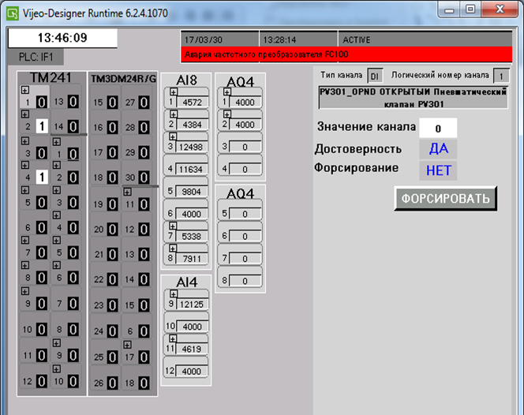

Fig. 1.3.3 Example: HMI channel functions with moderate resources (Magelis: VijeoDesigner).

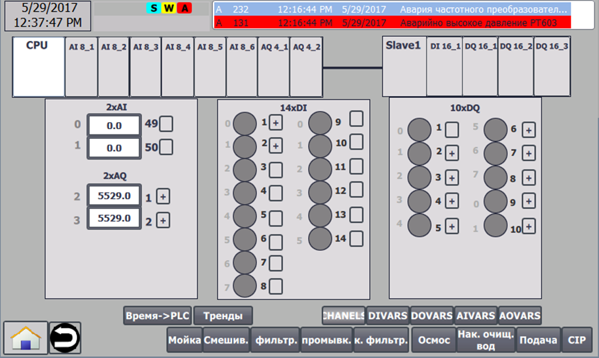

Fig. 1.3.4 Example: HMI channel functions with limited resources (Simatic Basic Panel: TIA).

#### Process Variables (LVL1) and Variable Map

Level 1 CMs (**process variables**) can dynamically bind to channels of the same type (e.g., digital input to digital input variable) by number, allowing sensor/actuator reassignment if part of the system fails, or software-based switching.

Process variables sit above channels in the control hierarchy and inherit diagnostics from channels. Their implementation is platform-independent due to the standardized CM channel interface. They provide:

- Channel linkage by number and type,
- Maintenance disablement (alarm suppression, higher-level consideration),
- Validity tracking (linked channel error, measurement out of range),
- Diagnostics (channel diagnostic data propagation),
- Input/output processing (scaling, piecewise-linear interpolation, filtering, inversion),
- Manual mode (forcing, ISA-88 “manual mode”),
- Simulation mode (upper-level CM or independent program changes input values; output values freeze),
- Alarm handling (ISA 18.2): thresholds, delays, hysteresis, system alarm bits, one-cycle new alarm flags,
- Configurable alarm handling: alarm values, types (fault/warning/channel failure), maintenance bypass.

Figures 1.3.5 and 1.3.6 show analog variable configuration and diagnostics on HMI, within a **variable map** listing all framework variables.

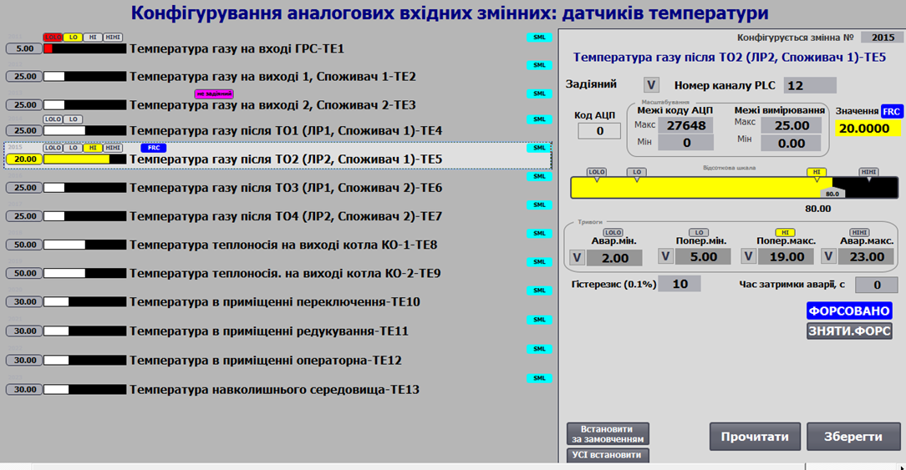

Fig. 1.3.5 Analog input variable functions on HMI.

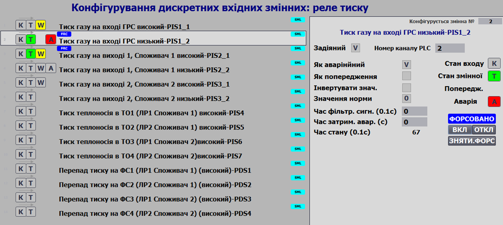

Fig. 1.3.6 Analog output variable functions on HMI.

Variable statuses (alarms, faults, forcing) are displayed consistently across all HMI screens. Fig. 1.3.7 shows a warning indicator for variable PT102 on a limited-functionality panel (Simatic Basic Panel).

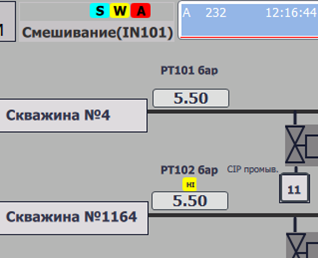 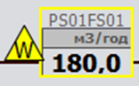

Fig. 1.3.7 Variable status display examples on HMI.

Special types of process variables include:

- **Network variables** (data sourced from other nodes, with fixed addresses),
- **Calculated (internal) variables** (computed from multiple variables or channels).

These are subclasses of AIVAR, AOVAR, DIVAR, DOVAR, and require ID or CLSID-based handling in processing functions. A dedicated ID namespace is recommended.

#### Control Modules, Loops, Actuators (LVL2)

Level 2 CMs represent actuators, controllers, etc., including **basic control functions** (ISA-88 terminology). Each CM:

- Supports bidirectional interaction with process variables,
- Enables:
  - State/diagnostic consideration in control logic,
  - Simulation using built-in models (for advanced diagnostics, model-based control, demo/training),
  - CM-level and lower-level CM simulation,
  - Statistics tracking (depending on CM type).

For each equipment entity, functional block/function algorithms and data structures (interfaces) are defined for subsystem/equipment interaction.

Data structures and behaviors align with ISA-88, using **state machines, modes, and standard interfaces**.

Fig. 1.3.8 shows an HMI example for valve configuration and diagnostics.

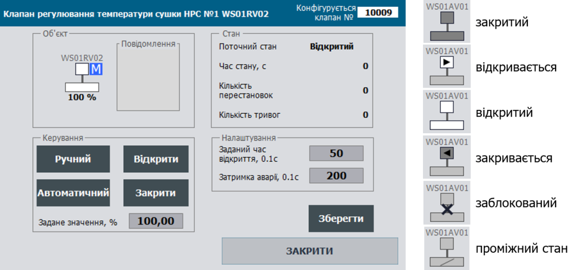

Fig. 1.3.8 Example: HMI valve configuration.

### SCADA/HMI Level

#### General SCADA/HMI Development Principles

The framework also defines rules at the SCADA/HMI level. Implementation across platforms shows scalability and adaptability. However, transmitting large data volumes increases system costs when SCADA/HMI licensing is I/O-point based.

To reduce network load and I/O tag usage:

- Separate real-time data from configuration data,
- Pack bits into words, avoid Boolean structures for HMI exchanges,
- Use buffers for configuring similar objects.

The framework recommends ISA 18.2 and ISA 101 methodologies for alarm and HMI design.

#### Buffer Exchange Principles

Each CM has significant configuration data (CFG DATA) beyond real-time data (RT DATA). Since SCADA/HMI licenses are often I/O-point based, **buffers** are used for configuration data exchange, reducing load.

Buffers are recommended per CM set/type (LVL0, LVL1, LVL2). Each CM has a unique ID and CLSID for buffer association (see Fig. 1.3.9).

- On a **READ_CFG** command, the CM loads data into the buffer.
- RT DATA updates in the buffer continuously.
- CFG DATA updates only on explicit commands, allowing operators to edit and then **WRITE_CFG** to the CM.

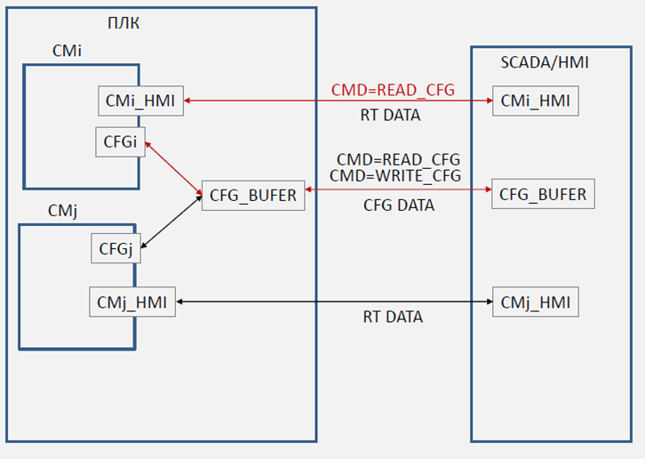

Fig. 1.3.9 Buffer usage principles for configuration data exchange.

**Limitations:**

- A buffer cannot be used by multiple HMI clients simultaneously.
- No locking mechanism is currently implemented in the framework.
- Multiple buffers may be used for multi-client systems.

**Alternative REST-like buffer handling:**

- Entire buffer structures are passed and updated using READ/WRITE commands.
- Clients copy buffer data into local variables and end the session post-transfer.
- Useful in IIoT/cloud contexts with low continuous bandwidth requirements.

**Disadvantage:** Disables PLC/variable map tabular views unless workarounds/scripts are used.

**Contextual Configuration:**
A practical method enabling configuration screens directly from primary mimic screens, speeding up commissioning without switching to variable maps. Implemented in multiple SCADA/HMI projects, requiring:

- Controller-side: no additional functions.
- SCADA/HMI-side: graphic element triggers for buffer reads (e.g., context menu in SCADA or click areas on HMI).

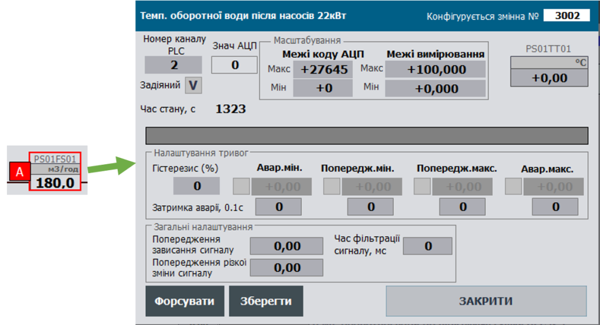

Fig. 1.3.10 Contextual configuration example: right-click pop-up for configuration (SCADA Citect).

#### Status Panel

A status panel (Fig. 1.3.11) on HMI displays overall system states, such as:

- Manual mode active on any actuator,
- Forcing active on any CM,
- Simulation active on any CM,
- Active “warning” alarms,
- Active “fault” alarms,
- Active “invalid” alarms.

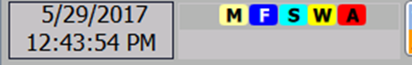

Fig. 1.3.11 Example status panel.

The status panel provides instant system overview and mode change reminders, similar to PLC indicator lights (e.g., S7-300 forcing mode indicator) or process warning lamps.

<-- [1.2 Basic technologies based on the framework](1_2_tech_en.md)

--> [1.4 General requirements for the implementation of the PACFramework interface](1_4_if_en.md)

