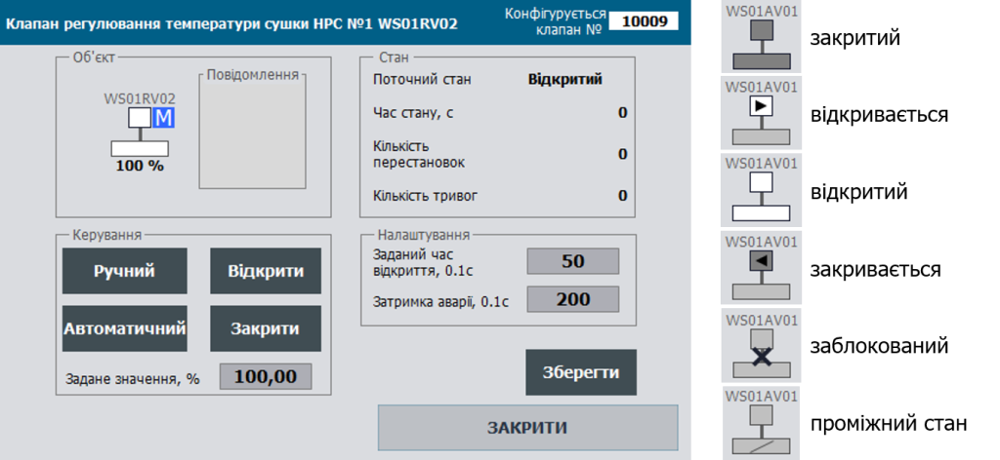
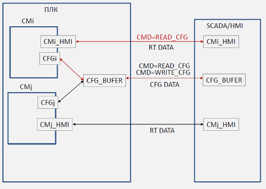

This text was translated using Google Translate. You can comment on the translation in [this topic](https://github.com/pupenasan/PACFramework/issues/52)

## 1.3 Equipment Hierarchy in the PACFramework

The level of control modules is typical for all types of production, so it is best designed in the Framework. Equipment for other levels is used as needed.

### CM level Equipment hierarchy

#### CM Hierarchy

ISA-88 and ISA-95 allow you to include control modules (CM) in other control modules. In the framework, regardless of the type of technological process controlled by ICS, at the level of **control modules** (CM) there are typical hardware objects of at least 3 levels (see Fig.1.3.1):

- LVL0 (**channels**) - **controller channels**: for channel diagnostics, binding of logical channels to physical ones, forcing of inputs/outputs:

  - CHDI - digital inputs,

  - CHDO - digital outputs,

  - CHAI - analog inputs,

  - CHAO - analog outputs,

  - CHCOM - communication channels

  In addition, this level includes other objects that provide work with channels, in particular `MODULS` - display the status of modules and interactive interaction with them for channel diagnostics (see PLC map).

- LVL1 (**process variables**) - variables for complete processing of information from the process, including channel binding, filtering, scaling, inversion, etc .; for the convenience of debugging the process; for simulation functions; for process alarm functions;

  - AIVAR - analog input,

  - AOVAR - analog output,

  - DIVAR - digital input,

  - DOVAR - digital output: 

- LVL2 (**devices**) - level of devices and actuators: for the convenience of debugging the process; for simulation functions; for process alarm functions; for statistics:

  - actuators (shut-off valves, control valves, motors, pumps);
  - control loops: for feedback control functions;
  - other devices that include several process variables and have separate states

Рис.1.3.1. CM Hierarchy.

All of the above elements in terms of ISA-88 are Control Modules (CM), and in terms of ISA-106 - Devices. To unify the names, we use ISA-88 terminology as it is valid today. All CMs form a three-tier hierarchy, as permitted by the ISA-88 standard.

The three-level architecture provides a model of interaction between levels:

- processing of all elements regardless of the level is carried out in parallel, ie there is no nesting of the POU call, the model of subordination is implemented through the mechanism of Allocation, or the usual software links;

- 2nd level (actuator, controller) can not interact directly with the 0th (channel);

- all higher level elements can interact with any lower level elements except level 0 (see previous paragraph)

- the higher level can change the state of the lower: change its value, switch to different modes (forcing, simulation), change the alarm settings, etc.

- element of the 1st level (variables) can allocation element of the 0th (channels)

- Level 0 (channel) knows who owns it

- Level 1 (variable) knows who he owns

- when implementing objects on different devices (in distributed systems) the mechanism of interaction between them is through a pair STATE-COMMAND (the mechanism is described below) and when implementing in the same device can be used as a direct change of value of the slave object (direct access ) and through the interaction of the STATE-COMMAND .

#### Channels (LVL0) and PLC map

The lowest level of control modules (**channels**) provides abstraction from the specifics of devices (PLC, distributed peripherals, etc.). That is, the implementation of this level depends on both the chosen platform and the method of implementation. CM elements "channels" represent the arrays of all existing channels of the controller, regardless of their location (local chassis, remote I/O) and involvement (use) in the process. Each element of the array is identified by a unique number, and binding to the physical channel is rigid at the software level. CMs of the "channel" type bind their values to the physical value of a particular channel, and also perform the following functions:

- provide diagnostic information to higher levels of CM - at least a sign of reliability, and if possible, the cause of failure of the channel;

- provide a mode of forcing the value:

     - forced change of the value of the input channel, regardless of the value of the input;

     - forced change of the value of the output channel, regardless of the value transmitted to it by the variable;

- show the fact of binding to the channel of the process variable and the number of the variable;

Figure 1.3.2-1.3.4 shows examples of display frames with the implementation of these functions on different platforms with different resource constraints. Such mnemonics in the framework of the framework are called **PLC map**. The "+" symbol indicates the channels involved in the PLC. Information on each channel is available by clicking on it. On the PLC map, the functions of displaying the linked channel, the indication of authenticity, and the boost command are available. In the event of a hardware error, the channel is highlighted in red. In implementations with very limited capabilities, it is possible to abandon certain functions if it significantly complicates the system or requires the use of too many resources (see example in Fig.1.3.4).

Рис.1.3.2 Example of using channel functions on HMI (option with sufficient resources Simatic Comfort Panel: TIA).

Рис.1.3.3 Example of using channel functions on HMI (option with medium resources Magelis: VijeoDesigner).

Рис.1.3.4 Example of using HMI channel functions (limited resource option Simatic Basic Panel TIA).

#### Process Variables (LVL1) and Variable Map

SMs of the first level, type **process variables** can be tied to a channel of the same type (for example, a digital input to a digital input process variable) by their number. Thus, the binding of the process variable to the channel is dynamic, which allows you to change the location of the physical connection of a particular sensor/actuator in the event of failure of part of the system. In addition, such switching can be software.

Process variables are higher than the channels in the control hierarchy. All diagnostic information is transmitted from channels to variables. The implementation of this level does not depend on the hardware features of the controller, as all platform-dependent subtleties are implemented at the level of channels, the interface of which is standardized in the framework. Process variables provide the following functionality:

-   link to the channel by its number and type

-   out from service (deactivation of alarms of a variable, the account of the top levels)
-   tracking the reliability of the value of the error of the tied channel, out of range of the measured value, etc .;
-   diagnostics of the channel (transmission of diagnostic information from the linked channel to the higher level)
-   processing of input/output value: scaling (including, if necessary, piecewise linear interpolation), filtering, inversion (for digital variables);
-   the presence of the mode of manual change (forcing); according to ISA-88 - "manual mode"
-   the presence of simulation mode, in which for input variables, the value is changed by CM-mothers of the upper level (or an independent program), and for output variables, the values of output channels are frozen
-   alarm handling (ISA 18.2): response to threshold values, taking into account delay (if necessary, the limits are set by individual settings), hysteresis, formation of the general system bit of the accident/warning, new alarm (one cycle);
- Alarm handling configuration (ISA 18.2): alarm settings, alarm types (alarm/warning/channel failure), temporary maintenance alarm removal;

An example of diagnostics and configuration of analog variables on HMI is shown in Fig.1.3.5 and Fig.1.3.6 Windows where the list of all process variables in the framework is called **map of process variables**.

Рис.1.3.5 Example of using the functions of analog input variables on the HMI.

Рис.1.3.6 An example of using the functions of analog output variables on the HMI.

Variable statuses (alarms, failures, forcing) accompany the display of a variable on all HMI mnemonics. Figure 1.3.7 shows an example of warning display for variable PT102 for a panel with limited functionality (Simatic Basic Panel).

 

Рис.1.3.7 Examples of displaying the status of the HMI variable.

The following process variables can be singled out:

- network - have a data source on other nodes (network), the address of which can not be changed during operation

- estimated (internal) - calculated on the basis of several other variables or channels

It is assumed that these variables will be included as subclasses in AIVAR, AOVAR, DIVAR, DOVAR. The processing functions must be specific to the processing of these variables according to the class number (CLSID) or ID. For convenience, the area of identifiers (ID) for variables should also be allocated separately.

#### Control modules, loops, actuators (LVL2)

Level2 CMs are actuators, controllers, etc., and include basic control functions (according to ISA-88 terminology). Each such CM involves two-way interaction with "process variables" for both writing and reading. This allows at this level, in addition to the implementation of specific functionality for a particular CM, to provide the following features:

- take into account the state of the process variable (norm/alarm/reliability) and diagnostic information when managing the logic of CM execution;

- simulation of CM operation using the included modeling algorithm (if necessary) for:

    - advanced model-oriented diagnostics of the process;

    - model-oriented control;

    - work in simulation mode for demonstration/training of personnel or debugging of the system;

- switch to simulation mode of CM and all related lower level CM;

- statistical information (depending on the type of CM)

For each Equipment Entity the algorithm of work of the functional block/function, data structure (interface) for exchange with other subsystems/objects is defined.

The data structure and behavior of the function/FB is compatible with that specified in ISA-88, ie based on state machines, modes and interface specified in the standard.

Figure 1.3.8 shows an example of configuration and diagnostics of cranes.

Рис.1.3.8 Example of configuring cranes on HMI.

### SCADA/HMI level

#### General principles of SCADA/HMI development

The framework provides for the use of certain rules at the level of SCADA/HMI. The implementation of the framework for platforms with different functionalities has shown the ability to scale and adapt the framework for hardware and software with different capabilities. In any case, the concept requires the transfer of large amounts of data, which significantly increases the cost of the system in the case of SCADA/HMI licensing by the number of I/O tags. The following principles have been adopted to reduce network load and save I / O tags:

- separation of real-time data placement from configuration data;

- packing bits into words, abandonment of bit (Boolean) structures for exchange with HMI;

- use the buffer to configure the same type of objects

The principles are described in more detail below. Although the framework does not limit the use of HMI in these and all other aspects, we recommend using the techniques described in ISA18.2 and ISA101.

#### Principles of using buffer-based exchange

In addition to real-time data (RT DATA - variable values, statuses), each CM is associated with a large amount of configuration data (CFG DATA), which must be transmitted to/from SCADA/HMI only when necessary. Most SCADA/HMIs are licensed by the number of I/O points. Therefore, to reduce the large amount of configuration data circulating between SCADA/HMI and the controller, it is recommended to use **buffer**. It is recommended to use your own buffer for each array (set) of the same type of CM or other objects. Separate buffers can be applied to all level objects. That is, for example, separate buffers can be allocated for all channels (LVL0), variables (LVL1) devices (LVL2). Each CM has a unique identifier within the set (a unique combination of ID and CLSID) can be used, which can be associated with the buffer (see Figure 1.3.9). Receiving a read command (READ\_CFG), CM loads its data into the buffer and communicates with it (allocate it). Real-time data (RT DATA) is constantly updated in the buffer, followed by the implementation of CM in the controller. This can be not only visible RT DATA, but additional debugging data (step number, step time, integral value, etc.). Configuration data is updated in the buffer only on the read command. This is done so that the operator can change these values in the buffer and write them to the CM on command (WRITE\_CFG).

Рис.1.3.9. Principles of using the buffer when exchanging configuration data

Despite the significant savings in resources, the use of the buffer is accompanied by a number of restrictions. The most significant limitation is the inability to use a buffer of 2 or more HMI tools. When used simultaneously, the buffer is "selected \" by the last user. Also, the buffer locking mechanism has not been developed in the framework so far, in order to prevent its simultaneous use. The solution may be to use multiple buffers - a separate variable for each client.

Another possible way to configure via the buffer is to use the principles of REST (*Representational State Transfer*). The buffer does not deal with the object, but is passed to a separate variable. When you request a read from the client (SCADA/HMI or other subsystem), the filling is similar to the previous method. In the buffer variable all filled structure is transferred, on ID and CLSID the object about which data are transferred is defined. The value from the buffer after reading is written to the internal variable of the client, after which the session ends. Even with a simultaneous request, the client will be able to control the result of the read request. The record is similarly made: first changes are made in the local variable-buffer of the client, after which the contents of the variable are copied to the PLC buffer. Unlike the buffer ignition mechanism, updating variables in the client buffer can only occur by constantly forming a read request. In addition, some SCADA/HMI instrument/software have limitations on reassigning and maintaining the integrity of the buffer structure, making this approach impossible. However, this approach is better when implementing IIoT solutions using a framework, as it does not involve a constant exchange between the cloud (Cloud) and the device in place (PLC, Edge).

Another disadvantage of the exchange of configuration data through the buffer is the rejection of the tabular views of PLC maps and process variables. In practice, there are solutions that can bypass this limitation, but this option requires significant costs for writing scripts by SCADA/HMI, which is not always possible.

The mechanism of so-called  "**contextual configuration**" turned out to be quite convenient in practice. In this case, the call of the setting (debugging) window takes place in the place of display of CM on the main mnemonics. This significantly speeds up debugging, as it does not require switching to maps of technological variables to force, change settings, etc. So far, this mechanism has been tested on several projects with both SCADA and HMI. On the part of the controller, no additional functions are prescribed, as the same buffer mechanism is used. On the part of SCADA/HMI it is necessary to provide an event for graphic elements that would initiate read to the buffer (selection). For SCADA it can be a context menu item, for HMI - clicking on part of the display element, and so on.

Рис.1.3.10 Example of contextual configuration: right mouse button - call a pop-up screen with configuration functions (implementation in SCADA Citect).

#### Status bar

It is recommended to use the status panel on HMI means to display the general state of the process (for example, as in Fig. 1.3.11). It may be:

- the presence of manual mode on at least one of the actuators
- the presence of forcing at least one of the CM
- the presence of the simulation mode on at least one of the CM
- the presence of at least one alarm level "warning \"
- the presence of at least one alarm level "alert\"
- the presence of at least one alarm level "unreliability\"
- etc.

Рис.1.3.11. Status bar view example

The status bar instantly gives an idea of the state of the system and reminds you of the need to change the mode. Similar mechanisms are used in the PLC, in which the indicator lamps show the status of the module or the whole device. For example, in the boost mode, the corresponding indicator on the PLC S7 300 is lit. Similarly, light signals may be used for the process or plant.

<-- [1.2 Basic technologies based on the framework](1_2_tech_en.md)

--> [1.4 General requirements for the implementation of the PACFramework interface](1_4_if_en.md)

