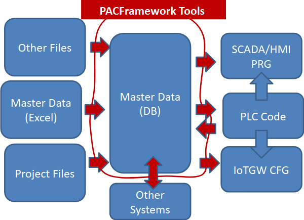
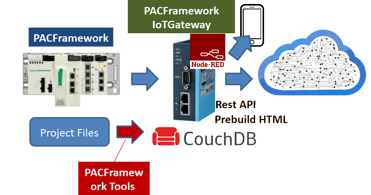

[PACFramework](../README_EN.md)

# 1. Core Concepts

The proposed concepts aim to enable the rapid development of application software for industrial automation and control system (IACS) controllers, taking into account a broad range of typical functional requirements and potential integration with other subsystems.

PFw provides for:

- the use of unified principles for developing software for IEC 61131 (and beyond) programmable controllers across different types of systems with medium (around >100 channels) to high channel count and algorithmic complexity;
- the application of consistent approaches to organizing the control hierarchy;
- a harmonized set of data types and classes of functions/functional blocks suitable for any system.

PFw can be implemented on any hardware, software platform, and programming language that has the capabilities and resources required for its implementation. The proposed interfaces and structures can be modified and extended as needed without violating the overall philosophy.

Additional projects built on PFw bring its use closer to DevOps principles and enable integration into IIoT structures:

- PACFramework Tools (PFwTools)
- PACFramework IoTGateway

**PACFramework Tools (PFwTools)** are utilities for rapid system deployment with a basic set of functions, built on Node.js. Project repository: https://github.com/pupenasan/pacframework-tools.

The utilities are designed for:

- automating PLC deployment using project master data
  - the primary input format is xlsx, with other formats possible as needed (integration with Eplan Electric planned)
  - JSON is used as an intermediate database format for master data
  - preliminary validation is performed (naming rules, object links, addressing, etc.)
- reverse generating project data from the PLC to JSON
  - for deployment in SCADA/HMI and other projects
  - for deployment in PACFramework IoTGateway
  - for transferring to other formats as needed
- validating the correctness of master data
- generating master data reports

In parallel with the development of PFw2, work is also ongoing on PFw2Tools, which will be based on Node-RED and will feature a graphical interface instead of a console-based one. PFw2 is designed with PFw2Tools requirements in mind.

Fig. 1.1 PACFramework Tools Concept

**PACFramework IoTGateway (PFwIoTGateway)** is an execution system project developed in the Node-RED environment, designed to work with PLCs based on PFw to perform the following functions:

- providing a web-based human-machine interface for configuring a control system built on PAC Framework
- IoT gateway functions: data collection, processing, local storage, and interaction with cloud applications and storage systems

PFwIoTGateway can run on any hardware capable of hosting Node-RED. PFwIoTGateway was initially developed as a prototype for a project that was frozen due to Russia’s full-scale invasion of Ukraine, as the facility is currently located in non-government-controlled territory. Considering the ongoing work on PFw2 and the development of Node-RED tools, the new version will differ significantly.

Fig. 1.2 PFwIoTGateway Concept

1.1 [Prerequisites and Core Ideas](1_1_requir_en.md)

1.2 [Core Technologies Behind the Framework](1_2_tech_en.md)

1.3 [Equipment Hierarchy in the PAC Framework](1_3_equip_en.md)

1.4 [General Requirements for Implementing the PAC Framework Interface](1_4_if_en.md)

1.5 [Naming Guidelines for Framework Components and Elements](1_5_naming_en.md)

1.6 [Object Classification Concept and Customization](classes_en.md)

[Main](../README_EN.md)