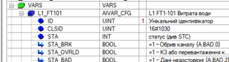
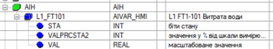
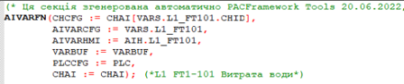
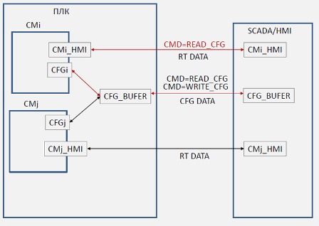
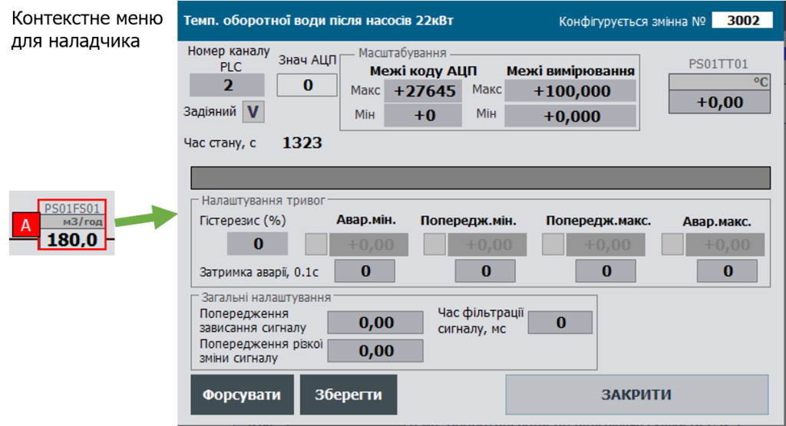

[На основну](..\README.md) [Блог](README.md)

# Навіщо потрібен буфер і які в нього обмеження

Олександр Пупена ([i4u](www.i4u.in.ua))

Цією статею я починаю вести блог на даному ресурсі. Усі інші статті доступні на моїх сторінках з хеш-тегом #PACFramework:

- [facebook](https://www.facebook.com/fieldbusbook)
- [linkedin](https://www.linkedin.com/in/oleksandr-pupena-67aa0b33/)

## Intro

Каркас PACFramework розроблявся (і продовжує розроблятися) з урахуванням великої кількості обмежень ресурсів. З одного боку функціональність потребує виділення додаткової пам'яті та процесорного часу, а з іншого - хочеться використовувати каркас не тільки на топових PLC/PAC, що передбачають застосування у великих проектах, а і на засобах середнього рівня. Зрештою, саме такі здебільшого попадають в поле зору наших ([i4u](https://www.i4u.in.ua/)) робіт. Тому при реалізації кожної функції в каркасі ми намагаємося балансувати між функціональністю і обмеженнями. Цим пояснюється багато фундаментальних функцій каркасу, одна з них - це використання буферу. У цій статті саме про це. 

Навіть якщо Ви не плануєте юзати PACFramework можливо цей підхід переймете у свої рішення, як я колись перейняв його у інших.    

## Дані реального часу та конфігураційні дані

Окрім даних реального часу (значення змінних, статуси) з кожним об'єктом каркасу (CM і не тільки) пов'язана велика кількість конфігураційних даних (CFG). У каркасі під CFG даними ми розуміємо  не тільки дані конфігурації, але всі дані, відносно екземпляру об'єкту. Тобто контролер орудує саме даними CFG, і об'єкти в межах програми контролера взаємодіють на їх основі. З кожним об'єктом зв'язана велика кількість даних, більшість з яких  потрібно передавати в/зі SCADA/HMI тільки за необхідністю. Відмітимо, що:

- передача всієї структури значно навантажує мережу непотрібним трафіком
- більшість SCADA/HMI ліцензуються за кількістю точок вводу/виводу, а отже лишні дані вплинуть на вартість ліцензії  

Тому було прийнято рішення, що дані про об'єкти каркасу будуть розділені на дві частини:

- конфігураційні (**CFG**), що вміщують в себе усі дані об'єкту
- дані реального часу (**HMI**), що вміщують тільки дані для обміну з засобами SCADA/HMI

Так, назви не дуже вдало відображають зміст, але так сталося історично (я трохи скорочену версію розповів ;-) ). Щодо назв, я б вже багато чого змінив в них, але історичний бекграунд заважає.

І CFG і HMI представлені як структурні змінні, які передаються в функцію, що реалізовує функціонал об'єкту, як INOUT. Нагадаю, що в каркасі ми намагаємося використовувати функції замість функціональних блоків (це надає певної гнучкості, але зараз не про це). Структура HMI значно менша ніж CFG. Так, наприклад CFG для аналогової технологічної змінної (`AIVAR_CFG`) має кілька десятків полів, тоді як HMI (`AIVAR_HMI`) - тільки 3.  

Таке виділення звісно трохи збільшило необхідні ресурси контролера, бо добавилась додаткова структура, але з'явилося кілька додаткових можливостей:

- можна обмежувати зміну даних зі SCADA/HMI програмно (додатковий захист)
- за необхідності звернення до змінних за адресою, мапити на адреси треба тільки HMI дані
- дані CFG можна приховати від зовнішнього впливу з мережі
- структуру даних HMI можна адаптувати під конкретні потреби і формат обміну; наприклад для CFG є бітові структури, тоді як для HMI - усі біти пакуються в UINT 

Тим не менше, одна задача при таких підходах залишається під питанням- як змінювати з HMI/SCADA конфігураційні дані? Ось тут і приходять на поміч буфери.  

## Принципи використання буферного обміну

Отже **буфер** - це додаткова структурна змінна, яка в один момент часу слугує як проміжна ланка між SCADA/HMI та конкретним об'єктом того рівня, для якого вона призначена. Розглянемо на прикладі модулів керування (CM). Нагадаю, що в каркасі представлено 3 рівні CM:

- LVL0 - для каналів
- LVL1 - для технологічних змінних
- LVL2 - для пристроїв (ВМ, регуляторів, тощо)    

Для кожного масиву (набору) однотипних CM або інших об'єктів рекомендується використовувати свій буфер. Зрештою можна б було використати один великий буфер для всіх об'єктів, але це незручно і вводить ще додаткові обмеження (не буду вдаватися в подробиці, якщо цікаво - спитаєте, розкажу). 

Так от, окремі буфери застосовуються для всіх об'єктів рівня. Тобто, наприклад, для усіх каналів (LVL0), змінних (LVL1) пристроїв (LVL2) виділені окремі структурні змінні зі своїм типом, що мають поля для задоволення транспорту з будь яким об'єктом рівня. Таким чином в обробку кожного об'єкту передаються три структурні змінні. Трохи про них нижче.  

У `AIVAR_CFG` окрім операційних даних та параметрів міститься ідентифікатор. Кожен CM і відповідно `CM_CFG`  має унікальний в межах набору ідентифікатор об'єкту **ID** і ідентифікатор класу **CLSID**, на рис.1 показано як це виглядить для `AIVAR_CFG`. 

рис.1. Поля ID та CLSID в структурі `AIVAR_CFG`

Для `AIVAR_HMI` таких полів немає, адже це не дані реального часу, там містяться тільки необхідні для обміну зі SCADA/HMI дані (рис.2) 

рис.2. Структура `AIVAR_HMI`

Таким чином три змінні `AIVAR_CFG`, `AIVAR_HMI` та `VARBUF` передаються на обробку функції, призначеної для даного CM (рис.3).

рис.3. Виклик функції обробника технологічних змінних AI.

У даному прикладі в функції обробки CM, окрім обробки аналогових значень (масштабування, тривоги і все інше) передбачена робота з буфером `VARBUF`. Структура `VARBUF` дуже схожа на `AIVAR_CFG`, але містить додаткові поля для задоволення інших CM цього рівня (`DIVAR_CFG`, `DOVAR_CFG`, `AOVAR_CFG`) та містить поле `CMD` для пересилки команд. 

При обміні зі SCADA/HMI, остання може попросити завантажити конфігураційні дані i-го об'єкту в буфер (рис.4). Для цього через змінну `CMi_HMI` відправляється спеціальна команда (умовна назва `READ_CFG`). Отримуючи цю команду, `CMi` завантажує свої дані в буферну змінну та пов\'язується до нього (займає/оволодіває ним). З технічної точки зору, при отриманні команди функція  обробки `CMi` записує `CFG_BUFER=CFGi`, тому `ID` та `CLSID` буфера стає рівним тим, що є в `CFG`. Далі, кожного разу при обробці `CMi` контролює наявність свого об'єкта в буфері перевіряючи рівність `CLSID` та `ID` своєму, і якщо це так (тобто він зараз володіє буфером), обробляє його як на читання так і на запис. Так, при володінні буфером в ньому постійно оновлюються дані реального часу (RT DATA) . Це можуть бути не тільки видимі RT DATA, а додаткові відлагоджувальні дані (номер кроку, час кроку, значення інтеграла і т.п.). Конфігураційні дані оновлюються в буфері тільки по повторному надсиланні команди на читання. Це зроблено для того, щоб наладчик з HMI міг змінити ці значення в буфері і записати їх в CM за командою (WRITE\_CFG).

Рис.4. Принципи використання буферу при обміні конфігураційними даними 

Досить зручним на практиці виявився механізм так званого \"**контекстного налаштування**\". У цьому випадку, виклик вікна налаштування (налагодження) відбувається в місці відображення CM на основних мнемосхемах. Це значно пришвидшує налагодження, так як не потребує перехід на карти технологічних змінних задля форсування, зміни налаштувань, тощо. Наразі цей механізм був випробуваний на кількох проектах як зі SCADA так і з HMI. З боку контролеру ніяких додаткових функцій не прописується, так як використовується той самий механізм буферів. З боку SCADA/HMI необхідно передбачити подію для графічних елементів, яка б ініціювала читання в буфер (вибір). Для SCADA це може бути пункт контекстного меню, для HMI -- натискання на частині елементу відображення, тощо.

Рис.1.3.10 Приклад контекстного налаштування: права кнопка миші -- виклик спливаючого екрану з функціями налаштування (реалізація в SCADA Citect).

Уважний читач побачить, що в прикладі з рис.2 `AIVAR_HMI` не має поля `CMD`, яким чином у цьому відправляється команда? Колись, в попередніх версіях PACFramework, коли каркас ще навіть не мав такої назви, таке поле для CM LVL1 було. Але воно займало аж ціле слово, а використовувалося тільки для однієї команди - `READ_CFG`. Згідно ідеології економії ресурсів (пам'ятаємо про обмеження) це було неприпустимо, тому ми вирішили замість цілого слова використати тільки один біт (останній) зі слова `STA`. Усі ресурси для HMI потоншали відсотків на 30, а для дискретних технологічних змінних полів замість 2-х стало одне (тільки `STA`), тобто в 2 рази менше. Слід також зауважити, що колись фундаментальним принципом нонеймного тоді каркасу було обов'язкове використання полів `CMD` та `STA`  для всіх структур `CFG` та `HMI`, що вже не відповідає дійсності. Так що не все так фундаментально, якщо оптимізувати. 

Для дуже прискіпливих читачів також треба відмітити ще один факт. Так, знаю, слово буфер не дуже вдале, але ... - історичний бекграунд.

## Що не так з буфером?

Не дивлячись на значну економію ресурсів, використання буферу супроводжується рядом обмежень. Найбільш суттєвим обмеженням є неможливість використання буферу з 2-х та більше засобів ЛМІ одночасно. При одночасному використанні, буфер \"відбирається\" останнім користувачем. Також в каркасі наразі не пророблений механізм блокування буферу, для унеможливлювання його одночасного використання. Вирішенням може бути використання кількох буферів - для кожного клієнта окрема змінна. Але це дуже неуніверсально, тому не розглядається. 

У продовження цього є обмеження щодо доступу до буферу з інших програмованих пристроїв, наприклад з IoT Gateway (про нього варто окремі статті в блозі вести, хоча вже робив пости в тему). 

Іншим недоліком обміну конфігураційними даними через буфер є відмова від табличних виглядів карт ПЛК та технологічних змінних, де усі конфігураційні дані відображаються одночасно. 

## Що з цим робити?

Зрештою ця стаття вийшла, бо ми з Ромою Міркевичем почали впроваджувати додатковий механізм роботи через буфери. В його основі стоїть використання принципів обміну з буфером через запит/відповідь, як це робиться в багатьох протоколах. Типовим випадком є використання параметричного обміну з перетворювачами частоти поверх PROFIBUS. Тобто нічого нового, але вимагає додаткової скрптової обробки з боку SCADA або іншого пристрою. Зрештою, цей же принцип планується використовувати і для обміну з IIoTGateway, що приведе до перегляду старої реалізації останньої.

При запиті на читання від клієнта (SCADA/HMI або іншої підсистеми), заповнення відбувається аналогічно до попереднього способу. В змінній буфера передається уся заповнена структура, по ID і CLSID визначається об'єкт, дані про який передаються.  При цьому обміні буфер не займається об'єктом, а передається окремою змінною, вірніше 2-ма: BUFIN та BUFOUT. BUFIN - дані для передачі до CM, а BUFOUT - від CM. Все інше практично те саме. Але весь обмін проходить в один захід, що потребує консистентності даних на рівні структури BUF. Для програмованих пристроїв це не проблема, а от для SCADA/HMI може стати викликом. Тому стандартний механізм роботи з буфером залишається, а добавляється альтернативний. Що ми отримуємо:

Плюси:

- кілька клієнтів можуть користуватися буферним обміном, не "забираючи" буфер один в одного
- механізм IIoT не потребує окремих кусків коду в функціях обробки об'єктів, що підвищує читабельність коду і простоту реалізації   

Мінуси:

- кількість буферів збільшується в 3 рази, стандартний набір такий:
  - LVL0 - три змінні CFG
  - LVL1 - три змінні CFG
  - LVL2 - три змінні CFG на кожну групу класів
- функції трохи ускладняться

У SCADA (або іншого клієнта) цей механізм потребує скриптів і виділення внутрішніх змінних. Значення з буферу після читання записується у внутрішню змінну SCADA, після чого сеанс завершується. Навіть при одночасному зверненні (якщо BUFIN зміниться з різних місць), клієнт зможе проконтролювати результат запиту на читання (BUFOUT містить ID та CLSID). Аналогічно проводиться запис: спочатку проводяться зміни в локальній змінній-буфері клієнта, після чого вміст змінної копіюється в BUFIN контролера. На відміну від механізму займання буферу, оновлення змінних в буфері клієнта може відбуватися тільки постійним формування запиту на читання. 

Як вже відмічалося, багато засобів SCADA/HMI мають обмеження на переприсвоєння та збереження цілісності структури буферу, що унеможливлює використання такого підходу. Навіть для таких випадків є рішення - використання проксі-обєктів. З точки зору реалізації CM нічого не змінюється. Вони спілкуються або напряму через CFG, або через два типи буферів. Проксі займається адаптацією обміну між SCADA/HMI або іншими клієнтами та CM. Таким чином реалізація проксі є скоріше концепцією, ніж частиною каркасу, бо буде сильно залежати від конкретної реалізації (рішення SCADA/HMI, IoT). Слід відзначити, що використання проксі вже практично перевірено для рішення обміну між контролером PACFramework та стильовими рішеннями від Situation Avareness AVEVA Plant SCADA. Але про це буде окрема стаття.    

## Заключення

Не думаю, що історія з буферами на цьому завершиться. PACFramework постійно розвивається. Поки на нього ніхто не "підсів" ми без проблем ламаємо його, якщо ідеологічно він робить певні труднощі в реалізації певного функціоналу. Як тільки Ви приєднаєтеся до нас - ми (вже разом) будемо робити версійність. 

Ну, це типу був заклик до приєднання до юзерів PACFramework!  

9 липня 2022

