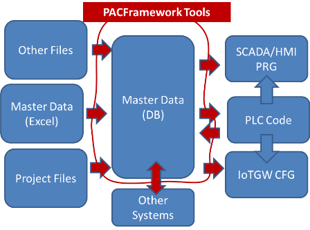

[На основну](..\README.md) [Блог](README.md)

# Автоматизоване розгортання #PACFramework на PLC та SCADA

Олександр Пупена ([i4u](www.i4u.in.ua)) Усі інші статті доступні на:

- [група facebook](https://www.facebook.com/groups/pacframeworkcomunity)
- [моя сторінка linkedin](https://www.linkedin.com/in/oleksandr-pupena-67aa0b33/) з хеш-тегом #PACFramework

## Intro

Не знаю коли вперше з'явилася така мисля. Мені дуже запам'яталася зустріч з  Максимом Романовим років 4 назад, коли він сказав фразу, яка звучала приблизно так: "Ви повинні автоматизувати процеси перетворення контенту від файлу завдання до файлів готового проекту. При цьому при збільшенні замовлень, кількість роботи не буде збільшуватися". Не скажу, що до цієї розмови я про цю ідею не чув. Але Максим прям наполегливо казав що нам треба саме цим зайнятися. Я тоді сказав, що ми ще не доросли, але щось таки вже змінилося...

Потім, одного разу Володя Полупан подав ідею додавання до #PACFramework (**PFW**) такої приблуди, яка б давала можливість підключатися до ПЛК (з розгорнутим PFW) якимось конфігуратором але без додаткових налаштувань (plug & play), як скажімо це робиться з бортовими комп'ютерами автомобілів. Я загорівся ідеєю і почав робити тулзу, яка б автоматично генерувала прошивку для PFW IOTgateway по наявному актуальному проекту. Останній поки залишився на стадії прототипу (проект був в Токмаку), і я маю плани докорінно там щось змінювати в майбутньому. Але зараз не про це, ці роботи над PFW IOTgateway (а може й не вони) почали формувати новий напрям [PACFramewrok Tools](https://github.com/pupenasan/pacframework-tools) - набір утиліт, керованих з під консолі, для автоматизації розроблення. От сьогодні якраз про них.

## PACFramewrok Tools сьогодні      

Там набралося вже досить багато скриптів. Я їх писав під себе, але поступово починаю писати методички для їх використання, бо й сам забуваю, як ними користуватися. До речі, колись вже писав у соц. мережах, що книжки і методички пишу, бо маю погану пам'ять. Так що мушу записувати все що є, інакше не зможу нічого створювати нового. А ви, звісно, можете цим зловживати.

Так от, наприклад, в PFWTools є скрипти, які дозволяють взяти вихідні дані для проекту (т.з. майстердані), які наразі приймаються в табличній формі, наприклад як [masterdata.xlsx](https://docs.google.com/spreadsheets/d/1GvttNOH74X2o9y0fh_qxQCHhfdFszx7m/edit?usp=sharing&ouid=111751208742846482260&rtpof=true&sd=true), і створити з них проект для [Unity PRO](https://github.com/pupenasan/PACFramework/blob/master/platforms/unitypro/deployex1.md) або TIA Portal (методички ще немає), де розгорнеться каркас (усі канали, змінні, ВМ). При цьому цей процес йде через проміжну базу даних (JSON-файли або/та СУБД CouchDB), яку я якось стандартизував. Тобто заздалегідь планував в якості джерела використовувати також інші ресурси, наприклад Eplan Electric.   

З іншого боку, скрипти дозволяють витягувати проектні дані з файлів тих же Unity PRO або TIA Portal, і записувати їх в проміжну БД, для того щоб заюзати готовий деплой для інших деплоїв. Першочергово це використовувалося для PFW IoTgateway, але зараз це юзається частково для автоматичного формування списку тривог для WinCC. І сьогодні я допилив щоб це юзалося для напівавтоматичного розгортання в [Citect](https://github.com/pupenasan/PACFramework/blob/master/platforms/citectsa/deployex2.md) (Plant SCADA): розгортання усіх потрібних Equipment, а потім автоматичне створення джинів для налагодження.  

Навіщо це все, спитаєте ви? Адже можна руцями попрацювати кілька годинок, ну добре, добу, і все буде ок. Так і є, але є одне але... - грьобані ітерації при грьобаних постійних змінах у вимогах! А!? Чіпляє, нє!? Мене це завжди доставало, але якщо є така необхідність. У моїй проф. діяльності було десь 25%, де такого не було. Так от, я намагаюся робити процеси розгортання так, щоб ця рутина робилася принаймні автоматизовано. Ну, і не забувайте про постійні помилки, коли ти десь змінив, а десь нє. А тепер добавимо трохи соусу із тормозів компіляції і дурних помилок, і пекельна кухня розробки ПЗ для АСКТП одразу проявляє свої не найрадушні моменти.

Там ще трохи більше є тулзів не тільки автоматизоване розгортання. Колись вже писав, що навіть перевірка проектних даних - це вже корисна штука. Знайшли кирилицю, пробіл, нешаблонну назву, не пов'язані елементи і купу всього. Машини такі речі легко роблять і хоч 1000 раз на день і краще за людину. Є ще автоматичні звіти (по ходу обробки), що теж корисно. 

Зрештою тулзи не будуть обмежуватися тільки роботою з PFW. Я там буду збирати усі корисні скрипти.    

## Що в планах?

Звичайно не одними Unity PRO та TIA Portal все обмежиться. В найближчому майбутньому ці ж процеси чекають PLCNext і інші продукти, які нам зустрінуться по дорозі при впровадженню. 

Планів у мене стільки, і вони настільки амбіційні, що я про них просто не буду нічого казати. Як будуть новини - буду розповідати.

## Навіщо воно вам?

Утиліти можна [скачувати](https://github.com/pupenasan/pacframework-tools), юзати, писати питання і пропозиції в issue рпеозиторію, приєднуватися до написання.  Якщо Ви там не знайшли потрібної для себе утиліти, можете принаймні озвучити свою ідею або написати власні утиліти. Останнє насправді не складно, треба тільки вивчити якусь сучасну мову програмування для ПК. Для програмістів АСКТП добре підійдуть node.JS або python, у них низький поріг входження і ви вже можете їх використовувати на початкових стадіях вивчення для своїх задач. До речі, рано чи пізно все одно прийдеться. VBA і VBS всьо. Хоча, до речі, VBS в тулзах теж заюзав, допомогли знання. 

2 вересня 2022