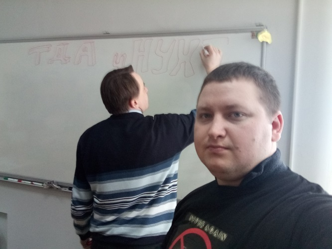
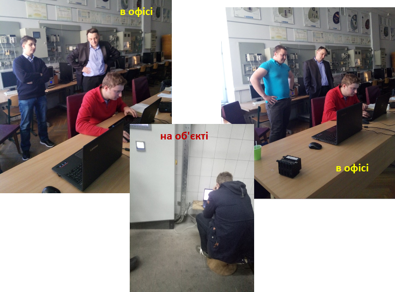

# Історія PACFramework та висновки

Олександр Пупена, 07.07.2025

На сьогодні PACFramework є стабільною версією каркасу, хоча не завжди добре синхронізованою у своїх імплементаціях. Це, чесно кажучи, більше, ніж очікувалося, оскільки каркас, передусім, задумувався як концепція та правила, а не як бібліотека. Тим не менше, я бачу низку структурних недоліків, які треба вирішувати комплексно, а також вузькі місця, що не дають змоги повноцінно використовувати його у DevOps та цифрових двійниках, куди я планую рухатися. Це лише мої плани, і, дивлячись на досвід, реалізовувати їх, мабуть, буду також тільки я. Роботи вже почалися, і наступний проєкт спробую зробити на новій версії. У той же час, думаю, варто зафіксувати передумови першої версії каркасу через історичний ракурс.

У цій статті намагатимусь згадати, звідки і коли я дізнався про технології, та як були створені певні рішення. Звісно, що в PACFramework робили внесок і мої колеги, можливо, не в тому обсязі, який би мені хотілося, однак це також недооцінювати не можна. Деякі рішення щодо імплементації ми приймали колективно, однак більшість стосувалися конкретних проєктів. Вагомий внесок у відлагодження та чистку від багів зробив Роман Міркевич; також він розробляв деплої для деяких ПЛК і запропонував низку підходів.

Каркас не народився одномоментно: він увібрав у себе напрацювання до появи першої "офіційної" версії, розвивався в її межах, змінюючи "слабкі" рішення, але не змінюючи основного скелета. Хоч репозиторій GitHub PACFramework було створено 31 січня 2017 року, базова версія каркасу існувала ще на початку 2016-го року. Були також "передкаркаси", впровадження яких успішно працює і зараз, хоча їх внутрішня "краса" залишає сумніви. Хоча межа його появи досить розмита, бо це були передусім правила, а не бібліотека. Тим не менше, згідно з філософією та системно-інженерним підходом, сутність починає існувати, коли про неї думають, а це точно не пізніше квітня 2016-го, бо ми вже про нього [розповідали](https://inudeco.pro/wp-content/uploads/2021/03/2016.pdf). Ідея каркасу — це формалізація, що базується на досвіді власних і чужих перемог та поразок.

Багато ідей, які лягли в основу каркасу, дала ще робота в альма-матер (тоді ще УДУХТ), а також подальша робота на об’єктах з моїми старшими товаришами (передусім викладачами Володимиром Миколайовичем Кушковим та Ігорем Володимировичем Ельперіним), які передали свій досвід. Навіть сама ідея перевірки роботи логіки програми на імітаційній моделі об’єкта давалася ще на курсачах із використанням Ломіконтів (олди пам’ятають, що це). Ця ідея зараз є частиною парадигми каркасу, коли імітатор є дзеркальною частиною сутностей, які вони імітують. Володимир Миколайович навчив добре продумувати структуру рішення перед його впровадженням, а також заздалегідь продумувати назви змінних перед створенням проєкту. Зараз рекомендації з найменування також є частиною каркасу. Також звідти взяв технологію використання проміжних змінних як мапінгу I/O, що дає зручність швидкого "перекидання" каналів. Ще в університеті давали мови LD, ST та Grafcet, а згодом постійна робота з ПЛК та читання курсів PLC і SCADA/HMI поступово формували кращі практики.

Перші "корпоративні" каркаси для ПЛК я побачив ще на початку 2000-х, коли працював на налагодженні об’єктів у кількох компаніях, з якими ми партнерували. Там бачив типові шаблони побудови проєктів, правила та методички, які новачки мали обов’язково читати та розбиратися в них. На жаль, вже в кінці 2000-х усе це зруйнувалося, бо кращі програмісти йшли в IT, тому вже ніхто не вимагав дотримання тих правил. Я майже більше не бачив такого використання правил у компаніях-партнерах, хоча відголоски підходів ще зустрічав у старих проєктах, що траплялися у 2014-му. Ці ідеї були запозичені, адаптовані та згодом увійшли в каркас. Саме тоді я зрозумів, наскільки зручно й практично мати власну бібліотеку та правила розроблення програм для ПЛК та SCADA/HMI. Будь-який програміст міг продовжити роботу колеги, а будь-який налагоджувальник міг внести в неї базові зміни. З тих "каркасів" я взяв "буфери", ідею використання лічильних змінних замість таймерів і деякі правила структурування коду: входи, програма, виходи.

Ряд ідей було запозичено з технологій промислових мереж, якими я захоплювався у 2000-х. Вершиною складності на той момент для мене був CanOpen. Шлях самоосвіти привів до вивчення мереж із середини (на протокольному рівні). З протоколів були взяті такі технології, як доступ за ідентифікаторами об’єктів, класифікація, полінг, heartbeat та інші. Стало зрозумілим, що з точки зору побудови програми локальні та віддалені канали є рівнозначними. Робота з перетворювачами частоти в мережі чітко заклала функціонал керування через пару статусного слова та команди, а також закріпила стано-орієнтоване керування.

Великим переломом для мене став проєкт цеху виробництва цільномолочних продуктів на Яготинському маслозаводі. Я тоді ще не знав про Batch Control, тому повторно відкривав для себе багато переваг, що вже були в ISA-88. Іноді варто створювати власні велосипеди, щоб потім краще розуміти потребу в деталях у вже існуючих. Ця система керування успішно працює 24/7 і нині, і ми періодично її розширюємо новими підсистемами. У цьому проєкті виникли ідеї, що всі сутності керування в ПЛК - це обладнання та процедури, хоч тоді таких назв і не було. Ці рішення стали хорошою основою для розуміння стандартів ISA-88, з якими я познайомився пізніше. Стани, кроки, шляхи, синхронізація тощо стали новими базовими сутностями, і тоді ж я відчув, якою морокою є використання базових таймерів.

Перші кроки у свідомій розробці каркасу з’явилися десь у 2014–2016 роках, коли я мав кілька пілотних проєктів для газорозподільчих станцій. "Капризний генпідрядник" вимагав, щоб тривоги можна було налаштовувати з панелі оператора, щоб кожна нова аварія вела до сирени, а сирени працювали за різними категоріями, а всі параметри налаштувань були на панелі, а… і все це при постійних змінах у завданні. В якийсь момент переробок я зрозумів, що треба зробити програму так, щоб зміни вносились легко. Так з’явилися базові концепції каркасу, зокрема об’єкта "PLC", який був загальним для всіх і "збирав" від усіх інших тривоги різних категорій. Також тоді почали з’являтися перші версії технологічних змінних із купою налаштувань. У проєкті, де треба було підключити наявний ПЛК (без доступу до аплоада) до SCADA, я запозичив ідею динамічного мапінгу каналів на змінні. Це мене настільки зачепило, що я вирішив реалізувати таке у своєму проєкті. Так з’явився рівень каналів і, мабуть, тоді ж з’явилася карта ПЛК. Чесно кажучи, не пам’ятаю, де вперше побачив карту ПЛК, але пізніше зрозумів, що це не унікальна річ, бо подібне використовують багато інтеграторів. Тим не менше, у PACFramework я вважаю карту ПЛК дуже потужним інструментом, і не тільки я. Мушу визнати, що рівень каналів споживає багато ресурсів і нині, тому у версії PFW2 він був суттєво оптимізований, зовсім не втративши функціональності. Трохи вибився з історичної розповіді, не втримався :) Мабуть, тоді я також уперше усвідомив, скільки сил і енергії забирає наладка, і наскільки важливо надати налагоджувальнику більше можливостей, щоб він не смикав "програміста".

У другій половині 2015 року одна з компаній-інтеграторів запропонувала попрацювати над стандартом розроблення програмного забезпечення для простої інтеграції з рівнем MES/MOM. Я погодився з пропозицією і приділив багато часу систематизації своїх здобутків у програмуванні ПЛК та приведенню їх до стандартів ISA-88/ISA-95. Це значно просунуло мене в напрямку створення каркасу, але через два місяці я змушений був припинити роботи, оскільки вважав їх не відповідними моїй зарплаті (тобто вважав, що недопрацьовую). Компанія увійшла в моє становище, хоча, мені здається, керівництво не дуже зрозуміло, чому я відмовляюся від додаткових коштів. Я був задоволений, що відмовився від такої відповідальної роботи, тоді мої зусилля не змогли подолати структурну проблему інтеграції через включення. Як згодом з’ясувалося, така реалізація суперечила ідеології ISA-88. Ці роботи стимулювали створення каркасу, однак він з’явився пізніше. Зараз для мене очевидно, що функції чи ФБ для кожної сутності мають викликатися незалежно, навіть якщо вони підлеглі сутностям верхнього рівня, бо така залежність є рольовою, а не структурною. На той момент я намагався включати їх одну в одну, що так і не дало очікуваних результатів.

Тоді ж я почав працювати над ISA-88, і у 2016 році багато часу присвятив стандартам ISA-88, ISA-106, ISA-95, ISA-18.2. До робіт уже був залучений Роман Міркевич, і він був одним із перших, хто використовував ранні версії каркасу. Зрештою ми провели [перший](https://sites.google.com/view/tda-in-ua/16-1-контролери-кнуба) та [другий](https://sites.google.com/view/tda-in-ua/16-2-batch-isa-88-нухт) ТДА, і вже в першій половині року з’явилися перші [публікації](https://inudeco.pro/wp-content/uploads/2021/03/2016.pdf) про каркас із Романом і Вікторією Путятіною (тоді магістранткою). Варто зазначити, що Вікторія витратила багато часу на аналіз суміжних стандартів і технологій. Каркас тоді ще не називався PACFramework, але вже використовувався, і це був той ідеологічний скелет, який існує й досі в першій версії.

рис.1. Просто для історії

Все ж найбільш продуктивним роком для становлення PACFramework був 2017-й. Причиною стала саме командна робота над кількома проєктами:

- тепличний комплекс: [полив та фертигація](https://www.iasu-nuft.pp.ua/post/плідна-співпраця-в-розробці-асу-тепличного-комплексу) (квітень–травень 2017): розподілена система з 15 ПЛК M241/M251 з Batch Control
- [водопідготовка](https://www.iasu-nuft.pp.ua/post/інновації-з-розробки-програмного-забезпечення-на-водопідготовці) (червень–вересень 2017): алгоритмічно складна багаторецептурна установка на базі S7-1200
- [автоматизація вакуум-апаратів 1-го продукту](https://www.iasu-nuft.pp.ua/post/інноваційне-пз-для-автоматизації-вакуум-апаратів-цукрового-зводу-1) (серпень–жовтень 2017): алгоритмічно складний багаторецептурний об’єкт

Наявність чітких спільних правил дозволила розробити спільними зусиллями у досить короткий термін складне ПЗ. До робіт були залучені Володимир Полупан та Олег Клименко, які до цього не мали досвіду роботи з PACFramework.

рис.2. Мем в тему: Як проходить командна робота. 

Ці три проєкти дали багато фідбеку для вдосконалення:

- було оптимізовано багато алгоритмів з урахуванням обмежених ресурсів малих ПЛК, таких як S7-1200 та ОП; загалом, як виявилося, завжди можна щось оптимізувати, однак нинішня версія каркасу все одно залишається завеликою для малих S7-1200, хоча для M241/M251 проблем немає;
- технологія інкрементних таймерів була переосмислена, але залишилася інкрементною (на базі імпульсів);
- з’явилися перші версії фонових задач для оновлення конфігураційних даних на SCADA/HMI;
- значно розвинулася концепція Batch Control, рецепти, Batch-звіти тощо;
- з’явилася концепція Modules у карті ПЛК, що дозволила суттєво зменшити обмін зі SCADA.

Ці проєкти варто було б детально описати, рішення актуальні й нині, однак віз і нині там. Сподіваюся, ми таки знайдемо час для цього. Про цей досвід можна почитати і переглянути в записах [ТДА18-1](https://sites.google.com/view/tda-in-ua/18-1-робота-над-помилками-кпі-атеп/досвід-командної-розробки-прикладного-пз-для-асутп).

У 2021 році розпочалися роботи над проєктом у Токмаку у субпідряді одного з наших партнерів. Проєкт був цікавим із кількох причин:

- замовник був і залишається дуже прогресивним, відкритим до інновацій;
- кількість I/O становила близько 1500–2000, було реалізовано розподілену систему I/O;
- перелік I/O постійно змінювався, як і тип та перелік пристроїв контролю та керування;
- об’єктом було котельне обладнання, яке потребувало складних процедур запуску, зупинки, виведення з аварій;
- замовник дав згоду на використання каркасу за умови адаптації LVL2 до функцій, уже реалізованих у його бібліотеках;
- замовник дав згоду на використання IoT-шлюзу.

У проєкті з нашої команди, окрім мене (програмування S7-1500), брав участь Володимир Полупан, який займався SCADA (WinCC). Саме цей проєкт став тригером для створення PFwTools (для TIA Portal) та PFwIoTgateway, деталі [тут](https://www.facebook.com/fieldbusbook/posts/pfbid0GFDBTJoWFhBxpt9VRMtTyj3NBmdy6xsfJB8cogJsnFskUV9pqJ8VvTSNftNvJMDel) і продовження [тут](https://www.facebook.com/fieldbusbook/posts/pfbid02MUA9tHYA7yZYABqqqwtZRxr6mZNxmc8MjSRpBJPkQPCMUuHoain5zJ8VP5vBC2Dal). Ми почали використовувати вбудовані в TIA інструменти спільної роботи та інтеграції (для PFwTools це було дуже зручно). Проєкт PFwIoTgateway дійшов до стадії прототипу, однак мав деякі структурні недоліки. Якщо коротко: з проєкту TIA витягувалась активна конфігурація PFW і прошивалась для Node-RED, що практично автоматично розгортало базові вікна налаштування, доступні з браузера. PFwTools показав свою ефективність, бо кілька разів доводилося змінювати близько 20% даних по входах/виходах, а для 1500 сигналів це призвело б до великої кількості ручних змін у програмі користувача. На той момент PFwTools робив ще певну автоматизацію для SCADA (формував список тривог і повідомлень), однак здебільшого скрипти працювали для генерації коду PLC та конфігурування PFwIoTgateway. Цей проєкт став справжнім викликом щодо створення бібліотеки LVL2, бо типів ВМ було дуже багато, і універсалізувати їх було неможливо. Потрібно було шукати рішення, тому були створені універсальні блоки, які використовуються й зараз, однак ця реалізація є досить громіздкою і заплутаною. У версії 2 все це потребує зміни. PFwIoTgateway змусив надати всім сутностям альтернативний до буферного метод конфігурування, який наразі використовую у своїх проєктах тільки я.

У той же період інший вітчизняний інтегратор замовив у нас курс по PACFramework, який мав розпочатися 24.02.22. Якраз перед запланованим стартом курсу Альона Шишак створила логотип каркасу, який ви бачите сьогодні. Потім вторглася росія, і десь на пів року все зупинилось. У кожного свої спогади про цей період, але для більшості він не був продуктивним у професійній невійськовій сфері.

Проєкт із Токмаком зупинився із зрозумілих причин, і разом із ним було заморожено проєкт PFwIoTgateway. Замовник наразі використовує PFW і PFwTools, однак зі значними змінами. Я не знаю, які саме зміни відбуваються, бо вони впроваджуються не через GitHub, і мене в них не посвячують.

Курси по PFW ми таки провели у другій половині 2022 року. Підготовка до курсів змусила нас формально підійти до тестування бібліотек і заново переосмислити каркас. Для проведення курсів були залучені кілька членів команди i4u. Судячи з усього, замовник курсів наразі не використовує PACFramework, принаймні ніякої активності не було помічено. Ми також не знаємо, чи використали співробітники запропоновані технології.

У наступних проєктах я значну увагу приділив PFwTools, розробив багато скриптів для UnityPRO/Control Expert, а також уперше реалізував автоматичне розгортання для [Plant SCADA](https://github.com/pupenasan/PACFramework/blob/master/platforms/citectsa/deployex2.md). Варто зазначити, що для стилю SA підтримки бібліотеки для ПЛК немає (мені не відомо), однак мені вдалося поєднати PFW та SA, оскільки вони "генетично" сумісні. Таким чином розгортання каркасу для UnityPRO/Control Expert та Plant SCADA стало автоматизованим. Що це означає на практиці: розробник змінює таблицю в Excel чи Google Sheet, набирає команду в консолі, і автоматично формується новий варіант файлу імпорту для UnityPRO/Control Expert, потім ще одну — і автоматично формуються зміни у проєкті для Plant SCADA. Звісно, це стосується тільки каркасної частини. Ідеї PFWTools для генерації коду були використані і для іншого проєкту, де не використовувався каркас. Велика кількість входів/виходів привела мене до думки, що варто витратити трохи часу на написання скриптів, аби потім витрачати менше часу на переробки. Це було того варте, однак, тим не менше, краще один раз написати скрипт під єдині правила, ніж постійно адаптувати під різні.

Останніми роботами можна назвати написання [статті](https://doi.org/10.15587/1729-4061.2024.309029), ініційованої Володимиром Полупаном. Вона не про каркас, але багато викладених у ній ідей взяті саме з PFW.

Сьогодні PACFramework час від часу використовують кілька моїх колег, яких я згадав вище. Крім того, в якомусь вигляді він став основою корпоративних правил щонайменше однієї компанії. Очікування зацікавлення української спільноти не виправдалися. Спільна робота над каркасом серед людей, які час від часу його використовують, також залишається низькою. Тому надалі я вирішив змінити стратегію розвитку PACFramework. Нижче тезисно викладаю свої думки:

1. Розпочато роботи над другою версією, яка рано чи пізно з’явиться, також буде open-source.
2. Буде проведено (або проведемо) дослідження та аналіз інших каркасів.
3. Планую змінити назву PACFramework на PFw2, оскільки "PAC Framework" використовується у кількох різних варіаціях.
4. Буде створено новий репозиторій.
5. PFw2 розроблятиметься як єдиний проєкт разом із PFw2Tools та PFw2IoTGateway:
   - враховуватиме потреби DevOps, планується розробка платформи;
   - враховуватиме потреби IoT та Digital Twin.
6. Проєкт із самого початку буде орієнтований на міжнародну спільноту, уся документація буде двомовною, але первинною буде англійська.

На цьому все. Пишіть свої думки та коментарі. Можливо, наступний блог уже буде в новому репозиторії.

## Посилання

- Pupena, A. (2017). Development of the framework for the controllers of the process base management system to meet the requirements for integration with other subsystems and to implement service functions and diagnostics service. Енергетика і автоматика, (4), 78–89. Available at: <http://nbuv.gov.ua/UJRN/eia_2017_4_9>

  Polupan, V., Mirkevych, R., Pupena, O., Klymenko, O., & Mirkevych, O. (2024). Determining the efficiency of techniques for optimizing the number of tags in modern human-machine interfaces under conditions of limited resources. Eastern-European Journal of Enterprise Technologies, 4(2(130)), 52–66. <https://doi.org/10.15587/1729-4061.2024.309029>

  Pupena, O. M., Mirkevych, R. M., Klymenko, O. M., Polupan, V. V., & Matsebula, D. V. (2019). PAC Framework V1.02: Функціональний каркас для розробки прикладного програмного забезпечення для промислових контролерів (Report No. 05.08.19). http://dx.doi.org/10.13140/RG.2.2.17224.43526

- АКТСУ НУХТ. (2017, вересень 28). Інновації з розробки програмного забезпечення на водопідготовці [Фото автора]. Оновлено 2023, березень 12. Отримано з <https://www.iasu-nuft.pp.ua/post/інновації-з-розробки-програмного-забезпечення-на-водопідготовці>
- АКТСУ НУХТ. (2017, жовтень 5). Плідна співпраця в розробці АСУ тепличного комплексу [Фото автора]. Оновлено 2023, березень 12. Отримано з <https://www.iasu-nuft.pp.ua/post/плідна-співпраця-в-розробці-асу-тепличного-комплексу>
- АКТСУ НУХТ. (2017, жовтень 13). Інноваційне ПЗ для автоматизації вакуум-апаратів цукрового заводу [Фото автора]. Оновлено 2023, березень 12. Отримано з <https://www.iasu-nuft.pp.ua/post/інноваційне-пз-для-автоматизації-вакуум-апаратів-цукрового-зводу-1>
- PACFramework landing page: <https://sites.google.com/view/tda-in-ua/pacframework>
