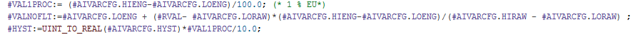
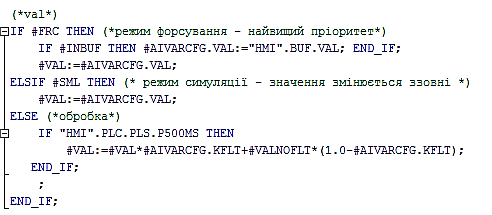

### Клас AIVAR аналогова вхідна змінна процесу (CLSID=16#1030 – 16#103A)
#### Підкласи
16#1030 – загального призначення
16#1035 – внутрішні (розрахункові) змінні, значення з RVAL не використовується для розрахунку а задається зовнішнім алгоритмом, масштабування і фільтрація не використовується
#### Функції
-   класичні:
    -   режими форсування, імітації;
    -   робота з буфером
    -   формування загального статусу ПЛК;
    -   прив'язка до каналу
-   отримання сирого значення з вказаного в конфігурації каналу
-   масштабування
    -   лінійне (для усіх)
    -   кусочно-лінійною інтерполяцією (опція)
    -   інша залежність (опція)
-   фільтрація (як правило експоненціальним фільтром)
-   обробка тривог, з впливом на загальний стан тривог ПЛК:
    -   отримання тривог з каналу
    -   обрив каналу
    -   LOLO
    -   LO
    -   HI
    -   HIHI
    -   перевантаження
-   додаткові (опція):
    -   інтегрування
    -   робота за лічильним входом
    -   робота за перепадом
-   додаткові (опція) конфігураційні параметри
    -   SPL – технологічна нижня межа
    -   SPH – технологічна верхня межа
    -   ...
#### AIVAR_HMI
| name    | type | adr  | bit  | descr                                        |
| ------- | ---- | ---- | ---- | -------------------------------------------- |
| STA     | INT  | 0    |      | біти статусу (AIVAR_STA)                     |
| VALPROC | INT  | 1    |      | значення у % від шкали вимірювання (0-10000) |
| VAL     | REAL | 2    |      | масштабоване значення                        |

#### AIVAR_STA
Використовується для зручності роботи в програмі

| name   | type | adr  | bit  | descr                                          |
| ------ | ---- | ---- | ---- | ---------------------------------------------- |
| BRK    | BOOL | 0    | 0    | =1 – активна тривога обриву (+ BAD)            |
| OVRLD  | BOOL | 0    | 1    | =1 – активна тривога КЗ (+ BAD)                |
| BAD    | BOOL | 0    | 2    | =1 – дані недостовірні                         |
| ALDIS  | BOOL | 0    | 3    | =1 – тривога тимчасово виведена з експлуатації |
| DLNK   | BOOL | 0    | 4    | =1 – якщо прив’язаний до каналу                |
| ENBL   | BOOL | 0    | 5    | =1 – змінна задіяна = (NOT PRM.7 AND  DLNK)    |
| ALM    | BOOL | 0    | 6    | =1 – активна технологічна тривога              |
| LOLO   | BOOL | 0    | 7    | =1 – активна тривога LOLO (+ALM)               |
| LO     | BOOL | 0    | 8    | =1 – активна тривога LO (+WRN)                 |
| HI     | BOOL | 0    | 9    | =1 – активна тривога HI (+WRN)                 |
| HIHI   | BOOL | 0    | 10   | =1 – активна тривога HIHI (+ALM)               |
| WRN    | BOOL | 0    | 11   | =1 – активне технологічне попередження         |
| INBUF  | BOOL | 0    | 12   | =1 – змінна в буфері                           |
| FRC    | BOOL | 0    | 13   | =1 – змінна в режимі форсування                |
| SML    | BOOL | 0    | 14   | =1 – змінна в режимі симуляції                 |
| CMDBUF | BOOL | 0    | 15   | =1 – команда завантаження в буфер              |

#### AIVAR_CFG
| name         | type | adr  | bit  | descr                                                        |
| ------------ | ---- | ---- | ---- | ------------------------------------------------------------ |
| ID           | UINT | 0    |      | Унікальний ідентифікатор                                     |
| CLSID        | UINT | 1    |      | 16#1030                                                      |
| STA          | INT  | 2    |      | статус AIVAR_STA                                             |
| VALPROC      | INT  | 3    |      | значення у % від шкали вимірювання (0-10000)                 |
| PRM          | UINT | 4    |      |                                                              |
| PRM_LOENBL   | BOOL | 4    | 0    | =1 – задіяна тривога LO /MASK 16#1                           |
| PRM_HIENBL   | BOOL | 4    | 1    | =1 – задіяна тривога HI /MASK 16#2                           |
| PRM_LOLOENBL | BOOL | 4    | 2    | =1 – задіяна тривога LOLO /MASK 16#4                         |
| PRM_HIHIENBL | BOOL | 4    | 3    | =1 – задіяна тривога HIHI/MASK 16#8                          |
| PRM_BRKENBL  | BOOL | 4    | 4    | =1 – задіяна тривога обриву                                  |
| PRM_OVRLENBL | BOOL | 4    | 5    | =1 – задіяна тривога перевантаження                          |
| PRM_QALENBL  | BOOL | 4    | 6    | =1 – задіяна тривога перевірки якості даних                  |
| PRM_DSBL     | BOOL | 4    | 7    | =1 – змінна не задіяна                                       |
| PRM_PWLENBL  | BOOL | 4    | 8    | =1 – задіяна кусочно-лінійна інтерполяція (не використовувати разом з TOTALON) |
| PRM_TOTALON  | BOOL | 4    | 9    | =1 – задіяне інтегрування (не використовувати разом з PWLENBL) |
| PRMb10       | BOOL | 4    | 10   |                                                              |
| PRMb11       | BOOL | 4    | 11   |                                                              |
| PRMb12       | BOOL | 4    | 12   |                                                              |
| PRMb13       | BOOL | 4    | 13   |                                                              |
| PRMb14       | BOOL | 4    | 14   |                                                              |
| PRMb15       | BOOL | 4    | 15   |                                                              |
| CHID         | UINT | 5    |      | Логічний номер вхідного аналогового каналу CH                |
| LORAW        | INT  | 6    |      | Сире (немасштабоване) значення мінімуму                      |
| HIRAW        | INT  | 7    |      | Сире (немасштабоване) значення максимуму                     |
| VAL          | REAL | 8    |      | масштабоване значення                                        |
| LOENG        | REAL | 10   |      | Інженерне (масштабоване) значення мінімуму                   |
| HIENG        | REAL | 12   |      | Інженерне (масштабоване) значення максимуму                  |
| KFLT         | REAL | 14   |      | Коефіцієнт фільтрації для експоненціального фільтру (0.0-1.0, 0.0 – не фільтрувати), орієнтована дискретність 100 мс |
| LOSP         | REAL | 16   |      | Уставка тривоги HI                                           |
| HISP         | REAL | 18   |      | Уставка тривоги LO                                           |
| LOLOSP       | REAL | 20   |      | Уставка тривоги LOLO                                         |
| HIHISP       | REAL | 22   |      | Уставка тривоги HIHI                                         |
| THSP         | REAL | 24   |      | Технологічна уставка HI                                      |
| TLSP         | REAL | 26   |      | Технологічна уставка LO                                      |
| RVAL         | INT  | 28   |      | сире значення                                                |
| HYST         | UINT | 29   |      | гістерезис (0.1 %)                                           |
| TDEALL       | UINT | 30   |      | Час затримки на виникнення тривоги LL в 0.1 секундах         |
| TDEAL        | UINT | 31   |      | Час затримки на виникнення тривоги L в 0.1 секундах (за необхідністю) |
| TDEAH        | UINT | 32   |      | Час затримки на виникнення тривоги H в 0.1 секундах (за необхідністю) |
| TDEAHH       | UINT | 33   |      | Час затримки на виникнення тривоги HH в 0.1 секундах (за необхідністю) |
| STEP1        | UINT | 34   |      | крок                                                         |
| TSTEP1       | UINT | 35   |      | Час кроку в 0.1 секундах                                     |

Додаткові параметри, що виділяються підключаються за необхідністю і передаються при виклику функції AIVAR_FN.
| Атрибут | Тип                   | Опис                                                         |
| ------- | --------------------- | ------------------------------------------------------------ |
| OPTR    | ARRAY [1..4] OF REAL  | Масив додаткових змінних REAL, призначення визначається параметрами: **Приклад 1**: Налаштування кус очно лінійної інтерполяції - VR[1] – масштабоване значення при 20% від діапазону  - VR[2] – значення при 40%  - VR[3] – значення при 60%  - VR[4] – значення при 80% **Приклад 2**: Використання інтегратору (використання REAL при великих значеннях буде втрачатися точність) - VR[1] – неприведене до часу (сума) інтегроване значення за останні 10 секунд (або хвилину)   - VR[2] – приведене до часу інтегроване значення за плинну годину  - VR[3] – приведене до часу інтегроване значення за попередню годину  - VR[4] – приведене до часу інтегроване значення (обнуляється ззовні, наприклад по завершенню набору). |
| OPTD    | ARRAY [1..4] OF UDINT | Масив додаткових змінних UDINT                               |

#### Масштабування
Для лінійного масштабування використовується сире (не масштабоване) значення з RVAL, діапазон вхідного сигналу (LORAW, HIRAW), діапазон вихідного сигналу (LOENG, HIENG). Нижче показано масштабування в два підходи: отримання 1% від шкали (VAL1PROC), та лінійне перетворення у нефільтроване масштабоване значення VALNOFLT. Слід зазначити, що коректність діапазону перевіряється на початку функції.

_рис.2.7. Приклад масштабування_

Практика використання каркасу показала, що у випадку відображення на HMI змінних у вигляді стовпчика, бажано використовувати відсоткове значення, а не абсолютне (інженерне). Це пов'язано з тим, що каркас передбачає можливість зміни діапазону значення, отже MIN і MAX шкали при цьому теж зміниться. Щоб не зберігати інженерні MIN і MAX в SCADA/HMI, можна прив'язатись до відсоткового значення, яке буде змінюватися за зміни діапазону шкали. Таким чином, в засобах відображення які потребують абсолютних діапазонів (зазначені технологічними показниками) будуть використовуватися абсолютні значення (VAL), а де необхідні значення відносно шкали – відсоткові (VALPROC). Наявність VALPROC в структурі HMI збільшує кількість тегів SCADA/HMI, тому його використання повинно бути виправданим.

У випадку масштабування за кусочно-лінійною інтерполяцією, можна використати масив додаткових проміжних точок VR. Це можуть бути масштабовані значення при 20%, 40%, 60%, 80% від шкали. Збільшення кількості додаткових змінних (які можуть бути використані не тільки для кусочно-лінійної інтерполяції) збільшує необхідну пам'ять, однак впливає на точність інтерполяції. Починаючи з версії каркасу 1.01 пам'ять (змінні) для кусочно-лінійної інтерполяції виділяється за необхідністю (масив OPTR).
#### Фільтрація.
Для фільтрації можна використати експоненціальний фільтр, який базується на попередньому значенні. Дискретність виклику впливає на вагу значення KFLT.
Нижче показаний приклад обробки значення VAL, за різних станів аналогової вхідної змінної: при форсуванні, при імітації і у звичайному режимі.

_рис.2.8. Приклад фільтрації_

Для статистичного фільтру можна використати пам'ять у масиві VR.

#### Обробник тривог
Перед формуванням алгоритму обробника тривог необхідно визначитися з замовником щодо автомату стану тривог. При формуванні алгоритму необхідно означити:
-   перелік станів:
    -   приклад 1: обрив, LOLO, LO, HI, HIHI, перевантаження
    -   приклад 2: аналогічний прикладу 1, з добавленням проміжних (перехідних) станів
-   наявність гістерезису (при виході з зони критичнішої тривоги в менш критичну)
-   наявність конфігураційного параметру (або параметрів) часової затримки на спрацювання
-   наявність часової затримки на вихід з більш критичної зони в менш критичну (це необхідно для фіксації в HMI виникнення тривоги)

Нижче показаний фрагмент програми обробки станів для тривоги, який активний тільки при активності обробки змінної (PRM_CHENBL). Тимчасові змінні (#tmpOVRLD, #tmpBRK, #tmpHI, #tmpHIHI, #tmpLO, #tmpLOLO) є умовами для спрацювання тривоги, однак не генерують їх. Умовою спрацювання тривоги є її активність (PRM_XXXENBL) та часова затримка. У даному прикладі використовується спрощений автомат станів, який не передбачає часову затримку на вихід з зони тривоги, замість цього використовується гістерезис (HYST).

_рис.2.9. Приклад обробки станів для тривоги_

#### Інтегрування
Для значення витратомірів можна використовувати інтегрування за часом. Слід розуміти, що точність інтегрування залежить як від значення так і від алгоритму та типу змінних, де зберігається інтеграл. Як варіант, можна використати масив VR ARRAY [1..4] OF REAL, в якому зберігати проміжні результати інтегрування, яке можна проводити як за алгоритмом прямокутників, так і трапецій. VR [1] може використовуватися для збереження суми значень витрат за певні проміжки часу, наприклад кожні 10 секунд або за хвилину. Це дасть змогу збільшити точність інтегрування, так як сумарне значення треба приводити до часу (ділити на час). Наприклад, якщо витрата вимірюється в м3/год, то через 10 секунд ми будемо мати:
(м3/3600с)\*10с,
а через хвилину
(м3/3600с)\*60с.

Таким чином, чим рідше ми перераховуємо інтегровану кількість речовини, тим менше буде знаменник, тим точніше буде значення загальної кількості на великих часових діапазонах. Однак великі інтервали розрахунку можуть не підходити для задач керування.
#### Команди для буферу (див структуру буферу)
| Атрибут | Тип  | Опис                                                         |
| ------- | ---- | ------------------------------------------------------------ |
| CMD     | UINT | Команди: 16#0100 – прочитати конфігурація  16#0101 – записати конфігурація 16#0102 – записати конфігурація за замовченням 16#0200 – тимчасово вивести тривогу з обслуговування  16#0201 – ввести тривогу в обслуговування  16#0300 – форсувати/дефорсувати 16#0301 – форсувати 16#0302 – дефорсувати |