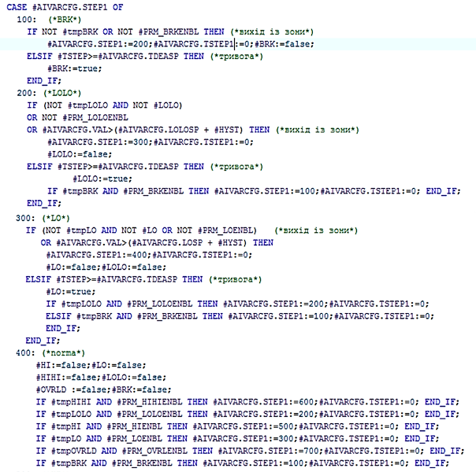

## Клас AIVAR: аналогова вхідна змінна процесу 

**CLSID=16#1030**

## Загальний опис

Клас реалізовує функції оброблення сирих вхідних аналогових даних та діагностичної інформації з `AICH`. До цих функцій входить фільтрація сигналу, маштабування, налаштування та обробка тривожних подій, керування форсуванням та імітацією.        

Якщо мають бути відмінності в реалізації, слід використовувати інші CLSID в форматі 16#103x

## Загальні вимоги до функцій AIVAR

### Функціональні вимоги 

#### Режими роботи

Клас AIVAR повинен підтримувати наступні режими (підрежими):

- обробка входу/імітація
- нефорсований/форсований

У будь якому режимі значення з прив'язаного каналу `AICH` записується в `AIVAR.VRAW`.

**Нормальний режим** роботи екземпляру класу є комбінацією підрежимів "обробка входу" та "нефорсований режим". У цьому режимі значення `AIVAR.VAL` залежить від значення каналу `AIVAR.VRAW`, проходячи через функції оброблення такі як фільтрація та масштабування.

У режимі **імітація** `STA.SML=TRUE` значення `AIVAR.VAL` залежить від зовнішнього алгоритму імітації і не проходить функцій обробки, змінюється CM-мами верхнього рівня (або незалежною програмою). Іншими словами `AIVAR.VAL` не змінюється алгоритмами класу, окрім форсування. У режимі імітація також змінюється стан `STA.SML` каналу, що прив'язаний до змінної.

У режимі **форсування** (`STA.FRC=TRUE`) `AIVAR.VAL` змінюється  тільки через налагоджувальні вікна HMI і має найвищий пріоритет. При активності біту форсування лічильник `PLC_CFG.CNTFRC` збільшується на 1.

Для **мережних і внутрішніх** змінних, які виділяються в окремий клас, доступний режим коли джерело даних змінюється ззовні і безпосередньо пишеться в значення `AIVAR.VAL`  і не проходить функцій обробки. Даний режим активується параметром `AIVAR.PRM.NORAW`

#### Фільтрація сигналу

Фільтрація реалізована за допомогою функції `A_FLTR`. Для фільтрації використовується часовий фільтр - аперіодична ланка 1-го порядку. Час фільтрації задається параметром `AIVAR.T_FLT`який задається в мс. Також для роботи даного фільтра необхідно передавати значення часу який пройшов з попереднього виклику даної функції `dt`, і зберігати значення на попередньому циклі обробки, яке зберігається в `AIVAR.VALPREV`.

#### **Масштабування сигналу**

Фільтрація реалізована за допомогою функції `SCALING`.  Робота даної функції можлива в кількох режимах:

-   лінійна залежність (для усіх)
-   квадратнокоренева залежність (для усіх) 
-   кусочно-лінійною інтерполяцією (опція)
-   інша залежність (опція)

Для лінійного масштабування використовується сире (не масштабоване) значення з `AIVAR.VRAW`, діапазон вхідного сигналу (LORAW, HIRAW), діапазон вихідного сигналу (LOENG, HIENG). Слід зазначити, що коректність діапазону перевіряється на початку функції - виконується перевірка NaN та перевірка на коректність діапазонів.   

При квадратнокореневій залежністі в якості сирих даних використовується добуток кореня квадратного сирого значення `AIVAR.VRAW` та кореня квадратного  максимального значення сирого значення `AIVAR.HIRAW`.

У випадку масштабування за кусочно-лінійною інтерполяцією, можна використати масив додаткових проміжних точок VR. Це можуть бути масштабовані значення при 20%, 40%, 60%, 80% від шкали. Збільшення кількості додаткових змінних (які можуть бути використані не тільки для кусочно-лінійної інтерполяції) збільшує необхідну пам'ять, однак впливає на точність інтерполяції. Пам'ять (змінні) для кусочно-лінійної інтерполяції виділяється за необхідністю (масив OPTR).

Практика використання каркасу показала, що у випадку відображення на HMI змінних у вигляді стовпчика, бажано використовувати відсоткове значення, а не абсолютне (інженерне). Це пов'язано з тим, що каркас передбачає можливість зміни діапазону значення, отже MIN і MAX шкали при цьому теж зміниться. Щоб не зберігати інженерні MIN і MAX в SCADA/HMI, можна прив'язатись до відсоткового значення, яке буде змінюватися за зміни діапазону шкали. Таким чином, в засобах відображення які потребують абсолютних діапазонів (зазначені технологічними показниками) будуть використовуватися абсолютні значення (VAL), а де необхідні значення відносно шкали – відсоткові (VALPROC). Наявність VALPROC в структурі HMI збільшує кількість тегів SCADA/HMI, тому його використання повинно бути виправданим.

В каркасі передбачено також використання функції відсічки нуля, при якій якщо при розрахунку масштабованого значення `AIVAR.VAL` отримується значення менше за конфігурований параметр `AIVAR.ZERO_CUT_VAL` змінна `AIVAR.VAL`  стає рівною 0. Дана функція корисна якщо аналогове значення використовується для накопичення значень лічильників і значення від витратомірів не нульове, але близьке до нуля, в такому випадку незначна похибка з кожним циклом інтегрування призведе до значної відмінності між показами лічильників.

#### Моніторинг прив'язки до каналу 

Значення `STA.DLNK=TRUE` вказує на факт прив'язки до каналу.

#### Активність змінної 

Параметр активності змінної визначається виразом `STA.ENBL = NOT PRM.DSBL AND DLNK`. Якщо змінна неактивна `STA.ENBL=FALSE` не працюють функції:

- перетворення сигналу з сирого значення: фільтрація, маштабування
- імітування 
- діагностування та обробка тривог

Верхні рівні ієрархії керування, зокрема CM LVL2, повинні сприймати цю змінну як тимчасово неіснуючу (виведену з експлуатації). Наприклад, якщо змінна відповідає за датчик аналоговий зворотній зв'язок від позиціонера клапану, то CM клапану вважає, що змінної не існує і може працювати за алгоритмом "без аналогового зворотнього зв'язку".   

#### Оброблення тривог

Алгоритм обробки тривог для змінних класу AIVAR передбачає наступні функції:

-   перелік станів:
    -   тривоги: обрив, LOLO, LO, стан норми, HI, HIHI, перевантаження
-   наявність гістерезису (при виході з зони критичнішої тривоги в менш критичну)
-   наявність конфігураційного параметру (або параметрів) часової затримки на спрацювання
-   наявність часової затримки на вихід з більш критичної зони в менш критичну (це необхідно для фіксації в HMI виникнення тривоги)

Нижче показаний фрагмент програми обробки станів для тривоги, який активний тільки при активності обробки змінної (`VARENBL`). Тимчасові змінні (`tmpOVRLD`, `tmpBRK`, `tmpHI`, `tmpHIHI`, `tmpLO`, `tmpLOLO`) є умовами для спрацювання тривоги, однак не генерують їх. Умовою спрацювання тривоги є її активність (`PRM_XXXENBL`) та часова затримка. У даному прикладі використовується спрощений автомат станів, який не передбачає часову затримку на вихід з зони тривоги, замість цього використовується гістерезис (`AIVAR.HYST`).

Параметр гістерезис `AIVAR.HYST` може задаватись у відсотках або в одиницях виміру фізичної величини - в залежності від параметру `AIVAR.PRM.PARAISPROC`.

Тривоги класу AIVAR розділені на два типи: 

- технологічні попередження - LO, HI;
- технологічні тривога - LOLO, HIHI;

Аварійна тривога відображається станом `AIVAR.STA.ALM=TRUE`, попереджувальна - `AIVAR.STA.WRN=TRUE`. При спрацюванні тривоги (передній фронт) або попередження виставляється відповідний біт `PLC_CFG.NWALM` або `PLC_CFG.NWWRN`. Поки тривога активна:

- виставляється відповідний біт `PLC_CFG.ALM` або `PLC_CFG.WRN` відповідно
- збільшується на 1 лічильник `PLC_CFG.CNTALM` або `PLC_CFG.CNTWRN` відповідно




_рис.2.9. Приклад обробки станів для тривоги_

#### Діагностування каналу вимірювання

Класом передбачається перевірка достовірності каналу вимірювання двома способами:

- відслідковування тривог обриву `AIVAR.STA.BRK` та короткого замикання `AIVAR.STA.OVRLD`;

- діагностика прив'язаного фізичного каналу вимірювання `AICH.STA.BAD`.

При `AIVAR.PRM.QALENBL=TRUE` значення `AIVAR.STA.BAD` залежить від значення `AICH.STA.BAD` прив'язаного каналу та розрахованих тривог обриву та короткого замикання. 

`AIVAR.STA.BAD` - це тривога недостовірності. При виникненні тривоги (по передньому фронту) `PLC_CFG.NWBAD=TRUE`. Поки тривога  `AIVAR.STA.BAD` активна:

- виставляється відповідний біт `PLC_CFG.ALM.BAD` 
- збільшується на 1 лічильник `PLC_CFG.CNTBAD` 

Скидання біту `AIVAR.PRM.QALENBL=FALSE` відключає функцію перевірки тривоги недостовірності.  

Опціонально можна відслідковувати попередження швидкої зміни сигналу `AIVAR.STA2.ASPD` та попередження зависання сигналу `AIVAR.STA2.AFRZ`. 

Попередження швидкої зміни сигналу `AIVAR.STA2.ASPD` спрацює якщо значення змінної `AIVAR.VAL` зміниться більше за величину задану в параметрі `AIVAR.VALPRV_ASPD` протягом 5 секунд.

Попередження швидкої зміни сигналу `AIVAR.STA2.AFRZ` спрацює якщо значення змінної `AIVAR.VAL` не буде змінюватись на величину задану в параметрі `AIVAR.VALPRV_AFRZ` протягом 20 секунд.

#### Інтегрування (опціонально)

Для значення витратомірів можна використовувати інтегрування за часом. Слід розуміти, що точність інтегрування залежить як від значення так і від алгоритму та типу змінних, де зберігається інтеграл. Як варіант, можна використати масив `VR ARRAY [1..4] OF REAL`, в якому зберігати проміжні результати інтегрування, яке можна проводити як за алгоритмом прямокутників, так і трапецій. `VR [1]` може використовуватися для збереження суми значень витрат за певні проміжки часу, наприклад кожні 10 секунд або за хвилину. Це дасть змогу збільшити точність інтегрування, так як сумарне значення треба приводити до часу (ділити на час). Наприклад, якщо витрата вимірюється в м3/год, то через 10 секунд ми будемо мати:
(м3/3600с)\*10с,
а через хвилину
(м3/3600с)\*60с.

Таким чином, чим рідше ми перераховуємо інтегровану кількість речовини, тим менше буде знаменник, тим точніше буде значення загальної кількості на великих часових діапазонах. Однак великі інтервали розрахунку можуть не підходити для задач керування.

## Рекомендації щодо використання в HMI

Приклад налаштування функцій аналогових вхідних змінних на HMI наведений на рис.


Рис. Приклад налаштування функцій аналогових вхідних змінних на HMI.

## Загальні вимоги щодо структури змінних класів

#### AIVAR_HMI
| name       | type | adr  | bit  | descr                                                        |
| ---------- | ---- | ---- | ---- | ------------------------------------------------------------ |
| STA        | UINT | 0    |      | стани + біт команди завантаження AIVAR_STA                   |
| VALPRCSTA2 | UINT | 1    |      | VALPROC: старший байт вміщує значення від 0-100%, молодший - біти STA2 |
| VAL        | REAL | 2    |      | масштабоване значення                                        |

#### AIVAR_CFG
| name           | type  | adr  | bit  | descr                                                        |
| -------------- | ----- | ---- | ---- | ------------------------------------------------------------ |
| ID             | UINT  | 0    |      | Унікальний ідентифікатор                                     |
| CLSID          | UINT  | 1    |      | 16#1030                                                      |
| STA            | UINT  | 2    |      | статус, призначення біт як `AIVAR_STA` може бути задіяна як аналогічна структура |
| STA_BRK        | BOOL  | 2    | 0    | =1 – Обрив каналу                                            |
| STA_OVRLD      | BOOL  | 2    | 1    | =1 – КЗ або перевантаження каналу                            |
| STA_BAD        | BOOL  | 2    | 2    | =1 – Дані недостовірні                                       |
| STA_ALDIS      | BOOL  | 2    | 3    | =1 – Тривога виведена з експлуатації                         |
| STA_DLNK       | BOOL  | 2    | 4    | =1 – якщо прив’язаний до каналу                              |
| STA_ENBL       | BOOL  | 2    | 5    | =1 – змінна задіяна                                          |
| STA_ALM        | BOOL  | 2    | 6    | =1 – активна технологічна тривога і не активна BAD           |
| STA_LOLO       | BOOL  | 2    | 7    | =1 – Критично низьке значення                                |
| STA_LO         | BOOL  | 2    | 8    | =1 – Низьке значення                                         |
| STA_HI         | BOOL  | 2    | 9    | =1 – Високе значення                                         |
| STA_HIHI       | BOOL  | 2    | 10   | =1 – Критично високе значення                                |
| STA_WRN        | BOOL  | 2    | 11   | =1 – активне технологічне попередження і не активні BAD та ALM |
| STA_INBUF      | BOOL  | 2    | 12   | =1 – змінна в буфері                                         |
| STA_FRC        | BOOL  | 2    | 13   | =1 – Режим форсування                                        |
| STA_SML        | BOOL  | 2    | 14   | =1 – змінна в режимі симуляції                               |
| STA_CMDLOAD    | BOOL  | 2    | 15   | =1 – команда завантаження в буфер                            |
| VALPRCSTA2     | INT   | 3    |      | VALPROC: старший байт вміщує значення від 0-100%, молодший - біти STA2 |
| PRM            | UINT  | 4    |      |                                                              |
| PRM_LOENBL     | BOOL  | 4    | 0    | =1 – задіяна тривога LO                                      |
| PRM_HIENBL     | BOOL  | 4    | 1    | =1 – задіяна тривога HI                                      |
| PRM_LOLOENBL   | BOOL  | 4    | 2    | =1 – задіяна тривога LOLO                                    |
| PRM_HIHIENBL   | BOOL  | 4    | 3    | =1 – задіяна тривога HIHI                                    |
| PRM_BRKENBL    | BOOL  | 4    | 4    | =1 – задіяна тривога обриву                                  |
| PRM_OVRLENBL   | BOOL  | 4    | 5    | =1 – задіяна тривога перевантаження                          |
| PRM_QALENBL    | BOOL  | 4    | 6    | =1 – задіяна тривога перевірки якості даних                  |
| PRM_DSBL       | BOOL  | 4    | 7    | =1 – змінна не задіяна                                       |
| PRM_PWLENBL    | BOOL  | 4    | 8    | =1 – задіяна кусочно-лінійна інтерполяція (не використовувати разом з TOTALON) |
| PRM_TOTALON    | BOOL  | 4    | 9    | =1 – задіяне інтегрування (не використовувати разом з PWLENBL) |
| PRM_SQRT       | BOOL  | 4    | 10   | =1 - задіяне квадратичне (квадратний корінь) масштабування   |
| PRM_PARAISPROC | BOOL  | 4    | 11   | =1 - параметри налаштування (гістерезис, нечутл) задається в процентах |
| PRM_AFRZENBL   | BOOL  | 4    | 12   | =1 - активна тривога нечутливості контролю зависання         |
| PRM_ASPDENBL   | BOOL  | 4    | 13   | =1 - активна тривога допуску контролю швидкості              |
| PRM_STATICMAP  | BOOL  | 4    | 14   | =1 - статична привязка каналів                               |
| PRM_NORAW      | BOOL  | 4    | 15   | =1 - джерело даних змінюється ззовні, відсутність масштабування (для мережних і внутрішніх змінних) |
| CHID           | UINT  | 5    |      | Логічний номер аналогового каналу, до якого прив'язана змінна, 0 - немає прив'язки |
| LORAW          | INT   | 6    |      | Сире (немасштабоване) значення мінімуму                      |
| HIRAW          | INT   | 7    |      | Сире (немасштабоване) значення максимуму                     |
| VAL            | REAL  | 8    |      | масштабоване значення                                        |
| VALFRC         | REAL  | 10   |      | зберігає форсоване значення                                  |
| LOENG          | REAL  | 12   |      | Інженерне (масштабоване) значення мінімуму                   |
| HIENG          | REAL  | 14   |      | Інженерне (масштабоване) значення максимуму                  |
| LOSP           | REAL  | 16   |      | Уставка тривоги HI                                           |
| HISP           | REAL  | 18   |      | Уставка тривоги LO                                           |
| LOLOSP         | REAL  | 20   |      | Уставка тривоги LOLO                                         |
| HIHISP         | REAL  | 22   |      | Уставка тривоги HIHI                                         |
| THSP           | REAL  | 24   |      | Технологічна уставка HI                                      |
| TLSP           | REAL  | 26   |      | Технологічна уставка LO                                      |
| T_FLT          | UINT  | 28   |      | час фільтрації в мілісекундах (фільтр - аперіодична ланка)   |
| VRAW           | INT   | 29   |      | сире значення                                                |
| STA2           | UINT  | 30   |      | додатковий статус, призначення біт як `AIVAR_STA` може бути задіяна як аналогічна структура |
| STA2_ASPD      | BOOL  | 30   | 0    | =1 - Швидка зміна сигналу {A.BAD.0}                          |
| STA2_AFRZ      | BOOL  | 30   | 1    | =1 - Сигнал не змінюється                                    |
| STA2_AOVRFL    | BOOL  | 30   | 2    | =1 - Перехід через верхнє значення                           |
| STA2_AUNDRFL   | BOOL  | 30   | 3    | =1 - Перехід через нижнє значення                            |
| STA2_b4        | BOOL  | 30   | 4    | резерв                                                       |
| STA2_b5        | BOOL  | 30   | 5    | резерв                                                       |
| STA2_b6        | BOOL  | 30   | 6    | резерв                                                       |
| STA2_b7        | BOOL  | 30   | 7    | резерв                                                       |
| STA2_b8        | BOOL  | 30   | 8    | резерв                                                       |
| STA2_b9        | BOOL  | 30   | 9    | резерв                                                       |
| STA2_b10       | BOOL  | 30   | 10   | резерв                                                       |
| STA2_b11       | BOOL  | 30   | 11   | резерв                                                       |
| STA2_b12       | BOOL  | 30   | 12   | резерв                                                       |
| STA2_b13       | BOOL  | 30   | 13   | резерв                                                       |
| STA2_b14       | BOOL  | 30   | 14   | резерв                                                       |
| STA2_b15       | BOOL  | 30   | 15   | резерв                                                       |
| tmp            | INT   | 31   |      | тимчасова змінна для вирівнювання структури                  |
| HYST           | REAL  | 32   |      | гістерезис в реальних одиницях або % (PRM_PARAISPROC)        |
| TDEALL         | UINT  | 34   |      | Час затримки на виникнення тривоги LL в 0.1 секундах         |
| TDEAL          | UINT  | 35   |      | Час затримки на виникнення тривоги L в 0.1 секундах (за необхідністю) |
| TDEAH          | UINT  | 36   |      | Час затримки на виникнення тривоги H в 0.1 секундах (за необхідністю) |
| TDEAHH         | UINT  | 37   |      | Час затримки на виникнення тривоги HH в 0.1 секундах (за необхідністю) |
| STEP1          | UINT  | 38   |      | номер кроку                                                  |
| CHIDDF         | UINT  | 39   |      | Логічний номер каналу за замовченням                         |
| T_STEP1        | UDINT | 40   |      | Плинний час кроку в мс                                       |
| T_PREV         | UDINT | 42   |      | час в мс з попереднього виклику, береться зі структури PLC_CFG.TQMS |
| VALPRV         | REAL  | 44   |      | значення на попередньому циклі (для реалізації фільтрації)   |
| VALPRV_AFRZ    | REAL  | 46   |      | значення на попередньому перерахунку контролю зависання      |
| VALPRV_ASPD    | REAL  | 48   |      | значення на попередньому перерахунку контролю скачку         |
| DEASP_AFRZ     | REAL  | 50   |      | уставка нечутливості контролю зависання                      |
| DOPSP_ASPD     | REAL  | 52   |      | уставка допуску контролю швидкості                           |
| ZERO_CUT_VAL   | REAL  | 54   |      | відсічка нуля                                                |

Додаткові параметри, що виділяються підключаються за необхідністю і передаються при виклику функції AIVAR_FN.
| Атрибут | Тип                   | Опис                                                         |
| ------- | --------------------- | ------------------------------------------------------------ |
| OPTR    | ARRAY [1..4] OF REAL  | Масив додаткових змінних REAL, призначення визначається параметрами:<br />**Приклад 1**: Налаштування кусочно лінійної інтерполяції<br />- VR[1] – масштабоване значення при 20% від діапазону <br/>- VR[2] – значення при 40% <br/>- VR[3] – значення при 60% <br/>- VR[4] – значення при 80%<br />**Приклад 2**: Використання інтегратору (використання REAL при великих значеннях буде втрачатися точність)<br />- VR[1] – неприведене до часу (сума) інтегроване значення за останні 10 секунд (або хвилину)  <br/>- VR[2] – приведене до часу інтегроване значення за плинну годину <br/>- VR[3] – приведене до часу інтегроване значення за попередню годину <br/>- VR[4] – приведене до часу інтегроване значення (обнуляється ззовні, наприклад по завершенню набору). |
| OPTD    | ARRAY [1..4] OF UDINT | Масив додаткових змінних UDINT                               |


#### Команди для буферу (див структуру буферу)
| Атрибут | Тип  | Опис                                                         |
| ------- | ---- | ------------------------------------------------------------ |
| CMD     | UINT | Команди:<br />16#0001: записати максимум діапазону - тільки при форсуванні<br />16#0002: записати мінімум діапазону - тільки при форсуванні<br />16#0003: записати середину діапазону - тільки при форсуванні<br />16#0100: прочитати конфігурацію<br/>16#0101: записати конфігурацію<br/>16#0102: записати значення за замовченням<br/>16#0160: інвертувати LOENBL<br/>16#0161: інвертувати HIENBL<br/>16#0162: інвертувати LOLOENBL<br/>16#0163: інвертувати HIHIENBL<br/>16#0300: перемкнути форсування<br/>16#0301: ввімкнути форсування<br/>16#0302: вимкнути форсування<br/>16#0311: імітувати<br/>16#0312: зняти режим імітації<br/> |


#### Робота з буфером

Повинна бути реалізована функція роботи з класичним буфером.

- Буфер рекомендується використовувати один для всіх технологічних змінних.

- Факт зайнятості буфера перевіряється за рівністю ідентифікатора класу `CLSID` та ідентифікатора технологічної змінної `ID`

- при захопленні буферу:

  - `VARBUF.STA = AIVAR_CFG.STA`
  - `AIVAR_CFG.CMD = VARBUF.CMD`  якщо той не дорівнює нулю (для можливості команд з іншого джерела)
  - зчитування статусних бітів фізичного каналу технологічної змінної`VARBUF.CH_STA = CHCFG.STA`.

- конфігурація технологічної змінної повинна зчитуватися в буфер при отриманні команд:

  - біті статусу `STA.CMDLOAD=TRUE`
  - оновлення технологічної змінної, яка вже записана в буфер`VARBUF.CMD` = 16#0100; 

- конфігурація технологічної змінної повинна записуватись з буфера при отриманні команд:

  - `VARBUF.CMD` = 16#0101; 	

  

Повинна бути реалізована функція роботи з параметричними двунаправленим буферами VARBUFIN<->VARBUFOUT.

- Використовується 2 буфери: 
  - вхідний `VARBUFIN` - використовується для обробки команд (при рівності CLSID та ID) та запису інформації в технологічну змінну 
  - вихідний `VARBUFOUT` - використовується зчитування інформації з технологічної змінної при отриманні команди на читання з `VARBUFIN`
- Буфери рекомендується використовувати одну пару для всіх технологічних змінних.
- Факт зайнятості буфера не можливий, оскільки буфер реалізований через 2 буферні змінні VARBUFIN та VARBUFOUT через які інформація проходить для подальшої передачі її в технологічну змінну або внутрішній буфер засобу HMI (по аналогії з параметричним обміном PKW в профілі PROFIDRIVE)
- конфігурація технологічної змінної повинна зчитуватися в вихідний буфер при:
  - рівності класів `AIVARCFG.CLSID=VARBUFIN.CLSID` , ідентифікаторів `AIVARCFG.ID=VARBUFIN.ID` та отримання команди з вхідного буфера `VARBUFIN.CMD=16#100 `
- конфігурація технологічної змінної повинна записуватись з вхідного буфера при:
  - рівності класів `AIVARCFG.CLSID=VARBUFIN.CLSID` , ідентифікаторів `AIVARCFG.ID=VARBUFIN.ID` та отримання команди з вхідного буфера `VARBUFIN.CMD=16#101 `


### Вимоги щодо реалізації інтерфейсу

INOUT

- `CHCFG` - фізичний канал прив'язаний до технологічної змінної
- `AIVARCFG` - конфігураційна частина технологічної змінної
- `AIVARHMI` - HMI частина технологічної змінної
- за умови, що немає можливості доступатися до зовнішніх змінних з середини функцій, передається `PLC_CFG`, `VARBUF`,  `VARBUFIN`, `VARBUFOUT` ; альтернативно можна використовувати інші інтерфейси для використання в середині `PLC_CFG` 


### Ініціалізація технологічної змінної при першому циклі роботи

Запис ID, CHID, CHIDFL за замовченням виконується в результаті виконання програмної секції `initvars`. 

Для кожної технологічної змінної в `initvars` повиннен бути наступний фрагмент програми для запису ID, CHID, CHIDFL

```
"VAR".AIVAR1.ID := 1001;   "VAR".AIVAR1.CHID := 1;    "VAR".AIVAR1.CHIDDF := 1;
```

Також виконується ініціалізація всередині функції обробки технологічної змінної, в результаті

- присвоюється `AIVARCFG.CLSID:=16#1030;`
- виконується активація технологічної змінної `AIVARCFG.PRM.DSBL := FALSE; ` 
- якщо логічний номер каналу не заданий - записати значення по замовчування  `AIVARCFG.CHID := AIVARCFG.CHIDDF;`
- виконується активація тривог перевірки якості даних.


### Вимоги щодо реалізації програми користувача

- Функції обробки технологічних змінних повинні викликатися з кожним викликом тієї задачі, до якого вони прив'язані.

- При першому старті (`PLC_CFG.SCN1`) повинні ініціалізуватися ідентифікатор змінної `AIVAR_CFG.ID` та номер логічного каналу `AIVAR_CFG.CHID`, 

```pascal
(*ініціалізація змінної на першому циклі обробки*)
IF "SYS".PLCCFG.STA.SCN1 THEN
    #AIVARCFG.CLSID := 16#1030; (*присвоєння ідентифікатора класу*)
    #AIVARCFG.PRM.DSBL := FALSE; (*активація змінної*)
    #AIVARCFG.PRM.QALENBL := true; (*активація тривог перевірки якості даних*)
    #AIVARCFG.PRM.BRKENBL := TRUE; (*активаці тривог обриву*)
    #AIVARCFG.PRM.OVRLENBL := TRUE; (*активаці тривог КЗ*)
    #AIVARCFG.T_PREV := "SYS".PLCCFG.TQMS; (*збереження часу виклику*)
    IF #AIVARCFG.CHID = 0 THEN (*якщо логіний номер каналу на заданий - записати значення по замовчування *)
        #AIVARCFG.CHID := #AIVARCFG.CHIDDF;
    END_IF;
    
    (*запис сирого значення з каналу для подальшої обробки*)
    IF #CHCFG.ID > 0 THEN
        #VRAW := #CHCFG.VAL;
    ELSE
        #VRAW := 0;
    END_IF;
    #AIVARCFG.VALPRV := INT_TO_REAL(#VRAW);
    #AIVARCFG.VRAW := REAL_TO_INT(#AIVARCFG.VALPRV);
    #AIVARCFG.VAL := INT_TO_REAL(#AIVARCFG.VRAW) ;
    
    #AIVARCFG.T_STEP1 := 0; (*онулення часу кроку*)
    #AIVARCFG.STEP1 := 400; (*переведення на крок норми*)
    
    (*визначення діапазонів ідентифікаторів змінної*)
    IF #AIVARCFG.ID>0 THEN
        IF #AIVARCFG.ID<"SYS".VARIDMIN THEN "SYS".VARIDMIN:=#AIVARCFG.ID; END_IF;
        IF #AIVARCFG.ID>"SYS".VARIDMAX THEN "SYS".VARIDMAX:=#AIVARCFG.ID; END_IF;
    END_IF;
    RETURN;
END_IF;

(*зчитування статусних бітів з технологічної змінної у внутрішні змінні*)
#BRK := #AIVARCFG.STA.BRK;
#OVRLD := #AIVARCFG.STA.OVRLD;
#BAD := #AIVARCFG.STA.BAD;
#ALDIS := #AIVARCFG.STA.ALDIS;
#ENBL := #AIVARCFG.STA.ENBL;
#ALM := #AIVARCFG.STA.ALM;
#LOLO := #AIVARCFG.STA.LOLO;
#LO := #AIVARCFG.STA.LO;
#HI := #AIVARCFG.STA.HI;
#HIHI := #AIVARCFG.STA.HIHI;
#WRN := #AIVARCFG.STA.WRN;
#FRC := #AIVARCFG.STA.FRC;
#SML := #AIVARCFG.STA.SML;
#CMDLOAD := #AIVARCFG.STA.CMDLOAD;

#INBUF := (#AIVARCFG.ID = "BUF".VARBUF.ID) AND (#AIVARCFG.CLSID = "BUF".VARBUF.CLSID); (*змінна в буфері якщо співпадає ідентифікатор змінної та ідентифікатор класу*)
#CMDLOAD := #AIVARHMI.STA.%X15; (*команда запису в буфер з НМІ змінної*)
#CMD := 0; (*онулення внутрішньої команда*)
#DLNK := (#CHCFG.ID > 0); (*змінна привязана до каналу якщо канал має реальний ідентифікатор (не 0 - не молоко)*)
#VARENBL := NOT #AIVARCFG.PRM.DSBL AND #DLNK; (*змінна задіяна якщо привязана до каналу і не активний параметр змінна не задіяна*)

(*зчитування параметрів з технологічної змінної у внутрішні змінні*)
#LORAW := #AIVARCFG.LORAW;
#HIRAW := #AIVARCFG.HIRAW;
#LOENG := #AIVARCFG.LOENG;
#HIENG := #AIVARCFG.HIENG;
#LOSP := #AIVARCFG.LOSP;
#HISP := #AIVARCFG.HISP;
#LOLOSP := #AIVARCFG.LOLOSP;
#HIHISP := #AIVARCFG.HIHISP;
IF #AIVARCFG.T_FLT <= 0 THEN (*час фільтрації не може бути нульовим*)
    #AIVARCFG.T_FLT := 1;
END_IF;
#T_FLT := UINT_TO_UDINT(#AIVARCFG.T_FLT);
#T_DEALL := UINT_TO_UDINT(#AIVARCFG.T_DEALL*100);
#T_DEAL := UINT_TO_UDINT(#AIVARCFG.T_DEAL*100);
#T_DEAH := UINT_TO_UDINT(#AIVARCFG.T_DEAH*100);
#T_DEAHH := UINT_TO_UDINT(#AIVARCFG.T_DEAHH*100);

#VRAW := #CHCFG.VAL; (*зчитування сирого значення з каналу*)
#T_STEPMS := #AIVARCFG.T_STEP1; (*запамятовування часу циклу в мс*)
#VAL := #AIVARCFG.VAL; (*зчитування значення з технологічної змінної у внутрішню дляя подальшої обробки*)
#VALPRV := #AIVARCFG.VALPRV; (*зчитування попереднього значення з технологічної змінної у внутрішню дляя подальшої обробки*)

(*якщо попереднього значення виходить за діапазон вводимо обмеження діапазону*)
IF #VALPRV <= #AIVARCFG.LOENG THEN
    #VALPRV:=#AIVARCFG.LOENG;
ELSIF #VALPRV>#AIVARCFG.HIENG THEN
    #VALPRV:=#AIVARCFG.HIENG;
END_IF;

(*реалізація алгоритму ping-pong*)
IF #DLNK THEN
    #CHCFG.STA.PNG := true;
    #CHCFG.VARID := #AIVARCFG.ID;
END_IF;

(*визначення часу між викликами функції по різниці між мілісікундним лічильником та часом який пройшов з попереднього виклику *)
#dT := "SYS".PLCCFG.TQMS - #AIVARCFG.T_PREV;

(*перевірка NaN*)
IF NOT (#VALPRV<#AIVARCFG.LOENG OR #VALPRV>=#AIVARCFG.LOENG) THEN
    #VALPRV:=#AIVARCFG.LOENG;
END_IF;

(*визначення 1% від шкали*)
#VAL1PROC := (#AIVARCFG.HIENG - #AIVARCFG.LOENG) / 100.0; (* 1 % EU*)
IF #VAL1PROC = 0.0 THEN
    #VAL1PROC := 1.0;
END_IF;

(*гістерезис в залежності від параметра вказівки гістерезису*)
IF #AIVARCFG.PRM.PARAISPROC THEN (*%*)
    #HYST := #AIVARCFG.HYST * #VAL1PROC;
ELSE (*real units*)
    #HYST := #AIVARCFG.HYST;
END_IF;

(*перевірка на коректність діапазонів*)
IF ABS(#AIVARCFG.HIRAW - #AIVARCFG.LORAW) < 1 THEN
    #AIVARCFG.LORAW := 0;
    #AIVARCFG.HIRAW := 27648;
END_IF;
IF ABS(#AIVARCFG.HIENG - #AIVARCFG.LOENG) < 0.00001 THEN
    #AIVARCFG.LOENG := 0.0;
    #AIVARCFG.HIENG := 100.0;
END_IF;

(*обнулення некоректних значень + infinity (INF)  - infinity (-INF)  SNAN QNAN *)
(*коли експонента (23-30 біти) = 255 *)
#tmpDWORD := SHR(IN := REAL_TO_DWORD(#AIVARCFG.VAL), N := 23) AND 16#00FF;
IF #tmpDWORD = 16#00ff THEN
    #AIVARCFG.VAL := 0.0;
END_IF;

(*масштабування*)
#PRM_SCL:=0;
#STA_SCL:=0;
#PRM_SCL.%X0 := #AIVARCFG.PRM.SQRT;(*квадратнокоренева залежність, X0  *)
#PRM_SCL.%X1 := true; (*обмежувати вихідну величину, X1*)

IF #VARENBL THEN
    #VALNOFLT := "SCALING" (IN := INT_TO_REAL(#VRAW),
                            in_min := INT_TO_REAL(#LORAW),
                            in_max := INT_TO_REAL(#HIRAW),
                            out_min := #LOENG,
                            out_max := #HIENG,
                            STA := #STA_SCL,
                            PRM := #PRM_SCL);
ELSE
    #VALNOFLT :=#VRAW;
END_IF;


(* якщо відсічка нуля активна(більше нуля) і значення менше то значення нуль, інакше маштабуєм значення*)
IF #AIVARCFG.ZERO_CUT_VAL > 0.0 AND (#LOENG + INT_TO_REAL(#VRAW - #LORAW) * (#HIENG - #LOENG) / INT_TO_REAL(#HIRAW - #LORAW)) <= #AIVARCFG.ZERO_CUT_VAL THEN
    #VALNOFLT := 0.0;
END_IF;

(*фільтрація*)
IF #VARENBL THEN
    #VAL:="A_FLTR" (IN := #VALNOFLT, dT := #dT, T_FLT := #T_FLT, PRM := #tmpuint, STA := #tmpuint, VALPRV := #VALPRV);
ELSE
    #VAL:=#VALNOFLT;
END_IF;

(* широкомовне дефорсування*) 
IF "SYS".PLCCFG.CMD = 16#4302 THEN
    #FRC := false; (*дефорсувати об'єкт типу*)
END_IF;

(*вибір джерела конфігураційної/керівної команди згідно пріоритету якщо команди надійшли одночасно*)
IF #CMDLOAD THEN (*команда запису в буфер - команда з НМІ*)
    #CMD := 16#0100;
ELSIF #INBUF AND "BUF".VARBUF.CMD <> 0 THEN (*команда з буферу*)
    #CMD := "BUF".VARBUF.CMD;
END_IF;

(*commands*)
CASE #CMD OF
    16#0001: (*записати максимум діапазону*)
        IF #FRC AND #INBUF THEN
            #AIVARCFG.VALFRC := #AIVARCFG.HIENG;
            #VAL := #AIVARCFG.HIENG;
            #AIVARCFG.STEP1 := 400;
            #AIVARCFG.T_STEP1 := 0;
        END_IF;
    16#0002: (*записати мінімум діапазону*)
        IF #FRC AND #INBUF THEN
            #AIVARCFG.VALFRC := #AIVARCFG.LOENG;
            #VAL := #AIVARCFG.LOENG;
            #AIVARCFG.STEP1 := 400;
            #AIVARCFG.T_STEP1 := 0;
        END_IF;
    16#0003: (*записати середину діапазону*)
        IF #FRC AND #INBUF THEN
            #AIVARCFG.VALFRC := (#AIVARCFG.HIENG - #AIVARCFG.LOENG) / 2.0;
            #VAL := (#AIVARCFG.HIENG - #AIVARCFG.LOENG) / 2.0;
            #AIVARCFG.STEP1 := 400;
            #AIVARCFG.T_STEP1 := 0;
        END_IF;
    16#0100: (*прочитати конфігурацію*)
        (* MSG 200-Ok 400-Error
        // 200 - Дані записані
        // 201 - Дані прочитані 
        // 403 - канал вже зайнятий 
        // 404 - номер каналу не відповідає діапазону   
        // 405 - активна статична адресація каналів *)
        "BUF".VARBUF.MSG := 201;
        
        (*зчитати ідентифікатор змінної та ідентифікатор класу*)
        "BUF".VARBUF.ID := #AIVARCFG.ID;
        "BUF".VARBUF.CLSID := #AIVARCFG.CLSID;
        
        (*зчитати бітові параметри*)
        "BUF".VARBUF.PRM.%X0 := #AIVARCFG.PRM.LOENBL;
        "BUF".VARBUF.PRM.%X1 := #AIVARCFG.PRM.HIENBL;
        "BUF".VARBUF.PRM.%X2 := #AIVARCFG.PRM.LOLOENBL;
        "BUF".VARBUF.PRM.%X3 := #AIVARCFG.PRM.HIHIENBL;
        "BUF".VARBUF.PRM.%X4 := #AIVARCFG.PRM.BRKENBL;
        "BUF".VARBUF.PRM.%X5 := #AIVARCFG.PRM.OVRLENBL;
        "BUF".VARBUF.PRM.%X6 := #AIVARCFG.PRM.QALENBL;
        "BUF".VARBUF.PRM.%X7 := #AIVARCFG.PRM.DSBL;
        "BUF".VARBUF.PRM.%X8 := #AIVARCFG.PRM.PWLENBL;
        "BUF".VARBUF.PRM.%X9 := #AIVARCFG.PRM.TOTALON;
        "BUF".VARBUF.PRM.%X10 := #AIVARCFG.PRM.SQRT;
        "BUF".VARBUF.PRM.%X11 := #AIVARCFG.PRM.PARAISPROC;
        "BUF".VARBUF.PRM.%X12 := #AIVARCFG.PRM.AFRZENBL;
        "BUF".VARBUF.PRM.%X13 := #AIVARCFG.PRM.ASPDENBL;
        "BUF".VARBUF.PRM.%X14 := #AIVARCFG.PRM.STATICMAP;
        "BUF".VARBUF.PRM.%X15 := #AIVARCFG.PRM.NORAW;
        
        (*зчитати параметри*)
        "BUF".VARBUF.CHID := #AIVARCFG.CHID;
        "BUF".VARBUF.LORAW := #AIVARCFG.LORAW;
        "BUF".VARBUF.HIRAW := #AIVARCFG.HIRAW;
        "BUF".VARBUF.LOENG := #AIVARCFG.LOENG;
        "BUF".VARBUF.HIENG := #AIVARCFG.HIENG;
        "BUF".VARBUF.HIHISP := #AIVARCFG.HIHISP;
        "BUF".VARBUF.HISP := #AIVARCFG.HISP;
        "BUF".VARBUF.LOSP := #AIVARCFG.LOSP;
        "BUF".VARBUF.LOLOSP := #AIVARCFG.LOLOSP;
        "BUF".VARBUF.T_FLTSP := #AIVARCFG.T_FLT;
        "BUF".VARBUF.HYST := #AIVARCFG.HYST;
        "BUF".VARBUF.T_DEAHH := #AIVARCFG.T_DEAHH;
        "BUF".VARBUF.T_DEAH := #AIVARCFG.T_DEAH;
        "BUF".VARBUF.T_DEAL := #AIVARCFG.T_DEAL;
        "BUF".VARBUF.T_DEALL := #AIVARCFG.T_DEALL;
        "BUF".VARBUF.VALPRV_AFRZ :=#AIVARCFG.VALPRV_AFRZ;
        "BUF".VARBUF.VALPRV_ASPD :=#AIVARCFG.VALPRV_ASPD;
        "BUF".VARBUF.DEASP_AFRZ :=#AIVARCFG.DEASP_AFRZ;
        "BUF".VARBUF.DOPSP_ASPD := #AIVARCFG.DOPSP_ASPD;
        "BUF".VARBUF.ZERO_CUT_VAL := #AIVARCFG.ZERO_CUT_VAL;
        
        (*зчитати значення змінної для безударного форсування*)
        "BUF".VARBUF.VALR := #AIVARCFG.VALFRC;
        
    16#0101: (*записати конфігурацію*)
        (* MSG 200-Ok 400-Error
        // 200 - Дані записані
        // 201 - Дані прочитані 
        // 403 - канал вже зайнятий 
        // 404 - номер каналу не відповідає діапазону   
        // 405 - активна статична адресація каналів*)
        "BUF".VARBUF.MSG:=200;
        
        (*записати бітові параметри*)
        #AIVARCFG.PRM.LOENBL := "BUF".VARBUF.PRM.%X0;
        #AIVARCFG.PRM.HIENBL := "BUF".VARBUF.PRM.%X1;
        #AIVARCFG.PRM.LOLOENBL := "BUF".VARBUF.PRM.%X2;
        #AIVARCFG.PRM.HIHIENBL := "BUF".VARBUF.PRM.%X3;
        #AIVARCFG.PRM.BRKENBL := "BUF".VARBUF.PRM.%X4;
        #AIVARCFG.PRM.OVRLENBL := "BUF".VARBUF.PRM.%X5;
        #AIVARCFG.PRM.QALENBL := "BUF".VARBUF.PRM.%X6;
        #AIVARCFG.PRM.DSBL := "BUF".VARBUF.PRM.%X7;
        #AIVARCFG.PRM.PWLENBL := "BUF".VARBUF.PRM.%X8;
        #AIVARCFG.PRM.TOTALON := "BUF".VARBUF.PRM.%X9;
        #AIVARCFG.PRM.SQRT := "BUF".VARBUF.PRM.%X10;
        #AIVARCFG.PRM.PARAISPROC := "BUF".VARBUF.PRM.%X11;
        #AIVARCFG.PRM.AFRZENBL := "BUF".VARBUF.PRM.%X12;
        #AIVARCFG.PRM.ASPDENBL := "BUF".VARBUF.PRM.%X13;
        #AIVARCFG.PRM.STATICMAP := "BUF".VARBUF.PRM.%X14;
        #AIVARCFG.PRM.NORAW := "BUF".VARBUF.PRM.%X15;
        
        (*записати параметри*)
        #AIVARCFG.LORAW := "BUF".VARBUF.LORAW;
        #AIVARCFG.HIRAW := "BUF".VARBUF.HIRAW;
        #AIVARCFG.LOENG := "BUF".VARBUF.LOENG;
        #AIVARCFG.HIENG := "BUF".VARBUF.HIENG;
        #AIVARCFG.HIHISP := "BUF".VARBUF.HIHISP;
        #AIVARCFG.HISP := "BUF".VARBUF.HISP;
        #AIVARCFG.LOSP := "BUF".VARBUF.LOSP;
        #AIVARCFG.LOLOSP := "BUF".VARBUF.LOLOSP;
        #AIVARCFG.T_FLT := "BUF".VARBUF.T_FLTSP;
        #AIVARCFG.HYST := "BUF".VARBUF.HYST;
        #AIVARCFG.T_DEAHH := "BUF".VARBUF.T_DEAHH;
        #AIVARCFG.T_DEAH := "BUF".VARBUF.T_DEAH;
        #AIVARCFG.T_DEAL := "BUF".VARBUF.T_DEAL;
        #AIVARCFG.T_DEALL := "BUF".VARBUF.T_DEALL;
        #AIVARCFG.VALPRV_AFRZ := "BUF".VARBUF.VALPRV_AFRZ ;
        #AIVARCFG.VALPRV_ASPD := "BUF".VARBUF.VALPRV_ASPD ;
        #AIVARCFG.DEASP_AFRZ := "BUF".VARBUF.DEASP_AFRZ ;
        #AIVARCFG.DOPSP_ASPD :=  "BUF".VARBUF.DOPSP_ASPD ;
        #AIVARCFG.ZERO_CUT_VAL := "BUF".VARBUF.ZERO_CUT_VAL  ;
        
        (*алгоритм для зміни номера логічного каналу при перевірці його на коректність*)
        IF NOT #AIVARCFG.PRM.STATICMAP THEN (* зміна логічного номеру каналу тільки при неактивна статичн адресація*)
            IF "BUF".VARBUF.CHID>=0 AND "BUF".VARBUF.CHID <= INT_TO_UINT("SYS".PLCCFG.AICNT) THEN (* якщо логічний номер канал менший за кількість каналів*)
                IF "SYS".CHAI["BUF".VARBUF.CHID].VARID = 0 THEN (* якщо логічний номер канал нульовий - вільний *)
                    #AIVARCFG.CHID := "BUF".VARBUF.CHID; (* змінити логічний номер каналу *)
                ELSIF "BUF".VARBUF.CHID <> #AIVARCFG.CHID THEN  (* інакше вивести помилку про зайнятість каналу *)
                    "BUF".VARBUF.MSG := 403;(* канал вже зайнятий*)
                END_IF;
            ELSE
                "BUF".VARBUF.MSG := 404; (*номер каналу не відповідає діапазону*)
            END_IF;
        ELSIF "BUF".VARBUF.CHID <> #AIVARCFG.CHID THEN (* інакше вивести помилку активна статична адресація каналів *)
            "BUF".VARBUF.MSG := 405;(* активна статична адресація каналів*)
        END_IF;
        IF #INBUF THEN (*оновити логічний номер каналу після запису якщо змінна ще в буфері*)
            "BUF".VARBUF.CHID := #AIVARCFG.CHID;
        END_IF;
    16#0102: (*записати значення за замовченням*)
        #AIVARCFG.CHID := #AIVARCFG.CHIDDF;
    16#0160: (*інвертувати LOENBL*)
        #AIVARCFG.PRM.LOENBL := NOT #AIVARCFG.PRM.LOENBL;
    16#0161: (*інвертувати HIENBL*)
        #AIVARCFG.PRM.HIENBL := NOT #AIVARCFG.PRM.HIENBL;
    16#0162: (*інвертувати LOLOENBL*)
        #AIVARCFG.PRM.LOLOENBL := NOT #AIVARCFG.PRM.LOLOENBL;
    16#0163: (*інвертувати HIHIENBL*)
        #AIVARCFG.PRM.HIHIENBL := NOT #AIVARCFG.PRM.HIHIENBL;
    16#0300: (*перемкнути форсування*)
        #FRC := NOT #FRC;
    16#0301: (*ввімкнути форсування*)
        #FRC := true;
    16#0302: (*вимкнути форсування*)
        #FRC := false;
    16#0311: (* імітувати*)
        #SML := true;
    16#0312: (* зняти режим імітації*)
        #SML := false;
END_CASE;

(*обробка значень*)
IF #FRC THEN (*при форсуванні берем значення з буфера*)
    IF #INBUF THEN
        #AIVARCFG.VAL := "BUF".VARBUF.VALR;
        #AIVARCFG.VALFRC := "BUF".VARBUF.VALR;
    END_IF;
    #VAL := #AIVARCFG.VALFRC;
ELSIF #SML OR #AIVARCFG.PRM.NORAW THEN (* режим симуляції або джерело даних змінюється ззовні  - значення змінюється ззовні *)
    #VAL := #AIVARCFG.VAL;
ELSE  (*обробка нефорсованого значення - нормальна обробка змінної*)
    #AIVARCFG.VALFRC := #VAL;
END_IF;


(*обробка тривог*)
#BRK := false;
#LO := false;
#LOLO := false;
#HI := false;
#HIHI := false;
#OVRLD := false;
#T_DEAQALSP := 10;     (* час затримки на виникнення тривог обривів і кз в 0.1 с*)

(*не алармувати*)
IF #VARENBL THEN (*тільки при активності змінної обробляються тривоги*)
    (*перевірка на спрацювання*)
    #tmpOVRLD := #CHCFG.VAL>=32511;
    #tmpBRK := #CHCFG.VAL<=-4864;
    #tmpHI := (#VAL >= #AIVARCFG.HISP);
    #tmpHIHI := (#VAL >= #AIVARCFG.HIHISP);
    #tmpLO := (#VAL <= #AIVARCFG.LOSP);
    #tmpLOLO := (#VAL <= #AIVARCFG.LOLOSP);
    
    (*якщо активована перевірка якості то PRM_BRKENBL та PRM_OVRLENBL ставимо насильно*)
    IF NOT #AIVARCFG.PRM.QALENBL THEN
        #AIVARCFG.PRM.BRKENBL := false;
        #AIVARCFG.PRM.OVRLENBL := false;
    END_IF;
    
    (*обробка автомату станів*)
    CASE #AIVARCFG.STEP1 OF
        100:  (*BRK - обрив каналу*)
            #LO := #AIVARCFG.PRM.LOENBL;
            #LOLO := #AIVARCFG.PRM.LOLOENBL;
            IF NOT #tmpBRK OR NOT #AIVARCFG.PRM.BRKENBL THEN (*вихід із зони*)
                #AIVARCFG.STEP1 := 200;
            ELSIF #T_STEPMS >= INT_TO_UDINT(#T_DEAQALSP) THEN (*тривога*)
                #BRK := true;
            END_IF;
        200: (*LOLO*)
            #LO := #AIVARCFG.PRM.LOENBL;
            #LOLO := #AIVARCFG.PRM.LOLOENBL AND #T_STEPMS >= UINT_TO_UDINT(#T_DEALL);
            IF NOT #LOLO AND NOT #tmpLOLO
                OR NOT #AIVARCFG.PRM.LOLOENBL
                OR #AIVARCFG.VAL > (#AIVARCFG.LOLOSP + #HYST) THEN (*вихід із зони*)
                #AIVARCFG.STEP1 := 300;
            END_IF;
            IF #LOLO AND #tmpBRK AND #AIVARCFG.PRM.BRKENBL THEN
                #AIVARCFG.STEP1 := 100;
                #AIVARCFG.T_STEP1 := 0;
            END_IF;
        300: (*LO*)
            #LO := #AIVARCFG.PRM.LOENBL AND #T_STEPMS >= UINT_TO_UDINT(#T_DEAL);
            IF (NOT #tmpLO AND NOT #LO OR NOT #AIVARCFG.PRM.LOENBL)   (*вихід із зони*)
                OR #AIVARCFG.VAL > (#AIVARCFG.LOSP + #HYST) THEN
                #AIVARCFG.STEP1 := 400;
                #AIVARCFG.T_STEP1 := 0;
            END_IF;
            IF #LO AND #tmpLOLO AND #AIVARCFG.PRM.LOLOENBL THEN
                #AIVARCFG.STEP1 := 200;
                #AIVARCFG.T_STEP1 := 0;
            END_IF;
            IF #LO AND #tmpBRK AND #AIVARCFG.PRM.BRKENBL THEN
                #AIVARCFG.STEP1 := 100;
                #AIVARCFG.T_STEP1 := 0;
            END_IF;
        400: (*norma*)
            IF #tmpHI AND #AIVARCFG.PRM.HIENBL THEN
                #AIVARCFG.STEP1 := 500;
                #AIVARCFG.T_STEP1 := 0;
            END_IF;
            IF #tmpLO AND #AIVARCFG.PRM.LOENBL THEN
                #AIVARCFG.STEP1 := 300;
                #AIVARCFG.T_STEP1 := 0;
            END_IF;
            IF #tmpHIHI AND #AIVARCFG.PRM.HIHIENBL THEN
                #AIVARCFG.STEP1 := 460;
                #AIVARCFG.T_STEP1 := 0;
            END_IF;
            IF #tmpLOLO AND #AIVARCFG.PRM.LOLOENBL THEN
                #AIVARCFG.STEP1 := 420;
                #AIVARCFG.T_STEP1 := 0;
            END_IF;
            IF #tmpBRK AND #AIVARCFG.PRM.BRKENBL THEN
                #AIVARCFG.STEP1 := 410;
                #AIVARCFG.T_STEP1 := 0;
            END_IF;
            IF #tmpOVRLD AND #AIVARCFG.PRM.OVRLENBL THEN
                #AIVARCFG.STEP1 := 470;
                #AIVARCFG.T_STEP1 := 0;
            END_IF;
        410: (*norma -> break*)
            IF NOT #tmpBRK OR NOT #AIVARCFG.PRM.BRKENBL THEN (*вихід із зони*)
                #AIVARCFG.STEP1 := 400;
                #AIVARCFG.T_STEP1 := 0;
            ELSIF #T_STEPMS >= INT_TO_UDINT(#T_DEAQALSP) THEN (*тривога*)
                #AIVARCFG.STEP1 := 100;
            END_IF;
        420: (*norma -> LOLO*)
            IF NOT #tmpLOLO OR NOT #AIVARCFG.PRM.LOLOENBL THEN (*вихід із зони*)
                #AIVARCFG.STEP1 := 400;
                #AIVARCFG.T_STEP1 := 0;
            ELSIF #T_STEPMS >= UINT_TO_UDINT(#T_DEALL) THEN (*тривога*)
                #AIVARCFG.STEP1 := 200;
            END_IF;
        460: (*norma -> HIHI*)
            IF NOT #tmpHIHI OR NOT #AIVARCFG.PRM.HIHIENBL THEN (*вихід із зони*)
                #AIVARCFG.STEP1 := 400;
                #AIVARCFG.T_STEP1 := 0;
            ELSIF #T_STEPMS >= UINT_TO_UDINT(#T_DEAHH) THEN (*тривога*)
                #AIVARCFG.STEP1 := 600;
            END_IF;
        470: (*norma -> OVRLD*)
            IF NOT #tmpOVRLD OR NOT #AIVARCFG.PRM.OVRLENBL THEN (*вихід із зони*)
                #AIVARCFG.STEP1 := 400;
                #AIVARCFG.T_STEP1 := 0;
            ELSIF #T_STEPMS >= INT_TO_UDINT(#T_DEAQALSP) THEN (*тривога*)
                #AIVARCFG.STEP1 := 700;
            END_IF;
        500: (*HI*)
            #HI := #AIVARCFG.PRM.HIENBL AND #T_STEPMS >= UINT_TO_UDINT(#T_DEAH);
            IF NOT #tmpHI AND NOT #HI
                OR NOT #AIVARCFG.PRM.HIENBL (*вихід із зони*)
                OR #AIVARCFG.VAL < (#AIVARCFG.HISP - #HYST) THEN
                #AIVARCFG.STEP1 := 400;
                #AIVARCFG.T_STEP1 := 0;
            END_IF;
            IF #HI AND #tmpHIHI AND #AIVARCFG.PRM.HIHIENBL THEN
                #AIVARCFG.STEP1 := 600;
                #AIVARCFG.T_STEP1 := 0;
            END_IF;
            IF #HI AND #tmpOVRLD AND #AIVARCFG.PRM.OVRLENBL THEN
                #AIVARCFG.STEP1 := 700;
                #AIVARCFG.T_STEP1 := 0;
            END_IF;
        600: (*HIHI*)
            #HI := #AIVARCFG.PRM.HIENBL;
            #HIHI := #AIVARCFG.PRM.HIHIENBL AND #T_STEPMS >= UINT_TO_UDINT(#T_DEAHH);
            IF NOT #tmpHIHI AND NOT #HIHI OR
                NOT #AIVARCFG.PRM.HIHIENBL OR
                #AIVARCFG.VAL < (#AIVARCFG.HIHISP - #HYST) THEN (*вихід із зони*)
                #AIVARCFG.STEP1 := 500;
            END_IF;
            IF #HI AND #tmpOVRLD AND #AIVARCFG.PRM.OVRLENBL THEN
                #AIVARCFG.STEP1 := 700;
                #AIVARCFG.T_STEP1 := 0;
            END_IF;
        700: (*OVRLD - КЗ*)
            #HI := #AIVARCFG.PRM.HIENBL;
            #HIHI := #AIVARCFG.PRM.HIHIENBL;
            IF (NOT #tmpOVRLD OR NOT #AIVARCFG.PRM.OVRLENBL) THEN (*вихід із зони*)
                #AIVARCFG.STEP1 := 600;
            ELSIF #T_STEPMS >= INT_TO_UDINT(#T_DEAQALSP) THEN (*тривога*)
                #OVRLD := true;
            END_IF;
        ELSE
            #AIVARCFG.STEP1 := 400;
    END_CASE;
ELSE
    #AIVARCFG.VRAW := #VRAW;
    #AIVARCFG.VAL := #VALNOFLT;
    #AIVARCFG.T_STEP1 := 0;
    #AIVARCFG.STEP1 := 400;
    #BAD := false;
    #BRK := false;
    #LO := false;
    #LOLO := false;
    #HI := false;
    #HIHI := false;
    #OVRLD := false;
    #ENBL := false;
END_IF;

(*ініціалізація змінних для контролю зависання та стрибків*)
IF "SYS".PLCCFG.STA.SCN1 THEN
    #AIVARCFG.VALPRV_AFRZ := #VAL;
    #AIVARCFG.VALPRV_ASPD := #VAL;
END_IF;

(* Перевірка на зависання *)
(*протягом 20 сек значення повинно змінитися більш ніж на задану уставку у од.вимір якщо уставка 0 - по дефолту*)
IF #AIVARCFG.PRM.AFRZENBL THEN
    #tmpAFRZ:=#AIVARCFG.STA2.AFRZ;
    (*перевіряти на кожній 20 сек на один цикл*)
    IF ("SYS".PLCCFG.TQ MOD 20) = 0 AND "SYS".PLCCFG.PLS.P1S THEN
        IF ABS(#AIVARCFG.VALPRV_AFRZ - #VAL) < #AIVARCFG.DEASP_AFRZ THEN
            #tmpAFRZ:=true;
        ELSE
            #tmpAFRZ:=false; (*самоскидання*)
        END_IF;
        #AIVARCFG.VALPRV_AFRZ := #VAL;
    END_IF;
    (*якщо значення зміниться у будь який час оновити його (відкидання помилки випадкової рівності через вказаний час)  *)
    IF  ABS(#VAL - #AIVARCFG.VALPRV) > #AIVARCFG.DEASP_AFRZ THEN
        #AIVARCFG.VALPRV_AFRZ := #VAL;
    END_IF;
    #AIVARCFG.STA2.AFRZ := #tmpAFRZ;
END_IF;

(* Перевірка на скачок *)
IF #AIVARCFG.PRM.ASPDENBL THEN
    (* аларм швидкості зміни, якщо через заданий час значення скочило більше ніж допуск - помилка WRN*)
    #tmpASPD:=false;
    #AIVARCFG.STA2.ASPD := #tmpASPD;
    (*перевіряти на кожній 5 сек на один цикл*)
    IF ("SYS".PLCCFG.TQ MOD 5) = 0 AND "SYS".PLCCFG.PLS.P1S THEN
        IF ABS(#AIVARCFG.VALPRV_ASPD - #VAL) > #AIVARCFG.DOPSP_ASPD THEN
            #tmpASPD:=true;
        ELSE
            #tmpASPD:=false; (*самоскидання*)
        END_IF;
        #AIVARCFG.VALPRV_ASPD := #VAL;
    END_IF;
    #AIVARCFG.STA2.AOVRFL:=#VRAW>27649 AND #VRAW<32510;
    #AIVARCFG.STA2.AUNDRFL:=#VRAW<-1 AND #VRAW>-4863;
    #tmpAOVRFL:=#AIVARCFG.STA2.AOVRFL;
    #tmpAUNDRFL:=#AIVARCFG.STA2.AUNDRFL;
END_IF;

(*обробка тривог - визначення загального статусу*)
#BAD := (#CHCFG.STA.BAD OR #BRK OR #OVRLD OR #tmpAOVRFL OR #tmpAUNDRFL OR #tmpAFRZ) AND #AIVARCFG.PRM.QALENBL AND #VARENBL AND NOT #SML AND NOT #FRC;
#ALM := (#LOLO OR #HIHI) AND NOT #BAD;
#WRN := (#LO OR #HI OR #tmpASPD) AND NOT #ALM AND NOT #BAD;

(*передача тривог для змінної PLCCFG для формування загального статусного біта і визначення нової тривоги*)
IF #BAD THEN
    "SYS".PLCCFG.ALM1.BAD := true;
    "SYS".PLCCFG.CNTBAD := "SYS".PLCCFG.CNTBAD + 1;
    IF NOT #AIVARCFG.STA.BAD THEN
        "SYS".PLCCFG.ALM1.NWBAD := true;
    END_IF;
END_IF;

IF #ALM THEN
    "SYS".PLCCFG.ALM1.ALM := true;
    "SYS".PLCCFG.CNTALM := "SYS".PLCCFG.CNTALM + 1;
    IF NOT #AIVARCFG.STA.ALM THEN
        "SYS".PLCCFG.ALM1.NWALM := true;
    END_IF;
END_IF;

IF #WRN THEN
    "SYS".PLCCFG.ALM1.WRN := true;
    "SYS".PLCCFG.CNTWRN := "SYS".PLCCFG.CNTWRN + 1;
    IF NOT #AIVARCFG.STA.WRN THEN
        "SYS".PLCCFG.ALM1.NWWRN := true;
    END_IF;
END_IF;

(*передача статусних бітів для змінної PLCCFG для формування загального статусного біта*)
IF #FRC THEN
    "SYS".PLCCFG.STA.FRC1 := true;
    "SYS".PLCCFG.CNTFRC := "SYS".PLCCFG.CNTFRC + 1;
END_IF;
IF #SML THEN
    "SYS".PLCCFG.STA.SML := true;
END_IF;

(*передача статусних бітів з внутрішніх змінних в технологічну змінну*)
#AIVARCFG.STA.BRK := #BRK;
#AIVARCFG.STA.OVRLD := #OVRLD;
#AIVARCFG.STA.BAD := #BAD;
#AIVARCFG.STA.ALDIS := #ALDIS;
#AIVARCFG.STA.DLNK := #DLNK;
#AIVARCFG.STA.ENBL := #VARENBL;
#AIVARCFG.STA.ALM := #ALM;
#AIVARCFG.STA.LOLO := #LOLO;
#AIVARCFG.STA.LO := #LO;
#AIVARCFG.STA.HI := #HI;
#AIVARCFG.STA.HIHI := #HIHI;
#AIVARCFG.STA.WRN := #WRN;
#AIVARCFG.STA.INBUF := #INBUF;
#AIVARCFG.STA.FRC := #FRC;
#AIVARCFG.STA.SML := #SML;
#AIVARCFG.STA.CMDLOAD := FALSE;

(*значення у % та обмеження*)
#VALPROC := (#VAL - #AIVARCFG.LOENG) / #VAL1PROC;
IF #VALPROC < 0.0 THEN
    #VALPROC := 0.0;
END_IF;
IF #VALPROC > 100.0 THEN
    #VALPROC := 100.0;
END_IF;

(*передача значення з внутрішніх змінних в технологічну змінну*)
#AIVARCFG.VAL := #VAL;
#AIVARCFG.VRAW := #VRAW;
#AIVARCFG.VALPRV := #VALPRV;

(*VALPROC: старший байт вміщує значення від 0-100%, молодший - біти STA2*)
#AIVARCFG.VALPRCSTA2 := REAL_TO_INT(#VALPROC)*256 AND 16#FF00;
#AIVARCFG.VALPRCSTA2.%X0 := #AIVARCFG.STA2.ASPD;
#AIVARCFG.VALPRCSTA2.%X1 := #AIVARCFG.STA2.AFRZ;
#AIVARCFG.VALPRCSTA2.%X2 := #AIVARCFG.STA2.AOVRFL;
#AIVARCFG.VALPRCSTA2.%X3 := #AIVARCFG.STA2.AUNDRFL;

#AIVARCFG.T_PREV := "SYS".PLCCFG.TQMS; (*запамятовування часу останнього виклику екземпляра функції*)

(*передача значення в HMI частину*)
#AIVARHMI.STA.%X0 := #AIVARCFG.STA.BRK;
#AIVARHMI.STA.%X1 := #AIVARCFG.STA.OVRLD;
#AIVARHMI.STA.%X2 := #AIVARCFG.STA.BAD;
#AIVARHMI.STA.%X3 := #AIVARCFG.STA.ALDIS;
#AIVARHMI.STA.%X4 := #AIVARCFG.STA.DLNK;
#AIVARHMI.STA.%X5 := #AIVARCFG.STA.ENBL;
#AIVARHMI.STA.%X6 := #AIVARCFG.STA.ALM;
#AIVARHMI.STA.%X7 := #AIVARCFG.STA.LOLO;
#AIVARHMI.STA.%X8 := #AIVARCFG.STA.LO;
#AIVARHMI.STA.%X9 := #AIVARCFG.STA.HI;
#AIVARHMI.STA.%X10 := #AIVARCFG.STA.HIHI;
#AIVARHMI.STA.%X11 := #AIVARCFG.STA.WRN;
#AIVARHMI.STA.%X12 := #AIVARCFG.STA.INBUF;
#AIVARHMI.STA.%X13 := #AIVARCFG.STA.FRC;
#AIVARHMI.STA.%X14 := #AIVARCFG.STA.SML;
#AIVARHMI.STA.%X15 := #AIVARCFG.STA.CMDLOAD;

#AIVARHMI.VAL := #VAL;
#AIVARHMI.VALPRCSTA2 := #AIVARCFG.VALPRCSTA2;

(*підрахунок часу стану та обмеження його по верхній межі діапазону*)
#AIVARCFG.T_STEP1 := #AIVARCFG.T_STEP1 + #dT;
IF #AIVARCFG.T_STEP1 > 16#7FFF_FFFF THEN
    #AIVARCFG.T_STEP1 := 16#7FFF_FFFF;
END_IF;

(*автоматичне оновлення якщо змінна записана в буфер*)
IF #INBUF THEN
    "BUF".VARBUF.CMD := 0;
    "BUF".VARBUF.VALR := #AIVARCFG.VAL;

    "BUF".VARBUF.STA.%X0 := #AIVARCFG.STA.BRK;
    "BUF".VARBUF.STA.%X1 := #AIVARCFG.STA.OVRLD;
    "BUF".VARBUF.STA.%X2 := #AIVARCFG.STA.BAD;
    "BUF".VARBUF.STA.%X3 := #AIVARCFG.STA.ALDIS;
    "BUF".VARBUF.STA.%X4 := #AIVARCFG.STA.DLNK;
    "BUF".VARBUF.STA.%X5 := #AIVARCFG.STA.ENBL;
    "BUF".VARBUF.STA.%X6 := #AIVARCFG.STA.ALM;
    "BUF".VARBUF.STA.%X7 := #AIVARCFG.STA.LOLO;
    "BUF".VARBUF.STA.%X8 := #AIVARCFG.STA.LO;
    "BUF".VARBUF.STA.%X9 := #AIVARCFG.STA.HI;
    "BUF".VARBUF.STA.%X10 := #AIVARCFG.STA.HIHI;
    "BUF".VARBUF.STA.%X11 := #AIVARCFG.STA.WRN;
    "BUF".VARBUF.STA.%X12 := #AIVARCFG.STA.INBUF;
    "BUF".VARBUF.STA.%X13 := #AIVARCFG.STA.FRC;
    "BUF".VARBUF.STA.%X14 := #AIVARCFG.STA.SML;
    "BUF".VARBUF.STA.%X15 := #AIVARCFG.STA.CMDLOAD;
    
    "BUF".VARBUF.VRAWR := INT_TO_REAL(#VRAW);
    IF NOT #FRC THEN
        "BUF".VARBUF.VALR := #VAL;
    END_IF;
    "BUF".VARBUF.STEP1 := #AIVARCFG.STEP1;
    "BUF".VARBUF.T_STEP1 := #AIVARCFG.T_STEP1;
    "BUF".VARBUF.VALPROC := #AIVARCFG.VALPRCSTA2;
    "BUF".VARBUF.LOLOSP_PRC := REAL_TO_INT(#AIVARCFG.LOLOSP / #VAL1PROC * 100.0);
    "BUF".VARBUF.LOSP_PRC := REAL_TO_INT(#AIVARCFG.LOSP / #VAL1PROC * 100.0);
    "BUF".VARBUF.HISP_PRC := REAL_TO_INT(#AIVARCFG.HISP / #VAL1PROC * 100.0);
    "BUF".VARBUF.HIHISP_PRC := REAL_TO_INT(#AIVARCFG.HIHISP / #VAL1PROC * 100.0);
    
(*зчитування статусних бітів фізичного каналу технологічної змінної*)
    "BUF".VARBUF.CH_CLSID := #CHCFG.CLSID;
    "BUF".VARBUF.CH_STA.%X0 := #CHCFG.STA.VRAW;
    "BUF".VARBUF.CH_STA.%X1 := #CHCFG.STA.VALB;
    "BUF".VARBUF.CH_STA.%X2 := #CHCFG.STA.BAD;
    "BUF".VARBUF.CH_STA.%X3 := #CHCFG.STA.b3;
    "BUF".VARBUF.CH_STA.%X4 := #CHCFG.STA.PNG;
    "BUF".VARBUF.CH_STA.%X5 := #CHCFG.STA.ULNK;
    "BUF".VARBUF.CH_STA.%X6 := #CHCFG.STA.MERR;
    "BUF".VARBUF.CH_STA.%X7 := #CHCFG.STA.BRK;
    "BUF".VARBUF.CH_STA.%X8 := #CHCFG.STA.SHRT;
    "BUF".VARBUF.CH_STA.%X9 := #CHCFG.STA.NBD;
    "BUF".VARBUF.CH_STA.%X10 := #CHCFG.STA.b10;
    "BUF".VARBUF.CH_STA.%X11 := #CHCFG.STA.INIOTBUF;
    "BUF".VARBUF.CH_STA.%X12 := #CHCFG.STA.INBUF;
    "BUF".VARBUF.CH_STA.%X13 := #CHCFG.STA.FRC;
    "BUF".VARBUF.CH_STA.%X14 := #CHCFG.STA.SML;
    "BUF".VARBUF.CH_STA.%X15 := #CHCFG.STA.CMDLOAD;
    
    (*функція обрахунку фізичного значення сигналу в мА,В і т.д*)
    "BUF".VARBUF.CH_VALSIG := "INT_TO_SIGU" (CLSID := #CHCFG.CLSID, VALINT := #VRAW);
END_IF;

(*реалізація читання конфігураційних даних в буфер out*)
IF (UINT_TO_WORD(#AIVARCFG.CLSID) AND 16#FFF0)=(UINT_TO_WORD("BUF".VARBUFIN.CLSID) AND 16#FFF0) AND #AIVARCFG.ID="BUF".VARBUFIN.ID AND "BUF".VARBUFIN.CMD = 16#100 THEN
    (* MSG 200-Ok 400-Error
    // 200 - Дані записані
    // 201 - Дані прочитані 
    // 403 - канал вже зайнятий 
    // 404 - номер каналу не відповідає діапазону   *)
    "BUF".VARBUFOUT.MSG := 201;
    "BUF".VARBUFOUT.PRM.%X0 := #AIVARCFG.PRM.LOENBL;
    "BUF".VARBUFOUT.PRM.%X1 := #AIVARCFG.PRM.HIENBL;
    "BUF".VARBUFOUT.PRM.%X2 := #AIVARCFG.PRM.LOLOENBL;
    "BUF".VARBUFOUT.PRM.%X3 := #AIVARCFG.PRM.HIHIENBL;
    "BUF".VARBUFOUT.PRM.%X4 := #AIVARCFG.PRM.BRKENBL;
    "BUF".VARBUFOUT.PRM.%X5 := #AIVARCFG.PRM.OVRLENBL;
    "BUF".VARBUFOUT.PRM.%X6 := #AIVARCFG.PRM.QALENBL;
    "BUF".VARBUFOUT.PRM.%X7 := #AIVARCFG.PRM.DSBL;
    "BUF".VARBUFOUT.PRM.%X8 := #AIVARCFG.PRM.PWLENBL;
    "BUF".VARBUFOUT.PRM.%X9 := #AIVARCFG.PRM.TOTALON;
    "BUF".VARBUFOUT.PRM.%X10 := #AIVARCFG.PRM.SQRT;
    "BUF".VARBUFOUT.PRM.%X11 := #AIVARCFG.PRM.PARAISPROC;
    "BUF".VARBUFOUT.PRM.%X12 := #AIVARCFG.PRM.AFRZENBL;
    "BUF".VARBUFOUT.PRM.%X13 := #AIVARCFG.PRM.ASPDENBL;
    "BUF".VARBUFOUT.PRM.%X14 := #AIVARCFG.PRM.STATICMAP;
    "BUF".VARBUFOUT.PRM.%X15 := #AIVARCFG.PRM.NORAW;
    
    "BUF".VARBUFOUT.ID := #AIVARCFG.ID;
    "BUF".VARBUFOUT.CLSID := #AIVARCFG.CLSID;
    "BUF".VARBUFOUT.CHID := #AIVARCFG.CHID;
    "BUF".VARBUFOUT.VALR := #AIVARCFG.VALFRC;
    
    "BUF".VARBUFOUT.LORAW := #AIVARCFG.LORAW;
    "BUF".VARBUFOUT.HIRAW := #AIVARCFG.HIRAW;
    "BUF".VARBUFOUT.LOENG := #AIVARCFG.LOENG;
    "BUF".VARBUFOUT.HIENG := #AIVARCFG.HIENG;
    "BUF".VARBUFOUT.HIHISP := #AIVARCFG.HIHISP;
    "BUF".VARBUFOUT.HISP := #AIVARCFG.HISP;
    "BUF".VARBUFOUT.LOSP := #AIVARCFG.LOSP;
    "BUF".VARBUFOUT.LOLOSP := #AIVARCFG.LOLOSP;
    "BUF".VARBUFOUT.T_FLTSP := #AIVARCFG.T_FLT;
    "BUF".VARBUFOUT.HYST := #AIVARCFG.HYST;
    "BUF".VARBUFOUT.T_DEAHH := #AIVARCFG.T_DEAHH;
    "BUF".VARBUFOUT.T_DEAH := #AIVARCFG.T_DEAH;
    "BUF".VARBUFOUT.T_DEAL := #AIVARCFG.T_DEAL;
    "BUF".VARBUFOUT.T_DEALL := #AIVARCFG.T_DEALL;
    
    "BUF".VARBUFOUT.VALPRV_AFRZ :=#AIVARCFG.VALPRV_AFRZ;
    "BUF".VARBUFOUT.VALPRV_ASPD :=#AIVARCFG.VALPRV_ASPD;
    "BUF".VARBUFOUT.DEASP_AFRZ :=#AIVARCFG.DEASP_AFRZ;
    "BUF".VARBUFOUT.DOPSP_ASPD := #AIVARCFG.DOPSP_ASPD;
    "BUF".VARBUFOUT.ZERO_CUT_VAL := #AIVARCFG.ZERO_CUT_VAL;
    
    "BUF".VARBUFIN.CMD :=0;
END_IF;

(*реалізація запису конфігураційних даних з буфер in в технологічну змінну*)
IF (UINT_TO_WORD(#AIVARCFG.CLSID) AND 16#FFF0)=(UINT_TO_WORD("BUF".VARBUFIN.CLSID) AND 16#FFF0) AND #AIVARCFG.ID="BUF".VARBUFIN.ID AND "BUF".VARBUFIN.CMD = 16#101 THEN
    (* MSG 200-Ok 400-Error
    // 200 - Дані записані
    // 201 - Дані прочитані 
    // 403 - канал вже зайнятий 
    // 404 - номер каналу не відповідає діапазону   *)
    
    "BUF".VARBUFOUT:="BUF".VARBUFIN;
    
    #AIVARCFG.PRM.LOENBL := "BUF".VARBUFIN.PRM.%X0;
    #AIVARCFG.PRM.HIENBL := "BUF".VARBUFIN.PRM.%X1;
    #AIVARCFG.PRM.LOLOENBL := "BUF".VARBUFIN.PRM.%X2;
    #AIVARCFG.PRM.HIHIENBL := "BUF".VARBUFIN.PRM.%X3;
    #AIVARCFG.PRM.BRKENBL := "BUF".VARBUFIN.PRM.%X4;
    #AIVARCFG.PRM.OVRLENBL := "BUF".VARBUFIN.PRM.%X5;
    #AIVARCFG.PRM.QALENBL := "BUF".VARBUFIN.PRM.%X6;
    #AIVARCFG.PRM.DSBL := "BUF".VARBUFIN.PRM.%X7;
    #AIVARCFG.PRM.PWLENBL := "BUF".VARBUFIN.PRM.%X8;
    #AIVARCFG.PRM.TOTALON := "BUF".VARBUFIN.PRM.%X9;
    #AIVARCFG.PRM.SQRT := "BUF".VARBUFIN.PRM.%X10;
    #AIVARCFG.PRM.PARAISPROC := "BUF".VARBUFIN.PRM.%X11;
    #AIVARCFG.PRM.AFRZENBL := "BUF".VARBUFIN.PRM.%X12;
    #AIVARCFG.PRM.ASPDENBL := "BUF".VARBUFIN.PRM.%X13;
    #AIVARCFG.PRM.STATICMAP := "BUF".VARBUFIN.PRM.%X14;
    #AIVARCFG.PRM.NORAW := "BUF".VARBUFIN.PRM.%X15;
    
    #AIVARCFG.LORAW := "BUF".VARBUFIN.LORAW;
    #AIVARCFG.HIRAW := "BUF".VARBUFIN.HIRAW;
    #AIVARCFG.LOENG := "BUF".VARBUFIN.LOENG;
    #AIVARCFG.HIENG := "BUF".VARBUFIN.HIENG;
    #AIVARCFG.HIHISP := "BUF".VARBUFIN.HIHISP;
    #AIVARCFG.HISP := "BUF".VARBUFIN.HISP;
    #AIVARCFG.LOSP := "BUF".VARBUFIN.LOSP;
    #AIVARCFG.LOLOSP := "BUF".VARBUFIN.LOLOSP;
    #AIVARCFG.T_FLT := "BUF".VARBUFIN.T_FLTSP;
    #AIVARCFG.HYST := "BUF".VARBUFIN.HYST;
    #AIVARCFG.T_DEAHH := "BUF".VARBUFIN.T_DEAHH;
    #AIVARCFG.T_DEAH := "BUF".VARBUFIN.T_DEAH;
    #AIVARCFG.T_DEAL := "BUF".VARBUFIN.T_DEAL;
    #AIVARCFG.T_DEALL := "BUF".VARBUFIN.T_DEALL;
    
    #AIVARCFG.VALPRV_AFRZ := "BUF".VARBUFIN.VALPRV_AFRZ ;
    #AIVARCFG.VALPRV_ASPD := "BUF".VARBUFIN.VALPRV_ASPD ;
    #AIVARCFG.DEASP_AFRZ := "BUF".VARBUFIN.DEASP_AFRZ ;
    #AIVARCFG.DOPSP_ASPD :=  "BUF".VARBUFIN.DOPSP_ASPD ;
    #AIVARCFG.ZERO_CUT_VAL := "BUF".VARBUFIN.ZERO_CUT_VAL  ;
    
    "BUF".VARBUFOUT.MSG:=200;
    
    IF NOT #AIVARCFG.PRM.STATICMAP THEN
        IF "BUF".VARBUFIN.CHID>=0 AND "BUF".VARBUFIN.CHID <= INT_TO_UINT("SYS".PLCCFG.AICNT) THEN
            IF "SYS".CHAI["BUF".VARBUFIN.CHID].VARID = 0 THEN
                #AIVARCFG.CHID := "BUF".VARBUFIN.CHID;
            ELSIF "BUF".VARBUFIN.CHID <> #AIVARCFG.CHID THEN
                "BUF".VARBUFOUT.MSG := 403;(* канал вже зайнятий*)
            END_IF;
        ELSE
            "BUF".VARBUFOUT.MSG := 404; (*номер каналу не відповідає діапазону*)
        END_IF;
    ELSIF "BUF".VARBUFIN.CHID <> #AIVARCFG.CHID THEN (* інакше вивести помилку активна статична адресація каналів *)
        "BUF".VARBUFOUT.MSG := 405;(* активна статична адресація каналів*)
    END_IF;
    
    "BUF".VARBUFIN.CMD :=0;
END_IF;


```


## Тестування 

Загальні вимоги щодо тестування наведені в документі класи LVL1. Тут приводяться тільки особливі тести, що відрізняються від загальних.

### Перелік тестів

| Номер | Назва                                                        | Коли перевіряти          | Примітки |
| ----- | ------------------------------------------------------------ | ------------------------ | -------- |
| 1     | Присвоєння ID та CLSID при старті                            | після реалізації функції |          |
| 2     | Команди запису до буферу                                     | після реалізації функції |          |
| 3     | Зміна параметрів та запис з буфера                           | після реалізації функції |          |
| 4     | Зміни логічного номеру каналу                                | після реалізації функції |          |
| 5     | Запис значення CHID за замовченням при старті, при одинарній команді | після реалізації функції |          |
| 6     | Робота вбудованих лічильників часу                           | після реалізації функції |          |
| 7     | Вплив перекидування лічильника часу ПЛК на час кроку         | після реалізації функції |          |
| 8     | Алгоритм Ping-Pong                                           | після реалізації функції |          |
| 9     | Робота в нефорсованому режимі                                | після реалізації функції |          |
| 10    | Робота в форсованому режимі                                  | після реалізації функції |          |
| 11    | Відправка широкомовних команд на дефорсування                | після реалізації функції |          |
| 12    | Робота в режимі імітації                                     | після реалізації функції |          |
| 13    | Функція маштабування                                         |                          |          |
| 14    | Функція фільтрації                                           | після реалізації функції |          |
| 15    | Функції тривог                                               | після реалізації функції |          |
| 16    | Виведення змінної з експлуатації                             | після реалізації функції |          |
|       |                                                              |                          |          |
|       |                                                              |                          |          |
|       |                                                              |                          |          |


### 1 Присвоєння ID та CLSID при старті

- перед запуском перевірки ПЛК повинен бути в СТОП
- після запуску усім технологічним змінним, використаним в програмі повинні бути присвоєні ID та CLSID


### 2 Команди прив'язування до буферу

| Номер | Дія для перевірки                                            | Очікуваний результат                                         | Примітки |
| ----- | ------------------------------------------------------------ | ------------------------------------------------------------ | -------- |
| 1     | Змінити STA.X15:=1 для однієї зі змінних AIVAR_HMI           | у VARBUF повинно завантажитися весь зміст AIVAR_CFG<br />для AIVAR_HMI повинен STA.X15 = 0 <br />для AIVAR_HMI, AIVAR_CFG та VARBUF повинне STA.12(INBUF)=1 |          |
| 2     | Змінити значення фізичного каналу AICH до якого прив'язана технологічна змінна (наприклад форсувати) | відповідне значення зміниться у AVAR_HMI.VAL, AIVAR_CFG.VAL та VARBUF.VAL |          |
| 3     | Змінити STA.X15:=1 для іншої змінної AIVAR_HMI               | у VARBUF повинно завантажитися весь зміст AIVAR_CFG іншої змінної |          |
| 4     | Змінити одне з конфігураційних полів в VARBUF, наприклад VARBUF.CHID, та виконайте команду запису в буфер (використовується для оновлення значень) VARBUF.CMD:=16#100 | змінена змінна VARBUF.CHID повинна змінитись на попереднє значення |          |


### 3 Зміна параметрів та запис з буфера

| Номер | Дія для перевірки                                            | Очікуваний результат                                         | Примітки |
| ----- | ------------------------------------------------------------ | ------------------------------------------------------------ | -------- |
| 1     | Змінити STA.X15:=1 для однієї зі змінних AIVAR_HMI           | у VARBUF повинно завантажитися весь зміст AIVAR_CFG<br />для AIVAR_HMI повинен STA.X15 = 0 <br />для AIVAR_HMI, AIVAR_CFG та VARBUF повинне STA.12(INBUF)=1 |          |
| 2     | Змінити одне з конфігураційних полів в VARBUF, наприклад VARBUF.T_FLT, та виконайте команду запису з буфера VARBUF.CMD:=16#101 | в змінній AIVAR_CFG.T_FLT повинно відобразитись нове значення |          |
| 3     | Повторіть п.2 для іншого параметра                           |                                                              |          |
|       |                                                              |                                                              |          |


### 4 Зміни логічного номеру каналу

| Номер | Дія для перевірки                                            | Очікуваний результат                                         | Примітки |
| ----- | ------------------------------------------------------------ | ------------------------------------------------------------ | -------- |
| 1     | Змінити STA.X15:=1 для однієї зі змінних AIVAR_HMI           | у VARBUF повинно завантажитися весь зміст AIVAR_CFG<br />для AIVAR_HMI повинен STA.X15 = 0 <br />для AIVAR_HMI, AIVAR_CFG та VARBUF повинне STA.12(INBUF)=1 |          |
| 2     | Змінити значення VARBUF.CHID на довільне значення  в межах існуючих фізичних каналів та на значення вільного каналу, <br />та виконайте команду запису з буфера VARBUF.CMD:=16#101 | в змінній AIVAR_CFG.CHID повинно відобразитись нове значення, а VARBUF.MSG повинна відобразити повідомлення про успішний запис параметра VARBUF.MSG = 200 |          |
| 3     | Змінити значення VARBUF.CHID на довільне значення  в межах існуючих фізичних каналів та на значення зайнятого каналу, <br />та виконайте команду запису з буфера VARBUF.CMD:=16#101 | в змінній AIVAR_CFG.CHID значення не повинно змінитись, VARBUF.CHID повинно повернутись до коректного значення, а VARBUF.MSG повинна відобразити повідомлення про помилку зайнятого каналу VARBUF.MSG = 403 |          |
| 4     | Змінити значення VARBUF.CHID на довільне значення  яке виходить за межі існуючих фізичних каналів, <br />та виконайте команду запису з буфера VARBUF.CMD:=16#101 | в змінній AIVAR_CFG.CHID значення не повинно змінитись, VARBUF.CHID повинно повернутись до коректного значення, а VARBUF.MSG повинна відобразити повідомлення про помилку неіснуючого каналу VARBUF.MSG = 404 |          |
| 5     | Активувати параметр статична адресація параметрів AIVAR_CFG.PRM.STATICMAP:=1, який унеможливлює зміну логічного номеру каналу. <br />Змінити значення VARBUF.CHID на довільне значення  в межах існуючих фізичних каналів та на значення вільного каналу, <br />та виконайте команду запису з буфера VARBUF.CMD:=16#101 | в змінній AIVAR_CFG.CHID значення не повинно змінитись, VARBUF.CHID повинно повернутись до попереднього значення, а VARBUF.MSG повинна відобразити повідомлення про статичну адресацію каналу VARBUF.MSG = 405 |          |
|       |                                                              |                                                              |          |


### 5 Запис значення CHID за замовченням при старті, при одинарній команді

- при старті
  - перед запуском перевірки ПЛК повинен бути в СТОП
  - після запуску для всіх технологічним змінним повинно записатись значення в CHID та CHIDDF
- при одинарній команді

| Номер | Дія для перевірки                                            | Очікуваний результат                                         | Примітки |
| ----- | ------------------------------------------------------------ | ------------------------------------------------------------ | -------- |
| 1     | Змінити STA.X15:=1 для однієї зі змінних AIVAR_HMI           | у VARBUF повинно завантажитися весь зміст AIVAR_CFG<br />для AIVAR_HMI повинен STA.X15 = 0 <br />для AIVAR_HMI, AIVAR_CFG та VARBUF повинне STA.12(INBUF)=1 |          |
| 2     | Змінити значення VARBUF.CHID на довільне значення  в межах існуючих фізичних каналів та на значення вільного каналу, <br />та виконайте команду запису з буфера VARBUF.CMD:=16#101 | в змінній AIVAR_CFG.CHID повинно відобразитись нове значення, а VARBUF.MSG повинна відобразити повідомлення про успішний запис параметра VARBUF.MSG = 200 |          |
| 3.    | виконайте команду записати значення за замовченням VARBUF.CMD:=16#102 | в змінній AIVAR_CFG.CHID повинно відобразитись значення яке було збережено в AIVAR_CFG.CHIDDF |          |
|       |                                                              |                                                              |          |


### 6 Робота вбудованих лічильників часу

Плинний час кроку для змінної `AIVAR_CFG` відображається в `AIVAR_CFG.T_STEP1`. Значення відображається в мс. Точність `AIVAR_CFG.T_STEP1` перевіряється астрономічним годинником. 


### 7 Вплив перекидування лічильника часу ПЛК на час кроку

| Номер | Дія для перевірки                                            | Очікуваний результат                                         | Примітки |
| ----- | ------------------------------------------------------------ | ------------------------------------------------------------ | -------- |
| 1     | переглянути як змінюється змінна PLCCFG.TQMS та AIVAR1.T_STEP1 , точність оцінити за допомогою астрономічним годинником | PLCCFG.TQMS та AIVAR1.T_STEP1 рахують час в мс               |          |
| 2     | в PLCCFG.TQMS записати значення   16#FFFF_FFFF - 5000 (5000 мс до кінця діапазону)  та в AIVAR1.T_STEP1 записати значення 16#7FFF_FFFF - 10000 (10000 мс до кінця діапазону) | певний час (5000 мc) час буде рахуватись в звичайному вигляді, але коли PLCCFG.TQMS досягне верху діапазону(16#FFFF_FFFF), то PLCCFG.TQMS почне рахувати з початку, а AIVAR1.T_STEP1 рахуватиме в нормальному режимі поки не прийме максимальне значення свого діапазону (16#7FFFFFFF) і відлік для нього зупиниться |          |
|       |                                                              |                                                              |          |
|       |                                                              |                                                              |          |


### 8 Алгоритм Ping-Pong

| Номер | Дія для перевірки                                            | Очікуваний результат                                         | Примітки |
| ----- | ------------------------------------------------------------ | ------------------------------------------------------------ | -------- |
| 1     | Перевірити значення фізичного каналу CHAI.VARID до якого прив'язана тестова зміна AIVAR1 | в CHAI.VARID повинно відображатись AIVAR1.ID, CHAI.STA_ULNK=1 та AIVAR1.STA.DLNK=1 |          |
| 2     | Записати значення AIVAR1.CHID:=0                             | значення AIVAR1.STA.DLNK=0 - змінна не прив'язана до технологічного каналу, <br />CHAI.VARID = 0 та CHAI.STA_ULNK=0 до канала не прив'язано технологічну змінну |          |
| 3     | Записати попереднє значення в AIVAR1.CHID                    | в CHAI.VARID повинно відображатись AIVAR1.ID, CHAI.STA_ULNK=1 та AIVAR1.STA.DLNK=1 |          |
| 4     | повторити попередні пункти для іншої технологічної змінної   |                                                              |          |


### 9 Робота в нефорсованому режимі

| Номер | Дія для перевірки                                            | Очікуваний результат                                         | Примітки |
| ----- | ------------------------------------------------------------ | ------------------------------------------------------------ | -------- |
| 1     | Змінити STA.X15:=1 для однієї зі змінних AIVAR_HMI           | у VARBUF повинно завантажитися весь зміст AIVAR_CFG<br />для AIVAR_HMI повинен STA.X15 = 0 <br />для AIVAR_HMI, AIVAR_CFG та VARBUF повинне STA.12(INBUF)=1 |          |
| 2     | Змінити значення фізичного каналу AICH до якого прив'язана технологічна змінна (наприклад форсувати) | відповідне значення зміниться у  AIVAR_CFG.VRAW та VARBUF.VRAW а також відмасштабоване значення відобразиться в AIVAR_CFG.VAL, VARBUF.VAL та AIVAR_HMI.VALPRCSTA2 |          |
| 3     | Змінити значення фізичного каналу AICH до якого прив'язана технологічна змінна на інше (наприклад форсувати) | відповідне значення зміниться у  AIVAR_CFG.VRAW та VARBUF.VRAW а також відмасштабоване значення відобразиться в AIVAR_CFG.VAL, VARBUF.VAL та AIVAR_HMI.VAL |          |
| 4     | Налаштувати параметри масштабування межі АЦП AIVARCFG.LORAW, AIVARCFG.HIRAW  та межі вимірювання AIVARCFG.LOENG, AIVARCFG.HIENG |                                                              |          |
| 4     | Змінити значення фізичного каналу AICH до якого прив'язана технологічна змінна на інше (наприклад форсувати) | Від масштабоване  значення повинно відобразитись в змінних AIVARCFG.VAL і AIVARHMI.VAL. Від масштабоване  значення повинно відобразитись в процентному значенні (0-100%) в старшому  байті змінної AIVARHMI.VALPRCSTA2 . <br />Перевірити правильність масштабування в усіх згаданих вище змінних |          |
| 6     | Виставити параметр джерело даних змінюється ззовні, відсутність масштабування (для мережних і внутрішніх змінних)  AIVAR_CFG.PRM.NORAW на 1 та змінити значення AIVAR_CFG.VAL на довільне | значення AIVAR_CFG.VAL повинно з'явитись  AIVAR_HMI.VAL та VARBUF.VAL |          |
| 7     | Змінити значення фізичного каналу AICH до якого прив'язана технологічна змінна на інше (наприклад форсувати) | відповідне значення зміниться у  AIVAR_CFG.VRAW та VARBUF.VRAW але не відобразиться в AIVAR_CFG.VAL, VARBUF.VAL та AIVAR_HMI.VAL |          |
| 8     | Виставити параметр джерело даних змінюється ззовні, відсутність масштабування (для мережних і внутрішніх змінних)  AIVAR_CFG.PRM.NORAW на 0 | значення з  AIVAR_CFG.VRAW  відобразиться в масштабованому вигляді в AIVAR_CFG.VAL, VARBUF.VAL та AIVAR_HMI.VAL |          |


### 10 Робота в форсованому режимі

| Номер | Дія для перевірки                                            | Очікуваний результат                                         | Примітки |
| ----- | ------------------------------------------------------------ | ------------------------------------------------------------ | -------- |
| 1     | Змінити STA.X15:=1 для однієї зі змінних AIVAR_HMI           | у VARBUF повинно завантажитися весь зміст AIVAR_CFG<br />для AIVAR_HMI повинен STA.X15 = 0 <br />для AIVAR_HMI, AIVAR_CFG та VARBUF повинне STA.12(INBUF)=1 |          |
| 2     | Відправити команду форсування VARBUF.CMD=16#0301             | біт STA.FRC повинен дорівнювати 1                            |          |
| 3     | Змінити значення фізичного каналу AICH до якого прив'язана технологічна змінна (наприклад форсувати) | відповідне значення зміниться у  AIVAR_CFG.VRAW та VARBUF.VRAW але не запишеться перераховане в AIVAR_CFG.VAL |          |
| 4     | Відправити команду 16#0001 (записати максимум діапазону)     | значення AIVAR_CFG.VAL повинно змінитися на максимум діапазону |          |
| 5     | Відправити команду 16#0002 (записати мінімум діапазону)      | значення AIVAR_CFG.VAL повинно змінитися на мінімум діапазону |          |
| 6     | Відправити команду 16#0003 (записати середину діапазону)     | значення AIVAR_CFG.VAL повинно змінитися на середину діапазону |          |
| 7     | Змінити значення `VARBUF.VALR`                               | значення AIVAR_CFG.VAL повинно змінитися на вказане          |          |
| 8     | Відправити команду дефорсування VARBUF.CMD=16#0302           | біт STA.FRC повинен дорівнювати 0, AIVAR_CFG.VAL повинен прийняти відмасштабоване значення з фізичного каналу |          |
| 9     | Відправити команду перемикання форсування 16#0300, повторити кілька разів, залишити в режимі форсування | біт STA.FRC повинен перемкнутися на протилежне               |          |
| 10    | Перевести в режим форсування кілька змінних                  | біт STA.FRC відповідних змінних повинен дорівнювати 1        |          |
| 11    | Перевірити значення змінних PLC.STA_PERM і PLC.CNTFRC_PERM   | повинні PLC.STA_PERM.X11=1,  PLC.CNTFRC_PERM дорівнювати кількості зафорсованих змінних |          |
| 12    | Зняти з режиму форсування усі змінні                         | повинні PLC.STA_PERM.X11=0,  PLC.CNTFRC_PERM=0               |          |
|       |                                                              |                                                              |          |
|       |                                                              |                                                              |          |
|       |                                                              |                                                              |          |


### 11 Відправка широкомовних команд на дефорсування

| Номер кроку | Дія для перевірки                                            | Очікуваний результат                                         | Примітки |
| ----------- | ------------------------------------------------------------ | ------------------------------------------------------------ | -------- |
| 1           | Перевести в режим форсування кілька змінних                  | біт STA.FRC відповідних змінних повинен дорівнювати 1        |          |
| 2           | Перевірити значення змінних PLC.STA_PERM і PLC.CNTFRC_PERM   | повинні PLC.STA_PERM.X11=1,  PLC.CNTFRC_PERM дорівнювати кількості зафорсованих змінних |          |
| 3           | відправити широкомовну команду на дефорсування усіх змінних PLC.CMD=16#4302 | біт STA.FRC усіх змінних повинен дорівнювати 0, PLC.CNTFRC_PERM=0 |          |


### 12 Робота в режимі імітації

| Номер | Дія для перевірки                                            | Очікуваний результат                                         | Примітки |
| ----- | ------------------------------------------------------------ | ------------------------------------------------------------ | -------- |
| 1     | Змінити STA.X15:=1 для однієї зі змінних AIVAR_HMI           | у VARBUF повинно завантажитися весь зміст AIVAR_CFG<br />для AIVAR_HMI повинен STA.X15 = 0 <br />для AIVAR_HMI, AIVAR_CFG та VARBUF повинне STA.12(INBUF)=1 |          |
| 2     | Відправити команду ввімкнення імітації VARBUF.CMD=16#0311    | біт STA.SML повинен дорівнювати 1                            |          |
| 3     | Змінити значення фізичного каналу AICH до якого прив'язана технологічна змінна (наприклад форсувати) | відповідне значення у AIVAR_HMI.VAL, AIVAR_CFG.VAL та VARBUF.VAL не повинно змінюватись |          |
| 4     | Змінити значення AIVAR_CFG.VAL на довільне                   | відповідне значення зміниться у DIVAR_HMI.VAL  та VARBUF.VAL , а значення з АICH буде ігноруватись |          |
| 5     | Перевірити значення змінних PLC.STA_PERM                     | біт про наявність імітованих об'єктів PLC.STA_PERM.X14=1     |          |
| 6     | Відправити команду вимкнення імітації VARBUF.CMD=16#0312     | біт STA.SML повинен дорівнювати 0<br />АIVAR_CFG.VAL прийме значення таке ж як і АICH |          |
| 7     | Перевірити значення змінних PLC.STA_PERM                     | біт про наявність імітованих об'єктів PLC.STA_PERM.X14=0     |          |
|       |                                                              |                                                              |          |
|       |                                                              |                                                              |          |


### 13 Функція фільтрації

| Номер | Дія для перевірки                                            | Очікуваний результат                                         | Примітки |
| ----- | ------------------------------------------------------------ | ------------------------------------------------------------ | -------- |
| 1     | Змінити значення часу фільтрації для тестової змінної AIVAR_CFG.T_FLT на 10000 мс |                                                              |          |
| 2     | Змінити значення фізичного каналу AICH до якого прив'язана технологічна змінна (наприклад форсувати) | Значення АIVAR_CFG.VRAW прийме значення  AICH.VAL, а відмасштабоване значення технологічної змінної АIVAR_CFG.VAL поступово (за час встановлений в параметрі фільтрація) повинно змінитись відповідно до встановленого в каналі значення |          |
| 3     | Повторити п2 для іншого значення AIVAR_CFG.T_FLT             |                                                              |          |
|       |                                                              |                                                              |          |


### 14 Функції тривог

| Номер | Дія для перевірки                                            | Очікуваний результат                                         | Примітки |
| ----- | ------------------------------------------------------------ | ------------------------------------------------------------ | -------- |
| 1     | Активувати тривоги виставивши параметри AIVAR_CFG.PRM.LOENBL, AIVAR_CFG.PRM.LOLOENBL, AIVAR_CFG.PRM.HIENBL та AIVAR_CFG.PRM.HIHIENBL, <br />налаштувати вставки спрацювання тривог AIVAR_CFG.LOLOSP, AIVAR_CFG.LOSP, AIVAR_CFG.HISP та AIVAR_CFG.HIHISP на 20, 30, 40, 50 відповідно, <br />налаштувати час затримки кожної тривоги AIVAR_CFG.T_DEALL, AIVAR_CFG.T_DEAL, AIVAR_CFG.T_DEAH та AIVAR_CFG.T_DEAHH |                                                              |          |
| 2     | Поступово змінювати значення каналу AICH до якого прив'язана тестова змінна (наприклад форсувати) | Перевіряти спрацювання тривог по досягненню відповідних вставок та по проходженню встановленого часу, про що свідчитиме спрацювання бітів AIVAR_CFG.STA.LOLO, AIVAR_CFG.STA.LO, AIVAR_CFG.STA.HI та AIVAR_CFG.STA.HIHI <br />після активації AIVAR_CFG.STA.LOLO або AIVAR_CFG.STA.HIHI повинен спрацювати біт АIVAR_CFG.STA.ALM<br />після активації AIVAR_CFG.STA.LO або AIVAR_CFG.STA.HI повинен спрацювати біт АIVAR_CFG.STA.WRN |          |
| 3     | Змінювати значення каналу AICH до якого прив’язана змінна дещо вище діапазону вимірювання (вище порогу спрацювання параметра вихід за верхню межу діапазону сигналу) | Повинна спрацювати тривога AIVAR_CFG.STA2.AOVRFL – вихід сигналу за верхню межу вимірювання |          |
| 4     | Змінювати значення каналу AICH до якого прив’язана змінна дещо нище діапазону вимірювання (нище порогу спрацювання параметра вихід за нижню межу діапазону сигналу) | Повинна спрацювати тривога AIVAR_CFG.STA2.AUNDRFL – вихід сигналу за нижню межу вимірювання |          |
| 5     | Змінювати значення каналу AICH до якого прив’язана змінна значно нище діапазону вимірювання (нище порогу спрацювання параметра обрив) | Повинна спрацювати тривога AIVAR_CFG.STA.BRK – обрив         |          |
| 6     | Змінювати значення каналу AICH до якого прив’язана змінна значно вище діапазону вимірювання (вище порогу спрацювання параметра коротке замикання) | Повинна спрацювати тривога AIVAR_CFG.STA.OVRLD – коротке замикання |          |
| 7     | · Активувати опцію контролю зависання сигналу AIVAR_CFG.PRM.AFRZENBL та  встановити поріг перевірки  AIVAR_CFG.DEASP_AFRZ | ·    Через певний час  (приблизно 20 с) повинно з’явитись попередження про зависання сигналу  AIVAR_CFG.STA2.AFRZ |          |
| 8     | ·Активувати опцію попередження різкої зміни сигналу   · Активувати опцію контролю зависання сигналу AIVAR_CFG.PRM.ASPDENBL  та встановити поріг  перевірки  AIVAR_CFG.DEASP_ASPD | ·    Через певний час  (приблизно 5 с) повинно з’явитись попередження про різку зміну сигналу AIVAR_CFG.STA2.ASPD |          |
|       |                                                              |                                                              |          |
|       |                                                              |                                                              |          |
|       |                                                              |                                                              |          |


### 15 Виведення змінної з експлуатації

| Номер | Дія для перевірки                                            | Очікуваний результат                                         | Примітки |
| ----- | ------------------------------------------------------------ | ------------------------------------------------------------ | -------- |
| 1     | Змінити параметр AIVAR_CFG.PRM.LOLOENBL на 1, налаштувати вставки спрацювання тривог AIVAR_CFG.LOLOSP<br /> |                                                              |          |
| 2     | Змінити значення каналу AICH до якого прив'язана тестова змінна (наприклад форсувати)  до спрацювання тривоги | Повинен спрацювання біт AIVAR_CFG.STA.LOLO,                  |          |
| 3     | Змінити параметр DIVAR_CFG.PRM.DSBL на 1                     | біт DIVAR_CFG.STA.ENBL прийме значення 0 та тривога AIVAR_CFG.STA.LOLO скинеться<br />AIVAR_CFG.VAL прийме значення AIVAR_CFG.VRAW, а алгоритми фільтрації та масштабування перестануть працювати |          |
| 5     | Змінити параметр DIVAR_CFG.PRM.DSBL на 0                     | біт DIVAR_CFG.STA.ENBL прийме значення 1, спрацює біт AIVAR_CFG.STA.LOLO, активується алгоритм фільтрації та маштабування і повернеться нормальна обробка змінної |          |
|       |                                                              |                                                              |          |
|       |                                                              |                                                              |          |
|       |                                                              |                                                              |          |
|       |                                                              |                                                              |          |