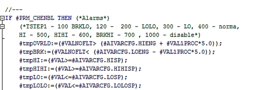
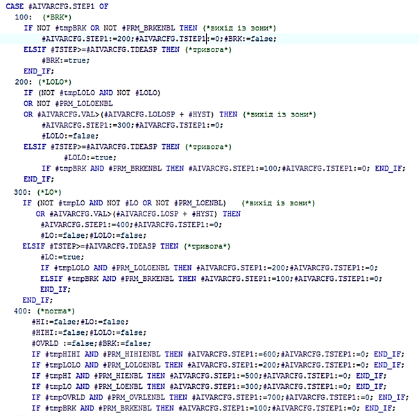
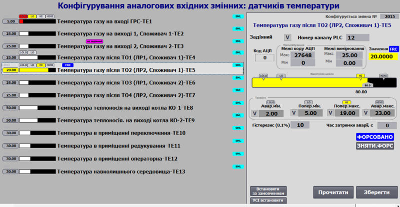

# Class AIVAR: Analog Process Input Variable

**CLSID=16#1030**

## General Description

This class implements functions for processing raw analog input data and diagnostic information from `AICH`. These functions include signal filtering, scaling, alarm configuration and handling, as well as forcing and simulation management.

If implementation differences are needed, other CLSIDs in the format 16#103x should be used.

Dedicated classes:

- CLSID=16#1030 – standard analog input variable
- CLSID=16#1031 – flow meter based on a digital input
- CLSID=16#1032 – network analog input variable
- CLSID=16#1033 – internal analog variable

## General Functional Requirements for AIVAR Functions

### Functional Requirements

#### Operating Modes

The AIVAR class must support the following modes (sub-modes):

- input processing/simulation
- non-forced/forced

In any mode, the value from the linked channel `AICH` is recorded to `AIVAR.VRAW`.

The **normal mode** of operation is a combination of "input processing" and "non-forced mode". In this mode, `AIVAR.VAL` depends on the `AIVAR.VRAW` channel value, passing through processing functions such as filtering and scaling.

In **simulation mode** (`STA.SML=TRUE`), `AIVAR.VAL` depends on the external simulation algorithm and bypasses the processing functions, being changed by upper-level CMs (or independent programs). In other words, `AIVAR.VAL` is not changed by the class algorithms except when forced. Simulation mode also changes the `STA.SML` status of the linked channel.

In **forced mode** (`STA.FRC=TRUE`), `AIVAR.VAL` is changed only through the HMI debug windows and has the highest priority. When the forcing bit is active, the counter `PLC_CFG.CNTFRC` increments by 1.

For **network and internal** variables (allocated to a separate class), there is a mode where the data source is changed externally and directly written to `AIVAR.VAL` without processing. This mode is activated by the `AIVAR.PRM.NORAW` parameter.

#### Signal Filtering

Filtering is implemented using the `A_FLTR` function. A first-order aperiodic time filter is used, with the filter time set by the `AIVAR.T_FLT` parameter in ms. To operate, the filter requires the elapsed time since the previous call (`dt`) and retains the previous cycle’s value in `AIVAR.VALPREV`.

#### **Signal Scaling**

Scaling is implemented using the `SCALING` function, which supports multiple modes:

- linear dependence (for all)
- square-root dependence (for all)
- piecewise-linear interpolation (optional)
- other dependencies (optional)

For linear scaling, the raw (unscaled) value from `AIVAR.VRAW`, input signal range (LORAW, HIRAW), and output signal range (LOENG, HIENG) are used. The function checks for NaN values and verifies range correctness at the start.

For square-root dependence, the raw data used is the product of the square root of the raw value `AIVAR.VRAW` and the square root of the maximum raw value `AIVAR.HIRAW`.

For piecewise-linear interpolation, an additional VR array can be used for intermediate scaling points (e.g., at 20%, 40%, 60%, 80%). Using more variables increases memory usage but improves interpolation accuracy. The OPTR array is allocated as needed.

Practical use in HMI often prefers displaying percentage values instead of absolute (engineering) values, as the framework allows changing the value range, which would otherwise require updating MIN and MAX on the SCADA/HMI side. Thus, engineering values (VAL) are used where absolute values are needed, and percentage values (VALPROC) where relative scale values are preferred. Since VALPROC increases SCADA/HMI tag count, its use should be justified.

The framework also includes a zero-cut function, where if the calculated scaled value `AIVAR.VAL` is below the configured parameter `AIVAR.ZERO_CUT_VAL`, it is set to zero. This is useful when analog values are used for counter accumulation, and flow meter values are near zero but not exactly zero, preventing significant cumulative error over time.

#### Channel Linking Monitoring

The `STA.DLNK=TRUE` value indicates the variable is linked to a channel.

#### Variable Activity

Variable activity is determined by the expression `STA.ENBL = NOT PRM.DSBL AND DLNK`. If the variable is inactive (`STA.ENBL=FALSE`), the following functions do not operate:

- signal processing from the raw value: filtering, scaling
- simulation
- alarm diagnostics and processing

Upper-level control hierarchies (e.g., CM LVL2) should treat this variable as temporarily non-existent (decommissioned). For example, if the variable represents a valve positioner feedback sensor, the CM can operate in "no analog feedback" mode.

#### Alarm Processing

The AIVAR class alarm processing includes:

- State list:
  - alarms: break, LOLO, LO, normal, HI, HIHI, overload
- Hysteresis when transitioning from a higher to a lower severity alarm
- Configurable activation delay parameters
- Delay when exiting a higher severity alarm to a lower one (for HMI alarm registration)

A simplified state machine without exit delay but using hysteresis (`AIVAR.HYST`) is shown below.

The hysteresis parameter `AIVAR.HYST` can be set in percentages or physical units depending on `AIVAR.PRM.PARAISPROC`.

AIVAR alarms are divided into:

- warnings – LO, HI
- critical alarms – LOLO, HIHI

Critical alarms are shown as `AIVAR.STA.ALM=TRUE`, warnings as `AIVAR.STA.WRN=TRUE`. On alarm activation (rising edge), `PLC_CFG.NWALM` or `PLC_CFG.NWWRN` are set, and while the alarm is active:

- The appropriate `PLC_CFG.ALM` or `PLC_CFG.WRN` bit is set
- The `PLC_CFG.CNTALM` or `PLC_CFG.CNTWRN` counter increments by 1





*Fig. 2.9. Example of alarm state processing*

#### Measurement Channel Diagnostics

Channel reliability can be verified in two ways:

- By monitoring break (`AIVAR.STA.BRK`) and overload (`AIVAR.STA.OVRLD`) alarms
- By diagnosing the linked physical measurement channel `AICH.STA.BAD`

When `AIVAR.PRM.QALENBL=TRUE`, `AIVAR.STA.BAD` depends on `AICH.STA.BAD` and the computed break/overload alarms.

`AIVAR.STA.BAD` represents a reliability alarm. On activation (rising edge), `PLC_CFG.NWBAD=TRUE`, and while active:

- The `PLC_CFG.ALM.BAD` bit is set
- The `PLC_CFG.CNTBAD` counter increments by 1

Resetting `AIVAR.PRM.QALENBL=FALSE` disables the reliability alarm check.

Optionally, fast signal change (`AIVAR.STA2.ASPD`) and signal freeze (`AIVAR.STA2.AFRZ`) warnings can be monitored:

- `AIVAR.STA2.ASPD` triggers if `AIVAR.VAL` changes by more than `AIVAR.VALPRV_ASPD` within 5 seconds
- `AIVAR.STA2.AFRZ` triggers if `AIVAR.VAL` does not change by at least `AIVAR.VALPRV_AFRZ` within 20 seconds

#### Integration (Optional)

For flow meters, time integration can be used. Accuracy depends on the value, algorithm, and variable type storing the integral. For example, using the `VR ARRAY [1..4] OF REAL` array allows storing intermediate integration results using rectangle or trapezoidal methods. `VR[1]` may store accumulated flow over 10 seconds or 1 minute to improve accuracy by adjusting for time.

Example:

- for 10s: (m³/3600s) * 10s
- for 60s: (m³/3600s) * 60s

Longer calculation intervals improve accuracy but may not be suitable for control tasks.

## Recommendations for HMI Usage

An example of analog input variable configuration on HMI is shown below.



*Fig. Example of analog input variable configuration on HMI.*

## General Requirements for Variable Class Structures

#### AIVAR_HMI

| name       | type | adr  | bit  | descr                                                        |
| ---------- | ---- | ---- | ---- | ------------------------------------------------------------ |
| STA        | UINT | 0    |      | statuses + load command bit `AIVAR_STA`                      |
| VALPRCSTA2 | UINT | 1    |      | VALPROC: high byte holds 0-100% value, low byte contains STA2 bits |
| VAL        | REAL | 2    |      | scaled value                                                 |

#### AIVAR_CFG

| name           | type  | adr  | bit  | descr                                                        |
| -------------- | ----- | ---- | ---- | ------------------------------------------------------------ |
| ID             | UINT  | 0    |      | unique identifier                                            |
| CLSID          | UINT  | 1    |      | 16#1030                                                      |
| STA            | UINT  | 2    |      | status, bit assignment like `AIVAR_STA`, can be used as a similar structure |
| STA_BRK        | BOOL  | 2    | 0    | =1 – channel break                                           |
| STA_OVRLD      | BOOL  | 2    | 1    | =1 – channel short circuit or overload                       |
| STA_BAD        | BOOL  | 2    | 2    | =1 – data invalid                                            |
| STA_ALDIS      | BOOL  | 2    | 3    | =1 – alarm disabled (decommissioned)                         |
| STA_DLNK       | BOOL  | 2    | 4    | =1 – linked to channel                                       |
| STA_ENBL       | BOOL  | 2    | 5    | =1 – variable active                                         |
| STA_ALM        | BOOL  | 2    | 6    | =1 – active process alarm, BAD inactive                      |
| STA_LOLO       | BOOL  | 2    | 7    | =1 – critically low value                                    |
| STA_LO         | BOOL  | 2    | 8    | =1 – low value                                               |
| STA_HI         | BOOL  | 2    | 9    | =1 – high value                                              |
| STA_HIHI       | BOOL  | 2    | 10   | =1 – critically high value                                   |
| STA_WRN        | BOOL  | 2    | 11   | =1 – active warning, BAD and ALM inactive                    |
| STA_INBUF      | BOOL  | 2    | 12   | =1 – variable in buffer                                      |
| STA_FRC        | BOOL  | 2    | 13   | =1 – forcing mode                                            |
| STA_SML        | BOOL  | 2    | 14   | =1 – simulation mode                                         |
| STA_CMDLOAD    | BOOL  | 2    | 15   | =1 – load command to buffer                                  |
| VALPRCSTA2     | INT   | 3    |      | VALPROC: high byte holds 0-100% value, low byte contains STA2 bits |
| PRM            | UINT  | 4    |      | configuration parameters, should persist across power cycles |
| PRM_LOENBL     | BOOL  | 4    | 0    | =1 – enable LO alarm                                         |
| PRM_HIENBL     | BOOL  | 4    | 1    | =1 – enable HI alarm                                         |
| PRM_LOLOENBL   | BOOL  | 4    | 2    | =1 – enable LOLO alarm                                       |
| PRM_HIHIENBL   | BOOL  | 4    | 3    | =1 – enable HIHI alarm                                       |
| PRM_BRKENBL    | BOOL  | 4    | 4    | =1 – enable break alarm                                      |
| PRM_OVRLENBL   | BOOL  | 4    | 5    | =1 – enable overload alarm                                   |
| PRM_QALENBL    | BOOL  | 4    | 6    | =1 – enable data quality check alarm                         |
| PRM_DSBL       | BOOL  | 4    | 7    | =1 – variable disabled                                       |
| PRM_PWLENBL    | BOOL  | 4    | 8    | =1 – enable piecewise-linear interpolation (not with TOTALON) |
| PRM_TOTALON    | BOOL  | 4    | 9    | =1 – enable integration (not with PWLENBL)                   |
| PRM_SQRT       | BOOL  | 4    | 10   | =1 – enable square-root scaling                              |
| PRM_PARAISPROC | BOOL  | 4    | 11   | =1 – hysteresis and deadband parameters are set as %         |
| PRM_AFRZENBL   | BOOL  | 4    | 12   | =1 – enable freeze detection alarm                           |
| PRM_ASPDENBL   | BOOL  | 4    | 13   | =1 – enable fast change detection alarm                      |
| PRM_STATICMAP  | BOOL  | 4    | 14   | =1 – static channel mapping                                  |
| PRM_NORAW      | BOOL  | 4    | 15   | =1 – external data source, bypass scaling (for network/internal) |
| CHID           | UINT  | 5    |      | logical analog channel number, 0 = no channel linked         |
| LORAW          | INT   | 6    |      | raw (unscaled) minimum value                                 |
| HIRAW          | INT   | 7    |      | raw (unscaled) maximum value                                 |
| VAL            | REAL  | 8    |      | scaled value                                                 |
| VALFRC         | REAL  | 10   |      | forced value storage                                         |
| LOENG          | REAL  | 12   |      | engineering minimum value                                    |
| HIENG          | REAL  | 14   |      | engineering maximum value                                    |
| LOSP           | REAL  | 16   |      | HI alarm setpoint                                            |
| HISP           | REAL  | 18   |      | LO alarm setpoint                                            |
| LOLOSP         | REAL  | 20   |      | LOLO alarm setpoint                                          |
| HIHISP         | REAL  | 22   |      | HIHI alarm setpoint                                          |
| THSP           | REAL  | 24   |      | process HI setpoint                                          |
| TLSP           | REAL  | 26   |      | process LO setpoint                                          |
| T_FLT          | UINT  | 28   |      | filter time in ms (first-order filter)                       |
| VRAW           | INT   | 29   |      | raw value                                                    |
| STA2           | UINT  | 30   |      | additional status, bit assignment like `AIVAR_STA`           |
| STA2_ASPD      | BOOL  | 30   | 0    | =1 – fast signal change `{A.BAD.0}`                          |
| STA2_AFRZ      | BOOL  | 30   | 1    | =1 – signal freeze                                           |
| STA2_AOVRFL    | BOOL  | 30   | 2    | =1 – overflow                                                |
| STA2_AUNDRFL   | BOOL  | 30   | 3    | =1 – underflow                                               |
| STA2_b4..b15   | BOOL  | 30   | 4-15 | reserved                                                     |
| tmp            | INT   | 31   |      | temporary variable for structure alignment                   |
| HYST           | REAL  | 32   |      | hysteresis in engineering units or % (`PRM_PARAISPROC`)      |
| TDEALL         | UINT  | 34   |      | LOLO alarm delay in 0.1s units                               |
| TDEAL          | UINT  | 35   |      | LO alarm delay in 0.1s units (optional)                      |
| TDEAH          | UINT  | 36   |      | HI alarm delay in 0.1s units (optional)                      |
| TDEAHH         | UINT  | 37   |      | HIHI alarm delay in 0.1s units (optional)                    |
| STEP1          | UINT  | 38   |      | step number                                                  |
| CHIDDF         | UINT  | 39   |      | default channel number                                       |
| T_STEP1        | UDINT | 40   |      | step elapsed time in ms                                      |
| T_PREV         | UDINT | 42   |      | previous call time in ms, from `PLC_CFG.TQMS`                |
| VALPRV         | REAL  | 44   |      | previous cycle value (for filtering)                         |
| VALPRV_AFRZ    | REAL  | 46   |      | previous value for freeze detection recalculation            |
| VALPRV_ASPD    | REAL  | 48   |      | previous value for fast change detection recalculation       |
| DEASP_AFRZ     | REAL  | 50   |      | freeze detection deadband setpoint                           |
| DOPSP_ASPD     | REAL  | 52   |      | fast change detection tolerance setpoint                     |
| ZERO_CUT_VAL   | REAL  | 54   |      | zero-cut value                                               |

Additional parameters are connected as needed and passed to the `AIVAR_FN` call.

| Attribute | Type                  | Description                                                  |
| --------- | --------------------- | ------------------------------------------------------------ |
| OPTR      | ARRAY [1..4] OF REAL  | Array of additional REAL variables. Example use:  **Example 1 (Piecewise-linear interpolation):** VR[1-4] for 20/40/60/80%. **Example 2 (Integrator):** VR[1] – sum over last 10s/min, VR[2] – hourly total, VR[3] – previous hour total, VR[4] – resettable batch total. |
| OPTD      | ARRAY [1..4] OF UDINT | Array of additional UDINT variables                          |

#### Buffer Commands (see buffer structure)

| Attribute | Type | Description                                                  |
| --------- | ---- | ------------------------------------------------------------ |
| CMD       | UINT | Commands:16#0001: write maximum range – forcing only16#0002: write minimum range – forcing only16#0003: write midpoint of range – forcing only16#0100: read configuration16#0101: write configuration16#0102: write default value16#0160: toggle LOENBL16#0161: toggle HIENBL16#0162: toggle LOLOENBL16#0163: toggle HIHIENBL16#0300: toggle forcing16#0301: enable forcing16#0302: disable forcing16#0311: enable simulation16#0312: disable simulation |

#### Working with the buffer

A classical buffer handling function must be implemented.

- It is recommended to use a **single shared buffer for all process variables**.
- Buffer occupation is checked by matching the `CLSID` and the process variable `ID`.
- When the buffer is captured:
  - `VARBUF.STA = AIVAR_CFG.STA`
  - `AIVAR_CFG.CMD = VARBUF.CMD` if non-zero (allowing commands from other sources)
  - status bits of the physical channel linked to the variable are read into `VARBUF.CH_STA = CHCFG.STA`.
- The process variable configuration must be read into the buffer upon receiving:
  - status bit `STA.CMDLOAD=TRUE`
  - update of the process variable already written in the buffer with `VARBUF.CMD = 16#0100;`
- The process variable configuration must be written from the buffer upon receiving:
  - `VARBUF.CMD = 16#0101;`

A **bidirectional parameter buffer function (VARBUFIN <-> VARBUFOUT)** must also be implemented.

- Two buffers are used:
  - input buffer `VARBUFIN` – used to handle commands (if `CLSID` and `ID` match) and to write data into the process variable
  - output buffer `VARBUFOUT` – used to read data from the process variable upon receiving a read command via `VARBUFIN`
- It is recommended to use **one pair of these buffers for all process variables**.
- Buffer occupation cannot occur in this design, as it is handled using two variables (`VARBUFIN` and `VARBUFOUT`) for structured transfer, similar to PKW parameter exchange in PROFIDRIVE profiles.
- The process variable configuration must be read into the output buffer when:
  - class IDs match `AIVARCFG.CLSID=VARBUFIN.CLSID`, variable IDs match `AIVARCFG.ID=VARBUFIN.ID`, and the input buffer receives `VARBUFIN.CMD=16#100`
- The process variable configuration must be written from the input buffer when:
  - class IDs match `AIVARCFG.CLSID=VARBUFIN.CLSID`, variable IDs match `AIVARCFG.ID=VARBUFIN.ID`, and the input buffer receives `VARBUFIN.CMD=16#101`

### Interface Implementation Requirements

INOUT:

- `CHCFG` – physical channel linked to the process variable
- `AIVARCFG` – configuration part of the process variable
- `AIVARHMI` – HMI part of the process variable
- If external variable access inside functions is not possible, pass `PLC_CFG`, `VARBUF`, `VARBUFIN`, `VARBUFOUT`; alternatively, other interfaces may be used within `PLC_CFG`.

### Process Variable Initialization on First Cycle

Default `ID`, `CHID`, and `CHIDDF` assignment is performed in the `initvars` program section.

For each process variable in `initvars`, the following code fragment must be used for assignment:

```pascal
"VAR".AIVAR1.ID := 1001;
"VAR".AIVAR1.CHID := 1;
"VAR".AIVAR1.CHIDDF := 1;
```

Initialization is also performed inside the process variable handling function, resulting in:

- setting `AIVARCFG.CLSID := 16#1030;`
- activating the process variable with `AIVARCFG.PRM.DSBL := FALSE;`
- if the logical channel number is not set, assigning the default: `AIVARCFG.CHID := AIVARCFG.CHIDDF;`
- activating data quality check alarms.

### User Program Implementation Requirements

- The **process variable handling functions must be called with every cycle of the task they are linked to.**
- On first startup (`PLC_CFG.SCN1`), the **process variable identifier `AIVAR_CFG.ID` and logical channel number `AIVAR_CFG.CHID` must be initialized**.

```pascal
(*variable initialization on the first processing cycle*)
IF "SYS".PLCCFG.STA.SCN1 THEN
    #AIVARCFG.CLSID := 16#1030; (*assign class identifier*)
    #AIVARCFG.PRM.DSBL := FALSE; (*activate variable*)
    #AIVARCFG.PRM.QALENBL := true; (*enable data quality alarms*)
    #AIVARCFG.PRM.BRKENBL := TRUE; (*enable wire break alarms*)
    #AIVARCFG.PRM.OVRLENBL := TRUE; (*enable short-circuit alarms*)
    #AIVARCFG.T_PREV := "SYS".PLCCFG.TQMS; (*store call timestamp*)
    IF #AIVARCFG.CHID = 0 THEN (*if logical channel number not set, assign default value*)
        #AIVARCFG.CHID := #AIVARCFG.CHIDDF;
    END_IF;
    
    (*write raw value from channel for further processing*)
    IF #CHCFG.ID > 0 THEN
        #VRAW := #CHCFG.VAL;
    ELSE
        #VRAW := 0;
    END_IF;
    #AIVARCFG.VALPRV := INT_TO_REAL(#VRAW);
    #AIVARCFG.VRAW := REAL_TO_INT(#AIVARCFG.VALPRV);
    #AIVARCFG.VAL := INT_TO_REAL(#AIVARCFG.VRAW) ;
    
    #AIVARCFG.T_STEP1 := 0; (*reset step time*)
    #AIVARCFG.STEP1 := 400; (*switch to normal state step*)
    
    (*determine variable ID range limits*)
    IF #AIVARCFG.ID>0 THEN
        IF #AIVARCFG.ID<"SYS".VARIDMIN THEN "SYS".VARIDMIN:=#AIVARCFG.ID; END_IF;
        IF #AIVARCFG.ID>"SYS".VARIDMAX THEN "SYS".VARIDMAX:=#AIVARCFG.ID; END_IF;
    END_IF;
    RETURN;
END_IF;

(*read status bits from the process variable into internal variables*)
#BRK := #AIVARCFG.STA.BRK;
#OVRLD := #AIVARCFG.STA.OVRLD;
#BAD := #AIVARCFG.STA.BAD;
#ALDIS := #AIVARCFG.STA.ALDIS;
#ENBL := #AIVARCFG.STA.ENBL;
#ALM := #AIVARCFG.STA.ALM;
#LOLO := #AIVARCFG.STA.LOLO;
#LO := #AIVARCFG.STA.LO;
#HI := #AIVARCFG.STA.HI;
#HIHI := #AIVARCFG.STA.HIHI;
#WRN := #AIVARCFG.STA.WRN;
#FRC := #AIVARCFG.STA.FRC;
#SML := #AIVARCFG.STA.SML;
#CMDLOAD := #AIVARCFG.STA.CMDLOAD;

#INBUF := (#AIVARCFG.ID = "BUF".VARBUF.ID) AND (#AIVARCFG.CLSID = "BUF".VARBUF.CLSID); (*variable in buffer if variable ID and class ID match*)
#CMDLOAD := #AIVARHMI.STA.%X15; (*buffer write command from HMI variable*)
#CMD := 0; (*reset internal command*)
#DLNK := (#CHCFG.ID > 0); (*variable is linked to the channel if the channel has a real ID (not 0 - not unused)*)
#VARENBL := NOT #AIVARCFG.PRM.DSBL AND #DLNK; (*variable is active if linked to channel and 'disabled' parameter is inactive*)

(*read parameters from the process variable into internal variables*)
#LORAW := #AIVARCFG.LORAW;
#HIRAW := #AIVARCFG.HIRAW;
#LOENG := #AIVARCFG.LOENG;
#HIENG := #AIVARCFG.HIENG;
#LOSP := #AIVARCFG.LOSP;
#HISP := #AIVARCFG.HISP;
#LOLOSP := #AIVARCFG.LOLOSP;
#HIHISP := #AIVARCFG.HIHISP;
IF #AIVARCFG.T_FLT <= 0 THEN (*filter time cannot be zero*)
    #AIVARCFG.T_FLT := 1;
END_IF;
#T_FLT := UINT_TO_UDINT(#AIVARCFG.T_FLT);
#T_DEALL := UINT_TO_UDINT(#AIVARCFG.T_DEALL*100);
#T_DEAL := UINT_TO_UDINT(#AIVARCFG.T_DEAL*100);
#T_DEAH := UINT_TO_UDINT(#AIVARCFG.T_DEAH*100);
#T_DEAHH := UINT_TO_UDINT(#AIVARCFG.T_DEAHH*100);

#VRAW := #CHCFG.VAL; (*read raw value from channel*)
#T_STEPMS := #AIVARCFG.T_STEP1; (*store cycle time in ms*)
#VAL := #AIVARCFG.VAL; (*read value from process variable into internal variable for further processing*)
#VALPRV := #AIVARCFG.VALPRV; (*read previous value from process variable into internal variable for further processing*)

(*enforce range limits if previous value is out of range*)
IF #VALPRV <= #AIVARCFG.LOENG THEN
    #VALPRV:=#AIVARCFG.LOENG;
ELSIF #VALPRV>#AIVARCFG.HIENG THEN
    #VALPRV:=#AIVARCFG.HIENG;
END_IF;

(*implement ping-pong algorithm*)
IF #DLNK THEN
    #CHCFG.STA.PNG := true;
    #CHCFG.VARID := #AIVARCFG.ID;
END_IF;

(*determine time between function calls by the difference between the millisecond counter and the time since the previous call*)
#dT := "SYS".PLCCFG.TQMS - #AIVARCFG.T_PREV;

(*NaN check*)
IF NOT (#VALPRV<#AIVARCFG.LOENG OR #VALPRV>=#AIVARCFG.LOENG) THEN
    #VALPRV:=#AIVARCFG.LOENG;
END_IF;

(*determine 1% of scale*)
#VAL1PROC := (#AIVARCFG.HIENG - #AIVARCFG.LOENG) / 100.0; (*1% EU*)
IF #VAL1PROC = 0.0 THEN
    #VAL1PROC := 1.0;
END_IF;

(*hysteresis depending on the hysteresis setting parameter*)
IF #AIVARCFG.PRM.PARAISPROC THEN (*%*)
    #HYST := #AIVARCFG.HYST * #VAL1PROC;
ELSE (*real units*)
    #HYST := #AIVARCFG.HYST;
END_IF;

(*check range validity*)
IF ABS(#AIVARCFG.HIRAW - #AIVARCFG.LORAW) < 1 THEN
    #AIVARCFG.LORAW := 0;
    #AIVARCFG.HIRAW := 27648;
END_IF;
IF ABS(#AIVARCFG.HIENG - #AIVARCFG.LOENG) < 0.00001 THEN
    #AIVARCFG.LOENG := 0.0;
    #AIVARCFG.HIENG := 100.0;
END_IF;

(*clear invalid values +infinity (INF), -infinity (-INF), SNAN, QNAN*)
(*when exponent (bits 23-30) = 255*)
#tmpDWORD := SHR(IN := REAL_TO_DWORD(#AIVARCFG.VAL), N := 23) AND 16#00FF;
IF #tmpDWORD = 16#00ff THEN
    #AIVARCFG.VAL := 0.0;
END_IF;

(*scaling*)
#PRM_SCL:=0;
#STA_SCL:=0;
#PRM_SCL.%X0 := #AIVARCFG.PRM.SQRT; (*square root scaling, X0*)
#PRM_SCL.%X1 := true; (*limit output value, X1*)

IF #VARENBL THEN
    #VALNOFLT := "SCALING" (IN := INT_TO_REAL(#VRAW),
                            in_min := INT_TO_REAL(#LORAW),
                            in_max := INT_TO_REAL(#HIRAW),
                            out_min := #LOENG,
                            out_max := #HIENG,
                            STA := #STA_SCL,
                            PRM := #PRM_SCL);
ELSE
    #VALNOFLT :=#VRAW;
END_IF;
```

```pascal
(* if zero cut-off is active (greater than zero) and value is less, then set value to zero, otherwise scale the value *)
IF #AIVARCFG.ZERO_CUT_VAL > 0.0 AND (#LOENG + INT_TO_REAL(#VRAW - #LORAW) * (#HIENG - #LOENG) / INT_TO_REAL(#HIRAW - #LORAW)) <= #AIVARCFG.ZERO_CUT_VAL THEN
    #VALNOFLT := 0.0;
END_IF;

(*filtering*)
IF #VARENBL THEN
    #VAL:="A_FLTR" (IN := #VALNOFLT, dT := #dT, T_FLT := #T_FLT, PRM := #tmpuint, STA := #tmpuint, VALPRV := #VALPRV);
ELSE
    #VAL:=#VALNOFLT;
END_IF;

(* broadcast de-force *)
IF "SYS".PLCCFG.CMD = 16#4302 THEN
    #FRC := false; (*de-force object type*)
END_IF;

(* selection of configuration/control command source by priority if commands arrive simultaneously *)
IF #CMDLOAD THEN (*buffer write command from HMI*)
    #CMD := 16#0100;
ELSIF #INBUF AND "BUF".VARBUF.CMD <> 0 THEN (*command from buffer*)
    #CMD := "BUF".VARBUF.CMD;
END_IF;

(*commands*)
CASE #CMD OF
    16#0001: (*write maximum range*)
        IF #FRC AND #INBUF THEN
            #AIVARCFG.VALFRC := #AIVARCFG.HIENG;
            #VAL := #AIVARCFG.HIENG;
            #AIVARCFG.STEP1 := 400;
            #AIVARCFG.T_STEP1 := 0;
        END_IF;
    16#0002: (*write minimum range*)
        IF #FRC AND #INBUF THEN
            #AIVARCFG.VALFRC := #AIVARCFG.LOENG;
            #VAL := #AIVARCFG.LOENG;
            #AIVARCFG.STEP1 := 400;
            #AIVARCFG.T_STEP1 := 0;
        END_IF;
    16#0003: (*write mid range*)
        IF #FRC AND #INBUF THEN
            #AIVARCFG.VALFRC := (#AIVARCFG.HIENG - #AIVARCFG.LOENG) / 2.0;
            #VAL := (#AIVARCFG.HIENG - #AIVARCFG.LOENG) / 2.0;
            #AIVARCFG.STEP1 := 400;
            #AIVARCFG.T_STEP1 := 0;
        END_IF;
    16#0100: (*read configuration*)
        (* MSG 200-Ok 400-Error
        // 200 - Data written
        // 201 - Data read
        // 403 - channel already occupied
        // 404 - channel number out of range
        // 405 - static channel mapping active *)
        "BUF".VARBUF.MSG := 201;
        
        (*read variable and class identifiers*)
        "BUF".VARBUF.ID := #AIVARCFG.ID;
        "BUF".VARBUF.CLSID := #AIVARCFG.CLSID;
        
        (*read bit parameters*)
        "BUF".VARBUF.PRM.%X0 := #AIVARCFG.PRM.LOENBL;
        "BUF".VARBUF.PRM.%X1 := #AIVARCFG.PRM.HIENBL;
        "BUF".VARBUF.PRM.%X2 := #AIVARCFG.PRM.LOLOENBL;
        "BUF".VARBUF.PRM.%X3 := #AIVARCFG.PRM.HIHIENBL;
        "BUF".VARBUF.PRM.%X4 := #AIVARCFG.PRM.BRKENBL;
        "BUF".VARBUF.PRM.%X5 := #AIVARCFG.PRM.OVRLENBL;
        "BUF".VARBUF.PRM.%X6 := #AIVARCFG.PRM.QALENBL;
        "BUF".VARBUF.PRM.%X7 := #AIVARCFG.PRM.DSBL;
        "BUF".VARBUF.PRM.%X8 := #AIVARCFG.PRM.PWLENBL;
        "BUF".VARBUF.PRM.%X9 := #AIVARCFG.PRM.TOTALON;
        "BUF".VARBUF.PRM.%X10 := #AIVARCFG.PRM.SQRT;
        "BUF".VARBUF.PRM.%X11 := #AIVARCFG.PRM.PARAISPROC;
        "BUF".VARBUF.PRM.%X12 := #AIVARCFG.PRM.AFRZENBL;
        "BUF".VARBUF.PRM.%X13 := #AIVARCFG.PRM.ASPDENBL;
        "BUF".VARBUF.PRM.%X14 := #AIVARCFG.PRM.STATICMAP;
        "BUF".VARBUF.PRM.%X15 := #AIVARCFG.PRM.NORAW;
        
        (*read parameters*)
        "BUF".VARBUF.CHID := #AIVARCFG.CHID;
        "BUF".VARBUF.LORAW := #AIVARCFG.LORAW;
        "BUF".VARBUF.HIRAW := #AIVARCFG.HIRAW;
        "BUF".VARBUF.LOENG := #AIVARCFG.LOENG;
        "BUF".VARBUF.HIENG := #AIVARCFG.HIENG;
        "BUF".VARBUF.HIHISP := #AIVARCFG.HIHISP;
        "BUF".VARBUF.HISP := #AIVARCFG.HISP;
        "BUF".VARBUF.LOSP := #AIVARCFG.LOSP;
        "BUF".VARBUF.LOLOSP := #AIVARCFG.LOLOSP;
        "BUF".VARBUF.T_FLTSP := #AIVARCFG.T_FLT;
        "BUF".VARBUF.HYST := #AIVARCFG.HYST;
        "BUF".VARBUF.T_DEAHH := #AIVARCFG.T_DEAHH;
        "BUF".VARBUF.T_DEAH := #AIVARCFG.T_DEAH;
        "BUF".VARBUF.T_DEAL := #AIVARCFG.T_DEAL;
        "BUF".VARBUF.T_DEALL := #AIVARCFG.T_DEALL;
        "BUF".VARBUF.VALPRV_AFRZ :=#AIVARCFG.VALPRV_AFRZ;
        "BUF".VARBUF.VALPRV_ASPD :=#AIVARCFG.VALPRV_ASPD;
        "BUF".VARBUF.DEASP_AFRZ :=#AIVARCFG.DEASP_AFRZ;
        "BUF".VARBUF.DOPSP_ASPD := #AIVARCFG.DOPSP_ASPD;
        "BUF".VARBUF.ZERO_CUT_VAL := #AIVARCFG.ZERO_CUT_VAL;
        
        (*read variable value for bumpless forcing*)
        "BUF".VARBUF.VALR := #AIVARCFG.VALFRC;
        
    16#0101: (*write configuration*)
        (* MSG 200-Ok 400-Error
        // 200 - Data written
        // 201 - Data read
        // 403 - channel already occupied
        // 404 - channel number out of range
        // 405 - static channel mapping active*)
        "BUF".VARBUF.MSG:=200;
        
        (*write bit parameters*)
        #AIVARCFG.PRM.LOENBL := "BUF".VARBUF.PRM.%X0;
        #AIVARCFG.PRM.HIENBL := "BUF".VARBUF.PRM.%X1;
        #AIVARCFG.PRM.LOLOENBL := "BUF".VARBUF.PRM.%X2;
        #AIVARCFG.PRM.HIHIENBL := "BUF".VARBUF.PRM.%X3;
        #AIVARCFG.PRM.BRKENBL := "BUF".VARBUF.PRM.%X4;
        #AIVARCFG.PRM.OVRLENBL := "BUF".VARBUF.PRM.%X5;
        #AIVARCFG.PRM.QALENBL := "BUF".VARBUF.PRM.%X6;
        #AIVARCFG.PRM.DSBL := "BUF".VARBUF.PRM.%X7;
        #AIVARCFG.PRM.PWLENBL := "BUF".VARBUF.PRM.%X8;
        #AIVARCFG.PRM.TOTALON := "BUF".VARBUF.PRM.%X9;
        #AIVARCFG.PRM.SQRT := "BUF".VARBUF.PRM.%X10;
        #AIVARCFG.PRM.PARAISPROC := "BUF".VARBUF.PRM.%X11;
        #AIVARCFG.PRM.AFRZENBL := "BUF".VARBUF.PRM.%X12;
        #AIVARCFG.PRM.ASPDENBL := "BUF".VARBUF.PRM.%X13;
        #AIVARCFG.PRM.STATICMAP := "BUF".VARBUF.PRM.%X14;
        #AIVARCFG.PRM.NORAW := "BUF".VARBUF.PRM.%X15;
        
        (*write parameters*)
        #AIVARCFG.LORAW := "BUF".VARBUF.LORAW;
        #AIVARCFG.HIRAW := "BUF".VARBUF.HIRAW;
        #AIVARCFG.LOENG := "BUF".VARBUF.LOENG;
        #AIVARCFG.HIENG := "BUF".VARBUF.HIENG;
        #AIVARCFG.HIHISP := "BUF".VARBUF.HIHISP;
        #AIVARCFG.HISP := "BUF".VARBUF.HISP;
        #AIVARCFG.LOSP := "BUF".VARBUF.LOSP;
        #AIVARCFG.LOLOSP := "BUF".VARBUF.LOLOSP;
        #AIVARCFG.T_FLT := "BUF".VARBUF.T_FLTSP;
        #AIVARCFG.HYST := "BUF".VARBUF.HYST;
        #AIVARCFG.T_DEAHH := "BUF".VARBUF.T_DEAHH;
        #AIVARCFG.T_DEAH := "BUF".VARBUF.T_DEAH;
        #AIVARCFG.T_DEAL := "BUF".VARBUF.T_DEAL;
        #AIVARCFG.T_DEALL := "BUF".VARBUF.T_DEALL;
        #AIVARCFG.VALPRV_AFRZ := "BUF".VARBUF.VALPRV_AFRZ ;
        #AIVARCFG.VALPRV_ASPD := "BUF".VARBUF.VALPRV_ASPD ;
        #AIVARCFG.DEASP_AFRZ := "BUF".VARBUF.DEASP_AFRZ ;
        #AIVARCFG.DOPSP_ASPD :=  "BUF".VARBUF.DOPSP_ASPD ;
        #AIVARCFG.ZERO_CUT_VAL := "BUF".VARBUF.ZERO_CUT_VAL  ;
        
        (*algorithm for changing logical channel number with validation*)
        IF NOT #AIVARCFG.PRM.STATICMAP THEN (*change logical channel number only if static mapping is inactive*)
            IF "BUF".VARBUF.CHID>=0 AND "BUF".VARBUF.CHID <= INT_TO_UINT("SYS".PLCCFG.AICNT) THEN (*if channel number is within range*)
                IF "SYS".CHAI["BUF".VARBUF.CHID].VARID = 0 THEN (*if channel is free*)
                    #AIVARCFG.CHID := "BUF".VARBUF.CHID; (*change logical channel number*)
                ELSIF "BUF".VARBUF.CHID <> #AIVARCFG.CHID THEN  (*otherwise return channel occupied error*)
                    "BUF".VARBUF.MSG := 403;(*channel occupied*)
                END_IF;
            ELSE
                "BUF".VARBUF.MSG := 404; (*channel number out of range*)
            END_IF;
        ELSIF "BUF".VARBUF.CHID <> #AIVARCFG.CHID THEN (*otherwise return static mapping error*)
            "BUF".VARBUF.MSG := 405;(*static channel mapping active*)
        END_IF;
        IF #INBUF THEN (*update logical channel after write if variable remains in buffer*)
            "BUF".VARBUF.CHID := #AIVARCFG.CHID;
        END_IF;
    16#0102: (*write default value*)
        #AIVARCFG.CHID := #AIVARCFG.CHIDDF;
    16#0160: (*toggle LOENBL*)
        #AIVARCFG.PRM.LOENBL := NOT #AIVARCFG.PRM.LOENBL;
    16#0161: (*toggle HIENBL*)
        #AIVARCFG.PRM.HIENBL := NOT #AIVARCFG.PRM.HIENBL;
    16#0162: (*toggle LOLOENBL*)
        #AIVARCFG.PRM.LOLOENBL := NOT #AIVARCFG.PRM.LOLOENBL;
    16#0163: (*toggle HIHIENBL*)
        #AIVARCFG.PRM.HIHIENBL := NOT #AIVARCFG.PRM.HIHIENBL;
    16#0300: (*toggle forcing*)
        #FRC := NOT #FRC;
    16#0301: (*enable forcing*)
        #FRC := true;
    16#0302: (*disable forcing*)
        #FRC := false;
    16#0311: (*enable simulation*)
        #SML := true;
    16#0312: (*disable simulation*)
        #SML := false;
END_CASE;
```

```pascal
(*value processing*)
IF #FRC THEN (*if forcing, take value from buffer*)
    IF #INBUF THEN
        #AIVARCFG.VAL := "BUF".VARBUF.VALR;
        #AIVARCFG.VALFRC := "BUF".VARBUF.VALR;
    END_IF;
    #VAL := #AIVARCFG.VALFRC;
ELSIF #SML OR #AIVARCFG.PRM.NORAW THEN (*simulation mode or external data source - value is updated externally*)
    #VAL := #AIVARCFG.VAL;
ELSE  (*non-forced value processing - normal variable processing*)
    #AIVARCFG.VALFRC := #VAL;
END_IF;


(*alarm processing*)
#BRK := false;
#LO := false;
#LOLO := false;
#HI := false;
#HIHI := false;
#OVRLD := false;
#T_DEAQALSP := 10;     (* delay time for break and overload alarms in 0.1 s*)

(*no alarming*)
IF #VARENBL THEN (*alarms are processed only when variable is active*)
    (*check for triggering*)
    #tmpOVRLD := #CHCFG.VAL>=32511;
    #tmpBRK := #CHCFG.VAL<=-4864;
    #tmpHI := (#VAL >= #AIVARCFG.HISP);
    #tmpHIHI := (#VAL >= #AIVARCFG.HIHISP);
    #tmpLO := (#VAL <= #AIVARCFG.LOSP);
    #tmpLOLO := (#VAL <= #AIVARCFG.LOLOSP);
    
    (*if quality check is disabled, forcibly disable BRKENBL and OVRLENBL*)
    IF NOT #AIVARCFG.PRM.QALENBL THEN
        #AIVARCFG.PRM.BRKENBL := false;
        #AIVARCFG.PRM.OVRLENBL := false;
    END_IF;
    
    (*state machine processing*)
    CASE #AIVARCFG.STEP1 OF
        100:  (*BRK - channel break*)
            #LO := #AIVARCFG.PRM.LOENBL;
            #LOLO := #AIVARCFG.PRM.LOLOENBL;
            IF NOT #tmpBRK OR NOT #AIVARCFG.PRM.BRKENBL THEN (*exit zone*)
                #AIVARCFG.STEP1 := 200;
            ELSIF #T_STEPMS >= INT_TO_UDINT(#T_DEAQALSP) THEN (*alarm*)
                #BRK := true;
            END_IF;
        200: (*LOLO*)
            #LO := #AIVARCFG.PRM.LOENBL;
            #LOLO := #AIVARCFG.PRM.LOLOENBL AND #T_STEPMS >= UINT_TO_UDINT(#T_DEALL);
            IF NOT #LOLO AND NOT #tmpLOLO
                OR NOT #AIVARCFG.PRM.LOLOENBL
                OR #AIVARCFG.VAL > (#AIVARCFG.LOLOSP + #HYST) THEN (*exit zone*)
                #AIVARCFG.STEP1 := 300;
            END_IF;
            IF #LOLO AND #tmpBRK AND #AIVARCFG.PRM.BRKENBL THEN
                #AIVARCFG.STEP1 := 100;
                #AIVARCFG.T_STEP1 := 0;
            END_IF;
        300: (*LO*)
            #LO := #AIVARCFG.PRM.LOENBL AND #T_STEPMS >= UINT_TO_UDINT(#T_DEAL);
            IF (NOT #tmpLO AND NOT #LO OR NOT #AIVARCFG.PRM.LOENBL)   (*exit zone*)
                OR #AIVARCFG.VAL > (#AIVARCFG.LOSP + #HYST) THEN
                #AIVARCFG.STEP1 := 400;
                #AIVARCFG.T_STEP1 := 0;
            END_IF;
            IF #LO AND #tmpLOLO AND #AIVARCFG.PRM.LOLOENBL THEN
                #AIVARCFG.STEP1 := 200;
                #AIVARCFG.T_STEP1 := 0;
            END_IF;
            IF #LO AND #tmpBRK AND #AIVARCFG.PRM.BRKENBL THEN
                #AIVARCFG.STEP1 := 100;
                #AIVARCFG.T_STEP1 := 0;
            END_IF;
        400: (*normal*)
            IF #tmpHI AND #AIVARCFG.PRM.HIENBL THEN
                #AIVARCFG.STEP1 := 500;
                #AIVARCFG.T_STEP1 := 0;
            END_IF;
            IF #tmpLO AND #AIVARCFG.PRM.LOENBL THEN
                #AIVARCFG.STEP1 := 300;
                #AIVARCFG.T_STEP1 := 0;
            END_IF;
            IF #tmpHIHI AND #AIVARCFG.PRM.HIHIENBL THEN
                #AIVARCFG.STEP1 := 460;
                #AIVARCFG.T_STEP1 := 0;
            END_IF;
            IF #tmpLOLO AND #AIVARCFG.PRM.LOLOENBL THEN
                #AIVARCFG.STEP1 := 420;
                #AIVARCFG.T_STEP1 := 0;
            END_IF;
            IF #tmpBRK AND #AIVARCFG.PRM.BRKENBL THEN
                #AIVARCFG.STEP1 := 410;
                #AIVARCFG.T_STEP1 := 0;
            END_IF;
            IF #tmpOVRLD AND #AIVARCFG.PRM.OVRLENBL THEN
                #AIVARCFG.STEP1 := 470;
                #AIVARCFG.T_STEP1 := 0;
            END_IF;
        410: (*normal -> break*)
            IF NOT #tmpBRK OR NOT #AIVARCFG.PRM.BRKENBL THEN (*exit zone*)
                #AIVARCFG.STEP1 := 400;
                #AIVARCFG.T_STEP1 := 0;
            ELSIF #T_STEPMS >= INT_TO_UDINT(#T_DEAQALSP) THEN (*alarm*)
                #AIVARCFG.STEP1 := 100;
            END_IF;
        420: (*normal -> LOLO*)
            IF NOT #tmpLOLO OR NOT #AIVARCFG.PRM.LOLOENBL THEN (*exit zone*)
                #AIVARCFG.STEP1 := 400;
                #AIVARCFG.T_STEP1 := 0;
            ELSIF #T_STEPMS >= UINT_TO_UDINT(#T_DEALL) THEN (*alarm*)
                #AIVARCFG.STEP1 := 200;
            END_IF;
        460: (*normal -> HIHI*)
            IF NOT #tmpHIHI OR NOT #AIVARCFG.PRM.HIHIENBL THEN (*exit zone*)
                #AIVARCFG.STEP1 := 400;
                #AIVARCFG.T_STEP1 := 0;
            ELSIF #T_STEPMS >= UINT_TO_UDINT(#T_DEAHH) THEN (*alarm*)
                #AIVARCFG.STEP1 := 600;
            END_IF;
        470: (*normal -> OVRLD*)
            IF NOT #tmpOVRLD OR NOT #AIVARCFG.PRM.OVRLENBL THEN (*exit zone*)
                #AIVARCFG.STEP1 := 400;
                #AIVARCFG.T_STEP1 := 0;
            ELSIF #T_STEPMS >= INT_TO_UDINT(#T_DEAQALSP) THEN (*alarm*)
                #AIVARCFG.STEP1 := 700;
            END_IF;
        500: (*HI*)
            #HI := #AIVARCFG.PRM.HIENBL AND #T_STEPMS >= UINT_TO_UDINT(#T_DEAH);
            IF NOT #tmpHI AND NOT #HI
                OR NOT #AIVARCFG.PRM.HIENBL (*exit zone*)
                OR #AIVARCFG.VAL < (#AIVARCFG.HISP - #HYST) THEN
                #AIVARCFG.STEP1 := 400;
                #AIVARCFG.T_STEP1 := 0;
            END_IF;
            IF #HI AND #tmpHIHI AND #AIVARCFG.PRM.HIHIENBL THEN
                #AIVARCFG.STEP1 := 600;
                #AIVARCFG.T_STEP1 := 0;
            END_IF;
            IF #HI AND #tmpOVRLD AND #AIVARCFG.PRM.OVRLENBL THEN
                #AIVARCFG.STEP1 := 700;
                #AIVARCFG.T_STEP1 := 0;
            END_IF;
        600: (*HIHI*)
            #HI := #AIVARCFG.PRM.HIENBL;
            #HIHI := #AIVARCFG.PRM.HIHIENBL AND #T_STEPMS >= UINT_TO_UDINT(#T_DEAHH);
            IF NOT #tmpHIHI AND NOT #HIHI OR
                NOT #AIVARCFG.PRM.HIHIENBL OR
                #AIVARCFG.VAL < (#AIVARCFG.HIHISP - #HYST) THEN (*exit zone*)
                #AIVARCFG.STEP1 := 500;
            END_IF;
            IF #HI AND #tmpOVRLD AND #AIVARCFG.PRM.OVRLENBL THEN
                #AIVARCFG.STEP1 := 700;
                #AIVARCFG.T_STEP1 := 0;
            END_IF;
        700: (*OVRLD - overload/short circuit*)
            #HI := #AIVARCFG.PRM.HIENBL;
            #HIHI := #AIVARCFG.PRM.HIHIENBL;
            IF (NOT #tmpOVRLD OR NOT #AIVARCFG.PRM.OVRLENBL) THEN (*exit zone*)
                #AIVARCFG.STEP1 := 600;
            ELSIF #T_STEPMS >= INT_TO_UDINT(#T_DEAQALSP) THEN (*alarm*)
                #OVRLD := true;
            END_IF;
        ELSE
            #AIVARCFG.STEP1 := 400;
    END_CASE;
ELSE
    #AIVARCFG.VRAW := #VRAW;
    #AIVARCFG.VAL := #VALNOFLT;
    #AIVARCFG.T_STEP1 := 0;
    #AIVARCFG.STEP1 := 400;
    #BAD := false;
    #BRK := false;
    #LO := false;
    #LOLO := false;
    #HI := false;
    #HIHI := false;
    #OVRLD := false;
    #ENBL := false;
END_IF;

```

```pascal
(*initialization of variables for freeze and spike control*)
IF "SYS".PLCCFG.STA.SCN1 THEN
    #AIVARCFG.VALPRV_AFRZ := #VAL;
    #AIVARCFG.VALPRV_ASPD := #VAL;
END_IF;

(* Freeze check *)
(*within 20 sec the value should change by more than the setpoint in units; if setpoint is 0 - use default*)
IF #AIVARCFG.PRM.AFRZENBL THEN
    #tmpAFRZ:=#AIVARCFG.STA2.AFRZ;
    (*check every 20 sec on a single cycle*)
    IF ("SYS".PLCCFG.TQ MOD 20) = 0 AND "SYS".PLCCFG.PLS.P1S THEN
        IF ABS(#AIVARCFG.VALPRV_AFRZ - #VAL) < #AIVARCFG.DEASP_AFRZ THEN
            #tmpAFRZ:=true;
        ELSE
            #tmpAFRZ:=false; (*self-reset*)
        END_IF;
        #AIVARCFG.VALPRV_AFRZ := #VAL;
    END_IF;
    (*if the value changes at any time, update it (to avoid false freeze detection after the interval)*)
    IF  ABS(#VAL - #AIVARCFG.VALPRV) > #AIVARCFG.DEASP_AFRZ THEN
        #AIVARCFG.VALPRV_AFRZ := #VAL;
    END_IF;
    #AIVARCFG.STA2.AFRZ := #tmpAFRZ;
END_IF;

(* Spike check *)
IF #AIVARCFG.PRM.ASPDENBL THEN
    (* alarm for fast change if the value jumps more than the tolerance within the set time - triggers WRN alarm *)
    #tmpASPD:=false;
    #AIVARCFG.STA2.ASPD := #tmpASPD;
    (*check every 5 sec on a single cycle*)
    IF ("SYS".PLCCFG.TQ MOD 5) = 0 AND "SYS".PLCCFG.PLS.P1S THEN
        IF ABS(#AIVARCFG.VALPRV_ASPD - #VAL) > #AIVARCFG.DOPSP_ASPD THEN
            #tmpASPD:=true;
        ELSE
            #tmpASPD:=false; (*self-reset*)
        END_IF;
        #AIVARCFG.VALPRV_ASPD := #VAL;
    END_IF;
    #AIVARCFG.STA2.AOVRFL:=#VRAW>27649 AND #VRAW<32510;
    #AIVARCFG.STA2.AUNDRFL:=#VRAW<-1 AND #VRAW>-4863;
    #tmpAOVRFL:=#AIVARCFG.STA2.AOVRFL;
    #tmpAUNDRFL:=#AIVARCFG.STA2.AUNDRFL;
END_IF;

(* alarm processing - determining overall status *)
#BAD := (#CHCFG.STA.BAD OR #BRK OR #OVRLD OR #tmpAOVRFL OR #tmpAUNDRFL OR #tmpAFRZ) AND #AIVARCFG.PRM.QALENBL AND #VARENBL AND NOT #SML AND NOT #FRC;
#ALM := (#LOLO OR #HIHI) AND NOT #BAD;
#WRN := (#LO OR #HI OR #tmpASPD) AND NOT #ALM AND NOT #BAD;

(* transferring alarms to PLCCFG variable to form overall status bits and new alarm detection *)
IF #BAD THEN
    "SYS".PLCCFG.ALM1.BAD := true;
    "SYS".PLCCFG.CNTBAD := "SYS".PLCCFG.CNTBAD + 1;
    IF NOT #AIVARCFG.STA.BAD THEN
        "SYS".PLCCFG.ALM1.NWBAD := true;
    END_IF;
END_IF;

IF #ALM THEN
    "SYS".PLCCFG.ALM1.ALM := true;
    "SYS".PLCCFG.CNTALM := "SYS".PLCCFG.CNTALM + 1;
    IF NOT #AIVARCFG.STA.ALM THEN
        "SYS".PLCCFG.ALM1.NWALM := true;
    END_IF;
END_IF;

IF #WRN THEN
    "SYS".PLCCFG.ALM1.WRN := true;
    "SYS".PLCCFG.CNTWRN := "SYS".PLCCFG.CNTWRN + 1;
    IF NOT #AIVARCFG.STA.WRN THEN
        "SYS".PLCCFG.ALM1.NWWRN := true;
    END_IF;
END_IF;

(* transferring status bits for PLCCFG variable to form overall status bits *)
IF #FRC THEN
    "SYS".PLCCFG.STA.FRC1 := true;
    "SYS".PLCCFG.CNTFRC := "SYS".PLCCFG.CNTFRC + 1;
END_IF;
IF #SML THEN
    "SYS".PLCCFG.STA.SML := true;
END_IF;

(* transferring status bits from internal variables to the process variable *)
#AIVARCFG.STA.BRK := #BRK;
#AIVARCFG.STA.OVRLD := #OVRLD;
#AIVARCFG.STA.BAD := #BAD;
#AIVARCFG.STA.ALDIS := #ALDIS;
#AIVARCFG.STA.DLNK := #DLNK;
#AIVARCFG.STA.ENBL := #VARENBL;
#AIVARCFG.STA.ALM := #ALM;
#AIVARCFG.STA.LOLO := #LOLO;
#AIVARCFG.STA.LO := #LO;
#AIVARCFG.STA.HI := #HI;
#AIVARCFG.STA.HIHI := #HIHI;
#AIVARCFG.STA.WRN := #WRN;
#AIVARCFG.STA.INBUF := #INBUF;
#AIVARCFG.STA.FRC := #FRC;
#AIVARCFG.STA.SML := #SML;
#AIVARCFG.STA.CMDLOAD := FALSE;

(* value in % and limiting it *)
#VALPROC := (#VAL - #AIVARCFG.LOENG) / #VAL1PROC;
IF #VALPROC < 0.0 THEN
    #VALPROC := 0.0;
END_IF;
IF #VALPROC > 100.0 THEN
    #VALPROC := 100.0;
END_IF;

(* transferring value from internal variables to the process variable *)
#AIVARCFG.VAL := #VAL;
#AIVARCFG.VRAW := #VRAW;
#AIVARCFG.VALPRV := #VALPRV;

(* VALPROC: high byte holds the value from 0-100%, low byte - STA2 bits *)
#AIVARCFG.VALPRCSTA2 := REAL_TO_INT(#VALPROC)*256 AND 16#FF00;
#AIVARCFG.VALPRCSTA2.%X0 := #AIVARCFG.STA2.ASPD;
#AIVARCFG.VALPRCSTA2.%X1 := #AIVARCFG.STA2.AFRZ;
#AIVARCFG.VALPRCSTA2.%X2 := #AIVARCFG.STA2.AOVRFL;
#AIVARCFG.VALPRCSTA2.%X3 := #AIVARCFG.STA2.AUNDRFL;

#AIVARCFG.T_PREV := "SYS".PLCCFG.TQMS; (*storing the last function call time for the instance*)

(* transferring value to the HMI part *)
#AIVARHMI.STA.%X0 := #AIVARCFG.STA.BRK;
#AIVARHMI.STA.%X1 := #AIVARCFG.STA.OVRLD;
#AIVARHMI.STA.%X2 := #AIVARCFG.STA.BAD;
#AIVARHMI.STA.%X3 := #AIVARCFG.STA.ALDIS;
#AIVARHMI.STA.%X4 := #AIVARCFG.STA.DLNK;
#AIVARHMI.STA.%X5 := #AIVARCFG.STA.ENBL;
#AIVARHMI.STA.%X6 := #AIVARCFG.STA.ALM;
#AIVARHMI.STA.%X7 := #AIVARCFG.STA.LOLO;
#AIVARHMI.STA.%X8 := #AIVARCFG.STA.LO;
#AIVARHMI.STA.%X9 := #AIVARCFG.STA.HI;
#AIVARHMI.STA.%X10 := #AIVARCFG.STA.HIHI;
#AIVARHMI.STA.%X11 := #AIVARCFG.STA.WRN;
#AIVARHMI.STA.%X12 := #AIVARCFG.STA.INBUF;
#AIVARHMI.STA.%X13 := #AIVARCFG.STA.FRC;
#AIVARHMI.STA.%X14 := #AIVARCFG.STA.SML;
#AIVARHMI.STA.%X15 := #AIVARCFG.STA.CMDLOAD;

#AIVARHMI.VAL := #VAL;
#AIVARHMI.VALPRCSTA2 := #AIVARCFG.VALPRCSTA2;

(* counting state time and limiting it by the upper range *)
#AIVARCFG.T_STEP1 := #AIVARCFG.T_STEP1 + #dT;
IF #AIVARCFG.T_STEP1 > 16#7FFF_FFFF THEN
    #AIVARCFG.T_STEP1 := 16#7FFF_FFFF;
END_IF;

(* auto-update if the variable is written into the buffer *)
IF #INBUF THEN
    "BUF".VARBUF.CMD := 0;
    "BUF".VARBUF.VALR := #AIVARCFG.VAL;

    "BUF".VARBUF.STA.%X0 := #AIVARCFG.STA.BRK;
    "BUF".VARBUF.STA.%X1 := #AIVARCFG.STA.OVRLD;
    "BUF".VARBUF.STA.%X2 := #AIVARCFG.STA.BAD;
    "BUF".VARBUF.STA.%X3 := #AIVARCFG.STA.ALDIS;
    "BUF".VARBUF.STA.%X4 := #AIVARCFG.STA.DLNK;
    "BUF".VARBUF.STA.%X5 := #AIVARCFG.STA.ENBL;
    "BUF".VARBUF.STA.%X6 := #AIVARCFG.STA.ALM;
    "BUF".VARBUF.STA.%X7 := #AIVARCFG.STA.LOLO;
    "BUF".VARBUF.STA.%X8 := #AIVARCFG.STA.LO;
    "BUF".VARBUF.STA.%X9 := #AIVARCFG.STA.HI;
    "BUF".VARBUF.STA.%X10 := #AIVARCFG.STA.HIHI;
    "BUF".VARBUF.STA.%X11 := #AIVARCFG.STA.WRN;
    "BUF".VARBUF.STA.%X12 := #AIVARCFG.STA.INBUF;
    "BUF".VARBUF.STA.%X13 := #AIVARCFG.STA.FRC;
    "BUF".VARBUF.STA.%X14 := #AIVARCFG.STA.SML;
    "BUF".VARBUF.STA.%X15 := #AIVARCFG.STA.CMDLOAD;
    
    "BUF".VARBUF.VRAWR := INT_TO_REAL(#VRAW);
    IF NOT #FRC THEN
        "BUF".VARBUF.VALR := #VAL;
    END_IF;
    "BUF".VARBUF.STEP1 := #AIVARCFG.STEP1;
    "BUF".VARBUF.T_STEP1 := #AIVARCFG.T_STEP1;
    "BUF".VARBUF.VALPROC := #AIVARCFG.VALPRCSTA2;
    "BUF".VARBUF.LOLOSP_PRC := REAL_TO_INT(#AIVARCFG.LOLOSP / #VAL1PROC * 100.0);
    "BUF".VARBUF.LOSP_PRC := REAL_TO_INT(#AIVARCFG.LOSP / #VAL1PROC * 100.0);
    "BUF".VARBUF.HISP_PRC := REAL_TO_INT(#AIVARCFG.HISP / #VAL1PROC * 100.0);
    "BUF".VARBUF.HIHISP_PRC := REAL_TO_INT(#AIVARCFG.HIHISP / #VAL1PROC * 100.0);
    
(* reading the status bits of the physical channel of the process variable *)
    "BUF".VARBUF.CH_CLSID := #CHCFG.CLSID;
    "BUF".VARBUF.CH_STA.%X0 := #CHCFG.STA.VRAW;
    "BUF".VARBUF.CH_STA.%X1 := #CHCFG.STA.VALB;
    "BUF".VARBUF.CH_STA.%X2 := #CHCFG.STA.BAD;
    "BUF".VARBUF.CH_STA.%X3 := #CHCFG.STA.b3;
    "BUF".VARBUF.CH_STA.%X4 := #CHCFG.STA.PNG;
    "BUF".VARBUF.CH_STA.%X5 := #CHCFG.STA.ULNK;
    "BUF".VARBUF.CH_STA.%X6 := #CHCFG.STA.MERR;
    "BUF".VARBUF.CH_STA.%X7 := #CHCFG.STA.BRK;
    "BUF".VARBUF.CH_STA.%X8 := #CHCFG.STA.SHRT;
    "BUF".VARBUF.CH_STA.%X9 := #CHCFG.STA.NBD;
    "BUF".VARBUF.CH_STA.%X10 := #CHCFG.STA.b10;
    "BUF".VARBUF.CH_STA.%X11 := #CHCFG.STA.INIOTBUF;
    "BUF".VARBUF.CH_STA.%X12 := #CHCFG.STA.INBUF;
    "BUF".VARBUF.CH_STA.%X13 := #CHCFG.STA.FRC;
    "BUF".VARBUF.CH_STA.%X14 := #CHCFG.STA.SML;
    "BUF".VARBUF.CH_STA.%X15 := #CHCFG.STA.CMDLOAD;
    
    (* function to calculate the physical value of the signal in mA, V, etc. *)
    "BUF".VARBUF.CH_VALSIG := "INT_TO_SIGU" (CLSID := #CHCFG.CLSID, VALINT := #VRAW);
END_IF;
```

```pascal
(*реалізація читання конфігураційних даних в буфер out*)
IF (UINT_TO_WORD(#AIVARCFG.CLSID) AND 16#FFF0)=(UINT_TO_WORD("BUF".VARBUFIN.CLSID) AND 16#FFF0) AND #AIVARCFG.ID="BUF".VARBUFIN.ID AND "BUF".VARBUFIN.CMD = 16#100 THEN
    (* MSG 200-Ok 400-Error
    // 200 - Дані записані
    // 201 - Дані прочитані 
    // 403 - канал вже зайнятий 
    // 404 - номер каналу не відповідає діапазону   *)
    "BUF".VARBUFOUT.MSG := 201;
    "BUF".VARBUFOUT.PRM.%X0 := #AIVARCFG.PRM.LOENBL;
    "BUF".VARBUFOUT.PRM.%X1 := #AIVARCFG.PRM.HIENBL;
    "BUF".VARBUFOUT.PRM.%X2 := #AIVARCFG.PRM.LOLOENBL;
    "BUF".VARBUFOUT.PRM.%X3 := #AIVARCFG.PRM.HIHIENBL;
    "BUF".VARBUFOUT.PRM.%X4 := #AIVARCFG.PRM.BRKENBL;
    "BUF".VARBUFOUT.PRM.%X5 := #AIVARCFG.PRM.OVRLENBL;
    "BUF".VARBUFOUT.PRM.%X6 := #AIVARCFG.PRM.QALENBL;
    "BUF".VARBUFOUT.PRM.%X7 := #AIVARCFG.PRM.DSBL;
    "BUF".VARBUFOUT.PRM.%X8 := #AIVARCFG.PRM.PWLENBL;
    "BUF".VARBUFOUT.PRM.%X9 := #AIVARCFG.PRM.TOTALON;
    "BUF".VARBUFOUT.PRM.%X10 := #AIVARCFG.PRM.SQRT;
    "BUF".VARBUFOUT.PRM.%X11 := #AIVARCFG.PRM.PARAISPROC;
    "BUF".VARBUFOUT.PRM.%X12 := #AIVARCFG.PRM.AFRZENBL;
    "BUF".VARBUFOUT.PRM.%X13 := #AIVARCFG.PRM.ASPDENBL;
    "BUF".VARBUFOUT.PRM.%X14 := #AIVARCFG.PRM.STATICMAP;
    "BUF".VARBUFOUT.PRM.%X15 := #AIVARCFG.PRM.NORAW;
    
    "BUF".VARBUFOUT.ID := #AIVARCFG.ID;
    "BUF".VARBUFOUT.CLSID := #AIVARCFG.CLSID;
    "BUF".VARBUFOUT.CHID := #AIVARCFG.CHID;
    "BUF".VARBUFOUT.VALR := #AIVARCFG.VALFRC;
    
    "BUF".VARBUFOUT.LORAW := #AIVARCFG.LORAW;
    "BUF".VARBUFOUT.HIRAW := #AIVARCFG.HIRAW;
    "BUF".VARBUFOUT.LOENG := #AIVARCFG.LOENG;
    "BUF".VARBUFOUT.HIENG := #AIVARCFG.HIENG;
    "BUF".VARBUFOUT.HIHISP := #AIVARCFG.HIHISP;
    "BUF".VARBUFOUT.HISP := #AIVARCFG.HISP;
    "BUF".VARBUFOUT.LOSP := #AIVARCFG.LOSP;
    "BUF".VARBUFOUT.LOLOSP := #AIVARCFG.LOLOSP;
    "BUF".VARBUFOUT.T_FLTSP := #AIVARCFG.T_FLT;
    "BUF".VARBUFOUT.HYST := #AIVARCFG.HYST;
    "BUF".VARBUFOUT.T_DEAHH := #AIVARCFG.T_DEAHH;
    "BUF".VARBUFOUT.T_DEAH := #AIVARCFG.T_DEAH;
    "BUF".VARBUFOUT.T_DEAL := #AIVARCFG.T_DEAL;
    "BUF".VARBUFOUT.T_DEALL := #AIVARCFG.T_DEALL;
    
    "BUF".VARBUFOUT.VALPRV_AFRZ :=#AIVARCFG.VALPRV_AFRZ;(*implementation of reading configuration data into the output buffer*)
    "BUF".VARBUFOUT.VALPRV_ASPD :=#AIVARCFG.VALPRV_ASPD;
    "BUF".VARBUFOUT.DEASP_AFRZ :=#AIVARCFG.DEASP_AFRZ;
    "BUF".VARBUFOUT.DOPSP_ASPD := #AIVARCFG.DOPSP_ASPD;
    "BUF".VARBUFOUT.ZERO_CUT_VAL := #AIVARCFG.ZERO_CUT_VAL;
    
    "BUF".VARBUFIN.CMD :=0;
END_IF;
```


```pascal
(*implementation of writing configuration data from the input buffer to the process variable*)
IF (UINT_TO_WORD(#AIVARCFG.CLSID) AND 16#FFF0)=(UINT_TO_WORD("BUF".VARBUFIN.CLSID) AND 16#FFF0) AND #AIVARCFG.ID="BUF".VARBUFIN.ID AND "BUF".VARBUFIN.CMD = 16#101 THEN
    (* MSG 200-Ok 400-Error
    // 200 - Data written
    // 201 - Data read
    // 403 - Channel already occupied
    // 404 - Channel number out of range *)
    
    "BUF".VARBUFOUT:="BUF".VARBUFIN;
    
    #AIVARCFG.PRM.LOENBL := "BUF".VARBUFIN.PRM.%X0;
    #AIVARCFG.PRM.HIENBL := "BUF".VARBUFIN.PRM.%X1;
    #AIVARCFG.PRM.LOLOENBL := "BUF".VARBUFIN.PRM.%X2;
    #AIVARCFG.PRM.HIHIENBL := "BUF".VARBUFIN.PRM.%X3;
    #AIVARCFG.PRM.BRKENBL := "BUF".VARBUFIN.PRM.%X4;
    #AIVARCFG.PRM.OVRLENBL := "BUF".VARBUFIN.PRM.%X5;
    #AIVARCFG.PRM.QALENBL := "BUF".VARBUFIN.PRM.%X6;
    #AIVARCFG.PRM.DSBL := "BUF".VARBUFIN.PRM.%X7;
    #AIVARCFG.PRM.PWLENBL := "BUF".VARBUFIN.PRM.%X8;
    #AIVARCFG.PRM.TOTALON := "BUF".VARBUFIN.PRM.%X9;
    #AIVARCFG.PRM.SQRT := "BUF".VARBUFIN.PRM.%X10;
    #AIVARCFG.PRM.PARAISPROC := "BUF".VARBUFIN.PRM.%X11;
    #AIVARCFG.PRM.AFRZENBL := "BUF".VARBUFIN.PRM.%X12;
    #AIVARCFG.PRM.ASPDENBL := "BUF".VARBUFIN.PRM.%X13;
    #AIVARCFG.PRM.STATICMAP := "BUF".VARBUFIN.PRM.%X14;
    #AIVARCFG.PRM.NORAW := "BUF".VARBUFIN.PRM.%X15;
    
    #AIVARCFG.LORAW := "BUF".VARBUFIN.LORAW;
    #AIVARCFG.HIRAW := "BUF".VARBUFIN.HIRAW;
    #AIVARCFG.LOENG := "BUF".VARBUFIN.LOENG;
    #AIVARCFG.HIENG := "BUF".VARBUFIN.HIENG;
    #AIVARCFG.HIHISP := "BUF".VARBUFIN.HIHISP;
    #AIVARCFG.HISP := "BUF".VARBUFIN.HISP;
    #AIVARCFG.LOSP := "BUF".VARBUFIN.LOSP;
    #AIVARCFG.LOLOSP := "BUF".VARBUFIN.LOLOSP;
    #AIVARCFG.T_FLT := "BUF".VARBUFIN.T_FLTSP;
    #AIVARCFG.HYST := "BUF".VARBUFIN.HYST;
    #AIVARCFG.T_DEAHH := "BUF".VARBUFIN.T_DEAHH;
    #AIVARCFG.T_DEAH := "BUF".VARBUFIN.T_DEAH;
    #AIVARCFG.T_DEAL := "BUF".VARBUFIN.T_DEAL;
    #AIVARCFG.T_DEALL := "BUF".VARBUFIN.T_DEALL;
    
    #AIVARCFG.VALPRV_AFRZ := "BUF".VARBUFIN.VALPRV_AFRZ ;
    #AIVARCFG.VALPRV_ASPD := "BUF".VARBUFIN.VALPRV_ASPD ;
    #AIVARCFG.DEASP_AFRZ := "BUF".VARBUFIN.DEASP_AFRZ ;
    #AIVARCFG.DOPSP_ASPD :=  "BUF".VARBUFIN.DOPSP_ASPD ;
    #AIVARCFG.ZERO_CUT_VAL := "BUF".VARBUFIN.ZERO_CUT_VAL  ;
    
    "BUF".VARBUFOUT.MSG:=200;
    
    IF NOT #AIVARCFG.PRM.STATICMAP THEN
        IF "BUF".VARBUFIN.CHID>=0 AND "BUF".VARBUFIN.CHID <= INT_TO_UINT("SYS".PLCCFG.AICNT) THEN
            IF "SYS".CHAI["BUF".VARBUFIN.CHID].VARID = 0 THEN
                #AIVARCFG.CHID := "BUF".VARBUFIN.CHID;
            ELSIF "BUF".VARBUFIN.CHID <> #AIVARCFG.CHID THEN
                "BUF".VARBUFOUT.MSG := 403;(* channel already occupied *)
            END_IF;
        ELSE
            "BUF".VARBUFOUT.MSG := 404; (*channel number does not match the range*)
        END_IF;
    ELSIF "BUF".VARBUFIN.CHID <> #AIVARCFG.CHID THEN (* otherwise output an error: static channel addressing active *)
        "BUF".VARBUFOUT.MSG := 405;(* static channel addressing active *)
    END_IF;
    
    "BUF".VARBUFIN.CMD :=0;
END_IF;
```

## Testing

General testing requirements are provided in the LVL1 classes document. Only specific tests differing from the general ones are listed here.

### List of Tests

| No.  | Name                                                         | When to test                  | Notes |
| ---- | ------------------------------------------------------------ | ----------------------------- | ----- |
| 1    | Assigning ID and CLSID at startup                            | After function implementation |       |
| 2    | Buffer write commands                                        | After function implementation |       |
| 3    | Parameter change and write from buffer                       | After function implementation |       |
| 4    | Changing logical channel number                              | After function implementation |       |
| 5    | Writing CHID default value at startup or with single command | After function implementation |       |
| 6    | Operation of built-in time counters                          | After function implementation |       |
| 7    | Effect of PLC timer overflow on step time                    | After function implementation |       |
| 8    | Ping-Pong algorithm                                          | After function implementation |       |
| 9    | Operation in non-forced mode                                 | After function implementation |       |
| 10   | Operation in forced mode                                     | After function implementation |       |
| 11   | Sending broadcast deforce commands                           | After function implementation |       |
| 12   | Operation in simulation mode                                 | After function implementation |       |
| 13   | Scaling function                                             |                               |       |
| 14   | Filtering function                                           | After function implementation |       |
| 15   | Alarm functions                                              | After function implementation |       |
| 16   | Decommissioning the variable                                 | After function implementation |       |
|      |                                                              |                               |       |
|      |                                                              |                               |       |
|      |                                                              |                               |       |

### 1 Assigning ID and CLSID at startup

- Before testing, the PLC must be in STOP.
- After startup, all process variables used in the program should have assigned IDs and CLSIDs.

### 2 Buffer binding commands

| No.  | Test action                                                  | Expected result                                              | Notes |
| ---- | ------------------------------------------------------------ | ------------------------------------------------------------ | ----- |
| 1    | Set STA.X15:=1 for one of the AIVAR_HMI variables            | The entire content of AIVAR_CFG should load into VARBUF.STA.X15 should reset to 0 in AIVAR_HMI.STA.12(INBUF)=1 should be set in AIVAR_HMI, AIVAR_CFG, and VARBUF. |       |
| 2    | Change the physical channel value of AICH linked to the process variable (e.g., force it) | The corresponding value should update in AVAR_HMI.VAL, AIVAR_CFG.VAL, and VARBUF.VAL |       |
| 3    | Set STA.X15:=1 for another AIVAR_HMI variable                | The entire content of the other AIVAR_CFG should load into VARBUF |       |
| 4    | Change a configuration field in VARBUF, e.g., VARBUF.CHID, and execute the write command VARBUF.CMD:=16#100 | The changed VARBUF.CHID should revert to the previous value  |       |

### 3 Parameter change and write from buffer

| No.  | Test action                                                  | Expected result                                              | Notes |
| ---- | ------------------------------------------------------------ | ------------------------------------------------------------ | ----- |
| 1    | Set STA.X15:=1 for one of the AIVAR_HMI variables            | The entire content of AIVAR_CFG should load into VARBUF.STA.X15 should reset to 0 in AIVAR_HMI.STA.12(INBUF)=1 should be set in AIVAR_HMI, AIVAR_CFG, and VARBUF. |       |
| 2    | Change a configuration field in VARBUF, e.g., VARBUF.T_FLT, and execute the write command VARBUF.CMD:=16#101 | The new value should appear in AIVAR_CFG.T_FLT               |       |
| 3    | Repeat step 2 for another parameter                          |                                                              |       |

### 4 Changing logical channel number

| No.  | Test action                                                  | Expected result                                              | Notes |
| ---- | ------------------------------------------------------------ | ------------------------------------------------------------ | ----- |
| 1    | Set STA.X15:=1 for one of the AIVAR_HMI variables            | The entire content of AIVAR_CFG should load into VARBUF.STA.X15 should reset to 0 in AIVAR_HMI.STA.12(INBUF)=1 should be set in AIVAR_HMI, AIVAR_CFG, and VARBUF. |       |
| 2    | Change VARBUF.CHID to a valid free channel within existing physical channels, execute VARBUF.CMD:=16#101 | The new value should appear in AIVAR_CFG.CHID, and VARBUF.MSG should indicate success (VARBUF.MSG = 200) |       |
| 3    | Change VARBUF.CHID to a value of an occupied channel within existing physical channels, execute VARBUF.CMD:=16#101 | AIVAR_CFG.CHID should not change, VARBUF.CHID should revert to the correct value, and VARBUF.MSG should indicate an occupied channel error (VARBUF.MSG = 403) |       |
| 4    | Change VARBUF.CHID to a value outside the valid channel range, execute VARBUF.CMD:=16#101 | AIVAR_CFG.CHID should not change, VARBUF.CHID should revert to the correct value, and VARBUF.MSG should indicate an invalid channel error (VARBUF.MSG = 404) |       |
| 5    | Enable static addressing AIVAR_CFG.PRM.STATICMAP:=1 (prevents channel number changes). Change VARBUF.CHID to a valid free channel and execute VARBUF.CMD:=16#101 | AIVAR_CFG.CHID should not change, VARBUF.CHID should revert to the previous value, and VARBUF.MSG should indicate static addressing error (VARBUF.MSG = 405) |       |

### 5 Writing CHID default value at startup or with single command

- At startup:
  - Before testing, the PLC must be in STOP.
  - After startup, all process variables should have CHID and CHIDDF values assigned.
- With a single command:

| No.  | Test action                                                  | Expected result                                              | Notes |
| ---- | ------------------------------------------------------------ | ------------------------------------------------------------ | ----- |
| 1    | Set STA.X15:=1 for one of the AIVAR_HMI variables            | The entire content of AIVAR_CFG should load into VARBUF.STA.X15 should reset to 0 in AIVAR_HMI.STA.12(INBUF)=1 should be set in AIVAR_HMI, AIVAR_CFG, and VARBUF. |       |
| 2    | Change VARBUF.CHID to a valid free channel within existing physical channels and execute VARBUF.CMD:=16#101 | The new value should appear in AIVAR_CFG.CHID, and VARBUF.MSG should indicate success (VARBUF.MSG = 200) |       |
| 3    | Execute the default value write command VARBUF.CMD:=16#102   | AIVAR_CFG.CHID should reset to the value stored in AIVAR_CFG.CHIDDF |       |

### 6 Operation of built-in time counters

The current step time for the variable `AIVAR_CFG` is displayed in `AIVAR_CFG.T_STEP1`. The value is in milliseconds. The accuracy of `AIVAR_CFG.T_STEP1` is verified using an astronomical clock.

### 7 Effect of PLC timer overflow on step time

| No.  | Test action                                                  | Expected result                                              | Notes |
| ---- | ------------------------------------------------------------ | ------------------------------------------------------------ | ----- |
| 1    | Observe changes in PLCCFG.TQMS and AIVAR1.T_STEP1, verify accuracy using an astronomical clock | PLCCFG.TQMS and AIVAR1.T_STEP1 count time in milliseconds    |       |
| 2    | Set PLCCFG.TQMS to 16#FFFF_FFFF - 5000 (5000 ms to range limit) and AIVAR1.T_STEP1 to 16#7FFF_FFFF - 10000 (10000 ms to range limit) | For a period (5000 ms), time will count normally, but when PLCCFG.TQMS reaches its range limit, it will reset to zero, while AIVAR1.T_STEP1 will continue until it reaches its max value (16#7FFFFFFF) and stop |       |

### 8 Ping-Pong algorithm

| No.  | Test action                                                  | Expected result                                              | Notes |
| ---- | ------------------------------------------------------------ | ------------------------------------------------------------ | ----- |
| 1    | Check the VARID of the physical channel CHAI linked to the test variable AIVAR1 | CHAI.VARID should show AIVAR1.ID, CHAI.STA_ULNK=1, and AIVAR1.STA.DLNK=1 |       |
| 2    | Set AIVAR1.CHID := 0                                         | AIVAR1.STA.DLNK=0 indicating the variable is not linked to the physical channel.CHAI.VARID = 0, CHAI.STA_ULNK=0 indicating no variable is linked to the channel |       |
| 3    | Restore the previous value to AIVAR1.CHID                    | CHAI.VARID should show AIVAR1.ID, CHAI.STA_ULNK=1, and AIVAR1.STA.DLNK=1 |       |
| 4    | Repeat the above steps for another process variable          |                                                              |       |

### 9 Operation in Non-Forced Mode

| No.  | Test Action                                                  | Expected Result                                              | Notes |
| ---- | ------------------------------------------------------------ | ------------------------------------------------------------ | ----- |
| 1    | Set STA.X15:=1 for one of the AIVAR_HMI variables            | The entire content of AIVAR_CFG should load into VARBUF.STA.X15 in AIVAR_HMI should reset to 0.STA.12(INBUF)=1 should be set in AIVAR_HMI, AIVAR_CFG, and VARBUF. |       |
| 2    | Change the physical channel value of AICH linked to the process variable (e.g., by forcing) | The corresponding value should update in AIVAR_CFG.VRAW and VARBUF.VRAW, and the scaled value should update in AIVAR_CFG.VAL, VARBUF.VAL, and AIVAR_HMI.VALPRCSTA2. |       |
| 3    | Change the physical channel value of AICH linked to the process variable to another value (e.g., by forcing) | The corresponding value should update in AIVAR_CFG.VRAW and VARBUF.VRAW, and the scaled value should update in AIVAR_CFG.VAL, VARBUF.VAL, and AIVAR_HMI.VAL. |       |
| 4    | Configure scaling parameters: ADC range limits (AIVARCFG.LORAW, AIVARCFG.HIRAW) and measurement limits (AIVARCFG.LOENG, AIVARCFG.HIENG) |                                                              |       |
| 5    | Change the physical channel value of AICH linked to the process variable to another value (e.g., by forcing) | The scaled value should update in AIVARCFG.VAL and AIVARHMI.VAL.The scaled value as a percentage (0-100%) should appear in the upper byte of AIVARHMI.VALPRCSTA2.Verify correct scaling in all mentioned variables. |       |
| 6    | Enable external data source without scaling (for network/internal variables) by setting AIVAR_CFG.PRM.NORAW := 1 and change AIVAR_CFG.VAL to an arbitrary value | The value in AIVAR_CFG.VAL should appear in AIVAR_HMI.VAL and VARBUF.VAL |       |
| 7    | Change the physical channel value of AICH linked to the process variable to another value (e.g., by forcing) | The value should update in AIVAR_CFG.VRAW and VARBUF.VRAW but should not reflect in AIVAR_CFG.VAL, VARBUF.VAL, or AIVAR_HMI.VAL |       |
| 8    | Disable external data source mode by setting AIVAR_CFG.PRM.NORAW := 0 | The value from AIVAR_CFG.VRAW should reflect as a scaled value in AIVAR_CFG.VAL, VARBUF.VAL, and AIVAR_HMI.VAL |       |

### 10 Operation in Forced Mode

| No.  | Test Action                                                  | Expected Result                                              | Notes |
| ---- | ------------------------------------------------------------ | ------------------------------------------------------------ | ----- |
| 1    | Set STA.X15:=1 for one of the AIVAR_HMI variables            | The entire content of AIVAR_CFG should load into VARBUF.STA.X15 in AIVAR_HMI should reset to 0.STA.12(INBUF)=1 should be set in AIVAR_HMI, AIVAR_CFG, and VARBUF. |       |
| 2    | Send force command VARBUF.CMD=16#0301                        | STA.FRC bit should be set to 1                               |       |
| 3    | Change the physical channel value of AICH linked to the process variable (e.g., by forcing) | The value should update in AIVAR_CFG.VRAW and VARBUF.VRAW but should not update the recalculated AIVAR_CFG.VAL |       |
| 4    | Send command 16#0001 (write maximum range)                   | AIVAR_CFG.VAL should update to the maximum range value       |       |
| 5    | Send command 16#0002 (write minimum range)                   | AIVAR_CFG.VAL should update to the minimum range value       |       |
| 6    | Send command 16#0003 (write mid-range)                       | AIVAR_CFG.VAL should update to the mid-range value           |       |
| 7    | Change `VARBUF.VALR` to an arbitrary value                   | AIVAR_CFG.VAL should update to the specified value           |       |
| 8    | Send deforce command VARBUF.CMD=16#0302                      | STA.FRC bit should reset to 0, and AIVAR_CFG.VAL should take the scaled value from the physical channel |       |
| 9    | Send force toggle command 16#0300 multiple times, leave in forced mode | STA.FRC bit should toggle accordingly                        |       |
| 10   | Enable forced mode for multiple variables                    | STA.FRC bits for corresponding variables should be set to 1  |       |
| 11   | Check PLC.STA_PERM and PLC.CNTFRC_PERM values                | PLC.STA_PERM.X11 should be 1, PLC.CNTFRC_PERM should match the number of forced variables |       |
| 12   | Deforce all variables                                        | PLC.STA_PERM.X11 should reset to 0, PLC.CNTFRC_PERM should reset to 0 |       |

### 11 Sending Broadcast Deforce Commands

| Step No. | Test Action                                    | Expected Result                                              | Notes |
| -------- | ---------------------------------------------- | ------------------------------------------------------------ | ----- |
| 1        | Enable forced mode for multiple variables      | STA.FRC bits for corresponding variables should be set to 1  |       |
| 2        | Check PLC.STA_PERM and PLC.CNTFRC_PERM values  | PLC.STA_PERM.X11 should be 1, PLC.CNTFRC_PERM should match the number of forced variables |       |
| 3        | Send broadcast deforce command PLC.CMD=16#4302 | STA.FRC bits for all variables should reset to 0, PLC.CNTFRC_PERM should reset to 0 |       |

### 12 Operation in Simulation Mode

| No.  | Test Action                                                  | Expected Result                                              | Notes |
| ---- | ------------------------------------------------------------ | ------------------------------------------------------------ | ----- |
| 1    | Set STA.X15:=1 for one of the AIVAR_HMI variables            | The entire content of AIVAR_CFG should load into VARBUF.STA.X15 in AIVAR_HMI should reset to 0.STA.12(INBUF)=1 should be set in AIVAR_HMI, AIVAR_CFG, and VARBUF. |       |
| 2    | Send simulation enable command VARBUF.CMD=16#0311            | STA.SML bit should be set to 1                               |       |
| 3    | Change the physical channel value of AICH linked to the variable (e.g., by forcing) | Values in AIVAR_HMI.VAL, AIVAR_CFG.VAL, and VARBUF.VAL should not change |       |
| 4    | Change AIVAR_CFG.VAL to an arbitrary value                   | The value should update in AIVAR_HMI.VAL and VARBUF.VAL, ignoring AICH values |       |
| 5    | Check PLC.STA_PERM values                                    | PLC.STA_PERM.X14 (simulation active) should be 1             |       |
| 6    | Send simulation disable command VARBUF.CMD=16#0312           | STA.SML bit should reset to 0, AIVAR_CFG.VAL should take the value from AICH |       |
| 7    | Check PLC.STA_PERM values                                    | PLC.STA_PERM.X14 (simulation active) should reset to 0       |       |

### 13 Filtering Function

| No.  | Test Action                                                  | Expected Result                                              | Notes |
| ---- | ------------------------------------------------------------ | ------------------------------------------------------------ | ----- |
| 1    | Change filtering time for the test variable AIVAR_CFG.T_FLT to 10,000 ms |                                                              |       |
| 2    | Change the physical channel value of AICH linked to the variable (e.g., by forcing) | AIVAR_CFG.VRAW should match AICH.VAL, and the scaled value in AIVAR_CFG.VAL should gradually update (according to the filter time) to the channel value |       |
| 3    | Repeat step 2 with a different AIVAR_CFG.T_FLT value         |                                                              |       |

### 14 Alarm Functions

| No.  | Test Action                                                  | Expected Result                                              | Notes |
| ---- | ------------------------------------------------------------ | ------------------------------------------------------------ | ----- |
| 1    | Enable alarms by setting AIVAR_CFG.PRM.LOENBL, LOLOENBL, HIENBL, HIHIENBL;configure alarm thresholds: LOLOSP=20, LOSP=30, HISP=40, HIHISP=50;set alarm delays: T_DEALL, T_DEAL, T_DEAH, T_DEAHH |                                                              |       |
| 2    | Gradually change AICH channel value linked to the variable (e.g., by forcing) | Alarms should trigger when thresholds are crossed after set delays; alarm bits AIVAR_CFG.STA.LOLO, LO, HI, HIHI should activate.STA.ALM should activate when LOLO or HIHI triggers; STA.WRN should activate when LO or HI triggers |       |
| 3    | Change AICH value slightly above measurement range (beyond upper threshold) | AIVAR_CFG.STA2.AOVRFL should activate (overrange alarm)      |       |
| 4    | Change AICH value slightly below measurement range (below lower threshold) | AIVAR_CFG.STA2.AUNDRFL should activate (underrange alarm)    |       |
| 5    | Change AICH value significantly below measurement range (below break threshold) | AIVAR_CFG.STA.BRK should activate (break alarm)              |       |
| 6    | Change AICH value significantly above measurement range (above short-circuit threshold) | AIVAR_CFG.STA.OVRLD should activate (short-circuit alarm)    |       |
| 7    | Enable signal freeze detection AIVAR_CFG.PRM.AFRZENBL and set threshold AIVAR_CFG.DEASP_AFRZ | After ~20s, AIVAR_CFG.STA2.AFRZ warning should appear        |       |
| 8    | Enable sudden change warning AIVAR_CFG.PRM.ASPDENBL and set threshold AIVAR_CFG.DEASP_ASPD | After ~5s, AIVAR_CFG.STA2.ASPD warning should appear         |       |

### 15 Variable Decommissioning

| No.  | Test Action                                                  | Expected Result                                              | Notes |
| ---- | ------------------------------------------------------------ | ------------------------------------------------------------ | ----- |
| 1    | Set AIVAR_CFG.PRM.LOLOENBL := 1 and configure LOLOSP threshold |                                                              |       |
| 2    | Change AICH channel value linked to the variable (e.g., by forcing) to trigger alarm | AIVAR_CFG.STA.LOLO bit should activate                       |       |
| 3    | Set DIVAR_CFG.PRM.DSBL := 1                                  | DIVAR_CFG.STA.ENBL bit should reset to 0; AIVAR_CFG.STA.LOLO alarm should clear;AIVAR_CFG.VAL should match AIVAR_CFG.VRAW; filtering and scaling should stop |       |
| 4    | Set DIVAR_CFG.PRM.DSBL := 0                                  | DIVAR_CFG.STA.ENBL bit should return to 1; AIVAR_CFG.STA.LOLO alarm should activate again; filtering and scaling should resume normal operation |       |

