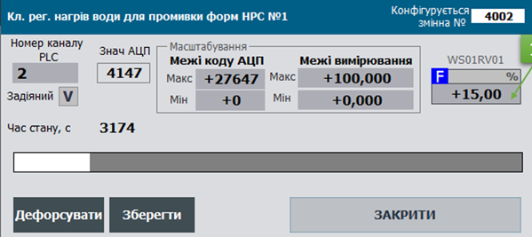

## Клас AOVAR: аналогова вихідна змінна процесу 

CLSID=16#1040

## Загальний опис

Клас реалізовує функції оброблення перетворення та запису сирих вихідних аналогових даних та діагностичної інформації з `AОCH`. До цих функцій входить масштабування, керування форсуванням та імітацією.        

Якщо мають бути відмінності в реалізації, слід використовувати інші CLSID в форматі 16#104x

## Загальні вимоги до функцій AOVAR

### Функціональні вимоги 

#### Режими роботи

Клас AОVAR повинен підтримувати наступні режими (підрежими):

- обробка входу/імітація
- нефорсований/форсований

У будь якому режимі, окрім режиму імітації, значення до прив'язаного каналу `AOCH` записується з `AОVAR.VRAW`.

**Нормальний режим** роботи екземпляру класу є комбінацією підрежимів "запис виходу" та "нефорсований режим". У цьому режимі значення `AОVAR.VAL` записується до сирого значення каналу `AОVAR.VRAW`, проходячи через функції оброблення такі як масштабування.

У режимі **імітація** `STA.SML=TRUE` значення `AОVAR.VAL` не проходить функцій обробки та не записує своє значення в `AОVAR.VRAW`. Іншими словами `AОVAR.VAL` не має ніякого впливу на фізичний вихід. У режимі імітація також змінюється стан `STA.SML` каналу, що прив'язаний до змінної. 

У режимі **форсування** (`STA.FRC=TRUE`) `AOVAR.VAL` змінюється  тільки через налагоджувальні вікна HMI і має найвищий пріоритет і в такому випадку результат виконання програми користувача не має ніякого впливу на AOVAR.VAL. При активності біту форсування лічильник `PLC_CFG.CNTFRC` збільшується на 1.

Для **мережних ** змінних, які виділяються в окремий клас, доступний режим коли джерело даних записується наззовні і не проходить функцій обробки. Даний режим активується параметром `AОVAR.PRM.NORAW`

#### Фільтрація сигналу

Фільтрація реалізована за допомогою функції `A_FLTR`. Для фільтрації використовується часовий фільтр - аперіодична ланка 1-го порядку. Час фільтрації задається параметром `AOVAR.T_FLT`який задається в мс. Також для роботи даного фільтра необхідно передавати значення часу який пройшов з попереднього виклику даної функції `dt`, і зберігати значення на попередньому циклі обробки, яке зберігається в `AOVAR.VALPREV`.

#### **Масштабування сигналу**

Фільтрація реалізована за допомогою функції `SCALING`.  Робота даної функції обмежена лише режимом :

-   лінійна залежність (для усіх)

Для лінійного масштабування використовується сире (не масштабоване) значення з `AOVAR.VRAW`, діапазон вхідного сигналу (LORAW, HIRAW), діапазон вихідного сигналу (LOENG, HIENG).    

Практика використання каркасу показала, що у випадку відображення на HMI змінних у вигляді стовпчика, бажано використовувати відсоткове значення, а не абсолютне (інженерне). Це пов'язано з тим, що каркас передбачає можливість зміни діапазону значення, отже MIN і MAX шкали при цьому теж зміниться. Щоб не зберігати інженерні MIN і MAX в SCADA/HMI, можна прив'язатись до відсоткового значення, яке буде змінюватися за зміни діапазону шкали. Таким чином, в засобах відображення які потребують абсолютних діапазонів (зазначені технологічними показниками) будуть використовуватися абсолютні значення (VAL), а де необхідні значення відносно шкали – відсоткові (VALPROC). Наявність VALPROC в структурі HMI збільшує кількість тегів SCADA/HMI, тому його використання повинно бути виправданим.

#### Моніторинг прив'язки до каналу 

Значення `STA.DLNK=TRUE` вказує на факт прив'язки до каналу.

#### Активність змінної 

Параметр активності змінної визначається виразом `STA.ENBL = NOT PRM.DSBL AND DLNK`. Якщо змінна неактивна `STA.ENBL=FALSE` не працюють функції:

- запису сигналу на фізичний вихід та його маштабування
- імітування 
- діагностування та обробка тривог

Верхні рівні ієрархії керування, зокрема CM LVL2, повинні сприймати цю змінну як тимчасово неіснуючу (виведену з експлуатації). Наприклад, якщо змінна відповідає за  позиціонер клапану, то CM клапану вважає, що змінної не існує і може працювати за алгоритмом "без аналогового керування".   

#### Діагностування каналу вимірювання

Класом передбачається перевірка достовірності каналу вимірювання. При `PRM.QALENBL=TRUE` значення `STA.BAD` прямо залежить від значення `STA.BAD` прив'язаного каналу. Інший спосіб діагностування вимірювального каналу не передбачений даним класом змінної.

`STA.BAD` - це тривога недостовірності. При виникненні тривоги (по передньому фронту) `PLC_CFG.NWBAD=TRUE`. Поки тривога  `STA.BAD` активна:

- виставляється відповідний біт `PLC_CFG.BAD` 
- збільшується на 1 лічильник `PLC_CFG.CNTBAD` 

Скидання біту `PRM.QALENBL=FALSE` відключає функцію перевірки тривоги недостовірності.  

## Рекомендації щодо використання в HMI

Приклад налаштування функцій аналогових вихідних змінних на HMI наведений на рис.



Рис. Приклад налаштування функцій аналогових вихідних змінних на HMI.

## Загальні вимоги щодо структури змінних класів

#### AOVAR_HMI

| name    | type | adr  | bit  | descr                                        |
| ------- | ---- | ---- | ---- | -------------------------------------------- |
| STA     | INT  | 0    |      | стани + біт команди завантаження AOVAR_STA   |
| VALPROC | INT  | 1    |      | значення у % від шкали вимірювання (0-10000) |
| VAL     | REAL | 2    |      | масштабоване значення                        |

#### AOVAR_CFG
| name          | type  | adr  | bit  | descr                                                        |
| ------------- | ----- | ---- | ---- | ------------------------------------------------------------ |
| ID            | UINT  | 0    |      | Унікальний ідентифікатор                                     |
| CLSID         | UINT  | 1    |      | 16#1040                                                      |
| STA           | UINT  | 2    |      | статус, призначення біт як `AOVAR_STA` може бути задіяна як аналогічна структура |
| STA_b0        | BOOL  | 2    | 0    | резерв                                                       |
| STA_b1        | BOOL  | 2    | 1    | резерв                                                       |
| STA_BAD       | BOOL  | 2    | 2    | =1 – Дані недостовірні                                       |
| STA_ALDIS     | BOOL  | 2    | 3    | =1 – Тривога виведена з експлуатації                         |
| STA_DLNK      | BOOL  | 2    | 4    | =1 – якщо прив’язаний до каналу                              |
| STA_ENBL      | BOOL  | 2    | 5    | =1 – змінна задіяна                                          |
| STA_b6        | BOOL  | 2    | 6    | резерв                                                       |
| STA_b7        | BOOL  | 2    | 7    | резерв                                                       |
| STA_b8        | BOOL  | 2    | 8    | резерв                                                       |
| STA_b9        | BOOL  | 2    | 9    | резерв                                                       |
| STA_b10       | BOOL  | 2    | 10   | резерв                                                       |
| STA_b11       | BOOL  | 2    | 11   | резерв                                                       |
| STA_INBUF     | BOOL  | 2    | 12   | =1 – змінна в буфері                                         |
| STA_FRC       | BOOL  | 2    | 13   | =1 – Режим форсування                                        |
| STA_SML       | BOOL  | 2    | 14   | =1 – змінна в режимі симуляції                               |
| STA_CMDLOAD   | BOOL  | 2    | 15   | =1 – команда завантаження в буфер                            |
| VRAW          | INT   | 3    |      | сирі значення                                                |
| VAL           | REAL  | 4    |      | масштабоване значення                                        |
| VALFRC        | REAL  | 6    |      | зберігає форсоване значення                                  |
| VALPRV        | REAL  | 8    |      | значення на попередньому циклі (для реалізації фільтрації)   |
| PRM           | UINT  | 10   |      | параметри конфігурації, повинні зберігатися при відключеному живленні |
| PRM_b0        | BOOL  | 10   | 0    | резерв                                                       |
| PRM_b1        | BOOL  | 10   | 1    | резерв                                                       |
| PRM_b2        | BOOL  | 10   | 2    | резерв                                                       |
| PRM_b3        | BOOL  | 10   | 3    | резерв                                                       |
| PRM_b4        | BOOL  | 10   | 4    | резерв                                                       |
| PRM_b5        | BOOL  | 10   | 5    | резерв                                                       |
| PRM_QALENBL   | BOOL  | 10   | 6    | =1 – задіяти тривогу недостовірності каналу                  |
| PRM_DSBL      | BOOL  | 10   | 7    | =1 – змінна не задіяна                                       |
| PRM_PWLENBL   | BOOL  | 10   | 8    | =1 – задіяна кусочно-лінійна інтерполяція (не використовувати разом з TOTALON) |
| PRM_b9        | BOOL  | 10   | 9    | резерв                                                       |
| PRM_b10       | BOOL  | 10   | 10   | резерв                                                       |
| PRM_b11       | BOOL  | 10   | 11   | резерв                                                       |
| PRM_b12       | BOOL  | 10   | 12   | резерв                                                       |
| PRM_b13       | BOOL  | 10   | 13   | резерв                                                       |
| PRM_STATICMAP | BOOL  | 10   | 14   | =1 -  статична прив'язка каналів                             |
| PRM_NORAW     | BOOL  | 10   | 15   | =1 - джерело даних змінюється ззовні                         |
| CHID          | UINT  | 11   |      | Логічний номер вихідного аналогового каналу CH               |
| LORAW         | INT   | 12   |      | Сире (немасштабоване) значення мінімуму                      |
| HIRAW         | INT   | 13   |      | Сире (немасштабоване) значення максимуму                     |
| LOENG         | REAL  | 14   |      | Інженерне (масштабоване) значення мінімуму                   |
| HIENG         | REAL  | 16   |      | Інженерне (масштабоване) значення максимуму                  |
| T_FLT         | UINT  | 17   |      | час фільтрації в мілісекундах (фільтр - аперіодична ланка)   |
| VALPROC       | INT   | 18   |      | значення у відсотках                                         |
| STEP1         | UINT  | 19   |      | номер кроку                                                  |
| T_STEP1       | UDINT | 20   |      | Плинний час кроку в мс                                       |
| T_PREV        | UDINT | 22   |      | час в мс з попереднього виклику, береться зі структури PLC_CFG.TQMS |

#### Команди для буферу (див структуру буферу)
| Атрибут | Тип  | Опис                                                         |
| ------- | ---- | ------------------------------------------------------------ |
| CMD     | UINT | Команди:<br />16#0001: записати максимум діапазону - тільки при форсуванні<br />16#0002: записати мінімум діапазону - тільки при форсуванні<br />16#0003: записати середину діапазону - тільки при форсуванні<br />16#0100: прочитати конфігурацію<br/>16#0101: записати конфігурацію<br/>16#0102: записати значення за замовченням<br/>16#0300: перемкнути форсування<br/>16#0301: ввімкнути форсування<br/>16#0302: вимкнути форсування<br/>16#0311: імітувати<br/>16#0312: зняти режим імітації<br/> |


#### Робота з буфером

Повинна бути реалізована функція роботи з класичним буфером.

- Буфер рекомендується використовувати один для всіх технологічних змінних.

- Факт зайнятості буфера перевіряється за рівністю ідентифікатора класу `CLSID` та ідентифікатора технологічної змінної `ID`

- при захопленні буферу:

  - `VARBUF.STA = AOVAR_CFG.STA`
  - `AOVAR_CFG.CMD = VARBUF.CMD`  якщо той не дорівнює нулю (для можливості команд з іншого джерела)
  - зчитування статусних бітів фізичного каналу технологічної змінної`VARBUF.CH_STA = CHCFG.STA`.

- конфігурація технологічної змінної повинна зчитуватися в буфер при отриманні команд:

  - біті статусу `STA.CMDLOAD=TRUE`
  - оновлення технологічної змінної, яка вже записана в буфер`VARBUF.CMD` = 16#0100; 

- конфігурація технологічної змінної повинна записуватись з буфера при отриманні команд:

  - `VARBUF.CMD` = 16#0101; 	

  

Повинна бути реалізована функція роботи з параметричними двунаправленим буферами VARBUFIN<->VARBUFOUT.

- Використовується 2 буфери: 
  - вхідний `VARBUFIN` - використовується для обробки команд (при рівності CLSID та ID) та запису інформації в технологічну змінну 
  - вихідний `VARBUFOUT` - використовується зчитування інформації з технологічної змінної при отриманні команди на читання з `VARBUFIN`
- Буфери рекомендується використовувати одну пару для всіх технологічних змінних.
- Факт зайнятості буфера не можливий, оскільки буфер реалізований через 2 буферні змінні VARBUFIN та VARBUFOUT через які інформація проходить для подальшої передачі її в технологічну змінну або внутрішній буфер засобу HMI (по аналогії з параметричним обміном PKW в профілі PROFIDRIVE)
- конфігурація технологічної змінної повинна зчитуватися в вихідний буфер при:
  - рівності класів `AOVARCFG.CLSID=VARBUFIN.CLSID` , ідентифікаторів `AOVARCFG.ID=VARBUFIN.ID` та отримання команди з вхідного буфера `VARBUFIN.CMD=16#100 `
- конфігурація технологічної змінної повинна записуватись з вхідного буфера при:
  - рівності класів `AOVARCFG.CLSID=VARBUFIN.CLSID` , ідентифікаторів `AOVARCFG.ID=VARBUFIN.ID` та отримання команди з вхідного буфера `VARBUFIN.CMD=16#101 `


### Вимоги щодо реалізації інтерфейсу

INOUT

- `CHCFG` - фізичний канал прив'язаний до технологічної змінної
- `AOVARCFG` - конфігураційна частина технологічної змінної
- `AOVARHMI` - HMI частина технологічної змінної
- за умови, що немає можливості доступатися до зовнішніх змінних з середини функцій, передається `PLC_CFG`, `VARBUF`,  `VARBUFIN`, `VARBUFOUT` ; альтернативно можна використовувати інші інтерфейси для використання в середині `PLC_CFG` 


### Ініціалізація технологічної змінної при першому циклі роботи

Запис ID, CHID, CHIDFL за замовченням виконується в результаті виконання програмної секції `initvars`. 

Для кожної технологічної змінної в `initvars` повиннен бути наступний фрагмент програми для запису ID, CHID, CHIDFL

```
"VAR".AOVAR1.ID := 1001;   "VAR".AOVAR1.CHID := 1;    "VAR".AOVAR1.CHIDDF := 1;
```

Також виконується ініціалізація всередині функції обробки технологічної змінної, в результаті

- присвоюється `AOVARCFG.CLSID:=16#1040;`
- виконується активація технологічної змінної `AOVARCFG.PRM.DSBL := FALSE; ` 
- якщо логічний номер каналу не заданий - записати значення по замовчування  `AOVARCFG.CHID := AOVARCFG.CHIDDF;`
- виконується активація тривог перевірки якості даних.


### Вимоги щодо реалізації програми користувача

- Функції обробки технологічних змінних повинні викликатися з кожним викликом тієї задачі, до якого вони прив'язані.
- При першому старті (`PLC_CFG.SCN1`) повинні ініціалізуватися ідентифікатор змінної `AOVAR_CFG.ID` та номер логічного каналу `AOVAR_CFG.CHID`, 

``` pascal
(*ініціалізація змінної на першому циклі обробки*)
IF "SYS".PLCCFG.STA.SCN1 THEN
    #AOVARCFG.CLSID := 16#1040; (*присвоєння ідентифікатора класу*)
    #AOVARCFG.PRM.DSBL := FALSE; (*активація змінної*)
    #AOVARCFG.PRM.QALENBL := true; (*активація тривог перевірки якості даних*)
    #AOVARCFG.T_PREV := "SYS".PLCCFG.TQMS; (*збереження часу виклику*)
    IF #AOVARCFG.CHID = 0 THEN (*якщо логіний номер каналу на заданий - записати значення по замовчування *)
        #AOVARCFG.CHID := #AOVARCFG.CHIDDF;
    END_IF;
    
    (*запис сирого значення з каналу для подальшої обробки*)
    IF #CHCFG.ID > 0 THEN
        #CHCFG.VAL := #AOVARCFG.VRAW;
    ELSE
        #CHCFG.VAL := 0;
    END_IF;
    
    #AOVARCFG.T_STEP1 := 0; (*онулення часу кроку*)
    #AOVARCFG.STEP1 := 100; (*переведення на крок норми*)
    
    (*визначення діапазонів ідентифікаторів змінної*)
    IF #AOVARCFG.ID>0 THEN
        IF #AOVARCFG.ID<"SYS".VARIDMIN THEN "SYS".VARIDMIN:=#AOVARCFG.ID; END_IF;
        IF #AOVARCFG.ID>"SYS".VARIDMAX THEN "SYS".VARIDMAX:=#AOVARCFG.ID; END_IF;
    END_IF;
    RETURN;
END_IF;

(*зчитування статусних бітів з технологічної змінної у внутрішні змінні*)
#BAD := #AOVARCFG.STA.BAD;
#ALDIS := #AOVARCFG.STA.ALDIS;
#DLNK := #AOVARCFG.STA.DLNK;
#ENBL := #AOVARCFG.STA.ENBL;
#INBUF := #AOVARCFG.STA.INBUF;
#FRC := #AOVARCFG.STA.FRC;
#SML := #AOVARCFG.STA.SML;
#CMDLOAD := #AOVARCFG.STA.CMDLOAD;

#INBUF := (#AOVARCFG.ID = "BUF".VARBUF.ID) AND (#AOVARCFG.CLSID = "BUF".VARBUF.CLSID); (*змінна в буфері якщо співпадає ідентифікатор змінної та ідентифікатор класу*)
#CMDLOAD := #AOVARHMI.STA.%X15;  (*команда запису в буфер з НМІ змінної*)
#CMD := 0; (*онулення внутрішньої команда*)
#DLNK := (#CHCFG.ID > 0); (*змінна привязана до каналу якщо канал має реальний ідентифікатор (не 0 - не молоко)*)
#VARENBL := NOT #AOVARCFG.PRM.DSBL AND #DLNK;(*змінна задіяна якщо привязана до каналу і не активний параметр змінна не задіяна*)

#T_STEPMS := #AOVARCFG.T_STEP1; (*запамятовування часу циклу в мс*)
#VAL := #AOVARCFG.VAL; (*зчитування значення з технологічної змінної у внутрішню дляя подальшої обробки*)
#VRAW := #AOVARCFG.VRAW; (*зчитування сирого значення з каналу*)

(*реалізація алгоритму ping-pong*)
IF #DLNK THEN
    #CHCFG.STA.PNG := true;
    #CHCFG.VARID := #AOVARCFG.ID;
END_IF;

(*якщо змінна не задіяна не рахуємо час, скидаємо стан *)
IF NOT #VARENBL THEN
    #AOVARCFG.T_STEP1 := 0;
    #AOVARCFG.STEP1 := 400;
END_IF;

(*визначення часу між викликами функції по різниці між мілісікундним лічильником та часом який пройшов з попереднього виклику *)
#dT := "SYS".PLCCFG.TQMS - #AOVARCFG.T_PREV;

(* широкомовне дефорсування*) 
IF "SYS".PLCCFG.CMD = 16#4302 THEN
    #FRC := false; (*дефорсувати об'єкт типу*)
END_IF;

(*вибір джерела конфігураційної/керівної команди згідно пріоритету якщо команди надійшли одночасно*)
IF #CMDLOAD THEN (*команда запису в буфер - команда з НМІ*)
    #CMD := 16#0100;
ELSIF #INBUF AND "BUF".VARBUF.CMD <> 0 THEN (*команда з буферу*)
    #CMD := "BUF".VARBUF.CMD;
END_IF;

(*commands*)
CASE #CMD OF
    16#0001: (*записати максимум діапазону*)
        IF #FRC AND #INBUF THEN
            #AOVARCFG.VALFRC := #AOVARCFG.HIENG;
            #VAL := #AOVARCFG.HIENG;
            #AOVARCFG.STEP1 := 100;
            #AOVARCFG.T_STEP1 := 0;
        END_IF;
    16#0002: (*записати мінімум діапазону*)
        IF #FRC AND #INBUF THEN
            #AOVARCFG.VALFRC := #AOVARCFG.LOENG;
            #VAL := #AOVARCFG.LOENG;
            #AOVARCFG.STEP1 := 100;
            #AOVARCFG.T_STEP1 := 0;
        END_IF;
    16#0003: (*записати середину діапазону*)
        IF #FRC AND #INBUF THEN
            #AOVARCFG.VALFRC := (#AOVARCFG.HIENG - #AOVARCFG.LOENG) / 2.0;
            #VAL := (#AOVARCFG.HIENG - #AOVARCFG.LOENG) / 2.0;
            #AOVARCFG.STEP1 := 100;
            #AOVARCFG.T_STEP1 := 0;
        END_IF;
    16#0100: (*прочитати конфігурацію*)
        (* MSG 200-Ok 400-Error
        // 200 - Дані записані
        // 201 - Дані прочитані 
        // 403 - канал вже зайнятий 
        // 404 - номер каналу не відповідає діапазону   
    // 405 - активна статична адресація каналів *)
        "BUF".VARBUF.MSG := 201;
        
        (*зчитати ідентифікатор змінної та ідентифікатор класу*)
        "BUF".VARBUF.ID := #AOVARCFG.ID;
        "BUF".VARBUF.CLSID := #AOVARCFG.CLSID;
        
        (*зчитати бітові параметри*)
        "BUF".VARBUF.PRM.%X6 := #AOVARCFG.PRM.QALENBL;
        "BUF".VARBUF.PRM.%X7 := #AOVARCFG.PRM.DSBL;
        "BUF".VARBUF.PRM.%X8 := #AOVARCFG.PRM.PWLENBL;
        "BUF".VARBUF.PRM.%X14 := #AOVARCFG.PRM.STATICMAP;
        "BUF".VARBUF.PRM.%X15 := #AOVARCFG.PRM.NORAW;
        
        (*зчитати параметри*)
        "BUF".VARBUF.CHID := #AOVARCFG.CHID;
        "BUF".VARBUF.LORAW := #AOVARCFG.LORAW;
        "BUF".VARBUF.HIRAW := #AOVARCFG.HIRAW;
        "BUF".VARBUF.LOENG := #AOVARCFG.LOENG;
        "BUF".VARBUF.HIENG := #AOVARCFG.HIENG;
        "BUF".VARBUF.T_FLTSP := #AOVARCFG.T_FLT;
        
        (*зчитати значення змінної для безударного форсування*)
        "BUF".VARBUF.VALR := #AOVARCFG.VALFRC;
        
    16#0101: (*записати конфігурацію*)
        (* MSG 200-Ok 400-Error
        // 200 - Дані записані
        // 201 - Дані прочитані 
        // 403 - канал вже зайнятий 
        // 404 - номер каналу не відповідає діапазону   
    // 405 - активна статична адресація каналів*)
        "BUF".VARBUF.MSG:=200;
        
        (*записати бітові параметри*)
        #AOVARCFG.PRM.QALENBL := "BUF".VARBUF.PRM.%X6;
        #AOVARCFG.PRM.DSBL := "BUF".VARBUF.PRM.%X7;
        #AOVARCFG.PRM.PWLENBL := "BUF".VARBUF.PRM.%X8;
        #AOVARCFG.PRM.STATICMAP := "BUF".VARBUF.PRM.%X14;
        #AOVARCFG.PRM.NORAW := "BUF".VARBUF.PRM.%X15;
        
        (*записати параметри*)
        #AOVARCFG.LORAW := "BUF".VARBUF.LORAW;
        #AOVARCFG.HIRAW := "BUF".VARBUF.HIRAW;
        #AOVARCFG.LOENG := "BUF".VARBUF.LOENG;
        #AOVARCFG.HIENG := "BUF".VARBUF.HIENG;
        #AOVARCFG.T_FLT := "BUF".VARBUF.T_FLTSP;
        
        IF NOT #AOVARCFG.PRM.STATICMAP THEN (* зміна логічного номеру каналу тільки при неактивна статичн адресація*)
            IF "BUF".VARBUF.CHID>=0 AND "BUF".VARBUF.CHID <= INT_TO_UINT("SYS".PLCCFG.AOCNT) THEN (* якщо логічний номер канал менший за кількість каналів*)
                IF "SYS".CHAO["BUF".VARBUF.CHID].VARID = 0 THEN (* якщо логічний номер канал нульовий - вільний *)
                    #AOVARCFG.CHID := "BUF".VARBUF.CHID; (* змінити логічний номер каналу *)
                ELSIF "BUF".VARBUF.CHID <> #AOVARCFG.CHID THEN  (* інакше вивести помилку про зайнятість каналу *)
                    "BUF".VARBUF.MSG := 403;(* канал вже зайнятий*)
                END_IF;
            ELSE
                "BUF".VARBUF.MSG := 404; (*номер каналу не відповідає діапазону*)
            END_IF;
        ELSIF "BUF".VARBUF.CHID <> #AOVARCFG.CHID THEN (* інакше вивести помилку активна статична адресація каналів *)
            "BUF".VARBUF.MSG := 405;(* активна статична адресація каналів*)
        END_IF;
        IF #INBUF THEN (*оновити логічний номер каналу після запису якщо змінна ще в буфері*)
            "BUF".VARBUF.CHID := #AOVARCFG.CHID;
        END_IF;
        
    16#0102: (*записати значення за замовченням*)
        #AOVARCFG.CHID := #AOVARCFG.CHIDDF;
    16#0300: (*перемкнути форсування*)
        #FRC := NOT #FRC;
    16#0301: (*ввімкнути форсування*)
        #FRC := true;
    16#0302: (*вимкнути форсування*)
        #FRC := false;
    16#0311: (* імітувати*)
        #SML := true;
    16#0312: (* зняти режим імітації*)
        #SML := false;
END_CASE;

(*перевірка на коректність діапазонів*)
IF ABS (#AOVARCFG.HIRAW - #AOVARCFG.LORAW) < 1 THEN
    #AOVARCFG.LORAW := 0;
    #AOVARCFG.HIRAW := 27648;
END_IF;
IF ABS(#AOVARCFG.HIENG - #AOVARCFG.LOENG) < 0.00001 THEN
    #AOVARCFG.LOENG := 0.0;
    #AOVARCFG.HIENG := 100.0;
END_IF;

(*визначення 1% від шкали*)
#VAL1PROC := INT_TO_REAL(#AOVARCFG.HIRAW - #AOVARCFG.LORAW) / 100.0;
IF #VAL1PROC = 0.0 THEN
    #VAL1PROC := 1.0;
END_IF;

(*val*)
IF #FRC THEN (*режим форсування*)
    IF #INBUF THEN
        #AOVARCFG.VALFRC := "BUF".VARBUF.VALR;
    END_IF;
    #VAL := #AOVARCFG.VALFRC;
ELSE
    #AOVARCFG.VALFRC := #VAL;
END_IF;

IF #VARENBL THEN
    (*якщо попереднього значення виходить за діапазон вводимо обмеження діапазону*)
    IF #AOVARCFG.VALPRV<#AOVARCFG.LOENG THEN #AOVARCFG.VALPRV:=#AOVARCFG.LOENG; END_IF;
    IF #AOVARCFG.VALPRV>#AOVARCFG.HIENG THEN #AOVARCFG.VALPRV:=#AOVARCFG.HIENG; END_IF;
    
    (*фільтрація*)
    IF #AOVARCFG.T_FLT <= 0 THEN (*час фільтрації не може бути нульовим*)
        #AOVARCFG.T_FLT := 1;
    END_IF;
    #VALFLT:="A_FLTR" (IN := #VAL, dT := #dT, T_FLT := UINT_TO_UDINT(#AOVARCFG.T_FLT), PRM := #tmpuint, STA := #tmpuint, VALPRV := #AOVARCFG.VALPRV);
    
    (*масштабування*)
    #PRM_SCL:=0;
    #STA_SCL:=0;
    #PRM_SCL.%X0 := false;(*//квадратнокоренева залежність, X0  *)
    #PRM_SCL.%X1 := FALSE;(*//обмежувати вихідну величину, X1 *)
    IF NOT #AOVARCFG.PRM.NORAW THEN (*якщо маштабування не відімкнено*)
        #VRAW := REAL_TO_INT("SCALING" (IN := #VALFLT, in_min := #AOVARCFG.LOENG, in_max := #AOVARCFG.HIENG, out_min := INT_TO_REAL(#AOVARCFG.LORAW), out_max := INT_TO_REAL(#AOVARCFG.HIRAW), STA := #STA_SCL, PRM := #PRM_SCL)); (*в сире значення записується маштабована величина*)
    ELSE
        #VRAW := REAL_TO_INT(#VALFLT); (*інакше значення не маштабується*)
    END_IF;
    
    IF NOT #SML THEN (* режим симуляції - вихідне значення не змінюється *)
        #CHCFG.VAL := #VRAW;
    END_IF;
END_IF;

(*обробка тривог - недостовірність каналу*)
#tempBAD := #CHCFG.STA.BAD AND #AOVARCFG.PRM.QALENBL AND #VARENBL AND NOT #SML;
#TDEAQALSP := 10;     (* час затримки на виникнення тривог бед в 0.1 с*)

CASE #AOVARCFG.STEP1 OF
    0:(*init*)
        #AOVARCFG.STEP1 := 100;
        #AOVARCFG.T_STEP1 := 0;
    100:(*norma*)
        #BAD := false;
        IF #tempBAD THEN
            #AOVARCFG.STEP1 := 150;
            #AOVARCFG.T_STEP1 := 0;
        END_IF;
    150:(*norma to BAD*)
        IF #AOVARCFG.T_STEP1 > INT_TO_UDINT(#TDEAQALSP) THEN
            #AOVARCFG.STEP1 := 200;
            #AOVARCFG.T_STEP1 := 0;
        ELSIF NOT #tempBAD THEN
            #AOVARCFG.STEP1 := 100;
            #AOVARCFG.T_STEP1 := 0;
        END_IF;
    200:(*BAD*)
        #BAD := true;
        IF NOT #tempBAD AND #AOVARCFG.T_STEP1 > INT_TO_UDINT(#TDEAQALSP) THEN
            #AOVARCFG.STEP1 := 100;
            #AOVARCFG.T_STEP1 := 0;
        END_IF;
    ELSE
        #AOVARCFG.STEP1 := 0;
END_CASE;

(*передача тривог для змінної PLCCFG для формування загального статусного біта і визначення нової тривоги*)
IF #BAD THEN
    "SYS".PLCCFG.ALM1.BAD := true;
    "SYS".PLCCFG.CNTBAD := "SYS".PLCCFG.CNTBAD + 1;
    IF NOT #AOVARCFG.STA.BAD THEN
        "SYS".PLCCFG.ALM1.NWBAD := true;
    END_IF;
END_IF;

(*передача статусних бітів для змінної PLCCFG для формування загального статусного біта*)
IF #FRC THEN
    "SYS".PLCCFG.STA.FRC1 := true;
    "SYS".PLCCFG.CNTFRC := "SYS".PLCCFG.CNTFRC + 1;
END_IF;
IF #SML THEN
    "SYS".PLCCFG.STA.SML := true;
END_IF;

#CMDLOAD := FALSE;

(*передача статусних бітів з внутрішніх змінних в технологічну змінну*)
#AOVARCFG.STA.BAD := #BAD;
#AOVARCFG.STA.ALDIS := #ALDIS;
#AOVARCFG.STA.DLNK := #DLNK;
#AOVARCFG.STA.ENBL := #VARENBL;
#AOVARCFG.STA.INBUF := #INBUF;
#AOVARCFG.STA.FRC := #FRC;
#AOVARCFG.STA.SML := #SML;
#AOVARCFG.STA.CMDLOAD :=  FALSE;

(*значення у % та обмеження*)
IF #VAL1PROC = 0.0 THEN
    #VAL1PROC := 1.0;
END_IF;
#VALPROC := INT_TO_REAL(#CHCFG.VAL - #AOVARCFG.LORAW) / #VAL1PROC;
IF #VALPROC < 0.0 THEN
    #VALPROC := 0.0;
END_IF;
IF #VALPROC > 100.0 THEN
    #VALPROC := 100.0;
END_IF;

(*передача значення з внутрішніх змінних в технологічну змінну*)
#AOVARCFG.VAL := #VAL;
#AOVARCFG.VRAW := #VRAW;
#AOVARCFG.VALPROC := REAL_TO_INT(#VALPROC*256.0) AND 16#FF00;(*по аналогії з AIVAR*)

(*передача значення в HMI частину*)
#AOVARHMI.STA.%X0 := #AOVARCFG.STA.STA_b0;
#AOVARHMI.STA.%X1 := #AOVARCFG.STA.STA_b1;
#AOVARHMI.STA.%X2 := #AOVARCFG.STA.BAD;
#AOVARHMI.STA.%X3 := #AOVARCFG.STA.ALDIS;
#AOVARHMI.STA.%X4 := #AOVARCFG.STA.DLNK;
#AOVARHMI.STA.%X5 := #AOVARCFG.STA.ENBL;
#AOVARHMI.STA.%X6 := #AOVARCFG.STA.STA_b6;
#AOVARHMI.STA.%X7 := #AOVARCFG.STA.STA_b7;
#AOVARHMI.STA.%X8 := #AOVARCFG.STA.STA_b8;
#AOVARHMI.STA.%X9 := #AOVARCFG.STA.STA_b9;
#AOVARHMI.STA.%X10 := #AOVARCFG.STA.STA_b10;
#AOVARHMI.STA.%X11 := #AOVARCFG.STA.STA_b11;
#AOVARHMI.STA.%X12 := #AOVARCFG.STA.INBUF;
#AOVARHMI.STA.%X13 := #AOVARCFG.STA.FRC;
#AOVARHMI.STA.%X14 := #AOVARCFG.STA.SML;
#AOVARHMI.STA.%X15 := #AOVARCFG.STA.CMDLOAD;

#AOVARHMI.VAL := #VAL;
#AOVARHMI.VALPROC := #AOVARCFG.VALPROC;

#AOVARCFG.T_PREV := "SYS".PLCCFG.TQMS;(*запамятовування часу останнього виклику екземпляра функції*)

(*підрахунок часу стану та обмеження його по верхній межі діапазону*)
#AOVARCFG.T_STEP1 := #AOVARCFG.T_STEP1 + #dT;
IF #AOVARCFG.T_STEP1 > 16#7FFF_FFFF THEN
    #AOVARCFG.T_STEP1 := 16#7FFF_FFFF;
END_IF;

(*автоматичне оновлення якщо змінна записана в буфер*)
IF #INBUF THEN
    "BUF".VARBUF.CMD := 0;
    
    "BUF".VARBUF.STA.%X0 := #AOVARCFG.STA.STA_b0;
    "BUF".VARBUF.STA.%X1 := #AOVARCFG.STA.STA_b1;
    "BUF".VARBUF.STA.%X2 := #AOVARCFG.STA.BAD;
    "BUF".VARBUF.STA.%X3 := #AOVARCFG.STA.ALDIS;
    "BUF".VARBUF.STA.%X4 := #AOVARCFG.STA.DLNK;
    "BUF".VARBUF.STA.%X5 := #AOVARCFG.STA.ENBL;
    "BUF".VARBUF.STA.%X6 := #AOVARCFG.STA.STA_b6;
    "BUF".VARBUF.STA.%X7 := #AOVARCFG.STA.STA_b7;
    "BUF".VARBUF.STA.%X8 := #AOVARCFG.STA.STA_b8;
    "BUF".VARBUF.STA.%X9 := #AOVARCFG.STA.STA_b9;
    "BUF".VARBUF.STA.%X10 := #AOVARCFG.STA.STA_b10;
    "BUF".VARBUF.STA.%X11 := #AOVARCFG.STA.STA_b11;
    "BUF".VARBUF.STA.%X12 := #AOVARCFG.STA.INBUF;
    "BUF".VARBUF.STA.%X13 := #AOVARCFG.STA.FRC;
    "BUF".VARBUF.STA.%X14 := #AOVARCFG.STA.SML;
    "BUF".VARBUF.STA.%X15 := #AOVARCFG.STA.CMDLOAD;
    
    "BUF".VARBUF.VRAWR := INT_TO_REAL(#VRAW);
    "BUF".VARBUF.VALR := #VAL;
    "BUF".VARBUF.VALPROC := #AOVARCFG.VALPROC;
    "BUF".VARBUF.STEP1 := #AOVARCFG.STEP1;
    "BUF".VARBUF.T_STEP1 := #AOVARCFG.T_STEP1;
    
    (*зчитування статусних бітів фізичного каналу технологічної змінної*)    
    "BUF".VARBUF.CH_CLSID := #CHCFG.CLSID;
    "BUF".VARBUF.CH_STA.%X0 := #CHCFG.STA.VRAW;
    "BUF".VARBUF.CH_STA.%X1 := #CHCFG.STA.VALB;
    "BUF".VARBUF.CH_STA.%X2 := #CHCFG.STA.BAD;
    "BUF".VARBUF.CH_STA.%X3 := #CHCFG.STA.b3;
    "BUF".VARBUF.CH_STA.%X4 := #CHCFG.STA.PNG;
    "BUF".VARBUF.CH_STA.%X5 := #CHCFG.STA.ULNK;
    "BUF".VARBUF.CH_STA.%X6 := #CHCFG.STA.MERR;
    "BUF".VARBUF.CH_STA.%X7 := #CHCFG.STA.BRK;
    "BUF".VARBUF.CH_STA.%X8 := #CHCFG.STA.SHRT;
    "BUF".VARBUF.CH_STA.%X9 := #CHCFG.STA.NBD;
    "BUF".VARBUF.CH_STA.%X10 := #CHCFG.STA.b10;
    "BUF".VARBUF.CH_STA.%X11 := #CHCFG.STA.INIOTBUF;
    "BUF".VARBUF.CH_STA.%X12 := #CHCFG.STA.INBUF;
    "BUF".VARBUF.CH_STA.%X13 := #CHCFG.STA.FRC;
    "BUF".VARBUF.CH_STA.%X14 := #CHCFG.STA.SML;
    "BUF".VARBUF.CH_STA.%X15 := #CHCFG.STA.CMDLOAD;
    
    (*функція обрахунку фізичного значення сигналу в мА,В і т.д*)
    "BUF".VARBUF.CH_VALSIG := "INT_TO_SIGU" (CLSID := #CHCFG.CLSID,  VALINT := #VRAW);
END_IF;

(*реалізація читання конфігураційних даних в буфер out*)
IF (UINT_TO_WORD(#AOVARCFG.CLSID) AND 16#FFF0)=(UINT_TO_WORD("BUF".VARBUFIN.CLSID) AND 16#FFF0) AND #AOVARCFG.ID="BUF".VARBUFIN.ID AND "BUF".VARBUFIN.CMD = 16#100 THEN
    (* MSG 200-Ok 400-Error
    // 200 - Дані записані
    // 201 - Дані прочитані 
    // 403 - канал вже зайнятий 
    // 404 - номер каналу не відповідає діапазону   *)
    "BUF".VARBUFOUT.MSG := 201;
    
    "BUF".VARBUFOUT.PRM.%X6 := #AOVARCFG.PRM.QALENBL;
    "BUF".VARBUFOUT.PRM.%X7 := #AOVARCFG.PRM.DSBL;
    "BUF".VARBUFOUT.PRM.%X8 := #AOVARCFG.PRM.PWLENBL;
    "BUF".VARBUFOUT.PRM.%X14 := #AOVARCFG.PRM.STATICMAP;
    "BUF".VARBUFOUT.PRM.%X15 := #AOVARCFG.PRM.NORAW;
    
    "BUF".VARBUFOUT.ID := #AOVARCFG.ID;
    "BUF".VARBUFOUT.CLSID := #AOVARCFG.CLSID;
    "BUF".VARBUFOUT.CHID := #AOVARCFG.CHID;
    "BUF".VARBUFOUT.VALR := #AOVARCFG.VALFRC;
    
    "BUF".VARBUFOUT.LORAW := #AOVARCFG.LORAW;
    "BUF".VARBUFOUT.HIRAW := #AOVARCFG.HIRAW;
    "BUF".VARBUFOUT.LOENG := #AOVARCFG.LOENG;
    "BUF".VARBUFOUT.HIENG := #AOVARCFG.HIENG;
    "BUF".VARBUFOUT.T_FLTSP := #AOVARCFG.T_FLT;
    
    "BUF".VARBUFIN.CMD :=0;
END_IF;

(*реалізація запису конфігураційних даних з буфер in в технологічну змінну*)
IF (UINT_TO_WORD(#AOVARCFG.CLSID) AND 16#FFF0)=(UINT_TO_WORD("BUF".VARBUFIN.CLSID) AND 16#FFF0) AND #AOVARCFG.ID="BUF".VARBUFIN.ID AND "BUF".VARBUFIN.CMD = 16#101 THEN
    (* MSG 200-Ok 400-Error
    // 200 - Дані записані
    // 201 - Дані прочитані 
    // 403 - канал вже зайнятий 
    // 404 - номер каналу не відповідає діапазону   *)
    
    "BUF".VARBUFOUT:="BUF".VARBUFIN;
    
    #AOVARCFG.PRM.QALENBL := "BUF".VARBUFIN.PRM.%X6;
    #AOVARCFG.PRM.DSBL := "BUF".VARBUFIN.PRM.%X7;
    #AOVARCFG.PRM.PWLENBL := "BUF".VARBUFIN.PRM.%X8;
    #AOVARCFG.PRM.STATICMAP := "BUF".VARBUFIN.PRM.%X14;
    #AOVARCFG.PRM.NORAW := "BUF".VARBUFIN.PRM.%X15;
    
    #AOVARCFG.LORAW := "BUF".VARBUFIN.LORAW;
    #AOVARCFG.HIRAW := "BUF".VARBUFIN.HIRAW;
    #AOVARCFG.LOENG := "BUF".VARBUFIN.LOENG;
    #AOVARCFG.HIENG := "BUF".VARBUFIN.HIENG;
    #AOVARCFG.T_FLT := "BUF".VARBUFIN.T_FLTSP;
    
    (*перевіряти незайнятість каналу треба в функції контролю буферу *)
    "BUF".VARBUFOUT.MSG:=200;
    IF NOT #AOVARCFG.PRM.STATICMAP THEN
        IF "BUF".VARBUFIN.CHID>=0 AND "BUF".VARBUFIN.CHID <= INT_TO_UINT("SYS".PLCCFG.AOCNT) THEN
            IF "SYS".CHAO["BUF".VARBUFIN.CHID].VARID = 0 THEN
                #AOVARCFG.CHID := "BUF".VARBUFIN.CHID;
            ELSIF "BUF".VARBUFIN.CHID <> #AOVARCFG.CHID THEN
                "BUF".VARBUFOUT.MSG := 403;(* канал вже зайнятий*)
            END_IF;
        ELSE
            "BUF".VARBUFOUT.MSG := 404; (*номер каналу не відповідає діапазону*)
        END_IF;
    ELSIF "BUF".VARBUFIN.CHID <> #AOVARCFG.CHID THEN (* інакше вивести помилку активна статична адресація каналів *)
        "BUF".VARBUFOUT.MSG := 405;(* активна статична адресація каналів*)
    END_IF;
    "BUF".VARBUFIN.CMD :=0;
END_IF;
```


## Тестування 

Загальні вимоги щодо тестування наведені в документі класи LVL1. Тут приводяться тільки особливі тести, що відрізняються від загальних.

### Перелік тестів

| Номер | Назва                                                        | Коли перевіряти          | Примітки |
| ----- | ------------------------------------------------------------ | ------------------------ | -------- |
| 1     | Присвоєння ID та CLSID при старті                            | після реалізації функції |          |
| 2     | Команди запису до буферу                                     | після реалізації функції |          |
| 3     | Зміна параметрів та запис з буфера                           | після реалізації функції |          |
| 4     | Зміни логічного номеру каналу                                | після реалізації функції |          |
| 5     | Запис значення CHID за замовченням при старті, при одинарній команді | після реалізації функції |          |
| 6     | Робота вбудованих лічильників часу                           | після реалізації функції |          |
| 7     | Вплив перекидування лічильника часу ПЛК на час кроку         | після реалізації функції |          |
| 8     | Алгоритм Ping-Pong                                           | після реалізації функції |          |
| 9     | Робота в нефорсованому режимі                                | після реалізації функції |          |
| 10    | Робота в форсованому режимі                                  | після реалізації функції |          |
| 11    | Відправка широкомовних команд на дефорсування                | після реалізації функції |          |
| 12    | Робота в режимі імітації                                     | після реалізації функції |          |
| 13    | Функція маштабування                                         |                          |          |
| 14    | Функція фільтрації                                           | після реалізації функції |          |
| 15    | Виведення змінної з експлуатації                             | після реалізації функції |          |
|       |                                                              |                          |          |
|       |                                                              |                          |          |
|       |                                                              |                          |          |


### 1 Присвоєння ID та CLSID при старті

- перед запуском перевірки ПЛК повинен бути в СТОП
- після запуску усім технологічним змінним, використаним в програмі повинні бути присвоєні ID та CLSID


### 2 Команди прив'язування до буферу

| Номер | Дія для перевірки                                            | Очікуваний результат                                         | Примітки |
| ----- | ------------------------------------------------------------ | ------------------------------------------------------------ | -------- |
| 1     | Змінити STA.X15:=1 для однієї зі змінних AOVAR_HMI           | у VARBUF повинно завантажитися весь зміст AOVAR_CFG<br />для AOVAR_HMI повинен STA.X15 = 0 <br />для AOVAR_HMI, AOVAR_CFG та VARBUF повинне STA.12(INBUF)=1 |          |
| 2     | Змінити значення AOVAR_CFG.VAL                               | відповідне значення зміниться у AOVAR_HMI.VAL та VARBUF.VAL  |          |
| 3     | Змінити STA.X15:=1 для іншої змінної AOVAR_HMI               | у VARBUF повинно завантажитися весь зміст AOVAR_CFG іншої змінної |          |
| 4     | Змінити одне з конфігураційних полів в VARBUF, наприклад VARBUF.CHID, та виконайте команду запису в буфер (використовується для оновлення значень) VARBUF.CMD:=16#100 | змінена змінна VARBUF.CHID повинна змінитись на попереднє значення |          |


### 3 Зміна параметрів та запис з буфера

| Номер | Дія для перевірки                                            | Очікуваний результат                                         | Примітки |
| ----- | ------------------------------------------------------------ | ------------------------------------------------------------ | -------- |
| 1     | Змінити STA.X15:=1 для однієї зі змінних AOVAR_HMI           | у VARBUF повинно завантажитися весь зміст AOVAR_CFG<br />для AOVAR_HMI повинен STA.X15 = 0 <br />для AOVAR_HMI, AOVAR_CFG та VARBUF повинне STA.12(INBUF)=1 |          |
| 2     | Змінити одне з конфігураційних полів в VARBUF, наприклад VARBUF.T_FLT, та виконайте команду запису з буфера VARBUF.CMD:=16#101 | в змінній AOVAR_CFG.T_FLT повинно відобразитись нове значення |          |
| 3     | Повторіть п.2 для іншого параметра                           |                                                              |          |
|       |                                                              |                                                              |          |


### 4 Зміни логічного номеру каналу

| Номер | Дія для перевірки                                            | Очікуваний результат                                         | Примітки |
| ----- | ------------------------------------------------------------ | ------------------------------------------------------------ | -------- |
| 1     | Змінити STA.X15:=1 для однієї зі змінних AOVAR_HMI           | у VARBUF повинно завантажитися весь зміст AOVAR_CFG<br />для AOVAR_HMI повинен STA.X15 = 0 <br />для AOVAR_HMI, AOVAR_CFG та VARBUF повинне STA.12(INBUF)=1 |          |
| 2     | Змінити значення VARBUF.CHID на довільне значення  в межах існуючих фізичних каналів та на значення вільного каналу, <br />та виконайте команду запису з буфера VARBUF.CMD:=16#101 | в змінній AOVAR_CFG.CHID повинно відобразитись нове значення, а VARBUF.MSG повинна відобразити повідомлення про успішний запис параметра VARBUF.MSG = 200 |          |
| 3     | Змінити значення VARBUF.CHID на довільне значення  в межах існуючих фізичних каналів та на значення зайнятого каналу, <br />та виконайте команду запису з буфера VARBUF.CMD:=16#101 | в змінній AOVAR_CFG.CHID значення не повинно змінитись, VARBUF.CHID повинно повернутись до коректного значення, а VARBUF.MSG повинна відобразити повідомлення про помилку зайнятого каналу VARBUF.MSG = 403 |          |
| 4     | Змінити значення VARBUF.CHID на довільне значення  яке виходить за межі існуючих фізичних каналів, <br />та виконайте команду запису з буфера VARBUF.CMD:=16#101 | в змінній AOVAR_CFG.CHID значення не повинно змінитись, VARBUF.CHID повинно повернутись до коректного значення, а VARBUF.MSG повинна відобразити повідомлення про помилку неіснуючого каналу VARBUF.MSG = 404 |          |
| 5     | Активувати параметр статична адресація параметрів AOVAR_CFG.PRM.STATICMAP:=1, який унеможливлює зміну логічного номеру каналу. <br />Змінити значення VARBUF.CHID на довільне значення  в межах існуючих фізичних каналів та на значення вільного каналу, <br />та виконайте команду запису з буфера VARBUF.CMD:=16#101 | в змінній AOVAR_CFG.CHID значення не повинно змінитись, VARBUF.CHID повинно повернутись до попереднього значення, а VARBUF.MSG повинна відобразити повідомлення про статичну адресацію каналу VARBUF.MSG = 405 |          |
|       |                                                              |                                                              |          |


### 5 Запис значення CHID за замовченням при старті, при одинарній команді

- при старті
  - перед запуском перевірки ПЛК повинен бути в СТОП
  - після запуску для всіх технологічним змінним повинно записатись значення в CHID та CHIDDF
- при одинарній команді

| Номер | Дія для перевірки                                            | Очікуваний результат                                         | Примітки |
| ----- | ------------------------------------------------------------ | ------------------------------------------------------------ | -------- |
| 1     | Змінити STA.X15:=1 для однієї зі змінних AOVAR_HMI           | у VARBUF повинно завантажитися весь зміст AOVAR_CFG<br />для AOVAR_HMI повинен STA.X15 = 0 <br />для AOVAR_HMI, AOVAR_CFG та VARBUF повинне STA.12(INBUF)=1 |          |
| 2     | Змінити значення VARBUF.CHID на довільне значення  в межах існуючих фізичних каналів та на значення вільного каналу, <br />та виконайте команду запису з буфера VARBUF.CMD:=16#101 | в змінній AOVAR_CFG.CHID повинно відобразитись нове значення, а VARBUF.MSG повинна відобразити повідомлення про успішний запис параметра VARBUF.MSG = 200 |          |
| 3.    | виконайте команду записати значення за замовченням VARBUF.CMD:=16#102 | в змінній AOVAR_CFG.CHID повинно відобразитись значення яке було збережено в AOVAR_CFG.CHIDDF |          |
|       |                                                              |                                                              |          |


### 6 Робота вбудованих лічильників часу

Плинний час кроку для змінної `AOVAR_CFG` відображається в `AOVAR_CFG.T_STEP1`. Значення відображається в мс. Точність `AOVAR_CFG.T_STEP1` перевіряється астрономічним годинником. 


### 7 Вплив перекидування лічильника часу ПЛК на час кроку

| Номер | Дія для перевірки                                            | Очікуваний результат                                         | Примітки |
| ----- | ------------------------------------------------------------ | ------------------------------------------------------------ | -------- |
| 1     | переглянути як змінюється змінна PLCCFG.TQMS та AOVAR1.T_STEP1 , точність оцінити за допомогою астрономічним годинником | PLCCFG.TQMS та AOVAR1.T_STEP1 рахують час в мс               |          |
| 2     | в PLCCFG.TQMS записати значення   16#FFFF_FFFF - 5000 (5000 мс до кінця діапазону)  та в AOVAR1.T_STEP1 записати значення 16#7FFF_FFFF - 10000 (10000 мс до кінця діапазону) | певний час (5000 мc) час буде рахуватись в звичайному вигляді, але коли PLCCFG.TQMS досягне верху діапазону(16#FFFF_FFFF), то PLCCFG.TQMS почне рахувати з початку, а AOVAR1.T_STEP1 рахуватиме в нормальному режимі поки не прийме максимальне значення свого діапазону (16#7FFFFFFF) і відлік для нього зупиниться |          |
|       |                                                              |                                                              |          |
|       |                                                              |                                                              |          |


### 8 Алгоритм Ping-Pong

| Номер | Дія для перевірки                                            | Очікуваний результат                                         | Примітки |
| ----- | ------------------------------------------------------------ | ------------------------------------------------------------ | -------- |
| 1     | Перевірити значення фізичного каналу CHAO.VARID до якого прив'язана тестова зміна AOVAR1 | в CHAO.VARID повинно відображатись AOVAR1.ID, CHAO.STA_ULNK=1 та AOVAR1.STA.DLNK=1 |          |
| 2     | Записати значення AOVAR1.CHID:=0                             | значення AOVAR1.STA.DLNK=0 - змінна не прив'язана до технологічного каналу, <br />CHAO.VARID = 0 та CHAO.STA_ULNK=0 до канала не прив'язано технологічну змінну |          |
| 3     | Записати попереднє значення в AOVAR1.CHID                    | в CHAO.VARID повинно відображатись AOVAR1.ID, CHAO.STA_ULNK=1 та AOVAR1.STA.DLNK=1 |          |
| 4     | повторити попередні пункти для іншої технологічної змінної   |                                                              |          |


### 9 Робота в нефорсованому режимі

| Номер | Дія для перевірки                                            | Очікуваний результат                                         | Примітки |
| ----- | ------------------------------------------------------------ | ------------------------------------------------------------ | -------- |
| 1     | Змінити STA.X15:=1 для однієї зі змінних AOVAR_HMI           | у VARBUF повинно завантажитися весь зміст AOVAR_CFG<br />для AOVAR_HMI повинен STA.X15 = 0 <br />для AOVAR_HMI, AOVAR_CFG та VARBUF повинне STA.12(INBUF)=1 |          |
| 2     | Змінити значення AOVAR_CFG.VAL                               | відповідне значення відобразиться в AOVAR_HMI.VAL, VARBUF.VAL та AOVAR_HMI.VALPRCSTA2, а також відмасштабується та відобразиться в AОVAR_CFG.VRAW |          |
| 3     | Налаштувати параметри масштабування межі АЦП AOVARCFG.LORAW, AOVARCFG.HIRAW  та межі вимірювання AOVARCFG.LOENG, AOVARCFG.HIENG |                                                              |          |
| 4     | Змінити значення AOVAR_CFG.VAL                               | Від масштабоване  значення повинно відобразитись в змінних AОVAR_CFG.VRAW. Перевірити правильність масштабування. |          |
| 6     | Виставити параметр джерело даних змінюється ззовні, відсутність масштабування (для мережних і внутрішніх змінних)  AOVAR_CFG.PRM.NORAW на 1 та змінити значення AOVAR_CFG.VAL на довільне | значення AOVAR_CFG.VAL повинно з'явитись в AОVAR_CFG.VRAW    |          |
|       |                                                              |                                                              |          |
|       |                                                              |                                                              |          |


### 10 Робота в форсованому режимі

| Номер | Дія для перевірки                                            | Очікуваний результат                                         | Примітки |
| ----- | ------------------------------------------------------------ | ------------------------------------------------------------ | -------- |
| 1     | Змінити STA.X15:=1 для однієї зі змінних AOVAR_HMI           | у VARBUF повинно завантажитися весь зміст AOVAR_CFG<br />для AOVAR_HMI повинен STA.X15 = 0 <br />для AOVAR_HMI, AOVAR_CFG та VARBUF повинне STA.12(INBUF)=1 |          |
| 2     | Відправити команду форсування VARBUF.CMD=16#0301             | біт STA.FRC повинен дорівнювати 1                            |          |
| 3     | Змінити значення  AOVAR1.VAL                                 | відповідне значення не зміниться у AOVAR_HMI.VAL та VARBUF.VALR |          |
| 4     | Відправити команду 16#0001 (записати максимум діапазону)     | значення AOVAR1.VAL повинно змінитися на максимум діапазону  |          |
| 5     | Відправити команду 16#0002 (записати мінімум діапазону)      | значення AOVAR1.VAL повинно змінитися на мінімум діапазону   |          |
| 6     | Відправити команду 16#0003 (записати середину діапазону)     | значення AOVAR1.VAL повинно змінитися на середину діапазону  |          |
| 7     | Змінити значення `VARBUF.VALR`                               | значення AOVAR1.VAL повинно змінитися на вказане             |          |
| 8     | Відправити команду дефорсування VARBUF.CMD=16#0302           | біт STA.FRC повинен дорівнювати 0, AOVAR1.VAL не повинно змінити своє значення |          |
| 9     | Відправити команду перемикання форсування 16#0300, повторити кілька разів, залишити в режимі форсування | біт STA.FRC повинен перемкнутися на протилежне               |          |
| 10    | Перевести в режим форсування кілька змінних                  | біт STA.FRC відповідних змінних повинен дорівнювати 1        |          |
| 11    | Перевірити значення змінних PLC.STA_PERM і PLC.CNTFRC_PERM   | повинні PLC.STA_PERM.X11=1,  PLC.CNTFRC_PERM дорівнювати кількості зафорсованих змінних |          |
| 12    | Зняти з режиму форсування усі змінні                         | повинні PLC.STA_PERM.X11=0,  PLC.CNTFRC_PERM=0               |          |
|       |                                                              |                                                              |          |


### 11 Відправка широкомовних команд на дефорсування

| Номер кроку | Дія для перевірки                                            | Очікуваний результат                                         | Примітки |
| ----------- | ------------------------------------------------------------ | ------------------------------------------------------------ | -------- |
| 1           | Перевести в режим форсування кілька змінних                  | біт STA.FRC відповідних змінних повинен дорівнювати 1        |          |
| 2           | Перевірити значення змінних PLC.STA_PERM і PLC.CNTFRC_PERM   | повинні PLC.STA_PERM.X11=1,  PLC.CNTFRC_PERM дорівнювати кількості зафорсованих змінних |          |
| 3           | відправити широкомовну команду на дефорсування усіх змінних PLC.CMD=16#4302 | біт STA.FRC усіх змінних повинен дорівнювати 0, PLC.CNTFRC_PERM=0 |          |


### 12 Робота в режимі імітації

| Номер | Дія для перевірки                                         | Очікуваний результат                                         | Примітки |
| ----- | --------------------------------------------------------- | ------------------------------------------------------------ | -------- |
| 1     | Змінити STA.X15:=1 для однієї зі змінних AOVAR_HMI        | у VARBUF повинно завантажитися весь зміст AOVAR_CFG<br />для AOVAR_HMI повинен STA.X15 = 0 <br />для AOVAR_HMI, AOVAR_CFG та VARBUF повинне STA.12(INBUF)=1 |          |
| 2     | Відправити команду ввімкнення імітації VARBUF.CMD=16#0311 | біт STA.SML повинен дорівнювати 1                            |          |
| 3     | Змінити значення AOVAR_CFG.VAL                            | відповідне значення зміниться у AOVAR_HMI та VARBUF, але в фізичний канал CHAO.VAL значення не передається |          |
| 4     | Перевірити значення змінних PLC.STA_PERM                  | біт про наявність імітованих об'єктів PLC.STA_PERM.X14=1     |          |
| 6     | Відправити команду вимкнення імітації VARBUF.CMD=16#0312  | біт STA.SML повинен дорівнювати 0<br />                      |          |
| 7     | Змінити значення AOVAR_CFG.VAL                            | відповідне значення зміниться у AOVAR_HMI.VAL та VARBUF.VALR та в фізичному каналі CHAO.VAL |          |
|       |                                                           |                                                              |          |
|       |                                                           |                                                              |          |
|       |                                                           |                                                              |          |
|       |                                                           |                                                              |          |


### 13 Функція фільтрації

| Номер | Дія для перевірки                                            | Очікуваний результат                                         | Примітки |
| ----- | ------------------------------------------------------------ | ------------------------------------------------------------ | -------- |
| 1     | Змінити значення часу фільтрації для тестової змінної AOVAR_CFG.T_FLT на 10000 мс |                                                              |          |
| 2     | Змінити значення AOVAR_CFG.VAL                               | Значення АOVAR_CFG.VRAW  поступово (за час встановлений в параметрі фільтрація) повинно змінитись відповідно до встановленого в каналі значення |          |
| 3     | Повторити п2 для іншого значення AOVAR_CFG.T_FLT             |                                                              |          |


### 14 Виведення змінної з експлуатації

| Номер | Дія для перевірки                        | Очікуваний результат                                         | Примітки |
| ----- | ---------------------------------------- | ------------------------------------------------------------ | -------- |
| 1     | Змінити значення  AOVAR1.VAL             | AOVAR1.VRAW прийме відмаcштабоване значення  та запишеться в фізичний канал CHАO.VAL |          |
| 2     | Змінити параметр АOVAR_CFG.PRM.DSBL на 1 | біт АOVAR_CFG.STA.ENBL прийме значення 0, час кроку АOVAR_CFG.T_STEP1 онулиться і припинить відлік. значення АOVAR1.VRAW залишиться тим же, але в значення CHАO.VAL фізичного каналу не передаватиметься |          |
| 3     | Змінити значення  AOVAR1.VAL             | AOVAR1.VRAW не прийме нове відмаcштабоване значення  та не запишеться в фізичний канал CHАO.VAL |          |
| 4     | Змінити параметр АOVAR_CFG.PRM.DSBL на 0 | біт АOVAR_CFG.STA.ENBL прийме значення 1, час кроку АOVAR_CFG.T_STEP1 почне відлік часу кроку.<br />АOVAR_CFG.VRAW прийме нове відсмаштабоване значення, і передастся в значення CHАO.VAL фізичного каналу |          |
| 5     | Змінити значення  AOVAR1.VAL             | AOVAR1.VRAW прийме відмаcштабоване значення  та запишеться в фізичний канал CHАO.VAL |          |
|       |                                          |                                                              |          |