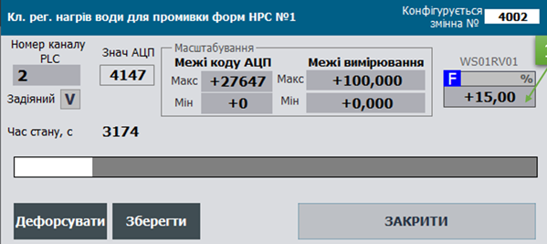

# Class AOVAR: Analog Process Output Variable

**CLSID=16#1040**

## General Description

This class implements the functions for processing, conversion, and writing raw analog output data and diagnostic information from `AOCH`. These functions include scaling, forced mode handling, and simulation mode.

If implementation differences are required, other CLSIDs in the format 16#104x should be used.

## General Functional Requirements for AOVAR

### Functional Requirements

#### Operating Modes

The AOVAR class must support the following modes (submodes):

- output writing / simulation
- non-forced / forced

In all modes except simulation mode, the value written to the linked channel `AOCH` comes from `AOVAR.VRAW`.

The **normal mode** of the class instance is a combination of "output writing" and "non-forced mode." In this mode, the `AOVAR.VAL` value is written to the raw output value `AOVAR.VRAW`, passing through processing functions such as scaling.

In **simulation mode** (`STA.SML=TRUE`), the `AOVAR.VAL` value does not undergo processing functions and is not written to `AOVAR.VRAW`. In other words, `AOVAR.VAL` has no impact on the physical output. Additionally, the `STA.SML` state of the linked channel is updated during simulation.

In **forced mode** (`STA.FRC=TRUE`), `AOVAR.VAL` can only be changed through HMI debugging windows and has the highest priority; the result of user program execution does not affect `AOVAR.VAL` in this case. When the force bit is active, the `PLC_CFG.CNTFRC` counter increments by 1.

For **network variables** assigned to a separate class, a mode is available where the data source writes externally and does not undergo processing functions. This mode is activated by the parameter `AOVAR.PRM.NORAW`.

#### Signal Filtering

Filtering is implemented using the `A_FLTR` function. A first-order aperiodic filter is used for filtering. The filter time is set by the parameter `AOVAR.T_FLT` in milliseconds. The filter also requires passing the elapsed time `dt` since the previous function call and maintaining the previous cycle value stored in `AOVAR.VALPREV`.

#### **Signal Scaling**

Scaling is implemented using the `SCALING` function. This function operates in the following mode:

- Linear dependency (for all cases)

For linear scaling, the raw (unscaled) value from `AOVAR.VRAW` is used along with the input signal range (LORAW, HIRAW) and the output signal range (LOENG, HIENG).

Practical use within the framework has shown that when displaying variables in HMI as columns, using a percentage value is preferable to absolute (engineering) units. This is because the framework allows for changing the value range, which also changes the MIN and MAX of the scale. To avoid storing engineering MIN and MAX values in SCADA/HMI, one can rely on the percentage value, which adjusts as the scale range changes. Thus, display tools requiring absolute ranges (specified by technological indicators) will use absolute values (VAL), while tools needing scale-relative values will use percentage values (VALPROC). Including VALPROC in the HMI structure increases the number of SCADA/HMI tags, so its use should be justified.

#### Channel Link Monitoring

The `STA.DLNK=TRUE` value indicates that the variable is linked to a channel.

#### Variable Activity

The variable's activity parameter is defined by the expression `STA.ENBL = NOT PRM.DSBL AND DLNK`. If the variable is inactive (`STA.ENBL=FALSE`), the following functions do not operate:

- signal output and scaling,
- simulation,
- diagnostics and alarm processing.

Higher-level control hierarchies (e.g., CM LVL2) should consider this variable as temporarily nonexistent (decommissioned). For example, if the variable controls a valve positioner, the CM will consider the variable absent and may operate in "no analog control" mode.

#### Measurement Channel Diagnostics

This class provides validity checking for the measurement channel. When `PRM.QALENBL=TRUE`, the `STA.BAD` value directly depends on the `STA.BAD` value of the linked channel. No other diagnostic methods are provided within this variable class.

`STA.BAD` is an invalidity alarm. Upon alarm activation (rising edge), `PLC_CFG.NWBAD=TRUE`. While the `STA.BAD` alarm is active:

- the corresponding `PLC_CFG.BAD` bit is set,
- the `PLC_CFG.CNTBAD` counter increments by 1.

Resetting `PRM.QALENBL=FALSE` disables the invalidity alarm checking function.

## Recommendations for HMI Use

An example of setting up analog output variable functions in the HMI is shown below:



Fig. Example of setting up analog output variable functions in the HMI.

## General Requirements for Class Variable Structures

#### AOVAR_HMI

| name    | type | adr  | bit  | descr                                                        |
| ------- | ---- | ---- | ---- | ------------------------------------------------------------ |
| STA     | INT  | 0    |      | status + load command bit, using the `AOVAR_STA` bit structure |
| VALPROC | INT  | 1    |      | value in % of the measurement scale (0-10000)                |
| VAL     | REAL | 2    |      | scaled value                                                 |

#### AOVAR_CFG

| name          | type  | adr  | bit  | descr                                                        |
| ------------- | ----- | ---- | ---- | ------------------------------------------------------------ |
| ID            | UINT  | 0    |      | Unique identifier                                            |
| CLSID         | UINT  | 1    |      | 16#1040                                                      |
| STA           | UINT  | 2    |      | status; bit assignment follows `AOVAR_STA`, may be used as a similar structure |
| STA_b0        | BOOL  | 2    | 0    | reserved                                                     |
| STA_b1        | BOOL  | 2    | 1    | reserved                                                     |
| STA_BAD       | BOOL  | 2    | 2    | =1 – Data is invalid                                         |
| STA_ALDIS     | BOOL  | 2    | 3    | =1 – Alarm decommissioned                                    |
| STA_DLNK      | BOOL  | 2    | 4    | =1 – linked to a channel                                     |
| STA_ENBL      | BOOL  | 2    | 5    | =1 – variable is enabled                                     |
| STA_b6        | BOOL  | 2    | 6    | reserved                                                     |
| STA_b7        | BOOL  | 2    | 7    | reserved                                                     |
| STA_b8        | BOOL  | 2    | 8    | reserved                                                     |
| STA_b9        | BOOL  | 2    | 9    | reserved                                                     |
| STA_b10       | BOOL  | 2    | 10   | reserved                                                     |
| STA_b11       | BOOL  | 2    | 11   | reserved                                                     |
| STA_INBUF     | BOOL  | 2    | 12   | =1 – variable is in the buffer                               |
| STA_FRC       | BOOL  | 2    | 13   | =1 – forced mode active                                      |
| STA_SML       | BOOL  | 2    | 14   | =1 – simulation mode active                                  |
| STA_CMDLOAD   | BOOL  | 2    | 15   | =1 – load command to buffer                                  |
| VRAW          | INT   | 3    |      | raw value                                                    |
| VAL           | REAL  | 4    |      | scaled value                                                 |
| VALFRC        | REAL  | 6    |      | holds the forced value                                       |
| VALPRV        | REAL  | 8    |      | value from the previous cycle (for filtering)                |
| PRM           | UINT  | 10   |      | configuration parameters, should be retained on power loss   |
| PRM_b0        | BOOL  | 10   | 0    | reserved                                                     |
| PRM_b1        | BOOL  | 10   | 1    | reserved                                                     |
| PRM_b2        | BOOL  | 10   | 2    | reserved                                                     |
| PRM_b3        | BOOL  | 10   | 3    | reserved                                                     |
| PRM_b4        | BOOL  | 10   | 4    | reserved                                                     |
| PRM_b5        | BOOL  | 10   | 5    | reserved                                                     |
| PRM_QALENBL   | BOOL  | 10   | 6    | =1 – enable channel validity alarm                           |
| PRM_DSBL      | BOOL  | 10   | 7    | =1 – variable is disabled                                    |
| PRM_PWLENBL   | BOOL  | 10   | 8    | =1 – enable piecewise linear interpolation (do not use with TOTALON) |
| PRM_b9        | BOOL  | 10   | 9    | reserved                                                     |
| PRM_b10       | BOOL  | 10   | 10   | reserved                                                     |
| PRM_b11       | BOOL  | 10   | 11   | reserved                                                     |
| PRM_b12       | BOOL  | 10   | 12   | reserved                                                     |
| PRM_b13       | BOOL  | 10   | 13   | reserved                                                     |
| PRM_STATICMAP | BOOL  | 10   | 14   | =1 - static channel mapping enabled                          |
| PRM_NORAW     | BOOL  | 10   | 15   | =1 - data source is external, bypassing scaling              |
| CHID          | UINT  | 11   |      | Logical number of the linked analog output channel           |
| LORAW         | INT   | 12   |      | raw (unscaled) minimum value                                 |
| HIRAW         | INT   | 13   |      | raw (unscaled) maximum value                                 |
| LOENG         | REAL  | 14   |      | engineering (scaled) minimum value                           |
| HIENG         | REAL  | 16   |      | engineering (scaled) maximum value                           |
| T_FLT         | UINT  | 17   |      | filtering time in milliseconds (1st-order aperiodic filter)  |
| VALPROC       | INT   | 18   |      | value in percent                                             |
| STEP1         | UINT  | 19   |      | step number                                                  |
| T_STEP1       | UDINT | 20   |      | step time in ms                                              |
| T_PREV        | UDINT | 22   |      | time in ms since the previous call, taken from PLC_CFG.TQMS  |

#### Commands for the Buffer (see buffer structure)

| Attribute | Type | Description                                                  |
| --------- | ---- | ------------------------------------------------------------ |
| CMD       | UINT | Commands:16#0001: write maximum range - forced mode only16#0002: write minimum range - forced mode only16#0003: write midrange - forced only16#0100: read configuration16#0101: write configuration16#0102: write default value16#0300: toggle forced mode16#0301: enable forced mode16#0302: disable forced mode16#0311: enable simulation16#0312: disable simulation |

#### Buffer Handling

A classic buffer handling function must be implemented.

- It is recommended to use a **single buffer** for all process variables.
- Buffer occupancy is checked by verifying the equality of the class identifier `CLSID` and the process variable identifier `ID`.
- When the buffer is captured:
  - `VARBUF.STA = AOVAR_CFG.STA`
  - `AOVAR_CFG.CMD = VARBUF.CMD` if it is not zero (enabling commands from other sources)
  - Reading the physical channel status bits of the process variable: `VARBUF.CH_STA = CHCFG.STA`.
- The process variable configuration must be read into the buffer upon receiving commands:
  - Set the status bit `STA.CMDLOAD=TRUE`
  - Update the process variable already written to the buffer using `VARBUF.CMD = 16#0100`
- The process variable configuration must be written from the buffer upon receiving commands:
  - `VARBUF.CMD = 16#0101`

A **bidirectional parametric buffer handling function (VARBUFIN <-> VARBUFOUT)** must also be implemented.

- Two buffers are used:
  - Input `VARBUFIN` – used for command handling (when `CLSID` and `ID` match) and writing information to the process variable
  - Output `VARBUFOUT` – used for reading information from the process variable when a read command is received in `VARBUFIN`
- It is recommended to use **one pair of buffers** for all process variables.
- Buffer occupancy cannot occur because the mechanism is implemented using the `VARBUFIN` and `VARBUFOUT` pair, through which data flows for further transfer to the process variable or the internal HMI buffer (similar to PKW parameter exchange in PROFIDRIVE profiles).
- The process variable configuration must be read into the output buffer when:
  - Class identifiers match (`AOVARCFG.CLSID = VARBUFIN.CLSID`), variable identifiers match (`AOVARCFG.ID = VARBUFIN.ID`), and the read command is received (`VARBUFIN.CMD = 16#100`).
- The process variable configuration must be written from the input buffer when:
  - Class identifiers match (`AOVARCFG.CLSID = VARBUFIN.CLSID`), variable identifiers match (`AOVARCFG.ID = VARBUFIN.ID`), and the write command is received (`VARBUFIN.CMD = 16#101`).

### Interface Implementation Requirements

**INOUT:**

- `CHCFG` – physical channel linked to the process variable
- `AOVARCFG` – configuration structure of the process variable
- `AOVARHMI` – HMI structure of the process variable
- If it is not possible to access external variables inside functions, `PLC_CFG`, `VARBUF`, `VARBUFIN`, and `VARBUFOUT` should be passed; alternatively, other interfaces within `PLC_CFG` may be used.

### Initialization of the Process Variable on the First Cycle

Writing default values for ID, CHID, and CHIDDF is performed in the `initvars` program section.

For each process variable, the following snippet should be present in `initvars`:

```
"VAR".AOVAR1.ID := 1001;   "VAR".AOVAR1.CHID := 1;    "VAR".AOVAR1.CHIDDF := 1;
```

Initialization is also performed inside the process variable handling function, resulting in:

- `AOVARCFG.CLSID := 16#1040;`
- Activation of the process variable using `AOVARCFG.PRM.DSBL := FALSE;`
- If the logical channel number is not set, write the default value: `AOVARCFG.CHID := AOVARCFG.CHIDDF;`
- Activation of the data quality alarm check.

### User Program Implementation Requirements

- Process variable handling functions must be called on **every cycle** of the task to which they are linked.
- On the first start (`PLC_CFG.SCN1`), the process variable identifier `AOVAR_CFG.ID` and the logical channel number `AOVAR_CFG.CHID` must be initialized.

```pascal
(* variable initialization on the first processing cycle *)
IF "SYS".PLCCFG.STA.SCN1 THEN
    #AOVARCFG.CLSID := 16#1040; (*assign class identifier*)
    #AOVARCFG.PRM.DSBL := FALSE; (*activate variable*)
    #AOVARCFG.PRM.QALENBL := true; (*enable data quality alarms*)
    #AOVARCFG.T_PREV := "SYS".PLCCFG.TQMS; (*store call timestamp*)
    IF #AOVARCFG.CHID = 0 THEN (*if logical channel number not set - write default value*)
        #AOVARCFG.CHID := #AOVARCFG.CHIDDF;
    END_IF;
    
    (*write raw value from the channel for further processing*)
    IF #CHCFG.ID > 0 THEN
        #CHCFG.VAL := #AOVARCFG.VRAW;
    ELSE
        #CHCFG.VAL := 0;
    END_IF;
    
    #AOVARCFG.T_STEP1 := 0; (*reset step timer*)
    #AOVARCFG.STEP1 := 100; (*switch to normal step*)
    
    (*determine variable ID range limits*)
    IF #AOVARCFG.ID>0 THEN
        IF #AOVARCFG.ID<"SYS".VARIDMIN THEN "SYS".VARIDMIN:=#AOVARCFG.ID; END_IF;
        IF #AOVARCFG.ID>"SYS".VARIDMAX THEN "SYS".VARIDMAX:=#AOVARCFG.ID; END_IF;
    END_IF;
    RETURN;
END_IF;

(*read status bits from the process variable into internal variables*)
#BAD := #AOVARCFG.STA.BAD;
#ALDIS := #AOVARCFG.STA.ALDIS;
#DLNK := #AOVARCFG.STA.DLNK;
#ENBL := #AOVARCFG.STA.ENBL;
#INBUF := #AOVARCFG.STA.INBUF;
#FRC := #AOVARCFG.STA.FRC;
#SML := #AOVARCFG.STA.SML;
#CMDLOAD := #AOVARCFG.STA.CMDLOAD;

#INBUF := (#AOVARCFG.ID = "BUF".VARBUF.ID) AND (#AOVARCFG.CLSID = "BUF".VARBUF.CLSID); (*variable in buffer if variable ID and class ID match*)
#CMDLOAD := #AOVARHMI.STA.%X15;  (*command to write to buffer from HMI*)
#CMD := 0; (*reset internal command*)
#DLNK := (#CHCFG.ID > 0); (*variable linked to channel if channel has valid ID (non-zero)*)
#VARENBL := NOT #AOVARCFG.PRM.DSBL AND #DLNK;(*variable active if linked to channel and parameter 'disabled' is not active*)

#T_STEPMS := #AOVARCFG.T_STEP1; (*store cycle time in ms*)
#VAL := #AOVARCFG.VAL; (*read value from process variable into internal for further processing*)
#VRAW := #AOVARCFG.VRAW; (*read raw value from channel*)

(*implement ping-pong algorithm*)
IF #DLNK THEN
    #CHCFG.STA.PNG := true;
    #CHCFG.VARID := #AOVARCFG.ID;
END_IF;

(*if variable is inactive, do not count time, reset state*)
IF NOT #VARENBL THEN
    #AOVARCFG.T_STEP1 := 0;
    #AOVARCFG.STEP1 := 400;
END_IF;

(*determine time delta between function calls using the ms counter and the last call timestamp*)
#dT := "SYS".PLCCFG.TQMS - #AOVARCFG.T_PREV;

(* broadcast unforce *) 
IF "SYS".PLCCFG.CMD = 16#4302 THEN
    #FRC := false; (*unforce object of this type*)
END_IF;

(*select source of configuration/control command by priority if commands arrive simultaneously*)
IF #CMDLOAD THEN (*buffer write command - from HMI*)
    #CMD := 16#0100;
ELSIF #INBUF AND "BUF".VARBUF.CMD <> 0 THEN (*command from buffer*)
    #CMD := "BUF".VARBUF.CMD;
END_IF;

```

```pascal
(*commands*)
CASE #CMD OF
    16#0001: (*write maximum range value*)
        IF #FRC AND #INBUF THEN
            #AOVARCFG.VALFRC := #AOVARCFG.HIENG;
            #VAL := #AOVARCFG.HIENG;
            #AOVARCFG.STEP1 := 100;
            #AOVARCFG.T_STEP1 := 0;
        END_IF;
    16#0002: (*write minimum range value*)
        IF #FRC AND #INBUF THEN
            #AOVARCFG.VALFRC := #AOVARCFG.LOENG;
            #VAL := #AOVARCFG.LOENG;
            #AOVARCFG.STEP1 := 100;
            #AOVARCFG.T_STEP1 := 0;
        END_IF;
    16#0003: (*write midpoint of the range*)
        IF #FRC AND #INBUF THEN
            #AOVARCFG.VALFRC := (#AOVARCFG.HIENG - #AOVARCFG.LOENG) / 2.0;
            #VAL := (#AOVARCFG.HIENG - #AOVARCFG.LOENG) / 2.0;
            #AOVARCFG.STEP1 := 100;
            #AOVARCFG.T_STEP1 := 0;
        END_IF;
    16#0100: (*read configuration*)
        (* MSG 200-Ok 400-Error
        // 200 - Data written
        // 201 - Data read
        // 403 - Channel already occupied
        // 404 - Channel number out of range
        // 405 - Static channel addressing active *)
        "BUF".VARBUF.MSG := 201;
        
        (*read variable ID and class ID*)
        "BUF".VARBUF.ID := #AOVARCFG.ID;
        "BUF".VARBUF.CLSID := #AOVARCFG.CLSID;
        
        (*read bit parameters*)
        "BUF".VARBUF.PRM.%X6 := #AOVARCFG.PRM.QALENBL;
        "BUF".VARBUF.PRM.%X7 := #AOVARCFG.PRM.DSBL;
        "BUF".VARBUF.PRM.%X8 := #AOVARCFG.PRM.PWLENBL;
        "BUF".VARBUF.PRM.%X14 := #AOVARCFG.PRM.STATICMAP;
        "BUF".VARBUF.PRM.%X15 := #AOVARCFG.PRM.NORAW;
        
        (*read parameters*)
        "BUF".VARBUF.CHID := #AOVARCFG.CHID;
        "BUF".VARBUF.LORAW := #AOVARCFG.LORAW;
        "BUF".VARBUF.HIRAW := #AOVARCFG.HIRAW;
        "BUF".VARBUF.LOENG := #AOVARCFG.LOENG;
        "BUF".VARBUF.HIENG := #AOVARCFG.HIENG;
        "BUF".VARBUF.T_FLTSP := #AOVARCFG.T_FLT;
        
        (*read variable value for bumpless forcing*)
        "BUF".VARBUF.VALR := #AOVARCFG.VALFRC;
        
    16#0101: (*write configuration*)
        (* MSG 200-Ok 400-Error
        // 200 - Data written
        // 201 - Data read
        // 403 - Channel already occupied
        // 404 - Channel number out of range
        // 405 - Static channel addressing active *)
        "BUF".VARBUF.MSG:=200;
        
        (*write bit parameters*)
        #AOVARCFG.PRM.QALENBL := "BUF".VARBUF.PRM.%X6;
        #AOVARCFG.PRM.DSBL := "BUF".VARBUF.PRM.%X7;
        #AOVARCFG.PRM.PWLENBL := "BUF".VARBUF.PRM.%X8;
        #AOVARCFG.PRM.STATICMAP := "BUF".VARBUF.PRM.%X14;
        #AOVARCFG.PRM.NORAW := "BUF".VARBUF.PRM.%X15;
        
        (*write parameters*)
        #AOVARCFG.LORAW := "BUF".VARBUF.LORAW;
        #AOVARCFG.HIRAW := "BUF".VARBUF.HIRAW;
        #AOVARCFG.LOENG := "BUF".VARBUF.LOENG;
        #AOVARCFG.HIENG := "BUF".VARBUF.HIENG;
        #AOVARCFG.T_FLT := "BUF".VARBUF.T_FLTSP;
        
        IF NOT #AOVARCFG.PRM.STATICMAP THEN (*change logical channel number only if static addressing is inactive*)
            IF "BUF".VARBUF.CHID>=0 AND "BUF".VARBUF.CHID <= INT_TO_UINT("SYS".PLCCFG.AOCNT) THEN (*if channel number is within the channel count*)
                IF "SYS".CHAO["BUF".VARBUF.CHID].VARID = 0 THEN (*if channel is free (VARID = 0)*)
                    #AOVARCFG.CHID := "BUF".VARBUF.CHID; (*change logical channel number*)
                ELSIF "BUF".VARBUF.CHID <> #AOVARCFG.CHID THEN  (*otherwise show error that channel is occupied*)
                    "BUF".VARBUF.MSG := 403;(* channel already occupied *)
                END_IF;
            ELSE
                "BUF".VARBUF.MSG := 404; (*channel number out of range*)
            END_IF;
        ELSIF "BUF".VARBUF.CHID <> #AOVARCFG.CHID THEN (*otherwise show error for active static channel addressing*)
            "BUF".VARBUF.MSG := 405;(* static channel addressing active *)
        END_IF;
        IF #INBUF THEN (*update channel number after write if variable is still in buffer*)
            "BUF".VARBUF.CHID := #AOVARCFG.CHID;
        END_IF;
        
    16#0102: (*write default value*)
        #AOVARCFG.CHID := #AOVARCFG.CHIDDF;
    16#0300: (*toggle forcing*)
        #FRC := NOT #FRC;
    16#0301: (*enable forcing*)
        #FRC := true;
    16#0302: (*disable forcing*)
        #FRC := false;
    16#0311: (* enable simulation *)
        #SML := true;
    16#0312: (* disable simulation *)
        #SML := false;
END_CASE;

```

```pascal
(*range validity check*)
IF ABS (#AOVARCFG.HIRAW - #AOVARCFG.LORAW) < 1 THEN
    #AOVARCFG.LORAW := 0;
    #AOVARCFG.HIRAW := 27648;
END_IF;
IF ABS(#AOVARCFG.HIENG - #AOVARCFG.LOENG) < 0.00001 THEN
    #AOVARCFG.LOENG := 0.0;
    #AOVARCFG.HIENG := 100.0;
END_IF;

(*calculate 1% of scale*)
#VAL1PROC := INT_TO_REAL(#AOVARCFG.HIRAW - #AOVARCFG.LORAW) / 100.0;
IF #VAL1PROC = 0.0 THEN
    #VAL1PROC := 1.0;
END_IF;

(*val*)
IF #FRC THEN (*forcing mode*)
    IF #INBUF THEN
        #AOVARCFG.VALFRC := "BUF".VARBUF.VALR;
    END_IF;
    #VAL := #AOVARCFG.VALFRC;
ELSE
    #AOVARCFG.VALFRC := #VAL;
END_IF;

IF #VARENBL THEN
    (*if previous value is out of range, apply range limiting*)
    IF #AOVARCFG.VALPRV<#AOVARCFG.LOENG THEN #AOVARCFG.VALPRV:=#AOVARCFG.LOENG; END_IF;
    IF #AOVARCFG.VALPRV>#AOVARCFG.HIENG THEN #AOVARCFG.VALPRV:=#AOVARCFG.HIENG; END_IF;
    
    (*filtering*)
    IF #AOVARCFG.T_FLT <= 0 THEN (*filter time cannot be zero*)
        #AOVARCFG.T_FLT := 1;
    END_IF;
    #VALFLT:="A_FLTR" (IN := #VAL, dT := #dT, T_FLT := UINT_TO_UDINT(#AOVARCFG.T_FLT), PRM := #tmpuint, STA := #tmpuint, VALPRV := #AOVARCFG.VALPRV);
    
    (*scaling*)
    #PRM_SCL:=0;
    #STA_SCL:=0;
    #PRM_SCL.%X0 := false;(*square root dependence, X0*)
    #PRM_SCL.%X1 := FALSE;(*limit output value, X1*)
    IF NOT #AOVARCFG.PRM.NORAW THEN (*if scaling is not disabled*)
        #VRAW := REAL_TO_INT("SCALING" (IN := #VALFLT, in_min := #AOVARCFG.LOENG, in_max := #AOVARCFG.HIENG, out_min := INT_TO_REAL(#AOVARCFG.LORAW), out_max := INT_TO_REAL(#AOVARCFG.HIRAW), STA := #STA_SCL, PRM := #PRM_SCL)); (*scaled value written to raw*)
    ELSE
        #VRAW := REAL_TO_INT(#VALFLT); (*otherwise value is not scaled*)
    END_IF;
    
    IF NOT #SML THEN (*simulation mode - output value does not change*)
        #CHCFG.VAL := #VRAW;
    END_IF;
END_IF;

(*alarm processing - channel invalidity*)
#tempBAD := #CHCFG.STA.BAD AND #AOVARCFG.PRM.QALENBL AND #VARENBL AND NOT #SML;
#TDEAQALSP := 10;     (*delay for BAD alarm generation in 0.1 s*)

CASE #AOVARCFG.STEP1 OF
    0:(*init*)
        #AOVARCFG.STEP1 := 100;
        #AOVARCFG.T_STEP1 := 0;
    100:(*normal*)
        #BAD := false;
        IF #tempBAD THEN
            #AOVARCFG.STEP1 := 150;
            #AOVARCFG.T_STEP1 := 0;
        END_IF;
    150:(*normal to BAD*)
        IF #AOVARCFG.T_STEP1 > INT_TO_UDINT(#TDEAQALSP) THEN
            #AOVARCFG.STEP1 := 200;
            #AOVARCFG.T_STEP1 := 0;
        ELSIF NOT #tempBAD THEN
            #AOVARCFG.STEP1 := 100;
            #AOVARCFG.T_STEP1 := 0;
        END_IF;
    200:(*BAD*)
        #BAD := true;
        IF NOT #tempBAD AND #AOVARCFG.T_STEP1 > INT_TO_UDINT(#TDEAQALSP) THEN
            #AOVARCFG.STEP1 := 100;
            #AOVARCFG.T_STEP1 := 0;
        END_IF;
    ELSE
        #AOVARCFG.STEP1 := 0;
END_CASE;

(*transfer alarms to PLCCFG for forming general status bit and detecting new alarm*)
IF #BAD THEN
    "SYS".PLCCFG.ALM1.BAD := true;
    "SYS".PLCCFG.CNTBAD := "SYS".PLCCFG.CNTBAD + 1;
    IF NOT #AOVARCFG.STA.BAD THEN
        "SYS".PLCCFG.ALM1.NWBAD := true;
    END_IF;
END_IF;

(*transfer status bits to PLCCFG for forming general status bit*)
IF #FRC THEN
    "SYS".PLCCFG.STA.FRC1 := true;
    "SYS".PLCCFG.CNTFRC := "SYS".PLCCFG.CNTFRC + 1;
END_IF;
IF #SML THEN
    "SYS".PLCCFG.STA.SML := true;
END_IF;

#CMDLOAD := FALSE;

(*transfer status bits from internal variables to process variable*)
#AOVARCFG.STA.BAD := #BAD;
#AOVARCFG.STA.ALDIS := #ALDIS;
#AOVARCFG.STA.DLNK := #DLNK;
#AOVARCFG.STA.ENBL := #VARENBL;
#AOVARCFG.STA.INBUF := #INBUF;
#AOVARCFG.STA.FRC := #FRC;
#AOVARCFG.STA.SML := #SML;
#AOVARCFG.STA.CMDLOAD :=  FALSE;

(*percentage value and limiting*)
IF #VAL1PROC = 0.0 THEN
    #VAL1PROC := 1.0;
END_IF;
#VALPROC := INT_TO_REAL(#CHCFG.VAL - #AOVARCFG.LORAW) / #VAL1PROC;
IF #VALPROC < 0.0 THEN
    #VALPROC := 0.0;
END_IF;
IF #VALPROC > 100.0 THEN
    #VALPROC := 100.0;
END_IF;

(*transfer value from internal variables to process variable*)
#AOVARCFG.VAL := #VAL;
#AOVARCFG.VRAW := #VRAW;
#AOVARCFG.VALPROC := REAL_TO_INT(#VALPROC*256.0) AND 16#FF00;(*similar to AIVAR*)

```

```pascal
(*transfer value to HMI part*)
#AOVARHMI.STA.%X0 := #AOVARCFG.STA.STA_b0;
#AOVARHMI.STA.%X1 := #AOVARCFG.STA.STA_b1;
#AOVARHMI.STA.%X2 := #AOVARCFG.STA.BAD;
#AOVARHMI.STA.%X3 := #AOVARCFG.STA.ALDIS;
#AOVARHMI.STA.%X4 := #AOVARCFG.STA.DLNK;
#AOVARHMI.STA.%X5 := #AOVARCFG.STA.ENBL;
#AOVARHMI.STA.%X6 := #AOVARCFG.STA.STA_b6;
#AOVARHMI.STA.%X7 := #AOVARCFG.STA.STA_b7;
#AOVARHMI.STA.%X8 := #AOVARCFG.STA.STA_b8;
#AOVARHMI.STA.%X9 := #AOVARCFG.STA.STA_b9;
#AOVARHMI.STA.%X10 := #AOVARCFG.STA.STA_b10;
#AOVARHMI.STA.%X11 := #AOVARCFG.STA.STA_b11;
#AOVARHMI.STA.%X12 := #AOVARCFG.STA.INBUF;
#AOVARHMI.STA.%X13 := #AOVARCFG.STA.FRC;
#AOVARHMI.STA.%X14 := #AOVARCFG.STA.SML;
#AOVARHMI.STA.%X15 := #AOVARCFG.STA.CMDLOAD;

#AOVARHMI.VAL := #VAL;
#AOVARHMI.VALPROC := #AOVARCFG.VALPROC;

#AOVARCFG.T_PREV := "SYS".PLCCFG.TQMS; (*store the last call time of the function instance*)

(*state time counting and limiting to the upper range*)
#AOVARCFG.T_STEP1 := #AOVARCFG.T_STEP1 + #dT;
IF #AOVARCFG.T_STEP1 > 16#7FFF_FFFF THEN
    #AOVARCFG.T_STEP1 := 16#7FFF_FFFF;
END_IF;

(*automatic update if variable is written to buffer*)
IF #INBUF THEN
    "BUF".VARBUF.CMD := 0;
    
    "BUF".VARBUF.STA.%X0 := #AOVARCFG.STA.STA_b0;
    "BUF".VARBUF.STA.%X1 := #AOVARCFG.STA.STA_b1;
    "BUF".VARBUF.STA.%X2 := #AOVARCFG.STA.BAD;
    "BUF".VARBUF.STA.%X3 := #AOVARCFG.STA.ALDIS;
    "BUF".VARBUF.STA.%X4 := #AOVARCFG.STA.DLNK;
    "BUF".VARBUF.STA.%X5 := #AOVARCFG.STA.ENBL;
    "BUF".VARBUF.STA.%X6 := #AOVARCFG.STA.STA_b6;
    "BUF".VARBUF.STA.%X7 := #AOVARCFG.STA.STA_b7;
    "BUF".VARBUF.STA.%X8 := #AOVARCFG.STA.STA_b8;
    "BUF".VARBUF.STA.%X9 := #AOVARCFG.STA.STA_b9;
    "BUF".VARBUF.STA.%X10 := #AOVARCFG.STA.STA_b10;
    "BUF".VARBUF.STA.%X11 := #AOVARCFG.STA.STA_b11;
    "BUF".VARBUF.STA.%X12 := #AOVARCFG.STA.INBUF;
    "BUF".VARBUF.STA.%X13 := #AOVARCFG.STA.FRC;
    "BUF".VARBUF.STA.%X14 := #AOVARCFG.STA.SML;
    "BUF".VARBUF.STA.%X15 := #AOVARCFG.STA.CMDLOAD;
    
    "BUF".VARBUF.VRAWR := INT_TO_REAL(#VRAW);
    "BUF".VARBUF.VALR := #VAL;
    "BUF".VARBUF.VALPROC := #AOVARCFG.VALPROC;
    "BUF".VARBUF.STEP1 := #AOVARCFG.STEP1;
    "BUF".VARBUF.T_STEP1 := #AOVARCFG.T_STEP1;
    
    (*reading status bits of the physical channel of the process variable*)
    "BUF".VARBUF.CH_CLSID := #CHCFG.CLSID;
    "BUF".VARBUF.CH_STA.%X0 := #CHCFG.STA.VRAW;
    "BUF".VARBUF.CH_STA.%X1 := #CHCFG.STA.VALB;
    "BUF".VARBUF.CH_STA.%X2 := #CHCFG.STA.BAD;
    "BUF".VARBUF.CH_STA.%X3 := #CHCFG.STA.b3;
    "BUF".VARBUF.CH_STA.%X4 := #CHCFG.STA.PNG;
    "BUF".VARBUF.CH_STA.%X5 := #CHCFG.STA.ULNK;
    "BUF".VARBUF.CH_STA.%X6 := #CHCFG.STA.MERR;
    "BUF".VARBUF.CH_STA.%X7 := #CHCFG.STA.BRK;
    "BUF".VARBUF.CH_STA.%X8 := #CHCFG.STA.SHRT;
    "BUF".VARBUF.CH_STA.%X9 := #CHCFG.STA.NBD;
    "BUF".VARBUF.CH_STA.%X10 := #CHCFG.STA.b10;
    "BUF".VARBUF.CH_STA.%X11 := #CHCFG.STA.INIOTBUF;
    "BUF".VARBUF.CH_STA.%X12 := #CHCFG.STA.INBUF;
    "BUF".VARBUF.CH_STA.%X13 := #CHCFG.STA.FRC;
    "BUF".VARBUF.CH_STA.%X14 := #CHCFG.STA.SML;
    "BUF".VARBUF.CH_STA.%X15 := #CHCFG.STA.CMDLOAD;
    
    (*function to calculate the physical value of the signal in mA, V, etc.*)
    "BUF".VARBUF.CH_VALSIG := "INT_TO_SIGU" (CLSID := #CHCFG.CLSID,  VALINT := #VRAW);
END_IF;

(*implementation of configuration data reading into the out buffer*)
IF (UINT_TO_WORD(#AOVARCFG.CLSID) AND 16#FFF0)=(UINT_TO_WORD("BUF".VARBUFIN.CLSID) AND 16#FFF0) AND #AOVARCFG.ID="BUF".VARBUFIN.ID AND "BUF".VARBUFIN.CMD = 16#100 THEN
    (* MSG 200-Ok 400-Error
    // 200 - Data written
    // 201 - Data read
    // 403 - Channel already occupied
    // 404 - Channel number out of range *)
    "BUF".VARBUFOUT.MSG := 201;
    
    "BUF".VARBUFOUT.PRM.%X6 := #AOVARCFG.PRM.QALENBL;
    "BUF".VARBUFOUT.PRM.%X7 := #AOVARCFG.PRM.DSBL;
    "BUF".VARBUFOUT.PRM.%X8 := #AOVARCFG.PRM.PWLENBL;
    "BUF".VARBUFOUT.PRM.%X14 := #AOVARCFG.PRM.STATICMAP;
    "BUF".VARBUFOUT.PRM.%X15 := #AOVARCFG.PRM.NORAW;
    
    "BUF".VARBUFOUT.ID := #AOVARCFG.ID;
    "BUF".VARBUFOUT.CLSID := #AOVARCFG.CLSID;
    "BUF".VARBUFOUT.CHID := #AOVARCFG.CHID;
    "BUF".VARBUFOUT.VALR := #AOVARCFG.VALFRC;
    
    "BUF".VARBUFOUT.LORAW := #AOVARCFG.LORAW;
    "BUF".VARBUFOUT.HIRAW := #AOVARCFG.HIRAW;
    "BUF".VARBUFOUT.LOENG := #AOVARCFG.LOENG;
    "BUF".VARBUFOUT.HIENG := #AOVARCFG.HIENG;
    "BUF".VARBUFOUT.T_FLTSP := #AOVARCFG.T_FLT;
    
    "BUF".VARBUFIN.CMD :=0;
END_IF;

(*implementation of writing configuration data from in buffer to process variable*)
IF (UINT_TO_WORD(#AOVARCFG.CLSID) AND 16#FFF0)=(UINT_TO_WORD("BUF".VARBUFIN.CLSID) AND 16#FFF0) AND #AOVARCFG.ID="BUF".VARBUFIN.ID AND "BUF".VARBUFIN.CMD = 16#101 THEN
    (* MSG 200-Ok 400-Error
    // 200 - Data written
    // 201 - Data read
    // 403 - Channel already occupied
    // 404 - Channel number out of range *)
    
    "BUF".VARBUFOUT:="BUF".VARBUFIN;
    
    #AOVARCFG.PRM.QALENBL := "BUF".VARBUFIN.PRM.%X6;
    #AOVARCFG.PRM.DSBL := "BUF".VARBUFIN.PRM.%X7;
    #AOVARCFG.PRM.PWLENBL := "BUF".VARBUFIN.PRM.%X8;
    #AOVARCFG.PRM.STATICMAP := "BUF".VARBUFIN.PRM.%X14;
    #AOVARCFG.PRM.NORAW := "BUF".VARBUFIN.PRM.%X15;
    
    #AOVARCFG.LORAW := "BUF".VARBUFIN.LORAW;
    #AOVARCFG.HIRAW := "BUF".VARBUFIN.HIRAW;
    #AOVARCFG.LOENG := "BUF".VARBUFIN.LOENG;
    #AOVARCFG.HIENG := "BUF".VARBUFIN.HIENG;
    #AOVARCFG.T_FLT := "BUF".VARBUFIN.T_FLTSP;
    
    (*channel free checking should be handled in buffer control function*)
    "BUF".VARBUFOUT.MSG:=200;
    IF NOT #AOVARCFG.PRM.STATICMAP THEN
        IF "BUF".VARBUFIN.CHID>=0 AND "BUF".VARBUFIN.CHID <= INT_TO_UINT("SYS".PLCCFG.AOCNT) THEN
            IF "SYS".CHAO["BUF".VARBUFIN.CHID].VARID = 0 THEN
                #AOVARCFG.CHID := "BUF".VARBUFIN.CHID;
            ELSIF "BUF".VARBUFIN.CHID <> #AOVARCFG.CHID THEN
                "BUF".VARBUFOUT.MSG := 403;(*channel already occupied*)
            END_IF;
        ELSE
            "BUF".VARBUFOUT.MSG := 404; (*channel number out of range*)
        END_IF;
    ELSIF "BUF".VARBUFIN.CHID <> #AOVARCFG.CHID THEN (*otherwise return static addressing error*)
        "BUF".VARBUFOUT.MSG := 405;(*static channel addressing active*)
    END_IF;
    "BUF".VARBUFIN.CMD :=0;
END_IF;

```

## Testing

General testing requirements are provided in the LVL1 Classes document. This section lists only specific tests that differ from the general ones.

### Test List

| No.  | Title                                                       | When to check                 | Notes |
| ---- | ----------------------------------------------------------- | ----------------------------- | ----- |
| 1    | Assignment of ID and CLSID on startup                       | after function implementation |       |
| 2    | Write commands to the buffer                                | after function implementation |       |
| 3    | Parameter change and writing from buffer                    | after function implementation |       |
| 4    | Changing the logical channel number                         | after function implementation |       |
| 5    | Writing default CHID value on startup and by single command | after function implementation |       |
| 6    | Operation of built-in time counters                         | after function implementation |       |
| 7    | PLC time counter rollover effect on step time               | after function implementation |       |
| 8    | Ping-Pong algorithm                                         | after function implementation |       |
| 9    | Operation in non-forced mode                                | after function implementation |       |
| 10   | Operation in forced mode                                    | after function implementation |       |
| 11   | Sending broadcast deforce commands                          | after function implementation |       |
| 12   | Operation in simulation mode                                | after function implementation |       |
| 13   | Scaling function                                            |                               |       |
| 14   | Filtering function                                          | after function implementation |       |
| 15   | Disabling the variable                                      | after function implementation |       |

### 1 Assignment of ID and CLSID on startup

- Before the test, the PLC must be in STOP.
- After startup, all process variables used in the program must have their ID and CLSID assigned.

### 2 Buffer linking commands

| No.  | Action to verify                                             | Expected result                                              | Notes |
| ---- | ------------------------------------------------------------ | ------------------------------------------------------------ | ----- |
| 1    | Set STA.X15:=1 for one of the AOVAR_HMI variables            | VARBUF should be loaded with the full AOVAR_CFG content.STA.X15 in AOVAR_HMI should reset to 0.STA.12 (INBUF) should be 1 for AOVAR_HMI, AOVAR_CFG, and VARBUF. |       |
| 2    | Change AOVAR_CFG.VAL                                         | Corresponding value should update in AOVAR_HMI.VAL and VARBUF.VAL. |       |
| 3    | Set STA.X15:=1 for another AOVAR_HMI variable                | VARBUF should be loaded with the AOVAR_CFG content of the other variable. |       |
| 4    | Change a config field in VARBUF (e.g., VARBUF.CHID), then issue the write command VARBUF.CMD:=16#100 | The changed VARBUF.CHID should revert to its previous value. |       |

### 3 Parameter change and writing from buffer

| No.  | Action to verify                                             | Expected result                                 | Notes |
| ---- | ------------------------------------------------------------ | ----------------------------------------------- | ----- |
| 1    | Set STA.X15:=1 for one of the AOVAR_HMI variables            | Same as in Test 2.1                             |       |
| 2    | Change a config field in VARBUF (e.g., VARBUF.T_FLT), then issue the write command VARBUF.CMD:=16#101 | The new value should appear in AOVAR_CFG.T_FLT. |       |
| 3    | Repeat step 2 for another parameter                          |                                                 |       |

### 4 Changing the logical channel number

| No.  | Action to verify                                             | Expected result                                              | Notes |
| ---- | ------------------------------------------------------------ | ------------------------------------------------------------ | ----- |
| 1    | Set STA.X15:=1 for one of the AOVAR_HMI variables            | Same as in Test 2.1                                          |       |
| 2    | Change VARBUF.CHID to a free, valid channel and issue VARBUF.CMD:=16#101 | AOVAR_CFG.CHID should update; VARBUF.MSG should show success (200). |       |
| 3    | Change VARBUF.CHID to an occupied channel and issue VARBUF.CMD:=16#101 | AOVAR_CFG.CHID should not change; VARBUF.MSG should show error (403). |       |
| 4    | Change VARBUF.CHID to an invalid channel number and issue VARBUF.CMD:=16#101 | AOVAR_CFG.CHID should not change; VARBUF.MSG should show error (404). |       |
| 5    | Enable static mapping (AOVAR_CFG.PRM.STATICMAP:=1), change VARBUF.CHID to a valid free channel, and issue VARBUF.CMD:=16#101 | AOVAR_CFG.CHID should not change; VARBUF.MSG should show static mapping error (405). |       |

### 5 Writing default CHID value on startup and by single command

- On startup:
  - Ensure PLC is in STOP before the test.
  - After startup, all process variables should write CHID and CHIDDF values.
- By single command:

| No.  | Action to verify                                             | Expected result                                              | Notes |
| ---- | ------------------------------------------------------------ | ------------------------------------------------------------ | ----- |
| 1    | Set STA.X15:=1 for one of the AOVAR_HMI variables            | Same as in Test 2.1                                          |       |
| 2    | Change VARBUF.CHID to a free, valid channel and issue VARBUF.CMD:=16#101 | Same as in Test 4.2                                          |       |
| 3    | Issue the command to write the default value VARBUF.CMD:=16#102 | AOVAR_CFG.CHID should update with the value stored in AOVAR_CFG.CHIDDF. |       |

### 6 Operation of built-in time counters

The current step time for the variable `AOVAR_CFG` is shown in `AOVAR_CFG.T_STEP1` (in ms). Accuracy is checked with an astronomical clock.

### 7 PLC time counter rollover effect on step time

| No.  | Action to verify                                             | Expected result                                              | Notes |
| ---- | ------------------------------------------------------------ | ------------------------------------------------------------ | ----- |
| 1    | Monitor PLCCFG.TQMS and AOVAR1.T_STEP1 and verify accuracy with an astronomical clock | Both counters should count time in ms correctly.             |       |
| 2    | Set PLCCFG.TQMS to 16#FFFF_FFFF - 5000 and AOVAR1.T_STEP1 to 16#7FFF_FFFF - 10000 | For 5000 ms, counting should be normal; after PLCCFG.TQMS overflows, it should restart while AOVAR1.T_STEP1 will continue until its maximum and then stop. |       |

### 8 Ping-Pong algorithm

| No.  | Action to verify                              | Expected result                                              | Notes |
| ---- | --------------------------------------------- | ------------------------------------------------------------ | ----- |
| 1    | Check CHAO.VARID for the test variable AOVAR1 | CHAO.VARID should display AOVAR1.ID; CHAO.STA_ULNK=1; AOVAR1.STA.DLNK=1. |       |
| 2    | Write AOVAR1.CHID:=0                          | AOVAR1.STA.DLNK=0; CHAO.VARID=0; CHAO.STA_ULNK=0.            |       |
| 3    | Restore previous value in AOVAR1.CHID         | CHAO.VARID should again show AOVAR1.ID; CHAO.STA_ULNK=1; AOVAR1.STA.DLNK=1. |       |
| 4    | Repeat for another process variable           |                                                              |       |

### 9 Operation in non-forced mode

| No.  | Action to verify                                             | Expected result                                              | Notes |
| ---- | ------------------------------------------------------------ | ------------------------------------------------------------ | ----- |
| 1    | Set STA.X15:=1 for one of the AOVAR_HMI variables            | Same as in Test 2.1                                          |       |
| 2    | Change AOVAR_CFG.VAL                                         | Value should appear in AOVAR_HMI.VAL, VARBUF.VAL, AOVAR_HMI.VALPRCSTA2, and scaled value should appear in AOVAR_CFG.VRAW. |       |
| 3    | Configure scaling parameters AOVARCFG.LORAW, AOVARCFG.HIRAW, AOVARCFG.LOENG, AOVARCFG.HIENG |                                                              |       |
| 4    | Change AOVAR_CFG.VAL                                         | Scaled value should appear in AOVAR_CFG.VRAW; verify correctness. |       |
| 6    | Enable external data source, no scaling (AOVAR_CFG.PRM.NORAW=1), and change AOVAR_CFG.VAL | AOVAR_CFG.VAL should directly appear in AOVAR_CFG.VRAW.      |       |

### 10 Operation in forced mode

| No.  | Action to verify                                             | Expected result                                              | Notes |
| ---- | ------------------------------------------------------------ | ------------------------------------------------------------ | ----- |
| 1    | Set STA.X15:=1 for one of the AOVAR_HMI variables            | The entire content of AOVAR_CFG must load into VARBUF.STA.X15 in AOVAR_HMI must reset to 0.STA.12 (INBUF) must be 1 for AOVAR_HMI, AOVAR_CFG, and VARBUF. |       |
| 2    | Send force command VARBUF.CMD=16#0301                        | The STA.FRC bit must be 1.                                   |       |
| 3    | Change AOVAR1.VAL                                            | The value must **not** change in AOVAR_HMI.VAL and VARBUF.VALR. |       |
| 4    | Send command 16#0001 (write maximum range)                   | AOVAR1.VAL must change to the maximum range value.           |       |
| 5    | Send command 16#0002 (write minimum range)                   | AOVAR1.VAL must change to the minimum range value.           |       |
| 6    | Send command 16#0003 (write mid range)                       | AOVAR1.VAL must change to the mid range value.               |       |
| 7    | Change `VARBUF.VALR`                                         | AOVAR1.VAL must change to the specified value.               |       |
| 8    | Send deforce command VARBUF.CMD=16#0302                      | STA.FRC bit must be 0; AOVAR1.VAL must keep its value.       |       |
| 9    | Send toggle force command 16#0300 several times, leaving the variable forced | STA.FRC bit must toggle accordingly.                         |       |
| 10   | Put several variables in forced mode                         | STA.FRC bits for the respective variables must be 1.         |       |
| 11   | Check PLC.STA_PERM and PLC.CNTFRC_PERM                       | PLC.STA_PERM.X11 must be 1, PLC.CNTFRC_PERM must equal the number of forced variables. |       |
| 12   | Remove all variables from forced mode                        | PLC.STA_PERM.X11 must be 0, PLC.CNTFRC_PERM must be 0.       |       |

### 11 Sending broadcast deforce commands

| Step No. | Action to verify                               | Expected result                                              | Notes |
| -------- | ---------------------------------------------- | ------------------------------------------------------------ | ----- |
| 1        | Put several variables in forced mode           | STA.FRC bits for the respective variables must be 1.         |       |
| 2        | Check PLC.STA_PERM and PLC.CNTFRC_PERM         | PLC.STA_PERM.X11 must be 1, PLC.CNTFRC_PERM must equal the number of forced variables. |       |
| 3        | Send broadcast deforce command PLC.CMD=16#4302 | STA.FRC bits for all variables must be 0, PLC.CNTFRC_PERM must be 0. |       |

### 12 Operation in simulation mode

| No.  | Action to verify                                   | Expected result                                              | Notes |
| ---- | -------------------------------------------------- | ------------------------------------------------------------ | ----- |
| 1    | Set STA.X15:=1 for one of the AOVAR_HMI variables  | The entire content of AOVAR_CFG must load into VARBUF.STA.X15 in AOVAR_HMI must reset to 0.STA.12 (INBUF) must be 1 for AOVAR_HMI, AOVAR_CFG, and VARBUF. |       |
| 2    | Send simulation enable command VARBUF.CMD=16#0311  | STA.SML bit must be 1.                                       |       |
| 3    | Change AOVAR_CFG.VAL                               | The value must update in AOVAR_HMI and VARBUF, but must not be sent to the physical channel CHAO.VAL. |       |
| 4    | Check PLC.STA_PERM                                 | PLC.STA_PERM.X14 must be 1 (indicating simulated objects are active). |       |
| 6    | Send simulation disable command VARBUF.CMD=16#0312 | STA.SML bit must be 0.                                       |       |
| 7    | Change AOVAR_CFG.VAL                               | The value must update in AOVAR_HMI.VAL and VARBUF.VALR and must be sent to the physical channel CHAO.VAL. |       |

### 13 Filtering function

| No.  | Action to verify                                             | Expected result                                              | Notes |
| ---- | ------------------------------------------------------------ | ------------------------------------------------------------ | ----- |
| 1    | Change the filter time value AOVAR_CFG.T_FLT for the test variable to 10,000 ms |                                                              |       |
| 2    | Change AOVAR_CFG.VAL                                         | AOVAR_CFG.VRAW must gradually (over the set filter time) adjust to the new value. |       |
| 3    | Repeat step 2 for another AOVAR_CFG.T_FLT value              |                                                              |       |

### 14 Variable deactivation

| No.  | Action to verify              | Expected result                                              | Notes |
| ---- | ----------------------------- | ------------------------------------------------------------ | ----- |
| 1    | Change AOVAR1.VAL             | AOVAR1.VRAW must take the scaled value and write it to the physical channel CHAO.VAL. |       |
| 2    | Set AOVAR_CFG.PRM.DSBL to 1   | AOVAR_CFG.STA.ENBL bit must become 0, AOVAR_CFG.T_STEP1 must reset and stop counting. AOVAR1.VRAW will remain but will not be sent to CHAO.VAL. |       |
| 3    | Change AOVAR1.VAL             | AOVAR1.VRAW must not take the new scaled value and will not be written to CHAO.VAL. |       |
| 4    | Reset AOVAR_CFG.PRM.DSBL to 0 | AOVAR_CFG.STA.ENBL bit must become 1, AOVAR_CFG.T_STEP1 will start counting again.AOVAR_CFG.VRAW must take the new scaled value and write it to CHAO.VAL. |       |
| 5    | Change AOVAR1.VAL             | AOVAR1.VRAW must take the scaled value and write it to CHAO.VAL. |       |

