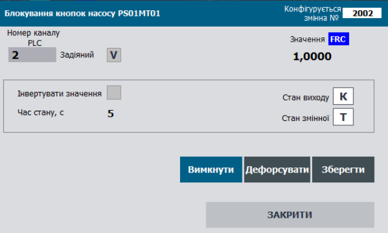

### Клас DOVAR: дискретна вихідна змінна процесу 

**CLSID=16#1020**

## Загальний опис

Клас реалізовує функції оброблення та запис вихідних даних в `DOCH` та діагностичної інформації отриманої з `DOCH`. До цих функцій входить обробка діагностичної інформації отриманої `DOCH`, при необхідності інверсія вихідного сигналу, керування форсуванням та імітацією.        

Якщо мають бути відмінності в реалізації, слід використовувати інші CLSID в форматі 16#102x

## Загальні вимоги до функцій DOVAR

### Функціональні вимоги 

#### Режими роботи

Клас DOVAR повинен підтримувати наступні режими (підрежими):

- запис виходу/імітація
- нефорсований/форсований

У будь якому режимі, окрім режиму імітації, значення яке передається до прив'язаного каналу `DOCH` записується з `STA.VRAW`.    

**Нормальний режим** роботи екземпляру класу є комбінацією підрежимів "запис виходу" та "нефорсований режим". У цьому режимі значення `STA.VAL` залежить від результатів виконання програми користувача, проходячи через функції оброблення та записується в значення каналу `STA.VRAW`, яке передається до фізичного каналу `DOCH`.

У режимі **імітація** `STA.SML=TRUE` значення `STA.VAL` не проходить функцій обробки та не записує своє значення в `STA.VRAW`. Іншими словами `STA.VAL` не має ніякого впливу на фізичний вихід. У режимі імітація також змінюється стан `STA.SML` каналу, що прив'язаний до змінної.

У режимі **форсування** (`STA.FRC=TRUE`) `STA.VAL` змінюється  тільки через налагоджувальні вікна HMI і має найвищий пріоритет і в такому випадку результат виконання програми користувача не має ніякого впливу на `STA.VAL`. При активності біту форсування лічильник `PLC_CFG.CNTFRC` збільшується на 1.

#### Інвертування сигналу

При встановленні біту `PRM.INVERSE=TRUE` значення  `STA.VAL = NOT STA.VRAW ` .

#### Моніторинг прив'язки до каналу 

Значення `STA.DLNK=TRUE` вказує на факт прив'язки до каналу.

#### Активність змінної 

Параметр активності змінної визначається виразом `STA.ENBL = NOT PRM.DSBL AND DLNK`. Якщо змінна неактивна `STA.ENBL=FALSE` не працюють функції:

- запису сигналу на фізичний вихід та його перетворення
- імітування 
- діагностування та обробка тривог недостовірності

Верхні рівні ієрархії керування, зокрема CM LVL2, повинні сприймати цю змінну як тимчасово неіснуючу (виведену з експлуатації). Наприклад, якщо змінна відповідає за соленоїд клапану, то CM клапану вважає, що змінної не існує і може працювати за алгоритмом "моностабільного клапана".   

#### Діагностування каналу вимірювання

Класом передбачається перевірка достовірності каналу вимірювання. При `PRM.QALENBL=TRUE` значення `STA.BAD` прямо залежить від значення `STA.BAD` прив'язаного каналу. Інший спосіб діагностування вимірювального каналу не передбачений даним класом змінної.

`STA.BAD` - це тривога недостовірності. При виникненні тривоги (по передньому фронту) `PLC_CFG.NWBAD=TRUE`. Поки тривога  `STA.BAD` активна:

- виставляється відповідний біт `PLC_CFG.BAD` 
- збільшується на 1 лічильник `PLC_CFG.CNTBAD` 

Скидання біту `PRM.QALENBL=FALSE` відключає функцію перевірки тривоги недостовірності.  

## Рекомендації щодо використання в HMI

Приклад налаштування функцій дискретних вхідних змінних на HMI наведений на рис.



Рис. Приклад налаштування функцій дискретних вихідних змінних на HMI.

### Загальні вимоги щодо структури змінних класів

#### DOVAR_HMI
| name | type | adr  | bit  | descr                                      |
| ---- | ---- | ---- | ---- | ------------------------------------------ |
| STA  | UINT | 0    |      | стани + біт команди завантаження DOVAR_STA |

#### DOVAR_CFG
| name        | type  | adr  | bit  | descr                                                        |
| ----------- | ----- | ---- | ---- | ------------------------------------------------------------ |
| ID          | UINT  | 0    |      | Унікальний ідентифікатор                                     |
| CLSID       | UINT  | 1    |      | 16#1020                                                      |
| STA         | UINT  | 2    |      | статус, призначення біт як `DOVAR_STA` може бути задіяна як аналогічна структура |
| STA_VRAW    | BOOL  | 2    | 0    | =1 – значення дискретного сигналу на DOCH                    |
| STA_VALB    | BOOL  | 2    | 1    | =1 – значення дискретної вихідної змінної після всіх перетворень, в режимі FRC=1 може змінюватися із-зовні |
| STA_BAD     | BOOL  | 2    | 2    | =1 – Дані недостовірні                                       |
| STA_ALDIS   | BOOL  | 2    | 3    | =1 – Тривога виведена з експлуатації                         |
| STA_DLNK    | BOOL  | 2    | 4    | =1 – якщо прив’язаний до каналу                              |
| STA_ENBL    | BOOL  | 2    | 5    | =1 – змінна задіяна                                          |
| STA_b6      | BOOL  | 2    | 6    | резерв                                                       |
| STA_VALPRV  | BOOL  | 2    | 7    | значення на попередньому циклі                               |
| STA_b8      | BOOL  | 2    | 8    | резерв                                                       |
| STA_b9      | BOOL  | 2    | 9    | резерв                                                       |
| STA_b10     | BOOL  | 2    | 10   | резерв                                                       |
| STA_b11     | BOOL  | 2    | 11   | резерв                                                       |
| STA_INBUF   | BOOL  | 2    | 12   | =1 – змінна в буфері                                         |
| STA_FRC     | BOOL  | 2    | 13   | =1 – Режим форсування                                        |
| STA_SML     | BOOL  | 2    | 14   | =1 – змінна в режимі симуляції                               |
| STA_CMDLOAD | BOOL  | 2    | 15   | =1 – команда завантаження в буфер                            |
| VALI        | INT   | 3    |      | режим нефорсуання: відображення значення в форматі INT; режим форсування: збереження форсованого значення в пам'яті (щоб зміна VAL не впливала) |
| PRM         | UINT  | 4    |      | параметри конфігурації, повинні зберігатися при відключеному живленні |
| PRM_b0      | BOOL  | 4    | 0    | резерв                                                       |
| PRM_b1      | BOOL  | 4    | 1    | резерв                                                       |
| PRM_INVERSE | BOOL  | 4    | 2    | =1 – інвертувати сире значення                               |
| PRM_b3      | BOOL  | 4    | 3    | резерв                                                       |
| PRM_b4      | BOOL  | 4    | 4    | резерв                                                       |
| PRM_b5      | BOOL  | 4    | 5    | резерв                                                       |
| PRM_QALENBL | BOOL  | 4    | 6    | =1 – задіяти тривогу недостовірності каналу                  |
| PRM_DSBL    | BOOL  | 4    | 7    | =1 – змінна не задіяна                                       |
| PRM_b8      | BOOL  | 4    | 8    | резерв                                                       |
| PRM_b9      | BOOL  | 4    | 9    | резерв                                                       |
| PRM_b10     | BOOL  | 4    | 10   | резерв                                                       |
| PRM_b11     | BOOL  | 4    | 11   | резерв                                                       |
| PRM_b12     | BOOL  | 4    | 12   | резерв                                                       |
| PRM_b13     | BOOL  | 4    | 13   | резерв                                                       |
| PRM_b14     | BOOL  | 4    | 14   | резерв                                                       |
| PRM_b15     | BOOL  | 4    | 15   | резерв                                                       |
| CHID        | UINT  | 5    |      | Логічний номер дискретного каналу, до якого прив'язана змінна, 0 - немає прив'язки |
| CHIDDF      | UINT  | 6    |      | Логічний номер дискретного каналу за замовченням             |
| STEP1       | UINT  | 7    |      | номер кроку                                                  |
| TSTEP1      | UDINT | 8    |      | Плинний час кроку в мс                                       |
| T_PREV      | UDINT | 10   |      | час в мс з попереднього виклику, береться зі структури PLC_CFG.TQMS |

#### Команди для буферу (див. структуру буферу):
| Атрибут | Тип  | Біт  | Опис                                                         |
| ------- | ---- | ---- | ------------------------------------------------------------ |
| CMD     | UINT |      | Команди:<br />16#0001: записати 1 - тільки при форсуванні<br />16#0002: записати 0 - тільки при форсуванні<br />16#0003: TOGGLE - тільки при форсуванні<br />16#0100: прочитати конфігурацію<br/>16#0101: записати конфігурацію<br/>16#0102: записати значення за замовченням<br/>16#0300: перемкнути форсування<br/>16#0301: ввімкнути форсування<br/>16#0302: вимкнути форсування<br/>16#0311: імітувати<br/>16#0312: зняти режим імітації<br/> |


#### Робота з буфером

Повинна бути реалізована функція роботи з класичним буфером.

- Буфер рекомендується використовувати один для всіх технологічних змінних.

- Факт зайнятості буфера перевіряється за рівністю ідентифікатора класу `CLSID` та ідентифікатора технологічної змінної `ID`

- при захопленні буферу:

  - `VARBUF.STA = DOVAR_CFG.STA`
  - `DOVAR_CFG.CMD = VARBUF.CMD`  якщо той не дорівнює нулю (для можливості команд з іншого джерела)
  - зчитування статусних бітів фізичного каналу технологічної змінної`VARBUF.CH_STA = CHCFG.STA`.

- конфігурація технологічної змінної повинна зчитуватися в буфер при отриманні команд:

  - біті статусу `STA.CMDLOAD=TRUE`
  - оновлення технологічної змінної, яка вже записана в буфер`VARBUF.CMD` = 16#0100; 

- конфігурація технологічної змінної повинна записуватись з буфера при отриманні команд:

  - `VARBUF.CMD` = 16#0101; 	

  

Повинна бути реалізована функція роботи з параметричними двунаправленим буферами VARBUFIN<->VARBUFOUT.

- Використовується 2 буфери: 
  - вхідний `VARBUFIN` - використовується для обробки команд (при рівності CLSID та ID) та запису інформації в технологічну змінну 
  - вихідний `VARBUFOUT` - використовується зчитування інформації з технологічної змінної при отриманні команди на читання з `VARBUFIN`
- Буфери рекомендується використовувати одну пару для всіх технологічних змінних.
- Факт зайнятості буфера не можливий, оскільки буфер реалізований через 2 буферні змінні VARBUFIN та VARBUFOUT через які інформація проходить для подальшої передачі її в технологічну змінну або внутрішній буфер засобу HMI (по аналогії з параметричним обміном PKW в профілі PROFIDRIVE)
- конфігурація технологічної змінної повинна зчитуватися в вихідний буфер при:
  - рівності класів `DOVARCFG.CLSID=VARBUFIN.CLSID` , ідентифікаторів `DOVARCFG.ID=VARBUFIN.ID` та отримання команди з вхідного буфера `VARBUFIN.CMD=16#100 `
- конфігурація технологічної змінної повинна записуватись з вхідного буфера при:
  - рівності класів `DOVARCFG.CLSID=VARBUFIN.CLSID` , ідентифікаторів `DOVARCFG.ID=VARBUFIN.ID` та отримання команди з вхідного буфера `VARBUFIN.CMD=16#101 `


### Вимоги щодо реалізації інтерфейсу

INOUT

- `CHCFG` - фізичний канал прив'язаний до технологічної змінної
- `DOVARCFG` - конфігураційна частина технологічної змінної
- `DOVARHMI` - HMI частина технологічної змінної
- за умови, що немає можливості доступатися до зовнішніх змінних з середини функцій, передається `PLC_CFG`, `VARBUF`,  `VARBUFIN`, `VARBUFOUT` ; альтернативно можна використовувати інші інтерфейси для використання в середині `PLC_CFG` 


### Ініціалізація технологічної змінної при першому циклі роботи

Запис ID, CHID, CHIDFL за замовченням виконується в результаті виконання програмної секції `initvars`. 

Для кожної технологічної змінної в `initvars` повиннен бути наступний фрагмент програми для запису ID, CHID, CHIDFL

```
"VAR".DOVAR1.ID := 2001;   "VAR".DOVAR1.CHID := 1;    "VAR".DOVAR1.CHIDDF := 1;
```

Також виконується ініціалізація всередині функції обробки технологічної змінної, в результаті

- присвоюється `DOVARCFG.CLSID:=16#1020;`
- виконується активація технологічної змінної `DOVARCFG.PRM.DSBL := FALSE; ` 
- якщо логіний номер каналу не заданий - записати значення по замовчування  `DOVARCFG.CHID := DOVARCFG.CHIDDF;`


### Вимоги щодо реалізації програми користувача

- Функції обробки технологічних змінних повинні викликатися з кожним викликом тієї задачі, до якого вони прив'язані.
- При першому старті (`PLC_CFG.SCN1`) повинні ініціалізуватися ідентифікатор змінної `DOVAR_CFG.ID` та номер логічного каналу `DOVAR_CFG.CHID`, 

````pascal
(*ініціалізація змінної на першому циклі обробки*)
IF "SYS".PLCCFG.STA.SCN1 THEN
    #DOVARCFG.CLSID := 16#1020; (*присвоєння ідентифікатора класу*)
    #DOVARCFG.PRM.DSBL := FALSE; (*активація змінної*)
    #DOVARCFG.T_PREV := "SYS".PLCCFG.TQMS; (*збереження часу виклику*)
    IF #DOVARCFG.CHID = 0 THEN (*якщо логіний номер каналу на заданий - записати значення по замовчування *)
        #DOVARCFG.CHID := #DOVARCFG.CHIDDF;
    END_IF;
    
    (*запис сирого значення з каналу для подальшої обробки*)
    IF #CHCFG.ID > 0 THEN
        #CHCFG.STA.VALB := #DOVARCFG.STA.VALB;
    ELSE
        #CHCFG.STA.VALB := 0;
    END_IF;
    
    #DOVARCFG.T_STEP1 := 0; (*онулення часу кроку*)
    #DOVARCFG.STEP1 := 400; (*переведення на крок DO=0*)
    
    (*визначення діапазонів ідентифікаторів змінної*)
    IF #DOVARCFG.ID>0 THEN
        IF #DOVARCFG.ID<"SYS".VARIDMIN THEN "SYS".VARIDMIN:=#DOVARCFG.ID; END_IF;
        IF #DOVARCFG.ID>"SYS".VARIDMAX THEN "SYS".VARIDMAX:=#DOVARCFG.ID; END_IF;
    END_IF;
    
    RETURN;
END_IF;

(*зчитування статусних бітів з технологічної змінної у внутрішні змінні*)
#VRAW := #DOVARCFG.STA.VRAW;
#VAL := #DOVARCFG.STA.VALB;
#BAD := #DOVARCFG.STA.BAD;
#DLNK := #DOVARCFG.STA.DLNK;
#ENBL := #DOVARCFG.STA.ENBL;
#VALPRV := #DOVARCFG.STA.VALPRV;
#INBUF := #DOVARCFG.STA.INBUF;
#FRC := #DOVARCFG.STA.FRC;
#SML := #DOVARCFG.STA.SML;
#CMDLOAD := #DOVARCFG.STA.CMDLOAD;

(*зчитування параметричних бітів з технологічної змінної у внутрішні змінні*)
#PRM_INVERSE := #DOVARCFG.PRM.INVERSE;
#PRM_QALENBL := #DOVARCFG.PRM.QALENBL;
#PRM_DSBL := #DOVARCFG.PRM.DSBL;
#PRM_STATICMAP := #DOVARCFG.PRM.STATICMAP;

#INBUF := (#DOVARCFG.ID = "BUF".VARBUF.ID) AND (#DOVARCFG.CLSID = "BUF".VARBUF.CLSID); (*змінна в буфері якщо співпадає ідентифікатор змінної та ідентифікатор класу*)
#CMDLOAD := #DOVARHMI.STA.%X15; (*команда запису в буфер з НМІ змінної*)
#CMD := 0; (*онулення внутрішньої команда*)
#DLNK := (#CHCFG.ID > 0); (*змінна привязана до каналу якщо канал має реальний ідентифікатор (не 0 - не молоко)*)
#VARENBL := NOT #PRM_DSBL AND #DLNK; (*змінна задіяна якщо привязана до каналу і не активний параметр змінна не задіяна*)
#VRAW := #CHCFG.STA.VALB; (*зчитування сирого значення з каналу*)
#T_STEPMS := #DOVARCFG.T_STEP1; (*запамятовування часу циклу в мс*)

(*реалізація алгоритму ping-pong*)
IF #DLNK THEN
    #CHCFG.STA.PNG := true;
    #CHCFG.VARID := #DOVARCFG.ID;
END_IF;

(*якщо змінна не задіяна не рахуємо час, скидаємо стан*)
IF NOT #VARENBL THEN
    #DOVARCFG.T_STEP1 := 0;
    #DOVARCFG.STEP1 := 400;
END_IF;

(*визначення часу між викликами функції по різниці між мілісікундним лічильником та часом який пройшов з попереднього виклику *)
#dT := "SYS".PLCCFG.TQMS - #DOVARCFG.T_PREV;

(* широкомовне дефорсування*) 
IF "SYS".PLCCFG.CMD = 16#4302 THEN
    #FRC := false; (*дефорсувати об'єкт типу*)
END_IF;

(*вибір джерела конфігураційної/керівної команди згідно пріоритету якщо команди надійшли одночасно*)
IF #CMDLOAD THEN (*команда запису в буфер - команда з НМІ*)
    #CMD := 16#0100;
ELSIF #INBUF AND "BUF".VARBUF.CMD <> 0 THEN (*команда з буферу*)
    #CMD := "BUF".VARBUF.CMD;
END_IF;

(*commands*)
CASE #CMD OF
    16#0001: (*записати 1*)
        IF #FRC AND #INBUF THEN
            #DOVARCFG.VALI := 1;
            "BUF".VARBUF.VALR:=1.0;
            #VAL := true;
            #DOVARCFG.STEP1 := 401;
            #DOVARCFG.T_STEP1 := 0;
        END_IF;
    16#0002: (*записати 0*)
        IF #FRC AND #INBUF THEN
            #DOVARCFG.VALI := 0;
            "BUF".VARBUF.VALR:=0.0;
            #VAL := false;
            #DOVARCFG.STEP1 := 400;
            #DOVARCFG.T_STEP1 := 0;
        END_IF;
    16#0003: (*TOGGLE*)
        IF #FRC AND #INBUF THEN
            IF #DOVARCFG.VALI > 0 THEN
                #DOVARCFG.VALI := 0;
                "BUF".VARBUF.VALR:=0.0;
                #VAL := false;
                #DOVARCFG.STEP1 := 400;
                #DOVARCFG.T_STEP1 := 0;
            ELSE
                #DOVARCFG.VALI := 1;
                "BUF".VARBUF.VALR:=1.0;
                #VAL := true;
                #DOVARCFG.STEP1 := 401;
                #DOVARCFG.T_STEP1 := 0;
            END_IF;
        END_IF;
    16#0100: (*прочитати конфігурацію*)
        (* MSG 200-Ok 400-Error
        // 200 - Дані записані
        // 201 - Дані прочитані 
        // 403 - канал вже зайнятий 
        // 404 - номер каналу не відповідає діапазону   
        // 405 - активна статична адресація каналів *)
        "BUF".VARBUF.MSG:=201;
        
        (*зчитати ідентифікатор змінної та ідентифікатор класу*)
        "BUF".VARBUF.ID := #DOVARCFG.ID;
        "BUF".VARBUF.CLSID := #DOVARCFG.CLSID;
        
        (*зчитати бітові параметри*)
        "BUF".VARBUF.PRM.%X2 := #PRM_INVERSE;
        "BUF".VARBUF.PRM.%X6 := #PRM_QALENBL;
        "BUF".VARBUF.PRM.%X7 := #PRM_DSBL;
        "BUF".VARBUF.PRM.%X14 := #PRM_STATICMAP;
        
        (*зчитати параметри*)
        "BUF".VARBUF.CHID := #DOVARCFG.CHID;
        
        (*зчитати значення змінної для безударного форсування*)
        "BUF".VARBUF.VALR := INT_TO_REAL(#DOVARCFG.VALI);
        
    16#0101: (*записати конфігурацію*)
        (* MSG 200-Ok 400-Error
        // 200 - Дані записані
        // 201 - Дані прочитані 
        // 403 - канал вже зайнятий 
        // 404 - номер каналу не відповідає діапазону   *)
        "BUF".VARBUF.MSG:=200;
        
        (*записати бітові параметри*)
        #PRM_INVERSE := "BUF".VARBUF.PRM.%X2;
        #PRM_QALENBL := "BUF".VARBUF.PRM.%X6;
        #PRM_DSBL := "BUF".VARBUF.PRM.%X7;
        #PRM_STATICMAP := "BUF".VARBUF.PRM.%X14;
        
        (*алгоритм для зміни номера логічного каналу при перевірці його на коректність*)
        IF NOT #PRM_STATICMAP THEN (* зміна логічного номеру каналу тільки при неактивна статичн адресація*)
            IF "BUF".VARBUF.CHID>=0 AND "BUF".VARBUF.CHID <= INT_TO_UINT("SYS".PLCCFG.DOCNT) THEN (* якщо логічний номер канал менший за кількість каналів*)
                IF "SYS".CHDO["BUF".VARBUF.CHID].VARID = 0 THEN  (* якщо логічний номер канал нульовий - вільний *)
                    #DOVARCFG.CHID := "BUF".VARBUF.CHID; (* змінити логічний номер каналу *)
                ELSIF "BUF".VARBUF.CHID <> #DOVARCFG.CHID THEN (* інакше вивести помилку про зайнятість каналу *)
                    "BUF".VARBUF.MSG := 403;(* канал вже зайнятий*)
                END_IF;
            ELSE
                "BUF".VARBUF.MSG := 404; (*номер каналу не відповідає діапазону*)
            END_IF;
        ELSIF "BUF".VARBUF.CHID <> #DOVARCFG.CHID THEN (* інакше вивести помилку активна статична адресація каналів *)
            "BUF".VARBUF.MSG := 405;(* активна статична адресація каналів*)
        END_IF;
        IF #INBUF THEN (*оновити логічний номер каналу після запису якщо змінна ще в буфері*)
            "BUF".VARBUF.CHID := #DOVARCFG.CHID;
        END_IF;
    16#0102: (*записати значення за замовченням*)
        #DOVARCFG.CHID := #DOVARCFG.CHIDDF;
    16#0300: (*перемкнути форсування*)
        #FRC := NOT #FRC;
    16#0301: (*ввімкнути форсування*)
        #FRC := true;
    16#0302: (*вимкнути форсування*)
        #FRC := false;
    16#0311: (* імітувати*)
        #SML := true;
    16#0312: (* зняти режим імітації*)
        #SML := false;
END_CASE;

(*обробка значень*)
IF #FRC THEN (*режим форсування*)
    IF #INBUF THEN
        #DOVARCFG.VALI := REAL_TO_INT("BUF".VARBUF.VALR);
    END_IF;
    #VAL := #DOVARCFG.VALI > 0;
    IF #VAL THEN
        #DOVARCFG.STEP1 := 401;
    ELSE
        #DOVARCFG.STEP1 := 400;
    END_IF;
ELSE (*обробка нефорсованого значення - нормальна обробка змінної*)
    IF #VAL THEN
        #DOVARCFG.VALI := 1;
        #DOVARCFG.STEP1 := 401;
    ELSE
        #DOVARCFG.VALI := 0;
        #DOVARCFG.STEP1 := 400;
    END_IF;
END_IF;

(*визначення фронту для оновлення часу стану*)
IF #VAL <> #VALPRV THEN
    #DOVARCFG.T_STEP1 := 0;
END_IF;

(*запис значення на фізичний канал лише при активації змінної*)
IF #VARENBL THEN
    IF #PRM_INVERSE THEN (*реалізація функції інверсії*)
        #VRAW := NOT #VAL;
    ELSE
        #VRAW := #VAL;
    END_IF;
    IF NOT #SML THEN (* режим симуляції - вихідне значення не змінюється *)
        #CHCFG.STA.VALB := #VRAW;
    END_IF;
END_IF;

#BAD := #CHCFG.STA.BAD AND #PRM_QALENBL AND #VARENBL AND NOT #SML; (*тривога достовірності береться з привязаного фізичного каналу*)

(*передача тривог для змінної PLCCFG для формування загального статусного біта і визначення нової тривоги*)
IF #BAD THEN
    "SYS".PLCCFG.ALM1.BAD := true;
    "SYS".PLCCFG.CNTBAD := "SYS".PLCCFG.CNTBAD + 1;
    IF NOT #DOVARCFG.STA.BAD THEN
        "SYS".PLCCFG.ALM1.NWBAD := true;
    END_IF;
END_IF;

(*передача статусних бітів для змінної PLCCFG для формування загального статусного біта*)
IF #FRC THEN
    "SYS".PLCCFG.STA.FRC1 := true;
    "SYS".PLCCFG.CNTFRC := "SYS".PLCCFG.CNTFRC + 1;
END_IF;
IF #SML THEN
    "SYS".PLCCFG.STA.SML := true;
END_IF;

(*передача статусних бітів з внутрішніх змінних в технологічну змінну*)
#DOVARCFG.STA.VRAW := #VRAW;
#DOVARCFG.STA.VALB := #VAL;
#DOVARCFG.STA.BAD := #BAD;
#DOVARCFG.STA.DLNK := #DLNK;
#DOVARCFG.STA.ENBL :=  #VARENBL;
#DOVARCFG.STA.VALPRV:=#VAL;
#DOVARCFG.STA.INBUF := #INBUF;
#DOVARCFG.STA.FRC := #FRC;
#DOVARCFG.STA.SML := #SML;
#DOVARCFG.STA.CMDLOAD := FALSE; (*онулення біта запису в буфер*)

(*передача параметричних бітів з внутрішніх змінних в технологічну змінну*)
#DOVARCFG.PRM.INVERSE := #PRM_INVERSE;
#DOVARCFG.PRM.QALENBL := #PRM_QALENBL;
#DOVARCFG.PRM.DSBL := #PRM_DSBL;
#DOVARCFG.PRM.STATICMAP := #PRM_STATICMAP;

(*передача статусних бітів з конфігураційної частини в НМІ*)
#DOVARHMI.STA.%X0 := #DOVARCFG.STA.VRAW;
#DOVARHMI.STA.%X1 := #DOVARCFG.STA.VALB;
#DOVARHMI.STA.%X2 := #DOVARCFG.STA.BAD;
#DOVARHMI.STA.%X3 := #DOVARCFG.STA.ALDIS;
#DOVARHMI.STA.%X4 := #DOVARCFG.STA.DLNK;
#DOVARHMI.STA.%X5 := #DOVARCFG.STA.ENBL;
#DOVARHMI.STA.%X6 := #DOVARCFG.STA.STA_b6;
#DOVARHMI.STA.%X7 := #DOVARCFG.STA.VALPRV;
#DOVARHMI.STA.%X8 := #DOVARCFG.STA.STA_b8;
#DOVARHMI.STA.%X9 := #DOVARCFG.STA.STA_b9;
#DOVARHMI.STA.%X10 := #DOVARCFG.STA.STA_b10;
#DOVARHMI.STA.%X11 := #DOVARCFG.STA.STA_b11;
#DOVARHMI.STA.%X12 := #DOVARCFG.STA.INBUF;
#DOVARHMI.STA.%X13 := #DOVARCFG.STA.FRC;
#DOVARHMI.STA.%X14 := #DOVARCFG.STA.SML;
#DOVARHMI.STA.%X15 := #DOVARCFG.STA.CMDLOAD;

#DOVARCFG.T_PREV := "SYS".PLCCFG.TQMS; (*запамятовування часу останнього виклику екземпляра функції*)

(*підрахунок часу стану та обмеження його по верхній межі діапазону*)
#DOVARCFG.T_STEP1 := #DOVARCFG.T_STEP1 + #dT;
IF #DOVARCFG.T_STEP1 > 16#7FFF_FFFF THEN
    #DOVARCFG.T_STEP1 := 16#7FFF_FFFF;
END_IF;

(*автоматичне оновлення якщо змінна записана в буфер*)
IF #INBUF THEN
    "BUF".VARBUF.CMD := 0;
    "BUF".VARBUF.VALR := INT_TO_REAL(#DOVARCFG.VALI);

    "BUF".VARBUF.STA.%X0 := #DOVARCFG.STA.VRAW;
    "BUF".VARBUF.STA.%X1 := #DOVARCFG.STA.VALB;
    "BUF".VARBUF.STA.%X2 := #DOVARCFG.STA.BAD;
    "BUF".VARBUF.STA.%X3 := #DOVARCFG.STA.ALDIS;
    "BUF".VARBUF.STA.%X4 := #DOVARCFG.STA.DLNK;
    "BUF".VARBUF.STA.%X5 := #DOVARCFG.STA.ENBL;
    "BUF".VARBUF.STA.%X6 := #DOVARCFG.STA.STA_b6;
    "BUF".VARBUF.STA.%X7 := #DOVARCFG.STA.VALPRV;
    "BUF".VARBUF.STA.%X8 := #DOVARCFG.STA.STA_b8;
    "BUF".VARBUF.STA.%X9 := #DOVARCFG.STA.STA_b9;
    "BUF".VARBUF.STA.%X10 := #DOVARCFG.STA.STA_b10;
    "BUF".VARBUF.STA.%X11 := #DOVARCFG.STA.STA_b11;
    "BUF".VARBUF.STA.%X12 := #DOVARCFG.STA.INBUF;
    "BUF".VARBUF.STA.%X13 := #DOVARCFG.STA.FRC;
    "BUF".VARBUF.STA.%X14 := #DOVARCFG.STA.SML;
    "BUF".VARBUF.STA.%X15 := #DOVARCFG.STA.CMDLOAD;
    
    "BUF".VARBUF.STEP1 := #DOVARCFG.STEP1;
    "BUF".VARBUF.T_STEP1 := #DOVARCFG.T_STEP1;
    
(*зчитування статусних бітів фізичного каналу технологічної змінної*)
    "BUF".VARBUF.CH_CLSID := #CHCFG.CLSID;
    "BUF".VARBUF.CH_STA.%X0 := #CHCFG.STA.VRAW;
    "BUF".VARBUF.CH_STA.%X1 := #CHCFG.STA.VALB;
    "BUF".VARBUF.CH_STA.%X2 := #CHCFG.STA.BAD;
    "BUF".VARBUF.CH_STA.%X3 := #CHCFG.STA.b3;
    "BUF".VARBUF.CH_STA.%X4 := #CHCFG.STA.PNG;
    "BUF".VARBUF.CH_STA.%X5 := #CHCFG.STA.ULNK;
    "BUF".VARBUF.CH_STA.%X6 := #CHCFG.STA.MERR;
    "BUF".VARBUF.CH_STA.%X7 := #CHCFG.STA.BRK;
    "BUF".VARBUF.CH_STA.%X8 := #CHCFG.STA.SHRT;
    "BUF".VARBUF.CH_STA.%X9 := #CHCFG.STA.NBD;
    "BUF".VARBUF.CH_STA.%X10 := #CHCFG.STA.b10;
    "BUF".VARBUF.CH_STA.%X11 := #CHCFG.STA.INIOTBUF;
    "BUF".VARBUF.CH_STA.%X12 := #CHCFG.STA.INBUF;
    "BUF".VARBUF.CH_STA.%X13 := #CHCFG.STA.FRC;
    "BUF".VARBUF.CH_STA.%X14 := #CHCFG.STA.SML;
    "BUF".VARBUF.CH_STA.%X15 := #CHCFG.STA.CMDLOAD;
END_IF;

(*реалізація читання конфігураційних даних в буфер out*)
IF (UINT_TO_WORD(#DOVARCFG.CLSID) AND 16#FFF0)=(UINT_TO_WORD("BUF".VARBUFIN.CLSID) AND 16#FFF0) AND #DOVARCFG.ID="BUF".VARBUFIN.ID AND "BUF".VARBUFIN.CMD = 16#100 THEN
    (* MSG 200-Ok 400-Error
    // 200 - Дані записані
    // 201 - Дані прочитані 
    // 403 - канал вже зайнятий 
    // 404 - номер каналу не відповідає діапазону   *)
    "BUF".VARBUFOUT.MSG:=201;
    
    "BUF".VARBUFOUT.PRM.%X2 := #DOVARCFG.PRM.INVERSE;
    "BUF".VARBUFOUT.PRM.%X6 := #DOVARCFG.PRM.QALENBL;
    "BUF".VARBUFOUT.PRM.%X7 := #DOVARCFG.PRM.DSBL;
    "BUF".VARBUFOUT.PRM.%X14 := #DOVARCFG.PRM.STATICMAP;
    
    "BUF".VARBUFOUT.ID := #DOVARCFG.ID;
    "BUF".VARBUFOUT.CLSID := #DOVARCFG.CLSID;
    "BUF".VARBUFOUT.CHID := #DOVARCFG.CHID;
    "BUF".VARBUFOUT.VALR := INT_TO_REAL(#DOVARCFG.VALI);
    
    "BUF".VARBUFIN.CMD :=0;
END_IF;

(*реалізація запису конфігураційних даних з буфер in в технологічну змінну*)
IF (UINT_TO_WORD(#DOVARCFG.CLSID) AND 16#FFF0)=(UINT_TO_WORD("BUF".VARBUFIN.CLSID) AND 16#FFF0) AND #DOVARCFG.ID="BUF".VARBUFIN.ID AND "BUF".VARBUFIN.CMD = 16#101 THEN
    (* MSG 200-Ok 400-Error
    // 200 - Дані записані
    // 201 - Дані прочитані 
    // 403 - канал вже зайнятий 
    // 404 - номер каналу не відповідає діапазону   *)
    
    "BUF".VARBUFOUT:="BUF".VARBUFIN;
    
    #DOVARCFG.PRM.INVERSE := "BUF".VARBUFIN.PRM.%X2;
    #DOVARCFG.PRM.QALENBL := "BUF".VARBUFIN.PRM.%X6;
    #DOVARCFG.PRM.DSBL := "BUF".VARBUFIN.PRM.%X7;
    #DOVARCFG.PRM.STATICMAP:=  "BUF".VARBUFIN.PRM.%X14;
    
    "BUF".VARBUFOUT.MSG:=200;
    IF NOT #DOVARCFG.PRM.STATICMAP THEN
        IF "BUF".VARBUFIN.CHID>=0 AND "BUF".VARBUFIN.CHID <= INT_TO_UINT("SYS".PLCCFG.DOCNT) THEN
            IF "SYS".CHDO["BUF".VARBUFIN.CHID].VARID = 0 THEN
                #DOVARCFG.CHID := "BUF".VARBUFIN.CHID;
            ELSIF "BUF".VARBUFIN.CHID <> #DOVARCFG.CHID THEN
                "BUF".VARBUFOUT.MSG := 403;(* канал вже зайнятий*)
            END_IF;
        ELSE
            "BUF".VARBUFOUT.MSG := 404; (*номер каналу не відповідає діапазону*)
        END_IF;
    ELSIF "BUF".VARBUFIN.CHID <> #DOVARCFG.CHID THEN (* інакше вивести помилку активна статична адресація каналів *)
        "BUF".VARBUFOUT.MSG := 405;(* активна статична адресація каналів*)
    END_IF;
    
    "BUF".VARBUFIN.CMD :=0;
END_IF;


````


## Тестування 

Загальні вимоги щодо тестування наведені в документі класи LVL1. Тут приводяться тільки особливі тести, що відрізняються від загальних.

### Перелік тестів

| Номер | Назва                                                        | Коли перевіряти          | Примітки |
| ----- | ------------------------------------------------------------ | ------------------------ | -------- |
| 1     | Присвоєння ID та CLSID при старті                            | після реалізації функції |          |
| 2     | Команди запису до буферу                                     | після реалізації функції |          |
| 3     | Зміна параметрів та запис з буфера                           | після реалізації функції |          |
| 4     | Зміни логічного номеру каналу                                | після реалізації функції |          |
| 5     | Запис значення CHID за замовченням при старті, при одинарній команді | після реалізації функції |          |
| 6     | Робота вбудованих лічильників часу                           | після реалізації функції |          |
| 7     | Вплив перекидування лічильника часу ПЛК на час кроку         | після реалізації функції |          |
| 8     | Алгоритм Ping-Pong                                           | після реалізації функції |          |
| 9     | Робота в нефорсованому режимі                                | після реалізації функції |          |
| 10    | Робота в форсованому режимі                                  | після реалізації функції |          |
| 11    | Відправка широкомовних команд на дефорсування                | після реалізації функції |          |
| 12    | Робота в режимі імітації                                     | після реалізації функції |          |
| 13    | Функція інвертування                                         | після реалізації функції |          |
| 14    | Виведення змінної з експлуатації                             | після реалізації функції |          |
|       |                                                              |                          |          |
|       |                                                              |                          |          |
|       |                                                              |                          |          |
|       |                                                              |                          |          |


### 1 Присвоєння ID та CLSID при старті

- перед запуском перевірки ПЛК повинен бути в СТОП
- після запуску усім технологічним змінним, використаним в програмі повинні бути присвоєні ID та CLSID


### 2 Команди прив'язування до буферу

| Номер | Дія для перевірки                                            | Очікуваний результат                                         | Примітки |
| ----- | ------------------------------------------------------------ | ------------------------------------------------------------ | -------- |
| 1     | Змінити STA.X15:=1 для однієї зі змінних DOVAR_HMI           | у VARBUF повинно завантажитися весь зміст DOVAR_CFG<br />для DOVAR_HMI повинен STA.X15 = 0 <br />для DOVAR_HMI, DOVAR_CFG та VARBUF повинне STA.12(INBUF)=1 |          |
| 2     | Змінити значення DOVAR_CFG.STA.VALB на 1                     | відповідне значення зміниться у DOVAR_HMI та VARBUF          |          |
| 3     | Змінити STA.X15:=1 для іншої змінної DOVAR_HMI               | у VARBUF повинно завантажитися весь зміст DOVAR_CFG іншої змінної |          |
| 4     | Змінити одне з конфігураційних полів в VARBUF, наприклад VARBUF.CHID, та виконайте команду запису в буфер (використовується для оновлення значень) VARBUF.CMD:=16#100 | змінена змінна VARBUF.CHID повинна змінитись на попереднє значення |          |


### 3 Зміна параметрів та запис з буфера

| Номер | Дія для перевірки                                            | Очікуваний результат                                         | Примітки |
| ----- | ------------------------------------------------------------ | ------------------------------------------------------------ | -------- |
| 1     | Змінити STA.X15:=1 для однієї зі змінних DOVAR_HMI           | у VARBUF повинно завантажитися весь зміст DOVAR_CFG<br />для DOVAR_HMI повинен STA.X15 = 0 <br />для DOVAR_HMI, DOVAR_CFG та VARBUF повинне STA.12(INBUF)=1 |          |
| 2     | Змінити одне з конфігураційних полів в VARBUF, наприклад VARBUF.PRM.X2, та виконайте команду запису з буфера VARBUF.CMD:=16#101 | в змінній DOVAR_CFG.PRM.INVERSE повинно відобразитись нове значення |          |
| 3     | Повторіть п.2 для іншого параметра                           |                                                              |          |
|       |                                                              |                                                              |          |

### 4 Зміни логічного номеру каналу

| Номер | Дія для перевірки                                            | Очікуваний результат                                         | Примітки |
| ----- | ------------------------------------------------------------ | ------------------------------------------------------------ | -------- |
| 1     | Змінити STA.X15:=1 для однієї зі змінних DOVAR_HMI           | у VARBUF повинно завантажитися весь зміст DOVAR_CFG<br />для DOVAR_HMI повинен STA.X15 = 0 <br />для DOVAR_HMI, DOVAR_CFG та VARBUF повинне STA.12(INBUF)=1 |          |
| 2     | Змінити значення VARBUF.CHID на довільне значення  в межах існуючих фізичних каналів та на значення вільного каналу, <br />та виконайте команду запису з буфера VARBUF.CMD:=16#101 | в змінній DOVAR_CFG.CHID повинно відобразитись нове значення, а VARBUF.MSG повинна відобразити повідомлення про успішний запис параметра VARBUF.MSG = 200 |          |
| 3     | Змінити значення VARBUF.CHID на довільне значення  в межах існуючих фізичних каналів та на значення зайнятого каналу, <br />та виконайте команду запису з буфера VARBUF.CMD:=16#101 | в змінній DOVAR_CFG.CHID значення не повинно змінитись, VARBUF.CHID повинно повернутись до коректного значення, а VARBUF.MSG повинна відобразити повідомлення про помилку зайнятого каналу VARBUF.MSG = 403 |          |
| 4     | Змінити значення VARBUF.CHID на довільне значення  яке виходить за межі існуючих фізичних каналів, <br />та виконайте команду запису з буфера VARBUF.CMD:=16#101 | в змінній DOVAR_CFG.CHID значення не повинно змінитись, VARBUF.CHID повинно повернутись до коректного значення, а VARBUF.MSG повинна відобразити повідомлення про помилку неіснуючого каналу VARBUF.MSG = 404 |          |
| 5     | Активувати параметр статична адресація параметрів DOVAR_CFG.PRM.STATICMAP:=1, який унеможливлює зміну логічного номеру каналу. <br />Змінити значення VARBUF.CHID на довільне значення  в межах існуючих фізичних каналів та на значення вільного каналу, <br />та виконайте команду запису з буфера VARBUF.CMD:=16#101 | в змінній DOVAR_CFG.CHID значення не повинно змінитись, VARBUF.CHID повинно повернутись до попереднього значення, а VARBUF.MSG повинна відобразити повідомлення про статичну адресацію каналу VARBUF.MSG = 405 |          |
|       |                                                              |                                                              |          |
|       |                                                              |                                                              |          |


### 5 Запис значення CHID за замовченням при старті, при одинарній команді

- при старті
  - перед запуском перевірки ПЛК повинен бути в СТОП
  - після запуску для всіх технологічним змінним повинно записатись значення в CHID та CHIDDF
- при одинарній команді

| Номер | Дія для перевірки                                            | Очікуваний результат                                         | Примітки |
| ----- | ------------------------------------------------------------ | ------------------------------------------------------------ | -------- |
| 1     | Змінити STA.X15:=1 для однієї зі змінних DOVAR_HMI           | у VARBUF повинно завантажитися весь зміст DOVAR_CFG<br />для DOVAR_HMI повинен STA.X15 = 0 <br />для DOVAR_HMI, DOVAR_CFG та VARBUF повинне STA.12(INBUF)=1 |          |
| 2     | Змінити значення VARBUF.CHID на довільне значення  в межах існуючих фізичних каналів та на значення вільного каналу, <br />та виконайте команду запису з буфера VARBUF.CMD:=16#101 | в змінній DOVAR_CFG.CHID повинно відобразитись нове значення, а VARBUF.MSG повинна відобразити повідомлення про успішний запис параметра VARBUF.MSG = 200 |          |
| 3.    | виконайте команду записати значення за замовченням VARBUF.CMD:=16#102 | в змінній DOVAR_CFG.CHID повинно відобразитись значення яке було збережено в DOVAR_CFG.CHIDDF |          |
|       |                                                              |                                                              |          |


### 6 Робота вбудованих лічильників часу

Плинний час кроку для змінної `DOVAR_CFG` відображається в `DOVAR_CFG.T_STEP1`. Значення відображається в мс. Точність `DOVAR_CFG.T_STEP1` перевіряється астрономічним годинником. 


### 7 Вплив перекидування лічильника часу ПЛК на час кроку

| Номер | Дія для перевірки                                            | Очікуваний результат                                         | Примітки |
| ----- | ------------------------------------------------------------ | ------------------------------------------------------------ | -------- |
| 1     | переглянути як змінюється змінна PLCCFG.TQMS та DOVAR1.T_STEP1 , точність оцінити за допомогою астрономічного годинника | PLCCFG.TQMS та DOVAR1.T_STEP1 рахують час в мс               |          |
| 2     | в PLCCFG.TQMS записати значення   16#FFFF_FFFF - 5000 (5000 мс до кінця діапазону)  та в DOVAR1.T_STEP1 записати значення 16#7FFF_FFFF - 10000 (10000 мс до кінця діапазону) | певний час (5000 мc) час буде рахуватись в звичайному вигляді, але коли PLCCFG.TQMS досягне верху діапазону(16#FFFF_FFFF), то PLCCFG.TQMS почне рахувати з початку, а DOVAR1.T_STEP1 рахуватиме в нормальному режимі поки не прийме максимальне значення свого діапазону (16#7FFFFFFF) і відлік для нього зупиниться |          |
| 3     | Змінити значення  DOVAR1.STA.VALB                            | DOVAR1.T_STEP1 почне рахувати час з початку                  |          |
|       |                                                              |                                                              |          |


### 8 Алгоритм Ping-Pong

| Номер | Дія для перевірки                                            | Очікуваний результат                                         | Примітки |
| ----- | ------------------------------------------------------------ | ------------------------------------------------------------ | -------- |
| 1     | Перевірити значення фізичного каналу CHDO.VARID до якого прив'язана тестова зміна DOVAR1 | в CHDO.VARID повинно відображатись DOVAR1.ID, CHDO.STA_ULNK=1 та DOVAR1.STA.DLNK=1 |          |
| 2     | Записати значення DOVAR1.CHID:=0                             | значення DOVAR1.STA.DLNK=0 - змінна не прив'язана до технологічного каналу, <br />CHDO.VARID = 0 та CHDO.STA_ULNK=0 до канала не прив'язано технологічну змінну |          |
| 3     | Записати попереднє значення в DOVAR1.CHID                    | в CHDO.VARID повинно відображатись DOVAR1.ID, CHDO.STA_ULNK=1 та DOVAR1.STA.DLNK=1 |          |
| 4     | повторити попередні пункти для іншої технологічної змінної   |                                                              |          |


### 9 Робота в нефорсованому режимі

| Номер | Дія для перевірки                                  | Очікуваний результат                                         | Примітки |
| ----- | -------------------------------------------------- | ------------------------------------------------------------ | -------- |
| 1     | Змінити STA.X15:=1 для однієї зі змінних DOVAR_HMI | у VARBUF повинно завантажитися весь зміст DOVAR_CFG<br />для DOVAR_HMI повинен STA.X15 = 0 <br />для DOVAR_HMI, DOVAR_CFG та VARBUF повинне STA.12(INBUF)=1 |          |
| 2     | Змінити значення  DOVAR1.STA.VALB                  | відповідне значення зміниться у DOVAR_HMI та VARBUF, а також в фізичному каналі CHDO.STA.VRAW |          |
| 3     | Змінити значення  DOVAR1.STA.VALB на протилежне    | відповідне значення зміниться у DOVAR_HMI та VARBUF, а також в фізичному каналі CHDO.STA.VRAW |          |
|       |                                                    |                                                              |          |


### 10 Робота в форсованому режимі

| Номер | Дія для перевірки                                            | Очікуваний результат                                         | Примітки                                   |
| ----- | ------------------------------------------------------------ | ------------------------------------------------------------ | ------------------------------------------ |
| 1     | Змінити STA.X15:=1 для однієї зі змінних DOVAR_HMI           | у VARBUF повинно завантажитися весь зміст DOVAR_CFG<br />для DOVAR_HMI повинен STA.X15 = 0 <br />для DOVAR_HMI, DOVAR_CFG та VARBUF повинне STA.12(INBUF)=1 |                                            |
| 2     | Відправити команду форсування VARBUF.CMD=16#0301             | біт STA.FRC повинен дорівнювати 1                            |                                            |
| 3     | Змінити значення  DOVAR1.STA.VALB                            | відповідне значення не зміниться у DOVAR_HMI та VARBUF, а також в фізичному каналі CHDO.STA.VRAW |                                            |
| 4     | Відправити команду 16#0001 (записати 1)                      | значення STA.VALB повинно змінитися на 1, біти VALB в DOVAR_HMI та VARBUF, а також в фізичному каналі CHDO.STA.VRAW приймуть значення 1 |                                            |
| 5     | Відправити команду 16#0002 (записати 0)                      | значення STA.VALB повинно змінитися на 0, біти VALB в DOVAR_HMI та VARBUF, а також в фізичному каналі CHDO.STA.VRAW приймуть значення 0 |                                            |
| 6     | Відправити команду 16#0003 (TOGGLE)                          | значення STA.VALB повинно змінитися на ПРОТИЛЕЖНЕ, біти VALB в DOVAR_HMI та VARBUF, а також в фізичному каналі CHDO.STA.VRAW приймуть протилежне значення |                                            |
| 7     | Змінити значення `VARBUF.VALI`                               | значення повинно змінитися на вказане                        | для дискретних, все що більше 0 дорвінює 1 |
| 8     | Відправити команду дефорсування VARBUF.CMD=16#0302           | біт STA.FRC повинен дорівнювати 0, STA.VALB не повинно змінити своє значення |                                            |
| 9     | Відправити команду перемикання форсування 16#0300, повторити кілька разів, залишити в режимі форсування | біт STA.FRC повинен перемкнутися на протилежне               |                                            |
| 10    | Перевести в режим форсування кілька змінних                  | біт STA.FRC відповідних змінних повинен дорівнювати 1        |                                            |
| 11    | Перевірити значення змінних PLC.STA_PERM і PLC.CNTFRC_PERM   | повинні PLC.STA_PERM.X11=1,  PLC.CNTFRC_PERM дорівнювати кількості зафорсованих змінних |                                            |
| 12    | Зняти з режиму форсування усі змінні                         | повинні PLC.STA_PERM.X11=0,  PLC.CNTFRC_PERM=0               |                                            |
|       |                                                              |                                                              |                                            |
|       |                                                              |                                                              |                                            |
|       |                                                              |                                                              |                                            |
|       |                                                              |                                                              |                                            |


### 11 Відправка широкомовних команд на дефорсування

| Номер кроку | Дія для перевірки                                            | Очікуваний результат                                         | Примітки |
| ----------- | ------------------------------------------------------------ | ------------------------------------------------------------ | -------- |
| 1           | Перевести в режим форсування кілька змінних                  | біт STA.FRC відповідних змінних повинен дорівнювати 1        |          |
| 2           | Перевірити значення змінних PLC.STA_PERM і PLC.CNTFRC_PERM   | повинні PLC.STA_PERM.X11=1,  PLC.CNTFRC_PERM дорівнювати кількості зафорсованих змінних |          |
| 3           | відправити широкомовну команду на дефорсування усіх змінних PLC.CMD=16#4302 | біт STA.FRC усіх змінних повинен дорівнювати 0, PLC.CNTFRC_PERM=0 |          |


### 12 Робота в режимі імітації

| Номер | Дія для перевірки                                         | Очікуваний результат                                         | Примітки |
| ----- | --------------------------------------------------------- | ------------------------------------------------------------ | -------- |
| 1     | Змінити STA.X15:=1 для однієї зі змінних DOVAR_HMI        | у VARBUF повинно завантажитися весь зміст DOVAR_CFG<br />для DOVAR_HMI повинен STA.X15 = 0 <br />для DOVAR_HMI, DOVAR_CFG та VARBUF повинне STA.12(INBUF)=1 |          |
| 2     | Відправити команду ввімкнення імітації VARBUF.CMD=16#0311 | біт STA.SML повинен дорівнювати 1                            |          |
| 3     | Змінити значення DOVAR_CFG.STA.VALB на 1                  | відповідне значення зміниться у DOVAR_HMI та VARBUF, але в фізичний канал CHDO.STA.VRAW значення не передається |          |
| 4     | Змінити значення DOVAR_CFG.STA.VALB на 0                  | відповідне значення зміниться у DOVAR_HMI та VARBUF, але в фізичний канал CHDO.STA.VRAW значення не передається |          |
| 5     | Перевірити значення змінних PLC.STA_PERM                  | біт про наявність імітованих об'єктів PLC.STA_PERM.X14=1     |          |
| 6     | Відправити команду вимкнення імітації VARBUF.CMD=16#0312  | біт STA.SML повинен дорівнювати 0<br />                      |          |
| 7     | Змінити значення DOVAR_CFG.STA.VALB на 1                  | відповідне значення зміниться у DOVAR_HMI та VARBUF, та в фізичному каналі CHDO.STA.VRAW |          |
|       |                                                           |                                                              |          |
|       |                                                           |                                                              |          |
|       |                                                           |                                                              |          |
|       |                                                           |                                                              |          |


### 13 Функція інвертування

| Номер | Дія для перевірки                                            | Очікуваний результат                                         | Примітки |
| ----- | ------------------------------------------------------------ | ------------------------------------------------------------ | -------- |
| 1     | Змінити значення  DOVAR1.STA.VALB на 1                       | DOVAR1.STA.VRAW прийме значення 1 і запишеться в фізичному каналі CHDO.STA.VRAW |          |
| 2     | Змінити значення  DOVAR1.STA.VALB на 0                       | DOVAR1.STA.VRAW прийме значення 0 і запишеться в фізичному каналі CHDO.STA.VRAW |          |
| 3     | Змінити параметр "інвертувати сире значення" DOIVAR_CFG.PRM.INVERSE на 1 | біт DOVAR_CFG.STA.VALB залишиться в 0, а біт DOVAR_CFG.STA.VRAW прийме значення 1 і запишеться в фізичному каналі CHDO.STA.VRAW |          |
| 4     | Змінити значення  DOVAR1.STA.VALB на 1                       | DOVAR1.STA.VRAW прийме значення 0 і запишеться в фізичному каналі CHDO.STA.VRAW |          |
| 5     | Змінити значення  DOVAR1.STA.VALB на 0                       | DOVAR1.STA.VRAW прийме значення 1 і запишеться в фізичному каналі CHDO.STA.VRAW |          |
| 5     | Змінити параметр "інвертувати сире значення" DOIVAR_CFG.PRM.INVERSE на 0 | біт DOVAR_CFG.STA.VALB залишиться в 0, а біт DOVAR_CFG.STA.VRAW прийме значення 0 і запишеться в фізичному каналі CHDO.STA.VRAW |          |
|       |                                                              |                                                              |          |
|       |                                                              |                                                              |          |


### 14 Виведення змінної з експлуатації

| Номер | Дія для перевірки                        | Очікуваний результат                                         | Примітки |
| ----- | ---------------------------------------- | ------------------------------------------------------------ | -------- |
| 1     | Змінити значення  DOVAR1.STA.VALB на 1   | DOVAR1.STA.VRAW прийме значення 1 і запишеться в фізичному каналі CHDO.STA.VRAW |          |
| 2     | Змінити параметр DOVAR_CFG.PRM.DSBL на 1 | біт DOVAR_CFG.STA.ENBL прийме значення 0, час кроку DOVAR_CFG.T_STEP1 онулиться і припинить відлік. значення DOVAR1.STA.VRAW залишиться в 1, але в значення CHDO.STA.VRAW фізичного каналу не передаватиметься |          |
| 1     | Змінити значення  DOVAR1.STA.VALB на 0   | DOVAR1.STA.VRAW прийме значення 0, але в значення CHDO.STA.VRAW фізичного каналу не передаватиметься |          |
|       | Змінити значення  DOVAR1.STA.VALB на 1   | DOVAR1.STA.VRAW прийме значення 1, але в значення CHDO.STA.VRAW фізичного каналу не передаватиметься |          |
| 5     | Змінити параметр DOVAR_CFG.PRM.DSBL на 0 | біт DOVAR_CFG.STA.ENBL прийме значення 1, час кроку DOVAR_CFG.T_STEP1 почне відлік часу кроку.<br />біт DOVAR_CFG.STA.VRAW залишиться в 1, і передастся в значення CHDO.STA.VRAW фізичного каналу |          |
| 2     | Змінити значення  DOVAR1.STA.VALB на 0   | DOVAR1.STA.VRAW прийме значення 0 і запишеться в фізичному каналі CHDO.STA.VRAW |          |
|       |                                          |                                                              |          |
|       |                                          |                                                              |          |
|       |                                          |                                                              |          |