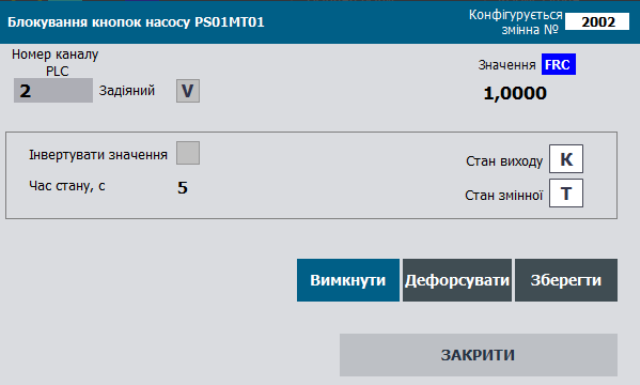

# Class DOVAR: Discrete Process Output Variable

**CLSID=16#1020**

## General Description

This class implements functions for processing and writing output data to `DOCH` and handling diagnostic information received from `DOCH`. These functions include processing diagnostic information from `DOCH`, signal inversion if needed, and managing forcing and simulation modes.

If implementation differences are required, use other CLSIDs in the format 16#102x.

## General Requirements for DOVAR Functions

### Functional Requirements

#### Operating Modes

The DOVAR class must support the following modes (sub-modes):

- output writing/simulation
- non-forced/forced

In all modes except simulation, the value transmitted to the linked `DOCH` channel is taken from `STA.VRAW`.

The **normal mode** is a combination of “output writing” and “non-forced” modes. In this mode, the value of `STA.VAL` depends on the user program result, passes through processing functions, and is written to `STA.VRAW`, which is then sent to the physical `DOCH` channel.

In **simulation mode** (`STA.SML=TRUE`), `STA.VAL` bypasses processing functions and does not write to `STA.VRAW`. In other words, `STA.VAL` has no effect on the physical output. Simulation mode also changes the `STA.SML` state of the linked channel.

In **forced mode** (`STA.FRC=TRUE`), `STA.VAL` is changed only via HMI debug windows and has the highest priority; the user program has no effect on `STA.VAL`. When the force bit is active, `PLC_CFG.CNTFRC` increments by 1.

#### Signal Inversion

If `PRM.INVERSE=TRUE`, then `STA.VAL = NOT STA.VRAW`.

#### Channel Link Monitoring

`STA.DLNK=TRUE` indicates that the variable is linked to a channel.

#### Variable Activity

Variable activity is determined by `STA.ENBL = NOT PRM.DSBL AND DLNK`. If inactive (`STA.ENBL=FALSE`), the following functions do not operate:

- output signal writing and transformation
- simulation
- invalidity alarm diagnostics and processing

Higher-level controllers (e.g., CM LVL2) must treat this variable as temporarily non-existent (decommissioned). For example, if the variable controls a valve solenoid, the CM will assume the variable is absent and may operate under a “monostable valve” algorithm.

#### Measurement Channel Diagnostics

The class provides measurement channel validity checking. When `PRM.QALENBL=TRUE`, `STA.BAD` directly depends on the linked channel’s `STA.BAD`. No other diagnostic methods are implemented in this variable class.

`STA.BAD` indicates a validity alarm. On a rising edge of the alarm, `PLC_CFG.NWBAD=TRUE`. While `STA.BAD` is active:

- The corresponding `PLC_CFG.BAD` bit is set
- `PLC_CFG.CNTBAD` increments by 1

Resetting `PRM.QALENBL=FALSE` disables the validity alarm check.

## Recommendations for HMI Usage

An example of configuring discrete output variable functions on the HMI is shown below.



Figure: Example of configuring discrete output variable functions on the HMI.

### General Variable Structure Requirements

#### DOVAR_HMI

| name | type | adr  | bit  | description                           |
| ---- | ---- | ---- | ---- | ------------------------------------- |
| STA  | UINT | 0    |      | states + load command bit `DOVAR_STA` |

#### DOVAR_CFG

| name        | type  | adr  | bit  | description                                                  |
| ----------- | ----- | ---- | ---- | ------------------------------------------------------------ |
| ID          | UINT  | 0    |      | Unique identifier                                            |
| CLSID       | UINT  | 1    |      | 16#1020                                                      |
| STA         | UINT  | 2    |      | status bits, same assignment as `DOVAR_STA` structure        |
| STA_VRAW    | BOOL  | 2    | 0    | =1 – discrete output signal value on `DOCH`                  |
| STA_VALB    | BOOL  | 2    | 1    | =1 – output variable value after processing, can change externally in force mode |
| STA_BAD     | BOOL  | 2    | 2    | =1 – Data invalid                                            |
| STA_ALDIS   | BOOL  | 2    | 3    | =1 – Alarm disabled                                          |
| STA_DLNK    | BOOL  | 2    | 4    | =1 – linked to channel                                       |
| STA_ENBL    | BOOL  | 2    | 5    | =1 – variable active                                         |
| STA_b6      | BOOL  | 2    | 6    | reserved                                                     |
| STA_VALPRV  | BOOL  | 2    | 7    | previous cycle value                                         |
| STA_b8      | BOOL  | 2    | 8    | reserved                                                     |
| STA_b9      | BOOL  | 2    | 9    | reserved                                                     |
| STA_b10     | BOOL  | 2    | 10   | reserved                                                     |
| STA_b11     | BOOL  | 2    | 11   | reserved                                                     |
| STA_INBUF   | BOOL  | 2    | 12   | =1 – variable in buffer                                      |
| STA_FRC     | BOOL  | 2    | 13   | =1 – force mode active                                       |
| STA_SML     | BOOL  | 2    | 14   | =1 – simulation mode active                                  |
| STA_CMDLOAD | BOOL  | 2    | 15   | =1 – load command to buffer                                  |
| VALI        | INT   | 3    |      | non-force: INT value; force: stored forced value             |
| PRM         | UINT  | 4    |      | configuration parameters, non-volatile                       |
| PRM_b0      | BOOL  | 4    | 0    | reserved                                                     |
| PRM_b1      | BOOL  | 4    | 1    | reserved                                                     |
| PRM_INVERSE | BOOL  | 4    | 2    | =1 – invert raw value                                        |
| PRM_b3      | BOOL  | 4    | 3    | reserved                                                     |
| PRM_b4      | BOOL  | 4    | 4    | reserved                                                     |
| PRM_b5      | BOOL  | 4    | 5    | reserved                                                     |
| PRM_QALENBL | BOOL  | 4    | 6    | =1 – enable validity alarm                                   |
| PRM_DSBL    | BOOL  | 4    | 7    | =1 – variable disabled                                       |
| PRM_b8-15   | BOOL  | 4    | 8-15 | reserved                                                     |
| CHID        | UINT  | 5    |      | logical DO channel number linked to variable, 0 = none       |
| CHIDDF      | UINT  | 6    |      | default logical DO channel number                            |
| STEP1       | UINT  | 7    |      | step number                                                  |
| TSTEP1      | UDINT | 8    |      | step runtime in ms                                           |
| T_PREV      | UDINT | 10   |      | previous call time in ms (from PLC_CFG.TQMS)                 |

#### Buffer Commands (see buffer structure):

| Attribute | Type | Bit  | Description                                                  |
| --------- | ---- | ---- | ------------------------------------------------------------ |
| CMD       | UINT |      | Commands:16#0001: write 1 (force only)16#0002: write 0 (force only)16#0003: TOGGLE (force only)16#0100: read configuration16#0101: write configuration16#0102: write default value16#0300: toggle force16#0301: enable force16#0302: disable force16#0311: simulate16#0312: disable simulation |

#### Buffer Handling

Classic buffer handling must be implemented:

- A single buffer is recommended for all process variables.
- Buffer occupancy is checked by matching `CLSID` and `ID`.
- On buffer capture:
  - `VARBUF.STA = DOVAR_CFG.STA`
  - `DOVAR_CFG.CMD = VARBUF.CMD` (if non-zero to allow external commands)
  - physical channel status bits are read into `VARBUF.CH_STA = CHCFG.STA`.
- Variable configuration should be read to the buffer upon:
  - status bit `STA.CMDLOAD=TRUE`
  - updating the variable already stored in the buffer with `VARBUF.CMD = 16#0100`.
- Variable configuration should be written from the buffer upon:
  - `VARBUF.CMD = 16#0101`.

Parametric bidirectional buffer handling VARBUFIN<->VARBUFOUT must also be implemented:

- Uses:
  - `VARBUFIN` (input) for processing commands (if CLSID & ID match) and writing to the variable.
  - `VARBUFOUT` (output) for reading variable data upon `VARBUFIN` read commands.
- A single pair should be used for all process variables.
- The buffer cannot be occupied since it uses separate IN/OUT buffers.
- Variable configuration should be read to `VARBUFOUT` when:
  - `DOVARCFG.CLSID=VARBUFIN.CLSID`, `DOVARCFG.ID=VARBUFIN.ID`, and `VARBUFIN.CMD=16#100`.
- Variable configuration should be written from `VARBUFIN` when:
  - `DOVARCFG.CLSID=VARBUFIN.CLSID`, `DOVARCFG.ID=VARBUFIN.ID`, and `VARBUFIN.CMD=16#101`.

### Interface Implementation Requirements

INOUT:

- `CHCFG` – physical channel linked to the variable
- `DOVARCFG` – variable configuration structure
- `DOVARHMI` – HMI structure
- If external variable access is unavailable inside functions, pass `PLC_CFG`, `VARBUF`, `VARBUFIN`, and `VARBUFOUT`, or use alternative interfaces within `PLC_CFG`.

### Variable Initialization on First Cycle

ID, CHID, CHIDDF default values are written in the `initvars` program section:

```pascal
"VAR".DOVAR1.ID := 2001;
"VAR".DOVAR1.CHID := 1;
"VAR".DOVAR1.CHIDDF := 1;
```

Additionally, initialization is performed inside the variable handling function, resulting in:

- `DOVARCFG.CLSID := 16#1020;`
- variable activation `DOVARCFG.PRM.DSBL := FALSE;`
- if `CHID=0`, assign default: `DOVARCFG.CHID := DOVARCFG.CHIDDF;`.

### User Program Implementation Requirements

- Process variable handling functions must be called on every cycle of the task to which they are assigned.
- On the first start (`PLC_CFG.SCN1`), the variable identifier `DOVAR_CFG.ID` and the logical channel number `DOVAR_CFG.CHID` must be initialized.

```pascal
(*variable initialization on the first processing cycle*)
IF "SYS".PLCCFG.STA.SCN1 THEN
    #DOVARCFG.CLSID := 16#1020; (*assign class identifier*)
    #DOVARCFG.PRM.DSBL := FALSE; (*activate the variable*)
    #DOVARCFG.T_PREV := "SYS".PLCCFG.TQMS; (*store the call time*)
    IF #DOVARCFG.CHID = 0 THEN (*if the logical channel number is not set - assign the default value*)
        #DOVARCFG.CHID := #DOVARCFG.CHIDDF;
    END_IF;
    
    (*write the raw value from the channel for further processing*)
    IF #CHCFG.ID > 0 THEN
        #CHCFG.STA.VALB := #DOVARCFG.STA.VALB;
    ELSE
        #CHCFG.STA.VALB := 0;
    END_IF;
    
    #DOVARCFG.T_STEP1 := 0; (*reset step time*)
    #DOVARCFG.STEP1 := 400; (*switch to step DO=0*)
    
    (*define the variable ID range*)
    IF #DOVARCFG.ID>0 THEN
        IF #DOVARCFG.ID<"SYS".VARIDMIN THEN "SYS".VARIDMIN:=#DOVARCFG.ID; END_IF;
        IF #DOVARCFG.ID>"SYS".VARIDMAX THEN "SYS".VARIDMAX:=#DOVARCFG.ID; END_IF;
    END_IF;
    
    RETURN;
END_IF;

(*read status bits from the process variable into internal variables*)
#VRAW := #DOVARCFG.STA.VRAW;
#VAL := #DOVARCFG.STA.VALB;
#BAD := #DOVARCFG.STA.BAD;
#DLNK := #DOVARCFG.STA.DLNK;
#ENBL := #DOVARCFG.STA.ENBL;
#VALPRV := #DOVARCFG.STA.VALPRV;
#INBUF := #DOVARCFG.STA.INBUF;
#FRC := #DOVARCFG.STA.FRC;
#SML := #DOVARCFG.STA.SML;
#CMDLOAD := #DOVARCFG.STA.CMDLOAD;

(*read parameter bits from the process variable into internal variables*)
#PRM_INVERSE := #DOVARCFG.PRM.INVERSE;
#PRM_QALENBL := #DOVARCFG.PRM.QALENBL;
#PRM_DSBL := #DOVARCFG.PRM.DSBL;
#PRM_STATICMAP := #DOVARCFG.PRM.STATICMAP;

#INBUF := (#DOVARCFG.ID = "BUF".VARBUF.ID) AND (#DOVARCFG.CLSID = "BUF".VARBUF.CLSID); (*the variable is in the buffer if the variable ID and class ID match*)
#CMDLOAD := #DOVARHMI.STA.%X15; (*command to write to the buffer from the variable's HMI*)
#CMD := 0; (*reset the internal command*)
#DLNK := (#CHCFG.ID > 0); (*the variable is linked to the channel if the channel has a valid ID (not 0)*)
#VARENBL := NOT #PRM_DSBL AND #DLNK; (*the variable is active if linked to the channel and the disable parameter is not active*)
#VRAW := #CHCFG.STA.VALB; (*read the raw value from the channel*)
#T_STEPMS := #DOVARCFG.T_STEP1; (*store the cycle time in ms*)

(*ping-pong algorithm implementation*)
IF #DLNK THEN
    #CHCFG.STA.PNG := true;
    #CHCFG.VARID := #DOVARCFG.ID;
END_IF;

(*if the variable is inactive, do not count time, reset the state*)
IF NOT #VARENBL THEN
    #DOVARCFG.T_STEP1 := 0;
    #DOVARCFG.STEP1 := 400;
END_IF;

(*calculate the time between function calls based on the difference between the millisecond counter and the previous call time*)
#dT := "SYS".PLCCFG.TQMS - #DOVARCFG.T_PREV;

(*broadcast de-forcing*) 
IF "SYS".PLCCFG.CMD = 16#4302 THEN
    #FRC := false; (*de-force the object type*)
END_IF;

(*select the configuration/control command source according to priority if commands arrive simultaneously*)
IF #CMDLOAD THEN (*buffer write command - from the HMI*)
    #CMD := 16#0100;
ELSIF #INBUF AND "BUF".VARBUF.CMD <> 0 THEN (*command from buffer*)
    #CMD := "BUF".VARBUF.CMD;
END_IF;


```

```pascal
(*commands*)
CASE #CMD OF
    16#0001: (*write 1*)
        IF #FRC AND #INBUF THEN
            #DOVARCFG.VALI := 1;
            "BUF".VARBUF.VALR:=1.0;
            #VAL := true;
            #DOVARCFG.STEP1 := 401;
            #DOVARCFG.T_STEP1 := 0;
        END_IF;
    16#0002: (*write 0*)
        IF #FRC AND #INBUF THEN
            #DOVARCFG.VALI := 0;
            "BUF".VARBUF.VALR:=0.0;
            #VAL := false;
            #DOVARCFG.STEP1 := 400;
            #DOVARCFG.T_STEP1 := 0;
        END_IF;
    16#0003: (*TOGGLE*)
        IF #FRC AND #INBUF THEN
            IF #DOVARCFG.VALI > 0 THEN
                #DOVARCFG.VALI := 0;
                "BUF".VARBUF.VALR:=0.0;
                #VAL := false;
                #DOVARCFG.STEP1 := 400;
                #DOVARCFG.T_STEP1 := 0;
            ELSE
                #DOVARCFG.VALI := 1;
                "BUF".VARBUF.VALR:=1.0;
                #VAL := true;
                #DOVARCFG.STEP1 := 401;
                #DOVARCFG.T_STEP1 := 0;
            END_IF;
        END_IF;
    16#0100: (*read configuration*)
        (* MSG 200-Ok 400-Error
        // 200 - Data written
        // 201 - Data read
        // 403 - Channel already occupied
        // 404 - Channel number out of range   
        // 405 - Static channel addressing active *)
        "BUF".VARBUF.MSG:=201;
        
        (*read variable ID and class ID*)
        "BUF".VARBUF.ID := #DOVARCFG.ID;
        "BUF".VARBUF.CLSID := #DOVARCFG.CLSID;
        
        (*read parameter bits*)
        "BUF".VARBUF.PRM.%X2 := #PRM_INVERSE;
        "BUF".VARBUF.PRM.%X6 := #PRM_QALENBL;
        "BUF".VARBUF.PRM.%X7 := #PRM_DSBL;
        "BUF".VARBUF.PRM.%X14 := #PRM_STATICMAP;
        
        (*read parameters*)
        "BUF".VARBUF.CHID := #DOVARCFG.CHID;
        
        (*read variable value for bumpless forcing*)
        "BUF".VARBUF.VALR := INT_TO_REAL(#DOVARCFG.VALI);
        
    16#0101: (*write configuration*)
        (* MSG 200-Ok 400-Error
        // 200 - Data written
        // 201 - Data read
        // 403 - Channel already occupied
        // 404 - Channel number out of range *)
        "BUF".VARBUF.MSG:=200;
        
        (*write parameter bits*)
        #PRM_INVERSE := "BUF".VARBUF.PRM.%X2;
        #PRM_QALENBL := "BUF".VARBUF.PRM.%X6;
        #PRM_DSBL := "BUF".VARBUF.PRM.%X7;
        #PRM_STATICMAP := "BUF".VARBUF.PRM.%X14;
        
        (*algorithm for changing the logical channel number with validity check*)
        IF NOT #PRM_STATICMAP THEN (*change logical channel number only if static addressing is inactive*)
            IF "BUF".VARBUF.CHID>=0 AND "BUF".VARBUF.CHID <= INT_TO_UINT("SYS".PLCCFG.DOCNT) THEN (*if channel number is within the valid range*)
                IF "SYS".CHDO["BUF".VARBUF.CHID].VARID = 0 THEN  (*if channel is free (VARID = 0)*)
                    #DOVARCFG.CHID := "BUF".VARBUF.CHID; (*change channel number*)
                ELSIF "BUF".VARBUF.CHID <> #DOVARCFG.CHID THEN (*else show channel occupied error*)
                    "BUF".VARBUF.MSG := 403;(* channel already occupied *)
                END_IF;
            ELSE
                "BUF".VARBUF.MSG := 404; (*channel number out of range*)
            END_IF;
        ELSIF "BUF".VARBUF.CHID <> #DOVARCFG.CHID THEN (*else show static addressing active error*)
            "BUF".VARBUF.MSG := 405;(* static channel addressing active *)
        END_IF;
        IF #INBUF THEN (*update channel number after write if variable is still in buffer*)
            "BUF".VARBUF.CHID := #DOVARCFG.CHID;
        END_IF;
    16#0102: (*write default value*)
        #DOVARCFG.CHID := #DOVARCFG.CHIDDF;
    16#0300: (*toggle forcing*)
        #FRC := NOT #FRC;
    16#0301: (*enable forcing*)
        #FRC := true;
    16#0302: (*disable forcing*)
        #FRC := false;
    16#0311: (*enable simulation*)
        #SML := true;
    16#0312: (*disable simulation*)
        #SML := false;
END_CASE;

(*value processing*)
IF #FRC THEN (*forcing mode*)
    IF #INBUF THEN
        #DOVARCFG.VALI := REAL_TO_INT("BUF".VARBUF.VALR);
    END_IF;
    #VAL := #DOVARCFG.VALI > 0;
    IF #VAL THEN
        #DOVARCFG.STEP1 := 401;
    ELSE
        #DOVARCFG.STEP1 := 400;
    END_IF;
ELSE (*non-forced value processing - normal variable operation*)
    IF #VAL THEN
        #DOVARCFG.VALI := 1;
        #DOVARCFG.STEP1 := 401;
    ELSE
        #DOVARCFG.VALI := 0;
        #DOVARCFG.STEP1 := 400;
    END_IF;
END_IF;

(*detect rising edge to reset step time*)
IF #VAL <> #VALPRV THEN
    #DOVARCFG.T_STEP1 := 0;
END_IF;

(*write value to physical channel only if variable is active*)
IF #VARENBL THEN
    IF #PRM_INVERSE THEN (*invert output if configured*)
        #VRAW := NOT #VAL;
    ELSE
        #VRAW := #VAL;
    END_IF;
    IF NOT #SML THEN (*in simulation mode, output value is not changed*)
        #CHCFG.STA.VALB := #VRAW;
    END_IF;
END_IF;

#BAD := #CHCFG.STA.BAD AND #PRM_QALENBL AND #VARENBL AND NOT #SML; (*validity alarm from linked physical channel*)

(*transmit alarms to PLCCFG for overall status bit and new alarm detection*)
IF #BAD THEN
    "SYS".PLCCFG.ALM1.BAD := true;
    "SYS".PLCCFG.CNTBAD := "SYS".PLCCFG.CNTBAD + 1;
    IF NOT #DOVARCFG.STA.BAD THEN
        "SYS".PLCCFG.ALM1.NWBAD := true;
    END_IF;
END_IF;

(*transmit status bits to PLCCFG for overall status bit formation*)
IF #FRC THEN
    "SYS".PLCCFG.STA.FRC1 := true;
    "SYS".PLCCFG.CNTFRC := "SYS".PLCCFG.CNTFRC + 1;
END_IF;
IF #SML THEN
    "SYS".PLCCFG.STA.SML := true;
END_IF;

```

```pascal
(*transfer status bits from internal variables to the process variable*)
#DOVARCFG.STA.VRAW := #VRAW;
#DOVARCFG.STA.VALB := #VAL;
#DOVARCFG.STA.BAD := #BAD;
#DOVARCFG.STA.DLNK := #DLNK;
#DOVARCFG.STA.ENBL :=  #VARENBL;
#DOVARCFG.STA.VALPRV := #VAL;
#DOVARCFG.STA.INBUF := #INBUF;
#DOVARCFG.STA.FRC := #FRC;
#DOVARCFG.STA.SML := #SML;
#DOVARCFG.STA.CMDLOAD := FALSE; (*reset buffer write command bit*)

(*transfer parameter bits from internal variables to the process variable*)
#DOVARCFG.PRM.INVERSE := #PRM_INVERSE;
#DOVARCFG.PRM.QALENBL := #PRM_QALENBL;
#DOVARCFG.PRM.DSBL := #PRM_DSBL;
#DOVARCFG.PRM.STATICMAP := #PRM_STATICMAP;

(*transfer status bits from the configuration section to the HMI*)
#DOVARHMI.STA.%X0 := #DOVARCFG.STA.VRAW;
#DOVARHMI.STA.%X1 := #DOVARCFG.STA.VALB;
#DOVARHMI.STA.%X2 := #DOVARCFG.STA.BAD;
#DOVARHMI.STA.%X3 := #DOVARCFG.STA.ALDIS;
#DOVARHMI.STA.%X4 := #DOVARCFG.STA.DLNK;
#DOVARHMI.STA.%X5 := #DOVARCFG.STA.ENBL;
#DOVARHMI.STA.%X6 := #DOVARCFG.STA.STA_b6;
#DOVARHMI.STA.%X7 := #DOVARCFG.STA.VALPRV;
#DOVARHMI.STA.%X8 := #DOVARCFG.STA.STA_b8;
#DOVARHMI.STA.%X9 := #DOVARCFG.STA.STA_b9;
#DOVARHMI.STA.%X10 := #DOVARCFG.STA.STA_b10;
#DOVARHMI.STA.%X11 := #DOVARCFG.STA.STA_b11;
#DOVARHMI.STA.%X12 := #DOVARCFG.STA.INBUF;
#DOVARHMI.STA.%X13 := #DOVARCFG.STA.FRC;
#DOVARHMI.STA.%X14 := #DOVARCFG.STA.SML;
#DOVARHMI.STA.%X15 := #DOVARCFG.STA.CMDLOAD;

#DOVARCFG.T_PREV := "SYS".PLCCFG.TQMS; (*store the timestamp of the last function instance call*)

(*calculate step time and limit it to the upper boundary of the range*)
#DOVARCFG.T_STEP1 := #DOVARCFG.T_STEP1 + #dT;
IF #DOVARCFG.T_STEP1 > 16#7FFF_FFFF THEN
    #DOVARCFG.T_STEP1 := 16#7FFF_FFFF;
END_IF;

(*automatic update if the variable is written to the buffer*)
IF #INBUF THEN
    "BUF".VARBUF.CMD := 0;
    "BUF".VARBUF.VALR := INT_TO_REAL(#DOVARCFG.VALI);

    "BUF".VARBUF.STA.%X0 := #DOVARCFG.STA.VRAW;
    "BUF".VARBUF.STA.%X1 := #DOVARCFG.STA.VALB;
    "BUF".VARBUF.STA.%X2 := #DOVARCFG.STA.BAD;
    "BUF".VARBUF.STA.%X3 := #DOVARCFG.STA.ALDIS;
    "BUF".VARBUF.STA.%X4 := #DOVARCFG.STA.DLNK;
    "BUF".VARBUF.STA.%X5 := #DOVARCFG.STA.ENBL;
    "BUF".VARBUF.STA.%X6 := #DOVARCFG.STA.STA_b6;
    "BUF".VARBUF.STA.%X7 := #DOVARCFG.STA.VALPRV;
    "BUF".VARBUF.STA.%X8 := #DOVARCFG.STA.STA_b8;
    "BUF".VARBUF.STA.%X9 := #DOVARCFG.STA.STA_b9;
    "BUF".VARBUF.STA.%X10 := #DOVARCFG.STA.STA_b10;
    "BUF".VARBUF.STA.%X11 := #DOVARCFG.STA.STA_b11;
    "BUF".VARBUF.STA.%X12 := #DOVARCFG.STA.INBUF;
    "BUF".VARBUF.STA.%X13 := #DOVARCFG.STA.FRC;
    "BUF".VARBUF.STA.%X14 := #DOVARCFG.STA.SML;
    "BUF".VARBUF.STA.%X15 := #DOVARCFG.STA.CMDLOAD;
    
    "BUF".VARBUF.STEP1 := #DOVARCFG.STEP1;
    "BUF".VARBUF.T_STEP1 := #DOVARCFG.T_STEP1;
    
    (*read physical channel status bits of the process variable*)
    "BUF".VARBUF.CH_CLSID := #CHCFG.CLSID;
    "BUF".VARBUF.CH_STA.%X0 := #CHCFG.STA.VRAW;
    "BUF".VARBUF.CH_STA.%X1 := #CHCFG.STA.VALB;
    "BUF".VARBUF.CH_STA.%X2 := #CHCFG.STA.BAD;
    "BUF".VARBUF.CH_STA.%X3 := #CHCFG.STA.b3;
    "BUF".VARBUF.CH_STA.%X4 := #CHCFG.STA.PNG;
    "BUF".VARBUF.CH_STA.%X5 := #CHCFG.STA.ULNK;
    "BUF".VARBUF.CH_STA.%X6 := #CHCFG.STA.MERR;
    "BUF".VARBUF.CH_STA.%X7 := #CHCFG.STA.BRK;
    "BUF".VARBUF.CH_STA.%X8 := #CHCFG.STA.SHRT;
    "BUF".VARBUF.CH_STA.%X9 := #CHCFG.STA.NBD;
    "BUF".VARBUF.CH_STA.%X10 := #CHCFG.STA.b10;
    "BUF".VARBUF.CH_STA.%X11 := #CHCFG.STA.INIOTBUF;
    "BUF".VARBUF.CH_STA.%X12 := #CHCFG.STA.INBUF;
    "BUF".VARBUF.CH_STA.%X13 := #CHCFG.STA.FRC;
    "BUF".VARBUF.CH_STA.%X14 := #CHCFG.STA.SML;
    "BUF".VARBUF.CH_STA.%X15 := #CHCFG.STA.CMDLOAD;
END_IF;

(*implement configuration data reading into the output buffer*)
IF (UINT_TO_WORD(#DOVARCFG.CLSID) AND 16#FFF0) = (UINT_TO_WORD("BUF".VARBUFIN.CLSID) AND 16#FFF0) AND #DOVARCFG.ID = "BUF".VARBUFIN.ID AND "BUF".VARBUFIN.CMD = 16#100 THEN
    (* MSG 200-Ok 400-Error
    // 200 - Data written
    // 201 - Data read
    // 403 - Channel already occupied
    // 404 - Channel number out of range *)
    "BUF".VARBUFOUT.MSG := 201;
    
    "BUF".VARBUFOUT.PRM.%X2 := #DOVARCFG.PRM.INVERSE;
    "BUF".VARBUFOUT.PRM.%X6 := #DOVARCFG.PRM.QALENBL;
    "BUF".VARBUFOUT.PRM.%X7 := #DOVARCFG.PRM.DSBL;
    "BUF".VARBUFOUT.PRM.%X14 := #DOVARCFG.PRM.STATICMAP;
    
    "BUF".VARBUFOUT.ID := #DOVARCFG.ID;
    "BUF".VARBUFOUT.CLSID := #DOVARCFG.CLSID;
    "BUF".VARBUFOUT.CHID := #DOVARCFG.CHID;
    "BUF".VARBUFOUT.VALR := INT_TO_REAL(#DOVARCFG.VALI);
    
    "BUF".VARBUFIN.CMD := 0;
END_IF;

(*implement configuration data writing from input buffer into the process variable*)
IF (UINT_TO_WORD(#DOVARCFG.CLSID) AND 16#FFF0) = (UINT_TO_WORD("BUF".VARBUFIN.CLSID) AND 16#FFF0) AND #DOVARCFG.ID = "BUF".VARBUFIN.ID AND "BUF".VARBUFIN.CMD = 16#101 THEN
    (* MSG 200-Ok 400-Error
    // 200 - Data written
    // 201 - Data read
    // 403 - Channel already occupied
    // 404 - Channel number out of range *)
    
    "BUF".VARBUFOUT := "BUF".VARBUFIN;
    
    #DOVARCFG.PRM.INVERSE := "BUF".VARBUFIN.PRM.%X2;
    #DOVARCFG.PRM.QALENBL := "BUF".VARBUFIN.PRM.%X6;
    #DOVARCFG.PRM.DSBL := "BUF".VARBUFIN.PRM.%X7;
    #DOVARCFG.PRM.STATICMAP := "BUF".VARBUFIN.PRM.%X14;
    
    "BUF".VARBUFOUT.MSG := 200;
    IF NOT #DOVARCFG.PRM.STATICMAP THEN
        IF "BUF".VARBUFIN.CHID >= 0 AND "BUF".VARBUFIN.CHID <= INT_TO_UINT("SYS".PLCCFG.DOCNT) THEN
            IF "SYS".CHDO["BUF".VARBUFIN.CHID].VARID = 0 THEN
                #DOVARCFG.CHID := "BUF".VARBUFIN.CHID;
            ELSIF "BUF".VARBUFIN.CHID <> #DOVARCFG.CHID THEN
                "BUF".VARBUFOUT.MSG := 403; (*channel already occupied*)
            END_IF;
        ELSE
            "BUF".VARBUFOUT.MSG := 404; (*channel number out of range*)
        END_IF;
    ELSIF "BUF".VARBUFIN.CHID <> #DOVARCFG.CHID THEN (*otherwise show static addressing active error*)
        "BUF".VARBUFOUT.MSG := 405; (*static channel addressing active*)
    END_IF;
    
    "BUF".VARBUFIN.CMD := 0;
END_IF;

```

## Testing

The general testing requirements are provided in the LVL1 classes document. Here, only specific tests that differ from the general ones are listed.

### Test List

| No.  | Name                                                    | When to check                 | Notes |
| ---- | ------------------------------------------------------- | ----------------------------- | ----- |
| 1    | Assigning ID and CLSID at startup                       | after function implementation |       |
| 2    | Buffer write commands                                   | after function implementation |       |
| 3    | Parameter change and writing from buffer                | after function implementation |       |
| 4    | Changing the logical channel number                     | after function implementation |       |
| 5    | Writing CHID default value at startup or single command | after function implementation |       |
| 6    | Operation of built-in time counters                     | after function implementation |       |
| 7    | PLC time counter overflow impact on step time           | after function implementation |       |
| 8    | Ping-Pong algorithm                                     | after function implementation |       |
| 9    | Operation in non-forced mode                            | after function implementation |       |
| 10   | Operation in forced mode                                | after function implementation |       |
| 11   | Broadcasting de-forcing commands                        | after function implementation |       |
| 12   | Operation in simulation mode                            | after function implementation |       |
| 13   | Inversion function                                      | after function implementation |       |
| 14   | Taking the variable out of service                      | after function implementation |       |

### 1 Assigning ID and CLSID at Startup

- The PLC must be in STOP before starting the test.
- After startup, all process variables used in the program should have their ID and CLSID assigned.

### 2 Buffer Binding Commands

| No.  | Action to Check                                              | Expected Result                                              | Notes |
| ---- | ------------------------------------------------------------ | ------------------------------------------------------------ | ----- |
| 1    | Set STA.X15:=1 for one of the DOVAR_HMI variables            | VARBUF should load the entire DOVAR_CFG contentsSTA.X15 should reset to 0 in DOVAR_HMISTA.12(INBUF)=1 should be set in DOVAR_HMI, DOVAR_CFG, and VARBUF |       |
| 2    | Change DOVAR_CFG.STA.VALB to 1                               | The corresponding value should update in DOVAR_HMI and VARBUF |       |
| 3    | Set STA.X15:=1 for another DOVAR_HMI variable                | VARBUF should load the entire DOVAR_CFG contents of the other variable |       |
| 4    | Modify a configuration field in VARBUF, e.g., VARBUF.CHID, then execute a write command VARBUF.CMD:=16#100 | VARBUF.CHID should revert to its previous value              |       |

### 3 Parameter Change and Writing from Buffer

| No.  | Action to Check                                              | Expected Result                                              | Notes |
| ---- | ------------------------------------------------------------ | ------------------------------------------------------------ | ----- |
| 1    | Set STA.X15:=1 for one of the DOVAR_HMI variables            | VARBUF should load the entire DOVAR_CFG contentsSTA.X15 should reset to 0 in DOVAR_HMISTA.12(INBUF)=1 should be set in DOVAR_HMI, DOVAR_CFG, and VARBUF |       |
| 2    | Modify a configuration field in VARBUF, e.g., VARBUF.PRM.X2, and execute the write command VARBUF.CMD:=16#101 | The new value should reflect in DOVAR_CFG.PRM.INVERSE        |       |
| 3    | Repeat step 2 for another parameter                          |                                                              |       |

### 4 Changing Logical Channel Number

| No.  | Action to Check                                              | Expected Result                                              | Notes |
| ---- | ------------------------------------------------------------ | ------------------------------------------------------------ | ----- |
| 1    | Set STA.X15:=1 for one of the DOVAR_HMI variables            | VARBUF should load the entire DOVAR_CFG contentsSTA.X15 should reset to 0 in DOVAR_HMISTA.12(INBUF)=1 should be set in DOVAR_HMI, DOVAR_CFG, and VARBUF |       |
| 2    | Change VARBUF.CHID to any value within the physical channels range and to a free channel, then execute VARBUF.CMD:=16#101 | DOVAR_CFG.CHID should update to the new value, and VARBUF.MSG should display success (VARBUF.MSG = 200) |       |
| 3    | Change VARBUF.CHID to a value within the physical channels range but to an occupied channel, then execute VARBUF.CMD:=16#101 | DOVAR_CFG.CHID should remain unchanged, VARBUF.CHID should revert, and VARBUF.MSG should indicate channel occupied error (VARBUF.MSG = 403) |       |
| 4    | Change VARBUF.CHID to a value outside the physical channels range, then execute VARBUF.CMD:=16#101 | DOVAR_CFG.CHID should remain unchanged, VARBUF.CHID should revert, and VARBUF.MSG should indicate invalid channel error (VARBUF.MSG = 404) |       |
| 5    | Enable static addressing (DOVAR_CFG.PRM.STATICMAP:=1), preventing channel number changes, change VARBUF.CHID within the physical channels range to a free channel, then execute VARBUF.CMD:=16#101 | DOVAR_CFG.CHID should remain unchanged, VARBUF.CHID should revert, and VARBUF.MSG should indicate static addressing error (VARBUF.MSG = 405) |       |

### 5 Writing CHID Default Value at Startup or Single Command

- At startup:
  - Ensure the PLC is in STOP before testing.
  - After startup, all process variables should have CHID and CHIDDF values set.
- For a single command:

| No.  | Action to Check                                              | Expected Result                                              | Notes |
| ---- | ------------------------------------------------------------ | ------------------------------------------------------------ | ----- |
| 1    | Set STA.X15:=1 for one of the DOVAR_HMI variables            | VARBUF should load the entire DOVAR_CFG contentsSTA.X15 should reset to 0 in DOVAR_HMISTA.12(INBUF)=1 should be set in DOVAR_HMI, DOVAR_CFG, and VARBUF |       |
| 2    | Change VARBUF.CHID within the physical channels range to a free channel, then execute VARBUF.CMD:=16#101 | DOVAR_CFG.CHID should update, and VARBUF.MSG should indicate success (VARBUF.MSG = 200) |       |
| 3    | Execute the command to write the default value VARBUF.CMD:=16#102 | DOVAR_CFG.CHID should update to the value stored in DOVAR_CFG.CHIDDF |       |

### 6 Operation of Built-in Time Counters

The step runtime for the `DOVAR_CFG` variable is displayed in `DOVAR_CFG.T_STEP1`, shown in ms. The accuracy of `DOVAR_CFG.T_STEP1` should be verified using an astronomical clock.

### 7 PLC Time Counter Overflow Impact on Step Time

| No.  | Action to Check                                              | Expected Result                                              | Notes |
| ---- | ------------------------------------------------------------ | ------------------------------------------------------------ | ----- |
| 1    | Observe changes in PLCCFG.TQMS and DOVAR1.T_STEP1, verifying accuracy with an astronomical clock | PLCCFG.TQMS and DOVAR1.T_STEP1 should measure time in ms     |       |
| 2    | Write 16#FFFF_FFFF - 5000 (5000 ms before overflow) into PLCCFG.TQMS and 16#7FFF_FFFF - 10000 (10000 ms before overflow) into DOVAR1.T_STEP1 | For 5000 ms, time will increment normally; once PLCCFG.TQMS overflows, it will reset while DOVAR1.T_STEP1 will increment until it reaches its max (16#7FFFFFFF) and then stop |       |
| 3    | Change DOVAR1.STA.VALB                                       | DOVAR1.T_STEP1 should reset and start counting again         |       |

### 8 Ping-Pong Algorithm

| No.  | Action to Check                                        | Expected Result                                              | Notes |
| ---- | ------------------------------------------------------ | ------------------------------------------------------------ | ----- |
| 1    | Check the physical channel CHDO.VARID linked to DOVAR1 | CHDO.VARID should display DOVAR1.ID, with CHDO.STA_ULNK=1 and DOVAR1.STA.DLNK=1 |       |
| 2    | Set DOVAR1.CHID := 0                                   | DOVAR1.STA.DLNK=0 (variable detached), CHDO.VARID=0, CHDO.STA_ULNK=0 |       |
| 3    | Restore the previous value in DOVAR1.CHID              | CHDO.VARID should display DOVAR1.ID, CHDO.STA_ULNK=1, DOVAR1.STA.DLNK=1 |       |
| 4    | Repeat the previous steps for another process variable |                                                              |       |

### 9 Operation in Non-forced Mode

| No.  | Action to Check                                   | Expected Result                                              | Notes |
| ---- | ------------------------------------------------- | ------------------------------------------------------------ | ----- |
| 1    | Set STA.X15:=1 for one of the DOVAR_HMI variables | VARBUF should load the entire DOVAR_CFG contentsSTA.X15 should reset to 0 in DOVAR_HMISTA.12(INBUF)=1 should be set in DOVAR_HMI, DOVAR_CFG, and VARBUF |       |
| 2    | Change DOVAR1.STA.VALB                            | The value should update in DOVAR_HMI, VARBUF, and CHDO.STA.VRAW |       |
| 3    | Change DOVAR1.STA.VALB to its opposite value      | The value should update in DOVAR_HMI, VARBUF, and CHDO.STA.VRAW |       |

### 10 Operation in Forced Mode

| No.  | Action to Check                                              | Expected Result                                              | Notes                                                |
| ---- | ------------------------------------------------------------ | ------------------------------------------------------------ | ---------------------------------------------------- |
| 1    | Set STA.X15:=1 for one of the DOVAR_HMI variables            | VARBUF should load the entire DOVAR_CFG contentsSTA.X15 in DOVAR_HMI should reset to 0STA.12(INBUF)=1 should be set in DOVAR_HMI, DOVAR_CFG, and VARBUF |                                                      |
| 2    | Send the forcing command VARBUF.CMD=16#0301                  | The STA.FRC bit should be set to 1                           |                                                      |
| 3    | Change DOVAR1.STA.VALB                                       | The value should not change in DOVAR_HMI, VARBUF, or CHDO.STA.VRAW |                                                      |
| 4    | Send the command 16#0001 (write 1)                           | STA.VALB should change to 1, and VALB bits in DOVAR_HMI, VARBUF, and CHDO.STA.VRAW should become 1 |                                                      |
| 5    | Send the command 16#0002 (write 0)                           | STA.VALB should change to 0, and VALB bits in DOVAR_HMI, VARBUF, and CHDO.STA.VRAW should become 0 |                                                      |
| 6    | Send the command 16#0003 (TOGGLE)                            | STA.VALB should toggle, and VALB bits in DOVAR_HMI, VARBUF, and CHDO.STA.VRAW should toggle accordingly |                                                      |
| 7    | Change `VARBUF.VALI`                                         | The value should change to the specified value               | For discrete variables, any value >0 is treated as 1 |
| 8    | Send the de-forcing command VARBUF.CMD=16#0302               | The STA.FRC bit should reset to 0, STA.VALB should remain unchanged |                                                      |
| 9    | Send the toggle forcing command 16#0300 several times, leaving it in forced mode | The STA.FRC bit should toggle accordingly                    |                                                      |
| 10   | Enable forcing for multiple variables                        | The STA.FRC bit for the relevant variables should be set to 1 |                                                      |
| 11   | Check the values of PLC.STA_PERM and PLC.CNTFRC_PERM         | PLC.STA_PERM.X11 should be 1, and PLC.CNTFRC_PERM should equal the number of forced variables |                                                      |
| 12   | Disable forcing for all variables                            | PLC.STA_PERM.X11 should be 0, and PLC.CNTFRC_PERM should be 0 |                                                      |

### 11 Broadcasting De-Forcing Commands

| Step No. | Action to Check                                       | Expected Result                                              | Notes |
| -------- | ----------------------------------------------------- | ------------------------------------------------------------ | ----- |
| 1        | Enable forcing mode for multiple variables            | STA.FRC bit of the relevant variables should be set to 1     |       |
| 2        | Check the values of PLC.STA_PERM and PLC.CNTFRC_PERM  | PLC.STA_PERM.X11 should be 1, and PLC.CNTFRC_PERM should equal the number of forced variables |       |
| 3        | Send the broadcast de-forcing command PLC.CMD=16#4302 | STA.FRC bit of all variables should reset to 0, PLC.CNTFRC_PERM should be 0 |       |

### 12 Operation in Simulation Mode

| No.  | Action to Check                                        | Expected Result                                              | Notes |
| ---- | ------------------------------------------------------ | ------------------------------------------------------------ | ----- |
| 1    | Set STA.X15:=1 for one of the DOVAR_HMI variables      | VARBUF should load the entire DOVAR_CFG contentsSTA.X15 in DOVAR_HMI should reset to 0STA.12(INBUF)=1 should be set in DOVAR_HMI, DOVAR_CFG, and VARBUF |       |
| 2    | Send the enable simulation command VARBUF.CMD=16#0311  | The STA.SML bit should be set to 1                           |       |
| 3    | Change DOVAR_CFG.STA.VALB to 1                         | The value should update in DOVAR_HMI and VARBUF, but not in the physical channel CHDO.STA.VRAW |       |
| 4    | Change DOVAR_CFG.STA.VALB to 0                         | The value should update in DOVAR_HMI and VARBUF, but not in the physical channel CHDO.STA.VRAW |       |
| 5    | Check the value of PLC.STA_PERM                        | The bit indicating the presence of simulated objects PLC.STA_PERM.X14 should be 1 |       |
| 6    | Send the disable simulation command VARBUF.CMD=16#0312 | The STA.SML bit should reset to 0                            |       |
| 7    | Change DOVAR_CFG.STA.VALB to 1                         | The value should update in DOVAR_HMI, VARBUF, and the physical channel CHDO.STA.VRAW |       |

### 13 Inversion Function

| No.  | Action to Check                                              | Expected Result                                              | Notes |
| ---- | ------------------------------------------------------------ | ------------------------------------------------------------ | ----- |
| 1    | Change DOVAR1.STA.VALB to 1                                  | DOVAR1.STA.VRAW should become 1 and write to CHDO.STA.VRAW   |       |
| 2    | Change DOVAR1.STA.VALB to 0                                  | DOVAR1.STA.VRAW should become 0 and write to CHDO.STA.VRAW   |       |
| 3    | Set the "invert raw value" parameter DOIVAR_CFG.PRM.INVERSE to 1 | DOVAR_CFG.STA.VALB should remain 0, while DOVAR_CFG.STA.VRAW should become 1 and write to CHDO.STA.VRAW |       |
| 4    | Change DOVAR1.STA.VALB to 1                                  | DOVAR1.STA.VRAW should become 0 and write to CHDO.STA.VRAW   |       |
| 5    | Change DOVAR1.STA.VALB to 0                                  | DOVAR1.STA.VRAW should become 1 and write to CHDO.STA.VRAW   |       |
| 6    | Set the "invert raw value" parameter DOIVAR_CFG.PRM.INVERSE to 0 | DOVAR_CFG.STA.VALB should remain 0, while DOVAR_CFG.STA.VRAW should become 0 and write to CHDO.STA.VRAW |       |

### 14 Taking the Variable Out of Service

| No.  | Action to Check             | Expected Result                                              | Notes |
| ---- | --------------------------- | ------------------------------------------------------------ | ----- |
| 1    | Change DOVAR1.STA.VALB to 1 | DOVAR1.STA.VRAW should become 1 and write to CHDO.STA.VRAW   |       |
| 2    | Set DOVAR_CFG.PRM.DSBL to 1 | DOVAR_CFG.STA.ENBL should reset to 0, DOVAR_CFG.T_STEP1 should reset and stop counting. DOVAR1.STA.VRAW remains 1 but will not transfer to CHDO.STA.VRAW |       |
| 3    | Change DOVAR1.STA.VALB to 0 | DOVAR1.STA.VRAW becomes 0 but will not transfer to CHDO.STA.VRAW |       |
| 4    | Change DOVAR1.STA.VALB to 1 | DOVAR1.STA.VRAW becomes 1 but will not transfer to CHDO.STA.VRAW |       |
| 5    | Set DOVAR_CFG.PRM.DSBL to 0 | DOVAR_CFG.STA.ENBL becomes 1, DOVAR_CFG.T_STEP1 starts counting again. DOVAR_CFG.STA.VRAW remains 1 and will transfer to CHDO.STA.VRAW |       |
| 6    | Change DOVAR1.STA.VALB to 0 | DOVAR1.STA.VRAW becomes 0 and will write to CHDO.STA.VRAW    |       |


