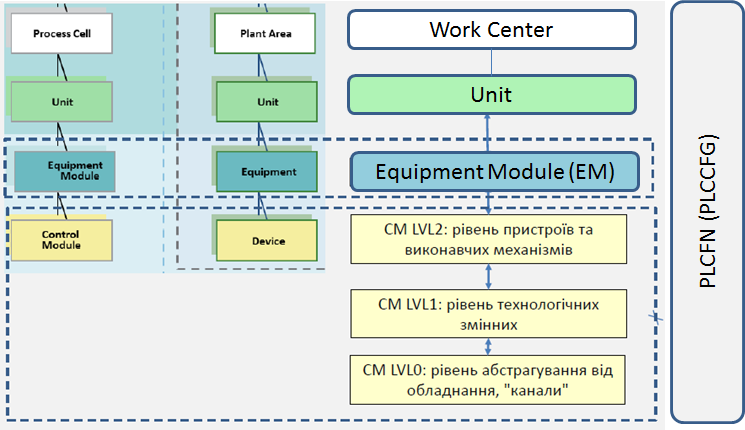
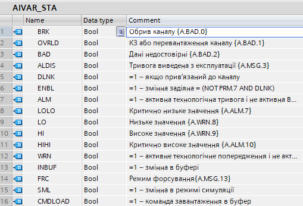

## 2.1. Загальні концепції використання CM

У каркасі, незалежно від типу технологічного процесу, яким керує АСКТП, на рівні модулів керування (Control Module) виділяються типові апаратурні об'єкти принаймні 3-х рівнів:

- LVL0 (channels) - канали контролеру
- LVL1 (process variables)  - технологічні змінні
- LVL2 (devices) - пристрої та ВМ 

Місце CM в ієрархії устатковання більш детально описана в [Ієрархія устатковання в PAC Framework](../base/1_3_equip.md). 



У цьому розділі розглядаються загальні правила щодо роботи з CM.

### 2.1.1. Змінні та функції пов'язані з CM

Для кожного об'єкта CM виділяється (замість абревіатури CM ставиться абревіатура класу або рівня):
- тип та змінна **CM** (альтернативна назва **CM_CFG**): містить всю необхідну інформацію про нього, як правило без доступу з боку HMI. Приклади:

`AIVAR_CFG` - структурний тип для технологічної змінної класу AIVAR
`VAR.T101_TT100` з типом `AIVAR_CFG` - змінна ПЛК типу `AIVAR_CFG` в блоці даних `VAR`, призначена для збереження та обробки усіх налаштувань відповідної технологічної змінної 

- змінна **CM_HMI** (опціонально): призначена для обміну зі SCADA/HMI даними реального часу; об'єм структури значно менший, ніж CM. Наприклад: 

`AIVAR_HMI` - структурний тип для технологічної змінної класу AIVAR для обміну з HMI
`AIH.T101_TT100` з типом `AIVAR_HMI` - змінна ПЛК типу `AIVAR_HMI` в блоці даних `AIH`, призначена для обміну ПЛК з HMI 

- для групи однотипних об'єктів **CM_BUF**: для обміну конфігураційними/налагоджувальними даними між HMI та PLC, структура може бути така сама як CM_CFG або мати додаткові поля. Наприклад:

`VARBUF` - структурний тип для буферної змінної для роботи зі змінними VAR (AIVAR, DIVAR ...)

`BUF.VARBUF` з типом `VARBUF` - екземпляр `VARBUF` в блоці даних `BUF` 

- для групи однотипних об'єктів **CM_IoTBUF**: буфер для IoT Gateway
- функція реалізації логіки роботи **CM_FN** та її виклик; рекомендується без використання пам'яті екземпляру. Наприклад:

```pascal
//виклик функції обробки аналогової технологічної змінної
"AIVARFN"(CHCFG := "SYS".CHAI["VAR".T101_TT100.CHID], 
	AIVARCFG := "VAR".T101_TT100, 
	AIVARHMI := "AIH".T101_TT100);
```


### 2.1.2. Загальна структура CM (CM_CFG) та CM_BUF

Кожна структура повинна включати:
- **CM_CFG.ID/CM_BUF.ID** (INT16/UINT16) – унікальний ідентифікатор в межах класу (для одиночних типів CM може бути відсутнім)
-  **CM_CFG.CLSID/CM_BUF.CLSID** (INT16/UINT16) – унікальний ідентифікатор класу (для одиночних CM може бути відсутнім)
-   **CM_CFG.STA** (бітовий набір або бітова структура) – біти статусів і режимів
-   **CM_BUF.STA** (INT16/UINT16) – слово статусів + режими
-    **CM_CFG.CMD** (бітовий набір або бітова структура) - бітові команди за необхідності (тільки для LVL2 і вище) 
-    **CM_BUF.CMD** (INT16/UINT16) – слово команди (тільки для LVL2 і вище) 
-    інші поля, в залежності від класу CM

Приклад структури `DIVAR_CFG` (для технологічної змінної DIVAR на LVL1)


Приклад структури `VLVD_CFG` (для виконавчих механізмів типу VLVD на LVL2)


Структурний тип CM_BUF у більшості випадків включає усі поля тих структурних типів, які відповідають за CM з якими він має працювати. Тобто він є універсальним і може містити дані будь яких з структурних змінних.    

### 2.1.3. Структура CM_HMI

#### Базова структура
- **CM_HMI.STA** (INT16/UINT16) – слово статусів + режими
- **CM_HMI.CMD** (INT16/UINT16) – слово команди
- інші поля, в залежності від класу CM
#### Альтернативна структура 
Для технологічних змінних та каналів пропонується альтернативна структура, в якій немає `CM_HMI.CMD` так як єдина команда, яка відправляється з HMI для них - це завантажити в буфер. Усі інші команди є налагоджувальними та можуть працювати через буфер.  

**CM_HMI.STA** (INT16/UINT16 або UDINT32) – слово статусів + режими + біт команди на читання в буфер.
32-бітне слово можна використовувати у тому випадку, якщо 16 біт замало і платформа не містить обмежень на використання бітових полів (наприклад в ALARM в SCADA/HMI).
Біт команди виставляється в HMI і обнуляється в контролері. Таким чином CM_HMI.STA доступний для читання/запису.


### 2.1.4. Обробка команди (CMD)

**CM_CFG.CMD** – команда з програми для LVL2, не рекомендується використовувати для LVL0 та LVL1. Може бути бітовим набором (структурою) для зручності представлення. Враховуючи, що програма може відправляти кілька команд керування одночасно, не рекомендується використовувати команди як числові константи.
**CM_HMI.CMD** – команда з HMI у вигляді числа - номера команди; можна не використовувати для LVL0 та LVL1 при альтернативному варіанті структури.
**CM_BUF.CMD** – команда з буфера, який зараз зайнятий (allocation, яким оволодіває) конкретним CM-ом; команди подаються у вигляді числа - номера команди.

Приклад бітових команд для виконавчого механізму CM_CFG.CMD.


### 2.1.5. Слово статусу та режиму (STA)

**CM_CFG.STA** – слово статусу CM, може бути бітовим набором (структурою) для зручності обробки.
**CM_HMI.STA** – статус на HMI, завжди повторює `CM_CFG.STA`,  але у вигляді слова
**CM_BUF.STA** – статус на буфер, який зараз зайнятий (allocation) конкретним CM-ом, завжди повторює `CM_CFG.STA` елемента, що зайняв цей буфер, але у вигляді слова

Альтернативна **CM_HMI.STA** (для LVL0 та LVL1) включає окрім STA біт команди (X15) на читання в буфер.

Загальні біти STA для всіх CM:

- **CM_CFG.STA.INBUF** (X12) – = 1зайняв буфер (при `CM_CFG.ID = CM_BUF.ID`)
- **CM_CFG.STA.FRС** (X13):
  - для LVL0, LVL1 = 1 режим ручної зміни/форсування, поточне значення не змінюється алгоритмом керування, і доступний для зміни із-зовні HMI, 
  - для LVL2 - =1 - є принаймні одна змінна в складі CM в режимі форсування 

- **CM_CFG.STA.SML** (X14) – = 1 режим імітації: поведінка залежить від типу CM

Слово статусу `CM_HMI.STA` та `CM_BUF.STA` рекомендується використовувати як слово INT/UINT, а не як набір біт (бітова структура). Для більшості SCADA/HMI це зменшує кількість точок вводу/виводу та дає можливість використовувати слово і в задачах тривог. CM_CFG.STA використовується тільки в програмі ПЛК, де зручніше посилатися на осмислені бітові змінні, аніж на біти за номерами. Починаючи з даної версії (1.01) каркасу використання CM_CFG.STA передбачає бітові структури.

Приклад бітової структури CM_CFG.STA:



### 2.1.6. Робота з буферною змінною CM_BUF

Ініціалізація буферної змінної відбувається при команді зчитування з `CM_HMI.CMD` (16#0100 – прочитати конфігурацію) або зміною біта X15=1 в слові `CM_HMI.STA`. У буфер попадають усі дані структури `CM_CFG`.

Для перевірки зяйнятості буферу своєю змінною на кожному циклі у `CM_FN` перевіряється умова `CM_CFG.ID = CM_BUF.ID AND CM_CFG.CLSID = CM_BUF.CLSID`, наприклад:

```pascal
#INBUF := (#AIVARCFG.ID = "BUF".VARBUF.ID) AND (#AIVARCFG.CLSID = "BUF".VARBUF.CLSID);
```

`INBUF` у даному випадку назва біту наявності в буфері "своєї" змінної.

Якщо рівність справджується:

- дані реального часу буферу (включаючи діагностичні, налагоджувальні, плинний час кроку і т.п.) переписуються аналогічними з `CM_CFG`;
- обробляються команди `CM_BUF.CMD` (якщо вони не = 0);
- обнуляється `CM_BUF.CMD`.

При зміні конфігураційних даних в буфері, ці значення оновлюються тільки в ньому. При надсиланні команди `CM_CFG.CMD=16#0101` (записати конфігурацію) конфігураційні дані буферу записуються в `CM_CFG`.

### 2.1.7. Функція CM_FN
Кожна функція взаємодіє з зовнішнім світом через змінні `CM_CFG`, `CM_HMI`, `CM_BUF` та отримує значення ідентифікатору ID. Наявність інших інтерфейсних змінних залежать від конкретної функції. У переліку нижче вказується перелік інтерфейсних змінних спільний для всіх типів CM 

| Інтерфейсна змінна | Тип інтерфейсу | Призначення                   | Примітка                                                     |
| ------------------ | -------------- | ----------------------------- | ------------------------------------------------------------ |
| **CM_CFG**         | INOUT          | структурна змінна для CM_CFG |                                                              |
| **CM_HMI**         | INOUT          | структурна змінна для CM_HMI |                                                              |
| **CM_BUF**         | INOUT          | структурна змінна для CM_BUF | у випадку глобальності даних може викликатися прямо з функції без явного об'явлення в інтерфейсі |
| **PLCCFG**      | INOUT          | структурна змінна для CM_PLC | у випадку глобальності даних може викликатися прямо з функції без явного об'явлення в інтерфейсі |

**Виклик функцій повинен відбуватися в кожному циклі основної циклічної задачі (MAST, OB1, тощо)! Якщо канали треба обробляти в інших задачах, необхідно передбачати узгодженість з глобальними системними змінними (таймерні тіки, біти загальних тривог, тощо). Наразі в каркасі не передбачено чітких правил обробки в мультизадачному режимі, вирішується в залежності від завдання та платформи.**

Вимог до коду функції загалом немає ніяких. Є ряд рекомендацій, перевірених на практиці.

1) Кожна структура CM (за винятком рівня Channels LVL0) має включати змінну кроку `STEP1` (UINT),  змінну часу кроку `T_STEP1` (UDINT), час останнього виклику `T_PREV`. Ці змінні дають можливість робити покрокове виконання, зав'язане з часом.

Змінна `T_PREV` запам'ятовує останній час виклику в мс. Вона у свою чергу посилається на системну змінну `PLCCFG.TQMS`, яка відповідає за  відносний час роботи ПЛК (див `plcfn`). Змінна `T_STEP1` вказує час виконання кроку в мілісекундах. З кожним викликом функції цей час автоматично збільшується на величину різниці між останнім викликом і плинним часом. При переході на інший крок змінна `T_STEP1` обнуляється. Приклад обробки `T_STEP1` показаний нижче:  

```pascal
#dT := "SYS".PLCCFG.TQMS - #AIVARCFG.T_PREV;
#AIVARCFG.T_PREV := "SYS".PLCCFG.TQMS;
#AIVARCFG.T_STEP1 := #AIVARCFG.T_STEP1 + #dT;
//обмеження на максимальний час кроку - захист від перекидування
//2147483,647 с, приблизно 24 доби 
IF #AIVARCFG.T_STEP1 > 16#7FFF_FFFF THEN 
    #AIVARCFG.T_STEP1 := 16#7FFF_FFFF;
END_IF;
```

2) Якщо використовуються бітові наповнення STA, рекомендується використовувати внутрішні змінні для розпаковки/упаковки. Крім того, маючи відтиск змінних на початку функції (в STA) та значення їх в кінці функції (в розпакованих та змінених в функції внутрішніх змінних) можна ловити фронти. Приклад внутрішніх змінних:

```pascal
#STA := #AIVARCFG.STA;
#BRK := #STA.BRK;
#OVRLD := #STA.OVRLD;
#BAD := #STA.BAD;
#ALDIS := #STA.ALDIS;
#ENBL := #STA.ENBL;
#ALM := #STA.ALM;
#LOLO := #STA.LOLO;
#LO := #STA.LO;
#HI := #STA.HI;
#HIHI := #STA.HIHI;
#WRN := #STA.WRN;
#FRC := #STA.FRC;
#SML := #STA.SML;
#INBUF := (#AIVARCFG.ID = "BUF".VARBUF.ID) AND (#AIVARCFG.CLSID = "BUF".VARBUF.CLSID);
#CMDLOAD := #AIVARHMI.STA.%X15;
#DLNK := (#CHCFG.ID > 0);
#VARENBL := NOT #AIVARCFG.PRM.PRM_DSBL AND #DLNK;
```

Нижче наведений приклад, в якому загальний біт ПЛК нова тривога рівня "аварія" (`"SYS".PLCCFG.ALM1.NWALM`) виставляється тільки при появі `ALM`. Слід зазначити що `"SYS".PLCCFG.ALM1` скидується з кожним сканом функцією PLCFN (див.1.4.1).

```pascal
#ALM := (#LOLO OR #HIHI) AND NOT #BAD; //загальна тривога рівня аварії
IF #ALM THEN 
	"SYS".PLCCFG.ALM1.ALM := true; 
	"SYS".PLCCFG.CNTALM := "SYS".PLCCFG.CNTALM + 1;
	IF NOT #AIVARCFG.STA.ALM THEN //якщо тривоги до цього не було 
		"SYS".PLCCFG.ALM1.NWALM := true; //тривога тільки зявилася
	END_IF;
END_IF;
```


Кожна функція CM_FN відповідає за певний клас CM. Зручно реалізовувати усі функції класу в одній функції. У цьому випадку базовий функціонал реалізовується для всіх CM класу, а функціонал підкласів обробляється в залежності від конкретного `CLSID`, `ID` або `PRM`. Таким чином робиться реалізація класів на кшталт поліморфізму та наслідування. Детальніше про це описано в розділі [Концепція класифікації та кастомізація об'єктів](../base/classes.md). 

[До розділу](README.md)
