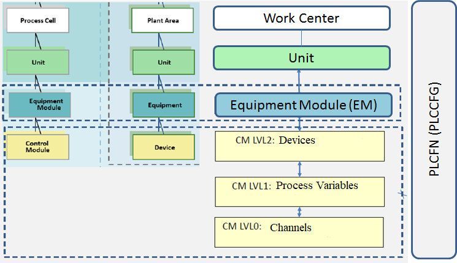
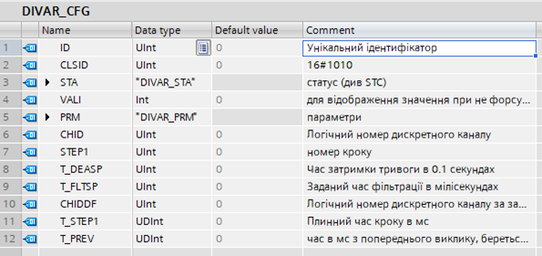
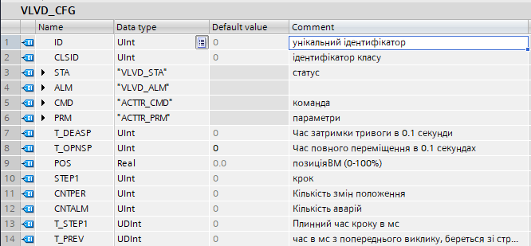
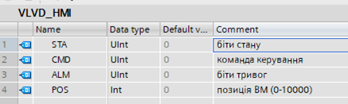
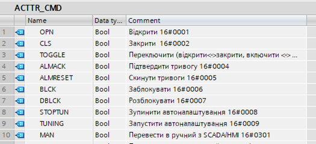
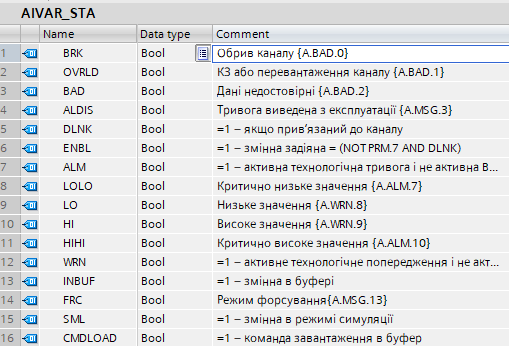

## 2.1. General Concepts of Using Control Modules (CM)

Within the framework, regardless of the type of technological process controlled by the IACS, typical instrumentation objects are defined at the **Control Module (CM)** level across at least three levels:

- **LVL0 (channels)** – controller channels
- **LVL1 (process variables)** – process variables
- **LVL2 (devices)** – devices and actuators

The place of CM in the equipment hierarchy is described in more detail in Equipment Hierarchy in PAC Framework.



This section covers the general rules for working with CMs.

### 2.1.1. Variables and Functions Related to CM

For each CM object, the following are defined (replacing the abbreviation CM with the class or level abbreviation):

- **CM type and variable** (alternative name **CM_CFG**): contains all necessary information about the object, typically without HMI access.

Examples:

- `AIVAR_CFG` – structural type for a process variable of the AIVAR class
- `VAR.T101_TT100` of type `AIVAR_CFG` – PLC variable of type `AIVAR_CFG` in the `VAR` data block, used to store and process all settings of the corresponding process variable
- **CM_HMI variable** (optional): used for real-time data exchange with SCADA/HMI; this structure is significantly smaller than CM.

Examples:

- `AIVAR_HMI` – structural type for AIVAR class process variables for HMI exchange
- `AIH.T101_TT100` of type `AIVAR_HMI` – PLC variable of type `AIVAR_HMI` in the `AIH` data block for PLC-HMI exchange
- **CM_BUF for a group of similar objects**: used for configuration/diagnostic data exchange between HMI and PLC; structure may be the same as CM_CFG or have additional fields.

Examples:

- `VARBUF` – structural type for a buffer variable working with VAR variables (AIVAR, DIVAR, etc.)
- `BUF.VARBUF` of type `VARBUF` – `VARBUF` instance in the `BUF` data block
- **CM_IoTBUF for a group of similar objects**: buffer for IoT Gateway
- **CM_FN function** for logic implementation and its call; it is recommended to use without instance memory.

Example:

```pascal
// Calling the processing function for an analog process variable
"AIVARFN"(CHCFG := "SYS".CHAI["VAR".T101_TT100.CHID], 
          AIVARCFG := "VAR".T101_TT100, 
          AIVARHMI := "AIH".T101_TT100);
```

### 2.1.2. General Structure of CM (CM_CFG) and CM_BUF

Each structure should include:

- **CM_CFG.ID / CM_BUF.ID (INT16/UINT16)** – unique identifier within the class (may be omitted for single CM types)
- **CM_CFG.CLSID / CM_BUF.CLSID (INT16/UINT16)** – unique class identifier (may be omitted for single CM types)
- **CM_CFG.STA** – status and mode bits
- **CM_BUF.STA (INT16/UINT16)** – status and mode word
- **CM_CFG.CMD** – command bits if needed (LVL2 and above only)
- **CM_BUF.CMD (INT16/UINT16)** – command word (LVL2 and above only)
- Other fields depending on the CM class

Example `DIVAR_CFG` structure (LVL1 process variable):



Example `VLVD_CFG` structure (LVL2 actuator):



The `CM_BUF` structural type generally includes all fields of the structural types corresponding to the CMs it interacts with, making it universal.

### 2.1.3. CM_HMI Structure

#### Basic Structure

- **CM_HMI.STA (INT16/UINT16)** – status and mode word
- **CM_HMI.CMD (INT16/UINT16)** – command word
- Other fields depending on the CM class

#### Alternative Structure

For process variables and channels, an alternative structure without `CM_HMI.CMD` is proposed, as the only command from the HMI is to load into the buffer. All other commands are handled via the buffer.

- **CM_HMI.STA (INT16/UINT16 or UDINT32)** – status/mode word + read-to-buffer command bit.

A 32-bit word can be used when 16 bits are insufficient, and the platform has no bit field restrictions.



### 2.1.4. Handling Commands (CMD)

- **CM_CFG.CMD** – program command for LVL2; not recommended for LVL0 and LVL1; can use bit sets for clarity.
- **CM_HMI.CMD** – HMI command as a numeric value; optional for LVL0 and LVL1 in the alternative structure.
- **CM_BUF.CMD** – command from the buffer occupied by a specific CM, submitted as a numeric value.

Example of CM_CFG.CMD bit commands for an actuator:



### 2.1.5. Status and Mode Word (STA)

- **CM_CFG.STA** – CM status word, can be a bit set for easier handling.
- **CM_HMI.STA** – HMI status, mirrors `CM_CFG.STA` as a word.
- **CM_BUF.STA** – buffer status, mirrors `CM_CFG.STA` as a word.

Alternative `CM_HMI.STA` (for LVL0 and LVL1) includes the STA and a read-to-buffer command bit (X15).

Common STA bits:

- **INBUF (X12)** – = 1 indicates buffer occupied (`CM_CFG.ID = CM_BUF.ID`)
- **FRC (X13)**:
  - LVL0, LVL1 = 1 manual/forced mode
  - LVL2 = 1 indicates at least one variable in forced mode
- **SML (X14)** – = 1 simulation mode

Using `CM_HMI.STA` and `CM_BUF.STA` as INT/UINT words reduces I/O points and simplifies alarm handling in SCADA/HMI.

Example of `CM_CFG.STA` bit structure:



### 2.1.6. Working with CM_BUF

Buffer initialization occurs upon a read command (`CM_HMI.CMD = 16#0100`) or when bit X15=1 in `CM_HMI.STA`. The buffer receives all `CM_CFG` data.

Buffer occupation is checked:

```pascal
#INBUF := (#AIVARCFG.ID = "BUF".VARBUF.ID) AND (#AIVARCFG.CLSID = "BUF".VARBUF.CLSID);
```

If true:

- RT data from the buffer is updated with `CM_CFG` data.
- Commands `CM_BUF.CMD` are processed and then cleared.

Configuration data changes in the buffer only update within the buffer. Sending `CM_CFG.CMD = 16#0101` writes configuration data from the buffer to `CM_CFG`.

### 2.1.7. CM_FN Function

Each function interacts externally through `CM_CFG`, `CM_HMI`, `CM_BUF`, and receives the ID. Other interface variables depend on the function.

| Interface Variable | Type  | Purpose              | Note                             |
| ------------------ | ----- | -------------------- | -------------------------------- |
| **CM_CFG**         | INOUT | structure for CM_CFG |                                  |
| **CM_HMI**         | INOUT | structure for CM_HMI |                                  |
| **CM_BUF**         | INOUT | structure for CM_BUF | may be called directly if global |
| **PLCCFG**         | INOUT | structure for CM_PLC | may be called directly if global |

**Functions should be called in every cycle of the main cyclic task (MAST, OB1, etc.)!** Multi-tasking rules depend on the platform and task specifics.

#### Practical Recommendations:

1) Each CM structure (except LVL0) should include `STEP1` (UINT), `T_STEP1` (UDINT), `T_PREV` for step-wise execution based on time.

Example:

```pascal
#dT := "SYS".PLCCFG.TQMS - #AIVARCFG.T_PREV;
#AIVARCFG.T_PREV := "SYS".PLCCFG.TQMS;
#AIVARCFG.T_STEP1 := #AIVARCFG.T_STEP1 + #dT;
IF #AIVARCFG.T_STEP1 > 16#7FFF_FFFF THEN 
    #AIVARCFG.T_STEP1 := 16#7FFF_FFFF;
END_IF;
```

2) When using bit-packed STA, use internal variables for unpacking/packing, enabling edge detection.

Example:

```pascal
#STA := #AIVARCFG.STA;
#BRK := #STA.BRK;
...
#INBUF := (#AIVARCFG.ID = "BUF".VARBUF.ID) AND (#AIVARCFG.CLSID = "BUF".VARBUF.CLSID);
#CMDLOAD := #AIVARHMI.STA.%X15;
...
```

Example of PLC general alarm logic:

```pascal
#ALM := (#LOLO OR #HIHI) AND NOT #BAD;
IF #ALM THEN 
    "SYS".PLCCFG.ALM1.ALM := true; 
    "SYS".PLCCFG.CNTALM := "SYS".PLCCFG.CNTALM + 1;
    IF NOT #AIVARCFG.STA.ALM THEN 
        "SYS".PLCCFG.ALM1.NWALM := true; 
    END_IF;
END_IF;
```

Each `CM_FN` corresponds to a CM class. It is convenient to implement all class functions within one function, using `CLSID`, `ID`, or `PRM` for subclass handling, similar to polymorphism and inheritance.

See [Concept of Object Classification and Customization](../base/classes_EN.md) for details.

[To section](README_EN.md)
