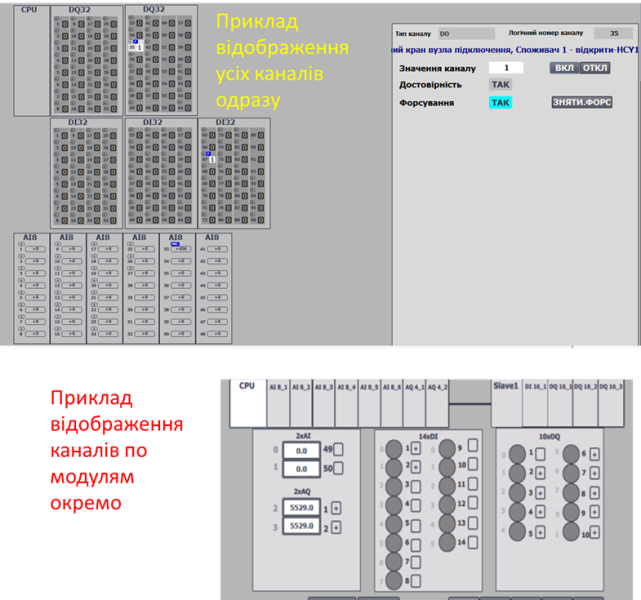

# Класи LVL0 

**(CLSID=16#000x – 16#07FF)**

## Загальний опис 
Найнижчий рівень модулів керування (**канали**) забезпечує абстрагування від конкретики пристроїв (ПЛК, розподілена периферія, тощо). Тобто реалізація цього рівня залежить як від вибраної платформи так і способу реалізації. Елементи CM типу «канали» представляють масиви усіх існуючих каналів контролеру, незалежно від їх розташування (локальне шасі, віддалений ввод/вивід) і задіяння (використання) в процесі. Кожен елемент масиву ідентифікується за унікальним номером, а прив'язка до фізичного каналу відбувається жорстко на програмному рівні. CM-ми типу «канал» прив'язують свої значення до фізичного значення конкретного каналу, а також виконують наступні функції:

-   надають діагностичну інформаціє вищим рівням CM -- як мінімум ознаку достовірності, а за можливості і причину відмови/несправності каналу;

-   передбачають режим форсування значення:

    -   примусова зміна значення вхідного каналу, незалежно від значення входу;

    -   примусова зміна значення вихідного каналу, незалежно від значення, що передається на нього змінною;

-   показують факт прив'язки до каналу технологічної змінної та номер змінної;

 У каркасі канали представлені 5-ма базовими класами:

- [CHDI](2_chdi.md) (CLSID=16#001x) – дискретні вхідні канали,
- [CHDO](2_chdo.md) (CLSID=16#002x) – дискретні вихідні канали,
- [CHAI](2_chai.md) (CLSID=16#003x) – аналогові вхідні канали,
- [CHAO](2_chao.md) (CLSID=16#004x) – аналогові вихідні канали,
- [CHCOM]() (CLSID=16\#005x) – комунікаційні канали:

Остання цифра уточнює клас. Рекомендація до використання номерів класів наведена в описі конкретного класу. 

## Рекомендації щодо використання в HMI

Мнемосхеми з відображенням стану каналів в каркасі звуться **картою ПЛК**. На карті ПЛК доступні функції відображення прив'язаного каналу, ознака достовірності, команди форсування. У випадку апаратної помилки канал підсвічується відповідним чином.

Для економії змінних рекомендується:

- використовувати одну буферну змінну `CH_BUF` на всі канали 
- використовувати клас [MODULS](2_moduls.md)

Для HMI важливо реалізувати карти ПЛК, тобто стан каналів модулів (значення, використання змінною, помилки каналів), навіть якщо вони не використовуються. Крім того нерідко потрібно форсувати значення якогось виходу, або швидко дізнатися, яка змінна використовує даний канал. Найбільш простий варіант вивести на засоби HMI скорочені змінні структуру типу `CH_HMI`. Однак кількість тегів, що потрібна для ПЛК великої канальності надзвичайно велика, тому проміжним варіантом є використання виведення інформації по групам каналів, наприклад по 16, або по модулям. Приклади обох варіантів показані на рис.2.5.  Це якраз і реалізується за допомогою класу  [MODULS](2_moduls.md)



_рис.2.5. Приклад відображення карт ПЛК_

## Структура класів CHDI/CHDO/CHAI/CHAO

Структура класу використовується для змінних всіх каналів. Канали з CLSID=16#00x0 призначені для каналів без специфічної діагностики, усі інші залежать від типу модуля і можуть мати свої діагностичні біти. 
### Структура CH_CFG

`adr` задається як зміщення в структурі в 16-бітних словах

| name | type | adr | bit | descr |
| ------- | ---- | ---- | ---- | ---- |
| ID      | UINT | 0 |      | Унікальний ідентифікатор - номер змінної. Кількість доступних каналів є останнім номером. Нумерація логічна, логіка нумерації вибирається при розробці проекту.ID = 0 зарезервований для помилкових операцій. Реальні канали нумеруються з 1. |
| CLSID   | UINT | 1 |      | - `CHDI` (CLSID=16#001x) – дискретні вхідні канали,- `CHDO` (CLSID=16#002x) – дискретні вихідні канали; - `CHAI` (CLSID=16#003x) – аналогові вхідні канали;- `CHAO` (CLSID=16#004x) – аналогові вихідні канали. |
| STA | UINT | 2 |  | Може бути набір біт типу `CH_STA` |
| VRAW | BOOL | 2 | 0 | для дискретного сигналу: - для `CHDI` значення з дискретного входу; - для `CHDO` значення на дискретний вихід; - в режимі `FRC=1` може змінюватися із-зовні для `CHDO`; для CHAI: `RAWINT>0`; для CHAO: `RAWINT>0` |
| VAL | BOOL | 2 | 1    | значення дискретного сигналу для CM верхнього рівня: - для `CHDI` об'єкт `DIVAR` зчитує його; - для `CHDO` об'єкт `DOVAR` записує в нього; - в режимі `FRC=1` може змінюватися із-зовні для `CHDI`; для CHAI: `CHCFG.VAL>0`; для CHAO: `CHCFG.VAL>0` |
| BAD | BOOL | 2 | 2 | = 1 – є якась помилка каналу (`BRK` або `SHRT` або інша) |
| b3 | BOOL |2|3|резерв|
| PNG | BOOL | 2 | 4 | = 1 – прийшов PING-запит від власника, обнуляється каналом (PONG-відповідь) |
| ULNK | BOOL | 2 | 5 | = 1 – якщо канал використовується в технологічній змінній (прив'язаний) DIVAR/AIVAR/DOVAR/AOVAR |
| MERR | BOOL | 2 | 6 | = 1 – є помилка на всьому модулі (діагностична інформація) |
| BRK | BOOL | 2 | 7 | = 1 – помилка обриву каналу |
| SHRT | BOOL | 2 | 8 | = 1 – помилка КЗ або перевантаження |
| NBD | BOOL | 2 | 9 | = 1 – фізично канал не існує; наприклад, для відображення в буфері модуля MODULS для HMI; якщо зручно використовувати неіснуючі канали для кратності адресації |
| STAb10 | BOOL | 2 | 10 | резерв |
| STAb11 | BOOL | 2 | 11 | резерв |
| INBUF | BOOL | 2 | 12 | = 1 – змінна `CH`завантажена в буфер `CH_BUF` |
| FRC | BOOL | 2 | 13 | = 1 – значення форсоване |
| SML | BOOL | 2 | 14 | = 1 – значення імітується (верхнім рівнем) |
| CMDLOAD | BOOL | 2 | 15 | =1 - запит на зчитування в буфер (тільки з HMI) |
| CMD | UINT | 3 |  | команда:16#1 - записати 1/MAX; 16#2 - записати 0/MIN;16#3 - для дискретних змінних: TOGGLE перемикання 0<->1; 16#3 - для аналогових змінних: MIDLE виставлення половини з діапазону MIN/MAX; 16#0100 - прочитати конфігурацію в буфер; 16#301 - форсувати один/усі об'єкти типу; 16#302 - дефорсувати один/усі об'єкти типу; 16#0300 - перемкнути форсування |
| VALI | INT | 4 |  | значення: - для `CHAI` значення з аналогового входу для `AIVAR`;- для `CHAO` значення на аналоговий вихід з `AOVAR`;- для `CHDI` = значенню `STA.VAL`;- для `CHDO` = значенню `STA.VAL` |
| VARID | UINT | 5 |  | ID прив'язаної технологічної змінної, 0 - якщо не прив'язана |
### Структура CH\_HMI
| name | type | adr  | bit  | descr                                                     |
| ---- | ---- | ---- | ---- | --------------------------------------------------------- |
| STA  | INT  | 0    |      | `STA`+`CMD` (біт `X15` – `CMDLOAD` - завантажити в буфер) |
| VAL  | INT  | 1    |      | значення `CH_CFG.VAL`                                     |

### Змінна CH_BUF
Тип `CH_BUF` за загальною структурою має такі ж поля як `CH_CFG`, але при використанні в структурі `STA` бітів, поля повинні бути приведені до INT.

## Загальні вимоги до функцій CH

### Функціональні вимоги 

- Ідентифікація каналів (ID) має йти в межах кожного класу. Кількість доступних каналів є останнім номером. Нумерація логічна, логіка нумерації вибирається при розробці проекту. ID = 0 зарезервований для помилкових операцій. Реальні канали нумеруються з 1.
- повинні відслідковуватися та бути реалізовані наступні команди
  - персональна команда з HMI: `STA.CMDLOAD`
  - команди: 
    - 1 - записати `TRUE` (тільки при форсуванні `CHDI/CHDO`)
    - 2 - записати `FALSE` (тільки при форсуванні `CHDI/CHDO`)
    - 3 - `TOOGLE` - змінити на інвертоване значення (тільки при форсуванні `CHDI/CHDO`)
    - 16#0100 - прочитати конфігурацію в буфер (зв'язати з буфером)    
  - широкомовні команди PLC: 
    - дефорсувати всі канали 16#4302 
- Повинна бути реалізована функція роботи з буфером.
  - Буфер рекомендується використовувати один для всіх (за винятком хіба що `CHCOM`).
  - Факт зайнятості буфера перевіряється за рівністю класу `CLSID` та `ID`
  - конфігурація канала повинна зчитуватися в буфер при отриманні команд:
    - біті статусу `STA.CMDLOAD=TRUE`
    - `CFG.CMD` = 16#0100; 
  - при захопленні буферу:
    - `CH_BUF.STA = CH_CFG.STA`
    - `CH_CFG.CMD = CH_BUF.CMD`  якщо той не дорівнює нулю (для можливості команд з іншого джерела)
    - в режимі форсування `CH_CFG.VAL=CH_BUF.VAL` 
    - в режимі нефорсування `CH_BUF.VAL = CH_CFG.VAL` 
- Канал повинен приймати участь в прив'язуванні до технологічної змінної
  - факт прив'язаності контролюється алгоритмом PING-PONG (див. опис нижче)
  - `VARID` вказує на ідентифікатор змінної, яка прив'язана до каналу
  - контроль та керування прив'язаності реалізовано в технологічних змінних xxVAR
- мають підтримуватися два режими: форсований та нефорсований (нормальний)
  - режим форсування повинен відображатися в загальному статусному біті `FRC`
  - у нормальному (нефорсованому) режимі:
    - `CHDI`, `CHAI`: значення на технологічну змінну береться з входу функції `RAW`
    - `CHDO`, `CHAO`: значення на вихід функції `RAW` береться з прив'язаної вихідної технологічної змінної  
  - у форсованому режимі:
    - `CHDI`, `CHAI`: прив'язана вхідна технологічна змінна (`AIVAR`, `DIVAR`) повинна отримувати форсоване значення зі змінної `CH_BUF.VAL`, при умові знаходження в буфері, у протилежному випадку, значення не змінюється з попереднього стану
    - `CHDO`, `CHAO `: вихід `RAW` повинен отримувати форсоване значення зі змінної `CH_BUF.VAL` а не з технологічної змінної, при умові знаходження в буфері, у протилежному випадку, значення не змінюється з попереднього стану
    - загальна змінна `PLC_CFG.CNTFRC` повинна збільшуватися на 1
  
- принаймні один біт якості `CHCFG.BAD` повинен оновлюватися відповідно до стану каналу, інші біти реалізовуються за можливості та необхідності 

### Вимоги щодо реалізації інтерфейсу

- IN
  - CHDI - значення з входів контролера `RAW`
  - CHAI - значення з аналогових входів контролера `RAWINT`
- INOUT
  - CHDO- значення на виходи контролера `RAW`
  - CHAO - значення на аналогові виходи контролера `RAWINT` (обов'язково з прив'язкою до реальної змінної)
  - `CHCFG`
  - `CHHMI`
  - за умови, що немає можливості доступатися до зовнішніх змінних з середини функцій, передається `PLC_CFG`; альтернативно можна використовувати інші інтерфейси для використання в середині `PLC_CFG` 

### Вимоги щодо реалізації програми користувача

- Функції обробки каналів повинні викликатися з кожним викликом тієї задачі, до якого вони прив'язані.
- при першому старті (`PLC_CFG.SCN1`) повинна ініціалізуватися кількість каналів, 

```pascal
PLCFN1(PLC_CFG);
IF PLC_CFG.STA.SCN1 THEN
    PLC.DICNT := 32;
    PLC.DOCNT := 32;
    PLC.AICNT := 10;
    PLC.AOCNT := 6;
END_IF;
```

- POU в якій викликаються функції обробки каналів повинна містити умову ініціалізації по першому старту, наприклад з прив'язкою до умови `PLC_CFG.SCN1`, при якій
  - змінним видаються ідентифікатори та класи за замовчуванням, якщо вони дорівнюють нулю
  - каналам, які використовуються для вирівнювання адрес (не існуючі) повинна видаватися ознака `STA.NBD=TRUE`
- ​     

### Алгоритм PING-PONG

Каркас передбачає гнучку прив'язку технологічних змінних до каналів. Для зручності визначення вільних каналів на карті ПЛК, канал повинен контролювати факт прив'язки (задіяння) та знати яка саме змінна ним користується. Факт задіяння сигналізується в біті ULNK (Uplink). Цей біт переприсвоює значення біту PNG (Ping-запит) на початку функції CH_FN, після чого PNG:= FALSE (Pong-відповідь). Технологічна змінна, що використовує канал (**володар**) з кожним викликом VAR_FN виставляє CH_CFG.STA.PNG:=TRUE (Ping-запит) та вказує свій ID (CH_CFG.VARID:=VAR_CFG.ID). Таким чином, якщо жодна змінна не заволодіває каналом, значення PNG, а за ним і значення ULNK для цього каналу стає рівним FALSE. Алгоритм отримав робочу назву "Пінг-Понг".

## Тестування CHx_FN 

Цей пункт описує методику перевірки функцій характерних для всіх `CHDIFN`, `CHAIFN`, `CHDOFN`, `CHAOFN` в ручному та/або автоматизованому режимі. 

### Перелік тестів

| Номер | Назва                                                      | Коли перевіряти          | Примітки |
| ----- | ---------------------------------------------------------- | ------------------------ | -------- |
| 1     | присвоєння ID та CLSID при старті                          | після реалізації функції |          |
| 2     | команди прив'язування до буферу                            |                          |          |
| 3     | робота в нефорсованому режимі                              |                          |          |
| 4     | робота в режимі форсування                                 |                          |          |
| 5     | пінг-понг                                                  |                          |          |
| 6     | відправка широкомовних команд на форсування і дефорсування |                          |          |
| 7     | Перевірка режиму імітації                                  |                          |          |

### 1   Присвоєння ID та CLSID при старті

- перед запуском перевірки ПЛК повинен бути в СТОП
- після запуску усім каналам, використаним в програмі повинні бути присвоєні ID та CLSID

### 2   Команди прив'язування до буферу

| Номер кроку | Дія для перевірки                                           | Очікуваний результат                                         | Примітки |
| ----------- | ----------------------------------------------------------- | ------------------------------------------------------------ | -------- |
| 1           | змінити STA.X15=1 для однієї зі змінних CH_HMI              | у CHBUF повинно завантажитися весь зміст CH_CFG<br />для CH_HMI повинен STA.X15 = 0 <br />для CH_HMI, CH_CFG та CH_BUF повине STA.12(INBUF)=1 |          |
| 2           | змінити значення змінної (наприклад для DICH - вхідної RAW) | відповідне значення зміниться у CH_HMI, CH_CFG та CH_BUF     |          |
| 3           | змінити STA.X15=1 для іншої змінної CH_HMI                  | у CHBUF повинно завантажитися весь зміст CH_CFG іншої змінної |          |
| 4           | повторити п.1 командою CH_CFG.CMD=16#100                    |                                                              |          |

### 3 Робота в нефорсованому режимі

Перевірка значень повинно проходити як для CH_HMI, CH_CFG так і  CH_BUF

| Номер кроку | Дія для перевірки                                           | Очікуваний результат                                         | Примітки                              |
| ----------- | ----------------------------------------------------------- | ------------------------------------------------------------ | ------------------------------------- |
| 1           | прив'язати тестову змінну до буферу                         | у CHBUF повинно завантажитися весь зміст CH_CFG              |                                       |
| 2           | змінити значення змінної (наприклад для DICH - вхідної RAW) | для CH_HMI, CH_CFG та CH_BUF повинне змінитися плинне значення змінної і значення сирої змінної (для `CHDI` і `CHDO`) | див деталі в тестах конкретного класу |
| 3           | повторити п.2 з іншим значенням                             |                                                              |                                       |

### 4 Робота в режимі форсування

Перевірка значень повинно проходити як для CH_HMI, CH_CFG так і  CH_BUF

| Номер кроку | Дія для перевірки                                            | Очікуваний результат                                         | Примітки                                                     |
| ----------- | ------------------------------------------------------------ | ------------------------------------------------------------ | ------------------------------------------------------------ |
| 1           | прив'язати тестову змінну до буферу                          | у CHBUF повинно завантажитися весь зміст CH_CFG              |                                                              |
| 2           | змінити значення вхідної величини на 0                       | значення повинно змінитися як в тесті 3                      | вхідна величина для DICH. AICH - `RAW` , для DOCH, AOCH - `VAL` |
| 3           | відправити команду форсування CHBUF.CMD=16#301               | біт FRC повинен дорівнювати 1                                |                                                              |
| 4           | змінити значення вхідної величини                            | значення вихідної величини повинно залишитися без змін       | вхідна величина для DICH. AICH - `RAW` , для DOCH, AOCH - `VAL` |
| 5           | відправити команду 16#1 (записати 1/MAX)                     | значення повинно змінитися на 1/MAX                          |                                                              |
| 6           | відправити команду 16#2 (записати 0/MIN)                     | значення повинно змінитися на 0/MIN                          |                                                              |
| 7           | відправити команду 16#3 (TOGGLE)                             | значення повинно змінитися на протилежне                     |                                                              |
| 8           | змінити значення `CHBUF.VAL`                                 | значення повинно змінитися на вказане                        | для дискретних, все що більше 0 дорвінює 1                   |
| 9           | відправити команду дефорсування CHBUF.CMD=16#302             | біт FRC повинен дорівнювати 0                                |                                                              |
| 10          | відправити команду перемикання форсування 16#0300, повторити кілька разів, залишити в режимі форсування | біт FRC повинен перемкнутися на протилежне                   |                                                              |
| 11          | перевести в режим форсування кілька змінних                  | біт FRC відповідних змінних повинен дорівнювати 1            |                                                              |
| 12          | перевірити значення змінних PLC.STA_PERM і PLC.CNTFRC_PERM   | повинні PLC.STA_PERM.X13=1,  PLC.CNTFRC_PERM дорівнювати кількості зафорсованих змінних |                                                              |
| 13          | зняти з режиму форсування усі змінні                         | повинні PLC.STA_PERM.X13=0,  PLC.CNTFRC_PERM=0               |                                                              |

### 5 Перевірка пінг-понг

- для запуску тесту використовується змінна, наприклад для `CHDI`  `TST_CHDIPNGON`
- номер каналу задається  `TST_CHDIPNGID`
- після виклику функцій обробника каналів застосовується виклик тестової функції, в якій йде зміна значення одного з `CH_CFG.PNG` 

```pascal
IF TST_CHDIPNGON THEN
    CHDI[TST_CHDIPNGID].STA.PNG := true;
    CHDI[TST_CHDIPNGID].VARID := TST_CHDIPNGID;
END_IF;
```

| Номер кроку | Дія для перевірки                                            | Очікуваний результат                                         | Примітки |
| ----------- | ------------------------------------------------------------ | ------------------------------------------------------------ | -------- |
| 1           | записати якесь значення  в `CH_CFG.VARID`                    | повинно обнулитися, так як змінна не прив'язані              |          |
| 2           | задати значення `TST_CHDIPNGID` в межах існуючих каналів, задати `TST_CHDIPNGON=TRUE` | для вказаної змінної:`CH_CFG.VARID` повинен дорівнювати вказаному значенню, повинен `CH_CFG.ULNK=TRUE` |          |
| 3           | змінити значення `TST_CHDIPNGID` в межах існуючих каналів, задати `TST_CHDIPNGON=TRUE` | попередній канал повинен обнулити `CH_CFG.VARID` і`CH_CFG.ULNK` для вказаного каналу повинен бути результат як в кроці 2 |          |
| 4           | задати `TST_CHDIPNGON=false`                                 | попередній канал повинен обнулити `CH_CFG.VARID` і`CH_CFG.ULNK` |          |

### 6 Відправка широкомовних команд на форсування і дефорсування

| Номер кроку | Дія для перевірки                                            | Очікуваний результат                                         | Примітки |
| ----------- | ------------------------------------------------------------ | ------------------------------------------------------------ | -------- |
| 1           | відправити широкомовну команду на форсування усіх змінних PLC.CMD=16#4301 | біт FRC усіх змінних повинен дорівнювати 1, PLC.CNTFRC_PERM=кількості змінних |          |
| 2           | відправити широкомовну команду на дефорсування усіх змінних PLC.CMD=16#4302 | біт FRC усіх змінних повинен дорівнювати 0, PLC.CNTFRC_PERM=0 |          |