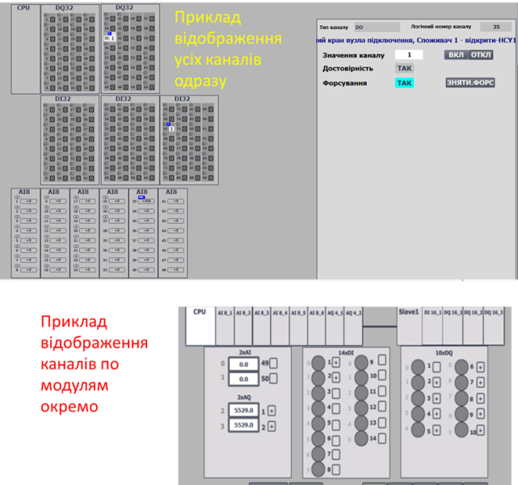

# LVL0 Classes

**(CLSID = 16#000x – 16#07FF)**

## General Description

The lowest level of control modules (**channels**) provides **abstraction from specific hardware (PLC, distributed I/O, etc.)**. The implementation of this level depends on both the selected platform and the implementation approach. CM elements of the “channel” type represent arrays of all available controller channels, regardless of their location (local rack, remote I/O) or whether they are actively used in the process. Each array element is identified by a **unique number**, and the binding to the physical channel is strictly implemented at the software level. Channel-type CMs bind their values to the physical value of a specific channel and perform the following functions:

- Provide **diagnostic information** to higher-level CMs, at minimum indicating data validity, and when possible, the reason for channel fault/error.
- Support **forced value modes**:
  - Forced change of input channel value regardless of physical input.
  - Forced change of output channel value regardless of the value provided by the variable.
- Show the **link status to a process variable** and the variable’s ID.

Within the framework, channels are represented by **five base classes**:

- [CHDI](2_chdi_EN.md) (CLSID=16#001x) – digital input channels
- [CHDO](2_chdo_EN.md) (CLSID=16#002x) – digital output channels
- [CHAI](2_chai_EN.md) (CLSID=16#003x) – analog input channels
- [CHAO](2_chao_EN.md) (CLSID=16#004x) – analog output channels
- CHCOM (CLSID=16\#005x) – communication channels (general)

Additionally, **network channels** can be used when dynamic binding of process variables to channels is required. Network channels are processed by the same functions as base channels, with the raw value sourced from the communication exchange variable. This approach allows runtime switching from a network channel to a local channel without changes to the process variable or program structure.

- CHNDI (CLSID = 16#006x) – digital input network channels
- CHNDO (CLSID = 16#007x) – digital output network channels
- CHNAI (CLSID = 16#008x) – analog input network channels
- CHNAO (CLSID = 16#009x) – analog output network channels

The last digit further specifies the class. Recommended class number usage is provided in each specific class description.

## HMI Usage Recommendations

Mimic diagrams displaying channel status within the framework are called **PLC Maps**. These maps provide functions to display linked channels, validity indication, and forcing commands. Channels are highlighted in the event of hardware errors.

To optimize variable usage, it is recommended to:

- Use a **single buffer variable `CH_BUF`** for all channels.
- Use the [MODULES](2_moduls_EN.md) class.

For HMI, it is essential to implement PLC maps displaying channel statuses (values, variable usage, channel errors) even if not used in all cases. Forcing outputs or quickly identifying which variable uses a channel is often required. A simple approach is to display a shortened `CH_HMI` structure in the HMI, but the tag count for large PLC systems becomes significant. A practical alternative is **grouping channel information by 16 or by modules** for display. Examples are shown in Fig. 2.5, implemented using the MODULES class.



*Fig. 2.5. Example PLC map display*

## Structure of CHDI/CHDO/CHAI/CHAO Classes

The **class structure** is used for variables of all channels. Channels with `CLSID = 16#00x0` are intended for channels without specific diagnostics; all others depend on the module type and may include additional diagnostic bits.

### CH_CFG Structure

`adr` indicates the offset in the structure in 16-bit words.

| name         | type | adr  | bit  | descr                                                        |
| ------------ | ---- | ---- | ---- | ------------------------------------------------------------ |
| **ID**       | UINT | 0    |      | Unique identifier - variable number. The number of available channels equals the highest number. Numbering is logical and defined during project design. `ID = 0` is reserved for error operations; real channels are numbered starting from 1. |
| **CLSID**    | UINT | 1    |      | - `CHDI` (CLSID=16#001x): digital input channels- `CHDO` (CLSID=16#002x): digital output channels- `CHAI` (CLSID=16#003x): analog input channels- `CHAO` (CLSID=16#004x): analog output channels |
| **STA**      | UINT | 2    |      | May be a `CH_STA` bit set                                    |
| **VRAW**     | BOOL | 2    | 0    | For digital signals:- `CHDI`: value from digital input- `CHDO`: value to digital output- In `FRC=1` mode, can be modified externally for `CHDO`- `CHAI`: `RAWINT>0`- `CHAO`: `RAWINT>0` |
| **VALB**     | BOOL | 2    | 1    | Digital signal value for higher-level CM:- `CHDI`: read by `DIVAR`- `CHDO`: written by `DOVAR`- In `FRC=1` mode, can be modified externally for `CHDI`- `CHAI`: `CHCFG.VAL>0`- `CHAO`: `CHCFG.VAL>0` |
| **BAD**      | BOOL | 2    | 2    | =1 – channel fault (`BRK`, `SHRT`, or other)                 |
| **b3**       | BOOL | 2    | 3    | reserved                                                     |
| **PNG**      | BOOL | 2    | 4    | =1 – PING request received from owner, cleared by channel (PONG response) |
| **ULNK**     | BOOL | 2    | 5    | =1 – channel used by a process variable (linked) `DIVAR/AIVAR/DOVAR/AOVAR` |
| **MERR**     | BOOL | 2    | 6    | =1 – module-wide error (diagnostic information)              |
| **BRK**      | BOOL | 2    | 7    | =1 – channel break fault                                     |
| **SHRT**     | BOOL | 2    | 8    | =1 – short circuit or overload fault                         |
| **NBD**      | BOOL | 2    | 9    | =1 – channel does not physically exist; used for HMI visualization in `MODULS` buffer or when non-existent channels simplify addressing alignment |
| **b10**      | BOOL | 2    | 10   | reserved                                                     |
| **INIOTBUF** | BOOL | 2    | 11   | =1 – `CH` variable loaded into IoT buffer `CH_BUF`           |
| **INBUF**    | BOOL | 2    | 12   | =1 – `CH` variable loaded into buffer `CH_BUF`               |
| **FRC**      | BOOL | 2    | 13   | =1 – value is forced                                         |
| **SML**      | BOOL | 2    | 14   | =1 – value is simulated (by higher level)                    |
| **CMDLOAD**  | BOOL | 2    | 15   | =1 – request to load into buffer (HMI only)                  |
| **CMD**      | UINT | 3    |      | Command:- 16#0001: write 1/MAX- 16#0002: write 0/MIN- 16#0003: toggle 0<->1 for digital, set to MID for analog- 16#0100: read configuration to buffer- 16#0300: toggle forcing- 16#0301: enable forcing- 16#0302: disable forcing |
| **VAL**      | INT  | 4    |      | Value:- `CHAI`: analog input value for `AIVAR`- `CHAO`: analog output value from `AOVAR`- `CHDI` = `STA.VAL`- `CHDO` = `STA.VAL` |
| **VARID**    | UINT | 5    |      | ID of the linked process variable, 0 if unlinked             |

### CH_HMI Structure

| name    | type | adr  | bit  | descr                                                        |
| ------- | ---- | ---- | ---- | ------------------------------------------------------------ |
| **STA** | INT  | 0    |      | `STA` + `CMD` (bit `X15` = `CMDLOAD` for loading into buffer) |
| **VAL** | INT  | 1    |      | Value from `CH_CFG.VAL`                                      |

### CH_BUF Variable

The `CH_BUF` type follows the same general structure as `CH_CFG`. However, when using bit fields within the `STA` structure, the fields should be converted to `INT` for consistency.

## General Requirements for CH Functions

### Functional Requirements

- **Channel identification (ID)** must be unique within each class. The total number of available channels is determined by the highest assigned number. Numbering is logical and defined during project development. `ID = 0` is reserved for error operations; real channels are numbered starting from 1.
- The following **commands must be monitored and implemented**:
  - Personal command from HMI: `STA.CMDLOAD`
  - Commands:
    - 16#0001 – write `TRUE` (only when forcing `CHDI/CHDO`)
    - 16#0002 – write `FALSE` (only when forcing `CHDI/CHDO`)
    - 16#0003 – `TOGGLE` – invert the current value (only when forcing `CHDI/CHDO`)
    - 16#0100 – read configuration into the buffer (link to buffer)
  - Broadcast PLC commands:
    - Unforce all channels: 16#4302
- A **buffer management function must be implemented**:
  - A single buffer is recommended for all channels (except possibly `CHCOM`).
  - Buffer occupancy is checked by matching `CLSID` and `ID`.
  - Channel configuration should be read into the buffer upon receiving:
    - Status bit `STA.CMDLOAD = TRUE`
    - `CFG.CMD = 16#0100`
  - Upon buffer acquisition:
    - `CH_BUF.STA = CH_CFG.STA`
    - `CH_CFG.CMD = CH_BUF.CMD` if not zero (allowing commands from other sources)
    - In force mode: `CH_CFG.VAL = CH_BUF.VAL`
    - In normal mode: `CH_BUF.VAL = CH_CFG.VAL`
- The channel must **participate in binding to a process variable**:
  - Binding status is managed using the **PING-PONG algorithm** (see below).
  - `VARID` indicates the ID of the variable linked to the channel.
  - Control and management of binding are handled by process variables (xxVAR).
- **Support for two modes**: forced and normal (non-forced):
  - Force mode status must reflect in the general status bit `FRC`.
  - In **normal mode**:
    - `CHDI`, `CHAI`: the value for the process variable is taken from the `RAW` input.
    - `CHDO`, `CHAO`: the `RAW` output value is taken from the linked output process variable.
  - In **forced mode**:
    - `CHDI`, `CHAI`: the linked input process variable (`AIVAR`, `DIVAR`) should receive the forced value from `CH_BUF.VAL` if the channel is in the buffer; otherwise, it retains the previous value.
    - `CHDO`, `CHAO`: the `RAW` output should receive the forced value from `CH_BUF.VAL` instead of the process variable if the channel is in the buffer; otherwise, it retains the previous value.
    - The global variable `PLC_CFG.CNTFRC` should increment by 1.
- At least the quality bit `CHCFG.BAD` should update according to the channel state. Other bits can be implemented as needed.

### Interface Implementation Requirements

- **IN:**
  - `CHDI`: value from the controller’s digital inputs (`RAW`)
  - `CHAI`: value from the controller’s analog inputs (`RAWINT`)
- **INOUT:**
  - `CHDO`: value to the controller’s digital outputs (`RAW`)
  - `CHAO`: value to the controller’s analog outputs (`RAWINT`) (must link to an actual variable)
  - `CHCFG`
  - `CHHMI`
  - If internal functions cannot access external variables, `PLC_CFG` should be passed; alternatively, other interfaces within `PLC_CFG` can be used.

### User Program Implementation Requirements

- Channel processing functions **must be called in every cycle of the task they are linked to**.
- On first startup (`PLC_CFG.SCN1`), the channel counts should be initialized:

```pascal
PLCFN1(PLC_CFG);
IF PLC_CFG.STA.SCN1 THEN
    PLC.DICNT := 32;
    PLC.DOCNT := 32;
    PLC.AICNT := 10;
    PLC.AOCNT := 6;
END_IF;
```

- The POU calling channel processing functions should contain an initialization condition on first startup using `PLC_CFG.SCN1`, during which:
  - Variables are assigned default IDs and classes if they are zero.
  - Channels used for address alignment (non-existent channels) should have `STA.NBD = TRUE`.

### PING-PONG Algorithm

The framework supports **flexible binding of process variables to channels**. For easy identification of available channels on the PLC map, each channel should monitor its binding status (usage) and know which variable is using it. Binding status is indicated by the `ULNK` (Uplink) bit.

This bit inherits the `PNG` (Ping request) bit at the start of the `CH_FN` function, after which `PNG` is reset to `FALSE` (Pong response). The **process variable (owner)** using the channel sets `CH_CFG.STA.PNG := TRUE` on each call of `VAR_FN` and assigns its ID to `CH_CFG.VARID := VAR_CFG.ID`.

Thus, if no variable claims the channel, the `PNG` value, and subsequently the `ULNK` value, for the channel will become `FALSE`. This mechanism is referred to as the **“Ping-Pong” algorithm**.

## Testing `CHx_FN`

This section describes the **manual and/or automated testing methodology** for functions typical for all `CHDIFN`, `CHAIFN`, `CHDOFN`, and `CHAOFN`.

### Test List

| No.  | Name                                     | When to test                  | Notes |
| ---- | ---------------------------------------- | ----------------------------- | ----- |
| 1    | ID and CLSID assignment at startup       | After function implementation |       |
| 2    | Buffer binding commands                  | After function implementation |       |
| 3    | Operation in non-forced mode             | After function implementation |       |
| 4    | Operation in forced mode                 | After function implementation |       |
| 5    | Ping-Pong                                |                               |       |
| 6    | Sending broadcast force/unforce commands |                               |       |
| 7    | Simulation mode check                    |                               |       |
| 8    |                                          |                               |       |

### 1. ID and CLSID Assignment at Startup

- Before testing, the PLC should be in STOP.
- After startup, all channels used in the program should receive assigned IDs and CLSIDs.

### 2. Buffer Binding Commands

| Step | Action                                              | Expected Result                                              | Notes |
| ---- | --------------------------------------------------- | ------------------------------------------------------------ | ----- |
| 1    | Set `STA.X15 = 1` for one of the `CH_HMI` variables | The entire `CH_CFG` content should load into `CHBUF`. `CH_HMI` should reset `STA.X15 = 0`.`STA.12 (INBUF)` should be `1` in `CH_HMI`, `CH_CFG`, and `CHBUF`. |       |
| 2    | Change a variable value (e.g., `DICH` input `RAW`)  | The corresponding value updates in `CH_HMI`, `CH_CFG`, and `CHBUF`. |       |
| 3    | Set `STA.X15 = 1` for another `CH_HMI` variable     | The `CH_CFG` content of the other variable should load into `CHBUF`. |       |
| 4    | Repeat step 1 using `CH_CFG.CMD = 16#100`           | Same as step 1; after loading, `CH_CFG.CMD` should reset to `0`. |       |

### 3. Operation in Non-Forced Mode

Tests should verify values in `CH_HMI`, `CH_CFG`, and `CH_BUF`.

| Step | Action                                           | Expected Result                                              | Notes                    |
| ---- | ------------------------------------------------ | ------------------------------------------------------------ | ------------------------ |
| 1    | Bind a test variable to the buffer               | The entire `CH_CFG` content should load into `CHBUF`.        |                          |
| 2    | Change variable value (e.g., `DICH` input `RAW`) | Live and raw values should update in `CH_HMI`, `CH_CFG`, and `CH_BUF` (for `CHDI` and `CHDO`). | See class-specific tests |
| 3    | Repeat step 2 with a different value             |                                                              |                          |

### 4. Operation in Forced Mode

Tests should verify values in `CH_HMI`, `CH_CFG`, and `CH_BUF`.

| Step | Action                                                       | Expected Result                                              | Notes                                                      |
| ---- | ------------------------------------------------------------ | ------------------------------------------------------------ | ---------------------------------------------------------- |
| 1    | Bind a test variable to the buffer                           | The entire `CH_CFG` content should load into `CHBUF`.        |                                                            |
| 2    | Change input value to `0`                                    | Value changes as in Test 3.                                  | Input: `RAW` for `DICH`, `AICH`; `VAL` for `DOCH`, `AOCH`. |
| 3    | Send force command `CHBUF.CMD = 16#0301`                     | `FRC` bit should be `1`.                                     |                                                            |
| 4    | Change input value                                           | Output value should remain unchanged.                        | Same as step 2.                                            |
| 5    | Send command `16#0001` (write 1/MAX)                         | Value changes to `1/MAX`.                                    |                                                            |
| 6    | Send command `16#0002` (write 0/MIN)                         | Value changes to `0/MIN`.                                    |                                                            |
| 7    | Send command `16#0003` (TOGGLE/set to mid-range)             | Value toggles or sets to mid-range.                          |                                                            |
| 8    | Change `CHBUF.VAL`                                           | Value changes to the specified value (`>0` → `1` for digital). |                                                            |
| 9    | Send unforce command `CHBUF.CMD = 16#0302`                   | `FRC` bit should reset to `0`.                               |                                                            |
| 10   | Send toggle force command `16#0300` repeatedly, ending in force mode | `FRC` bit should toggle accordingly.                         |                                                            |
| 11   | Force multiple variables                                     | `FRC` bit of those variables should be `1`.                  |                                                            |
| 12   | Check `PLC.STA_PERM` and `PLC.CNTFRC_PERM` values            | `PLC.STA_PERM.X13 = 1`; `PLC.CNTFRC_PERM` equals the number of forced variables. |                                                            |
| 13   | Unforce all variables                                        | `PLC.STA_PERM.X13 = 0`; `PLC.CNTFRC_PERM = 0`.               |                                                            |

### 5. Ping-Pong Check

- Use a test variable, e.g., `TST_CHDIPNGON` for `CHDI`.
- Set the channel number using `TST_CHDIPNGID`.
- After calling the channel handler functions, call the test function to modify `CH_CFG.PNG`:

```pascal
IF TST_CHDIPNGON THEN
    CHDI[TST_CHDIPNGID].STA.PNG := true;
    CHDI[TST_CHDIPNGID].VARID := TST_CHDIPNGID;
END_IF;
```

| Step | Action                                                       | Expected Result                                              | Notes |
| ---- | ------------------------------------------------------------ | ------------------------------------------------------------ | ----- |
| 1    | Write a value to `CH_CFG.VARID`                              | Should reset, as the variable is unlinked.                   |       |
| 2    | Set `TST_CHDIPNGID` to a valid channel, `TST_CHDIPNGON = TRUE` | `CH_CFG.VARID` and `CH_CFG.ULNK` should reflect the set value and show `TRUE`. |       |
| 3    | Change `TST_CHDIPNGID` to another valid channel, `TST_CHDIPNGON = TRUE` | Previous channel resets `CH_CFG.VARID` and `ULNK`, new channel shows values as in step 2. |       |
| 4    | Set `TST_CHDIPNGON = FALSE`                                  | Previous channel resets `CH_CFG.VARID` and `ULNK`.           |       |

### 6. Sending Broadcast Force/Unforce Commands

| Step | Action                                             | Expected Result                                              | Notes |
| ---- | -------------------------------------------------- | ------------------------------------------------------------ | ----- |
| 1    | Send broadcast force command `PLC.CMD = 16#4301`   | `FRC` bit of all variables becomes `1`, `PLC.CNTFRC_PERM` equals the number of variables. |       |
| 2    | Send broadcast unforce command `PLC.CMD = 16#4302` | `FRC` bit of all variables becomes `0`, `PLC.CNTFRC_PERM = 0`. |       |

