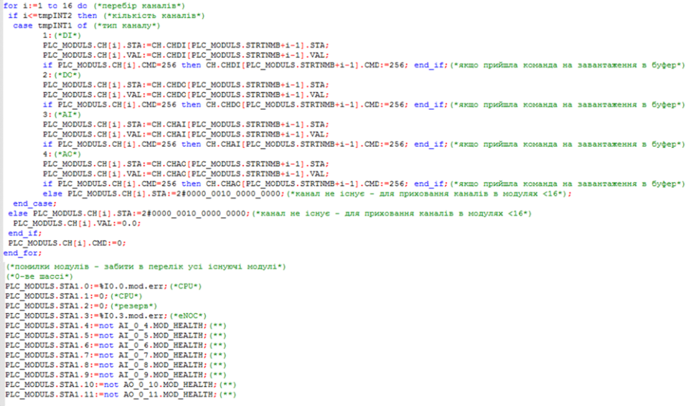

# Клас MODULS

**CLSID=16#220x**

to-do

2.2.3. Приклад групування каналів для відображення на карті ПЛК

Нижче описаний один з варіантів реалізації роботи з групою каналів. Функції, які реалізовуються:
- постійний контроль стану (відображення) помилки каналів (хоча б одного) на модулях
- вибір групи каналу для відображення (у даному прикладі групою по 16)
-  відображення стану каналів вибраної групи, відповідно до даних з структури CH_HMI
-  завантаження в буфер будь якого каналу з групи
-  робота з каналом через буфер (форсування, зміна значення)

Приклад структури:
#### Структура MODULS
| Атрибут | Тип                        | Опис                                                         |
| ------- | -------------------------- | ------------------------------------------------------------ |
| ID      | UINT                       | Унікальний ідентифікатор, наприклад для ідентифікації PLC    |
| CLSID   | UINT                       | 16#220x                                                      |
| STRTNMB | UINT                       | номер початкового каналу для відображення                    |
| CNT     | UINT                       | LOBYTE: кількість каналів (залежить від модуля), не більше 16   HIBYTE: тип каналу (1- DICH, 2- DOCH, 3- AICH, 4 – AOCH) |
| CH      | ARRAY \[1 to 16\] of CHHMI | значення відповідно до CH\_HMI                               |
| STA1    | INT                        | стани BAD модулів 1 (16 шт)                                  |
| STA2    | INT                        | стани BAD модулів 2 (16 шт)                                  |
| ...     |                            |                                                              |
| STAn    | INT                        | стани BAD модулів 3 (16 шт)                                  |

_рис.2.6. Приклад групування каналів для відображення на карті ПЛК_

