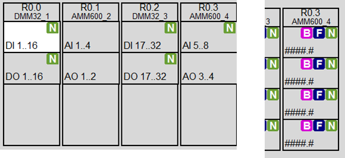

# Клас MODULES

## Загальний опис

Для HMI важливо реалізувати так звані карти ПЛК (PLC MAP), в яких показується стан каналів модулів (значення, використання змінною, помилки каналів), навіть якщо ці канали не використовуються в технологічних змінних. Це дає можливість візуально спостерігати за каналами модуля, за необхідності форсувати значення якогось входу/виходу, дізнатися про використання змінною конкретного каналу, подивитися на бюджет вільних каналів. Наявність таких об'єктів, як канали `CH_CFG/CH_HMI` дає можливість отримати цю інформацію та керувати каналами. Найбільш простим варіантом є виведення на засоби HMI скорочені змінні структуру типу `CH_HMI` та буферу `CH_BUF`. Однак навіть при цьому кількість тегів, що потрібна для реалізації цього в ПЛК великої канальності є надзвичайно великою, що робить рішення в лоб непрактичним. Щоб не втрачати таку можливість налагодження і при цьому не витрачати велику кількість ресурсів SCADA/HMI пропонується проміжний варіант з використання виведення інформації по групам каналів, об'єднаних в окремі об'єкти - модулі та підмодулі. Приклади обох варіантів (без групування та з групуванням) показані на рисунку нижче.


рис. Приклад відображення карт ПЛК

Використання класичного підходу наладки об'єктів каркасу через буфер, тобто в парі `CH_HMI` та `CH_BUF` залишається актуальним і не має особливостей. У даному розділі розглядаються додаткові об'єкти (модуль та підмодуль), які призначені для економії ресурсів SCADA/HMI та комунікацій.   

Нижче описаний один з варіантів реалізації роботи з групою каналів. Функції, які реалізовуються:

- постійний контроль стану (відображення) помилки каналів (хоча б одного) на модулях
- вибір групи каналу для відображення ("підмодуль" - група по 16 каналів)
-  відображення стану каналів вибраної групи, відповідно до даних з структури `CH_HMI`
-  завантаження в буфер будь якого каналу з групи
-  робота з каналом через буфер (форсування, зміна значення)


## Структура класу Module та змінні Modules

У ідеальному варіанті, **MODULE** (модуль) представляє фізичний модуль на ПЛК, що може мати до 4-х груп каналів, які представлені у вигляді Submodule (підмодуль).  Кожен підмодуль має позицію в модулі (від 1-го до 4) і може містити до 16 каналів одного типу (AI, DI, AO, DO, COM або інших), тому підмодуль має тип відповідно до типу каналів, за які він відповідає. У межах модуля підмодулі можуть бути різного типу, тому модуль може містити до 64 каналів різного типу (до 4-х, кожного по 16 або менше). Таким чином структура модуль-підмодуль дає можливість представляти різні комбінації каналів, наприклад: 16DI+16DO+16AI+16AO, або 64DI і т.п.

Якщо в архітектурі ПЛК фізично модулі можуть містити більше каналів або більше типів підмодулів, то в каркасі їх необхідно представляти кількома модулями. Альтернативо є змінення наведених нижче структур, що виходить за рамки каркасу. 

Для зручності обслуговування, каркас передбачає наявність пустих модулів (заглушок), які містять як мінімум один підмодуль заглушку на першому місці (при цьому інші підмодулі відсутні).       

Тип Module:

| name    | type                | adr  | bit  | descr                                                        |
| ------- | ------------------- | ---- | ---- | ------------------------------------------------------------ |
| STA     | INT                 | 0    |      | стан/команда модуля для HMI:<br /> xxxx_xxxx_xxxx_1111 - останні 4 біти відповідають за BAD конкретного субмодуля;<br /> xxxx_xxxx_1111_xxxx - конкретний підмодуль в буфері; <br />xxxx_1111_xxxx_xxxx - команда завантаження конкретного підмодуля в буфер; <br />1111_xxxx_xxxx_xxxx - конкретний підмодуль в буфері IoT (тільки для рішень з IoT); |
| TYPE    | UINT                | 1    |      | типи Submodule, комбінація в 16-ковому форматі - 1  (`16#XYZQ` X - для першого підмодуля): <br />0-відсутній, <br />1- DICH, <br />2- DOCH, <br />3- AICH, <br />4 – AOCH, <br />5 - COM, <br />6-NDICH, <br />7-NDOCH, <br />8-NAICH, <br />9–NAOCH, <br />E-інший модуль, <br />F-позначення модуля заглушки |
| CHCNTS  | UINT                | 2    |      | кількість каналів на кожен Submodule, комбінація в 16-ковому форматі - 1 (`16#XYZQ` X - для першого підмодуля). Добавляється 1: тобто якщо кількість каналів =6, то тип модулю буде 5. <br />0 і 1 каналів в підмодулі буде показуватися значенням 0, але у випадку 1-го каналу, модуль буде мати тип, а якщо каналів немає - підтип буде 0 (відсутній) або F(заглушка). |
| STA2    | INT                 | 3    |      | додаткові стани модуля для HMI: <br />xxxx_xxxx_xxxx_1111 - перші 4 біти відповідають за FRC хоча б одного каналу конкретного субмодуля; <br />xxxx_xxxx_1111_xxxx - наявність хоча б одного вільного каналу (які не використовуються в VARS) на конкретному підмодулі; |
| STRTNMB | ARRAY[0..3] of UINT | 4    |      | номер початкового каналу для відображення конкретного підмодуля |

Загальна кількість модулів задається в змінній PLCCFG.MODULSCNT. Усі модулі містяться в масиві **MODULES**. 

## Структура класу та змінної SUBMODULE

Загальна інформація про підмодулі міститься в структурі MODULE, але для роботи з конкретною купою каналів виділена окрема змінна-буфер - **SUBMODULE**, який використовується для відображення (меппінга) групи каналів. У підмодулі відображається стан усіх каналів в підмодулі. Далі робота з каналами відбувається через класичну для каркасу схему взаємодії `CH_HMI`<->`CH_BUF`

Тип SUBMODULE:

| name    | type                     | adr  | bit  | descr                                                        |
| ------- | ------------------------ | ---- | ---- | ------------------------------------------------------------ |
| STRTNMB | INT                      | 0    |      | номер початкового каналу для відображення конкретного підмодуля |
| CNT     | INT                      | 1    |      | кількість каналів (залежить від модуля), не більше 16        |
| TYPE    | INT                      | 2    |      | тип каналів (0-відсутній, 1- DICH, 2- DOCH, 3- AICH, 4 – AOCH, 5 - COM, 6-NDICH, 7-NDOCH, 8-NAICH, 9–NAOCH, E-інший модуль, F-позначення модуля заглушки) |
| CMD     | INT                      | 3    |      | команда: 1..16 - номер для завантаженння каналу в буфер      |
| CH      | ARRAY [0 to 15] of CHHMI | 4    |      | значення відповідно до CH\_HMI                               |

## Вимоги до функцій

Для реалізації роботи з модулями і підмодулями використовуються дві функції:

- PLCMAPS - наповнює масив MODULES відповідною інформацією, викликається за потреби, наприклад при старті ПЛК. Може бути відсутньою, при цьому відповідні змінні необхідно заповнити іншим чином. 
- MODULS - реалізує функціональність MODULE/SUBMODULE 

### PLCMAPS

- може бути функцією без параметрів або секцією
- виставляє параметри `PLCCFG`
  - PLCCFG.DICNT
  - PLCCFG.DOCNT
  - PLCCFG.AICNT
  - PLCCFG.AOCNT
  - PLCCFG.MODULSCNT
- має запускатися при старті ПЛК
- виставляє параметри кожного модуля масиву`MODULES`
  - `MODULES[i].TYPE` - 1- DICH, 2- DOCH, 3- AICH, 4 – AOCH, 5 - COM ...
  - `MODULES[i].CHCNTS` - кількість каналів на кожен Submodule, комбінація в 16-ковому форматі
  - `MODULES[i].STRTNMB[j]` - для тих субмодулів, які існують (відповідна цифра `MODULES[i].TYPE<>0`) 

- у буфер SUBMODULE при старті повинен завантажитися якийсь підмодуль 

Приклад TIA portal

```pascal
"SYS".PLCCFG.DICNT := 32;
"SYS".PLCCFG.DOCNT := 32;
"SYS".PLCCFG.AICNT := 10;
"SYS".PLCCFG.AOCNT := 6;
"SYS".PLCCFG.MODULSCNT := 5;
"HMI".MODULES[0].STA.%X11 := true;
//CPU DI(1..14) AI(1..2) DO(1..10) AO(1..2)
"HMI".MODULES[0].TYPE := 16#1324; //1- DICH, 2- DOCH, 3- AICH, 4 – AOCH, 5 - COM
"HMI".MODULES[0].CHCNTS := 16#d191;//кількість каналів на кожен Submodule, комбінація в 16-ковому форматі - 1 (16#XYZQ) X - для першого субмодуля 
"HMI".MODULES[0].STRTNMB[0] := 1;
"HMI".MODULES[0].STRTNMB[1] := 1;
"HMI".MODULES[0].STRTNMB[2] := 1;
"HMI".MODULES[0].STRTNMB[3] := 1;
//DI16 DI(17..32)
"HMI".MODULES[1].TYPE := 16#1000; 
"HMI".MODULES[1].CHCNTS := 16#F000;
"HMI".MODULES[1].STRTNMB[0] := 17;
//DQ16 DQ(17..32)
"HMI".MODULES[2].TYPE := 16#2000;
"HMI".MODULES[2].CHCNTS := 16#F000;
"HMI".MODULES[2].STRTNMB[0] := 17;
//AI8 AI(3..10)
"HMI".MODULES[3].TYPE := 16#3000;
"HMI".MODULES[3].CHCNTS := 16#7000;
"HMI".MODULES[3].STRTNMB[0] := 3;
//AQ4 AQ(3..6)
"HMI".MODULES[4].TYPE := 16#4000;
"HMI".MODULES[4].CHCNTS := 16#3000;
"HMI".MODULES[4].STRTNMB[0] := 3;
```


### Функція MODULS

- може бути функцією без параметрів або секцією
- має слідкувати за командами передачі в буфер `SUBMODULE` з `Modules[].STA`
  - завантажувати в буфер `SUBMODULE`: кількість каналів, тип каналів, початковий номер каналу
- має оновлювати `Modules[].STA`
- має забезпечувати роботу з буфером `SUBMODULE`
  - в залежності від типу та кількості каналів оновлювати `CH`
  - слідкувати за командою `CMD` завантаження в буфер `CH`
- має викликатися в кінці основної задачі

Приклад TIA portal

```pascal
//перебір усіх модулів
FOR #i := 0 TO "SYS".PLCCFG.MODULSCNT - 1 DO
    #modtype := "DBMODULES".MODULES[#i].TYPE; //тип модуля
    #modchcnts := "DBMODULES".MODULES[#i].CHCNTS;//кількість каналів в кожному підмодулі
    #modSTA := 0; //стан
    #modSTA2:=0; //стан2
    //проходження по підмодулям
    FOR #j := 0 TO 3 DO
        #zm := 12 - 4 * #j; //зміщення для SHIFT
        //тип підмодуля
        #sbmtype := SHR(IN := #modtype, N := #zm) AND 16#000F;
        //кількість каналів у підмодулі
        #sbmchcnts:= (SHR(IN := #modchcnts, N := #zm) AND 16#000F) + 1;
        //початковий індекс каналу 
        #sbmstrtnmb := "DBMODULES".MODULES[#i].STRTNMB[#j];
        //перевірка бітових команд
        #mask := 16#0800; //маска для зміщення біту команди
        #cmdLoadsbm := ("DBMODULES".MODULES[#i].STA AND SHR(IN := #mask, N :=#j))<>0 AND #sbmtype<>0;
        //завантаження в буфер підмодуля
        IF #cmdLoadsbm THEN
            "BUF".SUBMODULE.TYPE := #sbmtype;
            "BUF".SUBMODULE.CNT := #sbmchcnts;
            "BUF".SUBMODULE.STRTNMB := #sbmstrtnmb;
        END_IF;
        //визначення помилки на модулі по біту MERR першого каналу в модулі
        CASE #sbmtype OF
            1:  (*DI*)
                #sbmbad := "CH".CHDI[#sbmstrtnmb].STA.%X6; (*MERR*)
            2:  (*DQ*)
                #sbmbad := "CH".CHDO[#sbmstrtnmb].STA.%X6; (*MERR*)
            3:  (*AI*)
                #sbmbad := "CH".CHAI[#sbmstrtnmb].STA.%X6; (*MERR*)
            4:  (*AO*)
                #sbmbad := "CH".CHAO[#sbmstrtnmb].STA.%X6; (*MERR*)
                
        //  канали типів NDI, NDO, NAI, NAO - використовуються при наявності     
        //  6:  (*NDI*)
        //      #sbmbad := "CH".NDI[#sbmstrtnmb].STA.%X6; (*MERR*)
        //  7:  (*NDQ*)
        //      #sbmbad := "CH".NDO[#sbmstrtnmb].STA.%X6; (*MERR*)
        //  8:  (*NAI*)
        //      #sbmbad := "CH".NAI[#sbmstrtnmb].STA.%X6; (*MERR*)
        //  9:  (*NAO*)
        //      #sbmbad := "CH".NAO[#sbmstrtnmb].STA.%X6; (*MERR*)
        
        END_CASE;
        #mask := 16#0008; //маска для зміщення біту помилки
        IF #sbmbad THEN
            #modSTA := #modSTA OR SHR(IN := #mask, N := #j);
        END_IF;
        //визначення того, що цей підмодуль в буфері  
        #inbuf := #sbmtype<>0 AND ("BUF".SUBMODULE.TYPE = #sbmtype) AND ("BUF".SUBMODULE.STRTNMB = #sbmstrtnmb);
        #mask := 16#0080;
        IF #inbuf THEN
            #modSTA := #modSTA OR SHR(IN := #mask, N := #j);
        END_IF;
        //визначення що є хоча б один форсований канал hasfrc і хоча б один вільний канал hasfree 11.10.21
        #hasfrc:=false;
        #hasfree:=false;
        FOR #k := 0 TO #sbmchcnts-1 DO
            CASE #sbmtype OF
                1:  (*DI*)
                    #hasfrc := #hasfrc OR "SYS".CHDI[#sbmstrtnmb + #k].STA.FRC;
                    #hasfree := #hasfree OR NOT "SYS".CHDI[#sbmstrtnmb + #k].STA.ULNK;
                2:  (*DQ*)
                    #hasfrc := #hasfrc OR "SYS".CHDO[#sbmstrtnmb + #k].STA.FRC;
                    #hasfree := #hasfree OR NOT "SYS".CHDO[#sbmstrtnmb + #k].STA.ULNK;
                3:  (*AI*)
                    #hasfrc := #hasfrc OR "SYS".CHAI[#sbmstrtnmb + #k].STA.FRC;
                    #hasfree := #hasfree OR NOT "SYS".CHAI[#sbmstrtnmb + #k].STA.ULNK;
                4:  (*AO*)
                    #hasfrc :=#hasfrc OR "SYS".CHAO[#sbmstrtnmb + #k].STA.FRC;
                    #hasfree := #hasfree OR NOT "SYS".CHAO[#sbmstrtnmb + #k].STA.ULNK;
                    
         //  канали типів NDI, NDO, NAI, NAO - використовуються при наявності       
         //     6:  (*NDI*)
         //         #hasfrc := #hasfrc OR "SYS".CHNDI[#sbmstrtnmb + #k].STA.FRC;
         //         #hasfree := false;
         //     7:  (*NDQ*)
         //         #hasfrc := #hasfrc OR "SYS".CHNDO[#sbmstrtnmb + #k].STA.FRC;
         //         #hasfree := false;
         //     8:  (*NAI*)
         //         #hasfrc := #hasfrc OR "SYS".CHNAI[#sbmstrtnmb + #k].STA.FRC;
         //         #hasfree := false;
         //     9:  (*NAO*)
         //         #hasfrc := #hasfrc OR "SYS".CHNAO[#sbmstrtnmb + #k].STA.FRC;
         //         #hasfree := false;
            END_CASE;
        END_FOR;
        #mask := 16#0008;
        IF #hasfrc THEN
            #modSTA2 := #modSTA2 OR SHR(IN := #mask, N := #j);
        END_IF;
        #mask := 16#0080;
        IF #hasfree THEN
            #modSTA2 := #modSTA2 OR SHR(IN := #mask, N := #j);
        END_IF;

        //робота підмодулем в буфері
        IF #inbuf THEN
            #sbmCMD := "BUF".SUBMODULE.CMD;//команда для підмодуля
            //перевірка команди і завантаження значення каналів в буфер 
            FOR #k := 0 TO #sbmchcnts-1 DO
                #cmdLoadch := #sbmCMD = (#k + 1); //завантажити канал
                CASE #sbmtype OF
                    1:  (*DI*)
                        "CH".CHDI[#sbmstrtnmb + #k].STA.%X15 := #cmdLoadch;
                        "BUF".SUBMODULE.CH[#k] := "CH".CHDI[#sbmstrtnmb + #k];
                    2:  (*DQ*)
                        "CH".CHDO[#sbmstrtnmb + #k].STA.%X15 := #cmdLoadch;
                        "BUF".SUBMODULE.CH[#k] := "CH".CHDO[#sbmstrtnmb + #k];
                    3:  (*AI*)
                        "CH".CHAI[#sbmstrtnmb + #k].STA.%X15 := #cmdLoadch;
                        "BUF".SUBMODULE.CH[#k] := "CH".CHAI[#sbmstrtnmb + #k];
                    4:  (*AO*)
                        "CH".CHAO[#sbmstrtnmb + #k].STA.%X15 := #cmdLoadch;
                        "BUF".SUBMODULE.CH[#k] := "CH".CHAO[#sbmstrtnmb + #k];
                        
                //  канали типів NDI, NDO, NAI, NAO - використовуються при наявності            
                //  6:  (*NDI*)
                //      "CH".CHNDI[#sbmstrtnmb + #k].STA.%X15 := #cmdLoadch;
                //      "BUF".SUBMODULE.CH[#k] := "CH".CHNDI[#sbmstrtnmb + #k];
                //  7:  (*NDQ*)
                //      "CH".CHNDO[#sbmstrtnmb + #k].STA.%X15 := #cmdLoadch;
                //      "BUF".SUBMODULE.CH[#k] := "CH".CHNDO[#sbmstrtnmb + #k];
                //  8:  (*NAI*)
                //      "CH".CHNAI[#sbmstrtnmb + #k].STA.%X15 := #cmdLoadch;
                //      "BUF".SUBMODULE.CH[#k] := "CH".CHNAI[#sbmstrtnmb + #k];
                //  9:  (*NAO*)
                //      "CH".CHNAO[#sbmstrtnmb + #k].STA.%X15 := #cmdLoadch;
                //      "BUF".SUBMODULE.CH[#k] := "CH".CHNAO[#sbmstrtnmb + #k];
                END_CASE;
            END_FOR;
            "BUF".SUBMODULE.CMD := 0;
        END_IF;
    END_FOR;
    
    //запис стану в модуль
    "DBMODULES".MODULES[#i].STA := #modSTA;
    "DBMODULES".MODULES[#i].STA2:= #modSTA2;
    
END_FOR;

FOR #i := 0 TO 15 DO
    "BUF".SUBMODULE.CH[#i].STA.%X9:="BUF".SUBMODULE.CNT-1<#i;
END_FOR;


```

### MODULES_IOT

Команди з IoT буферу

- `16#00xx` - команди для каналів 
- `16#01xx` - команди для MODULE/SUBMODULE
- `16#0111..0114` - завантажити в буфер

## Використання для мережних каналів

Для мережних каналів використовується той же принцип. Але логічний меппінг може сильно відрізнятися від фізичного. 

## Рекомендації щодо використання в HMI

На кожному підмодулі повинно відображатися:

- наявність хоча б одного форсованого каналу в групі  `F` (біла літера на синьому фоні)
- наявність хоча б однієї помилки каналу `B` (біла літера на рожевому фоні)
- наявність вільних (не прив'язаних каналів) `N` (біла літера на оливковому фоні) 

Кольори і позначення не є обов'язковими і не є частиною PACFramework. 



## Тестування

to-do

### Перелік тестів

- усі функції перевіряються після реалізації PLCFN, CH та їх імплементації в екземплярах

| Номер | Назва                                                      | Примітки                          |
| ----- | ---------------------------------------------------------- | --------------------------------- |
| 1     | ініціалізація Modules                                      | робиться на першому скані         |
| 2     | Тест завантаження необхідного підмодуля в буфер SUBMODULE  | робиться після реалізації функцій |
| 3     | Завантаження необхідного каналу в буфер CH_BUF             | робиться після реалізації функцій |
| 4     | Передача інформації про форсовані канали в змінну MODULE   | робиться після реалізації функцій |
| 5     | Передача інформації про канали та модулів з помилками      | робиться після реалізації функцій |
| 6     | Передача інформації про вільні канали та прив'язані канали | робиться після реалізації функцій |
|       |                                                            |                                   |
|       |                                                            |                                   |
|       |                                                            |                                   |
|       |                                                            |                                   |

### 1 Ініціалізація Modules

- перед запуском перевірки ПЛК повинен бути в СТОП
- після старту ПЛК повинно:
  - MODULES заповнитися відповідними значеннями
  - буфер SUBMODULE повинен заповнитися одним із підмодулів (як правило 1-й модуль, де є входи/виходи)

### 2 Тест завантаження необхідного підмодуля в буфер SUBMODULE

| Крок | дія для перевірки                                            | результат                                                    |
| ---- | ------------------------------------------------------------ | ------------------------------------------------------------ |
| 1    | змінити біт статусу команди завантаження існуючого модуля існуючого підмодуля | біт статусу завантаження в буфері повинен змінитися, буфер SUBMODULE повинен завантажитися відповідний підмодуль, а саме:   <br />STRTNMB<br/>CNT<br/>TYPE |
| 2    | повторити п. 1. для іншого модуля та/або підмодуля           | біт статусу завантаження в буфері повинен змінитися, буфер SUBMODULE повинен завантажитися відповідний підмодуль, а саме:   <br />STRTNMB<br/>CNT<br/>TYPE |
| 3    |                                                              |                                                              |

### 3 Завантаження необхідного каналу в буфер CH_BUF

| Крок | дія для перевірки                                            | результат                                                    |
| ---- | ------------------------------------------------------------ | ------------------------------------------------------------ |
| 1    | в змінну BUF_SUBMODULE.CMD записати номер каналу який необхідно завантажити в буфер, наприклад 1 | у CHBUF повинно завантажитися весь зміст CH_CFG<br />для CH_HMI, CH_CFG, CH_BUF та BUF.SUBMODULE.CH[0].STA повине STA.12(INBUF)=1 |
| 2    | змінити значення змінної (наприклад для DICH - вхідної RAW)  | відповідне значення зміниться у CH_HMI, CH_CFG, CH_BUF та BUF.SUBMODULE.CH[0].STA |
| 3    | повторити п.1 та п.2 для іншого каналу                       | у CHBUF повинно завантажитися весь зміст CH_CFG іншої змінної |

### 4 Передача інформації про форсовані канали в змінну MODULE

| Крок | дія для перевірки                                         | результат                                                    |
| ---- | --------------------------------------------------------- | ------------------------------------------------------------ |
| 1    | завантажити довільний канал в буфер каналів CH_BUF        | у CHBUF повинно завантажитися весь зміст CH_CFG              |
| 2    | відправити команду форсування CHBUF.CMD=16#0301           | біт FRC вибраного каналу повинен дорівнювати 1,<br />відповідний біт 0-3 біти в залежності від підмодуля змінної MODULE.STA2 , в залежності якому підмодуля належить канал, повинен дорівнювати 1 |
| 3    | завантажити інший канал в буфер каналів CH_BUF            | у CHBUF повинно завантажитися весь зміст CH_CFG              |
| 4    | відправити команду форсування CHBUF.CMD=16#0301           | біт FRC вибраного каналу повинен дорівнювати 1,<br />відповідний біт 0-3 біти в залежності від підмодуля змінної MODULE.STA2 , в залежності якому підмодуля належить канал, повинен дорівнювати 1 |
| 5    | дефорсувати всі об'єкти командою "SYS".PLCCFG.CMD=16#4302 | біти FRC повиннні дорівнювати 0<br />відповідний біт (0-3 біти в залежності від підмодуля) змінної MODULE.STA2 , в залежності якому підмодуля належить канал, повинен дорівнювати 0 |
|      |                                                           |                                                              |
|      |                                                           |                                                              |
|      |                                                           |                                                              |
|      |                                                           |                                                              |

### 5 Передача інформації про канали та модулів з помилками

| Крок | дія для перевірки                                         | результат                                                    |
| ---- | --------------------------------------------------------- | ------------------------------------------------------------ |
| 1    | для довільного каналу перевести змінну СH_CFG.STA.BAD в 1 | відповідний біт (0-3 біти в залежності від підмодуля) змінної MODULE.STA , в залежності якому підмодуля належить канал, повинен дорівнювати 1 |
| 2    | для вибраного каналу перевести змінну СH_CFG.STA.BAD в 0  | відповідний біт (0-3 біти в залежності від підмодуля) змінної MODULE.STA , в залежності якому підмодуля належить канал, повинен дорівнювати 0 |
| 3    | повторити для іншого каналу                               | результат той же                                             |
|      |                                                           |                                                              |

### 6     Передача інформації про вільні канали та прив'язані канали

- відразу після запуску всі канали будуть не прив'язані - CHBUF.STA.ULNK дорівнює 0

- для запуску тесту використовуються зміна, наприклад для `TST_HASFREE`

- номер каналу задається через тестові змінні   `TST_CHDI_ID1..TST_CHDI_ID16`

- після виклику функцій обробника каналів застосовується виклик тестової функції, в якій йде зміна значення групи `CH_CFG.PNG` аналогічно до тесту ping-pong

  ```pascal
  IF TST_HASFREE THEN
  `CHDI[TST_CHDI_ID1].STA.PNG := true;`
  `CHDI[TST_CHDI_ID1].VARID := TST_CHDI_ID;`
  `CHDI[TST_CHDI_ID2].STA.PNG := true;`
  `CHDI[TST_CHDI_ID2].VARID := TST_CHDI_ID;`
  `CHDI[TST_CHDI_ID3].STA.PNG := true;`
  `CHDI[TST_CHDI_ID3].VARID := TST_CHDI_ID;`
  `CHDI[TST_CHDI_ID4].STA.PNG := true;`
  `CHDI[TST_CHDI_ID4].VARID := TST_CHDI_ID;`
  `CHDI[TST_CHDI_ID5].STA.PNG := true;`
  `CHDI[TST_CHDI_ID5].VARID := TST_CHDI_ID;`
  `CHDI[TST_CHDI_ID6].STA.PNG := true;`
  `CHDI[TST_CHDI_ID6].VARID := TST_CHDI_ID;`
  `CHDI[TST_CHDI_ID7].STA.PNG := true;`
  `CHDI[TST_CHDI_ID7].VARID := TST_CHDI_ID;`
  `CHDI[TST_CHDI_ID8].STA.PNG := true;`
  `CHDI[TST_CHDI_ID8].VARID := TST_CHDI_ID;`
  `CHDI[TST_CHDI_ID9].STA.PNG := true;`
  `CHDI[TST_CHDI_ID9].VARID := TST_CHDI_ID;`
  `CHDI[TST_CHDI_ID10].STA.PNG := true;`
  `CHDI[TST_CHDI_ID10].VARID := TST_CHDI_ID;`
  `CHDI[TST_CHDI_ID11].STA.PNG := true;`
  `CHDI[TST_CHDI_ID11].VARID := TST_CHDI_ID;`
  `CHDI[TST_CHDI_ID12].STA.PNG := true;`
  `CHDI[TST_CHDI_ID12].VARID := TST_CHDI_ID;`
  `CHDI[TST_CHDI_ID13].STA.PNG := true;`
  `CHDI[TST_CHDI_ID13].VARID := TST_CHDI_ID;`
  `CHDI[TST_CHDI_ID14].STA.PNG := true;`
  `CHDI[TST_CHDI_ID14].VARID := TST_CHDI_ID;`
  `CHDI[TST_CHDI_ID15].STA.PNG := true;`
  `CHDI[TST_CHDI_ID15].VARID := TST_CHDI_ID;`
  `CHDI[TST_CHDI_ID16].STA.PNG := true;`
  `CHDI[TST_CHDI_ID16].VARID := TST_CHDI_ID;`
  END_IF;
  ```

  

| Крок | дія для перевірки                                            | результат                                                    |
| ---- | ------------------------------------------------------------ | ------------------------------------------------------------ |
| 1    | нічого не робити                                             | відповідний біт (4-7 біти в залежності від підмодуля) змінної MODULE.STA2 , в залежності якому підмодуля належить канали, повинен дорівнювати 1 |
| 2    | задати значення `TST_CHDI_ID1..TST_CHDI_ID16` в межах існуючих каналів, задати `TST_HASFREE=TRUE` | для вказаних змінних:`CH_CFG.VARID` повинен дорівнювати вказаному значенню, повинен `CH_CFG.ULNK=TRUE`<br />відповідний біт (4-7 біти в залежності від підмодуля) змінної MODULE.STA2 , в залежності якому підмодуля належить канали, повинен дорівнювати 0 |
| 3    | змінити для одного з каналів, наприклад 16 `CHDI[TST_CHDI_ID16].STA.PNG := false;` | канал повинен обнулити `CH_CFG.VARID` і`CH_CFG.ULNK`<br />відповідний біт (4-7 біти в залежності від підмодуля) змінної MODULE.STA2 , в залежності якому підмодуля належить канали, повинен дорівнювати 1 |