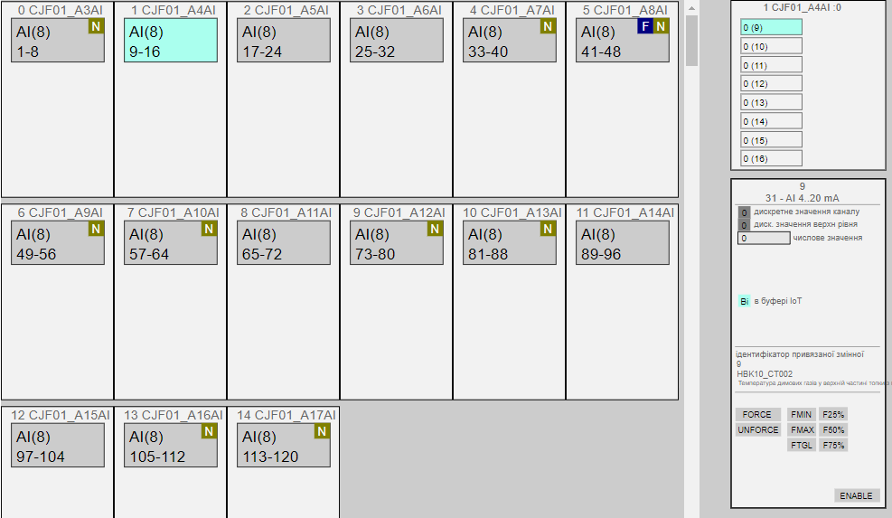

# Клас MODULS

**CLSID=16#220x**

to-do

## Загальний опис

Для HMI важливо реалізувати карти ПЛК, тобто стан каналів модулів (значення, використання змінною, помилки каналів), навіть якщо вони не використовуються. Крім того нерідко потрібно форсувати значення якогось виходу, або швидко дізнатися, яка змінна використовує даний канал. Найбільш простий варіант вивести на засоби HMI скорочені змінні структуру типу `CH_HMI`. Однак кількість тегів, що потрібна для ПЛК великої канальності надзвичайно велика, тому проміжним варіантом є використання виведення інформації по групам каналів, наприклад по 16, або по модулям. Приклади обох варіантів показані на рис.2.5.  Це якраз і реалізується за допомогою класу  [MODULS](2_moduls.md)


_рис.2.5. Приклад відображення карт ПЛК_

Нижче описаний один з варіантів реалізації роботи з групою каналів. Функції, які реалізовуються:
- постійний контроль стану (відображення) помилки каналів (хоча б одного) на модулях
- вибір групи каналу для відображення (у даному прикладі групою по 16)
-  відображення стану каналів вибраної групи, відповідно до даних з структури CH_HMI
-  завантаження в буфер будь якого каналу з групи
-  робота з каналом через буфер (форсування, зміна значення)



## Рекомендації щодо використання в HMI


## Структура класу Module та змінні Modules

Module - фізичний модуль на плк, має до 4-х Submoduls різного типу, таким чином загальною кількістю каналів до 64. Показує відображення каналів на модуль через субмодулі SUBMODULE (групи каналів) різного типу.   

Тип Module:

| name    | type                | adr  | bit  | descr                                                        |
| ------- | ------------------- | ---- | ---- | ------------------------------------------------------------ |
| STA     | INT                 | 0    |      | стан/команда модуля для HMI: xxxx_xxxx_xxxx_1111 - останні 4 біти відповідають за BAD конкретного субмодуля; xxxx_xxxx_1111_xxxx - конкретний підмодуль в буфері; xxxx_1111_xxxx_xxxx - команда завантаження конкретного підмодуля в буфер; 1111_xxxx_xxxx_xxxx - конкретний підмодуль в буфері IoT (тільки для рішень з IoT); |
| TYPE    | UINT                | 1    |      | типи Submodule, комбінація в 16-комвому форматі BCD (0 - відсутній, 1- DICH, 2- DOCH, 3- AICH, 4 – AOCH, 5 - COM) |
| CHCNTS  | UINT                | 2    |      | кількість каналів на кожен Submodule, комбінація в 16-ковому форматі - 1 (16#XYZQ) X - для першого субмодуля. Добавляється 1, якщо кількість каналів =0, то тип модулю буде 0 |
| STA2    | UINT                | 3    |      | додаткові стани модуля для HMI: xxxx_xxxx_xxxx_1111 - перші 4 біти відповідають за FRC хоча б одного каналу конкретного субмодуля; xxxx_xxxx_1111_xxxx - наявність вільних каналів (не використовуваних) на конкретному підмодулі; |
| STRTNMB | ARRAY[0..3] of UINT | 4    |      | номер початкового каналу для відображення конкретного підмодуля |

Кількість модулів задається в змінній PLCCFG.MODULSCNT.

Усі модулі містяться в масиві MODULES. Рекомендується задати кількість елементів в масиві завідомо більше ніж модулів для можливості подальшого розширення.  

## Структура класу та змінної SUBMODULE

SUBMODULE - забезпечує відображення конкретної групи каналів в модулі. Передбачається використання його для відображення (меппінга) групи каналів. Екземпляр є буфером, куди завантажуються необхідні канали.   

Тип SUBMODULE:

| name    | type                     | adr  | bit  | descr                                                        |
| ------- | ------------------------ | ---- | ---- | ------------------------------------------------------------ |
| STRTNMB | INT                      | 0    |      | номер початкового каналу для відображення конкретного підмодуля |
| CNT     | INT                      | 1    |      | кількість каналів (залежить від модуля), не більше 16        |
| TYPE    | INT                      | 2    |      | тип каналів (1- DICH, 2- DOCH, 3- AICH, 4 – AOCH, 5 - COM)   |
| CMD     | INT                      | 3    |      | команда: 1..16 - номер для завантаженння каналу в буфер      |
| CH      | ARRAY [0 to 15] of CHHMI | 4    |      | значення відповідно до CH\_HMI                               |

## Вимоги до функцій

### PLCMAPS

- може бути функцією без параметрів або секцією
- виставляє параметри `PLCCFG`
  - PLCCFG.DICNT
  - PLCCFG.DOCNT
  - PLCCFG.AICNT
  - PLCCFG.AOCNT
  - PLCCFG.MODULSCNT
- має запускатися при старті ПЛК
- виставляє параметри кожного модуля масиву`MODULES`
  - MODULES[i].TYPE //1- DICH, 2- DOCH, 3- AICH, 4 – AOCH, 5 - COM
  - MODULES[i].CHCNTS //кількість каналів на кожен Submodule, комбінація в 16-ковому форматі 
  - MODULES[i].STRTNMB[j] //для тих субмодулів, які існують (відповідна цифра MODULES[i].TYPE<>0) 

- у буфер SUBMODULE при старті повинен завантажитися якийсь підмодуль 

Приклад TIA portal

```pascal
"SYS".PLCCFG.DICNT := 32;
"SYS".PLCCFG.DOCNT := 32;
"SYS".PLCCFG.AICNT := 10;
"SYS".PLCCFG.AOCNT := 6;
"SYS".PLCCFG.MODULSCNT := 5;
"HMI".MODULES[0].STA.%X11 := true;
//CPU DI(1..14) AI(1..2) DO(1..10) AO(1..2)
"HMI".MODULES[0].TYPE := 16#1324; //1- DICH, 2- DOCH, 3- AICH, 4 – AOCH, 5 - COM
"HMI".MODULES[0].CHCNTS := 16#d191;//кількість каналів на кожен Submodule, комбінація в 16-ковому форматі - 1 (16#XYZQ) X - для першого субмодуля 
"HMI".MODULES[0].STRTNMB[0] := 1;
"HMI".MODULES[0].STRTNMB[1] := 1;
"HMI".MODULES[0].STRTNMB[2] := 1;
"HMI".MODULES[0].STRTNMB[3] := 1;
//DI16 DI(17..32)
"HMI".MODULES[1].TYPE := 16#1000; 
"HMI".MODULES[1].CHCNTS := 16#F000;
"HMI".MODULES[1].STRTNMB[0] := 17;
//DQ16 DQ(17..32)
"HMI".MODULES[2].TYPE := 16#2000;
"HMI".MODULES[2].CHCNTS := 16#F000;
"HMI".MODULES[2].STRTNMB[0] := 17;
//AI8 AI(3..10)
"HMI".MODULES[3].TYPE := 16#3000;
"HMI".MODULES[3].CHCNTS := 16#7000;
"HMI".MODULES[3].STRTNMB[0] := 3;
//AQ4 AQ(3..6)
"HMI".MODULES[4].TYPE := 16#4000;
"HMI".MODULES[4].CHCNTS := 16#3000;
"HMI".MODULES[4].STRTNMB[0] := 3;
```


### MODULES

- може бути функцією без параметрів або секцією
- має слідкувати за командами передачі в буфер SUBMODULE з Modules[].STA
  - завнтажувати в буфер SUBMODULE: кількість каналів, тип каналів, початковий номер каналу
- має оновлювати Modules[].STA
- має забезпечувати роботу з буфером SUBMODULE
  - в залежності від типу та кількості каналів оновлювати CH
  - слідкувати за командою CMD завнтаження в буфер CH
  - 

- має викликатися в кінці основної задачі

Приклад TIA portal

```pascal
//перебір усіх модулів
FOR #i := 0 TO "SYS".PLCCFG.MODULSCNT - 1 DO
    #modtype := "HMI".MODULES[#i].TYPE; //тип модуля
    #modchcnts := "HMI".MODULES[#i].CHCNTS;//кількість каналів в кожному підмодулі
    #modSTA := 0; //стан
    //проходження по підмодулям
    FOR #j := 0 TO 3 DO
        #zm := 12 - 4 * #j; //зміщення для SHIFT
        //тип підмодуля
        #sbmtype := SHR(IN := #modtype, N := #zm) AND 16#000F;
        //кількість каналів у підмодулі
        #sbmchcnts:= (SHR(IN := #modchcnts, N := #zm) AND 16#000F) + 1;
        //початковий індекс каналу 
        #sbmstrtnmb := "HMI".MODULES[#i].STRTNMB[#j];
        //перевірка бітових команд
        #mask := 16#0800; //маска для зміщення біту команди
        #cmdLoadsbm := ("HMI".MODULES[#i].STA AND SHR(IN := #mask, N :=#j))<>0;
        //завантаження в буфер підмодуля
        IF #cmdLoadsbm THEN
            "BUF".SUBMODULE.TYPE := #sbmtype;
            "BUF".SUBMODULE.CNT := #sbmchcnts;
            "BUF".SUBMODULE.STRTNMB := #sbmstrtnmb;
        END_IF;
        //визначення помилки на модулі по біту MERR першого каналу в модулі
        CASE #sbmtype OF
            1:  //DI
                #sbmbad := "CH".CHDI[#sbmstrtnmb].STA.%X6; //MERR
            2:  //DQ
                #sbmbad := "CH".CHDO[#sbmstrtnmb].STA.%X6; //MERR
            3:  //AI
                #sbmbad := "CH".CHAI[#sbmstrtnmb].STA.%X6; //MERR
            4:  //AO
                #sbmbad := "CH".CHAO[#sbmstrtnmb].STA.%X6; //MERR
        END_CASE;
        #mask := 16#0008; //маска для зміщення біту помилки
        IF #sbmbad THEN
            #modSTA := #modSTA OR SHR(IN := #mask, N := #j);
        END_IF;
        //визначення того, що цей підмодуль в буфері  
        #inbuf := #sbmtype<>0 AND ("BUF".SUBMODULE.TYPE = #sbmtype) AND ("BUF".SUBMODULE.STRTNMB = #sbmstrtnmb);
        #mask := 16#0080;
        IF #inbuf THEN
            #modSTA := #modSTA OR SHR(IN := #mask, N := #j);
        END_IF;
        //робота підмодулем в буфері
        IF #inbuf THEN
            #sbmCMD := "BUF".SUBMODULE.CMD;//команда для підмодуля
            //перевірка команди і завантаження значення каналів в буфер 
            FOR #k := 0 TO #sbmchcnts DO
                #cmdLoadch := #sbmCMD = #k + 1; //завантажити канал
                CASE #sbmtype OF
                    1:  //DI
                        "CH".CHDI[#sbmstrtnmb + #k].STA.%X15 := #cmdLoadch;
                        "BUF".SUBMODULE.CH[#k] := "CH".CHDI[#sbmstrtnmb + #k];
                    2:  //DQ
                        ;//"CH".CHDO[#sbmstrtnmb + #k].STA.%X15 := #cmdLoadch;
                        ;//"BUF".SUBMODULE.CH[#k] := "CH".CHDO[#sbmstrtnmb + #k];
                    3:  //AI
                        ;//"CH".CHAI[#sbmstrtnmb + #k].STA.%X15 := #cmdLoadch;
                        ;//"BUF".SUBMODULE.CH[#k] := "CH".CHAI[#sbmstrtnmb + #k];
                    4:  //AO
                        ;//"CH".CHAO[#sbmstrtnmb + #k].STA.%X15 := #cmdLoadch;
                        ;//"BUF".SUBMODULE.CH[#k] := "CH".CHAO[#sbmstrtnmb + #k];
                END_CASE;
            END_FOR;
            "BUF".SUBMODULE.CMD := 0;
        END_IF;
    END_FOR;
    
    //запис стану в модуль
    "HMI".MODULES[#i].STA := #modSTA;
    
END_FOR;


```

### MODULES_IOT

Команди з IoT буферу

- 16#00xx - команди для каналів 
- 16#01xx - команди для MODULE/SUBMODULE
- 16#0111..0114 - завантажити в буфер


## Тестування

### Перелік тестів

- усі функції перевіряються після реалізації PLCFN, CH та їх імплементації в екземплярах

| Номер | Назва                                                     | Примітки                  |
| ----- | --------------------------------------------------------- | ------------------------- |
| 1     | ініціалізація Modules                                     | робиться на першому скані |
| 2     | Тест завантаження необхідного підмодуля в буфер SUBMODULE |                           |
|       | to-do                                                     |                           |
|       |                                                           |                           |
|       |                                                           |                           |
|       |                                                           |                           |
|       |                                                           |                           |
|       |                                                           |                           |
|       |                                                           |                           |
|       |                                                           |                           |

### 1 Ініціалізація Modules

- перед запуском перевірки ПЛК повинен бути в СТОП
- після старту ПЛК повинно:
  - MODULES заповнитися відповідними значеннями
  - буфер SUBMODULE повинен заповнитися одним із підмодулів (як правило 1-й модуль, де є входи/виходи)

### 2 Тест завантаження необхідного підмодуля в буфер SUBMODULE

| Крок | дія для перевірки                                            | результат                                                    |
| ---- | ------------------------------------------------------------ | ------------------------------------------------------------ |
| 1    | змінити біт статусу команди завантаження існуючого модуля існуючого підмодуля | біт статусу завантаження в буфері повинен змінитися, буфер SUBMODULE повинен завантажитися відповідний підмодуль, а саме:   <br />STRTNMB<br/>CNT<br/>TYPE |
| 2    |                                                              |                                                              |
| 3    |                                                              |                                                              |