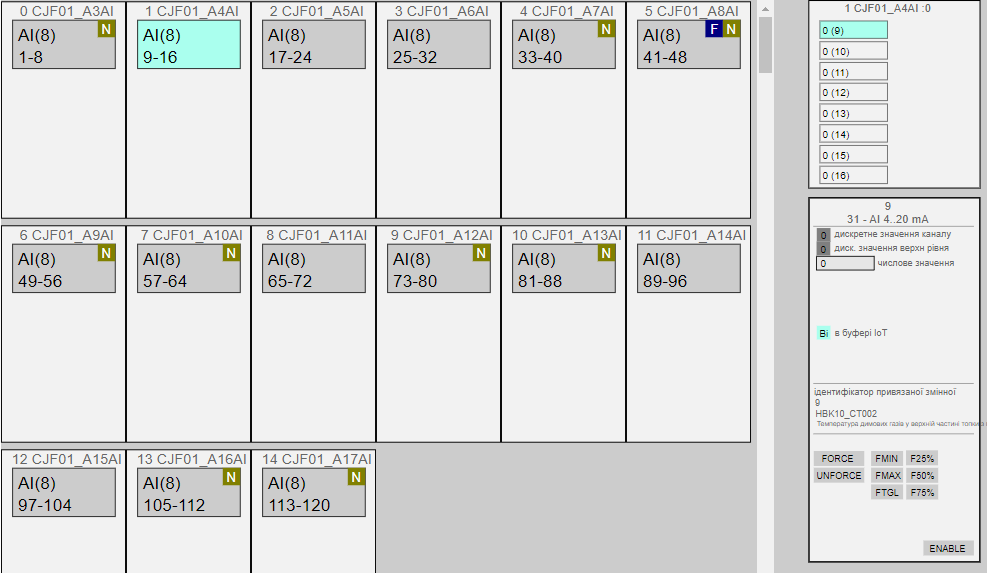
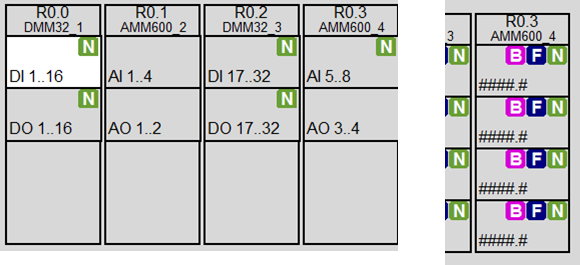

# Class MODULES

## General Description

For HMI, it is important to implement so-called PLC MAPs that display the status of module channels (values, variable usage, channel errors), even if these channels are not used in process variables. This enables visual monitoring of module channels, forcing input/output values if necessary, identifying which variable uses a particular channel, and viewing the available channel budget. Having objects like `CH_CFG/CH_HMI` allows this information to be retrieved and channels to be managed.

The simplest approach is to display the reduced variables of the `CH_HMI` structure and the `CH_BUF` buffer on the HMI. However, for high-channel-count PLCs, the number of tags required makes a straightforward implementation impractical. To retain this debugging capability without consuming excessive SCADA/HMI resources, an intermediate approach using group-based display (modules and submodules) is proposed. Examples of both approaches (ungrouped and grouped) are shown in the figure below.


Fig. Example of PLC map display

The classic commissioning method using the buffer pair `CH_HMI` and `CH_BUF` remains valid and unchanged. This section describes additional objects (modules and submodules) designed to reduce SCADA/HMI and communication resource usage.

Below is a variant implementation for working with channel groups. Implemented functions include:

- Continuous monitoring (display) of channel errors (at least one) on modules.
- Selecting a channel group for display ("submodule" - a group of 16 channels).
- Displaying the status of channels in the selected group based on `CH_HMI` data.
- Loading any channel from the group into the buffer.
- Operating the channel through the buffer (forcing, value changes).



## Module Class Structure and MODULES Variables

Ideally, a **MODULE** represents a physical PLC module that may have up to 4 channel groups represented as Submodules. Each submodule has a position within the module (1 to 4) and can contain up to 16 channels of a single type (AI, DI, AO, DO, COM, etc.), with the submodule type matching the channel type it handles. Submodules within a module can differ in type, allowing the module to hold up to 64 channels of various types (up to 4 submodules with 16 or fewer channels each). This module-submodule structure allows different channel combinations, such as 16DI+16DO+16AI+16AO, or 64DI, etc.

If the PLC architecture physically allows modules with more channels or more submodule types, the framework should represent these using multiple modules. Alternatively, the structures below can be modified, but that goes beyond the framework’s scope.

For ease of maintenance, the framework allows empty modules (placeholders) that contain at least one placeholder submodule in the first position (with other submodules absent).

### Module Type:

| name    | type                | adr  | bit  | description                                                  |
| ------- | ------------------- | ---- | ---- | ------------------------------------------------------------ |
| STA     | INT                 | 0    |      | module state/command for HMI: xxxx_xxxx_xxxx_1111 - lower 4 bits indicate BAD status of specific submodules; xxxx_xxxx_1111_xxxx - specific submodule in the buffer; xxxx_1111_xxxx_xxxx - command to load a specific submodule into the buffer; 1111_xxxx_xxxx_xxxx - specific submodule in the IoT buffer (for IoT solutions only); |
| TYPE    | UINT                | 1    |      | Submodule types, hexadecimal combination - 1 (`16#XYZQ` where X is for the first submodule): 0 - absent, 1 - DICH, 2 - DOCH, 3 - AICH, 4 - AOCH, 5 - COM, 6 - NDICH, 7 - NDOCH, 8 - NAICH, 9 - NAOCH, E - other module, F - placeholder module |
| CHCNTS  | UINT                | 2    |      | number of channels per Submodule, hexadecimal combination - 1 (`16#XYZQ` where X is for the first submodule). Add 1: if the channel count = 6, the module type will be 5. 0 or 1 channels will display as 0, but a module with 1 channel will have a type, while a module with no channels will have subtype 0 (absent) or F (placeholder). |
| STA2    | INT                 | 3    |      | additional module states for HMI: xxxx_xxxx_xxxx_1111 - lower 4 bits indicate FRC status of at least one channel in each submodule; xxxx_xxxx_1111_xxxx - presence of at least one free (unused) channel in each submodule; |
| STRTNMB | ARRAY[0..3] of UINT | 4    |      | starting channel number for displaying each submodule        |

The total number of modules is set in the variable `PLCCFG.MODULSCNT`. All modules are contained within the **MODULES** array

## Structure of the SUBMODULE class and variable

General information about submodules is contained within the **MODULE** structure, but to work with a specific group of channels, a separate buffer variable **SUBMODULE** is used, which serves for displaying (mapping) a group of channels. The submodule shows the state of all channels within that submodule. Further work with channels is performed using the standard framework interaction scheme `CH_HMI` <-> `CH_BUF`.

**Type SUBMODULE:**

| name    | type                     | adr  | bit  | descr                                                        |
| ------- | ------------------------ | ---- | ---- | ------------------------------------------------------------ |
| STRTNMB | INT                      | 0    |      | starting channel number for displaying the specific submodule |
| CNT     | INT                      | 1    |      | number of channels (depends on the module), up to 16         |
| TYPE    | INT                      | 2    |      | channel type (0-none, 1-DICH, 2-DOCH, 3-AICH, 4-AOCH, 5-COM, 6-NDICH, 7-NDOCH, 8-NAICH, 9-NAOCH, E-other, F-dummy) |
| CMD     | INT                      | 3    |      | command: 1..16 - channel number to load into the buffer      |
| CH      | ARRAY [0 to 15] of CHHMI | 4    |      | values according to the `CH_HMI` structure                   |

## Function Requirements

To implement work with modules and submodules, two functions are used:

- **PLCMAPS** – fills the `MODULES` array with the appropriate information, called as needed (e.g., on PLC startup). It may be absent; in that case, the relevant variables must be filled in another way.
- **MODULS** – implements the `MODULE/SUBMODULE` functionality.

### PLCMAPS

- may be a parameterless function or a section,
- sets the `PLCCFG` parameters:
  - `PLCCFG.DICNT`
  - `PLCCFG.DOCNT`
  - `PLCCFG.AICNT`
  - `PLCCFG.AOCNT`
  - `PLCCFG.MODULSCNT`
- should be executed at PLC startup,
- sets the parameters for each module in the `MODULES` array:
  - `MODULES[i].TYPE` – 1-DICH, 2-DOCH, 3-AICH, 4-AOCH, 5-COM, etc.
  - `MODULES[i].CHCNTS` – the number of channels per submodule, hexadecimal combination
  - `MODULES[i].STRTNMB[j]` – for submodules that exist (`MODULES[i].TYPE<>0`)
- upon startup, a submodule should be loaded into the `SUBMODULE` buffer for initial mapping.

### Example for TIA Portal

You can request an example initialization block for TIA Portal to fill `MODULES`, `PLCCFG`, and load an initial `SUBMODULE` for visual PLC MAP monitoring if you need it next for structured learning or implementation.

```pascal
"SYS".PLCCFG.DICNT := 32; // total number of DI channels
"SYS".PLCCFG.DOCNT := 32; // total number of DO channels
"SYS".PLCCFG.AICNT := 10; // total number of AI channels
"SYS".PLCCFG.AOCNT := 6;  // total number of AO channels
"SYS".PLCCFG.MODULSCNT := 5; // total number of MODULES in the system

"HMI".MODULES[0].STA.%X11 := true; // mark submodule 4 as selected for display

// CPU module: DI(1..14), AI(1..2), DO(1..10), AO(1..2)
"HMI".MODULES[0].TYPE := 16#1324; // 1-DICH, 2-DOCH, 3-AICH, 4-AOCH
"HMI".MODULES[0].CHCNTS := 16#D191; // number of channels per submodule, hexadecimal format (16#XYZQ)
"HMI".MODULES[0].STRTNMB[0] := 1;   // starting channel for submodule 1
"HMI".MODULES[0].STRTNMB[1] := 1;   // starting channel for submodule 2
"HMI".MODULES[0].STRTNMB[2] := 1;   // starting channel for submodule 3
"HMI".MODULES[0].STRTNMB[3] := 1;   // starting channel for submodule 4

// DI16 module: DI(17..32)
"HMI".MODULES[1].TYPE := 16#1000;   // submodule type: DICH
"HMI".MODULES[1].CHCNTS := 16#F000; // 16 channels on submodule 1
"HMI".MODULES[1].STRTNMB[0] := 17;  // starting channel at 17

// DO16 module: DO(17..32)
"HMI".MODULES[2].TYPE := 16#2000;   // submodule type: DOCH
"HMI".MODULES[2].CHCNTS := 16#F000; // 16 channels on submodule 1
"HMI".MODULES[2].STRTNMB[0] := 17;  // starting channel at 17

// AI8 module: AI(3..10)
"HMI".MODULES[3].TYPE := 16#3000;   // submodule type: AICH
"HMI".MODULES[3].CHCNTS := 16#7000; // 8 channels on submodule 1
"HMI".MODULES[3].STRTNMB[0] := 3;   // starting channel at 3

// AQ4 module: AQ(3..6)
"HMI".MODULES[4].TYPE := 16#4000;   // submodule type: AOCH
"HMI".MODULES[4].CHCNTS := 16#3000; // 4 channels on submodule 1
"HMI".MODULES[4].STRTNMB[0] := 3;   // starting channel at 3

```

### MODULS Function

- may be a parameterless function or a section,
- must monitor buffer transfer commands to `SUBMODULE` from `Modules[].STA`:
  - load into the `SUBMODULE` buffer: the number of channels, channel type, and starting channel number,
- must update `Modules[].STA`,
- must ensure work with the `SUBMODULE` buffer:
  - update `CH` according to the type and number of channels,
  - monitor the `CMD` command for loading into the `CH` buffer,
- should be called at the end of the main task.

TIA Portal example available on request for structured implementation.

```pascal
//loop through all modules
FOR #i := 0 TO "SYS".PLCCFG.MODULSCNT - 1 DO
    #modtype := "DBMODULES".MODULES[#i].TYPE; //module type
    #modchcnts := "DBMODULES".MODULES[#i].CHCNTS; //number of channels in each submodule
    #modSTA := 0; //status
    #modSTA2:=0; //status2
    //iterate through submodules
    FOR #j := 0 TO 3 DO
        #zm := 12 - 4 * #j; //offset for SHIFT
        //submodule type
        #sbmtype := SHR(IN := #modtype, N := #zm) AND 16#000F;
        //number of channels in submodule
        #sbmchcnts:= (SHR(IN := #modchcnts, N := #zm) AND 16#000F) + 1;
        //starting channel index
        #sbmstrtnmb := "DBMODULES".MODULES[#i].STRTNMB[#j];
        //check bit commands
        #mask := 16#0800; //mask for shifting command bit
        #cmdLoadsbm := ("DBMODULES".MODULES[#i].STA AND SHR(IN := #mask, N :=#j))<>0 AND #sbmtype<>0;
        //load submodule into buffer
        IF #cmdLoadsbm THEN
            "BUF".SUBMODULE.TYPE := #sbmtype;
            "BUF".SUBMODULE.CNT := #sbmchcnts;
            "BUF".SUBMODULE.STRTNMB := #sbmstrtnmb;
        END_IF;
        //determine module error by MERR bit of the first channel in the module
        CASE #sbmtype OF
            1:  (*DI*)
                #sbmbad := "CH".CHDI[#sbmstrtnmb].STA.%X6; (*MERR*)
            2:  (*DQ*)
                #sbmbad := "CH".CHDO[#sbmstrtnmb].STA.%X6; (*MERR*)
            3:  (*AI*)
                #sbmbad := "CH".CHAI[#sbmstrtnmb].STA.%X6; (*MERR*)
            4:  (*AO*)
                #sbmbad := "CH".CHAO[#sbmstrtnmb].STA.%X6; (*MERR*)
        END_CASE;
        #mask := 16#0008; //mask for shifting error bit
        IF #sbmbad THEN
            #modSTA := #modSTA OR SHR(IN := #mask, N := #j);
        END_IF;
        //check if this submodule is in the buffer
        #inbuf := #sbmtype<>0 AND ("BUF".SUBMODULE.TYPE = #sbmtype) AND ("BUF".SUBMODULE.STRTNMB = #sbmstrtnmb);
        #mask := 16#0080;
        IF #inbuf THEN
            #modSTA := #modSTA OR SHR(IN := #mask, N := #j);
        END_IF;
        //determine if there is at least one forced channel hasfrc and at least one free channel hasfree 11.10.21
        #hasfrc:=false;
        #hasfree:=false;
        FOR #k := 0 TO #sbmchcnts-1 DO
            CASE #sbmtype OF
                1:  (*DI*)
                    #hasfrc := #hasfrc OR "SYS".CHDI[#sbmstrtnmb + #k].STA.FRC;
                    #hasfree := #hasfree OR NOT "SYS".CHDI[#sbmstrtnmb + #k].STA.ULNK;
                2:  (*DQ*)
                    #hasfrc := #hasfrc OR "SYS".CHDO[#sbmstrtnmb + #k].STA.FRC;
                    #hasfree := #hasfree OR NOT "SYS".CHDO[#sbmstrtnmb + #k].STA.ULNK;
                3:  (*AI*)
                    #hasfrc := #hasfrc OR "SYS".CHAI[#sbmstrtnmb + #k].STA.FRC;
                    #hasfree := #hasfree OR NOT "SYS".CHAI[#sbmstrtnmb + #k].STA.ULNK;
                4:  (*AO*)
                    #hasfrc :=#hasfrc OR "SYS".CHAO[#sbmstrtnmb + #k].STA.FRC;
                    #hasfree := #hasfree OR NOT "SYS".CHAO[#sbmstrtnmb + #k].STA.ULNK;
            END_CASE;
        END_FOR;
        #mask := 16#0008;
        IF #hasfrc THEN
            #modSTA2 := #modSTA2 OR SHR(IN := #mask, N := #j);
        END_IF;
        #mask := 16#0080;
        IF #hasfree THEN
            #modSTA2 := #modSTA2 OR SHR(IN := #mask, N := #j);
        END_IF;

        //work with the submodule in the buffer
        IF #inbuf THEN
            #sbmCMD := "BUF".SUBMODULE.CMD; //command for the submodule
            //check command and load channel values into buffer
            FOR #k := 0 TO #sbmchcnts-1 DO
                #cmdLoadch := #sbmCMD = (#k + 1); //load channel
                CASE #sbmtype OF
                    1:  (*DI*)
                        "CH".CHDI[#sbmstrtnmb + #k].STA.%X15 := #cmdLoadch;
                        "BUF".SUBMODULE.CH[#k] := "CH".CHDI[#sbmstrtnmb + #k];
                    2:  (*DQ*)
                        "CH".CHDO[#sbmstrtnmb + #k].STA.%X15 := #cmdLoadch;
                        "BUF".SUBMODULE.CH[#k] := "CH".CHDO[#sbmstrtnmb + #k];
                    3:  (*AI*)
                        "CH".CHAI[#sbmstrtnmb + #k].STA.%X15 := #cmdLoadch;
                        "BUF".SUBMODULE.CH[#k] := "CH".CHAI[#sbmstrtnmb + #k];
                    4:  (*AO*)
                        "CH".CHAO[#sbmstrtnmb + #k].STA.%X15 := #cmdLoadch;
                        "BUF".SUBMODULE.CH[#k] := "CH".CHAO[#sbmstrtnmb + #k];
                END_CASE;
            END_FOR;
            "BUF".SUBMODULE.CMD := 0;
        END_IF;
    END_FOR;
    
    //write status to module
    "DBMODULES".MODULES[#i].STA := #modSTA;
    "DBMODULES".MODULES[#i].STA2:= #modSTA2;
    
END_FOR;

FOR #i := 0 TO 15 DO
    "BUF".SUBMODULE.CH[#i].STA.%X9:="BUF".SUBMODULE.CNT-1<#i;
END_FOR;

```

### MODULES_IOT

**Commands from IoT buffer**

- `16#00xx` – commands for channels
- `16#01xx` – commands for MODULE/SUBMODULE
- `16#0111..0114` – load into buffer

## Usage for network channels

The same principle is used for network channels, but the logical mapping may differ significantly from the physical one.

## Recommendations for HMI usage

Each submodule should display:

- presence of at least one forced channel in the group `F` (white letter on blue background),
- presence of at least one channel error `B` (white letter on pink background),
- presence of free (unlinked) channels `N` (white letter on olive background).

Colors and symbols are optional and not part of PACFramework.



## Testing

to-do

### Test list

- all functions are checked after implementing PLCFN, CH and their instances

| No.  | Title                                                     | Notes                                   |
| ---- | --------------------------------------------------------- | --------------------------------------- |
| 1    | Modules initialization                                    | performed on first scan                 |
| 2    | Test loading required submodule into SUBMODULE buffer     | performed after function implementation |
| 3    | Loading required channel into CH_BUF buffer               | performed after function implementation |
| 4    | Transfer of forced channel information to MODULE variable | performed after function implementation |
| 5    | Transfer of channel and module error information          | performed after function implementation |
| 6    | Transfer of information about free and linked channels    | performed after function implementation |

### 1 Modules initialization

- PLC must be in STOP before testing
- after PLC startup:
  - MODULES should be filled with appropriate values,
  - SUBMODULE buffer should be filled with one of the submodules (typically the first module with I/O).

### 2 Test loading required submodule into SUBMODULE buffer

| Step | Action                                                       | Result                                                       |
| ---- | ------------------------------------------------------------ | ------------------------------------------------------------ |
| 1    | Change the load command bit of an existing module and submodule | Load bit in buffer should change, SUBMODULE buffer should load the corresponding submodule with: STRTNMBCNTTYPE |
| 2    | Repeat step 1 for another module and/or submodule            | Load bit in buffer should change, SUBMODULE buffer should load the corresponding submodule with: STRTNMBCNTTYPE |

### 3 Loading required channel into CH_BUF buffer

| Step | Action                                                   | Result                                                       |
| ---- | -------------------------------------------------------- | ------------------------------------------------------------ |
| 1    | Write the channel number to `BUF_SUBMODULE.CMD`, e.g., 1 | The full content of `CH_CFG` should load into `CHBUF`. For `CH_HMI`, `CH_CFG`, `CH_BUF`, and `BUF.SUBMODULE.CH[0].STA`, the bit `STA.12(INBUF)` should be 1 |
| 2    | Change a variable value (e.g., for DICH – input RAW)     | The value should change in `CH_HMI`, `CH_CFG`, `CH_BUF`, and `BUF.SUBMODULE.CH[0].STA` |
| 3    | Repeat steps 1 and 2 for another channel                 | The full content of `CH_CFG` of another variable should load into `CHBUF` |

### 4 Transfer of forced channel information to MODULE variable

| Step | Action                                                       | Result                                                       |
| ---- | ------------------------------------------------------------ | ------------------------------------------------------------ |
| 1    | Load any channel into `CH_BUF` buffer                        | The full content of `CH_CFG` should load into `CHBUF`        |
| 2    | Send the force command `CHBUF.CMD=16#0301`                   | The forced bit `FRC` of the selected channel should be 1.The corresponding bit (0-3 depending on the submodule) in `MODULE.STA2` should be 1 according to the channel’s submodule |
| 3    | Load another channel into `CH_BUF` buffer                    | The full content of `CH_CFG` should load into `CHBUF`        |
| 4    | Send the force command `CHBUF.CMD=16#0301` again             | The forced bit `FRC` of the selected channel should be 1.The corresponding bit in `MODULE.STA2` should be 1 according to the channel’s submodule |
| 5    | De-force all objects with command `"SYS".PLCCFG.CMD=16#4302` | All `FRC` bits should become 0.The corresponding bit (0-3 depending on the submodule) in `MODULE.STA2` should also become 0 |

### 5 Transfer of channel and module error information

| Step | Action                                             | Result                                                       |
| ---- | -------------------------------------------------- | ------------------------------------------------------------ |
| 1    | Set `CH_CFG.STA.BAD` to 1 for any channel          | The corresponding bit (0-3 depending on the submodule) in `MODULE.STA` should be 1 according to the channel’s submodule |
| 2    | Set `CH_CFG.STA.BAD` to 0 for the selected channel | The corresponding bit in `MODULE.STA` should become 0        |
| 3    | Repeat for another channel                         | Same result as above                                         |

### 6 Transmission of Information About Free and Linked Channels

- Immediately after startup, all channels will be unlinked – `CHBUF.STA.ULNK` equals 0.
- To start the test, a variable such as `TST_HASFREE` is used.
- The channel number is set via test variables `TST_CHDI_ID1..TST_CHDI_ID16`.
- After calling the channel handler functions, a test function is called where the `CH_CFG.PNG` group values are modified, similar to a ping-pong test:

```pascal
IF TST_HASFREE THEN
    CHDI[TST_CHDI_ID1].STA.PNG := true;
    CHDI[TST_CHDI_ID1].VARID := TST_CHDI_ID;
    CHDI[TST_CHDI_ID2].STA.PNG := true;
    CHDI[TST_CHDI_ID2].VARID := TST_CHDI_ID;
    ...
    CHDI[TST_CHDI_ID16].STA.PNG := true;
    CHDI[TST_CHDI_ID16].VARID := TST_CHDI_ID;
END_IF;
```

| Step | Action for Verification                                      | Expected Result                                              |
| ---- | ------------------------------------------------------------ | ------------------------------------------------------------ |
| 1    | Do nothing                                                   | The corresponding bit (bits 4–7 depending on the submodule) of the `MODULE.STA2` variable, depending on which submodule the channels belong to, should be set to 1. |
| 2    | Set the values of `TST_CHDI_ID1..TST_CHDI_ID16` within the range of existing channels and set `TST_HASFREE=TRUE`. | For the specified variables: `CH_CFG.VARID` should equal the specified value, and `CH_CFG.ULNK=TRUE`. The corresponding bit (bits 4–7 depending on the submodule) of the `MODULE.STA2` variable, depending on which submodule the channels belong to, should be set to 0. |
| 3    | Change one of the channels, for example: `CHDI[TST_CHDI_ID16].STA.PNG := false;` | The channel should reset `CH_CFG.VARID` and `CH_CFG.ULNK`. The corresponding bit (bits 4–7 depending on the submodule) of the `MODULE.STA2` variable, depending on which submodule the channels belong to, should be set back to 1, indicating a free unlinked channel in the submodule is present. |

