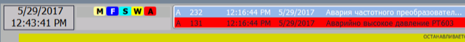

# Клас PLC: програмований контролер 

**CLSID=16#21xx**

## Загальний опис

Екземпляри класу PLC є центральними координуючими модулями керування, які відповідають за організацію загально-контролерних функцій, зокрема (але не обмежено ними):

-   виконання загальнокотролерних функцій, якщо вони не пов'язані з якоюсь частиною процесу а саме з усім обладнанням;
-    контроль статусів для всього контролеру (наявності блокувань, форсувань, ручних режимів, перший скан, імітації хоча б одного елементу) зокрема для відображення його на HMI;
-    контроль стану тривог для всього контролеру (наявності аварій, попереджень, помилок каналів, вияв нових тривог, наявність непідтверджених тривог);
-    обробка загальної сигналізації, наприклад апаратних світлових та звукових сигналізаторів (ревун, сирена і т.п.) та їх квітування;
-    обробка тривог пов'язаних безпосередньо з ПЛК (наприклад, перевищений час періоду циклу)
-    генерування інтервальних бітових імпульсів, меандрів;
-    ведення статистичних даних (за необхідності);
-    розрахунок інтегральних показників, в т.ч. загальний час роботи з останнього пуску, загальний час роботи з першого пуску, час останньої зупинки/пуску ПЛК і т.п.
-    формування загальних технологічних повідомлень оператору;
-    отримання широкомовних команд для інших об'єктів 

Клас PLC теоретично можна віднести до CM LVL2, але відокремлюється від нього у описі у зв'язку з його базовим положенням відносно реалізації інших класів в каркасі.  

## Рекомендації щодо використання в HMI

Рекомендується реалізувати компонент для відображення бітів стану. Приклад індикації стану ПЛК показаний на рис.1. 

У даному випадку:

- М – це наявність хоча б одного виконавчого механізму в ручному режимі, темно-синій 
- F – наявність хоча б одного форсування, темно-синій
- S – наявність хоча б одного об'єкта (CM/EM/UNIT) в режимі імітації, блакитний 
- W – наявність хоча б однієї тривоги рівня "попередження" (моргає при неквітованій), жовтий 
- A – наявність хоча б однієї тривоги рівня "аварія" (моргає при неквітованій), червоний. 
- E – наявність хоча б однієї тривоги рівня "недостовірність" (моргає при неквітованій), рожевий. 

Додатково також варто під статусами тривоги показувати 

- кількість тривог кожного рівня

- кількість форсувань

Додатковими бітами статусу для відображення також можуть бути: 

- наявність хоча б одного біта недостовірності, 
- наявність хоча б однієї відключеної змінної (виведеної з обслуговування), 
- "процедура технологічної комірки в роботі/паузі/утримання", 
- "апарат в роботі/паузі/утримання", 
- "CIP в роботі/паузі/утримання".

За можливості варто використати стан тривоги (відображення червоним) `STP` - "ПЛК у стопі".



_рис.1. Приклад індикації стану ПЛК_

Слід звернути увагу, що біти стану `STA` та тривог `ALM1`, `ALM2` скидаються у функції `PLC_FN`. Для забезпечення доступу до стану ПЛК та тривог у будь який момент часу а не тільки між викликами задач рекомендується використовувати  поля `STA_PERM` та `ALM1_PERM`.

## Функція PLCFN

### Функціональні вимоги 

Функція обробки PLCFN обробляє обов'язкові загальні контролерні дії.  

- підтвердження широкомовних команд (пропускає через себе широкомовну команду на один цикл)
- фіксує перший скан задачі - на один цикл виставляє відповідний біт в 1 при першому скані
- реалізовує бітові імпульси та меандри (див. CFG) які можуть використовуватися в тій же задачі (TASK) де запускається функція
- веде загальний час з початку 1-го циклу контролера (в секундах)
- веде загальний час роботи ПЛК з моменту пуску (в хвилинах)
- показує астрономічний час в форматі BCD
- показує початок години, доби, 
- показує початок зміни (за замовчування 8-годинна зміна)
- скидає біти тривог та деякі статусні біти, які "збираються" по всьому циклу від процедурного та базового керування (див. PLC_CFG)
- скидає лічильники тривог і деяких статусних слів 
- показує плинний (останній час задачі і максимальний в мс)

Функція обробки PLCFN може також обробляти наступні загальні контролерні дії.  

- формування інших меандрів
- керування загальною звуковою сигналізацією
- ведення додаткової загальної статистики
- контроль (керування сигналізацією) обміну з іншими/іншими ПЛК
- контроль (керування сигналізацією) обміну з DIO (розподілена периферія) 

### Вимоги щодо реалізації інтерфейсу

Може бути реалізована як функція, або функціональний блок (за необхідності збереження проміжних даних). На вході INOUT вона приймає аргумент `PLC_CFG`, може додатково приймати `PLC_HMI` за необхідності. 

Як правило для PLC достатньо одного екземпляру `PLCFN` і можна обійтися тільки однією структурою `PLC_CFG`. Однак з метою зменшення навантаження на комунікацію і забезпечення командного вводу параметрів (коли оператор спочатку змінює конфігуровані значення в буфер а потім записує їх в змінну) можна виділити змінні `PLC_HMI` та `PLC_BUF`. У каркасі це не описується правилами.

Для бітових представлень рекомендується використовувати `INT` замість `UINT`. У платформі UNITY/CotrolExpert тільки до INT можна звертатися до бітів через крапку. У TIA WinCC тільки INT може використовуватися для тривог. 

### Вимоги щодо реалізації програми користувача

На будь якій мові програмування. 

### Вимоги щодо використання

**Функція обробки PLCFN повинна запускатися на початку основної задачі.** Це необхідно для правильної обробки бітів статусу та тривог. Тому за необхідності використання структури в інших задачах, необхідно чітко зважити усі механізми. На практиці це інколи забувається, і приводить до небажаних наслідків. 

```pascal
PLCFN (PLC_CFG);
```

Додатково може знадобитися:

- конфігурування системних бітів для першого скану, меандрів тощо
- добавлення додаткових параметрів до інтерфейсу (наприклад PLC_HMI, PLC_BUF)

**Робота функції передбачає виконання усіх інших функцій каркасу в тому самому циклі задачі!**

## Структура та змінна PLC_CFG

### Опис структури

Можливий варіант структури показаний в таблиці.

| Атрибут     | Тип                | Біт         | Опис                                                         |
| ----------- | ------------------ | ----------- | ------------------------------------------------------------ |
| ID          | UINT               |             | Унікальний ідентифікатор, наприклад для ідентифікації PLC    |
| CLSID       | UINT               |             | 16#21xx                                                      |
| STA         | UINT або INT       |             | Може бути набір біт типу PLC_STA                             |
|             |                    | 0 CON2ERR   | =1 - є помилка звязку з сусідні ПЛК в парі (для теплого резерування) |
|             |                    | 1 PLC2STOP  | =1 - спарений ПЛК в стопі (для теплого резерування)          |
|             |                    | 2 BLK       | =1 – є хоча б один заблокований ВМ                           |
|             |                    | 3 ALDIS     | =1 – є хоча б одна відключена тривога                        |
|             |                    | 4 DIOON     | =1 - йде опитування по мережі (MODBUS або аналогічній) засобів віддаленого вводу/виводу |
|             |                    | 5 DIOERR    | =1 - є помилка на DIO                                        |
|             |                    | 6 b6        |                                                              |
|             |                    | 7 FRC       | =1 – хоча б одна змінна форсована (або ручний режим) на будь якому рівні |
|             |                    | 8 SMLALL    | =1 – все в режимі в імітації, примушує усі CM перейти в режим імітації |
|             |                    | 9 DISP      | =1 – хоча б один елемент в режимі ручного управління         |
|             |                    | 10 FRC2     | =1 – є хоча б один форсований керівний елемент (рівня 2), клапан, двигун |
|             |                    | 11 FRC1     | =1 – хоча б одна змінна форсована (рівня 1)                  |
|             |                    | 12 SCN1     | =1 – перший скан                                             |
|             |                    | 13 FRC0     | =1 – хоча б одна змінна форсована (рівня 0)                  |
|             |                    | 14 SML      | =1 – хоча б один об’єкт в режимі імітації                    |
|             |                    | 15 CMDACK   | =0 - підтвердження команди, команда пройшла через весь цикл задачі і отримана усіма |
| CMD         | UINT/INT           |             | Команди з HMI:<br/>16#0100 – прочитати конфігурацію<br/>16#0101 – записати конфігурацію<br/><br/>16#0111 – синхронізувати час з верхнім рівнем<br/>16#0301 – вимкнути сирену<br/>16#0302 – увімкнути сирену <br/><br/>16#4101 – записати конфігурація за замовченням для усіх змінних DIVAR<br/>16#4102 – записати конфігурація за замовченням для усіх змінних AIVAR<br/>16#4103 – записати конфігурація за замовченням для усіх змінних DOVAR<br/>16#4104 – записати конфігурація за замовченням для усіх змінних AOVAR<br/>16#4302 – дефорсувати всі об'єкти |
| CMDPRG      | UINT/INT           |             | Команди з програмного керування (побітові)                   |
| PRM1        | UINT/INT           |             | дискретні параметри (проектно залежні)                       |
| PRM2        | UINT/INT           |             | дискретні параметри (проектно залежні)                       |
| PLS         | UINT/INT           |             | Може бути набір біт типу PLS                                 |
|             |                    | 0 P100MS    | імпульс на один цикл основної задачі з періодичністю 100 мс (адекватно працюватиме тільки для циклів <50ms) |
|             |                    | 1 P200MS    | 200 мс (адекватно працюватиме тільки для циклів <100ms)      |
|             |                    | 2 P500MS    | 500 мс (адекватно працюватиме тільки для циклів <250ms)      |
|             |                    | 3 P1S       | 1 с                                                          |
|             |                    | 4 P2S       | 2 с                                                          |
|             |                    | 5 P5S       | 5 с                                                          |
|             |                    | 6 P10S      | 10 с                                                         |
|             |                    | 7 P60S      | 1 хв                                                         |
|             |                    | 8 M1S       | меандр з періодом 1 с (0.5 с + 0.5 с)                        |
|             |                    | 9 M2S       | меандр з періодом 2 с (1 с + 1 с)                            |
|             |                    | 10          |                                                              |
|             |                    | 11          |                                                              |
|             |                    | 12 NEWMIN   | =1 (на один цикл основної задачі) – початок хвилини          |
|             |                    | 13 NEWHR    | =1 (на один цикл основної задачі) – початок години           |
|             |                    | 14 NEWDAY   | =1 (на один цикл основної задачі) – початок доби             |
|             |                    | 15 NEWSHIFT | =1 (на один цикл основної задачі) – початок зміни            |
| ALM1        | INT                |             | Може бути типу PLC_ALM1                                      |
|             |                    | 0 ALM       | =1, є хоча б одна тривога аварійного рівня                   |
|             |                    | 1 NWALM     | =1, нова тривога аварійного рівня                            |
|             |                    | 2 ALMNACK   | =1, є неквітовані тривоги                                    |
|             |                    | 3 WRN       | =1, є хоча б одна тривога попереджувального рівня            |
|             |                    | 4 NWWRN     | =1, нова тривога попереджувального рівня                     |
|             |                    | 5 WRNNACK   | =1, є неквітовані попередження                               |
|             |                    | 6 BAD       | =1, є хоча б одна тривога недостовірності                    |
|             |                    | 7 NWBAD     | =1, нова тривога недостовірності                             |
|             |                    | 8 BADNACK   | =1, є неквітовані тривоги недостовірності                    |
|             |                    | 9 EMCYSTP   | =1, аварійний зупин (грибок)                                 |
|             |                    | 10 STP2RUN  | =1, момент переходу з аварійного зупину в роботу             |
|             |                    | 11 CON2ERR  | =1 - є помилка звязку з сусідні ПЛК в парі (для теплого резерування) |
|             |                    | 12 PLC2STOP | =1 - спарений ПЛК в стопі (для теплого резерування)          |
|             |                    | 13 DIOERR   | =1 - є помилка DIO                                           |
|             |                    | 14 PLCERR   | =1 – є апаратна помилка (ПЛК)                                |
|             |                    | 15 CONHIERR | =1 - є помилка звязку з верхним рівнем (ПЛК)                 |
| ALM2        | INT                |             | використовується за необхідності                             |
| STEP1       | INT                |             | крок основної програми                                       |
| T_STEP1     | INT                |             | час кроку основної програми обробки, в (с)                   |
| MSG         | UDINT              |             | для формування повідомлень, може бути як бітовим (32 повідомлення), так і числовим (за номером); передбачається, що повідомлення буде скидуватися в 0 автоматично через певний час (не менш ніж 2 інтервали опитування з HMI) |
| TQ          | UDINT              |             | загальний час з початку 1-го циклу контролера (в секундах)   |
| TQM         | UDINT              |             | загальний час роботи ПЛК з моменту пуску (в хвилинах), потребує збереження в Retentive |
| DICNT       | UINT               |             | кількість наявних каналів DI                                 |
| DOCNT       | UINT               |             | кількість наявних каналів DO                                 |
| AICNT       | UINT               |             | кількість наявних каналів AI                                 |
| AOCNT       | UINT               |             | кількість наявних каналів AO                                 |
| NOW         | ARRAY[0..3] of INT |             | плинний час астрономічний час в BCD форматі: <br/>NOW[0] seconds,-- (16#ss,--) <br/>NOW[1] hour, minute (16#hhmm) <br/>NOW[2] month, day (16#mmdd) <br/>NOW[3] year (16#yyyy) |
| SHIFTPARA   | ARRAY[0..4] of INT |             | Години передачі змін (2 або 3 зміни):<br/>SHIFT[0] – кількість змін<br/>SHIFT[1] – передача 1-ї зміни (BCD 16#hhmm) <br/>SHIFT[2] – передача 2-ї зміни (BCD 16#hhmm) <br/>SHIFT[3] – передача 3-ї зміни (BCD 16#hhmm) |
| SHIFTNMB    | UINT               |             | номер активної зміни                                         |
| CNTALM      | UINT               |             | лічильник кількості активних тривог "аварія"                 |
| CNTWRN      | UINT               |             | лічильник кількості активних тривог "попередження"           |
| CNTBAD      | UINT               |             | лічильник кількості активних тривог "недостовірність"        |
| CNTFRC      | UINT               |             | лічильник кількості форсованих об'єктів                      |
| CNTMAN      | UINT               |             | лічильник кількості ВМ в ручному режимі                      |
| TSK_LTIME   | UINT               |             | плинний (останній) час задачі в мілісекундах                 |
| TSK_MAXTIME | UINT               |             | максимальний час задачі в мілісекундах                       |
| STA_PERM    | UINT або INT       |             | повторює STA, який був на початку виклику функції            |
| ALM1_PERM   | UINT або INT       |             | повторює ALM1, який був на початку виклику функції           |
| CNTALM_PERM | UINT               |             | кількість активних тривог "аварія"                           |
| CNTWRN_PERM | UINT               |             | кількість активних тривог "попередження"                     |
| CNTBAD_PERM | UINT               |             | кількість активних тривог "недостовірність"                  |
| CNTFRC_PERM | UINT               |             | кількість форсованих об'єктів                                |
| CNTMAN_PERM | UINT               |             | кількість ВМ в ручному режимі                                |

### Використання змінних типу PLC_CFG

Для кожного ПЛК створюється по одній змінній типу PLC_CFG. Вона використовується в якості аргументу для усіх функцій та функціональних блоків, які реалізовують процедурне та базове керування. Якщо з функції або ФБ з середини дозволяється викликати глобальні дані, для покращення читабельності можна в інтерфейс цих функцій змінну не включати.   

PLC_CFG можна використовувати в розподіленому керуванні (декілька ПЛК) для обміну між ПЛК їх загальним статусом/командами, що може спростити їх координацію. У такому випадку, наявність буферних змінних і унікального ID може бути використано для конфігурування/контролю декількох ПЛК з одного HMI, через ПЛК-проксі. Так, наприклад, змінна TQ може бути використана для контролю за станом ПЛК або зв'язку з ним, адже якщо ця змінна не змінюється протягом тривалого часу, цей ПЛК знаходиться в стопі або недоступний (щось на кшталт heart_beat).

Деякі біти полів STA, та усі біти ALM1, ALM2 скидаються на початку задачі функцією PLCFN. Це зроблено для того, щоб будь який з CM/EM/Unit міг виставити біт в 1, тим самим сигналізуючи про твердження "хоча б один".

Поле MSG – може бути використано для формування повідомлень оператору, на кшталт – не можу виконати команду. Таке поле може бути і в інших структурах CM/EM/UNIT, тоді воно повинно бути в структурі HMI. Як варіант економії ресурсів може бути одне поле MSG на всі повідомлення. Якщо це поле буде бітовим, то повідомлення не будуть перекриватися, однак їх кількість буде обмежено 32 на весь ПЛК. Тим не менше, кількість полів MSG можна збільшувати до необхідного. Враховуючи, що повідомлення формуються по тригеру, їх необхідно "очищувати", що може бути зроблено за таймером або з самого HMI, як приймача повідомлення (наприклад додатковою командою ACKMSG – прийняв повідомлення). Механізми очищення виробляються для конкретного випадку.

## Тестування PLCFN 

Цей пункт описує методику перевірки функції PLCFN в ручному та/або автоматизованому режимі. 

### Перелік тестів

| Номер | Назва                                                        | Коли перевіряти                                              | Примітки |
| ----- | ------------------------------------------------------------ | ------------------------------------------------------------ | -------- |
| 1     | перший скан                                                  | після реалізації функції                                     |          |
| 2     | астрономічний час                                            | після реалізації функції                                     |          |
| 3     | лічильники роботи ПЛК: загальний і зі старту                 | після реалізації функції                                     |          |
| 4     | бітові імпульси                                              | після реалізації функції, у кінці проекту на реальному ПК, щоб перевірити адекватність |          |
| 5     | бітові меандри                                               | після реалізації функції, у кінці проекту на реальному ПК, щоб перевірити адекватність |          |
| 6     | імпульси початку години, доби                                | після реалізації функції                                     |          |
| 7     | скидування бітів статусів та лічильників тривог, статусів та збереження їх в змінних `_PERM` | після розгортання базових обєктів каркасу LVL0-LVL2          |          |
| 8     | зміни: номер активної зміни, початок зміни                   | після реалізації функції                                     |          |
| 9     | відображення мінімального та максимального часу циклу        | після реалізації функції                                     |          |


### 1 Тест першого скану

- перед запуском перевірки ПЛК повинен бути в СТОП
- перед викликом функції PLCFN повинна інкрементуватися змінна-лічильник циклів `TST_CCLS`, яка перед запуском ПЛК, повинна =0
- після виклику функції PLCFN при умові, що біт SCN1=TRUE:
  - збільшувати змінну `TST_SCN1CLC` (кількість викликів "першого циклу") на 1 
  - присвоїти змінній `TST_NBCLC := TST_CCLS` (останній номер циклу при спрацюванні біта прешого циклу)

```pascal
TST_CCLS := TST_CCLS + 1;
PLCFN(PLC);
if PLC.SCN1 then
   TST_SCN1CLC := TST_SCN1CLC + 1;
   TST_NBCLC := TST_CCLS;
end_if;
```

- після запуску ПЛК `TST_CCLS` повинен збільшуватися, а  `TST_SCN1CLC=1`, `TST_NBCLC=1`

| Крок | дія для перевірки                       | результат                                         |
| ---- | --------------------------------------- | ------------------------------------------------- |
| 1    | обнулити тестові змінні за необхідності |                                                   |
| 2    | запустити ПЛК (імітатор)                |                                                   |
| 3    | перевірити змінні                       | TST_CCLS збільшується, TST_SCN1CLC=1, TST_NBCLC=1 |

### 2 Тест астрономічного часу

Перевіряється рівність дати часу відповідним полям структури NOW у форматі BCD.

### 3 Тест лічильників роботи ПЛК: загальний і зі старту

Лічильник `TQM` не повинен обнулятися при перезапуску ПЛК, а `TQ` повинен. Реалізація `TQM` потребує збереження її в енергонезалежній пам'яті без обнулення при запуску. 

Загальна методика передбачає запуск ПЛК, перевірку `TQ` та `TQM` через кілька хвилин роботи. `TQ` повинен збільшуватися з кожною секундою, `TQM` з кожною хвилиною (або на початку хвилини, це не особиво впливає на точність). При зупинці і запуску ПЛК, лічильник `TQ` має обнулитися і запуститися заново. `TQM` повинен продовжити рахувати з того самого значення. 

Точність `TQ` перевіряється астрономічним годинником. 

### 4 Тест бітових імпульсів

- Перевіряється робота бітових імпульсів `P100MS`, `P200MS`, `P500MS`, `P1S`, `P2S`, `P5S`, `P10S`, `P60S`. Імпульси повинні спрацьовувати на один цикл з вказаною періодичністю. Враховуючи прив'язаність до обладнання коректність роботи може гарантуватися тільки на реальному залізі.
- Повторну перевірку варто робити  після реалізації всієї програми користувача, так як об'єм програми впливає на час циклу.   

- Для кожного імпульсу вводиться по одному тестовому лічильнику `TST_P100MS`, `TST_P200MS`, `TST_P500MS`, `TST_P1S`, `TST_P2S`, `TST_P5S`, `TST_P10S`, `TST_P60S`. Також вводиться додаткова змінна `TST_PLSON`, яка забезпечує інтервал тестування. Дана змінна включається для запуску тестування і відключається автоматично при зупинці тестування. 


- Для тестування використовується змінна `TQ` як показник часу. Але точніше буде використовувати системний час. Перевіряється проходження 121 с. Оцінюється приблизна кількість спрацювань з урахуванням похибки.


Якщо кількість імпульсів відрізняється від показника в таблиці, наведеній нижче:

- перевірити правильність реалізації
- якщо реалізація правильна, то очевидно час циклу більше за 2 інтервали бітового імпульсу, треба оцінювати доцільність використання цих бітів в програмі користувача або перевіряти їх на реальному ПЛК (якщо був використаний до цього імітатор)    

Таблиця. Тестові показники для бітових імпульсів.

| Лічильник  | Значення (може відрізнятися) |
| ---------- | ---------------------------- |
| TST_P100MS | 1210                         |
| TST_P200MS | 605                          |
| TST_P500MS | 240                          |
| TST_P1S    | 120-121                      |
| TST_P2S    | 60                           |
| TST_P5S    | 24                           |
| TST_P10S   | 12                           |
| TST_P60S   | 2                            |

```pascal
PLCFN(PLC);
if TST_PLSON then
  if PLC.P100MS then TST_P100MS := TST_P100MS+1; end_if; 
  if PLC.P200MS then TST_P200MS := TST_P200MS +1; end_if;
  if PLC.P500MS then TST_P500MS := TST_P500MS +1; end_if;
  if PLC.P1S then TST_P1S := TST_P1S +1; end_if;
  if PLC.P2S then TST_P2S := TST_P2S +1; end_if;
  if PLC.P5S then TST_P5S := TST_P5S + 1; end_if;
  if PLC.P10S then TST_P10S := TST_P10S + 1; end_if;
  if PLC.P60S then TST_P60S := TST_P60S + 1; end_if;
  if PLC.TQ-TEST_TQPREV>=121 then 
     TST_PLSON:=false;
  end_if; 
else 
  TEST_TQPREV := PLC.TQ;
end_if;
```

| Крок | дія для перевірки                                       | результат                                               |
| ---- | ------------------------------------------------------- | ------------------------------------------------------- |
| 1    | обнулити тестові змінні за необхідності                 |                                                         |
| 2    | запустити ПЛК (імітатор), виставити  `TST_PLSON:=TRUE;` |                                                         |
| 3    | перевірити змінні                                       | результат повинен бути як в таблиці тестових показників |

### 5 Тест бітових меандрів

Перевіряються бітові меандри `M1S` та `M2S`. Найпростіше їх перевірити візуально. Їх призначення виключно для локальних засобів ЛМІ (наприклад лампи), тому візуальна перевірка є достатньою.

### 6 Тест імпульсів початку години та доби

Цей тест потребує зміни значення часу в ПЛК або імітаторі.

Перевірка зміни години NEWHR перевіряється на першій хвилині (спрацьовує один раз на першій хвилині), доби NEWDAY - на першій хвилині першої години доби (спрацьовує один раз на першій хвилині). 

Змінна TST_CHHRCNT збільшується на 1 при зміні години, TST_CHDAYCNT при зміні доби.

### 7 Тест скидування бітів статусів та лічильників тривог і статусів

Усі біти тривог а також біти статусів повинні бути обнулені після виклику функції. Змінні "_PERM" (STA_PERM та ALM1_PERM) зберігають значення до наступного виклику функції.

Усі лічильники повинні бути скинуті.

### 8 Перевірка зміни: номер активної зміни, початок зміни

Перевірка на адекватну поведінку, якщо кількість змін SHIFT[0] буде некоректною.

Перевірити переключення на кожну зміну.

### 9 Тест відображення мінімального та максимального часу циклу

Перевірити співпадіння мінімального та максимального значення часу задачі

## Реалізація мультизадачності 

to do

Наразі не реалізовано.

Примітки:

•	добавити окремі контексти для кожної задачі (див структуру в верху)
 •	в усі об’єкти добавити змінну TASK – номер задачі, до якого він прив’язаний
 •	у випадку одної задачі – всю послідовність винести в TASK, яку викликати в MAST (UNITY PRO??????)
 •	в кожну функцію передавати номер задачі
 •	на початку кожної функції перевіряти чи задача до її екземпляру (по параметру TASK), якщо ні – вихід з виконання
 •	передача номеру задачі знизу-догори  CHCFG.TASK -> VARCFG.TASK -> LVL2.TASK
 •	для LVL3 означується в програмі при розробці

#### TASK

| Атрибут      | Тип      | Біт  | Опис                                           |
| ------------ | -------- | ---- | ---------------------------------------------- |
| ID           | UINT     |      | Унікальний ідентифікатор                       |
| CLSID        | UINT     |      |                                                |
| STA[0..7]    | UINT     |      |                                                |
| PLS[0..7]    | INT      |      |                                                |
| ALM[0..7]    | INT      |      |                                                |
| ALM2[0..7]   | INT      |      |                                                |
| T_SCAN[0..7] | UDINT    |      | час останньої обробки задачі                   |
| T_MIN[0..7]  | UDINT    |      | час останньої обробки задачі                   |
| T_MAX[0..7]  | UDINT    |      | час останньої обробки задачі                   |
| T_PREV[0..7] | UDINT??? |      | час попереднього виклику задачі ??? реалізація |
| REZ          | INT      |      | резерв                                         |


