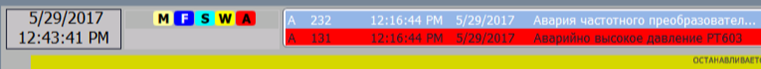

# PLC Class: Programmable Controller

**CLSID = 16#02xx**

## General Description

Instances of the PLC class are **central coordinating control modules** responsible for managing general controller functions, including but not limited to:

- Executing general controller functions not tied to a specific process area but to the entire equipment.
- Monitoring the status of the entire controller (locks, forcing, manual modes, first scan, simulation of any element) for display on the HMI.
- Monitoring alarms across the controller (faults, warnings, channel errors, new alarms, unacknowledged alarms).
- Handling general signaling (hardware lights, buzzers, sirens) and acknowledgments.
- Handling PLC-specific alarms (e.g., cycle time exceeded).
- Generating interval bit pulses, square waves.
- Maintaining statistics (if needed).
- Calculating integral indicators (e.g., total runtime since last/first startup, last stop/start times).
- Generating general operator messages.
- Receiving broadcast commands for other objects.

The PLC class can theoretically be considered part of **CM LVL2**, but is described separately due to its foundational role in implementing other framework classes.

## HMI Usage Recommendations

It is recommended to implement an HMI component to display status bits. Example status indication is shown in Fig. 1.

In this example:

- **M** – at least one actuator is in manual mode (dark blue).
- **F** – at least one forced signal (dark blue).
- **S** – at least one object (CM/EM/UNIT) in simulation mode (light blue).
- **W** – at least one “warning” alarm (flashing if unacknowledged, yellow).
- **A** – at least one “fault” alarm (flashing if unacknowledged, red).
- **E** – at least one “invalid” alarm (flashing if unacknowledged, pink).

It is also recommended to display under the alarm statuses:

- The count of alarms at each level.
- The count of active forcings.

Additional status bits for display may include:

- Presence of at least one invalid bit.
- Presence of at least one disabled variable (out of service).
- “Process unit running/paused/held.”
- “Equipment running/paused/held.”
- “CIP running/paused/held.”

If possible, display the “PLC in STOP” (`STP`) alarm status in red.



*Fig. 1. Example PLC status indication*

Note that status bits (`STA`) and alarm bits (`ALM1`, `ALM2`) are reset within the `PLC_FN` function. To access the PLC status and alarms at any time (not only between task calls), use the `STA_PERM` and `ALM1_PERM` fields.

## PLCFN Function

### Functional Requirements

The `PLCFN` processing function handles essential general controller actions:

- Acknowledges broadcast commands (passes them through for one cycle).
- Detects the first task scan, setting the bit for one cycle.
- Generates bit pulses and square waves (see CFG) usable within the same TASK where the function runs.
- Tracks total runtime since the first controller cycle (seconds).
- Tracks PLC runtime since startup (minutes).
- Displays astronomical time in BCD format.
- Indicates start of hour/day.
- Indicates shift start (default: 8-hour shift).
- Resets alarm bits and certain status bits accumulated during cycle execution by procedural/base controls (see PLC_CFG).
- Resets alarm and status counters.
- Shows the current (last) and maximum task execution time in ms.

The `PLCFN` function may also handle:

- Additional square wave generation.
- Managing general audible signaling.
- Maintaining additional general statistics.
- Monitoring (signaling) communication with other PLCs.
- Monitoring (signaling) communication with distributed I/O (DIO).

### Interface and User Program Requirements

Can be implemented as a function or function block (if intermediate data storage is needed). It accepts `PLC_CFG` as an INOUT argument, and `PLC_HMI` can be added if necessary.

Typically, one `PLCFN` instance and a single `PLC_CFG` structure suffice per PLC. However, to reduce communication load and support parameter write commands (edit in buffer, then write to variable), `PLC_HMI` and `PLC_BUF` variables may be used if needed.

Use `INT` rather than `UINT` for bit representations for compatibility with platforms like UNITY/ControlExpert (bit access via dot notation) and TIA WinCC (alarms only on INT).

### Execution Requirements

**The `PLCFN` function must run at the start of the main task cycle.** This ensures correct status and alarm bit handling. If used across multiple tasks, manage carefully to avoid unintended behavior.

```pascal
PLCFN(PLC_CFG);
```

Additional needs may include:

- Configuring system bits (first scan, square waves, etc.).
- Adding interface parameters (`PLC_HMI`, `PLC_BUF`).

**The function assumes all other framework functions are executed within the same task cycle.**

## PLC_CFG Structure and Variable

### Structure Description

The structure below is adapted for **CSV import**, allowing convenient conversion to platform-specific formats.

- **name** – parameter name
- **type** – parameter type
- **adr** – offset from the structure start (in 16-bit words)
- **bit** – bit number in the 16-bit structure
- **descr** – description

| name        | type               | adr  | bit  | descr                                                        |
| ----------- | ------------------ | ---- | ---- | ------------------------------------------------------------ |
| ID          | UINT               | 0    |      | Unique identifier, e.g., for PLC identification              |
| CLSID       | UINT               | 1    |      | 16#21xx                                                      |
| STA         | UINT               | 2    |      | Can be a PLC_STA bit set                                     |
| ACON2ERR    | BOOL               | 2    | 0    | =1 - communication error with paired PLC (warm redundancy)   |
| APLC2STOP   | BOOL               | 2    | 1    | =1 - paired PLC is in STOP (warm redundancy)                 |
| BLK         | BOOL               | 2    | 2    | =1 - at least one actuator is blocked                        |
| ALDIS       | BOOL               | 2    | 3    | =1 - at least one alarm is disabled                          |
| DIOON       | BOOL               | 2    | 4    | =1 - polling remote I/O devices (MODBUS or similar)          |
| DIOERR      | BOOL               | 2    | 5    | =1 - DIO error detected                                      |
| DBLCKALL    | BOOL               | 2    | 6    | =1 - all drives are unblocked                                |
| FRC         | BOOL               | 2    | 7    | =1 - at least one variable is forced (or in manual)          |
| SMLALL      | BOOL               | 2    | 8    | =1 - all in simulation mode; forces all CMs into simulation  |
| DISP        | BOOL               | 2    | 9    | =1 - at least one element in manual mode                     |
| FRC2        | BOOL               | 2    | 10   | =1 - at least one forced control element (level 2)           |
| FRC1        | BOOL               | 2    | 11   | =1 - at least one forced variable (level 1)                  |
| SCN1        | BOOL               | 2    | 12   | =1 - first scan                                              |
| FRC0        | BOOL               | 2    | 13   | =1 - at least one forced variable (level 0)                  |
| SML         | BOOL               | 2    | 14   | =1 - at least one object in simulation mode                  |
| CMDACK      | BOOL               | 2    | 15   | =0 - command acknowledgment; command received by all during the task cycle |
| CMD         | UINT               | 3    |      | HMI commands:16#0100 – read configuration;16#0101 – write configuration;16#301 – enable all actuator unlock mode;16#302 – disable unlock mode;16#300 – toggle unlock mode;16#0111 – synchronize time;16#0301 – turn off siren;16#0302 – turn on siren;16#4101-4104 – write default configs for DIVAR, AIVAR, DOVAR, AOVAR;16#4301-4304 – force/unforce LVL0 and LVL1;16#5xyy – user commands for LVLx. |
| CMDPRG      | UINT               | 4    |      | Program control commands (bitwise)                           |
| PRM1        | UINT               | 5    |      | Discrete parameters (project-specific)                       |
| PRM2        | UINT               | 6    |      | Discrete parameters (project-specific)                       |
| PLS         | UINT               | 7    |      | Can be a PLS bit set                                         |
| P100MS      | BOOL               | 7    | 0    | 100 ms pulse, single cycle (valid if cycle < 50 ms)          |
| P200MS      | BOOL               | 7    | 1    | 200 ms pulse (cycle < 100 ms)                                |
| P500MS      | BOOL               | 7    | 2    | 500 ms pulse (cycle < 250 ms)                                |
| P1S         | BOOL               | 7    | 3    | 1 s pulse                                                    |
| P2S         | BOOL               | 7    | 4    | 2 s pulse                                                    |
| P5S         | BOOL               | 7    | 5    | 5 s pulse                                                    |
| P10S        | BOOL               | 7    | 6    | 10 s pulse                                                   |
| P60S        | BOOL               | 7    | 7    | 60 s pulse                                                   |
| M1S         | BOOL               | 7    | 8    | 1 s square wave (0.5 s + 0.5 s)                              |
| M2S         | BOOL               | 7    | 9    | 2 s square wave (1 s + 1 s)                                  |
| plsb10      | BOOL               | 7    | 10   | reserved                                                     |
| plsb11      | BOOL               | 7    | 11   | reserved                                                     |
| NEWMIN      | BOOL               | 7    | 12   | =1 (single cycle) – start of minute                          |
| NEWHR       | BOOL               | 7    | 13   | =1 (single cycle) – start of hour                            |
| NEWDAY      | BOOL               | 7    | 14   | =1 (single cycle) – start of day                             |
| NEWSHIFT    | BOOL               | 7    | 15   | =1 (single cycle) – start of shift                           |
| ALM1        | INT                | 8    |      | Can be PLC_ALM1 type                                         |
| ALM         | BOOL               | 8    | 0    | =1, at least one fault-level alarm                           |
| NWALM       | BOOL               | 8    | 1    | =1, new fault-level alarm                                    |
| ALMNACK     | BOOL               | 8    | 2    | =1, unacknowledged alarms present                            |
| WRN         | BOOL               | 8    | 3    | =1, at least one warning-level alarm                         |
| NWWRN       | BOOL               | 8    | 4    | =1, new warning-level alarm                                  |
| WRNNACK     | BOOL               | 8    | 5    | =1, unacknowledged warnings                                  |
| BAD         | BOOL               | 8    | 6    | =1, at least one invalid data alarm                          |
| NWBAD       | BOOL               | 8    | 7    | =1, new invalid data alarm                                   |
| BADNACK     | BOOL               | 8    | 8    | =1, unacknowledged invalid data alarms                       |
| EMCYSTP     | BOOL               | 8    | 9    | =1, emergency stop (E-Stop)                                  |
| STP2RUN     | BOOL               | 8    | 10   | =1, transition from stop to run                              |
| CON2ERR     | BOOL               | 8    | 11   | =1 - paired PLC communication error (warm redundancy)        |
| PLC2STOP    | BOOL               | 8    | 12   | =1 - paired PLC in STOP (warm redundancy)                    |
| DIOERR      | BOOL               | 8    | 13   | =1 - DIO error detected                                      |
| PLCERR      | BOOL               | 8    | 14   | =1 – PLC hardware fault                                      |
| CONHIERR    | BOOL               | 8    | 15   | =1 - upper-level PLC communication error                     |
| ALM2        | INT                | 9    |      | used as needed                                               |
| STEP1       | INT                | 10   |      | main program step                                            |
| T_STEP1     | INT                | 11   |      | main program step processing time (s)                        |
| MSG         | UDINT              | 12   |      | message generation (bitwise/numbered, auto-reset after polling interval) |
| TQ          | UDINT              | 14   |      | total runtime since first controller cycle (s)               |
| TQM         | UDINT              | 16   |      | PLC runtime since startup (min), requires retention          |
| DICNT       | UINT               | 18   |      | number of DI channels                                        |
| DOCNT       | UINT               | 19   |      | number of DO channels                                        |
| AICNT       | UINT               | 20   |      | number of AI channels                                        |
| AOCNT       | UINT               | 21   |      | number of AO channels                                        |
| NOW         | ARRAY[0..3] of INT | 22   |      | current BCD time: NOW[0] sec; NOW[1] hhmm; NOW[2] mmdd; NOW[3] yyyy |
| SHIFTPARA   | ARRAY[0..3] of INT | 26   |      | shift changeover hours: SHIFT[0] count; SHIFT[1-3] BCD hhmm  |
| SHIFTNMB    | UINT               | 30   |      | active shift number                                          |
| CNTALM      | UINT               | 31   |      | count of active fault alarms                                 |
| CNTWRN      | UINT               | 32   |      | count of active warning alarms                               |
| CNTBAD      | UINT               | 33   |      | count of active invalid alarms                               |
| CNTFRC      | UINT               | 34   |      | count of forced objects                                      |
| CNTMAN      | UINT               | 35   |      | count of devices in manual mode                              |
| TSK_LTIME   | UINT               | 36   |      | current task execution time (ms)                             |
| TSK_MAXTIME | UINT               | 37   |      | maximum task execution time (ms)                             |
| STA_PERM    | UINT               | 38   |      | copy of STA at function start                                |
| ALM1_PERM   | UINT               | 39   |      | copy of ALM1 at function start                               |
| CNTALM_PERM | UINT               | 40   |      | active fault alarm count at function start                   |
| CNTWRN_PERM | UINT               | 41   |      | active warning alarm count at function start                 |
| CNTBAD_PERM | UINT               | 42   |      | active invalid alarm count at function start                 |
| CNTFRC_PERM | UINT               | 43   |      | forced object count at function start                        |
| CNTMAN_PERM | UINT               | 44   |      | device manual mode count at function start                   |
| MODULSCNT   | INT                | 45   |      | module count                                                 |
| NOWns       | UDINT              | 46   |      | nanoseconds for current astronomical time                    |
| TQMS        | UDINT              | 48   |      | millisecond counter; resets on start or overflow             |

### Using PLC_CFG Variables

A single **PLC_CFG variable** should be created for each PLC. It is used as an argument in all functions and function blocks that implement procedural and base control. If functions or FBs are allowed to access global data internally, you may omit this variable from the function interface to improve readability.

PLC_CFG can also be used in **distributed control (multi-PLC systems)** to exchange overall status and commands between PLCs, simplifying coordination. In this case, buffer variables and unique IDs can be utilized to configure/control multiple PLCs from a single HMI via a **PLC proxy**. For example, the `TQ` variable can monitor the status or connectivity of a PLC: if this variable does not change over a long period, it indicates that the PLC is in STOP or is unreachable (similar to a **heartbeat**).

Certain bits in the STA field, and all bits in ALM1 and ALM2, are reset at the start of the task by the `PLCFN` function. This allows any CM/EM/Unit to set the bit to `1`, signaling the statement “at least one active.”

The `MSG` field can be used to generate operator messages, such as “unable to execute command.” This field can also exist in other CM/EM/UNIT structures, in which case it should also be included in the HMI structure. To save resources, a **single shared MSG field** can be used for all messages. If implemented as a bit field, messages will not overlap, but the number of unique messages will be limited to **32 across the entire PLC**. However, the number of MSG fields can be increased as needed. Since messages are triggered, they need to be “cleared,” which can be done via a timer or directly from the HMI (e.g., with an `ACKMSG` command confirming message receipt). Clearing mechanisms should be designed based on specific application requirements.

## PLCFN Testing

This section describes the methodology for testing the `PLCFN` function in manual and/or automated modes.

### Test List

| No.  | Name                                                         | When to test                                                 | Notes |
| ---- | ------------------------------------------------------------ | ------------------------------------------------------------ | ----- |
| 1    | First scan                                                   | After implementing the function                              |       |
| 2    | Astronomical time                                            | After implementing the function                              |       |
| 3    | PLC runtime counters: total and since startup                | After implementing the function                              |       |
| 4    | Bit pulses                                                   | After implementing the function; at project end on real PLC to verify behavior |       |
| 5    | Bit square waves                                             | After implementing the function; at project end on real PLC to verify behavior |       |
| 6    | Hour/day start pulses                                        | After implementing the function                              |       |
| 7    | Status and alarm bit resets, counter resets, `_PERM` variable preservation | After deploying LVL0-LVL2 framework objects                  |       |
| 8    | Shifts: active shift number, shift start                     | After implementing the function                              |       |
| 9    | Displaying minimum and maximum task cycle times              | After implementing the function                              |       |
| 10   | Command reset after one cycle                                | After implementing the function                              |       |

### 1. First Scan Test

- Before testing, the PLC should be in **STOP**.
- Increment the cycle counter variable `TST_CCLS` before calling `PLCFN`. This should be `0` before PLC startup.
- After calling `PLCFN`, if the `SCN1` bit is `TRUE`:
  - Increment `TST_SCN1CLC` (first scan call counter) by 1.
  - Set `TST_NBCLC := TST_CCLS` (the last cycle number when first scan bit was active).

```pascal
TST_CCLS := TST_CCLS + 1;
PLCFN(PLC);
if PLC.SCN1 then
   TST_SCN1CLC := TST_SCN1CLC + 1;
   TST_NBCLC := TST_CCLS;
end_if;
```

- After starting the PLC, `TST_CCLS` should increment, and `TST_SCN1CLC = 1`, `TST_NBCLC = 1`.

| Step | Verification action            | Expected result                                           |
| ---- | ------------------------------ | --------------------------------------------------------- |
| 1    | Reset test variables as needed |                                                           |
| 2    | Start PLC (or simulator)       |                                                           |
| 3    | Check variables                | `TST_CCLS` increments, `TST_SCN1CLC = 1`, `TST_NBCLC = 1` |

### 2. Astronomical Time Test

Verify that the current date and time match the `NOW` structure fields in BCD format.

### 3. PLC Runtime Counter Test

The `TQM` counter **should not reset** on PLC restart, while `TQ` **should reset**. `TQM` requires retention in non-volatile memory across restarts.

**Method:**

- Start the PLC and check `TQ` and `TQM` after a few minutes.
- `TQ` should increment every second; `TQM` every minute (or at the start of the minute).
- On PLC restart, `TQ` should reset and restart; `TQM` should continue from its previous value.
- Verify `TQ` accuracy against a reference clock.
- Confirm that task cycle time matches the real-time difference between calls.

### 4. Bit Pulse Test

Verify bit pulses: `P100MS`, `P200MS`, `P500MS`, `P1S`, `P2S`, `P5S`, `P10S`, `P60S`. They should activate for one cycle at the specified intervals.

**Notes:**

- Full testing should be done after the entire user program is implemented, as program size affects cycle time.
- Use test counters for each pulse (`TST_P100MS`, `TST_P200MS`, etc.) and a `TST_PLSON` control variable for the test period.
- Use `TQ` or preferably system time to measure a 121-second interval and compare pulse counts with expected values.

If pulse counts differ from the table below:

- Verify implementation correctness.
- If correct, longer cycle times may affect pulse behavior, requiring real PLC testing.

**Expected Pulse Counts After ~121s:**

| Counter    | Expected Value (approx.) |
| ---------- | ------------------------ |
| TST_P100MS | 1210                     |
| TST_P200MS | 605                      |
| TST_P500MS | 240                      |
| TST_P1S    | 120-121                  |
| TST_P2S    | 60                       |
| TST_P5S    | 24                       |
| TST_P10S   | 12                       |
| TST_P60S   | 2                        |

```pascal
PLCFN(PLC);
if TST_PLSON then
  if PLC.P100MS then TST_P100MS := TST_P100MS+1; end_if; 
  if PLC.P200MS then TST_P200MS := TST_P200MS+1; end_if;
  if PLC.P500MS then TST_P500MS := TST_P500MS+1; end_if;
  if PLC.P1S then TST_P1S := TST_P1S+1; end_if;
  if PLC.P2S then TST_P2S := TST_P2S+1; end_if;
  if PLC.P5S then TST_P5S := TST_P5S+1; end_if;
  if PLC.P10S then TST_P10S := TST_P10S+1; end_if;
  if PLC.P60S then TST_P60S := TST_P60S+1; end_if;
  if PLC.TQ - TEST_TQPREV >= 121 then 
     TST_PLSON := false;
  end_if;
else 
  TEST_TQPREV := PLC.TQ;
end_if;
```

| Step | Verification action                           | Expected result                         |
| ---- | --------------------------------------------- | --------------------------------------- |
| 1    | Reset test variables as needed                |                                         |
| 2    | Start PLC/simulator, set `TST_PLSON := TRUE;` |                                         |
| 3    | Check variables                               | Values should match the expected table. |

### 5. Bit Square Wave Test

Verify `M1S` and `M2S` square waves visually. These are primarily for local HMI devices (e.g., indicator lights), making visual inspection sufficient.

### 6. Hour/Day Start Pulse Test

Adjust the PLC/system clock to trigger:

- `NEWHR` (hour change): should activate once during the first minute of the new hour.
- `NEWDAY` (day change): should activate once during the first minute of the first hour of the new day.

Increment:

- `TST_CHHRCNT` on hour change.
- `TST_CHDAYCNT` on day change.

### 7. Status and Alarm Bit & Counter Reset Test

After the function call:

- All alarm and status bits should reset.
- `_PERM` variables (`STA_PERM`, `ALM1_PERM`) should retain values until the next function call.
- All counters should reset.

### 8. Shift Change Test

Check system behavior with incorrect values in `SHIFT[0]`. Verify switching for each shift.

### 9. Task Cycle Time Display Test

Verify that minimum and maximum task cycle time values are correctly displayed.

### 10. Command Reset After One Cycle

Verify that commands clear after at least one cycle to ensure broadcast command handling.

Insert a counter increment when `PLC.CMD <> 0`. If it increments by 1 after each command call, it is functioning correctly.

## Multitasking Implementation

Currently not implemented. It will be implemented in version 2. 
