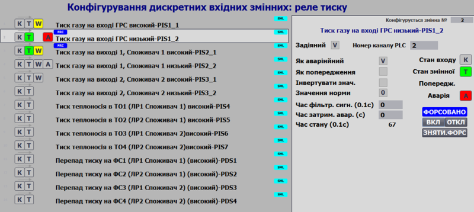

# Класи LVL1

**CLSID=16#100x – 16#17FF**

## Загальний опис

Рекомендується використовувати наскрізну ідентифікацію технологічних змінних (ID) в межах рівня LVL1 для спрощення символьного посилання в HMI.

Представлений 4-ма класами:

- [DIVAR](2_divar.md) (CLSID=16#101x) – дискретні вхідні змінні процесу,
- [DOVAR](2_dovar.md) (CLSID=16#102x) – дискретні вихідні змінні процесу,
- [AIVAR ](2_aivar.md) (CLSID=16#103x) – аналогові вихідні змінні процесу,
- [AOVAR](2_aovar.md) (CLSID=16#104x) – аналогові вихідні змінні процесу,
- NDIVAR (CLSID=16#105x) -
- NDOVAR (CLSID=16#106x) -
- NAIVAR (CLSID=16#107x) -
- NAOVAR (CLSID=16#108x) - 

Використовується єдиний буфер зі структурою [VARBUF](varbuf.md)

Змінна з ідентифікатором 0 зарезервована як порожня неактивна змінна. 

## Рекомендації щодо використання в HMI

Приклад діагностики та конфігурування аналогових змінних на HMI показаний на рис. Вікна де наводяться перелік всіх технологічних змінних в каркасі називається **картою технологічних змінних**.

Рис. Приклад використання функцій аналогових вхідних змінних на HMI.

Рис. Приклад налаштування функцій дискретних вхідних змінних на HMI.

Статуси змінних (тривоги, відмови, форсування) супроводжують відображення змінної на всіх мнемосхемах HMI. На наступному рисунку показаний приклад відображення попередження для змінної PT102 для панелі з обмеженою функціональністю (Simatic Basic Panel).

Рис. Приклад відображення статусу змінної HMI.

## Загальні вимоги щодо структури змінних класів

Структури повинні містити

| name    | type | adr  | bit  | Опис                                                         |
| ------- | ---- | ---- | ---- | ------------------------------------------------------------ |
| ID      | UINT | 0    |      | Унікальний ідентифікатор                                     |
| CLSID   | UINT | 1    |      | 16#10xx                                                      |
| STA     | INT  | 2    |      | біти статусу                                                 |
| PRM     | UINT | 4    |      | параметри конфігурації, повинні зберігатися при відключеному живленні |
| ISALM   | BOOL | 4    | 0    | =1 – задіяти як технологічну тривогу                         |
| ISWRN   | BOOL | 4    | 1    | =1 – задіяти як технологічне попередження                    |
| INVERSE | BOOL | 4    | 2    | =1 – інвертувати сире значення                               |
| PRMb3   | BOOL | 4    | 3    |                                                              |
| PRMb4   | BOOL | 4    | 4    |                                                              |
| NRMVAL  | BOOL | 4    | 5    | значення норми                                               |
| QALENBL | BOOL | 4    | 6    | =1 – задіяти тривогу недостовірності каналу                  |
| DSBL    | BOOL | 4    | 7    | =1 – змінна не задіяна                                       |
| PRMb8   | BOOL | 4    | 8    |                                                              |
| PRMb9   | BOOL | 4    | 9    |                                                              |
| PRMb10  | BOOL | 4    | 10   |                                                              |
| PRMb11  | BOOL | 4    | 11   |                                                              |
| PRMb12  | BOOL | 4    | 12   |                                                              |
| PRMb13  | BOOL | 4    | 13   |                                                              |
| PRMb14  | BOOL | 4    | 14   |                                                              |
| PRMb15  | BOOL | 4    | 15   |                                                              |
| CHID    | UINT | 5    |      | Логічний номер дискретного каналу, до якого прив'язана змінна, 0 - немає прив'язки |
| STEP1   | UINT | 6    |      | номер кроку                                                  |
| T_DEASP | UINT | 7    |      | Час затримки тривоги в секундах                              |
| T_FLTSP | UINT | 8    |      | Заданий час фільтрації в мілісекундах                        |
| TMP     | UINT | 9    |      | резерв                                                       |
| T_STEP1 | TIME | 10   |      | Плинний час кроку в мс                                       |
| T_PREV  | TIME | 12   |      | час в мс з попереднього виклику, береться зі структури PLC_CFG.TQMS |

## Загальні вимоги до функцій VAR

### Функціональні вимоги 

СМ-ми першого рівня, типу **технологічні змінні** можуть бути прив'язані до каналу того ж типу (наприклад дискретний вхід до дискретної вхідної технологічної змінної) по їх номеру. Таким чином прив'язка технологічної змінної до каналу є динамічною, що дозволяє змінювати розташування фізичного підключення конкретного датчика/ВМ у випадку виходу з ладу частини системи. Крім того, таке переключення може бути програмним.

Технологічні змінні знаходяться вище за канали по ієрархії керування. Уся діагностична інформація передається від каналів до змінних. Реалізація цього рівня не залежить від апаратних особливостей контролера, так як усі платформо-залежні тонкощі реалізується на рівні каналів, інтерфейс яких є стандартизованим в каркасі. Технологічні змінні забезпечують наступну функціональність:

-   прив'язка до каналу за його номером та типом

-   відключення з обслуговування (деактивація тривог змінної, врахування верхніми рівнями)

-   відслідковування достовірності значення за помилкою прив'язаного каналу, виходу за діапазон вимірювальної величини, тощо;

-   діагностика роботи каналу (передача діагностичної інформації з прив'язаного

каналу на верхній рівень)

-   обробка вхідного/вихідного значення: масштабування (в т.ч. за необхідністю кусочно-лінійна інтерполяція), фільтрування, інвертування (для дискретних змінних);

-   наявність режиму ручної зміни (форсування); відповідно до ISA-88 - «ручний режим»

-   наявність режиму імітації, в якому для вхідних змінних, значення змінюється CM-мами верхнього рівня (або незалежною програмою), а для вихідних змінних, відбувається замороження значень вихідних каналів

-   обробка тривог (ISA 18.2): реагування на порогові значення, врахування затримки на спрацювання (за необхідності межі задаються окремими уставками), гістерезис, формування загального системного біту аварії/попередження, нова тривога (на один цикл);

-   конфігурування обробки тривог (ISA 18.2): налаштування значень тривог, типів тривог (аварія/попередження/відмова каналу), тимчасове зняття тривоги з обслуговування;

- підтримка режиму імітації (симуляції)

#### Робота з буфером

ту-ду

### Вимоги щодо реалізації інтерфейсу

У інтерфейс повинні передаватися наступні параметри:

- xxVARCFG - INOUT
- xxVARHMI - INOUT
- CHCFG - INOUT

За неможливості доступу до глобальної змінної `PLC_CFG` та `VAR_BUF` вони також передається як `INOUT` 

### Вимоги щодо реалізації програми користувача

Необхідно передбачити в загальній програмі (по за функцією реалізації класу):

- при першому старті:
  - ініціалізацію ідентифікаторів змінних (ID) 
  - займання буферу якоюсь однією змінною
- контроль конфлікту займання змінною каналу, який вже зайнятий іншою змінною через роботу з буфером

Необхідно передбачити в програмі реалізації класу:

- при першому старті:
  - ініціалізацію класів змінних (CLSID) 
  - запис значень CHID (ID каналів) за замовченням, якщо CHID=0
  - PRM_DSBL:=FALSE
  - T_PREV := PLC_CFG.TQMS
  - T_STEP1 :=0
- запис значень CHID (ID каналів) за замовченням за відповідною командою  

## Тестування (загальні )

ту-ду

### Перелік тестів

| Номер | Назва                                                        | Коли перевіряти          | Примітки |
| ----- | ------------------------------------------------------------ | ------------------------ | -------- |
| 1     | присвоєння ID та CLSID при старті                            | після реалізації функції |          |
| 2     | команди прив'язування до буферу                              |                          |          |
| 3     | робота в нефорсованому режимі                                |                          |          |
| 4     | робота в режимі форсування                                   |                          |          |
| 5     | пінг-понг                                                    |                          |          |
| 6     | відправка широкомовних команд на форсування і дефорсування   |                          |          |
| 7     | робота вбудованих лічильників часу                           |                          |          |
| 8     | вплив перекидування лічильника часу ПЛК на час кроку         |                          |          |
| 9     | запис значення CHID за замовченням при старті, при одинарній команді, широкомовній команді |                          |          |

