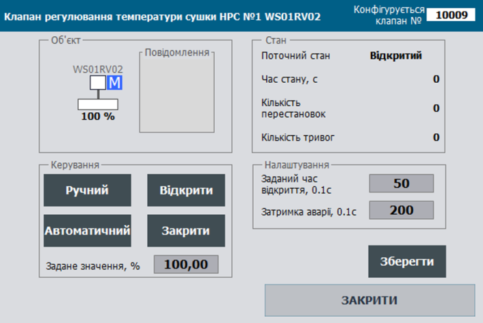

## Клас  VLVA: клапани з аналоговим керуванням

**CLSID=16#202x**

## Загальний опис

Клас реалізовує функції оброблення виконавчого механізму типу клапан з аналоговим керуванням. До цих функцій входить переключення режимів роботи ВМ, керування виконавчим механізмом, налаштування та обробка тривожних подій, керування імітацією, поширення станів до та від підлеглих технологічних змінних та ін..        

Функція класів розрахована для роботи ВМ з аналоговим вихідним сигналом керування та аналоговим вхідним сигналом зворотнього зв'язку від позиціонера.

Для даного типу ВМ наявність вихідної аналогової змінної є обов'язковою, а наявність аналогового зворотного зв'язку, а також сигналів від дискретних датчиків відкрито/закрито є опціональною та визначається автоматично при наявності 0-го індексу або параметра відключення у технологічній змінній.

## Загальні вимоги до функцій VLVA

### Функціональні вимоги 

Датчики та сигнали керування ВМ подаються як змінні AIVAR, AOVAR та DIVAR; ті які не використовуються – подаються як пусті (з індексом 0); наявність/відсутність певних датчиків та сигналів керування означується параметрами.

#### Режими роботи

передбачено наступні режими керування ВМ:

- ручний - керування відбувається оператором за допомогою засобів SCADA/HMI;
- автоматичний - керування відбувається відповідно до алгоритмів запрограмованого в системі керування;
- місцевий - керування відбувається оператором за допомогою кнопок та перемикачів по місцю;

У автоматичному режимі, завдання для ВМ змінюється алгоритмом відповідно до програми керування. У ручному режимі, завдання змінюється тільки відповідно до значення з HMI (може змінитися в залежності від вимог процесу). 

#### Конфігурування ВМ 

Передбачаються два режими конфігурування (MANCFG): 

- ручне
- автоматичне. 

У ручному режимі наявність кінцевих вимикачів та сигналу зворотнього зв'язку задається бітовими параметрами PRM.ZOPNENBL, PRM.ZCLSENBL та PRM.ZPOSENBL. 

У автоматичному режимі ці параметри змінюються автоматично при прив'язці до змінних з ID=0 або їх підключеності. 

Таким чином, наприклад, при виходу з ладу датчика кінцевого положення, його можна тимчасово відключити в конфігурації (вивести з експлуатації для відключення генерування тривог), і клапан автоматично перейде в режим роботи без даного кінцевика. 

Ручне конфігурування типу клапану поки не знайшло свого використання.

#### Оброблення тривог

Для ВМ типу VLVA не передбачено відслідковування тривог

#### Оброблення статистичної інформації

Для ВМ типу VLVA передбачено відслідковування наступного типу статистичної інформації 

- кількість перестановок;
- кількість тривог.

Статистична інформація скидається при проходженні відповідних команд.

## Рекомендації щодо використання в HMI

Приклад налаштування функцій клапанів з аналоговим керуванням на HMI наведений на рис.



Рис. Приклад налаштування функцій клапанів з дискретних керуванням на HMI.


## Загальні вимоги щодо структури змінних класів

#### VLVA_HMI

Тут і далі `adr` задається як зміщення в структурі в 16-бітних словах

| name | type | adr  | bit  | descr                                    |
| ---- | ---- | ---- | ---- | ---------------------------------------- |
| STA  | UINT | 0    |      | біти станів                              |
| CMD  | UINT | 1    |      | команда керування                        |
| ALM  | Int  | 2    |      | біти тривог                              |
| POS  | Int  | 3    |      | позиція ВМ (0-10000) - зворотній зв'язок |
| CPOS | REAL | 4    |      | позиція ВМ (0-100%) - задане значення    |

#### VLVA_CFG

| name         | type      | adr  | bit  | Опис                                                         |
| ------------ | --------- | ---- | ---- | ------------------------------------------------------------ |
| ID           | UINT      | 0    |      | унікальний ідентифікатор ВМ                                  |
| CLSID        | UINT      | 1    |      | ідентифікатор класу ВМ                                       |
| STA          | UINT      | 2    |      | біти станів, може бути задіяна як структура VLVA_STA         |
| STA_b0       | BOOL      | 2    | 0    | резерв                                                       |
| STA_b1       | BOOL      | 2    | 1    | резерв                                                       |
| STA_b2       | BOOL      | 2    | 2    | резерв                                                       |
| STA_b3       | BOOL      | 2    | 3    | резерв                                                       |
| STA_b4       | BOOL      | 2    | 4    | резерв                                                       |
| STA_OPND     | BOOL      | 2    | 5    | =1 Відкритий (16#0080)                                       |
| STA_CLSD     | BOOL      | 2    | 6    | =1 Закритий (16#0100)                                        |
| STA_b7       | BOOL      | 2    | 7    | резерв                                                       |
| STA_b8       | BOOL      | 2    | 8    | резерв                                                       |
| STA_DISP     | BOOL      | 2    | 9    | =1 дистанційний режим (з ПК/ОП) (16#0200)                    |
| STA_MANBX    | BOOL      | 2    | 10   | =1 Ручний зі щита (за зворотнім зв'язком)                    |
| STA_INIOTBUF | BOOL      | 2    | 11   | =1 - змінна в IOT буфері                                     |
| STA_INBUF    | BOOL      | 2    | 12   | =1 - змінна в буфері                                         |
| STA_FRC      | BOOL      | 2    | 13   | =1 хоча би одна зі змінних в об’єкті форсована (для зручності відображення при наладці) |
| STA_SML      | BOOL      | 2    | 14   | =1 режим симуляції                                           |
| STA_BLCK     | BOOL      | 2    | 15   | =1 Заблокований                                              |
| ALM          | UINT      | 3    |      | біти тривог, може бути задіяна як структура VLVA_ALM         |
| ALM_b0       | BOOL      | 3    | 0    | резерв                                                       |
| ALM_b1       | BOOL      | 3    | 1    | резерв                                                       |
| ALM_b2       | BOOL      | 3    | 2    | резерв                                                       |
| ALM_b3       | BOOL      | 3    | 3    | резерв                                                       |
| ALM_b4       | BOOL      | 3    | 4    | резерв                                                       |
| ALM_b5       | BOOL      | 3    | 5    | резерв                                                       |
| ALM_b6       | BOOL      | 3    | 6    | резерв                                                       |
| ALM_b7       | BOOL      | 3    | 7    | резерв                                                       |
| ALM_b8       | BOOL      | 3    | 8    | резерв                                                       |
| ALM_b9       | BOOL      | 3    | 9    | резерв                                                       |
| ALM_b10      | BOOL      | 3    | 10   | резерв                                                       |
| ALM_b11      | BOOL      | 3    | 11   | резерв                                                       |
| ALM_b12      | BOOL      | 3    | 12   | резерв                                                       |
| ALM_b13      | BOOL      | 3    | 13   | резерв                                                       |
| ALM_b14      | BOOL      | 3    | 14   | резерв                                                       |
| ALM_b15      | BOOL      | 3    | 15   | резерв                                                       |
| CMD          | ACTTR_CMD | 4    |      | бітові команди                                               |
| PRM          | ACTTR_PRM | 6    |      | біти параметрів                                              |
| POS          | REAL      | 8    |      | позиція ВМ (0-100%) - зворотній зв'язок                      |
| CPOS         | REAL      | 10   |      | позиція ВМ (0-100%) - задане значення                        |
| T_DEASP      | UINT      | 12   |      | Час затримки тривоги в 0.1 секунди                           |
| STEP1        | UINT      | 13   |      | номер кроку                                                  |
| CNTPER       | UINT      | 14   |      | Кількість змін положення                                     |
| CNTALM       | UINT      | 15   |      | Кількість аварій                                             |
| T_STEP1      | UDINT     | 16   |      | Плинний час кроку в мс                                       |
| T_PREV       | UDINT     | 18   |      | час в мс з попереднього виклику, береться зі структури PLC_CFG.TQMS |

#### Команди 

| Атрибут | Тип  | Біт  | Опис                                                         |
| ------- | ---- | ---- | ------------------------------------------------------------ |
| CMD     | UINT |      | Команди:<br />16#0001: відкрити<br/>16#0002: закрити<br/>16#0003: перемкнути<br/>16#0004: підтвердити тривогу<br/>16#0005: скинути тривоги<br/>16#0006: заблокувати<br/>16#0007: розблокувати<br/>16#0008: зупинити автоналаштування<br/>16#0009: запустити автоналаштування<br/>16#000A: включити алгоритм захисту<br/>16#000B: дозвіл на керування<br/>16#000C: дозвіл на керування по наявності тиску в системі<br/>16#000D: запуск калібрування датчика шивдкості<br/> E..10 - вільні<br/>16#0011: запустити<br/>16#0012: зупинити<br/>16#0013: включити реверс<br/>14-20 - вільні<br/>16#0021: більше<br/>16#0022: менше<br/>23-9F - вільні<br/>16#0100: прочитати конфігурацію<br/>16#0101: записати конфігурацію<br/>102-2FF вільні<br/>16#0300: перемкнути ручний/автомат<br/>16#0301: включити ручний режим<br/>16#0302: включити автоматичний режим<br/>16#0313: включити місцевий режим<br/>16#0314: відключити місцевий режим<br/>16#0315: вивести з експлуатації<br/>16#0316: ввести в експлуатацію<br/>316..400 - вільні<br/>16#0401: скинути лічильник тривог <br/>16#0402: скинути лічильник спрацювань/переміщень <br/>16#0403: скинути лічильник спрацювань/переміщень <br/>16#0404: скинути лічильник спрацювань/переміщень <br/> |


## Робота з буфером

Повинна бути реалізована функція роботи з класичним буфером.

- Буфер рекомендується використовувати один для всіх типів ВМ.

- Факт зайнятості буфера перевіряється за рівністю ідентифікатора класу `CLSID` та ідентифікатора ВМ `ID`

- при захопленні буферу:

  - `ACTBUF.STA = ACTTR_CFG.STA`
  - `ACTTR_CFG.CMD = ACTBUF.CMD`  якщо той не дорівнює нулю (для можливості команд з іншого джерела)

- конфігурація ВМ повинна зчитуватися в буфер при отриманні команд:

  - оновлення технологічної змінної, яка вже записана в буфер`ACTTR_HMI.CMD` = 16#0100; 

- конфігурація ВМ повинна записуватись з буфера при отриманні команд:

  - `ACTBUF.CMD` = 16#0101; 	

  

Повинна бути реалізована функція роботи з параметричними двунаправленими буферами ACTBUFIN<->ACTBUFOUT.

- Використовується 2 буфери: 
  - вхідний `ACTBUFIN` - використовується для обробки команд (при рівності CLSID та ID) та запису інформації в ВМ 
  - вихідний `ACTBUFOUT` - використовується для зчитування інформації з ВМ при отриманні команди на читання з `ACTBUFIN`
- Буфери рекомендується використовувати одну пару для всіх ВМ.
- Факт зайнятості буфера не можливий, оскільки буфер реалізований через 2 буферні змінні ACTBUFIN та ACTBUFOUT через які інформація проходить для подальшої передачі її в ВМ або внутрішній буфер засобу HMI (по аналогії з параметричним обміном PKW в профілі PROFIDRIVE)
- конфігурація ВМ повинна зчитуватися в вихідний буфер при:
  - рівності класів `ACTTR_CFG.CLSID=ACTBUFIN.CLSID` , ідентифікаторів `ACTCFG.ID=ACTBUFIN.ID` та отримання команди з вхідного буфера `ACTBUFIN.CMD=16#100 `
- конфігурація ВМ повинна записуватись з вхідного буфера при:
  - рівності класів `ACTTR_CFG.CLSID=ACTBUFIN.CLSID` , ідентифікаторів `ACTTR_CFG.ID=ACTBUFIN.ID` та отримання команди з вхідного буфера `ACTBUFIN.CMD=16#101 `


## Вимоги щодо реалізації інтерфейсу

У інтерфейс повинні передаватися наступні параметри:

- VLVACFG - INOUT
- VLVAHMI - INOUT
- технологічні змінні датчиків ВМ (датчики кінцевих положень, кнопки по місцю і т.д.) - INOUT
- технологічні змінні виходів ВМ (соленоїд, пускачі і т.д.) - INOUT

За умови, що немає можливості доступатися до зовнішніх змінних з середини функцій, передається `PLC_CFG`, `ACTBUF`,  `ACTBUFIN`, `ACTBUFOUT` ; альтернативно можна використовувати інші інтерфейси для використання в середині `PLC_CFG` 


## Ініціалізація ВМ при першому циклі роботи

Запис ID, CLSID за замовченням виконується в результаті виконання програмної секції `initvars`. 

Для кожної технологічної змінної в `initvars` повиннен бути наступний фрагмент програми для запису ID, CLSID

```
"ACT".VLVA.ID:=10001;   "ACT".VLVA.CLSID:=16#2020;
```

Також виконується ініціалізація всередині функції обробки ВМ, в результаті

- якщо уставка затримки часу тривоги не виставлена присвоюється `VLVA.T_DEASP := 200; ` 
- технологічні тривоги для датчиків не використовуються, наприклад  `SOPN.PRM.ISALM := false; SOPN.PRM.ISWRN := false;`


## Вимоги щодо реалізації програми користувача

- Функції обробки ВМ повинні викликатися з кожним викликом тієї задачі, до якої вони прив'язані.
- При першому старті (`PLC_CFG.SCN1`) повинні ініціалізуватися ідентифікатори ВМ та ідентифікатори класів, 

Реалізація програми функцій обробки ВМ складається з наступних етапів:

#### `VLVA_to_ACT` 

зчитування інформації з змінної яка відповідає типу ВМ до змінної типу універсального ВМ - виконується для зручності і уніфікації подальшої обробки, виконується функцією `VLVA_to_ACT` 

У інтерфейс повинні передаватися наступні параметри:

- VLVACFG - INOUT - конфігураційна змінна ВМ
- VLVAHMI - INOUT - HMI змінна ВМ
- ACTCFG - INOUT - тип універсального ВМ, використовується для внутрішньої обробки для універсалізації

За умови, що немає можливості доступатися до зовнішніх змінних з середини функцій, передається `PLC_CFG`, `ACTBUF`,  `ACTBUFIN`, `ACTBUFOUT` ; альтернативно можна використовувати інші інтерфейси для використання в середині `PLC_CFG` 

```pascal
#ACTCFG.ID:= #VLVACFG.ID;
#ACTCFG.CLSID:= #VLVACFG.CLSID;
#ACTCFG.CMD:= #VLVACFG.CMD;
#ACTCFG.PRM:= #VLVACFG.PRM;
#ACTCFG.T_DEASP:= #VLVACFG.T_DEASP;
#ACTCFG.POS:= #VLVACFG.POS;
#ACTCFG.CPOS:= #VLVACFG.CPOS;
#ACTCFG.STEP1:= #VLVACFG.STEP1;
#ACTCFG.CNTPER:= #VLVACFG.CNTPER;
#ACTCFG.CNTALM:= #VLVACFG.CNTALM;
#ACTCFG.T_STEP1:= #VLVACFG.T_STEP1;
#ACTCFG.T_PREV:= #VLVACFG.T_PREV;

#ACTCFG.STA.OPND:= #VLVACFG.STA.OPND;
#ACTCFG.STA.CLSD:= #VLVACFG.STA.CLSD;
#ACTCFG.STA.DISP:= #VLVACFG.STA.DISP;
#ACTCFG.STA.MANBX:= #VLVACFG.STA.MANBX;
#ACTCFG.STA.INBUF:= #VLVACFG.STA.INBUF;
#ACTCFG.STA.FRC:= #VLVACFG.STA.FRC;
#ACTCFG.STA.SML:= #VLVACFG.STA.SML;
#ACTCFG.STA.BLCK:= #VLVACFG.STA.BLCK;

#ACTCFG.CMDHMI:=#VLVAHMI.CMD;


```


####  `ACT_PRE`

попередня обробка ВМ: ініціалізація STA, ALM, CMD, обробка INBUF, SML, підрахунок dt - виконується функцією `ACT_PRE`;

У інтерфейс повинні передаватися наступні параметри:

- ACTCFG - INOUT - тип універсального ВМ, використовується для внутрішньої обробки для універсалізації
- STA - INOUT - тип набору статусів універсального ВМ, використовується для внутрішньої обробки для універсалізації
- ALMs - INOUT - тип набору тривог універсального ВМ, використовується для внутрішньої обробки для універсалізації
- CMD - INOUT - тип набору команд  універсального ВМ, використовується для внутрішньої обробки для універсалізації
- dt - INOUT - різниця між викликами функції обробки ВМ

За умови, що немає можливості доступатися до зовнішніх змінних з середини функцій, передається `PLC_CFG`, `ACTBUF`,  `ACTBUFIN`, `ACTBUFOUT` ; альтернативно можна використовувати інші інтерфейси для використання в середині `PLC_CFG` 

```pascal
(*початкова обробка для усіх ВМ: інціалізація, присвоєння у внутрішні STA, ALM; визначення INBUF, SML, #dt *)
(*first scan*)
IF "SYS".PLCCFG.STA.SCN1 THEN
    (*обнулення бітів структури STA*)
    #ACTCFG.STA.IMSTPD:=FALSE;
    #ACTCFG.STA.MANRUNING:=FALSE;
    #ACTCFG.STA.STOPING:=FALSE;
    #ACTCFG.STA.OPNING:=FALSE;
    #ACTCFG.STA.CLSING:=FALSE;
    #ACTCFG.STA.OPND:=FALSE;
    #ACTCFG.STA.CLSD:=FALSE;
    #ACTCFG.STA.MANBXOUT:=FALSE;
    #ACTCFG.STA.WRKED:=FALSE;
    #ACTCFG.STA.DISP:=FALSE;
    #ACTCFG.STA.MANBX:=FALSE;
    #ACTCFG.STA.INBUF:=FALSE;
    #ACTCFG.STA.FRC:=FALSE;
    #ACTCFG.STA.SML:=FALSE;
    #ACTCFG.STA.BLCK:=FALSE;
    #ACTCFG.STA.STRTING:=FALSE;
    #ACTCFG.STA.STOPED:=FALSE;
    #ACTCFG.STA.SLNDBRK:=FALSE;
    #ACTCFG.STA.CMDACK:=FALSE;
    #ACTCFG.STA.SPD1:=FALSE;
    #ACTCFG.STA.SPD2:=FALSE;
    #ACTCFG.STA.STA_b21:=FALSE;
    #ACTCFG.STA.STRT_DELAY:=FALSE;
    #ACTCFG.STA.STOP_DELAY:=FALSE;
    #ACTCFG.STA.DBLCKACT:=FALSE;
    #ACTCFG.STA.ISREVERS:=FALSE;
    #ACTCFG.STA.ISANALOG:=FALSE;
    #ACTCFG.STA.INIOTBUF:=FALSE;
    #ACTCFG.STA.SPDMONON:=FALSE;
    #ACTCFG.STA.SPDCALIBRON:=FALSE;
    #ACTCFG.STA.MAINT:=FALSE;
    #ACTCFG.STA.STA_b31:=FALSE;
    (*обнулення бітів структури ALM*)
    #ACTCFG.ALM.ALMSTRT:=FALSE;
    #ACTCFG.ALM.ALMSTP:=FALSE;
    #ACTCFG.ALM.ALMOPN:=FALSE;
    #ACTCFG.ALM.ALMCLS:=FALSE;
    #ACTCFG.ALM.ALMOPN2:=FALSE;
    #ACTCFG.ALM.ALMCLS2:=FALSE;
    #ACTCFG.ALM.ALMSHFT:=FALSE;
    #ACTCFG.ALM.ALM:=FALSE;
    #ACTCFG.ALM.ALMBELL:=FALSE;
    #ACTCFG.ALM.WRN:=FALSE;
    #ACTCFG.ALM.WRNSPD:=FALSE;
    #ACTCFG.ALM.ALMSPD:=FALSE;
    #ACTCFG.ALM.WRNSPD2:=FALSE;
    #ACTCFG.ALM.ALMSPD2:=FALSE;
    #ACTCFG.ALM.ALMPWR1:=FALSE;
    #ACTCFG.ALM.ALMSTPBTN:=FALSE;
    #ACTCFG.ALM.ALMINVRTR:=FALSE;
    #ACTCFG.ALM.ALM_b17:=FALSE;
    #ACTCFG.ALM.ALM_b18:=FALSE;
    #ACTCFG.ALM.ALM_b19:=FALSE;
    #ACTCFG.ALM.ALM_b20:=FALSE;
    #ACTCFG.ALM.ALM_b21:=FALSE;
    #ACTCFG.ALM.ALM_b22:=FALSE;
    #ACTCFG.ALM.ALM_b23:=FALSE;
    #ACTCFG.ALM.ALM_b24:=FALSE;
    #ACTCFG.ALM.ALM_b25:=FALSE;
    #ACTCFG.ALM.ALM_b26:=FALSE;
    #ACTCFG.ALM.ALM_b27:=FALSE;
    #ACTCFG.ALM.ALM_b28:=FALSE;
    #ACTCFG.ALM.ALM_b29:=FALSE;
    #ACTCFG.ALM.ALM_b30:=FALSE;
    #ACTCFG.ALM.ALM_b31:=FALSE;
    IF #ACTCFG.T_OPNSP = 0 THEN #ACTCFG.T_OPNSP:=50; END_IF;
END_IF;

#STA:=#ACTCFG.STA;
#ALMs := #ACTCFG.ALM;
#CMD := #ACTCFG.CMD;
#ALMs.ALMBELL:= false; (*дзвінок знімається через один цикл*)
#STA.INBUF := (#ACTCFG.ID = "BUF".ACTBUF.ID AND "BUF".ACTBUF.ID <> 0 AND #ACTCFG.CLSID = "BUF".ACTBUF.CLSID);(*знаходиться в буфері конфігурування*)
#STA.SML := "SYS".PLCCFG.STA.SMLALL;(*режим імітації*)
#dt := "SYS".PLCCFG.TQMS - #ACTCFG.T_PREV; (*різниця між викликами в мс*)
IF #dt<1 THEN #dt:=1; END_IF;


```


####  `ACT_CMDCTRL`

обробка команд - виконується стандартним для всіх ВМ обробчиком команд, який реалізовано у вигляді функції `ACT_CMDCTRL`.

У інтерфейс повинні передаватися наступні параметри:

- ACTCFG - INOUT - тип універсального ВМ, використовується для внутрішньої обробки для універсалізації
- STA - INOUT - тип набору статусів універсального ВМ, використовується для внутрішньої обробки для універсалізації
- CMD - INOUT - тип набору команд  універсального ВМ, використовується для внутрішньої обробки для універсалізації

За умови, що немає можливості доступатися до зовнішніх змінних з середини функцій, передається `PLC_CFG`, `ACTBUF`,  `ACTBUFIN`, `ACTBUFOUT` ; альтернативно можна використовувати інші інтерфейси для використання в середині `PLC_CFG` 

```pascal
(*блок обробляє команди з HMI та IOT, формує на основі них CMD, змінює статусні біти стану, обнуляє автоматичні команди в ручному режимі *)
(*вибір джерела конфігураційної/керівної команди HMI згідно пріоритету якщо команди надійшли одночасно*)
IF #ACTCFG.CMDHMI > 16#80 THEN (*конфіг кмд з HMI*)
    #CMDINT := #ACTCFG.CMDHMI;
ELSIF #STA.INBUF AND "BUF".ACTBUF.CMDHMI > 16#80 THEN (*конфіг кмд з буферу*)
    #CMDINT := "BUF".ACTBUF.CMDHMI;
ELSIF #ACTCFG.CMDHMI < 16#80 AND #ACTCFG.CMDHMI > 0 AND #STA.DISP THEN(*керування клапаном з елементу в ручному режимі*)
    #CMDINT := #ACTCFG.CMDHMI;
ELSIF #STA.INBUF AND "BUF".ACTBUF.CMDHMI < 16#80 AND "BUF".ACTBUF.CMDHMI > 0 AND #STA.DISP THEN (* керування клапаном з буферу в ручному режимі*)
    #CMDINT := "BUF".ACTBUF.CMDHMI; (* команда звідти інакше ігнорити*)
ELSE
    #CMDINT := 0;
END_IF;

(*у рчуному режимі усі автоматичні команди керування обнуляються*)
IF #STA.DISP THEN
    #CMD.OPN:=FALSE;
    #CMD.CLS:=FALSE;
    #CMD.TOGGLE:=false;
    #CMD.START:=false;
    #CMD.STOP:=false;
    #CMD.REVERS:=false;
    #CMD.TOGGLE:=FALSE;
END_IF;

(*команди операторського керування
16#0001 - CMD_OPN
16#0002 - CMD_CLS
16#0004 - CMD_ALMRST
16#0008 - CMD_DBLK
16#0010 - CMD_STOP
*)

(* команди HMI*)
CASE #CMDINT OF
    16#0001:(*відкрити *)
        #CMD.OPN := TRUE;
        #CMD.CLS := FALSE;
    16#0002:(*закрити *)
        #CMD.CLS := TRUE;
        #CMD.OPN := FALSE;
    16#0003:(*перемкнути*)
        #CMD.TOGGLE := TRUE;
    16#0004:(* Підтвердити тривогу*)
        #CMD.ALMACK:= TRUE;
    16#0005:(*Скинути тривоги *)
        #CMD.ALMRESET:= TRUE;
    16#0006:
        #CMD.BLCK:= TRUE; (*Заблокувати*)
    16#0007:
        #CMD.DBLCK:= TRUE; (*Розблокувати*)
    16#0008:
        #CMD.STOPTUN:= TRUE;(*Зупинити автоналаштування*)
    16#0009:
        #CMD.TUNING:= TRUE;(*Запустити автоналаштування *)
    16#000A:
        #CMD.PROTECT:= TRUE;(*Включити алгоритм захисту *)
    16#000B: (*=1 дозвіл на керування*)
        #CMD.RESOLUTION:= TRUE; (*//на один цикл*)
    16#000C: (*дозвіл на керування по наявності тиску в системі*)
        #CMD.P_RESOLUTION := TRUE; (*//на один цикл*)
    16#000D: (*=1 запуск калібрування датчика шивдкості*)
        #CMD.DBLCKACTTOGGLE := true;
        #STA.DBLCKACT := NOT #STA.DBLCKACT;
        
        (*E..10 - вільні*)
        
    16#0011:(*Запустити*)
        #CMD.START:= TRUE;
        #CMD.STOP:= false;
    16#0012: (*Зупинити*)
        #CMD.STOP:= TRUE;
        #CMD.START:= false;
    16#0013:(*19*)
        #CMD.REVERS:= TRUE;(*Включити реверс *)
        (*14-20 - вільні*)
    16#0021:
        #CMD.UP:= TRUE; (*Більше*)
    16#0022:
        #CMD.DWN:= TRUE; (*Менше*)
        (*23-9F - вільні*)
        (*починаючи з 16#0080 тільки для роботи з буфера і керування режимом*)
    16#0100: (*прочитати конфігурацію*)
        #CMD.BUFLOAD:=true;
        "BUF".ACTBUF := #ACTCFG;
    16#0101: (*записати конфігурацію*)
        #ACTCFG.PRM := "BUF".ACTBUF.PRM;
        #ACTCFG.T_DEASP := "BUF".ACTBUF.T_DEASP;
        #ACTCFG.T_OPNSP := "BUF".ACTBUF.T_OPNSP;
        #ACTCFG.STOP_DELAY := "BUF".ACTBUF.STOP_DELAY;
    (*102-2FF вільні*)
    16#0300: (*перемкнути ручний/автомат*)
        #STA.DISP := NOT #STA.DISP;
    16#0301: (*РУЧНИЙ РЕЖИМ*)
        #STA.DISP := TRUE;
    16#0302: (*АВТО РЕЖИМ*)
        #STA.DISP := FALSE;
    16#0313:(* включити місцевий режим*)
        #STA.MANBXOUT := true;
        #STA.MANBX := true;
        #STA.DISP := TRUE;
        (*#CMD.CRMT:= TRUE; //чи потрібен з програми?*)
    16#0314:(* відключити місцевий режим*)
        #STA.MANBXOUT := false;
        #STA.MANBX := false;
        (*#CMD.CLCL:= TRUE; //чи потрібен з програми?*)
    16#0315: (*=1 вивести з експлуатації*)
        #CMD.OUTSRVC := true;
    16#0316: (*=1 ввести в експлуатацію*)
        #CMD.INSRVC := true;
        (*керування статистикою*)
    16#0401:(* скинути лічильник тривог 1025*)
        #ACTCFG.CNTALM:=0;
    16#0402:(* скинути лічильник спрацювань/переміщень 1026*)
        #ACTCFG.CNTPER:=0;
    16#0403:(* скинути лічильник спрацювань/переміщень 1027*)
        #ACTCFG.TQ_TOTAL:=0;
    16#0404:(* скинути лічильник спрацювань/переміщень 1028*)
        #ACTCFG.TQ_LAST :=0;
END_CASE;

(*проходження команд розблокувати-заблокувати з буфера та НМІ*)
IF #ACTCFG.CMDHMI = 16#0006 OR ("BUF".ACTBUF.CMDHMI = 16#0006 AND #STA.INBUF) THEN #CMD.BLCK:= TRUE; END_IF;
IF #ACTCFG.CMDHMI = 16#0007 OR ("BUF".ACTBUF.CMDHMI = 16#0007 AND #STA.INBUF) THEN #CMD.DBLCK:= TRUE; END_IF;

#CMDINT:=0;
#ACTCFG.CMDHMI:=0;
IF #STA.INBUF THEN
    "BUF".ACTBUF.CMDHMI:=0;
END_IF;
```


#### `VLVAFN`

безпосередня обробка ВМ в функції `VLVAFN`

```pascal
"VLVA_to_ACT"(VLVACFG:=#ACTCFG, VLVAHMI:=#ACTHMI, ACTCFG:=#ACTCFGu);
(*попередня обробка: ініт STA, ALM, CMD, INBUF, SML, dt *)
"ACT_PRE" (ACTCFG := #ACTCFGu, STA := #STA, ALMs := #ALMs, CMD := #CMD, dt := #dT);
(*значення за замовченням*)
IF "SYS".PLCCFG.STA.SCN1  THEN (*first scan*)
    IF #ACTCFGu.T_OPNSP <= 0 THEN (*якщо уставка часу выдкриття не виставлена*)
        #ACTCFGu.T_OPNSP := 500; (*5 секунд*)
    END_IF;
    IF #ACTCFGu.T_DEASP <= 0 THEN (*якщо уставка затримки часу тривоги не виставлена*)
        #ACTCFGu.T_DEASP := 200; (*2 секунди*)
    END_IF;
    (*технологічні тривоги для датчиків не використовуються*)
    IF #SOPN.ID <> 0 THEN
        #SOPN.PRM.ISALM := false; (*ISALM*)
        #SOPN.PRM.ISWRN := false; (*ISWRN*)
    END_IF;
    IF #SCLS.ID <> 0 THEN
        #SCLS.PRM.ISALM := false; (*ISALM*)
        #SCLS.PRM.ISWRN := false; (*ISWRN*)
    END_IF;
END_IF;

(* --------------------- блок параметрів
//параметри перевірка наявності/використання датчиків на вході*)
#ACTCFGu.PRM.PRM_MANCFG:=false;(*у цьому проекті не буде ручного конфігурування параметрів IO*)
#ACTCFGu.PRM.PRM_ZCLSENBL := NOT #SCLS.PRM.DSBL AND #SCLS.ID <> 0;
#ACTCFGu.PRM.PRM_ZOPNENBL := NOT #SOPN.PRM.DSBL AND #SOPN.ID <> 0;
#ACTCFGu.PRM.PRM_ALMENBL := false;
#ACTCFGu.PRM.PRM_ZWRKENBL := false;
#ACTCFGu.PRM.PRM_ZPOSENBL := NOT #POS.PRM.DSBL AND #POS.ID <> 0;
#ACTCFGu.PRM.PRM_PWRENBL := false;
#ACTCFGu.PRM.PRM_BTNSTPENBL := false;
#ACTCFGu.PRM.PRM_ALMENBL := false;
#ACTCFGu.PRM.PRM_SELLCLENBL := false;
(*параметри імпульсного керування*)
#ACTCFGu.PRM.PRM_PULSCTRLENBL := FALSE;

(*------------------- блок для режиму імітації
//режим імітації підлеглих від хозяїна*)
#SOPN.STA.SML := #STA.SML;
#SCLS.STA.SML := #STA.SML;

(*логіка для режиму імітації  *)
IF #STA.SML THEN
    #ACTCFGu.POS:=#ACTCFG.CPOS;
    IF #ACTCFGu.POS<0.0 THEN #ACTCFGu.POS:=0.0; END_IF;
    IF #ACTCFGu.POS>100.0 THEN #ACTCFGu.POS:=100.0; END_IF;
    
    (*імітація датчиків *)
    IF NOT #SOPN.STA.FRC THEN
        #SOPN.STA.VALB:= #ACTCFGu.POS>99.0;
    END_IF;
    IF NOT #SCLS.STA.FRC THEN
        #SCLS.STA.VALB:= #ACTCFGu.POS<3.0;
    END_IF;
    
END_IF;

(*-------------------- блок обробки команд
//стандартний обробник команд*)
"ACT_CMDCTRL"(ACTCFG:=#ACTCFGu, CMD:=#CMD, STA:=#STA);


(* -------------------  блок обробки станів датчиків відкриття/закриття, або їх заміна на логіку*)
IF NOT #ACTCFGu.PRM.PRM_ZPOSENBL THEN       (*// ЯКЩО НЕМА СИГНАЛ ЗВОРОТНЬОГО ЗВЯЗКУ ПОЛОЖЕННЯ*)
    #SPOS1:=#CPOS.VAL;                   (* // ТО ПОЛОЖЕННЯ ПРИРІВНЮЄМО ЗАДАНОМУ ЗНАЧЕННЮ*)
ELSE
    #SPOS1:=#POS.VAL;                   (* // ІНАКШЕ БЕРЕЗ ЗНАЧЕННЯ З ДАТЧИКА*)
END_IF;
IF NOT #ACTCFGu.PRM.PRM_ZOPNENBL THEN       (*// ЯКЩО НЕМА КІНЦЕВИКА ВІДКРИТО*)
    #SOPN1:= #SPOS1>=3.0;                     (* // ТО ЗНАЧЕННЯ ВІДКРИТОСТІ БЕРЕМ ЯКЩО ПОЗИЦІЯ БІЛЬШЕ 3*)
ELSE
    #SOPN1:=#SOPN.STA.VALB;                 (* // ІНАКШЕ БЕРЕЗ ЗНАЧЕННЯ З ДАТЧИКА*)
END_IF;
IF NOT #ACTCFGu.PRM.PRM_ZCLSENBL THEN     (*  // ЯКЩО НЕМА КІНЦЕВИКА ЗАКРИТО*)
    #SCLS1:=#SPOS1<3.0;                      (* // ТО ЗНАЧЕННЯ ВІДКРИТОСТІ БЕРЕМ ЯКЩО ПОЗИЦІЯ МЕНШЕ 3*)
ELSE
    #SCLS1:=#SCLS.STA.VALB;                 (* // ІНАКШЕ БЕРЕЗ ЗНАЧЕННЯ З ДАТЧИКА*)
END_IF;


(*----------------- автомат станів позиції та тривог позиції  *)
CASE #ACTCFGu.STEP1 OF
    0:(*ініціалізація*)
        #ACTCFGu.STEP1 := 1;
        #ACTCFGu.T_STEP1 := 0;
    1, 4, 5: (*зупинений, 1 - зупинено в проміжному стані 4 - зупинений у відкритому стані, 5 - зупинений в закритому стані*)
        IF #ACTCFGu.POS>3.0 AND #ACTCFGu.STEP1 <> 4 THEN
            #ACTCFGu.STEP1 := 4;
            #ACTCFGu.T_STEP1 := 0;
        END_IF;
        IF #ACTCFGu.POS<3.0 AND #ACTCFGu.STEP1 <> 5  THEN
            #ACTCFGu.STEP1 := 5;
            #ACTCFGu.T_STEP1 := 0;
        END_IF;
    ELSE  (*невизначеність*)
        #ACTCFGu.STEP1 := 0;
END_CASE;
(*автомат станів побітово*)
#STA.IMSTPD:= #ACTCFGu.STEP1 = 0 OR #ACTCFGu.STEP1 = 1;
#STA.OPND:= #ACTCFGu.STEP1 = 4;
#STA.CLSD:= #ACTCFGu.STEP1 = 5;


(*----------------------------- керування ВМ*)

(*керування OPN/CLS тільки при дозволі керування або тимчасовому розблокуванні*)
IF (#CMD.RESOLUTION OR "SYS".PLCCFG.STA_PERM.%X6) AND NOT #STA.BLCK THEN
    ;
ELSE
    #ACTCFG.CPOS:=0.0;
    #ACTHMI.CPOS:=0.0;
END_IF;

(*-------------------- режими*)

#STA.FRC := #CPOS.STA.FRC AND #CPOS.ID<>0
OR #POS.STA.FRC AND #POS.ID<>0
OR #SOPN.STA.FRC AND #SOPN.ID<>0
OR #SCLS.STA.FRC AND #SCLS.ID<>0;

(*------------------- зведення ксатомних тривог, режимів, бітів*)
IF #STA.DISP THEN
    "SYS".PLCCFG.STA.DISP := TRUE;
    "SYS".PLCCFG.CNTMAN := "SYS".PLCCFG.CNTMAN + 1;
END_IF;

IF #STA.BLCK THEN
    "SYS".PLCCFG.STA.BLK := TRUE;
END_IF;

#ALMs.ALM := false;
IF #ALMs.ALM THEN
    "SYS".PLCCFG.ALM1.ALM := true;
    "SYS".PLCCFG.CNTALM := "SYS".PLCCFG.CNTALM + 1;
END_IF;


#ACTCFG.POS := #SPOS1;

IF #STA.DISP THEN
    "SYS".PLCCFG.STA.DISP := TRUE;
    "SYS".PLCCFG.CNTMAN := "SYS".PLCCFG.CNTMAN + 1;
END_IF;

IF #STA.BLCK THEN
    "SYS".PLCCFG.STA.BLK := TRUE;
END_IF;

(*заключна обробка: зведення в PLC.CFG, STA, ALM, CMD, INBUF, SML, dt *) 
"ACT_POST"(ACTCFG:=#ACTCFGu, STA:=#STA, ALMs:=#ALMs, CMD:=#CMD, dt := #dT);


"ACT_to_VLVA"(VLVACFG:=#ACTCFG, VLVAHMI:=#ACTHMI, ACTCFG:=#ACTCFGu);


(*------------------- вибір джерела завдання*)
IF #ACTCFGu.STA.INBUF AND #ACTCFGu.STA.DISP THEN
    #ACTCFGu.CPOS := "BUF".ACTBUF.CPOS;
    #ACTHMI.CPOS := #ACTCFGu.CPOS;
    #ACTCFG.CPOS := #ACTCFGu.CPOS;
ELSIF NOT #ACTCFGu.STA.INBUF AND #ACTCFGu.STA.DISP THEN
    #ACTCFGu.CPOS := #ACTHMI.CPOS;
    #ACTHMI.CPOS := #ACTCFGu.CPOS;
    #ACTCFG.CPOS := #ACTCFGu.CPOS;
ELSE
    #ACTCFGu.CPOS := #ACTCFG.CPOS;
    #ACTHMI.CPOS := #ACTCFGu.CPOS;
    #ACTCFG.CPOS := #ACTCFGu.CPOS;
END_IF;
#CPOS.VAL:=#ACTCFGu.CPOS;

(*реалізація читання конфігураційних даних в буфер out*)
IF (UINT_TO_WORD(#ACTCFG.CLSID) AND 16#FFF0)=(UINT_TO_WORD("BUF".ACTBUFIN.CLSID) AND 16#FFF0) AND #ACTCFG.ID="BUF".ACTBUFIN.ID AND "BUF".ACTBUFIN.CMDHMI = 16#100 THEN
    (* MSG 200-Ok 400-Error
    // 200 - Дані записані
    // 201 - Дані прочитані   *)
    "BUF".ACTBUFOUT.MSG := 201;
    
    "BUF".ACTBUFOUT.T_DEASP := #ACTCFG.T_DEASP;
    
    "BUF".ACTBUFIN.CMDHMI :=0;
END_IF;

(*реалізація запису конфігураційних даних з буфер in в технологічну змінну*)
IF (UINT_TO_WORD(#ACTCFG.CLSID) AND 16#FFF0)=(UINT_TO_WORD("BUF".ACTBUFIN.CLSID) AND 16#FFF0) AND #ACTCFG.ID="BUF".ACTBUFIN.ID AND "BUF".ACTBUFIN.CMDHMI = 16#101 THEN
    (* MSG 200-Ok 400-Error
    // 200 - Дані записані
    // 201 - Дані прочитані *)
    
    "BUF".ACTBUFOUT:="BUF".ACTBUFIN;
    
    #ACTCFG.T_DEASP := "BUF".ACTBUFIN.T_DEASP;
    
    "BUF".ACTBUFOUT.MSG := 200;
    
    "BUF".ACTBUFIN.CMDHMI :=0;
END_IF;

```


####  `ACT_POST`.

заключна обробка ВМ: зведення в PLC.CFG, формування STA та ALM ВМ, онулення CMD, підрахунок dt і т.д який реалізовано у вигляді функції `ACT_POST`.

У інтерфейс повинні передаватися наступні параметри:

- ACTCFG - INOUT - тип універсального ВМ, використовується для внутрішньої обробки для універсалізації
- STA - INOUT - тип набору статусів універсального ВМ, використовується для внутрішньої обробки для універсалізації
- ALMs - INOUT - тип набору тривог універсального ВМ, використовується для внутрішньої обробки для універсалізації
- CMD - INOUT - тип набору команд  універсального ВМ, використовується для внутрішньої обробки для універсалізації
- dt - INOUT - різниця між викликами функції обробки ВМ

За умови, що немає можливості доступатися до зовнішніх змінних з середини функцій, передається `PLC_CFG`, `ACTBUF`,  `ACTBUFIN`, `ACTBUFOUT` ; альтернативно можна використовувати інші інтерфейси для використання в середині `PLC_CFG` 

```pascal
(*кінцева обробка ВМ перед фцією act_to_XXX: оновлення загальних статусних бітів PLC, 
обмеження лічильників тривог, запис в STA, ALM, оновлення буферу*)
(*режими - в PLC*)
(*загальний біт хоча б одного ручного*)
IF #STA.DISP THEN
    "SYS".PLCCFG.STA.DISP := true;
END_IF;
IF #STA.SML THEN
    "SYS".PLCCFG.STA.SML := true;
END_IF;
IF #ACTCFG.CNTALM > 30000 THEN
    #ACTCFG.CNTALM := 30000;
END_IF;
IF #ACTCFG.CNTPER > 30000 THEN
    #ACTCFG.CNTPER := 30000;
END_IF;
#ACTCFG.STA := #STA;
#ACTCFG.ALM := #ALMs;
(*обнулення усіх команд з HMI*)
#ACTCFG.CMDHMI := 0;
(*обнулення усіх команд з програми*)

#ACTCFG.CMD.OPN:=FALSE;
#ACTCFG.CMD.CLS:=FALSE;
#ACTCFG.CMD.TOGGLE:=FALSE;
#ACTCFG.CMD.ALMACK:=FALSE;
#ACTCFG.CMD.ALMRESET:=FALSE;
#ACTCFG.CMD.BLCK:=FALSE;
#ACTCFG.CMD.DBLCK:=FALSE;
#ACTCFG.CMD.STOPTUN:=FALSE;
#ACTCFG.CMD.TUNING:=FALSE;
#ACTCFG.CMD.MAN:=FALSE;
#ACTCFG.CMD.AUTO:=FALSE;
#ACTCFG.CMD.PROTECT:=FALSE;
#ACTCFG.CMD.START:=FALSE;
#ACTCFG.CMD.STOP:=FALSE;
#ACTCFG.CMD.UP:=FALSE;
#ACTCFG.CMD.DWN:=FALSE;
#ACTCFG.CMD.CRMT:=FALSE;
#ACTCFG.CMD.RESOLUTION:=FALSE;
#ACTCFG.CMD.REVERS:=FALSE;
#ACTCFG.CMD.CLCL:=FALSE;
#ACTCFG.CMD.DBLCKACTTOGGLE:=FALSE;
#ACTCFG.CMD.STARTDELAY:=FALSE;
#ACTCFG.CMD.STOPDELAY:=FALSE;
#ACTCFG.CMD.P_RESOLUTION:=FALSE;
#ACTCFG.CMD.BUFLOAD:=FALSE;
#ACTCFG.CMD.OUTSRVC:=FALSE;
#ACTCFG.CMD.INSRVC:=FALSE;
#ACTCFG.CMD.CMD_b27:=FALSE;
#ACTCFG.CMD.CMD_b28:=FALSE;
#ACTCFG.CMD.CMD_b29:=FALSE;
#ACTCFG.CMD.CMD_b30:=FALSE;
#ACTCFG.CMD.CMD_b31:=FALSE;

#CMD.OPN:=FALSE;
#CMD.CLS:=FALSE;
#CMD.TOGGLE:=FALSE;
#CMD.ALMACK:=FALSE;
#CMD.ALMRESET:=FALSE;
#CMD.BLCK:=FALSE;
#CMD.DBLCK:=FALSE;
#CMD.STOPTUN:=FALSE;
#CMD.TUNING:=FALSE;
#CMD.MAN:=FALSE;
#CMD.AUTO:=FALSE;
#CMD.PROTECT:=FALSE;
#CMD.START:=FALSE;
#CMD.STOP:=FALSE;
#CMD.UP:=FALSE;
#CMD.DWN:=FALSE;
#CMD.CRMT:=FALSE;
#CMD.RESOLUTION:=FALSE;
#CMD.REVERS:=FALSE;
#CMD.CLCL:=FALSE;
#CMD.DBLCKACTTOGGLE:=FALSE;
#CMD.STARTDELAY:=FALSE;
#CMD.STOPDELAY:=FALSE;
#CMD.P_RESOLUTION:=FALSE;
#CMD.BUFLOAD:=FALSE;
#CMD.OUTSRVC:=FALSE;
#CMD.INSRVC:=FALSE;
#CMD.CMD_b27:=FALSE;
#CMD.CMD_b28:=FALSE;
#CMD.CMD_b29:=FALSE;
#CMD.CMD_b30:=FALSE;
#CMD.CMD_b31:=FALSE;

(*sta bits pack*)
#ACTCFG.STAHMI1.%X0:= #ACTCFG.STA.IMSTPD;
#ACTCFG.STAHMI1.%X1:= #ACTCFG.STA.MANRUNING;
#ACTCFG.STAHMI1.%X2:= #ACTCFG.STA.STOPING;
#ACTCFG.STAHMI1.%X3:= #ACTCFG.STA.OPNING;
#ACTCFG.STAHMI1.%X4:= #ACTCFG.STA.CLSING;
#ACTCFG.STAHMI1.%X5:= #ACTCFG.STA.OPND;
#ACTCFG.STAHMI1.%X6:= #ACTCFG.STA.CLSD;
#ACTCFG.STAHMI1.%X7:= #ACTCFG.STA.MANBXOUT;
#ACTCFG.STAHMI1.%X8:= #ACTCFG.STA.WRKED;
#ACTCFG.STAHMI1.%X9:= #ACTCFG.STA.DISP;
#ACTCFG.STAHMI1.%X10:= #ACTCFG.STA.MANBX;
#ACTCFG.STAHMI1.%X11:= #ACTCFG.STA.INBUF;
#ACTCFG.STAHMI1.%X12:= #ACTCFG.STA.FRC;
#ACTCFG.STAHMI1.%X13:= #ACTCFG.STA.SML;
#ACTCFG.STAHMI1.%X14:= #ACTCFG.STA.BLCK;
#ACTCFG.STAHMI1.%X15:= #ACTCFG.STA.STRTING;
#ACTCFG.STAHMI2.%X0:= #ACTCFG.STA.STOPED;
#ACTCFG.STAHMI2.%X1:= #ACTCFG.STA.SLNDBRK;
#ACTCFG.STAHMI2.%X2:= #ACTCFG.STA.CMDACK;
#ACTCFG.STAHMI2.%X3:= #ACTCFG.STA.SPD1;
#ACTCFG.STAHMI2.%X4:= #ACTCFG.STA.SPD2;
#ACTCFG.STAHMI2.%X5:= #ACTCFG.STA.STA_b21;
#ACTCFG.STAHMI2.%X6:= #ACTCFG.STA.STRT_DELAY;
#ACTCFG.STAHMI2.%X7:= #ACTCFG.STA.STOP_DELAY;
#ACTCFG.STAHMI2.%X8:= #ACTCFG.STA.DBLCKACT;
#ACTCFG.STAHMI2.%X9:= #ACTCFG.STA.ISREVERS;
#ACTCFG.STAHMI2.%X10:= #ACTCFG.STA.ISANALOG;
#ACTCFG.STAHMI2.%X11:= #ACTCFG.STA.INIOTBUF;
#ACTCFG.STAHMI2.%X12:= #ACTCFG.STA.SPDMONON;
#ACTCFG.STAHMI2.%X13:= #ACTCFG.STA.SPDCALIBRON;
#ACTCFG.STAHMI2.%X14:= #ACTCFG.STA.MAINT;
#ACTCFG.STAHMI2.%X15:= #ACTCFG.STA.STA_b31;

(*alm bits pack*)
#ACTCFG.ALMHMI1.%X0:= #ACTCFG.ALM.ALMSTRT;
#ACTCFG.ALMHMI1.%X1:= #ACTCFG.ALM.ALMSTP;
#ACTCFG.ALMHMI1.%X2:= #ACTCFG.ALM.ALMOPN;
#ACTCFG.ALMHMI1.%X3:= #ACTCFG.ALM.ALMCLS;
#ACTCFG.ALMHMI1.%X4:= #ACTCFG.ALM.ALMOPN2;
#ACTCFG.ALMHMI1.%X5:= #ACTCFG.ALM.ALMCLS2;
#ACTCFG.ALMHMI1.%X6:= #ACTCFG.ALM.ALMSHFT;
#ACTCFG.ALMHMI1.%X7:= #ACTCFG.ALM.ALM;
#ACTCFG.ALMHMI1.%X8:= #ACTCFG.ALM.ALMBELL;
#ACTCFG.ALMHMI1.%X9:= #ACTCFG.ALM.WRN;
#ACTCFG.ALMHMI1.%X10:= #ACTCFG.ALM.WRNSPD;
#ACTCFG.ALMHMI1.%X11:= #ACTCFG.ALM.ALMSPD;
#ACTCFG.ALMHMI1.%X12:= #ACTCFG.ALM.WRNSPD2;
#ACTCFG.ALMHMI1.%X13:= #ACTCFG.ALM.ALMSPD2;
#ACTCFG.ALMHMI1.%X14:= #ACTCFG.ALM.ALMPWR1;
#ACTCFG.ALMHMI1.%X15:= #ACTCFG.ALM.ALMSTPBTN;
#ACTCFG.ALMHMI2.%X0:=#ACTCFG.ALM.ALMINVRTR;
#ACTCFG.ALMHMI2.%X1:=#ACTCFG.ALM.ALM_b17;
#ACTCFG.ALMHMI2.%X2:=#ACTCFG.ALM.ALM_b18;
#ACTCFG.ALMHMI2.%X3:=#ACTCFG.ALM.ALM_b19;
#ACTCFG.ALMHMI2.%X4:=#ACTCFG.ALM.ALM_b20;
#ACTCFG.ALMHMI2.%X5:=#ACTCFG.ALM.ALM_b21;
#ACTCFG.ALMHMI2.%X6:=#ACTCFG.ALM.ALM_b22;
#ACTCFG.ALMHMI2.%X7:=#ACTCFG.ALM.ALM_b23;
#ACTCFG.ALMHMI2.%X8:=#ACTCFG.ALM.ALM_b24;
#ACTCFG.ALMHMI2.%X9:=#ACTCFG.ALM.ALM_b25;
#ACTCFG.ALMHMI2.%X10:=#ACTCFG.ALM.ALM_b26;
#ACTCFG.ALMHMI2.%X11:=#ACTCFG.ALM.ALM_b27;
#ACTCFG.ALMHMI2.%X12:=#ACTCFG.ALM.ALM_b28;
#ACTCFG.ALMHMI2.%X13:=#ACTCFG.ALM.ALM_b29;
#ACTCFG.ALMHMI2.%X14:=#ACTCFG.ALM.ALM_b30;
#ACTCFG.ALMHMI2.%X15:=#ACTCFG.ALM.ALM_b31;


(*оновлення в буфері HMI
//передаємо постійно в буфер тільки ті значення які змінюються постійно*) 
IF #STA.INBUF THEN
    "BUF".ACTBUF.ID := #ACTCFG.ID ;
    "BUF".ACTBUF.CLSID := #ACTCFG.CLSID ;
    "BUF".ACTBUF.CMDHMI := #ACTCFG.CMDHMI ;
    "BUF".ACTBUF.STAHMI1:= #ACTCFG.STAHMI1;
    "BUF".ACTBUF.ALMHMI1:= #ACTCFG.ALMHMI1 ;
    "BUF".ACTBUF.STAHMI2:= #ACTCFG.STAHMI2;
    "BUF".ACTBUF.ALMHMI2:= #ACTCFG.ALMHMI2 ;
    "BUF".ACTBUF.STEP1:= #ACTCFG.STEP1 ;
    "BUF".ACTBUF.T_STEP1:= #ACTCFG.T_STEP1;
    "BUF".ACTBUF.POS := #ACTCFG.POS;
    IF NOT #STA.DISP THEN
        "BUF".ACTBUF.CPOS := #ACTCFG.CPOS;
    END_IF;
    "BUF".ACTBUF.STA:=#ACTCFG.STA;
    "BUF".ACTBUF.ALM:=#ACTCFG.ALM;
    "BUF".ACTBUF.CNTPER:=#ACTCFG.CNTPER;
    "BUF".ACTBUF.CNTALM:=#ACTCFG.CNTALM;
END_IF;

#ACTCFG.T_PREV := "SYS".PLCCFG.TQMS;
#ACTCFG.T_STEP1 := #ACTCFG.T_STEP1 + #dt;
IF #ACTCFG.T_STEP1 > 16#7FFF_FFFF THEN
    #ACTCFG.T_STEP1 := 16#7FFF_FFFF;
END_IF;


```


####  `ACT_to_VLVA` 

передача інформації з змінної типу універсального ВМ до змінної яка відповідає типу ВМ  - виконується для зручності і уніфікації обробки, виконується функцією `ACT_to_VLVA` ;

У інтерфейс повинні передаватися наступні параметри:

- VLVACFG - INOUT - конфігураційна змінна ВМ
- VLVAHMI - INOUT - HMI змінна ВМ
- ACTCFG - INOUT - тип універсального ВМ, використовується для внутрішньої обробки для універсалізації

За умови, що немає можливості доступатися до зовнішніх змінних з середини функцій, передається `PLC_CFG`, `ACTBUF`,  `ACTBUFIN`, `ACTBUFOUT` ; альтернативно можна використовувати інші інтерфейси для використання в середині `PLC_CFG` 

```pascal
#VLVACFG.ID:= #ACTCFG.ID;
#VLVACFG.CLSID:= #ACTCFG.CLSID;
#VLVACFG.CMD:= #ACTCFG.CMD;
#VLVACFG.PRM:= #ACTCFG.PRM;
#VLVACFG.T_DEASP:= #ACTCFG.T_DEASP;

#VLVACFG.POS:= #ACTCFG.POS;
#VLVACFG.CPOS:= #ACTCFG.CPOS;
#VLVACFG.STEP1:= #ACTCFG.STEP1;
#VLVACFG.CNTPER:= #ACTCFG.CNTPER;
#VLVACFG.CNTALM:= #ACTCFG.CNTALM;
#VLVACFG.T_STEP1:= #ACTCFG.T_STEP1;
#VLVACFG.T_PREV:= #ACTCFG.T_PREV;

#VLVACFG.STA.STA_b0:= false;
#VLVACFG.STA.STA_b1:= false;
#VLVACFG.STA.STA_b2:= false;
#VLVACFG.STA.STA_b3:= false;
#VLVACFG.STA.STA_b4:= false;
#VLVACFG.STA.OPND:= #ACTCFG.STA.OPND;
#VLVACFG.STA.CLSD:= #ACTCFG.STA.CLSD;
#VLVACFG.STA.STA_b7:= false;
#VLVACFG.STA.STA_b8:= false;
#VLVACFG.STA.DISP:= #ACTCFG.STA.DISP;
#VLVACFG.STA.MANBX:= #ACTCFG.STA.MANBX;
#VLVACFG.STA.INBUF:= #ACTCFG.STA.INBUF;
#VLVACFG.STA.FRC:= #ACTCFG.STA.FRC;
#VLVACFG.STA.SML:= #ACTCFG.STA.SML;
#VLVACFG.STA.BLCK:= #ACTCFG.STA.BLCK;


#VLVACFG.ALM.ALM_b0:= false;
#VLVACFG.ALM.ALM_b1:= false;
#VLVACFG.ALM.ALM_b2:= false;
#VLVACFG.ALM.ALM_b3:= false;
#VLVACFG.ALM.ALM_b4:= false;
#VLVACFG.ALM.ALM_b5:= false;
#VLVACFG.ALM.ALM_b6:= false;
#VLVACFG.ALM.ALM_b7:= false;
#VLVACFG.ALM.ALM_b8:= false;
#VLVACFG.ALM.ALM_b9:= false;
#VLVACFG.ALM.ALM_b10:= false;
#VLVACFG.ALM.ALM_b11:= false;
#VLVACFG.ALM.ALM_b12:= false;
#VLVACFG.ALM.ALM_b13:= false;
#VLVACFG.ALM.ALM_b14:= false;
#VLVACFG.ALM.ALM_b15:= false;

#VLVAHMI.CMD:=#ACTCFG.CMDHMI;

#VLVAHMI.STA.%X0 :=#VLVACFG.STA.STA_b0;
#VLVAHMI.STA.%X1 :=#VLVACFG.STA.STA_b1;
#VLVAHMI.STA.%X2 :=#VLVACFG.STA.STA_b2;
#VLVAHMI.STA.%X3 :=#VLVACFG.STA.STA_b3;
#VLVAHMI.STA.%X4 :=#VLVACFG.STA.STA_b4;
#VLVAHMI.STA.%X5 :=#VLVACFG.STA.OPND;
#VLVAHMI.STA.%X6 :=#VLVACFG.STA.CLSD;
#VLVAHMI.STA.%X7 := #VLVACFG.STA.STA_b7;
#VLVAHMI.STA.%X8 := #VLVACFG.STA.STA_b8;
#VLVAHMI.STA.%X9 :=#VLVACFG.STA.DISP;
#VLVAHMI.STA.%X10 :=#VLVACFG.STA.MANBX;
#VLVAHMI.STA.%X11 := #VLVACFG.STA.INIOTBUF;
#VLVAHMI.STA.%X12 :=#VLVACFG.STA.INBUF;
#VLVAHMI.STA.%X13 := #VLVACFG.STA.FRC;
#VLVAHMI.STA.%X14 :=#VLVACFG.STA.SML;
#VLVAHMI.STA.%X15 :=#VLVACFG.STA.BLCK;

#VLVAHMI.ALM.%X0 :=#VLVACFG.ALM.ALM_b0;
#VLVAHMI.ALM.%X1 :=#VLVACFG.ALM.ALM_b1;
#VLVAHMI.ALM.%X2 :=#VLVACFG.ALM.ALM_b2;
#VLVAHMI.ALM.%X3 :=#VLVACFG.ALM.ALM_b3;
#VLVAHMI.ALM.%X4 :=#VLVACFG.ALM.ALM_b4;
#VLVAHMI.ALM.%X5 :=#VLVACFG.ALM.ALM_b5;
#VLVAHMI.ALM.%X6 :=#VLVACFG.ALM.ALM_b6;
#VLVAHMI.ALM.%X7 :=#VLVACFG.ALM.ALM_b7;
#VLVAHMI.ALM.%X8 :=#VLVACFG.ALM.ALM_b8;
#VLVAHMI.ALM.%X9 :=#VLVACFG.ALM.ALM_b9;
#VLVAHMI.ALM.%X10 :=#VLVACFG.ALM.ALM_b10;
#VLVAHMI.ALM.%X11 :=#VLVACFG.ALM.ALM_b11;
#VLVAHMI.ALM.%X12 :=#VLVACFG.ALM.ALM_b12;
#VLVAHMI.ALM.%X13 :=#VLVACFG.ALM.ALM_b13;
#VLVAHMI.ALM.%X14 :=#VLVACFG.ALM.ALM_b14;
#VLVAHMI.ALM.%X15 :=#VLVACFG.ALM.ALM_b15;


#VLVAHMI.POS := REAL_TO_INT(#VLVACFG.POS)*100;


```


## Тестування 

Перед початком тестування необхідно створити 2-3 змінні для ВМ, створити виклики функцій обробки даних ВМ з повною обв'язкою входами та виходами (аналогова вихідна змінна керування та аналогова вхідна змінна зворотнього звязку), а також реалізувати обробку технологічних змінних які відповідають входи та виходи ВМ.

### Перелік загальних тестів

| Номер | Назва                                                | Коли перевіряти          | Примітки |
| ----- | ---------------------------------------------------- | ------------------------ | -------- |
| 1     | Присвоєння ID та CLSID при старті                    | після реалізації функції |          |
| 2     | Ініціалізація параметрів по замовчуванню             | після реалізації функції |          |
| 3     | Читання до буферу та запис з буферу                  | після реалізації функції |          |
| 4     | Робота вбудованих лічильників часу                   | після реалізації функції |          |
| 5     | Вплив перекидування лічильника часу ПЛК на час кроку | після реалізації функції |          |
| 6     | Керування режимами ВМ                                | після реалізації функції |          |
| 7     | Керування ВМ                                         | після реалізації функції |          |
| 8     | Алгоритми автоматичного конфігурування ВМ            | після реалізації функції |          |
|       |                                                      |                          |          |


### 1 Присвоєння ID та CLSID при старті

- перед запуском перевірки ПЛК повинен бути в СТОП.
- після запуску усім ВМ змінним, використаним в програмі повинні бути присвоєні ID та CLSID.


### 2 Ініціалізація параметрів по замовчуванню

- перед запуском перевірки ПЛК повинен бути в СТОП.
- після запуску для всіх ВМ час затримки тривоги VLVA.T_DEASP прийме значення 200 (2 секунд).


### 3 Читання до буферу та запис з буферу

| Номер | Дія для перевірки                                            | Очікуваний результат                                         | Примітки |
| ----- | ------------------------------------------------------------ | ------------------------------------------------------------ | -------- |
| 1     | для довільної змінної подайте команду запису в буфер VLVA_HMI.CMD:=16#0100 | ACTBUF.ID прийме значення VLVA_CFG.ID,  ACTBUF.CLSID прийме значення VLVA_CFG.CLSID, біти статусів, біти алармів та біти параметрів ACTBUF приймуть значення відповідних бітів VLVA_CFG та інші параметри VLVA_CFG запишуться у відповідні параметри ACTBUF. |          |
| 2     | відправити команду переведення ВМ в ручний режим VLVA_HMI.CMD:=16#0301 | біт VLVA_HMI.STA.X9, VLVA_CFG.STA.DISP та ACTBUF.STA.DISP приймуть значення 1 |          |
| 3     | змінити значення довільного параметра в буфері, наприклад ACTBUF.T_DEASP на 1000, після цього відправте команду через буфер ACTBUF.CMDHMI:=16#0100 для повторного зчитування даних до буфера | змінна повторно зчитається в буфер і змінений параметр прийме попереднє значення. |          |
| 4     | для іншої змінної подайте команду запису в буфер VLVA_HMI.CMD:=16#0100 | ACTBUF.ID прийме значення VLVA_CFG.ID,  ACTBUF.CLSID прийме значення VLVA_CFG.CLSID, біти статусів, біти алармів та біти параметрів ACTBUF приймуть значення відповідних бітів VLVA_CFG та інші параметри VLVA_CFG запишуться у відповідні параметри ACTBUF. |          |
| 5     | для іншої змінної подайте команду запису в буфер VLVA_СFG.CMD.BUFLOAD | ACTBUF.ID прийме значення VLVA_CFG.ID,  ACTBUF.CLSID прийме значення VLVA_CFG.CLSID, біти статусів, біти алармів та біти параметрів ACTBUF приймуть значення відповідних бітів VLVA_CFG та інші параметри VLVA_CFG запишуться у відповідні параметри ACTBUF. |          |
| 6     | змінити значення довільного параметра в буфері, наприклад ACTBUF.T_DEASP на 1000, після цього відправте команду через буфер ACTBUF.CMDHMI:=16#0101 для запису даних з буфера до змінної ВМ | в змінну VLVA_СFG.T_DEASP запишеться значення з ACTBUF.T_DEASP |          |
|       |                                                              |                                                              |          |


### 4 Робота вбудованих лічильників часу

Плинний час кроку для ВМ `VLVA_CFG` відображається в `VLVA_CFG.T_STEP1`. Значення відображається в мс. Точність `VLVA_CFG.T_STEP1` перевіряється астрономічним годинником. 


### 5 Вплив перекидування лічильника часу ПЛК на час кроку

| Номер | Дія для перевірки                                            | Очікуваний результат                                         | Примітки |
| ----- | ------------------------------------------------------------ | ------------------------------------------------------------ | -------- |
| 1     | переглянути як змінюється змінна PLCCFG.TQMS та VLVA_CFG.T_STEP1 , точність оцінити за допомогою астрономічним годинником | PLCCFG.TQMS та VLVA_CFG.T_STEP1 рахують час в мс             |          |
| 2     | в PLCCFG.TQMS записати значення   16#FFFF_FFFF - 5000 (5000 мс до кінця діапазону)  та в VLVA_CFG.T_STEP1 записати значення 16#7FFF_FFFF - 10000 (10000 мс до кінця діапазону) | певний час (5000 мc) час буде рахуватись в звичайному вигляді, але коли PLCCFG.TQMS досягне верху діапазону (16#FFFF_FFFF), то PLCCFG.TQMS почне рахувати з початку, а VLVA_CFG.T_STEP1 рахуватиме в нормальному режимі поки не прийме максимальне значення свого діапазону (16#7FFFFFFF) і відлік для нього зупиниться |          |
| 3     | Подати команду на відкриття VLVA_CFG.CMD.OPN                 | VLVA_CFG.T_STEP1 почне рахувати час з початку                |          |


### 6 Керування режимами ВМ

| Номер | Дія для перевірки                                            | Очікуваний результат                                         | Примітки |
| ----- | ------------------------------------------------------------ | ------------------------------------------------------------ | -------- |
| 1     | для довільної змінної подайте команду запису в буфер VLVA_HMI.CMD:=16#0100 | ACTBUF.ID прийме значення VLVA_CFG.ID,  ACTBUF.CLSID прийме значення VLVA_CFG.CLSID, біти статусів, біти алармів та біти параметрів ACTBUF приймуть значення відповідних бітів VLVA_CFG та інші параметри VLVA_CFG запишуться у відповідні параметри ACTBUF. |          |
| 2     | відправити команду переведення ВМ в ручний режим VLVA_HMI.CMD:=16#0301 | біт VLVA_HMI.STA.X9, VLVA_CFG.STA.DISP та ACTBUF.STA.DISP приймуть значення 1 |          |
| 3     | відправити команду переведення ВМ в автоматичний режим VLVA_HMI.CMD:=16#0302 | біт VLVA_HMI.STA.X9, VLVA_CFG.STA.DISP та ACTBUF.STA.DISP приймуть значення 0 |          |
| 4     | відправити команду переключення режиму ВМ VLVA_HMI.CMD:=16#0300 | біт VLVA_HMI.STA.X9, VLVA_CFG.STA.DISP та ACTBUF.STA.DISP приймуть протилежне значення |          |
| 5     | відправити команду переведення ВМ в ручний режим VLVA_CFG.CMD.MAN | біт VLVA_HMI.STA.X9, VLVA_CFG.STA.DISP та ACTBUF.STA.DISP приймуть значення 1 |          |
| 6     | відправити команду переведення ВМ в автоматичний режим VLVA_CFG.CMD.AUTO | біт VLVA_HMI.STA.X9, VLVA_CFG.STA.DISP та ACTBUF.STA.DISP приймуть значення 0 |          |
| 7     | відправити команду переведення ВМ в ручний режим ACTBUF.CMDHMI:=16#0301 | біт VLVA_HMI.STA.X9, VLVA_CFG.STA.DISP та ACTBUF.STA.DISP приймуть значення 1 |          |
| 8     | відправити команду переведення ВМ в автоматичний режим ACTBUF.CMDHMI:=16#0302 | біт VLVA_HMI.STA.X9, VLVA_CFG.STA.DISP та ACTBUF.STA.DISP приймуть значення 0 |          |
| 9     | відправити команду переключення режиму ВМ ACTBUF.CMDHMI:=16#0300 | біт VLVA_HMI.STA.X9, VLVA_CFG.STA.DISP та ACTBUF.STA.DISP приймуть протилежне значення |          |
| 10    | переведіть всі виконавчі механізми в автоматичний режим      | значення біта наявності ВМ в ручному режимі PLCCFG.STA_PERM.X9 - повинно бути рівне 0, і кількість ВМ в ручному режимі PLCCFG.CNTMAN_PERM теж повинно бути рівне 0 |          |
| 11    | переведіть декілька ВМ в ручний режим                        | значення біта наявності ВМ в ручному режимі PLCCFG.STA_PERM.X9 - повинно бути рівне 1, і кількість ВМ в ручному режимі PLCCFG.CNTMAN_PERM повинно бути рівне кількості ВМ переведених в ручний режим |          |
|       |                                                              |                                                              |          |


### 7 Керування ВМ

| Номер | Дія для перевірки                                            | Очікуваний результат                                         | Примітки |
| ----- | ------------------------------------------------------------ | ------------------------------------------------------------ | -------- |
| 1     | відправити команду переведення ВМ в автоматичний режим VLVA_CFG.CMD.AUTO | біт VLVA_HMI.STA.X9, VLVA_CFG.STA.DISP приймуть значення 0   |          |
| 2     | змінити задане значення ВМ в автоматичному режимі VLVA_CFG.CPOS | технологічна змінна CPOS.VAL яка відповідає за вихід ВМ прийме значення задане в VLVA_CFG.CPOS<br />VLVA_HMI.CPOS прийме значення VLVA_CFG.CPOS |          |
| 3     | відправити команду переведення ВМ в ручний режим VLVA_CFG.CMD.MAN | біт VLVA_HMI.STA.X9, VLVA_CFG.STA.DISP приймуть значення 1   |          |
| 4     | змінити задане значення ВМ в ручному режимі VLVA_HMI.CPOS    | технологічна змінна CPOS.VAL яка відповідає за вихід ВМ прийме значення задане в VLVA_HMI.CPOS<br />VLVA_CFG.CPOS прийме значення VLVA_HMI.CPOS |          |
| 5     | відправити команду запису в буфер  VLVA_CFG.CMD.BUFLOAD      | ACTBUF.ID прийме значення VLVA_CFG.ID,  ACTBUF.CLSID прийме значення VLVA_CFG.CLSID, біти статусів, біти алармів та біти параметрів ACTBUF приймуть значення відповідних бітів VLVA_CFG та інші параметри VLVA_CFG запишуться у відповідні параметри ACTBUF. |          |
| 6     | змінити задане значення ВМ в ручному режимі через буфер ACTBUF.CPOS | технологічна змінна CPOS.VAL яка відповідає за вихід ВМ прийме значення задане в ACTBUF.CPOS<br />VLVA_HMI.CPOS та VLVA_CFG.CPOS прийме значення ACTBUF.CPOS |          |
|       |                                                              |                                                              |          |


### 8 Алгоритми автоматичного конфігурування ВМ

| Номер | Дія для перевірки                                            | Очікуваний результат                                         | Примітки |
| ----- | ------------------------------------------------------------ | ------------------------------------------------------------ | -------- |
| 1.    | перевірити значення параметрів VLVA_CFG.PRM.PRM_MANCFG, VLVA_CFG.PRM.PRM_ZPOSENBL | параметр ручне конфігурування вимкнене VLVA_CFG.PRM.PRM_MANCFG = 0, <br />параметр є аналоговий зворотній зв'язок частоти/позиції VLVA_CFG.PRM.PRM_ZOPNENBL = 1 |          |
| 2.    | перевести біт ввімкнення ручного конфігурування в 1 VLVA_CFG.PRM.PRM_MANCFG:=1<br />перевести біт відключення зворотнього зв'язку частоти/позиції в 0 VLVA_CFG.PRM.PRM_ZPOSENBL:=0,<br /> | параметр ручне конфігурування залишиться  вимкненим VLVA_CFG.PRM.PRM_MANCFG = 0, <br />параметр є аналоговий зворотній зв'язок частоти/позиції залишиться ввімкнений VLVA_CFG.PRM.PRM_ZPOSENBL = 1<br />оскільки дана опція відключена і використовується лише автоматичне конфігурування. |          |
| 3.    | змінити значення технологічної змінної яка відповідає за аналоговий зворотній зв'язок ВМ | відповідне значення повинно відобразитись в VLVA_CFG.POS та VLVA_HMI.POS (перетворене в діапазон 0-10000) |          |
| 4.    | для технологічно змінної яка відповідає за аналоговий зворотній зв'язок активуйте параметр змінна не задіяна AIVAR_CFG.PRM.DSBL | біт який вказує на активність змінної перейде в значення 0 AIVAR_CFG.STA.ENBL = 0,<br />параметр є аналоговий зворотній зв'язок частоти/позиції перейде в значення 0 VLVA_CFG.PRM.PRM_ZPOSENBL = 0<br />VLVA_CFG.POS та VLVA_HMI.POS (перетворене в діапазон 0-10000) прийме значення записане в VLVA_CFG.CPOS |          |
| 5.    | змінити задане значення ВМ в автоматичному режимі VLVA_CFG.CPOS | VLVA_CFG.POS та VLVA_HMI.POS (перетворене в діапазон 0-10000) прийме значення записане в VLVA_CFG.CPOS |          |
|       |                                                              |                                                              |          |