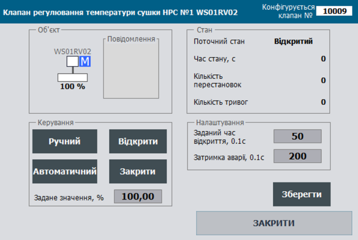

## Клас  VLVD: клапани з дискретним керуванням

**CLSID=16#201x**

## Загальний опис

Клас реалізовує функції оброблення виконавчого механізму типу клапан з дискретним керуванням. До цих функцій входить переключення режимів роботи ВМ, керування виконавчим механізмом, налаштування та обробка тривожних подій, керування імітацією, поширення станів до та від підлеглих технологічних змінних та ін..        

Функція класів розрахована для:

- Моностабільного (PRM.BISTABLE=0, CLSID=16#2011) режиму: одна вихідна змінна на клапан "відкрити";
- Бістабільного (PRM. BISTABLE =1, CLSID=16#2012) режиму: дві вихідні змінні "відкрити" та "закрити". 

Режим визначається автоматично при наявності 0-го індексу або параметра відключення у одній з вихідних змінних.

Не залежно моностабільний чи бістабільний клапан він може функціонувати з двома датчиками кінцевого положення (відрито та закрито), одним датчиком кінцевого положення (відкрито чи закрито) або без датчиків кінцевого положення. Кількість та наявність конкретних датчиків визначається автоматично при наявності 0-го індексу або параметра відключення технологічної змінної.

## Загальні вимоги до функцій VLVD

### Функціональні вимоги 

Датчики та сигнали керування ВМ подаються як змінні DIVAR та DOVAR; ті які не використовуються – подаються як пусті (з індексом 0); наявність/відсутність певних датчиків кінцевого положення та сигналів керування означується параметрами.
Функція класів розрахована для:

- Моностабільного (PRM.BISTABLE=0, CLSID=16#2011) режиму: одна вихідна змінна на клапан "відкрити";
- Бістабільного (PRM. BISTABLE =1, CLSID=16#2012) режиму: дві вихідні змінні "відкрити" та "закрити". Режим визначається автоматично при наявності 0-го індексу у одній з вихідних змінних.

У моностабільному режимі, вихідна змінна крану "відкрити" змінюється тільки при надходженні команд. На вихідну змінну "закрити" відправляється інверсна команда. Наприклад, команда "відкрити" переводить в "1" змінну на клапан "відкрити" тільки при надходженні команди. У бістабільному режимі вихідні змінні клапану можуть змінюватися при спрацюванні датчиків кінцевого положення: наприклад, кінцевик відкритості знімає "1" зі змінної відкриття.

#### Режими роботи

передбачено наступні режими керування ВМ:

- ручний - керування відбувається оператором за допомогою засобів SCADA/HMI;
- автоматичний - керування відбувається відповідно до алгоритмів запрограмованого в системі керування;
- місцевий - керування відбувається оператором за допомогою кнопок та перемикачів по місцю;

У автоматичному незаблокованому режимі, значення вихідних змінних на ВМ змінюється алгоритмом тільки при наявності відповідних команд з програм. Іншими словами вихідні змінні можуть керуватися як в командному режимі на клапан (імпульсні команди відкрити/закрити) з програм так і байпасуватися зовнішніми алгоритмами. У ручному або заблокованому режимі, виходи міняються тільки командами з HMI (може змінитися в залежності від вимог процесу).

#### Конфігурування ВМ 

Передбачаються два режими конфігурування (MANCFG): 

- ручне
- автоматичне. 

У ручному режимі тип клапану та наявність кінцевих вимикачів задається бітовими параметрами PRM.ZOPNENBL та PRM.ZCLSENBL. 

У автоматичному режимі ці параметри змінюються автоматично при прив'язці до змінних з ID=0 або їх підключеності. 

Таким чином, наприклад, при виходу з ладу датчика кінцевого положення, його можна тимчасово відключити в конфігурації (вивести з експлуатації для відключення генерування тривог), і клапан автоматично перейде в режим роботи без даного кінцевика. 

Ручне конфігурування типу клапану поки не знайшло свого використання.

#### Оброблення тривог

Для ВМ типу VLVD передбачено відслідковування наступних типів тривог

- ALMOPN - тривога "не відкрився", виникає при наявності команди на відкриття та відсутності кінцевика відкрито більше ніж часу відкриття та час затримки тривоги;
- ALMCLS - тривога "не закрився", виникає при наявності команди на закриття та відсутності кінцевика закрито більше ніж часу відкриття та час затримки тривоги;
- ALMSHFT - тривога "порушення стану", виникає при відсутності команд на зміну стану та появі протилежного кінцевика (в стані відкрито без команди на закриття з'являється кінцевик закрито або навпаки)
- ALM - помилка ВМ, виникає при появі будь якої тривоги ВМ;
- WRN - попередження ВМ, виникає при появі будь якого попередження ВМ (на даний момент не реалізовано ніяких попереджень ВМ);


#### Оброблення статистичної інформації

Для ВМ типу VLVD передбачено відслідковування наступного типу статистичної інформації 

- кількість перестановок;
- кількість тривог.

Статистична інформація скидається при проходженні відповідних команд.

## Рекомендації щодо використання в HMI

Приклад налаштування функцій клапанів з дискретних керуванням на HMI наведений на рис.



Рис. Приклад налаштування функцій клапанів з дискретних керуванням на HMI.


## Загальні вимоги щодо структури змінних класів

#### VLVD_HMI

Тут і далі `adr` задається як зміщення в структурі в 16-бітних словах

| name | type | adr  | bit  | descr                |
| ---- | ---- | ---- | ---- | -------------------- |
| STA  | UINT | 0    |      | біти станів          |
| CMD  | UINT | 1    |      | команда керування    |
| ALM  | Int  | 2    |      | біти тривог          |
| POS  | Int  | 3    |      | позиція ВМ (0-10000) |

#### VLVD_CFG

| name          | type      | adr  | bit  | Опис                                                         |
| ------------- | --------- | ---- | ---- | ------------------------------------------------------------ |
| ID            | UINT      | 0    |      | унікальний ідентифікатор ВМ                                  |
| CLSID         | UINT      | 1    |      | ідентифікатор класу ВМ                                       |
| STA           | UINT      | 2    |      | біти станів, може бути задіяна як структура VLVD_STA         |
| STA_IMSTPD    | BOOL      | 2    | 0    | =1 зупинився в проміжному стані                              |
| STA_MANRUNING | BOOL      | 2    | 1    | =1 рухається в невизначеному напрямку (ручний зі щита)       |
| STA_DBLCKACT  | BOOL      | 2    | 2    | =1 Включено режим ігнорування блокування керування {A.MSG.2} |
| STA_OPNING    | BOOL      | 2    | 3    | =1 Відкривається                                             |
| STA_CLSING    | BOOL      | 2    | 4    | =1 Закривається                                              |
| STA_OPND      | BOOL      | 2    | 5    | =1 Відкритий (16#0080)                                       |
| STA_CLSD      | BOOL      | 2    | 6    | =1 Закритий (16#0100)                                        |
| STA_MANBXOUT  | BOOL      | 2    | 7    | =1 Включення ручного зі щита                                 |
| STA_WRKED     | BOOL      | 2    | 8    | =1 В роботі                                                  |
| STA_DISP      | BOOL      | 2    | 9    | =1 дистанційний режим (з ПК/ОП) (16#0200)                    |
| STA_MANBX     | BOOL      | 2    | 10   | =1 Ручний зі щита (за зворотнім зв'язком)                    |
| STA_INIOTBUF  | BOOL      | 2    | 11   | =1 - змінна в IOT буфері                                     |
| STA_INBUF     | BOOL      | 2    | 12   | =1 - змінна в буфері                                         |
| STA_FRC       | BOOL      | 2    | 13   | =1 хоча би одна зі змінних в об’єкті форсована (для зручності відображення при наладці) |
| STA_SML       | BOOL      | 2    | 14   | =1 режим симуляції                                           |
| STA_BLCK      | BOOL      | 2    | 15   | =1 Заблокований                                              |
| ALM           | UINT      | 3    |      | біти тривог, може бути задіяна як структура VLVD_ALM         |
| ALMOPN        | BOOL      | 3    | 0    | =1 Не відкрився (Несправність схеми управління)              |
| ALMCLS        | BOOL      | 3    | 1    | =1 Не закрився (Несправність схеми управління)               |
| ALMSHFT       | BOOL      | 3    | 2    | =1 Порушення стану (скидається при зміні команди або стану) датчика) |
| ALMOPN2       | BOOL      | 3    | 3    | =1 Не відкрився (при наявності 2 пар кінцевиків)             |
| ALMCLS2       | BOOL      | 3    | 4    | =1 Не закрився (при наявності 2 пар кінцевиків)              |
| ALM           | BOOL      | 3    | 5    | =1 Помилка ВМ (по OR)                                        |
| WRN           | BOOL      | 3    | 6    | =1 Попередження ВМ (по OR)                                   |
| ALMSTP        | BOOL      | 3    | 7    | =1 Не відключився (скидається при зміні команди або стану) датчика) |
| ALMBELL       | BOOL      | 3    | 8    | =1 Команда включення дзвоника (на один цикл ПЛК)             |
| ALMPWR1       | BOOL      | 3    | 9    | = 1 - немає живлення                                         |
| ALMSTPBTN     | BOOL      | 3    | 10   | = 1 - натиснута кнопка стоп                                  |
| ALM_b11       | BOOL      | 3    | 11   | резерв                                                       |
| ALM_b12       | BOOL      | 3    | 12   | резерв                                                       |
| ALM_b13       | BOOL      | 3    | 13   | резерв                                                       |
| ALM_b14       | BOOL      | 3    | 14   | резерв                                                       |
| ALM_b15       | BOOL      | 3    | 15   | резерв                                                       |
| CMD           | ACTTR_CMD | 4    |      | бітові команди                                               |
| PRM           | ACTTR_PRM | 6    |      | біти параметрів                                              |
| T_DEASP       | UINT      | 8    |      | Час затримки тривоги в 0.1 секунди                           |
| T_OPNSP       | UINT      | 9    |      | Максимальний час відкриття в 0.1 секундах                    |
| POS           | Real      | 10   |      | позиціяВМ (0-100%)                                           |
| STEP1         | UINT      | 12   |      | номер кроку                                                  |
| CNTPER        | UINT      | 13   |      | Кількість змін положення                                     |
| CNTALM        | UINT      | 14   |      | Кількість аварій                                             |
| rez           | UINT      | 15   |      | резерв для вирівнювання типів даних                          |
| T_STEP1       | UDINT     | 16   |      | Плинний час кроку в мс                                       |
| T_PREV        | UDINT     | 18   |      | час в мс з попереднього виклику, береться зі структури PLC_CFG.TQMS |

#### Команди 

| Атрибут | Тип  | Біт  | Опис                                                         |
| ------- | ---- | ---- | ------------------------------------------------------------ |
| CMD     | UINT |      | Команди:<br />16#0001: відкрити<br/>16#0002: закрити<br/>16#0003: перемкнути<br/>16#0004: підтвердити тривогу<br/>16#0005: скинути тривоги<br/>16#0006: заблокувати<br/>16#0007: розблокувати<br/>16#0008: зупинити автоналаштування<br/>16#0009: запустити автоналаштування<br/>16#000A: включити алгоритм захисту<br/>16#000B: дозвіл на керування<br/>16#000C: дозвіл на керування по наявності тиску в системі<br/>16#000D: запуск калібрування датчика шивдкості<br/> E..10 - вільні<br/>16#0011: запустити<br/>16#0012: зупинити<br/>16#0013: включити реверс<br/>14-20 - вільні<br/>16#0021: більше<br/>16#0022: менше<br/>23-9F - вільні<br/>16#0100: прочитати конфігурацію<br/>16#0101: записати конфігурацію<br/>102-2FF вільні<br/>16#0300: перемкнути ручний/автомат<br/>16#0301: включити ручний режим<br/>16#0302: включити автоматичний режим<br/>16#0313: включити місцевий режим<br/>16#0314: відключити місцевий режим<br/>16#0315: вивести з експлуатації<br/>16#0316: ввести в експлуатацію<br/>316..400 - вільні<br/>16#0401: скинути лічильник тривог <br/>16#0402: скинути лічильник спрацювань/переміщень <br/>16#0403: скинути лічильник спрацювань/переміщень <br/>16#0404: скинути лічильник спрацювань/переміщень <br/> |


## Робота з буфером

Повинна бути реалізована функція роботи з класичним буфером.

- Буфер рекомендується використовувати один для всіх типів ВМ.

- Факт зайнятості буфера перевіряється за рівністю ідентифікатора класу `CLSID` та ідентифікатора ВМ `ID`

- при захопленні буферу:

  - `ACTBUF.STA = ACTTR_CFG.STA`
  - `ACTTR_CFG.CMD = ACTBUF.CMD`  якщо той не дорівнює нулю (для можливості команд з іншого джерела)

- конфігурація ВМ повинна зчитуватися в буфер при отриманні команд:

  - оновлення технологічної змінної, яка вже записана в буфер`ACTTR_HMI.CMD` = 16#0100; 

- конфігурація ВМ повинна записуватись з буфера при отриманні команд:

  - `ACTBUF.CMD` = 16#0101; 	

  

Повинна бути реалізована функція роботи з параметричними двунаправленими буферами ACTBUFIN<->ACTBUFOUT.

- Використовується 2 буфери: 
  - вхідний `ACTBUFIN` - використовується для обробки команд (при рівності CLSID та ID) та запису інформації в ВМ 
  - вихідний `ACTBUFOUT` - використовується для зчитування інформації з ВМ при отриманні команди на читання з `ACTBUFIN`
- Буфери рекомендується використовувати одну пару для всіх ВМ.
- Факт зайнятості буфера не можливий, оскільки буфер реалізований через 2 буферні змінні ACTBUFIN та ACTBUFOUT через які інформація проходить для подальшої передачі її в ВМ або внутрішній буфер засобу HMI (по аналогії з параметричним обміном PKW в профілі PROFIDRIVE)
- конфігурація ВМ повинна зчитуватися в вихідний буфер при:
  - рівності класів `ACTTR_CFG.CLSID=ACTBUFIN.CLSID` , ідентифікаторів `ACTCFG.ID=ACTBUFIN.ID` та отримання команди з вхідного буфера `ACTBUFIN.CMD=16#100 `
- конфігурація ВМ повинна записуватись з вхідного буфера при:
  - рівності класів `ACTTR_CFG.CLSID=ACTBUFIN.CLSID` , ідентифікаторів `ACTTR_CFG.ID=ACTBUFIN.ID` та отримання команди з вхідного буфера `ACTBUFIN.CMD=16#101 `


## Вимоги щодо реалізації інтерфейсу

У інтерфейс повинні передаватися наступні параметри:

- VLVDCFG - INOUT
- VLVDHMI - INOUT
- технологічні змінні датчиків ВМ (датчики кінцевих положень, кнопки по місцю і т.д.) - INOUT
- технологічні змінні виходів ВМ (соленоїд, пускачі і т.д.) - INOUT

За умови, що немає можливості доступатися до зовнішніх змінних з середини функцій, передається `PLC_CFG`, `ACTBUF`,  `ACTBUFIN`, `ACTBUFOUT` ; альтернативно можна використовувати інші інтерфейси для використання в середині `PLC_CFG` 


## Ініціалізація ВМ при першому циклі роботи

Запис ID, CLSID за замовченням виконується в результаті виконання програмної секції `initvars`. 

Для кожної технологічної змінної в `initvars` повиннен бути наступний фрагмент програми для запису ID, CLSID

```
"ACT".VLVD.ID:=10001;   "ACT".VLVD.CLSID:=16#2011;
```

Також виконується ініціалізація всередині функції обробки ВМ, в результаті

- якщо уставка часу відкриття не виставлена присвоюється `VLVD.T_OPNSP := 500; (*5 секунд*);`
- якщо уставка затримки часу тривоги не виставлена присвоюється `VLVD.T_DEASP := 200; ` 
- технологічні тривоги для датчиків не використовуються, наприклад  `SOPN.PRM.ISALM := false; SOPN.PRM.ISWRN := false;`


## Вимоги щодо реалізації програми користувача

- Функції обробки ВМ повинні викликатися з кожним викликом тієї задачі, до якої вони прив'язані.
- При першому старті (`PLC_CFG.SCN1`) повинні ініціалізуватися ідентифікатори ВМ та ідентифікатори класів, 

Реалізація програми функцій обробки ВМ складається з наступних етапів:

#### `VLVD_to_ACT` 

зчитування інформації з змінної яка відповідає типу ВМ до змінної типу універсального ВМ - виконується для зручності і уніфікації подальшої обробки, виконується функцією `VLVD_to_ACT` 

У інтерфейс повинні передаватися наступні параметри:

- VLVDCFG - INOUT - конфігураційна змінна ВМ
- VLVDHMI - INOUT - HMI змінна ВМ
- ACTCFG - INOUT - тип універсального ВМ, використовується для внутрішньої обробки для універсалізації

За умови, що немає можливості доступатися до зовнішніх змінних з середини функцій, передається `PLC_CFG`, `ACTBUF`,  `ACTBUFIN`, `ACTBUFOUT` ; альтернативно можна використовувати інші інтерфейси для використання в середині `PLC_CFG` 

```pascal
#ACTCFG.ID:= #VLVDCFG.ID;
#ACTCFG.CLSID:= #VLVDCFG.CLSID;
#ACTCFG.CMD:= #VLVDCFG.CMD;
#ACTCFG.PRM:= #VLVDCFG.PRM;
#ACTCFG.T_DEASP:= #VLVDCFG.T_DEASP;
#ACTCFG.T_OPNSP:= #VLVDCFG.T_OPNSP;
#ACTCFG.POS:= #VLVDCFG.POS;
#ACTCFG.STEP1:= #VLVDCFG.STEP1;
#ACTCFG.CNTPER:= #VLVDCFG.CNTPER;
#ACTCFG.CNTALM:= #VLVDCFG.CNTALM;
#ACTCFG.T_STEP1:= #VLVDCFG.T_STEP1;
#ACTCFG.T_PREV:= #VLVDCFG.T_PREV;

#ACTCFG.STA.IMSTPD:= #VLVDCFG.STA.IMSTPD;
#ACTCFG.STA.MANRUNING:= #VLVDCFG.STA.MANRUNING;
#ACTCFG.STA.DBLCKACT:= #VLVDCFG.STA.DBLCKACT;
#ACTCFG.STA.OPNING:= #VLVDCFG.STA.OPNING;
#ACTCFG.STA.CLSING:= #VLVDCFG.STA.CLSING;
#ACTCFG.STA.OPND:= #VLVDCFG.STA.OPND;
#ACTCFG.STA.CLSD:= #VLVDCFG.STA.CLSD;
#ACTCFG.STA.MANBXOUT:= #VLVDCFG.STA.MANBXOUT;
#ACTCFG.STA.WRKED:= #VLVDCFG.STA.WRKED;
#ACTCFG.STA.DISP:= #VLVDCFG.STA.DISP;
#ACTCFG.STA.MANBX:= #VLVDCFG.STA.MANBX;
#ACTCFG.STA.INBUF:= #VLVDCFG.STA.INBUF;
#ACTCFG.STA.INIOTBUF:= #VLVDCFG.STA.INIOTBUF;
#ACTCFG.STA.FRC:= #VLVDCFG.STA.FRC;
#ACTCFG.STA.SML:= #VLVDCFG.STA.SML;
#ACTCFG.STA.BLCK:= #VLVDCFG.STA.BLCK;
#ACTCFG.STA.STOPING:=#VLVDCFG.ALM.ALM_b11;

#ACTCFG.ALM.ALMOPN:= #VLVDCFG.ALM.ALMOPN;
#ACTCFG.ALM.ALMCLS:= #VLVDCFG.ALM.ALMCLS;
#ACTCFG.ALM.ALMSHFT:= #VLVDCFG.ALM.ALMSHFT;
#ACTCFG.ALM.ALMOPN2:= #VLVDCFG.ALM.ALMOPN2;
#ACTCFG.ALM.ALMCLS2:= #VLVDCFG.ALM.ALMCLS2;
#ACTCFG.ALM.ALM:= #VLVDCFG.ALM.ALM;
#ACTCFG.ALM.WRN:= #VLVDCFG.ALM.WRN;
#ACTCFG.ALM.ALMSTP:= #VLVDCFG.ALM.ALMSTP;
#ACTCFG.ALM.ALMBELL:= #VLVDCFG.ALM.ALMBELL;
#ACTCFG.ALM.ALMPWR1:= #VLVDCFG.ALM.ALMPWR1;
#ACTCFG.ALM.ALMSTPBTN := #VLVDCFG.ALM.ALMSTPBTN;
#ACTCFG.ALM.ALM_b27 := false;
#ACTCFG.ALM.ALM_b28 := #VLVDCFG.ALM.ALM_b12;
#ACTCFG.ALM.ALM_b29 := #VLVDCFG.ALM.ALM_b13;
#ACTCFG.ALM.ALM_b30 := #VLVDCFG.ALM.ALM_b14;
#ACTCFG.ALM.ALM_b31 := #VLVDCFG.ALM.ALM_b15;

#ACTCFG.CMDHMI:=#VLVDHMI.CMD;


```


####  `ACT_PRE`

попередня обробка ВМ: ініціалізація STA, ALM, CMD, обробка INBUF, SML, підрахунок dt - виконується функцією `ACT_PRE`;

У інтерфейс повинні передаватися наступні параметри:

- ACTCFG - INOUT - тип універсального ВМ, використовується для внутрішньої обробки для універсалізації
- STA - INOUT - тип набору статусів універсального ВМ, використовується для внутрішньої обробки для універсалізації
- ALMs - INOUT - тип набору тривог універсального ВМ, використовується для внутрішньої обробки для універсалізації
- CMD - INOUT - тип набору команд  універсального ВМ, використовується для внутрішньої обробки для універсалізації
- dt - INOUT - різниця між викликами функції обробки ВМ

За умови, що немає можливості доступатися до зовнішніх змінних з середини функцій, передається `PLC_CFG`, `ACTBUF`,  `ACTBUFIN`, `ACTBUFOUT` ; альтернативно можна використовувати інші інтерфейси для використання в середині `PLC_CFG` 

```pascal
(*початкова обробка для усіх ВМ: інціалізація, присвоєння у внутрішні STA, ALM; визначення INBUF, SML, #dt *)
(*first scan*)
IF "SYS".PLCCFG.STA.SCN1 THEN
    (*обнулення бітів структури STA*)
    #ACTCFG.STA.IMSTPD:=FALSE;
    #ACTCFG.STA.MANRUNING:=FALSE;
    #ACTCFG.STA.STOPING:=FALSE;
    #ACTCFG.STA.OPNING:=FALSE;
    #ACTCFG.STA.CLSING:=FALSE;
    #ACTCFG.STA.OPND:=FALSE;
    #ACTCFG.STA.CLSD:=FALSE;
    #ACTCFG.STA.MANBXOUT:=FALSE;
    #ACTCFG.STA.WRKED:=FALSE;
    #ACTCFG.STA.DISP:=FALSE;
    #ACTCFG.STA.MANBX:=FALSE;
    #ACTCFG.STA.INBUF:=FALSE;
    #ACTCFG.STA.FRC:=FALSE;
    #ACTCFG.STA.SML:=FALSE;
    #ACTCFG.STA.BLCK:=FALSE;
    #ACTCFG.STA.STRTING:=FALSE;
    #ACTCFG.STA.STOPED:=FALSE;
    #ACTCFG.STA.SLNDBRK:=FALSE;
    #ACTCFG.STA.CMDACK:=FALSE;
    #ACTCFG.STA.SPD1:=FALSE;
    #ACTCFG.STA.SPD2:=FALSE;
    #ACTCFG.STA.STA_b21:=FALSE;
    #ACTCFG.STA.STRT_DELAY:=FALSE;
    #ACTCFG.STA.STOP_DELAY:=FALSE;
    #ACTCFG.STA.DBLCKACT:=FALSE;
    #ACTCFG.STA.ISREVERS:=FALSE;
    #ACTCFG.STA.ISANALOG:=FALSE;
    #ACTCFG.STA.INIOTBUF:=FALSE;
    #ACTCFG.STA.SPDMONON:=FALSE;
    #ACTCFG.STA.SPDCALIBRON:=FALSE;
    #ACTCFG.STA.MAINT:=FALSE;
    #ACTCFG.STA.STA_b31:=FALSE;
    (*обнулення бітів структури ALM*)
    #ACTCFG.ALM.ALMSTRT:=FALSE;
    #ACTCFG.ALM.ALMSTP:=FALSE;
    #ACTCFG.ALM.ALMOPN:=FALSE;
    #ACTCFG.ALM.ALMCLS:=FALSE;
    #ACTCFG.ALM.ALMOPN2:=FALSE;
    #ACTCFG.ALM.ALMCLS2:=FALSE;
    #ACTCFG.ALM.ALMSHFT:=FALSE;
    #ACTCFG.ALM.ALM:=FALSE;
    #ACTCFG.ALM.ALMBELL:=FALSE;
    #ACTCFG.ALM.WRN:=FALSE;
    #ACTCFG.ALM.WRNSPD:=FALSE;
    #ACTCFG.ALM.ALMSPD:=FALSE;
    #ACTCFG.ALM.WRNSPD2:=FALSE;
    #ACTCFG.ALM.ALMSPD2:=FALSE;
    #ACTCFG.ALM.ALMPWR1:=FALSE;
    #ACTCFG.ALM.ALMSTPBTN:=FALSE;
    #ACTCFG.ALM.ALMINVRTR:=FALSE;
    #ACTCFG.ALM.ALM_b17:=FALSE;
    #ACTCFG.ALM.ALM_b18:=FALSE;
    #ACTCFG.ALM.ALM_b19:=FALSE;
    #ACTCFG.ALM.ALM_b20:=FALSE;
    #ACTCFG.ALM.ALM_b21:=FALSE;
    #ACTCFG.ALM.ALM_b22:=FALSE;
    #ACTCFG.ALM.ALM_b23:=FALSE;
    #ACTCFG.ALM.ALM_b24:=FALSE;
    #ACTCFG.ALM.ALM_b25:=FALSE;
    #ACTCFG.ALM.ALM_b26:=FALSE;
    #ACTCFG.ALM.ALM_b27:=FALSE;
    #ACTCFG.ALM.ALM_b28:=FALSE;
    #ACTCFG.ALM.ALM_b29:=FALSE;
    #ACTCFG.ALM.ALM_b30:=FALSE;
    #ACTCFG.ALM.ALM_b31:=FALSE;
    IF #ACTCFG.T_OPNSP = 0 THEN #ACTCFG.T_OPNSP:=50; END_IF;
END_IF;

#STA:=#ACTCFG.STA;
#ALMs := #ACTCFG.ALM;
#CMD := #ACTCFG.CMD;
#ALMs.ALMBELL:= false; (*дзвінок знімається через один цикл*)
#STA.INBUF := (#ACTCFG.ID = "BUF".ACTBUF.ID AND "BUF".ACTBUF.ID <> 0 AND #ACTCFG.CLSID = "BUF".ACTBUF.CLSID);(*знаходиться в буфері конфігурування*)
#STA.SML := "SYS".PLCCFG.STA.SMLALL;(*режим імітації*)
#dt := "SYS".PLCCFG.TQMS - #ACTCFG.T_PREV; (*різниця між викликами в мс*)
IF #dt<1 THEN #dt:=1; END_IF;


```


####  `ACT_CMDCTRL`

обробка команд - виконується стандартним для всіх ВМ обробчиком команд, який реалізовано у вигляді функції `ACT_CMDCTRL`.

У інтерфейс повинні передаватися наступні параметри:

- ACTCFG - INOUT - тип універсального ВМ, використовується для внутрішньої обробки для універсалізації
- STA - INOUT - тип набору статусів універсального ВМ, використовується для внутрішньої обробки для універсалізації
- CMD - INOUT - тип набору команд  універсального ВМ, використовується для внутрішньої обробки для універсалізації

За умови, що немає можливості доступатися до зовнішніх змінних з середини функцій, передається `PLC_CFG`, `ACTBUF`,  `ACTBUFIN`, `ACTBUFOUT` ; альтернативно можна використовувати інші інтерфейси для використання в середині `PLC_CFG` 

```pascal
(*блок обробляє команди з HMI та IOT, формує на основі них CMD, змінює статусні біти стану, обнуляє автоматичні команди в ручному режимі *)
(*вибір джерела конфігураційної/керівної команди HMI згідно пріоритету якщо команди надійшли одночасно*)
IF #ACTCFG.CMDHMI > 16#80 THEN (*конфіг кмд з HMI*)
    #CMDINT := #ACTCFG.CMDHMI;
ELSIF #STA.INBUF AND "BUF".ACTBUF.CMDHMI > 16#80 THEN (*конфіг кмд з буферу*)
    #CMDINT := "BUF".ACTBUF.CMDHMI;
ELSIF #ACTCFG.CMDHMI < 16#80 AND #ACTCFG.CMDHMI > 0 AND #STA.DISP THEN(*керування клапаном з елементу в ручному режимі*)
    #CMDINT := #ACTCFG.CMDHMI;
ELSIF #STA.INBUF AND "BUF".ACTBUF.CMDHMI < 16#80 AND "BUF".ACTBUF.CMDHMI > 0 AND #STA.DISP THEN (* керування клапаном з буферу в ручному режимі*)
    #CMDINT := "BUF".ACTBUF.CMDHMI; (* команда звідти інакше ігнорити*)
ELSE
    #CMDINT := 0;
END_IF;

(*у рчуному режимі усі автоматичні команди керування обнуляються*)
IF #STA.DISP THEN
    #CMD.OPN:=FALSE;
    #CMD.CLS:=FALSE;
    #CMD.TOGGLE:=false;
    #CMD.START:=false;
    #CMD.STOP:=false;
    #CMD.REVERS:=false;
    #CMD.TOGGLE:=FALSE;
END_IF;

(*команди операторського керування
16#0001 - CMD_OPN
16#0002 - CMD_CLS
16#0004 - CMD_ALMRST
16#0008 - CMD_DBLK
16#0010 - CMD_STOP
*)

(* команди HMI*)
CASE #CMDINT OF
    16#0001:(*відкрити *)
        #CMD.OPN := TRUE;
        #CMD.CLS := FALSE;
    16#0002:(*закрити *)
        #CMD.CLS := TRUE;
        #CMD.OPN := FALSE;
    16#0003:(*перемкнути*)
        #CMD.TOGGLE := TRUE;
    16#0004:(* Підтвердити тривогу*)
        #CMD.ALMACK:= TRUE;
    16#0005:(*Скинути тривоги *)
        #CMD.ALMRESET:= TRUE;
    16#0006:
        #CMD.BLCK:= TRUE; (*Заблокувати*)
    16#0007:
        #CMD.DBLCK:= TRUE; (*Розблокувати*)
    16#0008:
        #CMD.STOPTUN:= TRUE;(*Зупинити автоналаштування*)
    16#0009:
        #CMD.TUNING:= TRUE;(*Запустити автоналаштування *)
    16#000A:
        #CMD.PROTECT:= TRUE;(*Включити алгоритм захисту *)
    16#000B: (*=1 дозвіл на керування*)
        #CMD.RESOLUTION:= TRUE; (*//на один цикл*)
    16#000C: (*дозвіл на керування по наявності тиску в системі*)
        #CMD.P_RESOLUTION := TRUE; (*//на один цикл*)
    16#000D: (*=1 запуск калібрування датчика шивдкості*)
        #CMD.DBLCKACTTOGGLE := true;
        #STA.DBLCKACT := NOT #STA.DBLCKACT;
        
        (*E..10 - вільні*)
        
    16#0011:(*Запустити*)
        #CMD.START:= TRUE;
        #CMD.STOP:= false;
    16#0012: (*Зупинити*)
        #CMD.STOP:= TRUE;
        #CMD.START:= false;
    16#0013:(*19*)
        #CMD.REVERS:= TRUE;(*Включити реверс *)
        (*14-20 - вільні*)
    16#0021:
        #CMD.UP:= TRUE; (*Більше*)
    16#0022:
        #CMD.DWN:= TRUE; (*Менше*)
        (*23-9F - вільні*)
        (*починаючи з 16#0080 тільки для роботи з буфера і керування режимом*)
    16#0100: (*прочитати конфігурацію*)
        #CMD.BUFLOAD:=true;
        "BUF".ACTBUF := #ACTCFG;
    16#0101: (*записати конфігурацію*)
        #ACTCFG.PRM := "BUF".ACTBUF.PRM;
        #ACTCFG.T_DEASP := "BUF".ACTBUF.T_DEASP;
        #ACTCFG.T_OPNSP := "BUF".ACTBUF.T_OPNSP;
        #ACTCFG.STOP_DELAY := "BUF".ACTBUF.STOP_DELAY;
    (*102-2FF вільні*)
    16#0300: (*перемкнути ручний/автомат*)
        #STA.DISP := NOT #STA.DISP;
    16#0301: (*РУЧНИЙ РЕЖИМ*)
        #STA.DISP := TRUE;
    16#0302: (*АВТО РЕЖИМ*)
        #STA.DISP := FALSE;
    16#0313:(* включити місцевий режим*)
        #STA.MANBXOUT := true;
        #STA.MANBX := true;
        #STA.DISP := TRUE;
        (*#CMD.CRMT:= TRUE; //чи потрібен з програми?*)
    16#0314:(* відключити місцевий режим*)
        #STA.MANBXOUT := false;
        #STA.MANBX := false;
        (*#CMD.CLCL:= TRUE; //чи потрібен з програми?*)
    16#0315: (*=1 вивести з експлуатації*)
        #CMD.OUTSRVC := true;
    16#0316: (*=1 ввести в експлуатацію*)
        #CMD.INSRVC := true;
        (*керування статистикою*)
    16#0401:(* скинути лічильник тривог 1025*)
        #ACTCFG.CNTALM:=0;
    16#0402:(* скинути лічильник спрацювань/переміщень 1026*)
        #ACTCFG.CNTPER:=0;
    16#0403:(* скинути лічильник спрацювань/переміщень 1027*)
        #ACTCFG.TQ_TOTAL:=0;
    16#0404:(* скинути лічильник спрацювань/переміщень 1028*)
        #ACTCFG.TQ_LAST :=0;
END_CASE;

(*проходження команд розблокувати-заблокувати з буфера та НМІ*)
IF #ACTCFG.CMDHMI = 16#0006 OR ("BUF".ACTBUF.CMDHMI = 16#0006 AND #STA.INBUF) THEN #CMD.BLCK:= TRUE; END_IF;
IF #ACTCFG.CMDHMI = 16#0007 OR ("BUF".ACTBUF.CMDHMI = 16#0007 AND #STA.INBUF) THEN #CMD.DBLCK:= TRUE; END_IF;

#CMDINT:=0;
#ACTCFG.CMDHMI:=0;
IF #STA.INBUF THEN
    "BUF".ACTBUF.CMDHMI:=0;
END_IF;
```


#### `VLVDFN`

безпосередня обробка ВМ в функції `VLVDFN`

```pascal
(*передача змінних з конкретного типу ВМ в універсальний тип ВМ *)
"VLVD_to_ACT" (VLVDCFG := #ACTCFG, VLVDHMI := #ACTHMI, ACTCFG := #ACTCFGu);

(*попередня обробка: ініт STA, ALM, CMD, INBUF, SML, dt *)
"ACT_PRE" (ACTCFG := #ACTCFGu, STA := #STA, ALMs := #ALMs, CMD := #CMD, dt := #dT);

(*ініціалізація змінної на першому циклі обробки*)
IF "SYS".PLCCFG.STA.SCN1 THEN (*first scan*)
    IF #ACTCFGu.T_OPNSP <= 0 THEN (*якщо уставка часу відкриття не виставлена*)
        #ACTCFGu.T_OPNSP := 500; (*5 секунд*)
    END_IF;
    IF #ACTCFGu.T_DEASP <= 0 THEN (*якщо уставка затримки часу тривоги не виставлена*)
        #ACTCFGu.T_DEASP := 200; (*2 секунди*)
    END_IF;
    (*технологічні тривоги для датчиків не використовуються*)
    IF #SOPN.ID <> 0 THEN
        #SOPN.PRM.ISALM := false; (*ISALM*)
        #SOPN.PRM.ISWRN := false; (*ISWRN*)
    END_IF;
    IF #SCLS.ID <> 0 THEN
        #SCLS.PRM.ISALM := false; (*ISALM*)
        #SCLS.PRM.ISWRN := false; (*ISWRN*)
    END_IF;
END_IF;

(* --------------------- блок параметрів*)
(*параметри перевірка наявності/використання датчиків на вході*)
#ACTCFGu.PRM.PRM_MANCFG:=false;(*відключення ручного конфігурування параметрів IO*)
#ACTCFGu.PRM.PRM_ZCLSENBL := NOT #SCLS.PRM.DSBL AND #SCLS.ID <> 0;
#ACTCFGu.PRM.PRM_ZOPNENBL := NOT #SOPN.PRM.DSBL AND #SOPN.ID <> 0;
#ACTCFGu.PRM.PRM_ZPOSENBL := FALSE; (*відключення позиціонера*)
#ACTCFGu.PRM.PRM_PULSCTRLENBL := #ACTCFGu.CLSID=16#2014; (*параметри імпульсного керування*)

(*------------------- блок для режиму імітації*)
(*режим імітації підлеглих від хозяїна*)
#SOPN.STA.SML := #STA.SML;
#SCLS.STA.SML := #STA.SML;
#COPN.STA.SML := #STA.SML;
#CCLS.STA.SML := #STA.SML;

(*логіка для режиму імітації *) 
IF #STA.SML THEN
    #dpos:= UDINT_TO_REAL(#dT*100)/UDINT_TO_REAL((UINT_TO_UDINT(#ACTCFGu.T_OPNSP)*100));(*%*)
    IF #ACTCFGu.STEP1=2  THEN
        #ACTCFGu.POS := #ACTCFGu.POS + #dpos; (*0-10000*)
    END_IF;
    IF #ACTCFGu.STEP1=3 THEN
        #ACTCFGu.POS := #ACTCFGu.POS - #dpos; (*0-10000*)
    END_IF;
    IF #ACTCFGu.POS<0.0 THEN #ACTCFGu.POS:=0.0; END_IF;
    IF #ACTCFGu.POS>100.0 THEN #ACTCFGu.POS:=100.0; END_IF;
    
    (*імітація датчиків *)
    IF NOT #SOPN.STA.FRC THEN
        #SOPN.STA.VALB:= #STA.OPNING AND #ACTCFGu.T_STEP1 >= UINT_TO_UDINT(#ACTCFGu.T_OPNSP)*100 OR #STA.OPND;
    END_IF;
    IF NOT #SCLS.STA.FRC THEN
        #SCLS.STA.VALB:= #STA.CLSING AND #ACTCFGu.T_STEP1 >= UINT_TO_UDINT(#ACTCFGu.T_OPNSP)*100 OR #STA.CLSD;
    END_IF;
END_IF;

(*-------------------- блок обробки команд *)
(*стандартний обробник команд*)
"ACT_CMDCTRL" (ACTCFG := #ACTCFGu, STA := #STA, CMD := #CMD);

(* -------------------  блок обробки станів датчиків відкриття/закриття, або їх заміна на логіку*)
IF NOT #ACTCFGu.PRM.PRM_ZOPNENBL THEN
    #SOPN1:= #STA.OPNING AND #ACTCFGu.T_STEP1 >= UINT_TO_UDINT(#ACTCFGu.T_OPNSP)*100
    OR #STA.OPND;
    IF "SYS".PLCCFG.STA.SCN1 THEN #SOPN1:=false; END_IF;
ELSE
    #SOPN1:=#SOPN.STA.VALB;
END_IF;
IF NOT #ACTCFGu.PRM.PRM_ZCLSENBL THEN
    #SCLS1:=#STA.CLSING AND #ACTCFGu.T_STEP1 >= UINT_TO_UDINT(#ACTCFGu.T_OPNSP)*100
    OR #STA.CLSD;
    IF "SYS".PLCCFG.STA.SCN1 THEN #SCLS1:=TRUE; END_IF;
ELSE
    #SCLS1:=#SCLS.STA.VALB;
END_IF;

IF NOT #ACTCFGu.PRM.PRM_ZPOSENBL THEN
    #SPOS1:=-10000;
END_IF;

(*//----------------- автомат станів позиції та тривог позиції та основне керування
//0 -  ініціалізація, 1- зупинено в проміжному стані, 4 - зупинений у відкритому стані, 5 - зупинений в закритому стані  
//7 - рухається в довільному напрямку (ручний зі щита),  2 - відкривається , 3 - закривається  
//керування автоматом станів див в наступному блоці
//керування виходами COPN, CCLS згідно логіки*)
CASE #ACTCFGu.STEP1 OF
    0:(*ініціалізація*)
        #ACTCFGu.STEP1 := 1;
        #ACTCFGu.T_STEP1 := 0;
    1, 4, 5: (*зупинений, 1 - зупинено в проміжному стані 4 - зупинений у відкритому стані, 5 - зупинений в закритому стані*)
        IF #SOPN1 AND NOT #SCLS1 AND NOT #ALMs.ALMSHFT THEN
            IF #ACTCFGu.STEP1<>4 THEN #ACTCFGu.T_STEP1 := 0;END_IF;
            #ACTCFGu.STEP1 := 4;
            #ALMs.ALMSHFT:=FALSE;
            #ALMs.ALMCLS := FALSE;
            #ALMs.ALMOPN := FALSE;
        END_IF;
        
        IF #SCLS1 AND NOT #SOPN1 AND NOT #ALMs.ALMSHFT THEN
            IF #ACTCFGu.STEP1<>5 THEN #ACTCFGu.T_STEP1 := 0;END_IF;
            #ACTCFGu.STEP1 := 5;
            #ALMs.ALMSHFT:=FALSE;
            #ALMs.ALMCLS := FALSE;
            #ALMs.ALMOPN := FALSE;
        END_IF;
        
        IF ((#ACTCFGu.STEP1 = 4 AND NOT #SOPN1) OR (#ACTCFGu.STEP1 = 5 AND #SOPN1)) OR (#SOPN1 AND #SCLS1) THEN
            #ALMs.ALMSHFT:=true;
        ELSE
            #ALMs.ALMSHFT:=false;
        END_IF;
        
    2:  (*відкривається*)
        IF #SOPN1 AND NOT #SCLS1 THEN
            #ACTCFGu.STEP1 := 4; (*у стан відкрито*)
            #ACTCFGu.T_STEP1 := 0;
        END_IF;
        
        #ALMs.ALMOPN := FALSE;
        #ALMs.ALMCLS := FALSE;
        #ALMs.ALMSHFT:= FALSE;
        
        IF #ACTCFGu.T_STEP1 >= (UINT_TO_UDINT(#ACTCFGu.T_OPNSP)*100 + UINT_TO_UDINT(#ACTCFGu.T_DEASP)*100) THEN
            #ALMs.ALMOPN := TRUE;
            #ALMs.ALMCLS := FALSE;
            IF #SCLS1 AND NOT #SOPN1 THEN
                #ACTCFGu.STEP1 := 5; (*у стан закрито*)
                #ACTCFGu.T_STEP1 := 0;
            END_IF;
        END_IF;
        
    3:(*закривається*)
        IF #SCLS1 AND NOT #SOPN1 THEN
            #ACTCFGu.STEP1 := 5;
            #ACTCFGu.T_STEP1 := 0;
        END_IF;
        
        #ALMs.ALMOPN := FALSE;
        #ALMs.ALMCLS := FALSE;
        #ALMs.ALMSHFT:= FALSE;
        
        IF #ACTCFGu.T_STEP1 >= UINT_TO_UDINT(#ACTCFGu.T_OPNSP)*100 +  UINT_TO_UDINT(#ACTCFGu.T_DEASP)*100 THEN
            #ALMs.ALMCLS := TRUE;
            #ALMs.ALMOPN := FALSE;
            IF #SOPN1 AND NOT #SCLS1 THEN (*у стан відкрито*)
                #ACTCFGu.STEP1 := 4;
                #ACTCFGu.T_STEP1 := 0;
            END_IF;
        END_IF;
        
    7: (*рухається в довільному напрямку (ручний зі щита) чи помилка довільного зсуву*)
        #ALMs.ALMSHFT:=true;
        #ACTCFGu.STEP1 := 1;
        #ACTCFGu.T_STEP1 := 0;
        
    ELSE  (*невизначеність*)
        #ACTCFGu.STEP1 := 0;
END_CASE;

(*автомат станів побітово*)
#STA.IMSTPD:= #ACTCFGu.STEP1 = 1;
#STA.MANRUNING:= #ACTCFGu.STEP1 = 7;
#STA.OPNING:= #ACTCFGu.STEP1 = 2;
#STA.CLSING := #ACTCFGu.STEP1 = 3;
#STA.OPND:= #ACTCFGu.STEP1 = 4;
#STA.CLSD:= #ACTCFGu.STEP1 = 5;

(*-------- блокуання приводу*)
(*умова блокуання *)
IF #CMD.BLCK THEN
    #STA.BLCK:=TRUE;
    #ALMs.ALMSTP:=false;
END_IF;

(*умова розблокуання *)
IF #CMD.DBLCK THEN
    #STA.BLCK:=FALSE;
    #ALMs.ALMSTP:=false;
END_IF;

(*умова блокуання , умова спрацьовує тільки при початку блокування *)
IF (#ALMs.ALMPWR1 OR #CMD.PROTECT) AND NOT #STA.BLCK THEN
    #STA.BLCK:=true;
END_IF;

(*стан блокування*)
IF #STA.BLCK THEN
    #COPN.STA.VALB:= FALSE;
    #CCLS.STA.VALB:= FALSE;
END_IF;

(*-----------------------------*)

(*------------------------виходи керування *)
(*керування OPN/CLS тільки при дозволі керування або тимчасовому розблокуванні та при відсутності блокування*)
IF (#CMD.RESOLUTION OR "SYS".PLCCFG.STA_PERM.%X6) AND NOT #STA.BLCK THEN
    IF #CMD.CLS THEN #CMD.OPN:=FALSE; END_IF;(*CLS має пріоритет над OPN*)
    IF #CMD.CLS AND #ACTCFGu.STEP1 <> 5 AND #ACTCFGu.STEP1 <> 3 THEN
        #ACTCFGu.STEP1 := 3;
        #ACTCFGu.T_STEP1 := 0;
        #ACTCFGu.CNTPER := #ACTCFGu.CNTPER + 1;
        #COPN.STA.VALB:= FALSE;
        #CCLS.STA.VALB:= TRUE;
    END_IF;
    IF #CMD.OPN AND #ACTCFGu.STEP1 <> 4 AND #ACTCFGu.STEP1 <> 2 THEN
        #ACTCFGu.STEP1 := 2;
        #ACTCFGu.T_STEP1 := 0;
        #ACTCFGu.CNTPER := #ACTCFGu.CNTPER + 1;
        #COPN.STA.VALB:= TRUE;
        #CCLS.STA.VALB:= FALSE;
    END_IF;
END_IF;


(*-------------------- режими*)

(*місцевий режим керування*)
#STA.MANBX := #CMD.CLCL;
(*у місцевому режимі керування відключати усі виходи і перевести в ручний режим*)
IF #STA.MANBX THEN
    #COPN.STA.VALB:=FALSE;
    #CCLS.STA.VALB:= FALSE;
    #STA.DISP:=true;
END_IF;

#STA.FRC := #COPN.STA.FRC AND #COPN.ID<>0
OR #CCLS.STA.FRC AND #CCLS.ID<>0
OR #SOPN.STA.FRC AND #SOPN.ID<>0
OR #SCLS.STA.FRC AND #SCLS.ID<>0;

(*------------------- зведення кастомних тривог, режимів, бітів*)
IF #ALMs.ALMOPN THEN
    "SYS".PLCCFG.ALM1.ALM := TRUE;
    IF NOT #ACTCFGu.ALM.ALMOPN THEN
        "SYS".PLCCFG.ALM1.NWALM := TRUE;
        #ACTCFGu.CNTALM := #ACTCFGu.CNTALM + 1;
    END_IF;
END_IF;
IF #ALMs.ALMCLS THEN
    "SYS".PLCCFG.ALM1.ALM := TRUE;
    IF NOT #ACTCFGu.ALM.ALMCLS THEN
        "SYS".PLCCFG.ALM1.NWALM := TRUE;
        #ACTCFGu.CNTALM := #ACTCFGu.CNTALM + 1;
    END_IF;
END_IF;
IF #ALMs.ALMOPN2 THEN
    "SYS".PLCCFG.ALM1.ALM := TRUE;
    IF NOT #ACTCFGu.ALM.ALMOPN2 THEN
        "SYS".PLCCFG.ALM1.NWALM := TRUE;
        #ACTCFGu.CNTALM := #ACTCFGu.CNTALM + 1;
    END_IF;
END_IF;
IF #ALMs.ALMCLS2 THEN
    "SYS".PLCCFG.ALM1.ALM := TRUE;
    IF NOT #ACTCFGu.ALM.ALMCLS2 THEN
        "SYS".PLCCFG.ALM1.NWALM := TRUE;
        #ACTCFGu.CNTALM := #ACTCFGu.CNTALM + 1;
    END_IF;
END_IF;
IF #ALMs.ALMSHFT THEN
    "SYS".PLCCFG.ALM1.ALM := TRUE;
    IF NOT #ACTCFGu.ALM.ALMSHFT THEN
        "SYS".PLCCFG.ALM1.NWALM := TRUE;
        #ACTCFGu.CNTALM := #ACTCFGu.CNTALM + 1;
    END_IF;
END_IF;

IF #STA.DISP THEN
    "SYS".PLCCFG.STA.DISP := TRUE;
    "SYS".PLCCFG.CNTMAN := "SYS".PLCCFG.CNTMAN + 1;
END_IF;

IF #STA.BLCK THEN
    "SYS".PLCCFG.STA.BLK := TRUE;
END_IF;

#ALMs.ALM := #ALMs.ALMOPN OR #ALMs.ALMCLS OR #ALMs.ALMOPN2 OR #ALMs.ALMCLS2 OR #ALMs.ALMSHFT OR #ALMs.ALMSTPBTN OR #ALMs.ALMPWR1 OR #STA.BLCK;

(*заключна обробка: зведення в PLC.CFG, STA, ALM, CMD, INBUF, SML, dt *)
"ACT_POST" (ACTCFG := #ACTCFGu, STA := #STA, ALMs := #ALMs, CMD := #CMD, dt := #dT);

"ACT_to_VLVD" (VLVDCFG := #ACTCFG, VLVDHMI := #ACTHMI, ACTCFG := #ACTCFGu);

(*реалізація читання конфігураційних даних в буфер out*)
IF (UINT_TO_WORD(#ACTCFG.CLSID) AND 16#FFF0)=(UINT_TO_WORD("BUF".ACTBUFIN.CLSID) AND 16#FFF0) AND #ACTCFG.ID="BUF".ACTBUFIN.ID AND "BUF".ACTBUFIN.CMDHMI = 16#100 THEN
    (* MSG 200-Ok 400-Error
    // 200 - Дані записані
    // 201 - Дані прочитані   *)
    "BUF".ACTBUFOUT.MSG := 201;
    
    "BUF".ACTBUFOUT.T_DEASP := #ACTCFG.T_DEASP;
    "BUF".ACTBUFOUT.T_OPNSP := #ACTCFG.T_OPNSP;
    
    "BUF".ACTBUFIN.CMDHMI :=0;
END_IF;

(*реалізація запису конфігураційних даних з буфер in в технологічну змінну*)
IF (UINT_TO_WORD(#ACTCFG.CLSID) AND 16#FFF0)=(UINT_TO_WORD("BUF".ACTBUFIN.CLSID) AND 16#FFF0) AND #ACTCFG.ID="BUF".ACTBUFIN.ID AND "BUF".ACTBUFIN.CMDHMI = 16#101 THEN
    (* MSG 200-Ok 400-Error
    // 200 - Дані записані
    // 201 - Дані прочитані *)
    
    "BUF".ACTBUFOUT:="BUF".ACTBUFIN;
    
    #ACTCFG.T_DEASP := "BUF".ACTBUFIN.T_DEASP;
    #ACTCFG.T_OPNSP := "BUF".ACTBUFIN.T_OPNSP;
    
    "BUF".ACTBUFOUT.MSG := 200;
    
    "BUF".ACTBUFIN.CMDHMI :=0;
END_IF;
```


####  `ACT_POST`.

заключна обробка ВМ: зведення в PLC.CFG, формування STA та ALM ВМ, онулення CMD, підрахунок dt і т.д який реалізовано у вигляді функції `ACT_POST`.

У інтерфейс повинні передаватися наступні параметри:

- ACTCFG - INOUT - тип універсального ВМ, використовується для внутрішньої обробки для універсалізації
- STA - INOUT - тип набору статусів універсального ВМ, використовується для внутрішньої обробки для універсалізації
- ALMs - INOUT - тип набору тривог універсального ВМ, використовується для внутрішньої обробки для універсалізації
- CMD - INOUT - тип набору команд  універсального ВМ, використовується для внутрішньої обробки для універсалізації
- dt - INOUT - різниця між викликами функції обробки ВМ

За умови, що немає можливості доступатися до зовнішніх змінних з середини функцій, передається `PLC_CFG`, `ACTBUF`,  `ACTBUFIN`, `ACTBUFOUT` ; альтернативно можна використовувати інші інтерфейси для використання в середині `PLC_CFG` 

```pascal
(*кінцева обробка ВМ перед фцією act_to_XXX: оновлення загальних статусних бітів PLC, 
обмеження лічильників тривог, запис в STA, ALM, оновлення буферу*)
(*режими - в PLC*)
(*загальний біт хоча б одного ручного*)
IF #STA.DISP THEN
    "SYS".PLCCFG.STA.DISP := true;
END_IF;
IF #STA.SML THEN
    "SYS".PLCCFG.STA.SML := true;
END_IF;
IF #ACTCFG.CNTALM > 30000 THEN
    #ACTCFG.CNTALM := 30000;
END_IF;
IF #ACTCFG.CNTPER > 30000 THEN
    #ACTCFG.CNTPER := 30000;
END_IF;
#ACTCFG.STA := #STA;
#ACTCFG.ALM := #ALMs;
(*обнулення усіх команд з HMI*)
#ACTCFG.CMDHMI := 0;
(*обнулення усіх команд з програми*)

#ACTCFG.CMD.OPN:=FALSE;
#ACTCFG.CMD.CLS:=FALSE;
#ACTCFG.CMD.TOGGLE:=FALSE;
#ACTCFG.CMD.ALMACK:=FALSE;
#ACTCFG.CMD.ALMRESET:=FALSE;
#ACTCFG.CMD.BLCK:=FALSE;
#ACTCFG.CMD.DBLCK:=FALSE;
#ACTCFG.CMD.STOPTUN:=FALSE;
#ACTCFG.CMD.TUNING:=FALSE;
#ACTCFG.CMD.MAN:=FALSE;
#ACTCFG.CMD.AUTO:=FALSE;
#ACTCFG.CMD.PROTECT:=FALSE;
#ACTCFG.CMD.START:=FALSE;
#ACTCFG.CMD.STOP:=FALSE;
#ACTCFG.CMD.UP:=FALSE;
#ACTCFG.CMD.DWN:=FALSE;
#ACTCFG.CMD.CRMT:=FALSE;
#ACTCFG.CMD.RESOLUTION:=FALSE;
#ACTCFG.CMD.REVERS:=FALSE;
#ACTCFG.CMD.CLCL:=FALSE;
#ACTCFG.CMD.DBLCKACTTOGGLE:=FALSE;
#ACTCFG.CMD.STARTDELAY:=FALSE;
#ACTCFG.CMD.STOPDELAY:=FALSE;
#ACTCFG.CMD.P_RESOLUTION:=FALSE;
#ACTCFG.CMD.BUFLOAD:=FALSE;
#ACTCFG.CMD.OUTSRVC:=FALSE;
#ACTCFG.CMD.INSRVC:=FALSE;
#ACTCFG.CMD.CMD_b27:=FALSE;
#ACTCFG.CMD.CMD_b28:=FALSE;
#ACTCFG.CMD.CMD_b29:=FALSE;
#ACTCFG.CMD.CMD_b30:=FALSE;
#ACTCFG.CMD.CMD_b31:=FALSE;

#CMD.OPN:=FALSE;
#CMD.CLS:=FALSE;
#CMD.TOGGLE:=FALSE;
#CMD.ALMACK:=FALSE;
#CMD.ALMRESET:=FALSE;
#CMD.BLCK:=FALSE;
#CMD.DBLCK:=FALSE;
#CMD.STOPTUN:=FALSE;
#CMD.TUNING:=FALSE;
#CMD.MAN:=FALSE;
#CMD.AUTO:=FALSE;
#CMD.PROTECT:=FALSE;
#CMD.START:=FALSE;
#CMD.STOP:=FALSE;
#CMD.UP:=FALSE;
#CMD.DWN:=FALSE;
#CMD.CRMT:=FALSE;
#CMD.RESOLUTION:=FALSE;
#CMD.REVERS:=FALSE;
#CMD.CLCL:=FALSE;
#CMD.DBLCKACTTOGGLE:=FALSE;
#CMD.STARTDELAY:=FALSE;
#CMD.STOPDELAY:=FALSE;
#CMD.P_RESOLUTION:=FALSE;
#CMD.BUFLOAD:=FALSE;
#CMD.OUTSRVC:=FALSE;
#CMD.INSRVC:=FALSE;
#CMD.CMD_b27:=FALSE;
#CMD.CMD_b28:=FALSE;
#CMD.CMD_b29:=FALSE;
#CMD.CMD_b30:=FALSE;
#CMD.CMD_b31:=FALSE;

(*sta bits pack*)
#ACTCFG.STAHMI1.%X0:= #ACTCFG.STA.IMSTPD;
#ACTCFG.STAHMI1.%X1:= #ACTCFG.STA.MANRUNING;
#ACTCFG.STAHMI1.%X2:= #ACTCFG.STA.STOPING;
#ACTCFG.STAHMI1.%X3:= #ACTCFG.STA.OPNING;
#ACTCFG.STAHMI1.%X4:= #ACTCFG.STA.CLSING;
#ACTCFG.STAHMI1.%X5:= #ACTCFG.STA.OPND;
#ACTCFG.STAHMI1.%X6:= #ACTCFG.STA.CLSD;
#ACTCFG.STAHMI1.%X7:= #ACTCFG.STA.MANBXOUT;
#ACTCFG.STAHMI1.%X8:= #ACTCFG.STA.WRKED;
#ACTCFG.STAHMI1.%X9:= #ACTCFG.STA.DISP;
#ACTCFG.STAHMI1.%X10:= #ACTCFG.STA.MANBX;
#ACTCFG.STAHMI1.%X11:= #ACTCFG.STA.INBUF;
#ACTCFG.STAHMI1.%X12:= #ACTCFG.STA.FRC;
#ACTCFG.STAHMI1.%X13:= #ACTCFG.STA.SML;
#ACTCFG.STAHMI1.%X14:= #ACTCFG.STA.BLCK;
#ACTCFG.STAHMI1.%X15:= #ACTCFG.STA.STRTING;
#ACTCFG.STAHMI2.%X0:= #ACTCFG.STA.STOPED;
#ACTCFG.STAHMI2.%X1:= #ACTCFG.STA.SLNDBRK;
#ACTCFG.STAHMI2.%X2:= #ACTCFG.STA.CMDACK;
#ACTCFG.STAHMI2.%X3:= #ACTCFG.STA.SPD1;
#ACTCFG.STAHMI2.%X4:= #ACTCFG.STA.SPD2;
#ACTCFG.STAHMI2.%X5:= #ACTCFG.STA.STA_b21;
#ACTCFG.STAHMI2.%X6:= #ACTCFG.STA.STRT_DELAY;
#ACTCFG.STAHMI2.%X7:= #ACTCFG.STA.STOP_DELAY;
#ACTCFG.STAHMI2.%X8:= #ACTCFG.STA.DBLCKACT;
#ACTCFG.STAHMI2.%X9:= #ACTCFG.STA.ISREVERS;
#ACTCFG.STAHMI2.%X10:= #ACTCFG.STA.ISANALOG;
#ACTCFG.STAHMI2.%X11:= #ACTCFG.STA.INIOTBUF;
#ACTCFG.STAHMI2.%X12:= #ACTCFG.STA.SPDMONON;
#ACTCFG.STAHMI2.%X13:= #ACTCFG.STA.SPDCALIBRON;
#ACTCFG.STAHMI2.%X14:= #ACTCFG.STA.MAINT;
#ACTCFG.STAHMI2.%X15:= #ACTCFG.STA.STA_b31;

(*alm bits pack*)
#ACTCFG.ALMHMI1.%X0:= #ACTCFG.ALM.ALMSTRT;
#ACTCFG.ALMHMI1.%X1:= #ACTCFG.ALM.ALMSTP;
#ACTCFG.ALMHMI1.%X2:= #ACTCFG.ALM.ALMOPN;
#ACTCFG.ALMHMI1.%X3:= #ACTCFG.ALM.ALMCLS;
#ACTCFG.ALMHMI1.%X4:= #ACTCFG.ALM.ALMOPN2;
#ACTCFG.ALMHMI1.%X5:= #ACTCFG.ALM.ALMCLS2;
#ACTCFG.ALMHMI1.%X6:= #ACTCFG.ALM.ALMSHFT;
#ACTCFG.ALMHMI1.%X7:= #ACTCFG.ALM.ALM;
#ACTCFG.ALMHMI1.%X8:= #ACTCFG.ALM.ALMBELL;
#ACTCFG.ALMHMI1.%X9:= #ACTCFG.ALM.WRN;
#ACTCFG.ALMHMI1.%X10:= #ACTCFG.ALM.WRNSPD;
#ACTCFG.ALMHMI1.%X11:= #ACTCFG.ALM.ALMSPD;
#ACTCFG.ALMHMI1.%X12:= #ACTCFG.ALM.WRNSPD2;
#ACTCFG.ALMHMI1.%X13:= #ACTCFG.ALM.ALMSPD2;
#ACTCFG.ALMHMI1.%X14:= #ACTCFG.ALM.ALMPWR1;
#ACTCFG.ALMHMI1.%X15:= #ACTCFG.ALM.ALMSTPBTN;
#ACTCFG.ALMHMI2.%X0:=#ACTCFG.ALM.ALMINVRTR;
#ACTCFG.ALMHMI2.%X1:=#ACTCFG.ALM.ALM_b17;
#ACTCFG.ALMHMI2.%X2:=#ACTCFG.ALM.ALM_b18;
#ACTCFG.ALMHMI2.%X3:=#ACTCFG.ALM.ALM_b19;
#ACTCFG.ALMHMI2.%X4:=#ACTCFG.ALM.ALM_b20;
#ACTCFG.ALMHMI2.%X5:=#ACTCFG.ALM.ALM_b21;
#ACTCFG.ALMHMI2.%X6:=#ACTCFG.ALM.ALM_b22;
#ACTCFG.ALMHMI2.%X7:=#ACTCFG.ALM.ALM_b23;
#ACTCFG.ALMHMI2.%X8:=#ACTCFG.ALM.ALM_b24;
#ACTCFG.ALMHMI2.%X9:=#ACTCFG.ALM.ALM_b25;
#ACTCFG.ALMHMI2.%X10:=#ACTCFG.ALM.ALM_b26;
#ACTCFG.ALMHMI2.%X11:=#ACTCFG.ALM.ALM_b27;
#ACTCFG.ALMHMI2.%X12:=#ACTCFG.ALM.ALM_b28;
#ACTCFG.ALMHMI2.%X13:=#ACTCFG.ALM.ALM_b29;
#ACTCFG.ALMHMI2.%X14:=#ACTCFG.ALM.ALM_b30;
#ACTCFG.ALMHMI2.%X15:=#ACTCFG.ALM.ALM_b31;


(*оновлення в буфері HMI
//передаємо постійно в буфер тільки ті значення які змінюються постійно*) 
IF #STA.INBUF THEN
    "BUF".ACTBUF.ID := #ACTCFG.ID ;
    "BUF".ACTBUF.CLSID := #ACTCFG.CLSID ;
    "BUF".ACTBUF.CMDHMI := #ACTCFG.CMDHMI ;
    "BUF".ACTBUF.STAHMI1:= #ACTCFG.STAHMI1;
    "BUF".ACTBUF.ALMHMI1:= #ACTCFG.ALMHMI1 ;
    "BUF".ACTBUF.STAHMI2:= #ACTCFG.STAHMI2;
    "BUF".ACTBUF.ALMHMI2:= #ACTCFG.ALMHMI2 ;
    "BUF".ACTBUF.STEP1:= #ACTCFG.STEP1 ;
    "BUF".ACTBUF.T_STEP1:= #ACTCFG.T_STEP1;
    "BUF".ACTBUF.POS := #ACTCFG.POS;
    IF NOT #STA.DISP THEN
        "BUF".ACTBUF.CPOS := #ACTCFG.CPOS;
    END_IF;
    "BUF".ACTBUF.STA:=#ACTCFG.STA;
    "BUF".ACTBUF.ALM:=#ACTCFG.ALM;
    "BUF".ACTBUF.CNTPER:=#ACTCFG.CNTPER;
    "BUF".ACTBUF.CNTALM:=#ACTCFG.CNTALM;
END_IF;

#ACTCFG.T_PREV := "SYS".PLCCFG.TQMS;
#ACTCFG.T_STEP1 := #ACTCFG.T_STEP1 + #dt;
IF #ACTCFG.T_STEP1 > 16#7FFF_FFFF THEN
    #ACTCFG.T_STEP1 := 16#7FFF_FFFF;
END_IF;


```


####  `ACT_to_VLVD` 

передача інформації з змінної типу універсального ВМ до змінної яка відповідає типу ВМ  - виконується для зручності і уніфікації обробки, виконується функцією `ACT_to_VLVD` ;

У інтерфейс повинні передаватися наступні параметри:

- VLVDCFG - INOUT - конфігураційна змінна ВМ
- VLVDHMI - INOUT - HMI змінна ВМ
- ACTCFG - INOUT - тип універсального ВМ, використовується для внутрішньої обробки для універсалізації

За умови, що немає можливості доступатися до зовнішніх змінних з середини функцій, передається `PLC_CFG`, `ACTBUF`,  `ACTBUFIN`, `ACTBUFOUT` ; альтернативно можна використовувати інші інтерфейси для використання в середині `PLC_CFG` 

```pascal
#VLVDCFG.ID:= #ACTCFG.ID;
#VLVDCFG.CLSID:= #ACTCFG.CLSID;
#VLVDCFG.CMD:= #ACTCFG.CMD;
#VLVDCFG.PRM:= #ACTCFG.PRM;
#VLVDCFG.T_DEASP:= #ACTCFG.T_DEASP;
#VLVDCFG.T_OPNSP:= #ACTCFG.T_OPNSP;
#VLVDCFG.POS:= #ACTCFG.POS;
#VLVDCFG.STEP1:= #ACTCFG.STEP1;
#VLVDCFG.CNTPER:= #ACTCFG.CNTPER;
#VLVDCFG.CNTALM:= #ACTCFG.CNTALM;
#VLVDCFG.T_STEP1:= #ACTCFG.T_STEP1;
#VLVDCFG.T_PREV:= #ACTCFG.T_PREV;

#VLVDCFG.STA.IMSTPD:= #ACTCFG.STA.IMSTPD;
#VLVDCFG.STA.MANRUNING:= #ACTCFG.STA.MANRUNING;
#VLVDCFG.STA.DBLCKACT:= #ACTCFG.STA.DBLCKACT;
#VLVDCFG.STA.OPNING:= #ACTCFG.STA.OPNING;
#VLVDCFG.STA.CLSING:= #ACTCFG.STA.CLSING;
#VLVDCFG.STA.OPND:= #ACTCFG.STA.OPND;
#VLVDCFG.STA.CLSD:= #ACTCFG.STA.CLSD;
#VLVDCFG.STA.MANBXOUT:= #ACTCFG.STA.MANBXOUT;
#VLVDCFG.STA.WRKED:= #ACTCFG.STA.WRKED;
#VLVDCFG.STA.DISP:= #ACTCFG.STA.DISP;
#VLVDCFG.STA.MANBX:= #ACTCFG.STA.MANBX;
#VLVDCFG.STA.INBUF:= #ACTCFG.STA.INBUF;
#VLVDCFG.STA.INIOTBUF :=#ACTCFG.STA.INIOTBUF;
#VLVDCFG.STA.FRC:= #ACTCFG.STA.FRC;
#VLVDCFG.STA.SML:= #ACTCFG.STA.SML;
#VLVDCFG.STA.BLCK:= #ACTCFG.STA.BLCK;

#VLVDCFG.ALM.ALMOPN:= #ACTCFG.ALM.ALMOPN;
#VLVDCFG.ALM.ALMCLS:= #ACTCFG.ALM.ALMCLS;
#VLVDCFG.ALM.ALMSHFT:= #ACTCFG.ALM.ALMSHFT;
#VLVDCFG.ALM.ALMOPN2:= #ACTCFG.ALM.ALMOPN2;
#VLVDCFG.ALM.ALMCLS2:= #ACTCFG.ALM.ALMCLS2;
#VLVDCFG.ALM.ALM:= #ACTCFG.ALM.ALM;
#VLVDCFG.ALM.WRN:= #ACTCFG.ALM.WRN;
#VLVDCFG.ALM.ALMSTP:= #ACTCFG.ALM.ALMSTP;
#VLVDCFG.ALM.ALMBELL:= #ACTCFG.ALM.ALMBELL;
#VLVDCFG.ALM.ALMPWR1:= #ACTCFG.ALM.ALMPWR1;
#VLVDCFG.ALM.ALMSTPBTN:=#ACTCFG.ALM.ALMSTPBTN;
#VLVDCFG.ALM.ALM_b11:=#ACTCFG.STA.STOPING;(*бітів STA не вистачило*)
#VLVDCFG.ALM.ALM_b12:=false;
#VLVDCFG.ALM.ALM_b13:=false;
#VLVDCFG.ALM.ALM_b14:=false;
#VLVDCFG.ALM.ALM_b15:=false;

#VLVDHMI.CMD:=#ACTCFG.CMDHMI;

#VLVDHMI.STA.%X0 := #VLVDCFG.STA.IMSTPD;
#VLVDHMI.STA.%X1 := #VLVDCFG.STA.MANRUNING;
#VLVDHMI.STA.%X2 := #VLVDCFG.STA.DBLCKACT;
#VLVDHMI.STA.%X3 := #VLVDCFG.STA.OPNING;
#VLVDHMI.STA.%X4 := #VLVDCFG.STA.CLSING;
#VLVDHMI.STA.%X5 := #VLVDCFG.STA.OPND;
#VLVDHMI.STA.%X6 := #VLVDCFG.STA.CLSD;
#VLVDHMI.STA.%X7 := #VLVDCFG.STA.MANBXOUT;
#VLVDHMI.STA.%X8 := #VLVDCFG.STA.WRKED;
#VLVDHMI.STA.%X9 := #VLVDCFG.STA.DISP;
#VLVDHMI.STA.%X10 := #VLVDCFG.STA.MANBX;
#VLVDHMI.STA.%X11 := #VLVDCFG.STA.INIOTBUF;
#VLVDHMI.STA.%X12 := #VLVDCFG.STA.INBUF;
#VLVDHMI.STA.%X13 := #VLVDCFG.STA.FRC;
#VLVDHMI.STA.%X14 := #VLVDCFG.STA.SML;
#VLVDHMI.STA.%X15 := #VLVDCFG.STA.BLCK;

#VLVDHMI.ALM.%X0 :=#VLVDCFG.ALM.ALMOPN;
#VLVDHMI.ALM.%X1 :=#VLVDCFG.ALM.ALMCLS;
#VLVDHMI.ALM.%X2 :=#VLVDCFG.ALM.ALMSHFT;
#VLVDHMI.ALM.%X3 :=#VLVDCFG.ALM.ALMOPN2;
#VLVDHMI.ALM.%X4 :=#VLVDCFG.ALM.ALMCLS2;
#VLVDHMI.ALM.%X5 :=#VLVDCFG.ALM.ALM;
#VLVDHMI.ALM.%X6 :=#VLVDCFG.ALM.WRN;
#VLVDHMI.ALM.%X7 :=#VLVDCFG.ALM.ALMSTP;
#VLVDHMI.ALM.%X8 :=#VLVDCFG.ALM.ALMBELL;
#VLVDHMI.ALM.%X9 :=#VLVDCFG.ALM.ALMPWR1;
#VLVDHMI.ALM.%X10 :=#VLVDCFG.ALM.ALMSTPBTN;
#VLVDHMI.ALM.%X11 :=#VLVDCFG.ALM.ALM_b11;
#VLVDHMI.ALM.%X12 :=#VLVDCFG.ALM.ALM_b12;
#VLVDHMI.ALM.%X13 :=#VLVDCFG.ALM.ALM_b13;
#VLVDHMI.ALM.%X14 :=#VLVDCFG.ALM.ALM_b14;
#VLVDHMI.ALM.%X15 :=#VLVDCFG.ALM.ALM_b15;

#VLVDHMI.POS := REAL_TO_INT(#VLVDCFG.POS);

```


## Тестування 

Перед початком тестування необхідно створити 2-3 змінні для ВМ, створити виклики функцій обробки даних ВМ з повною обв'язкою входами та виходами (дві кінцевика - відкрито та закрито, два вихода - відкрити та закрити), а також реалізувати обробку технологічних змінних які відповідають за кінцевики та виходи ВМ.

### Перелік загальних тестів

| Номер | Назва                                                | Коли перевіряти          | Примітки |
| ----- | ---------------------------------------------------- | ------------------------ | -------- |
| 1     | Присвоєння ID та CLSID при старті                    | після реалізації функції |          |
| 2     | Ініціалізація параметрів по замовчуванню             | після реалізації функції |          |
| 3     | Читання до буферу та запис з буферу                  | після реалізації функції |          |
| 4     | Робота вбудованих лічильників часу                   | після реалізації функції |          |
| 5     | Вплив перекидування лічильника часу ПЛК на час кроку | після реалізації функції |          |
| 6     | Керування режимами ВМ                                | після реалізації функції |          |
| 7     | Керування ВМ                                         | після реалізації функції |          |
| 8     | Обробка тривог ВМ                                    | після реалізації функції |          |
| 9     | Алгоритми автоматичного конфігурування ВМ            | після реалізації функції |          |
|       |                                                      |                          |          |


### 1 Присвоєння ID та CLSID при старті

- перед запуском перевірки ПЛК повинен бути в СТОП.
- після запуску усім ВМ змінним, використаним в програмі повинні бути присвоєні ID та CLSID.


### 2 Ініціалізація параметрів по замовчуванню

- перед запуском перевірки ПЛК повинен бути в СТОП.
- після запуску для всіх ВМ час відкриття VLVD.T_OPNSP прийме значення 500 (5 секунд).
- після запуску для всіх ВМ час затримки тривоги VLVD.T_DEASP прийме значення 200 (2 секунд).


### 3 Читання до буферу та запис з буферу

| Номер | Дія для перевірки                                            | Очікуваний результат                                         | Примітки |
| ----- | ------------------------------------------------------------ | ------------------------------------------------------------ | -------- |
| 1     | для довільної змінної подайте команду запису в буфер VLVD_HMI.CMD:=16#0100 | ACTBUF.ID прийме значення VLVD_CFG.ID,  ACTBUF.CLSID прийме значення VLVD_CFG.CLSID, біти статусів, біти алармів та біти параметрів ACTBUF приймуть значення відповідних бітів VLVD_CFG та інші параметри VLVD_CFG запишуться у відповідні параметри ACTBUF. |          |
| 2     | відправити команду переведення ВМ в ручний режим VLVD_HMI.CMD:=16#0301 | біт VLVD_HMI.STA.X9, VLVD_CFG.STA.DISP та ACTBUF.STA.DISP приймуть значення 1 |          |
| 3     | змінити значення довільного параметра в буфері, наприклад ACTBUF.T_DEASP на 1000, після цього відправте команду через буфер ACTBUF.CMDHMI:=16#0100 для повторного зчитування даних до буфера | змінна повторно зчитається в буфер і змінений параметр прийме попереднє значення. |          |
| 4     | для іншої змінної подайте команду запису в буфер VLVD_HMI.CMD:=16#0100 | ACTBUF.ID прийме значення VLVD_CFG.ID,  ACTBUF.CLSID прийме значення VLVD_CFG.CLSID, біти статусів, біти алармів та біти параметрів ACTBUF приймуть значення відповідних бітів VLVD_CFG та інші параметри VLVD_CFG запишуться у відповідні параметри ACTBUF. |          |
| 5     | для іншої змінної подайте команду запису в буфер VLVD_СFG.CMD.BUFLOAD | ACTBUF.ID прийме значення VLVD_CFG.ID,  ACTBUF.CLSID прийме значення VLVD_CFG.CLSID, біти статусів, біти алармів та біти параметрів ACTBUF приймуть значення відповідних бітів VLVD_CFG та інші параметри VLVD_CFG запишуться у відповідні параметри ACTBUF. |          |
| 6     | змінити значення довільного параметра в буфері, наприклад ACTBUF.T_DEASP на 1000, після цього відправте команду через буфер ACTBUF.CMDHMI:=16#0101 для запису даних з буфера до змінної ВМ | в змінну VLVD_СFG.T_DEASP запишеться значення з ACTBUF.T_DEASP |          |
|       |                                                              |                                                              |          |


### 4 Робота вбудованих лічильників часу

Плинний час кроку для ВМ `VLVD_CFG` відображається в `VLVD_CFG.T_STEP1`. Значення відображається в мс. Точність `VLVD_CFG.T_STEP1` перевіряється астрономічним годинником. 


### 5 Вплив перекидування лічильника часу ПЛК на час кроку

| Номер | Дія для перевірки                                            | Очікуваний результат                                         | Примітки |
| ----- | ------------------------------------------------------------ | ------------------------------------------------------------ | -------- |
| 1     | переглянути як змінюється змінна PLCCFG.TQMS та VLVD_CFG.T_STEP1 , точність оцінити за допомогою астрономічним годинником | PLCCFG.TQMS та VLVD_CFG.T_STEP1 рахують час в мс             |          |
| 2     | в PLCCFG.TQMS записати значення   16#FFFF_FFFF - 5000 (5000 мс до кінця діапазону)  та в VLVD_CFG.T_STEP1 записати значення 16#7FFF_FFFF - 10000 (10000 мс до кінця діапазону) | певний час (5000 мc) час буде рахуватись в звичайному вигляді, але коли PLCCFG.TQMS досягне верху діапазону (16#FFFF_FFFF), то PLCCFG.TQMS почне рахувати з початку, а VLVD_CFG.T_STEP1 рахуватиме в нормальному режимі поки не прийме максимальне значення свого діапазону (16#7FFFFFFF) і відлік для нього зупиниться |          |
| 3     | Подати команду на відкриття VLVD_CFG.CMD.OPN                 | VLVD_CFG.T_STEP1 почне рахувати час з початку                |          |


### 6 Керування режимами ВМ

| Номер | Дія для перевірки                                            | Очікуваний результат                                         | Примітки |
| ----- | ------------------------------------------------------------ | ------------------------------------------------------------ | -------- |
| 1     | для довільної змінної подайте команду запису в буфер VLVD_HMI.CMD:=16#0100 | ACTBUF.ID прийме значення VLVD_CFG.ID,  ACTBUF.CLSID прийме значення VLVD_CFG.CLSID, біти статусів, біти алармів та біти параметрів ACTBUF приймуть значення відповідних бітів VLVD_CFG та інші параметри VLVD_CFG запишуться у відповідні параметри ACTBUF. |          |
| 2     | відправити команду переведення ВМ в ручний режим VLVD_HMI.CMD:=16#0301 | біт VLVD_HMI.STA.X9, VLVD_CFG.STA.DISP та ACTBUF.STA.DISP приймуть значення 1 |          |
| 3     | відправити команду переведення ВМ в автоматичний режим VLVD_HMI.CMD:=16#0302 | біт VLVD_HMI.STA.X9, VLVD_CFG.STA.DISP та ACTBUF.STA.DISP приймуть значення 0 |          |
| 4     | відправити команду переключення режиму ВМ VLVD_HMI.CMD:=16#0300 | біт VLVD_HMI.STA.X9, VLVD_CFG.STA.DISP та ACTBUF.STA.DISP приймуть протилежне значення |          |
| 5     | відправити команду переведення ВМ в ручний режим VLVD_CFG.CMD.MAN | біт VLVD_HMI.STA.X9, VLVD_CFG.STA.DISP та ACTBUF.STA.DISP приймуть значення 1 |          |
| 6     | відправити команду переведення ВМ в автоматичний режим VLVD_CFG.CMD.AUTO | біт VLVD_HMI.STA.X9, VLVD_CFG.STA.DISP та ACTBUF.STA.DISP приймуть значення 0 |          |
| 7     | відправити команду переведення ВМ в ручний режим ACTBUF.CMDHMI:=16#0301 | біт VLVD_HMI.STA.X9, VLVD_CFG.STA.DISP та ACTBUF.STA.DISP приймуть значення 1 |          |
| 8     | відправити команду переведення ВМ в автоматичний режим ACTBUF.CMDHMI:=16#0302 | біт VLVD_HMI.STA.X9, VLVD_CFG.STA.DISP та ACTBUF.STA.DISP приймуть значення 0 |          |
| 9     | відправити команду переключення режиму ВМ ACTBUF.CMDHMI:=16#0300 | біт VLVD_HMI.STA.X9, VLVD_CFG.STA.DISP та ACTBUF.STA.DISP приймуть протилежне значення |          |
| 10    | переведіть всі виконавчі механізми в автоматичний режим      | значення біта наявності ВМ в ручному режимі PLCCFG.STA_PERM.X9 - повинно бути рівне 0, і кількість ВМ в ручному режимі PLCCFG.CNTMAN_PERM теж повинно бути рівне 0 |          |
| 11    | переведіть декілька ВМ в ручний режим                        | значення біта наявності ВМ в ручному режимі PLCCFG.STA_PERM.X9 - повинно бути рівне 1, і кількість ВМ в ручному режимі PLCCFG.CNTMAN_PERM повинно бути рівне кількості ВМ переведених в ручний режим |          |
|       |                                                              |                                                              |          |


### 7 Керування ВМ

| Номер | Дія для перевірки                                            | Очікуваний результат                                         | Примітки |
| ----- | ------------------------------------------------------------ | ------------------------------------------------------------ | -------- |
| 1     | відправити команду переведення ВМ в автоматичний режим VLVD_CFG.CMD.AUTO | біт VLVD_HMI.STA.X9, VLVD_CFG.STA.DISP та ACTBUF.STA.DISP приймуть значення 0 |          |
| 2     | відправити команду відкриття ВМ в автоматичному режимі VLVD_CFG.CMD.OPN | технологічна змінна яка відповідає за вихід відкрити прийме значення 1 COPN.STA.VALB = 1, технологічна змінна яка відповідає за вихід закрито прийме значення 0 CCLS.STA.VALB = 0 <br />ВМ перейде в стан відкривається, про що вкаже біт стану VLVD_CFG.STA.OPNING = 1 та номер кроку VLVD_CFG.STEP1 = 2.<br />при появі сигналу від кінцевика відкрито ВМ перейде в стан відкрито VLVD_CFG.STA.OPND = 1 та номер кроку VLVD_CFG.STEP1 = 4<br />кількість перестановок VLVD_CFG.CNTPER збільшиться на 1 |          |
| 3     | відправити команду закриття ВМ в автоматичному режимі VLVD_CFG.CMD.CLS | технологічна змінна яка відповідає за вихід відкрити прийме значення 0 COPN.STA.VALB = 0, технологічна змінна яка відповідає за вихід закрито прийме значення 1 CCLS.STA.VALB = 1 <br />ВМ перейде в стан закривається, про що вкаже біт стану VLVD_CFG.STA.CLSING = 1 та номер кроку VLVD_CFG.STEP1 = 3.<br />при появі сигналу від кінцевика закрито ВМ перейде в стан закрито VLVD_CFG.STA.CLSD = 1 та номер кроку VLVD_CFG.STEP1 = 5<br />кількість перестановок VLVD_CFG.CNTPER збільшиться на 1 |          |
| 4     | відправити команду зміни стану ВМ на протилежний в автоматичному режимі VLVD_CFG.CMD.TOGGLE | технологічна змінна яка відповідає за вихід відкрити прийме значення 1 COPN.STA.VALB = 1, технологічна змінна яка відповідає за вихід закрито прийме значення 0 CCLS.STA.VALB = 0 <br />ВМ перейде в стан відкривається, про що вкаже біт стану VLVD_CFG.STA.OPNING = 1 та номер кроку VLVD_CFG.STEP1 = 2.<br />при появі сигналу від кінцевика відкрито ВМ перейде в стан відкрито VLVD_CFG.STA.OPND = 1 та номер кроку VLVD_CFG.STEP1 = 4<br />кількість перестановок VLVD_CFG.CNTPER збільшиться на 1 |          |
| 5     | відправити команду зміни стану ВМ на протилежний в автоматичному режимі VLVD_CFG.CMD.TOGGLE | технологічна змінна яка відповідає за вихід відкрити прийме значення 0 COPN.STA.VALB = 0, технологічна змінна яка відповідає за вихід закрито прийме значення 1 CCLS.STA.VALB = 1 <br />ВМ перейде в стан закривається, про що вкаже біт стану VLVD_CFG.STA.CLSING = 1 та номер кроку VLVD_CFG.STEP1 = 3.<br />при появі сигналу від кінцевика закрито ВМ перейде в стан закрито VLVD_CFG.STA.CLSD = 1 та номер кроку VLVD_CFG.STEP1 = 5<br />кількість перестановок VLVD_CFG.CNTPER збільшиться на 1 |          |
| 6     | відправити команду переведення ВМ в ручний режим VLVD_HMI.CMD:=16#0301 | біт VLVD_HMI.STA.X9, VLVD_CFG.STA.DISP та ACTBUF.STA.DISP приймуть значення 1 |          |
| 7     | відправити команду відкриття ВМ в ручному режимі VLVD_HMI.CMD:=16#0001 | технологічна змінна яка відповідає за вихід відкрити прийме значення 1 COPN.STA.VALB = 1, технологічна змінна яка відповідає за вихід закрито прийме значення 0 CCLS.STA.VALB = 0 <br />ВМ перейде в стан відкривається, про що вкаже біт стану VLVD_CFG.STA.OPNING = 1 та номер кроку VLVD_CFG.STEP1 = 2.<br />при появі сигналу від кінцевика відкрито ВМ перейде в стан відкрито VLVD_CFG.STA.OPND = 1 та номер кроку VLVD_CFG.STEP1 = 4<br />кількість перестановок VLVD_CFG.CNTPER збільшиться на 1 |          |
| 8     | відправити команду закриття ВМ в ручному режимі VLVD_HMI.CMD:=16#0002 | технологічна змінна яка відповідає за вихід відкрити прийме значення 0 COPN.STA.VALB = 0, технологічна змінна яка відповідає за вихід закрито прийме значення 1 CCLS.STA.VALB = 1 <br />ВМ перейде в стан закривається, про що вкаже біт стану VLVD_CFG.STA.CLSING = 1 та номер кроку VLVD_CFG.STEP1 = 3.<br />при появі сигналу від кінцевика закрито ВМ перейде в стан закрито VLVD_CFG.STA.CLSD = 1 та номер кроку VLVD_CFG.STEP1 = 5<br />кількість перестановок VLVD_CFG.CNTPER збільшиться на 1 |          |
| 9     | відправити команду зміни стану ВМ на протилежний в ручному режимі VLVD_HMI.CMD:=16#0003 | технологічна змінна яка відповідає за вихід відкрити прийме значення 1 COPN.STA.VALB = 1, технологічна змінна яка відповідає за вихід закрито прийме значення 0 CCLS.STA.VALB = 0 <br />ВМ перейде в стан відкривається, про що вкаже біт стану VLVD_CFG.STA.OPNING = 1 та номер кроку VLVD_CFG.STEP1 = 2.<br />при появі сигналу від кінцевика відкрито ВМ перейде в стан відкрито VLVD_CFG.STA.OPND = 1 та номер кроку VLVD_CFG.STEP1 = 4<br />кількість перестановок VLVD_CFG.CNTPER збільшиться на 1 |          |
| 10    | відправити команду зміни стану ВМ на протилежний в ручному режимі VLVD_HMI.CMD:=16#0003 | технологічна змінна яка відповідає за вихід відкрити прийме значення 0 COPN.STA.VALB = 0, технологічна змінна яка відповідає за вихід закрито прийме значення 1 CCLS.STA.VALB = 1 <br />ВМ перейде в стан закривається, про що вкаже біт стану VLVD_CFG.STA.CLSING = 1 та номер кроку VLVD_CFG.STEP1 = 3.<br />при появі сигналу від кінцевика закрито ВМ перейде в стан закрито VLVD_CFG.STA.CLSD = 1 та номер кроку VLVD_CFG.STEP1 = 5<br />кількість перестановок VLVD_CFG.CNTPER збільшиться на 1 |          |
| 11    | подайте команду запису в буфер VLVD_HMI.CMD:=16#0100         | ACTBUF.ID прийме значення VLVD_CFG.ID,  ACTBUF.CLSID прийме значення VLVD_CFG.CLSID, біти статусів, біти алармів та біти параметрів ACTBUF приймуть значення відповідних бітів VLVD_CFG та інші параметри VLVD_CFG запишуться у відповідні параметри ACTBUF. |          |
| 12    | відправити команду відкриття ВМ в ручному режимі через буфер ACTBUF.CMDHMI:=16#0001 | технологічна змінна яка відповідає за вихід відкрити прийме значення 1 COPN.STA.VALB = 1, технологічна змінна яка відповідає за вихід закрито прийме значення 0 CCLS.STA.VALB = 0 <br />ВМ перейде в стан відкривається, про що вкаже біт стану VLVD_CFG.STA.OPNING = 1 та номер кроку VLVD_CFG.STEP1 = 2.<br />при появі сигналу від кінцевика відкрито ВМ перейде в стан відкрито VLVD_CFG.STA.OPND = 1 та номер кроку VLVD_CFG.STEP1 = 4<br />кількість перестановок VLVD_CFG.CNTPER збільшиться на 1 |          |
| 13    | відправити команду закриття ВМ в ручному режимі через буфер ACTBUF.CMDHMI:=16#0002 | технологічна змінна яка відповідає за вихід відкрити прийме значення 0 COPN.STA.VALB = 0, технологічна змінна яка відповідає за вихід закрито прийме значення 1 CCLS.STA.VALB = 1 <br />ВМ перейде в стан закривається, про що вкаже біт стану VLVD_CFG.STA.CLSING = 1 та номер кроку VLVD_CFG.STEP1 = 3.<br />при появі сигналу від кінцевика закрито ВМ перейде в стан закрито VLVD_CFG.STA.CLSD = 1 та номер кроку VLVD_CFG.STEP1 = 5<br />кількість перестановок VLVD_CFG.CNTPER збільшиться на 1 |          |
| 14    | відправити команду зміни стану ВМ на протилежний в ручному режимі через буфер ACTBUF.CMDHMI:=16#0003 | технологічна змінна яка відповідає за вихід відкрити прийме значення 1 COPN.STA.VALB = 1, технологічна змінна яка відповідає за вихід закрито прийме значення 0 CCLS.STA.VALB = 0 <br />ВМ перейде в стан відкривається, про що вкаже біт стану VLVD_CFG.STA.OPNING = 1 та номер кроку VLVD_CFG.STEP1 = 2.<br />при появі сигналу від кінцевика відкрито ВМ перейде в стан відкрито VLVD_CFG.STA.OPND = 1 та номер кроку VLVD_CFG.STEP1 = 4<br />кількість перестановок VLVD_CFG.CNTPER збільшиться на 1 |          |
| 15    | відправити команду зміни стану ВМ на протилежний в ручному режимі через буфер ACTBUF.CMDHMI:=16#0003 | технологічна змінна яка відповідає за вихід відкрити прийме значення 0 COPN.STA.VALB = 0, технологічна змінна яка відповідає за вихід закрито прийме значення 1 CCLS.STA.VALB = 1 <br />ВМ перейде в стан закривається, про що вкаже біт стану VLVD_CFG.STA.CLSING = 1 та номер кроку VLVD_CFG.STEP1 = 3.<br />при появі сигналу від кінцевика закрито ВМ перейде в стан закрито VLVD_CFG.STA.CLSD = 1 та номер кроку VLVD_CFG.STEP1 = 5<br />кількість перестановок VLVD_CFG.CNTPER збільшиться на 1 |          |
|       |                                                              |                                                              |          |


### 8 Обробка тривог ВМ

| Номер | Дія для перевірки                                            | Очікуваний результат                                         | Примітки |
| ----- | ------------------------------------------------------------ | ------------------------------------------------------------ | -------- |
| 1     | відправити команду переведення ВМ в автоматичний режим VLVD_CFG.CMD.AUTO | біт VLVD_HMI.STA.X9, VLVD_CFG.STA.DISP та ACTBUF.STA.DISP приймуть значення 0 |          |
| 2     | відправити команду закриття ВМ в автоматичному режимі VLVD_CFG.CMD.CLS | ВМ перейде в стан закривається, про що вкаже біт стану VLVD_CFG.STA.CLSING = 1 та номер кроку VLVD_CFG.STEP1 = 3.<br />при появі сигналу від кінцевика закрито ВМ перейде в стан закрито VLVD_CFG.STA.CLSD = 1 та номер кроку VLVD_CFG.STEP1 = 5 |          |
| 3     | зафорсувати кінцевик відкрито та переведіть його в значення 0 | біт форсування технологічної змінної кінцевика DIVAR_CFG.STA.FRC прийме значення 1, біт значення технологічної змінної DIVAR_CFG.STA.VALB прийме значення 0, та біт про наявність форсованих технологічних змінних, які належать до ВМ VLVD_CFG.STA.FRC прийме значення 1. |          |
| 4     | відправити команду відкриття ВМ в автоматичному режимі VLVD_CFG.CMD.OPN | ВМ перейде в стан відкривається, про що вкаже біт стану VLVD_CFG.STA.OPNING = 1 та номер кроку VLVD_CFG.STEP1 = 2.<br />після проходження часу відкриття VLVD_CFG.T_OPNSP та проходження часу затримки тривоги VLVD_CFG.T_DEASP з'явиться тривога ВМ не відкрився про що вкаже біт тривоги не відкрився VLVD_CFG.ALM.ALMOPN=1 та загальний біт тривоги ВМ VLVD_CFG.ALM.ALM=1<br />значення біта тривог в системі керування PLCCFG.ALM1_PERM.X0 - повинно бути рівне 1, і кількість тривог PLCCFG.CNTALM_PERM теж повинно бути рівне 1<br />кількість перестановок VLVD_CFG.CNTPER збільшиться на 1<br />кількість тривог VLVD_CFG.CNTALM збільшиться на 1 |          |
| 5     | зафорсувати кінцевик відкрито та переведіть його в значення 1 | біт форсування технологічної змінної кінцевика DIVAR_CFG.STA.FRC прийме значення 1, біт значення технологічної змінної DIVAR_CFG.STA.VALB прийме значення 1<br />при появі сигналу від кінцевика відкрито ВМ перейде в стан відкрито VLVD_CFG.STA.OPND = 1 та номер кроку VLVD_CFG.STEP1 = 4<br />тривоги ВМ скинуться про що вкаже біт тривоги не відкрився VLVD_CFG.ALM.ALMOPN=0 та загальний біт тривоги ВМ VLVD_CFG.ALM.ALM=0 |          |
| 6     | відправити команду закриття ВМ в автоматичному режимі VLVD_CFG.CMD.CLS | ВМ перейде в стан закривається, про що вкаже біт стану VLVD_CFG.STA.CLSING = 1 та номер кроку VLVD_CFG.STEP1 = 3.<br />після проходження часу відкриття VLVD_CFG.T_OPNSP та проходження часу затримки тривоги VLVD_CFG.T_DEASP з'явиться тривога ВМ не закрився про що вкаже біт тривоги не закрився VLVD_CFG.ALM.ALMCLS=1 та загальний біт тривоги ВМ VLVD_CFG.ALM.ALM=1<br />кількість перестановок VLVD_CFG.CNTPER збільшиться на 1<br />кількість тривог VLVD_CFG.CNTALM збільшиться на 1 |          |
| 7     | зафорсувати кінцевик відкрито та переведіть його в значення 0 | біт форсування технологічної змінної кінцевика DIVAR_CFG.STA.FRC прийме значення 1, біт значення технологічної змінної DIVAR_CFG.STA.VALB прийме значення 0<br />при зникненні сигналу від кінцевика відкрито ВМ перейде в стан закрито VLVD_CFG.STA.CLSD = 1 та номер кроку VLVD_CFG.STEP1 = 5<br />тривоги ВМ скинуться про що вкаже біт тривоги не закрився VLVD_CFG.ALM.ALMCLS=0 та загальний біт тривоги ВМ VLVD_CFG.ALM.ALM=0 |          |
| 8     | зафорсувати кінцевик відкрито та переведіть його в значення 1 | біт форсування технологічної змінної кінцевика DIVAR_CFG.STA.FRC прийме значення 1, біт значення технологічної змінної DIVAR_CFG.STA.VALB прийме значення 1<br />з'явиться тривога ВМ порушення стану про що вкаже біт тривоги не закрився VLVD_CFG.ALM.ALMSFT=1 та загальний біт тривоги ВМ VLVD_CFG.ALM.ALM=1<br />кількість тривог VLVD_CFG.CNTALM збільшиться на 1 |          |
| 9     | зафорсувати кінцевик відкрито та переведіть його в значення 0 | зникне тривога ВМ порушення стану про що вкаже біт тривоги не закрився VLVD_CFG.ALM.ALMSFT=0 та загальний біт тривоги ВМ VLVD_CFG.ALM.ALM=0 |          |
| 10    | вимкнути форсування кінцевика відкрито                       | біт форсування технологічної змінної кінцевика DIVAR_CFG.STA.FRC прийме значення 0 та біт про наявність форсованих технологічних змінних, які належать до ВМ VLVD_CFG.STA.FRC прийме значення 0. |          |
| 11    | повторити п3-п10 з форсуванням кінцевика закрито             |                                                              |          |
|       |                                                              |                                                              |          |


### 9 Алгоритми автоматичного конфігурування ВМ

| Номер | Дія для перевірки                                            | Очікуваний результат                                         | Примітки |
| ----- | ------------------------------------------------------------ | ------------------------------------------------------------ | -------- |
| 1.    | перевірити значення параметрів VLVD_CFG.PRM.PRM_MANCFG, VLVD_CFG.PRM.PRM_ZOPNENBL, VLVD_CFG.PRM.PRM_ZCLSENBL | ручне конфігурування вимкнене VLVD_CFG.PRM.PRM_MANCFG = 0, <br />є датчик відкритості VLVD_CFG.PRM.PRM_ZOPNENBL = 1, <br /> є датчик закритості VLVD_CFG.PRM.PRM_ZCLSENBL = 1 |          |
| 2.    | перевести біт ввімкнення ручного конфігурування в 1 VLVD_CFG.PRM.PRM_MANCFG:=1<br />перевести біт відключення кінцевика відкрито в 0 VLVD_CFG.PRM.PRM_ZOPNENBL:=0,<br />перевести біт відключення кінцевика закрито в 0 VLVD_CFG.PRM.PRM_ZCLSENBL:=0, | параметр ручне конфігурування залишиться  вимкненим VLVD_CFG.PRM.PRM_MANCFG = 0, <br />параметр є датчик відкритості залишиться ввімкнений VLVD_CFG.PRM.PRM_ZOPNENBL = 1<br />параметр є датчик закритості залишиться ввімкнений VLVD_CFG.PRM.PRM_ZCLSENBL = 1<br />оскільки дана опція відключена і використовується лише автоматичне конфігурування. |          |
| 3.    | для технологічно змінної яка відповідає за кінцевик відкрито активуйте параметр змінна не задіяна DIVAR_CFG.PRM.DSBL | біт який вказує на активність змінної перейде в значення 0 DIVAR_CFG.STA.ENBL = 0,<br />параметр є датчик відкритості перейде в значення 0 VLVD_CFG.PRM.PRM_ZOPNENBL = 0 |          |
| 4.    | відправити команду переведення ВМ в автоматичний режим VLVD_CFG.CMD.AUTO | відправити команду переведення ВМ в автоматичний режим VLVD_CFG.CMD.AUTO |          |
| 5.    | відправити команду відкриття ВМ в автоматичному режимі VLVD_CFG.CMD.OPN | ВМ перейде в стан відкривається, про що вкаже біт стану VLVD_CFG.STA.OPNING = 1 та номер кроку VLVD_CFG.STEP1 = 2.<br />оскільки ВМ працює без кінцевика відкрито, після проходження часу відкриття (вказаний в параметрі VLVD_CFG.T_OPNSP) ВМ перейде в стан відкрито VLVD_CFG.STA.OPND = 1 та номер кроку VLVD_CFG.STEP1 = 4<br />кількість перестановок VLVD_CFG.CNTPER збільшиться на 1 |          |
| 6.    | відправити команду закриття ВМ в автоматичному режимі VLVD_CFG.CMD.CLS | ВМ перейде в стан закривається, про що вкаже біт стану VLVD_CFG.STA.CLSING = 1 та номер кроку VLVD_CFG.STEP1 = 3.<br />при появі сигналу від кінцевика закрито ВМ перейде в стан закрито VLVD_CFG.STA.CLSD = 1 та номер кроку VLVD_CFG.STEP1 = 5<br />кількість перестановок VLVD_CFG.CNTPER збільшиться на 1 |          |
| 7.    | змінити параметр часу відкриття VLVD_CFG.T_OPNSP на 100 (10 секунд) та відправити команду відкриття ВМ в автоматичному режимі VLVD_CFG.CMD.OPN | ВМ перейде в стан відкривається, про що вкаже біт стану VLVD_CFG.STA.OPNING = 1 та номер кроку VLVD_CFG.STEP1 = 2.<br />оскільки ВМ працює без кінцевика відкрито, після проходження часу відкриття 10 секунд (вказаний в параметрі VLVD_CFG.T_OPNSP) ВМ перейде в стан відкрито VLVD_CFG.STA.OPND = 1 та номер кроку VLVD_CFG.STEP1 = 4<br />кількість перестановок VLVD_CFG.CNTPER збільшиться на 1 |          |
| 8.    | для технологічно змінної яка відповідає за кінцевик закрито активуйте параметр змінна не задіяна DIVAR_CFG.PRM.DSBL | біт який вказує на активність змінної перейде в значення 0 DIVAR_CFG.STA.ENBL = 0,<br />параметр є датчик закритості перейде в значення 0 VLVD_CFG.PRM.PRM_ZCLSENBL = 0 |          |
| 9.    | відправити команду закриття ВМ в автоматичному режимі VLVD_CFG.CMD.CLS | ВМ перейде в стан закривається, про що вкаже біт стану VLVD_CFG.STA.CLSING = 1 та номер кроку VLVD_CFG.STEP1 = 3.<br />оскільки ВМ працює без кінцевика закрито, після проходження часу відкриття 10 секунд (вказаний в параметрі VLVD_CFG.T_OPNSP) ВМ перейде в стан закрито VLVD_CFG.STA.CLSD = 1 та номер кроку VLVD_CFG.STEP1 = 5<br />кількість перестановок VLVD_CFG.CNTPER збільшиться на 1 |          |
| 10.   | для технологічно змінної яка відповідає за кінцевик відкрито деактивати параметр змінна не задіяна DIVAR_CFG.PRM.DSBL повторіть попередні пункти лише з кінцевиком закрито | біт який вказує на активність змінної перейде в значення 0 DIVAR_CFG.STA.ENBL = 0,<br />параметр є датчик відкритості перейде в значення 0 VLVD_CFG.PRM.PRM_ZOPNENBL = 0<br /> |          |
| 11.   | повторіть попередні пункти лише з кінцевиком відкрито        | ВМ в стан відкрито буде переходити по часу відкриття, а не по значенню з кінцевика. |          |
| 12.   | для технологічно змінної яка відповідає за кінцевик відкрито змініть ідентифікатор на 0 DIVAR_CFG.ID:=0 | параметр є датчик відкритості перейде в значення 0 VLVD_CFG.PRM.PRM_ZOPNENBL = 0 |          |
| 13    | відправити команду відкриття ВМ в автоматичному режимі VLVD_CFG.CMD.OPN | ВМ перейде в стан відкривається, про що вкаже біт стану VLVD_CFG.STA.OPNING = 1 та номер кроку VLVD_CFG.STEP1 = 2.<br />оскільки ВМ працює без кінцевика відкрито, після проходження часу відкриття (вказаний в параметрі VLVD_CFG.T_OPNSP) ВМ перейде в стан відкрито VLVD_CFG.STA.OPND = 1 та номер кроку VLVD_CFG.STEP1 = 4<br />кількість перестановок VLVD_CFG.CNTPER збільшиться на 1 |          |
