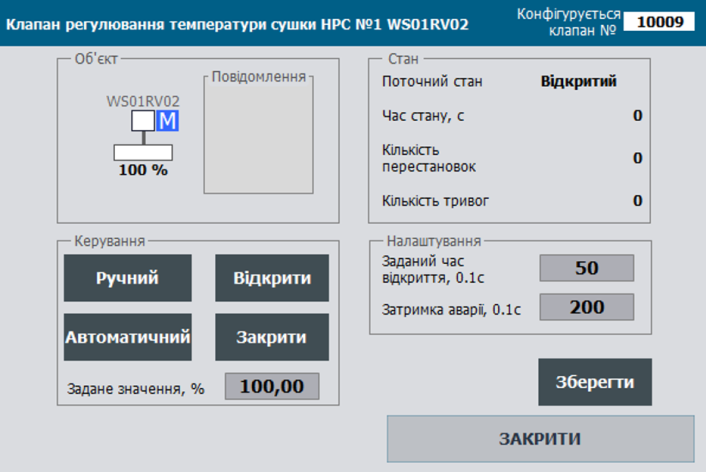

# VLVD Class: Valves with Discrete Control

**CLSID = 16#201x**

## General Description

This class implements the **processing functions for an actuator of the “valve with discrete control” type**. These functions include switching actuator operating modes, actuator control, alarm setup and handling, simulation control, propagation of statuses to and from subordinate process variables, and more.

The class functions are designed for:

- **Monostable mode (PRM.BISTABLE = 0, CLSID = 16#2011)**: one output variable for the valve “open” command;
- **Bistable mode (PRM.BISTABLE = 1, CLSID = 16#2012)**: two output variables “open” and “close”.

The mode is determined automatically by the presence of a zero index or a disable parameter in one of the output variables.

Regardless of whether the valve is monostable or bistable, it can function with:

- two limit switches (open and closed),
- one limit switch (open or closed),
- or without limit switches.

The presence and number of specific limit switches are determined automatically by the presence of a zero index or the disable parameter in the process variable.

## General Requirements for VLVD Functions

### Functional Requirements

Valve control sensors and signals are provided as `DIVAR` and `DOVAR` variables; unused ones are passed as empty (index 0). The presence/absence of specific limit switches and control signals is determined by parameters.

The class functions are designed for:

- **Monostable mode (PRM.BISTABLE = 0, CLSID = 16#2011)**: one output variable for the valve “open” command;
- **Bistable mode (PRM.BISTABLE = 1, CLSID = 16#2012)**: two output variables “open” and “close”.

The mode is determined automatically by the presence of a zero index in one of the output variables.

In monostable mode, the valve’s “open” output variable changes only upon receiving commands. The “close” output variable receives the inverse command. For example, an “open” command sets the “open” variable to “1” only when the command is received. In bistable mode, the valve’s output variables may change upon limit switch activation; for example, an open limit switch clears the “1” from the open command variable.

#### Operating Modes

The following actuator control modes are supported:

- **Manual** – control is performed by the operator via SCADA/HMI;
- **Automatic** – control is performed according to the programmed control system algorithms;
- **Local** – control is performed by the operator using local buttons and switches.

In **automatic, unblocked mode**, the output variables change according to the algorithm only when the appropriate commands are received from programs. In other words, output variables can be controlled by command mode (pulse “open/close” commands from programs) or bypassed by external algorithms. In **manual or blocked mode**, outputs are changed only by HMI commands (this can be adjusted based on process requirements).

#### Actuator Configuration

Two configuration modes are supported (`MANCFG`):

- **Manual**,
- **Automatic**.

In manual mode, the valve type and the presence of limit switches are set using the bit parameters `PRM.ZOPNENBL` and `PRM.ZCLSENBL`.

In automatic mode, these parameters are updated automatically when variables with `ID=0` are linked or connected.

For example, if a limit switch fails, it can be temporarily disabled in the configuration (taken out of service to suppress alarms), and the valve will automatically switch to operating without this limit switch.

Currently, **manual valve type configuration is not in practical use**.

#### Alarm Handling

For VLVD actuators, the following alarm types are monitored:

- `ALMOPN` – “failed to open” alarm: triggered when an open command is active, but the open limit switch is not engaged within the opening time + alarm delay;
- `ALMCLS` – “failed to close” alarm: triggered when a close command is active, but the closed limit switch is not engaged within the opening time + alarm delay;
- `ALMSHFT` – “state mismatch” alarm: triggered when no state change command is active, but the opposite limit switch is detected (e.g., closed limit switch appears while in the open state without a close command, and vice versa);
- `ALM` – actuator error: triggered by any actuator alarm;
- `WRN` – actuator warning: triggered by any actuator warning (currently, no actuator warnings are implemented).

#### Statistical Data Handling

For VLVD actuators, the following statistics are tracked:

- **Switching count**;
- **Alarm count**.

Statistical data can be reset via the appropriate commands.

## Recommendations for Use in HMI

An example of setting up discrete valve control functions on the HMI is shown in the figure below.



Figure. Example of setting up discrete valve control functions on the HMI.

## General Requirements for the Structure of Class Variables

#### VLVD_HMI

Here and below, `adr` is specified as the offset in the structure in 16-bit words.

| name | type | adr  | bit  | description                 |
| ---- | ---- | ---- | ---- | --------------------------- |
| STA  | UINT | 0    |      | status bits                 |
| CMD  | UINT | 1    |      | control command             |
| ALM  | Int  | 2    |      | alarm bits                  |
| POS  | Int  | 3    |      | actuator position (0-10000) |

#### VLVD_CFG

| name          | type      | adr  | bit  | description                                                  |
| ------------- | --------- | ---- | ---- | ------------------------------------------------------------ |
| ID            | UINT      | 0    |      | unique actuator identifier                                   |
| CLSID         | UINT      | 1    |      | actuator class identifier                                    |
| STA           | UINT      | 2    |      | status bits, may be used as the `VLVD_STA` structure         |
| STA_IMSTPD    | BOOL      | 2    | 0    | =1 stopped in an intermediate position                       |
| STA_MANRUNING | BOOL      | 2    | 1    | =1 moving in an undefined direction (manual from panel)      |
| STA_DBLCKACT  | BOOL      | 2    | 2    | =1 “ignore control blocking” mode enabled {A.MSG.2}          |
| STA_OPNING    | BOOL      | 2    | 3    | =1 opening                                                   |
| STA_CLSING    | BOOL      | 2    | 4    | =1 closing                                                   |
| STA_OPND      | BOOL      | 2    | 5    | =1 open (16#0080)                                            |
| STA_CLSD      | BOOL      | 2    | 6    | =1 closed (16#0100)                                          |
| STA_MANBXOUT  | BOOL      | 2    | 7    | =1 manual enable from panel                                  |
| STA_WRKED     | BOOL      | 2    | 8    | =1 in operation                                              |
| STA_DISP      | BOOL      | 2    | 9    | =1 remote mode (from PC/operator panel) (16#0200)            |
| STA_MANBX     | BOOL      | 2    | 10   | =1 manual from panel (with feedback)                         |
| STA_INIOTBUF  | BOOL      | 2    | 11   | =1 variable in IoT buffer                                    |
| STA_INBUF     | BOOL      | 2    | 12   | =1 variable in buffer                                        |
| STA_FRC       | BOOL      | 2    | 13   | =1 at least one variable in the object is forced (for debugging) |
| STA_SML       | BOOL      | 2    | 14   | =1 simulation mode                                           |
| STA_BLCK      | BOOL      | 2    | 15   | =1 blocked                                                   |
| ALM           | UINT      | 3    |      | alarm bits, may be used as the `VLVD_ALM` structure          |
| ALMOPN        | BOOL      | 3    | 0    | =1 failed to open (control circuit fault)                    |
| ALMCLS        | BOOL      | 3    | 1    | =1 failed to close (control circuit fault)                   |
| ALMSHFT       | BOOL      | 3    | 2    | =1 state mismatch (reset on command or sensor state change)  |
| ALMOPN2       | BOOL      | 3    | 3    | =1 failed to open (with 2 pairs of limit switches)           |
| ALMCLS2       | BOOL      | 3    | 4    | =1 failed to close (with 2 pairs of limit switches)          |
| ALM           | BOOL      | 3    | 5    | =1 actuator error (ORed)                                     |
| WRN           | BOOL      | 3    | 6    | =1 actuator warning (ORed)                                   |
| ALMSTP        | BOOL      | 3    | 7    | =1 failed to stop (reset on command or sensor state change)  |
| ALMBELL       | BOOL      | 3    | 8    | =1 bell activation command (one PLC cycle)                   |
| ALMPWR1       | BOOL      | 3    | 9    | =1 power supply missing                                      |
| ALMSTPBTN     | BOOL      | 3    | 10   | =1 stop button pressed                                       |
| ALM_b11       | BOOL      | 3    | 11   | reserved                                                     |
| ALM_b12       | BOOL      | 3    | 12   | reserved                                                     |
| ALM_b13       | BOOL      | 3    | 13   | reserved                                                     |
| ALM_b14       | BOOL      | 3    | 14   | reserved                                                     |
| ALM_b15       | BOOL      | 3    | 15   | reserved                                                     |
| CMD           | ACTTR_CMD | 4    |      | bit commands                                                 |
| PRM           | ACTTR_PRM | 6    |      | parameter bits                                               |
| T_DEASP       | UINT      | 8    |      | alarm delay time in 0.1 s                                    |
| T_OPNSP       | UINT      | 9    |      | maximum opening time in 0.1 s                                |
| POS           | Real      | 10   |      | actuator position (0-100%)                                   |
| STEP1         | UINT      | 12   |      | step number                                                  |
| CNTPER        | UINT      | 13   |      | position change count                                        |
| CNTALM        | UINT      | 14   |      | alarm count                                                  |
| rez           | UINT      | 15   |      | reserved for data type alignment                             |
| T_STEP1       | UDINT     | 16   |      | step runtime in ms                                           |
| T_PREV        | UDINT     | 18   |      | time in ms since last call, taken from `PLC_CFG.TQMS`        |

#### Commands

| Attribute | Type | Bit  | Description                                                  |
| --------- | ---- | ---- | ------------------------------------------------------------ |
| CMD       | UINT |      | Commands:16#0001: open16#0002: close16#0003: toggle16#0004: acknowledge alarm16#0005: reset alarms16#0006: block16#0007: unblock16#0008: stop auto-tuning16#0009: start auto-tuning16#000A: enable protection algorithm16#000B: enable control16#000C: enable control if system pressure is present16#000D: start speed sensor calibration E..10 - free16#0011: start16#0012: stop16#0013: enable reverse14-20 - free16#0021: increase16#0022: decrease23-9F - free16#0100: read configuration16#0101: write configuration102-2FF - free16#0300: toggle manual/automatic16#0301: enable manual mode16#0302: enable automatic mode16#0313: enable local mode16#0314: disable local mode16#0315: take out of service16#0316: put into service316..400 - free16#0401: reset alarm counter16#0402: reset operation/movement counter16#0403: reset operation/movement counter16#0404: reset operation/movement counter |

## Buffer Handling

A classic buffer handling function must be implemented.

- It is recommended to use a **single buffer for all actuator types**.
- The buffer occupancy status is checked by comparing the class identifier `CLSID` and the actuator identifier `ID`.
- Upon buffer acquisition:
  - `ACTBUF.STA = ACTTR_CFG.STA`
  - `ACTTR_CFG.CMD = ACTBUF.CMD` if it is not zero (to allow commands from another source).
- The actuator configuration must be **read into the buffer** upon receiving commands:
  - when updating a technology variable that is already written in the buffer: `ACTTR_HMI.CMD = 16#0100;`
- The actuator configuration must be **written from the buffer** upon receiving commands:
  - `ACTBUF.CMD = 16#0101;`

### Bidirectional Parameterized Buffer Handling ACTBUFIN<->ACTBUFOUT

A **bidirectional parameterized buffer handling function must be implemented**.

- Two buffers are used:
  - Input buffer `ACTBUFIN` – used for processing commands (when `CLSID` and `ID` match) and writing information to the actuator.
  - Output buffer `ACTBUFOUT` – used for reading information from the actuator when a read command is received from `ACTBUFIN`.
- It is recommended to use a **single pair of buffers for all actuators**.
- Buffer occupancy cannot occur, as the buffer is implemented via two buffer variables `ACTBUFIN` and `ACTBUFOUT`, which pass information further to the actuator or an internal HMI buffer (similar to PKW parameter exchange in the PROFIDRIVE profile).
- The actuator configuration must be **read into the output buffer** when:
  - the class identifiers match (`ACTTR_CFG.CLSID = ACTBUFIN.CLSID`), the IDs match (`ACTCFG.ID = ACTBUFIN.ID`), and the input buffer command is `ACTBUFIN.CMD = 16#100`.
- The actuator configuration must be **written from the input buffer** when:
  - the class identifiers match (`ACTTR_CFG.CLSID = ACTBUFIN.CLSID`), the IDs match (`ACTTR_CFG.ID = ACTBUFIN.ID`), and the input buffer command is `ACTBUFIN.CMD = 16#101`.

## Interface Implementation Requirements

The interface must pass the following parameters:

- `VLVDCFG` – INOUT
- `VLVDHMI` – INOUT
- technology variables for actuator sensors (limit switches, local buttons, etc.) – INOUT
- technology variables for actuator outputs (solenoids, contactors, etc.) – INOUT

If it is not possible to access external variables from within the functions, the following should be passed:

- `PLC_CFG`, `ACTBUF`, `ACTBUFIN`, `ACTBUFOUT`; alternatively, other interfaces may be used internally within `PLC_CFG`.

## Actuator Initialization on the First Cycle

The **default writing of ID and CLSID** is performed during the execution of the `initvars` program section.

For each technology variable in `initvars`, the following fragment must be included to write the ID and CLSID:

```
"ACT".VLVD.ID := 10001;   "ACT".VLVD.CLSID := 16#2011;
```

Additionally, initialization is performed inside the actuator handling function, resulting in:

- If the opening time setpoint is not set, it is assigned:

  ```
  VLVD.T_OPNSP := 500; (*5 seconds*)
  ```

- If the alarm delay time setpoint is not set, it is assigned:

  ```
  VLVD.T_DEASP := 200;
  ```

- Technology alarms for sensors are disabled, for example:

  ```
  SOPN.PRM.ISALM := false;
  SOPN.PRM.ISWRN := false;
  ```

## User Program Implementation Requirements (Translation)

- Actuator handling functions must be called on **every invocation of the task** to which they are assigned.
- On **first startup** (`PLC_CFG.SCN1`), **device identifiers (ID) and class identifiers (CLSID)** must be initialized.

The **implementation of actuator handling functions** consists of the following stages:

#### `VLVD_to_ACT`

Reading data from the **device-specific variable type** into the **universal actuator variable type** for **unified and convenient further processing** using the `VLVD_to_ACT` function.

The interface must pass the following parameters:

- `VLVDCFG` – INOUT – device configuration variable
- `VLVDHMI` – INOUT – device HMI variable
- `ACTCFG` – INOUT – universal actuator type used for internal unified processing

If **direct access to external variables within functions is not possible**, the following must be passed:
 `PLC_CFG`, `ACTBUF`, `ACTBUFIN`, `ACTBUFOUT`;
 alternatively, other interfaces within `PLC_CFG` may be used.

```pascal
#ACTCFG.ID:= #VLVDCFG.ID;
#ACTCFG.CLSID:= #VLVDCFG.CLSID;
#ACTCFG.CMD:= #VLVDCFG.CMD;
#ACTCFG.PRM:= #VLVDCFG.PRM;
#ACTCFG.T_DEASP:= #VLVDCFG.T_DEASP;
#ACTCFG.T_OPNSP:= #VLVDCFG.T_OPNSP;
#ACTCFG.POS:= #VLVDCFG.POS;
#ACTCFG.STEP1:= #VLVDCFG.STEP1;
#ACTCFG.CNTPER:= #VLVDCFG.CNTPER;
#ACTCFG.CNTALM:= #VLVDCFG.CNTALM;
#ACTCFG.T_STEP1:= #VLVDCFG.T_STEP1;
#ACTCFG.T_PREV:= #VLVDCFG.T_PREV;

#ACTCFG.STA.IMSTPD:= #VLVDCFG.STA.IMSTPD;
#ACTCFG.STA.MANRUNING:= #VLVDCFG.STA.MANRUNING;
#ACTCFG.STA.DBLCKACT:= #VLVDCFG.STA.DBLCKACT;
#ACTCFG.STA.OPNING:= #VLVDCFG.STA.OPNING;
#ACTCFG.STA.CLSING:= #VLVDCFG.STA.CLSING;
#ACTCFG.STA.OPND:= #VLVDCFG.STA.OPND;
#ACTCFG.STA.CLSD:= #VLVDCFG.STA.CLSD;
#ACTCFG.STA.MANBXOUT:= #VLVDCFG.STA.MANBXOUT;
#ACTCFG.STA.WRKED:= #VLVDCFG.STA.WRKED;
#ACTCFG.STA.DISP:= #VLVDCFG.STA.DISP;
#ACTCFG.STA.MANBX:= #VLVDCFG.STA.MANBX;
#ACTCFG.STA.INBUF:= #VLVDCFG.STA.INBUF;
#ACTCFG.STA.INIOTBUF:= #VLVDCFG.STA.INIOTBUF;
#ACTCFG.STA.FRC:= #VLVDCFG.STA.FRC;
#ACTCFG.STA.SML:= #VLVDCFG.STA.SML;
#ACTCFG.STA.BLCK:= #VLVDCFG.STA.BLCK;
#ACTCFG.STA.STOPING:=#VLVDCFG.ALM.ALM_b11;

#ACTCFG.ALM.ALMOPN:= #VLVDCFG.ALM.ALMOPN;
#ACTCFG.ALM.ALMCLS:= #VLVDCFG.ALM.ALMCLS;
#ACTCFG.ALM.ALMSHFT:= #VLVDCFG.ALM.ALMSHFT;
#ACTCFG.ALM.ALMOPN2:= #VLVDCFG.ALM.ALMOPN2;
#ACTCFG.ALM.ALMCLS2:= #VLVDCFG.ALM.ALMCLS2;
#ACTCFG.ALM.ALM:= #VLVDCFG.ALM.ALM;
#ACTCFG.ALM.WRN:= #VLVDCFG.ALM.WRN;
#ACTCFG.ALM.ALMSTP:= #VLVDCFG.ALM.ALMSTP;
#ACTCFG.ALM.ALMBELL:= #VLVDCFG.ALM.ALMBELL;
#ACTCFG.ALM.ALMPWR1:= #VLVDCFG.ALM.ALMPWR1;
#ACTCFG.ALM.ALMSTPBTN := #VLVDCFG.ALM.ALMSTPBTN;
#ACTCFG.ALM.ALM_b27 := false;
#ACTCFG.ALM.ALM_b28 := #VLVDCFG.ALM.ALM_b12;
#ACTCFG.ALM.ALM_b29 := #VLVDCFG.ALM.ALM_b13;
#ACTCFG.ALM.ALM_b30 := #VLVDCFG.ALM.ALM_b14;
#ACTCFG.ALM.ALM_b31 := #VLVDCFG.ALM.ALM_b15;
#ACTCFG.CMDHMI:=#VLVDHMI.CMD;
```

#### `ACT_PRE` (Translation)

**Pre-processing of the actuator:** initialization of `STA`, `ALM`, `CMD`, handling of `INBUF`, `SML`, and calculation of `dt` – performed using the `ACT_PRE` function.

The following parameters must be passed to the interface:

- `ACTCFG` – INOUT – universal actuator type used for internal unified processing
- `STA` – INOUT – status set type of the universal actuator, used for internal unified processing
- `ALMs` – INOUT – alarm set type of the universal actuator, used for internal unified processing
- `CMD` – INOUT – command set type of the universal actuator, used for internal unified processing
- `dt` – INOUT – time difference between actuator handling function calls

If **direct access to external variables within functions is not possible**, pass `PLC_CFG`, `ACTBUF`, `ACTBUFIN`, `ACTBUFOUT`; alternatively, other interfaces within `PLC_CFG` may be used.

```pascal
*initial processing for all actuators: initialization, assignment to internal STA, ALM; determination of INBUF, SML, #dt *)

(* first scan *)
IF "SYS".PLCCFG.STA.SCN1 THEN
(* reset bits in the STA structure *)
#ACTCFG.STA.IMSTPD := FALSE;
#ACTCFG.STA.MANRUNING := FALSE;
#ACTCFG.STA.STOPING := FALSE;
#ACTCFG.STA.OPNING := FALSE;
#ACTCFG.STA.CLSING := FALSE;
#ACTCFG.STA.OPND := FALSE;
#ACTCFG.STA.CLSD := FALSE;
#ACTCFG.STA.MANBXOUT := FALSE;
#ACTCFG.STA.WRKED := FALSE;
#ACTCFG.STA.DISP := FALSE;
#ACTCFG.STA.MANBX := FALSE;
#ACTCFG.STA.INBUF := FALSE;
#ACTCFG.STA.FRC := FALSE;
#ACTCFG.STA.SML := FALSE;
#ACTCFG.STA.BLCK := FALSE;
#ACTCFG.STA.STRTING := FALSE;
#ACTCFG.STA.STOPED := FALSE;
#ACTCFG.STA.SLNDBRK := FALSE;
#ACTCFG.STA.CMDACK := FALSE;
#ACTCFG.STA.SPD1 := FALSE;
#ACTCFG.STA.SPD2 := FALSE;
#ACTCFG.STA.STA_b21 := FALSE;
#ACTCFG.STA.STRT_DELAY := FALSE;
#ACTCFG.STA.STOP_DELAY := FALSE;
#ACTCFG.STA.DBLCKACT := FALSE;
#ACTCFG.STA.ISREVERS := FALSE;
#ACTCFG.STA.ISANALOG := FALSE;
#ACTCFG.STA.INIOTBUF := FALSE;
#ACTCFG.STA.SPDMONON := FALSE;
#ACTCFG.STA.SPDCALIBRON := FALSE;
#ACTCFG.STA.MAINT := FALSE;
#ACTCFG.STA.STA_b31 := FALSE;
(* reset bits in the ALM structure *)
#ACTCFG.ALM.ALMSTRT := FALSE;
#ACTCFG.ALM.ALMSTP := FALSE;
#ACTCFG.ALM.ALMOPN := FALSE;
#ACTCFG.ALM.ALMCLS := FALSE;
#ACTCFG.ALM.ALMOPN2 := FALSE;
#ACTCFG.ALM.ALMCLS2 := FALSE;
#ACTCFG.ALM.ALMSHFT := FALSE;
#ACTCFG.ALM.ALM := FALSE;
#ACTCFG.ALM.ALMBELL := FALSE;
#ACTCFG.ALM.WRN := FALSE;
#ACTCFG.ALM.WRNSPD := FALSE;
#ACTCFG.ALM.ALMSPD := FALSE;
#ACTCFG.ALM.WRNSPD2 := FALSE;
#ACTCFG.ALM.ALMSPD2 := FALSE;
#ACTCFG.ALM.ALMPWR1 := FALSE;
#ACTCFG.ALM.ALMSTPBTN := FALSE;
#ACTCFG.ALM.ALMINVRTR := FALSE;
#ACTCFG.ALM.ALM_b17 := FALSE;
#ACTCFG.ALM.ALM_b18 := FALSE;
#ACTCFG.ALM.ALM_b19 := FALSE;
#ACTCFG.ALM.ALM_b20 := FALSE;
#ACTCFG.ALM.ALM_b21 := FALSE;
#ACTCFG.ALM.ALM_b22 := FALSE;
#ACTCFG.ALM.ALM_b23 := FALSE;
#ACTCFG.ALM.ALM_b24 := FALSE;
#ACTCFG.ALM.ALM_b25 := FALSE;
#ACTCFG.ALM.ALM_b26 := FALSE;
#ACTCFG.ALM.ALM_b27 := FALSE;
#ACTCFG.ALM.ALM_b28 := FALSE;
#ACTCFG.ALM.ALM_b29 := FALSE;
#ACTCFG.ALM.ALM_b30 := FALSE;
#ACTCFG.ALM.ALM_b31 := FALSE;
IF #ACTCFG.T_OPNSP = 0 THEN #ACTCFG.T_OPNSP := 50; END_IF;
END_IF;

#STA := #ACTCFG.STA;
#ALMs := #ACTCFG.ALM;
#CMD := #ACTCFG.CMD;
#ALMs.ALMBELL := FALSE; (* bell resets after one PLC cycle *)
#STA.INBUF := (#ACTCFG.ID = "BUF".ACTBUF.ID AND "BUF".ACTBUF.ID <> 0 AND #ACTCFG.CLSID = "BUF".ACTBUF.CLSID); ( present in the configuration buffer )
#STA.SML := "SYS".PLCCFG.STA.SMLALL; (* simulation mode *)
#dt := "SYS".PLCCFG.TQMS - #ACTCFG.T_PREV; (* time difference between calls in ms *)
IF #dt < 1 THEN #dt := 1; END_IF;
```

#### `ACT_CMDCTRL`

Command processing – performed by the standard command handler for all actuators, implemented as the `ACT_CMDCTRL` function.

The interface must pass the following parameters:

- **ACTCFG - INOUT** – universal actuator type, used internally for unified processing
- **STA - INOUT** – universal actuator status set type, used internally for unified processing
- **CMD - INOUT** – universal actuator command set type, used internally for unified processing

If it is not possible to access external variables from inside the functions, `PLC_CFG`, `ACTBUF`, `ACTBUFIN`, `ACTBUFOUT` should be passed; alternatively, other interfaces may be used for application within `PLC_CFG`.

```pascal
(* Block processes commands from HMI and IOT, forms CMD based on them, updates status bits, resets auto commands in manual mode *)

(* select source of HMI configuration/control command by priority if commands arrive simultaneously *)
IF #ACTCFG.CMDHMI > 16#80 THEN (* config command from HMI *)
    #CMDINT := #ACTCFG.CMDHMI;
ELSIF #STA.INBUF AND "BUF".ACTBUF.CMDHMI > 16#80 THEN (* config command from buffer *)
    #CMDINT := "BUF".ACTBUF.CMDHMI;
ELSIF (#ACTCFG.CMDHMI < 16#80) AND (#ACTCFG.CMDHMI > 0) AND #STA.DISP THEN (* manual control from element in manual mode *)
    #CMDINT := #ACTCFG.CMDHMI;
ELSIF #STA.INBUF AND ("BUF".ACTBUF.CMDHMI < 16#80) AND ("BUF".ACTBUF.CMDHMI > 0) AND #STA.DISP THEN (* manual control from buffer in manual mode *)
    #CMDINT := "BUF".ACTBUF.CMDHMI; (* take command from there, otherwise ignore *)
ELSE
    #CMDINT := 0;
END_IF;

(* in manual mode, all automatic control commands are reset *)
IF #STA.DISP THEN
    #CMD.OPN := FALSE;
    #CMD.CLS := FALSE;
    #CMD.TOGGLE := FALSE;
    #CMD.START := FALSE;
    #CMD.STOP := FALSE;
    #CMD.REVERS := FALSE;
END_IF;

(* HMI commands processing *)
CASE #CMDINT OF
    16#0001: (* open *)
        #CMD.OPN := TRUE;
        #CMD.CLS := FALSE;
    16#0002: (* close *)
        #CMD.CLS := TRUE;
        #CMD.OPN := FALSE;
    16#0003: (* toggle *)
        #CMD.TOGGLE := TRUE;
    16#0004: (* acknowledge alarm *)
        #CMD.ALMACK := TRUE;
    16#0005: (* reset alarms *)
        #CMD.ALMRESET := TRUE;
    16#0006: (* block *)
        #CMD.BLCK := TRUE;
    16#0007: (* unblock *)
        #CMD.DBLCK := TRUE;
    16#0008: (* stop auto-tuning *)
        #CMD.STOPTUN := TRUE;
    16#0009: (* start auto-tuning *)
        #CMD.TUNING := TRUE;
    16#000A: (* enable protection algorithm *)
        #CMD.PROTECT := TRUE;
    16#000B: (* enable control *)
        #CMD.RESOLUTION := TRUE;
    16#000C: (* enable control when system pressure is present *)
        #CMD.P_RESOLUTION := TRUE;
    16#000D: (* start speed sensor calibration *)
        #CMD.DBLCKACTTOGGLE := TRUE;
        #STA.DBLCKACT := NOT #STA.DBLCKACT;
    16#0011: (* start *)
        #CMD.START := TRUE;
        #CMD.STOP := FALSE;
    16#0012: (* stop *)
        #CMD.STOP := TRUE;
        #CMD.START := FALSE;
    16#0013: (* enable reverse *)
        #CMD.REVERS := TRUE;
    16#0021: (* increase *)
        #CMD.UP := TRUE;
    16#0022: (* decrease *)
        #CMD.DWN := TRUE;
    16#0100: (* read configuration *)
        #CMD.BUFLOAD := TRUE;
        "BUF".ACTBUF := #ACTCFG;
    16#0101: (* write configuration *)
        #ACTCFG.PRM := "BUF".ACTBUF.PRM;
        #ACTCFG.T_DEASP := "BUF".ACTBUF.T_DEASP;
        #ACTCFG.T_OPNSP := "BUF".ACTBUF.T_OPNSP;
        #ACTCFG.STOP_DELAY := "BUF".ACTBUF.STOP_DELAY;
    16#0300: (* toggle manual/auto *)
        #STA.DISP := NOT #STA.DISP;
    16#0301: (* manual mode *)
        #STA.DISP := TRUE;
    16#0302: (* auto mode *)
        #STA.DISP := FALSE;
    16#0313: (* enable local mode *)
        #STA.MANBXOUT := TRUE;
        #STA.MANBX := TRUE;
        #STA.DISP := TRUE;
    16#0314: (* disable local mode *)
        #STA.MANBXOUT := FALSE;
        #STA.MANBX := FALSE;
    16#0315: (* take out of service *)
        #CMD.OUTSRVC := TRUE;
    16#0316: (* put into service *)
        #CMD.INSRVC := TRUE;
    16#0401: (* reset alarm counter *)
        #ACTCFG.CNTALM := 0;
    16#0402: (* reset operation/movement counter *)
        #ACTCFG.CNTPER := 0;
    16#0403: (* reset operation time counter *)
        #ACTCFG.TQ_TOTAL := 0;
    16#0404: (* reset last operation time counter *)
        #ACTCFG.TQ_LAST := 0;
END_CASE;

(* handle unblock/block commands from buffer and HMI *)
IF (#ACTCFG.CMDHMI = 16#0006) OR (("BUF".ACTBUF.CMDHMI = 16#0006) AND #STA.INBUF) THEN
    #CMD.BLCK := TRUE;
END_IF;
IF (#ACTCFG.CMDHMI = 16#0007) OR (("BUF".ACTBUF.CMDHMI = 16#0007) AND #STA.INBUF) THEN
    #CMD.DBLCK := TRUE;
END_IF;

#CMDINT := 0;
#ACTCFG.CMDHMI := 0;
IF #STA.INBUF THEN
    "BUF".ACTBUF.CMDHMI := 0;
END_IF;

```

#### `VLVDFN`

Direct Actuator Processing in the `VLVDFN` Function

```pascal
(* transfer variables from a specific actuator type to the universal actuator type *)
"VLVD_to_ACT" (VLVDCFG := #ACTCFG, VLVDHMI := #ACTHMI, ACTCFG := #ACTCFGu);

(* pre-processing: initialize STA, ALM, CMD, INBUF, SML, dt *)
"ACT_PRE" (ACTCFG := #ACTCFGu, STA := #STA, ALMs := #ALMs, CMD := #CMD, dt := #dT);

(* initialize variable on the first processing cycle *)
IF "SYS".PLCCFG.STA.SCN1 THEN (* first scan *)
    IF #ACTCFGu.T_OPNSP <= 0 THEN (* if open time setpoint is not set *)
        #ACTCFGu.T_OPNSP := 500; (* 5 seconds *)
    END_IF;
    IF #ACTCFGu.T_DEASP <= 0 THEN (* if alarm delay time setpoint is not set *)
        #ACTCFGu.T_DEASP := 200; (* 2 seconds *)
    END_IF;
    (* technology alarms for sensors are not used *)
    IF #SOPN.ID <> 0 THEN
        #SOPN.PRM.ISALM := FALSE; (* ISALM *)
        #SOPN.PRM.ISWRN := FALSE; (* ISWRN *)
    END_IF;
    IF #SCLS.ID <> 0 THEN
        #SCLS.PRM.ISALM := FALSE; (* ISALM *)
        #SCLS.PRM.ISWRN := FALSE; (* ISWRN *)
    END_IF;
END_IF;

(* --------------------- parameter block *)
(* parameters: check sensor availability/use on input *)
#ACTCFGu.PRM.PRM_MANCFG := FALSE; (* disable manual IO parameter configuration *)
#ACTCFGu.PRM.PRM_ZCLSENBL := NOT #SCLS.PRM.DSBL AND (#SCLS.ID <> 0);
#ACTCFGu.PRM.PRM_ZOPNENBL := NOT #SOPN.PRM.DSBL AND (#SOPN.ID <> 0);
#ACTCFGu.PRM.PRM_ZPOSENBL := FALSE; (* disable positioner *)
#ACTCFGu.PRM.PRM_PULSCTRLENBL := (#ACTCFGu.CLSID = 16#2014); (* pulse control parameter *)

(* ------------------- simulation mode block *)
(* slave simulation mode from master *)
#SOPN.STA.SML := #STA.SML;
#SCLS.STA.SML := #STA.SML;
#COPN.STA.SML := #STA.SML;
#CCLS.STA.SML := #STA.SML;

(* simulation mode logic *)
IF #STA.SML THEN
    #dpos := UDINT_TO_REAL(#dT * 100) / UDINT_TO_REAL(UINT_TO_UDINT(#ACTCFGu.T_OPNSP) * 100); (* % *)
    IF #ACTCFGu.STEP1 = 2 THEN
        #ACTCFGu.POS := #ACTCFGu.POS + #dpos; (* 0-10000 *)
    END_IF;
    IF #ACTCFGu.STEP1 = 3 THEN
        #ACTCFGu.POS := #ACTCFGu.POS - #dpos; (* 0-10000 *)
    END_IF;
    IF #ACTCFGu.POS < 0.0 THEN #ACTCFGu.POS := 0.0; END_IF;
    IF #ACTCFGu.POS > 100.0 THEN #ACTCFGu.POS := 100.0; END_IF;

    (* sensor simulation *)
    IF NOT #SOPN.STA.FRC THEN
        #SOPN.STA.VALB := (#STA.OPNING AND (#ACTCFGu.T_STEP1 >= UINT_TO_UDINT(#ACTCFGu.T_OPNSP) * 100)) OR #STA.OPND;
    END_IF;
    IF NOT #SCLS.STA.FRC THEN
        #SCLS.STA.VALB := (#STA.CLSING AND (#ACTCFGu.T_STEP1 >= UINT_TO_UDINT(#ACTCFGu.T_OPNSP) * 100)) OR #STA.CLSD;
    END_IF;
END_IF;
```

```pascal
(*-------------------- Command Processing Block *)
(* Standard command handler *)
"ACT_CMDCTRL" (ACTCFG := #ACTCFGu, STA := #STA, CMD := #CMD);

(* -------------------  Open/Close sensor state processing block or logic substitution *)
IF NOT #ACTCFGu.PRM.PRM_ZOPNENBL THEN
    #SOPN1 := #STA.OPNING AND #ACTCFGu.T_STEP1 >= UINT_TO_UDINT(#ACTCFGu.T_OPNSP)*100
           OR #STA.OPND;
    IF "SYS".PLCCFG.STA.SCN1 THEN #SOPN1 := FALSE; END_IF;
ELSE
    #SOPN1 := #SOPN.STA.VALB;
END_IF;

IF NOT #ACTCFGu.PRM.PRM_ZCLSENBL THEN
    #SCLS1 := #STA.CLSING AND #ACTCFGu.T_STEP1 >= UINT_TO_UDINT(#ACTCFGu.T_OPNSP)*100
           OR #STA.CLSD;
    IF "SYS".PLCCFG.STA.SCN1 THEN #SCLS1 := TRUE; END_IF;
ELSE
    #SCLS1 := #SCLS.STA.VALB;
END_IF;

IF NOT #ACTCFGu.PRM.PRM_ZPOSENBL THEN
    #SPOS1 := -10000;
END_IF;

(* ----------------- Position state machine, position alarms, and core control
   0 - initialization
   1 - stopped in intermediate position
   4 - stopped in open position
   5 - stopped in closed position
   7 - moving in undefined direction (manual from local panel)
   2 - opening
   3 - closing
   State machine logic handled below,
   Outputs COPN, CCLS controlled accordingly *)
CASE #ACTCFGu.STEP1 OF
    0: (* initialization *)
        #ACTCFGu.STEP1 := 1;
        #ACTCFGu.T_STEP1 := 0;

    1, 4, 5: (* stopped: 1 - intermediate, 4 - open, 5 - closed *)
        IF #SOPN1 AND NOT #SCLS1 AND NOT #ALMs.ALMSHFT THEN
            IF #ACTCFGu.STEP1 <> 4 THEN #ACTCFGu.T_STEP1 := 0; END_IF;
            #ACTCFGu.STEP1 := 4;
            #ALMs.ALMSHFT := FALSE;
            #ALMs.ALMCLS := FALSE;
            #ALMs.ALMOPN := FALSE;
        END_IF;

        IF #SCLS1 AND NOT #SOPN1 AND NOT #ALMs.ALMSHFT THEN
            IF #ACTCFGu.STEP1 <> 5 THEN #ACTCFGu.T_STEP1 := 0; END_IF;
            #ACTCFGu.STEP1 := 5;
            #ALMs.ALMSHFT := FALSE;
            #ALMs.ALMCLS := FALSE;
            #ALMs.ALMOPN := FALSE;
        END_IF;

        IF ((#ACTCFGu.STEP1 = 4 AND NOT #SOPN1) OR (#ACTCFGu.STEP1 = 5 AND #SOPN1)) OR (#SOPN1 AND #SCLS1) THEN
            #ALMs.ALMSHFT := TRUE;
        ELSE
            #ALMs.ALMSHFT := FALSE;
        END_IF;

    2: (* opening *)
        IF #SOPN1 AND NOT #SCLS1 THEN
            #ACTCFGu.STEP1 := 4; (* switch to open state *)
            #ACTCFGu.T_STEP1 := 0;
        END_IF;

        #ALMs.ALMOPN := FALSE;
        #ALMs.ALMCLS := FALSE;
        #ALMs.ALMSHFT := FALSE;

        IF #ACTCFGu.T_STEP1 >= (UINT_TO_UDINT(#ACTCFGu.T_OPNSP)*100 + UINT_TO_UDINT(#ACTCFGu.T_DEASP)*100) THEN
            #ALMs.ALMOPN := TRUE;
            #ALMs.ALMCLS := FALSE;
            IF #SCLS1 AND NOT #SOPN1 THEN
                #ACTCFGu.STEP1 := 5; (* switch to closed state *)
                #ACTCFGu.T_STEP1 := 0;
            END_IF;
        END_IF;

    3: (* closing *)
        IF #SCLS1 AND NOT #SOPN1 THEN
            #ACTCFGu.STEP1 := 5;
            #ACTCFGu.T_STEP1 := 0;
        END_IF;

        #ALMs.ALMOPN := FALSE;
        #ALMs.ALMCLS := FALSE;
        #ALMs.ALMSHFT := FALSE;

        IF #ACTCFGu.T_STEP1 >= (UINT_TO_UDINT(#ACTCFGu.T_OPNSP)*100 + UINT_TO_UDINT(#ACTCFGu.T_DEASP)*100) THEN
            #ALMs.ALMCLS := TRUE;
            #ALMs.ALMOPN := FALSE;
            IF #SOPN1 AND NOT #SCLS1 THEN
                #ACTCFGu.STEP1 := 4; (* switch to open state *)
                #ACTCFGu.T_STEP1 := 0;
            END_IF;
        END_IF;

    7: (* moving in undefined direction (manual) or unexpected shift error *)
        #ALMs.ALMSHFT := TRUE;
        #ACTCFGu.STEP1 := 1;
        #ACTCFGu.T_STEP1 := 0;

    ELSE (* undefined *)
        #ACTCFGu.STEP1 := 0;
END_CASE;
```

```pascal
(* State machine bitwise mapping *)
#STA.IMSTPD := #ACTCFGu.STEP1 = 1;
#STA.MANRUNING := #ACTCFGu.STEP1 = 7;
#STA.OPNING := #ACTCFGu.STEP1 = 2;
#STA.CLSING := #ACTCFGu.STEP1 = 3;
#STA.OPND := #ACTCFGu.STEP1 = 4;
#STA.CLSD := #ACTCFGu.STEP1 = 5;

(*-------- drive blocking *)
(* blocking condition *)
IF #CMD.BLCK THEN
    #STA.BLCK := TRUE;
    #ALMs.ALMSTP := FALSE;
END_IF;

(* unblocking condition *)
IF #CMD.DBLCK THEN
    #STA.BLCK := FALSE;
    #ALMs.ALMSTP := FALSE;
END_IF;

(* blocking condition, triggers only on block start *)
IF (#ALMs.ALMPWR1 OR #CMD.PROTECT) AND NOT #STA.BLCK THEN
    #STA.BLCK := TRUE;
END_IF;

(* blocking state *)
IF #STA.BLCK THEN
    #COPN.STA.VALB := FALSE;
    #CCLS.STA.VALB := FALSE;
END_IF;

(*-----------------------------*)

(*------------------------ control outputs *)
(* OPN/CLS control only allowed when control is permitted or temporarily unblocked and when not blocked *)
IF (#CMD.RESOLUTION OR "SYS".PLCCFG.STA_PERM.%X6) AND NOT #STA.BLCK THEN
    IF #CMD.CLS THEN #CMD.OPN := FALSE; END_IF; (* CLS has priority over OPN *)
    IF #CMD.CLS AND #ACTCFGu.STEP1 <> 5 AND #ACTCFGu.STEP1 <> 3 THEN
        #ACTCFGu.STEP1 := 3;
        #ACTCFGu.T_STEP1 := 0;
        #ACTCFGu.CNTPER := #ACTCFGu.CNTPER + 1;
        #COPN.STA.VALB := FALSE;
        #CCLS.STA.VALB := TRUE;
    END_IF;
    IF #CMD.OPN AND #ACTCFGu.STEP1 <> 4 AND #ACTCFGu.STEP1 <> 2 THEN
        #ACTCFGu.STEP1 := 2;
        #ACTCFGu.T_STEP1 := 0;
        #ACTCFGu.CNTPER := #ACTCFGu.CNTPER + 1;
        #COPN.STA.VALB := TRUE;
        #CCLS.STA.VALB := FALSE;
    END_IF;
END_IF;

(*-------------------- modes *)

(* local control mode *)
#STA.MANBX := #CMD.CLCL;
(* in local control mode, disable all outputs and switch to manual mode *)
IF #STA.MANBX THEN
    #COPN.STA.VALB := FALSE;
    #CCLS.STA.VALB := FALSE;
    #STA.DISP := TRUE;
END_IF;

#STA.FRC := #COPN.STA.FRC AND #COPN.ID <> 0
         OR #CCLS.STA.FRC AND #CCLS.ID <> 0
         OR #SOPN.STA.FRC AND #SOPN.ID <> 0
         OR #SCLS.STA.FRC AND #SCLS.ID <> 0;

```

```pascal
(*------------------- aggregation of custom alarms, modes, and flags *)
IF #ALMs.ALMOPN THEN
    "SYS".PLCCFG.ALM1.ALM := TRUE;
    IF NOT #ACTCFGu.ALM.ALMOPN THEN
        "SYS".PLCCFG.ALM1.NWALM := TRUE;
        #ACTCFGu.CNTALM := #ACTCFGu.CNTALM + 1;
    END_IF;
END_IF;
IF #ALMs.ALMCLS THEN
    "SYS".PLCCFG.ALM1.ALM := TRUE;
    IF NOT #ACTCFGu.ALM.ALMCLS THEN
        "SYS".PLCCFG.ALM1.NWALM := TRUE;
        #ACTCFGu.CNTALM := #ACTCFGu.CNTALM + 1;
    END_IF;
END_IF;
IF #ALMs.ALMOPN2 THEN
    "SYS".PLCCFG.ALM1.ALM := TRUE;
    IF NOT #ACTCFGu.ALM.ALMOPN2 THEN
        "SYS".PLCCFG.ALM1.NWALM := TRUE;
        #ACTCFGu.CNTALM := #ACTCFGu.CNTALM + 1;
    END_IF;
END_IF;
IF #ALMs.ALMCLS2 THEN
    "SYS".PLCCFG.ALM1.ALM := TRUE;
    IF NOT #ACTCFGu.ALM.ALMCLS2 THEN
        "SYS".PLCCFG.ALM1.NWALM := TRUE;
        #ACTCFGu.CNTALM := #ACTCFGu.CNTALM + 1;
    END_IF;
END_IF;
IF #ALMs.ALMSHFT THEN
    "SYS".PLCCFG.ALM1.ALM := TRUE;
    IF NOT #ACTCFGu.ALM.ALMSHFT THEN
        "SYS".PLCCFG.ALM1.NWALM := TRUE;
        #ACTCFGu.CNTALM := #ACTCFGu.CNTALM + 1;
    END_IF;
END_IF;

IF #STA.DISP THEN
    "SYS".PLCCFG.STA.DISP := TRUE;
    "SYS".PLCCFG.CNTMAN := "SYS".PLCCFG.CNTMAN + 1;
END_IF;

IF #STA.BLCK THEN
    "SYS".PLCCFG.STA.BLK := TRUE;
END_IF;

#ALMs.ALM := #ALMs.ALMOPN OR #ALMs.ALMCLS OR #ALMs.ALMOPN2 OR #ALMs.ALMCLS2 OR #ALMs.ALMSHFT OR #ALMs.ALMSTPBTN OR #ALMs.ALMPWR1 OR #STA.BLCK;

(* final processing: merge into PLC.CFG, STA, ALM, CMD, INBUF, SML, dt *)
"ACT_POST" (ACTCFG := #ACTCFGu, STA := #STA, ALMs := #ALMs, CMD := #CMD, dt := #dT);

"ACT_to_VLVD" (VLVDCFG := #ACTCFG, VLVDHMI := #ACTHMI, ACTCFG := #ACTCFGu);

(* implementation of reading configuration data into the output buffer *)
IF (UINT_TO_WORD(#ACTCFG.CLSID) AND 16#FFF0) = (UINT_TO_WORD("BUF".ACTBUFIN.CLSID) AND 16#FFF0)
   AND #ACTCFG.ID = "BUF".ACTBUFIN.ID
   AND "BUF".ACTBUFIN.CMDHMI = 16#100 THEN
    (* MSG 200-Ok 400-Error
       200 - Data written
       201 - Data read *)
    "BUF".ACTBUFOUT.MSG := 201;

    "BUF".ACTBUFOUT.T_DEASP := #ACTCFG.T_DEASP;
    "BUF".ACTBUFOUT.T_OPNSP := #ACTCFG.T_OPNSP;

    "BUF".ACTBUFIN.CMDHMI := 0;
END_IF;

(* implementation of writing configuration data from the input buffer to the process variable *)
IF (UINT_TO_WORD(#ACTCFG.CLSID) AND 16#FFF0) = (UINT_TO_WORD("BUF".ACTBUFIN.CLSID) AND 16#FFF0)
   AND #ACTCFG.ID = "BUF".ACTBUFIN.ID
   AND "BUF".ACTBUFIN.CMDHMI = 16#101 THEN
    (* MSG 200-Ok 400-Error
       200 - Data written
       201 - Data read *)
    "BUF".ACTBUFOUT := "BUF".ACTBUFIN;

    #ACTCFG.T_DEASP := "BUF".ACTBUFIN.T_DEASP;
    #ACTCFG.T_OPNSP := "BUF".ACTBUFIN.T_OPNSP;

    "BUF".ACTBUFOUT.MSG := 200;

    "BUF".ACTBUFIN.CMDHMI := 0;
END_IF;

```

#### `ACT_POST`

Final actuator processing: aggregation into `PLC.CFG`, forming actuator `STA` and `ALM`, resetting `CMD`, calculating `dt`, etc., implemented as the `ACT_POST` function.

The interface must receive the following parameters:

- `ACTCFG` - INOUT - universal actuator type, used internally for processing to standardize logic.
- `STA` - INOUT - universal actuator status set type, used internally for processing to standardize logic.
- `ALMs` - INOUT - universal actuator alarm set type, used internally for processing to standardize logic.
- `CMD` - INOUT - universal actuator command set type, used internally for processing to standardize logic.
- `dt` - INOUT - difference between actuator function calls in ms.

If it is not possible to access external variables from within functions, `PLC_CFG`, `ACTBUF`, `ACTBUFIN`, and `ACTBUFOUT` are passed; alternatively, other interfaces within `PLC_CFG` can be used.

```pascal
(*final actuator processing before the act_to_XXX function: 
   updating general PLC status bits, limiting alarm counters, 
   writing to STA, ALM, updating the buffer*)
(* modes - into PLC *)
(* general bit indicating at least one manual mode active *)
IF #STA.DISP THEN
    "SYS".PLCCFG.STA.DISP := TRUE;
END_IF;

(* simulation mode active *)
IF #STA.SML THEN
    "SYS".PLCCFG.STA.SML := TRUE;
END_IF;

(* limit alarm counters to prevent overflow *)
IF #ACTCFG.CNTALM > 30000 THEN
    #ACTCFG.CNTALM := 30000;
END_IF;

IF #ACTCFG.CNTPER > 30000 THEN
    #ACTCFG.CNTPER := 30000;
END_IF;

(* write status and alarms to ACTCFG *)
#ACTCFG.STA := #STA;
#ACTCFG.ALM := #ALMs;

(* reset all HMI commands *)
#ACTCFG.CMDHMI := 0;

(* reset all program commands *)

#ACTCFG.CMD.OPN:=FALSE;
#ACTCFG.CMD.CLS:=FALSE;
#ACTCFG.CMD.TOGGLE:=FALSE;
#ACTCFG.CMD.ALMACK:=FALSE;
#ACTCFG.CMD.ALMRESET:=FALSE;
#ACTCFG.CMD.BLCK:=FALSE;
#ACTCFG.CMD.DBLCK:=FALSE;
#ACTCFG.CMD.STOPTUN:=FALSE;
#ACTCFG.CMD.TUNING:=FALSE;
#ACTCFG.CMD.MAN:=FALSE;
#ACTCFG.CMD.AUTO:=FALSE;
#ACTCFG.CMD.PROTECT:=FALSE;
#ACTCFG.CMD.START:=FALSE;
#ACTCFG.CMD.STOP:=FALSE;
#ACTCFG.CMD.UP:=FALSE;
#ACTCFG.CMD.DWN:=FALSE;
#ACTCFG.CMD.CRMT:=FALSE;
#ACTCFG.CMD.RESOLUTION:=FALSE;
#ACTCFG.CMD.REVERS:=FALSE;
#ACTCFG.CMD.CLCL:=FALSE;
#ACTCFG.CMD.DBLCKACTTOGGLE:=FALSE;
#ACTCFG.CMD.STARTDELAY:=FALSE;
#ACTCFG.CMD.STOPDELAY:=FALSE;
#ACTCFG.CMD.P_RESOLUTION:=FALSE;
#ACTCFG.CMD.BUFLOAD:=FALSE;
#ACTCFG.CMD.OUTSRVC:=FALSE;
#ACTCFG.CMD.INSRVC:=FALSE;
#ACTCFG.CMD.CMD_b27:=FALSE;
#ACTCFG.CMD.CMD_b28:=FALSE;
#ACTCFG.CMD.CMD_b29:=FALSE;
#ACTCFG.CMD.CMD_b30:=FALSE;
#ACTCFG.CMD.CMD_b31:=FALSE;

#CMD.OPN:=FALSE;
#CMD.CLS:=FALSE;
#CMD.TOGGLE:=FALSE;
#CMD.ALMACK:=FALSE;
#CMD.ALMRESET:=FALSE;
#CMD.BLCK:=FALSE;
#CMD.DBLCK:=FALSE;
#CMD.STOPTUN:=FALSE;
#CMD.TUNING:=FALSE;
#CMD.MAN:=FALSE;
#CMD.AUTO:=FALSE;
#CMD.PROTECT:=FALSE;
#CMD.START:=FALSE;
#CMD.STOP:=FALSE;
#CMD.UP:=FALSE;
#CMD.DWN:=FALSE;
#CMD.CRMT:=FALSE;
#CMD.RESOLUTION:=FALSE;
#CMD.REVERS:=FALSE;
#CMD.CLCL:=FALSE;
#CMD.DBLCKACTTOGGLE:=FALSE;
#CMD.STARTDELAY:=FALSE;
#CMD.STOPDELAY:=FALSE;
#CMD.P_RESOLUTION:=FALSE;
#CMD.BUFLOAD:=FALSE;
#CMD.OUTSRVC:=FALSE;
#CMD.INSRVC:=FALSE;
#CMD.CMD_b27:=FALSE;
#CMD.CMD_b28:=FALSE;
#CMD.CMD_b29:=FALSE;
#CMD.CMD_b30:=FALSE;
#CMD.CMD_b31:=FALSE;

(*sta bits pack*)
#ACTCFG.STAHMI1.%X0:= #ACTCFG.STA.IMSTPD;
#ACTCFG.STAHMI1.%X1:= #ACTCFG.STA.MANRUNING;
#ACTCFG.STAHMI1.%X2:= #ACTCFG.STA.STOPING;
#ACTCFG.STAHMI1.%X3:= #ACTCFG.STA.OPNING;
#ACTCFG.STAHMI1.%X4:= #ACTCFG.STA.CLSING;
#ACTCFG.STAHMI1.%X5:= #ACTCFG.STA.OPND;
#ACTCFG.STAHMI1.%X6:= #ACTCFG.STA.CLSD;
#ACTCFG.STAHMI1.%X7:= #ACTCFG.STA.MANBXOUT;
#ACTCFG.STAHMI1.%X8:= #ACTCFG.STA.WRKED;
#ACTCFG.STAHMI1.%X9:= #ACTCFG.STA.DISP;
#ACTCFG.STAHMI1.%X10:= #ACTCFG.STA.MANBX;
#ACTCFG.STAHMI1.%X11:= #ACTCFG.STA.INBUF;
#ACTCFG.STAHMI1.%X12:= #ACTCFG.STA.FRC;
#ACTCFG.STAHMI1.%X13:= #ACTCFG.STA.SML;
#ACTCFG.STAHMI1.%X14:= #ACTCFG.STA.BLCK;
#ACTCFG.STAHMI1.%X15:= #ACTCFG.STA.STRTING;
#ACTCFG.STAHMI2.%X0:= #ACTCFG.STA.STOPED;
#ACTCFG.STAHMI2.%X1:= #ACTCFG.STA.SLNDBRK;
#ACTCFG.STAHMI2.%X2:= #ACTCFG.STA.CMDACK;
#ACTCFG.STAHMI2.%X3:= #ACTCFG.STA.SPD1;
#ACTCFG.STAHMI2.%X4:= #ACTCFG.STA.SPD2;
#ACTCFG.STAHMI2.%X5:= #ACTCFG.STA.STA_b21;
#ACTCFG.STAHMI2.%X6:= #ACTCFG.STA.STRT_DELAY;
#ACTCFG.STAHMI2.%X7:= #ACTCFG.STA.STOP_DELAY;
#ACTCFG.STAHMI2.%X8:= #ACTCFG.STA.DBLCKACT;
#ACTCFG.STAHMI2.%X9:= #ACTCFG.STA.ISREVERS;
#ACTCFG.STAHMI2.%X10:= #ACTCFG.STA.ISANALOG;
#ACTCFG.STAHMI2.%X11:= #ACTCFG.STA.INIOTBUF;
#ACTCFG.STAHMI2.%X12:= #ACTCFG.STA.SPDMONON;
#ACTCFG.STAHMI2.%X13:= #ACTCFG.STA.SPDCALIBRON;
#ACTCFG.STAHMI2.%X14:= #ACTCFG.STA.MAINT;
#ACTCFG.STAHMI2.%X15:= #ACTCFG.STA.STA_b31;

(*alm bits pack*)
#ACTCFG.ALMHMI1.%X0:= #ACTCFG.ALM.ALMSTRT;
#ACTCFG.ALMHMI1.%X1:= #ACTCFG.ALM.ALMSTP;
#ACTCFG.ALMHMI1.%X2:= #ACTCFG.ALM.ALMOPN;
#ACTCFG.ALMHMI1.%X3:= #ACTCFG.ALM.ALMCLS;
#ACTCFG.ALMHMI1.%X4:= #ACTCFG.ALM.ALMOPN2;
#ACTCFG.ALMHMI1.%X5:= #ACTCFG.ALM.ALMCLS2;
#ACTCFG.ALMHMI1.%X6:= #ACTCFG.ALM.ALMSHFT;
#ACTCFG.ALMHMI1.%X7:= #ACTCFG.ALM.ALM;
#ACTCFG.ALMHMI1.%X8:= #ACTCFG.ALM.ALMBELL;
#ACTCFG.ALMHMI1.%X9:= #ACTCFG.ALM.WRN;
#ACTCFG.ALMHMI1.%X10:= #ACTCFG.ALM.WRNSPD;
#ACTCFG.ALMHMI1.%X11:= #ACTCFG.ALM.ALMSPD;
#ACTCFG.ALMHMI1.%X12:= #ACTCFG.ALM.WRNSPD2;
#ACTCFG.ALMHMI1.%X13:= #ACTCFG.ALM.ALMSPD2;
#ACTCFG.ALMHMI1.%X14:= #ACTCFG.ALM.ALMPWR1;
#ACTCFG.ALMHMI1.%X15:= #ACTCFG.ALM.ALMSTPBTN;
#ACTCFG.ALMHMI2.%X0:=#ACTCFG.ALM.ALMINVRTR;
#ACTCFG.ALMHMI2.%X1:=#ACTCFG.ALM.ALM_b17;
#ACTCFG.ALMHMI2.%X2:=#ACTCFG.ALM.ALM_b18;
#ACTCFG.ALMHMI2.%X3:=#ACTCFG.ALM.ALM_b19;
#ACTCFG.ALMHMI2.%X4:=#ACTCFG.ALM.ALM_b20;
#ACTCFG.ALMHMI2.%X5:=#ACTCFG.ALM.ALM_b21;
#ACTCFG.ALMHMI2.%X6:=#ACTCFG.ALM.ALM_b22;
#ACTCFG.ALMHMI2.%X7:=#ACTCFG.ALM.ALM_b23;
#ACTCFG.ALMHMI2.%X8:=#ACTCFG.ALM.ALM_b24;
#ACTCFG.ALMHMI2.%X9:=#ACTCFG.ALM.ALM_b25;
#ACTCFG.ALMHMI2.%X10:=#ACTCFG.ALM.ALM_b26;
#ACTCFG.ALMHMI2.%X11:=#ACTCFG.ALM.ALM_b27;
#ACTCFG.ALMHMI2.%X12:=#ACTCFG.ALM.ALM_b28;
#ACTCFG.ALMHMI2.%X13:=#ACTCFG.ALM.ALM_b29;
#ACTCFG.ALMHMI2.%X14:=#ACTCFG.ALM.ALM_b30;
#ACTCFG.ALMHMI2.%X15:=#ACTCFG.ALM.ALM_b31;

(* updating HMI buffer 
continuously transmit to the buffer only those values that change continuously *)
IF #STA.INBUF THEN
    "BUF".ACTBUF.ID := #ACTCFG.ID ;
    "BUF".ACTBUF.CLSID := #ACTCFG.CLSID ;
    "BUF".ACTBUF.CMDHMI := #ACTCFG.CMDHMI ;
    "BUF".ACTBUF.STAHMI1:= #ACTCFG.STAHMI1;
    "BUF".ACTBUF.ALMHMI1:= #ACTCFG.ALMHMI1 ;
    "BUF".ACTBUF.STAHMI2:= #ACTCFG.STAHMI2;
    "BUF".ACTBUF.ALMHMI2:= #ACTCFG.ALMHMI2 ;
    "BUF".ACTBUF.STEP1:= #ACTCFG.STEP1 ;
    "BUF".ACTBUF.T_STEP1:= #ACTCFG.T_STEP1;
    "BUF".ACTBUF.POS := #ACTCFG.POS;
    IF NOT #STA.DISP THEN
        "BUF".ACTBUF.CPOS := #ACTCFG.CPOS;
    END_IF;
    "BUF".ACTBUF.STA:=#ACTCFG.STA;
    "BUF".ACTBUF.ALM:=#ACTCFG.ALM;
    "BUF".ACTBUF.CNTPER:=#ACTCFG.CNTPER;
    "BUF".ACTBUF.CNTALM:=#ACTCFG.CNTALM;
END_IF;

#ACTCFG.T_PREV := "SYS".PLCCFG.TQMS;
#ACTCFG.T_STEP1 := #ACTCFG.T_STEP1 + #dt;
IF #ACTCFG.T_STEP1 > 16#7FFF_FFFF THEN
    #ACTCFG.T_STEP1 := 16#7FFF_FFFF;
END_IF;
```

#### `ACT_to_VLVD`

transfer of information from a universal actuator variable type to a variable matching the actuator type – performed for convenience and unification of processing, implemented via the `ACT_to_VLVD` function;

The following parameters must be passed to the interface:

- `VLVDCFG` - INOUT - actuator configuration variable
- `VLVDHMI` - INOUT - actuator HMI variable
- `ACTCFG` - INOUT - universal actuator type, used internally for unified processing

If it is not possible to access external variables from inside functions, `PLC_CFG`, `ACTBUF`, `ACTBUFIN`, `ACTBUFOUT` are passed; alternatively, other interfaces can be used for processing inside `PLC_CFG`.

```pascal
#VLVDCFG.ID:= #ACTCFG.ID;
#VLVDCFG.CLSID:= #ACTCFG.CLSID;
#VLVDCFG.CMD:= #ACTCFG.CMD;
#VLVDCFG.PRM:= #ACTCFG.PRM;
#VLVDCFG.T_DEASP:= #ACTCFG.T_DEASP;
#VLVDCFG.T_OPNSP:= #ACTCFG.T_OPNSP;
#VLVDCFG.POS:= #ACTCFG.POS;
#VLVDCFG.STEP1:= #ACTCFG.STEP1;
#VLVDCFG.CNTPER:= #ACTCFG.CNTPER;
#VLVDCFG.CNTALM:= #ACTCFG.CNTALM;
#VLVDCFG.T_STEP1:= #ACTCFG.T_STEP1;
#VLVDCFG.T_PREV:= #ACTCFG.T_PREV;

#VLVDCFG.STA.IMSTPD:= #ACTCFG.STA.IMSTPD;
#VLVDCFG.STA.MANRUNING:= #ACTCFG.STA.MANRUNING;
#VLVDCFG.STA.DBLCKACT:= #ACTCFG.STA.DBLCKACT;
#VLVDCFG.STA.OPNING:= #ACTCFG.STA.OPNING;
#VLVDCFG.STA.CLSING:= #ACTCFG.STA.CLSING;
#VLVDCFG.STA.OPND:= #ACTCFG.STA.OPND;
#VLVDCFG.STA.CLSD:= #ACTCFG.STA.CLSD;
#VLVDCFG.STA.MANBXOUT:= #ACTCFG.STA.MANBXOUT;
#VLVDCFG.STA.WRKED:= #ACTCFG.STA.WRKED;
#VLVDCFG.STA.DISP:= #ACTCFG.STA.DISP;
#VLVDCFG.STA.MANBX:= #ACTCFG.STA.MANBX;
#VLVDCFG.STA.INBUF:= #ACTCFG.STA.INBUF;
#VLVDCFG.STA.INIOTBUF :=#ACTCFG.STA.INIOTBUF;
#VLVDCFG.STA.FRC:= #ACTCFG.STA.FRC;
#VLVDCFG.STA.SML:= #ACTCFG.STA.SML;
#VLVDCFG.STA.BLCK:= #ACTCFG.STA.BLCK;

#VLVDCFG.ALM.ALMOPN:= #ACTCFG.ALM.ALMOPN;
#VLVDCFG.ALM.ALMCLS:= #ACTCFG.ALM.ALMCLS;
#VLVDCFG.ALM.ALMSHFT:= #ACTCFG.ALM.ALMSHFT;
#VLVDCFG.ALM.ALMOPN2:= #ACTCFG.ALM.ALMOPN2;
#VLVDCFG.ALM.ALMCLS2:= #ACTCFG.ALM.ALMCLS2;
#VLVDCFG.ALM.ALM:= #ACTCFG.ALM.ALM;
#VLVDCFG.ALM.WRN:= #ACTCFG.ALM.WRN;
#VLVDCFG.ALM.ALMSTP:= #ACTCFG.ALM.ALMSTP;
#VLVDCFG.ALM.ALMBELL:= #ACTCFG.ALM.ALMBELL;
#VLVDCFG.ALM.ALMPWR1:= #ACTCFG.ALM.ALMPWR1;
#VLVDCFG.ALM.ALMSTPBTN:=#ACTCFG.ALM.ALMSTPBTN;
#VLVDCFG.ALM.ALM_b11:=#ACTCFG.STA.STOPING;(*Not enough STA bits*)
#VLVDCFG.ALM.ALM_b12:=false;
#VLVDCFG.ALM.ALM_b13:=false;
#VLVDCFG.ALM.ALM_b14:=false;
#VLVDCFG.ALM.ALM_b15:=false;

#VLVDHMI.CMD:=#ACTCFG.CMDHMI;

#VLVDHMI.STA.%X0 := #VLVDCFG.STA.IMSTPD;
#VLVDHMI.STA.%X1 := #VLVDCFG.STA.MANRUNING;
#VLVDHMI.STA.%X2 := #VLVDCFG.STA.DBLCKACT;
#VLVDHMI.STA.%X3 := #VLVDCFG.STA.OPNING;
#VLVDHMI.STA.%X4 := #VLVDCFG.STA.CLSING;
#VLVDHMI.STA.%X5 := #VLVDCFG.STA.OPND;
#VLVDHMI.STA.%X6 := #VLVDCFG.STA.CLSD;
#VLVDHMI.STA.%X7 := #VLVDCFG.STA.MANBXOUT;
#VLVDHMI.STA.%X8 := #VLVDCFG.STA.WRKED;
#VLVDHMI.STA.%X9 := #VLVDCFG.STA.DISP;
#VLVDHMI.STA.%X10 := #VLVDCFG.STA.MANBX;
#VLVDHMI.STA.%X11 := #VLVDCFG.STA.INIOTBUF;
#VLVDHMI.STA.%X12 := #VLVDCFG.STA.INBUF;
#VLVDHMI.STA.%X13 := #VLVDCFG.STA.FRC;
#VLVDHMI.STA.%X14 := #VLVDCFG.STA.SML;
#VLVDHMI.STA.%X15 := #VLVDCFG.STA.BLCK;

#VLVDHMI.ALM.%X0 :=#VLVDCFG.ALM.ALMOPN;
#VLVDHMI.ALM.%X1 :=#VLVDCFG.ALM.ALMCLS;
#VLVDHMI.ALM.%X2 :=#VLVDCFG.ALM.ALMSHFT;
#VLVDHMI.ALM.%X3 :=#VLVDCFG.ALM.ALMOPN2;
#VLVDHMI.ALM.%X4 :=#VLVDCFG.ALM.ALMCLS2;
#VLVDHMI.ALM.%X5 :=#VLVDCFG.ALM.ALM;
#VLVDHMI.ALM.%X6 :=#VLVDCFG.ALM.WRN;
#VLVDHMI.ALM.%X7 :=#VLVDCFG.ALM.ALMSTP;
#VLVDHMI.ALM.%X8 :=#VLVDCFG.ALM.ALMBELL;
#VLVDHMI.ALM.%X9 :=#VLVDCFG.ALM.ALMPWR1;
#VLVDHMI.ALM.%X10 :=#VLVDCFG.ALM.ALMSTPBTN;
#VLVDHMI.ALM.%X11 :=#VLVDCFG.ALM.ALM_b11;
#VLVDHMI.ALM.%X12 :=#VLVDCFG.ALM.ALM_b12;
#VLVDHMI.ALM.%X13 :=#VLVDCFG.ALM.ALM_b13;
#VLVDHMI.ALM.%X14 :=#VLVDCFG.ALM.ALM_b14;
#VLVDHMI.ALM.%X15 :=#VLVDCFG.ALM.ALM_b15;

#VLVDHMI.POS := REAL_TO_INT(#VLVDCFG.POS);

```

## Testing

Before starting testing, create 2–3 variables for the actuator, create calls to actuator data processing functions with **full wiring of inputs and outputs** (two limit switches: open and closed, two outputs: open and close), and implement processing of technological variables corresponding to the actuator’s limit switches and outputs.

### List of General Tests

| No.  | Name                                             | When to test                  | Notes |
| ---- | ------------------------------------------------ | ----------------------------- | ----- |
| 1    | Assignment of ID and CLSID at startup            | After function implementation |       |
| 2    | Initialization of default parameters             | After function implementation |       |
| 3    | Reading into buffer and writing from buffer      | After function implementation |       |
| 4    | Operation of built-in time counters              | After function implementation |       |
| 5    | Effect of PLC time counter rollover on step time | After function implementation |       |
| 6    | Control of actuator operating modes              | After function implementation |       |
| 7    | Actuator control                                 | After function implementation |       |
| 8    | Processing of actuator alarms                    | After function implementation |       |
| 9    | Automatic actuator configuration algorithms      | After function implementation |       |
|      |                                                  |                               |       |

### 1 Assignment of ID and CLSID at startup

- Before starting testing, the PLC should be in STOP.
- After startup, **all actuator variables used in the program must have ID and CLSID assigned.**

### 2 Initialization of default parameters

- Before starting testing, the PLC should be in STOP.
- After startup, all actuators should have `VLVD.T_OPNSP` (open time) set to 500 (5 seconds).
- After startup, all actuators should have `VLVD.T_DEASP` (alarm delay time) set to 200 (2 seconds).

### 3 Reading into buffer and writing from buffer

| No.  | Action for verification                                      | Expected result                                              | Notes |
| ---- | ------------------------------------------------------------ | ------------------------------------------------------------ | ----- |
| 1    | Send write-to-buffer command for any variable: `VLVD_HMI.CMD := 16#0100` | `ACTBUF.ID` receives `VLVD_CFG.ID`, `ACTBUF.CLSID` receives `VLVD_CFG.CLSID`, status bits, alarm bits, and parameter bits of `ACTBUF` receive corresponding values from `VLVD_CFG`, and other parameters are written to `ACTBUF`. |       |
| 2    | Send command to switch actuator to manual mode: `VLVD_HMI.CMD := 16#0301` | `VLVD_HMI.STA.X9`, `VLVD_CFG.STA.DISP`, and `ACTBUF.STA.DISP` are set to 1 |       |
| 3    | Change any parameter in the buffer (e.g., `ACTBUF.T_DEASP` to 1000), then resend `ACTBUF.CMDHMI := 16#0100` to re-read data into the buffer | The variable is re-read into the buffer, and the changed parameter reverts to its previous value |       |
| 4    | Send write-to-buffer command for another variable: `VLVD_HMI.CMD := 16#0100` | Same as test 1                                               |       |
| 5    | Send write-to-buffer command using `VLVD_CFG.CMD.BUFLOAD`    | Same as test 1                                               |       |
| 6    | Change any parameter in the buffer (e.g., `ACTBUF.T_DEASP` to 1000), then send `ACTBUF.CMDHMI := 16#0101` to write data from the buffer to the actuator variable | The value from `ACTBUF.T_DEASP` is written to `VLVD_CFG.T_DEASP` |       |

### 4 Operation of built-in time counters

The current step time of the actuator `VLVD_CFG` is displayed in `VLVD_CFG.T_STEP1` in milliseconds. Accuracy is verified using an astronomical clock.

### 5 Effect of PLC time counter rollover on step time

| No.  | Action for verification                                      | Expected result                                              | Notes |
| ---- | ------------------------------------------------------------ | ------------------------------------------------------------ | ----- |
| 1    | Observe changes in `PLCCFG.TQMS` and `VLVD_CFG.T_STEP1`, check accuracy with an astronomical clock | `PLCCFG.TQMS` and `VLVD_CFG.T_STEP1` measure time in ms      |       |
| 2    | Set `PLCCFG.TQMS` to `16#FFFF_FFFF - 5000` (5000 ms before range end) and `VLVD_CFG.T_STEP1` to `16#7FFF_FFFF - 10000` (10000 ms before range end) | Time will count normally for ~5000 ms; when `PLCCFG.TQMS` overflows (resets to 0), it will continue counting, while `VLVD_CFG.T_STEP1` will continue until it reaches its maximum (`16#7FFFFFFF`) and stop |       |
| 3    | Send open command `VLVD_CFG.CMD.OPN`                         | `VLVD_CFG.T_STEP1` starts counting from zero                 |       |

### 6 Control of actuator operating modes

| No.  | Action for verification                         | Expected result                                              | Notes |
| ---- | ----------------------------------------------- | ------------------------------------------------------------ | ----- |
| 1    | Send `VLVD_HMI.CMD := 16#0100`                  | Same as test 3.1                                             |       |
| 2    | Send `VLVD_HMI.CMD := 16#0301` (manual mode)    | `VLVD_HMI.STA.X9`, `VLVD_CFG.STA.DISP`, and `ACTBUF.STA.DISP` are set to 1 |       |
| 3    | Send `VLVD_HMI.CMD := 16#0302` (auto mode)      | These bits are set to 0                                      |       |
| 4    | Send `VLVD_HMI.CMD := 16#0300` (toggle mode)    | These bits toggle                                            |       |
| 5    | Send manual mode command via `VLVD_CFG.CMD.MAN` | These bits are set to 1                                      |       |
| 6    | Send auto mode command via `VLVD_CFG.CMD.AUTO`  | These bits are set to 0                                      |       |
| 7    | Send `ACTBUF.CMDHMI := 16#0301`                 | Bits set to 1                                                |       |
| 8    | Send `ACTBUF.CMDHMI := 16#0302`                 | Bits set to 0                                                |       |
| 9    | Send `ACTBUF.CMDHMI := 16#0300`                 | Bits toggle                                                  |       |
| 10   | Switch all actuators to auto mode               | `PLCCFG.STA_PERM.X9` becomes 0, `PLCCFG.CNTMAN_PERM` becomes 0 |       |
| 11   | Switch several actuators to manual mode         | `PLCCFG.STA_PERM.X9` becomes 1, `PLCCFG.CNTMAN_PERM` equals the number of actuators in manual mode |       |

### 7 Actuator Control

| Number | Verification action                                          | Expected result                                              | Notes |
| ------ | ------------------------------------------------------------ | ------------------------------------------------------------ | ----- |
| 1      | Send command to switch the actuator to automatic mode VLVD_CFG.CMD.AUTO | Bit VLVD_HMI.STA.X9, VLVD_CFG.STA.DISP and ACTBUF.STA.DISP will be set to 0 |       |
| 2      | Send open command in automatic mode VLVD_CFG.CMD.OPN         | The output variable for open will be set to 1 COPN.STA.VALB = 1, the output variable for close will be set to 0 CCLS.STA.VALB = 0. The actuator will switch to opening state, indicated by bit VLVD_CFG.STA.OPNING = 1 and step number VLVD_CFG.STEP1 = 2. When the open limit switch signal appears, the actuator will switch to open state VLVD_CFG.STA.OPND = 1 and step number VLVD_CFG.STEP1 = 4. The reposition counter VLVD_CFG.CNTPER will increase by 1 |       |
| 3      | Send close command in automatic mode VLVD_CFG.CMD.CLS        | The output variable for open will be set to 0 COPN.STA.VALB = 0, the output variable for close will be set to 1 CCLS.STA.VALB = 1. The actuator will switch to closing state, indicated by bit VLVD_CFG.STA.CLSING = 1 and step number VLVD_CFG.STEP1 = 3. When the close limit switch signal appears, the actuator will switch to closed state VLVD_CFG.STA.CLSD = 1 and step number VLVD_CFG.STEP1 = 5. The reposition counter VLVD_CFG.CNTPER will increase by 1 |       |
| 4      | Send toggle state command in automatic mode VLVD_CFG.CMD.TOGGLE | The output variable for open will be set to 1 COPN.STA.VALB = 1, the output variable for close will be set to 0 CCLS.STA.VALB = 0. The actuator will switch to opening state, indicated by bit VLVD_CFG.STA.OPNING = 1 and step number VLVD_CFG.STEP1 = 2. When the open limit switch signal appears, the actuator will switch to open state VLVD_CFG.STA.OPND = 1 and step number VLVD_CFG.STEP1 = 4. The reposition counter VLVD_CFG.CNTPER will increase by 1 |       |
| 5      | Send toggle state command in automatic mode VLVD_CFG.CMD.TOGGLE | The output variable for open will be set to 0 COPN.STA.VALB = 0, the output variable for close will be set to 1 CCLS.STA.VALB = 1. The actuator will switch to closing state, indicated by bit VLVD_CFG.STA.CLSING = 1 and step number VLVD_CFG.STEP1 = 3. When the close limit switch signal appears, the actuator will switch to closed state VLVD_CFG.STA.CLSD = 1 and step number VLVD_CFG.STEP1 = 5. The reposition counter VLVD_CFG.CNTPER will increase by 1 |       |
| 6      | Send command to switch the actuator to manual mode VLVD_HMI.CMD:=16#0301 | Bit VLVD_HMI.STA.X9, VLVD_CFG.STA.DISP and ACTBUF.STA.DISP will be set to 1 |       |
| 7      | Send open command in manual mode VLVD_HMI.CMD:=16#0001       | The output variable for open will be set to 1 COPN.STA.VALB = 1, the output variable for close will be set to 0 CCLS.STA.VALB = 0. The actuator will switch to opening state, indicated by bit VLVD_CFG.STA.OPNING = 1 and step number VLVD_CFG.STEP1 = 2. When the open limit switch signal appears, the actuator will switch to open state VLVD_CFG.STA.OPND = 1 and step number VLVD_CFG.STEP1 = 4. The reposition counter VLVD_CFG.CNTPER will increase by 1 |       |
| 8      | Send close command in manual mode VLVD_HMI.CMD:=16#0002      | The output variable for open will be set to 0 COPN.STA.VALB = 0, the output variable for close will be set to 1 CCLS.STA.VALB = 1. The actuator will switch to closing state, indicated by bit VLVD_CFG.STA.CLSING = 1 and step number VLVD_CFG.STEP1 = 3. When the close limit switch signal appears, the actuator will switch to closed state VLVD_CFG.STA.CLSD = 1 and step number VLVD_CFG.STEP1 = 5. The reposition counter VLVD_CFG.CNTPER will increase by 1 |       |
| 9      | Send toggle state command in manual mode VLVD_HMI.CMD:=16#0003 | The output variable for open will be set to 1 COPN.STA.VALB = 1, the output variable for close will be set to 0 CCLS.STA.VALB = 0. The actuator will switch to opening state, indicated by bit VLVD_CFG.STA.OPNING = 1 and step number VLVD_CFG.STEP1 = 2. When the open limit switch signal appears, the actuator will switch to open state VLVD_CFG.STA.OPND = 1 and step number VLVD_CFG.STEP1 = 4. The reposition counter VLVD_CFG.CNTPER will increase by 1 |       |
| 10     | Send toggle state command in manual mode VLVD_HMI.CMD:=16#0003 | The output variable for open will be set to 0 COPN.STA.VALB = 0, the output variable for close will be set to 1 CCLS.STA.VALB = 1. The actuator will switch to closing state, indicated by bit VLVD_CFG.STA.CLSING = 1 and step number VLVD_CFG.STEP1 = 3. When the close limit switch signal appears, the actuator will switch to closed state VLVD_CFG.STA.CLSD = 1 and step number VLVD_CFG.STEP1 = 5. The reposition counter VLVD_CFG.CNTPER will increase by 1 |       |
| 11     | Send buffer write command VLVD_HMI.CMD:=16#0100              | ACTBUF.ID will take the value of VLVD_CFG.ID, ACTBUF.CLSID will take the value of VLVD_CFG.CLSID, the status bits, alarm bits and parameter bits of ACTBUF will take the values of the respective bits of VLVD_CFG and other VLVD_CFG parameters will be written to the corresponding parameters of ACTBUF |       |
| 12     | Send open command in manual mode through buffer ACTBUF.CMDHMI:=16#0001 | The output variable for open will be set to 1 COPN.STA.VALB = 1, the output variable for close will be set to 0 CCLS.STA.VALB = 0. The actuator will switch to opening state, indicated by bit VLVD_CFG.STA.OPNING = 1 and step number VLVD_CFG.STEP1 = 2. When the open limit switch signal appears, the actuator will switch to open state VLVD_CFG.STA.OPND = 1 and step number VLVD_CFG.STEP1 = 4. The reposition counter VLVD_CFG.CNTPER will increase by 1 |       |
| 13     | Send close command in manual mode through buffer ACTBUF.CMDHMI:=16#0002 | The output variable for open will be set to 0 COPN.STA.VALB = 0, the output variable for close will be set to 1 CCLS.STA.VALB = 1. The actuator will switch to closing state, indicated by bit VLVD_CFG.STA.CLSING = 1 and step number VLVD_CFG.STEP1 = 3. When the close limit switch signal appears, the actuator will switch to closed state VLVD_CFG.STA.CLSD = 1 and step number VLVD_CFG.STEP1 = 5. The reposition counter VLVD_CFG.CNTPER will increase by 1 |       |
| 14     | Send toggle state command in manual mode through buffer ACTBUF.CMDHMI:=16#0003 | The output variable for open will be set to 1 COPN.STA.VALB = 1, the output variable for close will be set to 0 CCLS.STA.VALB = 0. The actuator will switch to opening state, indicated by bit VLVD_CFG.STA.OPNING = 1 and step number VLVD_CFG.STEP1 = 2. When the open limit switch signal appears, the actuator will switch to open state VLVD_CFG.STA.OPND = 1 and step number VLVD_CFG.STEP1 = 4. The reposition counter VLVD_CFG.CNTPER will increase by 1 |       |
| 15     | Send toggle state command in manual mode through buffer ACTBUF.CMDHMI:=16#0003 | The output variable for open will be set to 0 COPN.STA.VALB = 0, the output variable for close will be set to 1 CCLS.STA.VALB = 1. The actuator will switch to closing state, indicated by bit VLVD_CFG.STA.CLSING = 1 and step number VLVD_CFG.STEP1 = 3. When the close limit switch signal appears, the actuator will switch to closed state VLVD_CFG.STA.CLSD = 1 and step number VLVD_CFG.STEP1 = 5. The reposition counter VLVD_CFG.CNTPER will increase by 1 |       |

### 8 Actuator alarm handling

| No.  | Verification action                                          | Expected result                                              | Notes |
| ---- | ------------------------------------------------------------ | ------------------------------------------------------------ | ----- |
| 1    | Send command to switch actuator to automatic mode VLVD_CFG.CMD.AUTO | Bit VLVD_HMI.STA.X9, VLVD_CFG.STA.DISP, and ACTBUF.STA.DISP will be set to 0 |       |
| 2    | Send close command in automatic mode VLVD_CFG.CMD.CLS        | The actuator will enter the closing state, indicated by VLVD_CFG.STA.CLSING = 1 and step VLVD_CFG.STEP1 = 3. When the close limit switch signal appears, the actuator will enter the closed state VLVD_CFG.STA.CLSD = 1 and step VLVD_CFG.STEP1 = 5 |       |
| 3    | Force the open limit switch and set its value to 0           | The force bit of the limit switch variable DIVAR_CFG.STA.FRC will be 1, the value bit DIVAR_CFG.STA.VALB will be 0, and the forced variable presence bit VLVD_CFG.STA.FRC will be 1 |       |
| 4    | Send open command in automatic mode VLVD_CFG.CMD.OPN         | The actuator will enter the opening state VLVD_CFG.STA.OPNING = 1, step VLVD_CFG.STEP1 = 2. After VLVD_CFG.T_OPNSP + VLVD_CFG.T_DEASP elapses, an "actuator did not open" alarm will appear with VLVD_CFG.ALM.ALMOPN = 1 and general alarm VLVD_CFG.ALM.ALM = 1. The system alarm bit PLCCFG.ALM1_PERM.X0 will be 1, and PLCCFG.CNTALM_PERM will be 1. VLVD_CFG.CNTPER and VLVD_CFG.CNTALM will each increase by 1 |       |
| 5    | Force the open limit switch and set its value to 1           | The force bit DIVAR_CFG.STA.FRC will be 1, value bit DIVAR_CFG.STA.VALB will be 1. Upon receiving the open signal, the actuator will enter the open state VLVD_CFG.STA.OPND = 1, step VLVD_CFG.STEP1 = 4. Alarms will reset: VLVD_CFG.ALM.ALMOPN = 0, VLVD_CFG.ALM.ALM = 0 |       |
| 6    | Send close command in automatic mode VLVD_CFG.CMD.CLS        | The actuator will enter the closing state VLVD_CFG.STA.CLSING = 1, step VLVD_CFG.STEP1 = 3. After VLVD_CFG.T_OPNSP + VLVD_CFG.T_DEASP, an "actuator did not close" alarm will appear: VLVD_CFG.ALM.ALMCLS = 1, VLVD_CFG.ALM.ALM = 1. VLVD_CFG.CNTPER and VLVD_CFG.CNTALM will each increase by 1 |       |
| 7    | Force the open limit switch and set its value to 0           | DIVAR_CFG.STA.FRC will be 1, DIVAR_CFG.STA.VALB will be 0. Upon loss of the open signal, the actuator will enter the closed state VLVD_CFG.STA.CLSD = 1, step VLVD_CFG.STEP1 = 5. Alarms will reset: VLVD_CFG.ALM.ALMCLS = 0, VLVD_CFG.ALM.ALM = 0 |       |
| 8    | Force the open limit switch and set its value to 1           | DIVAR_CFG.STA.FRC will be 1, DIVAR_CFG.STA.VALB will be 1. A state violation alarm will appear: VLVD_CFG.ALM.ALMSFT = 1, VLVD_CFG.ALM.ALM = 1. VLVD_CFG.CNTALM will increase by 1 |       |
| 9    | Force the open limit switch and set its value to 0           | The state violation alarm will clear: VLVD_CFG.ALM.ALMSFT = 0, VLVD_CFG.ALM.ALM = 0 |       |
| 10   | Disable forcing of the open limit switch                     | DIVAR_CFG.STA.FRC will be 0, and VLVD_CFG.STA.FRC will be 0  |       |
| 11   | Repeat steps 3-10 with the close limit switch                |                                                              |       |

### 9 Actuator automatic configuration algorithms

| No.  | Verification action                                          | Expected result                                              | Notes |
| ---- | ------------------------------------------------------------ | ------------------------------------------------------------ | ----- |
| 1    | Check parameters VLVD_CFG.PRM.PRM_MANCFG, VLVD_CFG.PRM.PRM_ZOPNENBL, VLVD_CFG.PRM.PRM_ZCLSENBL | Manual configuration disabled: VLVD_CFG.PRM.PRM_MANCFG = 0; open limit switch present: VLVD_CFG.PRM.PRM_ZOPNENBL = 1; close limit switch present: VLVD_CFG.PRM.PRM_ZCLSENBL = 1 |       |
| 2    | Set manual config bit to 1 VLVD_CFG.PRM.PRM_MANCFG:=1 and disable open and close limit switches VLVD_CFG.PRM.PRM_ZOPNENBL:=0, VLVD_CFG.PRM.PRM_ZCLSENBL:=0 | Manual config remains disabled VLVD_CFG.PRM.PRM_MANCFG = 0; open switch remains enabled VLVD_CFG.PRM.PRM_ZOPNENBL = 1; close switch remains enabled VLVD_CFG.PRM.PRM_ZCLSENBL = 1, since the option is disabled and automatic configuration is used |       |
| 3    | For the open limit switch variable, activate the "variable not used" parameter DIVAR_CFG.PRM.DSBL | Variable enable bit becomes 0 DIVAR_CFG.STA.ENBL = 0; parameter for open limit switch becomes 0 VLVD_CFG.PRM.PRM_ZOPNENBL = 0 |       |
| 4    | Send command to switch actuator to automatic mode VLVD_CFG.CMD.AUTO | The actuator will switch to automatic mode                   |       |
| 5    | Send open command in automatic mode VLVD_CFG.CMD.OPN         | The actuator will enter the opening state VLVD_CFG.STA.OPNING = 1, step VLVD_CFG.STEP1 = 2. As it operates without the open switch, after VLVD_CFG.T_OPNSP time it will enter the open state VLVD_CFG.STA.OPND = 1, step VLVD_CFG.STEP1 = 4. VLVD_CFG.CNTPER will increase by 1 |       |
| 6    | Send close command in automatic mode VLVD_CFG.CMD.CLS        | The actuator will enter the closing state VLVD_CFG.STA.CLSING = 1, step VLVD_CFG.STEP1 = 3. Upon receiving the close signal, it will switch to closed state VLVD_CFG.STA.CLSD = 1, step VLVD_CFG.STEP1 = 5. VLVD_CFG.CNTPER will increase by 1 |       |
| 7    | Change the open time parameter VLVD_CFG.T_OPNSP to 100 (10 seconds) and send open command VLVD_CFG.CMD.OPN | The actuator will enter the opening state VLVD_CFG.STA.OPNING = 1, step VLVD_CFG.STEP1 = 2. As it operates without the open switch, after 10 seconds it will enter the open state VLVD_CFG.STA.OPND = 1, step VLVD_CFG.STEP1 = 4. VLVD_CFG.CNTPER will increase by 1 |       |
| 8    | For the close limit switch variable, activate "variable not used" DIVAR_CFG.PRM.DSBL | Variable enable bit becomes 0 DIVAR_CFG.STA.ENBL = 0; close limit switch parameter becomes 0 VLVD_CFG.PRM.PRM_ZCLSENBL = 0 |       |
| 9    | Send close command in automatic mode VLVD_CFG.CMD.CLS        | The actuator will enter the closing state VLVD_CFG.STA.CLSING = 1, step VLVD_CFG.STEP1 = 3. Without the close switch, after 10 seconds it will enter the closed state VLVD_CFG.STA.CLSD = 1, step VLVD_CFG.STEP1 = 5. VLVD_CFG.CNTPER will increase by 1 |       |
| 10   | Deactivate the "variable not used" parameter for the open limit switch and repeat previous steps with the close switch | Variable enable bit becomes 0 DIVAR_CFG.STA.ENBL = 0; open limit switch parameter becomes 0 VLVD_CFG.PRM.PRM_ZOPNENBL = 0 |       |
| 11   | Repeat the previous steps with the open switch only          | The actuator will switch to the open state based on time instead of the limit switch signal |       |
| 12   | Set the open limit switch variable ID to 0 DIVAR_CFG.ID:=0   | The open limit switch parameter becomes 0 VLVD_CFG.PRM.PRM_ZOPNENBL = 0 |       |
| 13   | Send open command in automatic mode VLVD_CFG.CMD.OPN         | The actuator will enter the opening state VLVD_CFG.STA.OPNING = 1, step VLVD_CFG.STEP1 = 2. Without the open switch, after VLVD_CFG.T_OPNSP it will switch to open state VLVD_CFG.STA.OPND = 1, step VLVD_CFG.STEP1 = 4. VLVD_CFG.CNTPER will increase by 1 |       |

