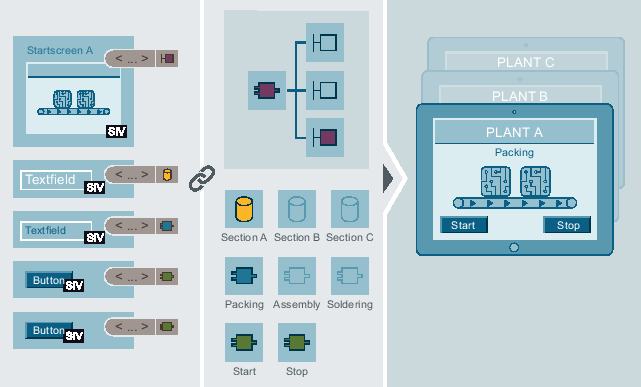
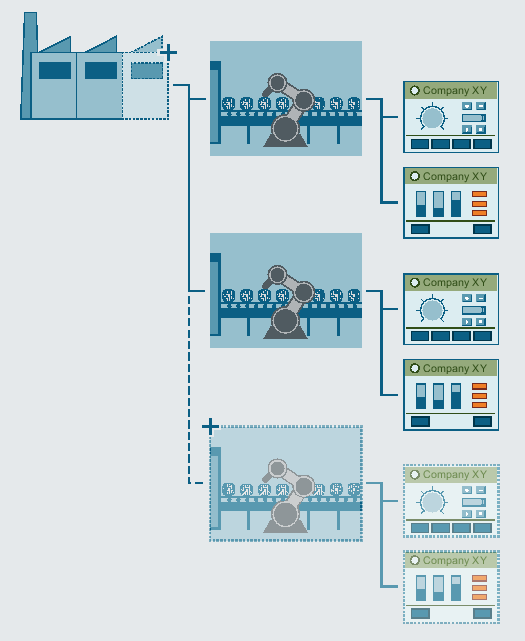
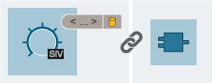
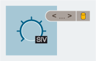
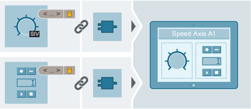

# SIMATIC Visualization Architect

## Introduction

### What is SiVArc? 

SiVArc (SIMATIC WinCC Visualization Architect) is an option package in the  TIA Portal. With SiVArc you generate the visualization for multiple HMI devices and PLCs  from program blocks and generation templates. You use generation rules to specify which HMI objects are generated for which  blocks and devices.  

  

### Functional scope 

You can generate the following HMI objects from controller data with  SiVArc:  

- Screens, faceplates and a selection of display and operating elements 
- External tags 
- HMI text lists 

Without reference to the control program, you can generate a selection of  objects from your WinCC project library with SiVArc to your WinCC project or use  them as instance.  

Use generation templates from the project library or global library for the  generation.  

SiVArc can simultaneously generate the visualization for multiple HMI  devices, multiple PLCs and device proxies. While generating the visualization  with SiVArc, you can continue working with TIA Portal in a second instance. With  SiVArc and the TIA Portal option "TIA Portal Multiuser", you can also have  different users work on a SiVArc project.

For further information regarding SiVArc automation task, refer to [Siemens YouTube  Channel](https://www.youtube.com/watch?v=txLWqFOmAlM).

For additional Information on SiVArc, please refer to [Siemens  Industry Online Support](https://support.industry.siemens.com/cs/ww/en/view/109751096).

## Applications

### Overview

You use SiVArc for automation solutions with a high degree of standardization.

SiVArc supports the configuration engineer during engineering with the following tasks:

- Automatic generation of the visualization including process connection
- Uniform layout of user interfaces
- Consistent naming of operating elements
- Structured storage of configuration data

SiVArc also offers support during the operating phase:

- Commissioning
  SiVArc helps during the commissioning, because a commissioning engineer can perform changes
  in the project at short notice using a generation matrix even without SiVArc expertise.
- Adaptations
  To apply changes to an entire project, you only have to adapt central templates with SiVArc.
- Plant maintenance
  The generation of specific individual devices, means for example that it is easy to exchange HMI
  devices.

SiVArc is also suitable to promote standardization in your project and continuously optimize your projects.

### Advantages

The fundamental added value of SiVArc compared to conventional configuration of visualization consists
of the following SiVArc principles:

- The generated visualization retains the reference to the SiVArc project. Adaptations and optimizations
  with SiVArc ensures high-performance and clearly structured database.
- The visualization is linked directly to the user program. Changes in the user program require only
  minimum adaptations in the WinCC project.
- Layout, design and the consistent designation in the display is centrally controlled across STEP 7
  and WinCC.

### Requirements on the configuration engineer

The following prior knowledge is required to use SiVArc:

- You have configuration experience in STEP 7 and WinCC.
- You have a basic knowledge of Visual Basic Script (VBS).

## Example: Using SiVArc to generate the visualization

### Example scenario 

An existing plant for printed circuit boards is to be expanded with a third  production line. The company commissioned an external engineering office for the  visualization of the expansion based on the existing control program and the  existing visualization design. The task for the engineering firm includes the  following requirements:  

- The customer is new. There is no prior project. 
- The new corporate design of the customer is to be incorporated into the  visualization. 
- The customer wants to optimize standardization within the  company. 

  

### Designing a parameterization solution 

The engineering firm decides to adapt an existing SiVArc sample project for  implementation of the task. To achieve this, they assign a PLC programmer and a  visualization expert the task of analyzing the user program and the  visualization design. 

Together, they define the following:  

- Number of layout templates depending on the HMI devices used 
- Required external tags  
- Naming conventions for naming external tags Text sources in the user program which are used in the visualization 
- Assignment of program blocks to generation templates 
- Structure of SiVArc expressions in the generation templates 
- Storage structures in the SiVArc project 

Then the visualization expert determines the number and type of required  generation templates, SiVArc rules and SiVArc tags. 

### Implementation of parameterization solution 

The PLC programmer adapts the user program to the design solution:  

- Set PLC tags to "Accessible from HMI" 
- Check the text sources in STEP 7 and make them consistent, if necessary 
- Optimize the storage of the program blocks in the project tree 
- Expand existing libraries 

The visualization expert implements the corporate design of the customer for  several HMI devices on screen templates. 

Based on the screen templates, a positioning scheme is created for each  device. 

The generation templates of the example project for standard objects are  adapted to the visualization design.  The generation templates and function blocks are linked to each other in the  screen rules. 

       

   SiVArc generation  template

    SiVArc property  with referenced text source, e.g., a data block

     Function  block 

### Result

A new, customer-specific and agile SiVArc project was created based on a  SiVArc sample project. Further expansions of the plant and the user program now  only require minimal interventions in the SiVArc project.

## Example: Using SiVArc to generate tags

### Example scenario 

Plant builders often experience unplanned delays during commissioning.  Analyses have revealed that existing naming conventions for tags are not  consistently implemented. Recreating the tags places a heavy load on the storage  volume of the HMI devices. 

The company turns to an engineering firm to standardize the tag names and  re-link them. 

The downtime should be minimized and free space made available on the HMI  devices. 

### Solution concept 

The engineering firm analyzes the user program and sets the required tags to  "Accessible from HMI". 

Depending on the type of PLC tags, UDTs or arrays used, the engineer  configures the synchronization of the tag names. 

SiVArc starts the generation of the tags. SiVArc only generates the tags  necessary for visualization. 

The desired tag names are generated via SiVArc expressions based on the  naming concept for tags.   

**Note**  Tag names WinCC supports fewer characters than STEP 7. If you use a character in the  PLC tag name that is not supported by WinCC, this character is deleted when the  name of the external tag is generated. The result may be multiple tags with the  same name. This generates an error because SiVArc does not generate tags with  the same name.  

Only use characters supported by WinCC when assigning names for PLC  tags. 

### Result

 The required tags have been uniformly named. The reference to the PLC tags  can be read at the point of interconnection in the WinCC project. 

       

   Function  block 

Only the genuinely necessary tags are included in the WinCC project. Further  processing and continuous adaptation of the tags is possible with SiVArc.

## Configuring an HMI solution with SiVArc

### Introduction 

Configuring HMI solutions with SiVArc requires a standardized project. The  more standardized a project, the easier and more effective the use of SiVArc to  create the visualization.  

### Requirement  

- The plant is a standard facility. 
- The structured user program is created. 
- A visualization and operating concept is created. 
- Standard blocks in the user program are accessible via libraries. 
- Faceplates for standard applications are accessible via libraries. 
- The project is standardized and transferable. 

### Procedure 

To generate HMI solutions with SiVArc, follow these steps:    

1. Design the layout.  

   - Which HMI devices are in use? 
   - How is the corporate design implemented in the screen? 
   - How many generation templates for screens are required? 
   - How many positioning schemes are required? 

2. Define which external tags are going to be generated by SiVArc.  

3. Create the generation templates for HMI objects and store them in the  library.

   

4. Create the positioning schemes for screens and store them in the library.    

    

5. You create screen rules to link the generation templates with the function  blocks.

       

6. You create tag rules to control the storage of generated tags. 

7. You create copy rules to copy collected HMI objects from the library into the  project. 

8. Define the text list entries. 

9. Generate the full visualization or only for selected  devices. 

### Result 

The generated HMI objects are created in the project tree and marked as  generated objects.  

The generated screen objects are arranged according to their positioning  schemes in the generated screens. 

          SiVArc generation  template 

   SiVArc property  with referenced text source, e.g., a data block

   Function  block 

### Further processing   

**Note**  

> #### Subsequent name changes of generated objects 
>
> If the name of a generated HMI object has been changed, the object is created  and interconnected again at the next SiVArc generation. The renamed object  remains available. 
>
> Change the names of generated objects only in the user  program. 

Restart the generation after each change to the SiVArc project or the user  program.  

SiVArc processes the changed information and replaces the existing generation  and generates additional HMI objects, if necessary.

