# Елменти та базовен налаштування

## Налатшування SiVArc 

Нижче наведений скрін наалштувань для TIA16, він не містить усіх налаштувань, які очевидно є в TIA17 

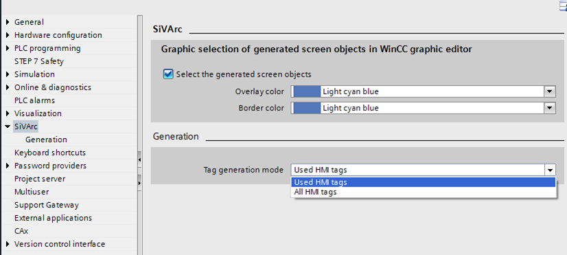

##### Generation Settings

Ви можете ввімкнути згадане нижче в розділі Settings > SiVArc > Generation > "Warning settings":

- Приховати попередження, якщо об’єкт екрана вже існує (Hide warnings if screen object already exists ) - застосовується, якщо об’єкт екрану вже доступний на створеному екрані

- Приховати попередження, якщо змінна не визначена у багатомовному контексті (Hide warning if variable not defined in multi lingual context) - застосовується для змінних із специфічним для мови контекстом

- Приховати попередження про зміну розміру екрана (Hide warning if screen size changed) - застосовується для генерації різних пристроїв із невідповідністю розміру екрана

- Приховати попередження, якщо текстові записи не вдалося вирішити (Hide warnings if text entries could not be resolved) - застосовується, якщо жоден текст не визначений у розділі S7 plug-in editor > Text definitions"

Налаштування типу бібліотеки

Використовувати версію типу бібліотеки за замовчуванням для генерації SiVArc (Use default version of library type for SiVArc generation) - дозволяє використовувати версію типу бібліотеки за замовчуванням на faceplates для генерації SiVArc.

##### Acquisition cycle and mode settings for WinCC Unified

A project consisting of Unified HMI device and Advanced device is configured with block tag member settings or project level settings; and if acqusition cycle supported by Advanced device:

- By default T1s will be configured for HMI tags in Unified devices

A project consisting of Unified HMI device and Advanced device is configured with block tag member settings or project level settings; and if acqusition cycle supported by Unified device:

- By default 1s will be configured for HMI tags in Advanced devices

Acquistion mode can be configured at project level or at a block level. At project level, the types are:

- Cyclic in operation

- On demand

At a **PLC** **block** **level** for Tag member settings, you can choose "**Use** **common** **configuration**" option to set the acquisition cycle and mode to be same across the input tags.

For more information on WinCC Unified device functionality, refer *TIA portal user guide*.

SiVArc supported objects configured for WinCC Unified devices are termed as Unified objects. Eg: Unified button is used in the master copy of a screen rule. All changes made to SiVArc objects are applicable to Unified objects also. For Unified devices, you can configure screen plug-in properties. SiVArc supported expressions like HmiDevice.Name, HmiDevice.Type, HmiApplication.Name, HmiApplication.Type, HmiDevice.Resolution.Width, HmiDevice.Resolution.Height can be configured in the plug-in properties.

## User Management Control (UMAC) in SiVArc

##### About role of UMAC in SIVArc

Використовуючи User Management Control (UMAC), лише авторизовані користувачі матимуть доступ до функцій, пов'язаних із SiVArc. Щоб мати можливість користувацького контролю в SiVArc, вам потрібні права адміністратора SiVarc. Це право може бути призначене користувачем із роллю адміністратора за стандартом Engineering (ES). Для отримання додаткової інформації щодо використання User Management Control зверніться до Інтернет-довідки TIA Portal.

###### Note

- It is mandatory for a user to assign the Engineering Standard role to access the Engineering properties, and features. Failing to provide this access, the user will not be able to open the project, and displays error message.
- If a user has Engineering administrator rights, but no SiVArc administration rights, tries to close the project and re-opens, an unauthorized access related error message displays.

> NOTICE
>
> **Know-how protection**
> While converting TIA portal V15 and lower version projects to V15.1, the credentials set with “know-how protection” feature will be automatically deleted. Ensure you protect the project through UMAC.

## SiVArc editors

#### "Screen rules" editor

У редакторі Screen rules ("Правила екрану") ви визначаєте правила екрану, згідно з якими об'єкти HMI SiVArc генеруються на екранах для різних пристроїв. Правило складається таким чином:

- Name - Унікальна назва правила екрана

- Program block - FB або FC, який викликається в будь-якій позиції в програмі користувача.

- Screen object - Master copy  або тип об'єкта HMI, який генерується. Master copy  або тип потрібно зберігати в бібліотеці.

- Screen - Шаблон генерації (Generation template) екрану, на якому генерується об'єкт HMI. Шаблон генерації повинен зберігатися в бібліотеці.

- Layout field -  Поле макета (Layout field), яке входить до схеми позиціонування екрана. Використовуйте поле макета, щоб вказати позиціонування об'єкта HMI, який потрібно генерувати.

- Condition (optional) - вираз SiVArc, який обчислюється при обробці цього правила екрана. Якщо жодна умова не вказана, правило екрану завжди виконується. Умова застосовується колективно до групи правил (rule group). Ви можете уточнити умову для окремих правил групи правил.

WinCC Unified screens підтримують вирази SiVArc.

- Comment (optional) - Індивідуальний коментар для правила екрана

Відобразіть такі стовпці за необхідності за допомогою піктограм на панелі інструментів:

- PLC -  Правило екрану виконується для вибраних контролерів. Якщо ви не вибрали жодного контролера, правило застосовується до всіх контролерів у вашому проекті.

- HMI device - Правило екрану виконується для вибраних пристроїв HMI. Якщо ви не вибрали жодного пристрою HMI, правило застосовується до всіх пристроїв HMI у вашому проекті.

- HMI device type -  Якщо у вашому проекті доступно кілька пристроїв HMI одного типу, ви також можете вибрати типи пристроїв HMI. Під час генерації перевіряється та вказується, чи може правило застосовуватися до пристрою HMI або до контролера.

Якщо ви хочете згенерувати екран без об'єкта екрана для програмного блоку, залиште поле "Screen object" порожнім.

Будь-який редактор, що підтримує вирази, зберігатиме значення до відповідної властивості за замовчуванням, коли ви перемикаєте редактори без збереження виразу вручну.

Ви можете додати нове правило / групу правил за будь-яким бажаним індексом у будь-якому редакторі правил, клацнувши правою кнопкою миші на правилі> insert a new rule/insert a new rule group.

1. Під час додавання нового правила / групи правил до точки індексу, нове правило / група правил буде вставлено безпосередньо під вибраний індекс.

2. Під час додавання нового правила / групи правил шляхом вибору групи, нове правило / група правил буде додано негайно до вибраної групи правил за першим індексом.

##### Приклад

Ви можете використовувати програмний блок для управління клапаном або двигуном. Кнопка з написом Open valve" або "Start engine" повинна бути створена залежно від використання програмного блоку.

Вам потрібно правило екрану для символу клапана та символу двигуна.

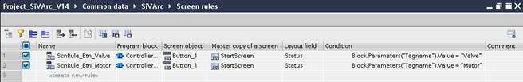

Коли програмний блок обробляється SiVArc під час генерації об'єктів HMI, SiVArc оцінює стан кожного правила екрана. У цьому прикладі використання програмного блоку визначається входом, наприклад Block.Parameters("Tag name").Value = "Valve".

У цьому випадку застосовується умова правила першого екрану, яке потім генерує кнопку з написом "Open valve". 

Максимальна кількість символів для "Condition" - 1000.

#### "Tag rules" editor

У редакторі "Tag rules" ви визначаєте правила тегів, згідно з якими зовнішні теги, створені SiVArc, зберігаються у структурованому вигляді.

Двічі клацніть "Common data > SiVArc > tag rules" у дереві проекту, щоб відкрити редактор "Tag rules". Правило тегу містить такі елементи:

- Name - Унікальна назва правила тегу

- Index - Вказує порядок виконання правил. Ви змінюєте індекс за допомогою перетягування в рядках таблиці.

- Tag group - Назва групи тегів, в якій генерується зовнішній тег

- Tag table - Назва таблиці тегів, у якій генерується зовнішній тег

- Condition (optional) - вираз SiVArc, який обчислюється при обробці цього правила тегу

- Comment (optional) - Індивідуальний коментар до правила тегу

##### 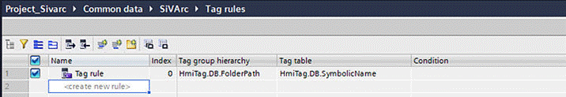

####  "Text list rules" editor

У редакторі "Text list rules" ви визначаєте правила SiVArc, відповідно до яких створюються списки тексту для різних пристроїв. Правило текстового списку складається наступним чином:

- Name - Унікальна назва правила текстового списку

- Program block - FB або FC, який викликається в будь-якій позиції в програмі користувача.

- Text list - Основні копії списків тексту зберігаються в редакторі "Text and Graphic Lists" під час генерації.

- Condition (optional) - вираз SiVArc, який обчислюється при обробці цього правила списку тексту. Якщо жодна умова не вказана, правило списку тексту завжди виконується.

- Comment (optional) - Індивідуальний коментар до правила списку тексту

##### 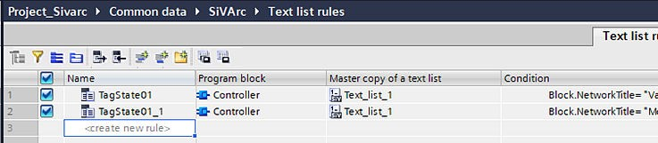

#### "Alarms rules" editor 

У редакторі "Alarm rules" ви визначаєте правила сигналізації SiVArc, відповідно до яких тривоги генеруються для різних пристроїв HMI. Редактор "Alarm rules" складається з:

- Name - Унікальна назва alarm.

- Rule trigger- Функціональний блок або виклик функції, який викликається в будь-якій позиції в програмі користувача.

- Master copy of Alarms/Classes/Groups - Master copies of alarms, classes or groups can be browsed and fetched.

- Condition (optional) -вираз SiVArc, який обчислюється при обробці правила тривоги. Якщо жодна умова не вказана, правило тривоги завжди виконується
- Comment (optional) -  Індивідуальний коментар для правила тривоги.

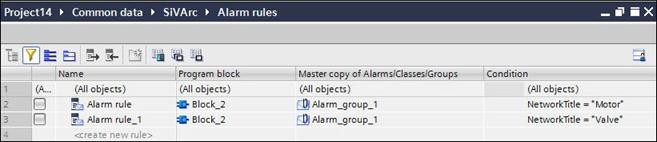

У редакторі "Alarm rules" доступні такі функції:

- Підтримка Intellisense

- Автозаповнення (перетягніть кути комірки до значень автозаповнення)

- Параметри вирізання та копіювання/вставки

- Створіть єдине правило з однаковими записами, коли різняться лише об’єкти. Ви можете вибрати об'єкти в розділі "Master copy of Alarms/Classes/Groups". У разі декількох виділень об'єктів тривоги редактор відображає запис як "Multiple Selection", а для одного виділення відображається назва об'єкта.

##### Вимоги до генерації alarms 

- Програмні блоки, вбудовані в ПЛК (FB і FC), конфігуруються і підключаються до пристрою HMI.

- Alarms створюються та налаштовуються в редакторі "Alarms" в WinCC.

- Основні копії (alarms or block types)) створюються та конфігуруються у глобальній бібліотеці.

Ви можете налаштувати та зберігати правила тривоги у глобальній бібліотеці за допомогою редактора "Alarm rules". Під час конфігурації правила тривоги блоки PLC пристрою S7 відображаються на основних копіях, що зберігаються в бібліотеках, і визначаються умови. Під час генерації SiVArc на основі визначених користувачем умов; система відповідно обробляє правила та генерує об’єкти тривоги.

###### Примітка

- Об'єкти тривоги обробляються лише після того, як правило задовольняє визначену користувачем умову.

- Вибираючи програмні блоки, ви можете вибирати між блоками ПЛК або типами ПЛК.

##### General notes

- You cannot delete the system generated alarm classes, but can only edit the alarm classes.

- SiVArc properties are completely tangential to the Engineering System properties. The options in the printout of the static value and printout of tags are similar to the Engineering System properties.

- You can also configure common alarm classes using SiVArc "Plug-in" editor.

- During SiVArc generation, if the resulting object name is similar to the default alarm class name, SiVArc displays an error.

- Alarm groups constituting similar classes are displayed in "Class group". SiVArc properties allows you to configure acknowledgement, assign status, ans suppression for alarm groups and sub-groups.

- Any newly added alarm classes will be automatically displayed in "Class group" area.

- In SiVArc, you can edit an existing alarm object.

- When identical alarm rules are created, system displays the following error: “Alarm rules for <’object name’>, is identical to <’object name’>. So, it is not considered for generation and can be deleted.”

- For enumeration type properties, cut, copy, paste will not be supported.

#### "SiVArc expressions" editor

Редактор виразів SiVArc дозволяє додавати, визначати та групувати вираз, який можна використовувати в бібліотеці проекту та глобальній бібліотеці. Вирази можна використовувати глобально, викликаючи назву виразу.

The "SiVArc expressions" is made up of:

- Name: Unique name of the expression

- Expression: Enter the SiVArc supported expressions. Expression editor supports StringPos(Parameter1,Parameter2).

Case 1:When you configure an expression using StringPos fucntion: StringPos (Parameter1, Parameter2); system returns the position of first char of the Parameter2 (substring) in Parameter1 (main string).

example: StringPos("Sivarc_Project","Project")=8 as (“Project” is a substring of “Sivarc_Project” – Returns 8, the position of ‘P’ in original string)

Case 2: When you configure an expression using “StringPos” in which the parameters to extract characters with case mismatch Or string unavailability; System returns 0.

example: StringPos("Sivarc_Project","Por")=0 as (“Por” is not a substring of “Sivarc_Project” – Returns 0

Case 3: When you configure an expression using “StringPos” where both the strings or any one of the strings in the “StringPos” function as empty, then the function will return -1.

example: StringPos("","")=-1 as (Both the Parameters are empty)

- Comment: Individual comment for SiVArc expression

Tool bar includes group, filter, collapse all expanded rows, expand all hierarchical rows, insert above, insert below. You can perform the following in the expression editor:

1. In the expression editor, click "Create new expression" to add a new expression.

2. You can choose to select the expressions and group them by clicking the group option in tool bar.

3. You can create a group by right clicking on the expressions row > "Add a new expression group".

4. You can create a group within the existing group by right clicking on the group > " Insert a new expression group".

5. You can insert new expressions above/below any selected row using the tool bar option.

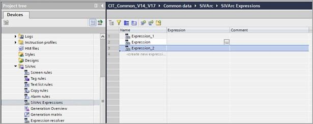

You can drag and drop the created expressions as objects within the Project/Global library. In such cases, the object is made available within the object picker of the expression editor. The expression can be resued in multiple instances. These are termed as global expressions. You can use the global expressions in the condition column of rule grid for screens, alarms, tags, copy rule.

#### "Copy rules" editor 

A rule is made up as follows:

- Name - Unique name of copy rule

- Folder structure - Визначена користувачем структура папок може бути виконана як вручну, так і за допомогою підтримки виразів. Це стосується об’єктів бібліотеки, де підтримується створення папок.  Якщо значення в стовпці "Folder structure" порожнє, тоді SiVArc генерує всі об'єкти, конфігуровані від кореневого вузла до вкладеної глибини рівня '4' під папкою за замовчуванням, визначеною PNV. Якщо ви хочете відтворити об’єкти зі структурою папок, як налаштовано в бібліотеці проектів, тоді ви можете налаштувати стовпець структури папок через підтримуваний вираз. Ви також можете налаштувати будь-яку бажану структуру папок для генерації SiVArc у стовпці структури папок.

- Project Library - Структура папок складається з кореневої папки, розміщеної на рівні "0", і наступних папок у кореневій папці як вкладені папки, рівень "1", рівень "2" тощо. SiVArc вважає вкладену глибину папок лише рівнем "4" для генерації.

- Library object -  Основна копія або тип створеного об'єкта або папки бібліотеки, що містить **library** **objects > layout fields. Якщо поле макета знаходиться в режимі редагування, буде розглянуто попередньо випущене поле макета. Головна копія або тип бібліотеки повинні міститися в бібліотеці проекту. Уніфікований екран доступний як об'єкти в засобі вибору об'єктів, і після генерації SiVArc екран генерується лише на уніфікованому пристрої. Графіка підтримується як бібліотечний об’єкт.

- Condition (optional) - SiVArc expression that is evaluated when processing copy rule. If no condition is specified, the copy rule is always executed.

- Comment (optional) - Individual comment for the copy rule

  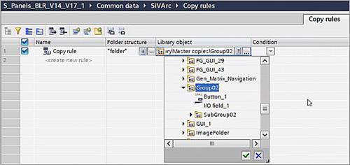

You show the following columns, when necessary, using the icons in the toolbar:

- HMI device - The copy rule is executed for the selected HMI devices. If you select no HMI device, the rule applies to all HMI devices in your project. For Unified devices, if copy rule uses system text lists, during SiVArc generation an error is thrown.

- HMI device type - If multiple HMI devices of the same type are available in your project, you can also select types of HMI devices. During generation it is checked and indicated whether a rule can be applied to an HMI device or to a controller.

#### "Generation matrix" editor

##### Tab "Screen objects -> Screens"

На панелі інструментів редактора ви вибираєте пристрій HMI (legacy/WinCC Unified), для якого матриця повинна відображатися в розділі "Target device". SiVArc також відображає тип пристрою для всіх пристроїв.

На цій вкладці призначте створений об'єкт екрана іншому екрану. Вкладка містить такі стовпці:

- Call structure - Shows for each line the block instances that are called in the user program and used for generating screen objects.

- Screen rule - Shows the screen rules that were executed for each block instance.

- Name of the screen object - Shows the generated screen object.

- HMI devices - Lists for each screen object the HMI devices for which the screen object was generated.

- Screen columns - A separate column is displayed for each screen. The columns are sorted alphabetically.
  - "X": Screen object is not positioned in a layout field.
  - "<Name of the layout field>": Screen object is contained in the specified layout field.

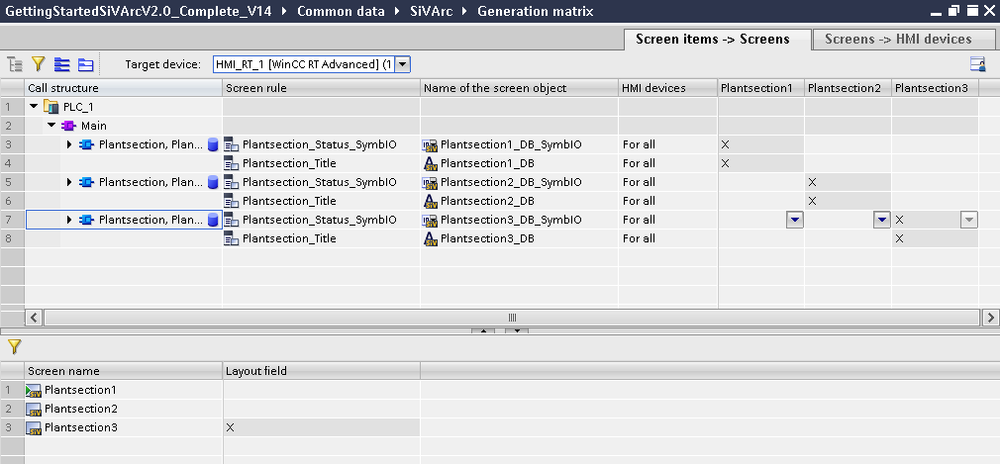

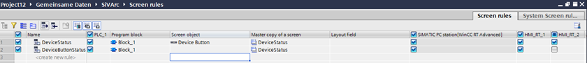

##### "Screens -> HMI devices" tab

На панелі інструментів редактора ви вибираєте тип пристрою HMI, для якого матриця повинна відображатися в розділі "Device type". Потім редактор відображає екрани всіх пристроїв HMI цього типу.

На цій вкладці призначте згенерований екран іншому пристрою HMI. Вкладка містить такі стовпці:

- Screen - Показує створені екрани.

- HMI devices - Показує пристрої HMI (including WinCC Unified) Для кожного пристрою HMI відображається окрема колонка. Стовпці сортуються за алфавітом.

##### Template and Pop-up Screens

Матриця генерації складається з двох функцій: дозволяє призначати шаблони/спливаючі екрани або об'єкти екрана різним цільовим пристроям HMI. Ви можете призначити об'єкти шаблону/спливаючого екрана різним цільовим пристроям HMI, подібним до екранів. На панелі інструментів редактора відображається випадаючий параметр "Screen Type", що складається з екрана, шаблону та спливаючого вікна, як показано на знімку екрана нижче:

- Matrix 1 - Screen items -> Screens - Allows you to assign screen items on screens of different HMI devices

- Matrix 2 - Screens-> HMI devices - Allows you to assign screens to different HMI devices

**Scenario**: Navigating objects to different HMI devices without accessing screens 

A commissioning engineer would choose to move screen objects to different target HMI devices using SiVArc visualization only, since he is restricted from accessing screen rules. Let us consider the below screen rules configuration:

1. Configure screen rules as mentioned below:

–  DeviceButtonStatus containing template screen only generated in HMI device 1

–  DeviceStatus containing the screen object "Template_button_1" in it, and generated in HMI device 1

2. Upon SiVArc generation, "DeviceButtonStatus" screen with "Device Button" screen item gets generated on HMI_RT_1, and "Device Status" on HMI_RT_2.

3. Create a target screen with "Device Button" screen item placed within. Configure events with "Click" as "Activate Screen" directing to the target screen

###### Note

While configuring screens, you can configure events for a screen item directly. But, with templates and pop-up screens, you must use a target screen to navigate the screen item to the template screen. Target screen is necessary, since for templates and pop-up screens, events cannot be configured directly.

4. Configure a target screen as "Temporary" In "Screen rules", and choose the target HMI device as HMI_RT_1.

5. Click SiVArc settings > "Matrix Settings" > "Generate navigation objects".

6. Goto Generation matrix > "Screens-> HMI devices", select "screen Type" as "Screen", and select the checkbox HMI_RT_2 as shown in screenshot below:

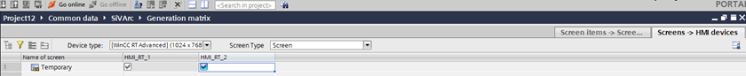

7. Perform SiVArc generation on HMI device 2. Observe the following:

–  The screen item created in step2 will be moved to the screen under folder "Screen management".

–  The screen with the screen item will be generated,and is available under folder "Screens".

The template screen item "Device Button" is moved to template screen "DeviceButtonstatus" through the target screen, i.e "Temporary" in Screens -> HMI devices".

###### Note

- The above procedure is applicable to pop-up screens also.

- In the case of copy rules, after modifying the screen rule, you must manually set the device for the respective modified screen in Generation matrix (including navigation objects).

#### Expression resolver

###### Description

Expression resolver lets you know the resolved value of the SiVArc expression for the given expression source object. The entered expression is resolved, and the results are displayed on the fly without SiVArc generation in the editor.

"Expression source object" can be specific to a block instance, HMI device, IO device, Library object.

Expression resolver editor is categorized inro 3 areas:

1. Expression source object configuration editor

2. SiVArc expression configuring editor

3. Expression results window

Below screenshot shows the Expression resolver editor:

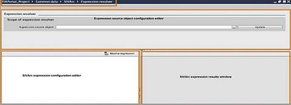

###### Source object configuration

Expression resolver supports only block instance and HMI device as an expression source object.

**HMI device as source object** - A project configured with HMI devices, upon selecting the project node in the left side/hierarchical view, the object picker displays the available HMI devices in the

right side as shown in the below screenshot:

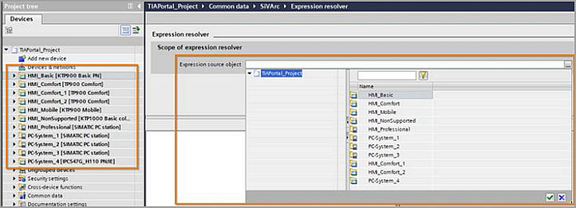

###### Program block call as an expression source object

Object picker shows the call structure of PLCs configured in the TIA portal project.

When an organization block or a block call is selected in the tree view (left side), the right side of the object picker shows available program block calls in the selected call in columns such as:

- Name - displays the instance name in case of function block call and block name in case of function call

- Block name - displays the name of block associated with the call

- Network number - displays the number of network where the current call is available

- Network title for the current call is shown if the configuration exists in PLC program for current editing language

You can choose to use filters on the columns. Below screenshot shows the object picker with the above mentioned details:

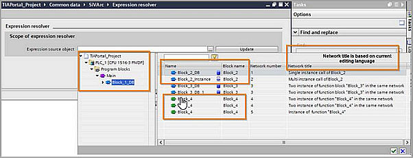

The "Expression source object" picker displays call structure only for compiled PLCs in the project.

If a PLC is not compiled, object picker does not show call structure for the Organization blocks defined in the PLC.

In case of uncompiled PLCs, Expression resolver displays a banner with the information of PLCs. Consider a project configured with 3 PLCs "PLC_1", "PLC_2" and "PLC_3". If only PLC_1 is compiled, the following banner with message is displayed:

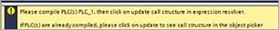

When Expression resolver editor is opened for the first time, editor loads the call structure of all compiled PLCs automatically. Editor shows the banner only if there are uncompiled PLCs, and

object picker displays the same based on the loaded call structure. When you modify a PLC program, expression resolver does not show the new/modified changes.

If you wish the resolver to consider the modified/new changes, you must compile the PLC, and click " Update" button which is available in source object configuration editor. "Update" operation loads the available call structure of compiled PLCs and the same will be used to resolve the expressions.

###### SiVArc expression configuring editor

Configration editor supports intellisense, syntax highlightining, copy, paste, delete operations similar to existing local expression selection editor.

Configuration editor contains a resolve button in the toolbar. After entering the expression, click the "Resolve expression" button to see the resolved value in the results window.

###### Expression results window

Displays the resolved value for the entered expression in "Expression configuration editor". This is dependent on your selection in "Expression source object".

Consider the following scenarios of how a resolver works:

Case1: String based operations without any expression source object.

If no selection is made in the "Expression source object", but in the SiVArc expression editor expressions are entered, upon clicking the "Resolve expression" button, the expression resolves as shown in the below screenshot:

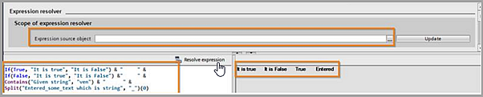

Case2: HMI device based expressions

When you choose an HMI device inthe " Expression source object , and enter expressions in the SiVArc expression editor, following results are displayed as shown in the below screenshot:

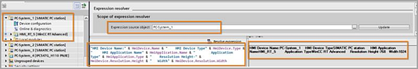

Case3: Block based expressions

When you choose a block in the "Expression source object , and enter expressions in the SiVArc expression editor, following results are displayed as shown in the below screenshot:

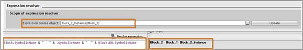

###### Note
Except text definitions, all the SiVArc supported block based expressions, tag definitions are supported by the resolver.

**Block.DB.HMITagPrefix**- During SiVArc generation, the expression "Block.DB.HMITagPrefix" is resolved by removing invalid characters in the resolved value. Resolver does not include any HMI device validation for the resolved value.

**Block.NetworkTitle and Block.NetworkComment** - Expression is resolved based on the editing language. Resolver fetches the configured network title and comment for the selected editing language and displays the same in the results.

Case4: Infinite loop

In case of an infinite loop in the PLC call struture, SiVArc generation displays a message. The Resolver supports infinite loop in the PLC call structure. 

#### Generation overview

##### Description

After the initial generation of the visualization, all generated screen objects are listed in the generation overview. The generated objects are divided into the tabs "Screens/Screen objects", "Tags" and "Text lists".

The generation overview also displays, using various views, the relations between screen rules and generated objects after the generation. With the help of the generation overview, you plan and configure subsequent changes for an additional generation.

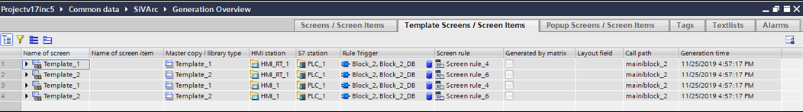

The contents of the generation overview are made up as follows:

| **"Screens/ Screen Items" tab**                              | **"Tags"** **tab**                                           | **"Text lists" tab**                                         |
| ------------------------------------------------------------ | ------------------------------------------------------------ | ------------------------------------------------------------ |
| Name of the screen/screen object  Unique name of the object  | Name  Name of generated tag table/generated tags             | Text list/text list entry  Name of the text list and its text list  en‐ tries |
| Master copy/type  Name of the  generation template of the object | Data type  Data type of the generated tags. The name of the UDT data type is shown  for the "UDT" data  type (PLC data  type). | Master copy/type  Name of the generation template for the text list |
| HMI device  Name of the HMI device for which the  object was generated | HMI device  Name of the HMI device for which the  external tags were generated | HMI device  Name of the HMI device for which the  text list was generated |
| PLC device  Name of the PLC for which the object was generated | PLC device  Name of the controller for which the tags were generated. | PLC device  Name of the controller for which the text list was  generated |

| **"Screens/ Screen Items" tab**                              | **"Tags"** **tab**                                           | **"Text lists" tab**                                         |
| ------------------------------------------------------------ | ------------------------------------------------------------ | ------------------------------------------------------------ |
| Program block  FB or FC for which the object was gen‐ erated | Program block  DB for which the tag was generated            | Text  Text that  contains the text  list entry               |
| Screen rule  Screen rule which defined the genera‐ tion of the object | PLC tag  Name of the PLC tag for which the exter‐ nal tag was generated. | Rule name  Name of the text list  rule which specified the generation of the text  list |
| Date  Time stamp on which the object was  generated.         | Tag table  Name of the tag table in which the tags were  generated | Network  Name of the network which was evalu‐ ated during  the generation |
| Generated by matrix  Object was created in a downstream generation using the generation matrix. | Tag folder  Name of the folder in the project  tree in which the tag tables and tags were  gen‐ erated | Program block  FB or FC for which the text list was gen‐ erated |
| Layout field  If the object was generated in a  layout field, the name of the field is displayed here. | Tag rule  Tag rule which  specified the storage structure of the generated tags | Call structure  Call path in the cycle OB "Main1", which  specified the  generation of the  text list |
| Call structure  Path of the evaluated block  in the call  hierarchy in the user program (OB1) | ---                                                          | ---                                                          |

Similar options are available for Pop up screen/Screen items, Tesxt lists, Alarms. 

#### Energy Suite Generation 

##### Introduction

SiVArc extends its generation support to clients such as Energy Suite. Energy Suite generates screens and screen items based on the configured screen rules, which are referred as system screen rules. You can choose to generate based on SiVArc screen rules along with system screen rules through the station dialog box " Select station and controllers for SiVArc generation". In "Select station and controllers for SiVArc generation" station dialog box , the "Rule Set" column allows you to choose the type of rules that you would like to generate, and can be one of the following:

- User Created Rules - Relates to user created rules within SiVArc

- Energy Suite Rules - Relates to rules created by client Energy suite

- All Rules - Combination of SiVArc and Energy Suite rules.

###### Note

When All Rules are selected, SiVArc created rules are prioritized over Energy Suite rules while generation. 

- If Energy Suite is not installed, during SiVArc generation, the rule set drop-down will list only the "User created rules" in read only mode.

- If Energy Suite rules are available without a valid Energy Suite license, and you choose to perform SiVArc generation with the rule set as "All rules", an error of missing license is displayed.

##### Generation scenarios of SiVArc screen rules and system screen rules

| **User created rules**                                       | **System** **screen** **rules**                              | **Result**                                                   |
| ------------------------------------------------------------ | ------------------------------------------------------------ | ------------------------------------------------------------ |
| Rule configured in SiVArc for Screen1                         | Rule configured by Energy Suite for Screen1                   | System generates Screen1                                     |
| Rule configured in SiVArc for Screen1 with  Button 1          | Rule configured by Energy Suite for Screen1 with Button 2     | System generates Button 1 and  Button 2 on Screen1           |
| Rule configured in SiVArc for Screen 1 with Button  1         | Rule configured by Energy Suite for Screen1 with Button 1     | System generates Button 1 on Screen1                         |
| User created Screen 1  with But‐ ton 1                       | Rule configured by Energy Suite for Screen1 with Button 1     | System renames Screen 1 to Screen  1_Renamed  System generates Screen 1 and  Button 1 on it |
| User created Screen 1  with But‐ ton 1                       | Rule configured by Energy Suite for Screen1 with Button 2     | System  renames Screen 1 with Button 1 to Screen  1_Re‐ named  System generates Screen 1 created by Energy Suite  rule, and places  Button 2 on Screen x1 |
| User created Screen 1  with But‐ ton 1  Rule configured in SiVArc for Screen1 with  Button 2 | Rule configured by Energy Suite for Screen1 with Button 3     | System  renames Screen 1 with Button 1 to Screen  1_Re‐ named  System generates Button 2 and/or Button  3 on Screen 1 based on rule selection |
| Copy rule configured in SiVArc  for Screen 1                  | Rule configured by Energy Suite for Screen1                   | System generates Screen1 and Screen1 is renamed to Screen1_renamed  System generates Screen 1 through  Energy Suite  rule |
| Copy rule configured in SiVArc  for Screen 1 (second generation  uses this rule) | Rule configured by Energy Suite for Screen1 (first generation uses this rule) | In first generation, system  generates Screen 1  Copy rule is  not considered for generation, and is ignor‐ ed with  error |

