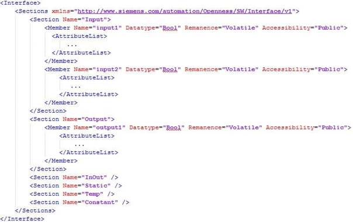
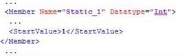
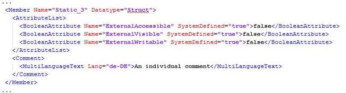
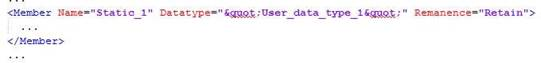
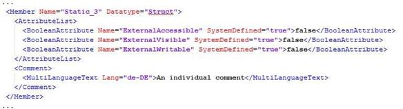
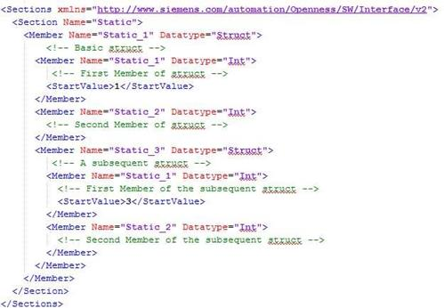
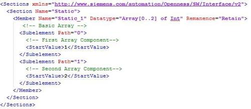
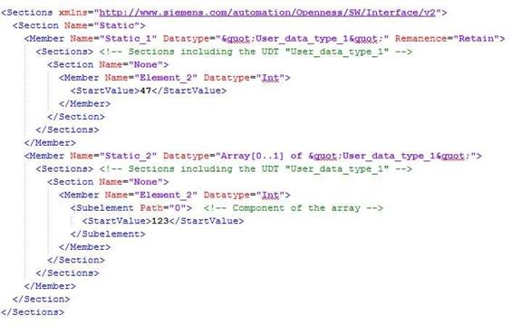
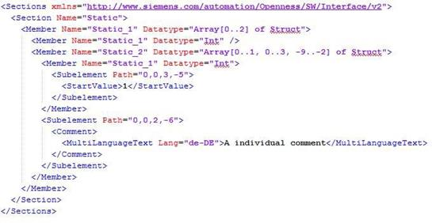
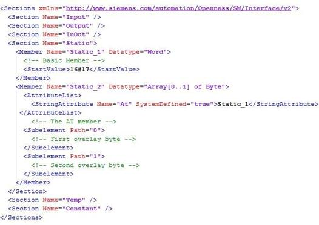

# XML structure of the block interface section

Взято з хелпа TIA17 

## Базові принципи

Дані у файлі експорту з імпорту/експорту структуровані з посиланням на базову структуру. Кожен файл імпорту повинен відповідати основним структурним умовам.

Файл експорту містить усі відредаговані теги та константи розділу інтерфейсу експортованого блоку. Усі атрибути з "ReadOnly="TRUE""і "Informative="TRUE"" виключені.

Якщо інформація надлишкова, вона повинна бути точно ідентичною в XML-файлі імпорту та в даних проекту. Інакше імпорт видає виняток recoverable exception.

Дані проекту можуть містити більше даних, ніж імпортований файл XML, напр. g. зовнішній тип може мати додаткові члени

Через TIA Portal Openness XML можна імпортувати лише записувані значення.

Залежно від налаштувань експорту TIA Portal Openness, файл експорту містить визначений набір атрибутів та елементів. XML, експортований з вищих версій продукту, несумісний під час операції імпорту в нижчу версію TIA Portal.

## Базові структури

Розділ інтерфейсу експортованого блоку охоплений елементом `<Interface>` у SimaticML блоку. Кореневим об'єктом є елемент `<Sections>`, який представляє розділ інтерфейсу експортованого блоку. Послідовність наступного опису елементів представляє необхідну послідовність у вхідному файлі.

 

### Section

Розділ (Section) представляє один параметр або локальні дані програмного блоку

### Member

Член (Member) представляє теги або константи, які використовуються в блоці програми. Залежно від типу даних тегу, члени можуть бути вкладеними або мати додаткові структурні піделементи.

У випадку типу даних «ARRAY» структурний елемент «Subelement Path» являє собою наприклад індекс компонентів елемента масиву.

Експортуються лише ті члени, які були відредаговані користувачем.

### AttributeList

`<AttributeList>` включає всі визначені атрибути члена. Атрибути, які визначені системою або присвоєні стандартним значенням, не перераховані в структурі XML.

Атрибути члена `<ReadOnly>` і `<Informative>` записуються до файлу експорту XML, лише якщо їх значення має значення TRUE.

### StartValue

Елемент `<StartValue>` записується лише в тому випадку, якщо значення тегу або константи за замовчуванням встановлено користувачем.

 

### Comment

Елемент `<Comment>` записується, якщо він встановлений користувачем. Коментарі тегу або константи експортуються як багатомовний текст:

 

## Attributes

### Main attributes

Основні атрибути записуються в елемент `<Member>` у структурі XML.

 

У наступній таблиці показано основні атрибути тега або константи в розділі інтерфейсу блоку.

| **Name**      | **Datatype** | **Default** | **Import condition** | **Comment**                                               |
| ------------- | ------------ | ----------- | -------------------- | --------------------------------------------------------- |
| Name          | STRING       | -           | Required             |                                                           |
| Datatype      | ENUM         | -           | Required             |                                                           |
| Version       | STRING       | -           | Optional             |                                                           |
| Remanence     | ENUM         | NonRetain   | -                    | only written if not default                               |
| Accessibility | ENUM         | Public      | -                    | pre-defined by the  system  cannot be changed by the user |
| Informative   | BOOL         | FALSE       | -                    |                                                           |

Члени з прапорцем "Informative" ігноруються під час імпорту. Якщо атрибут видалено або встановлено на FALSE, створюється виняток.

### System defined member attributes

Визначені системою атрибути члена перераховані в елементі `<AttributeList>`. Атрибути члена, визначені системою, позначені як `<Informative>` і ігноруються під час імпорту.

 

| **Name**               | **Type** | **Default** | **SimaticML ReadOnly (informative)** | **Comment**                                                  |
| ---------------------- | -------- | ----------- | ------------------------------------ | ------------------------------------------------------------ |
| At                     | string   | ""          | FALSE                                | Member shares offset with another member in this structure   |
| SetPoint               | bool     | FALSE       | FALSE                                | Member can be synchronized  with workmemory                  |
| UserReadOnly           | bool     | FALSE       | TRUE                                 | User cannot change any member attrib- ute (incl.  name)      |
| UserDeletable          | bool     | TRUE        | TRUE                                 | Editor does not allow to delete the member                   |
| HmiAccessible          | bool     | TRUE        | FALSE                                | No HMI access, no  structure item                            |
| HmiVisible             | bool     | TRUE        | FALSE                                | Filter to reduce the  number of members shown in the  first place |
| Offset                 | int      | -           | TRUE                                 | DB, FB, FC  (Temp). For classic PLCs and for Plus PLCs where  the remanence is set to classic. |
| PaddedSize             | int      | -           | TRUE                                 | DB, FB, FC  (Temp). For classic PLCs and for Plus PLCs where the remanence is  set to classic.  Only for arrays. |
| HiddenAssign- ment     | bool     | FALSE       | FALSE                                | Hide  assigne- ment at call if matches with PredefinedAs-  signment |
| PredefinedAs- singment | string   | ""          | FALSE                                | Input for the paramter used when call is placed              |
| ReadOnlyAs- signment   | bool     | FALSE       | FALSE                                | The user can- not change  the predefined as- signement at the call |
| UserVisible            | bool     | TRUE        | TRUE                                 | This member is not shown on the UI                           |
| HmiReadOnly            | bool     | TRUE        | TRUE                                 | This member is read only for HMI                             |
| CodeReadOnly           | bool     | FALSE       | TRUE                                 | -                                                            |

### User defined attributes

Визначені користувачем атрибути позначені `<ReadOnly>`. Члени з цим прапором ігноруються під час імпорту. Якщо прапор видалено або встановлено на FALSE, створюється виняток.

Нередаговані атрибути, визначені користувачем, виключаються з експорту.

| **Name** | **Type**        | **Default** | **SimaticML ReadOnly (informative)** | **Comment**          |
| -------- | --------------- | ----------- | ------------------------------------ | -------------------- |
| CFC      | IBlockAttribute | ---         | FALSE                                | this is a Pay-  load |

## Datatype "STRUCT"

Компоненти типу даних "STRUCT" представлені в XML-структурі файлу імпорту/експорту як вкладені члени:

 

## Datatype "ARRAY" basic type

Компоненти базового типу даних «ARRAY» представлені в XML-структурі файлу імпорту/експорту як піделементи з атрибутом «Path»:

## Datatype "ARRAY" of UDT

Компоненти типу даних "ARRAY" UDT представлені в XML-структурі файлу імпорту/експорту як новий елемент `<sections>` в елементі `<member>`. Члени нового розділу для UDT входять до масиву ARRAY і призначаються як піделементи з атрибутом "Path":

 

## Datatype "ARRAY" in "ARRAY"

Компоненти типу даних "ARRAY" в іншому ARRAY представлені в XML-структурі файлу імпорту/експорту як піделементи з атрибутом "Path".

Члени в іншому масиві призначаються як піделементи з атрибутом "Path", якщо компонент редагується користувачем:

## PLC data types (UDT)

Структура XML типу даних PLC залежить від параметрів експорту TIA Portal Openness.

### ExportOptions.None

Члени типу даних PLC записуються лише в тому випадку, якщо значення за замовчуванням хоча б для одного з компонентів встановлено користувачем. Для цих членів записуються лише два додаткові атрибути «Name» та «Datatype», щоб ідентифікувати член, до якого належить `<StartValue>`. Інші члени та атрибути не записуються.

### ExportOptions.WithDefaults

Завжди записуються такі атрибути:

o  Name

o  Datatype

o  ExternalAccessible

o  ExternalVisible

o  ExternalWritable

o  SetPoint

o  StartValue

Записується в XML, лише якщо користувач встановлює значення за замовчуванням у цьому типі. Якщо він був встановлений лише в типі даних PLC, він не записується.

### ExportOptions.ReadOnly

Для типів даних PLC це налаштування не призведе до значущих результатів. У поєднанні з іншими налаштуваннями це не вплине на результат.

## Overlaid tags

Якщо тег накладено новим типом даних, члени представлені в XML-структурі нового типу даних. Наведена нижче XML-структура показує тип даних WORD, накладений масивом ARRAY BYTE

 

## Block Interface

Усі атрибути з ReadOnly="TRUE" та Informative="FALSE" виключені. Структура XML блочного інтерфейсу залежить від налаштувань експорту TIA Portal Openness.

### ExportOptions.None

Цей параметр експортує лише змінені дані або дані, які відрізняються від типових. Якщо їхнє визначення атрибута не визначає значення за замовчуванням, атрибут завжди записується. Файл експорту також містить усі значення, які є обов’язковими для подальшого імпорту даних.

### ExportOptions.WithDefaults

Наступні атрибути завжди записуються

- Name
- Datatype
- HmiAccessible exported as ExternalAccessible
- HmiVisible exported as ExternalVisible
- ExternalWritable
- SetPoint (if applicable)
- Offset (if applicable)
- PaddedSize (if applicable)

Усі інші атрибути записуються, лише якщо їх значення відрізняються від значень за замовчуванням. Елемент `<StartValue>` записується в XML, лише якщо він був явно встановлений.

### ExportOptions.ReadOnly

Для блочних інтерфейсів це налаштування не призведе до значущих результатів. У поєднанні з іншими налаштуваннями це не вплине на результат.