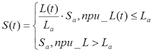

Це частина посібника "Програмування промислових контролерів в середовищі Unity PRO"

## Використання імітаційних моделей 

### Призначення імітаційного моделювання в ПЛК. 

Налагодження програми на ПЛК по можливості проводять в три етапи:

1. перед впровадженням на об’єкт;

2. доводка програми на об’єкті перед пуском установки;

3. доводка програми на об’єкті в режимі експлуатації.

Перший етап дає змогу максимально наблизити програму до робочого стану ще на етапі проектних робіт. Відсутність робочого об’єкту вимагає від розробника програмного забезпечення імітації сигналів від датчиків, відповідно до умов функціонування цього об’єкту. Розробник чітко повинен уявляти як працює об’єкт, для того щоб імітувати сигнали в правильній послідовності та діапазонах сигналу. Так, наприклад, типовою помилкою недосвідчених розробників є імітація при наборі рідини спрацювання верхніх датчиків рівня перед нижніми, тоді як рівень набирається поступово.

Для зручності налагодження програми ще до виїзду на об’єкт можна використовувати різного типу імітатори – як фізичні так і програмні. У даному посібнику для перевірки ряду програм використовуються програмні імітатори, створені тими самими програмними засобами UNITY PRO, як і сама програма управління. Ту частину програми, яка імітує об’єкт управління надалі будемо називати ***програмою імітації***, а створенні на ній моделі – ***імітаційними моделями***. 

Хоч приведені в посібнику імітаційні моделі об’єктів значно спрощені аніж в спеціалізованих професійних пакетах імітаційного моделювання, їх можна використати для перевірки правильності роботи реальних програм. Крім того, ці моделі можна використати при налагодженні людино-машинного інтерфейсу. 

При налагодженні програми на реальному ПЛК, імітаційна програма використовує його ресурси, що треба враховувати при створенні моделей. У імітаторі ПЛК використовуються ресурси ПК, що не накладає таких обмежень. 

### Варіанти структури програм UNITY PRO з імітацією. 

У залежності від функціональної та технічної структури системи, яка розробляється, а також підходів до програмування, структура програмної частини проекту UNITY PRO може відрізнятися. На рис.4.10 наведена функціональна структура системи управління на базі ПЛК з деталізацією проекту UNITY PRO. 

Рис.4.10. Структура системи управління з реальним об’єктом. 

Частина програми, в якій реалізуються алгоритми управління (***програма управління***) є центральною частиною проекту. У програмі управління можуть використовуватися як змінні, так і безпосередньо самі адреси. Однак у більшості випадків перед використанням даних з вхідних каналів та записом в вихідні – їх необхідно попередньо обробити. Наприклад, аналогові сигнали треба масштабувати або обробити програмними фільтрами. Для цих цілей обробку вхідних каналів можна приводити на початку Задачі, а вихідних – в кінці Задачі. Структура такої Задачі буде мати вигляд як на рис.4.11(а). 

Рис.4.11. Можливі структури програмної частини проекту UNITY PRO:  а – з реальним об’єктом; б – з секцією імітації. 

У залежності від програмної структури проекту, буде відрізнятися програма імітації та її розміщення. Один із варіантів реалізації програми імітації орієнтований на роботу безпосередньо з вхідними та вихідними змінними (рис.4.12). 

Рис.4.12. Структура системи управління з програмою імітації об’єкта управління: 1-й варіант

Згідно цього підходу вихідні значення *%Q* та *%QW* обробляються програмою імітації та відповідно до їх значення змінюють вхідні значення *%I* та *%IW*, використовуючи функції *WRITE_INPUT_EBOOL та WRITE_INPUT_INT*. Структура Задачі може мати вигляд як на рис.4.11(б), тобто на початку програми добавляється секція (секції) програми імітації, а всі інші секції залишаються без змін. При налагодженні та експлуатації системи з реальним об’єктом секція програми імітації об’єкта управління видаляється, або відключається через властивість *Condition*.

Другий варіант може бути застосований при використанні в програмі тільки змінних, тобто без прямого звернення до адрес пам’яті. У цьому випадку змінні, що передбачені в проекті для прив’язки до вхідних/вихідних каналів, тимчасово залишаються нелокалізованими і використовуються програмою імітації об’єкту напряму, тобто без функцій *WRITE_INPUT_EBOOL* та *WRITE_INPUT_INT* (рис.4.13). При налагодженні та експлуатації системи з реальним об’єктом робиться прив’язка, а всі інші дії аналогічні 1-му варіанту.

Рис.4.13. Структура системи управління з програмою імітації об’єкта управління: 2-й варіант 

Обидва наведені вище варіанти при імітації даних від аналогових датчиків потребують цілочисельних обчислень, оскільки значення змінних *%IW* та *%QW* як правило змінюються в діапазоні *0-10000*. Дещо простіше реалізувати програму імітації вже в діапазоні реальних величин. У цьому випадку функціональна структура системи може мати вигляд як на рис.4.14 а структура Задачі - як на рис.4. 11(б), однак з виключеними секціями обробки вхідних каналів.  

Рис.4.14. Структура системи управління з програмою імітації об’єкта управління: 3-й варіант 

Враховуючи, що задачею імітаційного моделювання в нашому випадку є груба перевірка роботи програми, визначимо деякі особливості цих імітаційних моделей:

-     імітаційні моделі повинні відображати сутність процесу (структурна адекватність), однак не обов’язково бути параметрично адекватними реальному об’єкту;

-     враховуючи використання ресурсів програмою імітації того ж ПЛК в якому виконується програма управління, модель повинна бути максимально простою і викликатися з періодом достатнім для даного типу об’єкта;

-     імітаційні моделі повинні мати можливість виклику у прискореному або сповільненому масштабі часу;

Для імітації ми будемо використовувати найбільш прості підходи, без детального опису їх теоретичних основ. У якості структури проекту буде використовуватись 1-й варіант із запропонованих в даному розділі (рис.4.12).

### Генератор випадкових чисел. 

Генератор випадкових чисел може бути використаний при імітації випадкових збурень. Для цього ми будемо використовувати лінійний конгруентний метод генерації псевдовипадкових чисел, описаний в [RND]. Для генерації цілих чисел в діапазоні 0-*M**,* випадкова величина r розраховується за формулою:

​                                (4.1)

де - значення випадкової величини на новому циклі перерахунку, *М*, *k, b* - коефіцієнти, *r0* - початкове значення, *MOD* – залишок від ділення. 

Для генерації випадкової величини можна створити функціональний блок (рис.4.15). 

Рис.4.15. Реалізація DFB-типу для генерації випадкових величин

Вхід *init* призначений для ініціалізації блоку. Коефіцієнти *М, k, b*, та початкове значення *r0* задаються як глобальні змінні блоку. Внутрішня змінна *ri* призначена для запам’ятовування попереднього значення. При ініціалізації програми користувача, що характерно для початкового кроку – *ri=* *r0*, в іншому випадку значення *ri* береться з попереднього розрахунку. Коефіцієнти мають тип *UDINT* для того, щоб при операції *MOD* не втрачалась точність, а на вихід вже подається перетворене значення в *INT* за допомогою універсальної функції *UDINT_TO*.    

Генератор шумів – це функціональний блок, який вносить в корисний сигнал типу INT шуми відповідної амплітуди від *minNoise* до *maxNoise*, тобто формує вихідний сигнал за формулою:

​                                               (4.2)    

Програма для цього блоку може мати вигляд наведений на рис.4.16. За основу взятий математичний апарат розрахунку випадкових чисел в діапазоні *0-32767*, де 

*М =* *231 – 1 = 16#7FFF, k = 69069, b = 7,* *r0*=7. 

Рис.4.16. Реалізація DFB-типу для генерації шумів

При холодному старті ПЛК (*%S0=TRUE* – перший цикл після холодного старту), проводиться ініціалізація випадкової величини *ri=7*. Далі проводиться масштабування сгенерованого числа за лінійним законом, згідно вказаних меж для шуму (*min_Noise*, *maxNoise*). Для коректності операцій множення та ділення вони проводяться з типом *DINT*, а потім перетворюються в *INT*. Шум додається до вихідного сигналу *IN*, а результат записується в *OUT*. 

### Імітаційне моделювання на основі рішення диференційних рівнянь явним методом Ейлера 

Моделювання режиму динаміки так чи інакше зв’язаний з диференційними рівняннями по часу. Числові методи рішення таких рівнянь добре описані в літературі. Серед них найпростіший хоч і найменш точний - явний метод Ейлера. 

Якщо диференційне рівняння описується формулою:
$$
\frac{dy}{dt}=f(t,y(t)) \tag{4.3}
$$
при початкових умовах $y(t_0)=y_0$, де *y* – вихідна величина, а *t* – час. 

Диференціали в рівнянні 4.3 замінюються на кінцеві різницеві вирази:
$$
\frac{dy}{dt}=\frac{\Delta y}{\Delta t}= \frac{y_{n+1}-y_n}{\Delta t} \tag{4.4}
$$
де *n+1* – крок, на якому відбувається розрахунок; *n* - попередній крок;  *∆t*=t(n+1) - tn - величина кроку, що дорівнює проміжку часу між розрахунками. 

Проблема розрахунку (4.3) заключається у тому, що значення *y(t)* на кроці *n*+1 використовується в розрахунку того самого *y(t)*, тобто для вирішення такого рівняння треба користуватися пошуковими методами, що потребує затрати часу. У явному методі Ейлера у праву частину рівняння (4.3) замість *y(t)* підставляють значення на попередньому кроці, таким чином:
$$
y_{n+1}=y_n+\Delta t \cdot f(t_n,y_n) \tag{4.5}
$$
 Хоча рішення методом Ейлера може давати великі розбіжності, для імітаційного моделювання з метою перевірки працездатності програм він може бути використаний. Якщо імітаційні моделі необхідно використати в алгоритмах управління, можна скористатися більш точними методами. 

### Імітація рівня

Одним з найбільш популярних об’єктів в харчовій та хімічній промисловості є ємність з рідиною, в якій необхідно підтримувати заданий рівень. Припустимо ємність має 3 підводи рідини з витратами *Fin1*, *Fin2*, *Fin3* і 3 відводи рідини з витратами *Fout1*,*Fout2*,*Fout3* (рис.4.17). При однаковій густині ρ всіх вхідних рідин, матеріальний баланс для даного об’єкта буде мати вигляд:

    (4.6)

Скоротивши вираз (4.6), та застосувавши метод Ейлера будемо мати:

               (4.7)

Якщо ємність циліндрична або паралелепіпед, тобто по висоті площа перерізу не змінюється, тому:

​                                                     (4.8)

Рис.4.17. Ємність з декількома підводами і відводами 

Якщо ємність неправильної форми, можна застосувати алгоритм перетворення об’єму в рівень з використанням кусково-лінійної функції.

У будь якому випадку, об’єм рідини в ємності не може бути більше об’єму ємності і менше нуля. Тому в програмі імітації треба передбачити вихід за ці значення.  

Для імітації рівня з 3-ма підводами і 3-ма відводами можна створити блок DFB. Для ємності, що не змінюють площу перерізу по висоті, структура та програма блоку може мати вигляд як на рис.4.18. Екземпляри блоку *smLevelCyl* повинні викликатися періодично, наприклад шляхом застосування параметру *EN*, який буде прив’язаний до імпульсу заданої періодичності на 1 цикл. 

Для роботи в реальному часі, періодичність виклику повинна співпадати з заданою *d**_**t*. Змінна *d**_**t*, яку будемо також називати ***масштабом часу***, має тип *REAL* і задається в секундах. Так, якщо необхідно задати періодичність виклику 500 мс, треба вказати *d**_**t*=0.5. Тип *REAL* був вибраний для зменшення кількості перетворень. 

 Якщо процес імітації треба провести в прискореному режимі, параметр *d**_**t* можна збільшувати, тим самим вказавши, що періодичність виклику більша ніж дійсна. Однак значне збільшення *d**_**t* може привести до погіршення точності в розрахунках. 

Рис.4.18. DFB блок для імітації рівня ємності неправильної форми 

Для ємностей, що мають неправильну форму блок DFB буде мати схожий вигляд, за винятком розрахунку рівня (рис.4.19). Для розрахунку рівня можна використати DFB-блок типу *PWL**_**FN*, робота якого описана в прикладі з параграфу .6.1. У розділі *Private* *DFB* типу *smLevelFree* необхідно створити екземпляр *PWL*. У якості вхідних параметрів блоку *PWL* задаються два масиви – координат точок об’єму та рівня рідини в ємності. Для того щоб задати ці координати, вони винесені в інтерфейс блоку *smLevelFree*.    

Рис.4.19. DFB блок для імітації рівня ємності з перерізом по висоті

### Імітація температури в ємності 

Моделювання температури проводиться по розрахунку теплового балансу. 

​                                          (4.10)

 де  – сумарна кількість теплоти яка підводиться в систему; – сумарна кількість теплоти яка відводиться з системи. 

Для прикладу візьмемо циліндричну ємність з теплообмінним кожухом, в який подається тепло- або холодоагент (рис.4.20). Імітаційну модель будемо створювати з урахуванням наступних припущень:

-     ємність і кожух – це об’єкти з зосередженими параметрами;

-     густини на входах і виходах кожуха і ємності однакові;

-     апарат має ідеальну теплову ізоляцію, тому втратами теплоти в навколишнє середовище нехтуємо;

-     теплова ємність конструкції мала, тому нехтуємо нею;

-     площина теплообміну залежить від ступені заповнення ємності;

-     кожух завжди заповнений рідиною; 

За умови рівності густин на входах і виходах кожуха і ємності, а також на основі матеріального та теплового балансів можна записати:

​                                        (4.11)

  (4.12)

   (4.13)

​                                                 (4.14)

​                              (4.15)

Початкові умови:

​                                               (4.16)

Обмеження: .

У (4.11)-(4.15) ,- об’єм рідини в ємності та в кожусі (м3);  - об’єм ємності; - температура теплоагента на вході і в кожусі (°С); - температура рідини на вході і в середині ємності (°С);    - витрати рідини на вході і виході ємності;  - витрата теплоагента; , - густина теплоагента і рідини в ємності (кг/м3); Ca, C - теплоємності теплоагента та рідини в ємності (*кДж/(кг\*К*)), k - коефіцієнт передачі через поверхню теплообміну (*кВт/(м2°С)*) площею  S (м2); Sa - площа поверхні теплообміну при умові повного занурення її в рідину; Sv - площа поперечного перерізу ємності (м2).

 Рис.4.20. Ємність з теплообмінним кожухом 

Перепишемо (4.12) і (4.13) у вигляді:

​                (4.17)

​                (4.18)

Застосувавши метод Ейлера, рівняння (4.17) буде мати вигляд:     (4.19)

У (4.19) і надалі індекси потоків взяті в дужки для того щоб їх відрізняти від номеру кроку. 

Рівняння (4.15) аналогічне до (4.7):

​                                       (4.20)

При  рівняння (4.19) і (4.20) перетворюються в наступні: 

​             (4.21)

​            (4.22)

Рис.4.21. DFB блок для імітації температури в ємності з кожухом 

Приймемо, що при , температура вихідного потоку для рідини яка витікає з ємності буде дорівнювати температурі вхідного, тому (4.21) та (4.22) будуть мати вигляд: 

​                                                 (4.23)

​                           (4.24)

Приймаємо, що при , температура в ємності не буде залежати від вхідного та вихідного потоків, тобто (4.21) буде мати вигляд:

​                            (4.25)

Реалізувати імітацію температури та рівня в ємності можна за допомогою DFB, структура якого показана на рис.4.21, а програмна секція на рис.4.22. 

****

Рис.4.22. Програмна секція DFB-блоку 

### Імітація температури у теплообміннику. 

Подібно до попереднього випадку можна імітувати температуру в теплообміннику (рис.4.23).

 Імітаційну модель будемо створювати з урахуванням наступних припущень:

-     об’єкт з зосередженими параметрами;

-     густини на входах і виходах теплообмінника однакові;

-     апарат має ідеальну теплову ізоляцію, тому втратами теплоти в навколишнє середовище нехтуємо;

-     теплова ємність конструкції мала, тому нехтуємо нею;

-     теплообмінник завжди наповнений рідиною та теплоагентом; 

Для цього об’єкта рівняння (4.12) та (4.13) дещо спрощуються, таким чином кінцева система буде мати вигляд: 

          (4.26)     

      (4.27)

Початкові умови:

​                                               (4.28)

У (4.26)-(4.28)  

- V, Va - об’єм рідини та теплоагента в теплообміннику (м3); 

- Tain, Ta - температура теплоагента на вході та в теплообміннику (°С); 
- Tin, T - температура рідини на вході і в середині теплообмінника (°С); 
- F - витрати рідини через теплообмінник; 
- Fa - витрата теплоагента через теплообмінник; 
- $\rho_a ,\rho$ густина теплоагента і рідини (кг/м3);
- Ca, C - теплоємності теплоагента та рідини (кДж/(кг*К)), *
- K - коефіцієнт передачі через поверхню теплообміну (кВт/(м2*°С)) площею S (м2).

 

 

 Рис.4.23. Теплообмінник 

Застосувавши метод Ейлера, рівняння (4.26)-(4.27) будуть мати вигляд:

​                      (4.29)

​             (4.30)

Реалізувати імітацію температури в теплообміннику можна за допомогою DFB, структура та програма якого показана на рис.4.24. 

Рис.4.24. DFB блок для імітації температури в теплообміннику 

### Реалізація аперіодичної ланки (першого порядку). 

Якщо система управління розробляється для об’єкта, для якого розроблені динамічні математичні моделі в операторному вигляді, її доволі просто можна перевести в програму ПЛК. Рівняння, яке описує об’єкт першого порядку має наступний вигляд:

​                                  (4.31)

або в операторному вигляді:

​                                        (4.32)

де *X* - вхід об’єкту, *Y* - вихід об’єкту, *К* – коефіцієнт пропорційності об’єкту по каналу *X, τ* – стала часу.

Для реалізації аперіодичної ланки в UNITY PRO можна використати бібліотечні функції *LAG**_**FILTER* (див. параграф 6.6.4), *LAG* та *LAG1* (бібліотека *Obsolete Library*), які реалізують алгоритм розрахунку модифікованим методом Ейлера. Однак ці алгоритми мають надлишкову функціональність, тому можна реалізувати свій DFB, який розраховує вихід за наступною формулою: 

​                             (4.33)

Перепишемо формулу (5.43) у вигляді:

​              (4.34)

де *OUT* – вихід об’єкта на кроці *n+1*, *OUT**_**OLD* – вихід об’єкта на кроці *n,* *d**_**t* – періодичність перерахунку *Δt,* *LAG* – стала часу *τ* , *GAIN* – коефіцієнт об’єкта К. Позначення які використовуються в (4.34) вживаються часто в описі функціональних блоків різних ПЛК, тому надалі будемо користуватися ними.

На рис.4.25 показана реалізація DFB блоку *smLAG*. Слід звернути увагу, що замість *OUT**_**OLD* використовується *OUT*. Враховуючи, що значення виходів функціонального блока зберігаються між викликами, немає сенсу використовувати додаткову змінну.  

Рис.4.25. DFB блок для реалізації аперіодичної ланки 1-го порядку

### Реалізація транспортного запізнення 

Для об’єкта з чистим (транспортним) запізненням, формула для виходу записується: 

​                                            (4.35)

У UNITY PRO транспортне запізнення реалізоване через бібліотечний блок *DTIME* (див. параграф 6.6.2). Тут реалізуємо блок запізнення на основі власного DFB з назвою *smDELAY* (рис.4.26). 

Алгоритм роботи блока базується на буфері типу *FIFO*, який реалізується через масив *BUF*. Кожне нове значення записується на вершину стеку, тобто в 0-й елемент масиву (*BUF[0]:=IN*). Для того, щоб всі інші елементи зсунулися вниз, використовується процедура *ROL**_**ARREAL*, яка крім того останній елемент масиву (в нашому випадку 99-й) записує в перший (в нашому випадку 0-й). Враховуючи, що буфер потрібен тільки на часовий діапазон *DELAY* через кожні *d**_**t* секунд, то елемент з номером *last*:=*DELAY**/**d**_**t* буде тим значенням, яке повинно подаватися на вихід. При ініціалізації блоку, у всі елементи масиву записується 0 (*MOVE**_**REAL**_**ARREAL*).

При використанні моделі треба слідкувати за співвідношенням *DELAY**/**d**_**t* – воно не повинно перевищувати значення 99, яким обмежується розмір масиву *BUF*. Якщо запізнення дуже велике – необхідно або збільшити кількість елементів в масиві *BUF*, що приведе до збільшення ресурсоємності, або збільшити інтервал *d**_**t*, що приведе до зменшення точності.   

Рис.4.26. DFB блок для реалізації транспортного запізнення

### Імітація роботи регулюючого органу з виконавчим механізмом. 

Трубопровідна арматура може мати різні витратні характеристики: відносний хід штока/диску – відносна витрата. На рис. 4.27 показані три типові характеристики: рівнопроцентна, швидкого відкриття та лінійна. По осі абсцис відкладений рух штока/диску в долях від максимального відкриття, а по осі ординат – витрата в долях від максимальної витрати. Всі наведені характеристики клапанів можна наближено апроксимувати наступними залежностями:

​         лінійна -                              (4.36)

 рівнопроцентна -                            *(*4.37)   

де *α* – поправочний коефіцієнт (на графіку рис.4.27 *α =50*) 

​    швидкого відкриття -                         (4.38)

У UNITY PRO залежність 4.38 реалізується через функцію *SQRT*, а 4.37 - через *EXPT_REAL*. 

Рис.4.27. Характеристики клапанів

Тип виконавчого механізму вносить свої корективи в алгоритм управління, тому його поведінку теж треба враховувати при перевірці роботи програми. Є сенс розробити універсальний DFB блок, який би імітував роботу як виконавчого механізму так і регулюючого органу. Таким чином, розроблювальний імітаційний блок повинен враховувати наступні особливості:

-     враховував час повного ходу (відкриття) регулюючого органу з даним виконавчим механізмом при даних умовах ;

-     управлявся двома вхідними сигналами типу *BOOL*: відкрити/більше та закрити/менше; у випадку управління тільки одним сигналом - на інший вхід повинна подаватися його інвертована копія;

-     враховував можливість управління аналоговим сигналом, тобто повинен бути вхідний сигнал в діапазоні *0-10000* – задане значення позиціонеру; 

-     мав виходи для датчиків: положення штока/заслінки (*0-10000*), датчики положення "відкритий" і "закритий";

-     враховував тип характеристики регулюючого органу: лінійний, рівнопроцентний, швидкого відкриття.

З урахуванням вказаних вимог, DFB блок може мати вигляд як на рис.4.28. 

Рис.4.28. Структура DFB типу *smValve*

Коментарі до всіх параметрів та змінних блоку *smValve* наведені на рис.4.28. Секція *Valve* зроблена на FBD і складається з 3-х ланцюгів: перші два показані на рис.4.29, третій - на рис.4.30.  

Рис.4.29. Секція програми DFB типу *smValve* (перша частина).

Позиція штоку/заслінки регулюючого органу запам’ятовується в локальній змінній блоку *POS* (*0-100%),* яка при ініціалізації блока (*INIT**=**TRUE*) переходить в 0-ве положення (повністю закритий). 

Незалежно від того, яким типом сигналу управляється клапан (дискретний чи аналоговий) його позиція визначається двома сигналами управління які формуються на виході блоків *SEL* відповідно ".10" – сигнал на закриття та ".11" – сигнал на відкриття. При сигналі "відкрити", активується блок *ADD* ".2", який до плинного положення добавляє значення приросту. При сигналі "закрити" - активується блок *SUB* ".3", який від плинного значення положення віднімає значення приросту. Значення приросту на кожному проміжку *d**_**t* розраховується в блоці ".1" за формулою: *d_t*\*100/**t_valve*.

Блоки *SEL* ".10" та ".11" в режимі дискретного управління (коли *APOS**=**FALSE*) формують вихідні сигнали управління з команд управління зі входів відповідно *cmdOPN* та *cmdCLS*. Тобто в режимі дискретного управління сигнали "відкрити" та "закрити" повторюють команди *cmdOPN* та *cmdCLS*. У режимі аналогового управління з позиціонером (коли *APOS**=**TRUE*), сигнали формуються з компараторів ".9"(>) та ".8"(<). Якщо, масштабоване в діапазоні *0-100%* (блок *MUL* ".6"), задане значення позиції *cmdPOS* більше за плинне *POS* – формується сигнал на відкриття, якщо менше – сигнал на закриття. При цьому внутрішній позиціонер працює з точністю ±0.5%.        

Рис.4.30. Секція програми DFB типу *smValve* (продовження).

У третьому FBD-ланцюгу (рис.4.30) сигнал *POS* обмежується в діапазоні *0-100%* (*LIMIT* ".4"), обробляється для формування значення *Kf* та виходів позиції *stOPN* (".19"), *stCLS* (".20") та *stPOS* (".12",".15",".5"). Для спрацювання виходів кінцевого положення вибрані значення *99.999* та *0.001*. Блок *MUX* (".14") забезпечує формування коефіцієнта витрати *Kf* в залежності від характеристики клапану (*v**_**type*) шляхом перемикання на відповідний вхід.  

