This is part of the manual “Programming Industrial Controllers in the Unity PRO Environment”.

## Using Simulation Models

### Purpose of Simulation Modeling in PLCs

PLC program debugging is typically carried out in three stages:

1. before deployment to the physical plant;
2. program fine-tuning on the plant prior to commissioning;
3. program fine-tuning on the plant during operation.

The first stage allows the program to be brought as close as possible to working condition already at the design stage. The absence of a real plant requires the software developer to simulate signals from sensors according to the conditions of the plant's operation. The developer must clearly understand how the plant operates in order to simulate signals in the correct sequence and within appropriate ranges. For example, a typical mistake made by inexperienced developers is simulating the triggering of high-level sensors before low-level sensors when filling a tank, whereas the level should increase gradually.

To facilitate program debugging before traveling to the site, various types of simulators can be used – both physical and software-based. In this manual, software simulators created using the same UNITY PRO tools as the control program itself are used for testing a range of programs. The part of the program that simulates the controlled plant will hereafter be referred to as the ***simulation program***, and the models created within it will be referred to as ***simulation models***.

Although the simulation models presented in this manual are significantly simpler than those in specialized professional simulation packages, they can be effectively used to verify the correct functioning of real programs. Additionally, these models can be used when configuring the human-machine interface (HMI).

When debugging programs on a real PLC, the simulation program utilizes its resources, which should be considered when creating models. In a PLC simulator, PC resources are used, which do not impose such limitations.

### Variants of UNITY PRO Program Structures with Simulation

Depending on the functional and technical structure of the system being developed, as well as programming approaches, the software structure of a UNITY PRO project may vary. Fig. 4.10 shows the functional structure of a PLC-based control system with UNITY PRO project details.

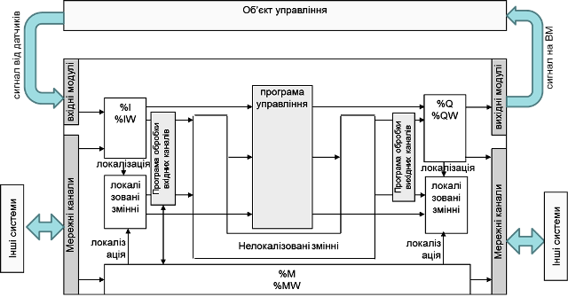

Fig. 4.10. Structure of a control system with a real plant.

The section of the program where the control algorithms are implemented (***control program***) is the central part of the project. The control program can use both variables and direct addresses. However, in most cases, before using data from input channels and writing to outputs, it is necessary to pre-process them. For example, analog signals need to be scaled or filtered in software. For these purposes, input channel processing can be placed at the beginning of the Task, and output processing at the end of the Task. The structure of such a Task is shown in Fig. 4.11(a).

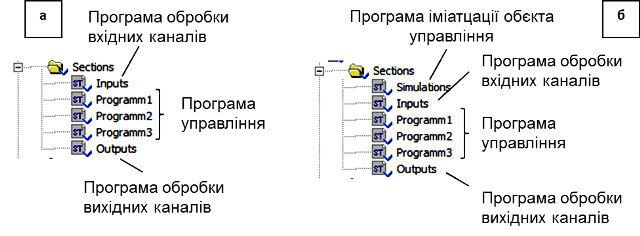

Fig. 4.11. Possible software structures for a UNITY PRO project: a – with a real plant; b – with a simulation section.

Depending on the software structure of the project, the simulation program and its placement will differ. One implementation option for the simulation program is oriented toward working directly with input and output variables (Fig. 4.12).

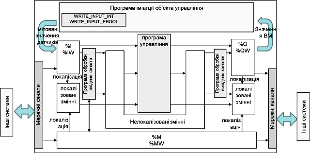

Fig. 4.12. Control system structure with a plant simulation program: Option 1

According to this approach, the output values *%Q* and *%QW* are processed by the simulation program, which accordingly changes the input values *%I* and *%IW* using the *WRITE_INPUT_EBOOL* and *WRITE_INPUT_INT* functions. The Task structure may look like Fig. 4.11(b), where the beginning of the program includes a simulation section (or sections), while all other sections remain unchanged. During commissioning and operation with the real plant, the plant simulation section is either removed or disabled via the *Condition* property.

The second option can be applied when the program uses only variables, without direct memory addressing. In this case, variables intended for binding to input/output channels in the project remain temporarily unbound and are used directly by the plant simulation program without the *WRITE_INPUT_EBOOL* and *WRITE_INPUT_INT* functions (Fig. 4.13). During commissioning and operation with the real plant, binding is performed, while all other actions remain the same as in Option 1.

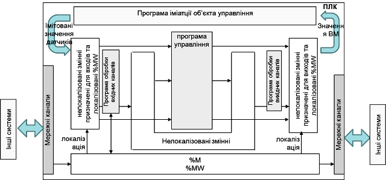

Fig. 4.13. Control system structure with a plant simulation program: Option 2

For both options above, when simulating analog sensor data, integer calculations are required, as *%IW* and *%QW* variable values typically range from *0-10000*. It is somewhat easier to implement a simulation program using real value ranges. In this case, the functional system structure may look like Fig. 4.14, and the Task structure like Fig. 4.11(b), but with input channel processing sections removed.

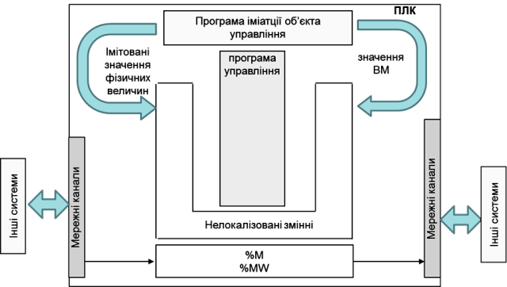

Fig. 4.14. Control system structure with a plant simulation program: Option 3

Considering that the goal of simulation modeling in our case is to perform a rough check of the program operation, we will define several features of these simulation models:

- Simulation models should reflect the essence of the process (structural adequacy) but do not necessarily need to be parametrically identical to the real plant.
- Given that the simulation program uses the same PLC resources as the control program, the model should be as simple as possible and called with a period appropriate for the plant type.
- Simulation models should have the ability to be executed in accelerated or slowed time scales.

For simulation purposes, we will use the simplest approaches without detailed theoretical explanations. The project structure used will be the first option presented in this section (Fig. 4.12).

### Random Number Generator

A random number generator can be used to simulate random disturbances. For this, we will use the linear congruential method for generating pseudo-random numbers, described in [RND]. To generate integers in the range 0–*M*, the random variable *r* is calculated using the formula:

​                                (4.1)

where  is the value of the random variable at the new calculation cycle, *M*, *k*, *b* are coefficients, *r0* is the initial value, and *MOD* is the modulus operation.

To generate a random variable, a function block can be created (Fig. 4.15).

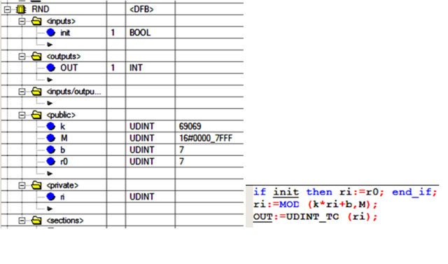

Fig. 4.15. DFB-type implementation for generating random values

The *init* input is used to initialize the block. The coefficients *M, k, b*, and the initial value *r0* are set as global variables of the block. The internal variable *ri* stores the previous value. During user program initialization, which typically occurs in the initial step, *ri = r0*; otherwise, the value of *ri* is taken from the previous calculation. The coefficients are of type *UDINT* to maintain precision during the *MOD* operation, while the output is provided as a converted *INT* value using the universal *UDINT_TO* function.

A noise generator is a function block that adds noise of a specified amplitude, from *minNoise* to *maxNoise*, to a useful signal of type INT, forming the output signal according to the formula:

​                                               (4.2)

The program for this block may look as shown in Fig. 4.16. It uses the mathematical basis for calculating random numbers in the range *0–32767*, where

*M = 2^31 – 1 = 16#7FFF, k = 69069, b = 7, r0 = 7.*

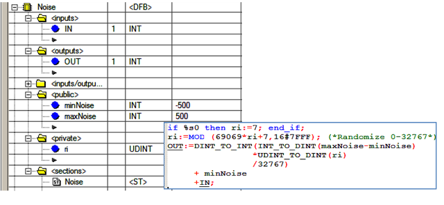

Fig. 4.16. DFB-type implementation for generating noise

On a cold start of the PLC (*%S0 = TRUE* – the first cycle after a cold start), the random variable is initialized as *ri = 7*. Then, the generated number is scaled linearly according to the specified noise limits (*minNoise*, *maxNoise*). To ensure correct multiplication and division operations, these are performed using the *DINT* type, and then converted to *INT*. The noise is added to the input signal *IN*, and the result is recorded to *OUT*.

### Simulation Modeling Based on Solving Differential Equations Using the Explicit Euler Method

Modeling dynamic behavior is inherently connected with time-based differential equations. Numerical methods for solving such equations are well described in the literature. Among these methods, the simplest, although the least accurate, is the explicit Euler method.

If a differential equation is described by the formula:
$$
\frac{dy}{dt}=f(t,y(t)) \tag{4.3}
$$
with initial conditions $y(t_0)=y_0$, where *y* is the output variable and *t* is time.

The differentials in equation (4.3) are replaced by finite difference expressions:
$$
\frac{dy}{dt}=\frac{\Delta y}{\Delta t}= \frac{y_{n+1}-y_n}{\Delta t} \tag{4.4}
$$
where *n+1* is the current calculation step, *n* is the previous step, and $\Delta t = t_{n+1} - t_n$ is the step size, equal to the time interval between calculations.

The problem with calculating (4.3) is that the value of *y(t)* at step *n+1* is used in the calculation of the same *y(t)*, meaning that to solve such an equation, iterative methods are required, which consume time. In the explicit Euler method, the value from the previous step is substituted into the right side of equation (4.3) instead of *y(t)*, thus:
$$
y_{n+1}=y_n+\Delta t \cdot f(t_n,y_n) \tag{4.5}
$$
Although the Euler method can produce significant discrepancies, it can be used in simulation modeling for the purpose of verifying program operability. If the simulation models need to be used within control algorithms, more accurate methods should be considered.

### Level Simulation

One of the most common objects in the food and chemical industries is a liquid vessel where it is necessary to maintain a specified level. Let us assume the vessel has 3 inlets with flow rates *Fin1*, *Fin2*, *Fin3* and 3 outlets with flow rates *Fout1*, *Fout2*, *Fout3* (Fig. 4.17). Assuming the density ρ of all incoming liquids is the same, the material balance for this object will be:

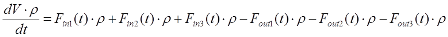  (4.6)

By simplifying expression (4.6) and applying the Euler method, we get:

            (4.7)

If the vessel is cylindrical or a parallelepiped, meaning the cross-sectional area does not change with height, then:

​                       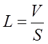                              (4.8)

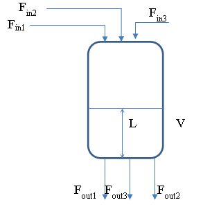

Fig. 4.17. Vessel with multiple inlets and outlets

If the vessel has an irregular shape, a volume-to-level conversion algorithm using a piecewise-linear function can be applied.

In any case, the volume of liquid in the vessel cannot exceed the vessel volume or fall below zero. Therefore, the simulation program must handle these boundary conditions.

To simulate the level with 3 inlets and 3 outlets, a DFB block can be created. For vessels with a constant cross-sectional area over height, the structure and program of the block can be as shown in Fig. 4.18. Instances of the *smLevelCyl* block should be called periodically, for example, using the *EN* parameter, which should be linked to a pulse of the specified periodicity for 1 cycle.

For real-time operation, the call periodicity should match the specified *d_t*. The *d_t* variable, also referred to as the ***time scale***, is of type *REAL* and is specified in seconds. For example, if a call periodicity of 500 ms is required, *d_t = 0.5* should be set. The *REAL* type is chosen to reduce the number of type conversions.

If the simulation process needs to be run in accelerated mode, the *d_t* parameter can be increased, indicating that the call periodicity is greater than the actual one. However, significantly increasing *d_t* may lead to reduced calculation accuracy.

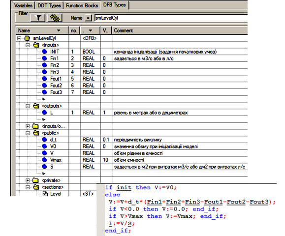

Fig. 4.18. DFB block for simulating the level in a vessel with an irregular shape

For vessels with an irregular shape, the DFB block will have a similar structure except for the level calculation (Fig. 4.19). To calculate the level, a *PWL_FN* type DFB block can be used, the operation of which is described in the example in section .6.1. In the *Private* section of the *smLevelFree* type *DFB*, an instance of *PWL* should be created. As input parameters for the *PWL* block, two arrays are specified: the coordinates of the volume points and the liquid level in the vessel. To allow these coordinates to be defined, they are exposed in the interface of the *smLevelFree* block.

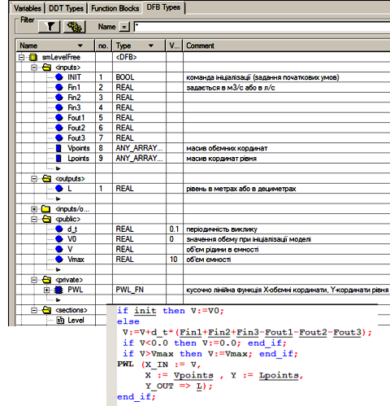

Fig. 4.19. DFB block for simulating the level in a vessel with variable cross-section over height

### Temperature Simulation in a Vessel

Temperature modeling is performed using heat balance calculations.

​                                          (4.10)

where 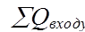 is the total heat supplied to the system, and 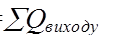 is the total heat removed from the system.

As an example, let us consider a cylindrical vessel with a heat exchange jacket supplied with a heating or cooling agent (Fig. 4.20). The simulation model will be created with the following assumptions:

- The vessel and the jacket are lumped parameter systems.
- The densities at the inlets and outlets of the jacket and vessel are the same.
- The apparatus has ideal thermal insulation, so heat losses to the environment are neglected.
- The heat capacity of the structure is small and thus neglected.
- The heat exchange area depends on the vessel's fill level.
- The jacket is always filled with liquid.

Assuming equal densities at the inlets and outlets of the jacket and vessel, and based on mass and heat balances, we can write:

​                    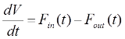                    (4.11)

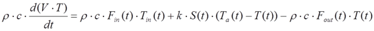 (4.12)

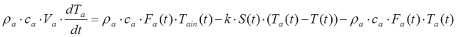 (4.13)

​                          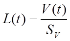                       (4.14)

​            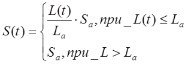                  (4.15)

Initial conditions:

​                  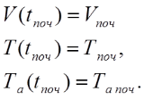                             (4.16)

Constraint: 

In equations (4.11)-(4.15), ,  represent the liquid volume in the vessel and jacket (m³);  the vessel volume;  the heating agent temperature at the inlet and in the jacket (°C); 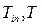 the liquid temperature at the inlet and inside the vessel (°C);  the inlet and outlet liquid flow rates in the vessel;  the heating agent flow rate;  the density of the heating agent and liquid in the vessel (kg/m³); *Ca*, *C* are the specific heat capacities of the heating agent and liquid in the vessel (kJ/(kg·K)); *k* is the heat transfer coefficient across the heat exchange surface (kW/(m²·°C)) with area *S* (m²); *Sa* is the heat exchange surface area under full immersion; *Sv* is the vessel cross-sectional area (m²).

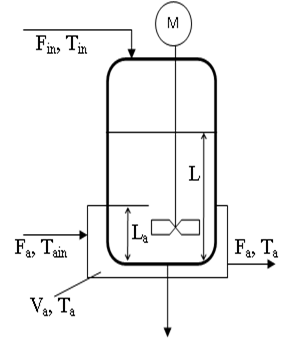

Fig. 4.20. Vessel with a heat exchange jacket

Let us rewrite (4.12) and (4.13) as:

​       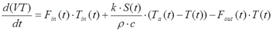         (4.17)

​      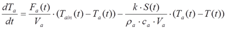          (4.18)

Using the Euler method, equation (4.17) becomes: 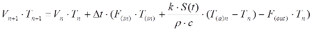    (4.19)

In (4.19) and further, flow indices are placed in parentheses to distinguish them from step numbers.

Equation (4.15) is analogous to (4.7):

​             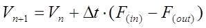                          (4.20)

Under the condition , equations (4.19) and (4.20) transform into:

​       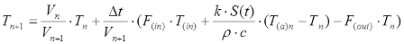      (4.21)

​     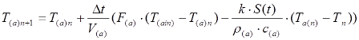       (4.22)

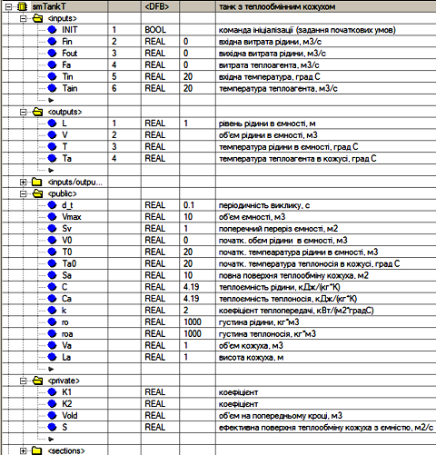

Fig. 4.21. DFB block for simulating temperature in a vessel with a jacket

Assuming that under , the outlet liquid temperature equals the inlet temperature, equations (4.21) and (4.22) become:

​                        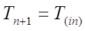                         (4.23)

​                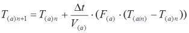           (4.24)

We assume that under , the vessel temperature does not depend on inlet and outlet flows, thus (4.21) becomes:

​            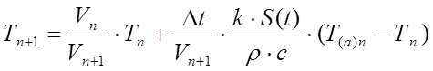                (4.25)

Temperature and level simulation in the vessel can be implemented using a DFB, with its structure shown in Fig. 4.21 and its program section in Fig. 4.22.

**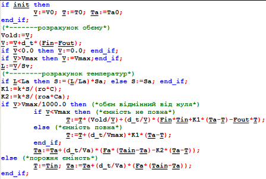**

Fig. 4.22. Program section of the DFB block

### Temperature Simulation in a Heat Exchanger

Similar to the previous case, the temperature in a heat exchanger can be simulated (Fig. 4.23).

The simulation model will be created with the following assumptions:

- The system is treated as a lumped parameter object.
- The densities at the inlets and outlets of the heat exchanger are the same.
- The apparatus has ideal thermal insulation, so heat losses to the environment are neglected.
- The heat capacity of the structure is small and thus neglected.
- The heat exchanger is always filled with liquid and heating agent.

For this object, equations (4.12) and (4.13) are slightly simplified, and the final system will appear as:

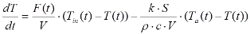          (4.26)

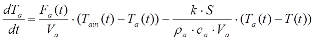      (4.27)

Initial conditions:

​                     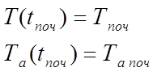                          (4.28)

In (4.26)–(4.28):

- *V*, *Va* – volume of liquid and heating agent in the heat exchanger (m³);
- *Tain*, *Ta* – inlet and internal heating agent temperatures (°C);
- *Tin*, *T* – inlet and internal liquid temperatures (°C);
- *F* – liquid flow rate through the heat exchanger;
- *Fa* – heating agent flow rate through the heat exchanger;
- $\rho_a, \rho$ – densities of the heating agent and liquid (kg/m³);
- *Ca*, *C* – specific heat capacities of the heating agent and liquid (kJ/(kg·K));
- *K* – heat transfer coefficient across the heat exchange surface (kW/(m²·°C)) with an area *S* (m²).

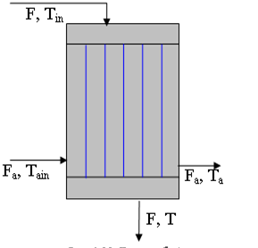

Fig. 4.23. Heat exchanger

Applying the Euler method, equations (4.26)–(4.27) become:

​          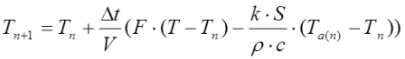            (4.29)

​      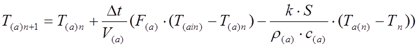       (4.30)

Temperature simulation in the heat exchanger can be implemented using a DFB, with its structure and program shown in Fig. 4.24.

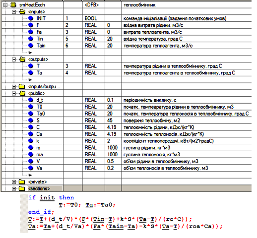

Fig. 4.24. DFB block for simulating temperature in a heat exchanger

### Implementation of a First-Order Aperiodic Link

If a control system is being developed for a plant for which dynamic mathematical models in operator form have been created, it can be quite easily converted into a PLC program. The equation describing a first-order system has the form:

​                 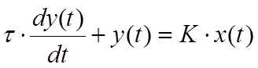                 (4.31)

or in operator form:

​                   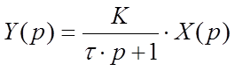                     (4.32)

where *X* is the input to the system, *Y* is the output of the system, *K* is the proportional gain of the system for the *X* channel, and *τ* is the time constant.

To implement a first-order aperiodic link in UNITY PRO, you can use the library functions *LAG_FILTER* (see section 6.6.4), *LAG*, and *LAG1* (from the *Obsolete Library*), which calculate using a modified Euler method. However, these algorithms have excess functionality, so you can implement your own DFB that calculates the output using the following formula:

​           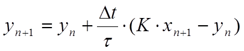                  (4.33)

We can rewrite formula (5.43) as:

​      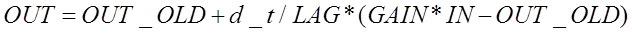        (4.34)

where *OUT* is the output of the system at step *n+1*, *OUT_OLD* is the output of the system at step *n*, *d_t* is the recalculation period *Δt*, *LAG* is the time constant *τ*, and *GAIN* is the system gain *K*. The notation used in (4.34) is commonly used in the documentation of PLC function blocks, so we will continue to use them.

Fig. 4.25 shows the implementation of the *smLAG* DFB block. Note that *OUT* is used instead of *OUT_OLD*. Considering that the output values of a function block are retained between calls, there is no need to use an additional variable.

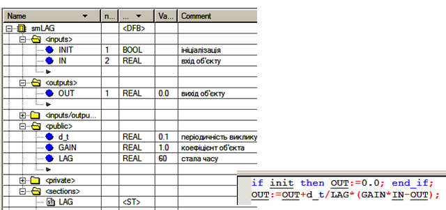

Fig. 4.25. DFB block for implementing a first-order aperiodic link

### Implementation of Transport Delay

For a system with pure (transport) delay, the output formula is written as:

​                   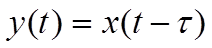                         (4.35)

In UNITY PRO, transport delay is implemented using the library block *DTIME* (see section 6.6.2). Here, we will implement a delay block using a custom DFB named *smDELAY* (Fig. 4.26).

The block’s algorithm is based on a *FIFO* type buffer implemented using the array *BUF*. Each new value is written to the top of the stack, i.e., to the 0th element of the array (*BUF[0] := IN*). To shift all other elements down, the procedure *ROL_ARREAL* is used, which additionally writes the last element of the array (in our case, the 99th) into the first element (0th).

Since the buffer is only needed for a time range of *DELAY* with a step of *d_t* seconds, the element with the index *last* := *DELAY/d_t* will contain the value that should be provided to the output. During block initialization, all elements of the array are set to 0 (*MOVE_REAL_ARREAL*).

When using this model, it is important to monitor the ratio *DELAY/d_t* – it should not exceed 99, which is the size limit of the *BUF* array. If the delay is very large, you will either need to increase the number of elements in the *BUF* array (which will increase resource usage) or increase the interval *d_t* (which will reduce accuracy).

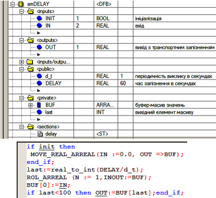

Fig. 4.26. DFB block for implementing transport delay

### Simulation of a Control Valve with Actuator

Pipeline valves can have various flow characteristics: relative stem/disc position versus relative flow rate. Fig. 4.27 shows three typical characteristics: equal-percentage, quick-opening, and linear. The x-axis represents the stem/disc movement as a fraction of maximum opening, while the y-axis represents the flow rate as a fraction of the maximum flow rate. All these valve characteristics can be approximately represented using the following dependencies:

​         Linear -  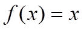                            (4.36)

Equal-percentage - 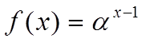                           (4.37)

where *α* is a correction coefficient (in Fig. 4.27, *α = 50*).

​    Quick-opening - 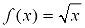                         (4.38)

In UNITY PRO, equation (4.38) is implemented using the *SQRT* function, while (4.37) is implemented using *EXPT_REAL*.

Fig. 4.27. Valve characteristics

The actuator type introduces its specifics into the control algorithm, and its behavior must also be considered when testing the program. It makes sense to develop a universal DFB block that simulates both the actuator and the control valve behavior. Thus, the simulation block should consider the following:

- account for the full travel time (opening) of the control valve with the given actuator under specific conditions;
- be controlled by two *BOOL* input signals: open/increase and close/decrease; if control is via a single signal, the inverse signal should be provided to the other input;
- support analog signal control, with an input signal in the *0–10000* range representing the positioner setpoint;
- provide outputs for sensors: stem/disc position (*0–10000*), “open” and “closed” position indicators;
- consider the valve characteristic type: linear, equal-percentage, quick-opening.

Considering these requirements, the DFB block may look like the one shown in Fig. 4.28.

Fig. 4.28. *smValve* DFB structure

Comments for all parameters and variables of the *smValve* block are shown in Fig. 4.28. The *Valve* section is implemented in FBD and consists of three networks: the first two are shown in Fig. 4.29, the third in Fig. 4.30.

Fig. 4.29. *smValve* DFB program section (part 1)

The control valve stem/disc position is stored in the block’s local variable *POS* (*0–100%*), which resets to 0 (fully closed) when the block is initialized (*INIT = TRUE*).

Regardless of whether the valve is controlled by discrete or analog signals, its position is determined by two control signals generated at the outputs of the *SEL* blocks: ".10" – close signal, ".11" – open signal. When the "open" signal is active, the *ADD* block ".2" increments the current position by the calculated step. When the "close" signal is active, the *SUB* block ".3" decrements the position by the step. The increment value for each *d_t* interval is calculated in block ".1" using the formula: *d_t* × 100 / *t_valve*.

The *SEL* blocks ".10" and ".11" generate control signals from the *cmdOPN* and *cmdCLS* inputs during discrete control mode (*APOS = FALSE*), so the "open" and "close" signals mirror the *cmdOPN* and *cmdCLS* commands. In analog control mode with a positioner (*APOS = TRUE*), signals are formed using the ".9" (>) and ".8" (<) comparators. If the scaled setpoint *cmdPOS* (scaled to *0–100%* by *MUL* ".6") is greater than the current *POS*, the open signal is generated; if it is less, the close signal is generated. The internal positioner operates with ±0.5% accuracy.

Fig. 4.30. *smValve* DFB program section (continued)

In the third FBD network (Fig. 4.30), the *POS* signal is limited to the *0–100%* range using *LIMIT* ".4" and processed to generate the *Kf* value and the position outputs *stOPN* (".19"), *stCLS* (".20"), and *stPOS* (".12", ".15", ".5"). The threshold values for the end-position outputs are set to *99.999* and *0.001*. The *MUX* block (".14") generates the flow coefficient *Kf* depending on the valve characteristic (*v_type*) by switching to the appropriate input.

