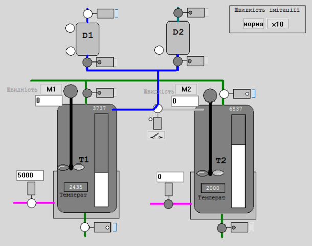

# Програма для імітації установки з дозаторами

## Загальний опис модельованої установки

Для створення і перевірки роботи бібліотечних блоків можна скористатися імітатором об'єкту, який можна розгортати на тому ж ПЛК, емуляторі ПЛК, де розгорнутий каркас або як стороннє ПЗ. Імітована установка має вигляд як на рис.1.   

рис.1. Зображення імітованої установки для перевірки роботи блоків PACFramework. 

Технологічна установка приготування складається з наступних елементів (рис.1):

1) танки Т1 та Т2, в яких готовляться продукти за різними рецептами; танки обв’язані наступними засобами КВПіА:

- запірні клапани набору та зливу, кожний з датчиками кінцевого положення "закритий" та "відкритий";
- регулюючий клапан (0-100%, на рис. показаний в одиницях ПЛК 0-10000) подачі теплоагента у теплообмінний кожух танку (далі по тексту клапан нагрівання);
- датчик рівня (0-100%, на рис. показаний в одиницях ПЛК 0-10000) в танку;
- датчик температури в танку (0-100°С, на рис. показаний в одиницях ПЛК 0-10000);
- мішалка 

2) дозатори (мірні ємності) D1 та D2, які забезпечують подачу дози компоненту; дозатори обв’язані наступними засобами КВПіА:

- сигналізатор нижнього і верхнього рівнів;

- запірні клапани набору та зливу, кожний з датчиками кінцевого положення "закритий";

3) 3-ходовий клапан перемикання трубопроводу подачі з дозаторів на танки T1 та T2; в нормальному стані положення "на Т1"; має датчики кінцевого положення "Т1" та "Т2".

## Загальні принципи імітаційного моделювання

Принципи моделювання, які тут використовуються описані в навчальному посібнику "Програмування промислових контролерів в середовищі Unity PRO", відповідний розділ також приведений [за цим посиланням](4_4_simul.md). У цьому розділі виділимо тільки вживані в цій моделі.

Параметр `d_t` - означує періодичність виклику для правильного розрахунку динаміки. Може використовуватися для зміни швидкості імітації. 

## Компоненти моделі

- [smLevelCyl - Ємність з одним входом і одним виходом](smLevelCyl.md)
- [smTankT - Ємність з одним входом і одним виходом та підігрівом](smTankT.md)
- [smValve - Клапан/заслінка](smValve.md)
- [smObject1 - Установка приготування](smObject1.md)

## Реалізація моделей на платформах

Є експортні варіанти проектів, реалізованих на різних платформах

- [Unity PRO/Control Expert (XEF)](../../platforms/unitypro/sim_wthout_framework.xef)
- [TIA Portal (SCL)]( ../../platforms/tiaportal/sim_wthout_framework.scl)

