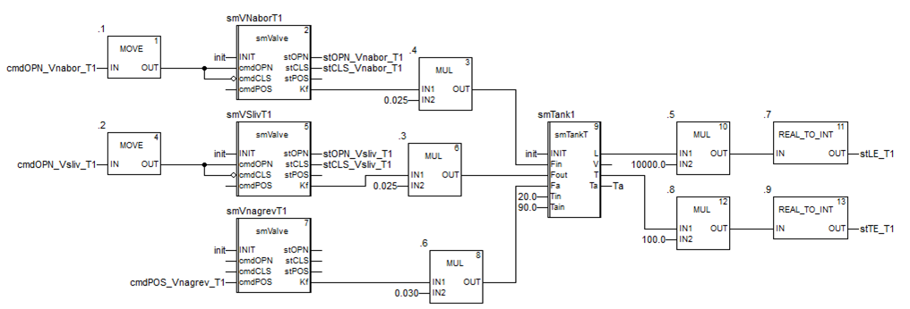
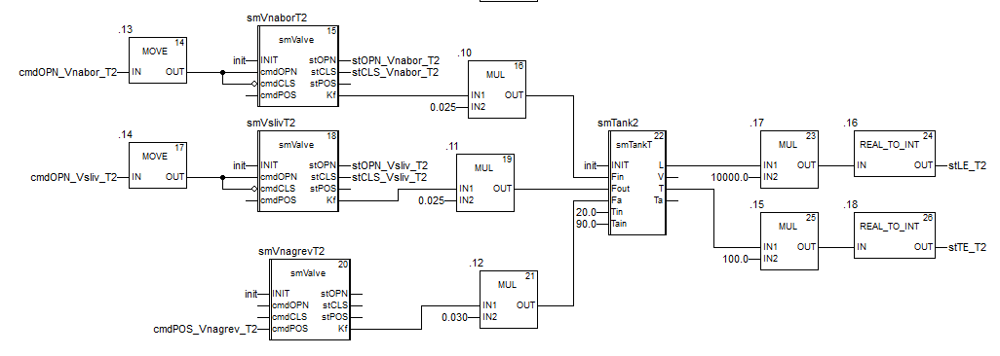
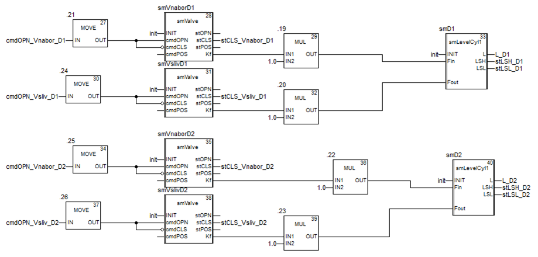
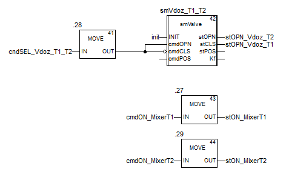
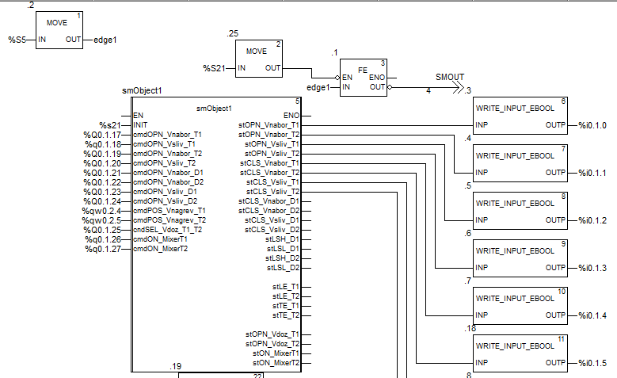
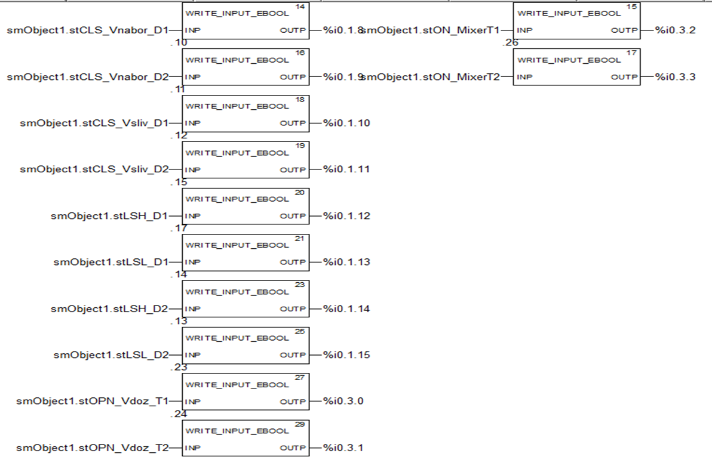
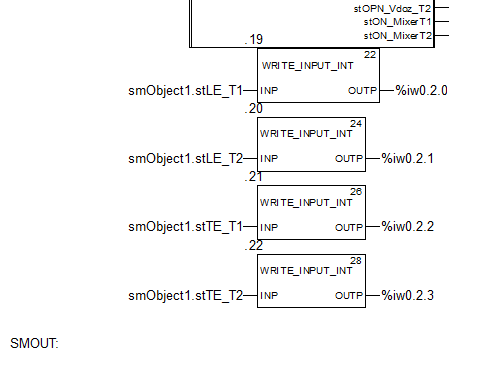

# Установка приготування (smObject1)

## Короткий опис та призначення

Функціональний блок який імітує роботу всієї установки (рис.1). Він включає в себе екзмепляри функціональних боків для всього устатковання (префікс `sm`) і забезпечує імітацію усіх датчиків (префікс `st`) на основі керуючих впливів (префікс `cmd`) . 


рис.1. Зображення імітованої установки для перевірки роботи блоків PACFramework. 

Детальний опис принципів імітації можна почитати [за цим посиланням](4_4_simul.md) 

## Реалізація блоку в IEC-61131 

### ST (TIA Portal)

```pascal
FUNCTION_BLOCK "smObject1"
   VAR_INPUT 
      INIT : Bool;   // ініціалізація
      cmdOPN_Vnabor_T1 : Bool;   // команда відкрити кл набору Т1
      cmdOPN_Vsliv_T1 : Bool;   // команда відкрити кл зливу Т1
      cmdOPN_Vnabor_T2 : Bool;   // команда відкрити кл набору Т2
      cmdOPN_Vsliv_T2 : Bool;   // команда відкрити кл зливу Т2
      cmdOPN_Vnabor_D1 : Bool;   // команда відкрити кл набору дозатору D1
      cmdOPN_Vnabor_D2 : Bool;   // команда відкрити кл набору дозатору D2
      cmdOPN_Vsliv_D1 : Bool;   // команда відкрити кл зливу дозатору D1
      cmdOPN_Vsliv_D2 : Bool;   // команда відкрити кл зливу дозатору D2
      cmdPOS_Vnagrev_T1 : Int;   // команда ступінь відкриття РО подачі теплоагента в Т1 
      cmdPOS_Vnagrev_T2 : Int;   // команда ступінь відкриття РО подачі теплоагента в Т2
      cndSEL_Vdoz_T1_T2 : Bool;   // TRUE команда перемкнути РО подачі дози на Т2, FALSE на T1
      cmdON_MixerT1 : Bool;   // ВКЛ мішалку
      cmdON_MixerT2 : Bool;   // ВКЛ мішалку
   END_VAR

   VAR_OUTPUT 
      stOPN_Vnabor_T1 : Bool;   // клапан набору Т1 відкритий 
      stOPN_Vnabor_T2 : Bool;   // клапан набору Т2 відкритий
      stOPN_Vsliv_T1 : Bool;   // клапан зливу Т1 відкритий
      stOPN_Vsliv_T2 : Bool;   // клапан зливу Т2 відкритий
      stCLS_Vnabor_T1 : Bool;   // клапан набору Т1 закритий
      stCLS_Vnabor_T2 : Bool;   // клапан набору Т2 закритий
      stCLS_Vsliv_T1 : Bool;   // клапан зливу Т1 закритий
      stCLS_Vsliv_T2 : Bool;   // клапан зливу Т2 закритий
      stCLS_Vnabor_D1 : Bool;   // клапан набору дозатору D1 закритий
      stCLS_Vnabor_D2 : Bool;   // клапан  набору дозатору D2 закритий
      stCLS_Vsliv_D1 : Bool;   // клапан зливу дозатору D1 закритий
      stCLS_Vsliv_D2 : Bool;   // клапан зливу дозатору D2 закритий
      stLSH_D1 : Bool;   // сигналізатор верхнього рівня дозатору D1
      stLSL_D1 : Bool;   // сигналізатор нижнього рівня дозатору D1
      stLSH_D2 : Bool;   // сигналізатор верхнього рівня дозатору D2
      stLSL_D2 : Bool;   // сигналізатор нижнього рівня дозатору D2
      stLE_T1 : Int;   // датчик рівня танка Т1
      stLE_T2 : Int;   // датчик рівня Т2
      stTE_T1 : Int;   // датчик температури Т1
      stTE_T2 : Int;   // датчик температури Т2
      stOPN_Vdoz_T1 : Bool;   // клапан дозування переключений на Т1
      stOPN_Vdoz_T2 : Bool;   // клапан дозування переключений на Т2
      stON_MixerT1 : Bool;   // мішалка включена
      stON_MixerT2 : Bool;   // мішалка відключена
   END_VAR

   VAR 
      smTank2: "smTankT";
      smD1 : "smLevelCyl1";
      smVnaborT2 : "smValve";
      smVslivT2 : "smValve";
      smVnaborD1 : "smValve";
      smVslivD1 : "smValve";
      smTank1 : "smTankT";
      smVNaborT1 : "smValve";
      smVSlivT1 : "smValve";
      smVnagrevT1 : "smValve";
      smVnagrevT2 : "smValve";
      smD2 : "smLevelCyl1";
      smVslivD2 : "smValve";
      smVnaborD2 : "smValve";
      smVdoz_T1_T2 : "smValve";
      Ta: Real;   // періодичність виклику, с
      L_D1 : Real;
      L_D2 : Real;
      d_t : Real := 0.1;
      meaprev : Bool;
   END_VAR


BEGIN
	(*викликається раз в 100 мс*)
	IF "Clock_10Hz" AND NOT meaprev OR INIT THEN
	    smTank1.d_t := d_t;
	    smVNaborT1.d_t := d_t;
	    smVSlivT1.d_t := d_t;
	    smVnagrevT1.d_t := d_t;
	    smTank2.d_t := d_t;
	    smVnaborT2.d_t := d_t;
	    smVslivT2.d_t := d_t;
	    smVnagrevT2.d_t := d_t;
	    smD1.d_t := d_t;
	    smVnaborD1.d_t := d_t;
	    smVslivD1.d_t := d_t;
	    smD2.d_t := d_t;
	    smVnaborD2.d_t := d_t;
	    smVslivD2.d_t := d_t;
	    smVdoz_T1_T2.d_t := d_t;
	    
	    smVNaborT1(INIT := INIT,
	                cmdOPN := cmdOPN_Vnabor_T1,
	                cmdCLS := NOT cmdOPN_Vnabor_T1);
	    smVSlivT1(INIT := INIT,
	               cmdOPN := cmdOPN_Vsliv_T1,
	               cmdCLS := NOT cmdOPN_Vsliv_T1);
	    smVnagrevT1(INIT := INIT,
	                 cmdPOS := cmdPOS_Vnagrev_T1);
	    smTank1(INIT := INIT,
	             Fin := smVNaborT1.Kf * 0.025,
	             Fout := smVSlivT1.Kf * 0.025,
	             Fa := smVnagrevT1.Kf * 0.035,
	             Tin := 20.0,
	             Tain := 90.0);
	    
	    smVnaborT2(INIT := INIT,
	                cmdOPN := cmdOPN_Vnabor_T2,
	                cmdCLS := NOT cmdOPN_Vnabor_T2);
	    smVslivT2(INIT := INIT,
	               cmdOPN := cmdOPN_Vsliv_T2,
	               cmdCLS := NOT cmdOPN_Vsliv_T2);
	    smVnagrevT2(INIT := INIT,
	                 cmdPOS := cmdPOS_Vnagrev_T2);
	    smTank2(INIT := INIT,
	             Fin := smVnaborT2.Kf * 0.025,
	             Fout := smVslivT2.Kf * 0.025,
	             Fa := smVnagrevT2.Kf * 0.035,
	             Tin := 20.0,
	             Tain := 90.0);
	    
	    smVNaborT1(INIT := INIT,
	                cmdOPN := cmdOPN_Vnabor_D1,
	                cmdCLS := NOT cmdOPN_Vnabor_D1);
	    smVslivD1(INIT := INIT,
	               cmdOPN := cmdOPN_Vsliv_D1,
	               cmdCLS := NOT cmdOPN_Vsliv_D1);
	    smD1(INIT := INIT,
	          Fin := smVNaborT1.Kf * 1.0,
	          Fout := smVslivD1.Kf * 1.0,
	          L => L_D1);
	    
	    smVnaborT2(INIT := INIT,
	                cmdOPN := cmdOPN_Vnabor_D2,
	                cmdCLS := NOT cmdOPN_Vnabor_D2);
	    smVslivD2(INIT := INIT,
	               cmdOPN := cmdOPN_Vsliv_D2,
	               cmdCLS := NOT cmdOPN_Vsliv_D2);
	    smD2(INIT := INIT,
	          Fin := smVnaborT2.Kf * 1.0,
	          Fout := smVslivD2.Kf * 1.0,
	          L => L_D2);
	    
	    smVdoz_T1_T2(INIT := INIT,
	                  cmdOPN := cndSEL_Vdoz_T1_T2,
	                  cmdCLS := NOT cndSEL_Vdoz_T1_T2);
	END_IF;
	
	stOPN_Vnabor_T1 := smVNaborT1.stOPN;
	stCLS_Vnabor_T1 := smVNaborT1.stCLS;
	stOPN_Vnabor_T2 := smVnaborT2.stOPN;
	stCLS_Vnabor_T2 := smVnaborT2.stCLS;
	stOPN_Vsliv_T1 := smVSlivT1.stOPN;
	stCLS_Vsliv_T1 := smVSlivT1.stCLS;
	stOPN_Vsliv_T2 := smVslivT2.stOPN;
	stCLS_Vsliv_T2 := smVslivT2.stCLS;
	stLE_T1 := REAL_TO_INT(smTank1.L * 10000.0);
	stTE_T1 := REAL_TO_INT(smTank1.T * 100.0);
	stLE_T2 := REAL_TO_INT(smTank2.L * 10000.0);
	stTE_T2 := REAL_TO_INT(smTank2.T * 100.0);
	Ta := smTank1.T;
	Ta := smTank2.T;
	stON_MixerT1 := cmdON_MixerT1;
	stON_MixerT2 := cmdON_MixerT2;
	stLSH_D1 := smD1.LSH;
	stLSL_D1 := smD1.LSL;
	stLSH_D2 := smD2.LSH;
	stLSL_D2 := smD2.LSL;
	stOPN_Vdoz_T2 := smVdoz_T1_T2.stOPN;
	stOPN_Vdoz_T1 := smVdoz_T1_T2.stCLS;
	
	meaprev := "Clock_10Hz";
	
END_FUNCTION_BLOCK
```

### FBD (UNITY PRO)









```pascal
(* цей блок на ST повинен викликатися в тому ж ФБ*)
smTank1.d_t:=d_t;
smVNaborT1.d_t:=d_t;
smVSlivT1.d_t:=d_t;
smVnagrevT1.d_t:=d_t;

smTank2.d_t:=d_t;
smVNaborT2.d_t:=d_t;
smVSlivT2.d_t:=d_t;
smVnagrevT2.d_t:=d_t;

smD1.d_t:=d_t;
smVnaborD1.d_t:=d_t;
smVslivD1.d_t:=d_t;

smD2.d_t:=d_t;
smVnaborD2.d_t:=d_t;
smVslivD2.d_t:=d_t;

smVdoz_T1_T2.d_t:=d_t;
```

## Приклади реалізації виклику екземпляру 

Для імітації установки створюється екземпляр блоку та викликається з передачею входів/виходів. 

### ST

```pascal
IF "FirstScan" THEN
    #init := true;
ELSE
    #init := FALSE;
END_IF;
"smObject1_DB"(INIT:=#init,
               cmdOPN_Vnabor_T1:= "Dq1",
               cmdOPN_Vsliv_T1:="Dq2",
               cmdOPN_Vnabor_T2:="Dq3",
               cmdOPN_Vsliv_T2:="Dq4",
               cmdOPN_Vnabor_D1:="Dq5",
               cmdOPN_Vnabor_D2:="Dq6",
               cmdOPN_Vsliv_D1:="Dq7",
               cmdOPN_Vsliv_D2:="Dq8",
               cmdPOS_Vnagrev_T1:="AO1",
               cmdPOS_Vnagrev_T2:="AO2",
               cndSEL_Vdoz_T1_T2:="Dq9",
               cmdON_MixerT1:="Dq10",
               cmdON_MixerT2:="Dq11",
               stOPN_Vnabor_T1=>"Di1",
               stOPN_Vnabor_T2=>"Di2",
               stOPN_Vsliv_T1=>"Di3",
               stOPN_Vsliv_T2=>"Di4",
               stCLS_Vnabor_T1=>"Di5",
               stCLS_Vnabor_T2=>"Di6",
               stCLS_Vsliv_T1=>"Di7",
               stCLS_Vsliv_T2=>"Di8",
               stCLS_Vnabor_D1=>"Di9",
               stCLS_Vnabor_D2=>"Di10",
               stCLS_Vsliv_D1=>"Di11",
               stCLS_Vsliv_D2=>"Di12",
               stLSH_D1=>"Di13",
               stLSL_D1=>"Di14",
               stLSH_D2=>"Di15",
               stLSL_D2=>"Di16",
               stLE_T1=>"AI1",
               stLE_T2=>"AI2",
               stTE_T1=>"AI3",
               stTE_T2=>"AI4",
               stOPN_Vdoz_T1=>"Di17",
               stOPN_Vdoz_T2=>"Di18",
               stON_MixerT1=>"Di19",
               stON_MixerT2=>"Di20");

#init := false;
```

### FBD (Unity PRO)







