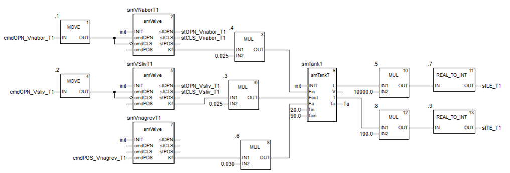
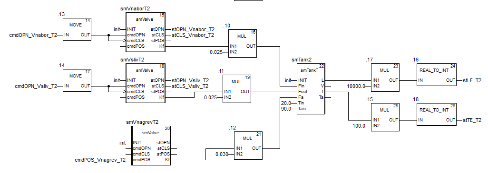
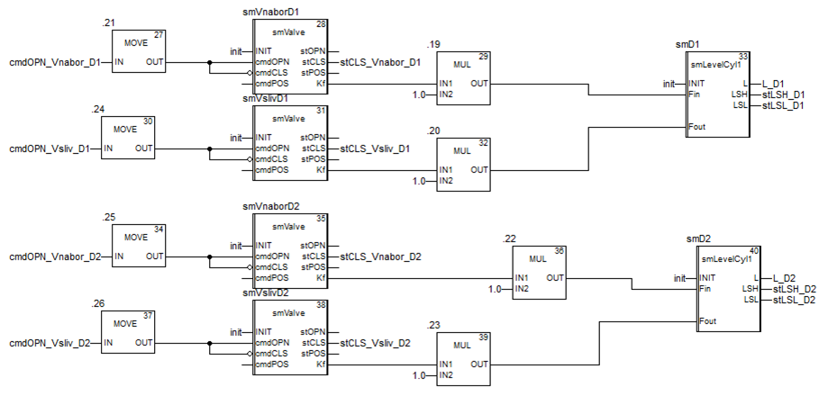
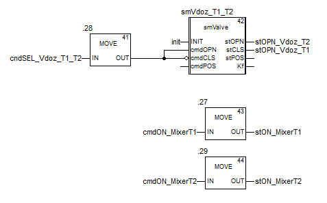
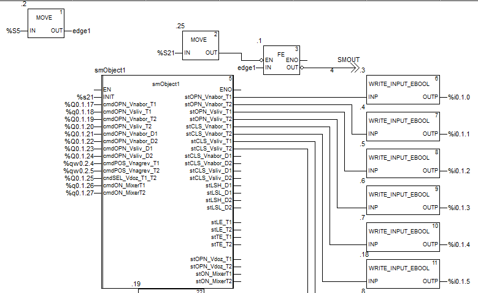
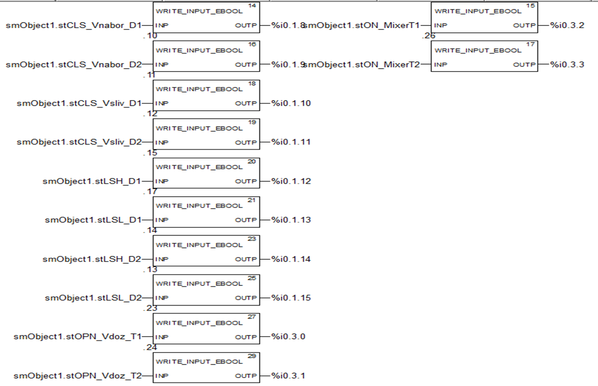
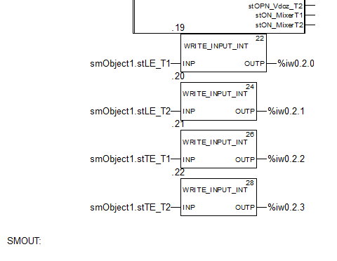

# Preparation Installation (smObject1)

## Brief Description and Purpose

A function block that simulates the operation of the entire installation (Fig. 1). It includes instances of function blocks for all equipment (prefix `sm`) and provides simulation of all sensors (prefix `st`) based on control actions (prefix `cmd`).


Fig. 1. Image of the simulated installation for testing PACFramework blocks.

A detailed description of the simulation principles can be found at [this link](4_4_simul_EN.md) .

## Block Implementation in IEC-61131

### ST (TIA Portal)

```pascal
FUNCTION_BLOCK "smObject1"

   VAR_INPUT 
      INIT : Bool;   // initialization
      cmdOPN_Vnabor_T1 : Bool;   // command to open inlet valve for T1
      cmdOPN_Vsliv_T1 : Bool;    // command to open outlet valve for T1
      cmdOPN_Vnabor_T2 : Bool;   // command to open inlet valve for T2
      cmdOPN_Vsliv_T2 : Bool;    // command to open outlet valve for T2
      cmdOPN_Vnabor_D1 : Bool;   // command to open inlet valve for dosing vessel D1
      cmdOPN_Vnabor_D2 : Bool;   // command to open inlet valve for dosing vessel D2
      cmdOPN_Vsliv_D1 : Bool;    // command to open outlet valve for dosing vessel D1
      cmdOPN_Vsliv_D2 : Bool;    // command to open outlet valve for dosing vessel D2
      cmdPOS_Vnagrev_T1 : Int;   // setpoint for heating control valve for T1
      cmdPOS_Vnagrev_T2 : Int;   // setpoint for heating control valve for T2
      cndSEL_Vdoz_T1_T2 : Bool;  // TRUE: switch dosing valve to T2, FALSE: to T1
      cmdON_MixerT1 : Bool;      // turn on mixer T1
      cmdON_MixerT2 : Bool;      // turn on mixer T2
   END_VAR

   VAR_OUTPUT 
      stOPN_Vnabor_T1 : Bool;    // T1 inlet valve open
      stOPN_Vnabor_T2 : Bool;    // T2 inlet valve open
      stOPN_Vsliv_T1 : Bool;     // T1 outlet valve open
      stOPN_Vsliv_T2 : Bool;     // T2 outlet valve open
      stCLS_Vnabor_T1 : Bool;    // T1 inlet valve closed
      stCLS_Vnabor_T2 : Bool;    // T2 inlet valve closed
      stCLS_Vsliv_T1 : Bool;     // T1 outlet valve closed
      stCLS_Vsliv_T2 : Bool;     // T2 outlet valve closed
      stCLS_Vnabor_D1 : Bool;    // D1 inlet valve closed
      stCLS_Vnabor_D2 : Bool;    // D2 inlet valve closed
      stCLS_Vsliv_D1 : Bool;     // D1 outlet valve closed
      stCLS_Vsliv_D2 : Bool;     // D2 outlet valve closed
      stLSH_D1 : Bool;           // D1 high-level sensor
      stLSL_D1 : Bool;           // D1 low-level sensor
      stLSH_D2 : Bool;           // D2 high-level sensor
      stLSL_D2 : Bool;           // D2 low-level sensor
      stLE_T1 : Int;             // T1 level sensor
      stLE_T2 : Int;             // T2 level sensor
      stTE_T1 : Int;             // T1 temperature sensor
      stTE_T2 : Int;             // T2 temperature sensor
      stOPN_Vdoz_T1 : Bool;      // dosing valve switched to T1
      stOPN_Vdoz_T2 : Bool;      // dosing valve switched to T2
      stON_MixerT1 : Bool;       // mixer T1 on
      stON_MixerT2 : Bool;       // mixer T2 on
   END_VAR

   VAR 
      smTank2: "smTankT";
      smD1 : "smLevelCyl1";
      smVnaborT2 : "smValve";
      smVslivT2 : "smValve";
      smVnaborD1 : "smValve";
      smVslivD1 : "smValve";
      smTank1 : "smTankT";
      smVNaborT1 : "smValve";
      smVSlivT1 : "smValve";
      smVnagrevT1 : "smValve";
      smVnagrevT2 : "smValve";
      smD2 : "smLevelCyl1";
      smVslivD2 : "smValve";
      smVnaborD2 : "smValve";
      smVdoz_T1_T2 : "smValve";
      Ta: Real;               // call period, s
      L_D1 : Real;
      L_D2 : Real;
      d_t : Real := 0.1;
      meaprev : Bool;
   END_VAR

BEGIN
    (* called once every 100 ms *)
    IF "Clock_10Hz" AND NOT meaprev OR INIT THEN

        (* set call periods for all sm blocks *)
        smTank1.d_t := d_t;
        smVNaborT1.d_t := d_t;
        smVSlivT1.d_t := d_t;
        smVnagrevT1.d_t := d_t;
        smTank2.d_t := d_t;
        smVnaborT2.d_t := d_t;
        smVslivT2.d_t := d_t;
        smVnagrevT2.d_t := d_t;
        smD1.d_t := d_t;
        smVnaborD1.d_t := d_t;
        smVslivD1.d_t := d_t;
        smD2.d_t := d_t;
        smVnaborD2.d_t := d_t;
        smVslivD2.d_t := d_t;
        smVdoz_T1_T2.d_t := d_t;

        (* T1 *)
        smVNaborT1(INIT := INIT, cmdOPN := cmdOPN_Vnabor_T1, cmdCLS := NOT cmdOPN_Vnabor_T1);
        smVSlivT1(INIT := INIT, cmdOPN := cmdOPN_Vsliv_T1, cmdCLS := NOT cmdOPN_Vsliv_T1);
        smVnagrevT1(INIT := INIT, cmdPOS := cmdPOS_Vnagrev_T1);
        smTank1(INIT := INIT,
                Fin := smVNaborT1.Kf * 0.025,
                Fout := smVSlivT1.Kf * 0.025,
                Fa := smVnagrevT1.Kf * 0.035,
                Tin := 20.0,
                Tain := 90.0);

        (* T2 *)
        smVnaborT2(INIT := INIT, cmdOPN := cmdOPN_Vnabor_T2, cmdCLS := NOT cmdOPN_Vnabor_T2);
        smVslivT2(INIT := INIT, cmdOPN := cmdOPN_Vsliv_T2, cmdCLS := NOT cmdOPN_Vsliv_T2);
        smVnagrevT2(INIT := INIT, cmdPOS := cmdPOS_Vnagrev_T2);
        smTank2(INIT := INIT,
                Fin := smVnaborT2.Kf * 0.025,
                Fout := smVslivT2.Kf * 0.025,
                Fa := smVnagrevT2.Kf * 0.035,
                Tin := 20.0,
                Tain := 90.0);

        (* D1 *)
        smVnaborD1(INIT := INIT, cmdOPN := cmdOPN_Vnabor_D1, cmdCLS := NOT cmdOPN_Vnabor_D1);
        smVslivD1(INIT := INIT, cmdOPN := cmdOPN_Vsliv_D1, cmdCLS := NOT cmdOPN_Vsliv_D1);
        smD1(INIT := INIT,
             Fin := smVnaborD1.Kf * 1.0,
             Fout := smVslivD1.Kf * 1.0,
             L => L_D1);

        (* D2 *)
        smVnaborD2(INIT := INIT, cmdOPN := cmdOPN_Vnabor_D2, cmdCLS := NOT cmdOPN_Vnabor_D2);
        smVslivD2(INIT := INIT, cmdOPN := cmdOPN_Vsliv_D2, cmdCLS := NOT cmdOPN_Vsliv_D2);
        smD2(INIT := INIT,
             Fin := smVnaborD2.Kf * 1.0,
             Fout := smVslivD2.Kf * 1.0,
             L => L_D2);

        (* Dosing valve T1/T2 *)
        smVdoz_T1_T2(INIT := INIT,
                     cmdOPN := cndSEL_Vdoz_T1_T2,
                     cmdCLS := NOT cndSEL_Vdoz_T1_T2);
    END_IF;

    (* outputs *)
    stOPN_Vnabor_T1 := smVNaborT1.stOPN;
    stCLS_Vnabor_T1 := smVNaborT1.stCLS;
    stOPN_Vnabor_T2 := smVnaborT2.stOPN;
    stCLS_Vnabor_T2 := smVnaborT2.stCLS;
    stOPN_Vsliv_T1 := smVSlivT1.stOPN;
    stCLS_Vsliv_T1 := smVSlivT1.stCLS;
    stOPN_Vsliv_T2 := smVslivT2.stOPN;
    stCLS_Vsliv_T2 := smVslivT2.stCLS;
    stLE_T1 := REAL_TO_INT(smTank1.L * 10000.0);
    stTE_T1 := REAL_TO_INT(smTank1.T * 100.0);
    stLE_T2 := REAL_TO_INT(smTank2.L * 10000.0);
    stTE_T2 := REAL_TO_INT(smTank2.T * 100.0);
    Ta := smTank1.T; (* or last measured *)
    Ta := smTank2.T;
    stON_MixerT1 := cmdON_MixerT1;
    stON_MixerT2 := cmdON_MixerT2;
    stLSH_D1 := smD1.LSH;
    stLSL_D1 := smD1.LSL;
    stLSH_D2 := smD2.LSH;
    stLSL_D2 := smD2.LSL;
    stOPN_Vdoz_T2 := smVdoz_T1_T2.stOPN;
    stOPN_Vdoz_T1 := smVdoz_T1_T2.stCLS;

    meaprev := "Clock_10Hz";

END_FUNCTION_BLOCK
```

### FBD (UNITY PRO)









```pascal
(* this ST block must be called within the same FB *)
smTank1.d_t:=d_t;
smVNaborT1.d_t:=d_t;
smVSlivT1.d_t:=d_t;
smVnagrevT1.d_t:=d_t;

smTank2.d_t:=d_t;
smVNaborT2.d_t:=d_t;
smVSlivT2.d_t:=d_t;
smVnagrevT2.d_t:=d_t;

smD1.d_t:=d_t;
smVnaborD1.d_t:=d_t;
smVslivD1.d_t:=d_t;

smD2.d_t:=d_t;
smVnaborD2.d_t:=d_t;
smVslivD2.d_t:=d_t;

smVdoz_T1_T2.d_t:=d_t;
```

## Example of Instance Call Implementation

To simulate the installation, an instance of the block is created and called with input/output mappings.

### ST

```pascal
IF "FirstScan" THEN
    #init := true;
ELSE
    #init := FALSE;
END_IF;
"smObject1_DB"(INIT:=#init,
               cmdOPN_Vnabor_T1:= "Dq1",
               cmdOPN_Vsliv_T1:="Dq2",
               cmdOPN_Vnabor_T2:="Dq3",
               cmdOPN_Vsliv_T2:="Dq4",
               cmdOPN_Vnabor_D1:="Dq5",
               cmdOPN_Vnabor_D2:="Dq6",
               cmdOPN_Vsliv_D1:="Dq7",
               cmdOPN_Vsliv_D2:="Dq8",
               cmdPOS_Vnagrev_T1:="AO1",
               cmdPOS_Vnagrev_T2:="AO2",
               cndSEL_Vdoz_T1_T2:="Dq9",
               cmdON_MixerT1:="Dq10",
               cmdON_MixerT2:="Dq11",
               stOPN_Vnabor_T1=>"Di1",
               stOPN_Vnabor_T2=>"Di2",
               stOPN_Vsliv_T1=>"Di3",
               stOPN_Vsliv_T2=>"Di4",
               stCLS_Vnabor_T1=>"Di5",
               stCLS_Vnabor_T2=>"Di6",
               stCLS_Vsliv_T1=>"Di7",
               stCLS_Vsliv_T2=>"Di8",
               stCLS_Vnabor_D1=>"Di9",
               stCLS_Vnabor_D2=>"Di10",
               stCLS_Vsliv_D1=>"Di11",
               stCLS_Vsliv_D2=>"Di12",
               stLSH_D1=>"Di13",
               stLSL_D1=>"Di14",
               stLSH_D2=>"Di15",
               stLSL_D2=>"Di16",
               stLE_T1=>"AI1",
               stLE_T2=>"AI2",
               stTE_T1=>"AI3",
               stTE_T2=>"AI4",
               stOPN_Vdoz_T1=>"Di17",
               stOPN_Vdoz_T2=>"Di18",
               stON_MixerT1=>"Di19",
               stON_MixerT2=>"Di20");

#init := false;
```

### FBD (Unity PRO)







